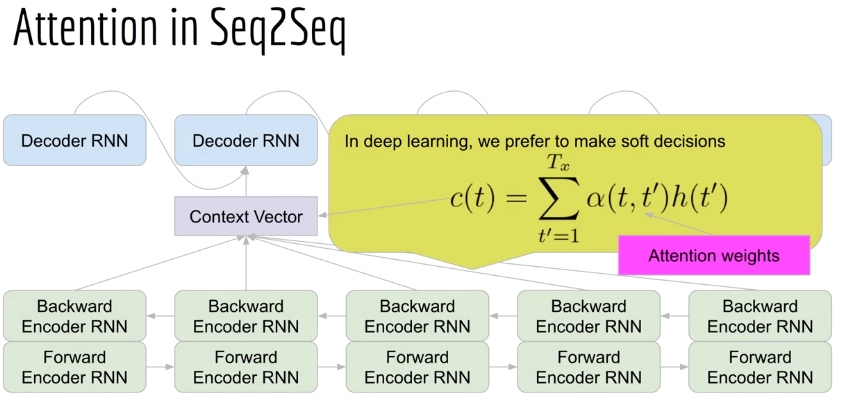

## Title: Data Science: Transformers for Natural Language Processing
- By Lazyprogrammer.me

## Welcome

1. Introduction
2. Outline

## Geting Setup

3. Where to get the code and data - instant access
- colab notebook: https://deeplearningcourses.com/notebooks/_j335VY5pKEEWmluSiccog
- https://github.com/lazyprogrammer/machine_learning_examples

4. How to use Github & Extra coding tips (optional)
5. Are you beginner, intermediate, or advanced? All are OK!

## Beginner's Corner

6. Beginner's Corner Section Introduction
- Sentiment analysis
- Embeddings and nearest neighbor search
- Named entity recognition (many-to-many)
- Text generation (autoregrssive)
- Masked language model (article spinning)
- Text summarization (sequence-to-sequence)
- Language translation
- Question answering
- Zero-shot classification
  - Classify text given an arbitrary set of labels

7. From RNNs to Attention and Transformers - Intuition
- The attention mechanism allows neural networks to learn very long-range dependencies in sequences
  - Longer range than LSTM
  - Attention was created for RNN but transformers use attention only, while doing away with the recurrent part
- Transformers are big and slow
  - But computationa can be done in parallel
    - Unlike RNN, which does sequentially
- Types of tasks
  - Many to one: ex) spam detection
  - Many to many: ex) speech tagging
- More tasks
  - None of above mentioned tasks
  - Like language translation
  - Problem
    - Input sequence length != target sequence length
    - Sequence rule may break (adjective may come later)
  - Solution
    - Seq2Seq
      - Encoder digests input, compressing the input
      - Decoder decompression data from encoder
      - Attention in Seq2Seq
        - For each OUTPUT token, we want to know which INPUT tokens to pay attention to
        - Encoder is bi-directional
        - Decoder is uni-directional
        - Context vector: input to decoder



      - Interpreting Attention weights
        - Indexed by t and t' = \alpha(t,t')
        - There are Tx*Ty weights
        - Larget weight at location (t,t') means that output t was dependent on input t'
    - Attention is All You Need
      - Get rid of RNN, keeps attention
        - RNN is slow and sequentional
      - Now can be parallelized
      - RNN has an issue of vanishing gradients
      - With attention, very long sequences can be handled, and every input is connected to every output
        - Computing cost is N^2

8. Sentiment Analysis
- Negative, neutral, positive
- Classification task
- Bag of words can work good
  - But ordering and word relationships are lost
- Hugging Face pipeline
```py
from transformers import pipeline
classifier = pipeline("sentiment-analysis") # loading a pretrained model
classsifier("this is a good movie") #=> label will be printed. List of multiple sentences can be used
```

9. Sentiment Analysis in Python
```py
!pip install transformers
# https://www.kaggle.com/crowdflower/twitter-airline-sentiment
!wget -nc https://lazyprogrammer.me/course_files/AirlineTweets.csv
from transformers import pipeline
import numpy as np
import pandas as pd
import seaborn as sn
import matplotlib.pyplot as plt
from sklearn.metrics import roc_auc_score, f1_score, confusion_matrix
# Basic usage
classifier = pipeline("sentiment-analysis")
# Will download a model if not exists yet
type(classifier)
# Output is a dictionary
classifier("This is such a great movie!")
# Multiple inputs passed in as a list
classifier([
  "This course is just what I needed.",
  "I can't understand any of this. Instructor kept telling me to meet the \
    prerequisites. What are prerequisites? Why does he keep saying that?"
])
import torch
torch.cuda.is_available()
# Use the GPU
classifier = pipeline("sentiment-analysis", device=0) 
# when gpu device is 0
df_ = pd.read_csv('AirlineTweets.csv')
# it has predefined labels but we use pre-trained model anyway
df = df_[['airline_sentiment', 'text']].copy()
df['airline_sentiment'].hist()
df = df[df.airline_sentiment != 'neutral'].copy()
target_map = {'positive': 1, 'negative': 0}
df['target'] = df['airline_sentiment'].map(target_map)
texts = df['text'].tolist()
predictions = classifier(texts) # may take > 2min. Note that this is prediction, not training
probs = [d['score'] if d['label'].startswith('P') else 1 - d['score'] \
         for d in predictions]
preds = [1 if d['label'].startswith('P') else 0 for d in predictions]
preds = np.array(preds)
print("acc:", np.mean(df['target'] == preds))
cm = confusion_matrix(df['target'], preds, normalize='true')
cm
# Scikit-Learn is transitioning to V1 but it's not available on Colab
# The changes modify how confusion matrices are plotted
def plot_cm(cm):
  classes = ['negative', 'positive']
  df_cm = pd.DataFrame(cm, index=classes, columns=classes)
  ax = sn.heatmap(df_cm, annot=True, fmt='g')
  ax.set_xlabel("Predicted")
  ax.set_ylabel("Target")
plot_cm(cm)
f1_score(df['target'], preds)
f1_score(1 - df['target'], 1 - preds)
roc_auc_score(df['target'], probs)
roc_auc_score(1 - df['target'], 1 - np.array(probs))
```

10. Text Generation
- How to predict future
  - Autoregressive time series: predicts next value using past values (ARIMA)
  - Autoregressive language model: language is a time series of categorical objects
    - Markov model
- History of language models
  - Markov assumption: x(t+1) depends only on x(t), x(t) only  on x(t-1), ...
  - Markov models are not scalable O(V^N)
- Use of autoregressive language models
  - Generates poetry
  - Use cases: writing emails/creative writing, github copilot
  - Code preparation
  ```py
  from transformers import pipeline
  gen = pipeline("text-generation") # uses GPT-2
  prompt = "Neural networks with attention have been used with great success"
  get(prompt)
  ```

11. Text Generation in Python
```py
!wget -nc https://raw.githubusercontent.com/lazyprogrammer/machine_learning_examples/master/hmm_class/robert_frost.txt
!pip install transformers
from transformers import pipeline, set_seed
import textwrap
import numpy as np
import matplotlib.pyplot as plt
from pprint import pprint
lines = [line.rstrip() for line in open('robert_frost.txt')]
lines = [line for line in lines if len(line) > 0] # removing empty lines
gen = pipeline("text-generation") # will use gpt2 and may download a new model
set_seed(1234)
lines[0]
gen(lines[0])
pprint(_) # pretty print
pprint(gen(lines[0], max_length=20))
pprint(gen(lines[0], num_return_sequences=3, max_length=20))
def wrap(x):
  return textwrap.fill(x, replace_whitespace=False, fix_sentence_endings=True)
out = gen(lines[0], max_length=30)
print(wrap(out[0]['generated_text']))
prev = 'Two roads diverged in a yellow wood, including one that blocked the' + \
  ' road leading to another intersection in the middle of the city.'
out = gen(prev + '\n' + lines[2], max_length=60)
print(wrap(out[0]['generated_text']))
prev = 'Two roads diverged in a yellow wood, including one that blocked the' + \
  ' road leading to another intersection in the middle of the city.\n' + \
  'And be one traveler, long I stood in front of the burning wreckage. ' + \
  'That\'s what I had written on Twitter a few minutes ago.'
out = gen(prev + '\n' + lines[4], max_length=90)
print(wrap(out[0]['generated_text']))
# Exercise: think of ways you'd apply GPT-2 and text generation in the real
# world and as a business / startup.
# This model is not trained for poem anyway
prompt = "Neural networks with attention have been used with great success"  + \
  " in natural language processing."
out = gen(prompt, max_length=300)
print(wrap(out[0]['generated_text']))
```
- Results don't make sense but are quite readable
- Try bakery, coffee, waffle, and so on

12. Masked Language Modeling (Article Spinner)
- Similar to autoregressive but also incoming texts affect as well
  - Bi-directions
- Text generation pipeline or autoregressive language model is done by GPT
- Masked language modeling is done by BERT
  - Bidirectional Encoder Representations from Transformers
- Article spinning
  - SEO = techniques to improve search engine rankings
  - Creates contents which users want
  - Article spinning: changes words which are appropriate, avoiding plagiarism
- Code preparation
```py
from transformers import pipeline
mlm = pipeline("fill-mask")
mlm("The cat <mask> over the box")
```
- Autoencoding language model
  - Neural nets trying to reproduce their input
  - Recommender systems, pretraining
  - Denoising autoencoder

13. Masked Lanauage Modeling (Article Spinner) in Python
```py
# https://www.kaggle.com/shivamkushwaha/bbc-full-text-document-classification
!wget -nc https://lazyprogrammer.me/course_files/nlp/bbc_text_cls.csv
!pip install transformers
import numpy as np
import pandas as pd
import textwrap
from pprint import pprint
from transformers import pipeline
df = pd.read_csv('bbc_text_cls.csv')
labels = set(df['labels'])
labels
# Pick a label
label = 'business'
texts = df[df['labels'] == label]['text']
texts.head()
np.random.seed(1234)
i = np.random.choice(texts.shape[0])
doc = texts.iloc[i]
print(textwrap.fill(doc, replace_whitespace=False, fix_sentence_endings=True))
mlm = pipeline('fill-mask')
mlm('Bombardier chief to leave <mask>')
text = 'Shares in <mask> and plane-making ' + \
  'giant Bombardier have fallen to a 10-year low following the departure ' + \
  'of its chief executive and two members of the board.'
mlm(text)
```

14. Named Entity Recognition (NER)
- Identify people, places, and companies in the documents
- Parts of speech tagging (many-to-many)
- Data is highly imbalanced (mostly tagged as 'O')
- IOB format
  - B-PER (Beginning of a person chunk)
  - I-PER (Inside of a person chunk)
  - O (Outside)
```py
from transformers import pipeline
ner = pipeline("ner", aggregation_strategy='simple', device=0)
```

15. Named Entity Recognition (NER) in Python
```py
!pip install transformers
from transformers import pipeline
ner = pipeline("ner", aggregation_strategy='simple', device=0)
import pickle
!wget -nc https://lazyprogrammer.me/course_files/nlp/ner_train.pkl
!wget -nc https://lazyprogrammer.me/course_files/nlp/ner_test.pkl
with open('ner_train.pkl', 'rb') as f:
  corpus_train = pickle.load(f)
with open('ner_test.pkl', 'rb') as f:
  corpus_test = pickle.load(f)
corpus_test
inputs = []
targets = []
for sentence_tag_pairs in corpus_test:
  tokens = []
  target = []
  for token, tag in sentence_tag_pairs:
    tokens.append(token)
    target.append(tag)
  inputs.append(tokens)
  targets.append(target)
from nltk.tokenize.treebank import TreebankWordDetokenizer
detokenizer = TreebankWordDetokenizer()
detokenizer.detokenize(inputs[9])
ner(detokenizer.detokenize(inputs[9]))
def compute_prediction(tokens, input_, ner_result):
  # map hugging face ner result to list of tags for later performance assessment
  # tokens is the original tokenized sentence
  # input_ is the detokenized string
  predicted_tags = []
  state = 'O' # keep track of state, so if O --> B, if B --> I, if I --> I
  current_index = 0
  for token in tokens:
    # find the token in the input_ (should be at or near the start)
    index = input_.find(token)
    assert(index >= 0)
    current_index += index # where we are currently pointing to
    # print(token, current_index) # debug
    # check if this index belongs to an entity and assign label
    tag = 'O'
    for entity in ner_result:
      if current_index >= entity['start'] and current_index < entity['end']:
        # then this token belongs to an entity
        if state == 'O':
          state = 'B'
        else:
          state = 'I'
        tag = f"{state}-{entity['entity_group']}"
        break
    if tag == 'O':
      # reset the state
      state = 'O'
    predicted_tags.append(tag)
    # remove the token from input_
    input_ = input_[index + len(token):]
    # update current_index
    current_index += len(token)
  # sanity check
  # print("len(predicted_tags)", len(predicted_tags))
  # print("len(tokens)", len(tokens))
  assert(len(predicted_tags) == len(tokens))
  return predicted_tags
input_ = detokenizer.detokenize(inputs[9])
ner_result = ner(input_)
ptags = compute_prediction(inputs[9], input_, ner_result)
from sklearn.metrics import accuracy_score, f1_score
accuracy_score(targets[9], ptags)
for targ, pred in zip(targets[9], ptags):
  print(targ, pred)
# get detokenized inputs to pass into ner model
detok_inputs = []
for tokens in inputs:
  text = detokenizer.detokenize(tokens)
  detok_inputs.append(text)
# 17 min on CPU, 3 min on GPU
ner_results = ner(detok_inputs)
predictions = []
for tokens, text, ner_result in zip(inputs, detok_inputs, ner_results):
  pred = compute_prediction(tokens, text, ner_result)
  predictions.append(pred)
# https://stackoverflow.com/questions/11264684/flatten-list-of-lists
def flatten(list_of_lists):
  flattened = [val for sublist in list_of_lists for val in sublist]
  return flattened
# flatten targets and predictions
flat_predictions = flatten(predictions)
flat_targets = flatten(targets)
accuracy_score(flat_targets, flat_predictions)
#0.9916563354782848
f1_score(flat_targets, flat_predictions, average='macro')
```

16. Text Summarization
- 2 Types of summarization
  - Extractive vs abstractive
  - Extractive summaries consists of text taken from the original document
  - Abstractive summarys can contain novel sequences of words
  - seq2seq transformers enables the abstractive summarization
```py
summarizer = pipeline("summarization")
summarizer(my_long_text)
```

17. Text Summarization in Python
```py
# https://www.kaggle.com/shivamkushwaha/bbc-full-text-document-classification
!wget -nc https://lazyprogrammer.me/course_files/nlp/bbc_text_cls.csv
!pip install transformers
import pandas as pd
import numpy as np
import textwrap
from transformers import pipeline
df = pd.read_csv('bbc_text_cls.csv')
doc = df[df.labels == 'business']['text'].sample(random_state=42)
def wrap(x):
  return textwrap.fill(x, replace_whitespace=False, fix_sentence_endings=True)
print(wrap(doc.iloc[0]))
summarizer = pipeline("summarization") # will download a new model, distilbart
summarizer(doc.iloc[0].split("\n", 1)[1])
def print_summary(doc):
  result = summarizer(doc.iloc[0].split("\n", 1)[1])
  print(wrap(result[0]['summary_text']))
print_summary(doc)
doc = df[df.labels == 'entertainment']['text'].sample(random_state=123)
print(wrap(doc.iloc[0]))
print_summary(doc) # some redundancy or error found. 
```

18. Neural Machine Translation
- Convert phrases from one language to another
```py
translator = pipeline('translation', 
  model = 'Helsink-NLP/opus-mt-en-es')
translator("I loke eggs and ham")
```
- Find models at huggingface.co/models
- Translation evaluation
  - BLEU (Bilingual Evaluation Understudy) score is the most popular metric
    - 3 facts:
    - Prediction is compared with multiple reference texts
    - Is a value b/w 0 and 1
    - Looks at precision of n-grams (n=1,2,3,4)

19. Neural Machine Translation in Python
```py
!wget -nc http://storage.googleapis.com/download.tensorflow.org/data/spa-eng.zip
!unzip -nq spa-eng.zip
!head spa-eng/spa.txt
# compile eng-spa translations
eng2spa = {}
for line in open('spa-eng/spa.txt'):
  line = line.rstrip()
  eng, spa = line.split("\t")
  if eng not in eng2spa:
    eng2spa[eng] = []
  eng2spa[eng].append(spa)
from nltk.translate.bleu_score import sentence_bleu, SmoothingFunction
from nltk.tokenize import RegexpTokenizer
tokenizer = RegexpTokenizer(r'\w+')
tokenizer.tokenize('¿Qué me cuentas?'.lower())
tokens = tokenizer.tokenize('¿Qué me cuentas?'.lower())
sentence_bleu([tokens], tokens)
sentence_bleu([['hi']], ['hi']) # 4-gram warning as there is only one token
smoother = SmoothingFunction()
sentence_bleu(['hi'], 'hi', smoothing_function=smoother.method4)
sentence_bleu(['hi there'.split()], 'hi there'.split())
sentence_bleu(['hi there friend'.split()], 'hi there friend'.split())
entence_bleu([[1,2,3,4]], [1,2,3,4])
eng2spa_tokens = {}
for eng, spa_list in eng2spa.items():
  spa_list_tokens = []
  for text in spa_list:
    tokens = tokenizer.tokenize(text.lower())
    spa_list_tokens.append(tokens)
  eng2spa_tokens[eng] = spa_list_tokens
!pip install transformers sentencepiece transformers[sentencepiece]
from transformers import pipeline
translator = pipeline("translation",
                      model='Helsinki-NLP/opus-mt-en-es', device=0)
translator("I like eggs and ham")
[{'translation_text': 'Me gustan los huevos y el jamón.'}]
eng_phrases = list(eng2spa.keys())
len(eng_phrases)
# 100,000 => we reduce as 1000 as it is too much
eng_phrases_subset = eng_phrases[20_000:21_000]
# 27 min for 10k phrases on GPU
translations = translator(eng_phrases_subset)
translations[0]
scores = []
for eng, pred in zip(eng_phrases_subset, translations):
  matches = eng2spa_tokens[eng]
  # tokenize translation
  spa_pred = tokenizer.tokenize(pred['translation_text'].lower())
  score = sentence_bleu(matches, spa_pred)
  scores.append(score)
import matplotlib.pyplot as plt
plt.hist(scores, bins=50);
import numpy as np
np.mean(scores)
np.random.seed(1)
def print_random_translation():
  i = np.random.choice(len(eng_phrases_subset))
  eng = eng_phrases_subset[i]
  print("EN:", eng)
  translation = translations[i]['translation_text']
  print("ES Translation:", translation)
  matches = eng2spa[eng]
  print("Matches:", matches)
print_random_translation()
print_random_translation()
```

20. Question Answering
- SQuAD (Stanford Question Answering Dataset)
  - Extractive question answering dataset
  - There is NO database of knowledge and the model has NOT memorized any facts about the world, it just picks the right part of the input
```py
from transformers import pipeline
qa = pipeline("question-answering")
ctx = "Today, I made a peanut butter sandwich"
q = "What did I put in my sandwich?"
qa(context = ctx, question = q)
```

21. Question Answering in Python
```py
!pip install transformers
from transformers import pipeline
qa = pipeline("question-answering")
context = "Today I went to the store to purchase a carton of milk."
question = "What did I buy?"
qa(context=context, question=question)
context = "Out of all the colors, I like blue the best."
question = "What is my favorite color?"
qa(context=context, question=question)
context = "Albert Einstein (14 March 1879 – 18 April 1955) was a " + \
  "German-born theoretical physicist, widely acknowledged to be one of the " + \
  "greatest physicists of all time. Einstein is best known for developing " + \
  "the theory of relativity, but he also made important contributions to " + \
  "the development of the theory of quantum mechanics. Relativity and " + \
  "quantum mechanics are together the two pillars of modern physics."
question = "When was Albert Einstein born?"
qa(context=context, question=question)
question = "What is peanut butter made of?"
qa(context=context, question=question)
# Check the score number
```

22. Zero-Shot Classification
- Zero-shot image classification is a computer vision task to classify images into one of several classes, without any prior training or knowledge of the classes.
  - Ref: https://huggingface.co/tasks/zero-shot-image-classification
```py
from transformers import pipeline
clf = piepeline("zero-shot-classification", device=0)
clf("This is a great movie", candidate_labels=["positive","negative"])
```

23. Zero-Shot Classification in Python
```py
# https://www.kaggle.com/shivamkushwaha/bbc-full-text-document-classification
!wget -nc https://lazyprogrammer.me/course_files/nlp/bbc_text_cls.csv
!pip install transformers
from transformers import pipeline
import numpy as np
import pandas as pd
import seaborn as sn
import matplotlib.pyplot as plt
import textwrap
from sklearn.metrics import roc_auc_score, f1_score, confusion_matrix
classifier = pipeline("zero-shot-classification", device=0)
classifier("This is a great movie", candidate_labels=["positive", "negative"])
# https://en.wikipedia.org/wiki/AMP-activated_protein_kinase
text = "Due to the presence of isoforms of its components, there are 12 " + \
  "versions of AMPK in mammals, each of which can have different tissue " + \
  "localizations, and different functions under different conditions. " + \
  "AMPK is regulated allosterically and by post-translational " + \
  "modification, which work together."
classifier(text, candidate_labels=["biology", "math", "geology"])
df = pd.read_csv('bbc_text_cls.csv')
len(df)
df.sample(frac=1).head()
labels = list(set(df['labels']))
print(textwrap.fill(df.iloc[1024]['text']))
df.iloc[1024]['labels']
classifier(df.iloc[1024]['text'], candidate_labels=labels)
# Takes about 55min
preds = classifier(df['text'].tolist(), candidate_labels=labels)
predicted_labels = [d['labels'][0] for d in preds]
df['predicted_labels'] = predicted_labels
print("Acc:", np.mean(df['predicted_labels'] == df['labels']))
# Convert prediction probs into an NxK matrix according to
# original label order
N = len(df)
K = len(labels)
label2idx = {v:k for k,v in enumerate(labels)}
probs = np.zeros((N, K))
for i in range(N):
  # loop through labels and scores in corresponding order
  d = preds[i]
  for label, score in zip(d['labels'], d['scores']):
    k = label2idx[label]
    probs[i, k] = score
int_labels = [label2idx[x] for x in df['labels']]
int_preds = np.argmax(probs, axis=1)
cm = confusion_matrix(int_labels, int_preds, normalize='true')
# Scikit-Learn is transitioning to V1 but it's not available on Colab
# The changes modify how confusion matrices are plotted
def plot_cm(cm):
  df_cm = pd.DataFrame(cm, index=labels, columns=labels)
  ax = sn.heatmap(df_cm, annot=True, fmt='.2g')
  ax.set_xlabel("Predicted")
  ax.set_ylabel("Target")
plot_cm(cm)
f1_score(df['labels'], predicted_labels, average='micro')
roc_auc_score(int_labels, probs, multi_class='ovo')
```

24. Beginner's Corner Section Summary
- First task: sentiment analysis using Hugging face pipeline
  - Bag of words can perform well but loses information from word ordering
    - "Not interesting" will not negate "interesting"
  - Converting text into vectors/embeddings
- Many-to-many task
- Autoregressive/causal language model
- Autoencoding/masked language model (article spinner)
- Sequence-to-sequence tasks
- Summarization
- Translation
- Question Answering
- Zero-shot classification

25. Beginner Q&A: Can we use GPT-4 for everything?
- GPT-4 has been shown to be a general purpose AI
  - Not only a language model, it is tuned to follow instructions
  - Can classify text
  - Can summarize text
  - Can translate b/w languages
  - Can write/debug code
  - Can describe the contents of an image (multi-modal)
- Lessons from history
  - Recall
    - LSTM was very popular in 2010s
    - "Unreasonable Effectiveness of RNNs", Karpathy 2015
    - Folks used LSTM to predict stocks/time series
      - Not worked well
      - Transformers either
  - Hype train
- Pipelines are model-agnostic
  - Eventually pipelines will use GPT-4 in the backend

26. Suggestion Box

## Fine Tuning (Intermediate)

27. Fine-Tuning Section Introduction
- In the previous section, we used the model for inference/prediction
  - No training
- This section covers training (not just predict), and requires the understanding of the components of the pipeline
- Section Outline
  - Review text preprocessing (converts text into numbers)
  - Tokenization, token to integer mapping, padding
  - Instead of training from scratch, we do transfer learning/fine tuning

28. Text Preprocessing and Tokenization Review
- Steps
  - Tokenize
  - Map tokens into integers
  - Padding/truncation
- Tokenization
  - More than string split
  - Punctuation, question mark, ...
- Character level tokenization
  - "cat" => "c", "a", "t"
  - Use cases: name generators, language translation
- Subword tokenization
  - Split words into multiple tokens
  - run vs running vs runs
  - How do we choose subword boundaries?
  - Different models use different tokenization schemes
- Padding
  - Don't want to pad everything to be as long as the longest document
  - We should pad dynamically, relative to the current batch
  - Truncation
    - Transformers have a maximum sequence length: BERT limit=512 tokens, GPT-2 limit=1024 tokes

29. Models and Tokenizers
- What does a pipeline actually do?
  - Text processing -> tokenized data -> Model -> Numerical predictions -> Post processing
- In hugging face, tokenizer does all text processing in addition to tokenization
```py
from transformers import AutoTokenizer
checkpoint = 'bert-base-cased'
tokenizer = AutoTokenizer.from_pretrained(checkpoint)
tokenizer("hello world")
```
- CLS/SEP in transformers
- Multiple inputs
  - Needs padding/truncation
  - For padding, attention mask will be zero
- Using the model
```py
from transformers import AutoMaodelForSequenceClassification
# must be the same checkpoint as tokenizer
model = AutoModelForSequenceClassfication.from_pretrained(checkpoint)  
```
- Making predictions
```py
model_inputs = tokenizer(data, padding=True, truncation=True, return_tensors='pt')
outputs = model(**model_inputs)
```
- Double asterisks (**): converts a dictionary into named arguments
  - Values of each key are sent as arguments

30. Models and Tokenizers in Python
```py
!pip install transformers
from transformers import AutoTokenizer

checkpoint = "bert-base-uncased"
tokenizer = AutoTokenizer.from_pretrained(checkpoint)
tokenizer
#PreTrainedTokenizerFast(name_or_path='bert-base-uncased', vocab_size=30522, model_max_len=512, is_fast=True, padding_side='right', truncation_side='right', special_tokens={'unk_token': '[UNK]', 'sep_token': '[SEP]', 'pad_token': '[PAD]', 'cls_token': '[CLS]', 'mask_token': '[MASK]'})
tokenizer("hello world")
#{'input_ids': [101, 7592, 2088, 102], 'token_type_ids': [0, 0, 0, 0], 'attention_mask': [1, 1, 1, 1]}
tokens = tokenizer.tokenize("hello world")
tokens
#['hello', 'world']
ids = tokenizer.convert_tokens_to_ids(tokens)
ids
#[7592, 2088]
tokenizer.convert_ids_to_tokens(ids)
#['hello', 'world']
tokenizer.decode(ids)
#'hello world'
ids = tokenizer.encode("hello world")
ids
#[101, 7592, 2088, 102]
tokenizer.convert_ids_to_tokens(ids)
#['[CLS]', 'hello', 'world', '[SEP]']
tokenizer.decode(ids)
#'[CLS] hello world [SEP]'
model_inputs = tokenizer("hello world")
model_inputs
#{'input_ids': [101, 7592, 2088, 102], 'token_type_ids': [0, 0, 0, 0], 'attention_mask': [1, 1, 1, 1]}
data = [
  "I like cats.",
  "Do you like cats too?",
]
tokenizer(data)
#{'input_ids': [[101, 1045, 2066, 8870, 1012, 102], [101, 2079, 2017, 2066, 8870, 2205, 1029, 102]], 'token_type_ids': [[0, 0, 0, 0, 0, 0], [0, 0, 0, 0, 0, 0, 0, 0]], 'attention_mask': [[1, 1, 1, 1, 1, 1], [1, 1, 1, 1, 1, 1, 1, 1]]}
from transformers import AutoModelForSequenceClassification
model = AutoModelForSequenceClassification.from_pretrained(checkpoint)
outputs = model(**model_inputs)
# this will fail as list object doesn't fit
model_inputs = tokenizer("hello world", return_tensors='pt')
model_inputs
#{'input_ids': tensor([[ 101, 7592, 2088,  102]]), 'token_type_ids': tensor([[0, 0, 0, 0]]), 'attention_mask': tensor([[1, 1, 1, 1]])}
# the default was to create a binary classifier!
outputs = model(**model_inputs)
outputs
#SequenceClassifierOutput([('logits',
#                           tensor([[ 0.0272, -0.7987]], grad_fn=<AddmmBackward0>))])
model = AutoModelForSequenceClassification.from_pretrained(
    checkpoint, num_labels=3)
outputs = model(**model_inputs)
outputs
#SequenceClassifierOutput([('logits',
#                           tensor([[-0.0963,  0.2918, -0.1460]], grad_fn=<AddmmBackward0>))])
outputs.logits
#tensor([[-0.0963,  0.2918, -0.1460]], grad_fn=<AddmmBackward0>)
outputs['logits']
#tensor([[-0.0963,  0.2918, -0.1460]], grad_fn=<AddmmBackward0>)
outputs[0]
#tensor([[-0.0963,  0.2918, -0.1460]], grad_fn=<AddmmBackward0>)
outputs.logits.detach().cpu().numpy()
#array([[-0.09628202,  0.29179913, -0.14602423]], dtype=float32)
data = [
  "I like cats.",
  "Do you like cats too?",
]
model_inputs = tokenizer(data, return_tensors='pt')
model_inputs
# this will fail as size doesn't match. padding/truncation are necessary
model_inputs = tokenizer(
    data, padding=True, truncation=True, return_tensors='pt')
model_inputs
#{'input_ids': tensor([[ 101, 1045, 2066, 8870, 1012,  102,    0,    0],
#        [ 101, 2079, 2017, 2066, 8870, 2205, 1029,  102]]), 'token_type_ids': tensor([[0, 0, 0, 0, 0, 0, 0, 0],
#        [0, 0, 0, 0, 0, 0, 0, 0]]), 'attention_mask': tensor([[1, 1, 1, 1, 1, 1, 0, 0],
#        [1, 1, 1, 1, 1, 1, 1, 1]])}
model_inputs['input_ids']
#tensor([[ 101, 1045, 2066, 8870, 1012,  102,    0,    0],
#        [ 101, 2079, 2017, 2066, 8870, 2205, 1029,  102]])
model_inputs['attention_mask']
#tensor([[1, 1, 1, 1, 1, 1, 0, 0],
#        [1, 1, 1, 1, 1, 1, 1, 1]])
outputs = model(**model_inputs)
outputs
#SequenceClassifierOutput([('logits', tensor([[ 0.1343,  0.0503, -0.1545],
#                                   [ 0.1249,  0.0649, -0.1077]], grad_fn=<AddmmBackward0>))])
```

31. Transfer Learning & Fine-Tuning (pt1)
- Transfer learning
  - Not specific for transformer but general ML technique
  - Pretrained body -> Chop off one or more layers -> add one or more new layers -> train
    - Only new layers need to be trained

32. Transfer Learning & Fine-Tuning (pt2)
- Fine-tuning: adjust the parameters slowly and carefully a bit further to improve performance
- Example
  - Chop off the final layer and add new one
  - Train the new layer (transfer learning)
    - Pretrained body is fixed while new head is updated
  - Fine tuning
    - Pretrained body and new head are updated little
- Greedy Layer-Wise Pretraining

33. Transfer Learning & Fine-Tuning (pt3)
- Pretraining tasks
  - Supervised learning is not ideal
  - We use self-supervised learning or unsupervised learning
- Recap of possible pretraining tasks
  - Causal Language model (Autoregressive LM, GPT-like)
  - Masked language model (Autoencoding LM, BERT-like)
- Is pretraining practical?
  - LeNET of CNN has 60k parameters
  - GPT-3 has 175B parameters
  - Hence use the petrained model from big tech

34. Fine-Tuning Sentiment Analysis and the GLUE Benchmark
- Still need to learn:
  - How datawsets are represented
  - Trainer, TrainingArguments objects
  - Computing metrics
  - Saving and using the trained model
```py
from datasets import load_dataset
raw_datasets = load_dataset("amazon_polarity")  
raw_datasets = load_dataset("glue", "sst2") # data set/task set
```
- Glue benchmark
  - For NLP, and consists of multiple datasets/tasks
  - We will look at the SST-2 task (sentiment analysis)

35. Fine-Tuning Sentiment Analysis in Python
```py
!pip install transformers datasets
from datasets import load_dataset
import numpy as np
# https://huggingface.co/datasets/amazon_polarity
# takes a long time to process, you may want to try it yourself
dataset = load_dataset("amazon_polarity")
raw_datasets = load_dataset("glue", "sst2")
raw_datasets['train']
raw_datasets['train'][50000:50003]
raw_datasets['train'].features
from transformers import AutoTokenizer
# checkpoint = "bert-base-uncased"
checkpoint = "distilbert-base-uncased"
tokenizer = AutoTokenizer.from_pretrained(checkpoint)
tokenized_sentences = tokenizer(raw_datasets['train'][0:3]['sentence'])
from pprint import pprint
pprint(tokenized_sentences)
def tokenize_fn(batch):
  return tokenizer(batch['sentence'], truncation=True)
tokenized_datasets = raw_datasets.map(tokenize_fn, batched=True)
from transformers import TrainingArguments
training_args = TrainingArguments(
  'my_trainer',
  evaluation_strategy='epoch',
  save_strategy='epoch',
  num_train_epochs=1,
)
from transformers import AutoModelForSequenceClassification
model = AutoModelForSequenceClassification.from_pretrained(
    checkpoint,
    num_labels=2)
!pip install torchinfo
from torchinfo import summary
# summary(model, input_size=(16,512), dtypes=['torch.IntTensor'], device='cpu')
summary(model)
params_before = []
for name, p in model.named_parameters():
  params_before.append(p.detach().cpu().numpy())
from transformers import Trainer
from datasets import load_metric
metric = load_metric("glue", "sst2")
metric.compute(predictions=[1, 0, 1], references=[1, 0, 0])
def compute_metrics(logits_and_labels):
  # metric = load_metric("glue", "sst2")
  logits, labels = logits_and_labels
  predictions = np.argmax(logits, axis=-1)
  return metric.compute(predictions=predictions, references=labels)
trainer = Trainer(
    model,
    training_args,
    train_dataset=tokenized_datasets["train"],
    eval_dataset=tokenized_datasets["validation"],
    tokenizer=tokenizer,
    compute_metrics=compute_metrics,
)
trainer.train()
from transformers import pipeline
newmodel = pipeline('text-classification', model='my_saved_model', device=0)
import json
config_path = 'my_saved_model/config.json'
with open(config_path) as f:
  j = json.load(f)
j['id2label'] = {0: 'negative', 1: 'positive'}
with open(config_path, 'w') as f:
  json.dump(j, f, indent=2)
!cat my_saved_model/config.json
newmodel = pipeline('text-classification', model='my_saved_model', device=0)
newmodel('This movie is great!')
params_after = []
for name, p in model.named_parameters():
  params_after.append(p.detach().cpu().numpy())
for p1, p2 in zip(params_before, params_after):
  print(np.sum(np.abs(p1 - p2)))
```

36. Fine-Tuning Transformers with Custom Dataset
- pip install transformers datasets
- wget -nc https://lazyprogrammer.me/course_files/AirlineTweets.csv
- pip install torchinfo
```py
import numpy as np
import pandas as pd
import seaborn as sn
import matplotlib.pyplot as plt
import torch
from sklearn.metrics import f1_score, accuracy_score, confusion_matrix
from sklearn.model_selection import train_test_split
df_ = pd.read_csv('AirlineTweets.csv')
df = df_[['airline_sentiment', 'text']].copy()
df['airline_sentiment'].hist() # note that data are unbalanced
target_map = {'positive': 1, 'negative': 0, 'neutral': 2}
df['target'] = df['airline_sentiment'].map(target_map)
df2 = df[['text', 'target']]
df2.columns = ['sentence', 'label']
df2.to_csv('data.csv', index=None)
from datasets import load_dataset
raw_dataset = load_dataset('csv', data_files='data.csv')
split = raw_dataset['train'].train_test_split(test_size=0.3, seed=42)
checkpoint = 'distilbert-base-cased'
from transformers import AutoTokenizer
tokenizer = AutoTokenizer.from_pretrained(checkpoint)
def tokenize_fn(batch):
  return tokenizer(batch['sentence'], truncation=True)
tokenized_datasets = split.map(tokenize_fn, batched=True)
from transformers import AutoModelForSequenceClassification, \
  Trainer, TrainingArguments
model = AutoModelForSequenceClassification.from_pretrained(
    checkpoint, num_labels=3)
from torchinfo import summary
summary(model)
training_args = TrainingArguments(
  output_dir='training_dir',
  evaluation_strategy='epoch',
  save_strategy='epoch',
  num_train_epochs=3,
  per_device_train_batch_size=16,
  per_device_eval_batch_size=64,
)
def compute_metrics(logits_and_labels):
  logits, labels = logits_and_labels
  predictions = np.argmax(logits, axis=-1)
  acc = np.mean(predictions == labels)
  f1 = f1_score(labels, predictions, average='macro')
  return {'accuracy': acc, 'f1': f1}
trainer = Trainer(
    model,
    training_args,
    train_dataset=tokenized_datasets["train"],
    eval_dataset=tokenized_datasets["test"],
    tokenizer=tokenizer,
    compute_metrics=compute_metrics,
)
trainer.train()
from transformers import pipeline
savedmodel = pipeline('text-classification',
                      model='training_dir/checkpoint-1282',
                      device=0)
split['test']
test_pred = savedmodel(split['test']['sentence'])
test_pred
def get_label(d):
  return int(d['label'].split('_')[1])
test_pred = [get_label(d) for d in test_pred]
print("acc:", accuracy_score(split['test']['label'], test_pred))
# acc: 0.8372040072859745
print("f1:", f1_score(split['test']['label'], test_pred, average='macro'))
#f1: 0.7828187972003485
def plot_cm(cm):
  classes = ['negative', 'positive', 'neutral']
  df_cm = pd.DataFrame(cm, index=classes, columns=classes)
  ax = sn.heatmap(df_cm, annot=True, fmt='g')
  ax.set_xlabel("Predicted")
  ax.set_ylabel("Target")
cm = confusion_matrix(split['test']['label'], test_pred, normalize='true')
plot_cm(cm)
```

37. Hugging Face AutoConfig
- pip install transformers datasets
- wget -nc https://lazyprogrammer.me/course_files/AirlineTweets.csv
```py
import numpy as np
import pandas as pd
import seaborn as sn
import matplotlib.pyplot as plt
import torch
from sklearn.metrics import f1_score, accuracy_score, confusion_matrix
from sklearn.model_selection import train_test_split
df_ = pd.read_csv('AirlineTweets.csv')
df_.head()
df = df_[['airline_sentiment', 'text']].copy()
df.head()
df['airline_sentiment'].hist()
target_map = {'positive': 1, 'negative': 0, 'neutral': 2}
df['target'] = df['airline_sentiment'].map(target_map)
df2 = df[['text', 'target']]
df2.columns = ['sentence', 'label']
df2.to_csv('data.csv', index=None)
from datasets import load_dataset
raw_dataset = load_dataset('csv', data_files='data.csv')
split = raw_dataset['train'].train_test_split(test_size=0.3, seed=42)
checkpoint = 'distilbert-base-cased'
from transformers import AutoTokenizer
tokenizer = AutoTokenizer.from_pretrained(checkpoint)
def tokenize_fn(batch):
  return tokenizer(batch['sentence'], truncation=True)
tokenized_datasets = split.map(tokenize_fn, batched=True)
from transformers import AutoModelForSequenceClassification, AutoConfig, \
  Trainer, TrainingArguments
config = AutoConfig.from_pretrained(checkpoint)
config.id2label = {v:k for k, v in target_map.items()}
config.label2id = target_map
model = AutoModelForSequenceClassification.from_pretrained(
    checkpoint, config=config) # config option is now afrom AutoConfig
from torchinfo import summary
training_args = TrainingArguments(
  output_dir='training_dir',
  evaluation_strategy='epoch',
  save_strategy='epoch',
  num_train_epochs=3,
  per_device_train_batch_size=16,
  per_device_eval_batch_size=64,
)
def compute_metrics(logits_and_labels):
  logits, labels = logits_and_labels
  predictions = np.argmax(logits, axis=-1)
  acc = np.mean(predictions == labels)
  f1 = f1_score(labels, predictions, average='macro')
  return {'accuracy': acc, 'f1': f1}
trainer = Trainer(
    model,
    training_args,
    train_dataset=tokenized_datasets["train"],
    eval_dataset=tokenized_datasets["test"],
    tokenizer=tokenizer,
    compute_metrics=compute_metrics,
)
trainer.train()
from transformers import pipeline
savedmodel = pipeline('text-classification',
                      model='training_dir/checkpoint-1282',
                      device=0)
s = split['test']['sentence'][0]
print(s)
savedmodel(s)
```

38. Fine-Tuning With Multiple Inputs (Textual Entailment)
- Next exercise: Text classification with 2 input sequence
- Applications
  - Answering multiple choice questions
  - Chatbots with past context
  - Questino-answering
- How can we change the number of inputs?
  - With transfer learning, we only change the head of the neural network, keeping the inputs + middle layers the same
- Textual entailment
  - 'Bob buys cheese' -> 'Bob owns a house'

39. Fine-Tuning transformers with Multiple Inputs in Python
- pip install transformers datasets
```py
from datasets import load_dataset
import numpy as np
raw_datasets['train'].features
checkpoint = 'distilbert-base-cased'
# checkpoint = 'bert-base-cased'
from transformers import AutoTokenizer, AutoModelForSequenceClassification, \
  Trainer, TrainingArguments
tokenizer = AutoTokenizer.from_pretrained(checkpoint)
tokenizer(
    raw_datasets['train']['sentence1'][0],
    raw_datasets['train']['sentence2'][0])
 distilbert doesn't use token_type_ids
result.keys()
# dict_keys(['input_ids', 'attention_mask'])
model = AutoModelForSequenceClassification.from_pretrained(
    checkpoint, num_labels=2)
training_args = TrainingArguments(
  output_dir='training_dir',
  evaluation_strategy='epoch',
  save_strategy='epoch',
  num_train_epochs=5,
  per_device_train_batch_size=16,
  per_device_eval_batch_size=64,
  logging_steps=150, # otherwise, 'no log' will appear under training loss
)
from datasets import load_metric
metric = load_metric("glue", "rte")
metric.compute(predictions=[1, 0, 1], references=[1, 0, 0])
{'accuracy': 0.6666666666666666}
from sklearn.metrics import f1_score
def compute_metrics(logits_and_labels):
  logits, labels = logits_and_labels
  predictions = np.argmax(logits, axis=-1)
  acc = np.mean(predictions == labels)
  f1 = f1_score(labels, predictions)
  return {'accuracy': acc, 'f1': f1}
def tokenize_fn(batch):
  return tokenizer(batch['sentence1'], batch['sentence2'], truncation=True)
tokenized_datasets = raw_datasets.map(tokenize_fn, batched=True)
trainer = Trainer(
    model,
    training_args,
    train_dataset=tokenized_datasets["train"],
    eval_dataset=tokenized_datasets["validation"],
    tokenizer=tokenizer,
    compute_metrics=compute_metrics,
)
trainer.train()
# distilbert train_steps_per_second': 1.91
# bert 'train_steps_per_second': 1.042
trainer.save_model('my_saved_model')
from transformers import pipeline
p = pipeline('text-classification', model='my_saved_model', device=0)
p({'text': 'I went to the store', 'text_pair': 'I am a bird'})
```

40. Fine-Tuning Section Summary
- Review of text processing and fine-tuning/transfer learning
- Tokenizer - does all the text preprocessing steps
- Transfer learning - we apply the parameters from one task to another task

## Named Entity Recognition (NER) and POS Tagging (Intermediate)

41. Token Classification Section Introduction
- Previous section: many to one
  - a/great/movie -> positive
- This section: many to many
  - a/great/movie -> determiner/adjective/nown
- Token classification
  - Using HuggingFace library, we predict a class of each token in the input

42. Data & Tokenizer (Code Preparation)
- 3 Possible tasks
  - NER (named entity recognition)
  - POS (parts of speech) tagging
  - Chunking

43. Data & Tokenizer (Code)
- pip install transformers datasets
```py
from datasets import load_dataset
data = load_dataset("conll2003")
# save for later
label_names = data["train"].features['ner_tags'].feature.names
from transformers import AutoTokenizer
# also try using bert
# we'll discuss why bert-like models are appropriate for this task later
checkpoint = "distilbert-base-cased"
tokenizer = AutoTokenizer.from_pretrained(checkpoint)
idx = 0
t = tokenizer(data["train"][idx]["tokens"], is_split_into_words=True)
```

44. Target Alignment (Code Preparation)
- Aligning targets to tokens
  - For any word split into multiple tokens, we assign the same target
- Word IDs list
  - For the word split to tokens, they have same word IDs

45. Create Tokenized Dataset (Code Preparation)

46. Target Alignment (Code)
- pip install seqeval
```py
t.tokens()
'''
['[CLS]',
 'EU',
 'rejects',
 'German',
 'call',
 'to',
 'boycott',
 'British',
 'la',
 '##mb',
 '.',
 '[SEP]']
'''
# value of i indicates it is the i'th word
# in the input sentence (counting from 0)
t.word_ids()
#[None, 0, 1, 2, 3, 4, 5, 6, 7, 7, 8, None]
#['O', 'B-PER', 'I-PER', 'B-ORG', 'I-ORG', 'B-LOC', 'I-LOC', 'B-MISC', 'I-MISC']
begin2inside = {
  1: 2,
  3: 4,
  5: 6,
  7: 8,
}
def align_targets(labels, word_ids):
  aligned_labels = []
  last_word = None
  for word in word_ids:
    if word is None:
      # it's a token like [CLS]
      label = -100
    elif word != last_word:
      # it's a new word!
      label = labels[word]
    else:
      # it's the same word as before
      label = labels[word]
      # change B-<tag> to I-<tag> if necessary
      if label in begin2inside:
        label = begin2inside[label]
    # add the label 
    aligned_labels.append(label)
    # update last word
    last_word = word
  return aligned_labels
# try our function
labels = data['train'][idx]['ner_tags']
word_ids = t.word_ids()
aligned_targets = align_targets(labels, word_ids)
aligned_targets
aligned_labels = [label_names[t] if t >= 0 else None for t in aligned_targets]
for x, y in zip(t.tokens(), aligned_labels):
  print(f"{x}\t{y}")
# make up a fake input just to test it
words = [
  '[CLS]', 'Ger', '##man', 'call', 'to', 'boycott', 'Micro', '##soft', '[SEP]']
word_ids = [None, 0, 0, 1, 2, 3, 4, 4, None]
labels = [7, 0, 0, 0, 3]
aligned_targets = align_targets(labels, word_ids)
aligned_labels = [label_names[t] if t >= 0 else None for t in aligned_targets]
for x, y in zip(words, aligned_labels):
  print(f"{x}\t{y}")
# tokenize both inputs and targets
def tokenize_fn(batch):
  # tokenize the input sequence first
  # this populates input_ids, attention_mask, etc.
  tokenized_inputs = tokenizer(
    batch['tokens'], truncation=True, is_split_into_words=True
  )
  labels_batch = batch['ner_tags'] # original targets
  aligned_labels_batch = []
  for i, labels in enumerate(labels_batch):
    word_ids = tokenized_inputs.word_ids(i)
    aligned_labels_batch.append(align_targets(labels, word_ids)) 
  # recall: the 'target' must be stored in key called 'labels'
  tokenized_inputs['labels'] = aligned_labels_batch
  return tokenized_inputs
# want to remove these from model inputs - they are neither inputs nor targets
data["train"].column_names
#['id', 'tokens', 'pos_tags', 'chunk_tags', 'ner_tags']
tokenized_datasets = data.map(
  tokenize_fn,
  batched=True,
  remove_columns=data["train"].column_names,
)
```

47. Data Collator (Code Preparation)
- Data Collator
  - Text preprocessing review: pad, truncate, Torch tensors
  - All of these are done by data collator
- We need to define Data Collator explicitly for this section

48. Data Collator (Code)
```py
from transformers import DataCollatorForTokenClassification
data_collator = DataCollatorForTokenClassification(tokenizer=tokenizer)
batch = data_collator([tokenized_datasets["train"][i] for i in range(2)])
batch["labels"]
```

49. Metrics (Code Preparation)
- What happens when we have multiple targets per sample?
- seqeval: Standard method in Hugging Face
  - Compute metrics for NLP tasks with sequence targets
  - pip install seqeval
- Suppose sequence has length T
  - Labels are NxT (2D)
  - Logits are NxTxK (3D)
    - After argmax, predictions are NxT

50. Metrics (Code)
```py
from datasets import load_metric
metric = load_metric("seqeval")
# test it out - no longer works, now it looks for actual NE tags
#metric.compute(
#    predictions=[0, 0, 0],
#    references=[0, 0, 1]) # will not wokr. We need a list of lists
# test it out
metric.compute(
    predictions=[[0, 0, 0]],
    references=[[0, 0, 1]]) # not work well as they are integers
# test it out - again: now it looks for actual NE tags
metric.compute(
    predictions=[['A', 'A', 'A']],
    references=[['A', 'B', 'A']])
# test it out
metric.compute(
    predictions=[['O', 'O', 'I-ORG', 'B-MISC']],
    references=[['O', 'B-ORG', 'I-ORG', 'B-MISC']])
import numpy as np
def compute_metrics(logits_and_labels):
  logits, labels = logits_and_labels
  preds = np.argmax(logits, axis=-1)
  # remove -100 from labels and predictions
  # and convert the label_ids to label names
  str_labels = [
    [label_names[t] for t in label if t != -100] for label in labels
  ]
  # do the same for predictions whenever true label is -100
  str_preds = [
    [label_names[p] for p, t in zip(pred, targ) if t != -100] \
      for pred, targ in zip(preds, labels)
  ]
  the_metrics = metric.compute(predictions=str_preds, references=str_labels)
  return {
    'precision': the_metrics['overall_precision'],
    'recall': the_metrics['overall_recall'],
    'f1': the_metrics['overall_f1'],
    'accuracy': the_metrics['overall_accuracy'],
  }
```

51. Model and Trainer (Code Preparation)

52. Model and Trainer (Code)
```py
id2label = {k: v for k, v in enumerate(label_names)}
label2id = {v: k for k, v in id2label.items()}
from transformers import AutoModelForTokenClassification
model = AutoModelForTokenClassification.from_pretrained(
    checkpoint,
    id2label=id2label,
    label2id=label2id,
)
from transformers import TrainingArguments
training_args = TrainingArguments(
    "distilbert-finetuned-ner",
    evaluation_strategy="epoch",
    save_strategy="epoch",
    learning_rate=2e-5,
    num_train_epochs=3,
    weight_decay=0.01,
)
from transformers import Trainer
trainer = Trainer(
    model=model,
    args=training_args,
    train_dataset=tokenized_datasets["train"],
    eval_dataset=tokenized_datasets["validation"],
    data_collator=data_collator,
    compute_metrics=compute_metrics,
    tokenizer=tokenizer,
)
trainer.train()
trainer.save_model('my_saved_model')
from transformers import pipeline
ner = pipeline(
  "token-classification",
  model='my_saved_model',
  aggregation_strategy="simple",
  device=0,
)
s = "Bill Gates was the CEO of Microsoft in Seattle, Washington."
ner(s)
```

53. POS Tagging & Custom Datasets (Exercise Prompt)
- How we can do tokenization for customized data?
- Similar to NER but no IOB format
- We do parts-of-speech (POS) tagging
- Exercise
  - Load in the Brown corpus
  - Convert it to JSON format
  - Modify previous NER

54. POS Tagging & Custom Datasets (Solution)
- pip install transformers datasets
```py
import nltk
from nltk.corpus import brown
nltk.download('brown')
nltk.download('universal_tagset')
corpus = brown.tagged_sents(tagset='universal')
corpus
inputs = []
targets = []
for sentence_tag_pairs in corpus:
  tokens = []
  target = []
  for token, tag in sentence_tag_pairs:
    tokens.append(token)
    target.append(tag)
  inputs.append(tokens)
  targets.append(target)
# save data to json format
import json
with open('data.json', 'w') as f:
  for x, y in zip(inputs, targets):
    j = {'inputs': x, 'targets': y}
    s = json.dumps(j)
    f.write(f"{s}\n")
from datasets import load_dataset
data = load_dataset("json", data_files='data.json')
small = data["train"].shuffle(seed=42).select(range(20_000)) # random 20,000 as full data is too big
small
data = small.train_test_split(seed=42)
data["train"][0]
data["train"].features
# map targets to ints
target_set = set()
for target in targets:
  target_set = target_set.union(target)
target_set
target_list = list(target_set)
id2label = {k: v for k, v in enumerate(target_list)}
label2id = {v: k for k, v in id2label.items()}
from transformers import AutoTokenizer
# also try using bert
checkpoint = "distilbert-base-cased"
tokenizer = AutoTokenizer.from_pretrained(checkpoint)
idx = 0
t = tokenizer(data["train"][idx]["inputs"], is_split_into_words=True)
t
type(t)
#transformers.tokenization_utils_base.BatchEncoding
t.tokens()
def align_targets(labels, word_ids):
  aligned_labels = []
  for word in word_ids:
    if word is None:
      # it's a token like [CLS]
      label = -100
    else:
      # it's a real word
      label = label2id[labels[word]]
    # add the label 
    aligned_labels.append(label)
  return aligned_labels
# try our function
labels = data['train'][idx]['targets']
word_ids = t.word_ids()
aligned_targets = align_targets(labels, word_ids)
aligned_targets
aligned_labels = [id2label[i] if i >= 0 else None for i in aligned_targets]
for x, y in zip(t.tokens(), aligned_labels):
  print(f"{x}\t{y}")
# tokenize both inputs and targets
def tokenize_fn(batch):
  # tokenize the input sequence first
  # this populates input_ids, attention_mask, etc.
  tokenized_inputs = tokenizer(
    batch['inputs'], truncation=True, is_split_into_words=True
  )
  labels_batch = batch['targets'] # original targets
  aligned_labels_batch = []
  for i, labels in enumerate(labels_batch):
    word_ids = tokenized_inputs.word_ids(i)
    aligned_labels_batch.append(align_targets(labels, word_ids)) 
  # recall: the 'target' must be stored in key called 'labels'
  tokenized_inputs['labels'] = aligned_labels_batch
  return tokenized_inputs
# want to remove these from model inputs - they are neither inputs nor targets
data["train"].column_names
# ['inputs', 'targets']
tokenized_datasets = data.map(
  tokenize_fn,
  batched=True,
  remove_columns=data["train"].column_names,
)
from transformers import DataCollatorForTokenClassification
data_collator = DataCollatorForTokenClassification(tokenizer=tokenizer)
# https://stackoverflow.com/questions/11264684/flatten-list-of-lists
def flatten(list_of_lists):
  flattened = [val for sublist in list_of_lists for val in sublist]
  return flattened
import numpy as np
from sklearn.metrics import f1_score, accuracy_score
def compute_metrics(logits_and_labels):
  logits, labels = logits_and_labels
  preds = np.argmax(logits, axis=-1)
  # remove -100 from labels and predictions
  labels_jagged = [[t for t in label if t != -100] for label in labels]
  # do the same for predictions whenever true label is -100
  preds_jagged = [[p for p, t in zip(ps, ts) if t != -100] \
      for ps, ts in zip(preds, labels)
  ]
  # flatten labels and preds
  labels_flat = flatten(labels_jagged)
  preds_flat = flatten(preds_jagged)
  acc = accuracy_score(labels_flat, preds_flat)
  f1 = f1_score(labels_flat, preds_flat, average='macro')
  return {
    'f1': f1,
    'accuracy': acc,
  }
labels = [[-100, 0, 0, 1, 2, 1, -100]]
logits = np.array([[
  [0.8, 0.1, 0.1],
  [0.8, 0.1, 0.1],
  [0.8, 0.1, 0.1],
  [0.1, 0.8, 0.1],
  [0.1, 0.8, 0.1],
  [0.1, 0.8, 0.1],
  [0.1, 0.8, 0.1],
]])
compute_metrics((logits, labels))
{'accuracy': 0.8, 'f1': 0.6}
from transformers import AutoModelForTokenClassification
model = AutoModelForTokenClassification.from_pretrained(
    checkpoint,
    id2label=id2label,
    label2id=label2id,
)
from transformers import TrainingArguments
training_args = TrainingArguments(
    "distilbert-finetuned-ner",
    evaluation_strategy="epoch",
    save_strategy="epoch",
    num_train_epochs=2,
)
from transformers import Trainer
trainer = Trainer(
    model=model,
    args=training_args,
    train_dataset=tokenized_datasets["train"],
    eval_dataset=tokenized_datasets["test"],
    data_collator=data_collator,
    compute_metrics=compute_metrics,
    tokenizer=tokenizer,
)
trainer.train()
trainer.save_model('my_saved_model')
from transformers import pipeline
pipe = pipeline(
  "token-classification",
  model='my_saved_model',
  device=0,
)
s = "Bill Gates was the CEO of Microsoft in Seattle, Washington."
pipe(s)
```

55. Token Classification Section Summary
- Instead of classifying a document, we classify each token
- Applications: NER, POS tagging, chunking
- Same steps of: dataset, tokenizer, checkpoint, fine-tune, pipeline
  - New steps: data collator, target alignment

## Seq2Seq and Neural Machine Translation (Intermediate) 

56. Translation Section Introduction
- Continuation of "fine-tuning"
- Similar to NER/POS tags but they are 1:1 with the inputs
- Translation may yield different lengths
- New task, new classes
  - AutoModelForSequenceClassification -> AutoModelForSeq2SeqLM
  - DataCollatorWithPadding -> DataCollatorForSeq2Seq
  - TrainingArguments -> Seq2SeqTrainingArguments
  - Trainer -> Seq2SeqTrainer
- Seq2seq is useful not not required

57. Data & Tokenizer (Code Preparation)
- Using KDE4, english -> french
- Instead of 200,000 samples, we use random 1000 pairs
- How to tokenizer the target?
- No CLS/SEP
  - Each new word starts with '_'

58. Things Move Fast
- Updated grammar of tokenizer

59. Data & Tokenizer (Code) 
- pip install transformers datasets sentencepiece
```py
from datasets import load_dataset
# possible language pairs: https://opus.nlpl.eu/KDE4.php
data = load_dataset("kde4", lang1="en", lang2="fr")
data
small = data["train"].shuffle(seed=42).select(range(1_000))
split = small.train_test_split(seed=42)
split["train"][0]
from transformers import AutoTokenizer
checkpoint = "Helsinki-NLP/opus-mt-en-fr"
tokenizer = AutoTokenizer.from_pretrained(checkpoint)
en = split['train'][5]['translation']['en']
fr = split['train'][5]['translation']['fr']
en, fr
inputs = tokenizer(en) # updated grammar
inputs
targets = tokenizer(text_target=fr)
targets
tokenizer.convert_ids_to_tokens(targets['input_ids'])
# wrong language
bad_targets = tokenizer(fr)
tokenizer.convert_ids_to_tokens(bad_targets['input_ids'])
```

60. Aside: Seq2Seq Basics (Optional)
61. Model Inputs (Code Preparation) 
62. Model Inputs (Code) 
```py
import matplotlib.pyplot as plt
train = split['train']['translation']
input_lens = [len(tr['en']) for tr in train]
plt.hist(input_lens, bins=50);
max_input_len = 128
max_target_len = 128
def tokenizer_fn(batch):
  inputs = [x['en'] for x in batch['translation']]
  targets = [x['fr'] for x in batch['translation']]
  tokenized_inputs = tokenizer(
    inputs, max_length=max_input_len, truncation=True)
  tokenized_targets = tokenizer(
    text_target=targets, max_length=max_target_len, truncation=True) 
  tokenized_inputs['labels'] = tokenized_targets['input_ids']
  return tokenized_inputs
tokenized_datasets = split.map(
    tokenizer_fn,
    batched=True,
    remove_columns=split['train'].column_names,
)
```

63. Translation Metrics (BLEU Score & BERT Score) (Code Preparation) 

64. Translation Metrics (BLEU Score & BERT Score) (Code) 
- pip install sacrebleu bert-score
```py
from datasets import load_metric
bleu_metric = load_metric("sacrebleu")
bert_metric = load_metric("bertscore")
# targets must be in a list - as you recall, for bleu there can be multiple
# acceptable reference translations
bleu_metric.compute(predictions=["I love cats"], references=[["I love cats"]])
s = "Marian is an efficient NMT framework written in pure C++"
bleu_metric.compute(predictions=[s], references=[[s]])
bert_metric.compute(
    predictions=["I love cats"], references=[["I like cats"]], lang='en')
import numpy as np
def compute_metrics(preds_and_labels):
  # preds are not logits, but token ids
  preds, labels = preds_and_labels
  # convert predictions into words
  decoded_preds = tokenizer.batch_decode(preds, skip_special_tokens=True)
  # for any -100 label, replace with pad token id
  labels = np.where(labels != -100, labels, tokenizer.pad_token_id)
  # convert labels into words
  decoded_labels = tokenizer.batch_decode(labels, skip_special_tokens=True)
  # get rid of extraneous whitespace
  # and also, put targets into lists
  decoded_preds = [pred.strip() for pred in decoded_preds]
  decoded_labels = [[label.strip()] for label in decoded_labels]
  bleu = bleu_metric.compute(
      predictions=decoded_preds, references=decoded_labels)
  bert_score = bert_metric.compute(
      predictions=decoded_preds, references=decoded_labels, lang='fr')
  return {"bleu": bleu["score"], 'bert_score': np.mean(bert_score['f1'])}
```  

65. Train & Evaluate (Code Preparation) 

66. Train & Evaluate (Code) 
```py
from transformers import Seq2SeqTrainingArguments
training_args = Seq2SeqTrainingArguments(
  "finetuned-model",
  evaluation_strategy="no",
  save_strategy="epoch",
  learning_rate=2e-5,
  per_device_train_batch_size=32,
  per_device_eval_batch_size=64,
  weight_decay=0.01,
  save_total_limit=3,
  num_train_epochs=3,
  predict_with_generate=True,
  fp16=True,
)
from transformers import Seq2SeqTrainer
trainer = Seq2SeqTrainer(
    model,
    training_args,
    train_dataset=tokenized_datasets["train"],
    eval_dataset=tokenized_datasets["test"],
    data_collator=data_collator,
    tokenizer=tokenizer,
    compute_metrics=compute_metrics,
)
# let's check our metrics before we start!
trainer.evaluate(max_length=max_target_len)
# may run out of gpu memory - try to restart runtime
# or get a more powerful gpu!
trainer.train()
# let's check our metrics again
trainer.evaluate(max_length=max_target_len)
trainer.save_model("my_saved_model")
from transformers import pipeline
translator = pipeline("translation", model='my_saved_model', device=0)
translator("I hope this course has helped you on your data science journey!")
```

67. Translation Section Summary 
- Dataset and tokenizer
  - New: tokenizing the target
- Preparing model inputs, data collator
- Decoder input and seq2seq architecture
- Metrics: BLEU score and BERT score (vector similartiy vs exact match)
- Train, evaluate, pipeline

## Question-Answering (Advanced) 

68. Question-Answering Section Introduction 
- How to fine-tune a transformer for Q/A
- Extractive QA
  - Input: context + question
  - Output: answer (=substring of context)
- Contexts can be very long - how do we handle this?
- How to convert neural network outputs (numbers) into answer (text) ?

69. Exploring the Dataset (SQuAD) 
- SQuAD: Standford Question Answering Dataset
- Input = (context, question)
- Answer = substring of the context
- There could be multiple answers
  - Stored in lists
  - For train set, there is only one answer per sample

70. Exploring the Dataset (SQuAD) in Python 
- pip install transformers datasets
```py
from datasets import load_dataset
raw_datasets = load_dataset("squad")
raw_datasets
# for train set, ensure that there's always 1 answer
# not multiple answers, or no answers
raw_datasets["train"].filter(lambda x: len(x["answers"]["text"]) != 1)
```

71. Using the Tokenizer 
- model_inputs = tokenizer(questions, contexts)
- Long contexts
  - BERT can only handle a limited number of tokens
  - Split the context into multiple windows
    - Overlapping (stride) window to avoid complete separation

72. Using the Tokenizer in Python 
```py
from transformers import AutoTokenizer
model_checkpoint = "distilbert-base-cased"
# model_checkpoint = "bert-base-cased" # try it yourself
tokenizer = AutoTokenizer.from_pretrained(model_checkpoint)
context = raw_datasets["train"][1]["context"]
question = raw_datasets["train"][1]["question"]
inputs = tokenizer(question, context)
tokenizer.decode(inputs["input_ids"])
# what if the context is really long?
# split it into multiple samples
inputs = tokenizer(
  question,
  context,
  max_length=100,
  truncation="only_second",
  stride=50,
  return_overflowing_tokens=True,
)
for ids in inputs["input_ids"]:
  print(tokenizer.decode(ids))
inputs = tokenizer(
    raw_datasets["train"][:3]["question"],
    raw_datasets["train"][:3]["context"],
    max_length=100,
    truncation="only_second",
    stride=50,
    return_overflowing_tokens=True,
    return_offsets_mapping=True,
)
inputs['overflow_to_sample_mapping']
# recreate inputs for just a single context-question pair
inputs = tokenizer(
    question,
    context,
    max_length=100,
    truncation="only_second",
    stride=50,
    return_overflowing_tokens=True,
    return_offsets_mapping=True,
)
inputs.keys()
# what is this (weirdly named) offset_mapping?
# it tells us the location of each token
# notes:
# special tokens take up 0 space - (0, 0)
# the question portion is the same for each sample
# the context portion starting point inceases in each sample
inputs['offset_mapping']
```

73. Aligning the Targets 
- Answer in the dataset comes with a start position (within context)
- Splitting window, this position is not valid anymore
- Randomizing the position
- Finding the answer
  - Assuming that we have a context window, not full context
  - When the answer is not contained in the window
    - Offset mapping
    - Context start + context end

74. Aligning the Targets in Python 
```py
# problem: the position of the answer will change in each
# window of the context
# the answer is also the target for the neural network
# how can we recompute the targets for each context window?
# since we took the question and context from this sample earlier
answer = raw_datasets["train"][1]["answers"]
answer
type(inputs.sequence_ids(0))
# find the start and end of the context (the first and last '1')
sequence_ids = inputs.sequence_ids(0)
ctx_start = sequence_ids.index(1) # first occurrence
ctx_end = len(sequence_ids) - sequence_ids[::-1].index(1) - 1 # last occurrence
ctx_start, ctx_end
# check whether or not the answer is fully contained within the context
# if not, target is (start, end) = (0, 0)
ans_start_char = answer['answer_start'][0]
ans_end_char = ans_start_char + len(answer['text'][0])
offset = inputs['offset_mapping'][0]
start_idx = 0
end_idx = 0
if offset[ctx_start][0] > ans_start_char or offset[ctx_end][1] < ans_end_char:
  print("target is (0, 0)")
  # nothing else to do
else:
  # find the start and end TOKEN positions
  # the 'trick' is knowing what is in units of tokens and what is in
  # units of characters
  # recall: the offset_mapping contains the character positions of each token
  i = ctx_start
  for start_end_char in offset[ctx_start:]:
    start, end = start_end_char
    if start == ans_start_char:
      start_idx = i
      # don't break yet   
    if end == ans_end_char:
      end_idx = i
      break
    i += 1
start_idx, end_idx
# check
input_ids = inputs['input_ids'][0]
input_ids[start_idx : end_idx + 1]
#[170, 7335, 5921, 1104, 4028]
tokenizer.decode(input_ids[start_idx : end_idx + 1])
def find_answer_token_idx(
    ctx_start,
    ctx_end,
    ans_start_char,
    ans_end_char,
    offset): 
  start_idx = 0
  end_idx = 0
  if offset[ctx_start][0] > ans_start_char or offset[ctx_end][1] < ans_end_char:
    pass
    # print("target is (0, 0)")
    # nothing else to do
  else:
    # find the start and end TOKEN positions
    # the 'trick' is knowing what is in units of tokens and what is in
    # units of characters
    # recall: the offset_mapping contains the character positions of each token
    i = ctx_start
    for start_end_char in offset[ctx_start:]:
      start, end = start_end_char
      if start == ans_start_char:
        start_idx = i
        # don't break yet      
      if end == ans_end_char:
        end_idx = i
        break
      i += 1
  return start_idx, end_idx
# try it on all context windows
# sometimes, the answer won't appear!
start_idxs = []
end_idxs = []
for i, offset in enumerate(inputs['offset_mapping']):
  # the final window may not be full size - can't assume 100
  sequence_ids = inputs.sequence_ids(i)
  # find start + end of context (first 1 and last 1)
  ctx_start = sequence_ids.index(1)
  ctx_end = len(sequence_ids) - sequence_ids[::-1].index(1) - 1
  start_idx, end_idx = find_answer_token_idx(
    ctx_start,
    ctx_end,
    ans_start_char,
    ans_end_char,
    offset)
  start_idxs.append(start_idx)
  end_idxs.append(end_idx)
start_idxs, end_idxs
```

75. Applying the Tokenizer 
- Now we want to use the tokenizer to get model inputs

76. Applying the Tokenizer in Python 
```py
# some questions have leading and/or trailing whitespace
for q in raw_datasets["train"]["question"][:1000]:
  if q.strip() != q:
    print(q)
# Showing extra whitespaces
#
# now we are ready to process (tokenize) the training data
# (i.e. expand question+context pairs into question+smaller context windows)
# Google used 384 for SQuAD
max_length = 384
stride = 128
def tokenize_fn_train(batch):
  # some questions have leading and/or trailing whitespace
  questions = [q.strip() for q in batch["question"]]
  # tokenize the data (with padding this time)
  # since most contexts are long, we won't bother to pad per-minibatch
  inputs = tokenizer(
    questions,
    batch["context"],
    max_length=max_length,
    truncation="only_second",
    stride=stride,
    return_overflowing_tokens=True,
    return_offsets_mapping=True,
    padding="max_length",
  )
  # we don't need these later so remove them
  offset_mapping = inputs.pop("offset_mapping")
  orig_sample_idxs = inputs.pop("overflow_to_sample_mapping")
  answers = batch['answers']
  start_idxs, end_idxs = [], []
  # same loop as above
  for i, offset in enumerate(offset_mapping):
    sample_idx = orig_sample_idxs[i]
    answer = answers[sample_idx]
    ans_start_char = answer['answer_start'][0]
    ans_end_char = ans_start_char + len(answer['text'][0])
    sequence_ids = inputs.sequence_ids(i)
    # find start + end of context (first 1 and last 1)
    ctx_start = sequence_ids.index(1)
    ctx_end = len(sequence_ids) - sequence_ids[::-1].index(1) - 1
    start_idx, end_idx = find_answer_token_idx(
      ctx_start,
      ctx_end,
      ans_start_char,
      ans_end_char,
      offset)
    start_idxs.append(start_idx)
    end_idxs.append(end_idx) 
  inputs["start_positions"] = start_idxs
  inputs["end_positions"] = end_idxs
  return inputs
train_dataset = raw_datasets["train"].map(
  tokenize_fn_train,
  batched=True,
  remove_columns=raw_datasets["train"].column_names,
)
len(raw_datasets["train"]), len(train_dataset)
# (87599, 88729)
# note: we'll keep these IDs for later
raw_datasets["validation"][0]
#{'answers': ...
# 'context': ...
# 'id': '56be4db0acb8001400a502ec', <------- ID
# 'question': ...
# 'title': 'Super_Bowl_50'}
# 
# tokenize the validation set differently
# we won't need the targets since we will just compare with the original answer
# also: overwrite offset_mapping with Nones in place of question
def tokenize_fn_validation(batch):
  # some questions have leading and/or trailing whitespace
  questions = [q.strip() for q in batch["question"]]
  # tokenize the data (with padding this time)
  # since most contexts are long, we won't bother to pad per-minibatch
  inputs = tokenizer(
    questions,
    batch["context"],
    max_length=max_length,
    truncation="only_second",
    stride=stride,
    return_overflowing_tokens=True,
    return_offsets_mapping=True,
    padding="max_length",
  )
  # we don't need these later so remove them
  orig_sample_idxs = inputs.pop("overflow_to_sample_mapping")
  sample_ids = []
  # rewrite offset mapping by replacing question tuples with None
  # this will be helpful later on when we compute metrics
  for i in range(len(inputs["input_ids"])):
    sample_idx = orig_sample_idxs[i]
    sample_ids.append(batch['id'][sample_idx])
    sequence_ids = inputs.sequence_ids(i)
    offset = inputs["offset_mapping"][i]
    inputs["offset_mapping"][i] = [
      x if sequence_ids[j] == 1 else None for j, x in enumerate(offset)]   
  inputs['sample_id'] = sample_ids
  return inputs
validation_dataset = raw_datasets["validation"].map(
  tokenize_fn_validation,
  batched=True,
    remove_columns=raw_datasets["validation"].column_names,
)
len(raw_datasets["validation"]), len(validation_dataset)
```

77. Question-Answering Metrics 
- Metric does not involve low-level quantities like token positions
- Compare actual string answers
- We use metric.compute
  - `exact_match` and `f1` (more lenient)

78. Question-Answering Metrics in Python 
```py
from datasets import load_metric
metric = load_metric("squad")
predicted_answers = [
  {'id': '1', 'prediction_text': 'Albert Einstein'},
  {'id': '2', 'prediction_text': 'physicist'},
  {'id': '3', 'prediction_text': 'general relativity'},
]
true_answers = [
  {'id': '1', 'answers': {'text': ['Albert Einstein'], 'answer_start': [100]}},
  {'id': '2', 'answers': {'text': ['physicist'], 'answer_start': [100]}},
  {'id': '3', 'answers': {'text': ['special relativity'], 'answer_start': [100]}},
]
# id and answer_start seem superfluous but you'll get an error if not included
# exercise: remove them (one at a time) and see!
metric.compute(predictions=predicted_answers, references=true_answers)
#{'exact_match': 66.66666666666667, 'f1': 83.33333333333333}
```

79. From Logits to Answers 
- `metric.compute` takes in string answers
  - Must convert logits to answers
- Our model is not trained yet
  - We may use pretrained model
  - Then convert its predictions (logits) to strings
- Converting logits to answers
  - Probabilities of start tokens: p(s1), p(s2), ...
  - Probabilities of end tokens: p(e1), p(e2), ...
  - p(si,ej)=p(si)\*p(ej)
- Instead of full search, we find top 20 p(si) and p(ej)
- Invalid answers
  - i or j outside of context
  - i > j
  - Too long answer

80. From Logits to Answers in Python 
```py
# next problem: how to go from logits to prediction text?
# to make it easier, let's work on an already-trained question-answering model
small_validation_dataset = raw_datasets["validation"].select(range(100)) # 100 set, not full data
trained_checkpoint = "distilbert-base-cased-distilled-squad"
tokenizer2 = AutoTokenizer.from_pretrained(trained_checkpoint)
# temporarily assign tokenizer2 to tokenizer since it's used as a global
# in tokenize_fn_validation
old_tokenizer = tokenizer
tokenizer = tokenizer2
small_validation_processed = small_validation_dataset.map(
    tokenize_fn_validation,
    batched=True,
    remove_columns=raw_datasets["validation"].column_names,
)
# change it back
tokenizer = old_tokenizer
# get the model outputs
import torch
from transformers import AutoModelForQuestionAnswering
# the trained model doesn't use these columns
small_model_inputs = small_validation_processed.remove_columns(
  ["sample_id", "offset_mapping"])
small_model_inputs.set_format("torch")
# get gpu device
device = torch.device("cuda" if torch.cuda.is_available() else "cpu")
# move tensors to gpu device
small_model_inputs_gpu = {
  k: small_model_inputs[k].to(device) for k in small_model_inputs.column_names
}
# download the model
trained_model = AutoModelForQuestionAnswering.from_pretrained(
  trained_checkpoint).to(device)
# get the model outputs
with torch.no_grad():
  outputs = trained_model(**small_model_inputs_gpu)
start_logits = outputs.start_logits.cpu().numpy()
end_logits = outputs.end_logits.cpu().numpy()
# example: {'56be4db0acb8001400a502ec': [0, 1, 2, 3], ...}
sample_id2idxs = {}
for i, id_ in enumerate(small_validation_processed['sample_id']):
  if id_ not in sample_id2idxs:
    sample_id2idxs[id_] = [i]
  else:
    print("here")
    sample_id2idxs[id_].append(i)
start_logits.shape, end_logits.shape
#((100, 384), (100, 384))
n_largest = 20
max_answer_length = 30
predicted_answers = []
# we are looping through the original (untokenized) dataset
# because we need to grab the answer from the original string context
for sample in small_validation_dataset:
  sample_id = sample['id']
  context = sample['context']
  # update these as we loop through candidate answers
  best_score = float('-inf')
  best_answer = None
  # now loop through the *expanded* input samples (fixed size context windows)
  # from here we will pick the highest probability start/end combination
  for idx in sample_id2idxs[sample_id]:
    start_logit = start_logits[idx] # (384,) vector
    end_logit = end_logits[idx] # (384,) vector
    offsets = small_validation_processed[idx]['offset_mapping']
    start_indices = (-start_logit).argsort()
    end_indices = (-end_logit).argsort()
    for start_idx in start_indices[:n_largest]:
      for end_idx in end_indices[:n_largest]:
        # skip answers not contained in context window
        # recall: we set entries not pertaining to context to None earlier
        if offsets[start_idx] is None or offsets[end_idx] is None:
          continue       
        # skip answers where end < start
        if end_idx < start_idx:
          continue        
        # skip answers that are too long
        if end_idx - start_idx + 1 > max_answer_length:
          continue        
        # see theory lecture for score calculation
        score = start_logit[start_idx] + end_logit[end_idx]
        if score > best_score:
          best_score = score
          # find positions of start and end characters
          # recall: offsets contains tuples for each token:
          # (start_char, end_char)
          first_ch = offsets[start_idx][0]
          last_ch = offsets[end_idx][1]
          best_answer = context[first_ch:last_ch]
  # save best answer
  predicted_answers.append({'id': sample_id, 'prediction_text': best_answer})
small_validation_dataset['answers'][0]
# now test it!
true_answers = [
  {'id': x['id'], 'answers': x['answers']} for x in small_validation_dataset
]
metric.compute(predictions=predicted_answers, references=true_answers)
```

81. Computing Metrics 

82. Computing Metrics in Python 
```py
# now let's define a full compute_metrics function
# note: this will NOT be called from the trainer
from tqdm.autonotebook import tqdm
def compute_metrics(start_logits, end_logits, processed_dataset, orig_dataset):
  # map sample_id ('56be4db0acb8001400a502ec') to row indices of processed data
  sample_id2idxs = {}
  for i, id_ in enumerate(processed_dataset['sample_id']):
    if id_ not in sample_id2idxs:
      sample_id2idxs[id_] = [i]
    else:
      sample_id2idxs[id_].append(i)
  predicted_answers = []
  for sample in tqdm(orig_dataset):
    sample_id = sample['id']
    context = sample['context']
    # update these as we loop through candidate answers
    best_score = float('-inf')
    best_answer = None
    # now loop through the *expanded* input samples (fixed size context windows)
    # from here we will pick the highest probability start/end combination
    for idx in sample_id2idxs[sample_id]:
      start_logit = start_logits[idx] # (T,) vector
      end_logit = end_logits[idx] # (T,) vector
      # note: do NOT do the reverse: ['offset_mapping'][idx]
      offsets = processed_dataset[idx]['offset_mapping']
      start_indices = (-start_logit).argsort()
      end_indices = (-end_logit).argsort()
      for start_idx in start_indices[:n_largest]:
        for end_idx in end_indices[:n_largest]:
          # skip answers not contained in context window
          # recall: we set entries not pertaining to context to None earlier
          if offsets[start_idx] is None or offsets[end_idx] is None:
            continue         
          # skip answers where end < start
          if end_idx < start_idx:
            continue          
          # skip answers that are too long
          if end_idx - start_idx + 1 > max_answer_length:
            continue          
          # see theory lecture for score calculation
          score = start_logit[start_idx] + end_logit[end_idx]
          if score > best_score:
            best_score = score
            # find positions of start and end characters
            # recall: offsets contains tuples for each token:
            # (start_char, end_char)
            first_ch = offsets[start_idx][0]
            last_ch = offsets[end_idx][1]
            best_answer = context[first_ch:last_ch]
    # save best answer
    predicted_answers.append({'id': sample_id, 'prediction_text': best_answer})  
  # compute the metrics
  true_answers = [
    {'id': x['id'], 'answers': x['answers']} for x in orig_dataset
  ]
  return metric.compute(predictions=predicted_answers, references=true_answers)
# run our function on the same mini dataset as before
compute_metrics(
    start_logits,
    end_logits,
    small_validation_processed,
    small_validation_dataset,
)
```

83. Train and Evaluate 

84. Train and Evaluate in Python 
```py
# now load the model we want to fine-tune
model = AutoModelForQuestionAnswering.from_pretrained(model_checkpoint)
from transformers import TrainingArguments
args = TrainingArguments(
    "finetuned-squad",
    evaluation_strategy="no",
    save_strategy="epoch",
    learning_rate=2e-5,
    num_train_epochs=3,
    weight_decay=0.01,
    fp16=True,
)
from transformers import Trainer
# takes ~2.5h with bert on full dataset
# ~1h 15min with distilbert
trainer = Trainer(
    model=model,
    args=args,
    train_dataset=train_dataset,
    # train_dataset=train_dataset.shuffle(seed=42).select(range(1_000)),
    eval_dataset=validation_dataset,
    tokenizer=tokenizer,
)
trainer.train()
trainer_output = trainer.predict(validation_dataset)
type(trainer_output)
trainer_output
predictions, _, _ = trainer_output
predictions
start_logits, end_logits = predictions
compute_metrics(
    start_logits,
    end_logits,
    validation_dataset, # processed
    raw_datasets["validation"], # orig
)
trainer.save_model('my_saved_model')
from transformers import pipeline
qa = pipeline(
  "question-answering",
  model='my_saved_model',
  device=0,
)
context = "Today I went to the store to purchase a carton of milk."
question = "What did I buy?"
qa(context=context, question=question)
# exercise: try it with bert instead of distilbert for an even higher score!
```

85. Question-Answering Section Summary 
- Fine-tune BERT-like model for QA
- Usual steps: tokenizer, metrics, trainer, pipeline, etc
- Challenge
  - Long contexts
  - Computing metrics: how to convert outputs into correct format
- Your own QA system for biology, legal documents, and history
  - Lab data and TAX documents?

## Transformers and Attention Theory (Advanced) 

86. Theory section introduction
- Preparation
  - CNN/RNN
  - Stacking convolutional filters to make a convolution layer
- Outline
  - Basic self-attention
  - Scaled dot-product attention
  - Attention mask
  - Multi-head attention
  - More layers -> transformer block
  - Encoders (eg, BERT)
  - Decoders (eg, GPT)
  - Seq2Seq encoder-decoders

87. Basic Self-Attention
- How attention in Seq2Seq RNN works
- Attention weights from softmax

88. Self-Attention & Scaled Dot-Product Attention
- Self-attention
  - No learnable parameters!
- Not so fast
  - Attention(Q,K,V) = softmax(QK^T/\sqrt(d_k))V
- Why self-attention?
  - Different from seq2seq RNNs - for each output token, we wanted to know which input token to pay attention to

89. Attention Efficiency
- Every word must have an attention weight with every word
- T^2 computation since we must compute T^2 weights
- Still superior to RNNs
  - Can be parallelized: q_i can be computed independently of q_j
  - RNN is sequential
- Self attention can handle variable length sequences like RNN

90. Attention Mask
- Tokenizer always gives back input id and mask
- Why attention mask?
  - We use padding to make all sequences in batch have same T
  - Decoder training (autoaggressive)
- For padding, we want it to have zero weight
- Attention mask is applied before softmax, not after
  - `don't care` is -inf to yield exp(-inf) = 0

91. Multi-Head Attention
- Scaled dot-product attention vs Multi-head attention
  - Attenion(Q,K,V) = softmax(QK^T/\sqrt(d_k))V
  - MultiHead(Q,K,V) = Concat(head_1,...,head_h)W^O where head_i = Attention(QW_i^Q, KW_i^K, VW_i^V)
- Parallelization
  - Concatentates scaled dot-product attention and can be done in parallel

92. Transformer Block
- Multi-head attention is a building block in the Transformer block
- Stacking Transformer blocks gives us a Transformer
- Feedforward ANN
- Layer normalization
- Skip connections (aka residual connections)
  - More layers degrade performance

93. Positional Encodings
- Does order matter in attention? No!

94. Encoder Architecture
- BERT is an example of an encoder-only network

95. Decoder Architecture
- Decoder pretraining objective: predict next token in a sequence
- Architecture is almost the same as encoder
- Main challenge is how we make the decoder predict the next token
- Causal self-attention
  - Transformer block uses self-attention with masking
- Many-to-many transformer
  - Every token will attend to every other token
  - Masking the attention weights ensures that each output only pays attention to the past

96. Encoder-Decoder Architecture
- V, K from encoder, Q from decoder
- V is size of T_input x d_v, K is size of T_input x d_k
- Q has size T_output x d_k
- Attention weights have shape of T_output x T_input
- Training now involves 2 inputs (each for encoder/decoder)
- One training sample is now a triple: encoder input, decoder input, decoder target
  - Teacher forcing: true target is passed in

97. BERT
- Bidirectional Encoder Representations from Transformers
- BERT-base: 12 blocks, 768 hidden size, 12 attention heads
- BERT-large: 24 blocks, 1024 hidden size, 16 attention heads
- Unsupervised pretraining + fine-tuning
- Pretraining tasks: masked language modeling + next sentence prediction

98. GPT
- Generative Pretrained Transformer
- Decoder only
- Pretrain with unsupervised task
- Reads documents from left to right, not 'bidrectional'
- All transfomer blocks use causal self-attention
- Fine-tuning with Auxiliary Language Model
  - L3(C) = L2(C) + \Lambda \* L1(C)
  - Overall Loss = Task-specific loss +  Balancing constant \* Language model loss
- 110 million parameters

99. GPT-2
- Surface level: more data, more parameters
- No fine tuning for downstream tasks
- Prompting
  - GPT-2 simply tries to guess "what comes next"
  - Prompt engineering: how to talk to an AI
- 1.5 billion parameters
- 1024 context size
- Still left-to-right

100. GPT-3
- More data/more parameters
- 176B parameters
- Doubles context size (1024 -> 2048)
- No fine-tuning
  - Inner loop
- GPT-2 primarily used zero-shot 
- GPT-3 uses zero-shot, one-host, few-shot

101. ChatGPT
- Based on GPT-3.5
- Used human trainer
  - Reinforcement learning from human feedback (RLHF)
  - Reward model comprised of ranked responses
  - Proximal Policy Optimization (PPO)
- Limitations
  - Can still make stuff up
  - Can decline to answer
  - Sensitive to input phrasing
  - Does not clarify ambiguous queries
  - DAN jailbreak - Do Anything Now
- Parameter count:1.3B, 6B, 175B
- Context size: 4096

102. GPT-4
- Multimodal: text and images
- Context size: 8192 tokens
  - Another version has 32k tokens
- Alignment and AI safety
  - Improved factuality and adherence to the desired behavior

103. Theory Section Summary
- 2 key components
  - Self-attention for capturing long-range dependencies
  - Unsupervised pretraining to leverage massive amounts of data
- Extend your knowledge
  - Longformer
  - Sparse transformer

## Implement Transformers From Scratch (Advanced) 

104. Implementation Section Introduction
- No numpy
- Will use PyTorch
- Will not implement tokenizer from scratch
  - We use HuggingFace
- No premade layers
- Section outline
  - 3 models: encoder, decoder, encoder-decoder

105. Encoder Implementation Plan & Outline
- Building modules in PyTorch
- HuggingFace tokenizer API

106. How to Implement Multihead Attention From Scratch
```py
import math
import torch
import torch.nn as nn
import torch.nn.functional as F
from torch.utils.data import dataset
import numpy as np
import matplotlib.pyplot as plt
class MultiHeadAttention(nn.Module):
  def __init__(self, d_k, d_model, n_heads):
    super().__init__()
    # Assume d_v = d_k
    self.d_k = d_k
    self.n_heads = n_heads
    self.key = nn.Linear(d_model, d_k * n_heads)
    self.query = nn.Linear(d_model, d_k * n_heads)
    self.value = nn.Linear(d_model, d_k * n_heads)
    # final linear layer
    self.fc = nn.Linear(d_k * n_heads, d_model)
  def forward(self, q, k, v, mask=None):
    q = self.query(q) # N x T x (hd_k)
    k = self.key(k)   # N x T x (hd_k)
    v = self.value(v) # N x T x (hd_v)
    # Attention(Q,K,V) = softmax(QK^T/\sqrt(d_k))V
    N = q.shape[0]
    T = q.shape[1]
    # change the shape to: # instead of 3D tensor, we make 4D
    # (N, T, h, d_k) -> (N, h, T, d_k)
    # in order for matrix multiply to work properly
    q = q.view(N, T, self.n_heads, self.d_k).transpose(1, 2)
    k = k.view(N, T, self.n_heads, self.d_k).transpose(1, 2)
    v = v.view(N, T, self.n_heads, self.d_k).transpose(1, 2)
    # compute attention weights
    # (N, h, T, d_k) x (N, h, d_k, T) --> (N, h, T, T)
    attn_scores = q @ k.transpose(-2, -1) / math.sqrt(self.d_k)
    if mask is not None:
      attn_scores = attn_scores.masked_fill(
          mask[:, None, None, :] == 0, float('-inf'))
    attn_weights = F.softmax(attn_scores, dim=-1)    
    # compute attention-weighted values
    # (N, h, T, T) x (N, h, T, d_k) --> (N, h, T, d_k)
    A = attn_weights @ v
    # reshape it back before final linear layer
    A = A.transpose(1, 2) # (N, T, h, d_k)
    A = A.contiguous().view(N, T, self.d_k * self.n_heads) # (N, T, h*d_k)
    # projection
    return self.fc(A)
```    

107. How to Implement the Transformer Block From Scratch
```py
class TransformerBlock(nn.Module):
  def __init__(self, d_k, d_model, n_heads, dropout_prob=0.1):
    super().__init__()
    self.ln1 = nn.LayerNorm(d_model)
    self.ln2 = nn.LayerNorm(d_model)
    self.mha = MultiHeadAttention(d_k, d_model, n_heads)
    self.ann = nn.Sequential(
        nn.Linear(d_model, d_model * 4),
        nn.GELU(),
        nn.Linear(d_model * 4, d_model),
        nn.Dropout(dropout_prob),
    )
    self.dropout = nn.Dropout(p=dropout_prob)
  def forward(self, x, mask=None):
    x = self.ln1(x + self.mha(x, x, x, mask))
    x = self.ln2(x + self.ann(x))
    x = self.dropout(x)
    return x
```    

108. How to Implement Positional Encoding From Scratch
```py
class PositionalEncoding(nn.Module):
  def __init__(self, d_model, max_len=2048, dropout_prob=0.1):
    super().__init__()
    self.dropout = nn.Dropout(p=dropout_prob)
    position = torch.arange(max_len).unsqueeze(1)
    exp_term = torch.arange(0, d_model, 2) # damping solutions
    div_term = torch.exp(exp_term * (-math.log(10000.0) / d_model))
    pe = torch.zeros(1, max_len, d_model)
    pe[0, :, 0::2] = torch.sin(position * div_term)
    pe[0, :, 1::2] = torch.cos(position * div_term)
    self.register_buffer('pe', pe)
  def forward(self, x):
    # x.shape: N x T x D
    x = x + self.pe[:, :x.size(1), :]
    return self.dropout(x)
```    

109. How to Implement Transformer Encoder From Scratch
```py
class Encoder(nn.Module):
  def __init__(self,
               vocab_size,
               max_len,
               d_k,
               d_model,
               n_heads,
               n_layers,
               n_classes,
               dropout_prob):
    super().__init__()
    self.embedding = nn.Embedding(vocab_size, d_model)
    self.pos_encoding = PositionalEncoding(d_model, max_len, dropout_prob)
    transformer_blocks = [
        TransformerBlock(
            d_k,
            d_model,
            n_heads,
            dropout_prob) for _ in range(n_layers)]
    self.transformer_blocks = nn.Sequential(*transformer_blocks)
    self.ln = nn.LayerNorm(d_model)
    self.fc = nn.Linear(d_model, n_classes)  
  def forward(self, x, mask=None):
    x = self.embedding(x)
    x = self.pos_encoding(x)
    for block in self.transformer_blocks:
      x = block(x, mask)
    # many-to-one (x has the shape N x T x D)
    x = x[:, 0, :]
    x = self.ln(x)
    x = self.fc(x)
    return x
model = Encoder(20_000, 1024, 16, 64, 4, 2, 5, 0.1)
device = torch.device("cuda:0" if torch.cuda.is_available() else "cpu")
print(device)
model.to(device)
x = np.random.randint(0, 20_000, size=(8, 512))
x_t = torch.tensor(x).to(device)

mask = np.ones((8, 512))
mask[:, 256:] = 0
mask_t = torch.tensor(mask).to(device)
y = model(x_t, mask_t)
y.shape
```
110. Train and Evaluate Encoder From Scratch
- pip install transformers datasets
```py
from transformers import AutoTokenizer, DataCollatorWithPadding
checkpoint = 'distilbert-base-cased' # no-segment embedding
tokenizer = AutoTokenizer.from_pretrained(checkpoint)
from datasets import load_dataset
raw_datasets = load_dataset("glue", "sst2")
def tokenize_fn(batch):
  return tokenizer(batch['sentence'], truncation=True)
tokenized_datasets = raw_datasets.map(tokenize_fn, batched=True)
data_collator = DataCollatorWithPadding(tokenizer=tokenizer)
tokenized_datasets = tokenized_datasets.remove_columns(["sentence", "idx"])
tokenized_datasets = tokenized_datasets.rename_column("label", "labels")
from torch.utils.data import DataLoader
train_loader = DataLoader(
    tokenized_datasets["train"],
    shuffle=True,  # for train only, not for validation
    batch_size=32,
    collate_fn=data_collator
)
valid_loader = DataLoader(
    tokenized_datasets["validation"],
    batch_size=32,
    collate_fn=data_collator
)
# check how it works
for batch in train_loader:
  for k, v in batch.items():
    print("k:", k, "v.shape:", v.shape)
  break
set(tokenized_datasets['train']['labels'])
tokenizer.vocab_size
# 28996
model = Encoder(
    vocab_size=tokenizer.vocab_size,
    max_len=tokenizer.max_model_input_sizes[checkpoint],
    d_k=16,
    d_model=64,
    n_heads=4,
    n_layers=2,
    n_classes=2,
    dropout_prob=0.1,
)
model.to(device)
# Loss and optimizer
criterion = nn.CrossEntropyLoss()
optimizer = torch.optim.Adam(model.parameters())
from datetime import datetime
# A function to encapsulate the training loop
def train(model, criterion, optimizer, train_loader, valid_loader, epochs):
  train_losses = np.zeros(epochs)
  test_losses = np.zeros(epochs)
  for it in range(epochs):
    model.train()
    t0 = datetime.now()
    train_loss = 0
    n_train = 0
    for batch in train_loader:
      # move data to GPU
      batch = {k: v.to(device) for k, v in batch.items()}
      # zero the parameter gradients
      optimizer.zero_grad()
      # Forward pass
      outputs = model(batch['input_ids'], batch['attention_mask'])
      loss = criterion(outputs, batch['labels'])      
      # Backward and optimize
      loss.backward()
      optimizer.step()
      train_loss += loss.item()*batch['input_ids'].size(0)
      n_train += batch['input_ids'].size(0)
    # Get average train loss
    train_loss = train_loss / n_train    
    model.eval()
    test_loss = 0
    n_test = 0
    for batch in valid_loader:
      batch = {k: v.to(device) for k, v in batch.items()}
      outputs = model(batch['input_ids'], batch['attention_mask'])
      loss = criterion(outputs, batch['labels'])
      test_loss += loss.item()*batch['input_ids'].size(0)
      n_test += batch['input_ids'].size(0)
    test_loss = test_loss / n_test
    # Save losses
    train_losses[it] = train_loss
    test_losses[it] = test_loss    
    dt = datetime.now() - t0
    print(f'Epoch {it+1}/{epochs}, Train Loss: {train_loss:.4f}, \
      Test Loss: {test_loss:.4f}, Duration: {dt}')  
  return train_losses, test_losses
train_losses, test_losses = train(
    model, criterion, optimizer, train_loader, valid_loader, epochs=4)
# Accuracy
model.eval()
n_correct = 0.
n_total = 0.
for batch in train_loader:
  # Move to GPU
  batch = {k: v.to(device) for k, v in batch.items()}
  # Forward pass
  outputs = model(batch['input_ids'], batch['attention_mask'])
  # Get prediction
  # torch.max returns both max and argmax
  _, predictions = torch.max(outputs, 1)
  # update counts
  n_correct += (predictions == batch['labels']).sum().item()
  n_total += batch['labels'].shape[0]
train_acc = n_correct / n_total
n_correct = 0.
n_total = 0.
for batch in valid_loader:
  # Move to GPU
  batch = {k: v.to(device) for k, v in batch.items()}
  # Forward pass
  outputs = model(batch['input_ids'], batch['attention_mask'])
  # Get prediction
  # torch.max returns both max and argmax
  _, predictions = torch.max(outputs, 1)
  # update counts
  n_correct += (predictions == batch['labels']).sum().item()
  n_total += batch['labels'].shape[0]
test_acc = n_correct / n_total
print(f"Train acc: {train_acc:.4f}, Test acc: {test_acc:.4f}")
```

111. How to Implement Causal Self-Attention From Scratch
```py
import math
import torch
import torch.nn as nn
import torch.nn.functional as F
from torch.utils.data import dataset
import numpy as np
import matplotlib.pyplot as plt
class CausalSelfAttention(nn.Module):
  # similar to multihead attention loop but we need masks
  def __init__(self, d_k, d_model, n_heads, max_len):
    super().__init__()
    # Assume d_v = d_k
    self.d_k = d_k
    self.n_heads = n_heads
    self.key = nn.Linear(d_model, d_k * n_heads)
    self.query = nn.Linear(d_model, d_k * n_heads)
    self.value = nn.Linear(d_model, d_k * n_heads)
    # final linear layer
    self.fc = nn.Linear(d_k * n_heads, d_model)
    # causal mask
    # make it so that diagonal is 0 too
    # this way we don't have to shift the inputs to make targets
    # Lower Triangle along diagonal component is 1
    cm = torch.tril(torch.ones(max_len, max_len))
    self.register_buffer(
        "causal_mask",
        cm.view(1, 1, max_len, max_len)
    )
  def forward(self, q, k, v, pad_mask=None):
    q = self.query(q) # N x T x (hd_k)
    k = self.key(k)   # N x T x (hd_k)
    v = self.value(v) # N x T x (hd_v)
    N = q.shape[0]
    T = q.shape[1]
    # change the shape to:
    # (N, T, h, d_k) -> (N, h, T, d_k)
    # in order for matrix multiply to work properly
    q = q.view(N, T, self.n_heads, self.d_k).transpose(1, 2)
    k = k.view(N, T, self.n_heads, self.d_k).transpose(1, 2)
    v = v.view(N, T, self.n_heads, self.d_k).transpose(1, 2)
    # compute attention weights
    # (N, h, T, d_k) x (N, h, d_k, T) --> (N, h, T, T)
    attn_scores = q @ k.transpose(-2, -1) / math.sqrt(self.d_k)
    if pad_mask is not None:
      attn_scores = attn_scores.masked_fill(
          pad_mask[:, None, None, :] == 0, float('-inf'))
    attn_scores = attn_scores.masked_fill(
        self.causal_mask[:, :, :T, :T] == 0, float('-inf'))
    attn_weights = F.softmax(attn_scores, dim=-1)
    # compute attention-weighted values
    # (N, h, T, T) x (N, h, T, d_k) --> (N, h, T, d_k)
    A = attn_weights @ v
    # reshape it back before final linear layer
    A = A.transpose(1, 2) # (N, T, h, d_k)
    A = A.contiguous().view(N, T, self.d_k * self.n_heads) # (N, T, h*d_k)
    # projection
    return self.fc(A)
class TransformerBlock(nn.Module):
  def __init__(self, d_k, d_model, n_heads, max_len, dropout_prob=0.1):
    super().__init__()
    self.ln1 = nn.LayerNorm(d_model)
    self.ln2 = nn.LayerNorm(d_model)
    self.mha = CausalSelfAttention(d_k, d_model, n_heads, max_len)
    self.ann = nn.Sequential(
        nn.Linear(d_model, d_model * 4),
        nn.GELU(),
        nn.Linear(d_model * 4, d_model),
        nn.Dropout(dropout_prob),
    )
    self.dropout = nn.Dropout(p=dropout_prob)
  def forward(self, x, pad_mask=None):
    x = self.ln1(x + self.mha(x, x, x, pad_mask))
    x = self.ln2(x + self.ann(x))
    x = self.dropout(x)
    return x
class PositionalEncoding(nn.Module):
  def __init__(self, d_model, max_len=2048, dropout_prob=0.1):
    super().__init__()
    self.dropout = nn.Dropout(p=dropout_prob)

    position = torch.arange(max_len).unsqueeze(1)
    exp_term = torch.arange(0, d_model, 2)
    div_term = torch.exp(exp_term * (-math.log(10000.0) / d_model))
    pe = torch.zeros(1, max_len, d_model)
    pe[0, :, 0::2] = torch.sin(position * div_term)
    pe[0, :, 1::2] = torch.cos(position * div_term)
    self.register_buffer('pe', pe)
  def forward(self, x):
    # x.shape: N x T x D
    x = x + self.pe[:, :x.size(1), :]
    return self.dropout(x)
```

112. How to Implement a Transformer Decoder (GPT) From Scratch 
```py
class Decoder(nn.Module):
  def __init__(self,
               vocab_size,
               max_len,
               d_k,
               d_model,
               n_heads,
               n_layers,
               dropout_prob):
    super().__init__()
    self.embedding = nn.Embedding(vocab_size, d_model)
    self.pos_encoding = PositionalEncoding(d_model, max_len, dropout_prob)
    transformer_blocks = [
        TransformerBlock(
            d_k,
            d_model,
            n_heads,
            max_len,
            dropout_prob) for _ in range(n_layers)]
    self.transformer_blocks = nn.Sequential(*transformer_blocks)
    self.ln = nn.LayerNorm(d_model)
    self.fc = nn.Linear(d_model, vocab_size)  
  def forward(self, x, pad_mask=None):
    x = self.embedding(x)
    x = self.pos_encoding(x)
    for block in self.transformer_blocks:
      x = block(x, pad_mask)
    x = self.ln(x)
    x = self.fc(x) # many-to-many
    return x
model = Decoder(20_000, 1024, 16, 64, 4, 2, 0.1)
device = torch.device("cuda:0" if torch.cuda.is_available() else "cpu")
print(device)
model.to(device)
x = np.random.randint(0, 20_000, size=(8, 512)) # random mask
x_t = torch.tensor(x).to(device)
y = model(x_t)
y.shape
mask = np.ones((8, 512))
mask[:, 256:] = 0
mask_t = torch.tensor(mask).to(device)
y = model(x_t, mask_t)
y.shape
```

113. How to Train a Causal Language Model From Scratch
- pip install transformers datasets
```py
from transformers import AutoTokenizer, DataCollatorWithPadding
checkpoint = 'distilbert-base-cased'
tokenizer = AutoTokenizer.from_pretrained(checkpoint)
from datasets import load_dataset
# we'll use the same dataset, just ignore the labels
raw_datasets = load_dataset("glue", "sst2")
def tokenize_fn(batch):
  return tokenizer(batch['sentence'], truncation=True)
tokenized_datasets = raw_datasets.map(tokenize_fn, batched=True)
data_collator = DataCollatorWithPadding(tokenizer=tokenizer)
tokenized_datasets = tokenized_datasets.remove_columns(
    ["sentence", "idx", "label"])
from torch.utils.data import DataLoader
train_loader = DataLoader(
    tokenized_datasets["train"],
    shuffle=True,
    batch_size=32,
    collate_fn=data_collator
)
# HW: write valid_loader
# check how it works
for batch in train_loader:
  for k, v in batch.items():
    print("k:", k, "v.shape:", v.shape)
  break
model = Decoder(
    vocab_size=tokenizer.vocab_size,
    max_len=tokenizer.max_model_input_sizes[checkpoint],
    d_k=16,
    d_model=64,
    n_heads=4,
    n_layers=2,
    dropout_prob=0.1,
)
model.to(device)
# Loss and optimizer
criterion = nn.CrossEntropyLoss(ignore_index=tokenizer.pad_token_id) # why ignore_index? To ignore padding tokens
optimizer = torch.optim.Adam(model.parameters())
from datetime import datetime
# A function to encapsulate the training loop
def train(model, criterion, optimizer, train_loader, epochs):
  train_losses = np.zeros(epochs)
  for it in range(epochs):
    model.train()
    t0 = datetime.now()
    train_loss = []
    for batch in train_loader:
      # move data to GPU
      batch = {k: v.to(device) for k, v in batch.items()}
      # zero the parameter gradients
      optimizer.zero_grad()
      # shift targets backwards
      targets = batch['input_ids'].clone().detach()
      targets = torch.roll(targets, shifts=-1, dims=1) # removes CLS token (?)
      targets[:, -1] = tokenizer.pad_token_id 
      # Forward pass
      outputs = model(batch['input_ids'], batch['attention_mask'])
      # outputs are N x T x V
      # but PyTorch expects N x V x T
      # print("outputs:", outputs)
      # print("targets:", targets)
      loss = criterion(outputs.transpose(2, 1), targets)
      # N, T, V = outputs.shape
      # loss = criterion(outputs.view(N * T, V), targets.view(N * T))        
      # Backward and optimize
      loss.backward()
      optimizer.step()
      train_loss.append(loss.item())
    # Get train loss and test loss
    train_loss = np.mean(train_loss)
    # Save losses
    train_losses[it] = train_loss    
    dt = datetime.now() - t0
    print(f'Epoch {it+1}/{epochs}, Train Loss: {train_loss:.4f}, Duration: {dt}')  
  return train_losses
train_losses = train(
    model, criterion, optimizer, train_loader, epochs=15)
valid_loader = DataLoader(
    tokenized_datasets["validation"],
    batch_size=1,
    collate_fn=data_collator
)
model.eval()
for batch in valid_loader:
  # move data to GPU
  batch = {k: v.to(device) for k, v in batch.items()}
  outputs = model(batch['input_ids'], batch['attention_mask'])
  break
outputs.shape
prediction_ids = torch.argmax(outputs, axis=-1)
tokenizer.decode(prediction_ids[0])
tokenizer.decode(torch.concat((batch['input_ids'][0, :5], prediction_ids[:, 4])))
# generate something
prompt = "it's"
tokenized_prompt = tokenizer(prompt, return_tensors='pt')
tokenized_prompt
outputs = model(
    tokenized_prompt['input_ids'][:, :-1].to(device),
    tokenized_prompt['attention_mask'][:, :-1].to(device))
outputs.shape
prediction_ids = torch.argmax(outputs[:, -1, :], axis=-1)
tokenizer.decode(prediction_ids[0])
# generate something
prompt = "it's a"
tokenized_prompt = tokenizer(prompt, return_tensors='pt')
# prepare inputs + get rid of SEP token at the end
input_ids = tokenized_prompt['input_ids'][:, :-1].to(device)
mask = tokenized_prompt['attention_mask'][:, :-1].to(device)
for _ in range(20):
  outputs = model(input_ids, mask)
  prediction_id = torch.argmax(outputs[:, -1, :], axis=-1)
  input_ids = torch.hstack((input_ids, prediction_id.view(1, 1)))
  mask = torch.ones_like(input_ids)
  if prediction_id == tokenizer.sep_token_id:
    break
tokenizer.decode(input_ids[0])
# reults will be different at everytime
```

114. Implement a Seq2Seq Transformer From Scratch for Language Translation (pt 1)
```py
import math
import torch
import torch.nn as nn
import torch.nn.functional as F
from torch.utils.data import dataset
import numpy as np
import matplotlib.pyplot as plt
class MultiHeadAttention(nn.Module):
  def __init__(self, d_k, d_model, n_heads, max_len, causal=False):
    super().__init__()
    # Assume d_v = d_k
    self.d_k = d_k
    self.n_heads = n_heads
    self.key = nn.Linear(d_model, d_k * n_heads)
    self.query = nn.Linear(d_model, d_k * n_heads)
    self.value = nn.Linear(d_model, d_k * n_heads)
    # final linear layer
    self.fc = nn.Linear(d_k * n_heads, d_model)
    # causal mask
    # make it so that diagonal is 0 too
    # this way we don't have to shift the inputs to make targets
    self.causal = causal
    if causal:
      cm = torch.tril(torch.ones(max_len, max_len))
      self.register_buffer(
          "causal_mask",
          cm.view(1, 1, max_len, max_len)
      )
  def forward(self, q, k, v, pad_mask=None):
    q = self.query(q) # N x T x (hd_k)
    k = self.key(k)   # N x T x (hd_k)
    v = self.value(v) # N x T x (hd_v)
    N = q.shape[0]
    T_output = q.shape[1]
    T_input = k.shape[1]
    # change the shape to:
    # (N, T, h, d_k) -> (N, h, T, d_k)
    # in order for matrix multiply to work properly
    q = q.view(N, T_output, self.n_heads, self.d_k).transpose(1, 2)
    k = k.view(N, T_input, self.n_heads, self.d_k).transpose(1, 2)
    v = v.view(N, T_input, self.n_heads, self.d_k).transpose(1, 2)
    # compute attention weights
    # (N, h, T, d_k) x (N, h, d_k, T) --> (N, h, T, T)
    attn_scores = q @ k.transpose(-2, -1) / math.sqrt(self.d_k)
    if pad_mask is not None:
      attn_scores = attn_scores.masked_fill(
          pad_mask[:, None, None, :] == 0, float('-inf'))
    if self.causal:
      attn_scores = attn_scores.masked_fill(
          self.causal_mask[:, :, :T_output, :T_input] == 0, float('-inf'))
    attn_weights = F.softmax(attn_scores, dim=-1)    
    # compute attention-weighted values
    # (N, h, T, T) x (N, h, T, d_k) --> (N, h, T, d_k)
    A = attn_weights @ v
    # reshape it back before final linear layer
    A = A.transpose(1, 2) # (N, T, h, d_k)
    A = A.contiguous().view(N, T_output, self.d_k * self.n_heads) # (N, T, h*d_k)
    # projection
    return self.fc(A)
class EncoderBlock(nn.Module):
  def __init__(self, d_k, d_model, n_heads, max_len, dropout_prob=0.1):
    super().__init__()
    self.ln1 = nn.LayerNorm(d_model)
    self.ln2 = nn.LayerNorm(d_model)
    self.mha = MultiHeadAttention(d_k, d_model, n_heads, max_len, causal=False) # note that causal is False
    self.ann = nn.Sequential(
        nn.Linear(d_model, d_model * 4),
        nn.GELU(),
        nn.Linear(d_model * 4, d_model),
        nn.Dropout(dropout_prob),
    )
    self.dropout = nn.Dropout(p=dropout_prob)  
  def forward(self, x, pad_mask=None):
    x = self.ln1(x + self.mha(x, x, x, pad_mask))
    x = self.ln2(x + self.ann(x))
    x = self.dropout(x)
    return x
class DecoderBlock(nn.Module):
  def __init__(self, d_k, d_model, n_heads, max_len, dropout_prob=0.1):
    super().__init__()
    self.ln1 = nn.LayerNorm(d_model)
    self.ln2 = nn.LayerNorm(d_model)
    self.ln3 = nn.LayerNorm(d_model)
    self.mha1 = MultiHeadAttention(d_k, d_model, n_heads, max_len, causal=True)
    self.mha2 = MultiHeadAttention(d_k, d_model, n_heads, max_len, causal=False)
    self.ann = nn.Sequential(
        nn.Linear(d_model, d_model * 4),
        nn.GELU(),
        nn.Linear(d_model * 4, d_model),
        nn.Dropout(dropout_prob),
    )
    self.dropout = nn.Dropout(p=dropout_prob)  
  def forward(self, enc_output, dec_input, enc_mask=None, dec_mask=None):
    # self-attention on decoder input
    x = self.ln1(
        dec_input + self.mha1(dec_input, dec_input, dec_input, dec_mask))
    # multi-head attention including encoder output
    x = self.ln2(x + self.mha2(x, enc_output, enc_output, enc_mask))
    x = self.ln3(x + self.ann(x))
    x = self.dropout(x)
    return x
class PositionalEncoding(nn.Module):
  def __init__(self, d_model, max_len=2048, dropout_prob=0.1):
    super().__init__()
    self.dropout = nn.Dropout(p=dropout_prob)
    position = torch.arange(max_len).unsqueeze(1)
    exp_term = torch.arange(0, d_model, 2)
    div_term = torch.exp(exp_term * (-math.log(10000.0) / d_model))
    pe = torch.zeros(1, max_len, d_model)
    pe[0, :, 0::2] = torch.sin(position * div_term)
    pe[0, :, 1::2] = torch.cos(position * div_term)
    self.register_buffer('pe', pe)
  def forward(self, x):
    # x.shape: N x T x D
    x = x + self.pe[:, :x.size(1), :]
    return self.dropout(x)
class Encoder(nn.Module):
  def __init__(self,
               vocab_size,
               max_len,
               d_k,
               d_model,
               n_heads,
               n_layers,
              #  n_classes,
               dropout_prob):
    super().__init__()
    self.embedding = nn.Embedding(vocab_size, d_model)
    self.pos_encoding = PositionalEncoding(d_model, max_len, dropout_prob)
    transformer_blocks = [
        EncoderBlock(
            d_k,
            d_model,
            n_heads,
            max_len,
            dropout_prob) for _ in range(n_layers)]
    self.transformer_blocks = nn.Sequential(*transformer_blocks)
    self.ln = nn.LayerNorm(d_model)
    # self.fc = nn.Linear(d_model, n_classes)  
  def forward(self, x, pad_mask=None):
    x = self.embedding(x)
    x = self.pos_encoding(x)
    for block in self.transformer_blocks:
      x = block(x, pad_mask)
    # many-to-one (x has the shape N x T x D)
    # x = x[:, 0, :]
    x = self.ln(x)
    # x = self.fc(x)
    return x
class Decoder(nn.Module):
  def __init__(self,
               vocab_size,
               max_len,
               d_k,
               d_model,
               n_heads,
               n_layers,
               dropout_prob):
    super().__init__()
    self.embedding = nn.Embedding(vocab_size, d_model)
    self.pos_encoding = PositionalEncoding(d_model, max_len, dropout_prob)
    transformer_blocks = [
        DecoderBlock(
            d_k,
            d_model,
            n_heads,
            max_len,
            dropout_prob) for _ in range(n_layers)]
    self.transformer_blocks = nn.Sequential(*transformer_blocks)
    self.ln = nn.LayerNorm(d_model)
    self.fc = nn.Linear(d_model, vocab_size)  
  def forward(self, enc_output, dec_input, enc_mask=None, dec_mask=None):
    x = self.embedding(dec_input)
    x = self.pos_encoding(x)
    for block in self.transformer_blocks:
      x = block(enc_output, x, enc_mask, dec_mask)
    x = self.ln(x)
    x = self.fc(x) # many-to-many
    return x
class Transformer(nn.Module):
  def __init__(self, encoder, decoder):
    super().__init__()
    self.encoder = encoder
    self.decoder = decoder
  def forward(self, enc_input, dec_input, enc_mask, dec_mask):
    enc_output = self.encoder(enc_input, enc_mask)
    dec_output = self.decoder(enc_output, dec_input, enc_mask, dec_mask)
    return dec_output
# test it
encoder = Encoder(vocab_size=20_000,
                  max_len=512,
                  d_k=16,
                  d_model=64,
                  n_heads=4,
                  n_layers=2,
                  dropout_prob=0.1)
decoder = Decoder(vocab_size=10_000,
                  max_len=512,
                  d_k=16,
                  d_model=64,
                  n_heads=4,
                  n_layers=2,
                  dropout_prob=0.1)
transformer = Transformer(encoder, decoder)
device = torch.device("cuda:0" if torch.cuda.is_available() else "cpu")
print(device)
encoder.to(device)
decoder.to(device)
xe = np.random.randint(0, 20_000, size=(8, 512))
xe_t = torch.tensor(xe).to(device)
xd = np.random.randint(0, 10_000, size=(8, 256))
xd_t = torch.tensor(xd).to(device)
maske = np.ones((8, 512))
maske[:, 256:] = 0
maske_t = torch.tensor(maske).to(device)
maskd = np.ones((8, 256))
maskd[:, 128:] = 0
maskd_t = torch.tensor(maskd).to(device)
out = transformer(xe_t, xd_t, maske_t, maskd_t)
out.shape
```

115. Implement a Seq2Seq Transformer From Scratch for Language Translation (pt 2)
- wget -nc https://lazyprogrammer.me/course_files/nlp3/spa.txt
- pip install transformers datasets sentencepiece sacremoses
```py
import pandas as pd
df = pd.read_csv('spa.txt', sep="\t", header=None)
df.head()
df = df.iloc[:30_000] # full data takes too long. Cost increases as quadratic
df.columns = ['en', 'es']
df.to_csv('spa.csv', index=None)
from datasets import load_dataset
raw_dataset = load_dataset('csv', data_files='spa.csv')
split = raw_dataset['train'].train_test_split(test_size=0.3, seed=42)
from transformers import AutoTokenizer
model_checkpoint = "Helsinki-NLP/opus-mt-en-es"
tokenizer = AutoTokenizer.from_pretrained(model_checkpoint)
en_sentence = split["train"][0]["en"]
es_sentence = split["train"][0]["es"]
inputs = tokenizer(en_sentence)
targets = tokenizer(text_target=es_sentence)
tokenizer.convert_ids_to_tokens(targets['input_ids'])
max_input_length = 128
max_target_length = 128
def preprocess_function(batch):
  model_inputs = tokenizer(
    batch['en'], max_length=max_input_length, truncation=True)
  # Set up the tokenizer for targets
  labels = tokenizer(
    text_target=batch['es'], max_length=max_target_length, truncation=True)
  model_inputs["labels"] = labels["input_ids"]
  return model_inputs
tokenized_datasets = split.map(
  preprocess_function,
  batched=True,
  remove_columns=split["train"].column_names,
) # mask is missing. We will add it later
from transformers import DataCollatorForSeq2Seq
data_collator = DataCollatorForSeq2Seq(tokenizer)
batch = data_collator([tokenized_datasets["train"][i] for i in range(0, 5)])
batch.keys()
# check values of attention_mask, input_ids, labels
from torch.utils.data import DataLoader
train_loader = DataLoader(
  tokenized_datasets["train"],
  shuffle=True,
  batch_size=32,
  collate_fn=data_collator
)
valid_loader = DataLoader(
  tokenized_datasets["test"],
  batch_size=32,
  collate_fn=data_collator
)
# check how it works
for batch in train_loader:
  for k, v in batch.items():
    print("k:", k, "v.shape:", v.shape)
  break
encoder = Encoder(vocab_size=tokenizer.vocab_size + 1,
                  max_len=512,
                  d_k=16,
                  d_model=64,
                  n_heads=4,
                  n_layers=2,
                  dropout_prob=0.1)
decoder = Decoder(vocab_size=tokenizer.vocab_size + 1,
                  max_len=512,
                  d_k=16,
                  d_model=64,
                  n_heads=4,
                  n_layers=2,
                  dropout_prob=0.1)
transformer = Transformer(encoder, decoder)
device = torch.device("cuda:0" if torch.cuda.is_available() else "cpu")
print(device)
encoder.to(device)
decoder.to(device)
# Loss and optimizer
criterion = nn.CrossEntropyLoss(ignore_index=-100)
optimizer = torch.optim.Adam(transformer.parameters())
```

116. Implement a Seq2Seq Transformer From Scratch for Language Translation (pt 3)
```py
from datetime import datetime
# A function to encapsulate the training loop
def train(model, criterion, optimizer, train_loader, valid_loader, epochs):
  train_losses = np.zeros(epochs)
  test_losses = np.zeros(epochs)
  for it in range(epochs):
    model.train()
    t0 = datetime.now()
    train_loss = []
    for batch in train_loader:
      # move data to GPU (enc_input, enc_mask, translation)
      batch = {k: v.to(device) for k, v in batch.items()}
      # zero the parameter gradients
      optimizer.zero_grad()
      enc_input = batch['input_ids']
      enc_mask = batch['attention_mask']
      targets = batch['labels']
      # shift targets forwards to get decoder_input
      dec_input = targets.clone().detach()
      dec_input = torch.roll(dec_input, shifts=1, dims=1)
      dec_input[:, 0] = 65_001
      # also convert all -100 to pad token id
      dec_input = dec_input.masked_fill(
          dec_input == -100, tokenizer.pad_token_id)
      # make decoder input mask
      dec_mask = torch.ones_like(dec_input)
      dec_mask = dec_mask.masked_fill(dec_input == tokenizer.pad_token_id, 0)
      # Forward pass
      outputs = model(enc_input, dec_input, enc_mask, dec_mask)
      loss = criterion(outputs.transpose(2, 1), targets)        
      # Backward and optimize
      loss.backward()
      optimizer.step()
      train_loss.append(loss.item())
    # Get train loss and test loss
    train_loss = np.mean(train_loss)
    model.eval()
    test_loss = []
    for batch in valid_loader:
      batch = {k: v.to(device) for k, v in batch.items()}
      enc_input = batch['input_ids']
      enc_mask = batch['attention_mask']
      targets = batch['labels']
      # shift targets forwards to get decoder_input
      dec_input = targets.clone().detach()
      dec_input = torch.roll(dec_input, shifts=1, dims=1)
      dec_input[:, 0] = 65_001
      # change -100s to regular padding
      dec_input = dec_input.masked_fill(
          dec_input == -100, tokenizer.pad_token_id)
      # make decoder input mask
      dec_mask = torch.ones_like(dec_input)
      dec_mask = dec_mask.masked_fill(dec_input == tokenizer.pad_token_id, 0)
      outputs = model(enc_input, dec_input, enc_mask, dec_mask)
      loss = criterion(outputs.transpose(2, 1), targets)
      test_loss.append(loss.item())
    test_loss = np.mean(test_loss)
    # Save losses
    train_losses[it] = train_loss
    test_losses[it] = test_loss    
    dt = datetime.now() - t0
    print(f'Epoch {it+1}/{epochs}, Train Loss: {train_loss:.4f}, \
      Test Loss: {test_loss:.4f}, Duration: {dt}')  
  return train_losses, test_losses
train_losses, test_losses = train(
    transformer, criterion, optimizer, train_loader, valid_loader, epochs=15)
# try it out
input_sentence = split['test'][10]['en']
input_sentence
dec_input_str = '<s>'
dec_input = tokenizer(text_target=dec_input_str, return_tensors='pt')
dec_input
# We'll ignore the final 0 ( </s> )
enc_input.to(device)
dec_input.to(device)
output = transformer(
    enc_input['input_ids'],
    dec_input['input_ids'][:, :-1],
    enc_input['attention_mask'],
    dec_input['attention_mask'][:, :-1],
)
enc_output = encoder(enc_input['input_ids'], enc_input['attention_mask'])
enc_output.shape
dec_output = decoder(
    enc_output,
    dec_input['input_ids'][:, :-1],
    enc_input['attention_mask'],
    dec_input['attention_mask'][:, :-1],
)
dec_output.shape
torch.allclose(output, dec_output)
dec_input_ids = dec_input['input_ids'][:, :-1]
dec_attn_mask = dec_input['attention_mask'][:, :-1]
for _ in range(32):
  dec_output = decoder(
      enc_output,
      dec_input_ids,
      enc_input['attention_mask'],
      dec_attn_mask,
  )
  # choose the best value (or sample)
  prediction_id = torch.argmax(dec_output[:, -1, :], axis=-1)
  # append to decoder input
  dec_input_ids = torch.hstack((dec_input_ids, prediction_id.view(1, 1)))
  # recreate mask
  dec_attn_mask = torch.ones_like(dec_input_ids)
  # exit when reach </s>
  if prediction_id == 0:
    break
tokenizer.decode(dec_input_ids[0])
def translate(input_sentence):
  # get encoder output first
  enc_input = tokenizer(input_sentence, return_tensors='pt').to(device)
  enc_output = encoder(enc_input['input_ids'], enc_input['attention_mask'])
  # setup initial decoder input
  dec_input_ids = torch.tensor([[65_001]], device=device)
  dec_attn_mask = torch.ones_like(dec_input_ids, device=device)
  # now do the decoder loop
  for _ in range(32):
    dec_output = decoder(
        enc_output,
        dec_input_ids,
        enc_input['attention_mask'],
        dec_attn_mask,
    )
    # choose the best value (or sample)
    prediction_id = torch.argmax(dec_output[:, -1, :], axis=-1)
    # append to decoder input
    dec_input_ids = torch.hstack((dec_input_ids, prediction_id.view(1, 1)))
    # recreate mask
    dec_attn_mask = torch.ones_like(dec_input_ids)
    # exit when reach </s>
    if prediction_id == 0:
      break  
  translation = tokenizer.decode(dec_input_ids[0, 1:])
  print(translation)
translate("How are you?")
# ¿Cómo estáis?
```

117. Implementation Section Summary
