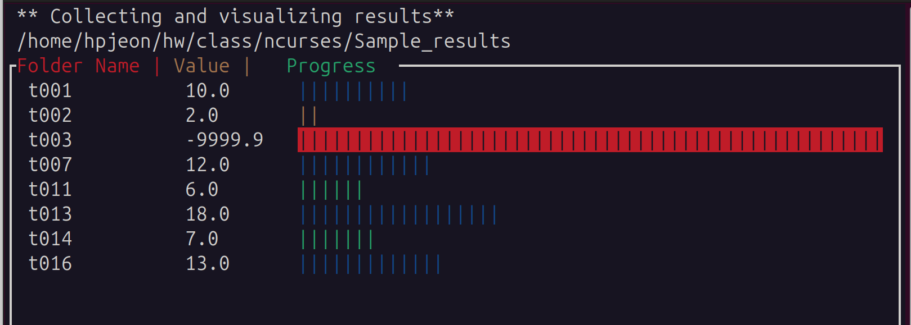

## Basic class
- Ref: https://dev.to/tbhaxor/introduction-to-ncurses-part-1-1bk5

```cxx
#include <ncurses.h>
using namespace std;
int main(int argc, char ** argv)
{
    // init screen and sets up screen
    initscr();
    // print to screen
    printw("Hello World");
    // refreshes the screen
    refresh();
    // pause the screen output
    getch();
    // deallocates memory and ends ncurses
    endwin();
    return 0;
}
```
- `g++ hello-world.cc -lncurses`
```cxx
#include <ncurses.h>
using namespace std;
int main (int argc, char ** argv)
{
    initscr();
    // moving cursor, x = 20, y = 10
    move(10, 20);
    printw("I am here...");
    move(21, 10);
    printw("Now i am here");
    refresh();
    getch();
    endwin();
    return 0;
}
```
```cxx
#include <ncurses.h>
using namespace std;
int main(int argc, char **argv)
{
    initscr();
    // creating a window;
    // with height = 15 and width = 10
    // also with start x axis 10 and start y axis = 20
    WINDOW *win = newwin(15, 17, 2, 10);
    refresh();
    // making box border with default border styles
    box(win, 0, 0);
    // move and print in window
    mvwprintw(win, 0, 1, "Greeter");
    mvwprintw(win, 1, 1, "Hello");
    // refreshing the window
    wrefresh(win);
    getch();
    endwin();
    return 0;
}
```
```bash
          ┌Greeter────────┐
          │Hello          │
          │               │
          │               │
          │               │
          │               │
          │               │
          │               │
          │               │
          │               │
          │               │
          │               │
          │               │
          │               │
          └───────────────┘
```

## Sample menu
- http://www.linuxfocus.org/English/March2002/article233.shtml
```bash
Menu1(F1)           Menu2(F2)
┌─────────────────┐
│Item1            │open the menus. ESC quits.
│Item2            │
│Item3            │
│Item4            │
│Item5            │
│Item6            │
│Item7            │
│Item8            │
└─────────────────┘
```

## Youtube lecture
- Ncurses Tutorial 0 - Hello World (initscr, endwin, refresh, getch, printw)

- cbreak(): accept ctrl+c to exit
- raw(): reads ctrl+c as character. No exit
- Drawing a box with character:
```
char x = 'x';
char z = 'z';
box(win, (int)c, (int)z)
```
- Current cursor info
    - getyx()
    - getbegyx()
    - getmaxyx()
- Detecting up arrow button:
```cxx
#include <ncurses.h>
#include <string>
using namespace std;
int main() {
  initscr();
  noecho();
  cbreak();
  int yMax, xMax;
  getmaxyx(stdscr, yMax, xMax);
  WINDOW * inputwin = newwin(3, xMax-12, yMax-5,5);
  box(inputwin,0,0);
  refresh();
  wrefresh(inputwin);
  keypad(inputwin, true);
  int c = wgetch(inputwin);
  if (c == KEY_UP) {
    mvwprintw(inputwin, 1,1, "You pressed UP");
    wrefresh(inputwin); 
  }
  getch();
  endwin();
  return 0;
}
```
- Result:
```bash
     ┌──────────────────────────────────────────────────────────────────┐
     │You pressed UP                                                    │
     └──────────────────────────────────────────────────────────────────┘

```

## Ncurses: A Structured and Technical Introduction to Text-Based User Interface Development
- https://medium.com/@e_moreira/ncurses-a-structured-and-technical-introduction-to-text-based-user-interface-development-81949b812282
- At ubuntu:
    - sudo apt-get install libncurses-dev

### Terminal modes and initialization
- Sample starting program:
```c
#include <ncurses.h>
int main() {
    initscr(); // initializes the Ncurses env
    printw("Hello, Ncurses"); // writes formatted output to the virtual screen buffer
    refresh(); // sync the virtual buffer with the physical terminal
    getch(); // waits for user input
    endwin(); // Restores the terminal
    return 0;
}
```
- Compile command: `gcc test01.c -I /usr/include -L/usr/lib/x86_64-linux-gnu -lncurses`

## Curses in Python
- https://docs.python.org/3/howto/curses.html
- test02.py
```py
from curses import wrapper
import curses
from curses.textpad import Textbox, rectangle
def main(stdscr):
    stdscr.addstr(0, 0, "Enter IM message: (hit Ctrl-G to send)")
    editwin = curses.newwin(5,30, 2,1)
    rectangle(stdscr, 1,0, 1+5+1, 1+30+1)
    stdscr.refresh()
    box = Textbox(editwin)
    # Let the user edit until Ctrl-G is struck.
    box.edit()
    # Get resulting contents
    message = box.gather()
wrapper(main)
```

## Python curses package
- Find the 2nd half of the lecture at https://github.com/hpjeonGIT/class/tree/main/udemy_ncurses
- Harvesting results
    - In the target folder, there are many sub-folders like t001, t002, ...
    - Each folder contains summary.txt, which has a value
    - Reading values (when there is no value, -9999.9 is assigned) from subfolders, each folder is displayed with the value and a graph
```py    
import sys,os,argparse
import curses
import time
 
class Results:
    target_path = ''
    list_folder = []
    list_value = []
    n_row = 0
    n_col = 80 # may need extension
    @classmethod
    def find_read(cls):
        with os.scandir(cls.target_path) as entries:
            for entry in entries:
                if os.access(entry, os.R_OK and entry.is_dir()):
                    target_file = cls.target_path + "/" + entry.name + "/summary.txt"
                    if os.access(target_file, os.R_OK):
                        with open(target_file, 'r') as f:
                            txt = f.readlines()
                            if len(txt) > 0:
                                val = float(txt[0].split()[0]) # first item only
                            else:
                                val = -9999.9
                        cls.list_folder.append(entry.name)
                        cls.list_value.append(val)
        #sorting
        sorted_pairs = sorted(zip(cls.list_folder,cls.list_value))
        cls.list_folder, cls.list_value = zip(*sorted_pairs)
        Results.n_row = len(cls.list_folder)
class FileWindow:
    def __init__(self,h,w,y,x):
        self.win = curses.newwin(h,w,y,x)
        self.win.border(0,0,0,0,0,0,0,0)
        self.current_row = 0
        self.h = h
        self.w = w       
    def __getattr__(self,attr):
        return getattr(self.win,attr)
    def build_pad(self):
        self.pad = curses.newpad(Results.n_row, Results.n_col)
        for i, target in enumerate(Results.list_folder):
            value = Results.list_value[i]
            self.pad.addstr(i,1,  target)
            self.pad.addstr(i,15, str(value))
            if value < 0:
                graph = '|'*(self.w-26)
                self.pad.addstr(i,25, graph, curses.color_pair(1) | curses.A_REVERSE)
            elif value < 5:
                graph = '|'* int(value)
                self.pad.addstr(i,25, graph, curses.color_pair(2) )
            elif value < 10:
                graph = '|'* int(value)
                self.pad.addstr(i,25, graph, curses.color_pair(3) )
            else:
                graph = '|'* int(value)
                self.pad.addstr(i,25, graph, curses.color_pair(4) )
    def rf(self):
        self.win.clear()
        self.win.border(0,0,0,0,0,0,0,0)
        self.win.addstr(0,1,"Folder Name | ", curses.color_pair(1))
        self.win.addstr(0,15,"Value |   ", curses.color_pair(2))
        self.win.addstr(0,25,"Progress  ", curses.color_pair(3))
        hmax, wmax = self.win.getmaxyx()
        self.win.addstr(hmax-1,1,str(len(Results.list_folder)))
        self.win.refresh()
        self.pad.refresh(self.current_row, 0,3,1, hmax-1, wmax-3)
class TopWindow:
    def __init__(self,h,w,y,x):
        self.win = curses.newwin(h,w,y,x)
    def __getattr__(self,attr):
        return getattr(self.win,attr)
    def rf(self):
        self.win.addstr(0,1,"** Collecting and visualizing results** ")
        self.win.addstr(1,1,Results.target_path)
        self.win.refresh()
 
def draw_menu(stdscr):
    # preparation
    if curses.has_colors():
        curses.start_color()
        curses.init_pair(1,curses.COLOR_RED,    curses.COLOR_BLACK)
        curses.init_pair(2,curses.COLOR_YELLOW, curses.COLOR_BLACK)
        curses.init_pair(3,curses.COLOR_GREEN,  curses.COLOR_BLACK)
        curses.init_pair(4,curses.COLOR_BLUE,   curses.COLOR_BLACK)
    curses.cbreak()
    curses.curs_set(0)
    curses.noecho()
    stdscr.keypad(True)
    stdscr.refresh()
    h, w = stdscr.getmaxyx()   
    # Initialization
    h_file = h - 2;
    w_file = int(w * 0.3);   
    twin = TopWindow(2, w, 0, 0)
    fwin = FileWindow(h_file, w, 2, 0)
    # argument
    parser = argparse.ArgumentParser()
    parser.add_argument('--path', type=str, required=True)
    args = parser.parse_args()
    Results.target_path = args.path
    Results.find_read()
    #
    fwin.build_pad()
    twin.rf()
    fwin.rf()
    # Wait for next input
    while True:
        k = stdscr.getkey()
        if k in ['q', 'Q']:
            break
        elif k == "KEY_DOWN" and fwin.current_row < Results.n_row-1:
            fwin.current_row += 1
        elif k == "KEY_UP" and fwin.current_row > 0:
            fwin.current_row -= 1
        fwin.rf()
 
def main():
    parser = argparse.ArgumentParser()
    parser.add_argument('--path', type=str, required=True)
    args = parser.parse_args()
    dir_path = args.path
    if (not os.path.exists(dir_path)):
        print("!!!! "+ dir_path + " doesn't exist. We stop here")
        sys.exit()
    curses.wrapper(draw_menu)
 
if __name__ == "__main__":
    if sys.version_info < (3,10):
        print("Requires Python 3.10 or newer. We exit now")
        sys.exit()
    main()
```

