## Master the Art of Managing Projects with Azure DevOps
- Instructor: Mark Lee

## Section 1: Azure DevOps Essentials: Getting Started

### 1. Lesson 1: Why Learn Azure DevOps!

### 2. Lesson 2: A Course Overview
- E-book
  - An Azure DevOps Playbook for Project management

### 3. Lesson 3: A Brief History of Microsoft Azure DevOps
- Devops: delivering value by streamlining the SW development and delivery process
- History
  - Team Foundation Server (TFS) at 2005
  - Team Foundation Service at cloud at 2011
  - Azure DevOps at 2018
- Azure boards: dash board
- Azure Repositories: Git
- Azure Pipelines
- Azure Test Plans  
- Azure Artifacts

### 4. Lesson 4: Let's Create a Free MS Azure DevOps Account
- Using github account was looping forever
- Use a regular main account to create a new account
- After the account creation, search Azure DevOps
  - Creat a new project of Customer Chat Bot

### 5. Lesson 5: What is an Organization in Azure DevOps
- Click Azure DevOps icon in Top-Left then Organization Settings in Bottom-Left
  - Can adjust Time Zone
  - One organization for a personal account

### 6. Lesson 6: How a Project is related to an Azure DevOps Organization
- When creating a project, click advanced menu and configure Process as Basic or Agile as necessary
  - Changing Process later in the existing project is not recommended as manual adjustment is required
  - Make a new process inheriting the current one and the replacement would be OK
  - To change the current process, Organization settings -> All processes -> Select the current one -> Projects -> Click (...) of the corresponding project to change the process

### 7. Lesson 7: What are the Azure DevOps User Access Levels


### 8. Lesson 8: An Overview of the Group Permission's in Azure DevOps
- Create a PMO group
  - Project related group is not visible in organization level

### 9. Lesson 9: Customizing Your Azure DevOps Profile
- User setting in Top-right icon

### 10. Lesson 10: An Overview of the Hierarchical Process Taxonomy
- Epic: a larger body of work to be broken down into smaller, manageable tasks or user stories to facilitate planning and trackign within a project
- Feature: a high level requirement that provides business value and can be broken down into user stories
- User story: a high-level requirement based on the user experience that provides business value and is broken down into tasks
- Task: a specific unit of work that represents an actionable item to be completed within a project, often associated with a user story
- Ref: https://learn.microsoft.com/en-us/azure/devops/boards/work-items/guidance/choose-process?view=azure-devops&tabs=agile-process
- Basic:

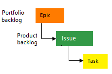

- Agile:

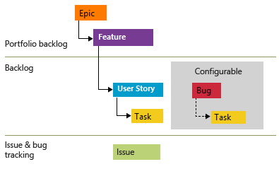

- SCRUM:

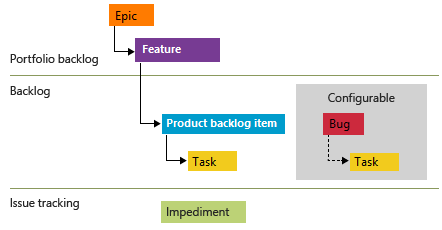

- CMMI:

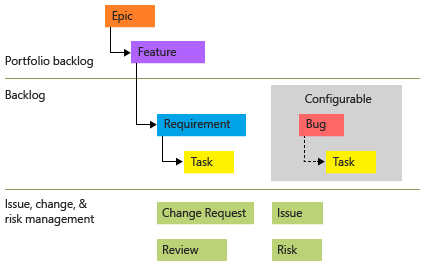


## Section 2: Starting with the Basics: Creating ADO Work Items

### 11. Lesson 11: An Introduction to Section 2

### 12. Lesson 12: Navigating and Understanding the Azure Board
- KANBAN vs SCRUM: Both for agile
- Kanban
  - No deadlines!
  - A continuous flow
  - Ongoing or rolling basis work
  - Best suited for ITsupport teams and operations
- Scrum
  - Time-boxed (1 to 4 weeks)
  - More rigid approach
  - Best suited for product development or projects with evolving requirements
- Work in Progress (WIP)
  - The number of unfinished tasks, user stories, or features that a team has started but not yet completed
  - WIP limit: a cap on how many items can be in a specific workflow

### 13. Lesson 13: Creating Epics and Reviewing Work Item Properties
- In Boards, only Features/Stories are visible by default
  - To see Epic, Project settings -> Boards -> Team configuration, opt in **Epics**

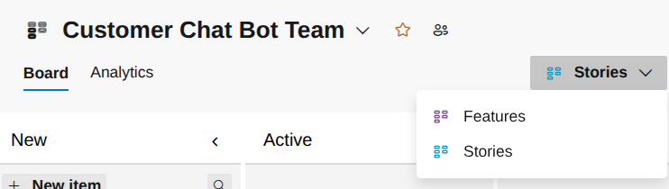

- For each board item, edit Stats, Reasons, Area, Iteration, Planning, ... as necessary
  - Once the state is Removed, it cannot be back to intermediate states

### 14. Lesson 14: Creating Features and Introducing User Stories
- In Boards, enable Epic as visible
  - In Epic item, you can add features
- Essential Scrum by Kennath Rubin
  - Story must be INVEST
    - I for Independent
    - N for Negotiable
    - V for Valuable
    - E for Estimated
    - S for Sized Appropriately
    - T for Testable

### 15. Lesson 15: The Anatomy of a User Story-Understanding Its Structure
- A user story describes a feature of functionality from an end-user's perspective
- In contrast to a user stody, a requirement is a statement that specifies what a system or product must do or how it must behave to meet specific criteria
- A sample user story title: "As a customer service representative, I want a chatbot implemented for common industries, so that the process can be streamlined and reduce the load on Customer service representative"
- Acceptance Criteria

### 16. Lesson 16: Creating the User Story

### 17. Lesson 17: How to Create a Task, Test Case, and Bug Work Items

### 18. Lesson 18: Using AI to Generate Work Items
- See the attached excel file

### 19. Lesson 19: Creating the Iteration or Sprint with an Overview of the Task Board
- Project settings -> Project configuration -> New Iteration -> Add Sprint 4

## Section 3: Achieving Consistency: Customizing Project Processes, Work Items, and Backlogs

### 20. Lesson 20: An Introduction to Section 3

### 21. Lesson 21: The Benefits of Customizing Azure DevOps Projects: A Game-Changer
- Alignment with organizational process
- Tailored workflows
- Granular control
- Improved visibility and reporting

### 22. Lesson 22: Customizing the ADO Project Process
- At Organization settings
  - Changing the organization name 
  - Can create inherited process from Process menu
  - Adding new states in User story
- ADO crashed with Opera
  
### 23. Lesson 23: Mastering Azure Board States Customization
- Adding new states into User story from Organization Settings->Process
- Adding columns in Boards using settings in Boards -> Boards in each Project

### 24. Lesson 24: How to Add Values to Work Item Pick Lists in Azure DevOps

### 25. Lesson 25: Enhancing Azure DevOps Work Items with Custom Fields

### 26. Lesson 26: Creating a Work Item Rule
- Organization settings->Process->All processes->ADOAgileProcess->Task->Rules

### 27. Lesson 27: Adding a New Page to a Custom Work Item

### 28. Lesson 28: Unlocking Flexibility: Creating Custom Work Items in Azure DevOps

### 29. Lesson 29: Creating Color-Coded Tags
- Project settings -> Boards -> User Story - Add Tags
- Tag colors can be changed from Boards -> Settings -> Tag colors

### 30. Lesson 30: Mastering Project Wikis in Azure DevOps
- Overview -> Wiki
- Markdown format
- Using "Mention a work item", each Epic/Feature/User story can be injected

### 31. Lesson 31: Using the Copy Work Item Feature

### 32. Lesson 32: How to Standardize Your Process with Templates in Azure DevOps
- Project Settgings -> Team configuration -> Templates
  - For every work item like Bug, Epic, Feature, User Story, ...

### 33. Lesson 33: Exploring More Customization Options for Azure Boards

## Section 4: Getting Started with Azure DevOps Queries

### 34. Lesson 34: An Introduction to Section 4

### 35. Lesson 35: ADO Queries Part 1 (What are ADO Queries)
- ADO Queries
  - Flat
  - Tree
  - Linked
- Benefits of using queries
  - Prioritization and planning
  - Cross-Project queries
  - Query tags
  - Using query reports (aggregated work item data)  
  - Tracking dependencies
  - Quality assurance (severity, test status, code review status)
  - A primary purpose of queries is for dashboarding
- Project -> Boards -> Queries

### 36. Lesson 36: ADO Queries Part 2: Creating a Flat Query

### 37. Lesson 37: ADO Queries Part 3: Flat Queries Continued and Linked Queries
- Changing query types:

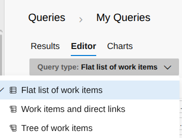

### 38. Lesson 38: ADO Queries Part 4: Exploring the Tree Query

### 39. Lesson 39: ADO Queries Part 5: Visualize Charts, Format Reports, Bulk Editing
- Boards -> Queries -> My Queries -> Results
  - Preview option is available
- After queries, selecting items then we can change their column values altogether

## Section 5: Step-by-Step Process for Building a Project from the Ground Up!

### 40. Lesson 40: An Introduction to Section 5
- Installing extension for visualization

### 41. Lesson 41: Building an ADO Project Together: Hands-On Tutorial
- Board columns as New, Analysis, Design, Development, In Testing, Blocked
- Then using the enclosed excel sheet, add Epic/Features/User story items
  - In Boards -> Backlogs

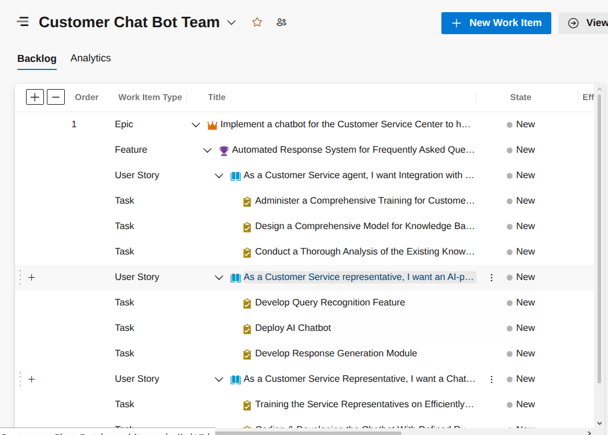

### 42. Lesson 42: Estimating the Scope of Work in Our Project
- Each task
  - Original estimate as 10 hours

### 43. Lesson 43: Setting Up Our Backlog to View Task Estimates
- 30 hour for each story points

### 44. Lesson 45: Let's Install and Explore the 'Visualize' Extension
- Organization settings
  - Market place in Top-right menu
  - Select "Work Item Visualization"
- Now Boards -> Backlogs -> Select Epic item -> Top-right More Actions (:) -> Visualize

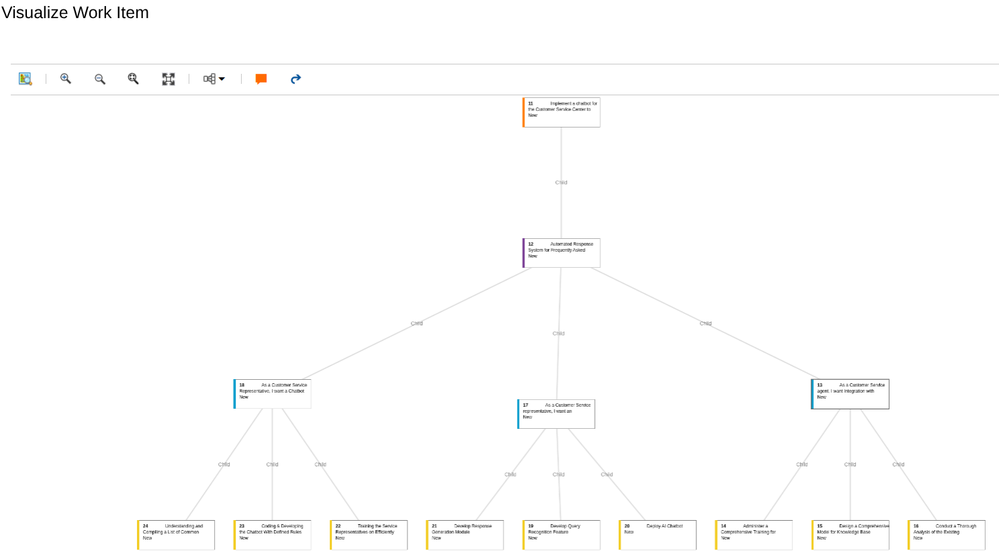

### 45. Lesson 46: Final Thoughts on Assigning Work Across Sprints

### 46. Lesson 47: Setting Up the Sprint Resource Capacity Model
- Test or dummy users can be added from Organization settings
  - Email needs not to be valid
- Allocate hours in Boards -> Sprints -> Capacity in each person  

### 47. Lesson 44: How to Set Sprint Dates and Plan Work for Each Sprint

### 48. Lesson 48: Why You Should Standardize the Backlog for Better Project Management

### 49. Lesson 49: How to Create a Strategic-Level Work Item in the Backlog
- Organization settings -> Process -> Backlog levels
  - Adding Initiative as a higher hierarchy
- An existing Epic can be located below this higher item using Add Link menu in the Epic item setting  

### 50. Lesson 50: Final Thoughts on Customizing the Backlog for Maximum Impact
- Organization settings -> Board -> Processes -> Backlog levels
  - Default Agile/Basic/Scrum do not allow changes
  - Make a new process inheriting one of them. Then backlog levels/work items can be edited

### 51. Lesson 51: Creating a Delivery Plan: Tracking Dependencies Along the Way
- Dependency track from Market Place
- Visualizes work across teams and ensures timelines align with goals

### Assignment 1: Building an ADO Project from the Ground Up!
1. Create a Project and assign the Agile process. This step is unnecessary if you've already created a default project when setting up your ADO Organization.
2. Create a custom child process based on the Agile parent process.
3. Install the "Visualize" extension from the Azure DevOps Marketplace.
4. Create Work Items for your project using the provided MS Excel resource called "Customer Service AI Chatbot Project Work Items" file.
5. Verify your Backlog to ensure it matches the items in the worksheet.
6. Set iteration dates or rename them as Sprints in the Project Configuration section of ADO.
7. Add Iterations to the project through the Team Configuration section in ADO.
8. Enable the Planning Pane in the Backlog view by selecting "View Options" and toggling it on, so the Iterations are visible.
9. Assign planned work to your Iterations as I've demonstrated how to do.
10. Create a custom work item named "Compliant" and add a field called "Compliance" with the following values: HIPP, SOX, GXP. Then, add this field to the Details page.
11. Next, create a new "Compliant" work item to verify that the custom work item and its associated field and values were successfully created.
12. Link the custom "Compliant" work item to any User Story.
13. Lastly, go to the Organization Settings menu and add the "Compliant" work item to the Iteration Backlog located under `Boards/Process/<select your custom process>`, then navigate to the tab called "Backlog levels.
14. Confirm that the "Compliant" work item is linked to the User Story is displayed in the Backlog as part of the hierarchy.

### 52. Lesson 52: Navigating ADO Analytic Views for Better Insights

## Section 6: Mastering ADO Dashboards and Queries: A Deep Dive

### 53. Lesson 53: An Introduction to Section 6

### 54. Lesson 54: How to Navigate ADO Dashboards: An Introduction
- Widget catalogue
- Dashboard can be visible to other teams or team members

### 55. Lesson 55: Building Dashboards with Corresponding Queries: Part 1
- Work Item query
  - Shows a list of work items based on a predefined query

### 56. Lesson 56: Building Dashboards with Corresponding Queries: Part 2
- Widget settings can refresh dashboard every 5min

### 57. Lesson 57: Building Dashboards with Corresponding Queries: Part 3

### 58. Lesson 58: Building Dashboards with Corresponding Queries: Part 4

### 59. Lesson 59: Building Dashboards with Corresponding Queries: Part 5

### 60. Lesson 60: Building Dashboards with Corresponding Queries: Part 6
- Velocity
- Burndown

### 61. Lesson 61: Building Dashboards with Corresponding Queries: Part 7

### 62. Lesson 62: Building Dashboards with Corresponding Queries: Part 8

### 63. Lesson 63: Building Dashboards with Corresponding Queries: Part 9

### 64. Lesson 64: The Process of Exporting and Importing Work Items in ADO

## Section 7: Azure Test Plans

### 65. Lesson 65: The Basics of Testing with Azure DevOps
- Functional testing
  - Unit testing
  - Iterative testing
    - Across spreads
    - Early detection of issues
    - Increased Quality
  - Integration or End-to-End Testing
    - Comprehensive validation of requirements
    - Validation of non-functional requirements
  - System Testing
  - Regression Testing
  - User acceptance Testing (UAT)
  - Smoke Testing
- Non functional testing
  - Performance Testing
  - Security Testing
  - Usability Testing
  - Compatibility Testing

### 66. Lesson 66: Installing the Test and Feedback Extension
- Test Plans in each Project
- Test & Feedback from Market place
  - Supports Chrome and Edge browser
  - Supporting Firefox will be retired Nov 2026
- Not free?
  - 30 days free trial only

### 67. Lesson 67: Install Azure Test Plans and Create our first Test Plan
- Azure Test Plans is a management tool but not a testing tool. Testing must be coupled with Azure Pipelines

### 68. Lesson 68: Explore Executing Test Cases with the Web App called Test Runner

### 69. Lesson 69: Let's Create a Test Case Shared Step(s) for Repeatability

### 70. Lesson 70: Let's Create a Test Case Shared Parameter for Repeatability

### 71. Lesson 71: Creating and Assigning Test Configurations for Repeatability

### 72. Lesson 72: Building a Requirements-Based Test Suite in Azure Test Plans

### 73. Lesson 73: Creating a Static and Query Based Test Suite

### 74. Lesson 74: Creating Test Management Charts and add to a Dashboard

### 75. Lesson 75: We'll Conduct Exploratory Testing with the Test & Feedback Extension

## Section 8: A Beginner's Guide to Continuous Integration and Delivery

### 77. Lesson 76: An Introduction to Section 8

### 78. Lesson 77: Starting Your Journey with Azure DevOps CI and CD
- Ref: https://learn.microsoft.com/en-us/azure/devops/?view=azure-devops
- The anatomies of Azure DevOps CI/CD (automation)
  - Azure Repo with Git & GitHub
  - A Deep Dive into Branching
  - The anatomy of the build pipeline
  - The anatomy of a YAML for automation
  - The anatomy of the release pipeline
  - Connecting the dots an end-2-end build & release scenario
- Continuous Integration
  - Developers write and commit code to a repo frequently
  - Automated build process compiles the code and run tests to create Artifacts
  - Automated tests (unit-tests, integration tests) to validate the code changes
  - Package the compiled code and dependencies in deployable packages
- Continuous Delivery
  - Automated deployment processes push the build Artifacts to straging or production environment
  - Automating the Release of the SW to suers or customers
  - Monitoring the Application in production to ensure it functions correctly

### 79. Lesson 78: Getting to Know Git: Distributed Code Management Demystified
- Git: a version control system that allows for distributed code management
- TFVC is still running
- Git anatomy
  - Commits: a snapshot of changes made to files in a repo
  - Fetch: retrieves updates from a remote repo without merging them into the local branch
  - Fork: a personal copy of a repo
  - Clone: creates a local copy of a remote repo
  - Push: uploads local commints from your repo to a remote repo
  - Pull-Request: merge changes from one branch into another
  - Merge: a process that combines changes from different branches into a single branch
  - Branching: enables multiple features or fixes to be developed simultaneously without interfering with the main codebase

### 80. Lesson 79: Creating Your First "Git" Repo in Azure DevOps
- Create a new project
- Create a new repo from Repos -> Files -> New Repositories
  - Default README.md is created
- Practice of edit/commit of README.md

### 81. Lesson 80: How to Create Your First Branch in Azure DevOps
- When creating a new branch, a User story can be linked
- **Branch policy** is not accessible from Repo->Branches anymore (Sept 2026)
  - Project settings -> Repo -> All Repositories -> Select your repo -> Policies -> Find the branch in the bottom
  - If the branch is yours (i.e., main), adjust:
    - Minimum number of reviewers as 1
    - Enable "Allow requestors to approve their own changes"
  - Disable the branch policy of temporary branch so you can edit files anytime
- Why do we need a separate branch than main?
  - Why not keeping main branch only?
    - It is OK to have main branch only
    - Best suited for solo developers, prototyping, or small projects
    - No code review required
    - Not recommended but team-based/large scale projects
  - The benefits of multiple-branches
    - For production-ready applications
    - Easy prototyping or adding new feature, without breaking the current workflow
    - Pull-requests are necessary for merging into main

### 82. Lesson 81: Creating Your First Pull Request in Azure DevOps
- Scenario:
    1. In main branch, edit README.md
    2. Make a new branch of PRTest, coupling with a User story
    3. Edit README.md in PRTest branch
    4. Commit in PRTest branch
    5. Create a Pull-Request. Add Reviewer
    6. Now in Review. Add comment and click a) Approve then b) Complete
    7. Go to Repos -> Branches and confirm that PRTest branch is gone, as the corresponding User Story is completed  
    8. Confirm that README.md in main branch has the content created from PRTest branch

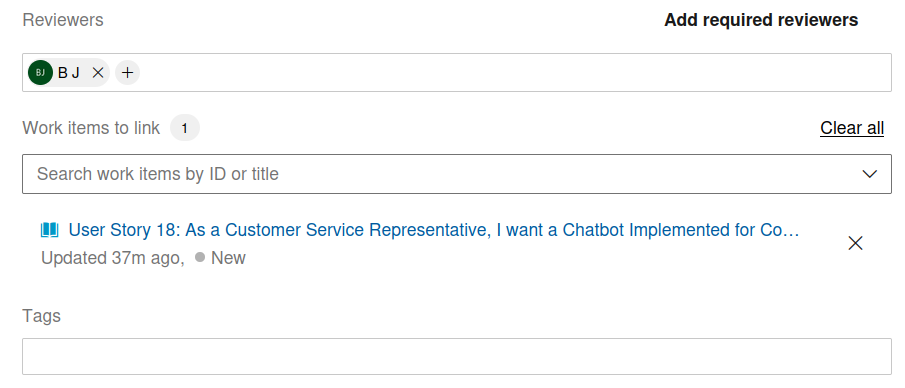
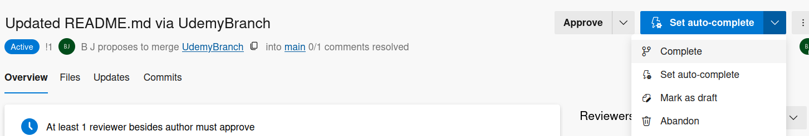
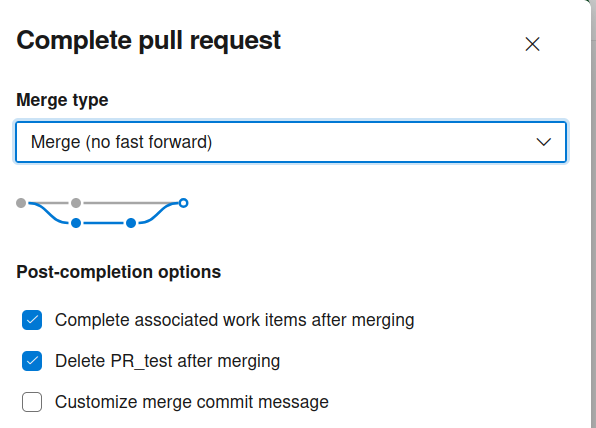

### 83. Lesson 82: How to install the Microsoft IDE (Integrated Development Environment)
- Visual Studio Download

### 84. Lesson 83: Creating a Web Project with Git Repository in Your IDE


### 85. Lesson 84: How to Clone and Fork a Repo: Understanding the Process


### 86. Lesson 85: Getting Started with Build Pipelines: Understanding the YAML File
- Pipeline -> Setup a build -> Review your pipeline YAML

### 87. Lesson 86: How to Set Up Your First ADO Pipeline for a Web Application
- Artifacts are deleted after pipeline builds. How to keep them for future work?

### 88. Lesson 87: How to Publish Your Web App Build Artifact with YAML
- azure-pipelines.yaml:
```yaml
trigger:
- master

pool:
  vmImage: 'windows-latest'

variables:
  solution: '**/*.sln'
  buildPlatform: 'Any CPU'
  buildConfiguration: 'Release'

steps:
- task: NuGetToolInstaller@1
 
- task: NuGetCommand@2
  inputs:
    restoreSolution: '$(solution)'

- task: DotNetCoreCLI@2
  displayName: Run Tests
  inputs:
    command: test
    projects: '**/*.Test/*.csproj'  # Specify the path to your test projects
    arguments: '--configuration $(buildConfiguration) --logger trx'  # TRX logger to generate test results for Azure DevOps

- task: DotNetCoreCLI@2
  displayName: Build
  inputs:
    command: build
    projects: '**/*.csproj'
    arguments: '--configuration $(buildConfiguration)'

# Run tests
- task: DotNetCoreCLI@2
  displayName: Run Tests
  inputs:
    command: test
    projects: '**/*.MyTestWebApp.csproj' # Ensure this points to your test project
    arguments: '--configuration $(buildConfiguration) --logger trx --results-directory $(System.DefaultWorkingDirectory)/TestResults'

# Publish test results
- task: PublishTestResults@2
  inputs:
    testResultsFormat: 'VSTest'
    testResultsFiles: '$(System.DefaultWorkingDirectory)/TestResults/*.trx'
    searchFolder: '$(System.DefaultWorkingDirectory)'
    mergeTestResults: true

- task: DotNetCoreCLI@2
  inputs:
    command: publish
    publishWebProjects: True
    arguments: '--configuration $(BuildConfiguration) --output $(Build.ArtifactStagingDirectory)'

- task: PublishPipelineArtifact@1
  inputs:
    targetPath: '$(Build.ArtifactStagingDirectory)' 
    artifactName: 'MyWelcomePage-artifact'
```

### 89. Lesson 88: How to Set Up a Release Pipeline with Azure Web App Service
- Continuous Delivery (CD)

### 90. Lesson 89: Automating Your Pipeline Workflow from Start to Finish
- Classic build/Release pipelines are disabled as default in organization settings
  - YAML customization is recommended

### 91. Lesson 90: How to Build a Multi-Stage Release Pipeline
- Adding UAT (User Acceptance Test)
  - Muti-Stage YAML Pipeline
```yaml
trigger:
  - main
  - develop

stages:
# 1. BUILD STAGE
- stage: Build
  displayName: 'Build Application'
  jobs:
  - job: BuildJob
    pool:
      vmImage: 'ubuntu-latest'
    steps:
    - script: echo "Building and packaging code..."
    # Add tasks to publish your build artifacts here

# 2. DEV DEPLOYMENT STAGE
- stage: Dev
  displayName: 'Deploy to Dev'
  dependsOn: Build
  jobs:
  - deployment: DeployDev
    environment: 'Dev'
    pool:
      vmImage: 'ubuntu-latest'
    strategy:
      runOnce:
        deploy:
          steps:
          - script: echo "Deploying to Dev Environment"

# 3. UAT DEPLOYMENT STAGE
- stage: UAT
  displayName: 'Deploy and Validate UAT'
  dependsOn: Dev # Ensures UAT only runs after Dev succeeds
  jobs:
  - deployment: DeployUAT
    displayName: 'Deploy to UAT Environment'
    # This targets the Environment created in Step 1, triggering the Approvals Check
    environment: 'UAT' 
    pool:
      vmImage: 'ubuntu-latest'
    variables:
      # Inject UAT-specific configurations here
      - name: EnvironmentName
        value: 'uat'
    strategy:
      runOnce:
        deploy:
          steps:
          - download: current
            artifact: drop
            displayName: 'Download Build Artifacts'
          
          - script: |
              echo "Applying UAT configurations..."
              echo "Deploying to the UAT environment..."
            displayName: 'Execute UAT Deployment Tasks'
```
- Adding CMake unit-test into pipelines
```yaml
trigger:
  - main

pool:
  vmImage: 'ubuntu-latest' # Or 'windows-latest' / 'macOS-latest' (CMake is pre-installed on all)

variables:
  buildConfiguration: 'Release'
  buildDirectory: '$(Build.ArtifactStagingDirectory)/build'

steps:
# 1. Configure the CMake project
- task: CMake@1
  displayName: 'CMake Configure'
  inputs:
    workingDirectory: '.'
    cmakeArgs: '-B $(buildDirectory) -DCMAKE_BUILD_TYPE=$(buildConfiguration)'

# 2. Build the target(s) and test executables
- task: CMake@1
  displayName: 'CMake Build'
  inputs:
    workingDirectory: '.'
    cmakeArgs: '--build $(buildDirectory) --config $(buildConfiguration)'

# 3. Execute the tests via CTest
# We use a script/bash task so we can instruct CTest to export results to a standard JUnit XML format
- script: |
    cd $(buildDirectory)
    ctest -C $(buildConfiguration) --output-on-failure --junit CTestResults.xml
  displayName: 'Run CMake Unit Tests'
  continueOnError: true # Prevents the entire pipeline from halting immediately so results can be published

# 4. Publish the Test Results to the Azure DevOps Dashboard
- task: PublishTestResults@2
  displayName: 'Publish CTest Results'
  inputs:
    testResultsFormat: 'JUnit'
    testResultsFiles: '$(buildDirectory)/CTestResults.xml'
    searchFolder: '$(buildDirectory)'
    testRunTitle: 'CMake CTest Run'
  condition: succeededOrFailed() # Ensures this runs even if step 3 fails
```

### 92. Lesson 91: Creating a Parallel Release Pipeline and Setting Up Release Approvals
- Release into multiple environments simultaneously

### 93. Lesson 92: How to Create Pipeline Deployment Gates for Conditional Deployment
- Gated condition
  - Using Pipeline classic Release

### 94. Lesson 93: Building a Simple Dashboard for Build and Release History
- Project Overview -> DashBoards -> Create Pipeline overview

### 95. Lesson 94: Exploring the Azure DevOps Service: Artifacts


### 96. Lesson 95: Closing Thoughts on Continuous Integration and Delivery
- Install Azure Boards on Github
  - https://learn.microsoft.com/en-us/azure/devops/boards/github/install-github-app?view=azure-devops
- When commiting, commit with title `SomeName#123` while 123 is the number given in Azure Boards item. Then they are automatically coupled after commit

### 97. Exercise: CI/CD Pipeline Hands-On Practice - Optional (Downloadable Resource)
- Give this assignment a try—it’s the most challenging section of the course. Don’t worry if you can’t complete everything; the most important thing is understanding the core concepts, not necessarily performing each step perfectly. I’ve been doing this for years, and while I try to make it look easy, it’s more complex than it seems. So, take your time, give it your best effort, and remember: if you get stuck, just focus on grasping the concepts.
This hands-on assignment will guide you through practical steps to familiarize you with key DevOps concepts in Azure DevOps. You’ll be working with Git repositories, creating pipelines, and deploying web applications using Azure DevOps services. Follow each section carefully, and don’t hesitate to refer to the linked video tutorials if you need help.
- Assignment Instructions (Remember if you get stuck on a certain step or steps refer to the video referenced in this assignment.)
- Part 1: Video: Creating Your First "Git" Repo in Azure DevOps
    1. Create a new Git repository in Azure DevOps.
    2. Take note of the repository's name and URL.
- Part 2: Video: How to Create Your First Branch in Azure DevOps
    1. Create a new branch in your repository.
    2. Commit a simple change to your new branch.
    3. Push the changes back to the repository, following along on the video.
- Part 3: Video: Creating Your First Pull Request in Azure DevOps
    1. From your newly created branch, create a pull request to merge the changes back into the main branch.
    2. Review and complete the pull request process, following along on the video.
- Part 4: Video: How to Install Microsoft IDE Visual Studio (Integrated Development Environment)
    1. Download and install Visual Studio on your machine from the Microsoft IDE Webpage.
    2. Set up Visual Studio with the necessary components for Git, following along on the video.
- Part 5: Video: Creating a Web Project with Git Repository in Your IDE
    1. In Visual Studio, create a new web project (e.g., an ASP.NET Core web app) from the home page.
    2. Initialize a Git repository for this project and link it to the Azure DevOps repository you created, following along on the video, following along in the video.
- Part 6: Video: How to Clone and Fork a Repo: Understanding the Process
    1. Clone the repository you created earlier to your local machine.
    2. Fork another repo (choose any public repository) to your Azure DevOps account and clone it.
- Part 7: Video: Getting Started with Build Pipelines: Understanding the YAML File
    1. Learn about YAML and how it’s used in Azure DevOps for build pipelines.
    2. Set up your first build pipeline using YAML to automate the build of your web application, following along in the video.
- Part 8: Video: How to Set Up Your First ADO Pipeline for a Web Application
    1. Create your first Azure DevOps pipeline using the YAML file you created.
    2. Connect your build pipeline to your Git repository and trigger a build, following along in the video.
- Part 9: Video: How to Publish Your Web App Build Artifact with YAML
    1. Configure your pipeline to publish build artifacts (e.g., a .zip file or web app package).
    2. Ensure that your artifact is stored and accessible for the release process.
- Part 10: Video: How to Set Up a Release Pipeline with Azure Web App Service
    1. Set up a release pipeline to deploy your web app using Azure Web App Service.
    2. Configure your pipeline to deploy the build artifact created in the previous step, following along in the video.
- Part 11: Video: How to Create Pipeline Deployment Gates for Conditional Deployment
    1. Implement deployment gates to ensure that your release only proceeds under   certain conditions (e.g., approvals or successful tests), following along in the video.
- Part 12: Video: Building a Simple Dashboard for Build and Release History
    1. Create a simple dashboard in Azure DevOps to track the build and release history of your project.
    2. Customize your dashboard with useful widgets to monitor your pipeline's status, following along in the video.
- Part 13: Video: Exploring the Azure DevOps Service: Artifacts
    1. Familiarize yourself with Azure Artifacts and explore how to publish and manage packages.
    2. Create and manage your own feed to store and share code packages, following along in the video.

- Checklist
  - Part 1: Creating Your First "Git" Repo in Azure DevOps
  - Part 2: How to Create Your First Branch in Azure DevOps
  - Part 3: Creating Your First Pull Request in Azure DevOps
  - Part 4: How to Install Microsoft IDE Visual Studio (Integrated Development Environment)
  - Part 5: Creating a Web Project with Git Repository in Your IDE
  - Part 6: How to Clone and Fork a Repo: Understanding the Process
  - Part 7: Getting Started with Build Pipelines: Understanding the YAML File
  - Part 8: How to Set Up Your First ADO Pipeline for a Web Application
  - Part 9: How to Publish Your Web App Build Artifact with YAML
  - Part 10: How to Set Up a Release Pipeline with Azure Web App Service
  - Part 11: How to Create Pipeline Deployment Gates for Conditional Deployment
  - Part 12: Building a Simple Dashboard for Build and Release History
  - Part 13: Exploring the Azure DevOps Service: Artifacts

## Section 9: Master ADO Integrations: How to Set Them Up in Your Azure DevOps Instance

### 98. Lesson 96: An Introduction to Section 9
- Integrating:
  - AI
  - Github
  - MS Teams
  - MS Excel

### 99. Lesson 97: Part 1: Using Artificial Intelligence to Automate Work Item Creation
- Tachyon work item assistant from Market place

### 100. Lesson 98: Part 2: Configuring the AI Work Item Assistant for Automation

### 101. Lesson 99: Part 1: GitHub Integration with Azure DevOps

### 102. Lesson 100: Part 2: GitHub Integration with Azure DevOps
- In githup, azure pipeline is available in market place

### 103. Lesson 101: Part 3: GitHub Integration with Azure DevOps
- Azure boards in Market Place of GitHub

### 104. Lesson 102: Part 1: Setting Up Msft Teams Integration with Azure DevOps Boards
- Making Azure board visible in Teams app

### 105. Lesson 103: Part 2: Setting Up Msft Teams Integration with Azure DevOps Boards

### 106. Lesson 104: Part 1: Connecting MS Excel with Azure DevOps
- Organizatin settings -> Extensions -> install Azure DevOps in Excel
- Can download data from ADO using queries into a excel sheet

### 107. Lesson 105: Part 2: Connecting MS Excel with Azure DevOps

## Section 10: Setting Up Scaled Agile Releases in Azure DevOps

### 108. Lesson 106: An Introduction to Section 10

### 109. Lesson 107: Part 1: Setting Up Scaled Agile in Azure DevOps
- Scaled Agile Projects in Azure DevOps
  - Integrated environment
  - Support for agile practices
  - Customization and flexibility
  - CI/CD
  - Reporting and analytics
  - Scalability
  - Integration with other tools

### 110. Lesson 108: Part 2: Setting Up Scaled Agile in Azure DevOps


### 111. Lesson 109: Part 3: Setting Up Scaled Agile in Azure DevOps


### 112. Lesson 110: Part 4: Setting Up Scaled Agile in Azure DevOps
- Portfolio Project extension from Market Place

### 113. Lesson 111: Part 5: Setting Up Scaled Agile in Azure DevOps

## Section 11: Agile, Scrum, and More: Methods for Success in Azure DevOps

### 114. Lesson 112: An Introduction to Section 11

### 115. Lesson 113: Explore the PMI Project Management Model in Azure DevOps
- Work items
  - Process Group
  - Knowledge Area
  - Process
  - Deliverable

### 116. Lesson 114: Understanding the Agile Manifesto in the Context of Azure DevOps
- Agile Manifesto from Market Place
- https://agilemanifesto.org/principles.html
```text
Principles behind the Agile Manifesto


We follow these principles:

Our highest priority is to satisfy the customer
through early and continuous delivery
of valuable software.

Welcome changing requirements, even late in
development. Agile processes harness change for
the customer's competitive advantage.

Deliver working software frequently, from a
couple of weeks to a couple of months, with a
preference to the shorter timescale.

Business people and developers must work
together daily throughout the project.

Build projects around motivated individuals.
Give them the environment and support they need,
and trust them to get the job done.

The most efficient and effective method of
conveying information to and within a development
team is face-to-face conversation.

Working software is the primary measure of progress.

Agile processes promote sustainable development.
The sponsors, developers, and users should be able
to maintain a constant pace indefinitely.

Continuous attention to technical excellence
and good design enhances agility.

Simplicity--the art of maximizing the amount
of work not done--is essential.

The best architectures, requirements, and designs
emerge from self-organizing teams.

At regular intervals, the team reflects on how
to become more effective, then tunes and adjusts
its behavior accordingly.
```

### 117. Lesson 115: How the Stages of Team Formation Apply in Azure DevOps
- Tuckman's 5 stages of group/team development
    1. Forming
    2. Storming
    3. Norming
    4. Performing
    5. Adjourning

### 118. Lesson 116: Scrum Ceremonies and Their Role in Azure DevOps
- Scrum lifecycle
  - Product backlog -> sprint planning -> sprint backlog -> sprint execution/daily scrum -> sprint review -> potentially shippable increment
  - The entire lifecycle is completed in fixed time periods called sprints
  - A sprint is typically one-to-four weeks long
- The core Scrum ceremonies
  - The sprint itself
  - Sprint planning
  - The daily scrum (scrum of scrums)
  - The end of sprint review
  - The end of sprint retrospective

### 119. Lesson 117: Understanding the Definition of Done (DOD) with an Extension
- Definition of Done extension in Market Place

### 120. Lesson 118: Playing Planning Poker in Azure DevOps to Estimate Work
- Planning Poker for Azure extension in Market Place

### 121. Lesson 119: The Retrospective Extension: A Tool for Continuous Improvement
- Retrospectives extension in Market Place
- Providing feedback/chatbot

### 122. Lesson 120: Part 1: Managing Timesheets in Azure DevOps with an Extension
- Timetracker in Market Place
  - Not free: free trial for 28 days

### 123. Lesson 121: Part 2: Managing Timesheets in Azure DevOps with an Extension

### 124. Lesson 122: Something Extra: Future Proofing Your Career in an AI Dr

### 125. Bonus Section

### 126. Claiming PMI PDU's for this Course

## A sample Azure DevOps project with C++/CMake

### Code structure
```bash
.
├── CMakeLists.txt
└── src
    ├── CMakeLists.txt
    ├── func01.cpp
    ├── func01.h
    ├── main.cpp
    └── test
        ├── CMakeLists.txt
        └── unit_test.cpp
```
- CMakeLists.txt
```cmake
cmake_minimum_required(VERSION 3.0.0)
project(CALC_project VERSION 1.0.0)
enable_testing() # this must be present prior to including test folders
add_subdirectory(src)
```
- src/CMakeLists.txt
```cmake
set(ext_func_src func01.h func01.cpp)
add_library(ext_func SHARED ${ext_func_src})
add_executable(a.exe main.cpp)
target_link_libraries(a.exe ext_func)
include_directories(${CMAKE_SOURCE_DIR}/src)
install(TARGETS a.exe DESTINATION ${CMAKE_BINARY_DIR}/bin)
install(TARGETS ext_func DESTINATION ${CMAKE_BINARY_DIR}/bin)
add_subdirectory(test)
```
- src/func01.cpp
```cpp
int ret_2x(int &x) {
  return x*2;
}
```
- src/func01.h
```cpp
int ret_2x(int &x);
```
- src/main.cpp
```cpp
#include <iostream>
#include "func01.h"
int main(){
  int x = 123;
  int z = ret_2x(x);
  std::cout << "Input = " << x << " Answer = " << z << std::endl;
  return 0;
}
```
- src/test/CMakeLists.txt
```cmake
include_directories(${CMAKE_SOURCE_DIR}/src)
add_executable(test_2x   unit_test.cpp)
target_link_libraries(test_2x PRIVATE ext_func)
add_test(NAME run_test_2x   COMMAND test_2x )
```
- src/test/unit_test.cpp
```cpp
// ref=https://coderefinery.github.io/cmake-workshop/testing/
#include<iostream>
#include "func01.h"
int main() {
  int x = 123;
  int z = ret_2x(x);
  if (z == x*2) {
    return 0;
  } else {
    return 1;
  }
}
```
- Build steps at CLI
```bash
$ cmake -B build
$ cd build
$ make all
$ make install
$ ctest
Test project /home/hpjeon/hw/class/udemy_AzureDevOps/prj1/build
    Start 1: run_test_2x
1/1 Test #1: run_test_2x ......................   Passed    0.00 sec

100% tests passed, 0 tests failed out of 1

Total Test time (real) =   0.00 sec
```

### Deploying on Azure DevOps
- Project title : SampleCppCmake
- Process: basic (not agile)
- Azure Pipelines handle all of CI/CD
  - Azure Artifacts is not related with this activity

### Using Azure Pipelines  
- When CI/CD are employed, will disk consumption be charged?
  - 2GB is free per organization at artifact
  - Up to 10GB for scratch disk - building/compiling/testing
- How to have multiple yaml files? for Different configuration/different OS build wise?
  - build multiple pipelines, selecting its own yaml
- How to couple yaml with local PC or slurm for ctest?
  - need to install Azure agent on PC
- Hierarchy
  - stages -> jobs -> steps

### Sample pipeline YAML
- Basic cmake configure/build/ctest:
```yaml
trigger:
- main  # update on main branch will trigger to run
pool:
  vmImage: ubuntu-latest
variables:
  buildConfig: 'Release'
  buildDir: '$(Build.BinariesDirectory)/build'
stages:
- stage: CI
  jobs:
  - job: BuildJob
    steps:
    - script: |
        mkdir build
        cd build
        cmake ..
      displayName: 'Configure CMake'
    - script: |
        cd build
        make -j 3
      displayName: 'Build Project'
    - script: |
        cd build
        ctest
      displayName: 'Run CTest'
``` 
- Adding CI/CD:
```yaml
trigger:
- main  # update on main branch will trigger to run
pool:
  vmImage: ubuntu-latest
variables:
  buildConfig: 'Release'
  buildDir: '$(Build.BinariesDirectory)/build'
stages:
- stage: CI
  jobs:
  - job: BuildJob
    steps:
    - script: |
        mkdir build
        cd build
        cmake ..
      displayName: 'Configure CMake'
    - script: |
        cd build
        make -j 3
      displayName: 'Build Project'
    - script: |
        cd build
        ctest
      displayName: 'Run CTest'
    - task: PublishBuildArtifacts@1
      inputs:
        PathtoPublish: '$(System.DefaultWorkingDirectory)/build'
        ArtifactName: 'cpp-binaries'
        publishLocation: 'container'
      displayName: 'Publish Build Artifacts'
- stage: CD
  dependsOn: CI
  condition: succeeded()
  jobs:
  - deployment: DeployEXE
    displayName: 'Deploy to Target Environment'
    environment: 'production'  ## required in deployment block. a corresponding environment must be created in auzre pipeliens -> Environments
    strategy:
      runOnce:
        deploy:
          steps:
          - download: current
            artifact: 'cpp-binaries'
            displayName: 'Download Build Artifacts'
          - script: |
              ls -la $(Pipeline.Workspace)/cpp-binaries
            displayName: 'Execute Deployment Script'
``` 
  - Manual approval for the permission to production environment is necessary
  - Downloaded files are found in the published artifacts link in the summary of pipelines, not Artifacts section
  - A snapshot when the first stage is running and the second stage is pending
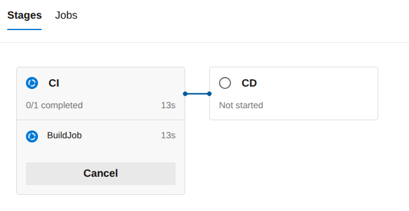
  - Final summary
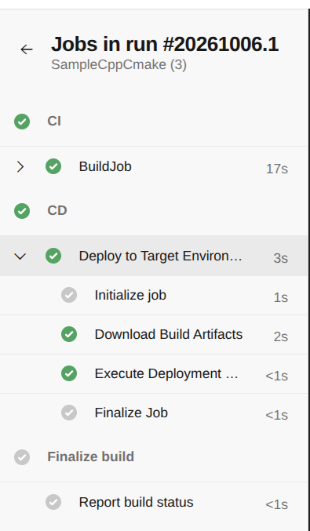
  - Downloaded files are found in the link of published links in the summary page
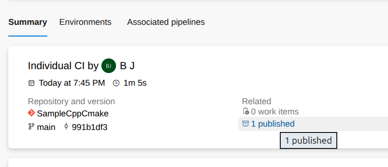

- Sample azure-piplelines.yaml (not tested):
```yaml
trigger:
  branches:
    include:
      - main
      - develop
pr:
  branches:
    include:
      - main
      - develop
 
# Use Microsoft-hosted Ubuntu agent
pool:
  vmImage: 'ubuntu-latest'
 
variables:
  buildType: 'Release'
  buildDir: 'build'
 
stages:
  - stage: Build
    displayName: "Build C++ Project"
    jobs:
      - job: Build
        steps:
          # Ensure dependencies are installed
          - task: Bash@3
            displayName: "Install dependencies"
            inputs:
              targetType: 'inline'
              script: |
                sudo apt-get update
                sudo apt-get install -y build-essential cmake
 
          # Configure CMake
          - task: CMake@1
            displayName: "CMake Configure"
            inputs:
              workingDirectory: '$(buildDir)'
              cmakeArgs: '.. -DCMAKE_BUILD_TYPE=$(buildType)'
 
          # Build with CMake
          - task: CMake@1
            displayName: "CMake Build"
            inputs:
              workingDirectory: '$(buildDir)'
              cmakeArgs: '--build . --config $(buildType)'
 
          # Run tests (if CTest is configured)
          - script: |
              cd $(buildDir)
              ctest --output-on-failure
            displayName: "Run Unit Tests"
 
          # Publish build artifacts
          - task: PublishBuildArtifacts@1
            displayName: "Publish Build Output"
            inputs:
              PathtoPublish: '$(buildDir)'
              ArtifactName: 'drop'
              publishLocation: 'Container'
 
  - stage: Deploy
    displayName: "Deploy Stage"
    dependsOn: Build
    condition: succeeded()
    jobs:
      - job: Deploy
        steps:
          - script: echo "Deploying application..."
            displayName: "Deployment Placeholder"
```

### Adding a local PC into Agent pools in Azure DevOps Pipelines
- Organization settings -> Pipelines -> Agent pools -> Add pool -> select self-hosted
- Generate a Personal Access Token (PAT)
  - User setting at top right of Organization settings
  - Click Personal Access Tokens
  - Create a new token
  - Select details then create
  - Copy tokens

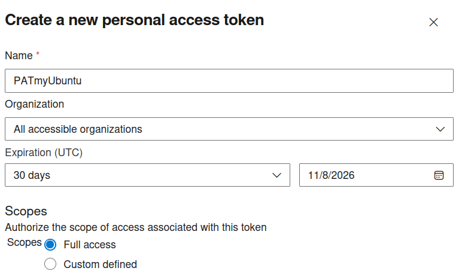

- Now goto Agent pools in Pipelines again
  - Select Agents -> New agent
  - Select OS then download (~200MB)
```bash
# Create the agent
~/$ mkdir myagent && cd myagent
~/myagent$ tar zxvf ~/Downloads/vsts-agent-linux-x64-5.280.0.tar.gz
# Configure the agent
~/myagent$ ./config.sh
  ___                      ______ _            _ _
 / _ \                     | ___ (_)          | (_)
/ /_\ \_____   _ _ __ ___  | |_/ /_ _ __   ___| |_ _ __   ___  ___
|  _  |_  / | | | '__/ _ \ |  __/| | '_ \ / _ \ | | '_ \ / _ \/ __|
| | | |/ /| |_| | | |  __/ | |   | | |_) |  __/ | | | | |  __/\__ \
\_| |_/___|\__,_|_|  \___| \_|   |_| .__/ \___|_|_|_| |_|\___||___/
                                   | |
        agent v5.280.0             |_|          (commit c7a2487)


>> End User License Agreements:

Building sources from a TFVC repository requires accepting the Team Explorer Everywhere End User License Agreement. This step is not required for building sources from Git repositories.

A copy of the Team Explorer Everywhere license agreement can be found at:
  /home/hpjeon/hw/class/udemy_AzureDevOps/pools/license.html

Enter (Y/N) Accept the Team Explorer Everywhere license agreement now? (press enter for N) > Y 

>> Connect:

Enter server URL > https://dev.azure.com/XXXXXX
Enter authentication type (press enter for PAT) > PAT
Enter personal access token > ************************************************************************************
Connecting to server ...

>> Register Agent:

Enter agent pool (press enter for default) > 
Enter agent name (press enter for XXXX) > myXXXX
Scanning for tool capabilities.
Connecting to the server.


# Optionally run the agent interactively
~/myagent$ ./run.sh
# Now run pipeline from Azure DevOps menu
```
- In the Azure DevOps pipeline, add a new yaml with:
```yaml
trigger:
- main  # update on main branch will trigger to run
pool:
  name: myUbuntu # the name of Agent created above
...
```