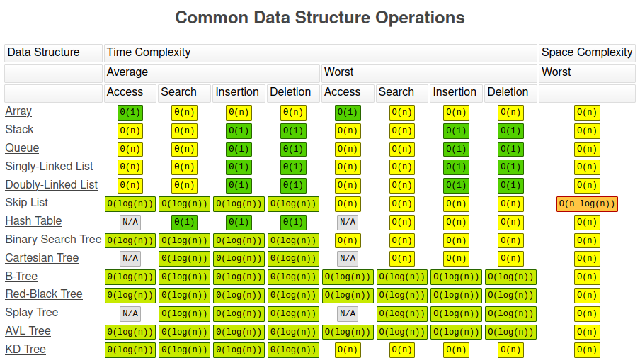
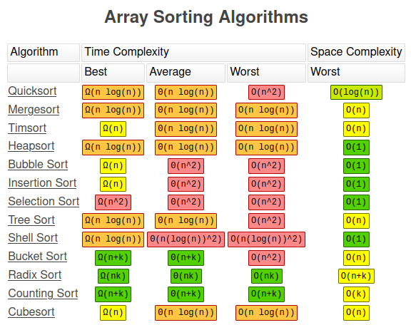

## Title: C++ Data Structures & Algorithms + LEETCODE Exercises
- Instructor: Scott Barrett

## Section 1: Introduction

1. Introduction

2. Overview

## Section 2: Code Editor

3. VS Code Installation 

4. Windows - Compiler Install

5. Linux - Compiler Install

6. Mac - Compiler Install

7. Addtional Configuration

## Section 3: Big O

8. Big O: Intro
- Time vs Space complexity
  - Wall time vs Memory consumption

9. Big O: Worst Case
- \Omega: best case
- \theta: medium case
- \Omicron: worst case

10. Big O: O(n)

11. Big O: Drop constants
- O(2n) => O(n), we drop constants

12. Big O: O(n^2)

13. Big O: Drop Non-Dominants
- O(n^2 + n) => O(n^2), lower order is not necessary to show

14. Big O: O(1)
- Constant operation cost

15. Big O: O(log n)
- Divide and conquer

16. Big O: Different Terms for Inputs

17. Big O: Vectors
- push_back() is O(1)# appending
- erase() is O(n) # remove an item and re-indexing
- Search by value is O(n)
- Search by index is O(1)

18. Big O: Wrap up
- screen shot at 3:33, 4:30



## Section 4: Pointers & Classes

19. Pointers

20. Classes

## Section 5: Linked Lists

21. Linked List: Intro

22. LL: Big O

|        | Linked List | Vector |
|--------|-------------|--------|
| Append          | O(1) | O(1) |
| Remove Last     | O(n) | O(1) |
| Prepend         | O(1) | O(n) |
| Remove First    | O(1) | O(n) |
| Insert          | O(n) | O(n) |
| Remove          | O(n) | O(n) |
| Lookup by Index | O(n) | O(1) |
| Lookup by Value | O(n) | O(n) |

23. LL: Under the Hood
- Representation using unordered-map style structure
24. LL: Constructor
- Methods in LL class
    - append: create and add
    - prepend: create and add in the beginning
    - insert: create and insert
- We make class of create as separate class - Node class
```c++
class Node {
  public:
    int value;
    Node* next;
};
```   

25. LL: Coding Exercises
- Constructor:
```c++
      LinkedList(int value) {
        Node* newNode = new Node(value);
        head = newNode;
        tail = newNode;
        length = 1;
      }
```

26. LL: Print List

27. LL: Destructor

28. LL: Append

29. LL: Delete Last(Intro)

30. LL: Delete Last(Code)
```cpp
      void deleteLast() {
        if (length==0) return;
        Node * pre = head;
        Node * tmp = head;
        while (tmp->next) {
          pre = tmp;
          tmp = tmp->next;
        }
        tail =pre;
        tail->next = nullptr;
        length--;
        if (length == 0) {
          head = nullptr;
          tail = nullptr;
        }
        delete tmp;
      }
```

31. LL: Delete Last(Rewrite)
- For better readability
```cpp
      void deleteLast() {
        if (length==0) return;
        Node * tmp = head;
        if (length == 1) {
          head = nullptr;
          tail = nullptr;
        } else {
          Node * pre = head;
          while (tmp->next) {
            pre = tmp;
            tmp = tmp->next;
          }
          tail =pre;
          tail->next = nullptr;
        }
        delete tmp;
        length--;
      }
```

32. LL: Prepend
```cpp
      void prepend(int value) {
        Node * newNode = new Node (value);
        if (length == 0) {
          head = newNode;
          tail = newNode;
        } else {
          newNode->next = head;
          head = newNode;
        }
        length++;
      }
```

33. LL: Delete First
```cpp
      void deleteFirst() {
        if (length==0) return;
        Node * tmp = head;
        if (length==1) {
          head = nullptr;
          tail = nullptr;
        } else {
          head = head->next;
        }
        delete tmp;
        length--;
      }
```

34. LL: Get
```cpp
      Node * get(uint index){
        if (index >= length) return nullptr;
        Node * tmp = head;
        for (uint i=0;i<index;i++) {
          tmp = tmp->next;
        }
        return tmp;
      }
```

35. LL: Set
```cpp
      bool set(int index, int value){
        Node* tmp = get(index);
        if (tmp) {
          tmp->value = value;
          return true;
        }
        return false;
      }
```

36. LL: Insert
```cpp
      bool insert(uint index, int value) {
        if (index >= length) return false;
        if (index ==0) {
          prepend(value);
          return true;
        }
        if (index == length) {
          append(value);
          return true;
        }
        Node* pre = get(index-1);
        Node* newNode = new Node (value);
        newNode->next = pre->next;
        pre->next = newNode;
        length++;
        return true;   
      }
```

37. LL: Delete Node
```cpp
      void deleteNode(uint index) {
        if (index == 0) deleteFirst();
        if (index = length-1) deleteLast();
        Node* tmp = get(index);
        Node* pre = get(index-1);
        pre->next = tmp->next;
        length--;
        delete tmp;
      }
```

38. LL: Reverse
```cpp
      void reverse() {
        Node* temp = head;
        head = tail;
        tail = temp;
        Node* after = temp->next;
        Node* before = nullptr;
        for(int i=0;i<length; i++) {
          after = temp->next;
          temp->next = before;
          before = temp;
          temp = after;
        }
      }
```

## Section 6: LL: Coding Exercise

```cpp
#include <iostream>
using namespace std;
class Node {
  public:
    int value;
    Node* next;
    Node (int val) {
      this->value = val;
      this->next = nullptr;
    }
};
class LinkedList {
    private:
      Node* head;
      Node* tail;
      int length;
		public:
      LinkedList(int value) {
        Node* newNode = new Node(value);
        head = newNode;
        tail = newNode;
        length = 1;
      }
      void append(int value) {
        Node * newNode = new Node(value);
        if (length ==0) {
          head = newNode;
          tail = newNode;
        } else {
          tail->next = newNode;
          tail = newNode;
        }
        length ++;
      }
      void deleteLast() {
        if (length==0) return;
        Node * tmp = head;
        if (length == 1) {
          head = nullptr;
          tail = nullptr;
        } else {
          Node * pre = head;
          while (tmp->next) {
            pre = tmp;
            tmp = tmp->next;
          }
          tail =pre;
          tail->next = nullptr;
        }
        delete tmp;
        length--;
      }
      void prepend(int value) {
        Node * newNode = new Node (value);
        if (length == 0) {
          head = newNode;
          tail = newNode;
        } else {
          newNode->next = head;
          head = newNode;
        }
        length++;
      }
      void deleteFirst() {
        if (length==0) return;
        Node * tmp = head;
        if (length==1) {
          head = nullptr;
          tail = nullptr;
        } else {
          head = head->next;
        }
        delete tmp;
        length--;
      }
      Node * get(uint index){
        if (index >= length) return nullptr;
        Node * tmp = head;
        for (uint i=0;i<index;i++) {
          tmp = tmp->next;
        }
        return tmp;
      }
      bool set(int index, int value){
        Node* tmp = get(index);
        if (tmp) {
          tmp->value = value;
          return true;
        }
        return false;
      }
      bool insert(uint index, int value) {
        if (index >= length) return false;
        if (index ==0) {
          prepend(value);
          return true;
        }
        if (index == length) {
          append(value);
          return true;
        }
        Node* pre = get(index-1);
        Node* newNode = new Node (value);
        newNode->next = pre->next;
        pre->next = newNode;
        length++;
        return true;   
      }
      void deleteNode(uint index) {
        if (index == 0) deleteFirst();
        if (index = length-1) deleteLast();
        Node* tmp = get(index);
        Node* pre = get(index-1);
        pre->next = tmp->next;
        length--;
        delete tmp;
      }
      void reverse() {
        Node* temp = head;
        head = tail;
        tail = temp;
        Node* after = temp->next;
        Node* before = nullptr;
        for(int i=0;i<length; i++) {
          after = temp->next;
          temp->next = before;
          before = temp;
          temp = after;
        }
      }
      ~LinkedList() {
            Node* temp = head;
            while (head) {
                head = head->next;
                delete temp;
                temp = head;
            }
        }
        void printList() {
            Node* temp = head;
            while (temp != nullptr) {
                cout << temp->value << endl;
                temp = temp->next;
            }
            cout << "size = " << length << " end of LL\n";
        }
        void getHead() {
            if (head == nullptr) {
                cout << "Head: nullptr" << endl;
            } else {
                cout << "Head: " << head->value << endl;
            }
        }
        void getTail() {
            if (tail == nullptr) {
                cout << "Tail: nullptr" << endl;
            } else { 
                cout << "Tail: " << tail->value << endl;
            }  
        }
        void getLength() {
            cout << "Length: " << length << endl;
        }
};
int main() {       
    LinkedList* myLinkedList = new LinkedList(4);
    myLinkedList->getHead();
    myLinkedList->getTail();
    myLinkedList->getLength();    
    cout << "\nLinked List:\n";
    myLinkedList->printList();
    myLinkedList->append(2);
    myLinkedList->printList();
    myLinkedList->deleteLast();
    myLinkedList->printList();
    myLinkedList->prepend(3);
    myLinkedList->printList();
    myLinkedList->deleteFirst();
    myLinkedList->printList();
    myLinkedList->append(3);
    myLinkedList->append(2);
    myLinkedList->printList();    
    cout << myLinkedList->get(0)->value << std::endl;
    if (myLinkedList->set(1,-1)) myLinkedList->printList();
    if (myLinkedList->insert(2,123)) myLinkedList->printList();
    myLinkedList->reverse();
    myLinkedList->printList();
      return 0; 
}
```

## Section 7: LL: Interview/Leetcode Exercises

## Section 8: Doubly Linked Lists

40. DLL: Constructor

41. DLL: Append

42. DLL: Delete Last

43. DLL: Prepend

44. DLL: Delete First

45. DLL: Get

46. DLL: Set

47. DLL: Insert

48. DLL: Insert

## Section 9: DLL: Coding Exercises

## Section 10: DLL: Interview/Leetecode Exercises

## Section 11: Stacks & Queues

49. stack: intro
- Like tennis ball container
- Last In First Out (LIFO)
- Add/remove in the end: O(1)
- Add/remove in the beginning: O(n)
 
50. Stack Constructor
- Similar to LL

51. Stack: Push

52. Stack: Pop

53. Queue: Intro
- FIFO

54. Queue: Constructor

55. Queue: Enqueue
- Adds an item from the back of the queue

56. Qeueu: Dequeue
- Removes an item from the front of the queue

## Section 12: S&Q: Coding Exercises
- Stack code:
```cpp
#include <iostream>
#include <climits>
using namespace std;
class Node {
  public:
    int value;
    Node * next;
    Node (int value) {
      this->value = value;
      next = nullptr;
    }
};
/*
      top -- node()
              |
              v
            node()
              |
              v
            nullptr
*/
class Stack {
  private:
    Node * top;
    int height;
  public:
    Stack(int value) {
      Node * newNode = new Node (value);
      top = newNode;
      height = 1;
    }
    ~Stack() {
        Node* temp = top;
        while (top) {
            top = top->next;
            delete temp;
            temp = top;
        }
    }
    void push(int value){
      Node * newNode = new Node(value);
      newNode->next = top;
      top = newNode;
      height ++;
    }
    int pop() {
      if (height ==0) return INT_MIN;
      Node * temp = top;
      int poppedValue = top->value;
      top = top->next;
      delete temp;
      height --;
      return poppedValue;
    }
    void printStack() {
        Node* temp = top;
        cout << "top \n";
        while (temp) {
            cout << temp->value << endl;
            temp = temp->next;
        }
        cout << "end of stack\n";
    }
    void getTop() {
        if (top == nullptr) {
            cout << "Top: nullptr" << endl;
        } else {
            cout << "Top: " << top->value << endl;
        }
    }
    void getHeight() {
        cout << "Height: " << height << endl;
    }
};
int main() {
    Stack* myStack = new Stack(4);
    myStack->getTop();
    myStack->getHeight();
    cout << "\nStack:\n";
    myStack->printStack();
    myStack->push(123);
    myStack->push(-1);
    myStack->push(7);
    myStack->printStack();
    //
    myStack->pop();
    myStack->printStack();
}
```
- Queue code:
```cpp
#include <iostream>
#include <climits>
using namespace std;
class Node {
  public:
    int value;
    Node * next;
    Node(int value) {
      this->value = value;
      next = nullptr;      
    }
};
class Queue {
    private:
      Node *first, *last;
      int length;
    public:
      Queue(int value){
        Node * newNode = new Node(value);
        first = newNode;
        last = newNode;
        length = 1;
      }		
    ~Queue() {
        Node* temp = first;
        while (first) {
            first = first->next;
            delete temp;
            temp = first;
        }
    }
    void enqueue(int value) {
      Node * newNode = new Node(value);
      if (length == 0) {
        first = newNode;
        last = newNode;
      } else {
        last->next = newNode;
        last = newNode;
      }
      length++;
    }
    int dequeue() {
      if (length==0) return INT_MIN;
      Node * temp = first;
      int dequeuedValue = first->value;
      if (length == 1) {
        first = nullptr;
        last = nullptr;
      } else {
        first = first->next;
      }
      delete temp;
      length--;
      return dequeuedValue;
    }
    void printQueue() {
        Node* temp = first;
        while (temp) {
            cout << temp->value << endl;
            temp = temp->next;
        }
    }
    void getFirst() {
        if (first == nullptr) {
            cout << "First: nullptr" << endl;
        } else {
            cout << "First: " << first->value << endl;
        }
    }
    void getLast() {
        if (last == nullptr) {
            cout << "Last: nullptr" << endl;
        } else { 
            cout << "Last: " << last->value << endl;
        }  
    }
    void getLength() {
        cout << "Length: " << length << endl;
    }    
    bool isEmpty() {
        if (length == 0) return true;
        return false;
    }
};
int main() {        
    Queue* myQueue = new Queue(7);
    myQueue->getFirst();
    myQueue->getLast();
    myQueue->getLength();
    cout << "\nQueue:\n";
    myQueue->printQueue();
    cout << myQueue->dequeue() << endl;
    cout << myQueue->dequeue() << endl;
    /*  
        EXPECTED OUTPUT:
        ----------------
        First: 7
        Last: 7
        Length: 1

        Queue:
        7

    */    
}
```

## Section 13: S&Q: Interview/Leetcode Exercises

## Section 14: Trees

57. Trees: Intro & Terminology
- Full trees: 0 or 2 child nodes
- Perfect trees: all nodes have exactly 2 child nodes, and all leaf nodes are at the same level
- Complete trees: All levels, except the last, are filled

58. Binary Search Trees: Example

59. BST: Big O
- O(logN) but O(N) at worst cases
  - If tree doesn't forks, it is same as LL

60. BST: Constructor

61. BST: Insert - Intro
- create newNode 
- If root == nullptr then root = newNode
- temp = root
- while loop
  - if newNode == temp return false
  - if < left else > right
  - if nullptr insert newNode else move to next

62. BST: Insert - Code

63. BST: Contains - Intro

64. BST: Contains - Code

## Section 15: BST: Coding Exercises
```cpp
#include <iostream>
using namespace std;
class Node {
  public:
    int value;
    Node * left;
    Node * right;
    Node (int value) {
      this->value = value;
      left = nullptr;
      right = nullptr;
    }
};
class BinarySearchTree {
  public:
    Node * root;
  public:
    BinarySearchTree() {
      root = nullptr;
    }
    bool insert(int value) {
      Node * newNode = new Node (value);
      if (root == nullptr) {
        root = newNode;
        return true;
      }
      Node *temp = root;
      while (true) {
        if (newNode->value == temp->value) return false;
        if (newNode->value < temp->value) {
          if (temp->left == nullptr) {
            temp->left = newNode;
            return true;
          }
          temp = temp->left;
        } else {
          if (temp->right == nullptr) {
            temp->right = newNode;
            return true;
          }
          temp = temp->right;
        }
      }
    }
    bool contains (int value) {
      Node * temp = root;
      while(temp) {
        if (value < temp->value) {
          temp = temp->left;
        } else if (value > temp->value) {
          temp = temp->right;
        } else {
          return true;
        }
      }
      return false;
    }
    // ---------------------------------------------------
    //  Below is a helper function used by the destructor
    //  Deletes all nodes in BST
    //  Similar to DFS PostOrder in Tree Traversal section
    // ---------------------------------------------------
    void destroy(Node* currentNode) {
        if (currentNode->left) destroy(currentNode->left);
        if (currentNode->right) destroy(currentNode->right);
        delete currentNode;
    }
    ~BinarySearchTree() { destroy(root); }    
};
int main() {       
    BinarySearchTree* myBST = new BinarySearchTree();    
    cout << "Root: " << myBST->root;
    myBST->insert(47);
    myBST->insert(21);
    myBST->insert(76);
    /*
        EXPECTED OUTPUT:
        ----------------
        Root: 0x0

    */
}
```

## Section 16: Hash Tables

65. Hash Table: Intro
- Hash must be deterministic

66. HT: Collisions
- Separate chaining: to avoid hash collision, store same hash value data in the same address using linked lists
- Linear probing: fill the empty addresses when collided

67. HT: Constructor

68. HT: Hash Function
```cpp
    int hash(string key) {
      int hash = 0;
      for (int i=0;i<key.length(); i++){
        int asciiValue = int(key[i]);
        hash = (hash + asciiValue * 23) % SIZE; // use prime number to randomize more
      }
      return hash;
    }
```

69. HT: Set
- When hash collision happens, the corresponding key/values are stored as LL
```cpp
    void set(string key, int value) {
      int index = hash(key);
      Node * newNode = new Node(key, value);
      if (dataMap[index] == nullptr) {
        dataMap[index] = newNode;
      } else { // when collision happens
        Node * temp = dataMap[index]; 
        while (temp->next != nullptr) {
          temp = temp->next;
        }
        temp->next = newNode;
      }
    }
```

70. HT: Get
```cpp
    int get(string key) {
      int index = hash(key);
      Node * temp = dataMap[index];
      while (temp != nullptr) {
        if (temp->key == key) return temp->value;
        temp = temp->next;
      }
      return 0; // when there is no node, still same
    }
```

71. HT: Keys
- Returns the key strings of HT
```cpp
    vector<string> keys() {
      vector<string> allKeys;
      for (int i=0;i<SIZE;i++) {
        Node *temp = dataMap[i];
        while (temp !=nullptr) {
          allKeys.push_back(temp->key);
          temp = temp->next;
        }
      }
      return allKeys;
    }
```

72. HT: Big O
- Both insert and lookup by key in a Hash Table is O(1)
  - Binary serch tree might be better for searching all values
  - Only Key lookup is O(1)
  - Value lookup would be O(N)

73. HT: Interview Question
- Find common elements b/w two vectors
  - Ex: Find 5 from (1,2,5) and (3,4,5)
- NxN loop will cost O(N^2)
- Hash table of each vector would be O(N)
  - Make HT for the first vector
  - Find hashing 2nd vector would match HT

## Section 17: HT: Coding

## Section 18: HT: Interview/Leetcode Exercises

## Section 19: Graphs

75. Graph: Intro
- Vertex or Node
  - Edge or connection b/w two nodes
  - Weighted edges show which edge will be preferred

76. Graph: Adjacency Matrix

77. Graph: Adjacency List

78. Graph: Unordered Sets

79. Graph: Big O

80. Graph: Add Vertex

81. Graph Add Edge

82. Graph: Remove Edge

83. Graph: Remove Vertex

## Section 20: Graph: Coding Exercises

## Section 21: Recursion

## Section 22: Tree Traversal

## Section 23: BST Traversal: Coding Exercises

## Section 24: Basic Sorts

## Section 25: Basic Sorts: Coding Exercises

## Section 26: Basic Sorts: Interview/Leetcode Exericses

## Section 27: Merge Sort

## Section 28: Merge Sort: Coding Exercises

## Section 29: Merge: Interview/Leetcode Exercise

## Section 30: Quick Sort

## Section 31: Quick Sort: Coding Exercises

## Section 32: Dynamic Programming

## Section 33: Vector: Interview/Leetcode Exercises

## Sectino 34: Coding Exercises
