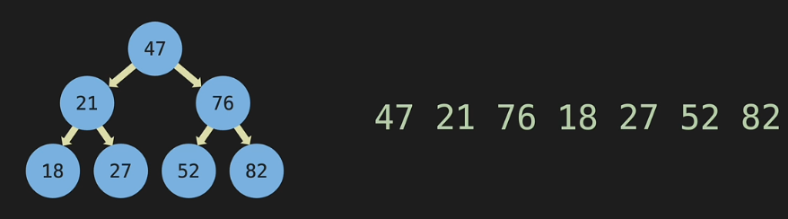
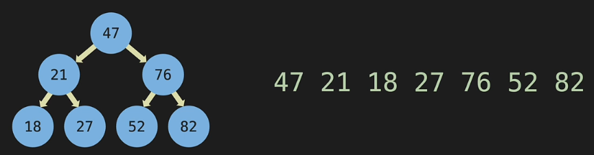

## Title: C++ Data Structures & Algorithms Made Visual
- Instructor: Scott Barrett

## Section 1: Introduction

1. Introduction

2. Overview

## Section 2: Code Editor

3. VS Code Installation 

4. Windows - Compiler Install

5. Linux - Compiler Install

6. Mac - Compiler Install

7. Addtional Configuration

## Section 3: Big O

8. Big O: Intro
- Time vs Space complexity
  - Wall time vs Memory consumption

9. Big O: Worst Case
- \Omega: best case
- \theta: medium case
- \Omicron: worst case

10. Big O: O(n)

11. Big O: Drop constants
- O(2n) => O(n), we drop constants

12. Big O: O(n^2)

13. Big O: Drop Non-Dominants
- O(n^2 + n) => O(n^2), lower order is not necessary to show

14. Big O: O(1)
- Constant operation cost

15. Big O: O(log n)
- Divide and conquer

16. Big O: Different Terms for Inputs

17. Big O: Vectors
- push_back() is O(1)# appending
- erase() is O(n) # remove an item and re-indexing
- Search by value is O(n)
- Search by index is O(1)

18. Big O: Wrap up
- screen shot at 3:33, 4:30


## Section 4: Pointers & Classes

19. Pointers

20. Classes

## Section 5: Linked Lists

21. Linked List: Intro

22. LL: Big O

|        | Linked List | Vector |
|--------|-------------|--------|
| Append          | O(1) | O(1) |
| Remove Last     | O(n) | O(1) |
| Prepend         | O(1) | O(n) |
| Remove First    | O(1) | O(n) |
| Insert          | O(n) | O(n) |
| Remove          | O(n) | O(n) |
| Lookup by Index | O(n) | O(1) |
| Lookup by Value | O(n) | O(n) |

23. LL: Under the Hood
- Representation using unordered-map style structure
24. LL: Constructor
- Methods in LL class
    - append: create and add
    - prepend: create and add in the beginning
    - insert: create and insert
- We make class of create as separate class - Node class
```c++
class Node {
  public:
    int value;
    Node* next;
};
```   

25. LL: Coding Exercises
- Constructor:
```c++
      LinkedList(int value) {
        Node* newNode = new Node(value);
        head = newNode;
        tail = newNode;
        length = 1;
      }
```

26. LL: Print List

27. LL: Destructor

28. LL: Append

29. LL: Delete Last(Intro)

30. LL: Delete Last(Code)
```cpp
      void deleteLast() {
        if (length==0) return;
        Node * pre = head;
        Node * tmp = head;
        while (tmp->next) {
          pre = tmp;
          tmp = tmp->next;
        }
        tail =pre;
        tail->next = nullptr;
        length--;
        if (length == 0) {
          head = nullptr;
          tail = nullptr;
        }
        delete tmp;
      }
```

31. LL: Delete Last(Rewrite)
- For better readability
```cpp
      void deleteLast() {
        if (length==0) return;
        Node * tmp = head;
        if (length == 1) {
          head = nullptr;
          tail = nullptr;
        } else {
          Node * pre = head;
          while (tmp->next) {
            pre = tmp;
            tmp = tmp->next;
          }
          tail =pre;
          tail->next = nullptr;
        }
        delete tmp;
        length--;
      }
```

32. LL: Prepend
```cpp
      void prepend(int value) {
        Node * newNode = new Node (value);
        if (length == 0) {
          head = newNode;
          tail = newNode;
        } else {
          newNode->next = head;
          head = newNode;
        }
        length++;
      }
```

33. LL: Delete First
```cpp
      void deleteFirst() {
        if (length==0) return;
        Node * tmp = head;
        if (length==1) {
          head = nullptr;
          tail = nullptr;
        } else {
          head = head->next;
        }
        delete tmp;
        length--;
      }
```

34. LL: Get
```cpp
      Node * get(uint index){
        if (index >= length) return nullptr;
        Node * tmp = head;
        for (uint i=0;i<index;i++) {
          tmp = tmp->next;
        }
        return tmp;
      }
```

35. LL: Set
```cpp
      bool set(int index, int value){
        Node* tmp = get(index);
        if (tmp) {
          tmp->value = value;
          return true;
        }
        return false;
      }
```

36. LL: Insert
```cpp
      bool insert(uint index, int value) {
        if (index >= length) return false;
        if (index ==0) {
          prepend(value);
          return true;
        }
        if (index == length) {
          append(value);
          return true;
        }
        Node* pre = get(index-1);
        Node* newNode = new Node (value);
        newNode->next = pre->next;
        pre->next = newNode;
        length++;
        return true;   
      }
```

37. LL: Delete Node
```cpp
      void deleteNode(uint index) {
        if (index == 0) deleteFirst();
        if (index = length-1) deleteLast();
        Node* tmp = get(index);
        Node* pre = get(index-1);
        pre->next = tmp->next;
        length--;
        delete tmp;
      }
```

38. LL: Reverse
```cpp
      void reverse() {
        Node* temp = head;
        head = tail;
        tail = temp;
        Node* after = temp->next;
        Node* before = nullptr;
        for(int i=0;i<length; i++) {
          after = temp->next;
          temp->next = before;
          before = temp;
          temp = after;
        }
      }
```

## Section 6: LL: Coding Exercise

```cpp
#include <iostream>
using namespace std;
class Node {
  public:
    int value;
    Node* next;
    Node (int val) {
      this->value = val;
      this->next = nullptr;
    }
};
class LinkedList {
    private:
      Node* head;
      Node* tail;
      int length;
		public:
      LinkedList(int value) {
        Node* newNode = new Node(value);
        head = newNode;
        tail = newNode;
        length = 1;
      }
      void append(int value) {
        Node * newNode = new Node(value);
        if (length ==0) {
          head = newNode;
          tail = newNode;
        } else {
          tail->next = newNode;
          tail = newNode;
        }
        length ++;
      }
      void deleteLast() {
        if (length==0) return;
        Node * tmp = head;
        if (length == 1) {
          head = nullptr;
          tail = nullptr;
        } else {
          Node * pre = head;
          while (tmp->next) {
            pre = tmp;
            tmp = tmp->next;
          }
          tail =pre;
          tail->next = nullptr;
        }
        delete tmp;
        length--;
      }
      void prepend(int value) {
        Node * newNode = new Node (value);
        if (length == 0) {
          head = newNode;
          tail = newNode;
        } else {
          newNode->next = head;
          head = newNode;
        }
        length++;
      }
      void deleteFirst() {
        if (length==0) return;
        Node * tmp = head;
        if (length==1) {
          head = nullptr;
          tail = nullptr;
        } else {
          head = head->next;
        }
        delete tmp;
        length--;
      }
      Node * get(uint index){
        if (index >= length) return nullptr;
        Node * tmp = head;
        for (uint i=0;i<index;i++) {
          tmp = tmp->next;
        }
        return tmp;
      }
      bool set(int index, int value){
        Node* tmp = get(index);
        if (tmp) {
          tmp->value = value;
          return true;
        }
        return false;
      }
      bool insert(uint index, int value) {
        if (index >= length) return false;
        if (index ==0) {
          prepend(value);
          return true;
        }
        if (index == length) {
          append(value);
          return true;
        }
        Node* pre = get(index-1);
        Node* newNode = new Node (value);
        newNode->next = pre->next;
        pre->next = newNode;
        length++;
        return true;   
      }
      void deleteNode(uint index) {
        if (index == 0) deleteFirst();
        if (index = length-1) deleteLast();
        Node* tmp = get(index);
        Node* pre = get(index-1);
        pre->next = tmp->next;
        length--;
        delete tmp;
      }
      void reverse() {
        Node* temp = head;
        head = tail;
        tail = temp;
        Node* after = temp->next;
        Node* before = nullptr;
        for(int i=0;i<length; i++) {
          after = temp->next;
          temp->next = before;
          before = temp;
          temp = after;
        }
      }
      ~LinkedList() {
            Node* temp = head;
            while (head) {
                head = head->next;
                delete temp;
                temp = head;
            }
        }
        void printList() {
            Node* temp = head;
            while (temp != nullptr) {
                cout << temp->value << endl;
                temp = temp->next;
            }
            cout << "size = " << length << " end of LL\n";
        }
        void getHead() {
            if (head == nullptr) {
                cout << "Head: nullptr" << endl;
            } else {
                cout << "Head: " << head->value << endl;
            }
        }
        void getTail() {
            if (tail == nullptr) {
                cout << "Tail: nullptr" << endl;
            } else { 
                cout << "Tail: " << tail->value << endl;
            }  
        }
        void getLength() {
            cout << "Length: " << length << endl;
        }
};
int main() {       
    LinkedList* myLinkedList = new LinkedList(4);
    myLinkedList->getHead();
    myLinkedList->getTail();
    myLinkedList->getLength();    
    cout << "\nLinked List:\n";
    myLinkedList->printList();
    myLinkedList->append(2);
    myLinkedList->printList();
    myLinkedList->deleteLast();
    myLinkedList->printList();
    myLinkedList->prepend(3);
    myLinkedList->printList();
    myLinkedList->deleteFirst();
    myLinkedList->printList();
    myLinkedList->append(3);
    myLinkedList->append(2);
    myLinkedList->printList();    
    cout << myLinkedList->get(0)->value << std::endl;
    if (myLinkedList->set(1,-1)) myLinkedList->printList();
    if (myLinkedList->insert(2,123)) myLinkedList->printList();
    myLinkedList->reverse();
    myLinkedList->printList();
      return 0; 
}
```

## Section 7: LL: Interview/Leetcode Exercises

## Section 8: Doubly Linked Lists

40. DLL: Constructor

41. DLL: Append

42. DLL: Delete Last

43. DLL: Prepend

44. DLL: Delete First

45. DLL: Get

46. DLL: Set

47. DLL: Insert

48. DLL: Insert

## Section 9: DLL: Coding Exercises

## Section 10: DLL: Interview/Leetecode Exercises

## Section 11: Stacks & Queues

49. stack: intro
- Like tennis ball container
- Last In First Out (LIFO)
- Add/remove in the end: O(1)
- Add/remove in the beginning: O(n)
 
50. Stack Constructor
- Similar to LL

51. Stack: Push

52. Stack: Pop

53. Queue: Intro
- FIFO

54. Queue: Constructor

55. Queue: Enqueue
- Adds an item from the back of the queue

56. Qeueu: Dequeue
- Removes an item from the front of the queue

## Section 12: S&Q: Coding Exercises
- Stack code:
```cpp
#include <iostream>
#include <climits>
using namespace std;
class Node {
  public:
    int value;
    Node * next;
    Node (int value) {
      this->value = value;
      next = nullptr;
    }
};
/*
      top -- node()
              |
              v
            node()
              |
              v
            nullptr
*/
class Stack {
  private:
    Node * top;
    int height;
  public:
    Stack(int value) {
      Node * newNode = new Node (value);
      top = newNode;
      height = 1;
    }
    ~Stack() {
        Node* temp = top;
        while (top) {
            top = top->next;
            delete temp;
            temp = top;
        }
    }
    void push(int value){
      Node * newNode = new Node(value);
      newNode->next = top;
      top = newNode;
      height ++;
    }
    int pop() {
      if (height ==0) return INT_MIN;
      Node * temp = top;
      int poppedValue = top->value;
      top = top->next;
      delete temp;
      height --;
      return poppedValue;
    }
    void printStack() {
        Node* temp = top;
        cout << "top \n";
        while (temp) {
            cout << temp->value << endl;
            temp = temp->next;
        }
        cout << "end of stack\n";
    }
    void getTop() {
        if (top == nullptr) {
            cout << "Top: nullptr" << endl;
        } else {
            cout << "Top: " << top->value << endl;
        }
    }
    void getHeight() {
        cout << "Height: " << height << endl;
    }
};
int main() {
    Stack* myStack = new Stack(4);
    myStack->getTop();
    myStack->getHeight();
    cout << "\nStack:\n";
    myStack->printStack();
    myStack->push(123);
    myStack->push(-1);
    myStack->push(7);
    myStack->printStack();
    //
    myStack->pop();
    myStack->printStack();
}
```
- Queue code:
```cpp
#include <iostream>
#include <climits>
using namespace std;
class Node {
  public:
    int value;
    Node * next;
    Node(int value) {
      this->value = value;
      next = nullptr;      
    }
};
class Queue {
    private:
      Node *first, *last;
      int length;
    public:
      Queue(int value){
        Node * newNode = new Node(value);
        first = newNode;
        last = newNode;
        length = 1;
      }		
    ~Queue() {
        Node* temp = first;
        while (first) {
            first = first->next;
            delete temp;
            temp = first;
        }
    }
    void enqueue(int value) {
      Node * newNode = new Node(value);
      if (length == 0) {
        first = newNode;
        last = newNode;
      } else {
        last->next = newNode;
        last = newNode;
      }
      length++;
    }
    int dequeue() {
      if (length==0) return INT_MIN;
      Node * temp = first;
      int dequeuedValue = first->value;
      if (length == 1) {
        first = nullptr;
        last = nullptr;
      } else {
        first = first->next;
      }
      delete temp;
      length--;
      return dequeuedValue;
    }
    void printQueue() {
        Node* temp = first;
        while (temp) {
            cout << temp->value << endl;
            temp = temp->next;
        }
    }
    void getFirst() {
        if (first == nullptr) {
            cout << "First: nullptr" << endl;
        } else {
            cout << "First: " << first->value << endl;
        }
    }
    void getLast() {
        if (last == nullptr) {
            cout << "Last: nullptr" << endl;
        } else { 
            cout << "Last: " << last->value << endl;
        }  
    }
    void getLength() {
        cout << "Length: " << length << endl;
    }    
    bool isEmpty() {
        if (length == 0) return true;
        return false;
    }
};
int main() {        
    Queue* myQueue = new Queue(7);
    myQueue->getFirst();
    myQueue->getLast();
    myQueue->getLength();
    cout << "\nQueue:\n";
    myQueue->printQueue();
    cout << myQueue->dequeue() << endl;
    cout << myQueue->dequeue() << endl;
    /*  
        EXPECTED OUTPUT:
        ----------------
        First: 7
        Last: 7
        Length: 1

        Queue:
        7

    */    
}
```

## Section 13: S&Q: Interview/Leetcode Exercises

## Section 14: Trees

57. Trees: Intro & Terminology
- Full trees: 0 or 2 child nodes
- Perfect trees: all nodes have exactly 2 child nodes, and all leaf nodes are at the same level
- Complete trees: All levels, except the last, are filled

58. Binary Search Trees: Example

59. BST: Big O
- O(logN) but O(N) at worst cases
  - If tree doesn't forks, it is same as LL

60. BST: Constructor

61. BST: Insert - Intro
- create newNode 
- If root == nullptr then root = newNode
- temp = root
- while loop
  - if newNode == temp return false
  - if < left else > right
  - if nullptr insert newNode else move to next

62. BST: Insert - Code

63. BST: Contains - Intro

64. BST: Contains - Code

## Section 15: BST: Coding Exercises
```cpp
#include <iostream>
using namespace std;
class Node {
  public:
    int value;
    Node * left;
    Node * right;
    Node (int value) {
      this->value = value;
      left = nullptr;
      right = nullptr;
    }
};
class BinarySearchTree {
  public:
    Node * root;
  public:
    BinarySearchTree() {
      root = nullptr;
    }
    bool insert(int value) {
      Node * newNode = new Node (value);
      if (root == nullptr) {
        root = newNode;
        return true;
      }
      Node *temp = root;
      while (true) {
        if (newNode->value == temp->value) return false;
        if (newNode->value < temp->value) {
          if (temp->left == nullptr) {
            temp->left = newNode;
            return true;
          }
          temp = temp->left;
        } else {
          if (temp->right == nullptr) {
            temp->right = newNode;
            return true;
          }
          temp = temp->right;
        }
      }
    }
    bool contains (int value) {
      Node * temp = root;
      while(temp) {
        if (value < temp->value) {
          temp = temp->left;
        } else if (value > temp->value) {
          temp = temp->right;
        } else {
          return true;
        }
      }
      return false;
    }
    // ---------------------------------------------------
    //  Below is a helper function used by the destructor
    //  Deletes all nodes in BST
    //  Similar to DFS PostOrder in Tree Traversal section
    // ---------------------------------------------------
    void destroy(Node* currentNode) {
        if (currentNode->left) destroy(currentNode->left);
        if (currentNode->right) destroy(currentNode->right);
        delete currentNode;
    }
    ~BinarySearchTree() { destroy(root); }    
};
int main() {       
    BinarySearchTree* myBST = new BinarySearchTree();    
    cout << "Root: " << myBST->root;
    myBST->insert(47);
    myBST->insert(21);
    myBST->insert(76);
    /*
        EXPECTED OUTPUT:
        ----------------
        Root: 0x0

    */
}
```

## Section 16: Hash Tables

65. Hash Table: Intro
- Hash must be deterministic

66. HT: Collisions
- Separate chaining: to avoid hash collision, store same hash value data in the same address using linked lists
- Linear probing: fill the empty addresses when collided

67. HT: Constructor

68. HT: Hash Function
```cpp
    int hash(string key) {
      int hash = 0;
      for (int i=0;i<key.length(); i++){
        int asciiValue = int(key[i]);
        hash = (hash + asciiValue * 23) % SIZE; // use prime number to randomize more
      }
      return hash;
    }
```

69. HT: Set
- When hash collision happens, the corresponding key/values are stored as LL
```cpp
    void set(string key, int value) {
      int index = hash(key);
      Node * newNode = new Node(key, value);
      if (dataMap[index] == nullptr) {
        dataMap[index] = newNode;
      } else { // when collision happens
        Node * temp = dataMap[index]; 
        while (temp->next != nullptr) {
          temp = temp->next;
        }
        temp->next = newNode;
      }
    }
```

70. HT: Get
```cpp
    int get(string key) {
      int index = hash(key);
      Node * temp = dataMap[index];
      while (temp != nullptr) {
        if (temp->key == key) return temp->value;
        temp = temp->next;
      }
      return 0; // when there is no node, still same
    }
```

71. HT: Keys
- Returns the key strings of HT
```cpp
    vector<string> keys() {
      vector<string> allKeys;
      for (int i=0;i<SIZE;i++) {
        Node *temp = dataMap[i];
        while (temp !=nullptr) {
          allKeys.push_back(temp->key);
          temp = temp->next;
        }
      }
      return allKeys;
    }
```

72. HT: Big O
- Both insert and lookup by key in a Hash Table is O(1)
  - Binary serch tree might be better for searching all values
  - Only Key lookup is O(1)
  - Value lookup would be O(N)

73. HT: Interview Question
- Find common elements b/w two vectors
  - Ex: Find 5 from (1,2,5) and (3,4,5)
- NxN loop will cost O(N^2)
- Hash table of each vector would be O(N)
  - Make HT for the first vector
  - Find hashing 2nd vector would match HT

## Section 17: HT: Coding

## Section 18: HT: Interview/Leetcode Exercises

## Section 19: Graphs

75. Graph: Intro
- Vertex or Node
  - Edge or connection b/w two nodes
  - Weighted edges show which edge will be preferred

76. Graph: Adjacency Matrix


77. Graph: Adjacency List


78. Graph: Unordered Sets
- Similar to unordered map but no values. Only keys
- No duplicates
- Used to store adjacency list 

79. Graph: Big O
- Adjacency Matrix: O(V^2)
- Adjacency List: O(V+E)

80. Graph: Add Vertex
- O(1)
```cpp
  bool addVertex(string vertex) {
    if (adjList.count(vertex) == 0) {
      adjList[vertex];
      return true;
    }
    return false;
  }
```

81. Graph Add Edge
```cpp
  bool addEdge(string vertex1, string vertex2){
    if (adjList.count(vertex1) !=0 && adjList.count(vertex2) != 0){
      adjList.at(vertex1).insert(vertex2);
      adjList.at(vertex2).insert(vertex1);
      return true;
    }    
    return false;
  }
```

82. Graph: Remove Edge
```cpp
  bool removeEdge(string vertex1, string vertex2) {
    if (adjList.count(vertex1) !=0 && adjList.count(vertex2) != 0){
      adjList.at(vertex1).erase(vertex2);
      adjList.at(vertex2).erase(vertex1);
      return true;
    }
    return false;
  }
```

83. Graph: Remove Vertex
- Looping over the adjacent list of the removing vertex, we can find which vertices contain the removing vertex
  - O(V+E)
```cpp
  bool removeVertex(string vertex) {
    if (adjList.count(vertex) ==0) return false;
    for (auto otherVertex: adjList.at(vertex)) {
      adjList.at(otherVertex).erase(vertex);
    }
    adjList.erase(vertex);
    return true;
  }
```

## Section 20: Graph: Coding Exercises
```cpp
#include <iostream>
#include <unordered_map>
#include <unordered_set>
using namespace std;
class Graph {
private:
  unordered_map<string, unordered_set<string> > adjList;
public:
  bool addVertex(string vertex) {
    if (adjList.count(vertex) == 0) {
      adjList[vertex];
      return true;
    }
    return false;
  }
  bool addEdge(string vertex1, string vertex2){
    if (adjList.count(vertex1) !=0 && adjList.count(vertex2) != 0){
      adjList.at(vertex1).insert(vertex2);
      adjList.at(vertex2).insert(vertex1);
      return true;
    }    
    return false;
  }
  bool removeEdge(string vertex1, string vertex2) {
    if (adjList.count(vertex1) !=0 && adjList.count(vertex2) != 0){
      adjList.at(vertex1).erase(vertex2);
      adjList.at(vertex2).erase(vertex1);
      return true;
    }
    return false;
  }
  bool removeVertex(string vertex) {
    if (adjList.count(vertex) ==0) return false;
    for (auto otherVertex: adjList.at(vertex)) {
      adjList.at(otherVertex).erase(vertex);
    }
    adjList.erase(vertex);
    return true;
  }
  void printGraph() {
    unordered_map<string, unordered_set<string>>::iterator kvPair = adjList.begin();
    while (kvPair != adjList.end()) {
      cout  << kvPair->first << ": [ ";  // this prints out the vertex
      unordered_set<string>::iterator edge = kvPair->second.begin();
      while (edge != kvPair->second.end()) {
          cout  << edge->data() << " ";  // this prints out edges
          edge++;
      }
      cout << "]" << endl;
      kvPair++;
    }
  }
};
int main() {
    Graph* myGraph = new Graph();
    myGraph->addVertex("A");
    myGraph->addVertex("B");
    myGraph->addVertex("C");
    myGraph->addEdge("A", "B");
    myGraph->addEdge("C", "B");
    myGraph->addEdge("A", "C");
    cout << "Graph:\n";
    myGraph->printGraph();    
    //myGraph->removeEdge("A", "B");
    myGraph->removeVertex("C");
    myGraph->printGraph();    
}
```

## Section 21: Recursion

84. Recursion: intro

85. Call Stack
- When function A calls function B inside while function B calls function C inside ...
- Those calls are stacked in the call stack (can be viewed from debugger)

86. Factorial

## Section 22: Tree Traversal

87. Tree Traversal: Intro
- Breadth first search and Depth first search

88. BFS(Breadth First Search): Intro
- Start from the root, and go each row one by one

89. BFS: Code
```cpp
#include <iostream>
#include <queue>
using namespace std;
class Node { 
  public: 
    int value;
    Node* left;
    Node* right;
    Node(int value) {
      this->value = value;
      left = nullptr;
      right = nullptr;
    }
};
class BinarySearchTree {
public:
  Node* root;
public:
  BinarySearchTree() { root = nullptr; }
  // ---------------------------------------------------
  //  Helper function used by destructor
  //  Deletes all nodes in BST
  //  Similar to DFS PostOrder in Tree Traversal section
  // ---------------------------------------------------
  void destroy(Node* currentNode) {
      if (currentNode) {
          destroy(currentNode->left);
          destroy(currentNode->right);
          delete currentNode;
      }
  }
  ~BinarySearchTree() { destroy(root); }
  void insert(int value) {
    Node* newNode = new Node(value);
    if (root == nullptr) {
      root = newNode;
      return;
    }
    Node* temp = root;
    while(true) {
      if (newNode->value == temp->value) return;
      if (newNode->value < temp->value) {
        if (temp->left == nullptr) {
            temp->left = newNode;
            return;
        }
        temp = temp->left;
      } else {
        if (temp->right == nullptr) {
            temp->right = newNode;
            return;
        }
        temp = temp->right;
      }
    }
  }
  bool contains(int value) {
    if (root == nullptr) return false;
    Node* temp = root;
    while(temp) {
      if (value < temp->value) {
          temp = temp->left;
      } else if (value > temp->value) {
          temp = temp->right;
      } else {
          return true;
      }
    }
    return false;
  }
  void BFS() {
    queue<Node*> myQueue;
    myQueue.push(root);
    while(myQueue.size() >0) {
      Node* currentNode = myQueue.front();
      myQueue.pop();
      cout << currentNode->value << " ";
      if (currentNode->left != nullptr) {
        myQueue.push(currentNode->left);
      }
      if (currentNode->right != nullptr) {
        myQueue.push(currentNode->right);
      }
    }
  }
};
int main() {        
    BinarySearchTree* myBST = new BinarySearchTree();
    myBST->insert(47);
    myBST->insert(21);
    myBST->insert(76);
    myBST->insert(18);
    myBST->insert(27);
    myBST->insert(52);
    myBST->insert(82);
    cout << "Breadth First Search:\n";
    myBST->BFS();
    /*
        EXPECTED OUTPUT:
        ----------------
        Breadth First Search:
        47 21 76 18 27 52 82 

    */        
}
```

- Q: Why use queue? not vector? not list?

90. DFS(Depth First Search): PreOrder - Intro
- Ref: https://www.geeksforgeeks.org/tree-traversals-inorder-preorder-and-postorder/
- Algorithm Preorder(tree)
  - Visit the root.
  - Traverse the left subtree, i.e., call Preorder(left->subtree)
  - Traverse the right subtree, i.e., call Preorder(right->subtree) 

91. DFS: PreOrder - Code
```cpp
void DFSPreOrder(Node* currentNode) {
  cout << currentNode->value << " ";
  if (currentNode->left != nullptr) {
    DFSPreOrder(currentNode->left);
  }
  if (currentNode->right != nullptr) {
    DFSPreOrder(currentNode->right);
  }
}
void DFSPreOrder() { DFSPreOrder(root); }
```


92. DFS: PostOrder - Intro
- Ref: https://www.geeksforgeeks.org/tree-traversals-inorder-preorder-and-postorder/
- Algorithm Postorder(tree)
  - Traverse the left subtree, i.e., call Postorder(left->subtree)
  - Traverse the right subtree, i.e., call Postorder(right->subtree)
  - Visit the root

93. DFS: PostOrder - Code
```cpp
void DFSPostOrder(Node* currentNode) {
  if (currentNode->left != nullptr) {
    DFSPostOrder(currentNode->left);
  }
  if (currentNode->right != nullptr) {
    DFSPostOrder(currentNode->right);
  }
 cout << currentNode->value << " ";
}
void DFSPostOrder() { DFSPostOrder(root); }
```


94. DFS: InOrder - Intro
- Algorithm Inorder(tree)
  - Traverse the left subtree, i.e., call Inorder(left->subtree)
  - Visit the root.
  - Traverse the right subtree, i.e., call Inorder(right->subtree)

95. DFS: InOrder - Code
```cpp
void DFSInOrder(Node* currentNode) {
  if (currentNode->left != nullptr) {
    DFSInOrder(currentNode->left);
  }
  cout << currentNode->value << " ";
  if (currentNode->right != nullptr) {
    DFSInOrder(currentNode->right);
  }
}
void DFSInOrder() { DFSInOrder(root); }
```


## Section 23: BST Traversal: Coding Exercises

## Section 24: Basic Sorts

96. Bubble Sort: Intro

97. Bubble Sort: Code
```cpp
#include<iostream>
void bubbleSort(int array[], int size, int &n) {
  n = 0;
  for (int i= size-1; i> 0; i--) {
    for (int j= 0; j < i; j++) {
      if (array[j] > array[j+1]) {
        int temp = array[j];
        array[j] = array[j+1];
        array[j+1] = temp;
        n++;
      }
    }
  }
}
int main() {
  int n = 0;
  int myA[] = {6,4,2,5,1,3};
  int size = sizeof(myA) / sizeof(myA[0]);
  bubbleSort(myA, size, n);
  for (auto v : myA) {
    std::cout << v << " ";
  }
  std::cout << std::endl;
  std::cout << "N. of investigation = " << n << std::endl;
}
```
- Took 11 swaps

98. Selection Sort: Intro

99. Selection Sort: Code
```cpp
void selectionSort(int array[], int size, int &n) {
  n = 0;
  for (int i=0; i< size; i++) {
    int minIndx=i;
    for (int j=i+1;j<size; j++) {
      if (array[j] < array[minIndx]) {
        minIndx = j;
      }
    }
    if (i != minIndx) {
      int temp = array[i];
      array[i] = array[minIndx];
      array[minIndx] = temp;
      n++;
    }
  }
}
```
- Took 5 swaps

100. Insertion Sort: Intro

101. Insertion Sort: Code
```cpp
void insertionSort(int array[], int size, int &n) {
  n = 0;
  for (int i=1; i< size; i++) {
    int temp = array[i];
    int j = i-1;
    while (j> -1 && temp < array[j]) { // order matters
      array[j+1] = array[j];
      array[j] = temp;
      j--;
      n++;
    }
  }
}
```
- Took 11 swaps

102. Insertion Sort: Big O
- O(N^2) as worst
- O(N) as best
  - When **almost** sorted
- In terms of space complexity (memory consumption), those sorting methods are of O(N)

## Section 25: Basic Sorts: Coding Exercises

## Section 26: Basic Sorts: Interview/Leetcode Exericses

## Section 27: Merge Sort

103. Merge Sort: Overview
- Ref: https://www.geeksforgeeks.org/merge-sort/
- Merge sort is a recursive algorithm that continuously splits the array in half until it cannot be further divided i.e., the array has only one element left (an array with one element is always sorted). Then the sorted subarrays are merged into one sorted array.

104. Merge: Intro (1)

105. Merge: Intro (2)

106. Merge: Code (1)

107. Merge: Code (2)
```cpp

void merge(int array[], int leftIndex, int midIndex, int rightIndex) {
  int leftArraySize = midIndex - leftIndex + 1;
  int rightArraySize = rightIndex - midIndex;
  int leftArray[leftArraySize];
  int rightArray[rightArraySize];
  for (int i=0; i< leftArraySize; i++)
    leftArray[i] = array[leftIndex + i];
  for (int j=0; j< rightArraySize; j++)
    rightArray[j] = array[midIndex + 1 + j];
  int index = leftIndex;
  int i=0;
  int j=0;
  while (i <leftArraySize && j< rightArraySize) {
    if (leftArray[i] <= rightArray[j]){
      array[index] = leftArray[i];
      index++;
      i++;
    } else {
      array[index] = rightArray[j];
      index++;
      j++;
    }
  }
  while (i<leftArraySize) {
    array[index] = leftArray[i];
    index++;
    i++;
  }
  while (j<rightArraySize) {
    array[index] = rightArray[j];
    index++;
    j++;
  }
}
```
- This code segment runs OK when the left/right halves are sorted respectively
  - {1,3,7,9,2,4,6,8} is OK
  - {3,1,7,9,8,4,2,6} not OK

108. Merge Sort: Intro
- Breaks arrays in half
- Base case: when sub-array size is 1
- Calls merge() to pu sub-arrays together

109. Merge Sort: Code
```cpp
#include<iostream>
void merge(int array[], int leftIndex, int midIndex, int rightIndex) {
  int leftArraySize = midIndex - leftIndex + 1;
  int rightArraySize = rightIndex - midIndex;
  int leftArray[leftArraySize];
  int rightArray[rightArraySize];
  for (int i=0; i< leftArraySize; i++)
    leftArray[i] = array[leftIndex + i];
  for (int j=0; j< rightArraySize; j++)
    rightArray[j] = array[midIndex + 1 + j];
  int index = leftIndex;
  int i=0;
  int j=0;
  while (i <leftArraySize && j< rightArraySize) {
    if (leftArray[i] <= rightArray[j]){
      array[index] = leftArray[i];
      index++;
      i++;
    } else {
      array[index] = rightArray[j];
      index++;
      j++;
    }
  }
  while (i<leftArraySize) {
    array[index] = leftArray[i];
    index++;
    i++;
  }
  while (j<rightArraySize) {
    array[index] = rightArray[j];
    index++;
    j++;
  }
}
void mergeSort(int array[], int leftIndex, int rightIndex) {
  if (leftIndex >= rightIndex) return;
  int midIndex = leftIndex + (rightIndex - leftIndex)/2;
  mergeSort(array, leftIndex, midIndex);
  mergeSort(array, midIndex+1, rightIndex);
  merge(array, leftIndex, midIndex, rightIndex);
}
int main() {
  int n = 0;
  int myA[] = {1,8,7,3,6,4,5,2}; //
  int size = sizeof(myA) / sizeof(myA[0]);
  int leftIndex = 0;
  int rightIndex = size - 1;
  mergeSort(myA, leftIndex, rightIndex);
  for (auto v : myA) {
    std::cout << v << " ";
  }
  std::cout << std::endl;
  std::cout << "N. of investigation = " << n << std::endl;
}
```

110. Merge Sort: Big O
- Space complexity: O(n)
- Time complexity: O(n log n)

## Section 28: Merge Sort: Coding Exercises

## Section 29: Merge: Interview/Leetcode Exercise

## Section 30: Quick Sort

111. Quick Sort: Intro
- Ref: https://www.geeksforgeeks.org/quick-sort/
- QuickSort is a sorting algorithm based on the Divide and Conquer algorithm that picks an element as a pivot and partitions the given array around the picked pivot by placing the pivot in its correct position in the sorted array.

112. Pivot: Intro

113. Pivot: Code

114. Quick Sort: Code
```cpp
#include <iostream>
using namespace std;
void swap(int array[], int firstIndex, int secondIndex) {
    int temp = array[firstIndex];
    array[firstIndex] = array[secondIndex];
    array[secondIndex] = temp;
}
int pivot(int array[], int pivotIndex, int endIndex) {
    int swapIndex = pivotIndex;
    for (int i = pivotIndex + 1; i <= endIndex; i++) {
        if (array[i] < array[pivotIndex]) {
            swapIndex++;
            swap(array, swapIndex, i);
        }
    }
    swap(array, pivotIndex, swapIndex);
    return swapIndex;
}
void quickSort(int array[], int leftIndex, int rightIndex) {
    if (leftIndex >= rightIndex) return; 
    int pivotIndex = pivot(array, leftIndex, rightIndex);
    quickSort(array, leftIndex, pivotIndex-1);
    quickSort(array, pivotIndex+1, rightIndex);
}
int main() {    
    int myArray[] = {4,6,1,7,3,2,5};
    int size = sizeof(myArray) / sizeof(myArray[0]);
    quickSort(myArray, 0, size-1);
    for (auto value : myArray) {  
        cout << value << " ";
    }    
    /*
        EXPECTED OUTPUT:
        ----------------
        1 2 3 4 5 6 7         
     */
}
```

115. Quick Sort: Big O
- Pivot: O(n)
  - Recurisve part: log n
- Total cost: O (n log n)
  - Best/average
- Worst case would be O (n^2)
  - When already sorted

## Section 31: Quick Sort: Coding Exercises

## Section 32: Dynamic Programming

116. Overlapping Subproblems
- Memoization
  - Solve each sub problem and store results. Then just lookup table when same problem is met

117. Optimized Substructure

118. Fibonacci Sequence
- Redundancy in Fibonacci function calls
```cpp
int fib(int n) {
  if (n==0 || n==1) {
    return n;
  }
  return fib(n-1) + fib(n-2);
}
```
  - O(2^n)
  - Can be reduced into O(n) using memoization

119. Memoization
```cpp
std::vector<int> memo(100,-1);
int fib(int n) {
  if (memo[n] != -1) {
    return memo[n];
  }
  if (n==0 || n==1) {
    return n;
  }
  memo[n] = fib(n-1) + fib(n-2);
  return memo[n];
}
```
  - O(n)

120. Bottom Up
- Those above mentioned methods are top-down. Let's write bottom-up Fibonacci code
```cpp
int fib(int n) {
  vector<int> fibList;
  fibList.push_back(0);
  fibList.push_back(1);
  for (int index=2; index <=n; index++) {
    fibList[index] = fibList[index-1] + fibList[index-2];
  }
  return fibList[n];
}
```
  - O(n-1)
  - No memoization here
  
## Section 33: Vector: Interview/Leetcode Exercises

## Sectino 34: Coding Exercises
