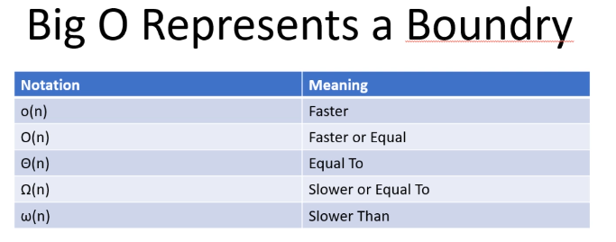
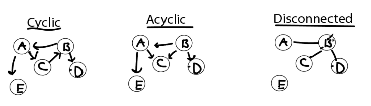
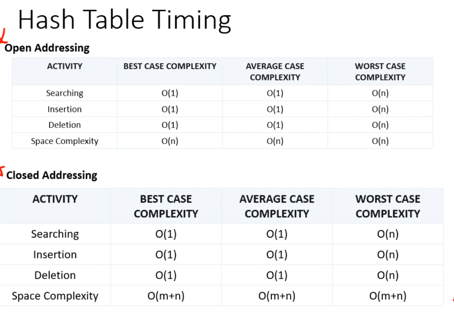

## Computer Science 101: Master the Theory Behind Programming
- Instructor: Kurt Anderson

## Section 1: Introduction

### 1. Introduction

### 2. Binary Number Introduction

### 3. Binary Deca Number Conversion

### 4. Binary Number System Notes

## Section 2: Analyzing Algorithms

### 5. All Notes
- A single pdf file is included

### 6. Introduction to Time-Complexity

### 7. Math Refresher: Logarithmic Functions

### 8. Math Refresher: Factorial Functions

### 9. Math Refresher: Algebraic Expressions

### 10. Math Refresher Notes

### 11. n-notation Introduction
- n is a function of n
  - n input yields n (or $n^2$) operations
- Allows us to see how an algorithm scales with input size

### 12. n-notation Scaling
- n-Notation Scaling Goals
  - We are looking for large patterns
  - We want to see major efficiency changes b/w different algorithms
- Rules
  - We don't care about multiples
    - $n^2 ~= 3n^2$
  - We take the largest in an equation
    - $n^2 + n \log n => n^2$

### 13. n-notation Example

### 14. Big O Notation

- $O$(n^2): at worst, would be n-scaling
- $\Omega$(n^2): at best, would be n-scaling

### 15. n-Notation Notes

### 16. Big O Real-World Example

## Section 3: Arrays

### 17. How is Data Stored?

### 18. Fixed Array Introduction

### 19. Fixed Array Run Times
- Insert(Rand): $O(n)$, linear. By average, this corresponds to n/2
- Insert(Front): $O(n)$, linear
- Insert(Back): $O(1)$, constant
- Delete(Front): $O(n)$, linear
- Delete(Back): $O(1)$, constant
- Search(Unsorted): $O(n)$, linear
- Search(Sorted): binary search is $O(\log n)$

### 20. Binary Search Algorithm (Fixed Array Sorted Search)
- Brute force search
  - Incremental search along index, linear = O(n)
- Binary search
  - After sorting, search the element of (L+R)/2
  - L/R change by search condition

### 21. Fixed Array Notes

### 22. Circular Array Intro + Modulo
- Insert(Rand): $O(n)$
- Insert(Front): $O(1)$
  - Not really inserting in the front. This goes to the last. Then Front anchor moves to the last
- Insert(Back): $O(1)$
- Delete(Front): $O(1)$
- Delete(Back): $O(1)$
- Search(Unsorted): $O(n)$
- Search(Sorted): $O(\log n)$
- Access Time: $O(1)$
- % or modulo operation

### 23. Circular Array Deep Dive
- Front - 1 is mapped into the Last using modulo operation
- Anchors of Front and Back

### 24. Circular Array Code Example

### 25. Dynamic Arrays
- A growing array
- When requested, we double the size
- Copying the existing data into new array takes O(n)
  - Once extended, adding one up to the end takes O(1)

### 26. O(1) Approximation
- As doubling the size,
  - $O(1) + O(1) + O(n) + ...$
  - O(n) appears as $\log$ n
  - Total cost approximates to: $(n- \log n)/n \times O(1) + (\log n) /n \times O(n) ~= O(1)$
    - Q: ? Isn't this $\log n$ as $O(n)$ is an order of n?

### 27. Circular and Dynamic Array Notes

### 28. Array Review

### 29. Array Real World + Code Examples

## Section 4: Linked Lists

### 30. Nodes
- A locational object

### 31. Singly Linked List

### 32. Linked List Run Times
| Operation    | Array | Linked List |
|--------------|-------|-------------|
| Insert(Rand) | O(n)  | O(n) |
| Insert(Front)| O(n)  | O(1) |
| Insert(Back) | O(1)  | O(n) |
| Delete(Front)| O(n)  | O(1) |
| Delete(Back) | O(1)  | O(n) |
| Search(Unsorted)| O(n) | O(n) |
| Search(Sorted)| O($\log$ n) | O(n) |
| Access Time   | O(1) | O(n) |

- Extending the size of LL doesn't need doubling like array

### 33. Singly Linked-List Code Example

### 34. Singly-Linked List Notes

### 35. Doubly Linked List

### 36. Tail Pointers
- Can save run-time for:
  - Insert(Back)/Delete(Back) become O(1)

### 37. Doubly-Linked List and Tail Pointer Notes

### 38. Linked List Real World Examples

### 39. Linked List Review

## Section 5: Stacks and Queues

### 40. Stacks
- Analogy of stacked trays
- LIFO: Last (or most recent) In First Out
- Can be implemented using an array or LL
- Methods in stack STL
  - push()/top()/top()/empty()/size()

### 41. Stack Examples

### 42. Stack Code Example

### 43. Stack Notes

### 44. Queues
- Analogy of the line in bank teller
- FIFO (First In First Out)
  - Longest waiting gets served first
- Keeps moving, not stationary
- push(): from Back
- pop(): from Front
- Can be implemented using an array or LL

### 45. Queue Examples
- Enqueue() == push() in queue
- Dequeue() == pop() in queue

### 46. Queue Code Example
- Python code using DLL

### 47. Queue Notes

### 48. Queue and Stack Run Times
- Depends on the implementation
- push/pop/enqueue/dequeue would be O(1)
  - If not, implementation might not be efficient

### 49. Stack and Queue Real World Examples
- Stack: undo & redo in MS word
- Queue: Scheduling in the printer

### 50. Stacks and Queues Quiz Explanation

## Section 6: Sorting Algorithms

### 51. Introduction to Sorting Algorithms

### 52. Bubble Sort
- Simple but not recommneded
- Compares the current element with next element then swaps
  - Bubbling up and moves the largest into the right end
  - Repeats this until all sort out
- Bad efficiency
  - Best run time = $\Omega(n)$
  - Average run time = $\Theta(n^2)$
  - Worst run time = $O(n^2)$

 
### 53. Bubble Sort Coding Example
```py
def bubbleSort(arr):
  n = len(arr)
  for i in range(0,n-1):
    for j in range(0,n-i-1):
      if arr[j] > arr[j+1]:
        arr[j], arr[j+1] = arr[j+1],arr[j]
```        

### 54. Bubble Sort Notes

### 55. Selection Sort
- Moves the smallest into the left end
- Moves the anchor to the 2nd index
- Find the smallest in the left-over to the left end by the anchor
- Repeats
- Quite bad efficiency
  - Best run time = $\Omega(n^2)$
  - Average run time = $\Theta(n^2)$
  - Worst run time = $O(n^2)$

### 56. Selection Sort Code Example
```py
def selectionSort(arr):
  n = len(arr)
  for i in range(0,n-1):
    min_index = i
    for j in range(i+1,n-1):
      if arr[min_index] > arr[j]:
        min_index = j
    arr[i],arr[min_index] = arr[min_index],arr[i]
```    

### 57. Selection Sort Notes

### 58. Insertion Sort
- Moves an anchor then compare the value there to the left side arrays then inserts into the right place using bubble sort with previous value
- Quite bad efficiency
  - Best run time = $\Omega(n)$
  - Average run time = $\Theta(n^2)$
  - Worst run time = $O(n^2)$

### 59. Insertion Sort Notes

### 60. Recursion

### 61. Quick Sort
- Assumes a median, then splits the entire array into smaller or larger ones
  - In each bin, apply the same strategy, splitting into a smaller and larger bin
  - Reaching the leaf of the tree, assembles the results

### 62. Quick Sort Run Time
- Good efficiency overall but worst run is not improved
  - Best run time = $\Omega(n\log n)$
  - Average run time = $\Theta(n\log n)$
  - Worst run time = $O(n^2)$

### 63. Quick Sort Notes

### 64. Quick Sort Code Examples
```py
def quickSort(arr, low, high):
  if low < high:
    partitionIndex = partition(arr,low,high)
    quickSort(arr,low, partitionIndex-1)
    quickSort(arr,partitionIndex+1,high)
def partition(arr,low,high):
  i = (low-1)
  pivot = arr[high]
  for j in range(low, high):
    if arr[j] < pivot:
      i = i+1
      arr[i],arr[j] = arr[j],arr[i]
  arr[i+1],arr[high] = arr[high],arr[i+1]
  return (i+1)
arr = [2,7,3,8,1,9]
quickSort(arr,0,len(arr)-1)
```

### 65. Merge Sort
- Splits array into small containers, up to two elements
- Those containers of 2 elements are sorted
- Puts a cursor on each container, marks which is the smaller one
- Merges two containers, using the cursor on each and sorting
- Repeats

### 66. Merge Sort Run Times
- Even the worst run time is $O(n\log n)$

Sorting Algorithm | Best Run Time | Average Run Time | Worst Run Time
 ---------------|--------------|----------|-------
 Bubble sort | $\Omega(n)$ | $\Theta(n^2)$ | $O(n^2)$
 Selection sort | $\Omega(n^2)$ | $\Theta(n^2)$ | $O(n^2)$
 Insertion sort |  $\Omega(n)$ | $\Theta(n^2)$ | $O(n^2)$
 Quick sort |  $\Omega(n\log n)$ | $\Theta(n\log n)$ | $O(n^2)$
 Merge sort |  $\Omega(n\log n)$ | $\Theta(n\log n)$ | $O(n\log n)$

### 67. Merge Sort Notes

### 68. Merge Sort Code Example

### 69. Stable vs NonStable Sort
- For [1,2,5,2'] 
  - 2' is actually 2. Just for distinction
  - Stable sort: 1,2,2',5
  - Nonstable sort: 1,2',2,5
- Stable sort: Bubble, Insertion, Merge
- NonStable sort: Selection, Quick

### 70. Stable Vs NonStable Notes

### 71. Sorting Algorithm Real World Examples
 
## Section 7: Trees

### 72. Trees

### 73. Binary Search Trees (BST)

### 74. Binary Serch Tree Run Times

Operation | Average     | Worst case
----------|-------------|------------
Search    | $O(\log n)$ | $O(n)$
Insert    | $O(\log n)$ | $O(n)$
Delete    | $O(\log n)$ | $O(n)$

- If insertion is made as ascending or descending order, the Tree becomes LL basically, having $O(n)$

### 75. Tree Code Example
```py
class Node:
  def __init__(self,key):
    self.left = None
    self.right = None
    self.val = key
def insert(root,key):
  if root is None:
    return Node(key)
  else:
    if root.val == key:
      return root
    elif root.val < key:
      root.right = insert(root.right,key)
    else:
      root.left = insert(root.left,key)
  return roo
r = Node(45)
r = insert(r,22)
r = insert(r,78)
r = insert(r,75)
```

### 76. Tree Notes

### 77. Tree Traversals
- In order: Left, Root, Right
- Pre order: Root, Left, Right
- Post order: Left, Right, Root
- Example:
```
       20
      /  \
    10    25
    /\    /
   5  13  23
    \      \
     7      24
     /\
    6  8
```    
- In order: 5,6,7,8,10,13,20,23,24
- Pre order: 20,10,5,7,6,8,13,25,23,24
- Post order: 6,8,7,5,13,10,24,23,25,20

### 78. Tree Real World Examples
- File system: directories/files

## Section 8: Heaps

### 79. Heaps Introduction
- Subdivision of TREE
- Heap property
  - By the level of tree
  - When a parent is greater than children: max
    - Not sum of children but each child value
    - The root is the maximum
  - When a parent is less than children: min

### 80. Heap Analysis
- Example: 5,3,2,10,1,1,15
```
    15
    /\
  10  11
  /\   /\
 3 5  1  2
```
- Insert: $O(\log n)$
- Check max: $O(1)$ - always top in heap
- Remove max: $O(\log n)$ - update the max with second value then re-order

### 81. Heaps Real World Examples
- Dijkstra's Shortest Path Algorithm

### 82. Heap Notes
- https://www.geeksforgeeks.org/binary-heap/

## Section 9: Graphs

### 83. Introduction to Graphs

### 84. Basic Types of Graphs
- Directed: one direction only
- Undirected: both directions
- Weighted: 

### 85. Graph Terminology
- Vertex
- Edge set
- Adjacency: near-by nodes, which are connected
- Cyclic: returning graphs. May not be efficient
- Acyclic
- Disconnected


### 86. Graph Terminology Summary
- Vertex (vertices) – A point on the graph. We have called these “nodes” in the past. Usually represented as letters or numbers in theory.
- Edge – A connection between to vertices. Represented by naming the two vertices. So (A,B) would be the edge between Vertex A and Vertex B.
- Set - A group of items that have no importance or order to them. So {A,B,C} is equivalent to {B,C,A} and {C,B,A} etc. The order doesn't matter. They are just a group of items that share something in common.
- Cyclic – A directed graph which has at least one cycle. A cycle is where you can start at one vertex, and arrive back at that vertex through the graph. So A->B->C->A. This path starts at A, and ends at A.
- Ayclic – A directed graph which doesn’t have any cycles. Once you touch a vertex, there is no way to get back to that vertex.
- Connected – A graph in which each vertex is connected together by some path. So from any node, one could follow the edges and make it to every other node.
- Disconnected – A graph in which every single vertex is not connected. This could be a single vertex by itself or a bunch of smaller connected graphs. The point is atleast one of these vertices are not connected with the rest.
- Adjacency – When two vertices are connected to one another. So if we have the edge (A,B), A and B are adjacent to one another. 

### 87. Depth First Search
- How to find every graph node
  - How to avoid infinite loops
- When reaching a leaf, step-back and find other nodes

### 88. Breadth First Search

### 89. BFS and DFS Run Times
- $O(V+E)$
  - V: Vertex
  - E: Edge

## Section 10: Hashing

### 90. Hashing Overview
- Hashing is the process of taking a string or key and transforming it into another value
  - Used in Hash Tables for fast lookups and storage
  - Used in "Zipping" and condensing files
  - Used in Cryptology and encryption
- Can be simple to extremely complex depending on the use case
- Simple Hash Example
  - Need to come up with algorithm that takes it from a->b
  - Apply algorithm to a, then record b
  - Depending on the use case, create an algorithm to take it from b->a
- Collision: When two different inputs yield the same value

### 91. Hash Table Overview
- Hash table is data structure which stores data in an associative manner
- Uses an array to accomplish this
- Creates faster search and lookup times than a regular array on average
- Collision and Load Balance
  - Open Addressing: We only put a single key to a single index
  - Closed Addressing: We use data structure, like a linked list, to put multiple keys onto a single index
  - Load Balance: The point at which we scale up the hash table


### 92. Linear Probing
- Basic form of collision handling
- Just move to the next index, if filled, move to the next, and so on
- High chance of clustering
- Need a small load and fully random set of keys to balance and prevent constant collision handling

### 93. Quadratic Probing
- A collision meant to reduce chance of clustering
- We increase the probe by a quadratic differential each collision
  - Probing: finding another location in the hash for the data element when a collision occurs
- Examples
  - Linear probing: (3+ a*2)%Size(=10) = b
  - Quadratic probing: (3+ a*a)%Size(=10) = b
- Smaller chance of clustering but still a chance

### 94. Rehashing
- Instead of hashing just once, we will hash two times or more if there is a collision
- Two ways
  - Use as collision hashing algorithm
  - Use the original hashing algorithm
- Must avoid loops
  - Hashing algorithm: (x*3)%18
    - 1 produces 3
  - Collision algorithm: (x*2+3)%18
    - 3 produces 9
    - 9 produces 3 -> infinite loops

### 95. Closed Addressing
- If there is a collision, we just add it to the linked list
- Reduces need for collision handling
  - Some lookup tables may take a long time

### 96. Real World Hash Table

### 97. Encryption vs Hashing
- Encryption is a two-way stgreet
  - This means both sides will have to have information about the data is changed
  - Ex: storage, text message, ...
- Hashing is a one-way street
  - Must be consistent
  - Ex: checksum, password change, indexing
- Encryption example
  - AES  
### 98. Hashing Notes

## Section 11: Conclusion

### 99. Thank You!

## Section 12: Bonus

### 100. Binary to Hex and Back

### 101. Decimal to Hex and Back

### 102. Find Max Timing Problem

### 103. Bonus Lecture


