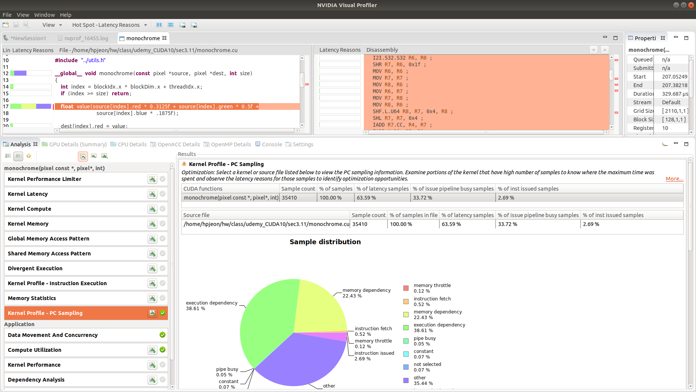

## Title Learning CUDA 10 Programming
- Nathan Weston

## Q
- where is deviceQuery?

## Section 2
### 2.6
- Grid - Block - Thread
- No branch prediction on CUDA core
- deviceQuery
  - Location: ~/NVIDIA_CUDA-10.1_Samples/1_Utilities/deviceQuery
  - Edit Makefile and remove 30 from SMS
  - make
  - ./deviceQuery
```
  Device 0: "GeForce GT 1030"
  CUDA Driver Version / Runtime Version          11.1 / 11.1
  CUDA Capability Major/Minor version number:    6.1
  Total amount of global memory:                 2001 MBytes (2098528256 bytes)
  ( 3) Multiprocessors, (128) CUDA Cores/MP:     384 CUDA Cores
```
- Warps
  - Groups of 32 threads
  - No overheads for switching warps

### 2.7
- Kernel execution configurations
  - my_kernel <<< GRID_DIM, BLOCK_DIM >>> (...)
- Block size must be multiples of 32 as warp size
  - 128 or 256 is a good starting point
  - Several small blocks are often better than one large
- Occupancy = active warps/maximul allowed warps
- Debugging
  - Add -g -G options to Makefile
  - CUDA_DEBUGGER_SOFTWARE_PREEMPTION=1 cuda-gdb ./array-add-bug
  - b add_kernel
  - run
  - layout src # CLI GUI appears
  - display threadIdx
  - cuda thread # shows the current thread
  - cuda thread 5  # changes to thread 5
  - cuda block 1  # changes to cuda block 1
  - delete # deletes all breakpoints
  - set cuda memcheck on
  - run
```
Illegal access to address (@global)0xd80 detected.
Thread 1 "array-add-bug" received signal CUDA_EXCEPTION_1, Lane Illegal Address.
[Switching focus to CUDA kernel 0, grid 1, block (6,0,0), thread (96,0,0), device 0, sm 0, warp 9, lane 0]
0x0000555555e40218 in add_kernel<<<(79,1,1),(128,1,1)>>> (dest=0x7fffcec13c00,
    n_elts=10000, a=0x7fffcec00000, b=0x0) at array-add-bug.cu:32
32	  dest[index] = a[index] + b[index];
```
- How to fix?
  - In `add_kernel<<<n_blocks, BLOCK_SIZE>>>(device_array_dest, ARRAY_LENGTH,device_array_a, nullptr);`, replace nullptr with device_array_b

### 2.10
- Handling Errors
  - Doesn't raise exceptions. Return status codes instead.
  - Calling cudaDeviceSynchronize() will make sure that the running kernel has finished
- cudaSuccess, cudaError_t
- Helper functions - cudaGetErrorString(), cudaGetLastError()

### 3.11
- Converting color ppm to grey
```
./monochrome flower.ppm out.ppm
kernel ran in 0 ms
```
- Enabling profiling
  - make CUDAFLAGS=-lineinfo
  - Or edit Makefile as `CUDAFLAGS ?= -g -lineinfo -arch=sm_60`
  - -lineinfo still optimizes while keeps the line number as well
  - nvvp monochrome ./flower.ppm out.ppm
    - When: Failed to load module "canberra-gtk-module"
      - sudo apt install libcanberra-gtk-module libcanberra-gtk3-module # this didn't help
      - sudo update-alternatives --config java # select java-8. This helps.
    - When GUI opens, adjust the location of working directory and working path
    - To view source files with hotspots
      - Ref: https://forums.developer.nvidia.com/t/solved-instruction-level-sampling-in-visual-profiler-eclipse-edition-not-available/66962/4
      - PC-sampling requires -arch=sm_35 or higher
      - sudo /usr/local/cuda-11.1/bin/nvvp  ./monochrome  flower.ppm  out.ppm
        - sudo might be necessary due to security issue
      - Analysis tab -> Switch to unguided analysis -> Analysis tab -> Application -> Compute Utilization -> Select Kernel from Results panel -> Now Analysis tab shows the available profiling results such as Kernel Performace Limiter, ..., Global Memory Access Pattern, Kernel Profile - PC Sampling


### 3.12
- Memory Hierarchy
  -  Global memory -> L2 cache -> SM
- For monochrome example
  - Disable or comment out -G option (debug for GPU)
  - Keep -lineinfo. This will still optimize
- Checking produced instructions
  - cuobjdump -sass monochrome | cut -c -80 |less
```                  
        /*00e8*/                   FFMA R7, R7, 0.1875, R0 ;                    
        /*00f0*/                   STG.E [R4], R7 ;                             
        /*00f8*/                   STG.E [R4+0x4], R7 ;                         

        /*0108*/                   STG.E [R4+0x8], R7 ;                         
        /*0110*/                   LDG.E R6, [R2+0xc] ;                         
        /*0118*/                   STG.E [R4+0xc], R6 ;            
```
  - Dump CUDA instructions
  - nvvp shows a message of inefficient alignment
- For monochrome.cu with better performance, adjust ../util.h
  - `struct pixel {` to `struct __align__(16) pixel{`
  - Increases Device memory utilization from 65% to 85%
- In nvpp
  - Analysis tab -> 1. CUDA Application Analysis -> click Examine individual kernels -> 2. Performance-Critical Kernels -> click Perform Kernel Analysis -> 3. Compute, Bandwidth, or Latency Bound -> click Perform Memory Bandwidth analysis
