# Computer Architecture and Computer Organization Masterclass
- Instructor: Dr. Yasas Sri Wickramasinghe

## Section 1: Welcome to Your Course

### 1. Hello Everyone. Get to know your course structure

## Section 2: Introduction to Computer Organization and Architecture

###  2. Introduction to Computer Organization and Architecture
- Computer organization: physical aspects of computer systems such as circuite design, control signals, memory types - How does a computer work?
- Computer architecture: logical aspects of system as seen by the programmer
  - Instruction sets, instruction formats, data types, address modes - How do I design a computer?
- Equivalence of HW and SW: anything that can be deon with SW can also be done with HW, and anything that can be done with HW can alswo be done with SW
- A computer is a device consisting of three pieces
  - A processor: to interpret and execute a program
  - A memory: to store both data and programs
  - A mechanism: for transferring data to and from the outside world

### 3. Computer Level Hierarchy
- Moore's law: the density of transistors in an IC will double every year
- Rock's law: the cost of capital equipment to build semiconductors will double every four years
- Computer level hierarchy
  - Level 6: User - executable programs
  - Level 5: High-level language - C++, Java, Fortran, etc
  - Level 4: Assembly language 
  - Level 3: System software - OS, library code
  - Level 2: Machine - Instruction Set Architecture
  - Level 1: Control - Microcode or hardwired
  - Level 0: Digital logic - circuits,gates, etc


### 4. Introduction to Computer Organization and Architecture Lecture Materials


## Section 3: Fetch - Decode - Execute Cycle

### 5. Fetch Decode Execute Cycle Explained Part 1
- Fetch, decode and execute cycle
  - Program instructions are stored inside the main memory
  - The machine runs the programs sequentially
  - Each machine instruction is fetched, decoded and executed during one cycle known as the von Neumann execution cycle (also called the fetch-decode-execute cycle)
  - One iteration of the cycle is as follows:
    - The control unit fetches the next program instruction from the memory, using the program counter to determine where the instruction is located.
    - The instruction is decoded into a language the ALU can understand.
    - Any data operands required to execute the instruction are fetched from memory andplaced into registers within the CPU.
    - The ALU executes the instruction and places the results in registers or memory.

### 6. Fetch Decode Execute Cycle Explained Part 2
- Special purpose registers

| Register type | Notation | Purpose |
|---------------|----------|---------|
| Accumulator   | AC| Stores the results of calculations |
| Instruction Register | IR/CIR | Stores the address in RAM of the instruction to be processed|
| Memory Address Register| MAR | Stores the address in RAM of the data to be procssed |
| Memory Data Register | MDR | Stores the data that is being processed |
| Program Counter |PC| Stores the address in RAM of the next instruction|

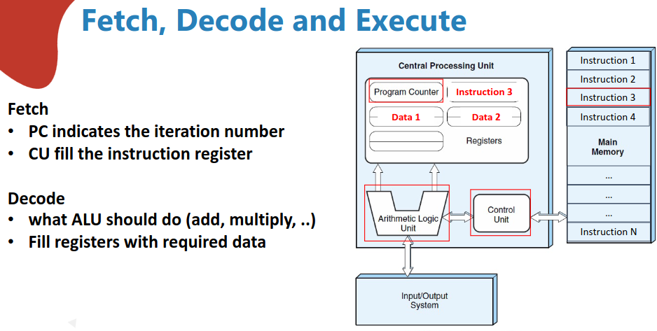
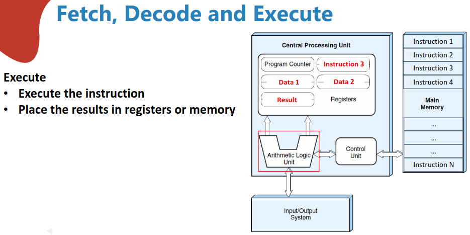

### 7. Fetch - Decode - Execute Cycle Lecture Materials

## Section 4: Assembly Language Programming with the Little Man Computer

### 8. What is the Little Man Computer
- https://peterhigginson.co.uk/lmc/

### 9. Programming the Little Man Computer
- LMC instructions: https://en.wikipedia.org/wiki/Little_Man_Computer
  - 1XX: ADD
  - 2XX: SUB
  - 3XX: STA
  - 5XX: LDA - Load
  - 6XX: BRA - Branch
  - 7XX: BRZ - Branch if 0
  - 8XX: BRP - Branch if +
  - 901: Input
  - 902: Output
  - 000: Halt
- Scenario
  - Memory cell 60 contains the value of 005
  - Memory cell 61 contains the value of 006
  - Memory cell 62 contains the value of 002
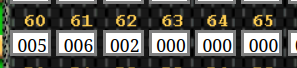

  - Add three numbers and store the result in the memory cell id 65
- Assembly program
  - 560: LOAD memory in cell 60
  - 161: ADD memory in cell 61
  - 162: ADD memory in cell 62
  - 365: Store the value in the accumulator into cell 65
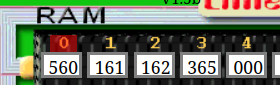

### 10. Fetch Decode Execute Cycle Explained using the Little Man Computer
- Click RUN Icon

- Cell ID 65 has the value of 13 at PC=4
  - Instruction register is 3 which is STORE instruction
  - Address register is 65 (Cell ID)
  - Accumulator is 013

### 11. Writing Assembly Language Code
```asm
LDA 60
ADD 61
ADD 62
STA 65
HLT
```
- Click Submit and run
  - Cell data of 60,61,62 are given manually
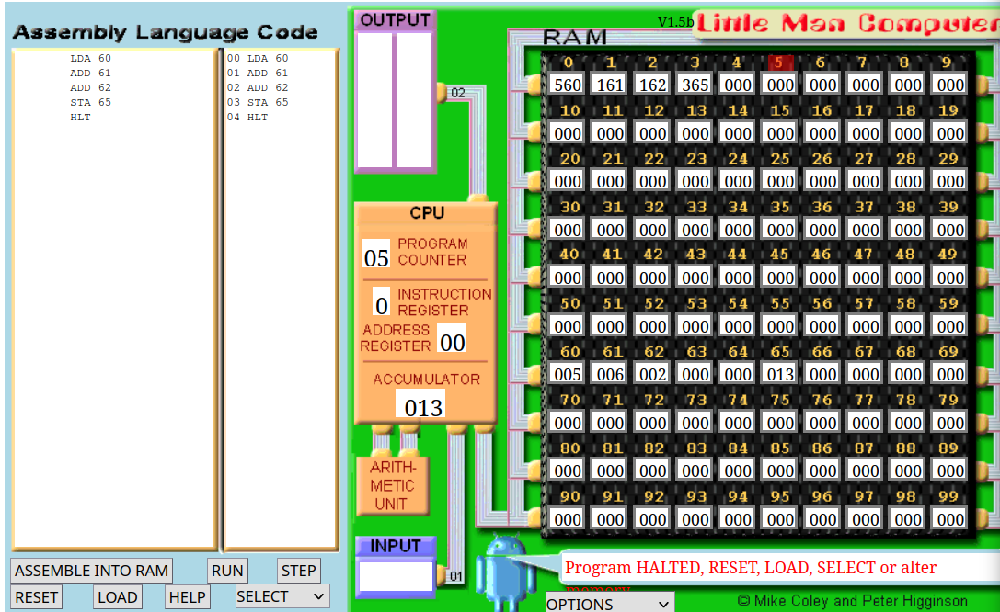

## Section 5: Instruction Set Architecture (ISA)

### 12. Introduction to ISA
- ISA
  - A well-defined HW/SW interface
  - The contract b/w SW and HW
    - Functional definition of storage location & operations
      - Storage locations: registers, memory
      - Operations: add, multiply, branch, load, store, etc
  - ISA can have multiple implementations
  - ISA allows SW to direct HW
  - ISA defines machine language

### 13. CISC and RISC
- Reduced Instruction set Computing - RISC
  - Fixed length instructions (mostly 32bit)
  - Small, highly optimized set of instructions
- Complex Instruction Set Computing - CISC
  - Single instruction represents multiple operations (low level -> IO, ALU, mem)
- CISC: x86
  - Larger instruction set
  - More complicated instructions built into HW
  - Variable length
  - Multiple clock cycles per instruction
- RISC: ARM
  - Small, highly optimized set of instructions
  - Memory accesses are specific instructions
  - One instruction per clock cycle
  - Instructions are of the same size and fixed format
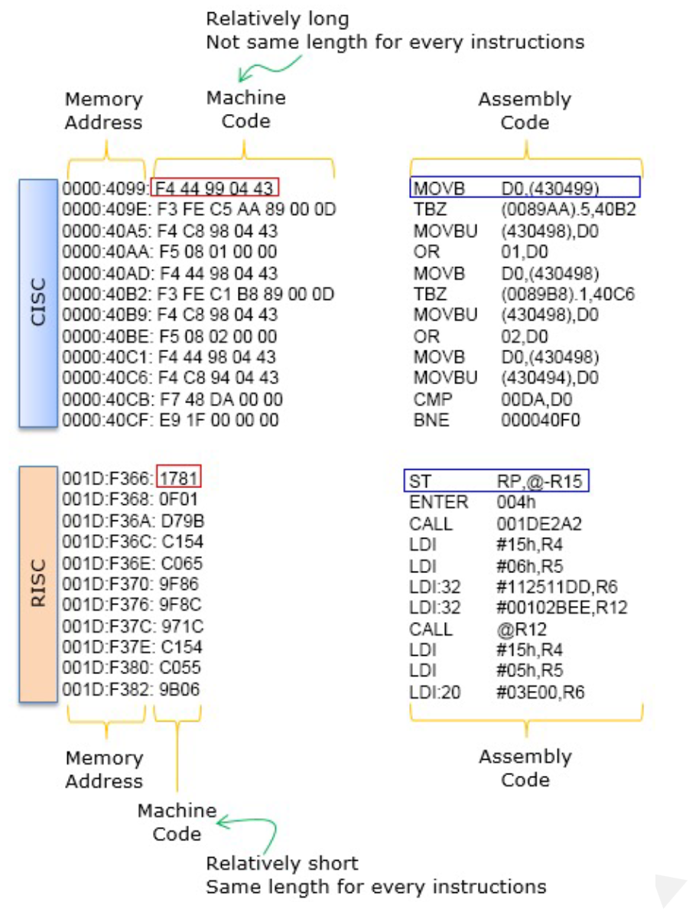
- CISC
```asm
MULT B, A
```
- RISC
```asm
LOAD A, eax
LOAD B, ebx
PROD eax, ebx
STORE ebx, A
```

### 14. Instructions
- Elements
  - Opcode: what to do
  - Operand : data sources/destinations
- Representation
  - Binary bits
    - 4 bits of opcode + 6bits of operand reference +  6bits of operand reference
    - Symbolic representation
      - ADD, SUB, LOAD etc
      - Ex) ADD X, Y
- Instruction length
  - Affected by memory size/organization, register numbers, bus structure etc
  - Flexibility vs implementation complexity
  - Memory-transfer consideration
  - Fixed vs non-fixed instructions

### 15. Number of Addressing
- 3 addresses
  - Operand 1, Operand 2, Result: a = b+c
- 2 addresses
  - One address doubles as operand and result: a = a+c
- 1 address
  - Implicit second address (accumulator)
- 0 address
  - All addresses are implicitly defined
  - Stack based computer

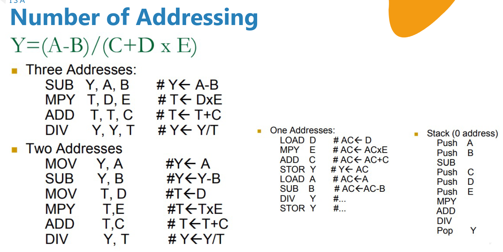

### 16. Addressing Modes
- How is the address of an operand specified
- Different addressing mode
  - Immediate
    - Operand is a part of instruction: opcode + operand
    - Operand = address field
    - Ex) ADD 5
      - Add 5 to the content of accumulator
      - 5 is operand
    - No memory reference to fetch data
    - Fast
    - Limited range
  - Direct
    - Address field contains the address of operand
    - Effective address (EA) = address field (A)
    - Ex) ADD A
      - Add content of cell A to accumulator
      - Look in memory at address A for operand
    - Single memory reference to access data
    - No additional calculations to work out effective address
    - Limited address space
  - Indirect
    - Memory cell pointed to by address field contains the address of (pointer to) the operand
    - EA = (A)
      - Look in A, find address (A) and look there for operand
    - Ex) ADD (A)
      - Add contents of cell pointed to by contents of A to accumulator
    - Large address space
    - Unique memory size of 2^n where n = word length
    - May be nested, multi-level, cascaded
      - Ex) EA = (((A)))
    - Multiple memory accesses to find operand
    - Hence slower
  - Register
    - Operand in held in register named in address filed
    - EA = R
    - Limited number of registers
    - Very small address field needed
      - Shorter instructions
      - Faster instruction fetch
    - No memory access
    - Very fast execution
    - Very limited address space
    - Multiple registers help performance
      - Requires good assembly programming or compiler writing
      - Compare with direct addressing
  - Register indirect
    - EA = (R)
    - Operand is in memory cell pointed to by contents of register R
    - Compare with indirect addressing
      - Faster than indirect as R is a REGISTER
    - Large address space (2^n)
    - One fewer memory access than indirect addressing
  - Displacement
    - EA = A + (R)
    - Address field holds two values
      - A = base value
      - R = register that holds displacement
      - Or vice versa
  - Indexed addressing
    - A = base
    - R = displacement
    - EA = A + R
    - Good for accessing arrays
      - EA = A + R
      - R++
  - Stack
    - Operand is (implicitly) on top of stack
    - Ex) ADD: pop top wto items from stack and add

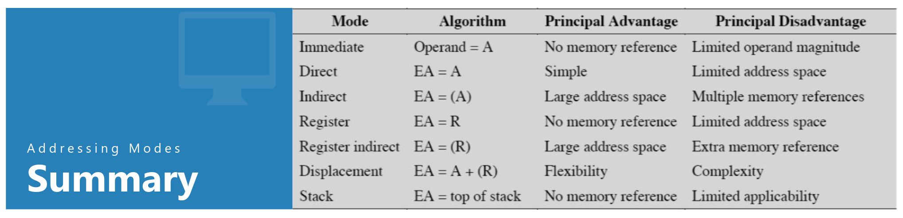

### 17. Instruction Set Architecture Lecture Materials

## Section 6: CPU Benchmarking

### 18. Introduction to CPU Benchmarking
- What makes a good ISA?
  - Programmability
    - Easy to express programs efficiently?
  - Performance/implementability
    - Easy to design high-performance implementations?
    - More recently:
      - Easy to design low-power implementations?
      - Easy to design low-cost implementations?
  - Compatibility
    - Easy to maintain as languages, programs, and technology evolve?
    - x86 (IA32) generations: 8086, 286, 386, 486, Core2, Core i7, ...
- Programmability
  - Easy to express programs efficiently?
    - For whom?
  - Before 1980s: human
    - Most code was hand-assembled    
    - High-level coarse-grain instructions
  - After 1980s: compiler
    - Low-level fine-grain instructions
  - This shift changed what is considered a "good" ISA
- Implementability
  - Every ISA can be implemented
    - Not every ISA can be implemented efficiently
  - Classic high-performance implementations techniques
    - Pipelining, parallel execution, out-of-order execution
  - Certain ISA features make these difficult
    - Variable instruction lengths/formats: complicate decoding
    - Special purpose reigster: complicate compiler optimizations
    - Difficult to interrupt instructions: complicate many things
- Performance
  - How long does it take for a program to execute?
      1. How many instructions must execute to complete a program?
        - Instructions per program during execution
        - Dynamic instructions count
      2. How quickly does the processor cycle?
        - Clock frequency in Hz
        - Clock period in ns
        - Worst-case delay through circuit for a particular design
      3. How many cycles does each instruction take to execute?
        - Cycles per Instructions (CPI) or reciprocal, Instructions per Cycle (IPC)
  - Execution time = (instructions/program) * (seconds/cycle) * (cycles/instruction)
- Comparing machines
  - Metrics
    - Execution time
    - Throughput
    - CPU time
    - MIPS: millions of instructions per second
    - MFLOPS: millions of floating point operations per second
    
### 19. Calculating CPU Time
- Response time: the time b/w the start and completion of a task, including time spent on CPU, disk, memory, waiting for IO and other processes + OS overhead. Also referred as execution time
- Throughput: the total amount of work done in a given time
- CPU execution time: total time a CPU spends computing on a given task - excludes time for IO or running other programs - referred as CPU time

### 20. Understanding CPU Clock
- A computer clock runs at a constant rate and determines when events take placed in HW
- The clock cycle time is the amount of time for one clock period to eplase (e.g. 5ns)
- The clock rate is the inverse of the clock cycle time
  - 200MHz -> 5ns
- Is # of cycles ==  # of instructions?
  - No. Different instructions take different amounts of time on different machines  

### 21. Calculating CPU Time
- CPU time = CPU clock cycles x clock cycle time
- CPU time = CPU clock cycles / clock rate
- CPU clock cycles = (instructions/program) x (clock cycles/instruction) = Instruction count x CPI
  - CPU time = Instruction count x CPI x clock cycle time
  - CPU time = Instruction count x CPI / clock rate
- Which factors are affected by each of the following?

|   | Instr. Count | CPI | clock rate |
|----|-------------|-----|------------|
| Program | x      |     |            |
| Compiler |x      |  x  |            |
| ISA |x           |  x  |            |
| Organization |   |  x  |            |
| Technology   |   |     |  x         |

### 22. Exercise - Solving CPU Time Calculations
- Ex1
  - CPU clock rate is 1 MHz
  - Program takes 45 million cycles to execute
  - CPU time = 45e6 * (1/1e6) = 45 sec
- Ex2
  - CPU clock rate is 500 MHz
  - Program takes 45 million cycles to execute
  - CPU time = 45e6 * (1/500e6) = 0.09 sec

### 23. Exercise - Solving CPI Calculations
- Ex
  - A benchmark as 100 instructions
  - 25 instructions are loads/stores, each taking 2 cycles
  - 50 instructions are adds, taking 1 cycle each
  - 25 instructions are square root, each taking 50 cycles
  - CPI = (2 * 25/100) + (1 * 50/100) + (50 * 25/100) = 13.5
- Benchmark
  - Allows us to make performance comparisons based on execution times
  - Must
    - be representative of the type of applications run on the computer
    - not be overly depedent on one or two features of a computer
  - Can vary greatly in terms of their complexity and their usefulness

### Coding Exercise 1: Coding Activity: Measuring CPU Benchmarking with Matrix Multiplication in Python

### 24. CPU Benchmarking Lecture Materials

### 25. Extra Resource

## Section 7: CPU Organization and Structure

### 26. Introduction to CPU Structure
- Requirement of processor
  - Fetch instruction: reads an instruction from memory
  - Interpret instruction: determines what action to perform
  - Fetch data: if necessary read data from memory or an IO module
  - Process data: if necessary perform arithmetic/logical operation on data
  - Write data: if necessary write data to memroy or an IO module
- Major components of the processor
  - ALU (Arithmetic and Logic Unit): performs computation or processing of data
  - Control unit: moves data and instructions in and out of the processor. Also controls the operation of the ALU
  - Registers: internal memory
  - System bus: acting as a pathway b/w processor, memory, and IO module

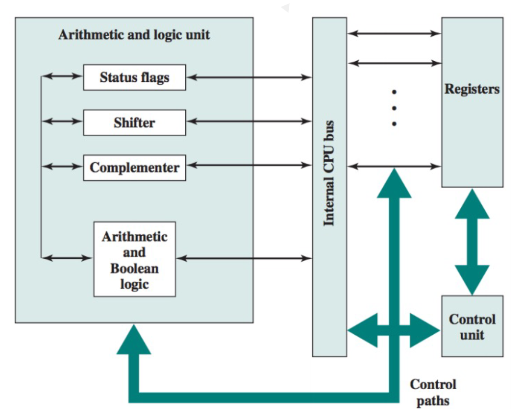

### 27. Registers in CPU
- Registers in the processor perform two roles
  - User-visible registers
    - Used as internal memory by the assembly language programmer
  - Control and status registers
    - Used to control the operation of the processor
    - Used to check the status of the processor/ALU
- User-visible registers
  - Referenced by the programmer, categorized into 4 categories
  1. General purpose
      - Memory reference & backup
      - Register reference & backup
      - Data reference & backup
  2. Data
      - May be used only to hold data and cannot hold addresses
      - Must be able to hold values of most data types
      - Some machines allow two contiguous registers to be used, for holding double-length values
  3. Address
      - Used to hold addresses of stack pointer, program counter, index registers
      - Must be at least long enough to hold the largest address
  4. Condition codes/flags
      - Holding condition codes/flags which are bits set by processor as the result of operations
      - Condition code bits are collected into one or more control register
      - As an example, an arithmetic operation can produce: positive result, negative result, zero result, overflow result
- Control and status registers
  - Mostly not visible to the user
  - Program Counter (PC): contains instruction address to be fetched
  - Instruction Register (IR): contains the last instruction fetched
  - Memory Address Register (MAR): contains memory location address
  - Memory Buffer Register (MBR): contains a word of data to be written to memory or a word of data read from memory
  - Those registers are used for
    - Data movement b/w processor and memory
    - Within the processor, data must be presented to the ALU for processing
      - ALU may have direct access to the MBR and user-visible registers
      - Alternatively:
        - There may be additional buffering registers within ALU
        - These registers serve as input and output registers for the ALU
        - These registers exchange data with the MBR and user-visible registers

### 28. Understanding CPU Interruptions
- Interruption cycle
  - Contents of the PC must be saved
  - The contents of PC are:
    - Transferred to the MBR to be written into memory
    - Special memory location is loaded into MAR
      - E.g: Stack Pointer (SP)
    - PC is loaded with the address of the interrupt routine

### 29. Techniques to Improve CPU Performance
- How to increase processor performance?
  - Increase frequency - faster number of clock ticks per unit of time
  - Increase cache-levels - reduce number of read/writes from high latency memory
  - Multi-core architecture - parallel processing
  - Reduce physical size of the processor - electrical signals travel shorter distances
  - CPU pipelining

### 30. CPU Organization and Structure Lecture Materials

### Quiz 1: Registers in the CPU

### 31. Extra Reading Material

## Section 8: CPU Pipelining

### 32. What is CPU Pipelining
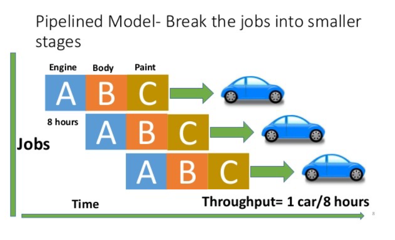

- Pipelining breaks instruction execution down into several stages
  - Puts registers b/w stages to buffer data and control
  - Executes one instruction
  - As first starts second stage, executes second instruction, etc
  - Speeds up same as number of stages as long as pipe is full

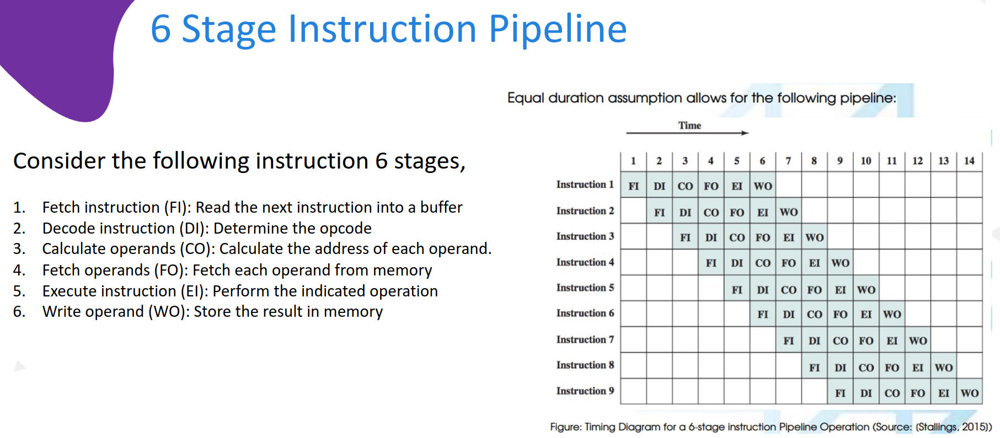

- Without pipelining, 9 instructions will take 9x6 = 54 time units
- With pipelining, all instructions can be done in 14 time units

### 33. Resource Hazards
- Hazards do not permit continued pipeline execution
  - Also called pipeline bubble
  - Types of hazards
    - Resource
    - Data
    - Control
- Resource hazards
  - Two or more instructions in pipeline need same resource (bus, memory, cache)
  - Executed in serial rather than parallel for part of pipeline
  - Also called structural hazard
  - If main memory has a single port, read or write cannot be performed in parallel with instruction fetch
  - Single ALU may have the same issue
  - Solutions
    - Multiple main memory ports
    - Multiple ALUs

### 34. Data Hazards
- Conflict in access of an operand location
- Two instructions to be executed in sequence
- Both access a particular memory or register operand
- If in strict sequence, no problem
- If in a pipeline, operand value could be updated so as to produce different result from strict sequential execution

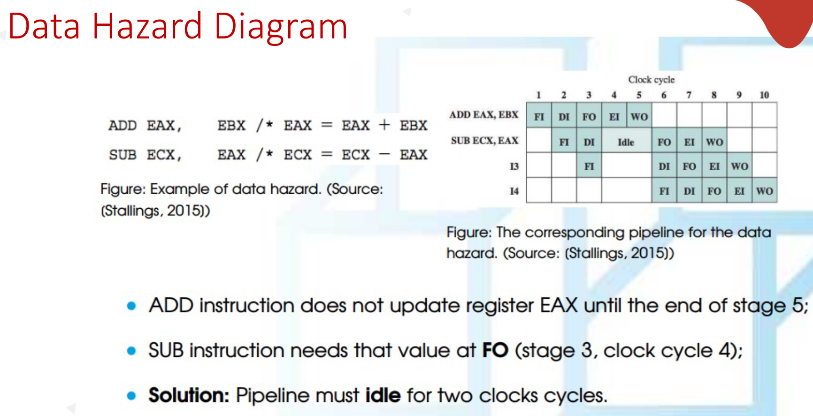

- Types of Data Hazard
  - Read After Write (RAW), or true dependency
    - An instruction modifies a register or memory location
    - Succeeding instruction reads data in that location
    - Hazard if read takes place before write complete
  - Write after read (RAW), or antidependency
    - An instruction reads a register or memory location
    - Succeeding instruction writes to location
    - Hazard if write completes before read takes place
  - Write after write (WAW), or output dependency
    - Two instructions both write to same location
    - Hazard if writes take place in reverse of order intended sequence
  - Previous example is RAW hazard
  
### 35. Control Hazards and Branch Prediction
- Control hazard
  - Known as branch hazard
  - Pipeline makes wrong decision on branch prediction
  - Brings instructions into pipeline that must subsequently be discarded
  - Dealing with branches
    - Multiple streams
    - Prefetch branch target
    - Loop buffer
    - Branch prediction
    - Delayed branching

### 36. Branch Prediction Strategies
- Predict never taken
  - Assumes that jump will not happen
  - Always fetch next instruction
  - 68020 & VAX 11/780
- Predict always taken
  - Assume that jump will happen
  - Always fetch target instruction
- Branch prediction strategies
  - Predict by opcode
    - Some instructions are more likely to result in a jump than others
    - Can get up to 75% success
  - Taken/not taken switch
    - Based on previous history
    - Good for loops
    - Refined by two-level or correlation-based branch history
  - Correlation-based
    - In loop-closing branches, history is good predictor
    - In more complex structures, branch direction correlates with that of related branches
      - Use recent branch history as well
  - Delayed branch
    - Do not take jump until you have to
    - Rearrange instructions

### 37. Practical Example for Pipelining - Intel 80486
- Fetch
  - From cache or external memory
  - Put in one of two 16-byte prefetch buffers
  - Fill buffer with new data as soon as old data consumed
  - Average 5 instructions fetched per load
- Independent of other stages to keep buffers full
  - Decode stage 1
  - Opcode & address-mode info
  - At most first 3 bytes of instruction
  - Can direct D2 stage to get rest of instruction
- Decode stage 2
  - Expand opcode into control signals
  - Computation of complex address modes
- Execute
  - ALU operations, cache access, register update
- Writeback
  - Update registers & flags
  - Results sent to cache & bus interface write buffers

### 38. CPU Overclocking

### 39. CPU Pipelining Lecture Materials

## Section 9: Input-Output Organization

### 40. Introduction to I/O
- Input or output devices attached to the computer are called "peripherals"
- IO interface
  - Provides a method for transferring information b/w internal storage (such as memory and CPU registers) and external IO devices
  - They are special HW components b/w CPU and peripherals to supervise and synchronize all input and output transfer
  - They are called interface units because they interface b/w the processor bus and the peripheral device

### 41. I/O Mapping
- Accessing IO devices
  - Single-bus structure
  - The bus enables all the devices connected to it to exchange information
  - Typically the bust consists of three sets of lines used to carry address, data, and control signals
  - Each IO device is assigned a unique set of addresses
- IO Mapping
    1. Memory-Mapped IO
        - When IO devices and the memory share the same address space, the arrangement is called memory-mapped IO
        - Any machine instruction that can access memory can be used to transfer data to or from an IO device
        ```asm
        MOVE DATAIN, R0
        MOVE R0, DATAOUT
        ```
        - Some processors have special IN and OUT instructions to perform IO transfer
        - A single set of read/write control lines (no distinction b/w memory and IO transfer)
        - Memory and IO addresses share the common address space -> reduces memory address range available
        - No specific input or output instruction -> the same memory reference instructions can be used for IO transfers
        - Considerable flexibility in handling IO operations
    2. Isolated IO
        - Many computers use common bus to transfer information bw/ memory and IO
        - Separate IO read/write control lines in addition to memory read/write control lines
        - Separate (isolated) memory and IO address spaces
        - Distinct input and output instructions - each associated with address of interface register

| Isolated IO | Memory Mapped IO|
|-------------|------------------|
| Memory and IO have separate address space | Both have same address space |
| All address can be used by the memory | Due to addition of IO addressable memory, less memory size |
| Separate instruction control read and write operation in IO and memory | Same instructions can control both IO and memory |
| In this IO address are called ports | Normal memory address are for both |
| More efficient due to separate buses | Less efficient |
| Larger in size due to more buses | Smaller in size |
| Complex due to separate logic | Simpler logic |


### 42. Asynchronous Data Transfer
- In a computer system, CPU and an IO interface are designed independently of each other
- When internal timing in each unit is independent from the other and when registers in interface and registers of CPU uses its own private clock
- In that case the two units are said to be asynchronous to each other. CPU and IO device must coordinate for data transfers
- Methods used in asynchronous data transfer
  - Strobe control: one way of transfer by means of strobe pulse supplied by one of the units to indicate to the other unit when the transfer has to occur
    - Employs a single control line to time each transfer
    - The strobe may be activated by either the source or the destination unit
    - Problems in strobe methods
      - Source-initiated: the source unit that initates the transfer has no way of knowing whether the destination unit has actually received data
      - Destination-initiated: no way of knowing whether the source has actually placed the data on the bus
      - To solve this problem, the handshake method introduces a second control signal to provide a reply to the unit that initiates the transfer
  - Handshaking: accompanies each data item being transferred with a control signal that indicates the presence of data in the bus. The unit receiving the data item responds with another control signal to acknowledge receipt of the data
    - Allows arbitrary delays from one state to the next
    - Permits each unit to respond at its own data transfer rate
    - The rate of transfer is determined by the slower unit

### 43. Modes of Data Transfer
- Modes of transfer mechanisms
  - Program-controlled IO - processor polls the device
  - Interrupt
  - Direct Memory Access (DMA)
- Programmed IO
  - Usually the transfer is to and from CPU register and peripheral
  - Transferring data under program control requires constant monitoring of the peripheral by the CPU
  - CPU stays in a program loop until the IO unit indicates that it is ready for data transfer
  - This is a time-consuming process since it keeps the processor busy needlessly
- Interrupt initiated IO
  - Special commands to inform the interface to issue an interrupt request signal when the data are available from the device
  - In the mean-time the CPU can proceed to execute another program
  - The interface keeps monitoring the device
  - When the interface determines that the device is ready foir the data transfer, it generates an interrupt request to the computer
  - On detecting the external interrupt signal, the CPU momentarily stops the task it is processing, branches to a service program to process the IO transfer, and then returns to the task it was orignally performing
- DMA (Direct Memory Access)
  - For high speed data transfer
  - The interface transfers data into and out of the memory unit through the memory bus
  - CPU releases the control of the buses to a device called a DMA controller
  - The CPU initiates the transfer by supplying the interface with the starting address and the number of words needed to be transferred and then proceeds to execute other tasks
  - When the transfer is made, the DMA requests memory cycles through the memory bus
  - When the request is granted by the memory controller, the DMA transfers the data directly into memory

### 44. Input-Output Organization Lecture Materials

## Section 10: Memory Organization

### 45. Introduction to Memory Hierarchy
- Why memory organization?
  - We want a memory unit that
    - Can keep up with the CPU's processing speed
    - Has enough capacity for programs and data
    - Is inexpensive, reliable and energy-efficient
- The need for a memory hierarchy
  - Widening speed gap b/w CPU and main memory
    - Processor operations take of the order of 1ns
    - Memory access requires 10s or even 100s of ns
  - Memory bandwidth limits the instruction execution rate
  - Fast memory technology is more expensive
  - Solution: organize memory system into a hierarchy
    - Entire addressable memory space available in largest, slowest memory
    - Incrementally smaller and faster memories, each containing a subset of the memory below it, proceed in steps up toward the processor
  - Temporal and spatial locality insures that nearly all references can be found in smaller memories

### 46. Deep dive into Computer Memory Hierarchy
- Typical levels in a hierarchical memory

| Capacity | Access latency |   |  Cost per GB |
|----------|----------------|---|------------|
| 100s B | ns       | Registers | $millions |
| 10s KB | a few ns | Cache 1   | $100s Ks |
| MBs    | 10s ns   | Cache 2   | $10s Ks |
|100s MB | 100s ns  | Main      | $1000s |
| 10s GB | 10s ms   | Secondary | $10s |
| TBS    | min+     | Tertiary  | $1s |

- Take advantage of the principle of locality to:
  - Present as much memory as in the cheapest technology
  - Provide access at speed offered by the fastest technology

### 47. The Principal of Locality
- A program accesses a relatively small portion of the address space at any instant of time
- Two types of locality
  - Temporal locality: if an item is referenced, it will tend to be referenced again soon (e.g., loops, reuse)
  - Spatial locality: if an item is referenced, items whose addresses are close by tend to be referenced soon (e.g., straightline code, array access)
- HW relied on locality for speed
```c
sum = 0;
for (i=0; i<n; i++)
 sum += a[i];
return sum;
```
  - Data
    - Temporal: `sum` referenced in each iteration
    - Spatial: array `a[]` accessed in stride-1 pattern
  - Instructions:
    - Temporal: cycle through loop repeatedly
    - Spatial: reference instructions in sequence  

### 48. Memory HIT rate and MISS rate
- Memory hierarchy basics
  - When a word is not found in the cache, a **miss** occurs
  - Fetches word from lower lovel in hierarchy, requiring a high latency reference
  - Lower level may be another cache or the main memory
  - Also fetches the other words contained within the block
    - Spatial locality
  - Places block into cache in any location within its set, determined by address
    - Block address MOD number of sets
- Hit: data appears in some block in the upper level (e.g.: Block X)
  - Hit rate: the fraction of memory access found in the upper level
  - Hit time: time to access the upper level which consists of RAM access time + time to determine hit/miss
- Miss: data needs to be retrieved from a block in the lower level (Block Y)
  - Miss rate = 1 - (hit rate)
  - Miss penalty: time to replace a block in the upper level + time to deliver the block the processor
- Usually hit time << miss penalty 

### 49. Cache Performance and Optimization
- Average memory access time = hit time + miss rate x miss penalty
  - Those times can be all either runtime or number of clock cycles
- Sources of cache misses
  - Compulsory (cold start or process migration, first reference)  
    - First access to a block
  - Capacity
    - Cache cannot contain all blocks access by the program
    - Solutino: increase cache size
  - Conflict (collision)
    - Multiple memory locations mapped to the same cache location
    - Solution 1: increase cache size
    - Solution 2: increase associativity
  - Coherence (invalidation): other process (e.g., I/O) updates memory
- Six basic cache optimizations
  - Larger block size
    - Reduces compulsory misses by spatial locality
    - Obvious disadvantage
      - Higher miss penalty: a larger block takes longer to move
      - May increase conflict misses and capacity miss if cache is small
  - Larger total cache capacity to reduce miss rate
    - Large cache size -> lower miss rate, higher hit time
    - Helps with both conflict and capacity misses
    - May need longer hit time AND/OR higher HW cost
    - Popular in off-chip caches    
  - Higher associativity
    - Reduces conflict misses
    - 2:1 cache rule of thumb on miss rate
      - 2 way set associative of size N/2 is about the same as a direct mapped cache of size N (held for cache size < 128KB)
    - Increases hit time, increases power consumption
  - Higher number of cache levels (multi-level caches)
    - Reduces overall memory access time
    - Probably the best miss-penalty reduction method
      - Local miss rate
      - Global miss rate
  - Giving priority to read misses over writes
    - Reduces miss penalty
  - Avoiding address translation in cache indexing
    - Reduces hit time

### 50. Exercise - Calculating Miss Rate
- Miss rate example
  - In 1000 memory references there are 40 misses in the first-level cache and 20 misses in the second-level cache
    - Miss rate for the first-level cache = 40/1000 = 4%
    - Local miss rate for the second-level cache = 20/40 = 50%
    - Global miss rate for the second-level cache = 20/1000 = 2%
- Advanced cache optimizations
  - Reducing hit time
    - Small and simple caches
    - Way prediction
  - Increasing cache b/w
    - Pipelined caches
    - Multibanked caches
    - Nonblocking caches
  - Reducing miss penalty
    - Critical word first
    - Merging write buffers
  - Reducing miss rate
    - Compiler optimizations
  - Reducing miss penalty or miss rate via parallelism
    - HW prefetching
    - Compiler prefetching

### 51. Memory Technology
- Performance metrics
  - Latency is the concern of cache
  - Bandwidth is concern of multiprocessors and IO
  - Access time: time b/w read request and when desired word arrives
  - Cycle time: minimum time b/w unrelated requests to memory
- DRAM used for main memory while SRAM for cache
- SRAM: static random access memory
  - Requires low power to retain bit, since no refresh
  - But requires 6 transistors/bit (vs 1 transistor/bit)
- DRAM
  - One transistor/bit
  - Must be re-written after being read
  - Must also be periodically refreshed
    - Every ~8ms
    - Each row can be refreshed simultaneously
  - Address lines are multiplexed
    - Upper half of address: row access strobe (RAS)
    - Lower half of address: column access strobe (CAS)

|           SRAM  |        DRAM     | 
|-----------------|-----------------|
| Transistors are used to store information in SRAM | Capacitors are used to store data in DRAM |
| Capacitors are not used hence no refreshing is required | To store information for a longer time, contents of the capacitor needs to be refreshed periodically |
| SRAM is faster as compared to DRAM | DRAM provides slow access speeds |
| Expensive | Cheaper |
| Low density devices | High density devices |
| Used in cache memories | Main memory |

### 52. DRAM Technology
- Emphasizes on cost per bit and capacity
- Multiplex address lines -> cutting # of address pins in half
  - Row Access Strobe (RAS) first, then Column Access Strobe (CAS)
  - Memory as a 2D matrix - rows go to a buffer
  - Subsequent CAS selects subrow
- Use only a single transistor to store a bit
  - Reading that bit can destroy the information
  - Refresh each bit periodically (ex. 8 milliseconds) by writing back
    - Keep refreshing time less than 5% of the total time
- DRAM capacity is 4 to 8 times that of SRAM

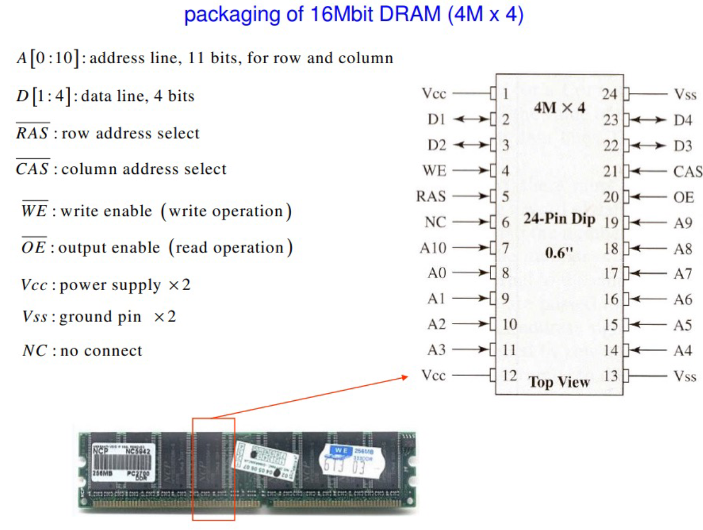

### 53. How a DRAM Works

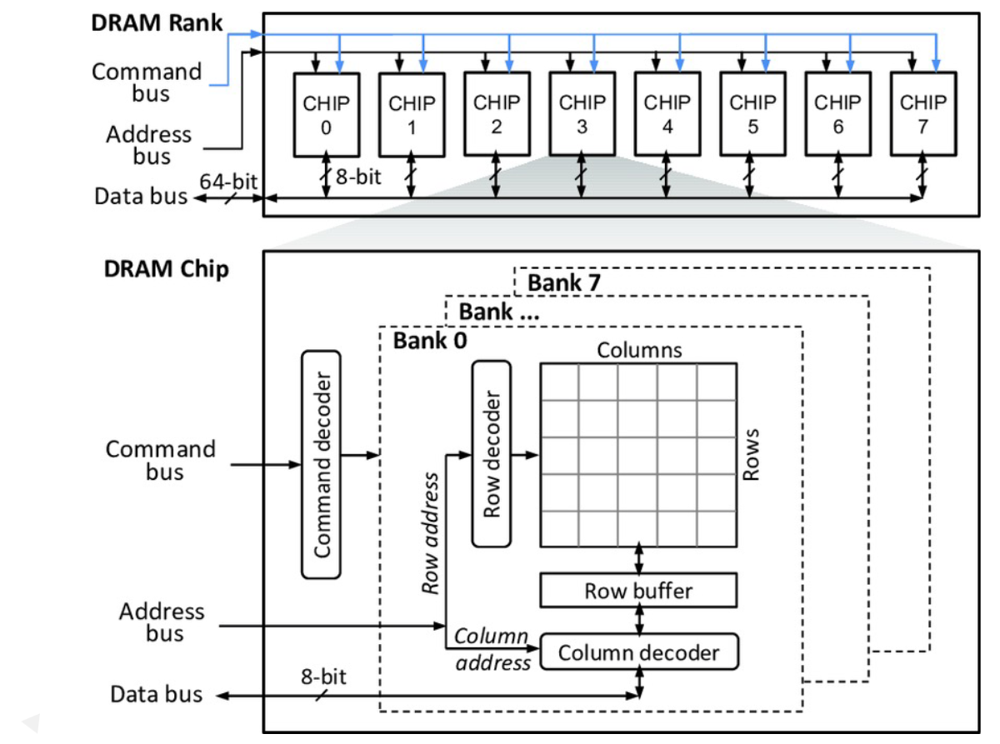

### 54. DRAM Read Cycle Deeply Explained Step by Step
- Example of memory addresses and width of address bus
  - 8x8 = 64cells
  - Needs address bus with 6 lines (2^6 = 64)
  - 3 lines to row address buffer -> row address decoder
  - 3 lines to column address buffer -> column multiplexer/demultiplexer
  - 1 data line for one RAM bank
  - Data bus is bi-directional
  - With timing and control, number of address busses can be reduced by 50%
  - RAS and CAS needed to select which address is being fetched
  - We need another control line to determine whether it is Read or Write

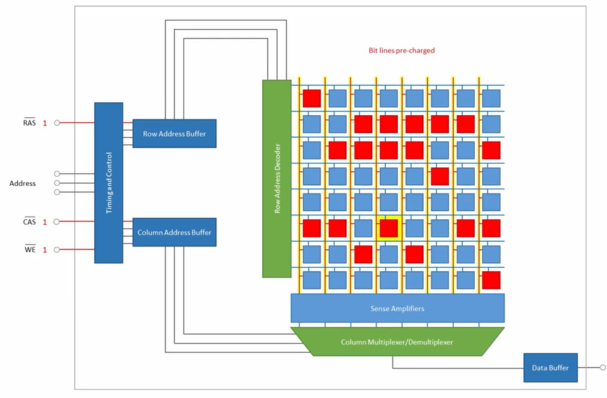

- DRAM Read cycle steps
  - Bit lines in memory are pre-charged
  - RAS enabled and address coming from address bus is ent to row address buffer 
  - Row address is decoded
  - Corresponding memory row is selected
  - Entire set of bits in selected row is loaded into sense amplifiers - destructive process
  - CAS enabled and address coming from address bus is sent to column address buffer and then it will be transferred to column multiplexer
  - Correct cell value is identified by column multiplexer
  - Loaded to data buffer
  - RAS disabled output availble at data bus
  - CAS disabled and word line is de-asserted/inserted back to memory row
  - Bit lines are pre-charged and ready for next cycle
- DRAM refresh
  - Two things discharge a DRAM capacitor
    - Data read
    - Leakage current
  - Needs refreshing even when powered and idle - once every few miliseconds
  - Refresh circuit included on chip - even with added cost, still cheaper than SRAM
  - Refresh process involves disabling chip, then reading data and writing it back
  - Performed by counting through **rows**
  - Takes time - slows down apparent performance

### 55. SDRAM and DDR SDRAM Explained
- SDRAM (Synchronous Dynamic Random Access Memory)
  - Synchronizes itself with the timing of CPU. This enables the memory controller to know the exact clock cycle when the requested data will be ready, so the CPU no longer has to wait b/w memory accesses
  - SDR SDRAM can only read/write one time in a clock cycle
  - SDRAM has to wait for the completion of the previous command to be able to do another read/write operation
- DDR SDRAM (Double Data Rate SDRAM)
  - Achieves greater bandwidth than the preceding single data rate SDRAM by transferring data on the rising and falling edges of the clock signal (double pumped)
  - Doubles the transfer rate without increasing the frequency of the clock


### 56. Memory Organization Lecture Materials

### 57. Extra Reading Material

## Section 11: Hierarchical Bus Organization

### 58. Introduction to Hierarchical Bus Structures
- Buses - common characteristics
  - Multiple devices communicating over a single set of wires
  - Only one device can talk at a time or the message is garbled
  - Each line or wire of a bus can at any one time contain a single binary digit. Over time, however, a sequence of binary digits may be transferred
  - These lines may and often do send information in parallel
  - A computer system may contain a number of different buses
- Buses - structure
  - Serial vs. Parallel
  - Around 50-100 lines although it is possible to have as few as 3 or 4
  - Lines can be classified into one of four groups
    - Data lines
    - Address lines
    - Control lines
    - Power
- Bus lines (parallel)
  - Data
  - Address
  - Control
  - Power
- Bus lines (serial)
  - Data, address, and control are sequentially sent down single wire
  - There may be additional control lines
  - Power
- Data lines
  - Passes data back and forth
  - Number of lines represents width
- Address lines
  - Designates location of source or destination
  - Width of address bus specifies maximum memory capacity
  - High order selects module and low order selects a location within the module
- Bus structure - control lines
  - Because multiple devices communicate on a line, control is necessary
  - Controls timing
  - Typical lines include:
    - Memory read/write
    - IO read/write
    - Transfer ACK
    - Bus request
    - Bus grant
    - Interrupt request
    - Interrupt ACK
    - Clock
    - Reset
- Operation - sending data
  - Obtains the use of the bus
  - Transferse the data via the bus
  - Possible acknowledgement
- Operation - requesting data
  - Obtains the use of the bus
  - Transfers the data request via the bus
  - Waits for other module to send data
  - Possible acknowledgement

### 59. Single and Multiple Bus Implementations and Examples
- Classic bus arrangement
  - All components attached to bus (STD bus)
  - Due to Moore's law, more and more functionality exists on a single board, so major components are now on the same board or even the same chip
- Physical implementations
  - Parallel lines on circuit boards (ISA or PCI)
  - Ribbon cables (IDE)
  - Strip connectors on mother boards (PC104)
  - External cabling (USB or Firewire)
- Single bus problems
  - Lots of devices on one bus leads to:
    - Physically long buses
      - Propagation delays
      - Reflections/terminatin problems
  - Aggregated data transfer approaches bus capacity
  - Slower devices dictate the maximum bus speed
- Multiple buses
  - Most systems use multiple buses to overcome these problems
  - Requires bridge to buffer (FIFO) data due to differences in bus speeds
  - Sometimes IO devices also contain buffering (FIFO)
  - Isolates processor to memory traffic from IO traffic
  - Supports wider variety of interfaces
  - Processor has bus that connects as direct interface to chip, then an expansion bus interface interfaces it to external devices (ISA)
  - Cache (if it exists) may act as the interface to system bus

### 60. Bus Types, Timing, and Additional Details
- Dedicated vs time multiplexed bus types
  - Dedicated
    - Separate adata & address lines
  - Time multplexed
    - Shared lines
    - Address valid or data valid control line
    - Advantage - fewer lines
    - Disadvantages
      - More complex control
      - Degradation of performance
- Physically dedicated bus type
  - Physically separating buses and controlling them with a **channel changer**
  - The use of muliple buses, each of which connects to only a subset of modules
    - Advantages: faster
    - Disadvantages: physically larger
- Bus arbitration
  - Listening to the bus is not usually a problem
  - Talking on the bus is a problem - needs arbitration to allow more than one module to control the bus at one time
  - Arbitration may be centralized or distributed
- Centralised vs distributed arbitration
  - Centralized arbitration
    - A single HW device controlling bus access - bus controller/arbiter
    - May be a part of CPU or separate
  - Distributed arbitration
    - Each module may clain the bus
    - Access control logic is on all modules
    - Modules work together to control bus
- Bus timing
  - Coordination of events on bus
    - Synchronous - controlled by a clock
    - Asynchronous - timing is handled by well-defined specifications, i.e., a response is delivered withing a specified time after a request    
- Synchronous bus timing
  - Events determined by clock signals
  - Control bus includes clock line
  - A single 1-0 cycle is a bus cycle
  - All devices can read clock line
  - Usually sync on leading/rising edge
  - Usually a single cycle for an event
  - Analogy - orchestra conductor with baton
  - Usually stricter in terms of its timing requirements
- Asynchronous timing
  - Devices must have certain tolerances to provide responses to signal stimuli
  - More flexible allowing slower devices to communicate on the same bus with faster devices
  - Performance of faster devices, however, is limited to the speed of bus
- Bus width
  - Wider the bus the better the data transfer rate or the wider the addressable memory space
  - Serial **width** is determined by length/duration of frame
- Peripheral component interconnection (PCI) bus
  - Brief history
    - Original PC came out with 8-bit ISA bus which was slow, but had enormous amount of existing equipment.
    - For AT, IBM expanded ISA bus to 16-bit by adding connector
    - Many PC board manufacturers started making higher speed, proprietary buses
    - Intel released the patents to its PCI and this soon took over as the standard
  - Brief list of PCI 2.2 characteristics
    - General purpose
    - Mezzanine or peripheral bus
    - Supports single- and multi-processor architectures
    - 32 or 64 bit – multiplexed address and data
    - Synchronous timing
    - Centralized arbitration (requires bus controller)
    - 49 mandatory lines (see Table 3.3)
- Required PCI bus lines
  - System lines - clock and reset
  - Address & data
    - 32 time multiplexed lines for address/data
    - Parity lines
  - Interface control
    - Hand shaking lines b/w bus controller and devices 
    - Selects devices
    - Allows devices to indicates when they are ready
  - Arbitration
    - Not shared
    - Direct connection to PCI bus arbiter
  - Error lines - parity and critical/system
- Optional PCI bus lines
  - 51 optional PIC 2.2 bus lines
  - Interrupt lines
    - Not shared
    - Multiple lines for multiple interrupts ona single device
  - Cache support
  - 64-bit bus extension
    - Additional 32 lines
    - Time multiplexed
    - 2 lines to enable devices to agree to use 64-bit transfer
  - JTAG/boundary scan - for testing procedures
- PCI commands
  - Transaction between initiator (master) and target
  - Master claims bus
  - During address phase of write, 4 C/BE lines signal the transaction type
  - One or more data phases
- PCI transaction types
  - Interrupt acknowledge – prompts identification from interrupting device
  - Special cycle – message broadcast
  - I/O read – read to I/O address space
  - I/O write – write to I/O address space
  - Memory read – 1 or 2 data transfer cycles
  - Memory read line – 3 to 12 data transfer cycles
  - Memory read multiple – more than 12 data transfer  
  - Memory writes – writing 1 or more cycles to memory
  - Memory write and invalidate – writing 1 or more cycles to memory allowing for cache write-back policy
  - Configuration read – reading PCI device's configuration (up to 256 configuration registers per device)
  - Configuration write – writing PCI device's configuration (up to 256 configuration registers per device)
  - Dual address cycle – indication of 64-bit addressing
- Higher performance external buses
  - Historically, parallel has been used for high-speed peripherals (e.g., SCSI, paralle port zip drives rather than serial port). High speed serial, however, has begun to replace this need
  - Serial communication also used to be restricted to point-to-point communications. Now there's an increasing prevalence of multipoint
- IEEE 1394 Firewire
  - Alternative of SCSI
  - High performance serial bus
  - Cheaper cabling
  - Fast/low cost
  - Easy to implement
  - Daisy chain/tree structure
  - Up to 63 devices on a single port - really 64 of which one is the interface itself
  - Up to 1022 buses can be connected with bridges
  - Automatic configuration for addressing
  - No bus terminators
  - Hot swappable

### 61. Hierarchical Bus Organization Lecture Materials

## Section 12: Course-level Practice Test

### Practice Test 1: Mixed Instruction Benchmark in Computer Organization and Architecture

### Practice Test 2: Mixed Instruction Benchmarking in Computer Organization and Architecture

## Section 13: Conclusion

### 62. Summary

### 63. Course Summary Short Note - Mind Map

### 64. Thank you
