# InfiniBand Deep Dive: Networking for AI focused Datacentres
- Instructor: Ashish Prajapati

## Section 1: Introduction

### 1. Getting Started

## Section 2: Infiniband - The Network for AI Workloads

### 2. 01 - Why do we need faster network
- Data Growth
  - Massive increase in data from AI, analytics, and applications
- Distributed computing needs
  - Workloads run across multiple machine
- AI/ML training demands
  - Frequent synchronization b/w GPUs/nodes
- Real-Time & Low latency requirements
  - Application need instant responses (microseconds matter)
- Maximizing compute utilization

### 3. 02 - Analogy Road vs. Bullet Train

### 4. 03 - Evolution of InfiniBand
- 2002: SDR (Single Data Rate, 10Gbps)
- 2008: QDR (Quad Data Rate, 40Gbps)
- 2011: FDR (Fourteen Data Rate, 56Gbps)
- 2015: EDR (Enahnced Data Rate, 100Gbps)
- 2018: HDR (High Data Rate, 200Gbps)
- 2021: NDR (Next Data Rate, 400Gpbs)
- 2023: XDR (eXtream Data Rate, 800Gbps)
- 2026: GDR (Gigabit Data Rate, 1600Gbps)
  - Not standardized yet

### 5. 04 - InfiniBand Connections
- CPU nodes
- GPU nodes
- IB switches
- Storage

## Section 3: Infiniband Architecture Layers

### 6. 05 - Analogy - Package Delivery

### 7. 06 - InfiniBand Architcture Layers
- Upper layer
  - IPoIB (IP over infiniband)
  - NVMe over fabrics
  - GPU Direct RDMA
  - Interfaces directly with applications
  - Enables High performance distributed computing
- Transport layer
  - Send/Receive queues
  - Transport Types: RC, UC, UD
  - RDMA operations
  - Handles end-to-end communication
  - Zero-copy data transfer (no CPU involved)
  - Guarantees delivery (RC) or best-effort (UD)
- Network layer
  - LID (Local Indentifier addressing)
  - Subnet Manager (SM)
  - Routing tables
  - Determines path inside IB subnet
  - Centralized control via subnet manager
  - Optimized for low-latency deterministic routing
- Link layer
  - Packet framing
  - CRC (error detection) control
  - Virtual Lanes (VLs)
  - Ensures reliable node-to-node communication
  - Prevents packet using credit system
  - Supports QoS via multiple virtual lanes
- Physical Layer
  - Copper/Fiber cables
  - Connectors (QSFP, OSFP)
  - Electrical/optical signaling
  - Transmits raw bits over physical medium
  - Defines speed (HDR, NDR, XDR, etc)
  - Responsible for signal integrity

### 8. 07 - Software and Hardware
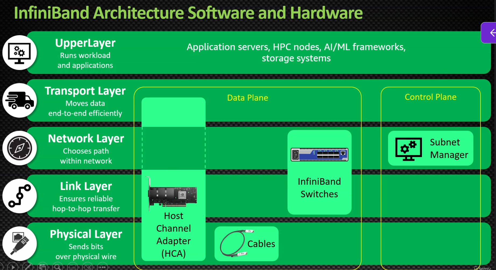

## Section 4: Connecting through Infiniband

### 9. 08 - InfiniBand Physical Connectivity
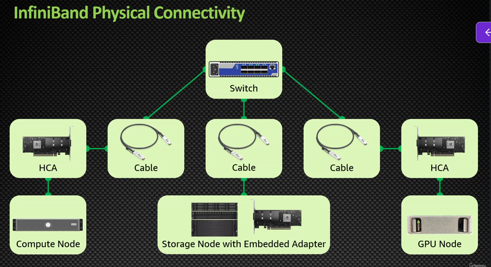

### 10. 09 - Host Channel Adapters
- Equivalent to an ethernet adaptor on an ethernet network
- Provides CPU offload which increases performance and decreases latency
- Single port vs multiple port HCA
- ConnectX
  - A unified HCA which supports both IB and Ethernet
  - Modern models like ConnectX-8 is programmable, offload-heavy accelerator

### 11. 10 - Cables
- Direct Attached Copper (DAC)
  - Electrical signals over copper
  - Short range (5-7 meters)
  - Very low power consumption
  - Cheaper
  - Thicker, heavier, less flexible
  - Susceptible to EMI
- Active Optical Cable (AOC)
  - Optical (light) signals over fiber
  - Long range (up to 100m+)
  - Higher power consumption
  - More expensive
  - Thinner, lighter, more flexible
  - Immune to EMI

### 12. 11 - Connecting Two Nodes
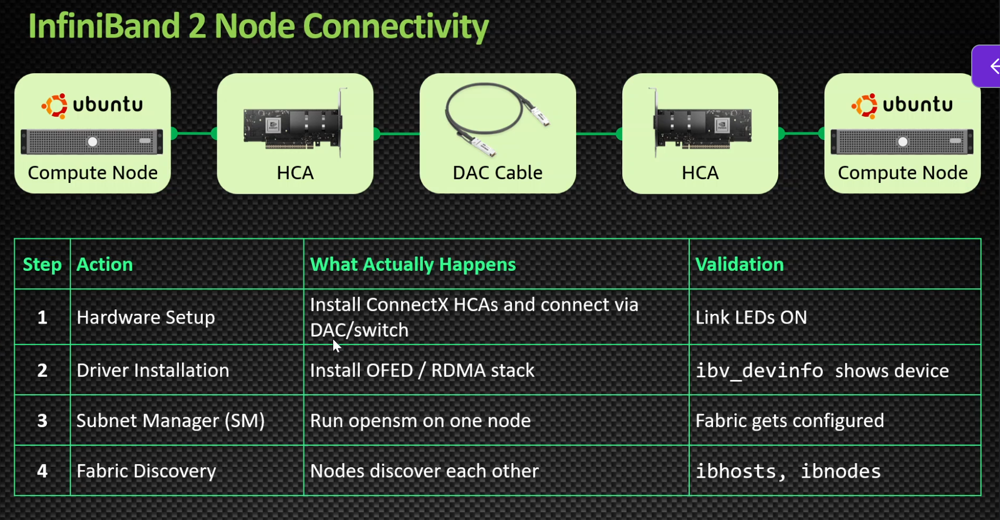

### 13. 12 - Physical Connection
- Check Nvidia Docs Hub for HW installation
  - https://networking-docs.nvidia.com/
  - Download Nvidia OFED
- Demo:
```bash
$ hostnamectl # check network status
...
$ lspci | grep Mellanox # find HCA
...
$ lsmod | grep mlx # check if the driver is installed such as ib_core, ib_uverbs, mlx4/5_ib, mlx4/5_core
...
```

### 14. 13 - IB Modules
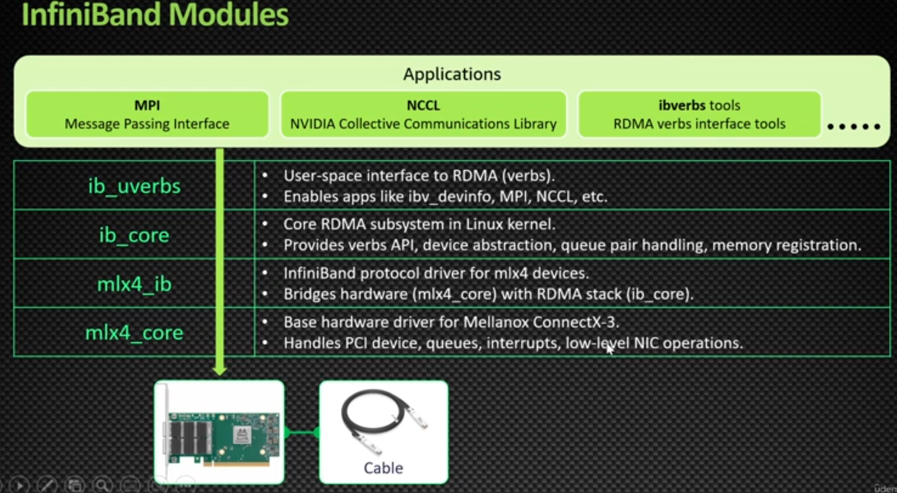

### 15. 14 - Verifying Device
- Demo:
```bash
$ ibv_devinfo # if not work,  sudo apt install ibverbs-utils
... # port info, state, guid, port_lid
$ 
```

### 16. 15 - Nodes Communication
- When cables are connected, port state becomes from `PORT_DOWN` to `PORT_INIT`
- To make the port active, subnet manager is required
  - Let's run opensm on one node

## Section 5: Subnet Manager (SM)

### 17. 16 - Why we need Subnet Manager
- Subnet Manager is the "brain" of the IB fabric that discovers, configures, and maintains the entire network
  - Assigns LIDs
  - Discovers topology
  - Programs routing tables
  - Ensures path consistency
  - Manages partitions (P_Key)
  - Handles link state changes
  - Optimizes performance
- Multiple SM can run for fail-over
- Where can SM run in IB network?
  - Must be "inside the fabric" to control it
  - Switch
    - Most common in production fabrics
    - Runs inside managed switches 
    - High reliability, always-on with the fabric
  - Any node
    - Runs on a server with an HCA (e.g., openSM)
    - Useful for labs, small clusters, or cost-sensitive setups
  - Dedicated management node
    - A separate server purely for fabric management
    - Preferred in large-scale HPC/AI clusters

### 18. 17 - OpenSM Installation
- Demo:
```bash
$ opensm --help
$ sudo apt install opensm rdma-core ibverbs-utils infiniband-diags
$ sudo modprobe ib_umad
# moving to 2nd node
$ ibv_devinfo
# Check PORT_INIT
$ sudo systemctl start opensm
$ ibv_devinfo 
# Check PORT_ACTIVE now. Now sm_lid and port_lid are given (local ID)
```

### 19. 18 - Connecting through Switch
- Demo using IS5022 

## Section 6: Infiniband Addressing

### 20. 19 - Getting Details of IB Adapter
```bash
$ ibstat
...
```
- CA: Channel Adapter
- ibp1s0: PCI location of IB device
- MT4099: HW model
- Rate: Link speed. 40 means 40Gb/sec
- Base lid: Local Identifier assigned by Subnet Manager
- LMC: 0 means only 1 lid assigned
- SM lid: LID of the Subnet Manager (SM)
- Capability mask: Bitmask - mostly used for low-level diagnostics

### 21. 20 - Global Unique Identifier (GUID)
- 64bit value burned into HW (by manufacture)
- Used by SM to assign LIDs

### 22. 21 - Local Identifier (LID)
- A 16-bit address assigned to each IB port (Range: 0x0001->0xFFFE)
- Unique within a subnet, used for routing packets within a subnet
- Assigned dynamically by the SM
- Why LID is needed?
  - Enables efficient HW-level routing
  - Allows switches to forward packets using lookup tables (LFTs)
  - Decopules communication from GUID

| Feature | LID (16bit) | GUID(64bit)|
|---------|-------------|------------|
| Scope   | Local(subnet) | Global   |
| Assigned by| Subnet Manager | Manufacturer |
| Changes | Yes          | No         |
| Used for routing | Yes | No         |

## Section 7: Infiniband Utilities

### 23. 22 - Checking Connectivity
- ibping
  - A tool test connectivity b/w IB nodes
  - Works at IB layer (LID/GUID)
  - Similar to ping but not IP-based
  - When one node runs as server: `ibping -S`
  - Another node sends ping requests: `ibping -L <LID>`

### 24. 23 - Topology Discovery
- ibnetdiscover
  - A tool to discover and map the entire IB fabric
  - Shows
    - Nodes (HCAs)
    - Switches
    - Ports and connections
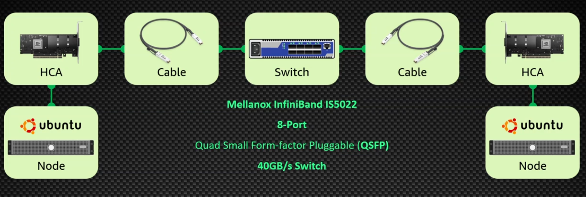
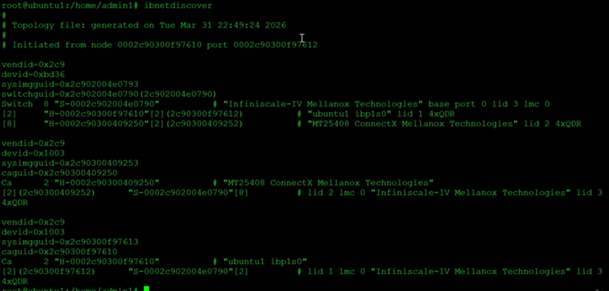

### 25. 24 - InfiniBand Utilities - Part 1

| Tool          |  Purpose   | When to use  |
| ------------- |------------| -------------|
| iblinkinfo | Shows link-level | Quick topology check |
| ibtracert  | Traces path b/w nodes | Identify hops/switches |
| ibhosts    | Lists all IB hosts | Fabric discovery |
| ibswitches | Lists switches | Switch inventory |
| ibnodes    | List all nodes | Full fabric view (nodes + switches) |
| ibv_devinfo | Detailed HCA capabilities | HW validation

### 26. 25 - InfiniBand Utilities - Part 2
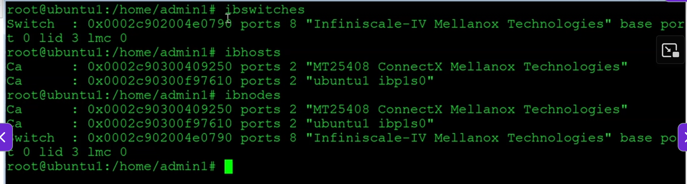

## Section 8: Remote Direct Memory Access (RDMA)

### 27. 26 - Direct Memory Access
- DMA (Precursor to RDMA)
  - A HW feature that lets supported devices transfer data to/from memory without the CPU actigin as middle-man
- Without DMA:
  - CPU must copy every byte from device to memory
  - CPU utilization up to 90-100% for data transfer
- With DMA:
  - Device controller handles transfers directly
  - CPU utilization: 5-10%
  - 10-100x faster data movement

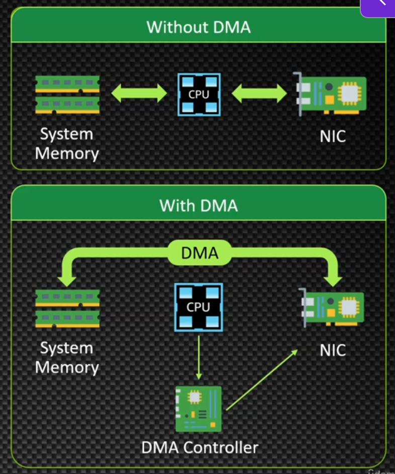

### 28. 27 - Remote DMA (RDMA)
- DMA over the network
  - Allows one computer to directly read or write memory on another computer without involving the CPU or OS
  - IB or RoCE or iWARP

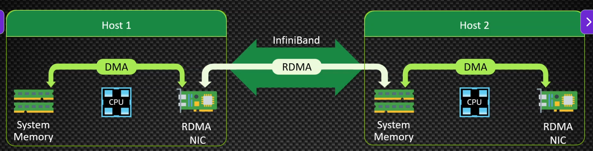

### 29. 28 - Traditional Data Transfer
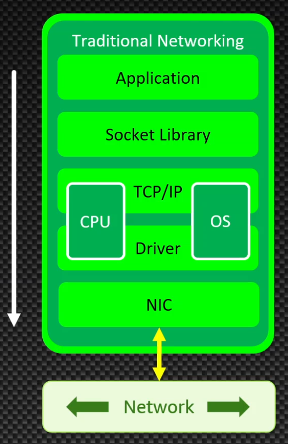

- High latency due to multiple SW layers
- CPU bottlenecks
- Inefficient data handling
  - Repeated memory copies add overhead and reduce efficiency

### 30. 29 - RDMA - Analogy
- RDMA removes layers, offloads the CPU, and eliminates copies

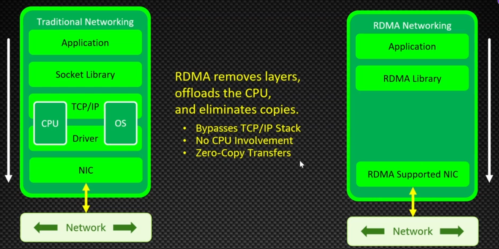

### 31. 30 - Zero Copy Transfer
- Traditional data transfer needs to copy data from application to kernel then to NIC
  - Heavy CPU utilization
  - Destination host repeats the steps inversely to get data in application

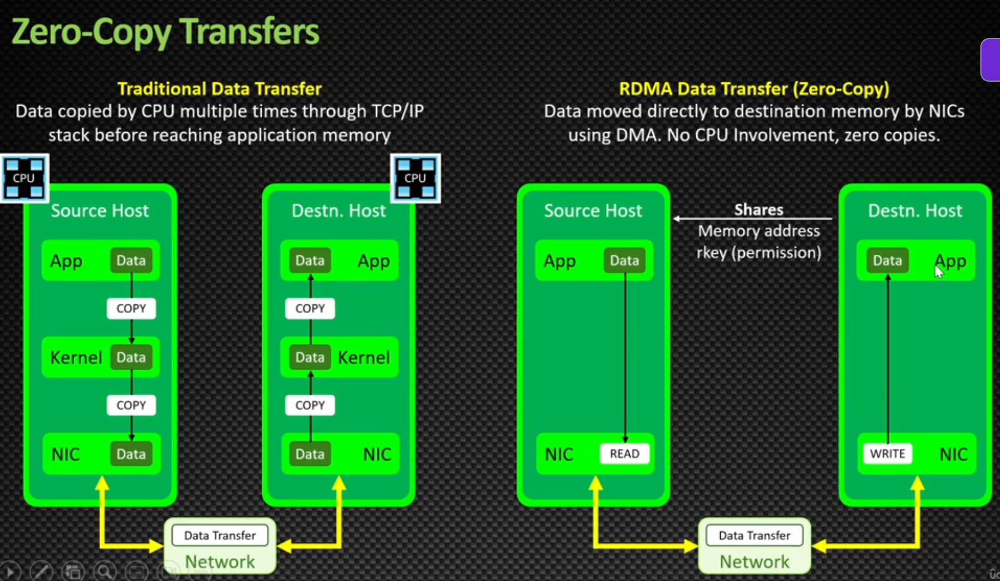

### 32. 31 - RDMA Verbs
- Basic commands (APIs) that applications use to talk directly to the network HW
  - Low-level instructions to perform RDMA operations
- Why "verbs"?
  - Because they are literally actions like create, register, send, write, read, poll  
- Application <--> Verbs <--> RDMA supporting HW like IB, iWARP, RoCE

## Section 9: Key Infiniband features

### 33. 32 - Key InfiniBand Features
- IB is a natural fit for RDMA because it provides:
  - Queue Pair (QP) built into HW
  - Memory Registration + Key mechanism
  - HW Offload capability
  - Lossless, credit-based flow control

### 34. 33 - Queue Pairs
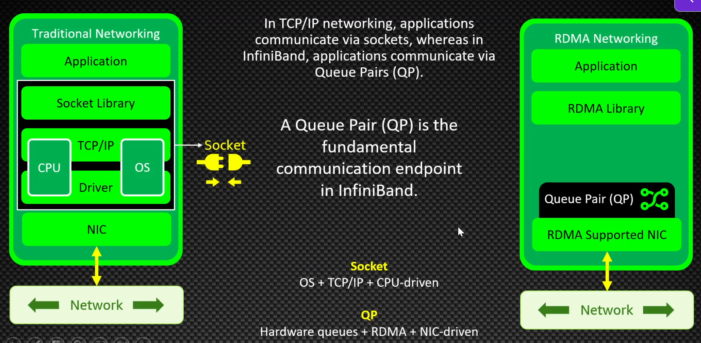

- Application: 
  - Creates a QP using RDMA verbs (ibv_create_qp)
  - Posts work requests -> Send Queue (SQ)
- Once work is posted
  - NIC reads the request from SQ
  - Fetches data using DMA
  - Sends packets over fabric (ibv_post_send)
  - Remote NIC processes and places data in memory
  - Completion is written to Completion Queue (CQ)
- Application:
  - Polls for completion -> CQ(ibv_poll_cq)

### 35. 34 - Memory Registration (MR)
- A block of memory registered with the RDMA NIC to enable direct memory access through RDMA operations
- Each MR is associated with two keys used to authorize RDMA access
  - Local key (lkey): used by the local RDMA NIC for internal access to the memory
  - Remote key (rkey): shared with remote peers to grant them access, based on the permissions set during registration

### 36. 35 - Hardware Offload
- IB HCAs move transport logic, data movement, and flow control from the CPU-driven SW stack into dedicated HW
- Top 5 things HCA does in HW

| Function | IB HCA (HW) |
|----------|-------------|
| Transport processing | Handles sequencing, ACK/NACK, retransmissions, in-order delivery in HW |
| Data movement | Direct memory-to-memory transfer via DMA (zero-copy) |
| Request execution model| Processes RDMA operations via Queue Pairs (QP) in HW |
| Packetization & reassembly | Segmentation and reassembly done in NIC HW |
| Memory protection & access control | Validates lkey/rkey, enforces memory region boundaries in HW|

### 37. 36 - Lossless, Credit Based Flow
- IB doesn't deal with packet loss - it prevents it from happening in the first place
- Sender only sends data when the receiver is ready - so nothing gets dropped
- Credit-based flow control 
  - Credits are pre-approved permission to send data - just like a credit limit of your credit card is pre-approved permission to send

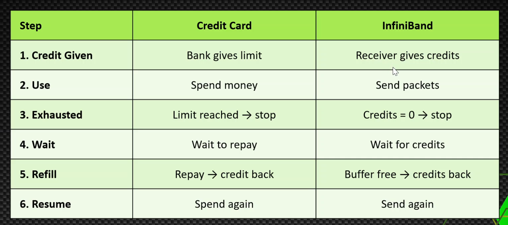

### 38. 37 - RDMA Demo
```bash
$ ibstat
...
$ ibping -S # in the first node
$ ibping 4 # in the second node
```
- Bandwidth and latency test
```bash
$ ib_write_bw # in the first node
$ ib_write_bw 192.168.0.xx # in the second node
...
$ ib_write_lat 192.168.0.yy
```
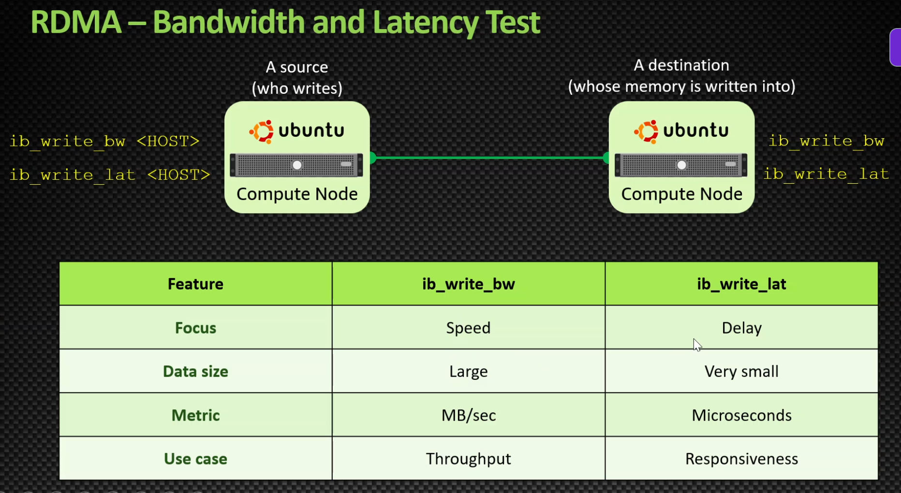

## Section 10: How Nvidia is using RDMA?

### 39. 38 - GPUDirect RDMA
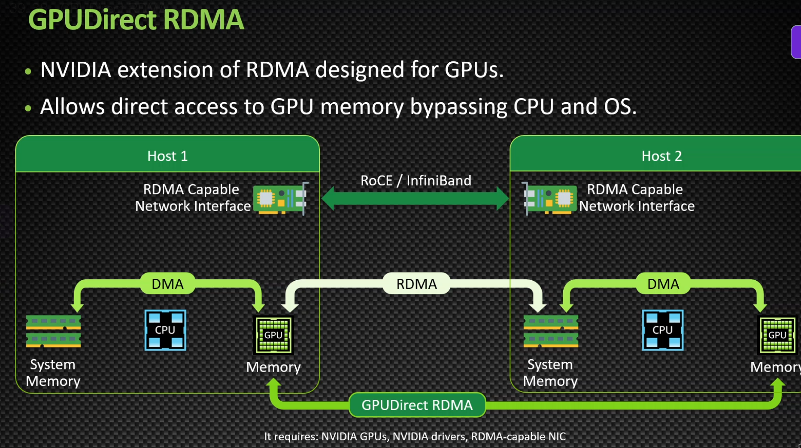

### 40. 39 - GPUDirect Storage
- Direct GPU-to-storage transfers bypassing CPU and system memory
- Reduces IO bottlenecks in training

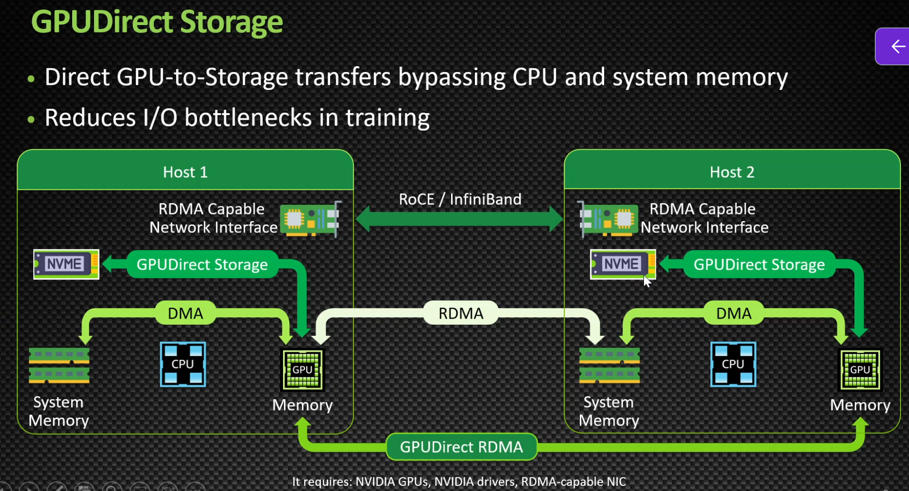

### 41. 40 - GPUDirect RDMA vs GPUDirect Storage
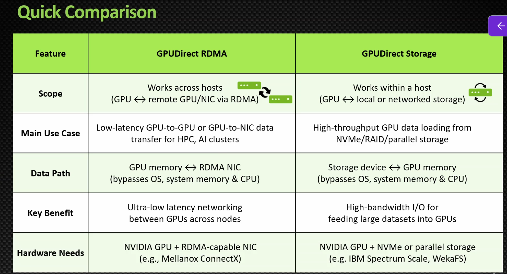

## Section 11: Comparing IB

### 42. 41 - Ethernet vs InfiniBand
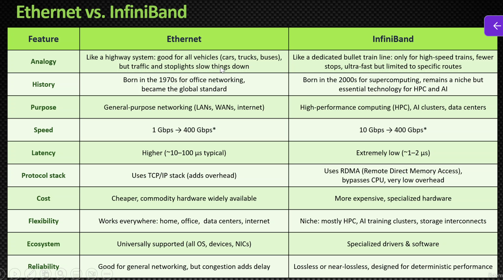

### 43. 42 - TCP-IP vs InfiniBand
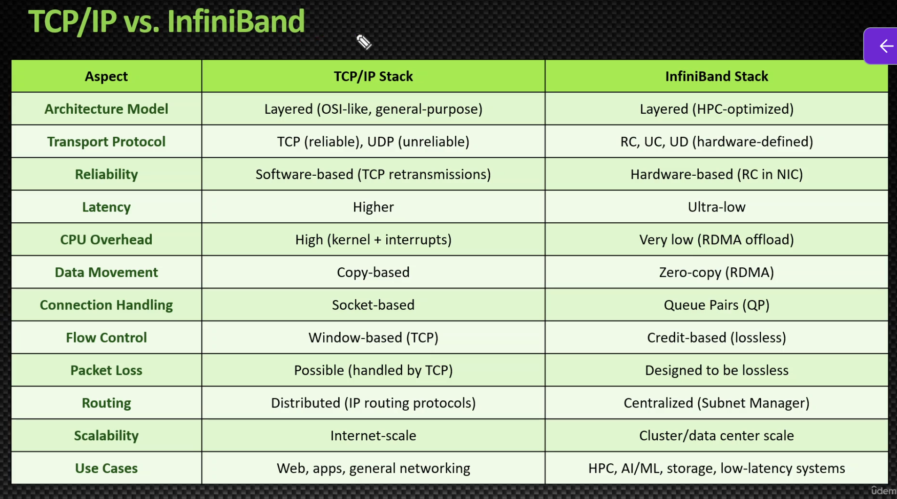

## Section 12: Going beyond a subnet

### 44. 43 - Going Beyond an InfiniBand Subnet
- Spine vs leaf switches
  - Spine: upper hierarchy switches
  - Leaf: lower hierarcy switches
- Is One Subnet sufficient?
  - A subnet is optimized for speed and simplicity, not infinite scale
    - Each node in a subnet gets a LID
    - LIDs are assigned by the subnet manager (SM)
    - Routing is LID-based within the subnet
  - So the subnet size is fundamentally tied to LID space

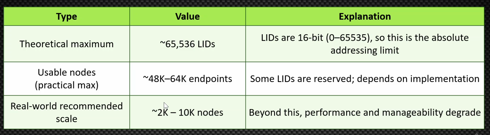

- Challenges with single subnet design
  - Scalability limit
  - Subnet manager bottleneck
  - Large fault domain
  - Shared congestion domain
- Different topologies
  - To optimize performance, scalability, and cost based on workload patterns, traffic flow, and cluster size

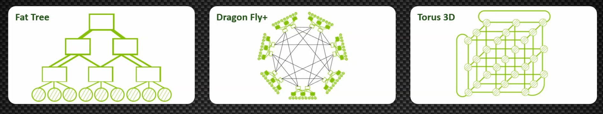

### 45. 44 - InfiniBand Router
- An IB router connects multiple IB subnets, enabling communication across separate subnet while maintaining isolation and scalability
- Not commonly used
- But might be asked in certificate exams

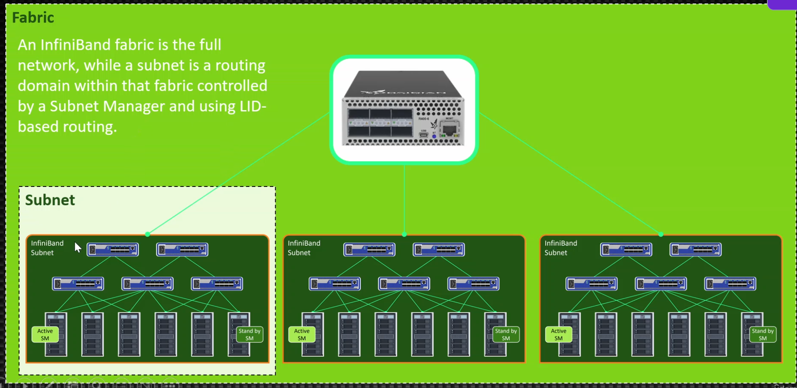

### 46. 45 - InfiniBand Packet
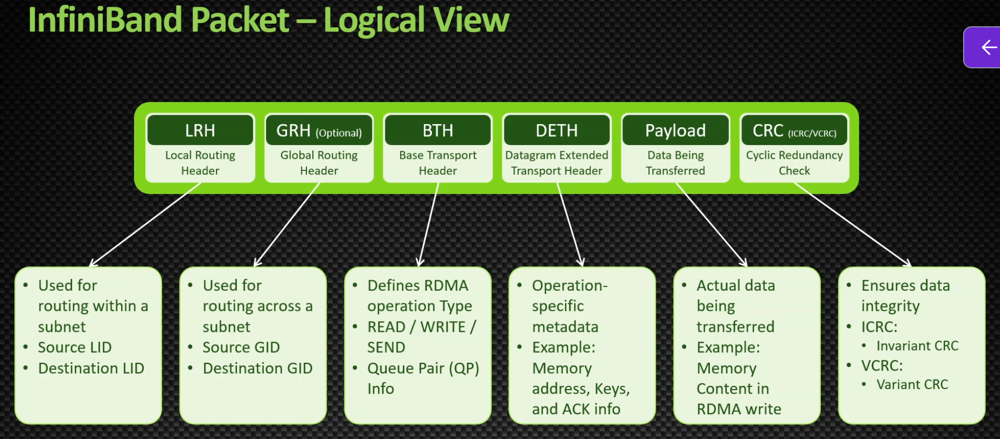

- ibdump: capturing IB packet
```bash
$ ibping -S #  in the first node
$ ibping 2 # in the 2nd node
$ ibdump -d mlx4_0 -i 1 -w ib_capture.pcap # in the first node
```
- Wireshark can open *.pcap files

### 47. 46 - Global ID (GID)

### 48. 47 - GUID vs. LID vs. GID

## Section 13: Nvidia Infiniband Stack

### 49. 48 - NVIDIA InfiniBand Stack
### 50. 49 - NVIDIA InfiniBand Hardware Stack
### 51. 50 - NVIDIA InfiniBand Software Stack
### 52. 51 - OpenFabrics Enterprise Distribution - Part 1
### 53. 52 - OpenFabrics Enterprise Distribution (OFED) - Part 2
3min

### 54. 53 - Traffic Isolation in InfiniBand
### 55. 54 - Power of Partition Key (PKey)
### 56. 55 - Configuring Partitions
### 57. 56 - 3 Node Partitioning
12min

### 58. 57 - Network Topology and Routing
### 59. 58 - Control Plane and Data Plane
### 60. 59 - One Switch Setup
### 61. 60 - Two Switch Setup
### 62. 61 - Direct or Through Switch
### 63. 62 - Routing Algorithms
### 64. 63 - MINHOP Routing
### 65. 64 - UPDN Routing
### 66. 65 - Fat Tree Routing
### 67. 66 - Adaptive Routing
### 68. 67 - Chagning Routing Algorithm
### 69. 68 - Why Adaptive Routing?
### 70. 69 - Configuring Adaptive Routing
### 71. 70 - Adaptive Routing Demo - Part 1
### 72. 71 - Adaptive Routing Demo - Part 2
### 73. 72 - LID Mask Control - LMC
### 74. 73 - Network Congestion
### 75. 74 - Credit Loops
### 76. 75 - How to avoid Credit Loops?
### 77. 76 - Algorithm Comparision
6min

### 78. 77 - Traffic Prioritization
### 79. 78 - Quality of Service (QoS)
### 80. 79 - QoS vs SL vs VL
### 81. 80 - Configuring QoS - Part 1
### 82. 81 - Configuring QoS - Part 2
### 83. 82 - Configuring QoS - Part 3
### 84. 83 - Verify QoS
### 85. 84 - QoS in Action
9min

### 86. 85 - Unified Fabric Manager
### 87. 86 - UFM Architecture
### 88. 87 - UFM Platform Capabilities
### 89. 88 - Getting Started with UFM
### 90. 89 - UFM Traffic Map
### 91. 90 - UFM Quick Tour
### 92. 91 - Topology File
### 93. 92 - Important UFM Messages
### 94. 93 - Role Based Access Control
### 95. 94 - UFM Cyber-AI
3min

### 96. 95 - Device Level Management
### 97. 96 - Accessing Switch Console Port
### 98. 97 - Initial Configuration
### 99. 98 - Some Useful Commands
### 100. 99 - Mellanox OS - Web Interface
### 101. 100 - Upgrade Procedure
5min

### 102. 102 - Troubleshooting Issues
### 103. 103 - Performance Issues
### 104. 104 - Connectivity Issues
### 105. 105 - Connectivity Issues
### 106. 106 - Physical Layer Issues
7min

### 107. Next Steps
1min

