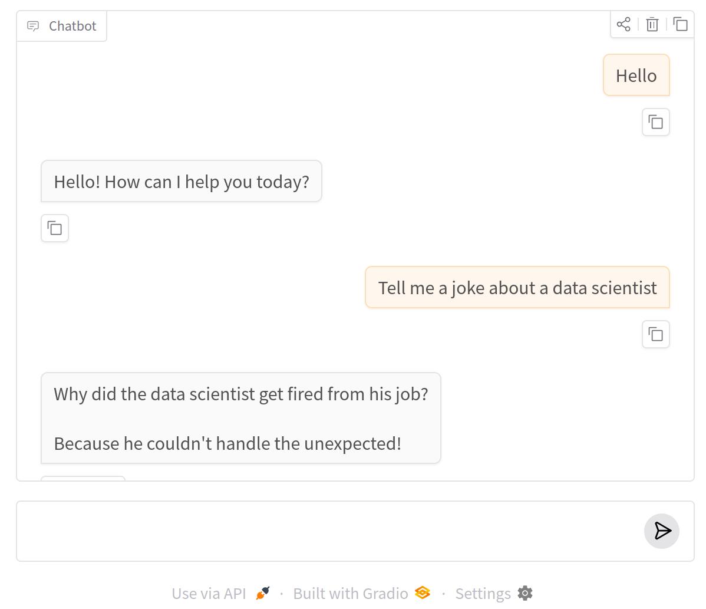
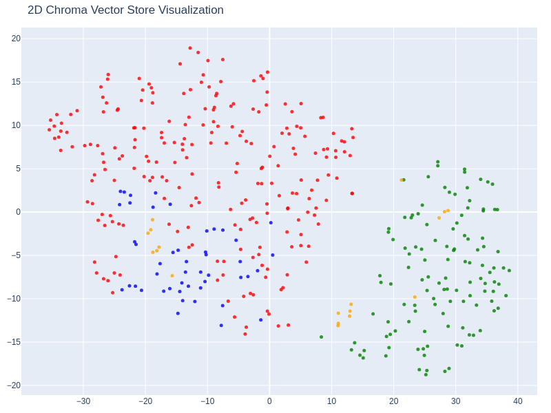
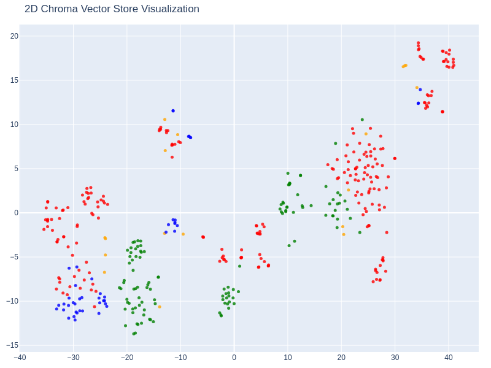

## AI Engineer Core Track: LLM Engineering, RAG, QLoRA, Agents
- Instructor: Ed Donner

## Section 1: New Week 1 - Build your First LLM Product: Exploring Top Models

### 1. Day 1 - Running Your First LLM Locally with Ollama and Open Source Models
- https://edwarddonner.com/2024/11/13/llm-engineering-resources/
- https://github.com/ed-donner/llm_engineering
- Running ollama
  - ollama run gemma3:270m

### 2. Day 1 - Spanish Tutor Demo with Open-Source Models & Course Overview

### 3. Day 1 - Setting Up Your LLM Development Environment with Cursor and UV
- Step 1: clone the repo, install Cursor
- Step 2: Install UV
- Step 3: Create an OpenAI key
- Step 4: Create the .env file

### 4. Day 1 - Setting Up Your PC Development Environment with Git and Cursor

### 5. Day 1 - Mac Setup: Installing Git, Cloning the Repo, and Cursor IDE
- Cursor: spawned from VS code

### 6. Day 1 - Installing UV and Setting Up Your Cursor Development Environment
- UV: something like anacondas
- curl -LsSf https://astral.sh/uv/install.sh | sh

### 7. Day 1 - Setting Up Your OpenAI API Key and Environment Variables
- https://platform.openai.com/docs/overview
- $5 payment required
- Optional in this class
- Store the key at `.env` file
  - OPENAI_API_KEY=XXXX

### 8. Day 1 - Installing Cursor Extensions and Setting Up Your Jupyter Notebook

### 9. Day 1 - Running Your First OpenAI API Call and System vs User Prompts
- System prompt: Tone of the system
```
systemp_prompt = ...
```
- User prompt: conversation with users
```
user_prompt_prefix= ...
```

### 10. Day 1 - Building a Website Summarizer with OpenAI Chat Completions API

### 11. Day 1 - Hands-On Exercise: Building Your First OpenAI API Call from Scratch

### 12. Day 2 - LLM Engineering Building Blocks: Models, Tools & Techniques
- 3 dimensions of LLM engineering
  - Models: open source, multi-modal, architecture, ...
  - Tools: HuggingFace, LangChain, Gradio, 
  - Techniques: APIs, RAG, Fine-tuning, Agentization

### 13. Day 2 - Your 8-Week Journey: From Chat Completions API to LLM Engineer
- Week 1: Foundations and the chat completions API
- Week 2: Frontier models with APIs, UIs, and Multi-modality
- Week 3: Open source with HuggingFace
- Week 4: Selecting LLMs and Code Generation
- Week 5: RAG and Question Answering - Creating an expert
- Week 6: Fine-tuning a Froniter Model
- Week 7: Fine-tuning an open source model
- Week 8: The finale - Agentic AI

### Day 2 - Frontier Models: OpenAI GPT, Claude, Gemini & Grok Compared
- Closed-source frontier
  - GPT from OpenAI
  - Claude from Anthropic
  - Gemini from Google
  - Grok from x.ai

### 15. Day 2 - Open-Source LLMs: LLaMA, Mistral, DeepSeek, and Ollama
- OSS models
  - Llama from Meta
  - Mixtral from Mistral
  - Qwen from Alibaba cloud
  - Gemma from Google
  - Phi from Miscrosoft
  - DeepSeek from DeepSeek AI
  - GPT-OSS from OpenAI
- Three ways to use models
  - Chat interfaces
  - APIs
    - LangChain
    - Cloud APIs like Amazon Bedrock, Google Vertex, Azure ML
  - Direct inference
    - Local Ollama run
    - HuggingFace Transformers library

### 16. Day 2 - Chat Completions API: HTTP Endpoints vs OpenAI Python Client
- Chat completions API
  - The simplest way to call an LLM
  - Created by OpenAI
  - All LLM vendor mimic this
- API end point
  - https://api.openai.com/v1/chat/completions
- openai package
  - Python client library

### 17. Day 2 - Using the OpenAI Python Client with Multiple LLM Providers
```py
# Create OpenAI client
from openai import OpenAI
openai = OpenAI()
response = openai.chat.completions.create(model="gpt-5-nano", messages=[{"role": "user", "content": "Tell me a fun fact"}])
response.choices[0].message.content
```
- For gemini:
```py
GEMINI_BASE_URL = "https://generativelanguage.googleapis.com/v1beta/openai/"
load_dotenv(override=True)
google_api_key = os.getenv("GOOGLE_API_KEY")
if not google_api_key:
    print("No API key was found - please be sure to add your key to the .env file, and save the file! Or you can skip the next 2 cells if you don't want to use Gemini")
elif not google_api_key.startswith("AIz"):
    print("An API key was found, but it doesn't start AIz")
else:
    print("API key found and looks good so far!")
gemini = OpenAI(base_url=GEMINI_BASE_URL, api_key=google_api_key)
response = gemini.chat.completions.create(model="gemini-2.5-flash-lite", messages=[{"role": "user", "content": "Tell me a fun fact"}])
response.choices[0].message.content
```

### 18. Day 2 - Running Ollama Locally with OpenAI-Compatible Endpoints
- pip3 install OpenAI
- Still needs OpenAI_API_KEY for ollama 

### 19. Day 3 - Base, Chat, and Reasoning Models: Understanding LLM Types
- LLMs come in 3 flavors
  - Base: ex) GPT
    - Better for fine-tuning to learn a new skill
  - Chat/instruct: ex) Chat-GPT
    - Better for interactive use cases and creative content generation?
  - Reasoning/Thinking: chain of thought
    - Better for problem solving
    - Budget forcing: A technique to control the amount of thinking or computational budget an LLM uses 
      - Adding word "wait" frequently, yields better results for long thinking

### 20. Day 3 - Frontier Models: GPT, Claude, Gemini & Their Strengths and Pitfalls
- Good at:
  - Synthesizing information
  - Fleshing out a skeleton
  - Coding
- Limitations
  - Specialized domains
  - Recent events
  - Can confidently make mistakes

### 21. Day 3 - Testing ChatGPT-5 and Frontier LLMs Through the Web UI
- Q: how many times does the letter 'a' appear in this sentence
  - Several seconds on even GPT5
- Q: How many words are there in your answer to this question?
  - A: one
  - Several seconds on GPT5

### 22. Day 3 - Testing Claude, Gemini, Grok & DeepSeek with ChatGPT Deep Research
- Claude: good at edge cases

### 23. Day 3 - Agentic AI in Action: Deep Research, Claude Code, and Agent Mode
- Agent mode: Find me a restaurant in NYC today 4-7pm, serving a meat pie
  - Research through web like Yelp and Reddit to find restaurings serving a meat pie
  - Looks for scheduling features

### 24. Day 3 - Frontier Models Showdown: Building an LLM Competition Game
- https://github.com/ed-donner/outsmart

### 25. Day 4 - Understanding Transformers: The Architecture Behind GPT and LLMs
- The extraordinary rise of the transformers
  - 2017, "Attention is All you need" by Google
  - 2018, GPT-1 by OpenAI
  - 2019, GPT-2
  - 2020, GPT-3
  - 2022, RLHF and ChatGPT
    - Chat mode
  - 2023, GPT-4
  - 2024, GPT-4o
- Transformation is a way of optimization
  - Efficient for very large data
  - No proven supriority

### 26. Day 4 - From LSTMs to Transformers: Attention, Emergent Intelligence & Agentic A
- LSTM: sequential training
- Transformers: Simple. No sequences. Attention is all. Can be parallelized
- Reaction to transformers
  - Stochastic Parrot
  - Predictive text on steroids
- Prompt engineering -> Context engineering  
- Now Agentic AI

### 27. Day 4 - Parameters: From Millions to Trillions in GPT, LLaMA & DeepSeek
- GPT-1: 117M
- GPT-2: 1.5B
- Llama 3.2: 3B
- Llama 3.1: 8B
- Llama 3.3: 70B
- GPT-OSS: 120B
- GPT-3: 175B
- DeepSeek: 671B
- GPT-4: 1.76T
- Latest Frontier models: undisclosed
- Training time scaling
  - Time taken for training models
- Infererence time scaling
  - Reasoning trick
    - RAG
  - Speed up inference

### 28. Day 4 - What Are Tokens? From Characters to GPT's Tokenizer
- In the early days, neural network were trained at the character level
- Then neural networks were trained off words
  - Predicts the next word in this sequence
- The breakthrough was to work with chunks of words, called "tokens"
  - Useful information for the neural network. Elegantly handles word stems

### 29. Day 4 - Understanding Tokenization: How GPT Breaks Down Text into Tokens
- GPT tokenizer: https://platform.openai.com/tokenizer
- Common words: split by spaces
  - `Today's temperature is less than 20F at Boston`
  - `Today's`, `temperature`, `is`, `less`, `than`, `20F`, `at`, `Boston`
- Less common words (and invented words!): broken into multiple tokens
  - Sometimes, a word is broken into fragments
  - `An exquisitely handcrafted IPs for mastery of witchcraft`
  - `An`, `exquis`,`it`,`ely`, `handcrafted` `IP`,`s`, `for`, `mastery`, `of`, `witch`, `craft`
- Rule-of-themb in typical english writing:
  - 1 token is ~4 characters
  - 1 token is ~0.75 words
  - so 1,000 tokens is ~750 words
  - The collected workds of Shakespeare are ~900,000 words or 1.2M tokens

### 30. Day 4 - Tokenizing with tiktoken and Understanding the Illusion of Memory
- I change to ollama interface from OpenAI package as no OPENAI_API_KEY is available
```py
from openai import OpenAI
import os
client = OpenAI(base_url="http://localhost:11434/v1", api_key="ollama")
messages = [
  {"role":"system", "content": "You are a helpful assistant"},
  {"role":"user", "content": "Hi I am Ed"}
]
response = client.chat.completions.create(model="llama3.2:1b", messages=messages)
response.choices[0].message.content
```
- Result: 
```bash
12194 = Hi
922 =  my
1308 =  name
382 =  is
1648 =  Ed
```
- Illusion of memory
  - Every call to an LLM is stateless
    - No history recorded
  - To overcome, pass in the entire conversation in the input prompt, everytime, giving the illusion that LLM has memory

### 31. Day 4 - Context Windows, API Costs, and Token Limits in LLMs
- Context window
  - Max. number of tokens that the model can consider when generating the next token
  - Includes the original input prompt, subsequent conversation, the latest input prompt and almost all the output prompt
  - It governs how well the model can remember references, content, and context
  - Particularly important for muli-shot prompting where the prompt includes examples, or for long conversations
- API costs
  - Based on the number of input tokens and output tokens
  - Tokens of old prompt for illusion of memory
  - Includes tokens for reasoning
- Common context windows and API costs
  - https://www.vellum.ai/llm-leaderboard
  - GPT5: 400,000 context window, $125 / 1M input tokens, $10 / 1M output tokens
  - Gemini2.5/Flash: 1,000,000 context window, $0.15 / 1M input tokens, $0.6 / 1M output tokens

### 32. Day 5 - Building a Sales Brochure Generator with OpenAI Chat Completions API
- Company sales brochure generator
  - Create a product that can generate marking brochure about a company
    - For prospective clients
    - For investors
    - For recruiment
  - Use OpenAI API
  - Use on shot prompting
  - Stream back results and show with formatting


### 33. Day 5 - Building JSON Prompts and Using OpenAI's Chat Completions API
- Singleshot prompting: a technique where you provide an AI model with a single example to guide its response. Instead of explicitly explaining a task, you show the model one input-output pair, and it uses that example to perform the same task on a new query.
- Multishot prompting: a technique where you provide multiple examples to an AI model within the prompt itself to guide its output. By giving the model several examples of the desired input and output, it can better understand complex tasks and generate responses that match a specific pattern, format, or style

### 34. Day 5 - Chaining GPT Calls: Building an AI Company Brochure Generator
```py
import os
import json
from dotenv import load_dotenv
from IPython.display import Markdown, display, update_display
from scraper import fetch_website_links, fetch_website_contents
from openai import OpenAI
# Initialize and constants
load_dotenv(override=True)
api_key = os.getenv('OPENAI_API_KEY')
if api_key and api_key.startswith('sk-proj-') and len(api_key)>10:
    print("API key looks good so far")
else:
    print("There might be a problem with your API key? Please visit the troubleshooting notebook!")
MODEL = 'gpt-5-nano'
openai = OpenAI()
links = fetch_website_links("https://edwarddonner.com")
links
# First step: Have GPT-5-nano figure out which links are relevant
# Use a call to gpt-5-nano to read the links on a webpage, and respond in structured JSON.
# It should decide which links are relevant, and replace relative links such as "/about" with "https://company.com/about".
# We will use "one shot prompting" in which we provide an example of how it should respond in the prompt.
# This is an excellent use case for an LLM, because it requires nuanced understanding. Imagine trying to code this without LLMs by parsing and analyzing the webpage - it would be very hard!
# Sidenote: there is a more advanced technique called "Structured Outputs" in which we require the model to respond according to a spec. We cover this technique in Week 8 during our autonomous Agentic AI project.
link_system_prompt = """
You are provided with a list of links found on a webpage.
You are able to decide which of the links would be most relevant to include in a brochure about the company,
such as links to an About page, or a Company page, or Careers/Jobs pages.
You should respond in JSON as in this example:
{
    "links": [
        {"type": "about page", "url": "https://full.url/goes/here/about"},
        {"type": "careers page", "url": "https://another.full.url/careers"}
    ]
}
"""
def get_links_user_prompt(url):
    user_prompt = f"""
Here is the list of links on the website {url} -
Please decide which of these are relevant web links for a brochure about the company, 
respond with the full https URL in JSON format.
Do not include Terms of Service, Privacy, email links.
Links (some might be relative links):
"""
    links = fetch_website_links(url)
    user_prompt += "\n".join(links)
    return user_prompt
print(get_links_user_prompt("https://edwarddonner.com"))
def select_relevant_links(url):
    response = openai.chat.completions.create(
        model=MODEL,
        messages=[
            {"role": "system", "content": link_system_prompt},
            {"role": "user", "content": get_links_user_prompt(url)}
        ],
        response_format={"type": "json_object"}
    )
    result = response.choices[0].message.content
    links = json.loads(result)
    return links
select_relevant_links("https://edwarddonner.com")
```

### 35. Day 5 - Building a Brochure Generator with GPT-4 and Streaming Results
```py
def select_relevant_links(url):
    print(f"Selecting relevant links for {url} by calling {MODEL}")
    response = openai.chat.completions.create(
        model=MODEL,
        messages=[
            {"role": "system", "content": link_system_prompt},
            {"role": "user", "content": get_links_user_prompt(url)}
        ],
        response_format={"type": "json_object"}
    )
    result = response.choices[0].message.content
    links = json.loads(result)
    print(f"Found {len(links['links'])} relevant links")
    return links
select_relevant_links("https://edwarddonner.com")
select_relevant_links("https://huggingface.co")
#Second step: make the brochure!
#Assemble all the details into another prompt to GPT-5-nano
def fetch_page_and_all_relevant_links(url):
    contents = fetch_website_contents(url)
    relevant_links = select_relevant_links(url)
    result = f"## Landing Page:\n\n{contents}\n## Relevant Links:\n"
    for link in relevant_links['links']:
        result += f"\n\n### Link: {link['type']}\n"
        result += fetch_website_contents(link["url"])
    return result
print(fetch_page_and_all_relevant_links("https://huggingface.co"))
brochure_system_prompt = """
You are an assistant that analyzes the contents of several relevant pages from a company website
and creates a short brochure about the company for prospective customers, investors and recruits.
Respond in markdown without code blocks.
Include details of company culture, customers and careers/jobs if you have the information.
"""
# Or uncomment the lines below for a more humorous brochure - this demonstrates how easy it is to incorporate 'tone':
# brochure_system_prompt = """
# You are an assistant that analyzes the contents of several relevant pages from a company website
# and creates a short, humorous, entertaining, witty brochure about the company for prospective customers, investors and recruits.
# Respond in markdown without code blocks.
# Include details of company culture, customers and careers/jobs if you have the information.
# """
def get_brochure_user_prompt(company_name, url):
    user_prompt = f"""
You are looking at a company called: {company_name}
Here are the contents of its landing page and other relevant pages;
use this information to build a short brochure of the company in markdown without code blocks.\n\n
"""
    user_prompt += fetch_page_and_all_relevant_links(url)
    user_prompt = user_prompt[:5_000] # Truncate if more than 5,000 characters
    return user_prompt
get_brochure_user_prompt("HuggingFace", "https://huggingface.co")
def create_brochure(company_name, url):
    response = openai.chat.completions.create(
        model="gpt-4.1-mini",
        messages=[
            {"role": "system", "content": brochure_system_prompt},
            {"role": "user", "content": get_brochure_user_prompt(company_name, url)}
        ],
    )
    result = response.choices[0].message.content
    display(Markdown(result))
create_brochure("HuggingFace", "https://huggingface.co")
# Finally - a minor improvement
# With a small adjustment, we can change this so that the results stream back from OpenAI, with the familiar typewriter animation
def stream_brochure(company_name, url):
    stream = openai.chat.completions.create(
        model="gpt-4.1-mini",
        messages=[
            {"role": "system", "content": brochure_system_prompt},
            {"role": "user", "content": get_brochure_user_prompt(company_name, url)}
          ],
        stream=True
    )    
    response = ""
    display_handle = display(Markdown(""), display_id=True)
    for chunk in stream:
        response += chunk.choices[0].delta.content or ''
        update_display(Markdown(response), display_id=display_handle.display_id)
stream_brochure("HuggingFace", "https://huggingface.co")
# Try changing the system prompt to the humorous version when you make the Brochure for Hugging Face:
stream_brochure("HuggingFace", "https://huggingface.co")
```

### 36. Day 5 - Business Applications, Challenges & Building Your AI Tutor
- Retry the above application using ollama

## Section 2: NEW Week 2 - Build a Multi-Modal Chatbot: LLMs, Gradio UI, and Agents

### 37. Day 1 - Connecting to Multiple Frontier Models with APIs (OpenAI, Claude, Gemini)
- Setting up API keys
```py
from openai import OpenAI
import os
client = OpenAI(base_url="http://localhost:11434/v1", api_key="ollama")
messages = [
  {"role":"user", "content": "Tell a joke for a student on the journey to becoming an expert in LLM"}
]
response = client.chat.completions.create(model="llama3.2:1b", messages=messages)
response.choices[0].message.content
```

### 38. Day 1 - Testing GPT-5 Models with Reasoning Effort and Scaling Puzzles
- llama3.2:8b doesn't support thinking type(reasoning_effort)
  - Most of ollama don't support
  - Download GPT-OSS models
- To solve complex problem
  - Increaes reasoning level for small models
  - Or use larger models

### 39. Day 1 - Testing Claude, GPT-5, Gemini & DeepSeek on Brain Teasers
- Comparison of GPT-5 vs Claude vs Grok for complex puzzles

### 40. Day 1 - Local Models with Ollama, Native APIs, and OpenRouter Integration
- When Ollama doesn't run on GPU: https://github.com/wgong/py4kids/blob/master/lesson-18-ai/ollama/gpu/fix-GPU-access-failure-after-suspend-resume-linux.md
- When installing/reinstalling ollama, make sure:
```bash
>>> Adding current user to ollama group...
>>> Creating ollama systemd service...
>>> Enabling and starting ollama service...
>>> NVIDIA GPU installed.
```
- Will use gpt-oss:20b. This may require at least 16GB RAM
- openrouter.ai
  - Abstraction layer b/w users and Frontier models

### 41. Day 1 - LangChain vs LiteLLM: Choosing the Right LLM Framework
- LangChain: heavy framework
```py
from langchain_openai import ChatOpenAI
llm = ChatOpenAI(model="gpt-5-mini")
response = llm.invoke(tell_a_joke)
display(Markdown(response.content))
```
- LiteLLM: light framework
```py
from litellm import completion
response = completion(model="openai/gpt-4.1", messages=tell_a_joke)
reply = response.choices[0].message.content
display(Markdown(reply))
```
  - Has features to show total costs
- Prompt caching
  - Stores previous calls and can save costs
  - Cached input is 4x cheaper in OpenAI

### 42. Day 1 - LLM vs LLM: Building Multi-Model Conversations with OpenAI & Claude
- Let Frontier models discuss together
```py
gpt_model = "gpt-4.1-mini"
claude_model = "claude-3-5-haiku-latest"
gpt_system = "You are a chatbot who is very argumentative; \
you disagree with anything in the conversation and you challenge everything, in a snarky way."
claude_system = "You are a very polite, courteous chatbot. You try to agree with \
everything the other person says, or find common ground. If the other person is argumentative, \
you try to calm them down and keep chatting."
gpt_messages = ["Hi there"]
claude_messages = ["Hi"]
def call_gpt():
    messages = [{"role": "system", "content": gpt_system}]
    for gpt, claude in zip(gpt_messages, claude_messages):
        messages.append({"role": "assistant", "content": gpt})
        messages.append({"role": "user", "content": claude})
    response = openai.chat.completions.create(model=gpt_model, messages=messages)
    return response.choices[0].message.content
call_gpt()
def call_claude():
    messages = [{"role": "system", "content": claude_system}]
    for gpt, claude_message in zip(gpt_messages, claude_messages):
        messages.append({"role": "user", "content": gpt})
        messages.append({"role": "assistant", "content": claude_message})
    messages.append({"role": "user", "content": gpt_messages[-1]})
    response = anthropic.chat.completions.create(model=claude_model, messages=messages)
    return response.choices[0].message.content
call_claude()
call_gpt()
gpt_messages = ["Hi there"]
claude_messages = ["Hi"]
display(Markdown(f"### GPT:\n{gpt_messages[0]}\n"))
display(Markdown(f"### Claude:\n{claude_messages[0]}\n"))
for i in range(5):
    gpt_next = call_gpt()
    display(Markdown(f"### GPT:\n{gpt_next}\n"))
    gpt_messages.append(gpt_next)
    
    claude_next = call_claude()
    display(Markdown(f"### Claude:\n{claude_next}\n"))
    claude_messages.append(claude_next)
```
- Ollama version: using gemma3 and Llama3.2
```py
from openai import OpenAI
import os
client = OpenAI(base_url="http://localhost:11434/v1", api_key="ollama")
gemma3_model = "gemma3:270m"
llama_model = "llama3.2:1B"
gemma3_system = "You are a chatbot who is very argumentative; \
you disagree with anything in the conversation and you challenge everything, in a snarky way."
llama_system = "You are a very polite, courteous chatbot. You try to agree with \
everything the other person says, or find common ground. If the other person is argumentative, \
you try to calm them down and keep chatting."
gemma3_messages = ["Hi there"]
llama_messages = ["Hi"]
def call_gemma3():
    messages = [{"role": "system", "content": gemma3_system}]
    for gemma3, llama in zip(gemma3_messages, llama_messages):
        messages.append({"role": "assistant", "content": gemma3})
        messages.append({"role": "user", "content": llama})
    response = client.chat.completions.create(model=gemma3_model, messages=messages)
    return response.choices[0].message.content
call_gemma3()
def call_llama():
    messages = [{"role": "system", "content": llama_system}]
    for gemma3, llama_message in zip(gemma3_messages, llama_messages):
        messages.append({"role": "user", "content": gemma3})
        messages.append({"role": "assistant", "content": llama_message})
    messages.append({"role": "user", "content": gemma3_messages[-1]})
    response = client.chat.completions.create(model=llama_model, messages=messages)
    return response.choices[0].message.content
call_llama()
call_gemma3()
gpt_messages = ["Hi there"]
claude_messages = ["Hi"]
print(f"### Gemma3:\n{gpt_messages[0]}\n")
print(f"### LLama:\n{claude_messages[0]}\n")
for i in range(5):
    gemma3_next = call_gemma3()
    print(f"### Gemma3:\n{gemma3_next}\n")
    gemma3_messages.append(gemma3_next)    
    llama_next = call_llama()
    print(f"### Llama:\n{llama_next}\n")
    llama_messages.append(llama_next)
```

### 43. Day 2 - Building Data Science UIs with Gradio (No Front-End Skills Required)
- UIs for non-frontend people
  - Gradio
  - Opensource Python UI by HuggingFace
- pip3 install gradio


### 44. Day 2 - Building Your First Gradio Interface with Callbacks and Sharing
```py
import os
import gradio as gr
def shout(text):
    print(f"Shout has been called with input {text}")
    return text.upper()
shout("hello")
gr.Interface(fn=shout, inputs="textbox", outputs="textbox", flagging_mode="never").launch()
```
- Will be hosted at http://127.0.0.1:7861/
- `.launch(share=True)` for sharing links with anybody
  - For security-wise, add authentication or consult with IT department
  - `share=False` for running locally. Default

### 45. Day 2 - Building Gradio Interfaces with Authentication and GPT Integration
- Adding authentication
```py
gr.Interface(fn=shout, inputs="textbox", outputs="textbox", flagging_mode="never").launch(inbrowser=True, auth=("ed", "bananas"))
```
- Coupling with openai call
```py
message_input = gr.Textbox(label="Your message:", info="Enter a message to be shouted", lines=7)
message_output = gr.Textbox(label="Response:", lines=8)
#
view = gr.Interface(
    fn=shout,
    title="Shout", 
    inputs=[message_input], 
    outputs=[message_output], 
    examples=["hello", "howdy"], 
    flagging_mode="never"
    )
view.launch()
# And now - changing the function from "shout" to "message_gpt"
message_input = gr.Textbox(label="Your message:", info="Enter a message for GPT-4.1-mini", lines=7)
message_output = gr.Textbox(label="Response:", lines=8)
view = gr.Interface(
    fn=message_gpt,
    title="GPT", 
    inputs=[message_input], 
    outputs=[message_output], 
    examples=["hello", "howdy"], 
    flagging_mode="never"
    )
view.launch()
```

### 46. Day 2 - Markdown Responses and Streaming with Gradio and OpenAI
- Gradio can handle the python generator results
  - Using `stream=True` in client.chat.completion.create()

### 47. Day 2 - Building Multi-Model Gradio UIs with GPT and Claude Streaming
- Rebuild the instructor's code using ollama models:
```py
from openai import OpenAI
import os
client = OpenAI(base_url="http://localhost:11434/v1", api_key="ollama")
def message_gemma3(prompt):
    messages = [{"role": "system", "content": system_message}, {"role": "user", "content": prompt}]
    response = client.chat.completions.create(model="gemma3:270m", messages=messages)
    return response.choices[0].message.content
def stream_gemma3(prompt):
    messages = [
        {"role": "system", "content": system_message},
        {"role": "user", "content": prompt}
      ]
    stream = client.chat.completions.create(
        model='gemma3:270m',
        messages=messages,
        stream=True
    )
    result = ""
    for chunk in stream:
        result += chunk.choices[0].delta.content or ""
        yield result
def stream_llama(prompt):
    messages = [
        {"role": "system", "content": system_message},
        {"role": "user", "content": prompt}
      ]
    stream = client.chat.completions.create(
        model='llama3.2:1b',
        messages=messages,
        stream=True
    )
    result = ""
    for chunk in stream:
        result += chunk.choices[0].delta.content or ""
        yield result
def stream_model(prompt, model):
    if model=="gemma3":
        result = stream_gemma3(prompt)
    elif model=="llama":
        result = stream_llama(prompt)
    else:
        raise ValueError("Unknown model")
    yield from result
message_input = gr.Textbox(label="Your message:", info="Enter a message for the LLM", lines=7)
model_selector = gr.Dropdown(["gemma3", "llama"], label="Select model", value="gemma3")
message_output = gr.Markdown(label="Response:")
view = gr.Interface(
    fn=stream_model,
    title="LLMs", 
    inputs=[message_input, model_selector], 
    outputs=[message_output], 
    examples=[
            ["Explain the Transformer architecture to a layperson", "gemma3"],
            ["Explain the Transformer architecture to an aspiring AI engineer", "llama"]
        ], 
    flagging_mode="never"
    )
view.launch()
```
- Error:
```bash
/anaconda3/2023.07/lib/python3.11/site-packages/gradio/queueing.py", line 171, in _get_df
    .infer_objects(copy=False)  # type: ignore
     ^^^^^^^^^^^^^^^^^^^^^^^^^
TypeError: NDFrame.infer_objects() got an unexpected keyword argument 'copy'
```
- Upgrade pandas: `pip3 install --upgrade pandas`

### 48. Day 3 - Building Chat UIs with Gradio: Your First Conversational AI Assistant
- The use of prompts with our assistant
  - The system prompt: Establishes ground rule. Provides critical background context
  - Context: During the conversation, insert context to give more relevant background information pertaining to the topic
  - Multi-shot prompt: Provide example conversations for specific scenarios
- Write a new call back, including the message and history, to provide context
- Basic UI test:
```py
import os
from dotenv import load_dotenv
from openai import OpenAI
import gradio as gr
def chat(message, history):
    return "bananas"
gr.ChatInterface(fn=chat, type="messages").launch()
```
- Error: argument type is not recognized
- Remove `type=...` then it works OK

### 49. Day 3 - Building a Streaming Chatbot with Gradio and OpenAI API
```py
from openai import OpenAI
import os
import gradio as gr
client = OpenAI(base_url="http://localhost:11434/v1", api_key="ollama")
system_message = "You are a helpful assistant"
def chat(message, history):
    history = [{"role":h["role"], "content":h["content"]} for h in history]
    messages = [{"role": "system", "content": system_message}] + history + [{"role": "user", "content": message}]
    response = client.chat.completions.create(model="gemma3:270m", messages=messages)
    return response.choices[0].message.content
gr.ChatInterface(fn=chat).launch()
```
- 


### 50. Day 3 - System Prompts, Multi-Shot Prompting, and Your First Look at RAG
- Oneshot prompting example:
```py
system_message = "You are a helpful assistant in a clothes store. You should try to gently encourage \
the customer to try items that are on sale. Hats are 60% off, and most other items are 50% off. \
For example, if the customer says 'I'm looking to buy a hat', \
you could reply something like, 'Wonderful - we have lots of hats - including several that are part of our sales event.'\
Encourage the customer to buy hats if they are unsure what to get."
```
- Multi-shot prompting example:
```py
system_message += "\nIf the customer asks for shoes, you should respond that shoes are not on sale today, \
but remind the customer to look at hats!"
```
  - Provides additional info for different scenarios

### 51. Day 4 - How LLM Tool Calling Really Works (No Magic, Just Prompts)
- Tools
  - Allows Frontier models to connect with external functions
    - Richer response by extending knowledge
    - Ability to carry out actions within the application
    - Enhanced capabilities, like calculations
  - We give an LLM the ability to run code
- Tool calling in theory
  - An LLM decides to run code on my computer
  - LLM doesn't run tool or SQLITE or DB
  - Those codes run tool or SQLITE/DB for LLM

### 52. Day 4 - Common Use Cases for LLM Tools and Agentic AI Workflows
- Common use cases for tools
  - Fetch data or add knowledge or context
  - Take action, like booking a meeting
  - Perform calculations or run code
  - Modify the UI
- There are TWO other ways to use tools than form basis of Agentic AI:
  - A tool can be used to maek another call to an LLM
  - A tool can be used to track a ToDo list and track progress towards a goal

### 53. Day 4 - Building an Airline AI Assistant with Tool Calling in OpenAI and Gradio
- At client.chat.completions.create(), `tools=` keyword is to hook with json data of tools feature (or Python dictionary data)
- Returned message has member data of `tool_calls`
- We implement a function, `handle_tool_call()` to extract tool related results from LLM message
  - `tool_call.id` becomes available
```py
system_message = """
You are a helpful assistant for an Airline called FlightAI.
Give short, courteous answers, no more than 1 sentence.
Always be accurate. If you don't know the answer, say so.
"""
# Let's start by making a useful function
ticket_prices = {"london": "$799", "paris": "$899", "tokyo": "$1400", "berlin": "$499"}
def get_ticket_price(destination_city):
    print(f"Tool called for city {destination_city}")
    price = ticket_prices.get(destination_city.lower(), "Unknown ticket price")
    return f"The price of a ticket to {destination_city} is {price}"
# There's a particular dictionary structure that's required to describe our function:
price_function = {
    "name": "get_ticket_price",
    "description": "Get the price of a return ticket to the destination city.",
    "parameters": {
        "type": "object",
        "properties": {
            "destination_city": {
                "type": "string",
                "description": "The city that the customer wants to travel to",
            },
        },
        "required": ["destination_city"],
        "additionalProperties": False
    }
}    
# And this is included in a list of tools:
tools = [{"type": "function", "function": price_function}]
# We have to write that function handle_tool_call:
def handle_tool_call(message):
    tool_call = message.tool_calls[0]
    if tool_call.function.name == "get_ticket_price":
        arguments = json.loads(tool_call.function.arguments)
        city = arguments.get('destination_city')
        price_details = get_ticket_price(city)
        response = {
            "role": "tool",
            "content": price_details,
            "tool_call_id": tool_call.id
        }
    return response
def chat(message, history):
    history = [{"role":h["role"], "content":h["content"]} for h in history]
    messages = [{"role": "system", "content": system_message}] + history + [{"role": "user", "content": message}]
    response = openai.chat.completions.create(model=MODEL, messages=messages, tools=tools)
    if response.choices[0].finish_reason=="tool_calls":
        message = response.choices[0].message
        response = handle_tool_call(message)
        messages.append(message)
        messages.append(response)
        response = openai.chat.completions.create(model=MODEL, messages=messages)
    return response.choices[0].message.content

```

### 54. Day 4 - Handling Multiple Tool Calls with OpenAI and Gradio
- Cases of multiple calls
  - Implement `handle_tool_calls()`
```py
def handle_tool_calls(message):
    responses = []
    for tool_call in message.tool_calls:
        if tool_call.function.name == "get_ticket_price":
            arguments = json.loads(tool_call.function.arguments)
            city = arguments.get('destination_city')
            price_details = get_ticket_price(city)
            responses.append({
                "role": "tool",
                "content": price_details,
                "tool_call_id": tool_call.id
            })
    return responses
def chat(message, history):
    history = [{"role":h["role"], "content":h["content"]} for h in history]
    messages = [{"role": "system", "content": system_message}] + history + [{"role": "user", "content": message}]
    response = openai.chat.completions.create(model=MODEL, messages=messages, tools=tools)
    if response.choices[0].finish_reason=="tool_calls": # a criterion to finish the loop
        message = response.choices[0].message
        responses = handle_tool_calls(message)
        messages.append(message)
        messages.extend(responses)
        response = openai.chat.completions.create(model=MODEL, messages=messages)
    return response.choices[0].message.content    
```

### 55. Day 4 - Building Tool Calling with SQLite Database Integration
```py
import sqlite3
DB = "prices.db"
with sqlite3.connect(DB) as conn:
    cursor = conn.cursor()
    cursor.execute('CREATE TABLE IF NOT EXISTS prices (city TEXT PRIMARY KEY, price REAL)')
    conn.commit()
## setting up prices per city
def set_ticket_price(city, price):
    with sqlite3.connect(DB) as conn:
        cursor = conn.cursor()
        cursor.execute('INSERT INTO prices (city, price) VALUES (?, ?) ON CONFLICT(city) DO UPDATE SET price = ?', (city.lower(), price, price))
        conn.commit()
ticket_prices = {"london":799, "paris": 899, "tokyo": 1420, "sydney": 2999}
for city, price in ticket_prices.items():
    set_ticket_price(city, price)
##     
def get_ticket_price(city):
    print(f"DATABASE TOOL CALLED: Getting price for {city}", flush=True)
    with sqlite3.connect(DB) as conn:
        cursor = conn.cursor()
        cursor.execute('SELECT price FROM prices WHERE city = ?', (city.lower(),))
        result = cursor.fetchone()
        return f"Ticket price to {city} is ${result[0]}" if result else "No price data available for this city"
```
- Storing message history into DB would be one alternative
- In production environment, we may not need JSON - mostly use framework

### 56. Day 5 - Introduction to Agentic AI and Building Multi-Tool Workflows
- Defining agents
  - LLM that controls the workflow
  - An LLM agent runs tools in a loop to achieve a goal
- Common features
  - Memory/persistence
  - Planning capabilities
  - Autonomy
  - LLM orchestration via tools
  - Functionality via tools
- We will
  - Image generation 
    - Use the OpenAI interface to generate images
  - Make separate LLM calls
    - Create agents to generate sound and images
  - Combine LLM calls into one solution
    - Teach our AI assistant to speak and draw

### 57. Day 5 - How Gradio Works: Building Web UIs from Python Code

### 58. Day 5 - Building Multi-Modal Apps with DALL-E 3, Text-to-Speech, and Gradio Bloc
```py
# Some imports for handling images
import base64
from io import BytesIO
from PIL import Image
def artist(city):
    image_response = openai.images.generate(
            model="dall-e-3",
            prompt=f"An image representing a vacation in {city}, showing tourist spots and everything unique about {city}, in a vibrant pop-art style",
            size="1024x1024",
            n=1,
            response_format="b64_json",
        )
    image_base64 = image_response.data[0].b64_json
    image_data = base64.b64decode(image_base64)
    return Image.open(BytesIO(image_data))
image = artist("New York City")
display(image)
#
def talker(message):
    response = openai.audio.speech.create(
      model="gpt-4o-mini-tts",
      voice="onyx",    # Also, try replacing onyx with alloy or coral
      input=message
    )
    return response.content
def chat(history):
    history = [{"role":h["role"], "content":h["content"]} for h in history]
    messages = [{"role": "system", "content": system_message}] + history
    response = openai.chat.completions.create(model=MODEL, messages=messages, tools=tools)
    cities = []
    image = None
    while response.choices[0].finish_reason=="tool_calls":
        message = response.choices[0].message
        responses, cities = handle_tool_calls_and_return_cities(message)
        messages.append(message)
        messages.extend(responses)
        response = openai.chat.completions.create(model=MODEL, messages=messages, tools=tools)
    reply = response.choices[0].message.content
    history += [{"role":"assistant", "content":reply}]
    voice = talker(reply)
    if cities:
        image = artist(cities[0])
    return history, voice, image
def handle_tool_calls_and_return_cities(message):
    responses = []
    cities = []
    for tool_call in message.tool_calls:
        if tool_call.function.name == "get_ticket_price":
            arguments = json.loads(tool_call.function.arguments)
            city = arguments.get('destination_city')
            cities.append(city)
            price_details = get_ticket_price(city)
            responses.append({
                "role": "tool",
                "content": price_details,
                "tool_call_id": tool_call.id
            })
    return responses, cities    
```
- 3 types of Gradio UI
  - gr.Interface for standard, simple UI
  - gr.ChatInterface for standard Chatbot UIs
  - gr.Blocks is for custom UIs

### 59. Day 5 - Running Your Multimodal AI Assistant with Gradio and Tools
```py
# Callbacks (along with the chat() function above)
def put_message_in_chatbot(message, history):
        return "", history + [{"role":"user", "content":message}]
# UI definition
with gr.Blocks() as ui:
    with gr.Row():
        chatbot = gr.Chatbot(height=500, type="messages")
        image_output = gr.Image(height=500, interactive=False)
    with gr.Row():
        audio_output = gr.Audio(autoplay=True)
    with gr.Row():
        message = gr.Textbox(label="Chat with our AI Assistant:")
# Hooking up events to callbacks
    message.submit(put_message_in_chatbot, inputs=[message, chatbot], outputs=[message, chatbot]).then(
        chat, inputs=chatbot, outputs=[chatbot, audio_output, image_output]
    )
ui.launch(inbrowser=True, auth=("ed", "bananas"))
```

## Section 3: NEW Week 3 - Open-Source Gen AI: Automated Solutions with HuggingFace

### 60. Day 1 - Introduction to Hugging Face Platform: Models, Datasets, and Spaces
- Hugging Face Platfrom
  - An ubiquitous platform for LLM engineers
  - Models: over 2M open source models of all shapes and sizes. 
  - Datasets: A treasure trove of 0.5M datasets
  - Spaces: apps, many built in Gradio, including Leaderboards
- Free Hugging Face account is required for this training
  - Not pro account

### 61. Day 1 - HuggingFace Libraries: Transformers, Datasets, and Hub Explained
- Hugging face libraries compared to using Ollama
  - hub
  - datasets
  - transformers
  - peft (parameter efficient fine training)
  - trl (transformers reinforcement library)
  - accelerate

### 62. Day 1 - Introduction to Google Colab and Cloud GPUs for AI Development
- Google colab
  - Run a jupyter notebook in the cloud with a powerful runtime
  - Collaborate with others
  - Integate with other Google services
- Runtimes
  - CPU based
  - Lower spec GPU for free or low-cost - T4(15GB GPU RAM)
  - HIghe spec GPU for resource intensive runs - A100 (40GB)

### 63. Day 1 - Getting Started with Google Colab: Setup, Runtime, and Free GPU Access
- Downside of colab
  - You might be off the box from Google anytime
  - Need pip install packages every single time
  - Some latency

### 64. Day 1 - Setting Up Google Colab with Hugging Face and Running Your First Model
- Jupyter note book is the default interface
- To use Linux CLI, use `!`
  - `!pip install gradio`
- User keys or tokens
  - From colab login menu -> Settings -> Access Tokens -> Create Tokens
  - In the jupyter notebook, from ions in the left pane -> keys-> Secrets
    - Can control each notebook to access keys/secrets
  - Accessing your secret keys in Python:
```py
from google.colab import userdata
userdata.get('OPENAI_API_KEY')
```

### 65. Day 1 - Running Stable Diffusion and FLUX on Google Colab GPUs
```py
from huggingface_hub import login
from google.colab import userdata
hf_token = userdata.get('HF_TOKEN')
login(hf_token, add_to_git_credential=True)
from IPython.display import display
from diffusers import AutoPipelineForText2Image
import torch
pipe = AutoPipelineForText2Image.from_pretrained("stabilityai/sdxl-turbo", torch_dtype=torch.float16, variant="fp16")
pipe.to("cuda")
prompt = "A class of students learning AI engineering in a vibrant pop-art style"
image = pipe(prompt=prompt, num_inference_steps=4, guidance_scale=0.0).images[0]
display(image)
# Restart the kernel
import IPython
IPython.Application.instance().kernel.do_shutdown(True)
from IPython.display import display
from diffusers import DiffusionPipeline
import torch
pipe = DiffusionPipeline.from_pretrained("stabilityai/stable-diffusion-xl-base-1.0", torch_dtype=torch.float16, use_safetensors=True, variant="fp16")
pipe.to("cuda")
prompt = "A class of data scientists learning AI engineering in a vibrant high-energy pop-art style"
image = pipe(prompt=prompt, num_inference_steps=30).images[0]
display(image)
```

### 66. Day 2 - Introduction to Hugging Face Pipelines for Quick AI Inference
- Two API levels of Hugging Face
  - Pipelines: Higher level APIs to carry out standard tasks incredibly quickly
    - Sentimental analysis
    - Classifier
    - Named entity recognition
    - Question answering
    - Summarizing
    - Translation    
  - Tokenizers and Models: Lower level APIs to provide the most power and control
- Use pipelines to generate content
  - Text
  - Image
  - Audio

### 67. Day 2 - HuggingFace Pipelines API for Sentiment Analysis on Colab T4 GPU
```py
!pip install -q --upgrade datasets==3.6.0
# Imports
import torch
from google.colab import userdata
from huggingface_hub import login
from transformers import pipeline
from diffusers import DiffusionPipeline
from datasets import load_dataset
import soundfile as sf
from IPython.display import Audio
```
- Using pipeline
  - `my_pipeline = pipeline(task, model=xx, device=xx)`
  - `result = my_pipeline(input1)`
```py
better_sentiment = pipeline("sentiment-analysis", model="nlptown/bert-base-multilingual-uncased-sentiment", device="cuda")
result = better_sentiment("I should be more excited to be on the way to LLM mastery!!")
print(result)
```

### 68. Day 2 - Named Entity Recognition, Q&A, and Hugging Face Pipeline Tasks
```py
# Named Entity Recognition
ner = pipeline("ner", device="cuda")
result = ner("AI Engineers are learning about the amazing pipelines from HuggingFace in Google Colab from Ed Donner")
for entity in result:
  print(entity)
# Question Answering with Context
question="What are Hugging Face pipelines?"
context="Pipelines are a high level API for inference of LLMs with common tasks"
question_answerer = pipeline("question-answering", device="cuda")
result = question_answerer(question=question, context=context)
print(result)
# Text Summarization
summarizer = pipeline("summarization", device="cuda")
text = """
The Hugging Face transformers library is an incredibly versatile and powerful tool for natural language processing (NLP).
It allows users to perform a wide range of tasks such as text classification, named entity recognition, and question answering, among others.
It's an extremely popular library that's widely used by the open-source data science community.
It lowers the barrier to entry into the field by providing Data Scientists with a productive, convenient way to work with transformer models.
"""
summary = summarizer(text, max_length=50, min_length=25, do_sample=False)
print(summary[0]['summary_text'])
# Translation
translator = pipeline("translation_en_to_fr", device="cuda") # no model is given but HF will use a default one
result = translator("The Data Scientists were truly amazed by the power and simplicity of the HuggingFace pipeline API.")
print(result[0]['translation_text'])
```

### 69. Day 2 - Hugging Face Pipelines: Image, Audio & Diffusion Models in Colab
```py
# Image Generation - remember this?! Now you know what's going on
# Pipelines can be used for diffusion models as well as transformers
from IPython.display import display
from diffusers import AutoPipelineForText2Image
import torch
pipe = AutoPipelineForText2Image.from_pretrained("stabilityai/sdxl-turbo", torch_dtype=torch.float16, variant="fp16")
pipe.to("cuda")
prompt = "A class of students learning AI engineering in a vibrant pop-art style"
image = pipe(prompt=prompt, num_inference_steps=4, guidance_scale=0.0).images[0]
display(image)
# Audio Generation
from transformers import pipeline
from datasets import load_dataset
import soundfile as sf
import torch
from IPython.display import Audio
synthesiser = pipeline("text-to-speech", "microsoft/speecht5_tts", device='cuda')
embeddings_dataset = load_dataset("matthijs/cmu-arctic-xvectors", split="validation", trust_remote_code=True)
speaker_embedding = torch.tensor(embeddings_dataset[7306]["xvector"]).unsqueeze(0)
speech = synthesiser("Hi to an artificial intelligence engineer, on the way to mastery!", forward_params={"speaker_embeddings": speaker_embedding})
Audio(speech["audio"], rate=speech["sampling_rate"])
```

### 70. Day 3 - Tokenizers: How LLMs Convert Text to Numbers
- Introducing the Tokenizer
  - Maps b/w text and tokens for a particular model
  - Translates b/w text, tokens and token IDs with encode() and decode() methods
  - Contains a Vocab that can include special tokens to signal information to th elLM, like the start of prompt

### 71. Day 3 - Tokenizers in Action: Encoding and Decoding with Llama 3.1
```py
from google.colab import userdata
from huggingface_hub import login
from transformers import AutoTokenizer
tokenizer = AutoTokenizer.from_pretrained('meta-llama/Meta-Llama-3.1-8B', trust_remote_code=True)
text = "I am excited to show Tokenizers in action to my LLM engineers"
tokens = tokenizer.encode(text)
tokens
character_count = len(text)
word_count = len(text.split(' '))
token_count = len(tokens)
print(f"There are {character_count} characters, {word_count} words and {token_count} tokens")
# 61 characters, 12 words and 15 tokens
```
- In order to use Llama, Meta requires to sign up
  - To be granted, register email which was used to register HF 
  - For purpose, personal education/AI experimentalist will suffice

### 72. Day 3 - How Chat Templates Work: LLaMA Tokenizers and Special Tokens
- LLM models
  - Base model
  - Chat model
  - Reasoning model
- Instruct variants of models
  - HF trains models for chats
  - *-Instruct models
- LLM special tokens
  - `<|start_header_id|>`, `<|end_header_id>`, `<|eot_id|>`, ...

### 73. Day 3 - Comparing Tokenizers: Phi-4, DeepSeek, and QWENCoder in Action
```py
PHI4 = "microsoft/Phi-4-mini-instruct"
DEEPSEEK = "deepseek-ai/DeepSeek-V3.1"
QWEN_CODER = "Qwen/Qwen2.5-Coder-7B-Instruct"
phi4_tokenizer = AutoTokenizer.from_pretrained(PHI4)
text = "I am curiously excited to show Hugging Face Tokenizers in action to my LLM engineers"
print("Llama:")
tokens = tokenizer.encode(text)
print(tokens)
print(tokenizer.batch_decode(tokens))
print("\nPhi 4:")
tokens = phi4_tokenizer.encode(text)
print(tokens)
print(phi4_tokenizer.batch_decode(tokens))
print("Llama:")
print(tokenizer.apply_chat_template(messages, tokenize=False, add_generation_prompt=True))
print("\nPhi 4:")
print(phi4_tokenizer.apply_chat_template(messages, tokenize=False, add_generation_prompt=True))
deepseek_tokenizer = AutoTokenizer.from_pretrained(DEEPSEEK)
text = "I am curiously excited to show Hugging Face Tokenizers in action to my LLM engineers"
print(tokenizer.encode(text))
print()
print(phi4_tokenizer.encode(text))
print()
print(deepseek_tokenizer.encode(text))
print("Llama:")
print(tokenizer.apply_chat_template(messages, tokenize=False, add_generation_prompt=True))
print("\nPhi:")
print(phi4_tokenizer.apply_chat_template(messages, tokenize=False, add_generation_prompt=True))
print("\nDeepSeek:")
print(deepseek_tokenizer.apply_chat_template(messages, tokenize=False, add_generation_prompt=True))
```

### 74. Day 4 - Deep Dive into Transformers, Quantization, and Neural Networks
- Quantization
  - LLM handles lots of parameters, big matrix calculations, 16-32bit numbers
  - Store those numbers into smaller digit like 8bits or 4bits
  - Squeeze into smaller memory/less calculations
  - Affects neural network not much
- Model internals
- Streaming

### 75. Day 4 - Working with Hugging Face Transformers Low-Level API and Quantization
```py
!pip install -q --upgrade bitsandbytes accelerate
from google.colab import userdata
from huggingface_hub import login
from transformers import AutoTokenizer, AutoModelForCausalLM, TextStreamer, BitsAndBytesConfig
import torch
import gc
hf_token = userdata.get('HF_TOKEN')
login(hf_token, add_to_git_credential=True)
# instruct models and 1 reasoning model
# Llama 3.1 is larger and you should already be approved
# see here: https://huggingface.co/meta-llama/Meta-Llama-3.1-8B-Instruct
# LLAMA = "meta-llama/Meta-Llama-3.1-8B-Instruct"
# Llama 3.2 is smaller but you might need to request access again
# see here: https://huggingface.co/meta-llama/Llama-3.2-1B-Instruct
LLAMA = "meta-llama/Llama-3.2-1B-Instruct"
PHI = "microsoft/Phi-4-mini-instruct"
GEMMA = "google/gemma-3-270m-it"
QWEN = "Qwen/Qwen3-4B-Instruct-2507"
DEEPSEEK = "deepseek-ai/DeepSeek-R1-Distill-Qwen-1.5B"
messages = [
    {"role": "user", "content": "Tell a joke for a room of Data Scientists"}
  ]
# Quantization Config - this allows us to load the model into memory and use less memory
quant_config = BitsAndBytesConfig(
    load_in_4bit=True,
    bnb_4bit_use_double_quant=True,
    bnb_4bit_compute_dtype=torch.bfloat16,
    bnb_4bit_quant_type="nf4"
)  # reduces into 4bit
# Tokenizer
tokenizer = AutoTokenizer.from_pretrained(LLAMA)
tokenizer.pad_token = tokenizer.eos_token # eos = end of sentence
inputs = tokenizer.apply_chat_template(messages, return_tensors="pt").to("cuda")
# The model
model = AutoModelForCausalLM.from_pretrained(LLAMA, device_map="auto", quantization_config=quant_config) 
memory = model.get_memory_footprint() / 1e6
print(f"Memory footprint: {memory:,.1f} MB")
# yields 1,012.0 MB
```
- NF4 data type: a low-precision representation method used in machine learning, specifically designed to efficiently quantize the weights of large language models (LLMs). It uses only 4 bits to store floating-point values, significantly reducing memory usage and accelerating inference and finetuning. 

### 76. Day 4 - Inside LLaMA: PyTorch Model Architecture and Token Embeddings
- Looking under the hood at the Transformer model
  - This model object is a Neural Network, implemented with the Python framework PyTorch. The Neural Network uses the architecture invented by Google scientists in 2017: the Transformer architecture.
  - While we're not going to go deep into the theory, this is an opportunity to get some intuition for what the Transformer actually is.
  - Now take a look at the layers of the Neural Network that get printed in the next cell. Look out for this:
    - It consists of layers
    - There's something called "embedding" - this takes tokens and turns them into 4,096 dimensional vectors. We'll learn more about this in Week 5.
    - There are then 16 sets of groups of layers (32 for Llama 3.1) called "Decoder layers". Each Decoder layer contains three types of layer: (a) self-attention layers (b) multi-layer perceptron (MLP) layers (c) batch norm layers.
    - There is an LM Head layer at the end; this produces the output
      - This is opposite of Embedding layer
  - Notice the mention that the model has been quantized to 4 bits.

### 77. Day 4 - Inside LLaMA: Decoder Layers, Attention, and Why Non-Linearity Matters
- LlamaForCausalLM()
  - (model): LlamaModel
    - (embed_tokens): Embedding(128256,2048)
    - (layers):
      - (0-15): 16 x LlamaDecoderLayer
        - (self_attn): LlamaAtention
          - (q_proj): Linear4bit()
          - (k_proj): Linear4bit()
          - (v_proj): Linear4bit()
          - (o_proj): Linear4bit()
        - (mlp): LlamaMLP
        - (input_layernorm): LlamaRMSNorm
        - (post_attention_layernorm): LlamaRMSNorm
    - (norm): LlamaRMSNorm(2048,)
    - (rotary_emb): LlamaRotaryEmbedding()
  - (lm_head): Linear(in_features=2049, out_features=128256)

### 78. Day 4 - Running Open Source LLMs: Phi, Gemma, Qwen & DeepSeek with Hugging Face
```py
# Wrapping everything in a function - and adding Streaming and generation prompts
def generate(model, messages, quant=True, max_new_tokens=80):
  tokenizer = AutoTokenizer.from_pretrained(model)
  tokenizer.pad_token = tokenizer.eos_token
  input_ids = tokenizer.apply_chat_template(messages, return_tensors="pt", add_generation_prompt=True).to("cuda")
  attention_mask = torch.ones_like(input_ids, dtype=torch.long, device="cuda")
  streamer = TextStreamer(tokenizer)
  if quant:
    model = AutoModelForCausalLM.from_pretrained(model, quantization_config=quant_config).to("cuda")
  else:
    model = AutoModelForCausalLM.from_pretrained(model).to("cuda")
  outputs = model.generate(input_ids=input_ids, attention_mask=attention_mask, max_new_tokens=max_new_tokens, streamer=streamer)
messages = [
    {"role": "user", "content": "Tell a light-hearted joke for a room of Data Scientists"}
  ]
generate(GEMMA, messages, quant=False)
generate(QWEN, messages)
generate(DEEPSEEK, messages, quant=False, max_new_tokens=500)
```

### 79. Day 5 - Visualizing Token-by-Token Inference in GPT Models
- Create a solution that makes a meeting minutes
  - Use a Frontier model to convert the audio to text
  - Use an open source model to generate minutes
  - Stream back results and show in Markdown
- How the next token is selected
  - By statistics

### 80. Day 5 - Building Meeting Minutes from Audio with Whisper and Google Colab
```py
!pip install -q --upgrade bitsandbytes accelerate
# imports
import os
import requests
from IPython.display import Markdown, display, update_display
from openai import OpenAI
from google.colab import drive
from huggingface_hub import login
from google.colab import userdata
from transformers import AutoTokenizer, AutoModelForCausalLM, TextStreamer, BitsAndBytesConfig
import torch
LLAMA = "meta-llama/Llama-3.2-3B-Instruct"
# New capability - connect this Colab to your Google Drive
# See immediately below this for instructions to obtain denver_extract.mp3
# Place the file on your drive in a folder called llms, and call it denver_extract.mp3
drive.mount("/content/drive")
audio_filename = "/content/drive/MyDrive/llms/denver_extract.mp3"
# Sign in to HuggingFace Hub
hf_token = userdata.get('HF_TOKEN')
login(hf_token, add_to_git_credential=True)
# Open the file
audio_file = open(audio_filename, "rb")
# Step 1: Transcribe Audio
## Opiton 1: using HF pipelines
from transformers import pipeline
pipe = pipeline(
    "automatic-speech-recognition",
    model="openai/whisper-medium.en",
    dtype=torch.float16,
    device='cuda',
    return_timestamps=True
)
result = pipe(audio_filename)
transcription = result["text"]
print(transcription)
```

### 81. Day 5 - Building Meeting Minutes with OpenAI Whisper and LLaMA 3.2
```py
# Option 2: using OpenAI
AUDIO_MODEL = "gpt-4o-mini-transcribe"
openai_api_key = userdata.get('OPENAI_API_KEY')
openai = OpenAI(api_key=openai_api_key)
transcription = openai.audio.transcriptions.create(model=AUDIO_MODEL, file=audio_file, response_format="text")
print(transcription)
#
open_source_transcription = transcription
display(Markdown(open_source_transcription))
print("\n\n")
display(Markdown(transcription))
# Step 2: Analyze and report
system_message = """
You produce minutes of meetings from transcripts, with summary, key discussion points,
takeaways and action items with owners, in markdown format without code blocks.
"""
user_prompt = f"""
Below is an extract transcript of a Denver council meeting.
Please write minutes in markdown without code blocks, including:
- a summary with attendees, location and date
- discussion points
- takeaways
- action items with owners
Transcription:
{transcription}
"""
messages = [
    {"role": "system", "content": system_message},
    {"role": "user", "content": user_prompt}
  ]
quant_config = BitsAndBytesConfig(
    load_in_4bit=True,
    bnb_4bit_use_double_quant=True,
    bnb_4bit_compute_dtype=torch.bfloat16,
    bnb_4bit_quant_type="nf4"
)
tokenizer = AutoTokenizer.from_pretrained(LLAMA)
tokenizer.pad_token = tokenizer.eos_token
inputs = tokenizer.apply_chat_template(messages, return_tensors="pt").to("cuda")
streamer = TextStreamer(tokenizer)
model = AutoModelForCausalLM.from_pretrained(LLAMA, device_map="auto", quantization_config=quant_config)
outputs = model.generate(inputs, max_new_tokens=2000, streamer=streamer)
response = tokenizer.decode(outputs[0])
display(Markdown(response))
```

### 82. Day 5 - Week 3 Wrap-Up: Build a Synthetic Data Generator with Open Source Models
- Generating Synthetic data
  - Write models that can generate datasets
  - Use a variety of models and prompts for diverse outputs
  - Create a Gradio UI for your product

## Section 4: New Week 4 - LLM Showdown: Evaluating Models for Code Gen & Business Tasks

### 83. Day 1 - Choosing the Right LLM: Model Selection Strategy and Basics
- What's the right LLM for the task at hand
  - Start with the basics
    - Parameters
    - Context length
    - Pricing
  - THen look at the results
    - Benchmark
    - Leaderboards
    - Arenas
- Comparing LLMs
  - The Basics (1)
    - Open source or closed
    - Chat/Reasoning/Hybrid
    - Release date and konwlege cut-off
    - Parameters
    - Training tokens
    - Context window
  - The Basics (2)
    - Inference cost: API charge or runtime compute
    - Training cost
    - Build cost
    - Time to market
    - Rate limits
    - Speed
    - Latency
    - License

### 84. Day 1 - The Chinchilla Scaling Law: Parameters, Training Data and Why It Matters
- Chinchilla scaling law
  - Number of parameters is proportional to the number of training tokens
  - If you upgrade a model with double number of weights, you need twice the data

### 85. Day 1 - Understanding AI Model Benchmarks: GPQA, MMLU-Pro, and HLE
- 6 hard, next-level benchmarks
  - GPQA from Google
    - PHD science expertise
    - 448 expert questions
  - MMLU-PRO
    - Language understanding
    - A more advanced and cleaned up version of Massive Multitask Language Undrstanding including choice of 10 instead of 4
  - AIME
    - Math
    - Hard competitive Math puzzles from the prestigious, invite-only Math competition for top high schoolers
  - LIveCode Bench
    - Coding
    - Holistic benchmark for evaluating Code LLMs based on problems from contests on LeetCode, AtCoder and Codeforces
  - MuSR
    - Reasoning
    - Logical deduction, such as analyzing 1,000 word murder mystery and answeroing: who has means, motive, and opportunity?
  - HLE (Humanity's Last Exam)
    - Super-human intelligence
    - 2,500 of the toughest, subject-diverse, multi-modal questions designed to be the last academic exame of its kind for AI

### 86. Day 1 - Limitations of AI Benchmarks: Data Contamination and Overfitting
- Limitations of Benchmarks
  - Training data contamination
  - Not consistentl applied
  - Too narrow in scope
  - Hard to measure nuanced reasoning
  - Saturation
  - Overfitting
- A new concern, not yet proven
  - Frontier LLMs may be aware that they are being evaluated

### 87. Day 1 - Build a Connect Four Leaderboard (Reasoning Benchmark)

### 88. Day 2 - Navigating AI Leaderboards: Artificial Analysis, HuggingFace & More
- Five leaderboards
  - Artificial analysis
    - THE leaderboard
  - Vellum
    - Includes API cost and context window
  - Scale.com
    - SEAL leaderboards
  - Hugging Face
    - Open source leaderboards
  - Live Bench
    - Contamination-free

### 89. Day 2 - Artificial Analysis Deep Dive: Model Intelligence vs Cost Comparison
- Artificial analysis
  - https://artificialanalysis.ai/
  - Artificial Analysis Intelligence Index v3.0 incorporates 10 evaluations: MMLU-Pro, GPQA Diamond, Humanity's Last Exam, LiveCodeBench, SciCode, AIME 2025, IFBench, AA-LCR, Terminal-Bench Hard, 𝜏²-Bench Telecom

### 90. Day 2 - Vellum, SEAL, and LiveBench: Essential AI Model Leaderboards
- Vellum
  - https://www.vellum.ai/llm-leaderboard?utm_source=google&utm_medium=organic#
  - context window size
  - Cached tokens
- Scale.com
  - https://scale.com/leaderboard
  - https://scale.com/leaderboard/humanitys_last_exam
- Hugging Face
  - https://huggingface.co/open-llm-leaderboard
- Live Bench
  - https://livebench.ai/#/

### 91. Day 2 - LM Arena: Blind Testing AI Models with Community Elo Ratings
- LM Arena (formerly LMSYS)
  - https://lmarena.ai/
  - Compares Frontier and opensource models directly
  - Blind human evals based on head-to-head comparison
  - LLMs are measured with an ELO-style score rating

### 92. Day 2 - Commercial Use Cases: Automation, Augmentation & Agentic AI
- Commercial use cases: Automate, then augment, then differentiate
  - ChatGTP wrapper
    - DuoLingo
    - Copilots
  - Specialized
    - Harvey
    - nebular.io
    - Khanmigo
    - Salesforce Health
    - Palantir
  - Agentic
    - Claude Code
    - OpenAI Codex
    - OpenAI Agent

### 93. Day 3 - Selecting LLMs for Code Generation: Python to C++ with Cursor
- Your duty as an AI engineer
  - What business problem are you solving?
- An AI engineer wears 2 hats
  - Data scienstist
    - What business problem?
    - How you measure the success?
    - What data do you have, and do you need?
  - Software engineer  
    - Architecture
    - Framework
    - DB
    - How to integrate?
- The 5 step strategy: to select, train, and apply LLM to a commercial problem
  - Understand
  - Prepare
  - Select
  - Customize
  - Productionize

### 94. Day 3 - Selecting Frontier Models: GPT-5, Claude, Grok & Gemini for C++ Code Gen
```py
import os
from dotenv import load_dotenv
from openai import OpenAI
import subprocess
from IPython.display import Markdown, display
from system_info import retrieve_system_info
system_info = retrieve_system_info()
system_info
message = f"""
Here is a report of the system information for my computer.
I want to run a C++ compiler to compile a single C++ file called main.cpp and then execute it in the simplest way possible.
Please reply with whether I need to install any C++ compiler to do this. If so, please provide the simplest step by step instructions to do so.
If I'm already set up to compile C++ code, then I'd like to run something like this in Python to compile and execute the code:
------------
compile_command = # something here - to achieve the fastest possible runtime performance
compile_result = subprocess.run(compile_command, check=True, text=True, capture_output=True)
run_command = # something here
run_result = subprocess.run(run_command, check=True, text=True, capture_output=True)
return run_result.stdout
------------
Please tell me exactly what I should use for the compile_command and run_command.
System information:
{system_info}
"""
response = openai.chat.completions.create(model=OPENAI_MODEL, messages=[{"role": "user", "content": message}])
display(Markdown(response.choices[0].message.content))
```

### 95. Day 3 - Porting Python to C++ with GPT-5: 230x Performance Speedup
- Conversion using ollama model
```py
import os
from dotenv import load_dotenv
from openai import OpenAI
import subprocess
from IPython.display import Markdown, display
message = f"""
Here is a report of the system information for my computer.
I want to run a C++ compiler to compile a single C++ file called main.cpp and then execute it in the simplest way possible.
Please reply with whether I need to install any C++ compiler to do this. If so, please provide the simplest step by step instructions to do so.
If I'm already set up to compile C++ code, then I'd like to run something like this in Python to compile and execute the code:
------------
compile_command = # something here - to achieve the fastest possible runtime performance
compile_result = subprocess.run(compile_command, check=True, text=True, capture_output=True)
run_command = # something here
run_result = subprocess.run(run_command, check=True, text=True, capture_output=True)
return run_result.stdout
------------
Please tell me exactly what I should use for the compile_command and run_command.
System information:

"""
client = OpenAI(base_url="http://localhost:11434/v1", api_key="ollama")
response = client.chat.completions.create(model="gemma3:270m", messages=[{"role": "user", "content": message}])
display(Markdown(response.choices[0].message.content))
system_prompt = """
Your task is to convert Python code into high performance C++ code.
Respond only with C++ code. Do not provide any explanation other than occasional comments.
The C++ response needs to produce an identical output in the fastest possible time.
"""
def user_prompt_for(python):
    return f"""
Port this Python code to C++ with the fastest possible implementation that produces identical output in the least time.
The system information is:
Your response will be written to a file called main.cpp and then compiled and executed; the compilation command is:
Respond only with C++ code.
Python code to port:
------ 
{python}
------
"""
def messages_for(python):
    return [
        {"role": "system", "content": system_prompt},
        {"role": "user", "content": user_prompt_for(python)}
    ]
def write_output(cpp):
    with open("main.cpp", "w", encoding="utf-8") as f:
        f.write(cpp)
pi = """
import time
def calculate(iterations, param1, param2):
    result = 1.0
    for i in range(1, iterations+1):
        j = i * param1 - param2
        result -= (1/j)
        j = i * param1 + param2
        result += (1/j)
    return result

start_time = time.time()
result = calculate(200_000_000, 4, 1) * 4
end_time = time.time()

print(f"Result: {result:.12f}")
print(f"Execution Time: {(end_time - start_time):.6f} seconds")
"""
def run_python(code):
    globals = {"__builtins__": __builtins__}
    exec(code, globals)
run_python(pi)
def port(client, model, python):
    mess = messages_for(python)
    print(mess)
    response = client.chat.completions.create(model=model, messages=mess)
    reply = response.choices[0].message.content
    reply = reply.replace('```cpp','').replace('```','')
    write_output(reply)
    print(reply)
port(client, "gemma3:270m", pi)
```
- Generated cpp code:
```cpp
#include <iostream>
#include <algorithm>
using namespace std::endl;
int calculate(int iterations, int param1, int param2) {
  result = 1.0;
  for (int i = 0; i < iterations; ++i) {
    result -= (1/i) * param1;
    result += (1/i) * param2;
  }
  return result;
}
int main() {
  int iterations = 200;
  int param1 = 4;
  int param2 = 1;

  std::cout << "Result: " << calculate(iterations, param1, param2) << std::endl;
  std::cout << "Execution Time: {(end_time - start_time):.6f} seconds" << std::endl;
  return 0;
}
```

### 96. Day 3 - AI Coding Showdown: GPT-5 vs Claude vs Gemini vs Groq Performance
- With higher reasoning options, Grok/Gemini optimize code using multi-threading
  - Conversion cost is very high (several min) but those optimized codes outperform other LLM generated codes (184x -> 1440x than Python)

### 97. Day 4 - Open Source Models for Code Generation: Qwen, DeepSeek & Ollama
- Big Code Models Leaderboard: https://huggingface.co/spaces/bigcode/bigcode-models-leaderboard


### 98. Day 4 - Building a Gradio UI to Test Python-to-C++ Code Conversion Models
```py
with gr.Blocks() as ui:
    with gr.Row():
        python = gr.Textbox(label="Python code:", lines=28, value=pi)
        cpp = gr.Textbox(label="C++ code:", lines=28)
    with gr.Row():
        model = gr.Dropdown(models, label="Select model", value=models[0])
        convert = gr.Button("Convert code")

    convert.click(port, inputs=[model, python], outputs=[cpp])
ui.launch(inbrowser=True)
```

### 99. Day 4 - Qwen 3 Coder vs GPT OSS: OpenRouter Model Performance Showdown

### 100. Day 5 - Model Evaluation: Technical Metrics vs Business Outcomes
- How to evaluate the performance of a Gen AI solution?
  - Model centric or Technical Metrics
    - Loss (eg cross-entropy loss)
    - Perplexity
    - Accuracy
    - Precision, Recall, F1
    - AUC-ROC
    - Easiest to optimize with
  - Business-centric or Outcome Metrics
    - KPIs tied to business objectives
    - ROI
    - Improvements in time, cost or resources
    - Customer satisfaction
    - Benchmark comparisons
    - Most tangible impact

### 101. Day 5 - Python to Rust Code Translation: Testing Gemini 2.5 Pro with Cursor
- Business centric metrics in this lesson
  - Performance of C++ solution with identical results
  - So far Gemini2.5 Pro is the winner
  - Time for a harder test

### 102. Day 5 - Porting Python to Rust: Testing GPT, Claude, and Qwen Models

### 103. Day 5 - Open Source Model Wins? Rust Code Generation Speed Challenge

## Section 5: New Week 5 - Mastering RAG: Build Advanced Solutions with Vector Embeddings

### 104. Day 1 - Introduction to RAG: Retrieval Augmented Generation Fundamentals
- How to improve prompts
  - Multishot prompoting
  - Use of tools
  - Additional context
- What is the next level?
  - Build a database of expert information, called a **knowledge base**
  - Every time the user asks a question, search for anything relevant in the knowledge base
  - Add relevant details to the prompt
- The small idea behind RAG
  - Chat
  - Code
  - LLM
  - Knolwedge Base

### 105. Day 1 - Building a Simple RAG Knowledge Assistant with GPT-4-1 Nano
- Business application demo:
  - Synthetic data at week5/knoweldge-base/company
  - Read in all employee data into a dictionary
```py
import os
import glob
from dotenv import load_dotenv
from pathlib import Path
import gradio as gr
from openai import OpenAI
knowledge = {}
filenames = glob.glob("knowledge-base/employees/*")
for filename in filenames:
    name = Path(filename).stem.split(' ')[-1]
    with open(filename, "r", encoding="utf-8") as f:
        knowledge[name.lower()] = f.read()
filenames = glob.glob("knowledge-base/products/*")
for filename in filenames:
    name = Path(filename).stem
    with open(filename, "r", encoding="utf-8") as f:
        knowledge[name.lower()] = f.read()
SYSTEM_PREFIX = """
You represent Insurellm, the Insurance Tech company.
You are an expert in answering questions about Insurellm; its employees and its products.
You are provided with additional context that might be relevant to the user's question.
Give brief, accurate answers. If you don't know the answer, say so.

Relevant context:
"""
def get_relevant_context(message):
    text = ''.join(ch for ch in message if ch.isalpha() or ch.isspace())
    words = text.lower().split()
    return [knowledge[word] for word in words if word in knowledge]   
get_relevant_context("Who is lancaster?")
```

### 106. Day 1 - Building a Simple RAG System: Dictionary Lookup and Context Retrieval
```py
def additional_context(message):
    relevant_context = get_relevant_context(message)
    if not relevant_context:
        result = "There is no additional context relevant to the user's question."
    else:
        result = "The following additional context might be relevant in answering the user's question:\n\n"
        result += "\n\n".join(relevant_context)
    return result
print(additional_context("Who is Alex Lancaster?")) # finding info using python dictionary
#  Now feeding al info into LLM
def chat(message, history):
    system_message = SYSTEM_PREFIX + additional_context(message)
    messages = [{"role": "system", "content": system_message}] + history + [{"role": "user", "content": message}]
    response = openai.chat.completions.create(model=MODEL, messages=messages)
    return response.choices[0].message.content
view = gr.ChatInterface(chat, type="messages").launch(inbrowser=True)    
```

### 107. Day 1 - Vector Embeddings and Encoder LLMs: The Foundation of RAG
- Auto-regressive LLMs predict a future token from the past
  - Chatting style LLMs like Gemini, Grok, OpenAI, ...
- Auto-encoding LLMs produce output based on the full input
  - Sentiment analysis and classification
  - Used to calculate "Vector Embeddings"
  - BERT from Google and OpenAIEmbeddings from OpenAI
- Tokens vs vectors
  - Tokens are the text chunks (words, sub-words, punctuation) that get processed, while vectors (or embeddings) are the high-dimensional numerical representations of those tokens, capturing their meaning and context, allowing the AI to understand and manipulate language mathematically

### 108. Day 1 - How Vector Embeddings Represent Meaning: From word2vec to Encoders
- These vectors mathematically represent the meaning of an input
  - Can represent a character, a token, a word, an entire document, or something abstract
  - Typically have hundreds or thousands of dimensions
  - Represents an understanding of the inputs; similar inputs are close to each other
  - Supports vector math like the famous example: King - man + woman = Queen
- In traditional methods, word2vec  
- In the state-of-art LLM, encoders

### 109. Day 1 - Understanding the Big Idea Behind RAG and Vector Data Stores
- Big idea behind RAG
  - Question -> vectorize by encoding LLM -> retreive from Vector DB -> prompts into LLM
- Summary of RAG
  - Knowledge base -> Vector DB 
  - Encoding (or vectorizing) inputs and finding the matching vectors from the knowledge base
  - Lots of hacks

### 110. Day 2 - Vectors for RAG: Introduction to LangChain and Vector Databases
- Langchain: open source framework
  - Provides a common framework for interfacing with many LLMs
  - LangChain v1 by Oct 2025 with significant changes
  - Pros & cons
    - Simplifies the creation of applications using LLM - AI assistant, RAG, summarization
    - Significant adoption in enterprise
    - As APIs for LLM have matured, the need for a unifying framework has decreased
    - Heavy weight and high learning curves    
- Vectors: encoders
- Chroma: vector storage

### 111. Day 2 - Breaking Documents into Chunks with LangChain Text Splitters
- TODAY:
  - Part A: We will divide our documents into CHUNKS
  - Part B: We will encode our CHUNKS into VECTORS and put in Chroma
  - Part C: We will visualize our vectors
```py
import os
import glob
import tiktoken
import numpy as np
from dotenv import load_dotenv
from langchain_openai import OpenAIEmbeddings
from langchain_chroma import Chroma
from langchain_huggingface import HuggingFaceEmbeddings
from langchain_community.document_loaders import DirectoryLoader, TextLoader
from langchain_text_splitters import RecursiveCharacterTextSplitter
from sklearn.manifold import TSNE
import plotly.graph_objects as go
#
MODEL = "gpt-4.1-nano"
db_name = "vector_db"
knowledge_base_path = "knowledge-base/**/*.md"
files = glob.glob(knowledge_base_path, recursive=True)
print(f"Found {len(files)} files in the knowledge base")
entire_knowledge_base = ""
for file_path in files:
    with open(file_path, 'r', encoding='utf-8') as f:
        entire_knowledge_base += f.read()
        entire_knowledge_base += "\n\n"
print(f"Total characters in knowledge base: {len(entire_knowledge_base):,}")
# How many tokens in all the documents?
encoding = tiktoken.encoding_for_model(MODEL)
tokens = encoding.encode(entire_knowledge_base)
token_count = len(tokens)
print(f"Total tokens for {MODEL}: {token_count:,}")
# Load in everything in the knowledgebase using LangChain's loaders
folders = glob.glob("knowledge-base/*")
documents = []
for folder in folders:
    doc_type = os.path.basename(folder)
    loader = DirectoryLoader(folder, glob="**/*.md", loader_cls=TextLoader, loader_kwargs={'encoding': 'utf-8'})
    folder_docs = loader.load()
    for doc in folder_docs:
        doc.metadata["doc_type"] = doc_type
        documents.append(doc)
print(f"Loaded {len(documents)} documents")
# Divide into chunks using the RecursiveCharacterTextSplitter
text_splitter = RecursiveCharacterTextSplitter(chunk_size=1000, chunk_overlap=200)
chunks = text_splitter.split_documents(documents)
print(f"Divided into {len(chunks)} chunks")
print(f"First chunk:\n\n{chunks[0]}")
```
- Part A done now

### 112. Day 2 - Encoder Models vs Vector Databases: OpenAI, BERT, Chroma & FAISS
- Encoder/Embedding Models
  - The encoder model turns text into a vector embedding. This is then stored in a vector database like Chroma
  - Vector data are created by encoder models
  - word2vec(2013)
  - BERT(2018)
  - OpenAI text embedding 3 small/large
  - gemini-embedding-001
  - Hugging Face Setence Transformers 
    - all-MiniLM-L6-v2
- Process of LangChain to load our Knowledge base
  - Read in the documents in all folders
  - Divide into chunks
  - Vectorize and store
    - Encoder turns text into a vector
    - Vector store is a DB that does quick lookup
      - Chroma, Qdrant, FAISS, Pinecone, ...
      - Choice of vector DB is largely unrelated with vector calculation and is code/performance tradeoff

### 113. Day 2 - Creating Vector Stores with Chroma and Visualizing Embeddings with t-SNE
```py
# Pick an embedding model
embeddings = HuggingFaceEmbeddings(model_name="all-MiniLM-L6-v2")
#embeddings = OpenAIEmbeddings(model="text-embedding-3-large")
if os.path.exists(db_name):
    Chroma(persist_directory=db_name, embedding_function=embeddings).delete_collection()
vectorstore = Chroma.from_documents(documents=chunks, embedding=embeddings, persist_directory=db_name)
print(f"Vectorstore created with {vectorstore._collection.count()} documents")
# Let's investigate the vectors
collection = vectorstore._collection
count = collection.count()
sample_embedding = collection.get(limit=1, include=["embeddings"])["embeddings"][0]
dimensions = len(sample_embedding)
print(f"There are {count:,} vectors with {dimensions:,} dimensions in the vector store")
```
- Part B done now
- Chroma uses SQLite as backend
```py
# Prework
result = collection.get(include=['embeddings', 'documents', 'metadatas'])
vectors = np.array(result['embeddings'])
documents = result['documents']
metadatas = result['metadatas']
doc_types = [metadata['doc_type'] for metadata in metadatas]
colors = [['blue', 'green', 'red', 'orange'][['products', 'employees', 'contracts', 'company'].index(t)] for t in doc_types]
# We humans find it easier to visalize things in 2D!
# Reduce the dimensionality of the vectors to 2D using t-SNE
# (t-distributed stochastic neighbor embedding)
tsne = TSNE(n_components=2, random_state=42)
reduced_vectors = tsne.fit_transform(vectors)
# Create the 2D scatter plot
fig = go.Figure(data=[go.Scatter(
    x=reduced_vectors[:, 0],
    y=reduced_vectors[:, 1],
    mode='markers',
    marker=dict(size=5, color=colors, opacity=0.8),
    text=[f"Type: {t}<br>Text: {d[:100]}..." for t, d in zip(doc_types, documents)],
    hoverinfo='text'
)])
fig.update_layout(title='2D Chroma Vector Store Visualization',
    scene=dict(xaxis_title='x',yaxis_title='y'),
    width=800,
    height=600,
    margin=dict(r=20, b=10, l=10, t=40)
)
fig.show()
```
- Part C done now

### 114. Day 2 - 3D Vector Visualizations and Comparing Embedding Models
```py
# Let's try 3D!
tsne = TSNE(n_components=3, random_state=42)
reduced_vectors = tsne.fit_transform(vectors)
# Create the 3D scatter plot
fig = go.Figure(data=[go.Scatter3d(
    x=reduced_vectors[:, 0],
    y=reduced_vectors[:, 1],
    z=reduced_vectors[:, 2],
    mode='markers',
    marker=dict(size=5, color=colors, opacity=0.8),
    text=[f"Type: {t}<br>Text: {d[:100]}..." for t, d in zip(doc_types, documents)],
    hoverinfo='text'
)])
fig.update_layout(
    title='3D Chroma Vector Store Visualization',
    scene=dict(xaxis_title='x', yaxis_title='y', zaxis_title='z'),
    width=900,
    height=700,
    margin=dict(r=10, b=10, l=10, t=40)
)
fig.show()
```
- Using `HuggingFaceEmbeddings(model_name="all-MiniLM-L6-v2")`
  - 413 vectors with 384 dimensions
  
- Using openAI embedding requires OPENAI_API_KEY
- Using `OllamaEmbeddings(model="llama3.2:1b", base_url='http://localhost:11434')`
  - 413 vectors with 2,048 dimensions
  

### 115. Day 3 - Building a Complete RAG Pipeline with LangChain and Chroma
- We will use two key abstractions from LangChain
  - LLM
  - Retreiver: around Chroma and Embedding model
- Many common abstractions like this can be called with invoke()

### 116. Day 3 - Building a RAG Pipeline with LangChain: LLM & Retriever Setup
```py
from dotenv import load_dotenv
from langchain_openai import ChatOpenAI
from langchain_chroma import Chroma
from langchain_core.messages import SystemMessage, HumanMessage
from langchain_huggingface import HuggingFaceEmbeddings
import gradio as gr
MODEL = "gpt-4.1-nano"
DB_NAME = "vector_db"
load_dotenv(override=True)
embeddings = HuggingFaceEmbeddings(model_name="all-MiniLM-L6-v2")
vectorstore = Chroma(persist_directory=DB_NAME, embedding_function=embeddings)
## Set up the 2 key LangChain objects: retriever and llm
retriever = vectorstore.as_retriever()
llm = ChatOpenAI(temperature=0, model_name=MODEL)
```
- In ChatOpenAI():
  - temperature=0 means: always select the token with highest probabilty. The output must be predictable
  - tempereture=1 usually means: a token with 10% probability should be picked 10% of the time. More variety in answers
```py
retriever.invoke("Who is Avery?") # from DB
llm.invoke("Who is Avery?") # generic answer
```
- Those two abstractions are not coupled
- RAG will couple them
```py
SYSTEM_PROMPT_TEMPLATE = """
You are a knowledgeable, friendly assistant representing the company Insurellm.
You are chatting with a user about Insurellm.
If relevant, use the given context to answer any question.
If you don't know the answer, say so.
Context:
{context}
"""
def answer_question(question: str, history):
    docs = retriever.invoke(question)
    context = "\n\n".join(doc.page_content for doc in docs)
    system_prompt = SYSTEM_PROMPT_TEMPLATE.format(context=context)
    response = llm.invoke([SystemMessage(content=system_prompt), HumanMessage(content=question)])
    return response.content
answer_question("Who is Averi Lancaster?", [])
```

### 117. Day 3 - Building RAG with LangChain: Retriever and LLM Integration
- At week5/implementation folder
  - ingest.py
    - Read in knowledge base 
    - Turn documents into chunks
    - Vectorize the chunks
    - Store in Chroma
  - answer.py
    - Two key functions
      - fetch_context(question)
      - answer_question(question, history)

### 118. Day 3 - Building Production RAG with Python Modules and Gradio UI

### 119. Day 3 - RAG with Conversation History: Building a Gradio UI and Debugging Chunking
- Context or history + RAG + Question
- Due to chunking, RAG may not have full information
  - Could be off-track easily

### 120. Day 4 - RAG Evaluations: Measuring Performance and Iterating on Your Pipeline
- Pros of RAG
  - Rapid time to market
  - Give an LLM vast expertise
  - Save on context length
  - Avoid distracting with irrelevant context
- Cons of RAG
  - It's a hack
  - Empirical or aka trial and error
  - Unexpected IDK
- Chunking strategy can have a significant impact on performance
  - This is why evaluation is necessary

### 121. Day 4 - Evaluating RAG Systems: Retrieval Metrics, LLM as Judge, and Golden Data
- Evaluations are everything
  - Curate a test set
    - Example questions set with the right context identified and reference answers provided
  - Measure retrieval
    - MRR (Mean Reciprocal Rank)
      - Average inverse rank of the first hit
      - 1 if the first chunk always has relevant context
    - nDCG (Normalized Discounted 
    Cumulative Gain)
      - Did relevant chunks get ranked higher up?
    - Recall@K
      - Proportion of tests where relevant context was in the top K-chunks
      - Or if you ahve multiple keywords to look for, keyword coverge is similar recall metric
    - Precision@K
      - Proportion of the top K chunks that are relevant
  - Measure Answers
    - Use LLM-as-a-judge to score provided answers against criteria like accuracy, completeness and relevance

### 122. Day 4 - Evaluating RAG Systems: MRR, NDCG, and Test Data with Pydantic
- *.jsonl file: each line is a dictionary
  - Json version of CSV file
  - Common files for testing
```json
{"question": "Who won the prestigious IIOTY award in 2023?", "keywords": ["Maxine", "Thompson", "IIOTY"], "reference_answer": "Maxine Thompson won the prestigious Insurellm Innovator of the Year (IIOTY) award in 2023.", "category": "direct_fact"}
{"question": "When was Insurellm founded?", "keywords": ["2015", "founded"], "reference_answer": "Insurellm was founded in 2015.", "category": "direct_fact"}
...
```
  - You need to make those questions manually
- Running tests: week5/evaluation  
```py
from evaluation import test
tests = test.load_tests()
len(tests) # 150
example = tests[0]
print(example.question)
print(example.category)
print(example.reference_answer)
print(example.keywords)
```
- Calculating MRR
```py
def calculate_mrr(keyword: str, retrieved_docs: list) -> float:
    """Calculate reciprocal rank for a single keyword (case-insensitive)."""
    keyword_lower = keyword.lower()
    for rank, doc in enumerate(retrieved_docs, start=1):
        if keyword_lower in doc.page_content.lower():
            return 1.0 / rank
    return 0.0
```
- Calculating DCG
```py
def calculate_dcg(relevances: list[int], k: int) -> float:
    """Calculate Discounted Cumulative Gain."""
    dcg = 0.0
    for i in range(min(k, len(relevances))):
        dcg += relevances[i] / math.log2(i + 2)  # i+2 because rank starts at 1
    return dcg
```    

### 123. Day 4 - LLM as a Judge: Evaluating RAG Answers with Structured Outputs
- evaluate_answer()
  - Makes a call to LLM to produce generated answer, using RAG
  - Then ask LLM to compare generatd results with reference answer, in the order of 1 to 5
- Calling LLM judge with structured outputs (async)
  `judge_response = completion(model=MODEL, messages=judge_messages, response_format=AnswerEval)`
  - AnswerEval is given as a schema:
```py  
class AnswerEval(BaseModel):
    """LLM-as-a-judge evaluation of answer quality."""
    feedback: str = Field(
        description="Concise feedback on the answer quality, comparing it to the reference answer and evaluating based on the retrieved context"
    )
    accuracy: float = Field(
        description="How factually correct is the answer compared to the reference answer? 1 (wrong. any wrong answer must score 1) to 5 (ideal - perfectly accurate). An acceptable answer would score 3."
    )
    completeness: float = Field(
        description="How complete is the answer in addressing all aspects of the question? 1 (very poor - missing key information) to 5 (ideal - all the information from the reference answer is provided completely). Only answer 5 if ALL information from the reference answer is included."
    )
    relevance: float = Field(
        description="How relevant is the answer to the specific question asked? 1 (very poor - off-topic) to 5 (ideal - directly addresses question and gives no additional information). Only answer 5 if the answer is completely relevant to the question and gives no additional information."
    )
```    

### 124. Day 4 - Running RAG Evaluations with Gradio: MRR, nDCG, and Test Results

### 125. Day 4 - Experimenting with Chunking Strategies and Embedding Models in RAG
- Adjusting week5/implementation/ingest.py with different chunk size and week5/implementation/answer.py with different RETRIEVAL_K
- Instead of RecursiveCharacterTextSPlitter(), MarkdownTextSplitter() from LangChain for markdown files

### 126. Day 4 - Testing OpenAI Embeddings and Evaluating RAG Performance Gains

### 127. Day 5 - Advanced RAG Techniques: Pre-processing, Re-ranking & Evals
- How to improve RAG
  - Preprocessing
  - Re-ranking
  - and more

### 128. Day 5 - Advanced RAG Techniques: Chunking, Encoders, and Query Rewriting
- 10 RAG advanced techniques
  1. Chunking R&D: experiment with chunking strategy
  2. Encoder R&D: select the best encoder model based on a test set
  3. Improve Prompts: general content, the current date, relevant context and history
  4. Document pre-processing: use an LLM to make the chunks and/or text for encoding
    - Table data into query-friendly text
    - Semantic chunking: chunking based on meaning and context
  5. Query rewriting: use an LLM to convert the user's question to a RAG query
  6. Query expansion: use an LLM to turn the question into multiple RAG queries
  7. Re-ranking: use an LLM to sub-select from RAG results
  8. Hierarchical: use an LLM to summarize at multiple levels
  9. Graph RAG: retrieve content closely related to similar documents
  10. Agentic RAG: use Agents for retrieval, combining with Memory and Tools such as SQL

### 129. Day 5 - Advanced RAG Techniques: Query Expansion, Re-ranking & GraphRAG
- RAG is DEAD ?
  - Context window is large enough
    - Knowledge base might be extremely large
  - Agents can decide what to do for retrieval
    - Long live RAG 

### 130. Day 5 - Building Advanced RAG Without LangChain: Semantic Chunking with LLMs
- RAG without LangChain
- We use LiteLLM here
```py
from pathlib import Path
from openai import OpenAI
from dotenv import load_dotenv
from pydantic import BaseModel, Field
from chromadb import PersistentClient
from tqdm import tqdm
from litellm import completion
import numpy as np
from sklearn.manifold import TSNE
import plotly.graph_objects as go
load_dotenv(override=True)
MODEL = "gpt-4.1-nano"
DB_NAME = "preprocessed_db"
collection_name = "docs"
embedding_model = "text-embedding-3-large"
KNOWLEDGE_BASE_PATH = Path("knowledge-base")
AVERAGE_CHUNK_SIZE = 500
openai = OpenAI()
# Inspired by LangChain's Document - let's have something similar
class Result(BaseModel):
    page_content: str
    metadata: dict
# A class to perfectly represent a chunk
class Chunk(BaseModel):
    headline: str = Field(description="A brief heading for this chunk, typically a few words, that is most likely to be surfaced in a query")
    summary: str = Field(description="A few sentences summarizing the content of this chunk to answer common questions")
    original_text: str = Field(description="The original text of this chunk from the provided document, exactly as is, not changed in any way")
    def as_result(self, document):
        metadata = {"source": document["source"], "type": document["type"]}
        return Result(page_content=self.headline + "\n\n" + self.summary + "\n\n" + self.original_text,metadata=metadata)
class Chunks(BaseModel):
    chunks: list[Chunk]
```
- Three steps
  1. Fetch documents from the knowledge base, like LangChain did
  2. Call an LLM to turn documents into chunks
  3. Store the Chunks in chroma
```py
def fetch_documents():
    """A homemade version of the LangChain DirectoryLoader"""
    documents = []
    for folder in KNOWLEDGE_BASE_PATH.iterdir():
        doc_type = folder.name
        for file in folder.rglob("*.md"):
            with open(file, "r", encoding="utf-8") as f:
                documents.append({"type": doc_type, "source": file.as_posix(), "text": f.read()})
    print(f"Loaded {len(documents)} documents")
    return documents
documents = fetch_documents()
def make_prompt(document):
    how_many = (len(document["text"]) // AVERAGE_CHUNK_SIZE) + 1
    return f"""
You take a document and you split the document into overlapping chunks for a KnowledgeBase.
The document is from the shared drive of a company called Insurellm.
The document is of type: {document["type"]}
The document has been retrieved from: {document["source"]}
A chatbot will use these chunks to answer questions about the company.
You should divide up the document as you see fit, being sure that the entire document is returned in the chunks - don't leave anything out.
This document should probably be split into {how_many} chunks, but you can have more or less as appropriate.
There should be overlap between the chunks as appropriate; typically about 25% overlap or about 50 words, so you have the same text in multiple chunks for best retrieval results.
For each chunk, you should provide a headline, a summary, and the original text of the chunk.
Together your chunks should represent the entire document with overlap.
Here is the document:
{document["text"]}
Respond with the chunks.
"""
print(make_prompt(documents[0]))
def make_messages(document):
    return [
        {"role": "user", "content": make_prompt(document)},
    ]
make_messages(documents[0])  
def process_document(document):
    messages = make_messages(document)
    response = completion(model=MODEL, messages=messages, response_format=Chunks)
    reply = response.choices[0].message.content
    doc_as_chunks = Chunks.model_validate_json(reply).chunks
    return [chunk.as_result(document) for chunk in doc_as_chunks]
process_document(documents[0])
def create_chunks(documents):
    chunks = []
    for doc in tqdm(documents):
        chunks.extend(process_document(doc))
    return chunks
chunks = create_chunks(documents)
```

### 131. Day 5 - Creating Embeddings with Chroma, Visualizing with t-SNE, and Re-ranking
```py
def create_embeddings(chunks):
    chroma = PersistentClient(path=DB_NAME)
    if collection_name in [c.name for c in chroma.list_collections()]:
        chroma.delete_collection(collection_name)
    texts = [chunk.page_content for chunk in chunks]
    emb = openai.embeddings.create(model=embedding_model, input=texts).data
    vectors = [e.embedding for e in emb]
    collection = chroma.get_or_create_collection(collection_name)
    ids = [str(i) for i in range(len(chunks))]
    metas = [chunk.metadata for chunk in chunks]
    collection.add(ids=ids, embeddings=vectors, documents=texts, metadatas=metas)
    print(f"Vectorstore created with {collection.count()} documents")
create_embeddings(chunks)
```
- Plotting
```py
chroma = PersistentClient(path=DB_NAME)
collection = chroma.get_or_create_collection(collection_name)
result = collection.get(include=['embeddings', 'documents', 'metadatas'])
vectors = np.array(result['embeddings'])
documents = result['documents']
metadatas = result['metadatas']
doc_types = [metadata['type'] for metadata in metadatas]
colors = [['blue', 'green', 'red', 'orange'][['products', 'employees', 'contracts', 'company'].index(t)] for t in doc_types]
tsne = TSNE(n_components=2, random_state=42)
reduced_vectors = tsne.fit_transform(vectors)
# Create the 2D scatter plot
fig = go.Figure(data=[go.Scatter(
    x=reduced_vectors[:, 0],
    y=reduced_vectors[:, 1],
    mode='markers',
    marker=dict(size=5, color=colors, opacity=0.8),
    text=[f"Type: {t}<br>Text: {d[:100]}..." for t, d in zip(doc_types, documents)],
    hoverinfo='text'
)])
fig.update_layout(title='2D Chroma Vector Store Visualization',
    scene=dict(xaxis_title='x',yaxis_title='y'),
    width=800,
    height=600,
    margin=dict(r=20, b=10, l=10, t=40)
)
fig.show()
tsne = TSNE(n_components=3, random_state=42)
reduced_vectors = tsne.fit_transform(vectors)
# Create the 3D scatter plot
fig = go.Figure(data=[go.Scatter3d(
    x=reduced_vectors[:, 0],
    y=reduced_vectors[:, 1],
    z=reduced_vectors[:, 2],
    mode='markers',
    marker=dict(size=5, color=colors, opacity=0.8),
    text=[f"Type: {t}<br>Text: {d[:100]}..." for t, d in zip(doc_types, documents)],
    hoverinfo='text'
)])
fig.update_layout(
    title='3D Chroma Vector Store Visualization',
    scene=dict(xaxis_title='x', yaxis_title='y', zaxis_title='z'),
    width=900,
    height=700,
    margin=dict(r=10, b=10, l=10, t=40)
)
fig.show()
```
- Let's build an advanced RAG
  - Using reranking - reorder the rank results
  - Query re-writing
```py
class RankOrder(BaseModel):
    order: list[int] = Field(
        description="The order of relevance of chunks, from most relevant to least relevant, by chunk id number"
    )
def rerank(question, chunks):
    system_prompt = """
You are a document re-ranker.
You are provided with a question and a list of relevant chunks of text from a query of a knowledge base.
The chunks are provided in the order they were retrieved; this should be approximately ordered by relevance, but you may be able to improve on that.
You must rank order the provided chunks by relevance to the question, with the most relevant chunk first.
Reply only with the list of ranked chunk ids, nothing else. Include all the chunk ids you are provided with, reranked.
"""
    user_prompt = f"The user has asked the following question:\n\n{question}\n\nOrder all the chunks of text by relevance to the question, from most relevant to least relevant. Include all the chunk ids you are provided with, reranked.\n\n"
    user_prompt += "Here are the chunks:\n\n"
    for index, chunk in enumerate(chunks):
        user_prompt += f"# CHUNK ID: {index + 1}:\n\n{chunk.page_content}\n\n"
    user_prompt += "Reply only with the list of ranked chunk ids, nothing else."
    messages = [
        {"role": "system", "content": system_prompt},
        {"role": "user", "content": user_prompt},
    ]
    response = completion(model=MODEL, messages=messages, response_format=RankOrder)
    reply = response.choices[0].message.content
    order = RankOrder.model_validate_json(reply).order
    print(order)
    return [chunks[i - 1] for i in order]
RETRIEVAL_K = 10
def fetch_context_unranked(question):
    query = openai.embeddings.create(model=embedding_model, input=[question]).data[0].embedding
    results = collection.query(query_embeddings=[query], n_results=RETRIEVAL_K)
    chunks = []
    for result in zip(results["documents"][0], results["metadatas"][0]):
        chunks.append(Result(page_content=result[0], metadata=result[1]))
    return chunks
question = "Who won the IIOTY award?"
chunks = fetch_context_unranked(question)
for chunk in chunks:
    print(chunk.page_content[:15]+"...")
reranked = rerank(question, chunks)
for chunk in reranked:
    print(chunk.page_content[:15]+"...")
```

### 132. Day 5 - Building RAG Without LangChain: Re-ranking and Query Rewriting
```py
question = "Who went to Manchester University?"
RETRIEVAL_K = 20
chunks = fetch_context_unranked(question)
for index, c in enumerate(chunks):
    if "manchester" in c.page_content.lower():
        print(index)
reranked = rerank(question, chunks)
for index, c in enumerate(reranked):
    if "manchester" in c.page_content.lower():
        print(index)
reranked[0].page_content
def fetch_context(question):
    chunks = fetch_context_unranked(question)
    return rerank(question, chunks)
SYSTEM_PROMPT = """
You are a knowledgeable, friendly assistant representing the company Insurellm.
You are chatting with a user about Insurellm.
Your answer will be evaluated for accuracy, relevance and completeness, so make sure it only answers the question and fully answers it.
If you don't know the answer, say so.
For context, here are specific extracts from the Knowledge Base that might be directly relevant to the user's question:
{context}
With this context, please answer the user's question. Be accurate, relevant and complete.
"""
# In the context, include the source of the chunk
def make_rag_messages(question, history, chunks):
    context = "\n\n".join(f"Extract from {chunk.metadata['source']}:\n{chunk.page_content}" for chunk in chunks)
    system_prompt = SYSTEM_PROMPT.format(context=context)
    return [{"role": "system", "content": system_prompt}] + history + [{"role": "user", "content":
def rewrite_query(question, history=[]):
    """Rewrite the user's question to be a more specific question that is more likely to surface relevant content in the Knowledge Base."""
    message = f"""
You are in a conversation with a user, answering questions about the company Insurellm.
You are about to look up information in a Knowledge Base to answer the user's question.
This is the history of your conversation so far with the user:
{history}
And this is the user's current question:
{question}
Respond only with a single, refined question that you will use to search the Knowledge Base.
It should be a VERY short specific question most likely to surface content. Focus on the question details.
Don't mention the company name unless it's a general question about the company.
IMPORTANT: Respond ONLY with the knowledgebase query, nothing else.
"""
    response = completion(model=MODEL, messages=[{"role": "system", "content": message}])
    return response.choices[0].message.content
rewrite_query("Who won the IIOTY award?", [])
def answer_question(question: str, history: list[dict] = []) -> tuple[str, list]:
    """
    Answer a question using RAG and return the answer and the retrieved context
    """
    query = rewrite_query(question, history)
    print(query)
    chunks = fetch_context(query)
    messages = make_rag_messages(question, history, chunks)
    response = completion(model=MODEL, messages=messages)
    return response.choices[0].message.content, chunks
answer_question("Who won the IIOTY award?", [])
answer_question("Who went to Manchester University?", [])
```

### 133. Day 5 - Building Production RAG with Query Expansion and Multiprocessing
- week5/pro_implementation/answer.py and ingest.py
- Multiprocessing using pool
```py
def create_chunks(documents):
    """
    Create chunks using a number of workers in parallel.
    If you get a rate limit error, set the WORKERS to 1.
    """
    chunks = []
    with Pool(processes=WORKERS) as pool:
        for result in tqdm(pool.imap_unordered(process_document, documents), total=len(documents)):
            chunks.extend(result)
    return chunks
```
- Top 10 only out of 20 rankings after re-ranking
```py
RETRIEVAL_K = 20
FINAL_K = 10
...
def fetch_context(original_question):
    rewritten_question = rewrite_query(original_question)
    chunks1 = fetch_context_unranked(original_question)
    chunks2 = fetch_context_unranked(rewritten_question)
    chunks = merge_chunks(chunks1, chunks2)
    reranked = rerank(original_question, chunks)
    return reranked[:FINAL_K]
```

### 134. Day 5 - Advanced RAG Evaluation: From 0.73 to 0.91 MRR with GPT-4o

### 135. Day 5 - RAG Challenge: Beat My Results & Build Your Knowledge Worker
- Change prompts, chunking size control
- Agentic AI
  - Take tools and allows them search all files/return documents

## Section 6: New Week 6: Fine-tuning Frontier Large Language Models with LoRA/QLoRA

### 136. Day 1 - Training, Datasets, and Generalization: Your Capstone Begins
- Training is the core idea of AI
- It involves setting the parameters of a model based on inputs and outputs
- After training, the model is given new inputs ("unseen data")
- The ability of a model to make good predictions on unseen data is called **Generalization**
- LLMs are remarkably good at generalization

### 137. Day 1 - Finetuning LLMs & The Price is Right Capstone Project Intro
- Training a multi-billion parameter model from scratch would cost $10-100s M
- Instead, we can take advantage of **Transfer Learning**
- We take a pretrained model as base, and use additional training data to fine-tune it for our task
- Demo project: The price is right
  - Given a description of a product, predict its price
  - The true value of a product
  - This will ultimately be incorporated in an Agentic Solution that will hunt for bargains
  - We'd typically use a Regression model to predict prices, but there are good reasons to try Gen AI
- 3 alternative ways to follow
  1. Focus on intuition: watch lectures and see the results, recreate the final result
  2. Follow along: use the lite version of the data set (20,000 vs 800,000). Don't curate the data - use the enclosed one
    - May cost some dollars
  3. Dig deep: use the full dataset, curate, and train fully
    - May cost ~$35

### 138. Day 1 - Curating Datasets: Finding Data Sources and Building Training Sets
- Finding datasets
  - Your own proprietary data
  - Kaggle
  - Hugging Face datasets
    - Ex: Amazon-Reviews-2023
  - Synthetic data
  - Specialist companies like Scale.com
- Digging into the data
  - Investigate
  - Parse
  - Visualize
  - Assess data quality
  - Curate
  - Save
- How ill we evaluate performance?
  - Model-centric or Technical Metrics 
    - "Loss"
  - Business-centric or Outcome Metrics
    - Actual difference in price
- Data is typically divided into 3 datasets
  1. Training data: the majority of data used to learn patterns to make new predictions
  2. Validation data: held-out data used to evaluate wheter the model can make new predictions accurately
  3. Test data: held-out data used at the end of the process to confirm model prediction accuracy

### 139. Day 1 - Curating Amazon Data with Hugging Face for Price Prediction
- Dataset: https://huggingface.co/datasets/McAuley-Lab/Amazon-Reviews-2023
- You need HF_TOKEN or HF API KEY
- Some data are missing price

### 140. Day 1 - Exploring Amazon Dataset Distribution and Removing Duplicates

### 141. Day 1 - Weighted Sampling with NumPy and Uploading Datasets to Hugging Face

### 142. Day 2 - Five-Step Strategy for Selecting and Applying LLMs to Business Problems
- 5 step strateggy
  1. Understand
      - Gather business requirements for the task
      - Identify performance criteria (model and business centric metrics) 
      - Understand the data: quantity, quality, format
      - Determine non-functionals such as cost constraints, acalability, latency, R&D/build budget and implementation timeline
  2. Prepare
      - Research existing/non-LLM solutions - search potential baseline model
      - Compare relevant LLMs: the basics, including context length, price, license, benchmarks, leaderboards and arenas. Specialist scores for the task at hand
      - Curate data: clean, preproces, and split
  3. Select
      - Choose LLM(s)
      - Experiment
      - Train and validate with curated data
  4. Customize
      1. Prompt
      2. RAG
      3. Agents
      4. Fine-tune
      - 1-3 are for inference time. 4 is for training time
  5. Productionize
      - Determine API b/w model and platform
      - Identify model hosting and deployment architecture
      - Address caling, monitoring, security, compliance, observability
      - Evals: measure the business-focused metrics identified in step 1
      - Continuously retrain and measure performance
    
### 143. Day 2 - The Five-Step AI Process & Productionizing with MLOps
- Demo project: The Price is Right
  - The order of play
    - Day 1: curate the data
    - Day 2: Pre-process the data
    - Day 3: Baseline models and traditional ML
    - Day 4: Neural Netowrks and Frontier LLMs
    - Day 5: Fine-tuned Frontier LLM

### 144. Day 2 - Data Pre-processing with LLMs and Groq Batch Mode
```py
SYSTEM_PROMPT = """Create a concise description of a product. Respond only in this format. Do not include part numbers.
Title: Rewritten short precise title
Category: eg Electronics
Brand: Brand name
Description: 1 sentence description
Details: 1 sentence on features"""
```
- Ask LLM to re-write description of a product in terms of Title, Category, Brand, Description, and Details, using batch jobs
  - One job took 0.011 cents using gpt-oss-20b at groq

### 145. Day 2 - Batch Processing with Groq API and JSONL Files for LLM Workflows
- Same pre-processing using ollama + llama3.2 seems not good as groq but still can be useful
- We save those pre-processed contents into jsonl file

### 146. Day 2 - Batch Processing with Groq: Running 22K LLM Requests for Under $1
- week6/pricer/batch.py

### 147. Day 3 - Building Baseline Models with Traditional ML and XGBoost
- The importance of a baseline
  - Start cheap and simple
  - Gives a benchmark to improve on
  - An LLM might not be the righ solution
- Machine Learning
  - A branch of AI where algorithms learn from data to make predictions without being explicitly programmed
  - These days, ML is most often used in the context of traditional ML, pre-Deep Learning & LLMs
  - It is still crucial to understand core ML principles to be an LLM practitioner
- Generalizing: the ability to perform well on new, unseen data by capturing underlying patterns
- Overfitting: when a model mimics training data too closely, leading to poor performance on unseen data
- The goal of ML is to GENERALIZE - to make accurate predictions on unseen data

### 148. Day 3 - Building Your First Baseline with Random Pricer and Scikit-learn
- Comparison over random pricer

### 149. Day 3 - Baseline Models and Linear Regression with Scikit-Learn
- Comparison over constant pricer

### 150. Day 3 - Bag of Words and CountVectorizer for Linear Regression NLP
- Random pricer: but based on the keyword like luxury, smart, we may assign higher value/cheap, affordable for lower price
- Bag of words
```py
import random
import pandas as pd
import numpy as np
from sklearn.linear_model import LinearRegression
from sklearn.metrics import mean_squared_error, r2_score
from sklearn.feature_extraction.text import CountVectorizer
from sklearn.ensemble import RandomForestRegressor
from pricer.evaluator import evaluate
from pricer.items import Item
LITE_MODE = False
username = "ed-donner"
dataset = f"{username}/items_lite" if LITE_MODE else f"{username}/items_full"
train, val, test = Item.from_hub(dataset)
print(f"Loaded {len(train):,} training items, {len(val):,} validation items, {len(test):,} test items")
def random_pricer(item):
    return random.randrange(1,1000)
random.seed(42)
evaluate(random_pricer, test)
# That was fun!
# We can do better - here's another rather trivial model
training_prices = [item.price for item in train]
training_average = sum(training_prices) / len(training_prices)
print(training_average)
def constant_pricer(item):
    return training_average
evaluate(constant_pricer, test)
def get_features(item):
    return {
        "weight": item.weight,
        "weight_unknown": 1 if item.weight==0 else 0,
        "text_length": len(item.summary)
    }
def list_to_dataframe(items):
    features = [get_features(item) for item in items]
    df = pd.DataFrame(features)
    df['price'] = [item.price for item in items]
    return df
train_df = list_to_dataframe(train)
test_df = list_to_dataframe(test)
# Traditional Linear Regression!
np.random.seed(42)
# Separate features and target
feature_columns = ['weight', 'weight_unknown', 'text_length']
X_train = train_df[feature_columns]
y_train = train_df['price']
X_test = test_df[feature_columns]
y_test = test_df['price']
# Train a Linear Regression
model = LinearRegression()
model.fit(X_train, y_train)
for feature, coef in zip(feature_columns, model.coef_):
    print(f"{feature}: {coef}")
print(f"Intercept: {model.intercept_}")
# Predict the test set and evaluate
y_pred = model.predict(X_test)
mse = mean_squared_error(y_test, y_pred)
r2 = r2_score(y_test, y_pred)
print(f"Mean Squared Error: {mse}")
print(f"R-squared Score: {r2}")
def linear_regression_pricer(item):
    features = get_features(item)
    features_df = pd.DataFrame([features])
    return model.predict(features_df)[0]
evaluate(linear_regression_pricer, test)
prices = np.array([float(item.price) for item in train])
documents = [item.summary for item in train]
np.random.seed(42)
vectorizer = CountVectorizer(max_features=2000, stop_words='english')
X = vectorizer.fit_transform(documents)
# Here are the 1,000 most common words that it picked, not including "stop words":
selected_words = vectorizer.get_feature_names_out()
print(f"Number of selected words: {len(selected_words)}")
print("Selected words:", selected_words[1000:1020])
regressor = LinearRegression()
regressor.fit(X, prices)
def natural_language_linear_regression_pricer(item):
    x = vectorizer.transform([item.summary])
    return max(regressor.predict(x)[0], 0)
evaluate(natural_language_linear_regression_pricer, test)
```
- CountVectorizer(): Converts a collection of text documents into a matrix of token counts
  - Can convert text data into a numerical representation in NLP

### 151. Day 3 - Random Forest and XGBoost: Ensemble Models in Scikit-Learn
```py
def random_forest(item):
    x = vectorizer.transform([item.summary])
    return max(0, rf_model.predict(x)[0])
evaluate(random_forest, test)
```

### 152. Day 4 - Training Your First Neural Network and Testing Frontier Models
- Four steps of NN training
  - Tweaking the parameters of a model based on training data
  - In a way that should generalize to unseen data
  1. Forward pass: predicts the output given inputs
  2. Loss calculation: How different was the prediction to the ground truth
  3. Backward pass (Backpropagation): How should we tweak parameters to do better next time (the "gradients")
  4. Optimization: Updates parameters a tiny step to do better next time
  - You can specify additional settings that aren't updated during training known as **hyper-parameters** like epoch and learning rate
  - The process of experimenting with these is called hyper-parameter optimization
    - Basically Trial & Error

### 153. Day 4 - Human Baseline Performance vs Machine Learning Models in PyTorch
- human_pricer() based on CSV file

### 154. Day 4 - Building Your First Neural Network with PyTorch
- A vanilla network
```py
y = np.array([float(item.price) for item in train])
documents = [item.summary for item in train]
# Use the HashingVectorizer for a Bag of Words model
# Using binary=True with the CountVectorizer makes "one-hot vectors"
np.random.seed(42)
vectorizer = HashingVectorizer(n_features=5000, stop_words='english', binary=True)
X = vectorizer.fit_transform(documents)
# Define the neural network - here is Pytorch code to create a 8 layer neural network
class NeuralNetwork(nn.Module):
    def __init__(self, input_size):
        super(NeuralNetwork, self).__init__()
        self.layer1 = nn.Linear(input_size, 128)
        self.layer2 = nn.Linear(128, 64)
        self.layer3 = nn.Linear(64, 64)
        self.layer4 = nn.Linear(64, 64)
        self.layer5 = nn.Linear(64, 64)
        self.layer6 = nn.Linear(64, 64)
        self.layer7 = nn.Linear(64, 64)
        self.layer8 = nn.Linear(64, 1)
        self.relu = nn.ReLU()
    def forward(self, x):
        output1 = self.relu(self.layer1(x))
        output2 = self.relu(self.layer2(output1))
        output3 = self.relu(self.layer3(output2))
        output4 = self.relu(self.layer4(output3))
        output5 = self.relu(self.layer5(output4))
        output6 = self.relu(self.layer6(output5))
        output7 = self.relu(self.layer7(output6))
        output8 = self.layer8(output7)
        return output8
# Convert data to PyTorch tensors
X_train_tensor = torch.FloatTensor(X.toarray())
y_train_tensor = torch.FloatTensor(y).unsqueeze(1)
# Split the data into training and validation sets
X_train, X_val, y_train, y_val = train_test_split(X_train_tensor, y_train_tensor, test_size=0.01, random_state=42)
# Create the loader
train_dataset = TensorDataset(X_train, y_train)
train_loader = DataLoader(train_dataset, batch_size=64, shuffle=True)
# Initialize the model
input_size = X_train_tensor.shape[1]
model = NeuralNetwork(input_size)
trainable_params = sum(p.numel() for p in model.parameters() if p.requires_grad)
print(f"Number of trainable parameters: {trainable_params:,}") # 669,249
# Define loss function and optimizer
loss_function = nn.MSELoss()
optimizer = optim.Adam(model.parameters(), lr=0.001)
# We will do 2 complete runs through the data
EPOCHS = 2
for epoch in range(EPOCHS):
    model.train()
    for batch_X, batch_y in tqdm(train_loader):
        optimizer.zero_grad()
        # The next 4 lines are the 4 stages of training: forward pass, loss calculation, backward pass, optimize
        outputs = model(batch_X) # step 1
        loss = loss_function(outputs, batch_y) # step 2
        loss.backward() # step 3
        optimizer.step() # step 4
    model.eval()
    with torch.no_grad():
        val_outputs = model(X_val)
        val_loss = loss_function(val_outputs, y_val)
    print(f'Epoch [{epoch+1}/{EPOCHS}], Train Loss: {loss.item():.3f}, Val Loss: {val_loss.item():.3f}')
```

### 155. Day 4 - Testing GPT-4o-mini and Claude Opus Against Neural Networks
- Without training, how LLM reponds to the question about the price?
  - Still better than the trained neural network obove

### 156. Day 4 - Testing Gemini 3, GPT-5.1, Claude 4.5 & Grok on Price Prediction
- So far GPT-5.1 is the best

### 157. Day 5 - Fine-Tuning OpenAI Frontier Models with Supervised Fine-Tuning
- Three Stages To Fine-tuning with OpenAI
  1. Create training dataset in jsonl format and upload to OpenAI
  2. Run training - training loss and validation loss should decrease
  3. Evaluate results, tweak, and repeat
- OpenAI allows you tune small number of parameters (not entire parameters)
  - Supervised fine tuning
    - https://platform.openai.com/docs/guides/supervised-fine-tuning
    - For specific case: given input and output
  - Direct preference optimization
    - https://platform.openai.com/docs/guides/direct-preference-optimization
    - Based on prompts and pairs of response (correct and incorrect)
    - Generating chat messages with the right tone and style
  - Reinforcement fine-tuning
    - https://platform.openai.com/docs/guides/reinforcement-fine-tuning
    - Relies on a programmable grader that scores every candidate response
    - Reasoning models only
    - Medical diagnoses based on history and diagnostic guidelines

### 158. Day 5 - Fine-Tuning GPT-4o Nano with OpenAI's API for Custom Models
- Data size
  - OpenAI recommends fine tuning with a small population of 50-100 examples
  
### 159. Day 5 - Fine-Tuning GPT-4o-mini-nano: Running Jobs and Monitoring Training
```py
openai.fine_tuning.jobs.create(
    training_file=train_file.id,
    validation_file=validation_file.id,
    model="gpt-4.1-nano-2025-04-14",
    seed=42,
    hyperparameters={"n_epochs": 1, "batch_size": 1}, # 1 epoch only
    suffix="pricer"
)
openai.fine_tuning.jobs.list(limit=1)
job_id = openai.fine_tuning.jobs.list(limit=1).data[0].id
openai.fine_tuning.jobs.retrieve(job_id)
openai.fine_tuning.jobs.list_events(fine_tuning_job_id=job_id, limit=10).data
```
- OpenAI will censor the training data

### 160. Day 5 - Fine-Tuning Results: When GPT-4o-mini Gets Worse, Not Better
```py
fine_tuned_model_name = openai.fine_tuning.jobs.retrieve(job_id).fine_tuned_model
fine_tuned_model_name # 
# The prompt
def test_messages_for(item):
    message = f"Estimate the price of this product. Respond with the price, no explanation\n\n{item.summary}"
    return [
        {"role": "user", "content": message},
    ]
# Try this out
test_messages_for(test[0])
# The inference function
def gpt_4__1_nano_fine_tuned(item):
    response = openai.chat.completions.create(
        model=fine_tuned_model_name,
        messages=test_messages_for(item),
        max_tokens=7
    )
    return response.choices[0].message.content
print(test[0].price)
print(gpt_4__1_nano_fine_tuned(test[0]))
evaluate(gpt_4__1_nano_fine_tuned, test)
```
- Yielded not very good results
  - Error: $75.91
  - Why it didn't work well?

### 161. Day 5 - When Fine-Tuning Frontier Models Fails & Building Deep Neural Networks
- Key objectives of fine-tuning for frontier models
  1. Setting style or tone in a way that can't be achieved with prompting
  2. Improving the relability of producing a type of output
  3. Correcting failures to follow complex prompts
  4. Handling edge cases
  5. Performing a new skill or task that's hard to articulate in a prompt
- A problem like ours doesn't benefit signficiantly from fine tuning
  - The problem and sytle of outptu can be clearly specified in a prompt
  - The model can take advantage of its enormous world knowledge from its pre-training; providing a few extra prices doesn't materially help

### 162. Day 5 - Deep Neural Network Redemption: 289M Parameters vs Frontier Models
- week6/pricer/deep_neural_network.py
  - 289,128,449 parameters

## Section 7: New Week 7 - Fine-tuned open-source model to compete with Frontier model

### 163. Day 1 - Introduction to QLoRA for Fine-Tuning Open-Source Models

### 164. Day 1 -  LoRA: Training LLaMA 3.2 with Low-Rank Adapters
- Llama3.2 with 3B is still very large model to train on a single GPU
  - 28 groups of modules stacked on top of each other, called Llama Decoder Layers
  - Each has self-attention layers, multi-layer perceptron layer, SiLU activation and layer norm
  - These parameters take up 13GB memory
- High level explanation of LoRA (Low Rank Adaptation)
  1. Freeze the weights: we will not optimize them
  2. Select some layers to target, called "Target Modules" (out of 28 in LLama 3.2)
  3. Create new "adaptor" matrices with lower dimensions, fewer parameters
  4. Apply these adaptors to the Target Modules to adjust them - and these get trained
  * There are in fact two LoRA matrices that get applied: LoRA_a, LoRA_b on each target module
  * Scale paramter alpha as well

### 165. Day 1 - LoRA Hyperparameters and QLoRA Quantization Explained
- 3 Essential Hyperparameters for LoRA fine-tuning
  1. r: the rank, or how many dimensios in the low-rank matrices
      - Rule of thumb: start with 8, then double to 16, 32 until diminishing returns
  2. Alpha: a scaling factor that multiplies the lower rank matrices
      - Rule of thumb: 2x of r
  3. Target modules which layers of neural network are adpated
      - Rule of thumb: start by targeting the attention heads
- Quantization - the Q in QLoRA
  - 3B variants are enormous
  - Intuition: keep the number of weights but reduce their precision
  - Model performance is worse but the impact is surprisingly small
    - With huge memory saving
  - Reduce to 8 bits or even to 4 bits
    - 4bits are interpreted as float, not int
    - The adaptor matrices are still 32bit

### 166. Day 1 - Setting Up Google Colab and Exploring LLaMA 3.2 Model Architecture
- Lab on HuggingFace
- HF_TOKEN is necessary
```py
# Constants
BASE_MODEL = "meta-llama/Llama-3.2-3B"
PROJECT_NAME = "price"
RUN_NAME =  f"{datetime.now():%Y-%m-%d_%H.%M.%S}"
PROJECT_RUN_NAME = f"{PROJECT_NAME}-{RUN_NAME}"
LITE_MODE = False
DATA_USER = "ed-donner"
DATASET_NAME = f"{DATA_USER}/items_prompts_lite" if LITE_MODE else f"{DATA_USER}/items_prompts_full"
FINETUNED_MODEL = f"ed-donner/price-2025-11-30_15.10.55-lite"
# Load the Base Model without quantization
base_model = AutoModelForCausalLM.from_pretrained(BASE_MODEL, device_map="auto")
print(f"Memory footprint: {base_model.get_memory_footprint() / 1e9:,.1f} GB") # 12.9GB
base_model
LlamaForCausalLM(
  (model): LlamaModel(
    (embed_tokens): Embedding(128256, 3072)
    (layers): ModuleList(
      (0-27): 28 x LlamaDecoderLayer(
        (self_attn): LlamaAttention(
          (q_proj): Linear(in_features=3072, out_features=3072, bias=False)
          (k_proj): Linear(in_features=3072, out_features=1024, bias=False)
          (v_proj): Linear(in_features=3072, out_features=1024, bias=False)
          (o_proj): Linear(in_features=3072, out_features=3072, bias=False)
        )
        (mlp): LlamaMLP(
          (gate_proj): Linear(in_features=3072, out_features=8192, bias=False)
          (up_proj): Linear(in_features=3072, out_features=8192, bias=False)
          (down_proj): Linear(in_features=8192, out_features=3072, bias=False)
          (act_fn): SiLUActivation()
        )
        (input_layernorm): LlamaRMSNorm((3072,), eps=1e-05)
        (post_attention_layernorm): LlamaRMSNorm((3072,), eps=1e-05)
      )
    )
    (norm): LlamaRMSNorm((3072,), eps=1e-05)
    (rotary_emb): LlamaRotaryEmbedding()
  )
  (lm_head): Linear(in_features=3072, out_features=128256, bias=False)
)
```

### 167. Day 1 -  Loading Models with 8-bit and 4-bit Quantization Using QLoRA
```py
# Load the Base Model using 8 bit
quant_config = BitsAndBytesConfig(load_in_8bit=True)
base_model = AutoModelForCausalLM.from_pretrained(
    BASE_MODEL,
    quantization_config=quant_config,
    device_map="auto",
)
print(f"Memory footprint: {base_model.get_memory_footprint() / 1e9:,.1f} GB") # now reduced to 3.6GB
base_model
LlamaForCausalLM(
  (model): LlamaModel(
    (embed_tokens): Embedding(128256, 3072)
    (layers): ModuleList(
      (0-27): 28 x LlamaDecoderLayer(
        (self_attn): LlamaAttention(
          (q_proj): Linear8bitLt(in_features=3072, out_features=3072, bias=False)
          (k_proj): Linear8bitLt(in_features=3072, out_features=1024, bias=False)
          (v_proj): Linear8bitLt(in_features=3072, out_features=1024, bias=False)
          (o_proj): Linear8bitLt(in_features=3072, out_features=3072, bias=False)
        )
        (mlp): LlamaMLP(
          (gate_proj): Linear8bitLt(in_features=3072, out_features=8192, bias=False)
          (up_proj): Linear8bitLt(in_features=3072, out_features=8192, bias=False)
          (down_proj): Linear8bitLt(in_features=8192, out_features=3072, bias=False)
          (act_fn): SiLUActivation()
        )
        (input_layernorm): LlamaRMSNorm((3072,), eps=1e-05)
        (post_attention_layernorm): LlamaRMSNorm((3072,), eps=1e-05)
      )
    )
    (norm): LlamaRMSNorm((3072,), eps=1e-05)
    (rotary_emb): LlamaRotaryEmbedding()
  )
  (lm_head): Linear(in_features=3072, out_features=128256, bias=False)
)
```
- Linear() into Linear8bitLt()
```py
# Load the Tokenizer and the Base Model using 4 bit
quant_config = BitsAndBytesConfig(
    load_in_4bit=True,
    bnb_4bit_use_double_quant=True,
    bnb_4bit_compute_dtype=torch.bfloat16,
    bnb_4bit_quant_type="nf4")
base_model = AutoModelForCausalLM.from_pretrained(
    BASE_MODEL,
    quantization_config=quant_config,
    device_map="auto",
)
print(f"Memory footprint: {base_model.get_memory_footprint() / 1e9:,.2f} GB") # 2.2 GB
base_model
LlamaForCausalLM(
  (model): LlamaModel(
    (embed_tokens): Embedding(128256, 3072)
    (layers): ModuleList(
      (0-27): 28 x LlamaDecoderLayer(
        (self_attn): LlamaAttention(
          (q_proj): Linear4bit(in_features=3072, out_features=3072, bias=False)
          (k_proj): Linear4bit(in_features=3072, out_features=1024, bias=False)
          (v_proj): Linear4bit(in_features=3072, out_features=1024, bias=False)
          (o_proj): Linear4bit(in_features=3072, out_features=3072, bias=False)
        )
        (mlp): LlamaMLP(
          (gate_proj): Linear4bit(in_features=3072, out_features=8192, bias=False)
          (up_proj): Linear4bit(in_features=3072, out_features=8192, bias=False)
          (down_proj): Linear4bit(in_features=8192, out_features=3072, bias=False)
          (act_fn): SiLUActivation()
        )
        (input_layernorm): LlamaRMSNorm((3072,), eps=1e-05)
        (post_attention_layernorm): LlamaRMSNorm((3072,), eps=1e-05)
      )
    )
    (norm): LlamaRMSNorm((3072,), eps=1e-05)
    (rotary_emb): LlamaRotaryEmbedding()
  )
  (lm_head): Linear(in_features=3072, out_features=128256, bias=False)
)
```
- Linear() into LInear4bit()
```py
fine_tuned_model = PeftModel.from_pretrained(base_model, FINETUNED_MODEL)
print(f"Memory footprint: {fine_tuned_model.get_memory_footprint() / 1e9:,.2f} GB") # 2.27GB. 2.27-2.20 = 70MB is the size of LoRA matrices
fine_tuned_model
PeftModelForCausalLM(
  (base_model): LoraModel(
    (model): LlamaForCausalLM(
      (model): LlamaModel(
        (embed_tokens): Embedding(128256, 3072)
        (layers): ModuleList(
          (0-27): 28 x LlamaDecoderLayer(
            (self_attn): LlamaAttention(
              (q_proj): lora.Linear4bit(
                (base_layer): Linear4bit(in_features=3072, out_features=3072, bias=False)
                (lora_dropout): ModuleDict(
                  (default): Dropout(p=0.1, inplace=False)
                )
                (lora_A): ModuleDict(
                  (default): Linear(in_features=3072, out_features=32, bias=False)
                )
                (lora_B): ModuleDict(
                  (default): Linear(in_features=32, out_features=3072, bias=False)
                )
                (lora_embedding_A): ParameterDict()
                (lora_embedding_B): ParameterDict()
                (lora_magnitude_vector): ModuleDict()
              )
              (k_proj): lora.Linear4bit(
                (base_layer): Linear4bit(in_features=3072, out_features=1024, bias=False)
                (lora_dropout): ModuleDict(
                  (default): Dropout(p=0.1, inplace=False)
                )
                (lora_A): ModuleDict(
                  (default): Linear(in_features=3072, out_features=32, bias=False)
                )
                (lora_B): ModuleDict(
                  (default): Linear(in_features=32, out_features=1024, bias=False)
                )
                (lora_embedding_A): ParameterDict()
                (lora_embedding_B): ParameterDict()
                (lora_magnitude_vector): ModuleDict()
              )
              (v_proj): lora.Linear4bit(
                (base_layer): Linear4bit(in_features=3072, out_features=1024, bias=False)
                (lora_dropout): ModuleDict(
                  (default): Dropout(p=0.1, inplace=False)
                )
                (lora_A): ModuleDict(
                  (default): Linear(in_features=3072, out_features=32, bias=False)
                )
                (lora_B): ModuleDict(
                  (default): Linear(in_features=32, out_features=1024, bias=False)
                )
                (lora_embedding_A): ParameterDict()
                (lora_embedding_B): ParameterDict()
                (lora_magnitude_vector): ModuleDict()
              )
              (o_proj): lora.Linear4bit(
                (base_layer): Linear4bit(in_features=3072, out_features=3072, bias=False)
                (lora_dropout): ModuleDict(
                  (default): Dropout(p=0.1, inplace=False)
                )
                (lora_A): ModuleDict(
                  (default): Linear(in_features=3072, out_features=32, bias=False)
                )
                (lora_B): ModuleDict(
                  (default): Linear(in_features=32, out_features=3072, bias=False)
                )
                (lora_embedding_A): ParameterDict()
                (lora_embedding_B): ParameterDict()
                (lora_magnitude_vector): ModuleDict()
              )
            )
            (mlp): LlamaMLP(
              (gate_proj): Linear4bit(in_features=3072, out_features=8192, bias=False)
              (up_proj): Linear4bit(in_features=3072, out_features=8192, bias=False)
              (down_proj): Linear4bit(in_features=8192, out_features=3072, bias=False)
              (act_fn): SiLUActivation()
            )
            (input_layernorm): LlamaRMSNorm((3072,), eps=1e-05)
            (post_attention_layernorm): LlamaRMSNorm((3072,), eps=1e-05)
          )
        )
        (norm): LlamaRMSNorm((3072,), eps=1e-05)
        (rotary_emb): LlamaRotaryEmbedding()
      )
      (lm_head): Linear(in_features=3072, out_features=128256, bias=False)
    )
  )
)
```
- lora_A and lora_B are injected
  - lora_A: 3072x32 in q_proj
  - lora_B: 32x3072 in q_proj
```py
r = 32
# See the matrix dimensions above
# Attention layers
lora_q_proj = 3072 * r + 3072 * r
lora_k_proj = 3072 * r + 1024 * r
lora_v_proj = 3072 * r + 1024 * r
lora_o_proj = 3072 * r + 3072 * r
# Each layer comes to
lora_layer = lora_q_proj + lora_k_proj + lora_v_proj + lora_o_proj
# There are 28 layers
params = lora_layer * 28
# So the total size in MB is
size = (params * 4) / 1_000_000
print(f"Total number of params: {params:,} and size {size:,.1f}MB") # Total number of params: 18,350,080 and size 73.4MB
```

### 168. Day 1 - LoRA Parameter Calculations and Model Size on Hugging Face
- When LITE_MODE=False
```py
# Each of the Target Modules has 2 LoRA Adaptor matrices, called lora_A and lora_B
# These are designed so that weights can be adapted by adding alpha * lora_A * lora_B
# Let's count the number of weights using their dimensions:
r = 256
# See the matrix dimensions above
# Attention layers
lora_q_proj = 3072 * r + 3072 * r
lora_k_proj = 3072 * r + 1024 * r
lora_v_proj = 3072 * r + 1024 * r
lora_o_proj = 3072 * r + 3072 * r
# MLP layers
lora_gate_proj = 3072 * r + 8192 * r
lora_up_proj = 3072 * r + 8192 * r
lora_down_proj = 3072 * r + 8192 * r
# Each layer comes to
lora_layer = lora_q_proj + lora_k_proj + lora_v_proj + lora_o_proj + lora_gate_proj + lora_up_proj + lora_down_proj
# There are 28 layers
params = lora_layer * 28
# So the total size in MB is
size = (params * 4) / 1_000_000
print(f"Total number of params: {params:,} and size {size:,.1f}MB") # Total number of params: 389,021,696 and size 1,556.1MB
```
  - Very beefy case. Adaptor into MLP layers as well
- Size of weights in MB
  - Llama 3.2 3B: 13,000 MB
  - Quantized to 8 bit: 3,600 MB
  - Quantized to 4bit: 2,200 MB
  - QLoRA with r=32: 73 MB

### 169. Day 2 - Preparing Your Dataset for Fine-Tuning with Token Limits
```py
import os
from dotenv import load_dotenv
from huggingface_hub import login
from pricer.items import Item
from tqdm.notebook import tqdm
from transformers import AutoTokenizer
import matplotlib.pyplot as plt
LITE_MODE = False # control LITE or NOT
load_dotenv(override=True)
hf_token = os.environ['HF_TOKEN']
login(hf_token, add_to_git_credential=True)
username = "ed-donner"
dataset = f"{username}/items_lite" if LITE_MODE else f"{username}/items_full"
train, val, test = Item.from_hub(dataset)
items = train + val + test
print(f"Loaded {len(train):,} training items, {len(val):,} validation items, {len(test):,} test items")
BASE_MODEL = "meta-llama/Llama-3.2-3B"
tokenizer = AutoTokenizer.from_pretrained(BASE_MODEL) # loading tokenizer from quantized model
token_counts = [item.count_tokens(tokenizer) for item in tqdm(items)]
for item in tqdm(train+val): # rounding for train+val
    item.make_prompts(tokenizer, CUTOFF, True)
for item in tqdm(test): # no rounding for test
    item.make_prompts(tokenizer, CUTOFF, False)
print("PROMPT:") # input description
print(test[0].prompt)
print("COMPLETION:") # price
print(test[0].completion)
```
- From week7/pricer/itemps.py:
```py
    def make_prompts(self, tokenizer, max_tokens, do_round):
        """Make prompts and completions"""
        tokens = tokenizer.encode(self.summary, add_special_tokens=False)
        if len(tokens) > max_tokens:
            summary = tokenizer.decode(tokens[:max_tokens]).rstrip()
        else:
            summary = self.summary
        self.prompt = f"{QUESTION}\n\n{summary}\n\n{PREFIX}"
        self.completion = f"{round(self.price)}.00" if do_round else str(self.price)
```
  - Reduce the size of summary when there are too many tokens
  - Removing cents from the price

### 170. Day 2 - Fine-Tuning Data Prep: Rounding Prices and Token Length Optimization

### 171. Day 2 - Preparing Hugging Face Datasets and Testing Base LLaMA 3.2 Model
```py
dataset = load_dataset(DATASET_NAME)
train = dataset['train']
val = dataset['val']
test = dataset['test']
## pick the right quantization
if QUANT_4_BIT:
  quant_config = BitsAndBytesConfig(
    load_in_4bit=True,
    bnb_4bit_use_double_quant=True,
    bnb_4bit_compute_dtype=torch.bfloat16,
    bnb_4bit_quant_type="nf4"
  )
else:
  quant_config = BitsAndBytesConfig(
    load_in_8bit=True,
    bnb_8bit_compute_dtype=torch.bfloat16
  )
# Load the Tokenizer and the Model
tokenizer = AutoTokenizer.from_pretrained(BASE_MODEL, trust_remote_code=True)
tokenizer.pad_token = tokenizer.eos_token
tokenizer.padding_side = "right"
base_model = AutoModelForCausalLM.from_pretrained(
    BASE_MODEL,
    quantization_config=quant_config,
    device_map="auto",
)
base_model.generation_config.pad_token_id = tokenizer.pad_token_id
print(f"Memory footprint: {base_model.get_memory_footprint() / 1e9:.1f} GB") # 2.2GB
def model_predict(item):
    inputs = tokenizer(item["prompt"],return_tensors="pt").to("cuda")
    with torch.no_grad():
        output_ids = base_model.generate(**inputs, max_new_tokens=8)
    prompt_len = inputs["input_ids"].shape[1]
    generated_ids = output_ids[0, prompt_len:]
    return tokenizer.decode(generated_ids)
model_predict(test[0])
#
evaluate(model_predict, test)
```

### 172. Day 2 - Base Models vs Chat Models: Understanding LLaMA Fine-Tuning
- Unlike Frontier models we tuned above, we don't use system prompt
  - Those Frontier models are Chat models
  - Llama here is the Base model
- Results of base model, without training
  - Error: $110.72, MSE: 73,321, r2: -233.6%
  - How to improve this?
    - Fining tuning through QLoRA

### 173. Day 3 - Fine-Tuning Hyperparameters: QLoRA Settings and Training Config
- Five important hyper-parameters for QLoRA
  1. Target modules
  2. r: number of dimensions in LoRA matrix
  3. Alpha: scale parameter
  4. Quantization: 4 or 8 bit
  5. Dropout

### 174. Day 3 - Learning Rate, Optimizers, and Training Hyperparameters for LoRA
- Five important hyper-parameters for TRAINING
  1. Epochs
  2. Batch size
  3. Learning rate
  4. Gradient accumulation
  5. Optimizer: sgd, adam, ...
- Four steps of training
  1. Forward pass: predict the output given inputs
  2. Loss calculation: How different was the prediction to the ground trugh
  3. Backward pass (Backpropagation): How should we tweak parameters to do better next time (the gradients)
  4. Optimization: Update parameters a tiny step to do better next time

### 175. Day 3 - Setting Up Training: Hyperparameters, qLoRA Config & Weights & Biases
```py
import os
import re
import math
from tqdm import tqdm
from google.colab import userdata
from huggingface_hub import login
import torch
import transformers
from transformers import AutoModelForCausalLM, AutoTokenizer, TrainingArguments, set_seed, BitsAndBytesConfig
from datasets import load_dataset, Dataset, DatasetDict
import wandb # weight and bias package
from peft import LoraConfig
from trl import SFTTrainer, SFTConfig
from datetime import datetime
import matplotlib.pyplot as plt
# Constants
BASE_MODEL = "meta-llama/Llama-3.2-3B"
PROJECT_NAME = "price"
HF_USER = "ed-donner" # your HF name here!
LITE_MODE = True
DATA_USER = "ed-donner"
DATASET_NAME = f"{DATA_USER}/items_prompts_lite" if LITE_MODE else f"{DATA_USER}/items_prompts_full"
RUN_NAME =  f"{datetime.now():%Y-%m-%d_%H.%M.%S}"
if LITE_MODE:
  RUN_NAME += "-lite"
PROJECT_RUN_NAME = f"{PROJECT_NAME}-{RUN_NAME}"
HUB_MODEL_NAME = f"{HF_USER}/{PROJECT_RUN_NAME}"
# Hyper-parameters - overall
EPOCHS = 1 if LITE_MODE else 3
BATCH_SIZE = 32 if LITE_MODE else 256
MAX_SEQUENCE_LENGTH = 128
GRADIENT_ACCUMULATION_STEPS = 1
# Hyper-parameters - QLoRA
QUANT_4_BIT = True
LORA_R = 32 if LITE_MODE else 256
LORA_ALPHA = LORA_R * 2
ATTENTION_LAYERS = ["q_proj", "v_proj", "k_proj", "o_proj"]
MLP_LAYERS = ["gate_proj", "up_proj", "down_proj"]
TARGET_MODULES = ATTENTION_LAYERS if LITE_MODE else ATTENTION_LAYERS + MLP_LAYERS
LORA_DROPOUT = 0.1 # 10% as rule of thumb
# Hyper-parameters - training
LEARNING_RATE = 1e-4
WARMUP_RATIO = 0.01
LR_SCHEDULER_TYPE = 'cosine'
WEIGHT_DECAY = 0.001
OPTIMIZER = "paged_adamw_32bit"
capability = torch.cuda.get_device_capability()
use_bf16 = capability[0] >= 8
# Tracking
VAL_SIZE = 500 if LITE_MODE else 1000
LOG_STEPS = 5 if LITE_MODE else 10
SAVE_STEPS = 100 if LITE_MODE else 200
LOG_TO_WANDB = True
```

### 176. Day 3 - Setting Up Weights & Biases and the HuggingFace SFT Trainer
- https://wandb.ai/site
  - Will need an WANDB_API_KEY
```py
# Log in to HuggingFace
hf_token = userdata.get('HF_TOKEN')
login(hf_token, add_to_git_credential=True)
# Log in to Weights & Biases
wandb_api_key = userdata.get('WANDB_API_KEY')
os.environ["WANDB_API_KEY"] = wandb_api_key
wandb.login()
# Configure Weights & Biases to record against our project
os.environ["WANDB_PROJECT"] = PROJECT_NAME
os.environ["WANDB_LOG_MODEL"] = "false"
os.environ["WANDB_WATCH"] = "false"
dataset = load_dataset(DATASET_NAME)
train = dataset['train']
val = dataset['val'].select(range(VAL_SIZE))
test = dataset['test']
if LOG_TO_WANDB:
  wandb.init(project=PROJECT_NAME, name=RUN_NAME)
```
- Now load the tokenizer and model
```py
# pick the right quantization
if QUANT_4_BIT:
  quant_config = BitsAndBytesConfig(
    load_in_4bit=True,
    bnb_4bit_use_double_quant=True,
    bnb_4bit_compute_dtype=torch.bfloat16 if use_bf16 else torch.float16,
    bnb_4bit_quant_type="nf4"
  )
else:
  quant_config = BitsAndBytesConfig(
    load_in_8bit=True,
    bnb_8bit_compute_dtype=torch.bfloat16 if use_bf16 else torch.float16,
  )
# Load the Tokenizer and the Model
tokenizer = AutoTokenizer.from_pretrained(BASE_MODEL, trust_remote_code=True)
tokenizer.pad_token = tokenizer.eos_token
tokenizer.padding_side = "right"
base_model = AutoModelForCausalLM.from_pretrained(
    BASE_MODEL,
    quantization_config=quant_config,
    device_map="auto",
)
base_model.generation_config.pad_token_id = tokenizer.pad_token_id
print(f"Memory footprint: {base_model.get_memory_footprint() / 1e6:.1f} MB")
# LoRA Parameters
lora_parameters = LoraConfig(
    lora_alpha=LORA_ALPHA,
    lora_dropout=LORA_DROPOUT,
    r=LORA_R,
    bias="none",
    task_type="CAUSAL_LM",
    target_modules=TARGET_MODULES,
)
# Training parameters
train_parameters = SFTConfig(
    output_dir=PROJECT_RUN_NAME,
    num_train_epochs=EPOCHS,
    per_device_train_batch_size=BATCH_SIZE,
    per_device_eval_batch_size=1,
    gradient_accumulation_steps=GRADIENT_ACCUMULATION_STEPS,
    optim=OPTIMIZER,
    save_steps=SAVE_STEPS,
    save_total_limit=10,
    logging_steps=LOG_STEPS,
    learning_rate=LEARNING_RATE,
    weight_decay=0.001,
    fp16=not use_bf16,
    bf16=use_bf16,
    max_grad_norm=0.3,
    max_steps=-1,
    warmup_ratio=WARMUP_RATIO,
    group_by_length=True,
    lr_scheduler_type=LR_SCHEDULER_TYPE,
    report_to="wandb" if LOG_TO_WANDB else None,
    run_name=RUN_NAME,
    max_length=MAX_SEQUENCE_LENGTH,
    save_strategy="steps",
    hub_strategy="every_save",
    push_to_hub=True,
    hub_model_id=HUB_MODEL_NAME,
    hub_private_repo=True,
    eval_strategy="steps",
    eval_steps=SAVE_STEPS
)
fine_tuning = SFTTrainer(
    model=base_model,
    train_dataset=train,
    eval_dataset=val,
    peft_config=lora_parameters,
    args=train_parameters
)
```
- SFTTrainer() 
  - Supervised Fine-Tuning trainer for training language model
  - requires prompt/completion keyword for training data
    - https://huggingface.co/docs/trl/en/dataset_formats#prompt-completion

### 177. Day 3 - Running Fine-Tuning with TRL and Monitoring Training in Weights & Biases
```py
# Fine-tune!
fine_tuning.train() # this will take time. Monitor GPU memory consumption. If breaks, reduce the batch size
# Push our fine-tuned model to Hugging Face
fine_tuning.model.push_to_hub(PROJECT_RUN_NAME, private=True)
print(f"Saved to the hub: {PROJECT_RUN_NAME}")
```

### 178. Day 4 - Monitoring Your Fine-Tuning Run with Weights & Biases
- When WANDB_API_KEY is available, plots of training related data are available through their website
- Monitor eval/loss and make sure it decreases

### 179. Day 4 - Full Dataset Training on Google Colab A100 with 800K Data Points
- `LITE_MODE = True`

### 180. Day 4 - Monitoring Training Loss and Learning Rate in Weights & Biases
- If there is a huge drop in train/loss b/w epochs, this may indicate **over-fitting**
  - Double-check if eval/loss jumps at the same point

### 181. Day 4 - Analyzing Weights & Biases Results and Catching Overfitting
- When overfitting is found, try higher dropout (10%->20%)
  - Or more comprehensive experiment

### 182. Day 4 - Managing Runs in Weights & Biases and Selecting Best Model Checkpoints

### 183. Day 5 - Results Day: Running Inference on Fine-Tuned Models & Loss Calculation D

### 184. Day 5 - Cross-Entropy Loss: How LLMs Calculate Probability Distributions
- In the loss calculation
  - Instead of predicted next token, consider what probabilty did the model assign the true next token
  - If it gave this a probability of 100%, then the loss =0. Otherwise, lower prob yields higher loss
  - This is cross-entropy loss
- Next token prediction and cross entropy loss
  - The model output
    - The model doesn't simply predict the next token
    - Rather, it outputs the probabilities of all possible next tokens
    - During inference, you can pick the token with the highest probability, or sample from possible next tokens
  - The loss function
    - What probability did the model assign to the token that actually was the correct next token?
    - This is called **cross-entropy loss**

### 185. Day 5 - Testing Our Fine-Tuned LoRA Model Against GPT-4o Nano
- LITE_MODE: Error 65.40, MSE: 13,751, r2: 37.4%

### 186. Day 5 - Fine-Tuned LLaMA 3.2 Crushes GPT-5.1 and Frontier Models
- non LITE_MODE: Error 39.85, MSE: 4,643, r2: 78.9%

## Section 8: New Week 8 - Build Autonomous multi agent system

### 187. Day 1 - Intro to Agentic AI & Serverless Deployment on Modal
- Demo project: the price is right
  - We will buidl an autonomous agentic AI framework
    - Watches for deals being published online
    - Estimates the price of the product
    - Sends a push notification when it finds great opportunities
  - Seven agents will collaborate in our framework
    - GPT-5 model will identify the deals from an RSS feed
    - Our frontier-busting fine-tuned model will estimate prices
    - We'll also use a Frontier Model with a massive RAG db
- Three definitions of Agents
  1. Sam Altman: AI systems that can do work for you independently
  2. Early 2025 consensus: AI systems where an LLM controls the workflow
  3. Late 2025: An agent runs tools in a loop to achieve a goal

### 188. Day 1 - Designing Agent Architectures & Modal Platform Setup
- Agent Architecture
  - Scanner agnet: identifies promising deals from RSS feed
  - Ensemble agent: estimates prices using multiple models like RF
  - Messaging agent: sends push notifications
  - Planning agent: coordinates activities
  - The Agent Framework: with memory and logging
  - The UI: In Gradio
- Agent framework might not be necessary
  - LLM API might be enough 
- Serverless AI model delivery
  - https://modal.com/

### 189. Day 1 - Running Python Locally and in the Cloud with Modal Remote Execution
- Using uv command to deploy an app to modal
  - `uv run modal deploy -m pricer_service`

### 190. Day 1 - Setting Up Modal Secrets and Deploying LLaMA Models to the Cloud

### 191. Day 1 - Deploying Fine-Tuned Models to Modal Cloud with Persistent Storage

### 192. Day 1 - Building Your First Agent with Modal Serverless AI

### 193. Day 2 - Building Advanced RAG with ChromaDB and Vector Stores (No LangChain)
- Agent workflowks
  - Scanner agnet
  - Ensemble agent
    - Specialist agent: estimates prices
    - Frontier agent: RAG pricer
    - Neural network agent: estimates prices
  - Messaging agent
  - Planning agent
  - The agent framework
  - The UI: in Gradio

### 194. Day 2 - Visualizing Chroma Vectors with t-SNE and Building a RAG Pipeline
```py
def vector(item):
    return encoder.encode(item.summary)
def find_similars(item):
    vec = vector(item)
    results = collection.query(query_embeddings=vec.astype(float).tolist(), n_results=5)
    documents = results['documents'][0][:]
    prices = [m['price'] for m in results['metadatas'][0][:]]
    return documents, prices
find_similars(test[0])
# We need to give some context to GPT-5.1 by selecting 5 products with similar descriptions
def make_context(similars, prices):
    message = "For context, here are some other items that might be similar to the item you need to estimate.\n\n"
    for similar, price in zip(similars, prices):
        message += f"Potentially related product:\n{similar}\nPrice is ${price:.2f}\n\n"
    return message
documents, prices = find_similars(test[0])
print(make_context(documents, prices))
def messages_for(item, similars, prices):
    message = f"Estimate the price of this product. Respond with the price, no explanation\n\n{item.summary}\n\n"
    message += make_context(similars, prices)
    return [{"role": "user", "content": message}]
documents, prices = find_similars(test[0])
print(messages_for(test[0], documents, prices)[0]['content'])
# The function for gpt-5-mini
def gpt_5__1_rag(item):
    documents, prices = find_similars(item)
    response = completion(model="gpt-5.1", messages=messages_for(item, documents, prices), reasoning_effort="none", seed=42)
    return response.choices[0].message.content
```
### 195. Day 2 - RAG with GPT-4o vs Fine-Tuned Models: Building an Ensemble
- Weighted combination of different models
  - gpt5.1 x 0.8 + neural network x 0.1 + specialist x 0.1

### 196. Day 2 - Ensemble Model Success: Combining RAG, Neural Networks & Modal

### 197. Day 2 - Building and Testing an Ensemble Agent with Multiple LLM Calls

### 198. Day 3 - Structured Outputs with Pydantic and Constrained Decoding
- Structured outputs
  - How it feels
    - You define a Python class as a subclass of Pydantic Basemodel
    - The model outputs an instance of this class
  - How it works
    - The Pydantic class is used to generate a JSON schema
    - OpenAI includes the Schema in the system prompt: you must respond with JSON according to this schema
    - OpenAI client library creates an instance of the Pydantic class and populates with the JSON
    - And there's a powerful trick - inference time constrained decoding

### 199. Day 3 - Building a Deal Scanner with Structured Outputs and Pydantic
```py
import os
from dotenv import load_dotenv
from openai import OpenAI
from agents.deals import ScrapedDeal, DealSelection
import logging
import requests
load_dotenv(override=True)
openai = OpenAI()
MODEL = 'gpt-5-mini'
deals = ScrapedDeal.fetch(show_progress=True)
SYSTEM_PROMPT = """You identify and summarize the 5 most detailed deals from a list, by selecting deals that have the most detailed, high quality description and the most clear price.
Respond strictly in JSON with no explanation, using this format. You should provide the price as a number derived from the description. If the price of a deal isn't clear, do not include that deal in your response.
Most important is that you respond with the 5 deals that have the most detailed product description with price. It's not important to mention the terms of the deal; most important is a thorough description of the product.
Be careful with products that are described as "$XXX off" or "reduced by $XXX" - this isn't the actual price of the product. Only respond with products when you are highly confident about the price. 
"""
USER_PROMPT_PREFIX = """Respond with the most promising 5 deals from this list, selecting those which have the most detailed, high quality product description and a clear price that is greater than 0.
You should rephrase the description to be a summary of the product itself, not the terms of the deal.
Remember to respond with a short paragraph of text in the product_description field for each of the 5 items that you select.
Be careful with products that are described as "$XXX off" or "reduced by $XXX" - this isn't the actual price of the product. Only respond with products when you are highly confident about the price. 
Deals:
"""
USER_PROMPT_SUFFIX = "\n\nInclude exactly 5 deals, no more."
# this makes a suitable user prompt given scraped deals
def make_user_prompt(scraped):
    user_prompt = USER_PROMPT_PREFIX
    user_prompt += '\n\n'.join([scrape.describe() for scrape in scraped])
    user_prompt += USER_PROMPT_SUFFIX
    return user_prompt
# Let's create a user prompt for the deals we just scraped, and look at how it begins
user_prompt = make_user_prompt(deals)
print(user_prompt[:2000])
messages = [{"role": "system", "content": SYSTEM_PROMPT}, {"role": "user", "content": user_prompt}]
response = openai.chat.completions.parse(model=MODEL, messages=messages, response_format=DealSelection, reasoning_effort="minimal")
results = response.choices[0].message.parsed
results
for deal in results.deals:
    print(deal.product_description)
    print(deal.price)
    print(deal.url)
    print()
root = logging.getLogger()
root.setLevel(logging.INFO)
from agents.scanner_agent import ScannerAgent
agent = ScannerAgent()
result = agent.scan()
```
- week8/agents/deals.py
```py
class Deal(BaseModel):
    """
    A class to Represent a Deal with a summary description
    """
    product_description: str = Field(
        description="Your clearly expressed summary of the product in 3-4 sentences. Details of the item are much more important than why it's a good deal. Avoid mentioning discounts and coupons; focus on the item itself. There should be a short paragraph of text for each item you choose."
    )
    price: float = Field(
        description="The actual price of this product, as advertised in the deal. Be sure to give the actual price; for example, if a deal is described as $100 off the usual $300 price, you should respond with $200"
    )
    url: str = Field(description="The URL of the deal, as provided in the input")
class DealSelection(BaseModel):
    """
    A class to Represent a list of Deals
    """
    deals: List[Deal] = Field(
        description="Your selection of the 5 deals that have the most detailed, high quality description and the most clear price. You should be confident that the price reflects the deal, that it is a good deal, with a clear description"
    )
```
  - They are all pydantic classes

### 200. Day 3 - Structured Outputs for Parsing & Building a Pushover Notification Agent
- pushover.net

### 201. Day 4 - Building Agentic AI: Planning Agents with Tool Orchestration
- The hallmarks of an agentic AI solution
  - Breaking a larger problem into smaller steps carried out by individual processes/models
  - Using tools/function calling/structured outputs
  - An agent environment in which agents can collaborate
  - A planning agent that coordinates activities
  - Autonomy & memory - existing beyond a chat with a human

### 202. Day 4 - Building an Autonomous Planner Agent with Tool Calling and GPT-4

### 203. Day 4 - Building an Autonomous Multi-Agent System with Tool Calling and Agent Lo

### 204. Day 4 - Building a Multi-Model AI Platform: 34 Calls Across GPT-5, Claude & Open

### 205. Day 5 - Finalizing Your Agentic Workflow and Becoming an AI Engineer

### 206. Day 5 - Building the Price-Is-Right Agent UI with Gradio and DealAgentFramework
- week8/price_is_right.py

### 207. Day 5 - Course Wrap-Up: Your Journey to AI Engineer

