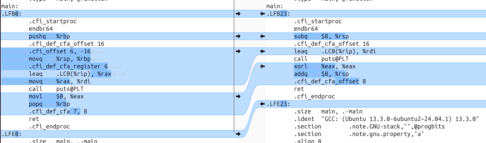

# Linux Debug Training (Part-1)
- Instructors:
  - Manas Marawaha
  - John O'Sullivan

## Section 1: Linux Debug Training (Part-1) Introduction

### 1. Introduction
- Ref: https://github.com/SpecialistLinuxTraining/linux-debug-training/tree/main/Examples

## Section 2: Linux Operating System Architecture

### 2. Linux OS Architecture
- User space
  - A protected virtual address space that hosts user application programs, system libraries and user level services
- Kernel space
  - A privileged mode reserved for kernel functionalities - reading/writing HW, interrupt handling, managing memory and other low level services
- User mode vs Kernel mode
  - The kernel is allowed to run all privileged operations such as interrupt handling, IO scheduling, process management
  - The user mode is allowed to perform a set of basic operations
    - A user application can request services from the kernel through system calls

### 3. 32-bit User space address
- Kernel space (1GB)
- User space virtual address (3GB)
  - `task_struct` is a process descriptor
  - `mm_struct` defines page tables and memory mappings
- Virtual memory areas
  - `task_struct` -> `mm` -> chain of `vm_area_struct`
  - Per application maps is located in `/proc/{PID}/maps`
  
### 4. 32-bit Kernel space address
- Kernel Logical Addressing (KLA) - also called Low Mem - is directly mapped to kernel space
- Kernel Virtual Addresses (also called High Mem)
  - Suitable for large buffer allocation
  - Not physically contiguous, and not suitable for DMA

### 5. 64-bit User space address
- Uses only 48-bit virtual address (4 Level page tables)
  - Kernel space (128TB)
  - User space (128TB)
- 64 bit user space address
  - The basic layout of memory section such as heap, stack, text, data, shared libraries are same as in 32bit system

### 6. 64-bit Kernel space address
- Kernel-space virtual memory, shared b/w all processes
- 48bit virtual address (4 level page table)
- KASAN: Kernel Address Sanitizer is a dynamic memory error detector for the Linux kernel, used to identify out-of-bounds and use-after-free bugs
- Direct mapping of all physical memory (`page_offset_base`): allows kernel code to directly access physical addresses
- vmalloc/ioremap space (`vmalloc_base`): this region is used for dynamically allocated kernel data structures and for mapping memory-mapped IO regions from device drivers
- Virtual Memory Map (`vmemmap_base`): a mapping of the physical memory's page frames into kernel virtual space. It allows the kernel to reference physical memory addressess as kernel virtual addresses
- `cpu_entry_area` mapping: holds per-CPU data structures and is mapped for each CPU
- `%esp` Fixup stacks: stacks used to handle exception during context switches and when the kernel starts execution
- Summary
  - User virtual addresses
  - Kernel logical addresses: physically contiguous and suitable for DMA
  - Kernel virtual addresses: logically contiguous (phyiscally not contiguous) and not suitable for DMA

### 7. Memory Management Unit
- An MMU facilitates the translation from virtual to physical addresses with the help of a Translation Lookaside Buffer (TLB)
- A user space process runs in a virtual address space
- The base unit of MMU is a "page" which is fixed in size and that size depends on the underlying architecture
- MMU hardware uses mapping in a page table (PT) for address translation
- In a multilevel page table, it is more efficient to have first and second level PTs in memory while other levels can reside on the disk

### 8. Page fault handling
- If a user application tries to access a virtual memory address which is not mapped to a physical address, the MMU triggers a page fault
-  The kernel on receivving the page fault interrupt performs following operations
  - Puts the user space process to sleep
  - Finds the mapping for offending address in the PT
  - Selects and removes existing TLB entry and copies the frame from disk to RAM
  - Creates a TLB entry for the page containing the address
  - Finally it wakes up the user space process

### 9. Virtual address mapping
- Each process in user virtual address space has its own mapping and this mapping is changed during a context switch
- Shared memory in user space
  - MMU maps the same physical frame into two or more processes
  - The shared memory will have different virtual addresses in each process but they will be mapped to the same physical memory location
  - `mmap()` allows us to request specific virtual address to map the shared region
- https://github.com/SpecialistLinuxTraining/linux-debug-training/tree/main/Examples/sharedmemory

### 10. Process and Threads
- A process is an instance of a running program that has its own memory space and system resource, such as file descriptors, network sockets, and environment variables
  - Each process is assigned a unique process ID (PID) and information related to a process can be accessed from `/proc/{PID}` file
  - https://github.com/SpecialistLinuxTraining/linux-debug-training/blob/main/Examples/ProcessAndThreads/ProcessObserver/get_current_example.c
- A thread is a lightweight execution unit within a process
  - Threads share the same memory space and system resources as their parent process, but they have their own registers, stack, and program counter
  - Threads can run concurrently and independently within the same process, allowing for parallel execution of code
  - Information related to threads in a process can be found in `/proc/{PID}/task`
  - https://github.com/SpecialistLinuxTraining/linux-debug-training/blob/main/Examples/ProcessAndThreads/thread.c

### 11. ELF file format
- A standard binary format, supported on various platforms including Linux
  - Application binaries, shared libraries, kernel modules, kernel and core dump files
  - ELF file contains an ELF header along with program related segments:
    - .text section: Code
    - .data section: Data
    - .rodata section: Read-only Data
    - .debug_info section: debug information
  - The kernel uses the run time information from the program header to create the process and map the segments into memory
```bash
$ gcc -g  -o hello.exe hello.c 
$ readelf -h hello.exe 
ELF Header:
  Magic:   7f 45 4c 46 02 01 01 00 00 00 00 00 00 00 00 00 
  Class:                             ELF64
  Data:                              2's complement, little endian
  Version:                           1 (current)
  OS/ABI:                            UNIX - System V
  ABI Version:                       0
  Type:                              DYN (Position-Independent Executable file)
  Machine:                           Advanced Micro Devices X86-64
  Version:                           0x1
  Entry point address:               0x1060
  Start of program headers:          64 (bytes into file)
  Start of section headers:          14656 (bytes into file)
  Flags:                             0x0
  Size of this header:               64 (bytes)
  Size of program headers:           56 (bytes)
  Number of program headers:         13
  Size of section headers:           64 (bytes)
  Number of section headers:         37
  Section header string table index: 36
$ objdump -s -j .text hello.exe 

hello.exe:     file format elf64-x86-64

Contents of section .text:
 1060 f30f1efa 31ed4989 d15e4889 e24883e4  ....1.I..^H..H..
 1070 f0505445 31c031c9 488d3dca 000000ff  .PTE1.1.H.=.....
 1080 15532f00 00f4662e 0f1f8400 00000000  .S/...f.........
 1090 488d3d79 2f000048 8d05722f 00004839  H.=y/..H..r/..H9
 10a0 f8741548 8b05362f 00004885 c07409ff  .t.H..6/..H..t..
 10b0 e00f1f80 00000000 c30f1f80 00000000  ................
 10c0 488d3d49 2f000048 8d35422f 00004829  H.=I/..H.5B/..H)
 10d0 fe4889f0 48c1ee3f 48c1f803 4801c648  .H..H..?H...H..H
 10e0 d1fe7414 488b0505 2f000048 85c07408  ..t.H.../..H..t.
 10f0 ffe0660f 1f440000 c30f1f80 00000000  ..f..D..........
 1100 f30f1efa 803d052f 00000075 2b554883  .....=./...u+UH.
 1110 3de22e00 00004889 e5740c48 8b3de62e  =.....H..t.H.=..
 1120 0000e819 ffffffe8 64ffffff c605dd2e  ........d.......
 1130 0000015d c30f1f00 c30f1f80 00000000  ...]............
 1140 f30f1efa e977ffff fff30f1e fa554889  .....w.......UH.
 1150 e5488d05 ac0e0000 4889c7e8 f0feffff  .H......H.......
 1160 b8000000 005dc3                      .....].         
$ objdump -s -j .rodata hello.exe

hello.exe:     file format elf64-x86-64

Contents of section .rodata:
 2000 01000200 68656c6c 6f20776f 726c6400  ....hello world.
hpjeon@hakuneMini:~/hw/class/udemy_linuxdbg$ objdump -s -j .data hello.exe

hello.exe:     file format elf64-x86-64

Contents of section .data:
 4000 00000000 00000000 08400000 00000000  .........@......
$ objdump -s -j .debug_info hello.exe
 
hello.exe:     file format elf64-x86-64

Contents of section .debug_info:
 0000 88000000 05000108 00000000 022f0000  ............./..
 0010 001d0000 00000800 00004911 00000000  ..........I.....
 0020 00001e00 00000000 00000000 00000108  ................
 0030 07000000 00010407 05000000 010108bd  ................
 0040 00000001 02071200 00000101 06bf0000  ................
 0050 00010205 25000000 03040569 6e740001  ....%......int..
 0060 0805cb00 00000101 06c60000 0004d400  ................
 0070 00000102 05580000 00491100 00000000  .....X...I......
 0080 001e0000 00000000 00019c00           ............    
```

### 12. Shared Libraries
- *.so file: a collection of pre-compiled code. Binds with the application at runtime
- The kernel loads the application binary into user space virtual program space as defined in ELF and parses the `.interp` section to find the dynamic linker
  - `ld-linux.so` is the dynamic linker/loader for the Linux OS
- Shared libraries are searched in the following path
  - rpath (built into the binary)
  - LD_LIBRARY_PATH
  - runpath
  - Directories listed in /etc/ld.so.conf
  - Default system libs: /lib, /usr/lib
- SRC/main.c
```c
#include <stdio.h>
#include <unistd.h>
#include <LIB/my_shared_library.h>

void main()
{
    print_hello_world(); // this is a call to the hello world function in the shared library
    while (1)            // run indefinitely so that we can examine memory
    {
        sleep(10);
    }
}
```
- LIB/my_shared_library.c
```c
#include <stdio.h>

void print_hello_world()
{
    fprintf(stderr, "Hello World From the Shared Library\n");
}

void second_shared_library_function()
{
    fprintf(stderr, "Hello World From the Shared Library's second function\n");
}
```
- LIB/my_shared_library.h
```c
void print_hello_world();
void second_shared_library_function();
```
- Demo:
```bash
$ gcc -c LIB/my_shared_library.c -fPIC
$ gcc -shared -o LIB/libmy.so ./my_shared_library.o 
$ gcc SRC/main.c -I./ -L./LIB -lmy -o my.exe
$ readelf -d my.exe  |grep NEEDED
 0x0000000000000001 (NEEDED)             Shared library: [libmy.so]
 0x0000000000000001 (NEEDED)             Shared library: [libc.so.6]
```

### 13. Scheduling in Linux
- The scheduler is a core component of the Linux Kernel responsible for allocating CPU time to processes
- The scheduler in the Linux Kernel can be called various events that require a change in the execution context
- A process can also voluntarily yield the CPU by calling a scheduling function like `sched_yield()`
- A program can set its own scheduling policy with the `sched_setscheduler()` call
- We can query and set CPU scheduling parameters with tools like `schedtool`
- We can set the CPU affinity of a process with `taskset`
- Context switching
  - CPU registers, program counter, stack pointer, and other relevant information
```bash
$ vmstat -s
     16109820 K total memory
...
     28807950 interrupts
     59044310 CPU context switches <----------
   1778193622 boot time
        30134 forks
```
- Scheduling algorithms
  - Completely Faire Scheduler (CFS): uses a red-black tree 
  - Real-time scheduling: provides strict timing guarantees
  - Deadline scheduling: provides soft real-time guarantee
  - Multi-level feedback queue (MLFQ) scheduling: divides runqueue into multiple priority queues
  - Round Robin (RR)

### 14. System Calls and Exceptions
- An interface which allows user space to request kernel services
  - read, write, lseek, ....
- System calls are vectored and identified by their numbers(_NR)
  - Ex: __NR__read, defined as 63 in unistd.h
  - strace ./a.out shows system calls used
- Exception 
  - Events that occur within the processor itself that require the attention of the OS or kernel

### 15. Interrupts
- External events that can happen anytime, like data received from a network card or a key pressed on the keyboard
- When an interrupt happens, the processor stops the current task and hands over the control to the kernel to execute the corresponding ISR
- The kernel handles interrupts by saving the current task's state, services the interrupt, and then returns to the interrupted task
- Linux provides information on interrupt through `/proc/interrupts` interface
- The interrupt handler runs in "interrupt context", which is a restricted execution context

### 16. Deferred Interrupt handling
- A technique used to handle interrupts that cannot be serviced immediately by the interrupt handler
- The mechanisms provided in the kernel to handle deferred interrupt handling include:
  - Work queues
  - Softirqs
  - Tasklets
- Kernel threads in the Linux kernel are lightweight processes that operate independently of user space processes
  - Created using `kthread_create()`
  - kworker, kosftirqd, kswapd
- Work queue is Linux Kernel execute non-time-critical tasks asynchronously via a dedicated kernel thread called a worker thread
- SoftIRQ is a mechanism in the Linux Kernel used for handling deferred interrupt processing
- Tasklets are a type of SoftIRQ handler used in the Linux Kernel for handling non-time-critical tasks

### 17. References
- Processes in Linux: https://tldp.org/LDP/tlk/kernel/processes.html
- Linux memory management: https://tldp.org/LDP/tlk/mm/memory.html
- Debugging Shared libraries
  - https://medium.com/@johnos3747/shared-libraries-in-c-programming-ab149e80be22


## Section 3: Basic Linux Analysis and Observability Tools

### 18. Basic Linux Analysis and Observability Tools Introduction

### 19. Pseudo filesystems in Linux
- Also known as a virtual file system
- Provides an interface for accessing kernel data structure and system information
  - /proc
    - A virtual interface to access process and system related information
    - Each processes is with a unique process id PID under /proc
    - /proc/cpuinfo: CPU information
    - /proc/meminfo: memory information
    - /proc/loadavg: average system load
    - /proc/version: Linux kernel version
    - /proc/filesystems: Filesystems supported by the kernel
    - /proc/cmdline: Kernel command-line arguments
    - /proc/<PID>
      - /proc/<PID>/status: process information
      - /proc/<PID>/maps: process memory mappings
  - /sys
    - A view of system's HW, devices, drivers, and kernel modules
  - /dev
    - An interface b/w user-space applications and kernel device drivers
    - Managed by a combination of the udev daemon and the devtmpfs file system
  - /tmp
  - debugfs: for kernel developers
    - Typically mounted on /sys/kernel/debug

### 20. Monitoring tools in Linux
- Process monitoring tools: ps, top, htop, pstree
- Memory monitoring: free, vmstat, pmap
- Disk IO monitoring: iostat, iotop
- Scheduler: mpstat
- Networking: netstat, tcpdump, ethtool
- https://www.brendangregg.com/linuxperf.html

- Memory representation
  - VSS (Virtual Set Size): Total virtual memory usage of a process, including shared and private memory
  - RSS (Resident Set Size): Total physical memory held in physical RAM insluding shared library
  - USS (Unique Set Size): Physical memory held in physical RAM excluding shared library
  - PSS (Proportional Set Size): Estimate of physical memory of process including proportionate shared memory
  - VSS >= RSS >= PSS >= USS

### 21. Process Monitoring tools
- ps: displays process IDs (PIDs), parane process IDs (PPIDs), CPU, memory uage, process status etc
- top: Table of Processes as a real-time monitoring
  - top -d1: refreshing every 1sec 
- pstree: displays a tree-like representation of running processes

### 22. Memory Monitoring tools
- free: provides information about system memory usage, including total, used, and free memory
  - Uses /proc/meminfo
```bash
  $ free -h
               total        used        free      shared  buff/cache   available
Mem:            15Gi       3.7Gi       6.5Gi       847Mi       6.1Gi        11Gi
Swap:          4.0Gi          0B       4.0Gi
```
- vmstat: displays virtual memory statistics
```bash
$ vmstat 1 6
procs -----------memory---------- ---swap-- -----io---- -system-- -------cpu-------
 r  b   swpd   free   buff  cache   si   so    bi    bo   in   cs us sy id wa st gu
 1  0      0 6774052 226120 6200676    0    0  2151  1685 4234   12 11  2 86  0  0  0
 1  0      0 6770808 226120 6206588    0    0     0     8 3361 10800  3  1 95  1  0  0
 1  0      0 6788496 226120 6198216    0    0     0     0 3357 10602  2  1 97  1  0  0
 1  0      0 6788096 226128 6189200    0    0     0   160 3062 10240  2  1 96  1  0  0
 1  0      0 6787060 226128 6189712    0    0     0     0 3147 10190  2  1 96  1  0  0
 0  0      0 6775420 226128 6189776    0    0     0     0 3849 12418  3  1 95  1  0  0
```
- pmap: memory mapping of a process
  - Uses /proc/<PID>/maps
```bash
$ pmap -x 44268
44268:   bash
Address           Kbytes     RSS   Dirty Mode  Mapping
0000621f004a0000     192     192       0 r---- bash
0000621f004d0000     956     956       0 r-x-- bash
0000621f005bf000     212     120       0 r---- bash
0000621f005f4000      16      16      16 r---- bash
0000621f005f8000      36      36      36 rw--- bash
0000621f00601000      44      44      44 rw---   [ anon ]
```

### 23. CPU and I/O Monitoring tools
- iostat: monitors and reports IO statistics of disk, disk controller, and filesystem performance
```bash
$ iostat
Linux 6.17.0-20-generic (hakuneMini) 	05/08/2026 	_x86_64_	(8 CPU)

avg-cpu:  %user   %nice %system %iowait  %steal   %idle
           9.46    0.42    2.22    0.41    0.00   87.49

Device             tps    kB_read/s    kB_wrtn/s    kB_dscd/s    kB_read    kB_wrtn    kB_dscd
dm-0            124.29      1468.64      1280.16         0.00    3374833    2941728          0
loop0             0.01         0.01         0.00         0.00         17          0          0
loop1             0.02         0.11         0.00         0.00        258          0          0
```
  - nice: value of priority. Low value means higher priority
- iotop: monitors real time IO statistics  
- mpstat: monitors individual CPU core usage
```bash
$ mpstat -P ALL
Linux 6.17.0-20-generic (hakuneMini) 	05/08/2026 	_x86_64_	(8 CPU)

09:19:56 AM  CPU    %usr   %nice    %sys %iowait    %irq   %soft  %steal  %guest  %gnice   %idle
09:19:56 AM  all    8.55    0.39    1.99    0.44    0.00    0.05    0.00    0.00    0.00   88.58
09:19:56 AM    0    8.85    0.32    2.01    0.48    0.00    0.06    0.00    0.00    0.00   88.28
09:19:56 AM    1    8.52    0.48    1.92    0.44    0.00    0.02    0.00    0.00    0.00   88.62
09:19:56 AM    2    8.65    0.52    1.95    0.47    0.00    0.01    0.00    0.00    0.00   88.40
09:19:56 AM    3    8.74    0.66    1.97    0.49    0.00    0.01    0.00    0.00    0.00   88.13
09:19:56 AM    4    8.01    0.21    2.08    0.19    0.00    0.13    0.00    0.00    0.00   89.38
09:19:56 AM    5    8.51    0.32    1.96    0.50    0.00    0.01    0.00    0.00    0.00   88.71
09:19:56 AM    6    8.65    0.41    2.00    0.46    0.00    0.12    0.00    0.00    0.00   88.36
09:19:56 AM    7    8.50    0.23    2.02    0.48    0.00    0.02    0.00    0.00    0.00   88.76
```

### 24. Network Monitoring tools
- netstat: displays network connections and routing tables
  - Uses /proc/net
```bash  
$ netstat -tuln 
Active Internet connections (only servers)
Proto Recv-Q Send-Q Local Address           Foreign Address         State      
tcp        0      0 127.0.0.53:53           0.0.0.0:*               LISTEN     
tcp        0      0 127.0.0.54:53           0.0.0.0:*               LISTEN     
tcp        0      0 127.0.0.1:631           0.0.0.0:*               LISTEN     
... 
$ netstat -ap
(Not all processes could be identified, non-owned process info
 will not be shown, you would have to be root to see it all.)
Active Internet connections (servers and established)
Proto Recv-Q Send-Q Local Address           Foreign Address         State       PID/Program name    
tcp        0      0 _localdnsstub:domain    0.0.0.0:*               LISTEN      -                   
tcp        0      0 _localdnsproxy:domain   0.0.0.0:*               LISTEN      -                   
tcp        0      0 localhost:ipp           0.0.0.0:*               LISTEN      -                   
tcp        0      0 hakuneMini.verizo:42116 ubuntu-mirror-2.ps:http TIME_WAIT   -                   
tcp        0      0 hakuneMini.verizo:60520 52.182.143.208:https    ESTABLISHED 44573/exe           
tcp        0      0 localhost:58362         _localdnsstub:domain    TIME_WAIT   -                   
...
$ netstat -r # routing tables
Kernel IP routing table
Destination     Gateway         Genmask         Flags   MSS Window  irtt Iface
default         Linksys40333.ve 0.0.0.0         UG        0 0          0 wlp3s0
192.168.1.0     0.0.0.0         255.255.255.0   U         0 0          0 wlp3s0
$ netstat -s
Ip:
    Forwarding: 2
    84789 total packets received
...    
Icmp:
    210 ICMP messages received
    2 input ICMP message failed
...
IcmpMsg:
        InType3: 160
        InType8: 50
        OutType0: 50
        OutType3: 146
Tcp:
    939 active connection openings
    1 passive connection openings
...
Udp:
    8131 packets received
    146 packets to unknown port received
    0 packet receive errors
...
```
- ethtool: querying and controlling network interface settings and statistics
  - Information about ethernet devices such as link status, speed, duplex mode, and driver information
```bash
$ ethtool -S wlp3s0
NIC statistics:
     rx_packets: 404445
     rx_bytes: 496170460
     rx_duplicates: 2
     rx_fragments: 396636
     rx_dropped: 4
     tx_packets: 161402
     tx_bytes: 23889605
     tx_filtered: 0
...     
```
- tcpdump: captures and analyzes network traffic
  - Filtering:
    - hostname: tcpdump host 1.2.3.4
    - port: tcpdump port 80
    - protocol: tcpdump icmp
    - source: tcpdump src 1.2.3.4
    - destination: tcpdump dst 1.2.3.4
    - protocol flag: tcpdump 'tcp[13] & 1 !=0`
    - logcial operator: tcpdump host 1.2.3.4 and port 80

### 25. References

## Section 4: Application Debugging

### 26. Introduction

### 27. Binutils
- readelf: displays information about the contents of binary files, such as object files, shared libraries, and executables
```bash
$ readelf -h SEC2/a.out  # header
ELF Header:
  Magic:   7f 45 4c 46 02 01 01 00 00 00 00 00 00 00 00 00 
  Class:                             ELF64
  Data:                              2's complement, little endian
  Version:                           1 (current)
  OS/ABI:                            UNIX - System V
...
$ readelf -S SEC2/a.out  # section
There are 31 section headers, starting at offset 0x36c0:

Section Headers:
  [Nr] Name              Type             Address           Offset
       Size              EntSize          Flags  Link  Info  Align
  [ 0]                   NULL             0000000000000000  00000000
       0000000000000000  0000000000000000           0     0     0
...
$ readelf -d SEC2/a.out 

Dynamic section at offset 0x2db0 contains 28 entries:
  Tag        Type                         Name/Value
 0x0000000000000001 (NEEDED)             Shared library: [libmy.so]
 0x0000000000000001 (NEEDED)             Shared library: [libc.so.6]
 0x000000000000000c (INIT)               0x1000
 0x000000000000000d (FINI)               0x1188
```
- objdump: content and structure of object files, executable file and shared libraries
  - Displays disassembled machine code instructions, assembly instructions addresses and opcode
  - Displays symbol table (functions, variables)
```bash
$ objdump -f  SEC2/a.out  # summary

SEC2/a.out:     file format elf64-x86-64
architecture: i386:x86-64, flags 0x00000150:
HAS_SYMS, DYNAMIC, D_PAGED
start address 0x0000000000001080
```
- objcopy
- nm: lists the symbol from object files, executables, and shared libraries and associated memroy address
```bash
$ nm SEC2/a.out |grep print
                 U print_hello_world
```
- addr2line: translates addresses into file names and line numbers in source code files
- ldd: displays the shared library dependencies of an executables or shared library
```bash
$ ldd SEC2/a.out 
	linux-vdso.so.1 (0x000078f3c00c6000)
	libmy.so => not found
	libc.so.6 => /lib/x86_64-linux-gnu/libc.so.6 (0x000078f3bfe00000)
	/lib64/ld-linux-x86-64.so.2 (0x000078f3c00c8000)
```

### 28. GDB introduction
- GDB utilizes the debug information present in the ELF file
- DWARF is the debugging file format used in Linux, which allows us to embed debug information in an ELF file
- Debugging file format
  - Debug sections are separated from the .text section in the executable, allowing a non-debug binary to run on the target system while using the same ELF for debugging tools on the host system
```bash  
$ gcc -g -o hello.exe hello.c
$ objdump -h hello.exe

hello.exe:     file format elf64-x86-64

Sections:
Idx Name          Size      VMA               LMA               File off  Algn
  0 .interp       0000001c  0000000000000318  0000000000000318  00000318  2**0
                  CONTENTS, ALLOC, LOAD, READONLY, DATA
...
 27 .debug_aranges 00000030  0000000000000000  0000000000000000  0000303d  2**0
                  CONTENTS, READONLY, DEBUGGING, OCTETS
 28 .debug_info   0000008c  0000000000000000  0000000000000000  0000306d  2**0
                  CONTENTS, READONLY, DEBUGGING, OCTETS
 29 .debug_abbrev 00000043  0000000000000000  0000000000000000  000030f9  2**0
                  CONTENTS, READONLY, DEBUGGING, OCTETS
 30 .debug_line   00000052  0000000000000000  0000000000000000  0000313c  2**0
                  CONTENTS, READONLY, DEBUGGING, OCTETS
 31 .debug_str    000000d9  0000000000000000  0000000000000000  0000318e  2**0
                  CONTENTS, READONLY, DEBUGGING, OCTETS
 32 .debug_line_str 0000002d  0000000000000000  0000000000000000  00003267  2**0
                  CONTENTS, READONLY, DEBUGGING, OCTETS
```
- How to check if debug symbols are present:
```bash
$ readelf --debug-dump=decodedline ./hello.exe 
Contents of the .debug_line section:

hello.c:
File name                        Line number    Starting address    View    Stmt
hello.c                                    2              0x1149               x
hello.c                                    3              0x1151               x
hello.c                                    4              0x1160               x
hello.c                                    5              0x1165               x
hello.c                                    -              0x1167
```
- Looking at debug sect4ions: `readelf -w ./a.out`
- Compilation options for adding debugging symbols
  - g0: provides no debug information
  - g1: produces minimal infoirmation, enough for producing back traces but no information on variables or line numbers
  - g2: default debug level (same as -g). Produces symbols and line numbers required for debugging
  - g3: provides extra debug information including macro definitions
  - ggdb3: like g3 but generates debug information that has been tailored specifically for the GDB debugger
- Disabling optimization to trace accurately
  - -O0: no optimization
  - -Og: only GDB compatible optimization flag
  - -g : debug flag
  - We can annotate a specific function with the compiler attribute `__attribute__((optimize("O0)))`
  - *volatile* keyword
- -O0 vs -O3
```bash
$ gcc -S -O3 hello.c
$ mv hello.s  hello_O3.s
$ gcc -S -O0 hello.c
$ mv hello.s  hello_O0.s
$ meld hello_O0.s hello_O3.s
```


### 29. GDB command line options
- sysroot: the directory containing supporting files such as header files, static libraries, shared libraries etc
  - `set sysroot ~/hpjeon/src`
- Attaching gdb to running processes: `gdp -p <pid>`
- gdb command
  - run
  - bt
    - list # list lines of source code at bt
  - quit
  - b <line_number>
  - b <function_name>
  - Temporary breakpoint: tbreak <line_no>
  - Hardware breakpoint: for flash based execution, hbreak <line_no>
  - info breakpoints
    - delete <brk_no>
  - watch <symbol_>
  - watch -l <address_>
    - info watchpoints
    - disable <watch_no>
    - delete <watch_no>
  - step
  - continue
  - file <file_name>
    - set args <args_1> <args_2> ...
    - Then run

### 30. GDB commands cheat-sheet
- https://www.brendangregg.com/blog/2016-08-09/gdb-example-ncurses.html

### 31. Remote debugging with GDB
- For embedded or remote servers
- GDB server uses ptrace
- Demo
  - Target
    - gdbserver localhost:[PORT] [exe] [args] (networking)
    - gdbserver /dev/ttyS0 [exe] [args] (Serial)
  - Host
    - gdb-multiarch -tui [exe]
    - gdb> target extended-remote [IP]:[PORT] (networking)
    - gdb> target remote /dev/ttyUSB0 (Serial)
    - gdb> set sysroot [SYSROOT_PATH]

### 32. Extending GDB with Python
- Running python inside of gdb
```
(gdb) python
>import os
>print("hello world")
>
>quit
hello world
(gdb) python import gdb
(gdb) python gdb.execute('start')
(gdb) python gdb.execute('info locals')
first_local_variable = -9776
second_local_variable = 32767
```
- Ref: https://sourceware.org/gdb/current/onlinedocs/gdb.html/Python-API.html

### 33. Debugging shared libraries
- For the purpose of debugging, the library has an explicit segfault condition
- Demo:
```bash
$ LD_TRACE_LOADED_OBJECT=1 LD_LIBRARY_PATH=. ./main
Starting program...
Segmentation fault (core dumped)
$ gdb main
GNU gdb (Ubuntu 15.0.50.20240403-0ubuntu1) 15.0.50.20240403-git
...
(No debugging symbols found in main)                                            
(gdb) set env LD_LIBRARY_PATH=.
(gdb) b main
Breakpoint 1 at 0x1171
(gdb) r
Starting program: 
...
Breakpoint 1, 0x0000555555555171 in main ()
(gdb) info shared  
From                To                  Syms Read   Shared Object Library
0x00007ffff7fc6000  0x00007ffff7ff0195  Yes         /lib64/ld-linux-x86-64.so.2
0x00007ffff7fb7040  0x00007ffff7fb7113  Yes (*)     ./libmylib.so  # <----- this is the target
0x00007ffff7c28800  0x00007ffff7dafd39  Yes         /lib/x86_64-linux-gnu/libc.so.6
(*): Shared library is missing debugging information.
(gdb) add-symbol-file ./symbols/libmylib.so.debug 0x00007ffff7fb7040
add symbol table from file "./symbols/libmylib.so.debug" at
	.text_addr = 0x7ffff7fb7040
(y or n) y
Reading symbols from ./symbols/libmylib.so.debug...
(gdb) c
Continuing.
Starting program...

Program received signal SIGSEGV, Segmentation fault.
0x00007ffff7fb710d in causeSegfault () at mylib.c:7
7	  *ptr = 'A'; // This will cause a segfault
(gdb) bt
#0  0x00007ffff7fb710d in causeSegfault () at mylib.c:7
#1  0x000055555555518a in main ()
(gdb) list
2	
3	#include <stdio.h>
4	
5	void causeSegfault() {
6	  char *ptr = NULL;
7	  *ptr = 'A'; // This will cause a segfault
```
- LD_PRELOAD: you can specify shared libraries that should be loaded before all other libraries
  - Can be used to inject debugging code into a program to trace its behavior

### 34. Libsegfault library
- At Ubuntu 24
  - sudo apt install glibc-tools
  - /lib/x86_64-linux-gnu/libSegFault.so
- Automatically dumps the backtrace and memory map when a program crashes with SEGFAULT
- The library is activated via preload
- SEGFAULT_SIGNALS=all LD_PRELOAD=/lib/x86_64-linux-gnu/libSegFault.so ./a.exe
- Backtrace analysis
  - `nm` can get the absolute address of the corresponding function
  - Adding 0xXXXX + 0x18 (offset in backtrace) gives us an absolute address of crash location in the binary
  - Using addr2line, we can point the line of the code
- Demo:  
  ```bash
  $ SEGFAULT_SIGNALS=all LD_PRELOAD=/lib/x86_64-linux-gnu/libSegFault.so  ./segfault 
  *** signal 11
  Register dump:

  RAX: 0000000000000000   RBX: 00007ffedd4d6c98   RCX: 000062ed7e7c1dc0
  RDX: 00007ffedd4d6ca8   RSI: 00007ffedd4d6c98   RDI: 0000000000000001
  RBP: 00007ffedd4d6b60   R8 : 0000000000000000   R9 : 000075375f0fe380
  R10: 0000000000000008   R11: 0000000000000246   R12: 0000000000000001
  R13: 0000000000000000   R14: 000062ed7e7c1dc0   R15: 000075375f131000
  RSP: 00007ffedd4d6b50

  RIP: 000062ed7e7bf161   EFLAGS: 00010206

  CS: 0033   FS: 0000   GS: 0000

  Trap: 0000000e   Error: 00000004   OldMask: 00000000   CR2: 00000000

  FPUCW: 0000037f   FPUSW: 00000000   TAG: 00000000
  RIP: 00000000   RDP: 00000000

  ST(0) 0000 0000000000000000   ST(1) 0000 0000000000000000
  ST(2) 0000 0000000000000000   ST(3) 0000 0000000000000000
  ST(4) 0000 0000000000000000   ST(5) 0000 0000000000000000
  ST(6) 0000 0000000000000000   ST(7) 0000 0000000000000000
  mxcsr: 1f80
  XMM0:  00000000000000000000000000000000 XMM1:  00000000000000000000000000000000
  XMM2:  00000000000000000000000000000000 XMM3:  00000000000000000000000000000000
  XMM4:  00000000000000000000000000000000 XMM5:  00000000000000000000000000000000
  XMM6:  00000000000000000000000000000000 XMM7:  00000000000000000000000000000000
  XMM8:  00000000000000000000000000000000 XMM9:  00000000000000000000000000000000
  XMM10: 00000000000000000000000000000000 XMM11: 00000000000000000000000000000000
  XMM12: 00000000000000000000000000000000 XMM13: 00000000000000000000000000000000
  XMM14: 00000000000000000000000000000000 XMM15: 00000000000000000000000000000000

  Backtrace:
  ./segfault(causeSegmentationFault+0x18)[0x62ed7e7bf161] <------------ ROI, now find causeSegmentationFault using nm
  ./segfault(main+0x12)[0x62ed7e7bf194]
  /lib/x86_64-linux-gnu/libc.so.6(+0x2a1ca)[0x75375ee2a1ca]
  /lib/x86_64-linux-gnu/libc.so.6(__libc_start_main+0x8b)[0x75375ee2a28b]
  ./segfault(_start+0x25)[0x62ed7e7bf085]
  ...
  $ nm segfault|grep causeSegmentationFault
  0000000000001149 T causeSegmentationFault
  ```
  - Hexa decimal in Python:
  ```py
  >>> 0x0000000000001149+0x18
  4449
  >>> hex(4449)
  '0x1161'
  ```
  - Now find the line in the source code
  ```bash
  $ addr2line -e ./segfault 0x1161
  /home/hpjeon/hw/class/udemy_linuxdbg/git/linux-debug-training/Examples/segfault/segfault.c:7
  ```
  - The location of SEGFAULT is the line 7

### 35. Core dumps and analysis with GDB
- By default, most of Linux system ban the core dumps
  - `ulimit -c unlimited` is required to yield core files
  - `echo "core.%e.%p" | sudo tee /proc/sys/kernel/core_pattern`
    - Produces core files in the current folder. Default location is /var/lib/apport/coredump/
- Demo
```bash
$ ulimit -c unlimited
$ echo "core.%e.%p" | sudo tee /proc/sys/kernel/core_pattern
./segfault 
$ gdb ./segfault -c ./core.segfault.23901
GNU gdb (Ubuntu 15.0.50.20240403-0ubuntu1) 15.0.50.20240403-git
...
Using host libthread_db library "/lib/x86_64-linux-gnu/libthread_db.so.1".
Core was generated by `./segfault'.
Program terminated with signal SIGSEGV, Segmentation fault.
#0  0x00005aaf31e14161 in causeSegmentationFault ()
    at /home/hpjeon/hw/class/udemy_linuxdbg/git/linux-debug-training/Examples/segfault/segfault.c:7
7	  int value = *ptr;
(gdb) bt
#0  0x00005aaf31e14161 in causeSegmentationFault ()
    at /home/hpjeon/hw/class/udemy_linuxdbg/git/linux-debug-training/Examples/segfault/segfault.c:7
#1  0x00005aaf31e14194 in main ()
    at /home/hpjeon/hw/class/udemy_linuxdbg/git/linux-debug-training/Examples/segfault/segfault.c:15
(gdb) list
2	
3	void causeSegmentationFault() {
4	  int *ptr = NULL; // Initializing a pointer to NULL
5	
6	  // Try to access the value pointed to by NULL (dereferencing NULL)
7	  int value = *ptr;
8	
9	  printf(
10	      "The value is: %d\n",
11	      value); // This line will never be reached due to the segmentation fault
```

### 36. References
- Debugging shared library
  - https://medium.com/@johnos3747/shared-libraries-in-c-programming-ab149e80be22
  - https://amir.rachum.com/shared-libraries/
- Enable coredump on Ubuntu OS
  - https://www.baeldung.com/linux/core-dumps-path-set

## Section 5: Memory Issues in Linux Applications

### 37. Memory Management and common memory issues
- Impact of memory issues
  - Performance degradation
  - System instability and crashes
  - Security vulnerabilities
- Segmentation faults (SEGFAULTS)
  - When a program tries to access a non-existing virtual memory segment or existing virtual memory segment in a different way as defined by its attribute
    - Execute data in non-executable segment
    - Write data in read-only segment
- Memory leaks
  - When a program fails to release memory that is no longer needed
- Buffer overflow
  - A program writes more data to a buffer than it can hold
  - Stack-based overflow
  - Heap-based overflow

### 38. Memory debugging tools - Static Code Analysis and Valgrind
- clang analyzer (static analyzer)
- valgrind: instrumentation framework
  - memcheck: memory error detector
    - Memory leak
    - Uninitialized memory use
    - Invalid memory access
    - Bad frees of heap blocks
    - Overlapping source and destination pointers in memcpy and related functions
    - `valgrind --tool=memcheck --leak-check=full ./a.exe`
  - cachegrind: cache profiler
  - callgrind: call graph profiler
  - helgrind: thread error detector
  - massif: heap profiler
  - Execution speed signficantly slows down
- Valgrind with gdb
  - Valgrind uses a synthetic CPU, not the host CPU, making direct debugging impossible. GDB interacts with valgrind's gdbserver for full debugging within valgrind
  - valgrind --vgdb=yes --vgdb-error=0 ./a.exe
- Demo:
```bash
#############
############# First, run following at terminal-1
#############
$ valgrind --tool=memcheck --leak-check=full --vgdb=yes --vgdb-error=0 ./mem_leak 
==10037== Memcheck, a memory error detector
==10037== Copyright (C) 2002-2022, and GNU GPL'd, by Julian Seward et al.
...
==10037==   /path/to/gdb ./mem_leak
==10037== and then give GDB the following command
==10037==   target remote | /usr/bin/vgdb --pid=10037
==10037== --pid is optional if only one valgrind process is running
==10037== 
#############
############# Waiting here. Now open terminal-2 and run:
#############
$ gdb ./mem_leak 
GNU gdb (Ubuntu 15.0.50.20240403-0ubuntu1) 15.0.50.20240403-git
...
Reading symbols from ./mem_leak...
(gdb) target remote | vgdb
Remote debugging using | vgdb
relaying data between gdb and process 10037
warning: remote target does not support file transfer, attempting to access files from local filesystem.
Reading symbols from /lib64/ld-linux-x86-64.so.2...
Reading symbols from /usr/lib/debug/.build-id/da/07864eb4c1b06504b8688d25d7e84759fe708d.debug...
0x000000000401f540 in _start () from /lib64/ld-linux-x86-64.so.2
(gdb) b main
Breakpoint 1 at 0x109175: file /home/hpjeon/hw/class/udemy_linuxdbg/git/linux-debug-training/Examples/memory_leak/main.c, line 5.
(gdb) c
Continuing.
...
Breakpoint 1, main ()
    at /home/hpjeon/hw/class/udemy_linuxdbg/git/linux-debug-training/Examples/memory_leak/main.c:5
5	  int *ptr = (int *)malloc(5 * sizeof(int));
(gdb) n
7	  printf("Dynamic array allocated with 5 elements\n");
(gdb) 
9	  return 0;
(gdb) c
Continuing.
[Inferior 1 (Remote target) exited normally]
#############
############# Go to terminal-1 and find:
#############
Dynamic array allocated with 5 elements
==10037== 
==10037== HEAP SUMMARY:
==10037==     in use at exit: 20 bytes in 1 blocks
==10037==   total heap usage: 2 allocs, 1 frees, 1,044 bytes allocated
==10037== 
==10037== 20 bytes in 1 blocks are definitely lost in loss record 1 of 1
==10037==    at 0x4846828: malloc (in /usr/libexec/valgrind/vgpreload_memcheck-amd64-linux.so)
==10037==    by 0x10917E: main (main.c:5) <----------------- Found the cause
==10037== 
==10037== LEAK SUMMARY:
==10037==    definitely lost: 20 bytes in 1 blocks
==10037==    indirectly lost: 0 bytes in 0 blocks
==10037==      possibly lost: 0 bytes in 0 blocks
==10037==    still reachable: 0 bytes in 0 blocks
==10037==         suppressed: 0 bytes in 0 blocks
==10037== 
==10037== For lists of detected and suppressed errors, rerun with: -s
==10037== ERROR SUMMARY: 1 errors from 1 contexts (suppressed: 0 from 0)
```

### 39. Sanitizer - Address Sanitizer (ASan)
- Can detect issues like memory errors, undefined behaviors, race conditions, and similar bugs
- Each sanitizer relies on compiler instrumentation and shadow memory or similar techniques to find isseus related to memory, threading, and undefined behavior in code
- For both user-space and kernel code
- ASan (Address Sanitizer): while compiling, checks into the code to detect memory errors
  - gcc -fsanitize=address -fno-omit-frame-pointer -g -O1 -o memleak main.c
  - ASan will print an error message ** during runtime ** and a stack trace, indicating where the issue occurred
- Check if libasan support your gcc compiler:
  - apt-cache show libasan8
  - gcc --version
  - Now install using sudo apt install libasan8
- Demo:
```bash
$ gcc -O1 -g -fsanitize=address -fno-omit-frame-pointer main.c -o a.exe
$ ldd ./a.exe 
	linux-vdso.so.1 (0x00007d665aca4000)
	libasan.so.8 => /lib/x86_64-linux-gnu/libasan.so.8 (0x00007d665a400000) #<---------- make sure libasan is linked
	libc.so.6 => /lib/x86_64-linux-gnu/libc.so.6 (0x00007d665a000000)
	libm.so.6 => /lib/x86_64-linux-gnu/libm.so.6 (0x00007d665ab96000)
	libgcc_s.so.1 => /lib/x86_64-linux-gnu/libgcc_s.so.1 (0x00007d665ab68000)
	/lib64/ld-linux-x86-64.so.2 (0x00007d665aca6000)
$ ./a.exe 
=================================================================
==11467==ERROR: AddressSanitizer: stack-buffer-overflow on address 0x7e533fa00034 at pc 0x64cf592eb4a9 bp 0x7ffee5909320 sp 0x7ffee5909310
WRITE of size 4 at 0x7e533fa00034 thread T0
    #0 0x64cf592eb4a8 in out_of_bounds_access /home/hpjeon/hw/class/udemy_linuxdbg/git/linux-debug-training/Examples/Sanitizers/Asan/main.c:16
...
Address 0x7e533fa00034 is located in stack of thread T0 at offset 52 in frame
    #0 0x64cf592eb2b8 in out_of_bounds_access /home/hpjeon/hw/class/udemy_linuxdbg/git/linux-debug-training/Examples/Sanitizers/Asan/main.c:8 #<--------- out of bounds found
...
Shadow bytes around the buggy address:
  0x7e533f9ffd80: 00 00 00 00 00 00 00 00 00 00 00 00 00 00 00 00
  0x7e533f9ffe00: 00 00 00 00 00 00 00 00 00 00 00 00 00 00 00 00
  0x7e533f9ffe80: 00 00 00 00 00 00 00 00 00 00 00 00 00 00 00 00
  0x7e533f9fff00: 00 00 00 00 00 00 00 00 00 00 00 00 00 00 00 00
  0x7e533f9fff80: 00 00 00 00 00 00 00 00 00 00 00 00 00 00 00 00
=>0x7e533fa00000: f1 f1 f1 f1 00 00[04]f3 f3 f3 f3 f3 00 00 00 00    #<--------  00 means addressable memory, f1 is stack left redzone. see below
  0x7e533fa00080: 00 00 00 00 00 00 00 00 00 00 00 00 00 00 00 00
  0x7e533fa00100: 00 00 00 00 00 00 00 00 00 00 00 00 00 00 00 00
...
Shadow byte legend (one shadow byte represents 8 application bytes):
  Addressable:           00
  Partially addressable: 01 02 03 04 05 06 07 
  Heap left redzone:       fa
  Freed heap region:       fd
  Stack left redzone:      f1
  Stack mid redzone:       f2
  Stack right redzone:     f3
  Stack after return:      f5
  Stack use after scope:   f8
  Global redzone:          f9
  Global init order:       f6
  Poisoned by user:        f7
  Container overflow:      fc
  Array cookie:            ac
  Intra object redzone:    bb
  ASan internal:           fe
  Left alloca redzone:     ca
  Right alloca redzone:    cb
```

### 40. Sanitizer - Memory Sanitizer, Thread Sanitizer and Undefined Behavior Sanitizer
- MSan (Memory Sanitizer): a runtime uninitialized memory reads detector
  - Uninitialized value was used in a conditional branch
  - Uninitialized pointer was used for memory accesses
  - Uninitialized value was passed or returned from a function call
  - Uninitialized data was passed into some libc calls
  - Only available in Clang compiler: clang -fsanitize=memory -fsanitize-memory-track-origins -fPIE -pie -fno-omit-frame-pointer -g -O2 myProgram.c
- TSan (Thread Sanitizer): detects data races in C/C++ using pthread library
  - A data race occurs when two threads access the same variable concurrently and at least one of the access is write
  - Use -fsanitiz=thread: gcc -fsanitize=thread -fno-omit-frame-pointer -g -O1 -o memleak main.c
- Demo:
```bash
$ sudo apt install libtsan2
$ gcc -fsanitize=thread -fno-omit-frame-pointer -g -O1 main.c -o a.exe
$ ldd ./a.exe 
	linux-vdso.so.1 (0x00007a04ac2da000)
	libtsan.so.2 => /lib/x86_64-linux-gnu/libtsan.so.2 (0x00007a04ab200000)   # <---- libstan is linked
	libc.so.6 => /lib/x86_64-linux-gnu/libc.so.6 (0x00007a04aae00000)
	libm.so.6 => /lib/x86_64-linux-gnu/libm.so.6 (0x00007a04ab117000)
	libgcc_s.so.1 => /lib/x86_64-linux-gnu/libgcc_s.so.1 (0x00007a04ab0e9000)
	/lib64/ld-linux-x86-64.so.2 (0x00007a04ac2dc000)
$ ./a.exe 
FATAL: ThreadSanitizer: unexpected memory mapping 0x5f509825f000-0x5f5098260000
$ echo 0 | sudo tee /proc/sys/kernel/randomize_va_space  # <---- disabling ASLR (Address Space Layout Randomization)
0
$ ./a.exe 
==================
WARNING: ThreadSanitizer: data race (pid=12338)
  Write of size 4 at 0x555555558014 by thread T1:
    #0 increment_resource /home/hpjeon/hw/class/udemy_linuxdbg/git/linux-debug-training/Examples/Sanitizers/Tsan/main.c:7 (a.exe+0x12ae) (BuildId: a73ec4502acc288dfc832310b833f243af76b1eb)

  Previous read of size 4 at 0x555555558014 by thread T2:
    #0 increment_resource /home/hpjeon/hw/class/udemy_linuxdbg/git/linux-debug-training/Examples/Sanitizers/Tsan/main.c:7 (a.exe+0x128a) (BuildId: a73ec4502acc288dfc832310b833f243af76b1eb)

  Location is global 'shared_resource' of size 4 at 0x555555558014 (a.exe+0x4014)

  Thread T1 (tid=12340, running) created by main thread at:
    #0 pthread_create ../../../../src/libsanitizer/tsan/tsan_interceptors_posix.cpp:1022 (libtsan.so.2+0x5ac1a) (BuildId: 2a13a7710e361d06f7babbea53065ca2be93f738)
    #1 main /home/hpjeon/hw/class/udemy_linuxdbg/git/linux-debug-training/Examples/Sanitizers/Tsan/main.c:15 (a.exe+0x130d) (BuildId: a73ec4502acc288dfc832310b833f243af76b1eb)

  Thread T2 (tid=12341, finished) created by main thread at:
    #0 pthread_create ../../../../src/libsanitizer/tsan/tsan_interceptors_posix.cpp:1022 (libtsan.so.2+0x5ac1a) (BuildId: 2a13a7710e361d06f7babbea53065ca2be93f738)
    #1 main /home/hpjeon/hw/class/udemy_linuxdbg/git/linux-debug-training/Examples/Sanitizers/Tsan/main.c:16 (a.exe+0x1326) (BuildId: a73ec4502acc288dfc832310b833f243af76b1eb)

SUMMARY: ThreadSanitizer: data race /home/hpjeon/hw/class/udemy_linuxdbg/git/linux-debug-training/Examples/Sanitizers/Tsan/main.c:7 in increment_resource
==================
Final value: 1000000
ThreadSanitizer: reported 1 warnings
```
- UBSan (Undefined Behavior Sanitizer): a runtime error detection tool that identifies undefined behavior
  - Signed integer overflow
  - Invalid shift operations for example, shifting by a negative or too large number
  - Dereferencing misaligned or null pointers
  - Type mismatch or invalid casts b/w different types
  - Using -fsanitize=undefined
- Demo:
```bash
$ sudo apt install libubsan1
$ gcc -fsanitize=undefined -fno-omit-frame-pointer -g -O1 main.c -o a.exe
$ ldd ./a.exe 
	linux-vdso.so.1 (0x00007ffff7fc3000)
	libubsan.so.1 => /lib/x86_64-linux-gnu/libubsan.so.1 (0x00007ffff7800000)  #<---- make sure that libubsan is linked
	libc.so.6 => /lib/x86_64-linux-gnu/libc.so.6 (0x00007ffff7400000)
	libstdc++.so.6 => /lib/x86_64-linux-gnu/libstdc++.so.6 (0x00007ffff7000000)
	libgcc_s.so.1 => /lib/x86_64-linux-gnu/libgcc_s.so.1 (0x00007ffff7f70000)
	/lib64/ld-linux-x86-64.so.2 (0x00007ffff7fc5000)
	libm.so.6 => /lib/x86_64-linux-gnu/libm.so.6 (0x00007ffff7e87000)
$ ./a.exe 
main.c:9:30: runtime error: division by zero
Floating point exception (core dumped)
```

### 41. Libefence
- A lightweight library that helps to catch buffer overflow and user-after-free memory errors
  - It allocates extra memory pages around dynamic memory blocks, marking them **as unreadable**. It triggers a segmentation fault if the program accesses memory beyond its allocated bounds
  - It can be linked statically or preloaded using `LD_PRELOAD`
- Demo:
```bash
$ sudo apt install electric-fence
# For core dump
$ sudo systemctl stop apport.service
$ ulimit -c unlimited
$ gcc -fno-omit-frame-pointer -g -O1 main.c -o a.exe
$ LD_PRELOAD=/usr/lib/libefence.so.0.0 ./a.exe 

  Electric Fence 2.2 Copyright (C) 1987-1999 Bruce Perens <bruce@perens.com>
System page size: 4096 bytes
Allocated memory at 0x7ffff7e9c000
Attempting in-page overflow...
Attempting overflow in guard page...
Segmentation fault (core dumped)
$ gdb ./a.exe -c core
GNU gdb (Ubuntu 15.0.50.20240403-0ubuntu1) 15.0.50.20240403-git
Copyright (C) 2024 Free Software Foundation, Inc.
...
Downloading separate debug info for /usr/lib/libefence.so.0.0
--Type <RET> for more, q to quit, c to continue without paging--
Downloading separate debug info for system-supplied DSO at 0x7ffff7fc3000       
[Thread debugging using libthread_db enabled]                                   
Using host libthread_db library "/lib/x86_64-linux-gnu/libthread_db.so.1".
Core was generated by `./a.exe'.
Program terminated with signal SIGSEGV, Segmentation fault.
#0  out_of_bounds_access () at main.c:44
44	    array[page_size] = 'Z'; // Overflowed into guard page
```

### 42. Best practices for Memory Management
- Allocate memory dynamically when needed
  - Use stack memory for small, short-lived variables
- Deallocate memory properly
- Avoid manual memory management: smart pointer or higher abstraction
- Check for null pointers: before dereferencing a pointer, ensure it is NOT null to avoid crashes
- Bounds checking: for arrays, use library functions or language features to check bounds like std::vector in C++, strncpy, snprintf for C
- Avoid memory leaks: regularly inspect and analyze the code using valgrind or AddressSanitizer
- Understand ownership: define the ownership of objects and memory clearly
- Defensive programming: validate input paramters, check return values from memory allocation functions, and handle errors gracefully
- Code reviews
- Move to memory-safe programming: Rust over C/C++

## Section 6: Linux Debug Training (Part-1) Closure

### 43. Closing remarks


