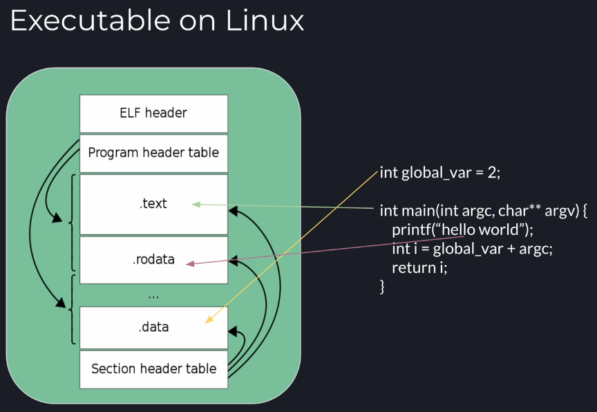
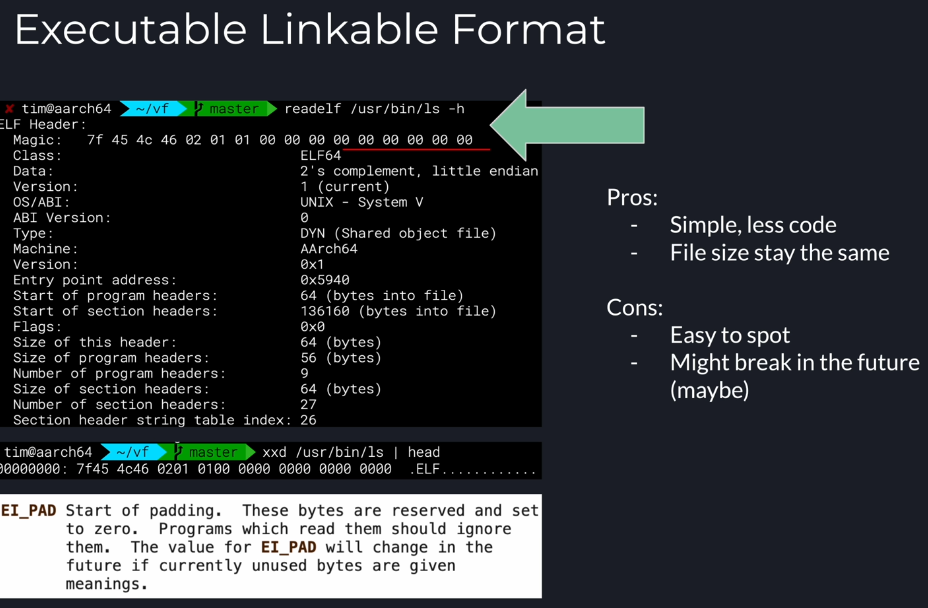
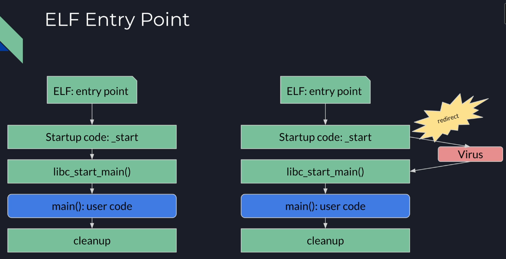
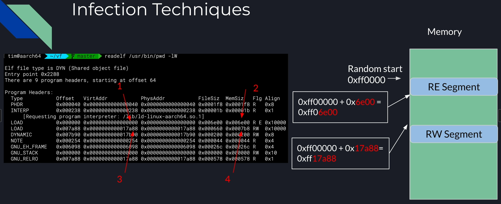
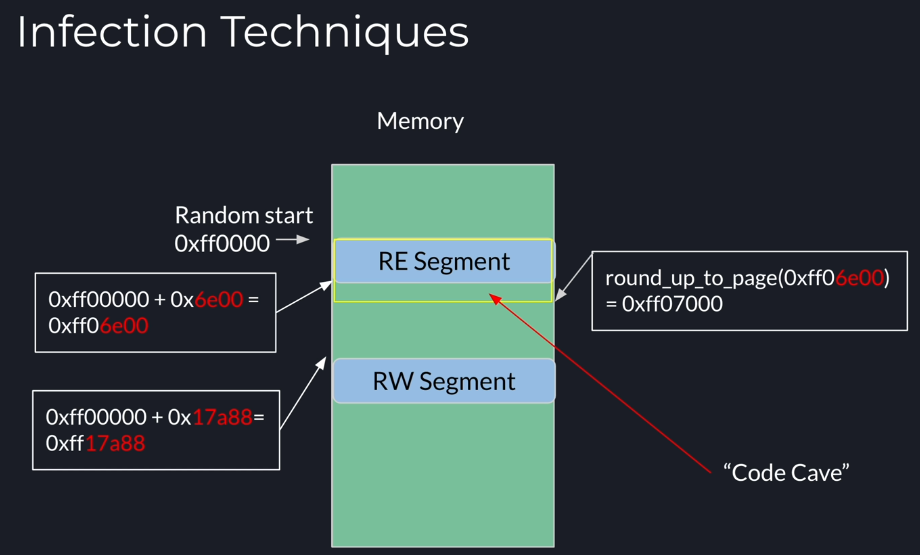
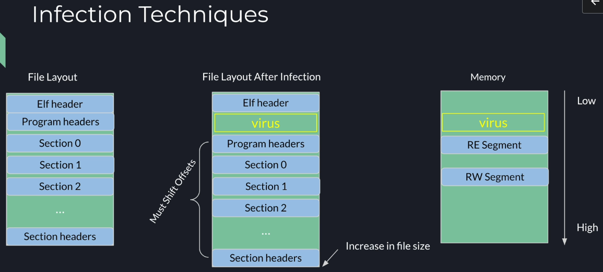
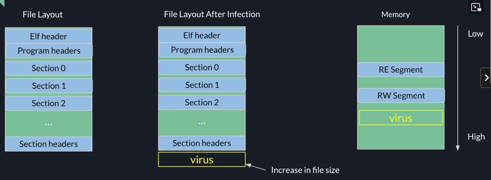
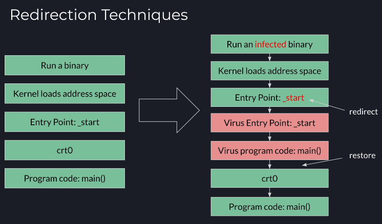

## Demystifying Linux Virus Engineering
- Instructor: Timothy Chen

## Section 1: Introduction

### 1. Introduction

### 2. Why Linux needs attention
- Ramen worm
  - Targeted on RHEL 6.7, 7.0

### 3. Demo: self-propagating code that prints "Hello World"
- Plan
  - Compile a self-propagating code that prints hello world
  - Infect a patient0 with our virus
  - Run the patient0 which infects other executables nearby
  - Send it to VirusTotal for analysis
  - Inject virus to pwd
    - Then propagate to other exes
- https://github.com/yundddd/vf

### 4. Introducing the Containerized Dev Environment
- https://www.freecodecamp.org/news/how-docker-containers-work/
- https://learn.microsoft.com/en-us/virtualization/windowscontainers/about/containers-vs-vm
- Open source virus framework
  - Cross platform (arm/x86)
  - Reproducible
  - Hermetic
  - https://github.com/yundddd/vf

### 5. Dev Environment Setup: Mac

### 6. Dev Environment Setup: Windows

### 7. Dev Environment Setup: Linux
- In the VM
  - Install git, docker desktop
- https://github.com/yundddd/vf/README.md
```bash
cd vf
./build_dev_images.sh && ./run_dev_containers.sh
```

## Section 2: Linux Executable Format and How People Abuse it

### 8. Summary: Why do we need to study the executable format?

### 9. A quick peek into executable files
- ELF(Executable Linkable Format)
  - ELF header
  - Program header table
  - .text
  - .rodata
  - ...
  - .data
  - Section header table
- Do not store any password/credential in the file as they can be decoded
```bash
$ objdump /usr/bin/ls -d -j .text |head -n 40
$ objdump /usr/bin/ls -d -j .rodata |head -n 40
$ objdump /usr/bin/ls -d -j .data |head -n 40
```


### 10. Executable Link Format - Magic number and entry point
```bash
$ readelf /usr/bin/ls -h # in human-readable form
ELF Header:
  Magic:   7f 45 4c 46 02 01 01 00 00 00 00 00 00 00 00 00 
  Class:                             ELF64
  Data:                              2's complement, little endian
  Version:                           1 (current)
  OS/ABI:                            UNIX - System V
  ABI Version:                       0
  Type:                              DYN (Position-Independent Executable file)
  Machine:                           Advanced Micro Devices X86-64
  Version:                           0x1
  Entry point address:               0x6aa0  # This is the point where OS starts the program
  Start of program headers:          64 (bytes into file) # meta data for OS to understand how to run this exe
  Start of section headers:          136232 (bytes into file)
  Flags:                             0x0
  Size of this header:               64 (bytes)
  Size of program headers:           56 (bytes)
  Number of program headers:         13
  Size of section headers:           64 (bytes)
  Number of section headers:         31
  Section header string table index: 30
```


### 11. Lab: Explore ELF Header Stamping
- Let's edit magic header
```
$ xxd /usr/bin/ls |head
00000000: 7f45 4c46 0201 0100 0000 0000 0000 0000  .ELF............
00000010: 0300 3e00 0100 0000 a06a 0000 0000 0000  ..>......j......
00000020: 4000 0000 0000 0000 2814 0200 0000 0000  @.......(.......
00000030: 0000 0000 4000 3800 0d00 4000 1f00 1e00  ....@.8...@.....
00000040: 0600 0000 0400 0000 4000 0000 0000 0000  ........@.......
00000050: 4000 0000 0000 0000 4000 0000 0000 0000  @.......@.......
00000060: d802 0000 0000 0000 d802 0000 0000 0000  ................
00000070: 0800 0000 0000 0000 0300 0000 0400 0000  ................
00000080: 1803 0000 0000 0000 1803 0000 0000 0000  ................
00000090: 1803 0000 0000 0000 1c00 0000 0000 0000  ................
```
- Copy ls into a local copy and edit using vi/vim
  - In the colon mode, `%!xxd`
  - Modify as:
```
00000000: 7f45 4c46 0201 0100 0000 3132 3300 0000  .ELF............
00000010: 0300 3e00 0100 0000 c2a0 6a00 0000 0000  ..>.......j.....
```  
- In the colon mode, `%!xxd -r` then `wq` to save
```bash
$ readelf ./ls_copy -h
ELF Header:
  Magic:   7f 45 4c 46 02 01 01 00 00 00 31 32 33 00 00 00  # Note that magic header has changed
  Class:                             ELF64
...
$ ./ls_copy # still runs
$ man elf
...
             EI_PAD Start of padding.  These bytes are reserved and set to zero.  Programs which read
                     them  should ignore them.  The value for EI_PAD will change in the future if cur‐
                     rently unused bytes are given meanings.
```
- Editing EI_PAD doesn't affect the exe but changing other header will cause the exe not running
- At https://github.com/torvalds/linux/blob/master/fs/binfmt_elf.c
```c
	/* First of all, some simple consistency checks */
	if (memcmp(elf_ex->e_ident, ELFMAG, SELFMAG) != 0)
		goto out; // here checks the header

	if (elf_ex->e_type != ET_EXEC && elf_ex->e_type != ET_DYN)
		goto out;
	if (!elf_check_arch(elf_ex))
		goto out;
	if (elf_check_fdpic(elf_ex))
		goto out;
	if (!bprm->file->f_op->mmap)
		goto out;
```

### 12. Executable Linkable Format - Program Headers
```bash
$ readelf ./ls_copy -lW |head -100
...
Program Headers:
  Type           Offset   VirtAddr           PhysAddr           FileSiz  MemSiz   Flg Align
  PHDR           0x000040 0x0000000000000040 0x0000000000000040 0x0002d8 0x0002d8 R   0x8  # location of program stored
  INTERP         0x000318 0x0000000000000318 0x0000000000000318 0x00001c 0x00001c R   0x1  # shows what lib is linked
      [Requesting program interpreter: /lib64/ld-linux-x86-64.so.2]
  LOAD           0x000000 0x0000000000000000 0x0000000000000000 0x003458 0x003458 R   0x1000  # Read only
  LOAD           0x004000 0x0000000000004000 0x0000000000004000 0x013091 0x013091 R E 0x1000  # Read Executable
  LOAD           0x018000 0x0000000000018000 0x0000000000018000 0x007458 0x007458 R   0x1000
  LOAD           0x01ffd0 0x0000000000020fd0 0x0000000000020fd0 0x0012a8 0x002570 RW  0x1000
  DYNAMIC        0x020a58 0x0000000000021a58 0x0000000000021a58 0x000200 0x000200 RW  0x8  
  ...
  NOTE           0x000338 0x0000000000000338 0x0000000000000338 0x000030 0x000030 R   0x8   # read only as note. Could be vulnerability
  NOTE           0x000368 0x0000000000000368 0x0000000000000368 0x000044 0x000044 R   0x4
```

### 13. Executable Linkable Format - Section Headers
- ELF header
  - General information about an executable
  - Pointers to other small header
- Program header
  - Tells OS how to load bytes into memory
  - Assign corresponding access permission
- Section header
  - Organizes different functions of the executable
  - Works together with program headers

### 14. What happens when you execute a program: Position independent code
- When a binary executes on OS:
  - Examine ELF header
    - Matching with host architecture?
    - ET_EXEC
      - Executable, Position Dependent
    - ET_DYN
      - Shared object, position independent executable
      - Allows external libs to be inserted
- Malicious code is generally made as position independent

### 15. What happens when you execute a program: dynamics vs. static linking
```bash
INTERP         0x000318 0x0000000000000318 0x0000000000000318 0x00001c 0x00001c R   0x1 
      [Requesting program interpreter: /lib64/ld-linux-x86-64.so.2]
```
- Dynamic linker  
- Dynamic linker hijacking 
  - replaces malicious functions instead of the actually required functions
  - Only static linking can avoid this but static linking consumes too much disk space

### 16. What happens when you execute a program: Putting everything together
- When an EXE runs:
  - Sanity check ELF header
  - Iterate through program headers
    - Load bytes into memory
  - Delegate to link loader (program interpreter) to map external libraries
  - Reach entry point

### 17. Lab: Inspect Process Address Space
- Using procfs at /proc/
- Address randomization
- AKA PIE
  - DYN (SHared object file)
  - Fixed offset from a random process address start
- AKA non-PIE
  - EXEC (Executable file)
    - Fixed memory location
    - Easier for malicious code to get into

### 18. Executable Entry Point: What happens before main() runs
```bash
  Entry point address:               0x6aa0  
```
- What is the instruction that is pointed by the entry point?
  - crt0: execution startup routines
    - "crt" stands for C runtime and zero stands for the very beginning
    - All C programs by default links to it, unless -nonstartfiles is passed to compiler
  - ELF: entry point -> Start code: _start -> main(): user code
- Startup code
  - Copy argc, argv from stack to registers
    - `int main(int argc, char *argv[]) {...}`
  - Calls libc_start_main that performs other setup
    - Calls constructors (global static variables)
    - Calls main()
    - Calls destructors, user defined exit handlers registered (atexit)


## Section 3: Building A virus

### 19. Summary: How building a virus is different than normal software
- Normal SW
  - C/C++ source code
  - Compile
  - Link
    - Linker script links compiled object files with crt0.o so it can run
  - Executable
- Building a virus
  - C/C++ source code
  - Compile
  - Link
    - Cannot link external files
    - Must be self-contained to run on hosts    
  - Executable
  - Extract

### 20. Constraints on writing virus code and workaround 1
- Must be position independent (-fpic)
- Must be self-contained
  - Not dynamically linked
  - Cannot use global vari: errno, -nostdlib, -nolibc, -nodefaultlibs
    - Will complicate the injection layer
  - Cannot use anything in .rodata
    - Merge .text and .rodata
    - Stick strings into .text

### 21. Constraints on writing virus code and workaround 2
- Do not use too many string literals
  - Will increase the size of file

### 22. Virus framework overview
- common folder
  - Recursive folder search
  - File descriptor
- infector folder
  - 3 methods to infect
- nostdlib
  - In-line assembly for many stdlib features
  - startup assembly replaces crt0

### 23. Custom virus startup code
- Building a virus
- When regular exe runs:
  - Run a binary
  - Kernel loads address space
  - Entry point: _start
  - crt0
  - Program code: main()
- When virus exe runs:
  - Run an infected binary
  - Kernel loads address space
  - Entry Point: _start
  - Virus Entry Point: _start
  - Virus program code: main()
  - crt0
  - Program code: main()
- Default startup assembly:
  - https://github.com/bminor/glibc/blob/master/sysdeps/aarch64/start.S  
- Our startup assembly:
  - https://github.com/yundddd/vf/blob/master/nostdlib/startup_aarch64.S  
```asm
.section .text.start_parasite 
.global _start
_start:
/* .inst 0xd4200000 */
stp x0, x1, [sp, #-16]!
stp x2, x3, [sp, #-16]!
stp x4, x5, [sp, #-16]!
stp x6, x7, [sp, #-16]!
stp x29, x30, [sp, #-16]!
bl main
ldp x29, x30, [sp], #16     /* restore x0 */
ldp x6, x7, [sp], #16       /* restore x0 */
ldp x4, x5, [sp], #16       /* restore x0 */
ldp x2, x3, [sp], #16       /* restore x0 */
ldp x0, x1, [sp], #16       /* restore x0 */
/* offset from _start is 44 */
.global _patch_return  
_patch_return:
.inst 0x11223344            /* to be patched */
```

### 24. Custom virus startup code
```bash
$ readelf /usr/bin/ls -SW
There are 31 section headers, starting at offset 0x21428:

Section Headers:
  [Nr] Name              Type            Address          Off    Size   ES Flg Lk Inf Al
  [ 0]                   NULL            0000000000000000 000000 000000 00      0   0  0
  [ 1] .interp           PROGBITS        0000000000000318 000318 00001c 00   A  0   0  1
  [ 2] .note.gnu.property NOTE            0000000000000338 000338 000030 00   A  0   0  8
  [ 3] .note.gnu.build-id NOTE            0000000000000368 000368 000024 00   A  0   0  4
  [ 4] .note.ABI-tag     NOTE            000000000000038c 00038c 000020 00   A  0   0  4
  [ 5] .gnu.hash         GNU_HASH        00000000000003b0 0003b0 00004c 00   A  6   0  8
```
- How to figure out size of offset?
- Defines _start as entry. It comes from our startup code
- Defines order for unused sections
- Move virus startup code to be the first in .text
- Move .rodata right after .text
- Define two symbols that allows the infection algorithm to calculate how big the virus is

### 25. Extract and prepare the virus for injection
- How to be ready to be injected into other exes?
- bazel build //virus:test_virus
- objcopy -j .text -O binary /tmp/bin/virus/test_virus /tmp/extracted
  - Copy .text section only as binary format
- bazel build //virus:test_virus_text_only
- xxd /tmp/bin/virus/test_virus.text

## Section 4: Infection Techniques

### 26. Summary: Virus Infection Workflow
- Infection Techniques
  - Check if exe is eligible
  - Make a copy of the host program
  - Scan section and program headers
  - Mutate section and program headers
  - Insert the virus into the copy and replace the original one

### 27. Text Padding Infection


- Infection techniques
  - Scan all program header entries and find the exe segment
  - Calculate the segment ending address. This is where we insert our virus code
  - Calculate the available space. Abort if it is too small
  - Modify the program header for this segment
    - Increase file_size
    - Increase mem_size
  - Find the last section in the exe segment
    - Increase file_size
    - Increase mem_size
- Silvio's paper:
  - https://aeb.win.tue.nl/linux/hh/virus/unix-viruses.txt

### 28. Lab: Compare File Structures Before And After Text Padding Infection
- https://github.com/yundddd/vf/blob/master/infector/padding_infector.hh

### 29. Text Padding Infection Code Walk-Through

### 30. Reverse Text Infection
- Mentioned in Silvio's original paper but no POC was given
- Extend the RE segment reversely into lower address direction to accommodate a virus


### 31. Reverse Text Infection Code Walk-Through
- https://github.com/yundddd/vf/blob/master/infector/reverse_text_infector.hh

### 32. PT_NOTE Infection
- Convert the PT_NOTE segment to PT_LOAD
- Almost always works!

- Warning
  - Does not work for exe compiled from GO
  - Making the note section exe is very suspicious

### 33. PT_NOTE Infection Code Walk-Through
- https://github.com/yundddd/vf/blob/master/infector/pt_note_infector.hh

### 34. Compare Infection Algorithms
- Text Padding Infection
  - Inject a virus into padding space b/w two segments
  - No file size change
- Reverse Text Infection
  - Inject a virus right after the ELF header
  - Reversely extends the text segment in lower address direction
- PT_NOTE Infection
  - Inject a virus at the end of the file
  - Repurpose a rarely used note section

| | Text Padding | Reverse Text | PT_NOTE|
|--|--|--|--|
|Virus size | At most 1 page | Almost 4MB | Arbitrarily large|
|Target type| PIE/Non-PIE | Non-PIE only | PIE/Non-PIE |
|Detection | File size unchanged | File size increases. Start address deviation | Multiple executable segments|
|Complexity | Low | High | Low |

- Designing novel infection algorithms
  - Decide file offset to inject a virus
    - Other paddings
    - Non-essential sections
  - Decide memory loading address of a virus
    - Create new segment
  - Complexity trade-off
    - Engineering time
    - Code size

## Section 5: Redirection Techniques

### 35. Summary: Why we need redirection
- After infection, we need to redirect the entry point to load the infected SW

### 36. Entry Point Redirection


### 37. Libc Start Main Redirection

### 38. Optional: Patching Instructions To redirect Program Flow

## Section 6: Virus Engineering and Samples

### 39. Summary: Virus Engineering Chapter

### 40. Hiding Propagation via Forked Directory Walk
- Propagation
  - Directory Tree Walk
    - Find the next suitable program to infect
    - Keep walking the directory ...?
  - Trade off
    - Large tree walk increases replication but is slow and noticeable
    - Perform tree walk in a forked process is fast but noticeable
    - Balance: randomly infect up to a max number of attempt ina forked process

### 41. Propagation Code Walkthrough

### 42. Self Propagating Virus Code Walkthrough

### 43. Viruses That Send Data Over Network
- Propagation over socket connections
- https://github.com/yundddd/vf/blob/master/virus/phone_home_udp.cc

### 44. Reverse Shell Virus
- Initiating connection from outside of a network can be difficult
  - Don't know IP address
  - Firewall screens incoming connections
- Reverse shell: bypass firewall

### 45. File-less Virus
- Execution from memory
- Doesn't feed to be stored on disk
- memfd_create(): 

## Section 7: Summary and where to go from here

### 46. Summary
- Elf format
  - ELF header: high level information
  - Section header: file organization
  - Program header: runtime behavior

### 47. Advice, Ethics, and Lessons Learned
