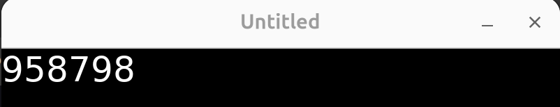
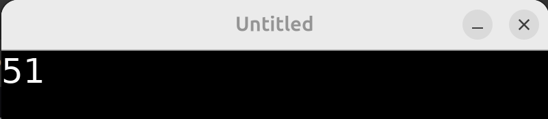
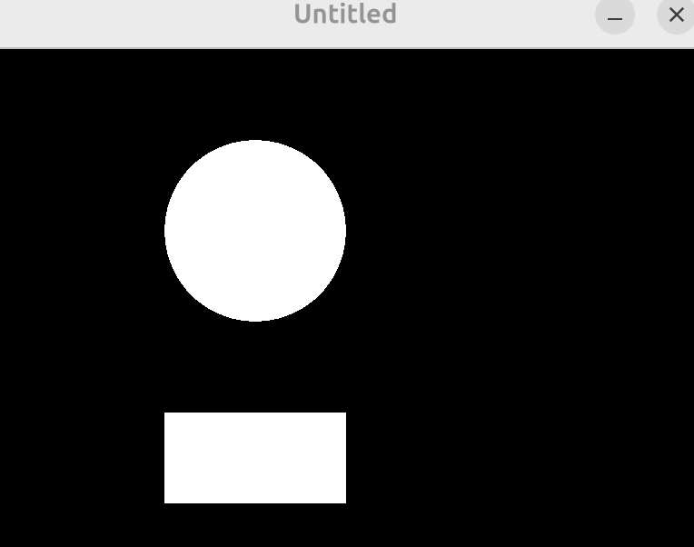
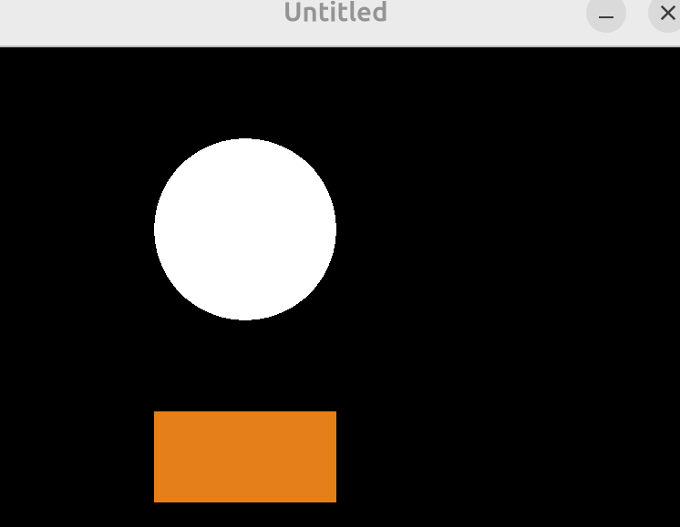
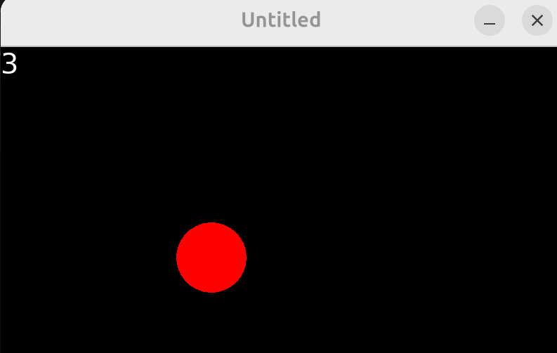
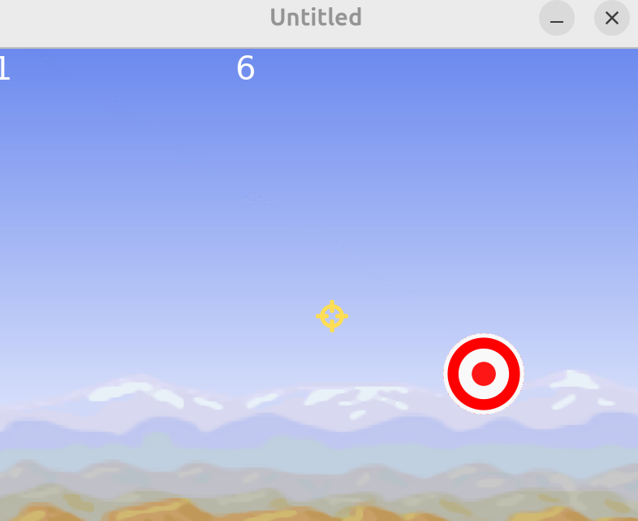
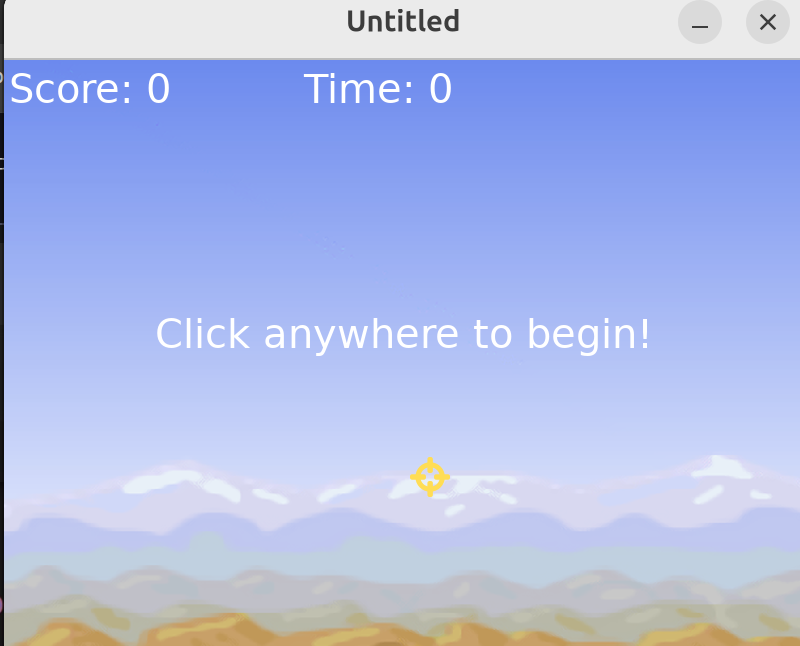

# Udemy: Master Lua Programming and Create Amazing Games with LÖVE!
- Instructor: Kyle Schaub

## Section 1: Install and Overview

### 1. Course Overview

### 2. Installing LÖVE
- sudo apt  install love 

### 3. Programming Environment
- We use VScode + Love2D plugin

### 4. Project Structure
- a_new_folder/main.lua
  - With VScode + Love2D plugin, alt+l key will activate Love2D
- In VS code, open the entire folder, not separate files
- main.lua:
```lua
function love.draw()
  love.graphics.print("Hello World!")
end
```

### 5. Projects On GitHub
- https://github.com/challacade/udemy-love2d/tree/master

## Section 2: Lua Programming

### 6. Introduction to Lua
- main.lua:
```lua
function love.draw()
  love.graphics.setFont(love.graphics.newFont(50))
  love.graphics.print("Hello World!")
end
```


- To run love as a standalone
  - `cd ./sec2`
  - `love .`

### 7. Variables

### 8. If Statements
```lua
message = 0
condition = 25
if condition > 0 then
   message = 1
end
function love.draw()
  love.graphics.setFont(love.graphics.newFont(50))
  love.graphics.print(message)
end
```

### 9. Else and ElseIf
```lua
message = 0
condition = -25
if condition > 0 then
   message = 1
elseif condition < -10 then
  message = -1
end
function love.draw()
  love.graphics.setFont(love.graphics.newFont(50))
  love.graphics.print(message)
end
```

### 10. While Loops
```lua
message = 0
while message < 10 do
  message = message + 1
end
function love.draw()
  love.graphics.setFont(love.graphics.newFont(50))
  love.graphics.print(message)
end
```

### 11. For Loops
```lua
pickle = 0
for i =1,3,1 do
  pickle = pickle + 10
end
function love.draw()
  love.graphics.setFont(love.graphics.newFont(50))
  love.graphics.print(pickle)
end
```
- Prints 30


### 12. Functions
```lua
message = 0
function increaseMessage()
  message = message + 5
end
increaseMessage()
function love.draw()
  love.graphics.setFont(love.graphics.newFont(50))
  love.graphics.print(message)
end
```
- If increaseMessage() is located inside of love.draw(), it keeps increasing as it refreshes
```lua
message = 0
function increaseMessage()
  message = message + 5
end
function double(val)
  val = val * 2
  return val
end
increaseMessage()
message = double(message)
function love.draw()
  love.graphics.setFont(love.graphics.newFont(50))
  love.graphics.print(message)
end
```
- Prints 10

### 13. Comments
```lua
-- comment
```
- Or (comment block):
```lua
--[[ 
comments
]]
```

### 14. Local and Global Variables
- `local var  = 123`

### 15. Tables pt. 1
```lua
testScores = {}
testScores[1] = 95
testScores[2] = 87
testScores[3] = 98
function love.draw()
  love.graphics.setFont(love.graphics.newFont(50))
  love.graphics.print(testScores)
end
```


- Or
```lua
message = 0
testScores = {95,87}
testScores[3] = 98
function love.draw()
  love.graphics.setFont(love.graphics.newFont(50))
  love.graphics.print(testScores)
end
```
- Or `table.insert(testScores, 98)`
- Index begins from 1, not 0 

### 16. Tables pt. 2
```lua
message = 0
testScores = {95,87,98}
for i, s in ipairs(testScores) do
  message = message + s
end
function love.draw()
  love.graphics.setFont(love.graphics.newFont(50))
  love.graphics.print(message)
end
```
- Prints 280

### 17. Syntax Review

### Quiz 1: Lua Programming Quiz

## Section 3: Game #1: Shooting Gallery

### 18. Shooting Gallery Overview

### 19. Load, Update, and Draw
- 3 main functions: load/update/draw
```lua
function love.load()
  -- initializer
  number = 0
end
function love.update(dt) -- dt: delta time
  --  
  number = number + 1
end
function love.draw()
  --
  love.graphics.setFont(love.graphics.newFont(50))
  love.graphics.print(number)
end
```


- Number changes as 60fps

### 20. Drawing Shapes
- "line" for outline only
- Y increases downwards
- Ref: https://love2d.org/wiki/Main_Page
```lua
function love.load()
  -- initializer
end
function love.update(dt) -- dt: delta time
  --  
end
function love.draw()
  --
  love.graphics.rectangle("fill",200,400, 200,100)
  love.graphics.circle("fill", 300, 200, 100)
end
```


### 21. Colors and Overlapping Graphics
- love.graphics.setColor(R,G,B)
  - RGB in 0-1.0
  - For 0-255 value, just divide by 255
```lua
function love.load()
  -- initializer
end
function love.update(dt) -- dt: delta time
  --  
end
function love.draw()
  --
  love.graphics.setColor(0.9,0.5,0.1)
  love.graphics.rectangle("fill",200,400, 200,100)
  love.graphics.setColor(1,1,1)
  love.graphics.circle("fill", 300, 200, 100)
end
```


### 22. Target Table and Global Variables
```lua
function love.load()
  -- initializer
  target = {}
  target.x = 300
  target.y = 300
  target.radius = 50
  score = 0
  timer = 0
end
function love.draw()
  --
  love.graphics.setColor(1,0,0)
  love.graphics.circle("fill", target.x, target.y, target.radius)
end
```

### 23. Using the Mouse
- https://love2d.org/wiki/love.mousepressed
```lua
function love.load()
  -- initializer
  target = {}
  target.x = 300
  target.y = 300
  target.radius = 50
  score = 0
  timer = 0
  gameFont = love.graphics.newFont(40)
end
function love.draw()
  --
  love.graphics.setColor(1,0,0)
  love.graphics.circle("fill", target.x, target.y, target.radius)
  love.graphics.setColor(1,1,1)
  love.graphics.setFont(gameFont)
  love.graphics.print(score,0,0)
end
function love.mousepressed(x,y,button,istouch,presses)
  --
  if button == 1 then -- left button click will increase the score
    score = score + 1
  end
end
```


### 24. Shooting the Target
```lua
function love.load()
  -- initializer
  target = {}
  target.x = 300
  target.y = 300
  target.radius = 50
  score = 0
  timer = 0
  gameFont = love.graphics.newFont(40)
end
function love.update(dt) -- dt: delta time
  --  
  timer = timer + dt
end
function love.draw()
  --
  love.graphics.setColor(1,0,0)
  love.graphics.circle("fill", target.x, target.y, target.radius)
  love.graphics.setColor(1,1,1)
  love.graphics.setFont(gameFont)
  love.graphics.print(score,0,0)
end
function love.mousepressed(x,y,button,istouch,presses)
  --
  if button == 1 then 
    local mouseToTarget = distanceBetween(x,y,target.x,target.y)
    if mouseToTarget < target.radius then
      score = score + 1
    end
  end
end
function distanceBetween(x1,y1,x2,y2)
  return math.sqrt( (x2-x1)^2 + (y2-y1)^2 )
end
```
- The score increases when a mouse clicks the insdie of the circle

### 25. Randomness
- After clicking the inside of a circle, the circle will move randomly
```lua
function love.mousepressed(x,y,button,istouch,presses)
  --
  if button == 1 then 
    local mouseToTarget = distanceBetween(x,y,target.x,target.y)
    if mouseToTarget < target.radius then
      score = score + 1
      target.x = math.random(target.radius,love.graphics.getWidth()-target.radius)
      target.y = math.random(target.radius,love.graphics.getHeight()-target.radius)
    end
  end
end
```

### 26. Timer
```lua
function love.update(dt) -- dt: delta time
  -- 60 FPS might not be guaranteed
  -- dt changes by varying FPS
  if timer > 0 then
    timer = timer - dt
  end
  if timer < 0 then
    timer = 0
  end
end
```

### 27. Sprites (Images)
- Using crosshairs.png, sky.png, target.png from the instructor
```lua
function love.load()
  -- initializer
  target = {}
  target.x = 300
  target.y = 300
  target.radius = 50
  score = 0
  timer = 10 -- as 10sec
  gameFont = love.graphics.newFont(40)
  sprites = {}
  sprites.sky = love.graphics.newImage('sprites/sky.png')
  sprites.target = love.graphics.newImage('sprites/target.png')
  sprites.crosshairs = love.graphics.newImage('sprites/crosshairs.png')
  love.mouse.setVisible(false) -- hide mouse point
end
function love.update(dt) -- dt: delta time
  -- 60 FPS might not be guaranteed
  -- dt changes by varying FPS
  if timer > 0 then
    timer = timer - dt
  end
  if timer < 0 then
    timer = 0
  end
end
function love.draw()
  --
  love.graphics.draw(sprites.sky,0,0)
  love.graphics.setColor(1,0,0)
  love.graphics.circle("fill", target.x, target.y, target.radius)
  love.graphics.setColor(1,1,1)
  love.graphics.setFont(gameFont)
  love.graphics.print(score,0,0)
  love.graphics.print(math.ceil(timer),300,0)
  love.graphics.draw(sprites.target, target.x-target.radius,target.y-target.radius)
  -- love.graphics.draw(sprites.crosshairs,love.mouse.getX(),love.mouse.getY()) -- due to the image size, there is a gap b/w actual mouse point and the image
  love.graphics.draw(sprites.crosshairs,love.mouse.getX()-20,love.mouse.getY()-20) 
end
function love.mousepressed(x,y,button,istouch,presses)
  --
  if button == 1 then 
    local mouseToTarget = distanceBetween(x,y,target.x,target.y)
    if mouseToTarget < target.radius then
      score = score + 1
      target.x = math.random(target.radius,love.graphics.getWidth()-target.radius)
      target.y = math.random(target.radius,love.graphics.getHeight()-target.radius)
    end
  end
end
function distanceBetween(x1,y1,x2,y2)
  return math.sqrt( (x2-x1)^2 + (y2-y1)^2 )
end
```


### 28. Main Menu
```lua
function love.load()
  -- initializer
  target = {}
  target.x = 300
  target.y = 300
  target.radius = 50
  score = 0
  timer = 0
  gameState = 1 -- 1 for main menu, not running game. 2 for game mode
  --
  gameFont = love.graphics.newFont(40)
  sprites = {}
  sprites.sky = love.graphics.newImage('sprites/sky.png')
  sprites.target = love.graphics.newImage('sprites/target.png')
  sprites.crosshairs = love.graphics.newImage('sprites/crosshairs.png')
  love.mouse.setVisible(false) -- hide mouse point
end
function love.update(dt) -- dt: delta time
  -- 60 FPS might not be guaranteed
  -- dt changes by varying FPS
  if timer > 0 then
    timer = timer - dt
  end
  if timer < 0 then
    timer = 0
    gameState = 1
  end
end
function love.draw()
  --
  love.graphics.draw(sprites.sky,0,0)
  love.graphics.setColor(1,1,1)
  love.graphics.setFont(gameFont)
  love.graphics.print(score,0,0)
  love.graphics.print(math.ceil(timer),300,0)
  if gameState == 2 then
    love.graphics.draw(sprites.target, target.x-target.radius,target.y-target.radius)
  end
  love.graphics.draw(sprites.crosshairs,love.mouse.getX()-20,love.mouse.getY()-20) 
end
function love.mousepressed(x,y,button,istouch,presses)
  --
  if button == 1 and gameState == 2 then 
    local mouseToTarget = distanceBetween(x,y,target.x,target.y)
    if mouseToTarget < target.radius then
      score = score + 1
      target.x = math.random(target.radius,love.graphics.getWidth()-target.radius)
      target.y = math.random(target.radius,love.graphics.getHeight()-target.radius)
    end
  elseif button == 1 and gameState == 1 then
    -- Game start or reset
    gameState = 2
    timer = 10
    score = 0
  end
end
function distanceBetween(x1,y1,x2,y2)
  return math.sqrt( (x2-x1)^2 + (y2-y1)^2 )
end
```
- In the beginning, the game is set as a main mode but when clicking, the game mode (gameState=2) is activated

### 29. Finishing Touches
```lua
function love.load()
  -- initializer
  target = {}
  target.x = 300
  target.y = 300
  target.radius = 50
  score = 0
  timer = 0
  gameState = 1 -- 1 for main menu, not running game. 2 for game mode
  --
  gameFont = love.graphics.newFont(40)
  sprites = {}
  sprites.sky = love.graphics.newImage('sprites/sky.png')
  sprites.target = love.graphics.newImage('sprites/target.png')
  sprites.crosshairs = love.graphics.newImage('sprites/crosshairs.png')
  love.mouse.setVisible(false) -- hide mouse point
end
function love.update(dt) -- dt: delta time
  -- 60 FPS might not be guaranteed
  -- dt changes by varying FPS
  if timer > 0 then
    timer = timer - dt
  end
  if timer < 0 then
    timer = 0
    gameState = 1
  end
end
function love.draw()
  --
  love.graphics.draw(sprites.sky,0,0)
  love.graphics.setColor(1,1,1)
  love.graphics.setFont(gameFont)
  love.graphics.print("Score: " .. score,5,5)
  love.graphics.print("Time: " .. math.ceil(timer),300,5)
  if gameState == 1 then
    love.graphics.printf("Click anywhere to begin!", 0,250,love.graphics.getWidth(),"center")
  end
  if gameState == 2 then
    love.graphics.draw(sprites.target, target.x-target.radius,target.y-target.radius)
  end
  love.graphics.draw(sprites.crosshairs,love.mouse.getX()-20,love.mouse.getY()-20) 
end
function love.mousepressed(x,y,button,istouch,presses)
  --
  if button == 1 and gameState == 2 then 
    local mouseToTarget = distanceBetween(x,y,target.x,target.y)
    if mouseToTarget < target.radius then
      score = score + 1
      target.x = math.random(target.radius,love.graphics.getWidth()-target.radius)
      target.y = math.random(target.radius,love.graphics.getHeight()-target.radius)
    end
  elseif button == 1 and gameState == 1 then
    -- Game start or reset
    gameState = 2
    timer = 10
    score = 0
  end
end
function distanceBetween(x1,y1,x2,y2)
  return math.sqrt( (x2-x1)^2 + (y2-y1)^2 )
end
```


### Quiz 2: Game #1 Skills Assessment

### 30. Game #1 Coding Challenge

## Section 4: Game #2: Top-Down Shooter

### 31. Top-Down Shooter Overview
### 32. World Setup
### 33. Player Movement
### 34. Delta Time
### 35. Sprite Rotation
### 36. Facing the Mouse
### 37. Enemies
### 38. Enemy Rotation
### 39. Enemy Movement
### 40. Basic Collisions
### 41. Shooting Projectiles
### 42. Scaling Sprites
### 43. Deleting Projectiles
### 44. Shooting Enemies
### 45. Enemy Spawn Position
### 46. Enemy Spawn Timer
### 47. Menu, Score, and Polish
14min
### Quiz 3: Game #2 Skills Assessment
### 48. Game #2 Coding Challenge
1min

### 49. Platformer Overview
### 50. Physics
### 51. Moving and Jumping
### 52. Collision Classes
### 53. Querying for Colliders
### 54. Animations
### 55. Player Graphics
### 56. Changing Between Animations
### 57. Player Direction (Flipping the Animation)
### 58. Jump Animation
### 59. Multiple Lua Files
### 60. Tiled
### 61. Import Tiled Map to LÖVE
### 62. Spawning Objects from Tiled
### 63. Camera
### 64. Platformer Enemies
### 65. Transitioning Between Levels
### 66. Saving Data
### 67. Music and Sounds
### 68. Finishing Touches
8min
### Quiz 4: Game #3 Skills Assessment
### 69. What's Next?
3min

### 70. LÖVE for Web Overview
### 71. Love.js Setup and Installation
### 72. Building and Running with Love.js
### 73. Hosting Your Game
6min

### 74. Mobile Overview
### 75. Touching the Screen
### 76. Adapting to Screen Size
### 77. Installing Android Tools
### 78. Generating the APK
### 79. Installing on Your Android Device
### 80. Signing Your App
### 81. Publishing Your App
3min

### 82. Command Line and Git Basics
7min


