# Udemy: Master Lua Programming and Create Amazing Games with LÖVE!
- Instructor: Kyle Schaub

## Section 1: Install and Overview

### 1. Course Overview

### 2. Installing LÖVE
- sudo apt  install love 

### 3. Programming Environment
- We use VScode + Love2D plugin

### 4. Project Structure
- a_new_folder/main.lua
  - With VScode + Love2D plugin, alt+l key will activate Love2D
- In VS code, open the entire folder, not separate files
- main.lua:
```lua
function love.draw()
  love.graphics.print("Hello World!")
end
```

### 5. Projects On GitHub
- https://github.com/challacade/udemy-love2d/tree/master

## Section 2: Lua Programming

### 6. Introduction to Lua
- main.lua:
```lua
function love.draw()
  love.graphics.setFont(love.graphics.newFont(50))
  love.graphics.print("Hello World!")
end
```


- To run love as a standalone
  - `cd ./sec2`
  - `love .`

### 7. Variables

### 8. If Statements
```lua
message = 0
condition = 25
if condition > 0 then
   message = 1
end
function love.draw()
  love.graphics.setFont(love.graphics.newFont(50))
  love.graphics.print(message)
end
```

### 9. Else and ElseIf
```lua
message = 0
condition = -25
if condition > 0 then
   message = 1
elseif condition < -10 then
  message = -1
end
function love.draw()
  love.graphics.setFont(love.graphics.newFont(50))
  love.graphics.print(message)
end
```

### 10. While Loops
```lua
message = 0
while message < 10 do
  message = message + 1
end
function love.draw()
  love.graphics.setFont(love.graphics.newFont(50))
  love.graphics.print(message)
end
```

### 11. For Loops
```lua
pickle = 0
for i =1,3,1 do
  pickle = pickle + 10
end
function love.draw()
  love.graphics.setFont(love.graphics.newFont(50))
  love.graphics.print(pickle)
end
```
- Prints 30


### 12. Functions
```lua
message = 0
function increaseMessage()
  message = message + 5
end
increaseMessage()
function love.draw()
  love.graphics.setFont(love.graphics.newFont(50))
  love.graphics.print(message)
end
```
- If increaseMessage() is located inside of love.draw(), it keeps increasing as it refreshes
```lua
message = 0
function increaseMessage()
  message = message + 5
end
function double(val)
  val = val * 2
  return val
end
increaseMessage()
message = double(message)
function love.draw()
  love.graphics.setFont(love.graphics.newFont(50))
  love.graphics.print(message)
end
```
- Prints 10

### 13. Comments
```lua
-- comment
```
- Or (comment block):
```lua
--[[ 
comments
]]
```

### 14. Local and Global Variables
- `local var  = 123`

### 15. Tables pt. 1
```lua
testScores = {}
testScores[1] = 95
testScores[2] = 87
testScores[3] = 98
function love.draw()
  love.graphics.setFont(love.graphics.newFont(50))
  love.graphics.print(testScores)
end
```


- Or
```lua
message = 0
testScores = {95,87}
testScores[3] = 98
function love.draw()
  love.graphics.setFont(love.graphics.newFont(50))
  love.graphics.print(testScores)
end
```
- Or `table.insert(testScores, 98)`
- Index begins from 1, not 0 

### 16. Tables pt. 2
```lua
message = 0
testScores = {95,87,98}
for i, s in ipairs(testScores) do
  message = message + s
end
function love.draw()
  love.graphics.setFont(love.graphics.newFont(50))
  love.graphics.print(message)
end
```
- Prints 280
- Reverse loop:
```lua
t = {1,2,3}
for i=#t,1,-1 do
  print(t[i]) -- prints 3 2 1
end
```

### 17. Syntax Review

### Quiz 1: Lua Programming Quiz

## Section 3: Game #1: Shooting Gallery

### 18. Shooting Gallery Overview

### 19. Load, Update, and Draw
- 3 main functions: load/update/draw
```lua
function love.load()
  -- initializer
  number = 0
end
function love.update(dt) -- dt: delta time
  --  
  number = number + 1
end
function love.draw()
  --
  love.graphics.setFont(love.graphics.newFont(50))
  love.graphics.print(number)
end
```


- Number changes as 60fps

### 20. Drawing Shapes
- "line" for outline only
- Y increases downwards
- Ref: https://love2d.org/wiki/Main_Page
```lua
function love.load()
  -- initializer
end
function love.update(dt) -- dt: delta time
  --  
end
function love.draw()
  --
  love.graphics.rectangle("fill",200,400, 200,100)
  love.graphics.circle("fill", 300, 200, 100)
end
```


### 21. Colors and Overlapping Graphics
- love.graphics.setColor(R,G,B)
  - RGB in 0-1.0
  - For 0-255 value, just divide by 255
```lua
function love.load()
  -- initializer
end
function love.update(dt) -- dt: delta time
  --  
end
function love.draw()
  --
  love.graphics.setColor(0.9,0.5,0.1)
  love.graphics.rectangle("fill",200,400, 200,100)
  love.graphics.setColor(1,1,1)
  love.graphics.circle("fill", 300, 200, 100)
end
```


### 22. Target Table and Global Variables
```lua
function love.load()
  -- initializer
  target = {}
  target.x = 300
  target.y = 300
  target.radius = 50
  score = 0
  timer = 0
end
function love.draw()
  --
  love.graphics.setColor(1,0,0)
  love.graphics.circle("fill", target.x, target.y, target.radius)
end
```

### 23. Using the Mouse
- https://love2d.org/wiki/love.mousepressed
```lua
function love.load()
  -- initializer
  target = {}
  target.x = 300
  target.y = 300
  target.radius = 50
  score = 0
  timer = 0
  gameFont = love.graphics.newFont(40)
end
function love.draw()
  --
  love.graphics.setColor(1,0,0)
  love.graphics.circle("fill", target.x, target.y, target.radius)
  love.graphics.setColor(1,1,1)
  love.graphics.setFont(gameFont)
  love.graphics.print(score,0,0)
end
function love.mousepressed(x,y,button,istouch,presses)
  --
  if button == 1 then -- left button click will increase the score
    score = score + 1
  end
end
```


### 24. Shooting the Target
```lua
function love.load()
  -- initializer
  target = {}
  target.x = 300
  target.y = 300
  target.radius = 50
  score = 0
  timer = 0
  gameFont = love.graphics.newFont(40)
end
function love.update(dt) -- dt: delta time
  --  
  timer = timer + dt
end
function love.draw()
  --
  love.graphics.setColor(1,0,0)
  love.graphics.circle("fill", target.x, target.y, target.radius)
  love.graphics.setColor(1,1,1)
  love.graphics.setFont(gameFont)
  love.graphics.print(score,0,0)
end
function love.mousepressed(x,y,button,istouch,presses)
  --
  if button == 1 then 
    local mouseToTarget = distanceBetween(x,y,target.x,target.y)
    if mouseToTarget < target.radius then
      score = score + 1
    end
  end
end
function distanceBetween(x1,y1,x2,y2)
  return math.sqrt( (x2-x1)^2 + (y2-y1)^2 )
end
```
- The score increases when a mouse clicks the insdie of the circle

### 25. Randomness
- After clicking the inside of a circle, the circle will move randomly
```lua
function love.mousepressed(x,y,button,istouch,presses)
  --
  if button == 1 then 
    local mouseToTarget = distanceBetween(x,y,target.x,target.y)
    if mouseToTarget < target.radius then
      score = score + 1
      target.x = math.random(target.radius,love.graphics.getWidth()-target.radius)
      target.y = math.random(target.radius,love.graphics.getHeight()-target.radius)
    end
  end
end
```

### 26. Timer
```lua
function love.update(dt) -- dt: delta time
  -- 60 FPS might not be guaranteed
  -- dt changes by varying FPS
  if timer > 0 then
    timer = timer - dt
  end
  if timer < 0 then
    timer = 0
  end
end
```

### 27. Sprites (Images)
- Using crosshairs.png, sky.png, target.png from the instructor
```lua
function love.load()
  -- initializer
  target = {}
  target.x = 300
  target.y = 300
  target.radius = 50
  score = 0
  timer = 10 -- as 10sec
  gameFont = love.graphics.newFont(40)
  sprites = {}
  sprites.sky = love.graphics.newImage('sprites/sky.png')
  sprites.target = love.graphics.newImage('sprites/target.png')
  sprites.crosshairs = love.graphics.newImage('sprites/crosshairs.png')
  love.mouse.setVisible(false) -- hide mouse point
end
function love.update(dt) -- dt: delta time
  -- 60 FPS might not be guaranteed
  -- dt changes by varying FPS
  if timer > 0 then
    timer = timer - dt
  end
  if timer < 0 then
    timer = 0
  end
end
function love.draw()
  --
  love.graphics.draw(sprites.sky,0,0)
  love.graphics.setColor(1,0,0)
  love.graphics.circle("fill", target.x, target.y, target.radius)
  love.graphics.setColor(1,1,1)
  love.graphics.setFont(gameFont)
  love.graphics.print(score,0,0)
  love.graphics.print(math.ceil(timer),300,0)
  love.graphics.draw(sprites.target, target.x-target.radius,target.y-target.radius)
  -- love.graphics.draw(sprites.crosshairs,love.mouse.getX(),love.mouse.getY()) -- due to the image size, there is a gap b/w actual mouse point and the image
  love.graphics.draw(sprites.crosshairs,love.mouse.getX()-20,love.mouse.getY()-20) 
end
function love.mousepressed(x,y,button,istouch,presses)
  --
  if button == 1 then 
    local mouseToTarget = distanceBetween(x,y,target.x,target.y)
    if mouseToTarget < target.radius then
      score = score + 1
      target.x = math.random(target.radius,love.graphics.getWidth()-target.radius)
      target.y = math.random(target.radius,love.graphics.getHeight()-target.radius)
    end
  end
end
function distanceBetween(x1,y1,x2,y2)
  return math.sqrt( (x2-x1)^2 + (y2-y1)^2 )
end
```


### 28. Main Menu
```lua
function love.load()
  -- initializer
  target = {}
  target.x = 300
  target.y = 300
  target.radius = 50
  score = 0
  timer = 0
  gameState = 1 -- 1 for main menu, not running game. 2 for game mode
  --
  gameFont = love.graphics.newFont(40)
  sprites = {}
  sprites.sky = love.graphics.newImage('sprites/sky.png')
  sprites.target = love.graphics.newImage('sprites/target.png')
  sprites.crosshairs = love.graphics.newImage('sprites/crosshairs.png')
  love.mouse.setVisible(false) -- hide mouse point
end
function love.update(dt) -- dt: delta time
  -- 60 FPS might not be guaranteed
  -- dt changes by varying FPS
  if timer > 0 then
    timer = timer - dt
  end
  if timer < 0 then
    timer = 0
    gameState = 1
  end
end
function love.draw()
  --
  love.graphics.draw(sprites.sky,0,0)
  love.graphics.setColor(1,1,1)
  love.graphics.setFont(gameFont)
  love.graphics.print(score,0,0)
  love.graphics.print(math.ceil(timer),300,0)
  if gameState == 2 then
    love.graphics.draw(sprites.target, target.x-target.radius,target.y-target.radius)
  end
  love.graphics.draw(sprites.crosshairs,love.mouse.getX()-20,love.mouse.getY()-20) 
end
function love.mousepressed(x,y,button,istouch,presses)
  --
  if button == 1 and gameState == 2 then 
    local mouseToTarget = distanceBetween(x,y,target.x,target.y)
    if mouseToTarget < target.radius then
      score = score + 1
      target.x = math.random(target.radius,love.graphics.getWidth()-target.radius)
      target.y = math.random(target.radius,love.graphics.getHeight()-target.radius)
    end
  elseif button == 1 and gameState == 1 then
    -- Game start or reset
    gameState = 2
    timer = 10
    score = 0
  end
end
function distanceBetween(x1,y1,x2,y2)
  return math.sqrt( (x2-x1)^2 + (y2-y1)^2 )
end
```
- In the beginning, the game is set as a main mode but when clicking, the game mode (gameState=2) is activated

### 29. Finishing Touches
```lua
function love.load()
  -- initializer
  target = {}
  target.x = 300
  target.y = 300
  target.radius = 50
  score = 0
  timer = 0
  gameState = 1 -- 1 for main menu, not running game. 2 for game mode
  --
  gameFont = love.graphics.newFont(40)
  sprites = {}
  sprites.sky = love.graphics.newImage('sprites/sky.png')
  sprites.target = love.graphics.newImage('sprites/target.png')
  sprites.crosshairs = love.graphics.newImage('sprites/crosshairs.png')
  love.mouse.setVisible(false) -- hide mouse point
end
function love.update(dt) -- dt: delta time
  -- 60 FPS might not be guaranteed
  -- dt changes by varying FPS
  if timer > 0 then
    timer = timer - dt
  end
  if timer < 0 then
    timer = 0
    gameState = 1
  end
end
function love.draw()
  --
  love.graphics.draw(sprites.sky,0,0)
  love.graphics.setColor(1,1,1)
  love.graphics.setFont(gameFont)
  love.graphics.print("Score: " .. score,5,5)
  love.graphics.print("Time: " .. math.ceil(timer),300,5)
  if gameState == 1 then
    love.graphics.printf("Click anywhere to begin!", 0,250,love.graphics.getWidth(),"center")
  end
  if gameState == 2 then
    love.graphics.draw(sprites.target, target.x-target.radius,target.y-target.radius)
  end
  love.graphics.draw(sprites.crosshairs,love.mouse.getX()-20,love.mouse.getY()-20) 
end
function love.mousepressed(x,y,button,istouch,presses)
  --
  if button == 1 and gameState == 2 then 
    local mouseToTarget = distanceBetween(x,y,target.x,target.y)
    if mouseToTarget < target.radius then
      score = score + 1
      target.x = math.random(target.radius,love.graphics.getWidth()-target.radius)
      target.y = math.random(target.radius,love.graphics.getHeight()-target.radius)
    end
  elseif button == 1 and gameState == 1 then
    -- Game start or reset
    gameState = 2
    timer = 10
    score = 0
  end
end
function distanceBetween(x1,y1,x2,y2)
  return math.sqrt( (x2-x1)^2 + (y2-y1)^2 )
end
```


### Quiz 2: Game #1 Skills Assessment

### 30. Game #1 Coding Challenge
1. When the player clicks the mouse but misses the target, they should lose a point. Make sure that the player's score does not fall below zero.

2. Add a feature where the player can right-click in order to shoot a target. When right-clicking to shoot, the player will earn 2 points on a successful hit, but they will also lose 1 second on their timer.

## Section 4: Game #2: Top-Down Shooter

### 31. Top-Down Shooter Overview

### 32. World Setup
```lua
function love.load()
  sprites = {}
  sprites.background = love.graphics.newImage('sprites/background.png')
  sprites.bullet = love.graphics.newImage('sprites/bullet.png')
  sprites.player = love.graphics.newImage('sprites/player.png')
  sprites.zombie = love.graphics.newImage('sprites/zombie.png')
  --
  player = {}
  player.x = love.graphics.getWidth()/2
  player.y = love.graphics.getHeight()/2
end
function love.update(dt)
end
function love.draw()
  love.graphics.draw(sprites.background,0,0)
  love.graphics.draw(sprites.player,player.x,player.y)
end
```

### 33. Player Movement
- Using keyboard to control the player
```lua
function love.load()
  sprites = {}
  sprites.background = love.graphics.newImage('sprites/background.png')
  sprites.bullet = love.graphics.newImage('sprites/bullet.png')
  sprites.player = love.graphics.newImage('sprites/player.png')
  sprites.zombie = love.graphics.newImage('sprites/zombie.png')
  --
  player = {}
  player.x = love.graphics.getWidth()/2
  player.y = love.graphics.getHeight()/2
  player.speed = 3
end
function love.update(dt)
  if love.keyboard.isDown("d") then
    player.x = player.x + player.speed
  end
  if love.keyboard.isDown("a") then
    player.x = player.x - player.speed
  end
  if love.keyboard.isDown("w") then
    player.y = player.y - player.speed
  end
  if love.keyboard.isDown("s") then
    player.y = player.y + player.speed
  end
end
function love.draw()
  love.graphics.draw(sprites.background,0,0)
  love.graphics.draw(sprites.player,player.x,player.y)
end
```

### 34. Delta Time
- What if 60 FPS is not maintained?
  - Use dt from love.update()
```lua
function love.load()
  sprites = {}
  sprites.background = love.graphics.newImage('sprites/background.png')
  sprites.bullet = love.graphics.newImage('sprites/bullet.png')
  sprites.player = love.graphics.newImage('sprites/player.png')
  sprites.zombie = love.graphics.newImage('sprites/zombie.png')
  --
  player = {}
  player.x = love.graphics.getWidth()/2
  player.y = love.graphics.getHeight()/2
  player.speed = 180 -- 3x60FPS
end
function love.update(dt)
  if love.keyboard.isDown("d") then
    player.x = player.x + player.speed*dt
  end
  if love.keyboard.isDown("a") then
    player.x = player.x - player.speed*dt
  end
  if love.keyboard.isDown("w") then
    player.y = player.y - player.speed*dt
  end
  if love.keyboard.isDown("s") then
    player.y = player.y + player.speed*dt
  end
end
function love.draw()
  love.graphics.draw(sprites.background,0,0)
  love.graphics.draw(sprites.player,player.x,player.y)
end
```  

### 35. Sprite Rotation
- Implementing rotation: https://love2d.org/wiki/love.graphics.draw
  - `love.graphics.draw( drawable, x, y, r, sx, sy, ox, oy, kx, ky )`
  - Rotation direction is clock-wise
  - Radian value is used: 180 degrees = $\pi$
```lua
function love.load()
  sprites = {}
  sprites.background = love.graphics.newImage('sprites/background.png')
  sprites.bullet = love.graphics.newImage('sprites/bullet.png')
  sprites.player = love.graphics.newImage('sprites/player.png')
  sprites.zombie = love.graphics.newImage('sprites/zombie.png')
  --
  player = {}
  player.x = love.graphics.getWidth()/2
  player.y = love.graphics.getHeight()/2
  player.speed = 180 -- 3x60FPS
  tempRotation = 0
end
function love.update(dt)
  if love.keyboard.isDown("d") then
    player.x = player.x + player.speed*dt
  end
  if love.keyboard.isDown("a") then
    player.x = player.x - player.speed*dt
  end
  if love.keyboard.isDown("w") then
    player.y = player.y - player.speed*dt
  end
  if love.keyboard.isDown("s") then
    player.y = player.y + player.speed*dt
  end
  tempRotation = tempRotation + 0.01
end
function love.draw()
  love.graphics.draw(sprites.background,0,0)
  love.graphics.draw(sprites.player,player.x,player.y,tempRotation,
    nil,nil, sprites.player:getWidth()/2,sprites.player:getHeight()/2)
end
```

### 36. Facing the Mouse
- Player position vs mouse position
  - `atan2(y1-y2,x1-x2)`
```lua
function love.load()
  sprites = {}
  sprites.background = love.graphics.newImage('sprites/background.png')
  sprites.bullet = love.graphics.newImage('sprites/bullet.png')
  sprites.player = love.graphics.newImage('sprites/player.png')
  sprites.zombie = love.graphics.newImage('sprites/zombie.png')
  --
  player = {}
  player.x = love.graphics.getWidth()/2
  player.y = love.graphics.getHeight()/2
  player.speed = 180 -- 3x60FPS  
end
function love.update(dt)
  if love.keyboard.isDown("d") then
    player.x = player.x + player.speed*dt
  end
  if love.keyboard.isDown("a") then
    player.x = player.x - player.speed*dt
  end
  if love.keyboard.isDown("w") then
    player.y = player.y - player.speed*dt
  end
  if love.keyboard.isDown("s") then
    player.y = player.y + player.speed*dt
  end
end
function love.draw()
  love.graphics.draw(sprites.background,0,0)
  love.graphics.draw(sprites.player,player.x,player.y,playerMouseAngle(),
    nil,nil, sprites.player:getWidth()/2,sprites.player:getHeight()/2)
end
function playerMouseAngle()
  return math.atan2(player.y-love.mouse.getY(),player.x-love.mouse.getX()) + math.pi
end
```

### 37. Enemies
- Implementing zombie table:
  - Random spawining
```lua
function love.load()
  sprites = {}
  sprites.background = love.graphics.newImage('sprites/background.png')
  sprites.bullet = love.graphics.newImage('sprites/bullet.png')
  sprites.player = love.graphics.newImage('sprites/player.png')
  sprites.zombie = love.graphics.newImage('sprites/zombie.png')
  --
  player = {}
  player.x = love.graphics.getWidth()/2
  player.y = love.graphics.getHeight()/2
  player.speed = 180 -- 3x60FPS
  --
  zombies = {} -- multiples of a single zombie
end
function love.update(dt)
  if love.keyboard.isDown("d") then
    player.x = player.x + player.speed*dt
  end
  if love.keyboard.isDown("a") then
    player.x = player.x - player.speed*dt
  end
  if love.keyboard.isDown("w") then
    player.y = player.y - player.speed*dt
  end
  if love.keyboard.isDown("s") then
    player.y = player.y + player.speed*dt
  end
end
function love.draw()
  love.graphics.draw(sprites.background,0,0)
  love.graphics.draw(sprites.player,player.x,player.y,playerMouseAngle(),
    nil,nil, sprites.player:getWidth()/2,sprites.player:getHeight()/2)
  for i,z in ipairs(zombies) do
    love.graphics.draw(sprites.zombie,z.x,z.y)
  end 
end
function love.keypressed(key)
  if key == "space" then
    spawnZombie()
  end
end
function playerMouseAngle()
  return math.atan2(player.y-love.mouse.getY(),player.x-love.mouse.getX()) + math.pi
end
function spawnZombie()
  local zombie = {} -- single Zombie
  zombie.x = math.random(0,love.graphics.getWidth())
  zombie.y = math.random(0,love.graphics.getHeight())
  zombie.speed = 100
  table.insert(zombies,zombie)
end
```

### 38. Enemy Rotation
- Let zombies face the player
```lua
function love.load()
  sprites = {}
  sprites.background = love.graphics.newImage('sprites/background.png')
  sprites.bullet = love.graphics.newImage('sprites/bullet.png')
  sprites.player = love.graphics.newImage('sprites/player.png')
  sprites.zombie = love.graphics.newImage('sprites/zombie.png')
  --
  player = {}
  player.x = love.graphics.getWidth()/2
  player.y = love.graphics.getHeight()/2
  player.speed = 180 -- 3x60FPS
  --
  zombies = {} -- multiples of a single zombie
end
function love.update(dt)
  if love.keyboard.isDown("d") then
    player.x = player.x + player.speed*dt
  end
  if love.keyboard.isDown("a") then
    player.x = player.x - player.speed*dt
  end
  if love.keyboard.isDown("w") then
    player.y = player.y - player.speed*dt
  end
  if love.keyboard.isDown("s") then
    player.y = player.y + player.speed*dt
  end
end
function love.draw()
  love.graphics.draw(sprites.background,0,0)
  love.graphics.draw(sprites.player,player.x,player.y,playerMouseAngle(),
    nil,nil, sprites.player:getWidth()/2,sprites.player:getHeight()/2)
  for i,z in ipairs(zombies) do
    love.graphics.draw(sprites.zombie,z.x,z.y,zombiePlayerAngle(z),
  nil,nil,sprites.zombie:getWidth()/2,sprites.zombie:getHeight()/2)
  end 
end
function love.keypressed(key)
  if key == "space" then
    spawnZombie()
  end
end
function playerMouseAngle()
  return math.atan2(player.y-love.mouse.getY(),player.x-love.mouse.getX()) + math.pi
end
function zombiePlayerAngle(enemy)
  return math.atan2(player.y-enemy.y,player.x-enemy.x) + math.pi
end

function spawnZombie()
  local zombie = {} -- single Zombie
  zombie.x = math.random(0,love.graphics.getWidth())
  zombie.y = math.random(0,love.graphics.getHeight())
  zombie.speed = 100
  table.insert(zombies,zombie)
end
```

### 39. Enemy Movement
- Let zombie follow the player
```lua
function love.load()
  sprites = {}
  sprites.background = love.graphics.newImage('sprites/background.png')
  sprites.bullet = love.graphics.newImage('sprites/bullet.png')
  sprites.player = love.graphics.newImage('sprites/player.png')
  sprites.zombie = love.graphics.newImage('sprites/zombie.png')
  --
  player = {}
  player.x = love.graphics.getWidth()/2
  player.y = love.graphics.getHeight()/2
  player.speed = 180 -- 3x60FPS
  --
  zombies = {} -- multiples of a single zombie
end
function love.update(dt)
  if love.keyboard.isDown("d") then
    player.x = player.x + player.speed*dt
  end
  if love.keyboard.isDown("a") then
    player.x = player.x - player.speed*dt
  end
  if love.keyboard.isDown("w") then
    player.y = player.y - player.speed*dt
  end
  if love.keyboard.isDown("s") then
    player.y = player.y + player.speed*dt
  end
  for i,z in ipairs(zombies) do
    z.x = z.x + math.cos(zombiePlayerAngle(z))*z.speed*dt
    z.y = z.y + math.sin(zombiePlayerAngle(z))*z.speed*dt
  end
end
function love.draw()
  love.graphics.draw(sprites.background,0,0)
  love.graphics.draw(sprites.player,player.x,player.y,playerMouseAngle(),
    nil,nil, sprites.player:getWidth()/2,sprites.player:getHeight()/2)
  for i,z in ipairs(zombies) do
    love.graphics.draw(sprites.zombie,z.x,z.y,zombiePlayerAngle(z),
  nil,nil,sprites.zombie:getWidth()/2,sprites.zombie:getHeight()/2)
  end 
end
function love.keypressed(key)
  if key == "space" then
    spawnZombie()
  end
end
function playerMouseAngle()
  return math.atan2(player.y-love.mouse.getY(),player.x-love.mouse.getX()) + math.pi
end
function zombiePlayerAngle(enemy)
  return math.atan2(player.y-enemy.y,player.x-enemy.x)
end

function spawnZombie()
  local zombie = {} -- single Zombie
  zombie.x = math.random(0,love.graphics.getWidth())
  zombie.y = math.random(0,love.graphics.getHeight())
  zombie.speed = 140
  table.insert(zombies,zombie)
end
```

### 40. Basic Collisions
- When zombies are close to the player, nullifies all zombies
```lua
function love.load()
  sprites = {}
  sprites.background = love.graphics.newImage('sprites/background.png')
  sprites.bullet = love.graphics.newImage('sprites/bullet.png')
  sprites.player = love.graphics.newImage('sprites/player.png')
  sprites.zombie = love.graphics.newImage('sprites/zombie.png')
  --
  player = {}
  player.x = love.graphics.getWidth()/2
  player.y = love.graphics.getHeight()/2
  player.speed = 180 -- 3x60FPS
  --
  zombies = {} -- multiples of a single zombie
end
function love.update(dt)
  if love.keyboard.isDown("d") then
    player.x = player.x + player.speed*dt
  end
  if love.keyboard.isDown("a") then
    player.x = player.x - player.speed*dt
  end
  if love.keyboard.isDown("w") then
    player.y = player.y - player.speed*dt
  end
  if love.keyboard.isDown("s") then
    player.y = player.y + player.speed*dt
  end
  for i,z in ipairs(zombies) do
    z.x = z.x + math.cos(zombiePlayerAngle(z))*z.speed*dt
    z.y = z.y + math.sin(zombiePlayerAngle(z))*z.speed*dt
    if distanceBetween(z.x,z.y,player.x,player.y) < 30 then
      for i,z in ipairs(zombies) do
        zombies[i] = nil -- removes all zombies from index
      end
    end
  end
end
function love.draw()
  love.graphics.draw(sprites.background,0,0)
  love.graphics.draw(sprites.player,player.x,player.y,playerMouseAngle(),
    nil,nil, sprites.player:getWidth()/2,sprites.player:getHeight()/2)
  for i,z in ipairs(zombies) do
    love.graphics.draw(sprites.zombie,z.x,z.y,zombiePlayerAngle(z),
  nil,nil,sprites.zombie:getWidth()/2,sprites.zombie:getHeight()/2)
  end 
end
function love.keypressed(key)
  if key == "space" then
    spawnZombie()
  end
end
function playerMouseAngle()
  return math.atan2(player.y-love.mouse.getY(),player.x-love.mouse.getX()) + math.pi
end
function zombiePlayerAngle(enemy)
  return math.atan2(player.y-enemy.y,player.x-enemy.x)
end

function spawnZombie()
  local zombie = {} -- single Zombie
  zombie.x = math.random(0,love.graphics.getWidth())
  zombie.y = math.random(0,love.graphics.getHeight())
  zombie.speed = 140
  table.insert(zombies,zombie)
end
function distanceBetween(x1,y1,x2,y2)
  return math.sqrt((x2-x1)^2 + (y2-y1)^2)
end
```

### 41. Shooting Projectiles
- A mouse click will shoot a bullet
```lua
function love.load()
  sprites = {}
  sprites.background = love.graphics.newImage('sprites/background.png')
  sprites.bullet = love.graphics.newImage('sprites/bullet.png')
  sprites.player = love.graphics.newImage('sprites/player.png')
  sprites.zombie = love.graphics.newImage('sprites/zombie.png')
  --
  player = {}
  player.x = love.graphics.getWidth()/2
  player.y = love.graphics.getHeight()/2
  player.speed = 180 -- 3x60FPS
  --
  zombies = {} -- multiples of a single zombie
  bullets = {}
end
function love.update(dt)
  if love.keyboard.isDown("d") then
    player.x = player.x + player.speed*dt
  end
  if love.keyboard.isDown("a") then
    player.x = player.x - player.speed*dt
  end
  if love.keyboard.isDown("w") then
    player.y = player.y - player.speed*dt
  end
  if love.keyboard.isDown("s") then
    player.y = player.y + player.speed*dt
  end
  for i,z in ipairs(zombies) do
    z.x = z.x + math.cos(zombiePlayerAngle(z))*z.speed*dt
    z.y = z.y + math.sin(zombiePlayerAngle(z))*z.speed*dt
    if distanceBetween(z.x,z.y,player.x,player.y) < 30 then
      for i,z in ipairs(zombies) do
        zombies[i] = nil -- removes all zombies from index
      end
    end
  end
  for i,b in ipairs(bullets) do
    b.x = b.x + (math.cos(b.direction)*b.speed*dt)
    b.y = b.y + (math.sin(b.direction)*b.speed*dt)
  end  
end
function love.draw()
  love.graphics.draw(sprites.background,0,0)
  love.graphics.draw(sprites.player,player.x,player.y,playerMouseAngle(),
    nil,nil, sprites.player:getWidth()/2,sprites.player:getHeight()/2)
  for i,z in ipairs(zombies) do
    love.graphics.draw(sprites.zombie,z.x,z.y,zombiePlayerAngle(z),
  nil,nil,sprites.zombie:getWidth()/2,sprites.zombie:getHeight()/2)
  end 
  for i,b in ipairs(bullets) do
    love.graphics.draw(sprites.bullet,b.x,b.y)
  end
end
function love.keypressed(key)
  if key == "space" then
    spawnZombie()
  end
end
function love.mousepressed(x,y,button)
  if button == 1 then
    spawnBullet()
  end
end
function playerMouseAngle()
  return math.atan2(player.y-love.mouse.getY(),player.x-love.mouse.getX()) + math.pi
end
function zombiePlayerAngle(enemy)
  return math.atan2(player.y-enemy.y,player.x-enemy.x)
end

function spawnZombie()
  local zombie = {} -- single Zombie
  zombie.x = math.random(0,love.graphics.getWidth())
  zombie.y = math.random(0,love.graphics.getHeight())
  zombie.speed = 140
  table.insert(zombies,zombie)
end
function spawnBullet()
  local bullet = {}
  bullet.x = player.x
  bullet.y = player.y  
  bullet.speed = 500
  bullet.direction = playerMouseAngle()
  table.insert(bullets, bullet)
end
function distanceBetween(x1,y1,x2,y2)
  return math.sqrt((x2-x1)^2 + (y2-y1)^2)
end
```

### 42. Scaling Sprites
- Scaling factors in love.graphics.draw()
  - When sx=nil, this will override the value of sy
```lua
function love.draw()
  love.graphics.draw(sprites.background,0,0)
  love.graphics.draw(sprites.player,player.x,player.y,playerMouseAngle(),nil,nil, 
                     sprites.player:getWidth()/2,sprites.player:getHeight()/2)
  for i,z in ipairs(zombies) do
    love.graphics.draw(sprites.zombie,z.x,z.y,zombiePlayerAngle(z),nil,nil,
                       sprites.zombie:getWidth()/2,sprites.zombie:getHeight()/2)
  end 
  for i,b in ipairs(bullets) do
    love.graphics.draw(sprites.bullet,b.x,b.y,nil,0.5,nil,
                      sprites.bullet:getWidth()/2,sprites.bullet:getHeight()/2)
  end
end
```

### 43. Deleting Projectiles
- Remove items from table data structure
  - For loop must be inverse to avoid out-of-bounds errors
```lua
  -- From the last to the first - inverse loop
  for i=#bullets,1,-1 do
    local b = bullets[i]
    if b.x < 0 or b.y < 0 or b.x > love.graphics.getWidth() or b.y > love.graphics.getHeight() then
      table.remove(bullets,i) -- remove() in regular loop may break the table data
    end
  end
```

### 44. Shooting Enemies
- Checking distance b/w zombie and bullet, remove them from table data when they collide:
```lua
  for i,z in ipairs(zombies) do
    for j,b in ipairs(bullets) do
      if distanceBetween(z.x,z.y,b.x,b.y) < 20 then
        z.dead = true
        b.dead = true
      end
    end
  end 
  for i=#zombies,1,-1 do
    local z = zombies[i]
    if z.dead then
      table.remove(zombies,i)
    end
  end
  for i=#bullets,1,-1 do
    local b = bullets[i]
    if b.dead then
      table.remove(bullets,i)
    end
  end
```

### 45. Enemy Spawn Position
- 4 random initial positions
```lua
function spawnZombie()
  local zombie = {} -- single Zombie
  zombie.x = 0
  zombie.y = 0
  zombie.speed = 140
  zombie.dead = false
  local side = math.random(1,4)
  if side == 1 then
    zombie.x = -30
    zombie.y = math.random(0,love.graphics.getHeight())
  elseif side == 2 then
    zombie.x = love.graphics.getWidth() + 30
    zombie.y = math.random(0,love.graphics.getHeight())
  elseif side == 3 then
    zombie.x = math.random(0,love.graphics.getWidth())
    zombie.y = -30 
  else  
    zombie.x = math.random(0,love.graphics.getWidth())
    zombie.y = love.graphics.getHeight() + 30
  end
  table.insert(zombies,zombie)
end
```

### 46. Enemy Spawn Timer
- New zombie is spawned after a certain time period
```lua
  if gameState == 2 then
    timer = timer - dt    
    if timer <= 0 then
      spawnZombie()
      maxTime = 0.95 * maxTime -- As time goes on, the frequency of new spawninng increases
      timer = maxTime
    end
  end
```

### 47. Menu, Score, and Polish
- Random seeding using the current time: `math.randomseed(os.time())`
```lua
function love.load()
  math.randomseed(os.time())
  sprites = {}
  sprites.background = love.graphics.newImage('sprites/background.png')
  sprites.bullet = love.graphics.newImage('sprites/bullet.png')
  sprites.player = love.graphics.newImage('sprites/player.png')
  sprites.zombie = love.graphics.newImage('sprites/zombie.png')
  --
  player = {}
  player.x = love.graphics.getWidth()/2
  player.y = love.graphics.getHeight()/2
  player.speed = 180 -- 3x60FPS as maximum
  myFont = love.graphics.newFont(30)
  --
  zombies = {} -- multiples of a single zombie
  bullets = {}
  gameState = 1 -- 1 is menu 2 is on-game
  score = 0
  maxTime = 2
  timer = maxTime
end
function love.update(dt)
  if gameState == 2 then
    if love.keyboard.isDown("d") and player.x < love.graphics.getWidth() then
      player.x = player.x + player.speed*dt
    end
    if love.keyboard.isDown("a") and player.x > 0 then
      player.x = player.x - player.speed*dt
    end
    if love.keyboard.isDown("w") and player.y > 0 then
      player.y = player.y - player.speed*dt
    end
    if love.keyboard.isDown("s") and player.y < love.graphics.getHeight()then
      player.y = player.y + player.speed*dt
    end
  end
  for i,z in ipairs(zombies) do
    z.x = z.x + math.cos(zombiePlayerAngle(z))*z.speed*dt
    z.y = z.y + math.sin(zombiePlayerAngle(z))*z.speed*dt
    if distanceBetween(z.x,z.y,player.x,player.y) < 30 then
      for i,z in ipairs(zombies) do
        zombies[i] = nil -- removes all zombies from index
        gameState = 1 -- reset game
        player.x = love.graphics.getWidth()/2
        player.y = love.graphics.getHeight()/2
      end
    end
  end
  for i,b in ipairs(bullets) do
    b.x = b.x + (math.cos(b.direction)*b.speed*dt)
    b.y = b.y + (math.sin(b.direction)*b.speed*dt)
  end  
  -- From the last to the first - inverse loop
  for i=#bullets,1,-1 do
    local b = bullets[i]
    if b.x < 0 or b.y < 0 or b.x > love.graphics.getWidth() or b.y > love.graphics.getHeight() then
      table.remove(bullets,i) -- remove() in regular loop may break the table data
    end
  end
  for i,z in ipairs(zombies) do
    for j,b in ipairs(bullets) do
      if distanceBetween(z.x,z.y,b.x,b.y) < 20 then
        z.dead = true
        b.dead = true
        score = score + 1
      end
    end
  end 
  for i=#zombies,1,-1 do
    local z = zombies[i]
    if z.dead then
      table.remove(zombies,i)
    end
  end
  for i=#bullets,1,-1 do
    local b = bullets[i]
    if b.dead then
      table.remove(bullets,i)
    end
  end
  -- Timer
  if gameState == 2 then
    timer = timer - dt    
    if timer <= 0 then
      spawnZombie()
      maxTime = 0.95 * maxTime -- As time goes on, the frequency of new spawninng increases
      timer = maxTime
    end
  end
end
function love.draw()
  love.graphics.draw(sprites.background,0,0)
  if gameState == 1 then
    love.graphics.setFont(myFont)
    love.graphics.printf("Click anywhere to begin!",0,50, love.graphics.getWidth(),"center")
  end
  love.graphics.printf("Scores: " .. score,0,love.graphics.getHeight()-100,love.graphics.getWidth(), "center")
  love.graphics.draw(sprites.player,player.x,player.y,playerMouseAngle(),nil,nil, 
                     sprites.player:getWidth()/2,sprites.player:getHeight()/2)
  for i,z in ipairs(zombies) do
    love.graphics.draw(sprites.zombie,z.x,z.y,zombiePlayerAngle(z),nil,nil,
                       sprites.zombie:getWidth()/2,sprites.zombie:getHeight()/2)
  end 
  for i,b in ipairs(bullets) do
    love.graphics.draw(sprites.bullet,b.x,b.y,nil,0.5,nil,
                      sprites.bullet:getWidth()/2,sprites.bullet:getHeight()/2)
  end
end
function love.keypressed(key)
  if key == "space" then
    spawnZombie()
  end
end
function love.mousepressed(x,y,button)
  if button == 1 and gameState == 2 then
    spawnBullet()
  elseif button == 1 and gameState == 1 then
    gameState = 2
    maxTime = 2
    timer = maxTime
    score = 0
  end
end
function playerMouseAngle()
  return math.atan2(player.y-love.mouse.getY(),player.x-love.mouse.getX()) + math.pi
end
function zombiePlayerAngle(enemy)
  return math.atan2(player.y-enemy.y,player.x-enemy.x)
end

function spawnZombie()
  local zombie = {} -- single Zombie
  zombie.x = 0
  zombie.y = 0
  zombie.speed = 140
  zombie.dead = false
  local side = math.random(1,4)
  if side == 1 then
    zombie.x = -30
    zombie.y = math.random(0,love.graphics.getHeight())
  elseif side == 2 then
    zombie.x = love.graphics.getWidth() + 30
    zombie.y = math.random(0,love.graphics.getHeight())
  elseif side == 3 then
    zombie.x = math.random(0,love.graphics.getWidth())
    zombie.y = -30 
  else  
    zombie.x = math.random(0,love.graphics.getWidth())
    zombie.y = love.graphics.getHeight() + 30
  end
  table.insert(zombies,zombie)
end
function spawnBullet()
  local bullet = {}
  bullet.x = player.x
  bullet.y = player.y  
  bullet.speed = 500
  bullet.dead = false
  bullet.direction = playerMouseAngle()
  table.insert(bullets, bullet)
end
function distanceBetween(x1,y1,x2,y2)
  return math.sqrt((x2-x1)^2 + (y2-y1)^2)
end
```
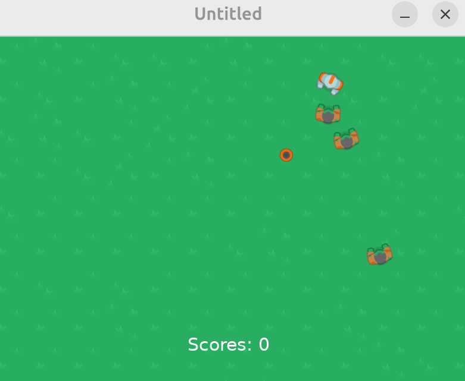

### Quiz 3: Game #2 Skills Assessment

### 48. Game #2 Coding Challenge
- Implement injured state
  - Life of 3 or 5
  - Different color per available lives

## Section 5: Game #3: Platformer

### 49. Platformer Overview
- Using love.physics
- At the project folder: `git clone https://github.com/a327ex/windfield.git`

### 50. Physics
- Collider: dynamic, static, kinematic
```lua
function love.load()
  wf = require 'windfield/windfield'
  world = wf.newWorld(0,100) -- 100 gravity to y axis
  player = world:newRectangleCollider(360,100,80,80) -- dynamic collider
  platform = world:newRectangleCollider(250,400,300,100)
  platform:setType('static') -- static collider
end
function love.update(dt)
  world:update(dt)
end
function love.draw()
  world:draw()
end
```
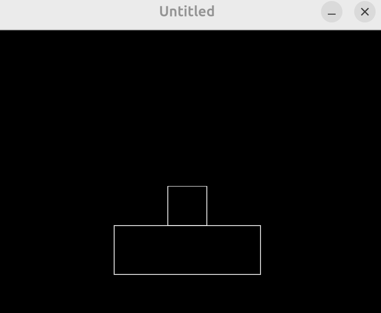

### 51. Moving and Jumping
- https://love2d.org/wiki/Body:applyLinearImpulse
```lua
function love.load()
  wf = require 'windfield/windfield'
  world = wf.newWorld(0,800)
  player = world:newRectangleCollider(360,100,80,80) -- dynamic collider
  player.speed = 240 -- max at 60FPS
  platform = world:newRectangleCollider(250,400,300,100)
  platform:setType('static') -- static collider
end
function love.update(dt)
  world:update(dt)
  local px,py = player:getPosition()
  if love.keyboard.isDown('right') then
    player:setX(px + player.speed*dt)
  end
  if love.keyboard.isDown('left') then
    player:setX(px - player.speed*dt)
  end
end
function love.draw()
  world:draw()
end
function love.keypressed(key)
  if key == 'up' then
    player:applyLinearImpulse(0, -7000)
  end
end
```
- As gravity is given as 800, up button will give impulse and jump but will come down due to the gravity

### 52. Collision Classes
- `world:addCollisionClass('Player',{ignores = {'Platform'}})`
  - Player glass objects will ignore (pass through) Platform objects
- https://github.com/a327ex/windfield#newworldxg-yg-sleep
  - Object sleep: physically an object must fall when it comes out of a platform, but it stays floating
  - To break such floating, enable the option  of sleep in wf.newWorld() as false
```lua
function love.load()
  wf = require 'windfield/windfield'
  world = wf.newWorld(0,800, false) 
  world:addCollisionClass('Platform')
  world:addCollisionClass('Player'--[[,{ignores = {'Platform'}}]])
  player = world:newRectangleCollider(360,100,80,80, {collision_class = "Player"})
  player:setFixedRotation(true) -- avoid the object rotation when it falls from the edge of a platform
  player.speed = 240 -- max at 60FPS
  platform = world:newRectangleCollider(250,400,300,100, {collision_class = "Platform"})
  platform:setType('static') -- static collider
  dangerZone = world:newRectangleCollider(0,550,800,50, {collision_class = "Danger"})
  dangerZone:setType('static')
end
function love.update(dt)
  world:update(dt)
  if player.body then
    local px,py = player:getPosition()
    if love.keyboard.isDown('right') then
      player:setX(px + player.speed*dt)
    end
    if love.keyboard.isDown('left') then
      player:setX(px - player.speed*dt)
    end
    if player:enter('Danger',collision) then -- not working?
      player:destroy()
    end
  end
end
function love.draw()
  world:draw()
end
function love.keypressed(key)
  if key == 'up' then
    player:applyLinearImpulse(0, -7000)
  end
end
```

### 53. Querying for Colliders
- Select objects using world:queryCircleArea()
  - Then destroy them

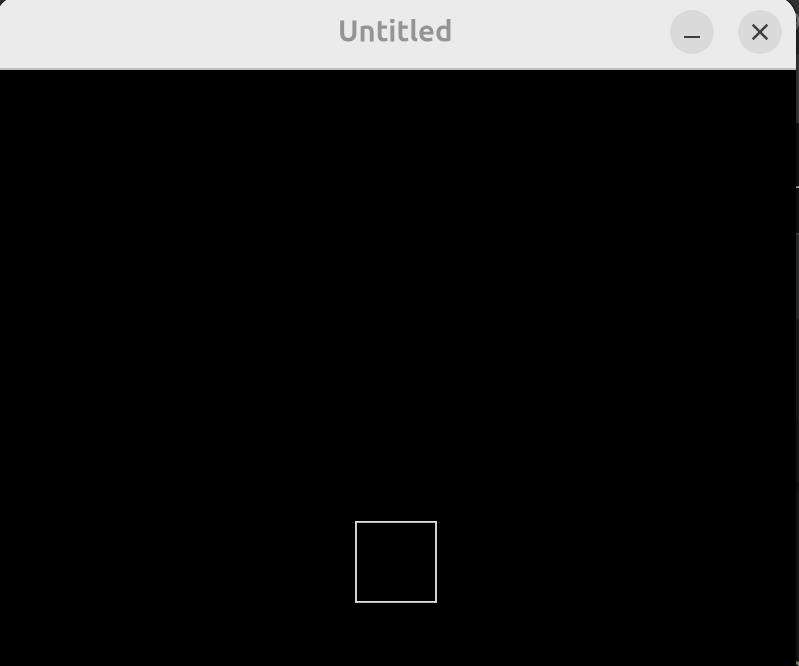

- How to avoid the jump in the air?
  - Check if there is any collision when a button is clicked
```lua
function love.load()
  wf = require 'windfield/windfield'
  world = wf.newWorld(0,800, false) 
  world:setQueryDebugDrawing(true)
  world:addCollisionClass('Platform')
  world:addCollisionClass('Player')
  world:addCollisionClass('Danger')
  player = world:newRectangleCollider(360,100,80,80, {collision_class = "Player"})
  player:setFixedRotation(true) -- avoid the object rotation when it falls from the edge of a platform
  player.speed = 240 -- max at 60FPS
  platform = world:newRectangleCollider(250,400,300,100, {collision_class = "Platform"})
  platform:setType('static') -- static collider
  dangerZone = world:newRectangleCollider(0,550,800,50, {collision_class = 'Danger'})
  dangerZone:setType('static')
end
function love.update(dt)
  world:update(dt)
  if player.body then
    local px,py = player:getPosition()
    if love.keyboard.isDown('right') then
      player:setX(px + player.speed*dt)
    end
    if love.keyboard.isDown('left') then
      player:setX(px - player.speed*dt)
    end
    if player:enter('Danger') then
      player:destroy()
    end
  end
end
function love.draw()
  world:draw()  
end
function love.keypressed(key)
  if key == 'up' then
    local colliders = world:queryRectangleArea(player:getX()-40, player:getY()+40, 80, 2, {'Platform'})
    if #colliders > 0 then -- avoid jump in the air
      player:applyLinearImpulse(0, -7000)
    end
  end
end
function love.mousepressed(x,y,button)
  if button == 1 then
    local colliders = world:queryCircleArea(x,y,200, {'Platform', 'Danger'})
    for i,c in ipairs(colliders) do 
      c:destroy()      
    end
  end
end
```

### 54. Animations
- We do not use animated gif/png or many files
  - A large png contains the motions of many snapshots
  - Those motions must be separated with equi-distances
  - Along x-y pixels so we can handle them like columns by rows
- git clone https://github.com/kikito/anim8.git
```lua
function love.load()
  anim8 = require 'anim8/anim8'
  sprites = {}
  sprites.playerSheet = love.graphics.newImage('sprites/playerSheet.png') -- 9210x1692
  local grid = anim8.newGrid(614,564,sprites.playerSheet:getWidth(),sprites.playerSheet:getHeight()) -- 15 columns x 3 rows images
  animations = {}
  animations.idle = anim8.newAnimation(grid('1-15',1), 0.05) -- 1-15 colums of row 1, 0.1 frames per sec
  animations.jump = anim8.newAnimation(grid('1-7',2), 0.05)
  animations.run = anim8.newAnimation(grid('1-15',3), 0.05)
  wf = require 'windfield/windfield'
  world = wf.newWorld(0,800, false) 
  world:setQueryDebugDrawing(true)
  world:addCollisionClass('Platform')
  world:addCollisionClass('Player')
  world:addCollisionClass('Danger')
  player = world:newRectangleCollider(360,100,80,80, {collision_class = "Player"})
  player:setFixedRotation(true) -- avoid the object rotation when it falls from the edge of a platform
  player.speed = 240 -- max at 60FPS
  player.animation = animations.run
  platform = world:newRectangleCollider(250,400,300,100, {collision_class = "Platform"})
  platform:setType('static') -- static collider
  dangerZone = world:newRectangleCollider(0,550,800,50, {collision_class = 'Danger'})
  dangerZone:setType('static')
end
function love.update(dt)
  world:update(dt)
  if player.body then
    local px,py = player:getPosition()
    if love.keyboard.isDown('right') then
      player:setX(px + player.speed*dt)
    end
    if love.keyboard.isDown('left') then
      player:setX(px - player.speed*dt)
    end
    if player:enter('Danger') then
      player:destroy()
    end
  end
  player.animation:update(dt)
end
function love.draw()
  world:draw()  
  player.animation:draw(sprites.playerSheet,0,0)
end
function love.keypressed(key)
  if key == 'up' then
    local colliders = world:queryRectangleArea(player:getX()-40, player:getY()+40, 80, 2, {'Platform'})
    if #colliders > 0 then -- avoid jump in the air
      player:applyLinearImpulse(0, -7000)
    end
  end
end
function love.mousepressed(x,y,button)
  if button == 1 then
    local colliders = world:queryCircleArea(x,y,200, {'Platform', 'Danger'})
    for i,c in ipairs(colliders) do 
      c:destroy()      
    end
  end
end
```
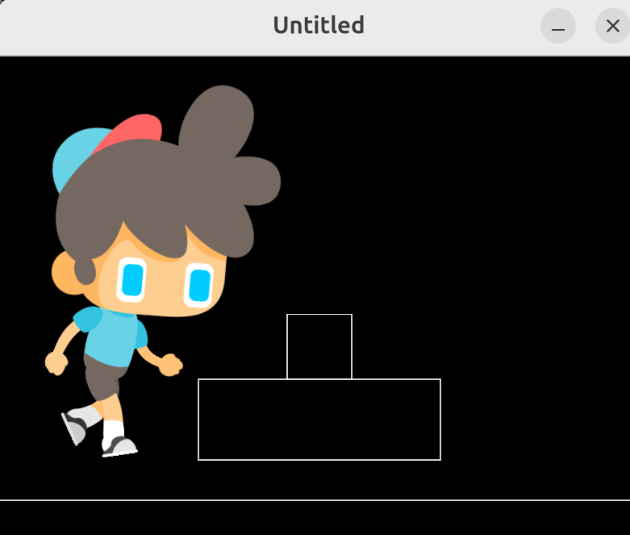

### 55. Player Graphics
- When the size (area) of collider decreases, the mass decreases too - higher jump 
```lua
function love.load()
  anim8 = require 'anim8/anim8'
  sprites = {}
  sprites.playerSheet = love.graphics.newImage('sprites/playerSheet.png') -- 9210x1692
  local grid = anim8.newGrid(614,564,sprites.playerSheet:getWidth(),sprites.playerSheet:getHeight()) -- 15 columns x 3 rows images
  animations = {}
  animations.idle = anim8.newAnimation(grid('1-15',1), 0.05) -- 1-15 colums of row 1, 0.1 frames per sec
  animations.jump = anim8.newAnimation(grid('1-7',2), 0.05)
  animations.run = anim8.newAnimation(grid('1-15',3), 0.05)
  wf = require 'windfield/windfield'
  world = wf.newWorld(0,800, false) 
  world:setQueryDebugDrawing(true)
  world:addCollisionClass('Platform')
  world:addCollisionClass('Player')
  world:addCollisionClass('Danger')
  player = world:newRectangleCollider(360,100,40,100, {collision_class = "Player"})
  player:setFixedRotation(true) -- avoid the object rotation when it falls from the edge of a platform
  player.speed = 240 -- max at 60FPS
  player.animation = animations.idle
  platform = world:newRectangleCollider(250,400,300,100, {collision_class = "Platform"})
  platform:setType('static') -- static collider
  dangerZone = world:newRectangleCollider(0,550,800,50, {collision_class = 'Danger'})
  dangerZone:setType('static')
end
function love.update(dt)
  world:update(dt)
  if player.body then
    local px,py = player:getPosition()
    if love.keyboard.isDown('right') then
      player:setX(px + player.speed*dt)
    end
    if love.keyboard.isDown('left') then
      player:setX(px - player.speed*dt)
    end
    if player:enter('Danger') then
      player:destroy()
    end
  end
  player.animation:update(dt)
end
function love.draw()
  world:draw()  
  local px,py = player:getPosition()
  player.animation:draw(sprites.playerSheet,px,py, nil, 0.25, nil, 130,300)
end
function love.keypressed(key)
  if key == 'up' then
    local colliders = world:queryRectangleArea(player:getX()-20, player:getY()+50, 40, 2, {'Platform'})
    if #colliders > 0 then -- avoid jump in the air
      player:applyLinearImpulse(0, -4000)
    end
  end
end
function love.mousepressed(x,y,button)
  if button == 1 then
    local colliders = world:queryCircleArea(x,y,200, {'Platform', 'Danger'})
    for i,c in ipairs(colliders) do 
      c:destroy()      
    end
  end
end
```
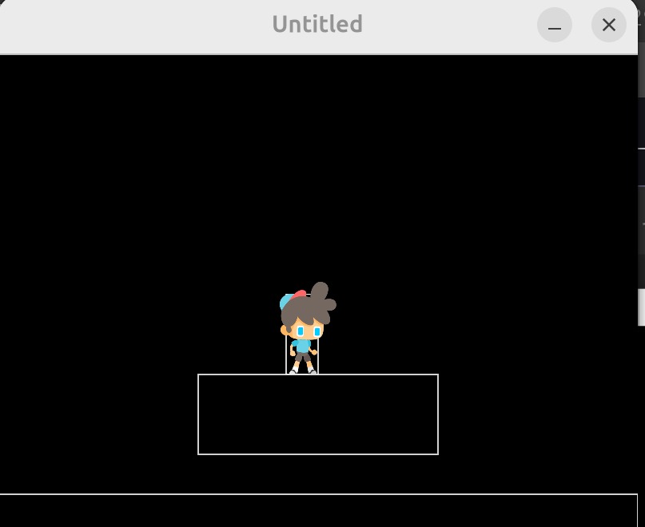

### 56. Changing Between Animations
- How to change from idle to run or jump
```lua
function love.update(dt)
  world:update(dt)
  if player.body then
    player.isMoving = false -- default value
    local px,py = player:getPosition()
    if love.keyboard.isDown('right') then
      player:setX(px + player.speed*dt)
      player.isMoving = true
    end
    if love.keyboard.isDown('left') then
      player:setX(px - player.speed*dt)
      player.isMoving = true
    end
    if player:enter('Danger') then
      player:destroy()
    end
  end
  if player.isMoving then
    player.animation = animations.run
  else
    player.animation = animations.idle
  end
  player.animation:update(dt)
end
function love.draw()
  world:draw()  
  local px,py = player:getPosition()
  player.animation:draw(sprites.playerSheet,px,py, nil, 0.25, nil, 130,300)
end
```

### 57. Player Direction (Flipping the Animation)
- Mirroring images when the direction changes
  - Change scaling value as negative or positive
```lua
function love.draw()
  world:draw()  
  local px,py = player:getPosition()
  player.animation:draw(sprites.playerSheet,px,py, nil, 0.25*player.direction, 0.25, 130,300)
end
```

### 58. Jump Animation
```lua
function love.update(dt)
  world:update(dt)
  if player.body then
    local colliders = world:queryRectangleArea(player:getX()-20, player:getY()+50, 40, 2, {'Platform'})    
    if #colliders > 0 then
      player.grounded = true
    else
      player.grounded = false
    end
    player.isMoving = false -- default value
    local px,py = player:getPosition()
    if love.keyboard.isDown('right') then
      player:setX(px + player.speed*dt)
      player.isMoving = true
      player.direction = 1
    end
    if love.keyboard.isDown('left') then
      player:setX(px - player.speed*dt)
      player.isMoving = true
      player.direction = -1
    end
    if player:enter('Danger') then
      player:destroy()
    end
  end
  if player.grounded then
    if player.isMoving then
      player.animation = animations.run
    else
      player.animation = animations.idle
    end
  else
    player.animation = animations.jump
  end
  player.animation:update(dt)
end
...
function love.keypressed(key)
  if key == 'up' then
    if player.grounded then
      player:applyLinearImpulse(0, -4000)
    end
  end
end
```
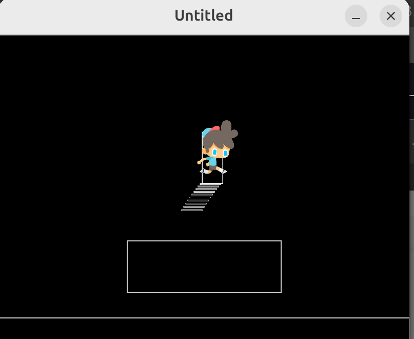

### 59. Multiple Lua Files
- player.lua:
```lua
player = world:newRectangleCollider(360,100,40,100, {collision_class = "Player"})
player:setFixedRotation(true) -- avoid the object rotation when it falls from the edge of a platform
player.speed = 240 -- max at 60FPS
player.animation = animations.idle
player.isMoving = false
player.direction = 1
player.grounded = true
  
function playerUpdate(dt)
  if player.body then
    local colliders = world:queryRectangleArea(player:getX()-20, player:getY()+50, 40, 2, {'Platform'})    
    if #colliders > 0 then
      player.grounded = true
    else
      player.grounded = false
    end
    player.isMoving = false -- default value
    local px,py = player:getPosition()
    if love.keyboard.isDown('right') then
      player:setX(px + player.speed*dt)
      player.isMoving = true
      player.direction = 1
    end
    if love.keyboard.isDown('left') then
      player:setX(px - player.speed*dt)
      player.isMoving = true
      player.direction = -1
    end
    if player:enter('Danger') then
      player:destroy()
    end
  end
  if player.grounded then
    if player.isMoving then
      player.animation = animations.run
    else
      player.animation = animations.idle
    end
  else
    player.animation = animations.jump
  end
  player.animation:update(dt)
end 
function drawPlayer()
  local px,py = player:getPosition()
  player.animation:draw(sprites.playerSheet,px,py, nil, 0.25*player.direction, 0.25, 130,300)
end
```
- main.lua:
```lua
function love.load()
  anim8 = require 'anim8/anim8'
  sprites = {}
  sprites.playerSheet = love.graphics.newImage('sprites/playerSheet.png') -- 9210x1692
  local grid = anim8.newGrid(614,564,sprites.playerSheet:getWidth(),sprites.playerSheet:getHeight()) -- 15 columns x 3 rows images
  animations = {}
  animations.idle = anim8.newAnimation(grid('1-15',1), 0.05) -- 1-15 colums of row 1, 0.1 frames per sec
  animations.jump = anim8.newAnimation(grid('1-7',2), 0.05)
  animations.run = anim8.newAnimation(grid('1-15',3), 0.05)
  wf = require 'windfield/windfield'
  world = wf.newWorld(0,800, false) 
  world:setQueryDebugDrawing(true)
  world:addCollisionClass('Platform')
  world:addCollisionClass('Player')
  world:addCollisionClass('Danger')
  require('player')
  platform = world:newRectangleCollider(250,400,300,100, {collision_class = "Platform"})
  platform:setType('static') -- static collider
  dangerZone = world:newRectangleCollider(0,550,800,50, {collision_class = 'Danger'})
  dangerZone:setType('static')
end
function love.update(dt)
  world:update(dt)
  playerUpdate(dt)
end
function love.draw()
  world:draw()  
  drawPlayer()
end
function love.keypressed(key)
  if key == 'up' then
    if player.grounded then
      player:applyLinearImpulse(0, -4000)
    end
  end
end
function love.mousepressed(x,y,button)
  if button == 1 then
    local colliders = world:queryCircleArea(x,y,200, {'Platform', 'Danger'})
    for i,c in ipairs(colliders) do 
      c:destroy()      
    end
  end
end
```

### 60. Tiled
- Default Love2D screen: 800x600 
  - In love.load(), use `love.window.setMode()` to change the size
- Level design: https://www.mapeditor.org/

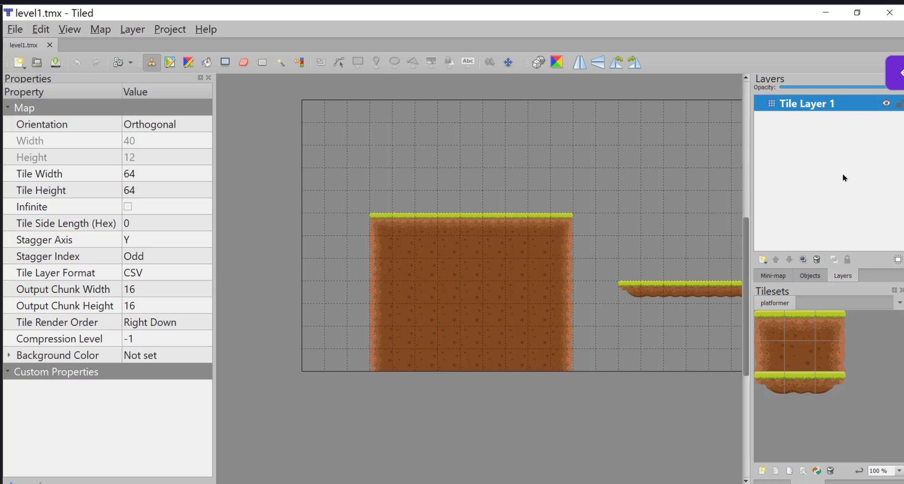

### 61. Import Tiled Map to LÖVE
- Export mapfile as lua
- git clone https://github.com/karai17/Simple-Tiled-Implementation
- When map editor is not available, download maps folder from the github

### 62. Spawning Objects from Tiled
- main.lua:
```lua
function love.load()
  love.window.setMode(1000,800)
  anim8 = require 'anim8/anim8'
  sti = require 'Simple-Tiled-Implementation/sti'
  sprites = {}
  sprites.playerSheet = love.graphics.newImage('sprites/playerSheet.png') -- 9210x1692
  local grid = anim8.newGrid(614,564,sprites.playerSheet:getWidth(),sprites.playerSheet:getHeight()) -- 15 columns x 3 rows images
  animations = {}
  animations.idle = anim8.newAnimation(grid('1-15',1), 0.05) -- 1-15 colums of row 1, 0.1 frames per sec
  animations.jump = anim8.newAnimation(grid('1-7',2), 0.05)
  animations.run = anim8.newAnimation(grid('1-15',3), 0.05)
  wf = require 'windfield/windfield'
  world = wf.newWorld(0,800, false) 
  world:setQueryDebugDrawing(true)
  world:addCollisionClass('Platform')
  world:addCollisionClass('Player')
  world:addCollisionClass('Danger')
  require('player')
  -- dangerZone = world:newRectangleCollider(0,550,800,50, {collision_class = 'Danger'})
  -- dangerZone:setType('static')
  platforms = {}
  loadMap()
end
function love.update(dt)
  world:update(dt)
  gameMap:update(dt)
  playerUpdate(dt)
end
function love.draw()
  gameMap:drawLayer(gameMap.layers["Tile Layer 1"])
  world:draw()  
  drawPlayer()
end
function love.keypressed(key)
  if key == 'up' then
    if player.grounded then
      player:applyLinearImpulse(0, -4000)
    end
  end
end
function love.mousepressed(x,y,button)
  if button == 1 then
    local colliders = world:queryCircleArea(x,y,200, {'Platform', 'Danger'})
    for i,c in ipairs(colliders) do 
      c:destroy()      
    end
  end
end
function spawnPlatform(x,y,width,height)
  if width > 0 and height > 0 then
    local platform = world:newRectangleCollider(x,y,width,height, {collision_class = "Platform"})
    platform:setType('static')
    table.insert(platforms,platform)
  end
end
function loadMap()
  gameMap = sti("maps/level1.lua")
  for i, obj in pairs(gameMap.layers["Platforms"].objects) do
    spawnPlatform(obj.x, obj.y, obj.width, obj.height)
  end
end
```
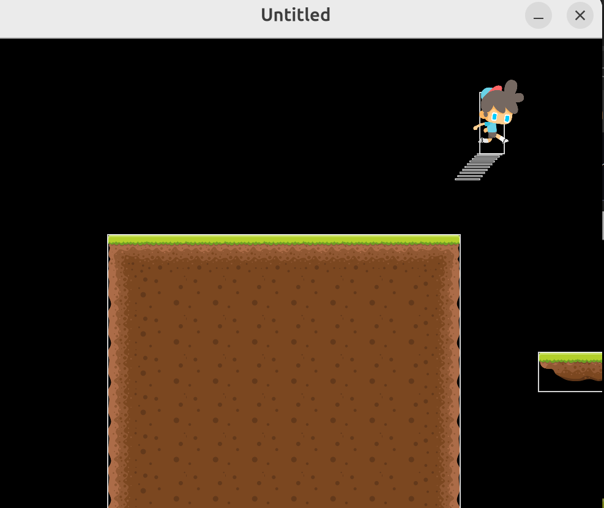

### 63. Camera
- git clone https://github.com/vrld/hump
- main.lua:
```lua
function love.load()
  love.window.setMode(1000,800)
  anim8 = require 'anim8/anim8'
  sti = require 'Simple-Tiled-Implementation/sti'
  cameraFile = require 'hump/camera'
  cam = cameraFile()
  sprites = {}
  sprites.playerSheet = love.graphics.newImage('sprites/playerSheet.png') -- 9210x1692
  local grid = anim8.newGrid(614,564,sprites.playerSheet:getWidth(),sprites.playerSheet:getHeight()) -- 15 columns x 3 rows images
  animations = {}
  animations.idle = anim8.newAnimation(grid('1-15',1), 0.05) -- 1-15 colums of row 1, 0.1 frames per sec
  animations.jump = anim8.newAnimation(grid('1-7',2), 0.05)
  animations.run = anim8.newAnimation(grid('1-15',3), 0.05)
  wf = require 'windfield/windfield'
  world = wf.newWorld(0,800, false) 
  world:setQueryDebugDrawing(true)
  world:addCollisionClass('Platform')
  world:addCollisionClass('Player')
  world:addCollisionClass('Danger')
  require('player')
  -- dangerZone = world:newRectangleCollider(0,550,800,50, {collision_class = 'Danger'})
  -- dangerZone:setType('static')
  platforms = {}
  loadMap()
end
function love.update(dt)
  world:update(dt)
  gameMap:update(dt)
  playerUpdate(dt)
  local px,py = player:getPosition()
  cam:lookAt(px,love.graphics.getHeight()/2) -- fix y-axis camaera
end
function love.draw()
  cam:attach()
    gameMap:drawLayer(gameMap.layers["Tile Layer 1"])
    world:draw()  
    drawPlayer()
  cam:detach()  
end
function love.keypressed(key)
  if key == 'up' then
    if player.grounded then
      player:applyLinearImpulse(0, -4000)
    end
  end
end
function love.mousepressed(x,y,button)
  if button == 1 then
    local colliders = world:queryCircleArea(x,y,200, {'Platform', 'Danger'})
    for i,c in ipairs(colliders) do 
      c:destroy()      
    end
  end
end
function spawnPlatform(x,y,width,height)
  if width > 0 and height > 0 then
    local platform = world:newRectangleCollider(x,y,width,height, {collision_class = "Platform"})
    platform:setType('static')
    table.insert(platforms,platform)
  end
end
function loadMap()
  gameMap = sti("maps/level1.lua")
  for i, obj in pairs(gameMap.layers["Platforms"].objects) do
    spawnPlatform(obj.x, obj.y, obj.width, obj.height)
  end
end
```
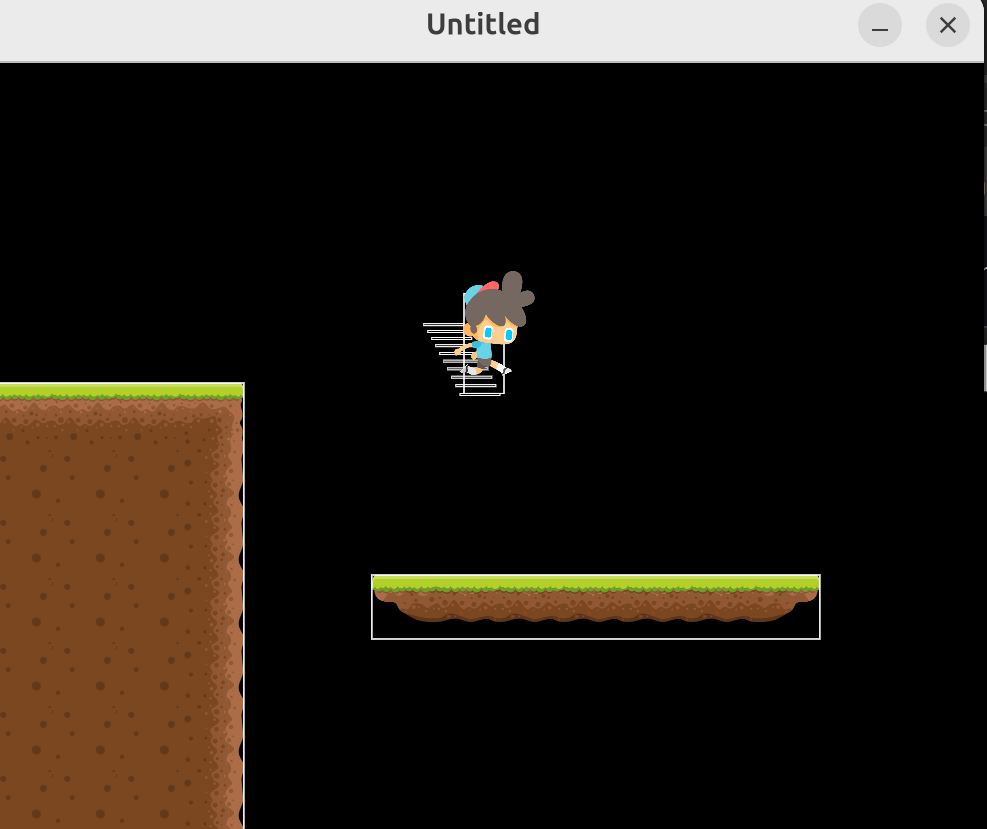

### 64. Platformer Enemies
- enemy.lua:
```lua
enemies = {}
function spawnEnemy(x,y)
  local enemy = world:newRectangleCollider(x,y,70,90, {collision_class='Danger'})
  enemy.direction = 1
  enemy.speed = 200
  enemy.animation = animations.enemy
  table.insert(enemies,enemy)  
end
function updateEnemies(dt)
  for i,e in ipairs(enemies) do
    e.animation:update(dt)
    local ex, ey = e:getPosition()
    local colliders = world:queryRectangleArea(ex + (40*e.direction), ey+40, 10, 10, {'Platform'})
    if #colliders == 0  then
      e.direction = e.direction * -1
    end
    e:setX(ex + e.speed*dt*e.direction)
  end
end
function drawEnemies()
  for i,e in ipairs(enemies) do
    local ex,ey = e:getPosition()
    e.animation:draw(sprites.enemySheet, ex,ey, nil, e.direction, 1, 50, 65)
  end
end
```
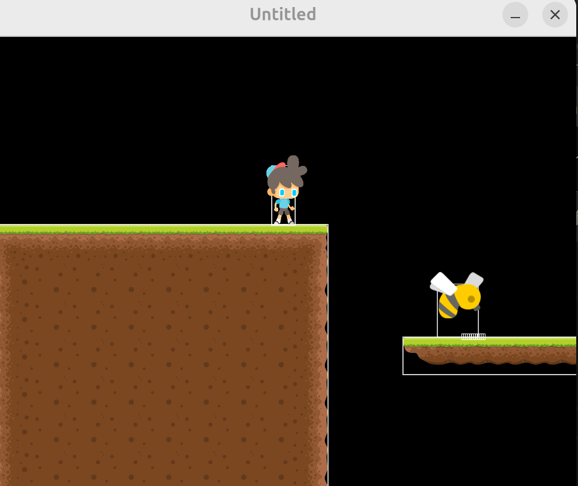

### 65. Transitioning Between Levels
- Designing level 2
  - How to move from level 1 to level 2?
  - Destroy current platforms/enemies then loadMap again with different level
- main.lua:
```lua
function love.load()
  love.window.setMode(1000,800)
  anim8 = require 'anim8/anim8'
  sti = require 'Simple-Tiled-Implementation/sti'
  cameraFile = require 'hump/camera'
  cam = cameraFile()
  sprites = {}
  sprites.playerSheet = love.graphics.newImage('sprites/playerSheet.png') -- 9210x1692
  sprites.enemySheet = love.graphics.newImage('sprites/enemySheet.png') -- 200x79
  local grid = anim8.newGrid(614,564,sprites.playerSheet:getWidth(),sprites.playerSheet:getHeight()) -- 15 columns x 3 rows images
  local enemyGrid = anim8.newGrid(100,79, sprites.enemySheet:getWidth(), sprites.enemySheet:getHeight())
  animations = {}
  animations.idle = anim8.newAnimation(grid('1-15',1), 0.05) -- 1-15 colums of row 1, 0.1 frames per sec
  animations.jump = anim8.newAnimation(grid('1-7',2), 0.05)
  animations.run = anim8.newAnimation(grid('1-15',3), 0.05)
  animations.enemy = anim8.newAnimation(enemyGrid('1-2',1), 0.03)
  wf = require 'windfield/windfield'
  world = wf.newWorld(0,800, false) 
  world:setQueryDebugDrawing(true)
  world:addCollisionClass('Platform')
  world:addCollisionClass('Player')
  world:addCollisionClass('Danger')
  require('player')
  require('enemy')
  -- dangerZone = world:newRectangleCollider(0,550,800,50, {collision_class = 'Danger'})
  -- dangerZone:setType('static')
  platforms = {}
  flagX = 0
  flagY = 0
  currentLevel = "level1"
  loadMap(currentLevel)  
end
function love.update(dt)
  world:update(dt)
  gameMap:update(dt)
  playerUpdate(dt)
  updateEnemies(dt)
  local px,py = player:getPosition()
  cam:lookAt(px,love.graphics.getHeight()/2) -- fix y-axis camaera
  local colliders = world:queryCircleArea(flagX,flagY,10,{'Player'})
  if #colliders > 0 then
    if currentLevel == 'level1' then
      loadMap('level2')
    elseif currentLevel == 'level2' then
      loadMap('level1')
    end
  end
end
function love.draw()
  cam:attach()
    gameMap:drawLayer(gameMap.layers["Tile Layer 1"])
    world:draw()  
    drawPlayer()
    drawEnemies()
  cam:detach()  
end
function love.keypressed(key)
  if key == 'up' then
    if player.grounded then
      player:applyLinearImpulse(0, -4000)
    end
  end
  if key == 'r' then
    loadMap("level2")
  end
end
function love.mousepressed(x,y,button)
  if button == 1 then
    local colliders = world:queryCircleArea(x,y,200, {'Platform', 'Danger'})
    for i,c in ipairs(colliders) do 
      c:destroy()      
    end
  end
end
function spawnPlatform(x,y,width,height)
  if width > 0 and height > 0 then
    local platform = world:newRectangleCollider(x,y,width,height, {collision_class = "Platform"})
    platform:setType('static')
    table.insert(platforms,platform)
  end
end
function destroyAll()
  -- When we move from Level 1 to Level 2, we destroy Level 1 objects
  local i = #platforms
  while i >  -1 do
    if platforms[i] ~= nil then
      platforms[i]:destroy()
    end
    table.remove(platforms,i)
    i = i - 1
  end
  local i = #enemies
  while i >  -1 do
    if enemies[i] ~= nil then
      enemies[i]:destroy()
    end
    table.remove(enemies,i)
    i = i - 1
  end
end
function loadMap(mapName)
  currentLevel = mapName
  destroyAll()
  player:setPosition(300,100)
  gameMap = sti("maps/" .. mapName .. ".lua") -- concatenate file name using an argument
  for i, obj in pairs(gameMap.layers["Platforms"].objects) do
    spawnPlatform(obj.x, obj.y, obj.width, obj.height)
  end
  for i, obj in pairs(gameMap.layers["Enemies"].objects) do
    spawnEnemy(obj.x, obj.y)
  end
  for i, obj in pairs(gameMap.layers["Flag"].objects) do
    flagX = obj.x
    flagY = obj.y
  end
end
```

### 66. Saving Data
- Serializing data using show.lua
- show.lua:
```lua
--[[
   Author: Julio Manuel Fernandez-Diaz
   Date:   January 12, 2007
   (For Lua 5.1)
   Modified slightly by RiciLake to avoid the unnecessary table traversal in tablecount()
   Formats tables with cycles recursively to any depth.
   The output is returned as a string.
   References to other tables are shown as values.
   Self references are indicated.
   The string returned is "Lua code", which can be procesed
   (in the case in which indent is composed by spaces or "--").
   Userdata and function keys and values are shown as strings,
   which logically are exactly not equivalent to the original code.
   This routine can serve for pretty formating tables with
   proper indentations, apart from printing them:
      print(table.show(t, "t"))   -- a typical use
   Heavily based on "Saving tables with cycles", PIL2, p. 113.
   Arguments:
      t is the table.
      name is the name of the table (optional)
      indent is a first indentation (optional).
--]]
function table.show(t, name, indent)
    local cart     -- a container
    local autoref  -- for self references
 
    --[[ counts the number of elements in a table
    local function tablecount(t)
       local n = 0
       for _, _ in pairs(t) do n = n+1 end
       return n
    end
    ]]
    -- (RiciLake) returns true if the table is empty
    local function isemptytable(t) return next(t) == nil end
 
    local function basicSerialize (o)
       local so = tostring(o)
       if type(o) == "function" then
          local info = debug.getinfo(o, "S")
          -- info.name is nil because o is not a calling level
          if info.what == "C" then
             return string.format("%q", so .. ", C function")
          else
             -- the information is defined through lines
             return string.format("%q", so .. ", defined in (" ..
                 info.linedefined .. "-" .. info.lastlinedefined ..
                 ")" .. info.source)
          end
       elseif type(o) == "number" or type(o) == "boolean" then
          return so
       else
          return string.format("%q", so)
       end
    end
 
    local function addtocart (value, name, indent, saved, field)
       indent = indent or ""
       saved = saved or {}
       field = field or name
 
       cart = cart .. indent .. field
 
       if type(value) ~= "table" then
          cart = cart .. " = " .. basicSerialize(value) .. ";\n"
       else
          if saved[value] then
             cart = cart .. " = {}; -- " .. saved[value]
                         .. " (self reference)\n"
             autoref = autoref ..  name .. " = " .. saved[value] .. ";\n"
          else
             saved[value] = name
             --if tablecount(value) == 0 then
             if isemptytable(value) then
                cart = cart .. " = {};\n"
             else
                cart = cart .. " = {\n"
                for k, v in pairs(value) do
                   k = basicSerialize(k)
                   local fname = string.format("%s[%s]", name, k)
                   field = string.format("[%s]", k)
                   -- three spaces between levels
                   addtocart(v, fname, indent .. "   ", saved, field)
                end
                cart = cart .. indent .. "};\n"
             end
          end
       end
    end
 
    name = name or "__unnamed__"
    if type(t) ~= "table" then
       return name .. " = " .. basicSerialize(t)
    end
    cart, autoref = "", ""
    addtocart(t, name, indent)
    return cart .. autoref
 end
```s
- https://love2d.org/wiki/love.filesystem
  - In Linux, Love2d will save files at `~/.local/share/love` folder
- main.lua:
```lua
function love.load()
  love.window.setMode(1000,800)
  anim8 = require 'anim8/anim8'
  sti = require 'Simple-Tiled-Implementation/sti'
  cameraFile = require 'hump/camera'
  cam = cameraFile()
  sprites = {}
  sprites.playerSheet = love.graphics.newImage('sprites/playerSheet.png') -- 9210x1692
  sprites.enemySheet = love.graphics.newImage('sprites/enemySheet.png') -- 200x79
  local grid = anim8.newGrid(614,564,sprites.playerSheet:getWidth(),sprites.playerSheet:getHeight()) -- 15 columns x 3 rows images
  local enemyGrid = anim8.newGrid(100,79, sprites.enemySheet:getWidth(), sprites.enemySheet:getHeight())
  animations = {}
  animations.idle = anim8.newAnimation(grid('1-15',1), 0.05) -- 1-15 colums of row 1, 0.1 frames per sec
  animations.jump = anim8.newAnimation(grid('1-7',2), 0.05)
  animations.run = anim8.newAnimation(grid('1-15',3), 0.05)
  animations.enemy = anim8.newAnimation(enemyGrid('1-2',1), 0.03)
  wf = require 'windfield/windfield'
  world = wf.newWorld(0,800, false) 
  world:setQueryDebugDrawing(true)
  world:addCollisionClass('Platform')
  world:addCollisionClass('Player')
  world:addCollisionClass('Danger')
  require('player')
  require('enemy')
  require('show')
  -- dangerZone = world:newRectangleCollider(0,550,800,50, {collision_class = 'Danger'})
  -- dangerZone:setType('static')
  platforms = {}
  flagX = 0
  flagY = 0
  saveData = {}
  saveData.currentLevel = "level1"
  if love.filesystem.getInfo("data.lua") then
    local data = love.filesystem.load("data.lua")
    data() -- activate the loaded data
  end
  loadMap(saveData.currentLevel)  
end
function love.update(dt)
  world:update(dt)
  gameMap:update(dt)
  playerUpdate(dt)
  updateEnemies(dt)
  local px,py = player:getPosition()
  cam:lookAt(px,love.graphics.getHeight()/2) -- fix y-axis camaera
  local colliders = world:queryCircleArea(flagX,flagY,10,{'Player'})
  if #colliders > 0 then
    if saveData.currentLevel == 'level1' then
      loadMap('level2')
    elseif saveData.currentLevel == 'level2' then
      loadMap('level1')
    end
  end
end
function love.draw()
  cam:attach()
    gameMap:drawLayer(gameMap.layers["Tile Layer 1"])
    world:draw()  
    drawPlayer()
    drawEnemies()
  cam:detach()  
end
function love.keypressed(key)
  if key == 'up' then
    if player.grounded then
      player:applyLinearImpulse(0, -4000)
    end
  end
end
function love.mousepressed(x,y,button)
  if button == 1 then
    local colliders = world:queryCircleArea(x,y,200, {'Platform', 'Danger'})
    for i,c in ipairs(colliders) do 
      c:destroy()      
    end
  end
end
function spawnPlatform(x,y,width,height)
  if width > 0 and height > 0 then
    local platform = world:newRectangleCollider(x,y,width,height, {collision_class = "Platform"})
    platform:setType('static')
    table.insert(platforms,platform)
  end
end
function destroyAll()
  -- When we move from Level 1 to Level 2, we destroy Level 1 objects
  local i = #platforms
  while i >  -1 do
    if platforms[i] ~= nil then
      platforms[i]:destroy()
    end
    table.remove(platforms,i)
    i = i - 1
  end
  local i = #enemies
  while i >  -1 do
    if enemies[i] ~= nil then
      enemies[i]:destroy()
    end
    table.remove(enemies,i)
    i = i - 1
  end
end
function loadMap(mapName)
  saveData.currentLevel = mapName
  love.filesystem.write("data.lua", table.show(saveData, "saveData"))
  destroyAll()
  player:setPosition(300,100)
  gameMap = sti("maps/" .. mapName .. ".lua") -- concatenate file name using an argument
  for i, obj in pairs(gameMap.layers["Platforms"].objects) do
    spawnPlatform(obj.x, obj.y, obj.width, obj.height)
  end
  for i, obj in pairs(gameMap.layers["Enemies"].objects) do
    spawnEnemy(obj.x, obj.y)
  end
  for i, obj in pairs(gameMap.layers["Flag"].objects) do
    flagX = obj.x
    flagY = obj.y
  end

end
```
- Running love from VScode may not rewrite data.lua
  - Run standalone as `love .` then you can monitor that the content of data.lua changes by touching the flag

### 67. Music and Sounds
- wave/mp3 are from opengameart.org
- main.lua:
```lua
function love.load()
  love.window.setMode(1000,800)
  anim8 = require 'anim8/anim8'
  sti = require 'Simple-Tiled-Implementation/sti'
  cameraFile = require 'hump/camera'
  cam = cameraFile()
  sounds = {}
  sounds.jump = love.audio.newSource("audio/jump.wav",'static')
  sounds.music = love.audio.newSource("audio/music.mp3",'stream')
  sounds.music:setLooping(true)
  sounds.music:play()
  sprites = {}
  sprites.playerSheet = love.graphics.newImage('sprites/playerSheet.png') -- 9210x1692
  sprites.enemySheet = love.graphics.newImage('sprites/enemySheet.png') -- 200x79
  local grid = anim8.newGrid(614,564,sprites.playerSheet:getWidth(),sprites.playerSheet:getHeight()) -- 15 columns x 3 rows images
  local enemyGrid = anim8.newGrid(100,79, sprites.enemySheet:getWidth(), sprites.enemySheet:getHeight())
  animations = {}
  animations.idle = anim8.newAnimation(grid('1-15',1), 0.05) -- 1-15 colums of row 1, 0.1 frames per sec
  animations.jump = anim8.newAnimation(grid('1-7',2), 0.05)
  animations.run = anim8.newAnimation(grid('1-15',3), 0.05)
  animations.enemy = anim8.newAnimation(enemyGrid('1-2',1), 0.03)
  wf = require 'windfield/windfield'
  world = wf.newWorld(0,800, false) 
  world:setQueryDebugDrawing(true)
  world:addCollisionClass('Platform')
  world:addCollisionClass('Player')
  world:addCollisionClass('Danger')
  require('player')
  require('enemy')
  require('show')
  -- dangerZone = world:newRectangleCollider(0,550,800,50, {collision_class = 'Danger'})
  -- dangerZone:setType('static')
  platforms = {}
  flagX = 0
  flagY = 0
  saveData = {}
  saveData.currentLevel = "level1"
  if love.filesystem.getInfo("data.lua") then
    local data = love.filesystem.load("data.lua")
    data() -- activate the loaded data
  end
  loadMap(saveData.currentLevel)  
end
...
function love.keypressed(key)
  if key == 'up' then
    if player.grounded then
      player:applyLinearImpulse(0, -4000)
      sounds.jump:play()
    end
  end
end
```
### 68. Finishing Touches
- Adding background image
- How to restart when the player touches the danger zone
- main.lua:
```lua
function love.load()
  love.window.setMode(1000,768)
  anim8 = require 'anim8/anim8'
  sti = require 'Simple-Tiled-Implementation/sti'
  cameraFile = require 'hump/camera'
  cam = cameraFile()
  sounds = {}
  sounds.jump = love.audio.newSource("audio/jump.wav",'static')
  sounds.music = love.audio.newSource("audio/music.mp3",'stream')
  sounds.music:setLooping(true)
  sounds.music:setVolume(0.2)
  sounds.music:play()
  sprites = {}
  sprites.playerSheet = love.graphics.newImage('sprites/playerSheet.png') -- 9210x1692
  sprites.enemySheet = love.graphics.newImage('sprites/enemySheet.png') -- 200x79
  sprites.background = love.graphics.newImage('sprites/background.png')
  local grid = anim8.newGrid(614,564,sprites.playerSheet:getWidth(),sprites.playerSheet:getHeight()) -- 15 columns x 3 rows images
  local enemyGrid = anim8.newGrid(100,79, sprites.enemySheet:getWidth(), sprites.enemySheet:getHeight())
  animations = {}
  animations.idle = anim8.newAnimation(grid('1-15',1), 0.05) -- 1-15 colums of row 1, 0.1 frames per sec
  animations.jump = anim8.newAnimation(grid('1-7',2), 0.05)
  animations.run = anim8.newAnimation(grid('1-15',3), 0.05)
  animations.enemy = anim8.newAnimation(enemyGrid('1-2',1), 0.03)
  wf = require 'windfield/windfield'
  world = wf.newWorld(0,800, false) 
  world:setQueryDebugDrawing(true)
  world:addCollisionClass('Platform')
  world:addCollisionClass('Player')
  world:addCollisionClass('Danger')
  require('player')
  require('enemy')
  require('show')
  dangerZone = world:newRectangleCollider(-500,800,5000,50, {collision_class = 'Danger'})
  dangerZone:setType('static')
  platforms = {}
  flagX = 0
  flagY = 0
  saveData = {}
  saveData.currentLevel = "level1"
  if love.filesystem.getInfo("data.lua") then
    local data = love.filesystem.load("data.lua")
    data() -- activate the loaded data
  end
  loadMap(saveData.currentLevel)  
end
function love.update(dt)
  world:update(dt)
  gameMap:update(dt)
  playerUpdate(dt)
  updateEnemies(dt)
  local px,py = player:getPosition()
  cam:lookAt(px,love.graphics.getHeight()/2) -- fix y-axis camaera
  local colliders = world:queryCircleArea(flagX,flagY,10,{'Player'})
  if #colliders > 0 then
    if saveData.currentLevel == 'level1' then
      loadMap('level2')
    elseif saveData.currentLevel == 'level2' then
      loadMap('level1')
    end
  end
end
function love.draw()
  love.graphics.draw(sprites.background, 0,0)
  cam:attach()
    gameMap:drawLayer(gameMap.layers["Tile Layer 1"])
    -- world:draw()  -- now white boxes of collider objects are invisible
    drawPlayer()
    drawEnemies()
  cam:detach()  
end
function love.keypressed(key)
  if key == 'up' then
    if player.grounded then
      player:applyLinearImpulse(0, -4000)
      sounds.jump:play()
    end    
  end
  if key == 'r' then
      loadMap("level2")
  end
end
function love.mousepressed(x,y,button)
  if button == 1 then
    local colliders = world:queryCircleArea(x,y,200, {'Platform', 'Danger'})
    for i,c in ipairs(colliders) do 
      c:destroy()      
    end
  end
end
function spawnPlatform(x,y,width,height)
  if width > 0 and height > 0 then
    local platform = world:newRectangleCollider(x,y,width,height, {collision_class = "Platform"})
    platform:setType('static')
    table.insert(platforms,platform)
  end
end
function destroyAll()
  -- When we move from Level 1 to Level 2, we destroy Level 1 objects
  local i = #platforms
  while i >  -1 do
    if platforms[i] ~= nil then
      platforms[i]:destroy()
    end
    table.remove(platforms,i)
    i = i - 1
  end
  local i = #enemies
  while i >  -1 do
    if enemies[i] ~= nil then
      enemies[i]:destroy()
    end
    table.remove(enemies,i)
    i = i - 1
  end
end
function loadMap(mapName)
  saveData.currentLevel = mapName
  love.filesystem.write("data.lua", table.show(saveData, "saveData"))
  destroyAll()
  player:setPosition(playerStartX,playerStartY)
  gameMap = sti("maps/" .. mapName .. ".lua") -- concatenate file name using an argument
  for i, obj in pairs(gameMap.layers["Start"].objects) do
    playerStartX = obj.x
    playerStartY = obj.y
  end
  player:setPosition(playerStartX,playerStartY)
  for i, obj in pairs(gameMap.layers["Platforms"].objects) do
    spawnPlatform(obj.x, obj.y, obj.width, obj.height)
  end
  for i, obj in pairs(gameMap.layers["Enemies"].objects) do
    spawnEnemy(obj.x, obj.y)
  end
  for i, obj in pairs(gameMap.layers["Flag"].objects) do
    flagX = obj.x
    flagY = obj.y
  end
end
```
- player.lua:
```lua
playerStartX = 360
playerStartY = 100
player = world:newRectangleCollider(playerStartX,playerStartY,40,100, {collision_class = "Player"})
player:setFixedRotation(true) -- avoid the object rotation when it falls from the edge of a platform
player.speed = 240 -- max at 60FPS
player.animation = animations.idle
player.isMoving = false
player.direction = 1
player.grounded = true
  
function playerUpdate(dt)
  if player.body then
    local colliders = world:queryRectangleArea(player:getX()-20, player:getY()+50, 40, 2, {'Platform'})    
    if #colliders > 0 then
      player.grounded = true
    else
      player.grounded = false
    end
    player.isMoving = false -- default value
    local px,py = player:getPosition()
    if love.keyboard.isDown('right') then
      player:setX(px + player.speed*dt)
      player.isMoving = true
      player.direction = 1
    end
    if love.keyboard.isDown('left') then
      player:setX(px - player.speed*dt)
      player.isMoving = true
      player.direction = -1
    end
    if player:enter('Danger') then
      player:setPosition(playerStartX, playerStartY)
    end
  end
  if player.grounded then
    if player.isMoving then
      player.animation = animations.run
    else
      player.animation = animations.idle
    end
  else
    player.animation = animations.jump
  end
  player.animation:update(dt)
end 
function drawPlayer()
  local px,py = player:getPosition()
  player.animation:draw(sprites.playerSheet,px,py, nil, 0.25*player.direction, 0.25, 130,300)
end
```
- enemy.lua:
```lua
enemies = {}
function spawnEnemy(x,y)
  local enemy = world:newRectangleCollider(x,y,70,90, {collision_class='Danger'})
  enemy.direction = 1
  enemy.speed = 200
  enemy.animation = animations.enemy
  table.insert(enemies,enemy)  
end
function updateEnemies(dt)
  for i,e in ipairs(enemies) do
    e.animation:update(dt)
    local ex, ey = e:getPosition()
    local colliders = world:queryRectangleArea(ex + (40*e.direction), ey+40, 10, 10, {'Platform'})
    if #colliders == 0  then
      e.direction = e.direction * -1
    end
    e:setX(ex + e.speed*dt*e.direction)
  end
end
function drawEnemies()
  for i,e in ipairs(enemies) do
    local ex,ey = e:getPosition()
    e.animation:draw(sprites.enemySheet, ex,ey, nil, e.direction, 1, 50, 65)
  end
end
```
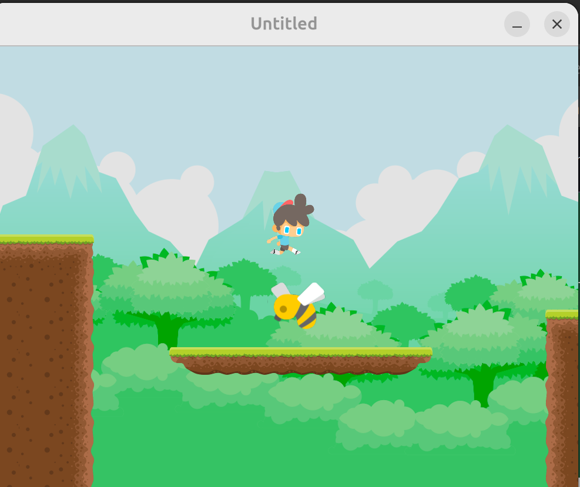

### Quiz 4: Game #3 Skills Assessment

### 69. What's Next?

## 

### 70. LÖVE for Web Overview
### 71. Love.js Setup and Installation
### 72. Building and Running with Love.js
### 73. Hosting Your Game
6min

### 74. Mobile Overview
### 75. Touching the Screen
### 76. Adapting to Screen Size
### 77. Installing Android Tools
### 78. Generating the APK
### 79. Installing on Your Android Device
### 80. Signing Your App
### 81. Publishing Your App
3min

### 82. Command Line and Git Basics
7min


