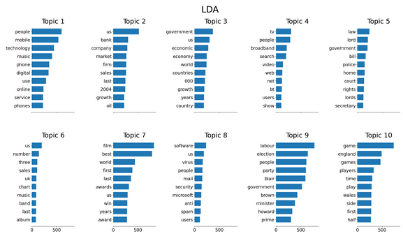

## Summary
- Title: Machine Learning: Natural Language Processing in Python (V2)
- Instructor: Lazy Programmer Inc.

## Section 1: Introduction

## Section 2: Getting Set Up

3. Get your hands dirty, pratical coding experience, data links
- https://github.com/lazyprogrammer/machine_learning_examples

4. How to use Github & Extra coding tips

5. Where to get the code, notebooks and data

6. How to succeed in this course

7. Temporary 403 Errors

## Section 3: Vector Models and Text preprocessing

8. Vector Models and Test preprocessing Intro

9. Basic definitions in NLP
- Tokens: words, punctation marks, question marks, ...
- Character: a-z letters, white space, \n, ...
- Vocabulary: set of all words. Reasonable subset of words
- Corpus: Collection of writings or recorded remarks used for linquistic analysis. Here, ML dataset
- N-gram: N consecutive items
  - data: 1-gram (unigram)
  - hello world: 2-gram (bigram)

10. What is a Vector?

11. Bag of words
- Text is sequential
- The specific sequence of words gives the meaning
- But many NLP approaches do not consider the word order
  - "Bag of Words" representations
    - Unordered text
  - In vector models and classic models
  - In many cases, can yield good results still
- In probabilistic model/deep learning, ordered text might be favored

12. Count vectorizer (theory)
- Bag of words approach
- No sequence but density of words
- This will result in sparse matrices

13. Tokenization
- More than split()
- Punctuation
  - '.' vs '?'
- Casing
  - Sentiment analysis or spam detection
  - 'cat' vs 'Cat' 
- Accents
- Character-based tokenization
  - No meanings in characters
  - In scikit, `CountVectorizer(analyzer="char")`
- Word based tokenization
  - 1 million words will generate 1Mx1M matrix
  - In scikit, `CountVectorizer(analyzer="word")`
- Subword based tokenization
  - Middle ground b/w word-based and character-based
  - "walking" -> "walk" + "ing"

14. Stopwords
- How to avoid high dimensionality?
- Stopwords are the words we wish to ignore
- `CountVectorizer(stop_words=list_of_defined_words)`
  - None is the default
- nltk has stopwords per each language

15. Stemming and Lemmatization
- Handling walk, walking, walks separately will yield high dimensionality
- Stemming & Lemmatization
  - Converts words to their root word
- Stemming:
  - Very crude
  - Chops off
  - Ex) "Replacement" -> "Replac"
  - Available algorithm: Porter Stemmer in nltk
- Lemmatization:
  - More sophisticated
  - Actual rules of language
    - Kind of lookup table
  - Ex) "Better" -> "Good", "was" -> "be"
  - From nltk
    - lemmmatizer.lemmatize("going") # returns "going"
    - lemmmatizer.lemmatize("going",pos=wordnet.VERB) # returns "go"

16. Stemming and Lemmatization Demo

17. Count Vectorizer(code)
- Xtrain is a sparse matrix
```python
vectorizer = CountVectorizer(stop_words='english')
Xtrain = vectorizer.fit_transform(inputs_train)
Xtest = vectorizer.transform(inputs_test)
model = MultinomialNB()
model.fit(Xtrain,Ytrain)
print("train score=",model.score(Xtrain,Ytrain))
print("test score=",model.score(Xtest,Ytest))
```
- Lemmatization is very expensive

18. Vector Similarity
- How to find 'similar' documents
- Metric b/w vectors
  - Distance
  - Angle
  - Cosine distance = 1 - Cosine similarity

19. TF-IDF (theory)
- How to improve the count vectorizer
- TF-IDF is popular for document retrieval and text mining
- What's wrong with the count vectorizer?
  - Stop words
- How do we know our list of stopwords is correct?
  - Application dependent
- Ex) it, and, ...
- Term Frequency - Inverse Document Frequency
  - Term frequency/document frequency
  - tfidf(t,d) = tf(t,d) * idf(t)
    - tf(t,d) = # of times t appears in d (matrix form)
    - idf(t) = log (N/N(t))
```python
from sklearn.feature_extraction.text import TfidVectorizer
tfidf = TfidVectorizer()
Xtrain = tfidf.fit_transform(train_texts)
Xtest = tfidf.transform(test_texts)
```
- Term Frequency (TF) Variations
  - Binary (1 if appears, 0 otherwise)
  - Normalize the count: tf(t,d) = count(t,d)/sum(count(t,d))
  - Take the log: tf(t,d) = log(1+count(t,d))
- Inverse Document Frequency (IDF) Variations
  - Smooth IDF: idf(t) = log (N/(N(t)+1)) + 1
  - IDF Max: idf(t) = log (max N(t')/N(t))
  - Probabilistic IDF: idf(t) = log ((N-N(t))/N(t))
- Normalizing TF-IDF
  - tfidf(t,d) = tfidf(t,d)/|tfidf(*,d)|
  - L1 or L2 norm

20. (Interactive) Recommender Exercise Prompt

21. IF-IDF (Code)
- Download from https://www.kaggle.com/datasets/tmdb/tmdb-movie-metadata?resource=download
```python
#wget https://lazyprogrammer.me/course_files/nlp/tmdb_5000_movie.csv -> not working Feb 2023
import pandas as pd
import matplotlib.pyplot as plt
import json
from sklearn.feature_extraction.text import TfidfVectorizer
from sklearn.metrics.pairwise import cosine_similarity, euclidean_distances
df = pd.read_csv('tmdb_5000_movies.csv')
#df.head()
x = df.iloc[0]
x['genres']
x['keywords']
j = json.loads(x['genres'])
def genres_and_keywords_to_string(row):
  genres = json.loads(row['genres'])
  genres = ' '.join(''.join(j['name'].split()) for j in genres)
  keywords = json.loads(row['keywords'])
  keywords = ' '.join(''.join(j['name'].split()) for j in keywords)
  return "%s %s" % (genres, keywords)
df['string'] = df.apply(genres_and_keywords_to_string,axis=1)
tfidf = TfidfVectorizer(max_features=2000)
X = tfidf.fit_transform(df['string'])
movie2idx = pd.Series(df.index,index= df['title'])
idx = movie2idx['Scream 3']
query = X[idx]
query.toarray()
scores = cosine_similarity(query,X)
scores = scores.flatten()
plt.plot(scores)
#(-scores).argsort()
recommended_idx = (-scores).argsort()[1:6]
def recommend(title):
  idx = movie2idx[title]
  if type(idx) == pd.Series:
    idx = idx.iloc[0]
  query = X[idx]
  scores = cosine_similarity(query, X)
  scores = scores.flatten()
  recommended_idx = (-scores).argsort()[1:6]
  return df['title'].iloc[recommended_idx]
print("Recommendatino for Scream 3", recommend('Scream 3'))
```

22. Word-to-Index Mapping
- Building document-term matrix
  - Row = document, column=term (size = #documents * #terms)
- Eample
  - document 1: I like cats
  - document 2: I love cats
  - document 3: I love dogs
  - Now there are 5 unique words
  - There will be 5 columns
  - 3x5 matrix
- Sample code
```python
current_idx = 0
word2idx = {}
for doc in documents:
  tokens = word_tokenize(doc)
  for token in tokens:
    if token not in word2idx.keys():
      word2idx[token] = current_idx
      current_idx += 1
```

23. How to Build TF-IDF From scatch
- Download bbc_text_cls.csv from https://storage.googleapis.com/dataset-uploader/bbc/bbc-text.csv 
```py
import pandas as pd
import numpy as np
import nltk
from nltk import word_tokenize
nltk.download('punkt')
df = pd.read_csv('bbc_text_cls.csv')
#
idx = 0
word2idx = {}
tokenized_docs = []
for doc in df['text']:
  words = word_tokenize(doc.lower())
  doc_as_int = []
  for word in words:
    if word not in word2idx:
      word2idx[word] = idx
      idx += 1
    doc_as_int.append(word2idx[word])
  tokenized_docs.append(doc_as_int)
# reverse mapping
idx2word = {v:k for k,v in word2idx.items()}
N = len(df['text'])
V = len(word2idx)
# term-frequency matrix
tf = np.zeros((N,V))
# populate term-frequency counts
for i,doc_as_int in enumerate(tokenized_docs):
  for j in doc_as_int:
    tf[i,j] += 1
# compute IDF
document_freq = np.sum(tf >0, axis=0)
idf = np.log(N/document_freq)
tf_idf = tf*idf
np.random.seed(123)
# show the random top 5 terms
i = np.random.choice(N)
row = df.iloc[i]
print("Label:" , row['labels'])
print("Text:", row['text'].split("\n",1)[0])
print("Top 5 terms:")
scores = tf_idf[i]
indices = (-scores).argsort()
for j in indices[:5]:
  print(idx2word[j])
```

24. Neural Word Embeddings
- Umbrella of vector models
- A document becomes a sequence of vectors
  - Something more than 'bag of words'
- Sequences of Vectors
  - Prebuilt models for sequences: CNN, RNN, Transformers
- 2 methods to discuss
  - Word2vec by Google
    - Embeddings (or vectors) are stored in the weights of the neural network
    - The goal of training is, given an input word, predict whether an output word appears in its context
  - GloVe by Stanford
    - Doesn't use neural network
    - Like a recommender system
- What can we do with word embeddings or word vectors?
  - Vector but not sparse
  - Embeddings are dens and low-dimensional
- Word Analogies
  - Can do arithemtic on vectors
  - King - Man ~ Queen - Woman

25. Neural Word Embeddings Demo
- wget https://lazyprogrammer.me/course_files/nlp/GoogleNews-vectors-negative300.bin.gz
  - 1.5GB
- Use pre-trained model as training from scratch is too expensive (~$Millions)
```py
import gdown
from gensim.models import KeyedVectors
word_vectors = KeyedVectors.load_word2vec_format('GoogleNews-vectors-negative300.bin',binary=True)
def find_analogies(w1,w2,w3):
  r = word_vectors.most_similar(positive=[w1,w3],negative=[w2])
  print("%s - %s = %s - %s"%(w1,w2,r[0][0],w3))
find_analogies('king','man','worman')
find_analogies('france','paris','london')
def nearest_neighbors(w):
  r = word_vectors.most_similar(positive=[w])
  print("neighbors of: %s" % w)
  for word, score in r:
    print("\t%s"%word)
nearest_neighbors('king')
```

26. Vector Models & Text Preprocessing Summary
- How to turn text into vectors
  - Counting
  - TF-IDF
  - Vector similarity/recommender system
  - Word-to-index mapping
  - Neural word embeddings (word2vec, GloVe)
  - Word analogies
- Text pre-processing
  - Tokenization
  - Bag of words
  - Stopwords
  - Stemming and lemmatization
  
27. Text Summarization Preview
- Text summarization is more than just TF-IDF

28. How to do NLP in other languages
- How to apply NLP into other languages or bioinformatics
- Steps of a typical NLP analysis
  - Get the text (strings)
  - Tokenize the text
  - Stopwords, stemming/lemmatization
  - Map tokens to integers
    - Tabular ML works with numbers
    - A table of the format(documents x tokens)
    - Need to know which column goes with which token!
  - Convert test into count vectors / TF-IDF
  - Do ML task (recommend, detect spam, summarize, topic model, ...)
- Scikit-Learn's count vectorizer won't tokenize Japanese
  - Build a tokenizer from scratch or use any existing library (JapaneseTokenizer)

29. Suggestion Box

## Section 4: Probablistic Models

30. Probabilistic Models
- Markov model/N-gram language model
- Application: Article spineer (black hat SEO)
- Application: Cipher decryption/code-breaking
- Later: machine learning and deep learning, which apply both vector models and probabilty models

## Section 5: Markov Models

31. Markov models section introduction
- Example
  - Finance: the basis for the Black-Scholes formula
  - Reinforcement learning: Markov Decision Process (MDP)
  - Hidden Markov Model (speech recognition, computational biology)
  - Markov Chain Monte Carlo (MCMC): numerical approximation
- Applications
  - Building a text classifier using Bayes rule + Generating poetry
  - Supervised/unsupervised ML

32. The Markov Property
- A very restrictive assumption on the dependency structure of the join distribution
- Markov assumption
  - We assume the Markov property holds, even when it does not
  
33. The Markov model
- State distribution
  - p(s_t = 1), p(s_t = 2), ...
- State transitions
  - p(s_t = j | s_t-1 = i)
  - Probabilty that state at time t is j, given that the state at time t-1 was i
- State transition matrix
  - A_ij = p(s_t = j | s_t-1 = i)
  - MxM matrix
  - Basically time-depedent matrix but when A is not dependent on time, time-homogneous Markov process
- Summary
  - We want to model a sequence of states
  - State transition matrix A, initial state distribution pi
  - Steps
    - Find the probability of a sequence
    - Given a dataset, find A and pi (learning or training)

34. Probability smoothing and log-probabilities
- Probability of sequence
  - Due to multiplication, any zero will nullify it
  - Add-one smoothing:
    - A_ij = (count(i->j) + 1)/(count(i) + M)
    - pi_j = (count(s_1 = i) + 1) /(N+M)
  - Add epsilon smoothing
    - Instead of 1, use epsilon
- Computing the probability of a sequence
  - Many multiplication of small numbers
  - Solution: compute log probabilities instead
  - We don't need exact number as what we actually do is compare
  - A>B => log(A) > log(B)

35. Building a text classifier (theory)
- Text classification is an example of **supervised learning** but Markov models are **unsupervised**
  - No label in Markov model
- Bayes' Rule
  - p(author|poem) = p(poem|author)p(author)/p(poem)
- Recap
  - We train a separate Markov model for each class
  - Each model gives us p(x|class=k) for all k
  - General form of decision rule using Bayes' rule: k* = argmax_k p(class=k|x)
  - Posterior can be simplified since we don't need its actual value
  - Maximum a posteriori (MAP): k* = argmax_k log(p(x|class=k)) + log (p(class=k))
  - Maximum likelihood: k* = argmax_k log(p(x|class=k))

36. Building a text classifier (exercise prompt)
- 2 poems by 2 authors
- Build a classifier that can distinguish b/w 2 author
- Compute train and test accuracy
- Check for class imbalance, F1 score when imbalanced
- Details
  - Save each line as a list
  - Save the labels
  - Train-test split
  - Create a mapping from unique word to unique integer index
  - Tokenize each line
  - Assign each unique word a unique integer index
  - Convert each line of text into integer lists
  - Train a Markov model for each class
  - Use smoothing (add-epsilon or add-one)
  - Consier if you need A and pi or log(A) and log(pi)
  - Write a function to compute the posterior for each class
  - Take the argmax over the posteriors to get the predicted class
  - Make predictions for both train and test sets
  - Compute accuracy for train/test
  - Check for class imbalance
  - If imbalanced, check confusion matrix and F1-score
  
37. Building a Text classifier (code pt 1)
- Input data at
  - wget -nc https://raw.githubusercontent.com/lazyprogrammer/machine_learning_examples/master/hmm_class/edgar_allan_poe.txt
  - wget -nc https://raw.githubusercontent.com/lazyprogrammer/machine_learning_examples/master/hmm_class/robert_frost.txt
```py
import numpy as np
import matplotlib.pyplot as plt
import string
from sklearn.model_selection import train_test_split
input_files = [ 'edgar_allan_poe.txt','robert_frost.txt']
input_texts = []
labels = []
for label, f in enumerate (input_files):
  print(f"{f} corresponds to label {label}")
  for line in open(f):
    line = line.rstrip().lower()
    if line:
      line = line.translate(str.maketrans('','',string.punctuation))
      input_texts.append(line)
      labels.append(label)
train_text, test_text, Ytrain, Ytest = train_test_split(input_texts,labels)
idx = 1
word2idx = {'<unk>':0}
# populate word2idx
for text in train_text:
  tokens = text.split()
  for token in tokens:
    if token not in word2idx:
      word2idx[token] = idx
      idx += 1
# convert data into integer format
train_text_int = []
test_text_int = []
for text in train_text:
  tokens = text.split()
  line_as_int = [word2idx[token] for token in tokens]
  train_text_int.append(line_as_int)
for text in test_text:
  tokens = text.split()
  line_as_int = [word2idx.get(token,0) for token in tokens]
  test_text_int.append(line_as_int)
# Initialize A matrix and pi vector
V = len(word2idx)
A0 = np.ones((V,V))
pi0 = np.ones(V)
A1 = np.ones((V,V))
pi1 = np.ones(V)
# compute counts for A and pi
def compute_counts(text_as_int, A, pi):
  for tokens in text_as_int:
    last_idx = None
    for idx in tokens:
      if last_idx is None:
        pi[idx] += 1
      else:
        A[last_idx,idx] += 1
      # update last idx
      last_idx = idx
compute_counts([t for t,y in zip(train_text_int,Ytrain) if y==0], A0, pi0)
compute_counts([t for t,y in zip(train_text_int,Ytrain) if y==1], A1, pi1)
# normalize A and pi
A0  /= A0.sum(axis=1, keepdims=True)
pi0 /= pi0.sum()
A1  /= A1.sum(axis=1, keepdims=True)
pi1 /= pi1.sum()
logA0  = np.log(A0)
logpi0 = np.log(pi0)
logA1  = np.log(A1)
logpi1 = np.log(pi1)
# compute priors
count0 = sum(y==0 for y in Ytrain)
count1 = sum(y==1 for y in Ytrain)
total = len(Ytrain)
p0 = count0/total
p1 = count1/total
logp0 = np.log(p0)
logp1 = np.log(p1)
# buidl a classifier
class Classifier:
  def __init__(self,logAs, logpis, logpriors):
    self.logAs = logAs
    self.logpis = logpis
    self.logpriors = logpriors
    self.K = len(logpriors)
  def _compute_log_likelihood(self,input_,class_):
    logA = self.logAs[class_]
    logpi = self.logpis[class_]
    last_idx = None
    logprob = 0
    for idx in input_:
      if last_idx is None:
        logprob += logpi[idx]
      else:
        logprob += logA[last_idx,idx]
      last_idx = idx
    return logprob
  def predict(self,inputs):
    predictions = np.zeros(len(inputs))
    for i, input_ in enumerate(inputs):
      posteriors = [self._compute_log_likelihood(input_,c) + self.logpriors[c] for c in range(self.K)]
      pred = np.argmax(posteriors)
      predictions[i] =pred
    return predictions
clf = Classifier([logA0,logA1], [logpi0, logpi1], [logp0, logp1])
Ptrain = clf.predict(train_text_int)
print(f"Train acc: {np.mean(Ptrain == Ytrain)}")
Ptest = clf.predict(test_text_int)
print(f"Test acc: {np.mean(Ptest == Ytest)}")
from sklearn.metrics import confusion_matrix, f1_score
cm = confusion_matrix(Ytrain, Ptrain)
print(cm)
cm_test = confusion_matrix(Ytest, Ptest)
print(cm_test)
print(f1_score(Ytrain,Ptrain))
print(f1_score(Ytest, Ptest))
```

38. Building a Text classifier (code pt 2)

39. Language Model (Theory)
- Using Markov models to generate text
  - Classifying text: supervised learning
  - Generating text: unsupervised learning
- Bayes classifier
  - Discriminate model: p(y|x)
    - Logistic regression
    - Neural networks
  - Generative model: p(x|y)
    - Can be used to generate text
- Random sampling
  - May use different probabilistic distribution than pure random
- Problems with the Markov assumption 
  - The next word depends only on a single preceding word
  - Solution: extending the Markov model
    - Instead of depending on only one past state, depends on two: MxMxM
    - Third order will be MxMxMxM matrices

40. Language Model (Exercise Prompt)
- Why use dictionary? Not numpy array?
  - Sparse matrix

41. Language Model (Code pt 1)
- Markov Models
  - Markov Model Classifier / Poetry Generator
  - wget -nc https://raw.githubusercontent.com/lazyprogrammer/machine_learning_examples/master/hmm_class/edgar_allan_poe.txt
  - wget -nc https://raw.githubusercontent.com/lazyprogrammer/machine_learning_examples/master/hmm_class/robert_frost.txt
- We want dictionary of first word and second word with probabilty
  - Ex) ('I', 'am'):['happy':0.5, 'hungry':0.3, ...]
```py
import numpy as np
import string
np.random.seed(1234)
initial = {} # start of a phrase
first_order = {} # second word only
second_order = {}
def remove_punctuation(s):
  table = str.maketrans('','',string.punctuation)
  return [w.translate(table) for w in s]
def add2dict(d,k,v):
  if k not in d:
    d[k] = []
  d[k].append(v) # value will be a list
for line in open('robert_frost.txt'):
  tokens = remove_punctuation(line.rstrip().lower().split())
  T = len(tokens)
  for i in range(T):
    t = tokens[i]
    if i==0:
      initial[t] = initial.get(t,0.) +1
    else:
      t_1 = tokens[i-1]
      if i== T-1:
        add2dict(second_order,(t_1,t), 'END')
      if i == 1:
        add2dict(first_order, t_1,t)
      else:
        t_2 = tokens[i-2]
        add2dict(second_order,(t_2,t_1),t)
# normalize the distributions
initial_total = sum(initial.values())
for t,c in initial.items():
  initial[t] = c/initial_total
# convert [cat,cat,dog,dog,dog, ...] into {cat:0.2, dog:0.3, ... }
def list2pdict(ts):
  d = {}
  n = len(ts)
  for t in ts:
    d[t] = d.get(t,0.)+1
  for t,c in d.items():
    d[t] = c/n
  return d
for t_1,ts in first_order.items():
  # replace list with dictionary of probabilities
  first_order[t_1] = list2pdict(ts)
for k,ts in second_order.items():
  second_order[k] = list2pdict(ts)
def sample_word(d):
  p0 = np.random.random()
  cumulative = 0
  for t,p in d.items():
    cumulative += p
    if p0 < cumulative:
      return t
  assert(False) # shouldn't reach this stage
def generate():
  for i in range(4): # generates 4 lines
    sentence = []
    w0 = sample_word(initial)
    sentence.append(w0)
    w1 = sample_word(first_order[w0])
    sentence.append(w1)
    while True:
      w2 = sample_word(second_order[(w0,w1)])
      if w2 == 'END':
        break
      sentence.append(w2)
      w0 = w1
      w1 = w2
    print(' '.join(sentence))
generate()
```
- Sample results:
```
i went to bed alone and left me
might just as empty
but it isnt as if and thats not all the money goes so fast
you couldnt call it living for it aint
```

42. Language Model (code pt 2)
- How big the vocabulary size?
- How many values are stored in the dictionaries?

43. Markov Models Section Summary
- Basic idea: predicts the future from the past
  - Predict x(t) using x(t-1)
  - But can add more t-2, t-3, ...
  - Time series analysis: forecast the next value from previous values
  - Autoregressive text models with more complex architectures

## Section 6: Article Spinner

44. Article Spinning - Problem Description
- Ex: Blog
  - How to get readers?
  - Gets high ranks from search engine: search engine optimization
  - Automatic content writer
    - Just copy & paste will be detected by search egnine
    - spin content: replaces some words and pass away from duplicate check
      - Prior to ML advent: human intervention required
- The goal isn't to build an ariticle spinning product

45. Article Spinning - N-gram appraoch
- First order Markov model: p(w_t|w_t-1)
- Second order Markov model: p(w_t|w_t-1, w_t-2)
- Predicting the Middle word: p(w_t|w_t-1,w_t+1)

46. Article Spinner Exercise Prompt
- BBC News data
  - Business articles only
  - Wikipedia at https://dumps.wikimedia.org
- Build the model: VxVxV matrix, same as 2nd order language model but different ordering of dimensions
- Spinning
  - Which words to replace? How often?
  - Every word or 2 words in a row?
  - How to find if a word can be replaced?

47. Article Spinner in Python (pt 1)
```py
import numpy as np
import pandas as pd
import textwrap
import nltk
from nltk import word_tokenize
from nltk.tokenize.treebank import TreebankWordDetokenizer
nltk.download('punkt')
df = pd.read_csv('bbc_text_cls.csv')
df.head()
labels = set(df['labels'])
label = 'business'
texts = df[df['labels'] == label]['text']
probs = {} #key: (w(t-1),w(t+1)), value: {w(t):count(w(t))}
for doc in texts:
  lines = doc.split('\n')
  for line in lines:
    tokens = word_tokenize(line)
    for i in range(len(tokens)-2):
      t_0 = tokens[i]
      t_1 = tokens[i+1]
      t_2 = tokens[i+2]
      key = (t_0,t_2)
      if key not in probs:
        probs[key] = {}
      if t_1 not in probs[key]:
        probs[key][t_1] = 1
      else:
        probs[key][t_1] += 1
# normalize probabilities
for key, d in probs.items():
  # d should represent a distribution
  total = sum(d.values())
  for k,v in d.items():
    d[k] = v/total
def spin_document(doc):
  lines = doc.split("\n")
  output = []
  for line in lines:
    if line:
      new_line = spin_line(line)
    else:
      new_line = line
    output.append(new_line)
  return "\n".join(output)
detokenizer = TreebankWordDetokenizer()
def sample_word(d):
  p0 = np.random.random()
  cumulative = 0
  for t,p in d.items():
    cumulative += p
    if p0 < cumulative:
      return t
  assert (False) # shouldn't reach here
def spin_line(line):
  tokens = word_tokenize(line)
  i = 0
  output = [tokens[0]]
  while i< (len(tokens)-2):
    t_0 = tokens[i]
    t_1 = tokens[i+1]
    t_2 = tokens[i+2]
    key = (t_0,t_2)
    p_dist = probs[key]
    if len(p_dist) > 1 and np.random.random() < 0.3:
      middle = sample_word(p_dist)
      output.append(t_1)
      output.append("<"+middle +">")
      output.append(t_2)
      i += 2
    else:
      output.append(t_1)
      i += 1
  # append the final token
  if i == len(tokens) - 2:
    output.append(tokens[-1])
  return detokenizer.detokenize(output)
np.random.seed(1234)
i = np.random.choice(texts.shape[0])
doc = texts.iloc[i]
new_doc = spin_document(doc)
print(textwrap.fill(new_doc,replace_whitespace=False, fix_sentence_endings=True))
```

48. Article Spinner in Python (pt 2)
- Grammatical error, missing quotes, wrong period found

49. Case Study: Article Spinning Gone Wrong

## Section 7: Cipher Decryption

50. Section Introduction
- Probabilistic language modeling
- Genetic algorithm
- What is a cipher?
  - Encode/decode a message
- Language modeling
  - What is the probability of this sentence?
- Generic algorithm/evolutionary algorithm
  - Optimization based on biological evolution
  
51. Ciphers
- Mapping alphabets in different order
  - Encryption/decryption

52. Language Models (Review)
- If decryption is done, the results will have very inappropriate form or have low probability
- Bigram probability
  - p(A|C) = (# of times "CA" appears in the dataset) / (# of times "C" appears in the dataset)
  - p(AB) = p(B|A)*p(A)
  - p(ABC) = p(C|AB)*p(B|A)*p(A) = p(C|B)*p(B|A)*p(A)
- Add one smoothing
  - Avoid zero when any p() is zero
  - p(x_t|x_t-1) = (cout{x_t-1->x_t} + 1) / (count{x_t-1} + V)
- Practical issue
  - Probabilities are small
  - 100 character long sentence ~ 10^-100
  - Use Log-likelihood
    - log p(x1,x2) = log p(x1) + log p(x2|x1)

53. Genetic Algorithms
- Brute force mapping counts = 26! = 4e26
- Type of mutations
  - Substition
  - Insertion
  - Deletion
  - But cannot be used for cypher decryption or character mapping 

54. Code Preparation
- Generate a random substitution cipher
- Read in Moby Dick, create a character level language model
- Encoding/decoding functions
- Genetic algorithm

55. Code pt 1
56. Code pt 2
57. Code pt 3
58. Code pt 4
59. Code pt 5
60. Code pt 6
- Download: https://lazyprogrammer.me/course_files/moby_dick.txt
```py
import numpy as np
import matplotlib.pyplot as plt
import string
import random
import re
import requests
import os
import textwrap
## creating substitution cipher
letters1 = list(string.ascii_lowercase)
letters2 = list(string.ascii_lowercase)
true_mapping = {}
random.shuffle(letters2)
for k,v in zip(letters1,letters2):
    true_mapping[k] = v
## language model
M = np.ones((26,26))
pi = np.zeros(26)
def update_transition(ch1,ch2):
    i = ord(ch1) - 97 # ord() converts a sigle unicode character into its integer equivalent. We map 'a' into 0
    j = ord(ch2) - 97
    M[i,j] += 1
def update_pi(ch):
    i = ord(ch) - 97
    pi[i] += 1
def get_word_prob(word):
    i = ord(word[0]) - 97
    logp = np.log(pi[i])
    for ch in word[1:]:
        j = ord(ch) - 97
        logp += np.log(M[i,j])
        i = j
    return logp
def get_sequence_prob(words):
    if type(words) == str:
        words = words.split()
    logp = 0
    for word in words:
        logp += get_word_prob(word)
    return logp
if not os.path.exists('moby_dick.txt'):
    print("Downloading moby dick ...")
    r = requests.get('https://lazyprogrammer.me/course_files/moby_dick.txt')
    with open('moby_dick.txt','w') as f:
        f.write(r.content.decode())
regex = re.compile('[^a-zA-Z]')
for line in open('moby_dick.txt'):
    line = line.rstrip()
    if line:
        line = regex.sub(' ',line) # replaces all non-alpha char with space
        tokens = line.lower().split()
        for token in tokens:
            ch0 = token[0]
            update_pi(ch0)
            for ch1 in token[1:]:
                update_transition(ch0,ch1)
                ch0 = ch1
# normlize
pi /= pi.sum()
M /= M.sum(axis=1,keepdims=True)
original_message = '''Call me Ishmael. Some years ago—never mind how long precisely—having little or no money in my purse, and nothing particular to interest meon shore, I thought I would sail about a little and see the watery part of the world. It is a way I have of driving off the spleen and'''
##
def encode_message(msg):
    msg = msg.lower()
    msg = regex.sub(' ',msg)
    coded_msg = []
    for ch in msg:
        coded_ch = ch
        if ch in true_mapping:
            coded_ch = true_mapping[ch]
        coded_msg.append(coded_ch)
    return ''.join(coded_msg)
encoded_message = encode_message(original_message)
def decode_message(msg,word_map):
    decoded_msg = []
    for ch in msg:
        decoded_ch = ch
        if ch in word_map:
            decoded_ch = word_map[ch]
        decoded_msg.append(decoded_ch)
    return ''.join(decoded_msg)
## run an evolutionary algorithm to decode the message
dna_pool = []
for _ in range(20):
    dna = list(string.ascii_lowercase)
    random.shuffle(dna)
    dna_pool.append(dna)
def evolve_offspring(dna_pool, n_children):
    offspring = []
    for dna in dna_pool:
        for _ in range(n_children):
            copy = dna.copy()
            j = np.random.randint(len(copy))
            k = np.random.randint(len(copy))
            # switch
            tmp = copy[j]
            copy[j] = copy[k]
            copy[k] = tmp
            offspring.append(copy)
    return offspring + dna_pool
# main loop
num_iters = 1000
scores = np.zeros(num_iters)
best_dna = None
best_map = None
best_score = float('-inf')
for i in range(num_iters):
    if i> 0:
        dna_pool = evolve_offspring(dna_pool,3)
    dna2score = {}
    for dna in dna_pool:
        current_map = {}
        for k,v in zip(letters1,dna):
            current_map[k] = v
        decoded_message = decode_message(encoded_message, current_map)
        score = get_sequence_prob(decoded_message)
        dna2score[''.join(dna)] = score
        if score > best_score:
            best_dna = dna
            best_map = current_map
            best_score = score
        scores[i] = np.mean(list(dna2score.values()))
        # keep the best 5 dna
        sorted_dna = sorted(dna2score.items(),key = lambda x: x[1],reverse=True)
        dna_pool = [list(k) for k,v in sorted_dna[:5]]
        if i%200 == 0:
            print("iter: ", i, "score:", scores[i], " best so far: ", best_score)
decoded_message = decode_message(encoded_message,best_map)
print("LL of decoded message:", get_sequence_prob(decoded_message))
print("LL of true message:", get_sequence_prob(regex.sub(' ',original_message.lower())))
for true, v in true_mapping.items():
    pred = best_map[v]
    if true != pred:
        print("true: %s, pred: %s"%(true,pred))
# print the final decoded message
print("Decoded message:\n", textwrap.fill(decoded_message))
print("\nTrue message: \n", original_message)
```
- Not exact. Run multiple times and analyze

61. Cipher decryption - additional discussion

62. Section Conclusion
- Bisection model may work good but the uni-gram/bi-gram model may be inappropriate
  - Trigram?

## Section 8: Machine Learning Models

63. Machine Learning Models (Introduction)
- So far:
  - Vector based models
  - Probability based models
- ML model can be vector or probability based, or both

|supervised | unsupervised|
|---|---|
| spam detection | Topic modeling|
| Sentiment analysis | Latent semantic analysis|
| | Text summarization (but can be supervised) |

## Section 9: Spam Detection

64. Spam Detection - Problem Description

65. Naive Bayes Intuition
- Bayes' rule:
  - P(Y|X) = P(X|Y)P(Y)/\sum P(X|y)P(y) = P(X,Y)/P(X)
  - Input X= email, Output Y= category (spam or not)
- Naive Bayes
  - Multiple inputs are indepedent each other

66. Spam Detection - Exercise Problem
- wget https://lazyprogrammer.me/course_files/spam.csv

67. Aside: Class Imbalance, ROC, AUC, and F1 Score (pt1)
- Class Imbalance
- Binary Classification
  - TP: True Positive. Predicted Positive while actually Positive
  - TN: True Negative. Predicted negative while actually Negative
  - FP: False Positive. Predicted Positive while actually Negative
  - FN: False Negative. Predicted Negative while actually Positive
- In medical/life science
  - Sensitivity = TP/(TP+FN), higher/better
  - Specificity = TN/(TN+FP), higher/better
- Recall = sensitivity = True Positive rate. Or # of docs found/# docs we must have found
- Precision = Positive Predictive Value = TP/(TP+FP). Or # docs correctly retrieved/# docs retrieved
- F1-score: Harmonic mean of precision and recall
  - F1 = 2 (precsion*recall)/(precision + recall)

68. Aside: Class Imbalance, ROC, AUC, and F1 Score (pt2)
- ROC curve: TP vs FP
  - AUC: Area under curve

69. Spam Detection In Python
```py
import numpy as np
import pandas as pd
import seaborn as sn
import matplotlib.pyplot as plt
from sklearn.feature_extraction.text import TfidfVectorizer, CountVectorizer
from sklearn.model_selection import train_test_split
from sklearn.metrics import roc_auc_score, f1_score, confusion_matrix
from sklearn.naive_bayes import MultinomialNB
from wordcloud import WordCloud
df = pd.read_csv('spam.csv', encoding='ISO-8859-1')
df = df.drop(["Unnamed: 2", "Unnamed: 3", "Unnamed: 4"],axis=1)
df.columns = ["labels","data"]
df.head()
df['labels'].hist() # compares histogram
df['b_labels'] = df['labels'].map({'ham':0, 'spam':1})
Y = df['b_labels'].to_numpy()
df_train, df_test, Ytrain,Ytest = train_test_split(df['data'], Y, test_size=0.33)
featurizer = CountVectorizer(decode_error='ignore')
Xtrain = featurizer.fit_transform(df_train)
Xtest = featurizer.transform(df_test)
model = MultinomialNB()
model.fit(Xtrain,Ytrain)
print("train acc:", model.score(Xtrain,Ytrain))
print("test acc:", model.score(Xtest,Ytest))
Ptrain = model.predict(Xtrain)
Ptest = model.predict(Xtest)
print("train F1:", f1_score(Ytrain, Ptrain))
print("test F1:", f1_score(Ytest, Ptest))
cm = confusion_matrix(Ytrain,Ptrain)
cm # array([[3211,   13],  [  14,  495]])
def plot_cm(cm):
    classes = ['ham','spam']
    df_cm = pd.DataFrame(cm,index=classes,columns=classes)
    ax = sn.heatmap(df_cm,annot=True,fmt='g')
    ax.set_xlabel("Predicted")
    ax.set_ylabel("Target")
plot_cm(cm) # visualization of confusion matrix
def visualize(label):
    words = ''
    for msg in df[df['labels'] == label]  ['data']:
        msg = msg.lower()
        words += msg +' '
    wordcloud = WordCloud(width=600,height=400).generate(words)
    plt.imshow(wordcloud)
    plt.axis('off')
    plt.show()
visualize('spam')
visualize('ham')
# Now see what went wrong
X = featurizer.transform(df['data'])
df['predictions']  = model.predict(X)
# things that must be spam
sneaky_spam = df[(df['predictions'] == 0) & (df['b_labels'] == 1)]['data']
for msg in sneaky_spam:
    print(msg)
# things should not be spam
not_actually_spam = df[(df['predictions'] == 1) & (df['b_labels'] == 0)]['data']
for msg in sneaky_spam:
    print(msg)
```

## Section 10: Sentiment Analysis

70. Sentiment Analysis - Problem Description
- Unlike image classification, there is an ordering to the classes
- Application
  - Reputation management
  - Customer support

71. Logistic Regression Intuition (pt 1)
- Logistic regression model is related into vector model instead of probability model
- Activation: ax(x) = w1x1 + w2x2 + b
  - w1,w2: weights
  - b: bias
  - a(x) = 0: on the line
  - a(x) < 0: one side of the line
  - a(x) > 0: other side of the line
  - Vector notation: a(x) = \sum_i w_i x_i + b = w^T x + b
- Sigmoid: logistic function
  - \sigma(x) = 1/(1+\exp(-x)): b/w [0,1]
  - p(y=1|x) = \sigma(w^T x + b)
- Naive Bayes model is generative while Logistic Regression is discriminative  

72. Multiclass Logistic Regression (pt 2)
- Sometimes called as multinomial logistic regression or maximum entropy classifier
- Multiclass logistic regression
  - We have K classes
    - K weight vectors: w1, w2, ... wk
    - K bias: b1, b2, ... bk
    - K activations: a1 = w1^T x + b1, a2 = w2^T x + b2, ... ak = wk^T x + bk
  - For each of N samples, we get K probabilities that sum to 1
  - The overall output is a matrix of NxK
  - Class predictions using probabilities?
    - Find the max

73. Logisitc Regression Training and Interpretation (pt3)
- For multiclass case
  - Interpret the weight as a matrix
  - a(x) = W^Tx + b
  - If W[d,k] is large and positive, it makes the kth activation more positive
  - if W[d,k] is large and negative, it makes the kth activation more negative

74. Sentiment Analysis - Exercise Prompt
- Use a vectorization strategy of your choice (counting, TF-IDF)
- Options: Tokenization, lemmatization, normalization
- Classifier: Use Logistic Regression
- Score function returns accurayc
- Check for class imbalance
  - When unbalanced, check metrics like AUC/F1-score + plot confusion matrix

75. Sentiment Analysis in Python (pt 1)
- wget -nc https://lazyprogrammer.me/course_files/AirlineTweets.csv
```py
import numpy as np
import pandas as pd
import seaborn as sn
import matplotlib.pyplot as plt
np.random.seed(1)
from sklearn.feature_extraction.text import CountVectorizer, TfidfVectorizer
from sklearn.linear_model import LogisticRegression
from sklearn.metrics import roc_auc_score, f1_score, confusion_matrix
from sklearn.model_selection import train_test_split
df_ = pd.read_csv('AirlineTweets.csv')
df_.head()
df = df_[['airline_sentiment','text']].copy()
df['airline_sentiment'].hist() # too many negative. Imbalance found
target_map = {'positive':1, 'negative':0, 'neutral':2}
df['target'] = df['airline_sentiment'].map(target_map)
df_train,df_test = train_test_split(df)
vectorizer = TfidfVectorizer(max_features=2000)
X_train = vectorizer.fit_transform(df_train['text'])
X_test = vectorizer.transform(df_test['text'])
Y_train = df_train['target']
Y_test = df_test['target']
model = LogisticRegression(max_iter=500)
model.fit(X_train,Y_train)
print("Train acc:", model.score(X_train, Y_train))
print("Test acc:", model.score(X_test, Y_test))
Pr_train = model.predict_proba(X_train)
Pr_test = model.predict_proba(X_test)
print("Train AUC:", roc_auc_score(Y_train, Pr_train, multi_class='ovo'))
print("Test AUC:", roc_auc_score(Y_test, Pr_test, multi_class='ovo'))
## plotting confusion matrix
P_train = model.predict(X_train)
P_test = model.predict(X_test)
cm = confusion_matrix(Y_train, P_train, normalize='true')
cm
def plot_cm(cm):
    classes = ['negative','positive','neutral' ]
    df_cm = pd.DataFrame(cm,index=classes,columns=classes)
    ax = sn.heatmap(df_cm,annot=True,fmt='g')
    ax.set_xlabel("Predicted")
    ax.set_ylabel("Target")
plot_cm(cm)
```

76. Sentiment Analysis in Python (pt 2)
- How to improve the accuracy/AUC
  - Using Positive and Negative only
```py
binary_target_list = [target_map['positive'],target_map['negative']]
df_b_train = df_train[df_train['target'].isin(binary_target_list)]
df_b_test = df_test[df_test['target'].isin(binary_target_list)]
X_train = vectorizer.fit_transform(df_b_train['text'])
X_test = vectorizer.transform(df_b_test['text'])
Y_train = df_b_train['target']
Y_test = df_b_test['target']
model = LogisticRegression(max_iter=500)
model.fit(X_train, Y_train)
print("Train acc:", model.score(X_train,Y_train))
print("Test acc:", model.score(X_test,Y_test))
Pr_train=model.predict_proba(X_train)[:,1]
Pr_test = model.predict_proba(X_test)[:,1]
print("Train AUC:", roc_auc_score(Y_train, Pr_train))
print("Test AUC:", roc_auc_score(Y_test, Pr_test))
model.coef_
plt.hist(model.coef_[0], bins=30)
word_index_map = vectorizer.vocabulary_
word_index_map
threshold = 2
# find extreme words
print("Most positive words:")
for word, index in word_index_map.items():
    weight = model.coef_[0][index]
    if weight > threshold:
        print(word,weight)
#southwestair 2.860075665821313
#thank 8.070503978065155
#great 5.208733896653555
#best 3.6368642824846105
print("Most negative words:")
for word, index in word_index_map.items():
    weight = model.coef_[0][index]
    if weight < -threshold:
        print(word,weight)
#hours -3.180120172892713
#not -4.237871164989555
#delayed -2.7045270961885732
#hour -2.069684629978255
#but -2.2210484580160723
#cancelled -2.6770621926840525
```
- Exercise: print the most-wrong tweets for both classes
  - Find a negative review where p(y=1|x) is closest to 1
  - Find a positive review where p(y=1|x) is closest to 0
- Set class_weight = 'balanced'

## Section 11: Text Summarization

77. Text Summarization Section Introduction
- Ex: Summary from Search engine
- 2 Types of summarization
  - Extractive: text taken from the original document. Relatively easy
  - Abstractive: may contain novel sequences of text not necessarily taken from the input. Hard
- Section outline
  - Method 1: Using the knowledge of vector-based methods (TF-IDF)
  - Method 2: TextRank, based on Google's PageRank

78. Text Summarization Using Vectors
- Text summarization with TF-IDF
  - Split the document into sentences
  - Score each sentence
  - Rank each sentence by those scores
  - Summary = top scoring sentences
  - This is an extractive method
  - No training data required
- Scoring each sentence
  - Score = average (non-zero TF-IDF values)
  - Important words will have a larger score
  - Why mean, not sum?
    - The sum would be biased toward longer sentences
- What to do with the scores
  - Sort the scores, pick the sentences with the highest score
  - Multiple options
    - Top N sentences
    - Top N words
    - Top N characters
    - Mixing

79. Text Summarization Exercise Prompt
- BBC news data
- Split the article into sentences (nltk.sent_tokenize)
- Compute TF-IDF matrix from list of sentences
- Score each sentence by taking the average of non-zero TF-IDF values
- Sort each sentence by score
- Print the top scoring sentences as the summary

80. Text Summarization in Python
- wget -nc https://lazyprogrammer.me/course_files/nlp/bbc_text_cls.csv
```py
import numpy as np
import pandas as pd
import textwrap
import nltk
from nltk.corpus import stopwords
from nltk import word_tokenize
from nltk.stem import WordNetLemmatizer, PorterStemmer
from sklearn.feature_extraction.text import TfidfVectorizer
nltk.download('punkt')
nltk.download('stopwords')
df = pd.read_csv('bbc_text_cls.csv')
doc = df[df.labels == 'business']['text'].sample(random_state=42)
def wrap(x):    
    return textwrap.fill(x,replace_whitespace=False, fix_sentence_endings=True)
print(wrap(doc.iloc[0]))
## tokenizing sentences
sents = nltk.sent_tokenize(doc.iloc[0].split("\n",1)[1])
featurizer = TfidfVectorizer(stop_words=stopwords.words('english'),norm='l1',)
X = featurizer.fit_transform(sents)
def get_sentence_score(tfidf_row):
    x = tfidf_row[tfidf_row != 0]
    return x.mean()
scores = np.zeros(len(sents))
for i in range(len(sents)):
    score = get_sentence_score(X[i,:])
    scores[i] = score
sort_idx = np.argsort(-scores)
print("Generated_summary:")
for i in sort_idx[:5]:
    print(wrap("%.2f: %s"%(scores[i],sents[i])))
# check the title of the document
doc.iloc[0].split("\n",1)[0]
#Generated_summary:
#0.14: A number of retailers have already reported poor figures for December.
#0.13: However, reports from some High Street retailers highlight the weakness of the sector.
#0.12: The ONS revised the annual 2004 rate of growth down from the
# Let's define a sinle function doing summary
def summarize(text):
    sents = nltk.sent_tokenize(text)
    X = featurizer.fit_transform(sents)
    scores = np.zeros(len(sents))
    for i in range(len(sents)):
        score = get_sentence_score(X[i,:])
        scores[i] = score
    sort_idx = np.argsort(-scores)
    for i in sort_idx[:5]:
        print(wrap("%.2f: %s"%(scores[i],sents[i])))
doc = df[df.labels == 'entertainment']['text'].sample(random_state=123)
summarize(doc.iloc[0].split("\n",1)[1])
#0.11: The Black Eyed Peas won awards for best R 'n' B video and sexiest video, both for Hey Mama.
#0.10: The ceremony was held at the Luna Park fairground in Sydney Harbour and was hosted by the Osbourne family.
#0.10: Goodrem, Green Day and the Black Eyed Peas took home two awards each.
#0.10: Other winners included Green Day, voted best group, and the Black Eyed Peas.
#0.10: The VH1 First Music Award went to Cher honouring her achievements within the music industry.
# check the title of the document
doc.iloc[0].split("\n",1)[0]
```

81. TextRank Intuition
- Recap of TF-IDF 
  - Split document into sentences
  - Compute TF-IDF matrix (sentences * terms)
  - Score each sentence
  - Take the top scoring sentences
- TextRank is an alternative method of scoring each sentence
- Google PageRank
  - Random walk
  - More linked webpage has higher probability
  - Probabilities on each web page becomes stationary after long time
  - More popular page has high score, less popular web site has low score
- Applying PageRank to TextRank
  - We want to score each sentence, as we score each webpage
  - What's the equivalent of a link from one webpage to another?
  - Number of links from one sentence to another is the **cosine similarty** b/w their TF-IDF vectors
  
82. TextRank - How it Really Works(Advanced)
- Random walks and Markov chains
- Probability of going from state i at time t, to state j at time t+1 = p(s_t+1=j|s_t=i) = A(i,j)
  - A(i,j) is not dependent on time
- The limiting distribution
  - p(s_\inf) = p(s_0)AAA ... = lim_t->\inf p(s_0)A^t
  - p(s_\inf) = p(s_\inf)A
  - Ends as an eigenvalue problem where eigenvalue is one
    - Av = \lambda v
- Perron-Frobenius Theorem
  - If A is a Markov matrix(aka stochastic matrix), and we can travel from any state to any other state with positive probability, then the previous assumptions are true
  - Limiting distribution is smae to the stationary distribution
- TextRank Matrix
  - Compute TF-IDF vector for each sentence
  - Compute Cosine similarity pairwise b/w all sentences, yielding MxM matrix
  - Divide each row by its sum so that each row sums to 1 (G matrix is made)
  - Smooth G to get A
  
83. TextRank Exercise Prompt

84. TextRank in Python (Advanced)
- Basically same as above but we calculate score differently
```py
def summarize(text, factor=0.15):
  #extract sentences
  sents = nltk.sent_tokenize(text)
  # perform tf-idf
  featureizer = TfidfVectorizer(stop_words=stopwords.words('english'), norm='l1')
  X = featurizer.fit_transform(sents)
  # compute similarity matrix
  S = cosine_similarity(X)
  # normalize similarity matrix
  S /= S.sum(axis=1, keepdims=True)
  # uniform transition matrix
  U = np.ones_like(S)/len(S)
  # smoothed similarity matrix
  S = (1-factor)*S + factor*U
  # find the limiting/stationary distribution
  evals, evecs = np.linalg.eig(S.T)
  # compute scores
  scores = evecs[:,0]/evecs[:,0].sum()
  # sort the scores
  sort_idx = np.argsort(-scores)
  # print the summary
  for i in sort_idx[:5]:
    print(wrap("%.2f: %s" %(scores[i],setns[i])))
```

85. Text Summarization in Python - The easy way (Beginner)
- Using sumy, gensim packages

86. Text Summarization Section Summary

## Section 12: Topic Modeling

87. Topic modeling section introduction
- Latent Dirichlet Allocation (LDA)
  - Bayesian model
  - The most complex model
- Non-negative Matrix factorizatin (NMF)
  - Originates from recommeder systems
- Topic modeling
  - Why useful?
  - An example of unsupervised learning
  - No labels required/used
  - More powerful version of clustering
  - Clusters are discrete objects, and topics are more richly expressed

88. Latent Dirichlet Allocation (LDA) - Essentials
- Unsupervised vs supervised learning
- Clustering concepts
- LDA from API perspective
  - Inputs vs outputs
  - How to use LDA with scikit-learn
- Intuition behind LDA
- Linear Discriminant Analysis
  - Same name of LDA. 
  - It was sklearn.lda.LDA => sklearn.discriminant_analysis.LinearDiscriminantAnalysis
- Read paper by David Blei, Andrew Ng, and Michael Jordan if necessary
- API perspective
  - Inputs: count vectors (bag of words)
    - Use sklearn.feature_extraction.text.CountVectorizer
  - Inputs and Outputs
    - words vs topics
    - documents vs topics
    - Probabilistic topic assignment

89. LDA - code preparation
- Actual API
  - X = CountVectorizer().fit_transform(text)
  - lda = LatentDirichletAllocation()
  - lda.fit(X) # no target. not fit(X,Y)
  - Z = lda.transform(X) # returns docs * topics matrix
  - X: observed data, Z: unobserved variables
- Inference
  - In supervised training, prediction is inference
  - In unsupervised, transform is inference

90. LDA - May be useful picture
- Topics are distributions over words
- Documents are distributions over topics

91. Latent Dirichlet Allocation (LDA) - Intuition (Advanced)
- Clustering vs Classification
  - Clustering/mixture model
    - Cluster identity z -> x
    - Note that z is NOT observed yet
    - p(z|x) = p(x|z)p(z)/p(x)
      - But z is not observed and we use expectation-maximization for p(z)
  - Bayes Classifier
    - Class label y -> x
    - p(y|x) = p(x|y)p(y)/p(x)
  - Model are same but different data
- Summary
  - Understand plate notation and data generating process - the assumption of LDA

92. Topic Modeling with Latent Dirichlet Allocation (LDA) in Python
- wget -nc https://lazyprogrammer.me/course_files/nlp/bbc_text_cls.csv
```py
import pandas as pd
import numpy as np
import matplotlib.pyplot as plt
import nltk
import textwrap
from nltk.corpus import stopwords
from sklearn.feature_extraction.text import CountVectorizer
from sklearn.decomposition import LatentDirichletAllocation
nltk.download('stopwords')
stops = set(stopwords.words('english'))
stops = stops.union({'said','would','could','told','also','one','two','mr','new','year',})
df = pd.read_csv('bbc_text_cls.csv')
vectorizer = CountVectorizer(stop_words=stops)
X= vectorizer.fit_transform(df['text'])
lda = LatentDirichletAllocation(n_components=10, random_state=12345)
lda.fit(X)
def plot_top_words(model,feature_names, n_top_words=10):
    fig,axes = plt.subplots(2,5,figsize=(30,15),sharex=True)
    axes = axes.flatten()
    for topic_idx, topic in enumerate(model.components_):
        top_features_ind = topic.argsort()[: -n_top_words -1 : -1]        
        top_features = [feature_names[i] for i in top_features_ind]
        weights = topic[top_features_ind]
        ax = axes[topic_idx]
        ax.barh(top_features,weights,height=0.7)
        ax.set_title(f"Topic {topic_idx + 1}",fontdict={"fontsize":30})
        ax.invert_yaxis()
        ax.tick_params(axis="both",which="major",labelsize=20)
        for i in "top right left".split():
            ax.spines[i].set_visible(False)
        fig.suptitle('LDA',fontsize=40)
    plt.subplots_adjust(top=0.90,bottom=0.05,wspace=0.90,hspace=0.3)
    plt.show()
feature_names=vectorizer.get_feature_names_out()
plot_top_words(lda, feature_names);
```

```py
Z = lda.transform(X)
# pick a random document then check which topics are associated with it
np.random.seed(0)
i = np.random.choice(len(df))
z = Z[i]
topics = np.arange(10) + 1
fig,ax = plt.subplots()
ax.barh(topics,z)
ax.set_yticks(topics)
ax.set_title('True label: %s' % df.iloc[i]['labels']);
def wrap(x):
    return textwrap.fill(x,replace_whitespace=False,fix_sentence_endings=True)
print(wrap(df.iloc[i]['text']))
i = np.random.choice(len(df))
z = Z[i]
fig,ax = plt.subplots()
ax.barh(topics,z)
ax.set_yticks(topics)
ax.set_title('True label: %s'%df.iloc[i]['labels'])
print(wrap(df.iloc[i]['text']))
```

93. Non-Negative Matrix Factorization (NMF) Intuition
- Outline
  - Recommender system and how matrix factorization arises
  - Connection to topic models
- Recommender systems
  - At netflix, you want to recommend movies to users
  - Good recommendation is a movie that a user would rate highly
  - task: predict movie rate
  - Rating matrix
    - How to store ratings in a useful way
    - M user * N movie -> MxN matrix
      - A sparse matrix: not zero but missing elements
  - Matrix factorization
    - Decompose matrix R (MxN) into W (MxK) and H(KxN)
  - Why non-negative?
    - Non-negative amount of documents/words

94. Topic Modeling with Non-Negative Matrix Factorization (NMF) in Python
```py
import pandas as pd
import numpy as np
import matplotlib.pyplot as plt
import nltk
import textwrap
from nltk.corpus import stopwords
from sklearn.feature_extraction.text import TfidfVectorizer
from sklearn.decomposition import NMF
nltk.download('stopwords')
stops = set(stopwords.words('english'))
stops = stops.union({'said','would','could','told','also','one','two','mr','new','year'})
df = pd.read_csv('bbc_text_cls.csv')
vectorizer = TfidfVectorizer(stop_words=stops)
X = vectorizer.fit_transform(df['text'])
nmf = NMF( n_components=10, beta_loss='kullback-leibler', solver='mu',
         # alpha_W = 0.1
         # alpha_H=0.1,
         #l1_ratio = 0.5,
         random_state=0,)
nmf.fit(X)
def plot_top_words(model,feature_names, n_top_words=10):
    fig,axes = plt.subplots(2,5,figsize=(30,15),sharex=True)
    axes = axes.flatten()
    for topic_idx, topic in enumerate(model.components_):
        top_features_ind = topic.argsort()[: -n_top_words -1 : -1]
        top_features = [feature_names[i] for i in top_features_ind]
        weights = topic[top_features_ind]
        ax = axes[topic_idx]
        ax.barh(top_features,weights,height=0.7)
        ax.set_title(f"Topic {topic_idx + 1}",fontdict={"fontsize":30})
        ax.invert_yaxis()
        ax.tick_params(axis="both",which="major",labelsize=20)
        for i in "top right left".split():
            ax.spines[i].set_visible(False)
        fig.suptitle('NMF',fontsize=40)
    plt.subplots_adjust(top=0.90,bottom=0.05,wspace=0.90,hspace=0.3)
    plt.show()
feature_names=vectorizer.get_feature_names_out()
plot_top_words(nmf, feature_names)
Z = nmf.transform(X)
# pick a random document then check which topics are associated with it
np.random.seed(0)
i = np.random.choice(len(df))
z = Z[i]
topics = np.arange(10) + 1
fig,ax = plt.subplots()
ax.barh(topics,z)
ax.set_yticks(topics)
ax.set_title('True label: %s' % df.iloc[i]['labels']);
def wrap(x):
    return textwrap.fill(x,replace_whitespace=False,fix_sentence_endings=True)
print(wrap(df.iloc[i]['text']))
i = np.random.choice(len(df))
z = Z[i]
fig,ax = plt.subplots()
ax.barh(topics,z)
ax.set_yticks(topics)
ax.set_title('True label: %s'%df.iloc[i]['labels'])
print(wrap(df.iloc[i]['text']))
```

95. Topic Modeling Section Summary
- Topic modeling is unsupervised, and conceptually similar to clustering
- For LDA, a new topic is sampled for every word, but for mixture models (ie clustering) only one topic per document
- NMF - derived from recommender systems

## Section 13: Latent Semantic Analysis

96. LSA/LSI Section Introduction
- Synonymy: multiple words mean the same thing: run vs sprint
- Polysemy: one word means many things: bank
- Synonymy and polysemy in NLP

97. SVD(Singular Value Decomposition) Intuition
- Basically it finds eigen values/vectors
- Useful for
  - Visualizing data
  - Reducing dimensionality
  - Finding the bet rotation of your data poitns

98. LSA/LSI: Applying SVD to NLP
- LSA/LSI is what we get when we apply SVD to a term-document or document-term matrix
  - Also reduces redundant dimensions
- Synonymy & Polysemy
  - SVD appears to help
```py
from sklearn.decomposition import TruncatedSVD
model = TruncatedSVD(n_components=2)
model.fit(X) # train/fit the model
model.fit(X.T) # may use term-document matrix if you want word vectors instead of document vectors
Z = model.transform(X) # transform data
Z = model.fit_transform(X)  # all in one step
# Z is a NxK matrix
```

99. Latent Semantic Analysis/Latent Semantic Indexing in Python
- wget -nc https://raw.githubusercontent.com/lazyprogrammer/machine_learning_examples/master/nlp_class/all_book_titles.txt
```py
import numpy as np
import matplotlib.pyplot as plt
import nltk
from nltk.stem import WordNetLemmatizer
from nltk.corpus import stopwords
from sklearn.feature_extraction.text import CountVectorizer
from sklearn.decomposition import TruncatedSVD
nltk.download('punkt')
nltk.download('stopwords')
nltk.download('wordnet')
nltk.download('omw-1.4')
wordnet_lemmatizer = WordNetLemmatizer()
titles = [line.rstrip() for line in open('all_book_titles.txt')]
stops = set(stopwords.words('english'))
stops = stops.union({'introduction','edition', 'series', 'application', \
                     'approach','card','access','package','plus','etext',\
                    'brief', 'vold','fundamental','guide','essential','printed',\
                    'third','second','fourth','volume'})
vectorizer = CountVectorizer(binary=True, tokenizer=my_tokenizer)
X = vectorizer.fit_transform(titles)
index_word_map = vectorizer.get_feature_names_out()
X = X.T
svd = TruncatedSVD()
Z = svd.fit_transform(X)
!pip install plotly
import plotly.express as px
fig = px.scatter(x=Z[:,0], y=Z[:,1],text=index_word_map,size_max=60)
fig.update_traces(textposition='top center')
fig.show()
```

100. LSA/LSI Exercises
- Recommender
  - We built a recommender system using TF-IDF vectors
  - We may reduce high dimensions using SVD
    - Old: Text -> TFIDF -> NN Search
    - New: Text -> TFIDF -> LSA -> NN Search
  - From:
  ```py
  model.fit(Xtrain,Ytrain)
  model.score(Xtest,Ytest)
  ```
  - To:
  ```py
  Ztrain = svd.fit_transform(Xtrain)
  Ztest = svd.transform(Xtest)
  model.fit(Ztrain, Ytrain)
  model.score(Ztest, Ytest)
  ```
- Topic modeling
  - NMF: X(NxD) = W(NxK) * H(KxD)
    - Z = W = nmf.fit_transform(X)
  - SVD: X(NxD) = U(NxK) * S(KxK) * V^T(KxD)
    - Z = US = svd.fit_transform(X)
- Text Summarization
  - Generic text summarization using relevance measure and latent semantic analysis: https://www.cs.bham.ac.uk/~pxt/IDA/text_summary.pdf
  - Using Latent Sematic Analysis in Text Summarization and Summary Evaluation: http://textmining.zcu.cz/publications/isim.pdf

## Section 14: Deep Learning 

101. Deep Learning Introduction (Intermedate-Advanced)
- Instead of bag-of-words(or TF_IDF) we'll use embeddings
- Instead of Markov assumption, there is no limit on how much of the past can influence the future
- Instead of linear models (eg SVD) to find hidden factors, we'll use nonlinear neural networks

## Section 15: The Neuron

102. The neuron - Section Introduction

103. Fitting a line
```py
import numpy as np
import tensorflow as tf
import matplotlib.pyplot as plt
from tensorflow.keras.layers import Dense,Input
from tensorflow.keras.models import Model
from tensorflow.keras.optimizers import Adam
N=100
X = np.random.random(N)*6 - 3
y = 0.5*X - 1 + np.random.randn(N)*0.5
plt.scatter(X,y);
# build model
i = Input(shape=(1,))
x = Dense(1)(i)
model = Model(i,x)
model.summary()
```
```bash
Model: "model"
_________________________________________________________________
 Layer (type)                Output Shape              Param #   
=================================================================
 input_1 (InputLayer)        [(None, 1)]               0         
                                                                 
 dense (Dense)               (None, 1)                 2         
                                                                 
=================================================================
Total params: 2
Trainable params: 2
Non-trainable params: 0
```
```py
model.compile(loss='mse', # optimizer='adam',
             optimizer=Adam(learning_rate=0.1), metrics=['mae'])
r = model.fit(X.reshape(-1,1),y, epochs=200, batch_size=32,)
plt.plot(r.history['loss'],label='loss')
plt.legend()
plt.plot(r.history['mae'],label='mae')
plt.legend()
# Make predictions
Xtest = np.linspace(-3,3,20).reshape(-1,1)
ptest = model.predict(Xtest)
plt.scatter(X,y)
plt.plot(Xtest,ptest);
model.layers
model.layers[1].get_weights()
```

104. Classification code preparation
- Classification vs Regression
  - Classification
  ```py
  i = Input(shape=(D,))
  x = Dense(1, activation='sigmoid')(i)
  model = Model(i,x)
  model.compile( loss = 'binary_crossentropy',
  optimizer='adam', metrics=['accuracy'])
  ```
  - Regression
  ```py
  i = Input(shape=(D,))
  x = Dense(1)(i)
  model = Model(i,x)
  model.compile(loss='mse',optimizer='adam',
  metrics=['mae'])
  ```
- Classification vs Regression (Better model)
  - Classification
  ```py
  i = Input(shape=(D,))
  x = Dense(1)(i)
  model = Model(i,x) # logits
  model.compile( loss = BinaryCrossentropy(from_logits=True),
  optimizer='adam', metrics=['accuracy'])
  ```
    - When we call model.predict(x), we won't get probabilities, just logits
  - Regression
  ```py
  i = Input(shape=(D,))
  x = Dense(1)(i)
  model = Model(i,x)
  model.compile(loss='mse',optimizer='adam',
  metrics=['mae'])
  ```

105. Text classification in Tensorflow
- wget -nc https://lazyprogrammer.me/course_files/AirlineTweets.csv
```py
import numpy as np
import pandas as pd
import seaborn as sn
import tensorflow as tf
import matplotlib.pyplot as plt
from sklearn.model_selection import train_test_split
from sklearn.feature_extraction.text import TfidfVectorizer
from sklearn.metrics import roc_auc_score, f1_score, confusion_matrix
from tensorflow.keras.layers import Dense, Input
from tensorflow.keras.models import Model
from tensorflow.keras.losses import BinaryCrossentropy
from tensorflow.keras.optimizers import Adam
np.random.seed(0)
tf.random.set_seed(0)
df = pd.read_csv('AirlineTweets.csv')
df = df[['airline_sentiment','text']]
df = df[df['airline_sentiment'] != 'neutral'].copy()
# we ignore neutral. Only positive/negative
target_map = {'positive':1, 'negative':0}
df['target'] = df['airline_sentiment'].map(target_map)
df_train, df_test = train_test_split(df, random_state=42)
vectorizer = TfidfVectorizer(max_features=2000)
X_train = vectorizer.fit_transform(df_train['text'])
X_test = vectorizer.transform(df_test['text'])
# data must not be a sparse matrix before passing into tensorflow
X_train = X_train.toarray()
X_test = X_test.toarray()
Y_train = df_train['target']
Y_test = df_test['target']
# input dimension
D = X_train.shape[1]
# build model
i = Input(shape=(D,))
x = Dense(1)(i) # sigmoid included in loss
model = Model(i,x)
model.summary()
```
```bash
Model: "model"
_________________________________________________________________
 Layer (type)                Output Shape              Param #   
=================================================================
 input_1 (InputLayer)        [(None, 2000)]            0         
                                                                 
 dense (Dense)               (None, 1)                 2001      
                                                                 
=================================================================
Total params: 2,001
Trainable params: 2,001
Non-trainable params: 0
```
```py
model.compile(loss=BinaryCrossentropy(from_logits=True),
             optimizer=Adam(learning_rate=0.01),
             metrics=['accuracy'])
r = model.fit(X_train, Y_train, validation_data=(X_test,Y_test),
             epochs=40, batch_size=128,)
plt.plot(r.history['loss'],label='train loss')
plt.plot(r.history['val_loss'],label='val loss')
plt.legend()
```
- Loss in validation is higher than train data, mostly
```py
P_train = ((model.predict(X_train)>0)*1.0).flatten()
P_test = ((model.predict(X_test)>0)*1.0).flatten()
cm = confusion_matrix(Y_train,P_train, normalize='true')
cm
def plot_cm(cm):
    classes = ['negative','positive']
    df_cm = pd.DataFrame(cm,index=classes,columns=classes)
    ax = sn.heatmap(df_cm,annot=True,fmt='g')
    ax.set_xlabel("Predicted")
    ax.set_ylabel("Target")
plot_cm(cm) # visualization of confusion matrix
Pr_train = model.predict(X_train)
Pr_test = model.predict(X_test)
print("Train AUC:", roc_auc_score(Y_train, Pr_train))
print("Test AUC:", roc_auc_score(Y_test, Pr_test))
print("Train F1:", f1_score(Y_train,P_train))
print("Test F1:", f1_score(Y_test, P_test))
model.layers
model.layers[1].get_weights()
w = model.layers[1].get_weights()[0]
word_index_map = vectorizer.vocabulary_
word_index_map
threshold = 2
print("Most positive words:")
word_weight_tuples = []
for word, index in word_index_map.items():
    weight = w[index,0]
    if weight > threshold:
        word_weight_tuples.append((word,weight))
word_weight_tuples = sorted(word_weight_tuples, key=lambda x: -x[1])
for i in range(10):
    word, weight = word_weight_tuples[i]
    print(word,weight)
```
```bash
Most positive words:
thank 9.758769
thanks 9.350326
worries 8.377552
great 7.9241176
awesome 7.3513083
love 7.24788
excellent 7.100903
kudos 6.668351
amazing 6.452141
best 6.1277895
```
```py
print("Most negative words:")
word_weight_tuples = []
for word, index in word_index_map.items():
    weight = w[index,0]
    if weight <- threshold:
        word_weight_tuples.append((word,weight))
word_weight_tuples = sorted(word_weight_tuples, key=lambda x: x[1])
for i in range(10):
    word, weight = word_weight_tuples[i]
    print(word,weight)
```
```bash
Most negative words:
worst -9.336878
paid -7.7332788
not -7.647549
rude -7.5337653
disappointed -7.238078
website -6.832616
nothing -6.830954
hung -6.7087426
instead -6.569802
weren -6.2182674
```
- Apply this method into spam detection data set

106. The neuron
- All or nothing principle

107. How does a model learn?
- Error = cost = loss
- Gradient descent
- How to choose learning rate?
  - Hyperparameter
  - Mostly trial and error

108. The neuron - section summary

## Section 16: Feedforward Aritficial Neural Networks

109. ANN - Section Introduction
- Basis for CNN/RNN
- Model architecture
  - How does a feedforward neural netowrk work?
  - What is its equation?
- The geometric picture
  - How does this relate back to machine learning is nothing but a geometry problem?
- Activation functions
  - These are what make neural networks more powerful
- Multiclass classification
  - More than binary classification

110. Forward propagation

111. The Geometrical Picture
- Automatic feature engineering

112. Activation Functions
- Sigmoid: sigma(a) = 1 /(1+ exp(-a))
  - May not be efficient at some case
  - Center is 0.5
- tanh(a) = (exp(2a)-1) / (exp(2a)+1)
  - Center is zero
- Vanishing gradient problem
  - The derivative of sigmoid is max 0.25
  - In deep layers, many derivatives by chain-rules
    - Update becomes slower for hundreds of layers
    - Greedy layer-wise pretraining
  - Use ReLU (Rectifier linear unit)
     - Dead neuron problem
     - It works though
     - ELU, RELU, ... Softplus
- Machine learning is experimentation, not philosophy

113. Multiclass Classification
- Probability distribution over K distinct values
  - Probability must be >= 0
  - Sum of probability must be 1.0
- Softmax function instead of sigmoid

| Task            | Activation function |
|-----------------|---------------------|
| Regression            | None/identity |
| Binary classification | Sigmoid       |
| Multiclass classification | Softmax   |

- Softmax is more general - can be used in binary classification as well

114. ANN Code Preparation
```py
import numpy as np
import pandas as pd
import tensorflow as tf
import matplotlib.pyplot as plt
from sklearn.model_selection import train_test_split
from sklearn.feature_extraction.text import TfidfVectorizer
from tensorflow.keras.layers import Dense, Input
from tensorflow.keras.models import Model
df = pd.read_csv('bbc_text_cls.csv')
# map classes into integers from 0...K-1
df['labels'].astype("category").cat.codes
df['targets'] = df['labels'].astype("category").cat.codes
df_train,df_test = train_test_split(df,test_size=0.3)
tfidf = TfidfVectorizer(stop_words='english')
Xtrain = tfidf.fit_transform(df_train['text'])
Xtest = tfidf.transform(df_test['text'])
Ytrain = df_train['targets']
Ytest = df_test['targets']
# number of classes
K = df['targets'].max() + 1
K
# input dimensions
D = Xtrain.shape[1]
# build model
i = Input(shape=(D,))
x = Dense(300,activation='relu')(i)
x = Dense(K)(x) # softmax included in loss
model = Model(i,x)
model.summary()
model.compile(
  loss = tf.keras.losses.SparseCategoricalCrossentropy(from_logits=True),
  optimizer='adam',metrics=['accuracy'])
# data must not be sparse matrix before passing into tf
Xtrain = Xtrain.toarray()
Xtest = Xtest.toarray()
r = model.fit( Xtrain, Ytrain, validation_data=(Xtest,Ytest), epochs=7,
             batch_size=128,)
# Plot loss per iteration
plt.plot(r.history['loss'],label='train_loss')
plt.plot(r.history['val_loss'],label='val_loss')
plt.legend()
# Plot accuralcy per iteration
plt.plot(r.history['accuracy'],label='train_accuracy')
plt.plot(r.history['val_accuracy'],label='val_accuracy')
plt.legend()
df['labels'].hist()
```
- Exercise with Sentiment analysis

115. Text Classification ANN in Tensorflow
- Text preprocssing Keras API
- Review of Text preprocessing steps
  - Tokenize text
  - Assign integer ID to each token
  - We don't do stemming, lemmatization, stopwords in deep learning applications
- Padding is necessary in TF to have same length of array
  - Jagged arrays are not allowed
  - Padding in the front is required for RNN as past is ignored

116. Text Preprocessing Code Preparation

117. Text Preprocessing in Tensorflow
```py
from tensorflow.keras.preprocessing.text import Tokenizer
from tensorflow.keras.preprocessing.sequence import pad_sequences
sentences = [ "I like eggs and ham.", "I love chocolate and bunnies.",
            "I hate onions."]
MAX_VOCAB_SIZE=20000
tokenizer = Tokenizer(num_words=MAX_VOCAB_SIZE)
tokenizer.fit_on_texts(sentences)
sequences = tokenizer.texts_to_sequences(sentences)
print(sequences)
tokenizer.word_index
print(sequences) # 0 for padding
tokenizer.word_index
data = pad_sequences(sequences)
print(data)
MAX_SEQUENCE_LENGTH = 5
data = pad_sequences(sequences, maxlen=MAX_SEQUENCE_LENGTH)
print(data) #padding in the head
data = pad_sequences(sequences, maxlen=MAX_SEQUENCE_LENGTH, padding='post')
print(data) #padding in the end
```

118. Embeddings
- More granular approach of text processing
- Embedding layer is much more efficient than an entire dense layer (matrix) calculation

119. CBOW(Advanced)
- word2vec
  - This allows us to use embeddings with ANNs
- CBOW (Continuous bag of words) variant
  - One sentence description: use surrounding words to predict middle word

120. CBOW Exercise Prompt
```py
import gensim.downloader as api
dataset=api.load("text8")
```
- Already tokenized dataset

121. CBOW in Tensorflow(Advanced)
```py
import gensim.downloader as api
dataset=api.load("text8")
type(dataset)
i=0
for x in dataset:
    i += 1
print(i)    
doc_lengths = []
for x in dataset:
    l = len(x)
    doc_lengths.append(l)
import matplotlib.pyplot as plt
plt.hist(doc_lengths, bins=50)
import numpy as np
np.mean(doc_lengths), np.std(doc_lengths)
from tensorflow.keras.preprocessing.text import Tokenizer
vocab_size = 20_000
tokenizer = Tokenizer(num_words=vocab_size)
tokenizer.fit_on_texts(dataset)
sequences = tokenizer.texts_to_sequences(dataset)
import numpy as np
import pandas as pd
import tensorflow as tf
import matplotlib.pyplot as plt
from tensorflow.keras.layers import Dense, Input, Embedding, Lambda
from tensorflow.keras.models import Model
import random
random.seed(1)
np.random.seed(1)
tf.random.set_seed(1)
# build model
context_size = 10
embedding_dim = 50
i = Input(shape=(context_size,))
x = Embedding(vocab_size, embedding_dim)(i) # NxTxD
x = Lambda(lambda t: tf.reduce_mean(t,axis=1))(x) # NxD
x = Dense(vocab_size, use_bias=False)(x)
model = Model(i,x)
model.summary()
```
```bash
Model: "model"
_________________________________________________________________
 Layer (type)                Output Shape              Param #   
=================================================================
 input_1 (InputLayer)        [(None, 10)]              0         
                                                                 
 embedding (Embedding)       (None, 10, 50)            1000000   
                                                                 
 lambda (Lambda)             (None, 50)                0         
                                                                 
 dense (Dense)               (None, 20000)             1000000   
                                                                 
=================================================================
Total params: 2,000,000
Trainable params: 2,000,000
Non-trainable params: 0
```
```py
half_context_size = context_size //2
def data_generator(sequences, batch_size=128):
    X_batch = np.zeros((batch_size, context_size))
    Y_batch = np.zeros(batch_size)
    n_batches = int(np.ceil(len(sequences)/batch_size))
    while True:
        random.shuffle(sequences)
        for i in range(n_batches):
            batch_sequences = sequences[i*batch_size:(i+1)*batch_size]
            current_batch_size = len(batch_sequences)
            for ii in range(current_batch_size):
                seq = batch_sequences[ii]
                j = np.random.randint(0, len(seq)-context_size-1)
                x1 = seq[j:j+half_context_size]
                x2 = seq[j+half_context_size +1:j+context_size+1]
                X_batch[ii,: half_context_size] = x1
                X_batch[ii, half_context_size:] = x2
                y = seq[j+half_context_size]
                Y_batch[ii] = y
            yield X_batch[:current_batch_size], Y_batch[:current_batch_size]
model.compile(
    loss=tf.keras.losses.SparseCategoricalCrossentropy(from_logits=True),
    optimizer='adam', metrics=['accuracy'])
batch_size = 128
# may take > 1hr for epochs=10000
r = model.fit(
    data_generator(sequences, batch_size),
    epochs = 10,
    steps_per_epoch=int(np.ceil(len(sequences)/batch_size)))
plt.plot(r.history['loss'],label='train_loss')
plt.legend()
# Plot accuracy per iteration
plt.plot(r.history['accuracy'],label='train_accuracy')
plt.legend()
embeddings = model.layers[1].get_weights()[0]
embeddings
from sklearn.neighbors import NearestNeighbors
neighbors = NearestNeighbors(n_neighbors=5,algorithm='ball_tree')
neighbors.fit(embeddings)
queen_idx = tokenizer.word_index['queen']
queen = embeddings[queen_idx:queen_idx+1]
distances,indices = neighbors.kneighbors(queen)
indices
for idx in indices[0]:
    word = tokenizer.index_word[idx]
    print(word)
#queen
#career
#sign
#decided
#allows
# testing king - man == queen - woman ? => to get better results, increase epochs as 10,000
def get_embedding(word):
    idx = tokenizer.word_index[word]
    return embeddings[idx:idx+1]
king = get_embedding('king')
man = get_embedding('man')
woman = get_embedding('woman')
query = king - man + woman
distances, indices = neighbors.kneighbors(query)
for idx in indices[0]:
    word = tokenizer.index_word[idx]
    print(word)
```

122. ANN - Section Summary
- Still the input is TF-IDF. Text processing in Keras will be shown

123. Aside: How to Choose Hyperparameters (Optional)
- Early on: learning rate, optimizer
- ANN: # of hidden layers, # of hidden units, activation, dropout probability
- CNN: filter size, # of feature maps, batch norm, data augmentation
- Try random values then choose the best results
- Common sense things to try
  - Refer published papers
- Rules of thumb
  - May lead to suboptimal results. DO experiments.

## Section 17: Convolutional Neural Networks

124. CNN - Section Introduction
- CNN was invented for images originally

125. What is Convolution?
- Input image * filter(kernel) = output image
  - Blurring
  - Edge detection
- Convolution = image modifier
  - Feature transformation
  - By different filter, we can apply different convolution
- Mechanics of convolution
  - 4x4 image * 2x2 filter = 3x3 output
  - Input length = N, Kernel length = K, output length = N-K+1
    - This is Valid mode
- Writing pseudocode
```py
o_h = i_h - k_h + 1
o_w = i_w - k_w + 1
o_img = np.zeros((o_h,o_w))
for i in range(0, o_h):
  for j in range(0, o_w):
    for ii in range(0, k_h):
      for jj in range(0, k_w):
        o_img[i,j] += i_img[i+ii,j+jj] * kernel[ii,jj]
```
- Actually deep learning convolution is cross-correlation
  - convolution2d() in scipy does something else than DL convolution
- Padding: may have the same size of input/output images

126. What is Convolution? (Pattern Matching)
- Convolution as pattern finding
- Pearson correlation
  - Like cosine correlation from a dot product, it can give us how much data are correlated
  - Step 1: copy a small section from a large image
  - Step 2: Convolute the copied section over the entire image, looping over i/j of image size
  - Step 3: In the section of correlated (near the origin of the small section), it shows higher correlation than other areas

127. What is Convolution? (Weight Sharing)
- Convolution as matrix multiplication
- 1D convoltion 
  - a = (a1,a2,a3,a4)
  - w = (w1,w2)
  - b = a*w = (a1w1+a2w2,a2w1+a3w2,a3w1+a4w2)
    - In a matrix form, B = W*A
      - B = [ w1,w2,0,0; 0,w1,w2,0; 0,0,w1,w2]
- Translational Invariance
  - Pattern finder will find the pattern regardless of the location  

128. Convolution on Color Images
- For multiple features, multiple filters are required
- Feature maps
  - Third column is not necessarily color. Number of channles, number of feature maps
- Example
  - Input image: 32x32x3 (RGB)
  - Filter: 3x5x5x64 (64 feature map)
  - Output image: 28x28x64
    - For a dense layer
      - Flattened input image = 32x32x3 = 3072
      - Flattend output image = 28x28x64 = 50176
      - Weight matrix: 3072x50716 = 154 Million
    - For a convolution
      - Weight matrix = 3x5x5x64=4800, 3200x smaller than the dense layer

129. CNN Architecture
- Typical CNN
  - Stage1: conv->pool->conv->pool...
    - Featur transformer
  - Stage2: fully connected layers, dense->dense
    - Nonlinear classifier, classifing the features
- Pooling
  - Down sampling, 100x100 with a pool size of 2 will yield 50x50
- Max Pooling
  - Downsampled array will have the max value from 2x2
- Average pooling
  - Downsampled array will have the average value from 2x2
- Why pooling?
  - Less data to process
  - Translational invariance: feature regardless of location
  - Apply pattern finder in lower resolution
- Why convolution followed by pooling?
  - As image shrinks after each conv-pool, still filter sizes are same
  - Continues to apply pattern finder over the down-sampled images
- Hyperparameters
  - Conventions are quite standard in CNN
  - Small filters relative to image: 3x3, 5x5, 7x7
  - Repeat: conv->pool->conv->pool
  - Increase number of feature maps: 32->64->128
- Global max pooling
  - Can handle images of different sizes
    - WxHxC -> 1x1xC
- Summary
  - Step 1
    - Conv->Pool->Conv->Pool ...
    - Strided Conv -> Strided Conv -> ...
  - Step 2
    - Flatten()
    - GlobalMaxPooling2D()
  - Step 3
    - Dens -> Dense -> ...

130. CNNs for Text
- Text and sequences
- 1D convolution
  - Slides the filter over every position, multiplying and adding
- Example
  - Input: [1,2,3,2,1]
  - Filter: [1,-1]
  - Output: [-1,-1,1,1]
- Equation: x(t)*w(t) = \sum_\tau x(t+\tau)w(\tau), cross-correlation
- 1D convolution with features
  - Input is TxD
    - T: number of time steps
    - D: number of input features
  - Output is TxM
    - M: number of output features
  - W (filter) is T'xDxM (`T'<<T`)
- Convolution on Text
  - Embedding layer
- CNN for text in code
```py
i = Input(shape=(T,))
x = Embedding(V+1,D)(i)                # output is TxD
x = Conv1D(32,3,activation='relu')(x)  # output is T'xM
x = MaxPooling1D(3)(x)
x = Conv1D(64,3,activation='relu')(x)  # output is T2xM2
x = MaxPooling1D(3)(x)
x = Conv1D(128,3,activation='relu')(x) # output is T3xM3
x = MaxPooling1D(3)(x)                 # output is M3
# OR: x = Flatten()(x)                 # instead of pool
x = Dense(1)(x)                        # binary case
# OR: x = Dense(K)(x)                  # general case
```

131. Convolutional Neural Network for NLP in Tensorflow
- wget -nc https://lazyprogrammer.me/course_files/nlp/bbc_text_cls.csv
```py
import numpy as np
import pandas as pd
import tensorflow as tf
import matplotlib.pyplot as plt
from sklearn.model_selection import train_test_split
from tensorflow.keras.preprocessing.text import Tokenizer
from tensorflow.keras.preprocessing.sequence import pad_sequences
from tensorflow.keras.layers import Dense, Input, GlobalMaxPooling1D
from tensorflow.keras.layers import Conv1D, MaxPooling1D, Embedding
from tensorflow.keras.models import Model
from tensorflow.keras.losses import SparseCategoricalCrossentropy
df = pd.read_csv('bbc_text_cls.csv')
df['targets'] = df['labels'].astype("category").cat.codes
K = df['targets'].max() + 1
df_train, df_test = train_test_split(df,test_size=0.3)
# Converts sentences to sequences
MAX_VOCAB_SIZE=2000
tokenizer=Tokenizer(num_words=MAX_VOCAB_SIZE)
tokenizer.fit_on_texts(df_train['text'])
sequences_train = tokenizer.texts_to_sequences(df_train['text'])
sequences_test = tokenizer.texts_to_sequences(df_test['text'])
# get word-> integer mapping
word2idx = tokenizer.word_index
V = len(word2idx)
# pad sequences so that we get NxT matrix
data_train = pad_sequences(sequences_train)
# get sequence length
T = data_train.shape[1]
data_test = pad_sequences(sequences_test,maxlen=T)
# Creates the model
D= 50 # Embedding dimensionality
# We want the size of embedding to (V+1)xD
i = Input(shape=(T,))
x = Embedding(V+1,D)(i)
x = Conv1D(32,3,activation='relu')(x)
# x = MaxPooling1D(3)(x)
# x = Conv1D(64,3,activation='relu')(x)
# x = MaxPooling1D(3)(x)
# x = Conv1D(128,3,activation='relu')(x)
x = GlobalMaxPooling1D()(x)
x = Dense(K)(x)
model = Model(i,x)
# Compile and fit
model.compile(
    loss = SparseCategoricalCrossentropy(from_logits=True),
    optimizer='adam',)
r = model.fit( data_train, df_train['targets'], epochs=50,
    validation_data=(data_test,df_test['targets']) )
# Plot loss per iteration
plt.plot(r.history['loss'],label='train_loss')
plt.plot(r.history['val_loss'],label='val_loss')
plt.legend()
```

132. CNN - Section Summary
- Convolution is a pattern finder, and more efficient than dense layers due to shared weights

## Section 18: Recurrent Neural Networks

133. RNN - Section Introduction
- No math
- Building blocks and shape


134. Simple RNN / Elman Unit (pt 1)
- Why RNN?
  - ANN cannot handle polysemy: ex) bank
    - RNN recurs to figure out appropriate output
- The first step of RNN
  - The first hidden state vector is zero
  - h_1 = \sigma(w_h^T h_0 + b_h + W_x^T x_1 + b_x)
- At the second step
  - h_2 = \sigma(w_h^T h_1 + b_h + W_x^T x_2 + b_x)
- Generally, h_t = \sigma(w_h^T h_t-1 + b_h + W_x^T x_t + b_x)
  - Current value is calculated using the previous values
  - h: hidden vector of size M
  - W_h: MxM
  - x: input vector of size D
  - W_x: DxM

135. Simple RNN / Elman Unit (pt 2)
- Many to one task: binary classification like spam detection, sentiment analysis
  - Take only the final hidden state, or global max pool over the hidden states
- Many to many: speech tagging, time series
  - Keep all hidden states, pass them as through the final dense layer
- h(t) is the output of RNN at each time step
- Multiple RNN layers
  - Stacking RNN layers
  - Normally we wouldn't change the size of hidden layers

136. RNN Code Preparation
- Code Structure is same
  - mse for regression/cross entropy for classification
- A simple ANN in TF
```py
i = Input(Shape=(D,))
x = Dense(M,activation='relu')(i)
x = Dense(K)(x)
model = Model(i,x)
```
- A Simple RNN in TF for Many to One
```py
i = Input(Shape=(T,D))
x = SimpleRNN(M)(i) # default activation is tanh()
x = Dense(K)(x)
model = Model(i,x)
```
- A Simple RNN in TF for Many to Many
```py
i = Input(Shape=(T,D))
x = SimpleRNN(M, return_sequences=True)(i)
x = Dense(K)(x)
model = Model(i,x)
```
- A Simple RNN in TF for Many to One (again)
```py
i = Input(Shape=(T,D))
x = SimpleRNN(M, return_sequences=True)(i) 
x = GlobalMaxPooling1D()(x)
x = Dense(K)(x)
model = Model(i,x)
```
- Stacking Layers
```py
i = Input(Shape=(T,D))
x = SimpleRNN(32, return_sequences=True)(i)
x = SimpleRNN(32)(x)
x = Dense(K)(x)
model = Model(i,x)
```
- Using LSTM
```py
i = Input(Shape=(T,D))
x = LSTM(M)(x)
x = Dense(K)(x)
model = Model(i,x)
```
- Using GRU
```py
i = Input(Shape=(T,D))
x = GRU(M)(x)
x = Dense(K)(x)
model = Model(i,x)
```

137. RNNs: Paying Attention to Shapes
```py
import numpy as np
import pandas as pd
import tensorflow as tf
import matplotlib.pyplot as plt
from sklearn.model_selection import train_test_split
from tensorflow.keras.preprocessing.text import Tokenizer
from tensorflow.keras.preprocessing.sequence import pad_sequences
from tensorflow.keras.layers import Dense, Input, SimpleRNN, Flatten
from tensorflow.keras.models import Model
from tensorflow.keras.optimizers import SGD, Adam
N = 1  # Number of samples
T = 10 # sequence of length
D = 3  # Number of input features
M = 5  # Number of hidden units
K = 2  # Number of output units
X = np.random.randn(N,T,D)
i = Input(shape=(T,D))
x = SimpleRNN(M)(i)
x = Dense(K)(x)
model = Model(i,x)
# Get the output
Yhat = model.predict(X)
print(Yhat)
model.summary()
```
```bash
Model: "model_2"
_________________________________________________________________
 Layer (type)                Output Shape              Param #   
=================================================================
 input_3 (InputLayer)        [(None, 10, 3)]           0         
                                                                 
 simple_rnn (SimpleRNN)      (None, 5)                 45        
                                                                 
 dense_2 (Dense)             (None, 2)                 12        
                                                                 
=================================================================
Total params: 57
Trainable params: 57
Non-trainable params: 0
```
```py
Wx,Wh,bh=model.layers[1].get_weights()
print(Wx.shape,Wh.shape,bh.shape) # (3,5) (5,5) (5,)
```

138. GRU and LSTM (pt1)
- LSTM - Long Short-Term Memory. Invented 1997
- GRU - Gated Recurrent Unit
  - A simplified version of LSTM. Invented 2014
- Why we need a complex RNN?
  - RNN is vulnerable to the vanishing gradient problem
  - Simple RNN can't learn from inputs too far back
    - Early texts are forgotten in the end of reading...
- GRU
  - z(t), r(t), h(t) are all vectors of size M
  - z_t = \sigma(W_xz^T x_t + W_hz^T h_t-1 + b_z), update gate vector
  - r_t = \simga(W_xr^T x_t + W_hr^T h_t-1 + b_r), reset gate vector
  - h_t = (1 - z_t) @ h_t-1 + z_t @ tanh(w_xh^T x_t + W_hh^T (r_t @ h_t-1) + b_h), hidden state
    - @ is element wise multiplication
    - For simple RNN, h_t = tanh(W_xh^T x_t + W_hh^T h_t-1 + b_h)
    - if z(t) -> 1, we forget h(t-1), having more of SimpleRNN
  - Any weight going from x(t) is DxM
  - Any weight going from h(t) is MxM
  - All bias terms are of size M
  - Same API of SimpleRNN

139. GRU and LSTM (pt2)
- So far:
  - SimpleRNN has problem learning long-term dependencies
  - The hidden state becomes the weighted sum of the previous hiddent state and new value
  - These are controlled by gates, which are like binary classifiers/logistic regression/neurons

- GRU vs LSTM
  - GRU: 
    - input of x(t), h(t-1)
    - output of h(t)
  - LSTM returns 2 states
    - Hidden state h(t)
    - Cell state c(t)
    - input of x(t), h(t-1), c(t-1)
    - output of h(t), c(t)
- LSTM equations
  - f_t = \sigma(W_xf^T x_t + W_hf^T h_t-1 + b_f), forget gate
  - i_t = \sigma(W_xi^T x_t + W_hi^T h_t-1 + b_i), input/update gate
  - o_t = \sigma(W_xo^T x_t + W_ho^T h_t-1 + b_o), output gate
  - c_t = f_t @ c_t-1 + i_t @ f_c(W_xc^T x_t + W_hc^T h_t-1 + b_c) = f(t) * c(t-1) + i(t) * SimpleRNN
  - h_t = o_t @ f_h(c_t) = o(t) * tanh(c(t))
  - f_c and f_h are tanh() by default

140. RNN for Text Classification in Tensorflow
- wget -nc https://lazyprogrammer.me/course_files/nlp/bbc_text_cls.csv
```py
import numpy as np
import pandas as pd
import tensorflow as tf
import matplotlib.pyplot as plt
from sklearn.model_selection import train_test_split
from tensorflow.keras.preprocessing.text import Tokenizer
from tensorflow.keras.preprocessing.sequence import pad_sequences
from tensorflow.keras.layers import Dense, Input, GlobalMaxPooling1D
from tensorflow.keras.layers import LSTM, GRU, SimpleRNN, Embedding
from tensorflow.keras.models import Model
from tensorflow.keras.losses import SparseCategoricalCrossentropy
df = pd.read_csv('bbc_text_cls.csv')
df['targets'] = df['labels'].astype("category").cat.codes
K = df['targets'].max() + 1
df_train, df_test = train_test_split(df,test_size=0.3)
# Converts sentences to sequences
MAX_VOCAB_SIZE=2000
tokenizer=Tokenizer(num_words=MAX_VOCAB_SIZE)
tokenizer.fit_on_texts(df_train['text'])
sequences_train = tokenizer.texts_to_sequences(df_train['text'])
sequences_test = tokenizer.texts_to_sequences(df_test['text'])
# get word-> integer mapping
word2idx = tokenizer.word_index
V = len(word2idx)
# pad sequences so that we get NxT matrix
data_train = pad_sequences(sequences_train)
# get sequence length
T = data_train.shape[1]
data_test = pad_sequences(sequences_test,maxlen=T)
# Creates the model
D = 20 # Embedding dimensionality
# We want the size of embedding to (V+1)xD
i = Input(shape=(T,))
x = Embedding(V+1,D)(i)
x = LSTM(32,return_sequences=True)(x)
# exercise: 1) multiple LSTM layers 2) GRU 3) SimpleRNN
x = GlobalMaxPooling1D()(x)
x = Dense(K)(x)
model = Model(i,x)
# Compile and fit
model.compile(
    loss = SparseCategoricalCrossentropy(from_logits=True),
    optimizer='adam',metrics=['accuracy'])
r = model.fit( data_train, df_train['targets'], epochs=50,
    validation_data=(data_test,df_test['targets']) )
# Plot loss per iteration
plt.plot(r.history['loss'],label='train_loss')
plt.plot(r.history['val_loss'],label='val_loss')
plt.legend()
# Plot accuracy per iteration
plt.plot(r.history['accuracy'],label='train_accuracy')
plt.plot(r.history['val_accuracy'],label='val_accuracy')
plt.legend()
df['labels'].hist()
```

141. Parts-of-Speech (POS) Tagging in Tensorflow
- Application of many-to-many
```py
import nltk
from nltk.corpus import brown
nltk.download('brown')
nltk.download('universal_tagset')
corpus = brown.tagged_sents(tagset='universal')
len(corpus)
inputs = []
targets = []
for sentence_tag_pairs in corpus:
    tokens = []
    target = []
    for token,tag in sentence_tag_pairs:
        tokens.append(token)
        target.append(tag)
    inputs.append(tokens)
    targets.append(target)
import numpy as np
import pandas as pd
import tensorflow as tf
import matplotlib.pyplot as plt
from sklearn.model_selection import train_test_split
from tensorflow.keras.preprocessing.text import Tokenizer
from tensorflow.keras.preprocessing.sequence import pad_sequences
from tensorflow.keras.layers import Dense, Input, Bidirectional
from tensorflow.keras.layers import LSTM, GRU, SimpleRNN, Embedding
from tensorflow.keras.models import Model
from tensorflow.keras.losses import SparseCategoricalCrossentropy
train_inputs, test_inputs, train_targets, test_targets = \
    train_test_split(inputs, targets, test_size=0.3)
MAX_VOCAB_SIZE = None
should_lowercase = False
word_tokenizer = Tokenizer(num_words=MAX_VOCAB_SIZE, 
                           lower=should_lowercase, oov_token='UNK',)
# to align input words and target words, oov_token = 'UNK'
word_tokenizer.fit_on_texts(train_inputs)
train_inputs_int = word_tokenizer.texts_to_sequences(train_inputs)
test_inputs_int = word_tokenizer.texts_to_sequences(test_inputs)
# get word->integer mapping
word2idx = word_tokenizer.word_index
V = len(word2idx)
#
def flatten(list_of_lists):
    flattend = [val for sublist in list_of_lists for val in sublist]
    return flattend
all_train_targets = set(flatten(train_targets))
all_train_targets
all_test_targets = set(flatten(test_targets))
all_test_targets
all_train_targets == all_test_targets
# convert targets to sequences
tag_tokenizer = Tokenizer()
tag_tokenizer.fit_on_texts(train_targets)
train_targets_int = tag_tokenizer.texts_to_sequences(train_targets)
test_targets_int = tag_tokenizer.texts_to_sequences(test_targets)
# save for later
train_targets_int_unpadded = train_targets_int
test_targets_int_unpadded = test_targets_int
# 
maxlen_train = max(len(sent) for sent in train_inputs)
maxlen_test = max(len(sent) for sent in test_inputs)
T = max((maxlen_train, maxlen_test)) # 180
# pad sequences so that we get a NxT matrix
train_inputs_int = pad_sequences(train_inputs_int, maxlen=T)
test_inputs_int = pad_sequences(test_inputs_int, maxlen=T)
train_targets_int = pad_sequences(train_targets_int, maxlen=T)
test_targets_int = pad_sequences(test_targets_int, maxlen=T)
K = len(tag_tokenizer.word_index)+1
K
# create the model
D = 32 # embedding dimensionality
i = Input(shape=(T,))
x = Embedding(V+1,D,mask_zero=True)(i)
x = Bidirectional(LSTM(32,return_sequences=True))(x) # i like cats & cats like i are done simultaneously
x = Dense(K)(x)
model = Model(i,x)
# compile and fit
model.compile(loss=SparseCategoricalCrossentropy(from_logits=True), 
             optimizer='adam',metrics=['accuracy'])
r = model.fit(train_inputs_int, train_targets_int, epochs=5,
             validation_data=(test_inputs_int, test_targets_int))
# Plot loss per iteration
plt.plot(r.history['loss'],label='train_loss')
plt.plot(r.history['val_loss'],label='val_loss')
plt.legend()
```

142. Named Entity Recognition (NER) in Tensorflow
- Named Entity Recognition (NER)
  - Identifies all the people, places, and companies in a document
  - Same as parts-of-speech tagging (many-to-many)
  - Data is highly imbalanced (most of data are tagged as 'o')
- IOB format
  - B-PER: beginning of a person chunk
  - I-PER: inside of a person chunk
  - B-LOC: beginning of a location chunk
  - I-ORG: beginning of a organization
  - ...
  - B: beginning, I=inside, O=outside

143. Exercise: Return to CNNs

144. RNN - Section Summary
- PyTorch might be better than TensorFlow

## Section 19: Setting Up Your Environment FAQ

145. Pre-Installation Check

146. Anaconda Environment Setup

147. How to install Numpy, Scipy, Matplotlib, Pandas, IPython, Theano, and Tensorflow

## Section 20: Extra Help with Python Coding for Beginners FAQ

148. How to code by yourself (part 1)

149. How to code by yourself (part 2)
- Test-Driven Development (TDD)

150. Proof that using Jupyter Notebook is the same as not using it

## Section 21: Effective Learning Strategies for Machine Learning FAQ

151. How to succeed in this course (long version)

152. Is this for Beginners or Experts? Academic or Practical? Fast or slow-paced?

153. Machine Learning and AI Prerequisite Roadmap (pt 1)

154. Machine Learning and AI Prerequisite Roadmap (pt 2)

## Section 22: Appendix/FAQ Finale

155. What is the Appendix?

156. BONUS
- lazyprogrammer.me
- deeplearningcourses.com

## References for downloading files

- Vector Models and Text Preprocessing 
  - Count Vectorizer
  - https://www.kaggle.com/shivamkushwaha/bbc-full-text-document-classification
  - !wget -nc https://lazyprogrammer.me/course_files/nlp/bbc_text_cls.csv
- TFIDF Recommender System
  - https://www.kaggle.com/tmdb/tmdb-movie-metadata
  - !wget https://lazyprogrammer.me/course_files/nlp/tmdb_5000_movies.csv
- Word Embeddings Demo
  - Slower but always guaranteed to work
  - !wget -nc https://lazyprogrammer.me/course_files/nlp/GoogleNews-vectors-negative300.bin.gz
- You are better off just downloading this from the source
  - https://drive.google.com/file/d/0B7XkCwpI5KDYNlNUTTlSS21pQmM/edit?usp=sharing
  - https://code.google.com/archive/p/word2vec/
  - !gdown https://drive.google.com/uc?id=0B7XkCwpI5KDYNlNUTTlSS21pQmM
- Markov Models
  - Markov Model Classifier / Poetry Generator
  - !wget -nc https://raw.githubusercontent.com/lazyprogrammer/machine_learning_examples/master/hmm_class/edgar_allan_poe.txt
  - !wget -nc https://raw.githubusercontent.com/lazyprogrammer/machine_learning_examples/master/hmm_class/robert_frost.txt
- Article Spinner
  -  https://www.kaggle.com/shivamkushwaha/bbc-full-text-document-classification
  - !wget -nc https://lazyprogrammer.me/course_files/nlp/bbc_text_cls.csv
- Cipher Decryption
  - https://lazyprogrammer.me/course_files/moby_dick.txt
  - is an edit of https://www.gutenberg.org/ebooks/2701
  - (I removed the front and back matter)
- Test text (note: you can use any text you like):
```
I then lounged down the street and found,
as I expected, that there was a mews in a lane which runs down
by one wall of the garden. I lent the ostlers a hand in rubbing
down their horses, and received in exchange twopence, a glass of
half-and-half, two fills of shag tobacco, and as much information
as I could desire about Miss Adler, to say nothing of half a dozen
other people in the neighbourhood in whom I was not in the least
interested, but whose biographies I was compelled to listen to.
```
- Spam Detection
  - https://www.kaggle.com/uciml/sms-spam-collection-dataset
  - !wget https://lazyprogrammer.me/course_files/spam.csv
- Sentiment Analysis
  - https://www.kaggle.com/crowdflower/twitter-airline-sentiment
  - !wget -nc https://lazyprogrammer.me/course_files/AirlineTweets.csv
- Text Summarization
  - https://www.kaggle.com/shivamkushwaha/bbc-full-text-document-classification
  - !wget -nc https://lazyprogrammer.me/course_files/nlp/bbc_text_cls.csv
- Topic Modeling
  - https://www.kaggle.com/shivamkushwaha/bbc-full-text-document-classification
  - !wget -nc https://lazyprogrammer.me/course_files/nlp/bbc_text_cls.csv
- Latent Semantic Analysis
  - !wget -nc https://raw.githubusercontent.com/lazyprogrammer/machine_learning_examples/master/nlp_class/all_book_titles.txt
- The Neuron
  - https://www.kaggle.com/crowdflower/twitter-airline-sentiment
  - !wget -nc https://lazyprogrammer.me/course_files/AirlineTweets.csv
- ANN
  - TF2 ANN with TFIDF
  - https://www.kaggle.com/shivamkushwaha/bbc-full-text-document-classification
  - !wget -nc https://lazyprogrammer.me/course_files/nlp/bbc_text_cls.csv
- CNN
  - https://www.kaggle.com/shivamkushwaha/bbc-full-text-document-classification
  - !wget -nc https://lazyprogrammer.me/course_files/nlp/bbc_text_cls.csv
- RNN
  - RNN Text Classification
  - https://www.kaggle.com/shivamkushwaha/bbc-full-text-document-classification
  - !wget -nc https://lazyprogrammer.me/course_files/nlp/bbc_text_cls.csv
- NER TF2
  - conll 2003
  - !wget -nc https://lazyprogrammer.me/course_files/nlp/ner_train.pkl
  - !wget -nc https://lazyprogrammer.me/course_files/nlp/ner_test.pkl


