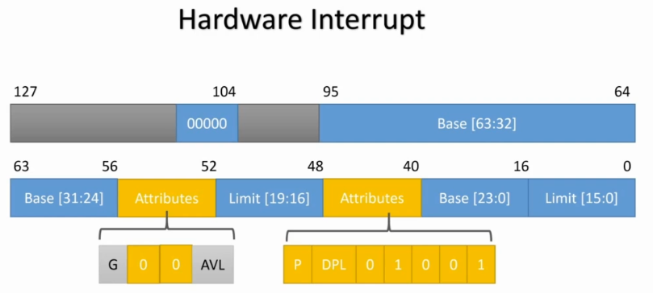

## Summary
- Title: Write Your Own Operating System From Scratch - Step by Step
- Instructor: x-BIT Development

## References
- [1] https://www.cs.bham.ac.uk/~exr/lectures/opsys/10_11/lectures/os-dev.pdf
- [2] https://github.com/cfenollosa/os-tutorial

## Section 1: Introduction

1. Introduction
- Requirements
  - X86 assembly
  - C language

2. MUST SEE
- A test computer
  - CPU
  - No HDD
  - PS/2 keyboard
- A USB flash drive
  - To boot
  - Use Rufus

3. OS concepts
- Address space
  - 64bit address
  - Byte addressing
    - 0, 1, 2, ... 2^64-1
- Process
  - Kernel (code, data)
  - Stack
  - Heap
  - Data
  - Instructions
- When multiple rocesses run, each process has Kernel-stack-heap-data-instructions structure each
- Operation modes
  - Kernel mode
    - Interface w/ HW
  - User mode
    - Where application runs

4. OS structures
- Monolithic system
  - System call + scheduling + Memory management + Device drivers at Kernel space
  - Direct communication among modules
  - An error in a module will panic entire OS
- Microkernel
  - OS is divided into small modules
  - Memory management+Device Drivers are at user space
  - Only Scheduling and Interprocess communication at Kernel space
  - Kernel is very small

## Section 2: Installation and Setup

5. Working with Windows10
- Windows subsystem for Linux
  - Run Ubuntu 
  - Install nasm
- Bochs x86 PC emulator
  - Make a `boot.img`
  - Enable 1GB page memory
  - ATA channel 9 20/16/63 for cylindeerrs/heads/Sectors per track

6. Working with MacOS

7. Working with Linux (Ubuntu)
- gcc, nasm
- `sudo apt install bochs`
- `sudo apt install bochs-x`
- bximage: 1-> hd -> flat -> 512 -> 10 -> boot.img
- bochs
  - Enable 1G page 
```bash
$ bximage  
========================================================================
                                bximage
                  Disk Image Creation Tool for Bochs
          $Id: bximage.c 11315 2012-08-05 18:13:38Z vruppert $
========================================================================

Do you want to create a floppy disk image or a hard disk image?
Please type hd or fd. [hd] 

What kind of image should I create?
Please type flat, sparse or growing. [flat] 

Enter the hard disk size in megabytes, between 1 and 8257535
[10] 

I will create a 'flat' hard disk image with
  cyl=20
  heads=16
  sectors per track=63
  total sectors=20160
  total size=9.84 megabytes

What should I name the image?
[c.img] boot.img

Writing: [] Done.

I wrote 10321920 bytes to boot.img.

The following line should appear in your bochsrc:
  ata0-master: type=disk, path="boot.img", mode=flat, cylinders=20, heads=16, spt=63
$ bochs
========================================================================
                        Bochs x86 Emulator 2.6
            Built from SVN snapshot on September 2nd, 2012
========================================================================
00000000000i[     ] LTDL_LIBRARY_PATH not set. using compile time default '/usr/lib/bochs/plugins'
00000000000i[     ] BXSHARE not set. using compile time default '/usr/share/bochs'
00000000000i[     ] lt_dlhandle is 0x55ad64847c70
00000000000i[PLGIN] loaded plugin libbx_unmapped.so
00000000000i[     ] lt_dlhandle is 0x55ad648492e0
00000000000i[PLGIN] loaded plugin libbx_biosdev.so
00000000000i[     ] lt_dlhandle is 0x55ad6484ac50
00000000000i[PLGIN] loaded plugin libbx_speaker.so
00000000000i[     ] lt_dlhandle is 0x55ad6484b470
00000000000i[PLGIN] loaded plugin libbx_extfpuirq.so
00000000000i[     ] lt_dlhandle is 0x55ad6484bc50
00000000000i[PLGIN] loaded plugin libbx_parallel.so
00000000000i[     ] lt_dlhandle is 0x55ad6484d890
00000000000i[PLGIN] loaded plugin libbx_serial.so
00000000000i[     ] lt_dlhandle is 0x55ad64851640
00000000000i[PLGIN] loaded plugin libbx_gameport.so
00000000000i[     ] lt_dlhandle is 0x55ad64851f00
00000000000i[PLGIN] loaded plugin libbx_iodebug.so
00000000000e[     ] Switching off quick start, because no configuration file was found.
------------------------------
Bochs Configuration: Main Menu
------------------------------

This is the Bochs Configuration Interface, where you can describe the
machine that you want to simulate.  Bochs has already searched for a
configuration file (typically called bochsrc.txt) and loaded it if it
could be found.  When you are satisfied with the configuration, go
ahead and start the simulation.

You can also start bochs with the -q option to skip these menus.

1. Restore factory default configuration
2. Read options from...
3. Edit options
4. Save options to...
5. Restore the Bochs state from...
6. Begin simulation
7. Quit now

Please choose one: [2] 3
------------------
Bochs Options Menu
------------------
0. Return to previous menu
1. Optional plugin control
2. Logfile options
3. Log options for all devices
4. Log options for individual devices
5. CPU options
6. CPUID options
7. Memory options
8. Clock & CMOS options
9. PCI options
10. Bochs Display & Interface options
11. Keyboard & Mouse options
12. Disk & Boot options
13. Serial / Parallel / USB options
14. Network card options
15. Sound card options
16. Other options
17. User-defined options

Please choose one: [0] 6

-------------
CPUID Options
-------------
0. Return to previous menu
1. CPUID vendor string: GenuineIntel
2. CPUID brand string:               Intel(R) Pentium(R) 4 CPU        
3. Stepping ID: 3
4. Model ID: 3
5. Family ID: 6
6. Support for MMX instruction set: yes
7. APIC configuration: xapic
8. Support for SSE instruction set: sse2
9. Support for AMD SSE4A instructions: no
10. Support for SYSENTER/SYSEXIT instructions: yes
11. Support for MOVBE instruction: no
12. Support for ADX instructions: no
13. Support for AES instruction set: no
14. Support for XSAVE extensions: no
15. Support for XSAVEOPT instruction: no
16. Support for AVX instruction set: 0
17. Support for AVX F16 convert instructions: no
18. Support for AVX FMA instructions: no
19. Support for BMI instructions: 0
20. Support for AMD XOP instructions: no
21. Support for AMD four operand FMA instructions: no
22. Support for AMD TBM instructions: no
23. x86-64 and long mode: yes
24. 1G pages support in long mode: no
25. PCID support in long mode: no
26. FS/GS BASE access instructions support: no
27. Supervisor Mode Execution Protection support: no
28. MONITOR/MWAIT instructions support: yes
29. Support for Intel VMX extensions emulation: 1

Please choose one: [0] 24

1G pages support in long mode? [no] yes

-------------
CPUID Options
-------------
0. Return to previous menu
1. CPUID vendor string: GenuineIntel
2. CPUID brand string:               Intel(R) Pentium(R) 4 CPU        
3. Stepping ID: 3
4. Model ID: 3
5. Family ID: 6
6. Support for MMX instruction set: yes
7. APIC configuration: xapic
8. Support for SSE instruction set: sse2
9. Support for AMD SSE4A instructions: no
10. Support for SYSENTER/SYSEXIT instructions: yes
11. Support for MOVBE instruction: no
12. Support for ADX instructions: no
13. Support for AES instruction set: no
14. Support for XSAVE extensions: no
15. Support for XSAVEOPT instruction: no
16. Support for AVX instruction set: 0
17. Support for AVX F16 convert instructions: no
18. Support for AVX FMA instructions: no
19. Support for BMI instructions: 0
20. Support for AMD XOP instructions: no
21. Support for AMD four operand FMA instructions: no
22. Support for AMD TBM instructions: no
23. x86-64 and long mode: yes
24. 1G pages support in long mode: yes
25. PCID support in long mode: no
26. FS/GS BASE access instructions support: no
27. Supervisor Mode Execution Protection support: no
28. MONITOR/MWAIT instructions support: yes
29. Support for Intel VMX extensions emulation: 1

Please choose one: [0] 
------------------
Bochs Options Menu
------------------
0. Return to previous menu
1. Optional plugin control
2. Logfile options
3. Log options for all devices
4. Log options for individual devices
5. CPU options
6. CPUID options
7. Memory options
8. Clock & CMOS options
9. PCI options
10. Bochs Display & Interface options
11. Keyboard & Mouse options
12. Disk & Boot options
13. Serial / Parallel / USB options
14. Network card options
15. Sound card options
16. Other options
17. User-defined options

Please choose one: [0] 7

--------------
Memory Options
--------------
0. Return to previous menu
1. Standard Options
2. Optional ROM Images
3. Optional RAM Images

Please choose one: [0] 1

----------------
Standard Options
----------------
1. RAM size options
2. BIOS ROM options
3. VGABIOS ROM options

Please choose one: [0] 1

----------------
RAM size options
----------------

Enter memory size (MB): [32] 1024

Enter host memory size (MB): [32] 1024

----------------
Standard Options
----------------
1. RAM size options
2. BIOS ROM options
3. VGABIOS ROM options

Please choose one: [0] 

--------------
Memory Options
--------------
0. Return to previous menu
1. Standard Options
2. Optional ROM Images
3. Optional RAM Images

Please choose one: [0] 
------------------
Bochs Options Menu
------------------
0. Return to previous menu
1. Optional plugin control
2. Logfile options
3. Log options for all devices
4. Log options for individual devices
5. CPU options
6. CPUID options
7. Memory options
8. Clock & CMOS options
9. PCI options
10. Bochs Display & Interface options
11. Keyboard & Mouse options
12. Disk & Boot options
13. Serial / Parallel / USB options
14. Network card options
15. Sound card options
16. Other options
17. User-defined options

Please choose one: [0] 12

------------------
Bochs Disk Options
------------------
0. Return to previous menu
1. First Floppy Drive
2. Second Floppy Drive
3. ATA channel 0
4. First HD/CD on channel 0
5. Second HD/CD on channel 0
6. ATA channel 1
7. First HD/CD on channel 1
8. Second HD/CD on channel 1
9. ATA channel 2
10. First HD/CD on channel 2 (disabled)
11. Second HD/CD on channel 2 (disabled)
12. ATA channel 3
13. First HD/CD on channel 3 (disabled)
14. Second HD/CD on channel 3 (disabled)
15. Boot Options

Please choose one: [0] 3

-------------
ATA channel 0
-------------

Channel is enabled: [yes] 

Enter new ioaddr1: [0x1f0] 

Enter new ioaddr2: [0x3f0] 

Enter new IRQ: [14] 

------------------
Bochs Disk Options
------------------
0. Return to previous menu
1. First Floppy Drive
2. Second Floppy Drive
3. ATA channel 0
4. First HD/CD on channel 0
5. Second HD/CD on channel 0
6. ATA channel 1
7. First HD/CD on channel 1
8. Second HD/CD on channel 1
9. ATA channel 2
10. First HD/CD on channel 2 (disabled)
11. Second HD/CD on channel 2 (disabled)
12. ATA channel 3
13. First HD/CD on channel 3 (disabled)
14. Second HD/CD on channel 3 (disabled)
15. Boot Options

Please choose one: [0] 4

------------------------
First HD/CD on channel 0
------------------------

Device is enabled: [no] yes

Enter type of ATA device, disk or cdrom: [disk] 

Enter new filename: [] boot.img

Enter mode of ATA device, (flat, concat, etc.): [flat] 

Enter number of cylinders: [0] 20

Enter number of heads: [0] 16

Enter number of sectors per track: [0] 63

Enter new model name: [Generic 1234]

Enter bios detection type: [auto]

Enter translation type: [auto]

------------------
Bochs Disk Options
------------------
0. Return to previous menu
1. First Floppy Drive
2. Second Floppy Drive
3. ATA channel 0
4. First HD/CD on channel 0
5. Second HD/CD on channel 0
6. ATA channel 1
7. First HD/CD on channel 1
8. Second HD/CD on channel 1
9. ATA channel 2
10. First HD/CD on channel 2 (disabled)
11. Second HD/CD on channel 2 (disabled)
12. ATA channel 3
13. First HD/CD on channel 3 (disabled)
14. Second HD/CD on channel 3 (disabled)
15. Boot Options

Please choose one: [0] 15

------------
Boot Options
------------
0. Return to previous menu
1. Boot drive #1: floppy
2. Boot drive #2: none
3. Boot drive #3: none
4. Skip Floppy Boot Signature Check: no
5. 32-bit OS Loader Hack

Please choose one: [0] 1

Boot from floppy drive, hard drive or cdrom ? [floppy] disk

------------
Boot Options
------------
0. Return to previous menu
1. Boot drive #1: disk
2. Boot drive #2: none
3. Boot drive #3: none
4. Skip Floppy Boot Signature Check: no
5. 32-bit OS Loader Hack

Please choose one: [0] 

------------------
Bochs Disk Options
------------------
0. Return to previous menu
1. First Floppy Drive
2. Second Floppy Drive
3. ATA channel 0
4. First HD/CD on channel 0
5. Second HD/CD on channel 0
6. ATA channel 1
7. First HD/CD on channel 1
8. Second HD/CD on channel 1
9. ATA channel 2
10. First HD/CD on channel 2 (disabled)
11. Second HD/CD on channel 2 (disabled)
12. ATA channel 3
13. First HD/CD on channel 3 (disabled)
14. Second HD/CD on channel 3 (disabled)
15. Boot Options

Please choose one: [0] 
------------------
Bochs Options Menu
------------------
0. Return to previous menu
1. Optional plugin control
2. Logfile options
3. Log options for all devices
4. Log options for individual devices
5. CPU options
6. CPUID options
7. Memory options
8. Clock & CMOS options
9. PCI options
10. Bochs Display & Interface options
11. Keyboard & Mouse options
12. Disk & Boot options
13. Serial / Parallel / USB options
14. Network card options
15. Sound card options
16. Other options
17. User-defined options

Please choose one: [0] 
------------------------------
Bochs Configuration: Main Menu
------------------------------

This is the Bochs Configuration Interface, where you can describe the
machine that you want to simulate.  Bochs has already searched for a
configuration file (typically called bochsrc.txt) and loaded it if it
could be found.  When you are satisfied with the configuration, go
ahead and start the simulation.

You can also start bochs with the -q option to skip these menus.

1. Restore factory default configuration
2. Read options from...
3. Edit options
4. Save options to...
5. Restore the Bochs state from...
6. Begin simulation
7. Quit now

Please choose one: [6] 4
Save configuration to what file?  To cancel, type 'none'.
[none] bochsrc
00000000000i[     ] write current configuration to bochsrc
Wrote configuration to 'bochsrc'.
------------------------------
Bochs Configuration: Main Menu
------------------------------

This is the Bochs Configuration Interface, where you can describe the
machine that you want to simulate.  Bochs has already searched for a
configuration file (typically called bochsrc.txt) and loaded it if it
could be found.  When you are satisfied with the configuration, go
ahead and start the simulation.

You can also start bochs with the -q option to skip these menus.

1. Restore factory default configuration
2. Read options from...
3. Edit options
4. Save options to...
5. Restore the Bochs state from...
6. Begin simulation
7. Quit now

Please choose one: [6] 7
00000000000i[CTRL ] quit_sim called with exit code 1
```
- Produced bochsrc:
```bash
# configuration file generated by Bochs
plugin_ctrl: unmapped=1, biosdev=1, speaker=1, extfpuirq=1, parallel=1, serial=1
, gameport=1, iodebug=1
config_interface: textconfig
display_library: x
memory: host=1024, guest=1024
romimage: file="/usr/share/bochs/BIOS-bochs-latest"
vgaromimage: file="/usr/share/bochs/VGABIOS-lgpl-latest"
boot: disk
floppy_bootsig_check: disabled=0
# no floppya
# no floppyb
ata0: enabled=1, ioaddr1=0x1f0, ioaddr2=0x3f0, irq=14
ata0-master: type=disk, mode=flat, translation=auto, path="boot.img", cylinders=
20, heads=16, spt=63, biosdetect=auto, model="Generic 1234"
ata1: enabled=1, ioaddr1=0x170, ioaddr2=0x370, irq=15
ata2: enabled=0
ata3: enabled=0
pci: enabled=1, chipset=i440fx
vga: extension=vbe, update_freq=5
cpu: count=1, ips=4000000, model=bx_generic, reset_on_triple_fault=1, cpuid_limi
t_winnt=0, ignore_bad_msrs=1, mwait_is_nop=0
cpuid: family=6, model=0x03, stepping=3, mmx=1, apic=xapic, sse=sse2, sse4a=0, s
ep=1, aes=0, xsave=0, xsaveopt=0, movbe=0, adx=0, smep=0, avx=0, avx_f16c=0, avx
_fma=0, bmi=0, xop=0, tbm=0, fma4=0, vmx=1, x86_64=1, 1g_pages=1, pcid=0, fsgsba
se=0, mwait=1
cpuid: vendor_string="GenuineIntel"
cpuid: brand_string="              Intel(R) Pentium(R) 4 CPU        "

print_timestamps: enabled=0
debugger_log: -
magic_break: enabled=0
port_e9_hack: enabled=0
private_colormap: enabled=0
clock: sync=none, time0=local, rtc_sync=0
# no cmosimage
# no loader
log: -
logprefix: %t%e%d
panic: action=ask
error: action=report
info: action=report
debug: action=ignore
keyboard: type=mf, serial_delay=250, paste_delay=100000, keymap=
user_shortcut: keys=none
mouse: enabled=0, type=ps2, toggle=ctrl+mbutton
parport1: enabled=1, file=""
parport2: enabled=0
com1: enabled=1, mode=null, dev=""
com2: enabled=0
com3: enabled=0
com4: enabled=0
```

8. How to use Resources

## Section 3: Boot Up

9. The first program
- BIOS
  - Basic Input Output System
  - Services run in real mode
  - Print characters
  - Disk services
  - Memory map
  - Video mode
- Boot
  - Find boot device and read the first sector from it into memroy location 0x7c00 (MBR code)
  - Jump to 0x7c00
- BIOS mode
  - Real Mode: boot process
  - Protected Mode: prepares for long mode
  - Long Mode: 64bit mode. Compatibility mode
    - Cannot print
- UEFI
- Real Mode
  - Load Kernel
  - Retrieve information about HW
  - Sgement Registeres (16bit)
    - cs : Code Segment
    - ds : Data Segment
    - es : Extra Segment
    - ss : Stack Segment
  - Address Format
    - Segment Register: offset(logical address)
    - Segment Register x 16 + Offset = Physical address
  - General purpose registers
    - 8bit: al ah bl bh
    - 16bit: ax bx cx dx
    - 32bit: eax ebx ecx edx
    - 64bit: rax rbx rcx rdx are not available in Real Mode
```assembly
[BITS 16]
[ORG 0x7c00]
start:
    xor ax,ax   
    mov ds,ax
    mov es,ax  
    mov ss,ax
    mov sp,0x7c00 ; 
PrintMessage:
    mov ah,0x13  ; service 13 - print string. For tty mode, mov ah,0x0e
    mov al,1
    mov bx,0xa ; 0xa means the character is printed in bright screen
    xor dx,dx
    mov bp,Message
    mov cx,MessageLen 
    int 0x10  ; 
End:
    hlt    
    jmp End
Message:    db "Hello"
MessageLen: equ $-Message
times (0x1be-($-$$)) db 0
    db 80h      ; boot indicator
    db 0,2,0    ; starting CHS
    db 0f0h     ; type
    db 0ffh,0ffh,0ffh ; ending CHS
    dd 1        ; starting sector 
    dd (20*16*63-1)  ; size
    times (16*3) db 0
    db 0x55     ; signature
    db 0xaa	    ; signature
```
- [2]: `int 0x10` is a general interrupt for video services
- Build script (build.sh)
```bash
nasm -f bin -o boot.bin boot.asm
dd if=boot.bin of=boot.img bs=512 count=1 conv=notrunc
```

10. Testing on Windows 10

11. Testing on Linux (Ubuntu)
```bash
$ bash ./build.sh 
1+0 records in
1+0 records out
512 bytes copied, 0.000165192 s, 3.1 MB/s
$ bochs
...
<bochs:1> c # enter c to continue
```

- "Hello" is printed
  - If `Message: dlopen failed for module 'x': file not found` is found at bochs, install bochs-x

- How to make a bootable USB to boot from a physical/actual computer:
```
$ sudo fdisk -l
$ sudo dd if=boot.img of=/dev/sdb bs=512 count=1
```

12. Testing on MacOS

13. Test Disk Extension Service
- [2]: When the computer boots, the BIOS doesn't know how to load the OS, so it delegates that task to the boot sector. Thus, the boot sector must be placed in a known, standard location. That location is the first sector of the disk (cylinder 0, head 0, sector 0) and it takes 512 bytes. To make sure that the "disk is bootable", the BIOS checks that bytes 511 and 512 of the alleged boot sector are bytes **0xAA55**.
- Adding the check of disk extension
```assembly
[BITS 16]
[ORG 0x7c00] ; global offset
; [2]  since offsetting 0x7c00 everywhere is very inconvenient, assemblers let us define a "global offset" for every memory location, with the ORG command
start:
    xor ax,ax   
    mov ds,ax
    mov es,ax  
    mov ss,ax
    mov sp,0x7c00
TestDiskExtension:
    mov [DriveId],dl
    mov ah,0x41 ; ref=https://www.ctyme.com/intr/rb-0706.htm
    mov bx,0x55aa
    int 0x13
    jc NotSupport
    cmp bx,0xaa55
    jne NotSupport
PrintMessage:
    mov ah,0x13
    mov al,1
    mov bx,0xa
    xor dx,dx
    mov bp,Message
    mov cx,MessageLen 
    int 0x10
NotSupport:
End:
    hlt    
    jmp End    
DriveId:    db 0
Message:    db "Disk extension is supported"
MessageLen: equ $-Message
times (0x1be-($-$$)) db 0
    db 80h
    db 0,2,0
    db 0f0h
    db 0ffh,0ffh,0ffh
    dd 1
    dd (20*16*63-1)	
    times (16*3) db 0
    db 0x55
    db 0xaa
```
- BIOS places memory at 0x7c00
- ./build.sh and bochs again

## Section 4: Loading the Loader and Switching to Long Mode

14. Loader
- Loader retrieves information about HW
- Prepares for 64-bit mode and switch to it
- Loader loads kernel in main memroy
- Jump to kernel
- Loader doesn't have 512 limit
- MBR code at 0x7c00
- Loader at 0x7e00
- Ref: https://www.ctyme.com/intr/rb-0708.htm
- boot.asm:
```assembly
[BITS 16]
[ORG 0x7c00]
start:
    xor ax,ax   
    mov ds,ax
    mov es,ax  
    mov ss,ax
    mov sp,0x7c00
TestDiskExtension:
    mov [DriveId],dl
    mov ah,0x41
    mov bx,0x55aa
    int 0x13
    jc NotSupport
    cmp bx,0xaa55
    jne NotSupport
LoadLoader:
    mov si,ReadPacket     ; offset field
    mov word[si],0x10     ; 0      size
    mov word[si+2],5      ; 2      number of sectors
    mov word[si+4],0x7e00 ; 4      offset
    mov word[si+6],0      ; 6      segment
    mov dword[si+8],1     ; 8      address lo
    mov dword[si+0xc],0   ; 12     address hi
    mov dl,[DriveId]
    mov ah,0x42
    int 0x13
    jc  ReadError
    mov dl,[DriveId]
    jmp 0x7e00 
ReadError:
NotSupport:
    mov ah,0x13
    mov al,1
    mov bx,0xa
    xor dx,dx
    mov bp,Message
    mov cx,MessageLen 
    int 0x10
End:
    hlt    
    jmp End    
DriveId:    db 0
Message:    db "We have an error in boot process"
MessageLen: equ $-Message
ReadPacket: times 16 db 0
times (0x1be-($-$$)) db 0
    db 80h
    db 0,2,0
    db 0f0h
    db 0ffh,0ffh,0ffh
    dd 1
    dd (20*16*63-1)	
    times (16*3) db 0
    db 0x55
    db 0xaa
```
- loader.asm:
  - DriveId from boot.asm must be delivered to loader.asm
```assembly
[BITS 16]
[ORG 0x7e00]
start:
    mov ah,0x13
    mov al,1
    mov bx,0xa
    xor dx,dx
    mov bp,Message
    mov cx,MessageLen 
    int 0x10    
End:
    hlt
    jmp End
Message:    db "loader starts"
MessageLen: equ $-Message
```
- build.sh
```bash
nasm -f bin -o boot.bin boot.asm
nasm -f bin -o loader.bin loader.asm
dd if=boot.bin of=boot.img bs=512 count=1 conv=notrunc
dd if=loader.bin of=boot.img bs=512 count=5 seek=1 conv=notrunc
```
- Build image
```bash
$ bash build.sh
1+0 records in
1+0 records out
512 bytes copied, 9.4243e-05 s, 5.4 MB/s
0+1 records in
0+1 records out
33 bytes copied, 7.9545e-05 s, 415 kB/s
```

15. Long Mode Support
- Checks if the CPU supports Long Mode
- loader.asm:
```assembly
[BITS 16]
[ORG 0x7e00]
start:
    mov [DriveId],dl
    mov eax,0x80000000
    cpuid
    cmp eax,0x80000001
    jb NotSupport
    mov eax,0x80000001
    cpuid
    test edx,(1<<29)
    jz NotSupport
    test edx,(1<<26)
    jz NotSupport
    mov ah,0x13
    mov al,1
    mov bx,0xa
    xor dx,dx
    mov bp,Message
    mov cx,MessageLen 
    int 0x10
NotSupport:
End:
    hlt
    jmp End
DriveId:    db 0
Message:    db "long mode is supported"
MessageLen: equ $-Message
```

16. Load Kernel File
- Memory map
```
Free (reserved for HW)
--------- 0x100000
Reserved
--------- 0x80000
Kernel
--------- 0x10000
Free (reserved for HW)
Loader
--------- 0x7e00
Boot
--------- 0x7c00
Free
BIOS data Vectors
--------- 0
```
- loader.asm:
```assembly
[BITS 16]
[ORG 0x7e00]
start:
    mov [DriveId],dl
    mov eax,0x80000000
    cpuid
    cmp eax,0x80000001
    jb NotSupport
    mov eax,0x80000001
    cpuid
    test edx,(1<<29)
    jz NotSupport
    test edx,(1<<26)
    jz NotSupport
LoadKernel:
    mov si,ReadPacket
    mov word[si],0x10
    mov word[si+2],100
    mov word[si+4],0       ; offset
    mov word[si+6],0x1000  ; Segment 0x1000:0 = 0x1000*16+0 = 0x100000 Kernel memory map shown above
    mov dword[si+8],6
    mov dword[si+0xc],0
    mov dl,[DriveId]
    mov ah,0x42
    int 0x13
    jc  ReadError
    mov ah,0x13
    mov al,1
    mov bx,0xa
    xor dx,dx
    mov bp,Message
    mov cx,MessageLen 
    int 0x10
ReadError:
NotSupport:
End:
    hlt
    jmp End
DriveId:    db 0
Message:    db "kernel is loaded"
MessageLen: equ $-Message
ReadPacket: times 16 db 0
```

17. Get Memory Map
- Ref: https://www.ctyme.com/intr/rb-1741.htm
- loader.asm:
```assembly
[BITS 16]
[ORG 0x7e00]
start:
    mov [DriveId],dl
    mov eax,0x80000000
    cpuid
    cmp eax,0x80000001
    jb NotSupport
    mov eax,0x80000001
    cpuid
    test edx,(1<<29)
    jz NotSupport
    test edx,(1<<26)
    jz NotSupport
LoadKernel:
    mov si,ReadPacket
    mov word[si],0x10
    mov word[si+2],100
    mov word[si+4],0
    mov word[si+6],0x1000
    mov dword[si+8],6
    mov dword[si+0xc],0
    mov dl,[DriveId]
    mov ah,0x42
    int 0x13
    jc  ReadError
GetMemInfoStart:
    mov eax,0xe820
    mov edx,0x534d4150
    mov ecx,20
    mov edi,0x9000
    xor ebx,ebx
    int 0x15
    jc NotSupport
GetMemInfo:
    add edi,20
    mov eax,0xe820
    mov edx,0x534d4150
    mov ecx,20
    int 0x15
    jc GetMemDone
    test ebx,ebx
    jnz GetMemInfo
GetMemDone:
    mov ah,0x13
    mov al,1
    mov bx,0xa
    xor dx,dx
    mov bp,Message
    mov cx,MessageLen 
    int 0x10
ReadError:
NotSupport:
End:
    hlt
    jmp End
DriveId:    db 0
Message:    db "Get memory info done"
MessageLen: equ $-Message
ReadPacket: times 16 db 0
```
- We don't print the detailed memory map yet as print function is not implemented. Check Section 7 to print

18. Test A20 Line
- Ref: https://en.wikipedia.org/wiki/A20_line
   - For legacy BIOS boot loader
   - UEFI boot loaders use 32 bit protected mode or 64bit long mode

19. Set Video Mode
- Use ASCII code and set foreground/background color
- loader.asm:
```assembly
[BITS 16]
[ORG 0x7e00]
start:
    mov [DriveId],dl
    mov eax,0x80000000
    cpuid
    cmp eax,0x80000001
    jb NotSupport
    mov eax,0x80000001
    cpuid
    test edx,(1<<29)
    jz NotSupport
    test edx,(1<<26)
    jz NotSupport
LoadKernel:
    mov si,ReadPacket
    mov word[si],0x10
    mov word[si+2],100
    mov word[si+4],0
    mov word[si+6],0x1000
    mov dword[si+8],6
    mov dword[si+0xc],0
    mov dl,[DriveId]
    mov ah,0x42
    int 0x13
    jc  ReadError
GetMemInfoStart:
    mov eax,0xe820
    mov edx,0x534d4150
    mov ecx,20
    mov edi,0x9000
    xor ebx,ebx
    int 0x15
    jc NotSupport
GetMemInfo:
    add edi,20
    mov eax,0xe820
    mov edx,0x534d4150
    mov ecx,20
    int 0x15
    jc GetMemDone
    test ebx,ebx
    jnz GetMemInfo
GetMemDone:
TestA20:
    mov ax,0xffff
    mov es,ax
    mov word[ds:0x7c00],0xa200
    cmp word[es:0x7c10],0xa200
    jne SetA20LineDone
    mov word[0x7c00],0xb200
    cmp word[es:0x7c10],0xb200
    je End
SetA20LineDone:
    xor ax,ax
    mov es,ax
SetVideoMode:
    mov ax,3
    int 0x10        
    mov si,Message
    mov ax,0xb800
    mov es,ax
    xor di,di
    mov cx,MessageLen
PrintMessage:
    mov al,[si]
    mov [es:di],al
    mov byte[es:di+1],0xa
    add di,2
    add si,1
    loop PrintMessage
ReadError:
NotSupport:
End:
    hlt
    jmp End
DriveId:    db 0
Message:    db "Text mode is set"
MessageLen: equ $-Message
ReadPacket: times 16 db 0
```

- Printed without BIOS service

20. Protected Mode
- Entering protected mode
  - Load GDT
  - Load IDT
  - Enable Protected Mode
  - Jump to PM Entry
- GDT (Global Descriptor Table)
  - Segment registers: cs ds es ss
- IDT (Interrupt Descriptor Table)
  - Up to 256 entries
  - Handling keyboard, input, ...
- 4 levels of privilege
  - Level 0: kernel
  - Level 1/2:
  - Level 3: user program
- How to figure out the current privilege level?
  - Current Privilege Level: stored in cs and ss
  - Descriptor Privilege LeveL: stored in descriptors
  - Requested Privilege Level: stored in segment selectors
- Descriptor entry
  - Code segment
  - Data segment
- loader.asm:
```assembly
[BITS 16]
[ORG 0x7e00]
start:
    mov [DriveId],dl
    mov eax,0x80000000
    cpuid
    cmp eax,0x80000001
    jb NotSupport
    mov eax,0x80000001
    cpuid
    test edx,(1<<29)
    jz NotSupport
    test edx,(1<<26)
    jz NotSupport
LoadKernel:
    mov si,ReadPacket
    mov word[si],0x10
    mov word[si+2],100
    mov word[si+4],0
    mov word[si+6],0x1000
    mov dword[si+8],6
    mov dword[si+0xc],0
    mov dl,[DriveId]
    mov ah,0x42
    int 0x13
    jc  ReadError
GetMemInfoStart:
    mov eax,0xe820
    mov edx,0x534d4150
    mov ecx,20
    mov edi,0x9000
    xor ebx,ebx
    int 0x15
    jc NotSupport
GetMemInfo:
    add edi,20
    mov eax,0xe820
    mov edx,0x534d4150
    mov ecx,20
    int 0x15
    jc GetMemDone
    test ebx,ebx
    jnz GetMemInfo
GetMemDone:
TestA20:
    mov ax,0xffff
    mov es,ax
    mov word[ds:0x7c00],0xa200
    cmp word[es:0x7c10],0xa200
    jne SetA20LineDone
    mov word[0x7c00],0xb200
    cmp word[es:0x7c10],0xb200
    je End    
SetA20LineDone:
    xor ax,ax
    mov es,ax
SetVideoMode:
    mov ax,3
    int 0x10    
    cli
    lgdt [Gdt32Ptr]
    lidt [Idt32Ptr]
    mov eax,cr0
    or eax,1
    mov cr0,eax
    jmp 8:PMEntry  ; The index of the selector is 8
                   ; 00001000(binary)
                   ; index T RPL
ReadError:
NotSupport:
End:
    hlt
    jmp End
[BITS 32]
PMEntry:
    mov ax,0x10
    mov ds,ax
    mov es,ax
    mov ss,ax
    mov esp,0x7c00
    mov byte[0xb8000],'P'
    mov byte[0xb8001],0xa
PEnd:
    hlt
    jmp PEnd    
DriveId:    db 0
ReadPacket: times 16 db 0
Gdt32:
    dq 0
Code32:         ; Code segment
    dw 0xffff
    dw 0
    db 0
    db 0x9a
    db 0xcf
    db 0
Data32:         ; Data segment
    dw 0xffff
    dw 0
    db 0
    db 0x92
    db 0xcf
    db 0    
Gdt32Len: equ $-Gdt32
Gdt32Ptr: dw Gdt32Len-1
          dd Gdt32
Idt32Ptr: dw 0
          dd 0
```
- Both of code segment and data segment are necessary

21. Long Mode
- 64 bit mode and compatibility mode
  - OS runs in 64-bit mode
  - OS kernel and applications run in 64-bit mode
- Entering Long mode
  - Load GDT
  - Load IDT
  - Prepare for paging and enable it
  - Enable long mode
  - Jump to LM entry
- Global Descriptor Table
  - Segment registeres: cs ds es ss
- Descriptor entry
  - Code segment
  
  - Data segment
  
- Canonical address: the bits 63 through to the most-significant implemented bit are either all ones or all zeros
- loader.asm:
```assembly
[BITS 16]
[ORG 0x7e00]
start:
    mov [DriveId],dl
    mov eax,0x80000000
    cpuid
    cmp eax,0x80000001
    jb NotSupport
    mov eax,0x80000001
    cpuid
    test edx,(1<<29)
    jz NotSupport
    test edx,(1<<26)
    jz NotSupport
LoadKernel:
    mov si,ReadPacket
    mov word[si],0x10
    mov word[si+2],100
    mov word[si+4],0
    mov word[si+6],0x1000
    mov dword[si+8],6
    mov dword[si+0xc],0
    mov dl,[DriveId]
    mov ah,0x42
    int 0x13
    jc  ReadError
GetMemInfoStart:
    mov eax,0xe820
    mov edx,0x534d4150
    mov ecx,20
    mov edi,0x9000
    xor ebx,ebx
    int 0x15
    jc NotSupport
GetMemInfo:
    add edi,20
    mov eax,0xe820
    mov edx,0x534d4150
    mov ecx,20
    int 0x15
    jc GetMemDone
    test ebx,ebx
    jnz GetMemInfo
GetMemDone:
TestA20:
    mov ax,0xffff
    mov es,ax
    mov word[ds:0x7c00],0xa200
    cmp word[es:0x7c10],0xa200
    jne SetA20LineDone
    mov word[0x7c00],0xb200
    cmp word[es:0x7c10],0xb200
    je End    
SetA20LineDone:
    xor ax,ax
    mov es,ax
SetVideoMode:
    mov ax,3
    int 0x10
    cli
    lgdt [Gdt32Ptr]
    lidt [Idt32Ptr]
    mov eax,cr0
    or eax,1
    mov cr0,eax
    jmp 8:PMEntry
ReadError:
NotSupport:
End:
    hlt
    jmp End
[BITS 32]
PMEntry:
    mov ax,0x10
    mov ds,ax
    mov es,ax
    mov ss,ax
    mov esp,0x7c00
    cld
    mov edi,0x70000
    xor eax,eax
    mov ecx,0x10000/4
    rep stosd    
    mov dword[0x70000],0x71007
    mov dword[0x71000],10000111b
    lgdt [Gdt64Ptr]
    mov eax,cr4
    or eax,(1<<5)
    mov cr4,eax
    mov eax,0x70000
    mov cr3,eax
    mov ecx,0xc0000080
    rdmsr
    or eax,(1<<8)
    wrmsr
    mov eax,cr0
    or eax,(1<<31)
    mov cr0,eax
    jmp 8:LMEntry
PEnd:
    hlt
    jmp PEnd
[BITS 64]
LMEntry:
    mov rsp,0x7c00
    mov byte[0xb8000],'L'
    mov byte[0xb8001],0xa
LEnd:
    hlt
    jmp LEnd    
DriveId:    db 0
ReadPacket: times 16 db 0
Gdt32:
    dq 0
Code32:
    dw 0xffff
    dw 0
    db 0
    db 0x9a
    db 0xcf
    db 0
Data32:
    dw 0xffff
    dw 0
    db 0
    db 0x92
    db 0xcf
    db 0    
Gdt32Len: equ $-Gdt32
Gdt32Ptr: dw Gdt32Len-1
          dd Gdt32
Idt32Ptr: dw 0
          dd 0
Gdt64:
    dq 0
    dq 0x0020980000000000
Gdt64Len: equ $-Gdt64
Gdt64Ptr: dw Gdt64Len-1
          dd Gdt64
```

## Section 5: Exceptions and Interrupts Handling on the x86

22. Jumping to Kernel
- loader.asm
```asm
[BITS 16]
[ORG 0x7e00]
start:
    mov [DriveId],dl
    mov eax,0x80000000
    cpuid
    cmp eax,0x80000001
    jb NotSupport
    mov eax,0x80000001
    cpuid
    test edx,(1<<29)
    jz NotSupport
    test edx,(1<<26)
    jz NotSupport
LoadKernel:
    mov si,ReadPacket
    mov word[si],0x10
    mov word[si+2],100
    mov word[si+4],0
    mov word[si+6],0x1000
    mov dword[si+8],6
    mov dword[si+0xc],0
    mov dl,[DriveId]
    mov ah,0x42
    int 0x13
    jc  ReadError
GetMemInfoStart:
    mov eax,0xe820
    mov edx,0x534d4150
    mov ecx,20
    mov edi,0x9000
    xor ebx,ebx
    int 0x15
    jc NotSupport
GetMemInfo:
    add edi,20
    mov eax,0xe820
    mov edx,0x534d4150
    mov ecx,20
    int 0x15
    jc GetMemDone
    test ebx,ebx
    jnz GetMemInfo
GetMemDone:
TestA20:
    mov ax,0xffff
    mov es,ax
    mov word[ds:0x7c00],0xa200
    cmp word[es:0x7c10],0xa200
    jne SetA20LineDone
    mov word[0x7c00],0xb200
    cmp word[es:0x7c10],0xb200
    je End    
SetA20LineDone:
    xor ax,ax
    mov es,ax
SetVideoMode:
    mov ax,3
    int 0x10    
    cli
    lgdt [Gdt32Ptr]
    lidt [Idt32Ptr]
    mov eax,cr0
    or eax,1
    mov cr0,eax
    jmp 8:PMEntry
ReadError:
NotSupport:
End:
    hlt
    jmp End
[BITS 32]
PMEntry:
    mov ax,0x10
    mov ds,ax
    mov es,ax
    mov ss,ax
    mov esp,0x7c00
    cld
    mov edi,0x70000
    xor eax,eax
    mov ecx,0x10000/4
    rep stosd
    mov dword[0x70000],0x71007
    mov dword[0x71000],10000111b
    lgdt [Gdt64Ptr]
    mov eax,cr4
    or eax,(1<<5)
    mov cr4,eax
    mov eax,0x70000
    mov cr3,eax
    mov ecx,0xc0000080
    rdmsr
    or eax,(1<<8)
    wrmsr
    mov eax,cr0
    or eax,(1<<31)
    mov cr0,eax
    jmp 8:LMEntry
PEnd:
    hlt
    jmp PEnd
[BITS 64]
LMEntry:
    mov rsp,0x7c00
    cld
    mov rdi,0x200000 ; destination
    mov rsi,0x10000  ; source
    mov rcx,51200/8  ; this is counter
    rep movsq        ; copy 
    jmp 0x200000     ; we jump to kernel
LEnd:
    hlt
    jmp LEnd    
DriveId:    db 0
ReadPacket: times 16 db 0
Gdt32:
    dq 0
Code32:
    dw 0xffff
    dw 0
    db 0
    db 0x9a
    db 0xcf
    db 0
Data32:
    dw 0xffff
    dw 0
    db 0
    db 0x92
    db 0xcf
    db 0    
Gdt32Len: equ $-Gdt32
Gdt32Ptr: dw Gdt32Len-1
          dd Gdt32
Idt32Ptr: dw 0
          dd 0
Gdt64:
    dq 0
    dq 0x0020980000000000
Gdt64Len: equ $-Gdt64
Gdt64Ptr: dw Gdt64Len-1
          dd Gdt64
```
- kernel.asm:
```asm
[BITS 64]
[ORG 0x200000]
start:
    mov byte[0xb8000],'K'
    mov byte[0xb8001],0xa
End:
    hlt
    jmp End
```
- build.sh:
```bash
nasm -f bin -o boot.bin boot.asm
nasm -f bin -o loader.bin loader.asm
nasm -f bin -o kernel.bin kernel.asm
dd if=boot.bin of=boot.img bs=512 count=1 conv=notrunc
dd if=loader.bin of=boot.img bs=512 count=5 seek=1 conv=notrunc
dd if=kernel.bin of=boot.img bs=512 count=100 seek=6 conv=notrunc
```
- command:
    - bash build.sh
    - Enter c in the prompt
    - Find K in the bochs terminal

23. Reload GDT
- kernel.asm
```asm
[BITS 64]
[ORG 0x200000]
start:
    ; cs selector: 0x7c00
    ; offset     : RSP
    ;
    lgdt [Gdt64Ptr]
    push 8
    push KernelEntry
    db 0x48
    retf
KernelEntry:
    mov byte[0xb8000],'K'
    mov byte[0xb8001],0xa
End:
    hlt
    jmp End
Gdt64:
    dq 0
    dq 0x0020980000000000
Gdt64Len: equ $-Gdt64
Gdt64Ptr: dw Gdt64Len-1
          dq Gdt64
```
- lgdt/lidt: Load Global/Interrupt Descriptor Table Register
    - Ref: https://www.felixcloutier.com/x86/lgdt:lidt
- retf: far return. Return to the same privilege level

24. Exceptions and Interrupts Handling
- Interrupts: HW interrupts
- Exceptions: internal errors


- IST is not used in the lecture
- DPL in attributes will be edited
- There are 256 different interrupt handling


- kernel.asm:
```asm
[BITS 64]
[ORG 0x200000]
start:
    ;  63....32  31...16  15...0  bit
    ;  xxxxxxxx  xxxxxxx  xxxxxx  handler0 address
    mov rdi,Idt       ; IDT, interrupt handler
    mov rax,Handler0
    mov [rdi],ax     ; first 2 bytes (15...0)
    shr rax,16        
    mov [rdi+6],ax   ; 31...16
    shr rax,16
    mov [rdi+8],eax  ; 63...32
    lgdt [Gdt64Ptr]
    lidt [IdtPtr]
    push 8
    push KernelEntry
    db 0x48
    retf
KernelEntry:
    mov byte[0xb8000],'K'
    mov byte[0xb8001],0xa
    xor rbx,rbx
    div rbx   ; yields divide by zero to make an interrupt
End:
    hlt
    jmp End
Handler0:
    mov byte[0xb8000],'D'  ; We print 'D' in the screen
    mov byte[0xb8001],0xc  ; character in red
    jmp End
    iretq
Gdt64:
    dq 0
    dq 0x0020980000000000
Gdt64Len: equ $-Gdt64
Gdt64Ptr: dw Gdt64Len-1  ; 2byte
          dq Gdt64       ; 8byte
Idt:
    %rep 256  ; repeat 256 times
        dw 0
        dw 0x8  ; attribute field 6byte
        db 0
                 ; P DPL TYPE 
        db 0x8e  ; 1 00  01110 
        dw 0
        dd 0
        dd 0
    %endrep
IdtLen: equ $-Idt
IdtPtr: dw IdtLen-1 ; 2byte
        dq Idt      ; 8byte
```
- Kernel code runs -> divide by zero -> Handler0 is activated

25. Saving Registers
- kernel.asm:
```asm
[BITS 64]
[ORG 0x200000]
start:
    mov rdi,Idt
    mov rax,Handler0
    mov [rdi],ax
    shr rax,16
    mov [rdi+6],ax
    shr rax,16
    mov [rdi+8],eax
    lgdt [Gdt64Ptr]
    lidt [IdtPtr]
    push 8
    push KernelEntry
    db 0x48
    retf
KernelEntry:
    mov byte[0xb8000],'K'
    mov byte[0xb8001],0xa
    xor rbx,rbx
    div rbx
End:
    hlt
    jmp End
Handler0:
    push rax
    push rbx  
    push rcx
    push rdx  	  
    push rsi
    push rdi
    push rbp
    push r8
    push r9
    push r10
    push r11
    push r12
    push r13
    push r14
    push r15    
    mov byte[0xb8000],'D'
    mov byte[0xb8001],0xc
    jmp End
    pop	r15
    pop	r14
    pop	r13
    pop	r12
    pop	r11
    pop	r10
    pop	r9
    pop	r8
    pop	rbp
    pop	rdi
    pop	rsi  
    pop	rdx
    pop	rcx
    pop	rbx
    pop	rax
    iretq
Gdt64:
    dq 0
    dq 0x0020980000000000
Gdt64Len: equ $-Gdt64
Gdt64Ptr: dw Gdt64Len-1
          dq Gdt64
Idt:
    %rep 256
        dw 0
        dw 0x8
        db 0
        db 0x8e
        dw 0
        dd 0
        dd 0
    %endrep
IdtLen: equ $-Idt
IdtPtr: dw IdtLen-1
        dq Idt
```

26. Setting Up the Interrupt Controller
- HW interrupt
    - The programmable interrupt controller
        - Manages the interrupt requests (IRQ)
    - The programmable interval timer
        - Periodic timer
- kernel.asm:
```asm
[BITS 64]
[ORG 0x200000]
start:
    mov rdi,Idt
    mov rax,Handler0
    mov [rdi],ax
    shr rax,16
    mov [rdi+6],ax
    shr rax,16
    mov [rdi+8],eax
    mov rax,Timer
    add rdi,32*16
    mov [rdi],ax
    shr rax,16
    mov [rdi+6],ax
    shr rax,16
    mov [rdi+8],eax
    lgdt [Gdt64Ptr]
    lidt [IdtPtr]
    push 8
    push KernelEntry
    db 0x48
    retf
KernelEntry:
    ; 7 6 5 4 3 2 1 0 bit
    ; 00   11  010  0
    mov byte[0xb8000],'K'
    mov byte[0xb8001],0xa
InitPIT:
    mov al,(1<<2)|(3<<4) ; 1193182/100 = 11931
    out 0x43,al
    mov ax,11931
    out 0x40,al
    mov al,ah
    out 0x40,al
InitPIC:
    mov al,0x11
    out 0x20,al
    out 0xa0,al
    ; Initialization Commmand word 2
    ; 7 6 5 4 3 2 1 0 bit
    ; 0 0 1 0 0 0 0 0 = 32
    mov al,32
    out 0x21,al
    mov al,40
    out 0xa1,al
    ; Initialization Commmand word 3
    ; 7 6 5 4 3 2 1 0 bit
    ; 0 0 0 0 0 1 0 0 = 4
    ; 0 0 0 0 0 0 1 0 = 2
    mov al,4
    out 0x21,al
    mov al,2
    out 0xa1,al
    ; Initialization Commmand word 4
    ; 7 6 5 4 3 2 1 0 bit
    ; 0 0 0 0 0 0 0 1
    mov al,1
    out 0x21,al
    out 0xa1,al
    mov al,11111110b
    out 0x21,al
    mov al,11111111b
    out 0xa1,al
    sti
End:
    hlt
    jmp End
Handler0:
    push rax
    push rbx  
    push rcx
    push rdx  	  
    push rsi
    push rdi
    push rbp
    push r8
    push r9
    push r10
    push r11
    push r12
    push r13
    push r14
    push r15
    mov byte[0xb8000],'D'
    mov byte[0xb8001],0xc
    jmp End
    pop	r15
    pop	r14
    pop	r13
    pop	r12
    pop	r11
    pop	r10
    pop	r9
    pop	r8
    pop	rbp
    pop	rdi
    pop	rsi  
    pop	rdx
    pop	rcx
    pop	rbx
    pop	rax
    iretq
Timer:
    push rax
    push rbx  
    push rcx
    push rdx  	  
    push rsi
    push rdi
    push rbp
    push r8
    push r9
    push r10
    push r11
    push r12
    push r13
    push r14
    push r15
    mov byte[0xb8020],'T'
    mov byte[0xb8021],0xe
    jmp End   
    pop	r15
    pop	r14
    pop	r13
    pop	r12
    pop	r11
    pop	r10
    pop	r9
    pop	r8
    pop	rbp
    pop	rdi
    pop	rsi  
    pop	rdx
    pop	rcx
    pop	rbx
    pop	rax
    iretq
Gdt64:
    dq 0
    dq 0x0020980000000000
Gdt64Len: equ $-Gdt64
Gdt64Ptr: dw Gdt64Len-1
          dq Gdt64
Idt:
    %rep 256
        dw 0
        dw 0x8
        db 0
        db 0x8e
        dw 0
        dd 0
        dd 0
    %endrep
IdtLen: equ $-Idt
IdtPtr: dw IdtLen-1
        dq Idt
```

27. Getting to Ring3
- How to jump from Ring0 to Ring3
    - Lower 2bit of cs register
- Ref: https://stackoverflow.com/questions/18717016/what-are-ring-0-and-ring-3-in-the-context-of-operating-systems
    - CPU is in one of 4 rings
    - Linux kernel only uses 0 and 3
        - 0 for kernel. Can do anything
        - 3 for users
```asm
[BITS 64]
[ORG 0x200000]
start:
    mov rdi,Idt
    mov rax,Handler0
    mov [rdi],ax
    shr rax,16
    mov [rdi+6],ax
    shr rax,16
    mov [rdi+8],eax
    mov rax,Timer
    add rdi,32*16
    mov [rdi],ax
    shr rax,16
    mov [rdi+6],ax
    shr rax,16
    mov [rdi+8],eax
    lgdt [Gdt64Ptr]
    lidt [IdtPtr]
    push 8
    push KernelEntry
    db 0x48
    retf
KernelEntry:
    mov byte[0xb8000],'K'
    mov byte[0xb8001],0xa
    ; High Address: ss Selector
    ;               RSP
    ;               Rflags
    ;               cs selector
    ; Low Adddress: RIP <= RSP
InitPIT:
    mov al,(1<<2)|(3<<4)
    out 0x43,al
    mov ax,11931
    out 0x40,al
    mov al,ah
    out 0x40,al
InitPIC:
    mov al,0x11
    out 0x20,al
    out 0xa0,al
    mov al,32
    out 0x21,al
    mov al,40
    out 0xa1,al
    mov al,4
    out 0x21,al
    mov al,2
    out 0xa1,al
    mov al,1
    out 0x21,al
    out 0xa1,al
    mov al,11111110b
    out 0x21,al
    mov al,11111111b
    out 0xa1,al
    push 0x18|3
    push 0x7c00
    push 0x2
    push 0x10|3
    push UserEntry
    iretq
End:
    hlt
    jmp End
UserEntry:
    mov ax,cs
    and al,11b
    cmp al,3
    jne UEnd
    mov byte[0xb8010],'U'
    mov byte[0xb8011],0xE
UEnd:
    jmp UEnd
Handler0:
    push rax
    push rbx  
    push rcx
    push rdx  	  
    push rsi
    push rdi
    push rbp
    push r8
    push r9
    push r10
    push r11
    push r12
    push r13
    push r14
    push r15    
    mov byte[0xb8000],'D'
    mov byte[0xb8001],0xc
    jmp End
    pop	r15
    pop	r14
    pop	r13
    pop	r12
    pop	r11
    pop	r10
    pop	r9
    pop	r8
    pop	rbp
    pop	rdi
    pop	rsi  
    pop	rdx
    pop	rcx
    pop	rbx
    pop	rax
    iretq
Timer:
    push rax
    push rbx  
    push rcx
    push rdx  	  
    push rsi
    push rdi
    push rbp
    push r8
    push r9
    push r10
    push r11
    push r12
    push r13
    push r14
    push r15
    mov byte[0xb8020],'T'
    mov byte[0xb8021],0xe
    jmp End
    pop	r15
    pop	r14
    pop	r13
    pop	r12
    pop	r11
    pop	r10
    pop	r9
    pop	r8
    pop	rbp
    pop	rdi
    pop	rsi  
    pop	rdx
    pop	rcx
    pop	rbx
    pop	rax
    iretq
Gdt64:
    dq 0                   ; D L P DPL 1 1 C
    dq 0x0020980000000000  ; 0 1 1  00 1 1 0
    dq 0x0020f80000000000  ; 0 1 1  11 1 1 0
                           ; P DPL 1 0 0 W 0
    dq 0x0000f20000000000  ; 1  11 1 0 0 1 0
Gdt64Len: equ $-Gdt64
Gdt64Ptr: dw Gdt64Len-1
          dq Gdt64
Idt:
    %rep 256
        dw 0
        dw 0x8
        db 0
        db 0x8e
        dw 0
        dd 0
        dd 0
    %endrep
IdtLen: equ $-Idt
IdtPtr: dw IdtLen-1
        dq Idt
```

28. Interrupts Handling in Ring3 Part I
- kernel.asm:
```asm
[BITS 64]
[ORG 0x200000]
start:
    mov rdi,Idt
    mov rax,Handler0
    mov [rdi],ax
    shr rax,16
    mov [rdi+6],ax
    shr rax,16
    mov [rdi+8],eax
    mov rax,Timer
    add rdi,32*16
    mov [rdi],ax
    shr rax,16
    mov [rdi+6],ax
    shr rax,16
    mov [rdi+8],eax
    lgdt [Gdt64Ptr]
    lidt [IdtPtr]
SetTss:
    mov rax,Tss
    mov [TssDesc+2],ax
    shr rax,16
    mov [TssDesc+4],al
    shr rax,8
    mov [TssDesc+7],al
    shr rax,8
    mov [TssDesc+8],eax
    mov ax,0x20
    ltr ax
    push 8
    push KernelEntry
    db 0x48
    retf
KernelEntry:
    mov byte[0xb8000],'K'
    mov byte[0xb8001],0xa
InitPIT:
    mov al,(1<<2)|(3<<4)
    out 0x43,al
    mov ax,11931
    out 0x40,al
    mov al,ah
    out 0x40,al
InitPIC:
    mov al,0x11
    out 0x20,al
    out 0xa0,al
    mov al,32
    out 0x21,al
    mov al,40
    out 0xa1,al
    mov al,4
    out 0x21,al
    mov al,2
    out 0xa1,al
    mov al,1
    out 0x21,al
    out 0xa1,al
    mov al,11111110b
    out 0x21,al
    mov al,11111111b
    out 0xa1,al
    ;sti
    push 0x18|3
    push 0x7c00
    push 0x202
    push 0x10|3
    push UserEntry
    iretq
End:
    hlt
    jmp End
UserEntry:
    mov ax,cs
    and al,11b
    cmp al,3
    jne UEnd
    mov byte[0xb8010],'U'
    mov byte[0xb8011],0xE
UEnd:
    jmp UEnd
Handler0:
    push rax
    push rbx  
    push rcx
    push rdx  	  
    push rsi
    push rdi
    push rbp
    push r8
    push r9
    push r10
    push r11
    push r12
    push r13
    push r14
    push r15    
    mov byte[0xb8000],'D'
    mov byte[0xb8001],0xc
    jmp End
    pop	r15
    pop	r14
    pop	r13
    pop	r12
    pop	r11
    pop	r10
    pop	r9
    pop	r8
    pop	rbp
    pop	rdi
    pop	rsi  
    pop	rdx
    pop	rcx
    pop	rbx
    pop	rax
    iretq
Timer:
    push rax
    push rbx  
    push rcx
    push rdx  	  
    push rsi
    push rdi
    push rbp
    push r8
    push r9
    push r10
    push r11
    push r12
    push r13
    push r14
    push r15
    mov byte[0xb8020],'T'
    mov byte[0xb8021],0xe
    jmp End
    pop	r15
    pop	r14
    pop	r13
    pop	r12
    pop	r11
    pop	r10
    pop	r9
    pop	r8
    pop	rbp
    pop	rdi
    pop	rsi  
    pop	rdx
    pop	rcx
    pop	rbx
    pop	rax
    iretq
Gdt64:
    dq 0
    dq 0x0020980000000000
    dq 0x0020f80000000000
    dq 0x0000f20000000000
TssDesc:
    dw TssLen-1
    dw 0
    db 0
    db 0x89
    db 0
    db 0
    dq 0
Gdt64Len: equ $-Gdt64
Gdt64Ptr: dw Gdt64Len-1
          dq Gdt64
Idt:
    %rep 256
        dw 0
        dw 0x8
        db 0
        db 0x8e
        dw 0
        dd 0
        dd 0
    %endrep
IdtLen: equ $-Idt
IdtPtr: dw IdtLen-1
        dq Idt
Tss:
    dd 0
    dq 0x150000
    times 88 db 0
    dd TssLen
TssLen: equ $-Tss
```


29. Interrupts Handling in Ring3 Part II

30. Spurious Interrupt Handling
- Not real interrupt
- 

## Section 6: Working with C

31. Kernel main
- build.sh:
```bash
nasm -f bin -o boot.bin boot.asm
nasm -f bin -o loader.bin loader.asm
nasm -f elf64 -o kernel.o kernel.asm
gcc -std=c99 -mcmodel=large -ffreestanding -fno-stack-protector -mno-red-zone -c main.c 
ld -nostdlib -T link.lds -o kernel kernel.o main.o
objcopy -O binary kernel kernel.bin 
dd if=boot.bin of=boot.img bs=512 count=1 conv=notrunc
dd if=loader.bin of=boot.img bs=512 count=5 seek=1 conv=notrunc
dd if=kernel.bin of=boot.img bs=512 count=100 seek=6 conv=notrunc
```
- link.lds:
    - Ref: https://bravegnu.org/gnu-eprog/lds.html
```
OUTPUT_FORMAT("elf64-x86-64")
ENTRY(start)
SECTIONS
{
    . = 0x200000;
    .text : {
        *(.text)
    }
    .rodata : {
        *(.rodata)
    }
    . = ALIGN(16);
    .data : {
        *(.data)
    }
    .bss : {
        *(.bss)
    }
}
```
- kernel.asm:
```
section .data
Gdt64:
    dq 0
    dq 0x0020980000000000
    dq 0x0020f80000000000
    dq 0x0000f20000000000
TssDesc:
    dw TssLen-1
    dw 0
    db 0
    db 0x89
    db 0
    db 0
    dq 0
Gdt64Len: equ $-Gdt64
Gdt64Ptr: dw Gdt64Len-1
          dq Gdt64
Tss:
    dd 0
    dq 0x190000
    times 88 db 0
    dd TssLen
TssLen: equ $-Tss
section .text
extern KMain
global start
start:
    lgdt [Gdt64Ptr]
SetTss:
    mov rax,Tss
    mov [TssDesc+2],ax
    shr rax,16
    mov [TssDesc+4],al
    shr rax,8
    mov [TssDesc+7],al
    shr rax,8
    mov [TssDesc+8],eax
    mov ax,0x20
    ltr ax
InitPIT:
    mov al,(1<<2)|(3<<4)
    out 0x43,al
    mov ax,11931
    out 0x40,al
    mov al,ah
    out 0x40,al
InitPIC:
    mov al,0x11
    out 0x20,al
    out 0xa0,al
    mov al,32
    out 0x21,al
    mov al,40
    out 0xa1,al
    mov al,4
    out 0x21,al
    mov al,2
    out 0xa1,al
    mov al,1
    out 0x21,al
    out 0xa1,al
    mov al,11111110b
    out 0x21,al
    mov al,11111111b
    out 0xa1,al
    push 8
    push KernelEntry
    db 0x48
    retf
KernelEntry:
    mov rsp,0x200000
    call KMain
End:
    hlt
    jmp End
```
- main.c
```c
void KMain(void)
{
    char* p = (char*)0xb8000; 
    p[0] = 'C';
    p[1] = 0xa;
}
```
- Text mode video memory is a buffer located at 0xB8000 for color monitor and 0xB00000 for monochrome
    - Ref: http://kernelx.weebly.com/text-console.html
- Color code: https://gist.github.com/Pwootage/1396569
    - 0xa is green
 
32. Putting it all together
- System V AMD64 calling convention
    - The first 6 parameters -> RDI RSI RDX RCX R8 R9 others are on the stack
    - Return value -> RAX
    - RAX RCX RDX RSI RDI R8 R9 R10 R11 Caller saved registers
    - RBX RBP R12 R13 R14 R15 Callee saved registers
- trap.h
```c
#ifndef _TRAP_H_
#define _TRAP_H_
#include "stdint.h"
struct IdtEntry {
    uint16_t low; /* bottom 2bytes as offset */
    uint16_t selector;
    uint8_t res0;
    uint8_t attr;
    uint16_t mid;
    uint32_t high;
    uint32_t res1;
};
struct IdtPtr {
    uint16_t limit;
    uint64_t addr;
} __attribute__((packed));
struct TrapFrame {
    int64_t r15;
    int64_t r14;
    int64_t r13;
    int64_t r12;
    int64_t r11;
    int64_t r10;
    int64_t r9;
    int64_t r8;
    int64_t rbp;
    int64_t rdi;
    int64_t rsi;
    int64_t rdx;
    int64_t rcx;
    int64_t rbx;
    int64_t rax;
    int64_t trapno;
    int64_t errorcode;
    int64_t rip;
    int64_t cs;
    int64_t rflags;
    int64_t rsp;
    int64_t ss;
};
void vector0(void);
void vector1(void);
void vector2(void);
void vector3(void);
void vector4(void);
void vector5(void);
void vector6(void);
void vector7(void);
void vector8(void);
void vector10(void);
void vector11(void);
void vector12(void);
void vector13(void);
void vector14(void);
void vector16(void);
void vector17(void);
void vector18(void);
void vector19(void);
void vector32(void);
void vector39(void);
void init_idt(void);
void eoi(void);
void load_idt(struct IdtPtr *ptr);
unsigned char read_isr(void);
#endif
```
- Using `__attribute__((packed))`
    - No insertion of padding
    - Ref: https://stackoverflow.com/questions/8568432/is-gccs-attribute-packed-pragma-pack-unsafe
- trap.asm
```asm
section .text
extern handler
global vector0
global vector1
global vector2
global vector3
global vector4
global vector5
global vector6
global vector7
global vector8
global vector10
global vector11
global vector12
global vector13
global vector14
global vector16
global vector17
global vector18
global vector19
global vector32
global vector39
global eoi
global read_isr
global load_idt
Trap:
    push rax
    push rbx  
    push rcx
    push rdx  	  
    push rsi
    push rdi
    push rbp
    push r8
    push r9
    push r10
    push r11
    push r12
    push r13
    push r14
    push r15
    inc byte[0xb8010]
    mov byte[0xb8011],0xe
    mov rdi,rsp  ; first parameter
    call handler ; from C code
TrapReturn:
    pop	r15
    pop	r14
    pop	r13
    pop	r12
    pop	r11
    pop	r10
    pop	r9
    pop	r8
    pop	rbp
    pop	rdi
    pop	rsi  
    pop	rdx
    pop	rcx
    pop	rbx
    pop	rax       
    add rsp,16   ; traps here
    iretq
vector0:
    push 0
    push 0
    jmp Trap
vector1:
    push 0
    push 1
    jmp Trap
vector2:
    push 0
    push 2
    jmp Trap
vector3:
    push 0
    push 3	
    jmp Trap 
vector4:
    push 0
    push 4	
    jmp Trap   
vector5:
    push 0
    push 5
    jmp Trap    
vector6:
    push 0
    push 6	
    jmp Trap      
vector7:
    push 0
    push 7	
    jmp Trap  
vector8:
    ; no 0 push as it will be done from C code
    push 8
    jmp Trap  
; vector9 is reserved
vector10:
    push 10	
    jmp Trap                    
vector11:
    push 11	
    jmp Trap    
vector12:
    push 12	
    jmp Trap                    
vector13:
    push 13	
    jmp Trap    
vector14:
    push 14	
    jmp Trap
; vector15 is reserved 
vector16:
    push 0
    push 16	
    jmp Trap                    
vector17:
    push 17	
    jmp Trap                         
vector18:
    push 0
    push 18	
    jmp Trap                   
vector19:
    push 0
    push 19	
    jmp Trap
vector32:
    push 0
    push 32
    jmp Trap
vector39:
    push 0
    push 39
    jmp Trap
eoi:
    mov al,0x20  ; processing the interrupt 
    ; ref: https://stackoverflow.com/questions/14848645/what-does-this-x86-assembly-language-code-with-io-ports-0x61-and-0x20-do
    out 0x20,al
    ret
read_isr:
    mov al,11
    out 0x20,al
    in al,0x20
    ret
load_idt:       ; no idt command in C so we write in asm
    lidt [rdi]
    ret
```
- trap.c
```c
#include "trap.h"
static struct IdtPtr idt_pointer;
static struct IdtEntry vectors[256];
static void init_idt_entry(struct IdtEntry *entry, uint64_t addr, uint8_t attribute)
{
    entry->low = (uint16_t)addr;
    entry->selector = 8;
    entry->attr = attribute;
    entry->mid = (uint16_t)(addr>>16);
    entry->high = (uint32_t)(addr>>32);
}
void init_idt(void)
{
    init_idt_entry(&vectors[0],(uint64_t)vector0,0x8e);
    init_idt_entry(&vectors[1],(uint64_t)vector1,0x8e);
    init_idt_entry(&vectors[2],(uint64_t)vector2,0x8e);
    init_idt_entry(&vectors[3],(uint64_t)vector3,0x8e);
    init_idt_entry(&vectors[4],(uint64_t)vector4,0x8e);
    init_idt_entry(&vectors[5],(uint64_t)vector5,0x8e);
    init_idt_entry(&vectors[6],(uint64_t)vector6,0x8e);
    init_idt_entry(&vectors[7],(uint64_t)vector7,0x8e);
    init_idt_entry(&vectors[8],(uint64_t)vector8,0x8e);
    init_idt_entry(&vectors[10],(uint64_t)vector10,0x8e);
    init_idt_entry(&vectors[11],(uint64_t)vector11,0x8e);
    init_idt_entry(&vectors[12],(uint64_t)vector12,0x8e);
    init_idt_entry(&vectors[13],(uint64_t)vector13,0x8e);
    init_idt_entry(&vectors[14],(uint64_t)vector14,0x8e);
    init_idt_entry(&vectors[16],(uint64_t)vector16,0x8e);
    init_idt_entry(&vectors[17],(uint64_t)vector17,0x8e);
    init_idt_entry(&vectors[18],(uint64_t)vector18,0x8e);
    init_idt_entry(&vectors[19],(uint64_t)vector19,0x8e);
    init_idt_entry(&vectors[32],(uint64_t)vector32,0x8e);
    init_idt_entry(&vectors[39],(uint64_t)vector39,0x8e);
    idt_pointer.limit = sizeof(vectors)-1;
    idt_pointer.addr = (uint64_t)vectors;
    load_idt(&idt_pointer);
}
void handler(struct TrapFrame *tf)
{
    unsigned char isr_value;
    switch (tf->trapno) {
        case 32:
            eoi();
            break;            
        case 39:
            isr_value = read_isr();
            if ((isr_value&(1<<7)) != 0) {
                eoi();
            }
            break;
        default:
            while (1) { }
    }
}
```
- kernel.asm
```asm
section .data
Gdt64:
    dq 0
    dq 0x0020980000000000
    dq 0x0020f80000000000
    dq 0x0000f20000000000
TssDesc:
    dw TssLen-1
    dw 0
    db 0
    db 0x89
    db 0
    db 0
    dq 0
Gdt64Len: equ $-Gdt64
Gdt64Ptr: dw Gdt64Len-1
          dq Gdt64
Tss:
    dd 0
    dq 0x190000
    times 88 db 0
    dd TssLen
TssLen: equ $-Tss
section .text
extern KMain
global start
start:
    lgdt [Gdt64Ptr]
SetTss:
    mov rax,Tss
    mov [TssDesc+2],ax
    shr rax,16
    mov [TssDesc+4],al
    shr rax,8
    mov [TssDesc+7],al
    shr rax,8
    mov [TssDesc+8],eax
    mov ax,0x20
    ltr ax
InitPIT:
    mov al,(1<<2)|(3<<4)
    out 0x43,al
    mov ax,11931
    out 0x40,al
    mov al,ah
    out 0x40,al
InitPIC:
    mov al,0x11
    out 0x20,al
    out 0xa0,al
    mov al,32
    out 0x21,al
    mov al,40
    out 0xa1,al
    mov al,4
    out 0x21,al
    mov al,2
    out 0xa1,al
    mov al,1
    out 0x21,al
    out 0xa1,al
    mov al,11111110b
    out 0x21,al
    mov al,11111111b
    out 0xa1,al
    push 8
    push KernelEntry
    db 0x48
    retf
KernelEntry: 
    xor ax,ax
    mov ss,ax
    
    mov rsp,0x200000
    call KMain
    sti
End:
    hlt
    jmp End
```
- build.sh
```
nasm -f bin -o boot.bin boot.asm
nasm -f bin -o loader.bin loader.asm
nasm -f elf64 -o kernel.o kernel.asm
nasm -f elf64 -o trapa.o trap.asm
gcc -std=c99 -mcmodel=large -ffreestanding -fno-stack-protector -mno-red-zone -c main.c 
gcc -std=c99 -mcmodel=large -ffreestanding -fno-stack-protector -mno-red-zone -c trap.c 
ld -nostdlib -T link.lds -o kernel kernel.o main.o trapa.o trap.o
objcopy -O binary kernel kernel.bin 
dd if=boot.bin of=boot.img bs=512 count=1 conv=notrunc
dd if=loader.bin of=boot.img bs=512 count=5 seek=1 conv=notrunc
dd if=kernel.bin of=boot.img bs=512 count=100 seek=6 conv=notrunc
```

33. Simple library functions

34. Print function

35. Assertion
- debug.h
```c
#ifndef _DEBUG_H_
#define _DEBUG_H_
#include "stdint.h"
#define ASSERT(e) do {                      \
        if (!(e))                           \
            error_check(__FILE__,__LINE__); \
} while (0) 
void error_check(char *file, uint64_t line);
#endif
```
- debug.c
```c
void error_check(char *file, uint64_t line)
{
    printk("\n------------------------------------------\n");
    printk("             ERROR CHECK");
    printk("\n------------------------------------------\n");
    printk("Assertion Failed [%s:%u]", file, line);
    while (1) { } /* infinite loop */
}
```

## Section 7: Memory Management

36. Retrieve Memory Map


- In loader.asm:
```asm
GetMemInfoStart:
    mov eax,0xe820
    mov edx,0x534d4150
    mov ecx,20
    mov dword[0x9000],0
    mov edi,0x9008
    xor ebx,ebx
    int 0x15
    jc NotSupport
GetMemInfo:
    add edi,20
    inc dword[0x9000] 
    test ebx,ebx
    jz GetMemDone
    mov eax,0xe820
    mov edx,0x534d4150
    mov ecx,20
    int 0x15
    jnc GetMemInfo
```
- memory.h:
```c
#ifndef _MEMORY_H_
#define _MEMORY_H_
#include "stdint.h"
struct E820 {
    uint64_t address;
    uint64_t length;
    uint32_t type;
} __attribute__((packed));
struct FreeMemRegion {
    uint64_t address;
    uint64_t length;
};
void init_memory(void);
#endif
```
- memory.c:
```c
#include "memory.h"
#include "print.h"
#include "debug.h"
static struct FreeMemRegion free_mem_region[50];
void init_memory(void)
{
    int32_t count = *(int32_t*)0x9000;
    uint64_t total_mem = 0;
    struct E820 *mem_map = (struct E820*)0x9008;	
    int free_region_count = 0;
    ASSERT(count <= 50);
	for(int32_t i = 0; i < count; i++) {        
        if(mem_map[i].type == 1) {
            free_mem_region[free_region_count].address = mem_map[i].address;
            free_mem_region[free_region_count].length = mem_map[i].length;
            total_mem += mem_map[i].length;
            free_region_count++;
        }        
        printk("%x  %uKB  %u\n", mem_map[i].address, mem_map[i].length/1024, (uint64_t)mem_map[i].type);
	}
    printk("Total memory is %uMB\n", total_mem/1024/1024);
}
```

37. Paging


- Mapping virtual page into physical memory page

38. Memory Allocator
- Collects free memory based on physical memory, not virtual

39. Memory Pages

40. Free Memory Page
```c
#include "memory.h"
#include "print.h"
#include "debug.h"
#include "lib.h"
#include "stddef.h"
#include "stdbool.h"
static void free_region(uint64_t v, uint64_t e);
static struct FreeMemRegion free_mem_region[50];
static struct Page free_memory;
static uint64_t memory_end;
uint64_t page_map;
extern char end;
void init_memory(void)
{
    int32_t count = *(int32_t*)0x9000;
    uint64_t total_mem = 0;
    struct E820 *mem_map = (struct E820*)0x9008;	
    int free_region_count = 0;
    ASSERT(count <= 50);
	for(int32_t i = 0; i < count; i++) {        
        if(mem_map[i].type == 1) {			
            free_mem_region[free_region_count].address = mem_map[i].address;
            free_mem_region[free_region_count].length = mem_map[i].length;
            total_mem += mem_map[i].length;
            free_region_count++;
        }
        printk("%x  %uKB  %u\n",mem_map[i].address,mem_map[i].length/1024,(uint64_t)mem_map[i].type);
	}
    for (int i = 0; i < free_region_count; i++) {                  
        uint64_t vstart = P2V(free_mem_region[i].address);
        uint64_t vend = vstart + free_mem_region[i].length;
        if (vstart > (uint64_t)&end) {
            free_region(vstart, vend);
        } 
        else if (vend > (uint64_t)&end) {
            free_region((uint64_t)&end, vend);
        }       
    }   
    memory_end = (uint64_t)free_memory.next+PAGE_SIZE;   
    printk("%x\n",memory_end);
}
static void free_region(uint64_t v, uint64_t e)
{
    for (uint64_t start = PA_UP(v); start+PAGE_SIZE <= e; start += PAGE_SIZE) {        
        if (start+PAGE_SIZE <= 0xffff800040000000) {            
           kfree(start);
        }
    }
}
void kfree(uint64_t v)
{
    ASSERT(v % PAGE_SIZE == 0);
    ASSERT(v >= (uint64_t) & end);
    ASSERT(v+PAGE_SIZE <= 0xffff800040000000);

    struct Page *page_address = (struct Page*)v;
    page_address->next = free_memory.next;
    free_memory.next = page_address;
}
void* kalloc(void)
{
    struct Page *page_address = free_memory.next;
    if (page_address != NULL) {
        ASSERT((uint64_t)page_address % PAGE_SIZE == 0);
        ASSERT((uint64_t)page_address >= (uint64_t)&end);
        ASSERT((uint64_t)page_address+PAGE_SIZE <= 0xffff800040000000);

        free_memory.next = page_address->next;            
    }   
    return page_address;
}
static PDPTR find_pml4t_entry(uint64_t map, uint64_t v, int alloc, uint32_t attribute)
{
    PDPTR *map_entry = (PDPTR*)map;
    PDPTR pdptr = NULL;
    unsigned int index = (v >> 39) & 0x1FF;
    if ((uint64_t)map_entry[index] & PTE_P) {
        pdptr = (PDPTR)P2V(PDE_ADDR(map_entry[index]));       
    } 
    else if (alloc == 1) {
        pdptr = (PDPTR)kalloc();          
        if (pdptr != NULL) {     
            memset(pdptr, 0, PAGE_SIZE);     
            map_entry[index] = (PDPTR)(V2P(pdptr) | attribute);           
        }
    } 
    return pdptr;    
}
static PD find_pdpt_entry(uint64_t map, uint64_t v, int alloc, uint32_t attribute)
{
    PDPTR pdptr = NULL;
    PD pd = NULL;
    unsigned int index = (v >> 30) & 0x1FF;
    pdptr = find_pml4t_entry(map, v, alloc, attribute);
    if (pdptr == NULL)
        return NULL;       
    if ((uint64_t)pdptr[index] & PTE_P) {      
        pd = (PD)P2V(PDE_ADDR(pdptr[index]));      
    }
    else if (alloc == 1) {
        pd = (PD)kalloc();  
        if (pd != NULL) {    
            memset(pd, 0, PAGE_SIZE);       
            pdptr[index] = (PD)(V2P(pd) | attribute);
        }
    } 
    return pd;
}
bool map_pages(uint64_t map, uint64_t v, uint64_t e, uint64_t pa, uint32_t attribute)
{
    uint64_t vstart = PA_DOWN(v);
    uint64_t vend = PA_UP(e);
    PD pd = NULL;
    unsigned int index;
    ASSERT(v < e);
    ASSERT(pa % PAGE_SIZE == 0);
    ASSERT(pa+vend-vstart <= 1024*1024*1024);
    do {
        pd = find_pdpt_entry(map, vstart, 1, attribute);    
        if (pd == NULL) {
            return false;
        }
        index = (vstart >> 21) & 0x1FF;
        ASSERT(((uint64_t)pd[index] & PTE_P) == 0);
        pd[index] = (PDE)(pa | attribute | PTE_ENTRY);
        vstart += PAGE_SIZE;
        pa += PAGE_SIZE;
    } while (vstart + PAGE_SIZE <= vend); 
    return true;
}
void switch_vm(uint64_t map)
{
    load_cr3(V2P(map));   
}
static void setup_kvm(void)
{
    page_map = (uint64_t)kalloc();
    ASSERT(page_map != 0);
    memset((void*)page_map, 0, PAGE_SIZE);        
    bool status = map_pages(page_map, KERNEL_BASE, memory_end, V2P(KERNEL_BASE), PTE_P|PTE_W);
    ASSERT(status == true);
}
void init_kvm(void)
{
    setup_kvm();
    switch_vm(page_map);
    printk("memory manager is working now");
}
void free_pages(uint64_t map, uint64_t vstart, uint64_t vend)
{
    unsigned int index; 
    ASSERT(vstart % PAGE_SIZE == 0);
    ASSERT(vend % PAGE_SIZE == 0);
    do {
        PD pd = find_pdpt_entry(map, vstart, 0, 0);
        if (pd != NULL) {
            index = (vstart >> 21) & 0x1FF;
            ASSERT(pd[index] & PTE_P);           
            kfree(P2V(PTE_ADDR(pd[index])));
            pd[index] = 0;
        }
        vstart += PAGE_SIZE;
    } while (vstart+PAGE_SIZE <= vend);
}
static void free_pdt(uint64_t map)
{
    PDPTR *map_entry = (PDPTR*)map;
    for (int i = 0; i < 512; i++) {
        if ((uint64_t)map_entry[i] & PTE_P) {            
            PD *pdptr = (PD*)P2V(PDE_ADDR(map_entry[i]));           
            for (int j = 0; j < 512; j++) {
                if ((uint64_t)pdptr[j] & PTE_P) {
                    kfree(P2V(PDE_ADDR(pdptr[j])));
                    pdptr[j] = 0;
                }
            }
        }
    }
}
static void free_pdpt(uint64_t map)
{
    PDPTR *map_entry = (PDPTR*)map;
    for (int i = 0; i < 512; i++) {
        if ((uint64_t)map_entry[i] & PTE_P) {          
            kfree(P2V(PDE_ADDR(map_entry[i])));
            map_entry[i] = 0;
        }
    }
}
static void free_pml4t(uint64_t map)
{
    kfree(map);
}
void free_vm(uint64_t map)
{   
    //free_pages(map,vstart,vend);
    free_pdt(map);
    free_pdpt(map);
    free_pml4t(map);
}
```

41. User Space

## Section 8: Processes

42. The first process
- 2 processes
    - each process has the same kernel space
    - User spaces are different
- process.h
```c
#ifndef _PROCESS_H_
#define _PROCESS_H_
#include "trap.h"
struct Process {
    int pid;
	int state;
	uint64_t page_map;	
	uint64_t stack;
	struct TrapFrame *tf;
};
struct TSS {
    uint32_t res0;
    uint64_t rsp0;
    uint64_t rsp1;
    uint64_t rsp2;
	uint64_t res1;
	uint64_t ist1;
	uint64_t ist2;
	uint64_t ist3;
	uint64_t ist4;
	uint64_t ist5;
	uint64_t ist6;
	uint64_t ist7;
	uint64_t res2;
	uint16_t res3;
	uint16_t iopb;
} __attribute__((packed));
#define STACK_SIZE (2*1024*1024)
#define NUM_PROC 10
#define PROC_UNUSED 0
#define PROC_INIT 1
void init_process(void);
void launch(void);
void pstart(struct TrapFrame *tf);
#endif
```
- process.c
```c
#include "process.h"
#include "trap.h"
#include "memory.h"
#include "print.h"
#include "lib.h"
#include "debug.h"
extern struct TSS Tss; 
static struct Process process_table[NUM_PROC];
static int pid_num = 1;
void main(void);
static void set_tss(struct Process *proc)
{
    Tss.rsp0 = proc->stack + STACK_SIZE;    
}
static struct Process* find_unused_process(void)
{
    struct Process *process = NULL;
    for (int i = 0; i < NUM_PROC; i++) {
        if (process_table[i].state == PROC_UNUSED) {
            process = &process_table[i];
            break;
        }
    }
    return process;
}
static void set_process_entry(struct Process *proc)
{
    uint64_t stack_top;
    proc->state = PROC_INIT;
    proc->pid = pid_num++;
    proc->stack = (uint64_t)kalloc();
    ASSERT(proc->stack != 0);
    memset((void*)proc->stack, 0, PAGE_SIZE);   
    stack_top = proc->stack + STACK_SIZE;
    proc->tf = (struct TrapFrame*)(stack_top - sizeof(struct TrapFrame)); 
    proc->tf->cs = 0x10|3;
    proc->tf->rip = 0x400000;
    proc->tf->ss = 0x18|3;
    proc->tf->rsp = 0x400000 + PAGE_SIZE;
    proc->tf->rflags = 0x202;    
    proc->page_map = setup_kvm();
    /*
                Kernel stack
    low address: rip (0x400000) <=RSP
                 cs
                 rflags
                 rsp (0x600000)
    high address:ss
    */
    ASSERT(proc->page_map != 0);
    ASSERT(setup_uvm(proc->page_map, (uint64_t)main, PAGE_SIZE));
}
void init_process(void)
{  
    struct Process *proc = find_unused_process();
    ASSERT(proc == &process_table[0]);

    set_process_entry(proc);
}
void launch(void)
{
    set_tss(&process_table[0]);
    switch_vm(process_table[0].page_map);
    pstart(process_table[0].tf);
}
void main(void)
{
    char *p = (char*)0xffff800000200020;
    *p = 1;
}
```

43. System call
- Using interrupt, run print function
- From user mode: print function -> int 0x80
- In the kernel mode: handler -> system call -> write screen
- syscall.h
```c
#ifndef _SYSCALL_H_
#define _SYSCALL_H_
#include "trap.h"
typedef int (*SYSTEMCALL)(int64_t *argptr);
void init_system_call(void);
void system_call(struct TrapFrame *tf);
#endif
```
- syscall.c
```c
#include "syscall.h"
#include "print.h"
#include "debug.h"
#include "stddef.h"
static SYSTEMCALL system_calls[10];
static int sys_write(int64_t *argptr)
{    
    write_screen((char*)argptr[0], (int)argptr[1], 0xe);  
    return (int)argptr[1];
}
void init_system_call(void)
{
    system_calls[0] = sys_write;
}
void system_call(struct TrapFrame *tf)
{
    int64_t i = tf->rax;
    int64_t param_count = tf->rdi;
    int64_t *argptr = (int64_t*)tf->rsi;
    if (param_count < 0 || i != 0) { 
        tf->rax = -1;
        return;
    }    
    ASSERT(system_calls[i] != NULL);
    tf->rax = system_calls[i](argptr);
}
```

44. Scheduling
- How to switch from one process to another
- Every 10ms, timer interrupt runs and user mode is trapped
- process.c
```c
#include "process.h"
#include "trap.h"
#include "memory.h"
#include "print.h"
#include "lib.h"
#include "debug.h"
extern struct TSS Tss; 
static struct Process process_table[NUM_PROC];
static int pid_num = 1;
static struct ProcessControl pc;
static void set_tss(struct Process *proc)
{
    Tss.rsp0 = proc->stack + STACK_SIZE;    
}
static struct Process* find_unused_process(void)
{
    struct Process *process = NULL;
    for (int i = 0; i < NUM_PROC; i++) {
        if (process_table[i].state == PROC_UNUSED) {
            process = &process_table[i];
            break;
        }
    }
    return process;
}
static void set_process_entry(struct Process *proc, uint64_t addr)
{
    uint64_t stack_top;
    proc->state = PROC_INIT;
    proc->pid = pid_num++;
    proc->stack = (uint64_t)kalloc();
    ASSERT(proc->stack != 0);
    memset((void*)proc->stack, 0, PAGE_SIZE);   
    stack_top = proc->stack + STACK_SIZE;
    proc->context = stack_top - sizeof(struct TrapFrame) - 7*8;   
    *(uint64_t*)(proc->context + 6*8) = (uint64_t)TrapReturn;
    proc->tf = (struct TrapFrame*)(stack_top - sizeof(struct TrapFrame)); 
    proc->tf->cs = 0x10|3;
    proc->tf->rip = 0x400000;
    proc->tf->ss = 0x18|3;
    proc->tf->rsp = 0x400000 + PAGE_SIZE;
    proc->tf->rflags = 0x202;   
    proc->page_map = setup_kvm();
    ASSERT(proc->page_map != 0);
    ASSERT(setup_uvm(proc->page_map, P2V(addr), 5120));
    proc->state = PROC_READY;    
}
static struct ProcessControl* get_pc(void)
{
    return &pc;
}
void init_process(void)
{
    struct ProcessControl *process_control;
    struct Process *process;
    struct HeadList *list;
    uint64_t addr[2] = {0x20000, 0x30000};
    process_control = get_pc();
    list = &process_control->ready_list;
    for (int i = 0; i < 2; i++) {
        process = find_unused_process();
        set_process_entry(process, addr[i]);
        append_list_tail(list, (struct List*)process);
    }
}
void launch(void)
{
    struct ProcessControl *process_control;
    struct Process *process;
    process_control = get_pc();
    process = (struct Process*)remove_list_head(&process_control->ready_list);
    process->state = PROC_RUNNING;
    process_control->current_process = process;   
    set_tss(process);
    switch_vm(process->page_map);
    pstart(process->tf);
}
static void switch_process(struct Process *prev, struct Process *current)
{
    set_tss(current);
    switch_vm(current->page_map);
    swap(&prev->context, current->context); /* from trap.asm */
}
static void schedule(void)
{
    struct Process *prev_proc;
    struct Process *current_proc;
    struct ProcessControl *process_control;
    struct HeadList *list;
    process_control = get_pc();
    prev_proc = process_control->current_process;
    list = &process_control->ready_list;
    ASSERT(!is_list_empty(list));    
    current_proc = (struct Process*)remove_list_head(list);
    current_proc->state = PROC_RUNNING;   
    process_control->current_process = current_proc;
    switch_process(prev_proc, current_proc);   
}
void yield(void)
{
    struct ProcessControl *process_control;
    struct Process *process;
    struct HeadList *list;
        process_control = get_pc();
    list = &process_control->ready_list;
    if (is_list_empty(list)) {
        return;
    }
    process = process_control->current_process;
    process->state = PROC_READY;
    append_list_tail(list, (struct List*)process);
    schedule();
}
```

45. Sleep and Wake up
- In process.c:
```c
void sleep(int wait)
{
    struct ProcessControl *process_control;
    struct Process *process;    
    process_control = get_pc();
    process = process_control->current_process;
    process->state = PROC_SLEEP;
    process->wait = wait;
    append_list_tail(&process_control->wait_list, (struct List*)process);
    schedule();
}
void wake_up(int wait)
{
    struct ProcessControl *process_control;
    struct Process *process;
    struct HeadList *ready_list;
    struct HeadList *wait_list;
    process_control = get_pc();
    ready_list = &process_control->ready_list;
    wait_list = &process_control->wait_list;
    process = (struct Process*)remove_list(wait_list, wait);
    while (process != NULL) {       
        process->state = PROC_READY;
        append_list_tail(ready_list, (struct List*)process);
        process = (struct Process*)remove_list(wait_list, wait);
    }
}
```

46. Exit and Wait
- In process.c:
```c
void exit(void)
{
    struct ProcessControl *process_control;
    struct Process* process;
    struct HeadList *list;
    process_control = get_pc();
    process = process_control->current_process;
    process->state = PROC_KILLED;
    list = &process_control->kill_list;
    append_list_tail(list, (struct List*)process);
    wake_up(1);
    schedule();
}
void wait(void)
{
    struct ProcessControl *process_control;
    struct Process *process;
    struct HeadList *list;
    process_control = get_pc();
    list = &process_control->kill_list;
    while (1) {
        if (!is_list_empty(list)) {
            process = (struct Process*)remove_list_head(list); 
            ASSERT(process->state == PROC_KILLED);
            kfree(process->stack);
            free_vm(process->page_map);            
            memset(process, 0, sizeof(struct Process));   
        }
        else {
            sleep(1);
        }
    }
}
```

47. Terminate a process
- In trap.c:
```c
void handler(struct TrapFrame *tf)
{
    unsigned char isr_value;
    switch (tf->trapno) {
        case 32:  
            timer_handler();   
            eoi();
            break;            
        case 39:
            isr_value = read_isr();
            if ((isr_value&(1<<7)) != 0) {
                eoi();
            }
            break;
        case 0x80:                   
            system_call(tf);
            break;
        default:
            if ((tf->cs & 3) == 3) {
                printk("Exception is %d\n", tf->trapno);
                exit();
            }
            else {                                      
                while (1) { }
            }
    }
    if (tf->trapno == 32) {       
        yield();
    }
}
```

## Section 9: Keyboard and console

48. Write a PS/2 keyboard driver 1
- Kyeboard scan code: https://www.win.tue.nl/~aeb/linux/kbd/scancodes-1.html
- PS2 keyboard through IRQ 1
- keyboard.c
```c
#include "keyboard.h"
#include "print.h"
#include "process.h"
static unsigned char shift_code[256] = {
    [0x2A] = SHIFT, [0x36] = SHIFT, [0xAA] = SHIFT, [0xB6] = SHIFT
};
static unsigned char lock_code[256] = {
    [0x3A] = CAPS_LOCK
};
static char key_map[256] = {
    0, 0, '1', '2', '3', '4', '5', '6', '7', '8', '9', '0',
    '-', '=', '\b', 0, 'q', 'w', 'e', 'r', 't', 'y', 'u',
    'i', 'o', 'p', '[', ']', '\n', 0, 'a', 's', 'd', 'f',
    'g', 'h', 'j', 'k', 'l', ';', '\'', '`', 0, '\\', 'z',
    'x', 'c', 'v', 'b', 'n', 'm', ',', '.', '/', 0, '*', 0, ' '
};
static char shift_key_map[256] = {
    0, 1, '!', '@', '#', '$', '%', '^', '&', '*', '(', ')',
    '_', '+', '\b', '\t', 'Q', 'W', 'E', 'R', 'T', 'Y', 'U',
    'I', 'O', 'P', '{', '}', '\n', 0, 'A', 'S', 'D', 'F', 'G',
    'H', 'J', 'K', 'L', ':', '"', '~', 0, '|', 'Z', 'X', 'C',
    'V', 'B', 'N', 'M', '<', '>', '?', 0, '*', 0, ' '
};
static unsigned int flag;
static char keyboard_read(void)
{
    unsigned char scan_code;
    char ch;
    scan_code = in_byte(0x60);
    if (scan_code == 0xE0) {
        flag |= E0_SIGN;   
        return 0;
    }
    if (flag & E0_SIGN) {
        flag &= ~E0_SIGN;
        return 0;
    }
    if (scan_code & 0x80) {
        flag &= ~(shift_code[scan_code]);
        return 0;
    }
    flag |= shift_code[scan_code];
    flag ^= lock_code[scan_code];
    if (flag & SHIFT) {
        ch = shift_key_map[scan_code];
    }
    else {
        ch = key_map[scan_code];
    }
    if (flag & CAPS_LOCK) { 
        if('a' <= ch && ch <= 'z')
            ch -= 32;
        else if('A' <= ch && ch <= 'Z')
            ch += 32;
    }
    return ch;
}
void keyboard_handler(void)
{
    char ch[2] = { 0 };
    ch[0] = keyboard_read();
    if (ch[0] > 0) {
        printk("%s", ch);
    }
}
```

49. Write a PS/2 keyboard driver 2
- Key buffer
- keyboard.h
```c
#ifndef _KEYBOARD_H_
#define _KEYBOARD_H_
#include "stdint.h"
struct KeyboardBuffer {
    char buffer[500];
    int front;
    int end;
    int size;
};
#define E0_SIGN (1 << 0)
#define SHIFT (1 << 1)
#define CAPS_LOCK (1 << 2)
char read_key_buffer(void);
void keyboard_handler(void);
unsigned char in_byte(uint16_t port);
#endif
```

50. Interact with kernel using console
- Yields prompt and reads command
    - Doesn't actually execute as no command is implemented
- main.c:
```c
#include "lib.h"
#include "console.h"
#include "stdint.h"    
static void cmd_get_total_memory(void)
{
    uint64_t total;   
    total = get_total_memoryu();
    printf("Total Memory is %dMB\n", total);
}
static int read_cmd(char *buffer)
{
    char ch[2] = { 0 };
    int buffer_size = 0;
    while (1) {
        ch[0] = keyboard_readu();
        
        if (ch[0] == '\n' || buffer_size >= 80) {
            printf("%s", ch);
            break;
        }
        else if (ch[0] == '\b') {    
            if (buffer_size > 0) {
                buffer_size--;
                printf("%s", ch);    
            }           
        }          
        else {     
            buffer[buffer_size++] = ch[0]; 
            printf("%s", ch);        
        }
    }
    return buffer_size;
}
static int parse_cmd(char *buffer, int buffer_size)
{
    int cmd = -1;
    if (buffer_size == 8 && (!memcmp("totalmem", buffer, 8))) {
        cmd = 0;
    }
    return cmd;
}
static void execute_cmd(int cmd)
{ 
    CmdFunc cmd_list[1] = {cmd_get_total_memory};   
    if (cmd == 0) {       
        cmd_list[0]();
    }
}
int main(void)
{
    char buffer[80] = { 0 };
    int buffer_size = 0;
    int cmd = 0;
    while (1) {
        printf("shell# ");
        buffer_size = read_cmd(buffer);
        if (buffer_size == 0) {
            continue;
        }        
        cmd = parse_cmd(buffer, buffer_size);        
        if (cmd < 0) {
            printf("Command Not Found!\n");
        }
        else {
            execute_cmd(cmd);             
        }            
    }
    return 0;
}
```

## Section 10: Bonus: File system

51. Introduction
- FAST16
    - File system structure
    - Open or read files
    - Load programs
- How to load the file system in the boot process
- In this class, we load all disk into memory as mounting disk is quite complex

52. Working with Windows 10

53. Working with Linux (Ubuntu)
- File system image using FreeDOS
    - Download iso image (FD12CD.iso)
    - bximage -> 1 (Convert hard disk image to other format) -> hd -> flat -> 512 -> 100 -> os.img
    - bochs -> 3 (Edit) -> 12 -> 4 (First HD/CD on channel 0) -> disk -> os.img (New file name) -> flat -> 203 -> 16 -> 63 -> 512 (sector size) -> Generic 1234 (new model name) -> auto -> auto -> 5 (Second HD/CD on channel 0) -> cdrom -> FD12CD.iso (downloaded FreeDOS image) -> inserted -> Generic 1234 -> auto -> 15 (Boot options) -> 1 -> cdrom (Boot from) -> 0 -> 0 (return to Main Menu) -> 4 (Save options to) -> bochsrc -> 6 -> c
    - Now FreeDOS runs
- gnome-disk-image-mounter --writable os.img
- hexdump -C os.img

54. Working with MacOS

55. The New loader

56. FAST16 Structure

57. Loading Files from the FAST16 Image

58. The idle process

59. The File Module

60. Fork

61. Exec

62. The New Console

63. ls command

## Section 11: Conclusion

64. Conclusion
