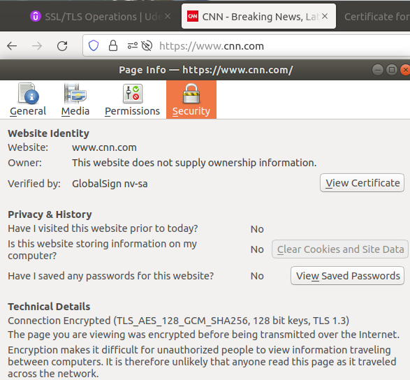
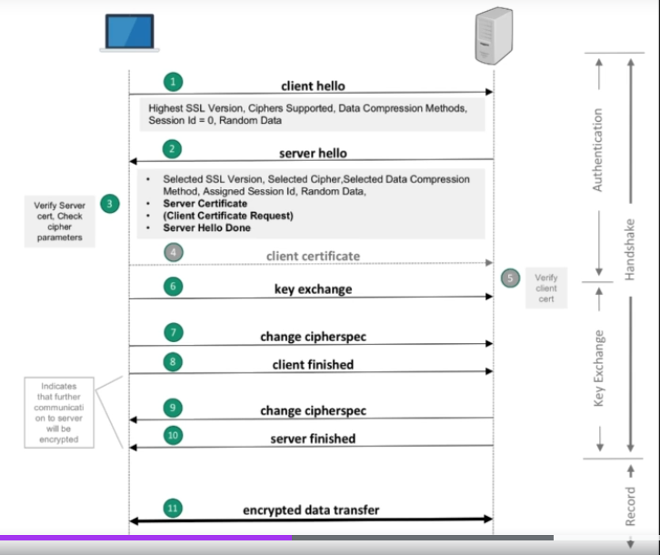
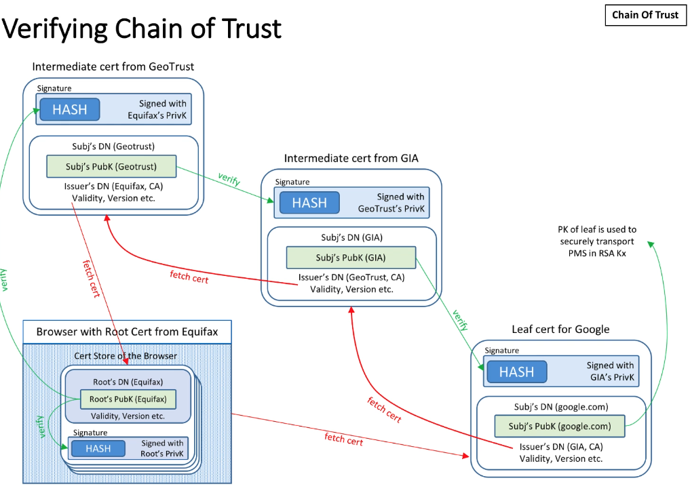

## SSL/TLS Operations
- Instructor: Nisheed K M

## Section 1: Introduction

1. Introduction

2. Contents

3. Why do we need SSL certificates?
- Source identity verification: am I really accessing yahoo.com?
- Security against Main-in-the-middle (MITM): avoid intercept
- Client/Server authentication: identify the client back
- Non-repudiation: ?

4. SSL/TLS evolution
- For end users, the user experience is same for SSL/TLS
- TLS1.2/1.3 are safe while all of SSL/TSL1.0/1.1 must be avoided

## Section 2: How SSL works

5. How it works
- Certificate Authority (CA) sends public key to Browser vendor
- Browser vendors has those public keys as default. 
- Webservers requests certificate signing to CA and CA sends signed certificates (MD5 of the hashcode) to the webservers
- When a client contacts the web server, the webserver sends SSL certificates of the website. Then the client verifies it through checksum
  - When it fails, the browser yields unsecure message

6. CA Signed vs. Self Signed

|# | CA Signed certs | self signed certs |
|--|-----------------|-------------------|
|a | Signed by CA, a third party | Signed by the website, the owner|
|b| Ideal for public use | Ideal for closed access |
| c| Trusted by browsers that have the root certificate of the CA in their trust store | Not trusted by browsers until you import your public key manually into browser trust store |
|d| Renewals/modification in cert do not require change at browser side | Renewals/modification requires re-import of the new cert to browser's trust store |
|e| You buy it from a CA | No cost as you sign it yourself|
|f| Leaf and intermediate certificates | Root certificates|

7. Reading/Examining the certificate
- Click icon ahead of http/https in the web browser
- Check the certificate

- or CLI
```bash
$ openssl  s_client -connect cnn.com:443 < /dev/null
CONNECTED(00000005)
depth=2 OU = GlobalSign Root CA - R3, O = GlobalSign, CN = GlobalSign
verify return:1
depth=1 C = BE, O = GlobalSign nv-sa, CN = GlobalSign Atlas R3 DV TLS CA 2022 Q1
verify return:1
depth=0 CN = cnn.com
verify return:1
---
Certificate chain
 0 s:CN = cnn.com
   i:C = BE, O = GlobalSign nv-sa, CN = GlobalSign Atlas R3 DV TLS CA 2022 Q1
 1 s:C = BE, O = GlobalSign nv-sa, CN = GlobalSign Atlas R3 DV TLS CA 2022 Q1
   i:OU = GlobalSign Root CA - R3, O = GlobalSign, CN = GlobalSign
---
Server certificate
-----BEGIN CERTIFICATE-----
MIINODCCDCCgAwIBAgIQAbDoGbO/zaf+z9qfVlRNVTANBgkqhkiG9w0BAQsFADBY
MQswCQYDVQQGEwJCRTEZMBcGA1UEChMQR2xvYmFsU2lnbiBudi1zYTEuMCwGA1UE
AxMlR2xvYmFsU2lnbiBBdGxhcyBSMyBEViBUTFMgQ0EgMjAyMiBRMTAeFw0yMjAy
```
- 443 for SSL port
- /dev/null to clean up

## Section 3: Certificate Architecture

8. Structure of certificate
- Data
  - Version
  - Serial number
  - Issuer
  - Validity
    - Start date
    - End date
  - Subject's pub key
  - X509 Extensions
- Signature
  - Signature algorithm
  - Signature
```bash
$ openssl  s_client -connect cnn.com:443 < /dev/null | openssl x509 -in /dev/stdin -noout -text
depth=2 OU = GlobalSign Root CA - R3, O = GlobalSign, CN = GlobalSign
verify return:1
depth=1 C = BE, O = GlobalSign nv-sa, CN = GlobalSign Atlas R3 DV TLS CA 2022 Q1
verify return:1
depth=0 CN = cnn.com
verify return:1
DONE
Certificate:
    Data:
        Version: 3 (0x2)
        Serial Number:
            01:b0:e8:19:b3:bf:cd:a7:fe:cf:da:9f:56:54:4d:55
        Signature Algorithm: sha256WithRSAEncryption
        Issuer: C = BE, O = GlobalSign nv-sa, CN = GlobalSign Atlas R3 DV TLS CA 2022 Q1
        Validity
            Not Before: Feb 11 17:10:46 2022 GMT
            Not After : Mar 15 17:10:45 2023 GMT
        Subject: CN = cnn.com
        Subject Public Key Info:
            Public Key Algorithm: rsaEncryption                RSA Public-Key: (2048 bit)
                Modulus:
                    00:da:8a:80:9d:21:35:68:1c:c7:2f:b1:29:8f:ed:
...                    
                Exponent: 65537 (0x10001)
        X509v3 extensions:
            X509v3 Subject Alternative Name: 
                DNS:cnn.com, DNS:*.api.cnn.com, 
...
            X509v3 Basic Constraints: critical
                CA:FALSE
            Authority Information Access: 
                OCSP - URI:http://ocsp.globalsign.com/ca/gsatlasr3dvtlsca2022q1
                CA Issuers - URI:http://secure.globalsign.com/cacert/gsatlasr3dvtlsca2022q1.crt
```
- SAN (Subject Alternative Name) for viable names
- Note that CA is FALSE as this is not a root certificate

9. Digital Signature
- Signing:
  - Sender sends documents to Receiver
  - Also calculates the hash of the input, using SHA2 or other hashing algorithm
  - Encrypts the hash using Sender's **private key** as Signature
- Receivers get the documents and calculates the hash of the input
  - Receiver gets Signature from the sender and decrypts using the sender's **public key**
  - Receiver compares both of hashes
    - If they don't match, the document is tampered or the public key is wrong
- Features
  - Hash of something signed by private key
  - Verified using public key
  - Satisfies integrity, authenticity and non-repudiation
  - Verification is done by comparing the message digests (Hashes)
  - Application - SSL, Secure email, eDocuments, watermarking

10. Certificate Standards and Encording Methods
- Standard
  - x509: PKIX (Public Key Infrastructure) certificate (rfs6816)
  - One of the ITU X.500 Directory standards was chosen to be the certificate standard for SSL by Netscape when they designed SSL
- Encording
  - DER (Distinguised Encoding Rules) std -> binary DER encoded certs (*.cer/.crt files)
  - PEM (Privacy Enhanced Mail) std -> ASCII (base64 armored data prefix with a `--- BEGIN ---` line (*.cer/.crt/.pem files)
- File extensions
  - .crt -> *nix convention of binary DER or Base64 PEM
  - .cer -> MS convention of binary DER or BASE64 PEM
  - .key -> public/private PKCS#8 keys. DER or PEM

11. Types of Certificates
- Based on trust level (DV, OV, EV)
- DV - Domain validated (Basic)
  - Small/medium level website owners who only wish to encrypt their domain issue DV SSL certificate
  - No paperwork required for validation
  - Validated against the domain
  - No guarantee of the identity of the owner nor the actual existence of the organization
  - Green padlock
  - Lower price
  - Quick issuance within minutes
  - 99.9% mobile and web browser compatibility
  - Firefox doesn't show green padlock - just black padlock
    - Note that the owership info is not shown
- OV - Organization Validated (Enhanced)
  - Business identity level trust. Organization name printed in the certificate
  - Green padlock
  - 1-3 days for issuance
  - More trusted than DV
- EV - Extended Validated (Complete)
  - For trusted and high security sites
  - Green address bar + organization name + trust seal
  - Up to 10 business days for issuance & very strict validation process
  - OV by default + high 256bit encryption with 2048-bit key length
  - Multi-domain with SAN only
- No more green padlock in Firefox

## Section 4: Encryption Algorithms

12. Introduction to Encryption Algorithms
- Kerckhoff's principle
- Private/symmetric key 
- Public/Asymmetric key
- Hashing algorithms

13. Private/Symmetric Key Encryption
- DES, 3DES, AES, RC4
- Based on single common shared secret key
- Faster than public key encryption
- Both sender and receiver must have the shared secret

14. AES
- Based on Rijndael algorithm
- Block cipher
- Modes
  - Electronic codebook (ECB)
  - Cipher Block Chaining (CBC)
  - Output Feedback (OFB)
  - Counter (CTR)
  - Galois/Counter Mode (GCM): recommended over others
- 128, 192 and 256 bits

15. Public/Asymmetric Key Encryption
- RSA, DSA
- Key bit length
- Slower
- Feature
  - Asymmetric as encryption/decription uses different keys
- Algorithm family
  - Integer Factorization: RSA
  - Descrete Logrithm: DH, DSA, Elgamal
  - Elliptic Curves (ECDH, ECDSA)

16. RSA
- Ron Rivest, Adi Shamir, and Leonard Adleman
- Patent by MIT expired by 2000
- Integer prime factorization problem

17. Elliptic Curve Cryptography
- Asymmetric key algorithm by Victor Miller (IBM) and Neil Koblitz (Univ. Washington)
- Low computing power requirements
- Reduced key length and hence fast

18. Hashing Algorithms
- One-way digest
- Unique
- Fixed length(32,40,64 etc)
- Collision resistance
- MD5, SHA1,2,3, ...
  - MD5 and SHA1 are collision probable
  - Use SHA2 or SHA3

## Section 5: SSL communication

19. Overview
- Authentication (handshake)
  - PublicKey algo
- Key exchange (handshake)
  - PublicKey algo/key exchng protocol
- Encrypted data transfer (record)
  - PrivateKey Algo


20. Step 1. Authentication
- Through SSL certificate
- RSA certs
- 2048 bits to be safe
- Cipher suite
  - TLS_ECDHE_RSA_WITH_AES256_CBC_SHA
    - transport layer protocol: TLS or SSL
    - Session key exchange algo: RSA, DH, DHE
    - PKI type of the certificate: RSA or DSA
    - Symmetric algo: RSA, RC4, 3DES, ...
    - Mode in which the symmetric algo operates: CCM, gCM
    - Hashing algo: MD5, SHA2

21. Step 2. Key Exchange
- RSA
  - Uses server's public key for confidentiality while exchanging secret
  - No perfect forward secrecy and hence passive cryptanalysis is possible
  - Server's private key, critical point of compromise
- Diffie Hellman
  - Most efficient and recommended
  - Ephemeral model for PFS. Blast radius of passive cryptanalysis is limited to a session

22. Diffie Hellman
- No long term private key involved
- No secret key is exchanged
- DHE provides Perfect Forward Secrecy

23. Step 3. Encrypted data transfer
- Actual data transfer
- Confidentiality (symmetric encryption)
- Message Integrity (MAC)
- MAC then Encrypt

24. Keys and Numbers

25. CLI demo
```bash
$ openssl s_client -connect qualys.com:443 < /dev/null 2>/dev/null
...
-----END CERTIFICATE-----
subject=jurisdictionC = US, jurisdictionST = Delaware, businessCategory = Private Organization, serialNumber = 3152140, C = US, ST = California, L = Foster City, O = "Qualys, Inc.", CN = www.qualys.com

issuer=C = US, O = DigiCert Inc, OU = www.digicert.com, CN = DigiCert SHA2 Extended Validation Server CA

---
No client certificate CA names sent
Peer signing digest: SHA512
Peer signature type: RSA
Server Temp Key: ECDH, P-256, 256 bits
---
SSL handshake has read 3585 bytes and written 438 bytes
Verification: OK
---
New, TLSv1.2, Cipher is ECDHE-RSA-AES128-GCM-SHA256
Server public key is 2048 bit
Secure Renegotiation IS supported
Compression: NONE
Expansion: NONE
No ALPN negotiated
SSL-Session:
    Protocol  : TLSv1.2
    Cipher    : ECDHE-RSA-AES128-GCM-SHA256
    Session-ID: B9B1377921BAD5701B435CBA5791A157FABCE5FA97BA210671A2CEBB32AA8D1A
    Session-ID-ctx: 
    Master-Key: 6F1F4C63A7608E821BEB7583AC759F31A55CB5430721E45A2999F186ADE11E3B1A1A83B154BC8D439BB9AAC3384E1993
    PSK identity: None
    PSK identity hint: None
    SRP username: None
    Start Time: 1663370273
    Timeout   : 7200 (sec)
    Verify return code: 0 (ok)
    Extended master secret: no
```

## Section 6: Certificate provisioning

26. Request & Signing
- How to create certificates
- Steps
  - Admin of the webserver/domain generate the private key and certificate signing request for the side
    - `openssl genrsa -out mysite.key 4096`
    - `openssl req -new -key mysite.key -out mysite.csr`
  - Send `mysite.csr` to the CA of the choice
  - Get it signed by CA (mysite.crt)
    - CA calculates the SHASUM of the certificate's data section
    - Encrypts the checksum value using CA's private eky
    - Append the signature to the certificate and send back to the requester
- Self signed
  - Generate the private key and self-signed certificate for 365 days: `openssl req -x509 -newkey rsa:4096 -keyout mysite.key -out mysite.crt -days 365`
    - To read the crt file, `openssl x509 -in mysite.crt -text -noout`

27. Security - Request & Signing
- Choose your key length
  - RSA 2048 bit
  - ECC 192 bit
- Keep your private key secure
  - Renew when an employee leaves the company
- Check your signing hashing algorithm
  - SHA2 or more
- Choose a reliable CA

28. Installation
- Loadbalancer
- Web server

29. Installation Security
- Choose your ciphers
  - No RC4()
  - No AES-CBC with SSLv3 & TLS v1.0 (BEAST and Lucky13)
  - AES-GCM
  - Disable the export and null cipher suites, as well as cipher suites using RC4/3DES. Good to use AES256-SHA for 1.1, and AES256-GCM-SHA256 for TLS 1.2
- Choose your protocols versions
  - TLSv1.1/TLSv1.2

30. Revocation
- When we revoke a cert?
  - Subscriber's private compromised
  - CA's private key compromised
  - Affiliation changed
  - Cessation of operation
- CRL - certificate revocation list
- OCSP - open certificate status protocol

31. SSL errors
- SSL_ERROR_NO_CERTIFICATE
- SSL_ERROR_WRONG_CERTIFICATE
- SSL_ERROR_UNSUPPORTED_CERTIFICATE
- SSL_ERROR_BAD_CERT_DOMAIN
- SSL_ERROR_UNKNOWN_CIPHER_SUITE
- SSL_ERROR_UNKNOWN_CA_ALERT
- SSL_ERROR_REVOKED_CERT_ALERT
- https://badssl.com/
  - A github project

## Section 7: OpenSSL

32. CLI demonstration
- s_client
```
	openssl s_client -connect qualys.com:443 < /dev/null
	openssl s_client -showcerts -connect www.google.com:443 < /dev/null     #show all inter. certs too
	openssl s_client -connect -tls1_2 qualys.com:443 < /dev/null 	       #connect using TLSv1.2 only
```
- x509
```
	openssl x509 -in www.google.com.crt -noout –text  #decode the crt file
	openssl s_client -connect google.com:443 < /dev/null 2>/dev/null | openssl x509  -in /dev/stdin -noout –text  #take input from stdin spit by s_client
	openssl s_client -connect google.com:443 < /dev/null 2>/dev/null | openssl x509 –noout –dates #check expiry date
```
- genrsa/rsa
```
	openssl genrsa -out mysite.key 4096                  #generate 4096 bit rsa key
	openssl rsa -noout -text -check -in mysite.key       #display the private key components
	openssl rsa -in mysite.key -pubout > mysite.key.pub  #extract public key
	openssl rsa -in mysite.key.pub -pubin -text –noout   #display the public key components
```
- req
```
	openssl req -new -key mysite.key -out mysite.csr  #new CSR, send this to CA for signing
	openssl req -x509 -newkey rsa:4096 -keyout mysite.key -out mysite.crt -days 365 #self signed cert
```
- s_server
```
	openssl s_server -cert mycert.crt -key mysite.key -www -accept 4443 #start ssl server on port 4443
```
- ciphers
```
	openssl ciphers -v ['DHE-RSA-AES256-SHA'] #displays all without a cipher arguement
```
- crl
```
	curl -s http://pki.google.com/GIAG2.crl  | openssl crl -inform DER -text -noout -in /dev/stdin
```
- Miscellaneous 
```
	openssl x509 -noout -modulus mysite.crt | openssl sha256  #all md5sums should be 
	openssl req -noout -modulus mysite.csr | openssl sha256   #the same if they belong
	openssl rsa -noout -modulus mysite.key | openssl sha256   #to the same website
```
- dgst
```
	openssl dgst -sha256 -sign privkey.pem -out input_message.tar.gz.sig input_message.tar.gz        #sign
	openssl dgst -sha256 -verify pubkey.pem -signature input_message.tar.gz.sig input_message.tar.gz #verify
```
- enc
```
	openssl enc -aes-256-cbc -salt -in file.txt -out file.txt.enc [-k PASS]   #encrypt
	openssl enc -aes-256-cbc -d -in file.txt.enc -out file.txt [-k PASS]      #decrypt
```
- base64
```
	openssl base64 -in file.txt -out file.txt.base64                          #base64 encoding
	openssl base64 -d -in file.txt.base64 -out file.txt                       #base64 decoding
```
- ecparam
```
	openssl ecparam -list_curves                                           #list all ECC curves
	openssl ecparam -name secp256k1 -genkey -noout -out secp256k1-key.pem  #create key for curve secp256k1
```
- passwd
```
	openssl passwd -1 -salt alphanumeric MyPassword   #create shadow-style password
```
- rand
```
	openssl rand -out random-data.bin 64              #create 64bytes random data
	head -c 64 /dev/urandom | openssl enc -base64     #get 64 random bytes from urandom and base64 encode
```

## Section 8: Chain of Trust

33. Intermediate CAs
- To establish chain of trust
- A way to reduce the risk of compromising the Root CA's private key
- Leaf, intermediate and root certificates
- Leaf and intermediate to be installed at the web server/load balancer
- Chain of trust is broken if any of the intermediate cert is invalid or missing
- How to view the intermediate certs: use `-showcerts`
```bash
$ openssl s_client -connect google.com:443 -showcerts < /dev/null 2> /dev/null
CONNECTED(00000005)
---
Certificate chain
 0 s:CN = *.google.com
   i:C = US, O = Google Trust Services LLC, CN = GTS CA 1C3
-----BEGIN CERTIFICATE-----
...
-----END CERTIFICATE-----
 1 s:C = US, O = Google Trust Services LLC, CN = GTS CA 1C3
   i:C = US, O = Google Trust Services LLC, CN = GTS Root R1
-----BEGIN CERTIFICATE-----
...
-----END CERTIFICATE-----
 2 s:C = US, O = Google Trust Services LLC, CN = GTS Root R1
   i:C = BE, O = GlobalSign nv-sa, OU = Root CA, CN = GlobalSign Root CA
-----BEGIN CERTIFICATE-----
...
```
- Note that the first CN is for *.google.com while the third one is from GlobalSign Root CA, which is the root CA

34. Verifying Chain of Trust


## Section 9: Trust Store

35. What is Trust Store/Cert Store
- Repository of trusted CA certificates
- Shipped as part of the application
- Truststore can be modified
- Different from keystore
- Application trust stores
  - Browser
    - Public keys of all major CAs come with release
  - Java (tomcat, coldfusion etc)
    - Mostly there but less frequently updated
    - You need to take care if customized

36. Managing Trust store
- Commands for Tomcat/Confusion
- From the browser menu, we can import manually

## Section 10: Journey to TLS 1.3

37. SSL/TLS Journey

38. TLS 1.3 - Introduction
- Published Aug 2018
- Integration
  - OpenSSL 1.1.1
  - iOS 12.2
- Safer
  - Removal of unused and unsafe ciphers and techniques
  - Security optimization, modern encryption and analysis
- Faster
  - 1-RTT for fresh connections
  - 0-RTT for resumption

39. TLS 1.3 - Safer (Removals)
- Static RSA as there is no PFS
- MD5, SHA1
- Simplified resumption

40. TLS 1.3 - Safer (Optimizations and Enhancements)
- Only (EC)DHE. No more RSA for key exchange
- Limited number of EC groups (only strongest)
- Content type, Server name indication, certificates and extensions are encrypted

41. TLS 1.3 - Faster (1-RTT)
- RTT: Rount trip time
- TLS1.2 requires 2-RTT for the new connections
- TLS1.3 uses 1-RTT for new connections

42. TLS 1.3 - Faster (0-RTT)
- 0-RTT for resumption

43. TLS 1.3 - Deployment
- Nginx: `ssl_protocols TLSv1.2 TLSv1.3;` in nginx.conf
- Apache: `SSLProtocol -all +TLSv1.2 +TLSv1.3;` in ssl.conf
- Caveats
  - Resumption with bare PSK is forward secure only if coupled with an ephemeral key (ECDHE) during derivation
  - The early data (0-RTT data) is not forward secure. So prone to replay attacks
  - 0-RTT activation is a call that the Application developer has to make 

## Section 11: Advanced Topics

44. Pinning
- HTTP public key pinning
  - HPKP (rfc7469)
  - Detects fraudulent certificates
  - HTTP header

45. Let's Encrypt and ACME
- Let's Encrypt: free & Open certificates (https://letsencrypt.org/)
- Automatic Certificate Management Environment (ACME) + Let's Encrypt CA = Fullly automated cert management system

46. Certificate Transparency
- 3 goals
  - Make it impossible for a CA to issue a SSL certificate for a domain without the certficate being visible to the owner of that domain
  - Provide an open auditing and monitoring system that lets any domain owner or CA determine whether certificates have been mistakenly or maliciously issued
  - Protect users as much as possible from being duped by certificates that were mistakenly or malicously issued
