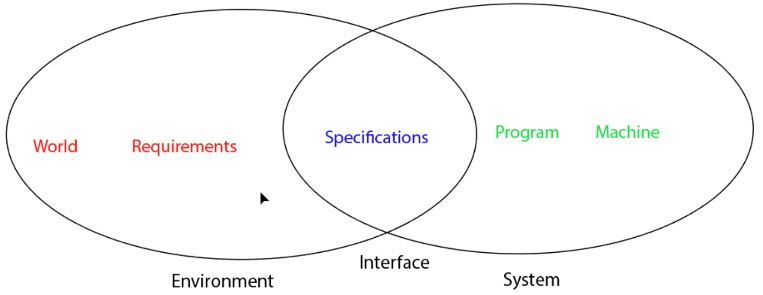
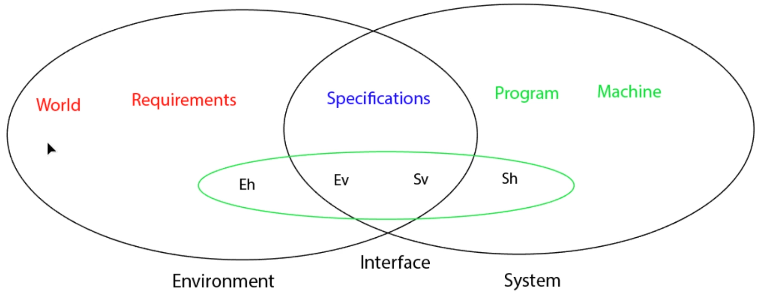
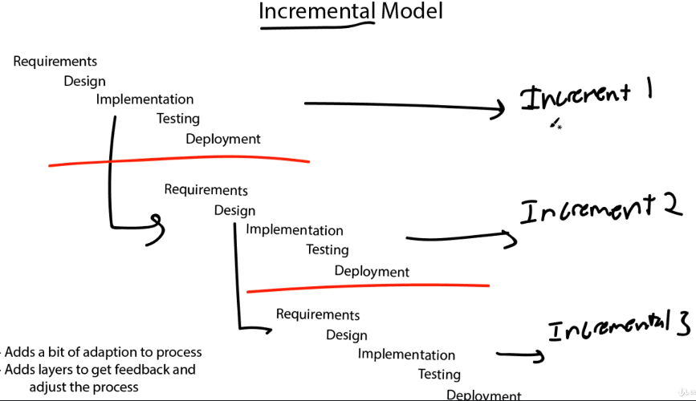
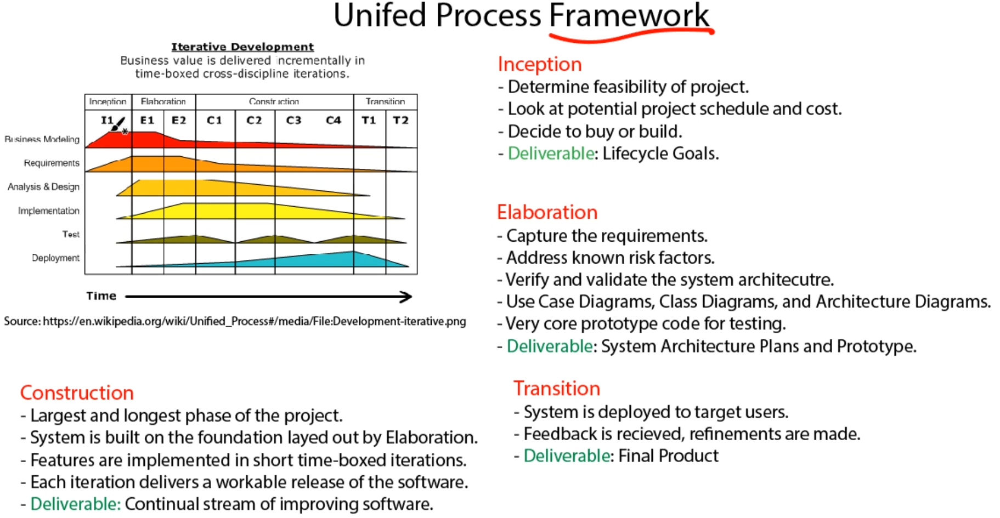
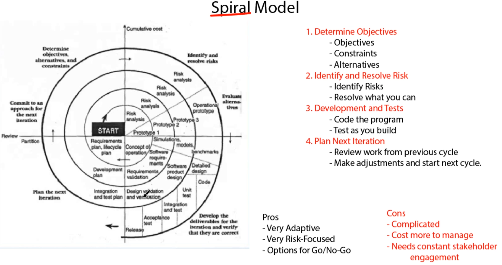
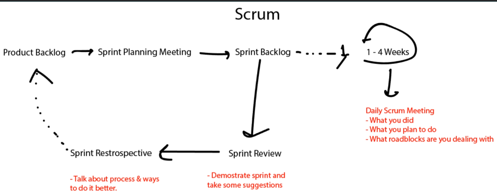
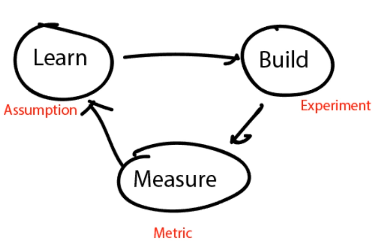
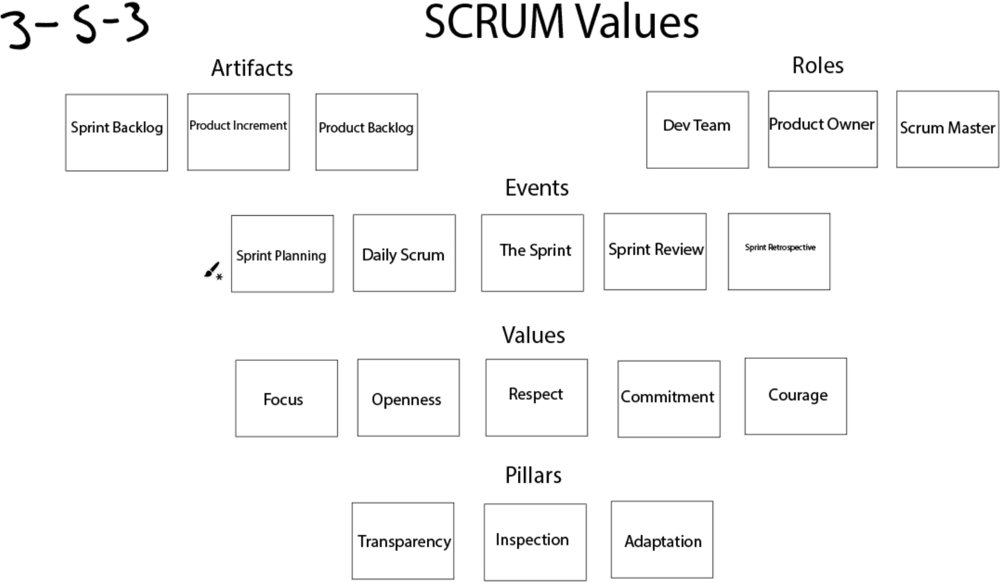

## Software Engineering 101: Plan and Execute Better Software
- Instructor: Kurt Anderson

## Section 1: Introduction

### 1. Welcome to the Course!
- Work as a team for a long-term project

## Section 2: Software Lifecycle

### 2. Software Lifecycle Introduction

### 3. Why Learn Software Engineering/Development?
- Technical dept - a poor, hard to understand hacky implementation which will have to be repaid with interest later on
- 20% of projects fail - many of them are due to poor development practices

### 4. Typical Software Development Lifecycle
- Requirements: what
- Design: how
- Implementation: build
- Verification: testing
- Maintenance: debugging, features

### 5. Software Development Lifecycle Example
- Requirements
  - Collect email address and message
  - Send and store in a database
  - Prevent user from bad input
- Design
  - Use HTML and CSS for building the framework of the form
  - Use javascript for verification of the input
  - Use JQuery and MYSQL for contacting backend
- Implementation
  - Code and document the work
- Verification
  - Does the form collect information?
  - Does the form send that information to a database
  - Does the form prevent bad user input?
- Maintenance
  - Create lifecycle plan, fix and bugs

### 6. Software Development Lifecycle Notes

## Section 3: Requirements and Specifications

### 7. Requirements and Specification Intro

### 8. Requirements Definition
- A way of figuring out the exact specifications of what the software should do
  - A process for finding out the goals of the system
- Capture the WHAT and not the HOW. The HOW is for Design
  - Will create a document which lays out these details
- Requirements Importance
  - Spending time strategically upfront, reduces cost and time later on

### 9. Requirements vs Specifications
- Requirements: A non-technical definition of something the user requires from the system
  - For non-SW folks. No jargon
  - Ex: ability to submit a request for treatment medical form
  - Ex: The user should be able to upload a video to the website
- Specifications: A technical definition of what is required from the system
  - Keep it simple
  - Ex: send AES256 encrypted form data from the front-end to the back-end server
  - Ex: The uploader should accept H264, MOV, and MPG files for upload

### 10. Functional vs Non-Functional Requirements
- Functional: requirements and specifications pertaining to the function of the program
  - What should the system do?
  - Ex: Send form data from the frontend to the backend server
- Non-functional: requirements and specifications on what goals should be me
  - How should the system work?
  - Ex: Use AES256 encryption on all form data
  - Categories:
    - Product requirements
      - Must haves of the product itself
      - Ex: Entire project must be coded in JAVA
    - Organizational requirements
      - Company policies, standards, styles, rules
      - Ex: Product data must be encrypted by AES256
      - Ex: The project will be developed using Scrum methodology
    - External requirements
      - External Laws, regulations, trends etc
      - Ex: Product must use SSL due to law XYZ in EU
  
### 11. Requirements Notes

### 12. WRSPM Model Introduction
- Reads as World Machine Model
- A reference model for understanding the connection b/w requirements and specifications and the real world
- World: the world assumptions which are used to develop the system
  - Internet? Electricity? The speed of internet?
- Requirements: Defining the problem at hand in terms of a user of the system
- Specifications: Defining the technical requirements of the system. We are linking together the idea of the solution, to the system itself
- Program: the program and code itself
- Machine: HW specifications - box, power cords, computer chips

### 13. WRSPM Visual Model


### 14. WRSPM Variables
- Eh (Env hidden): Elements of the environment which are hidden from the system
  - Ex: ATM card
- Ev (Env visible): Elements of the environment which are visible to the system
  - Ex: chip on ATM card
- Sv (Sys visible): Elements of the system which are visible in the environment
  - Ex: button, screens, UI
- Sh (Sys hidden): Elements of the system which are hidden from the environment.
  - Ex: backend server


### 15. WRSPM - World Example
- World: the world assumptions which are used to define the systems environment
- Ex: Photo printing kiosk
  - There will be readily available electricity
  - There will be available internet
  - In a normal controlled temperature
  - People will have standardized photo format to print
  - People will be able to read the prompts and tutorial
  - Stores will re-fill the materials frequently
  - People will have debit cards that work with standard debit card tech
  - Debit cards/credit cards are widely used

### 16. WRSPM - Requirements Example
- Requirements: defining the problem at hand in terms of wants of the system
  - In layman's terms, nothing technical
- Ex: Photo printing kiosk
  - A user can connect a smartphone to the system
  - The user can edit photos
  - The smartphone can transfer pictures over
  - The photos can be printed out by the machine
  - The kiosk can collect money
  - The user can change the language

### 17. WRSPM - Specifications Example
- Specifications: defining the technical requirements of the system. Linking together the idea of the solution, to the system itself
- Ex: Photo printing kiosk
  - The system will have Bluetooth technology so a smartphone can connect
  - The machine will run off a standard NA power outlet
  - A proper bluetooth transfer protocol will be installed to make the transaction secure
  - The system will have an editing suite for manipulating photo data
  - The system will use encryption and chip technology to contact financial servers
  - The system will have a standard printing device for printing photos

### 18. WRSPM Model

### 19. Requirements Example
- We have an already built chess app. We want to monetize this app to start making money
  - What steps should we take?
  - How do we define this problem?
  - What will benefit both the client and the users?
- World Assumption
  - There is a way to pay on smartphones
  - There are ways to make money from an app
  - The app is extendable
  - There will be an ability to contact the internet and the financial institution
  - The transaction can be made secure enough
  - The phone will have the processing power to handle the request
  - Different currencies will be able to be accepted
  - It is legal to accept payment over a phone
- Requirements
  - The pro feature will remove ads for the user
  - The feature must accept payment from the user
  - The feature must provide pro features upon successful transaction
  - The feature must complete transactions in a secure manner
  - The feature will revoke pro features once a subscription becomes invalid
  - The feature will provide a cancel button within the app
  - The feature will extend off existing codebase
  - The feature mustn't add more than 5MB to overall download size
  - The feature must complete the transaction in a timely fashion
  - Specifications
    - The feature will be coded in Java, the existing app's language
    - The feature will use the Android Play store for its transactions
    - The feature will check for active subscription daily using Google's provided API
    - The feature will turn off AdMob once subscription key becomes valid
    - The transaction must take no longer than 500ms to complete

## Section 4: Design: Architecture

### 20. Architecture Intro

### 21. Where We Are in the Course

### 22. Software Architecture Introduction
- Architecture is the very top level of design
- Architects are the link b/w idea and reality
- Architecture is something that cannot be fixed once implemented
- In Software, bad architecture is something that cannot be fixed with good programming

### 23. Software Architecture Overview
- Software architecture is all about breaking up larger systems into smaller focused systems
  - Good architecture is hard
  - Maintainable software has good architecture
  - Architecture mistakes are almost impossible to fix once coding has begun
- Good architecture allows for faster development, and smarter task allocation
  - Also allows company to decide where to buy and where to build
  - Reduces overall idle time

### 24. Software Architecture Example
- Game app
  - Front-end game
  - Game logic
  - Game server
- Try to break up your idea into at-least 7 different areas for you example

### 25. Pipe and Filter
- Architecture pattern
- The pipe and filter pattern is a good pattern to use to process data through multiple different layers. The key to this pattern is the ability of each step to input, and output the same type of data. So if you send a set of numbers in one side, you will get a set of numbers out the other side.
- This key constraint makes it so you can mix and match the logic in any order and still have the program work. These different filters can also be set up across multiple servers.
- There is definitely an added complexity with this pattern. Setting it up can be tricky to get correct. Also, if the data is lost at any step, the entire process is broken. 

### 26. Client-Server
- The client-server pattern is one that is quite common today. Every single website and most phone apps use this architecture. With this pattern there are two parts to the software, the client, and the server.
- Let's take an iPhone app for example. What you download in the app store is what is known as the "client software". This is the version of the app built to talk to the server. It doesn't store any of the server's data locally. It is just setup to make the appropriate server calls when necessary.
- The other part of this is of course the "server software". This is the software that is installed onto a server to receive the requests from the client. The server holds and updates the data. It also processes requests, and sends the data to the clients. Servers have to be tuned correctly, as there can be a near unlimited number of clients requesting information.
- This is a great pattern for accessing and updating a single repository of information. It's great of keeping track of accounts, and regulating which data is given automatically. 

### 27. Master-Slave
- The client-server pattern is one that is quite common today. Every single website and most phone apps use this architecture. With this pattern there are two parts to the software, the client, and the server.
- Let's take an iPhone app for example. What you download in the app store is what is known as the "client software". This is the version of the app built to talk to the server. It doesn't store any of the server's data locally. It is just setup to make the appropriate server calls when necessary.
- The other part of this is of course the "server software". This is the software that is installed onto a server to receive the requests from the client. The server holds and updates the data. It also processes requests, and sends the data to the clients. Servers have to be tuned correctly, as there can be a near unlimited number of clients requesting information.
- This is a great pattern for accessing and updating a single repository of information. It's great of keeping track of accounts, and regulating which data is given automatically. 

### 28. Layered Pattern
- The layered pattern consists of divvying up program into layers of technology. These layers only communicate with adjacent layers. Let's say we have an architecture with 9 layers. In this model, 8 would only be able to communicate with 9 and 7, 4 with 3 and 5, etc.
- This simplifies the communication channels, and helps to better distinguish the areas of the program. Overall, this helps to make the program more maintainable. The downside to this, is that there can be of added complexity in some areas. For example, if you need to send a message from layer 1 to layer 9. There will have to be a function in each layer to pass that message along.

### 29. Software Architecture Notes

### 30. Software Architecture Process
- Control how a program is decomposed and how it interacts with itself, and the outside world
- Model how the control structure of the system will behave
- Break project into subsystems and modules
  - Subsystem: independent system which holds independent value
  - Module: component of a subsystem which cannot function as a standalone

## Section 5: Design: Modularity

### 31. Modularity Intro

### 32. Software Design Process
- Design is the step where we start applying our plan and idea to real world solutions
  - Design is not coding/coding is not design
- Design is two things:
  - Activity: working to design the software
  - Product: a document, or set of documents detailing the design of the software

### 33. Stages of Design
1. Break larger problems into smaller problems
2. Understand each problem
3. Identify potential solutions
4. Describe solution abstractions
5. Repeat until everything is abstracted
6. Component design
7. Data structure design
8. Algorithm design

### 34. Modularity
- Coupling: how well modules work together
- Cohesion: how well a module meets a singly designed goal
- Goals of modularity
  - Abstraction
  - Decomposability: for debugging
  - Composability: for debugging
  - Module understandability
  - Continuity
  - Protectability

### 35. Information Hiding and Data Encapsulation
- Hide complexity in a black box
  - Function
  - Macro
  - Library
  - Classes
  - Method
- Data encapsulation
  - Hide the implementation details from the user. Only provide a set of tools to manipulate

### 36. Design and Modularity Notes

### 37. Coupling Introduction
- Measuring the strength of connections b/w modules/subsystems
- Want to make it so changes don't affect other modules
- Shared variables and control information creates tight coupling
- State-decentralization creates loose coupling
- Levels
  - Tight: content, common, external
  - Medium: control, data-structure
  - Loose: data, message, none

### 38. Tight Coupling
- Content coupling
  - When one module modifies or relies on the internal workings of another module
  - When module A calls B, what if B is gone?
- Common coupling
  - When several modules have access to and manipulate the same global data
  - ? Race conditions?
- External coupling
  - When several modules have direct access to the same external IO

### 39. Medium Coupling
- Control coupling
  - When data is passed, that influences the internal logic of another module
- Data structure coupling
  - When multiple modules share the same data-structure
  - What if we change the data structure?

### 40. Loose Coupling
- Data coupling
  - When two modules share/pass the same data
- Message coupling
  - When messages or commands are passed b/w modules
- No coupling
  - No communication whatsoever

### 41. Coupling Conclusion
- Measuring coupling as we design and develop is important
- It is NOT enough to plan the app, we need to plan it well
- Aim for loose coupling, justify in writing anything stronger

### 42. Coupling Notes

### 43. Cohesion Introduction
- A module's ability to work toward a set and well defined purpose
- The strong the cohesion the better
- We want **strong cohesion, and loose coupling**

### 44. Weak Cohesion
- Coincidental cohesion
  - Only linked because they are in the same file
- Temporal cohesion
  - Only linked because events happen around the same time
- Logical cohesion
  - Activities which are linked in the same general category

### 45. Medium Cohesion
- Procedural cohesion
  - When an order of execution passes from one command to the next
- Communicational cohesion
  - When all activities support the same input or output data
- Sequential cohesion
  - When all activities work in which the output data for one, is the input for the next

### 46. Strong Cohesion
- Functional cohesion
  - When a module supports actvities needed for one and only one problem-related task
- Object cohesion
  - When all activities only modify a single object

### 47. Cohesion Notes

### 48. Importance of Design

## Section 6: Implementation and Deployment 

### 49. Implementation and Deployment Intro

### 50. Implementation Basics
- Take care of programmers
  - Implementation is where most time is spent, and where a lot of time can be lost
  - Always program while alert and focused
  - Programming takes focus. Constant interruptions will reduce the overall focus
- Coding principles
  - Use a style guide, so all the code looks relatively the same
  - Code is written for people, not computers
  - Make modules easy to learn and understand
  - Go into everything with a plan
  - Shorter code != better code
    - Make it READABLE
  - Break up actions into methods

### 51. Buy vs Build
- Buying components/modules might be more affordable than building from scratch
  - When there are existing similar modules/programs in the market

### 52. Implementation Notes

### 53. Deployment Overview
- Deployment is a mix b/w testing and implementation
  - It happens after testing but a lot of times requires certain implementation to get correct
- The level of planning in this phase, directly relates to how the deployment affects the overall project
  - Is it a small update, a large update, a complete overhaul?
- Deployment should be built with the idea of retreat
  - We may need to revert

### 54. Deployment Planning
- Amount of planning is dependent on the size of the change
- We look at which areas will most likely have the biggest problems
- Areas to look at:
  - Database activities
  - 3rd party software integration
  - Run time changes
  - Training (both on user and business side)
  - Downtime
  - Backups
  - Network
  - Memory
- Finally we need to look at planning steps to turn back (reverting)

### 55. Deployment Rollback
- Rollback: The act of reverting a system back to a previous working state
- Look for a point of no return
  - This is a point where it takes longer to go back, than it does to just continue through
  - Knowing this will help make a decision during deployment
- Every step of the development process, make a decision whether rollback is a better option

### 56. Deployment Notes

## Section 7: Testing

### 57. Testing Intro

### 58. Testing Overview
- Testing is the process of finding errors
- We can test code, implementations, documentation, and even other testing
  - Test data: inputs that are designed to test the system
  - Test cases: ways in which we operate the system with the given data. Sequence, transaction, ...
  - Oracle: the set of good outcomes

### 59. Testing: Bugs
- Bug or feature?
  - Bugs can be both an error (defect), and a deviation from expected behavior
- Levels of bugs
  - Failure: the event by which the code deviates from expected behavior
  - Error: the part of code that leads to the failure
  - Fault: what the outcome actually was
- Testing can be used to show the presence of bugs but never to insure the absence of them

### 60. Verification and Validation
- Verification: are we building the thing right?
  - Does the software work compared to the given specification?
- Validation: are we building the right thing?
  - Does the software work compared to what the user needs?

### 61. Testing Introduction Notes

### 62. Unit Testing
- Testing to focus on the smallest unit of a software
  - Isolation

### 63. Integration Testing
- Testing to focus on the communication and architecture of the program

### 64. Incremental Testing
- Testing where you create a module, do some tests, create another module, and do some more tests
  - Top-down testing
    - Stub: a template of the model that will be implemented. Typically returns hard-coded values
  - Bottom-up testing
    - Driver: templates which execute commands and initialize needed variables

### 65. Back to Back Testing
- A test which compares a known good, to a new version

### 66. Who Should Test?
- Developer
  - Understands the system
  - Knows the code which causes problems
  - Knows how to do technical tests
  - May treat the testing lightly
    - Not the best tester
  - Motivated by deadline, ego, skill
- Tester
  - Must learn the system
  - Tries to test everything
  - Will try to break the program at all costs
  - Motivated by quality
- User
  - Must learn the system
  - Knows how they will use the system
  - Won't try to break or go light, will just try to use

### 67. Automatic vs Manual Testing
- Automatic tesing: requires initial planning and high up-front time but becomes cheaper exponentially
- Manual testing: cheap initially but cost will increase along time

### 68. Blackbox and Whitebox Testing
- Blackbox testing: only input and output
  - Boundary values: input in high and low ranges are put in. If these pass, it is assumed that everything in b/w passes
  - Cause effect graphing: test different causes to make sure different effects happen
  - Pair-wise testing: multiple parameters are tested together to check all conditions
  - State-based testing: checking input to check state changes
- Whitebox testing: checks internal workflow
  - Control flow testing: set up test cases which covers all branch conditions and different statements
  - Data Flow Testing: covering all variables. Designing test cases to cover the different variable declarations, and uses

### 69. The Problem with Testing
- Exhaustive testing is impossible !!
- As the number of detected defects increases, so does the probability of more bugs
- You will never know if a program is bug free

### 70. Types of Testing Notes

## Section 8: Software Development Models

### 71. Software Development Intro

### 72. Software Development Introduction
- Linear/predictive
  - Project has been done before
  - A clear process is in place
  - Not much room for change
- Flexible/Adaptive
  - Project is a new idea
  - No clear process in place
  - Project is very likely to change over time

### 73. Waterfall Model
- From step to step
  - Requirement
  - Design
  - Implementation
  - Testing
  - Deployment
  - Maintenance
- Not adaptive
- If any step fails, we need to go back to the top
- Ex: making many web-sites
- Characteristics
  - Each step must be extremely well planned
  - Going to take a while to get the product on the market
  - Won't be able to adapt to new technology
  - Cost over time to fix increases exponentially

### 74. V-Model
- Improvement of waterfall model
```
Requirements --------------> Acceptance Testing
  Design ----------------> System Testing
    Architecture -----> Integration testing
      Module -------> Unit Testing
        Implementation
```
- Testing is done much earlier, and we may reduce the overall cost

### 75. Sashimi Model
- Cut down entire processes along vertically
  - Do each slice
  - Repeat next slice
- Allows different disciplines to begin work quicker
- Shortens development time
- May result in error and redesign
  - In the mean time, requirement section is not done completely, injecting errors into the entire processes

### 76. Iterative Model
- Incremental: build steps overtime
- Iterative: build prototypes and adjust

### 77. Incremental Model


### 78. Unified Process Framework

- Pros
  - Adaptive
  - Quality and re-use focused
  - Focused on risk management
  - Flexible to incorporate other models
- Cons
  - Complicated
  - Too much overhead for small-scale projects
  - Need more programmers, managers, testers, etc

### 79. Spiral Model

- Risk-management oriented

### 80. Models Notes

## Section 9: Agile

### 81. Agile Intro

### 82. Agile Introduction
- Waterfall method had issues
  - During verification, a lot of unexpected issues arise
  - Software systems are complex and can't be 100% predicted
  - By the end, some software didn't meet the original, or modified requirements
  - Markets move over time. The product could be outdated by the time we finish
- A group of engineers got together and decided a change was needed. Together they came up with the "Agile Manifest". A set of ideas to develop better, quicker, and more agile software

### 83. Agile Manifesto
1. Individuals and interactions over process and tools
2. Working software over comprehensive documentation
3. Customer collaboration over contract negotiation
4. Responding to change over following a plan

### 84. Scrum
- Plan, Build, Learn, Repeat
- Sprint: define, design, build, test in 1-4 weeks
  - Then repeats
- Roles
  - Product Owner: what needs to be done in what manner
    - Inputs from executives, team, stakeholders, customers, and users. Help with prioritization and list of next steps
  - Scrum Master: Holds team liable to scrum ideas. Facilitates meetings and conflict resolution
  - Team: Team building the software



### 85. Kanban
- Kanban Principles
  - Start with what you know
  - Agree to pursue incremental evolutionary change
  - Respect the current process, roles, responsibility and titles
  - Encourage acts of leadership at all levels
- Kanban properties
  - Visualize workflow
  - Limit work in progress
  - Manage the flow
  - Make process policies explicit
  - Improve collaboratively

### 86. Lean Startup


### 87. Agile Notes

## Section 10: Scrum Deep Dive

### 88. SCRUM Intro

### 89. SCRUM Overview
- Roles
  - Product Owner: responsible for product. Goal/trajectories. Talks to stakeholder. Figures out what management wants.
    - Product backlog: lists of details of next step, vision
  - Scrum Master: Not leader but takes care of team members, HW, environment, to take the velocity of developments
  - Dev Team: Full stack engineer. 3-9 people
- Scrum is built upon sprint
- Sprint
  - 1-4 weeks
    - Daily standup
  - Sprint planning: takes product backlog
  - Sprint goal
  - Sprint backlog
  - Sprint review
    - Product increment
  - Sprint Retrospective
    - How to improve next sprint

### 90. SCRUM Values
- 3-5-3
  - 3 artifacts 5 events 3 roles
- Values
  - Focus: focus on the work of the sprint and the goals of the team
  - Respect: respect each other to be capable at their jobs and responsibilities
  - Commitment: personally commit to achieving the goals of the Scrum Team
  - Courage: courage to do the right thing and work on tough problems
  - Openness: open and transparent about all work and challenges
- Pillars
  - Transparency
  - Inspection
  - Adaptation


### 91. SCRUM Overview Notes
- 3 SCRUM Roles: 
  - Product Owner
  - Scrum Master
  - Development Team
- 5 SCRUM Events: 
  - Sprint Planning
  - Daily Standup
  - The Sprint
  - Sprint Review
  - Sprint Retrospective
- 3 SCRUM Artifacts
  - Sprint Backlog
  - Product Increment
  - Product Backlog
- 5 SCRUM Values
  - Focus - Focus on the work of the sprint and the goals of the team.
  - Openness - Open and Transparent about all work and challenges.
  - Respect -  Respect each other to be capable at their jobs and responsibilities.
  - Commitment - Personally commit to achieving the goals of the SCRUM Team.
  - Courage - Courage to do the right thing and work on tough problems. 
- 3 SCRUM Pillars
  - Transparency - Giving visibility of the entire process to those responsible for the outcome.
  - Inspection - Timely checks and inspections of the progress toward a sprint goal used to detect undesirable changes.
  - Adaption - Adjusting a process as soon as possible to minimize further deviation or issues. 

### 92. Product Owner
- An expert of the product
  - Not boss
- Communication with stake-holders
- Maintains open healthy product backlog
- Answers product related questions
- Manages budget and release dates
- Ensures the value of the team
- Providing feedback at various levels
- Respect commitments

### 93. Scrum Master
- A servant leader
- Facilitating daily standup
- Removes blocks for team
  - HW/SW/bug/help
- Keeps the team happy with high morale
- Ensures all SCRUM values are being upheld
- Sets up all SCRUM meetings
- Encourages collaboration b/w everyone
- Is the mediator, coach, mentor, and guide
- Might not be a dedicated position
  - A dev team member may do partial work

### 94. Development Team
- Collaborate with product owner to create and refine user stories
- Writing code, tests to fit expectations
- Conducting research, design, and prototyping
- Helping make decisions based on architectures, design, etc
- Helping develop and maintain current iterations

### 95. SCRUM Roles Notes

### 96. Product Backlog
- A prioritized set of work for the dev team that is created from the vision and its requirements
- Must be open
- Every sprint will have updated backlogs - contents/order/etc

### 97. Sprint Planning
- Sprint Planning Meeting
- At the beginning of Sprint
- 2-4 hrs
- Turns product backlog into sprint backlog
- Scrum master
  - Facilitates the meeting
  - Ensures that the location is secured and ready
  - Make sure that the technology is ready for meeting
  - Keeps the meeting moving to fit in the timebox
  - Makes sure there is complete alignment with the sprint goal
- Product Owner
  - Comes with a prepared, ready, product backlog
  - Clarifies details about any of the backlog items
  - Must be ready to describe the acceptance criteria of something
- Development Team
  - Helps collaborate which tasks will work towards reaching sprint goal as well as are accomplishable
  - Need to be in attendance so you know your expectations for the sprint

### 98. Daily Standup
- Daily scrum
  - A collaboration meeting to bring people back onto the same page
  - 15min
  - Everyone stands-up and speaks
- Scrum Master
  - Keeps meeting going and in timebox
  - Takes notes of blockers and schedules times to remove blockers
- Development Team
  - Goes over the 3 questions for each person
    - What did we do yesterday?
    - What are we doing today?
    - What is in our way?

### 99. Sprint Review -> Product Increment
- Review sprint results
- Discuss and demonstrate work
- Update status of the project
- Collaborate on the plan ahead

### 100. Sprint Retrospective

## Section 11: Conclusion

### 101. Thanks for Joining Me!

### 102. Bonus Lecture
