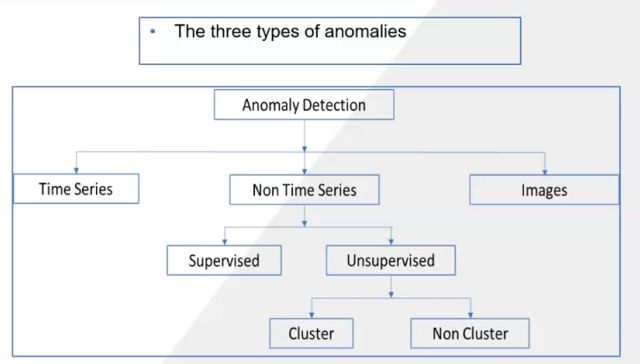

## Title: Anomaly Detection: Machine Learning, Deep Learning, AutoML
- Instructor: SeaportAi.

## Section 1: Introduction

### 1. Introduction

### 2. Course Structure


## Section 2: The Three Types of Anomalies

### 3. Understanding Anomalies

### 4. Application Scenarios
- Time based
  - Non performing employees/sites/equipment
  - Customer's banking transactions
  - Purchase in a year from a vendor
  - sales
- Non-time based
  - Churn prediction
  - Insurance claims
  - Defaulters
- Images
  - Images of equipment
  - Original vs counterfeit
  - Patient and infrastructure images in healthcare

### 5. Anomaly vs. Outlier: Is every anomaly an outlier?
- Outlier might be detected through box plot
  - Maximum observation = Q3 + 1.5 (Q3-Q1)
  - Mininum observation = Q1 - 1.5 (Q3-Q1)
  - Q3: 75th percentile
  - Q1: 25th percentile
  - Outlier: any point outside of the lower or upper limit
- Every outlier is anomaly
- But every anomaly is not an outlier

## Section 3: Anomaly Detection - Time Series

### 6. Understanding Anomaly Detection in Time Series Data
- Time series data
  - Original = seasonal + trend + residual
- Tukey's fences
  - Similar to box plot above
- Prophet algorithm from FaceBook
  - Piecewise linear regression 
  - Fourier series: detects seasonal data
  - Bayesian change point detection
  - Uncertainty estimates from Monte Carlo simulation

### 7. Programming for Anomaly Detection - Time Series
```py
from google.colab import drive
drive.mount('/content/drive')
import pandas as pd
from fbprophet import Prophet
import matplotlib.pyplot as plt
import os
os.chdir('drive/My Drive')
import os
import altair as alt
file_path = 'Prophet model ts data.csv'
data = pd.read_csv(file_path)
def fit_predict_model(dataframe, interval_width = 0.99, changepoint_range = 0.8):
    m = Prophet(daily_seasonality = False, yearly_seasonality = False, weekly_seasonality = False,
                seasonality_mode = 'multiplicative', 
                interval_width = interval_width,
                changepoint_range = changepoint_range)
    m = m.fit(dataframe)
    forecast = m.predict(dataframe)
    forecast['fact'] = dataframe['y'].reset_index(drop = True)
    print('Displaying Prophet plot')
    fig1 = m.plot(forecast)
    return forecast
pred = fit_predict_model(data)
def detect_anomalies(forecast):
    forecasted = forecast[['ds','trend', 'yhat', 'yhat_lower', 'yhat_upper', 'fact']].copy()
    #forecast['fact'] = df['y']
    forecasted['anomaly'] = 0
    forecasted.loc[forecasted['fact'] > forecasted['yhat_upper'], 'anomaly'] = 1
    forecasted.loc[forecasted['fact'] < forecasted['yhat_lower'], 'anomaly'] = -1
    #anomaly importances
    forecasted['importance'] = 0
    forecasted.loc[forecasted['anomaly'] ==1, 'importance'] = \
        (forecasted['fact'] - forecasted['yhat_upper'])/forecast['fact']
    forecasted.loc[forecasted['anomaly'] ==-1, 'importance'] = \
        (forecasted['yhat_lower'] - forecasted['fact'])/forecast['fact']
    return forecasted
pred = detect_anomalies(pred)
pred.head()
pd.plotting.register_matplotlib_converters()  # needed to plot timestamps
pred.plot(x='ds', y=['fact', 'yhat', 'yhat_upper', 'yhat_lower'])
plt.title('Sales in Mil over time')
plt.xlabel('Date')
plt.ylabel('Sales')
plt.show()
anomaly_data = pred[pred['anomaly'] == 1]
anomaly_data
```

## Section 4: Anomaly Detection - Unsupervised DBSCAN

8. Anomaly Detection - Unsupervised DBSCAN
- Non Time series - Unsupervised - Cluster
- Density-Based Spatial Clustering of Applications with Noise (DBSCAN) is a density based clustering algorithm
  - Groups together the points that are closely packed and marks the low density points far apart as outliers
- 2 Parameters
  - minPts: the minimum number of points (a threshold) clustered together
  - eps (epsilon): a distance measure that locates th epoints in the neighborhood of any point
```py
from google.colab import drive
drive.mount('/content/drive')
import pandas as pd
import matplotlib.pyplot as plt
from sklearn.cluster import DBSCAN
from sklearn.preprocessing import StandardScaler
import os
os.chdir('drive/My Drive')
df = pd.read_csv('MELBOURNE_HOUSE_PRICES_LESS.csv')
print(len(df))
df.head()
df.fillna(df.median(), inplace = True)
df_num = df.select_dtypes (include = ["float64", "int64"])
cols = df_num.columns.tolist()
cols
X = StandardScaler().fit_transform(df_num)
X1 = pd.DataFrame(X, columns=cols)
X1.head()
df1 = df[cols]
df1
X = StandardScaler().fit_transform(df1)
X1 = pd.DataFrame(X, columns=cols)
X1.head()
def plot_model(lables, alg_name, plot_index):    
    # plt.figure(plot_index)
    fig = plt.figure(figsize=(15,15))
    ax = fig.add_subplot(1,1,plot_index) 
    color_code = {'anomaly':'red', 'normal':'green'}
    colors = [color_code[x] for x in labels]
    ax.scatter(X1.iloc[:,0], X1.iloc[:,1], color=colors, marker='.', label='red = anomaly')
    ax.legend(loc="lower right")
    #leg = plt.gca().get_legend()
    #leg.legendHandles[0].set_color('red')
    ax.set_title(alg_name)
    fig.show()
model = DBSCAN(eps=0.63).fit(X1)
labels = model.labels_
# print(labels)
# label == -1 then it is anomaly
labels = [('anomaly' if x==-1 else 'normal') for x in labels]
# print(labels)
plot_model(labels, 'DBSCAN', 1)
```  

## Section 5: Anomaly Detection - Unsupervised Isolation Forest

### 9. Unconvering Isolation Forest Algorithm
- Non Time series - Unsupervised - Non cluster
- Isolation: separating an instance from the rest of the instances
- Anomalies are few and different, and they are prone to isolation
- Using binary search tree structure and dividing the data to finally arrive at the anomaly
  - First, we define an isolation tree. Each node of tree is either an external node or internal node
  - External nodes do not branch the tree any further
  - Internal nodes further branch into left child nodes or right child nodes
  - The split of left/right is dependen on a test
  - With all instances having value of feature q lesser than p categorized into the left child of the internal node and the instance greater than p into the right child
  - Path length determines the anomaly

### 10. Isolation Forest Programming
```py
import numpy as np
import pandas as pd
from sklearn.ensemble import IsolationForest
df=pd.read_csv("/content/insurance data.csv")
df.head()
features = ['age','policy_annual_premium','months_as_customer','total_claim_amount',
             'auto_year','umbrella_limit','insured_zip','number_of_vehicles_involved',
             'incident_hour_of_the_day','bodily_injuries',
             'witnesses','injury_claim','property_claim','vehicle_claim','policy_state',
             'insured_sex','insured_education_level','insured_occupation','insured_hobbies',
             'incident_type','collision_type','incident_severity','authorities_contacted',
             'incident_state','incident_city','property_damage',
             'police_report_available','auto_make']
print((features))
to_model_columns=df[features]
to_model_columns
to_model_columns.dtypes
to_model_columns["policy_state"] = to_model_columns["policy_state"].astype('category')
to_model_columns["insured_sex"] = to_model_columns["insured_sex"].astype('category')
to_model_columns["insured_education_level"] = to_model_columns["insured_education_level"].astype('category')
to_model_columns["insured_occupation"] = to_model_columns["insured_occupation"].astype('category')
to_model_columns["insured_hobbies"] = to_model_columns["insured_hobbies"].astype('category')
to_model_columns["incident_type"] = to_model_columns["incident_type"].astype('category')
to_model_columns["collision_type"] = to_model_columns["collision_type"].astype('category')
to_model_columns["incident_severity"] = to_model_columns["incident_severity"].astype('category')
to_model_columns["authorities_contacted"] = to_model_columns["authorities_contacted"].astype('category')
to_model_columns["incident_state"] = to_model_columns["incident_state"].astype('category')
to_model_columns["incident_city"] = to_model_columns["incident_city"].astype('category')
to_model_columns["property_damage"] = to_model_columns["property_damage"].astype('category')
to_model_columns["police_report_available"] = to_model_columns["police_report_available"].astype('category')
to_model_columns["auto_make"] = to_model_columns["auto_make"].astype('category')
to_model_columns.dtypes
to_model_columns["policy_state"] = to_model_columns["policy_state"].cat.codes
to_model_columns["insured_sex"] = to_model_columns["insured_sex"].cat.codes
to_model_columns["insured_education_level"] = to_model_columns["insured_education_level"].cat.codes
to_model_columns["insured_occupation"] = to_model_columns["insured_occupation"].cat.codes
to_model_columns["insured_hobbies"] = to_model_columns["insured_hobbies"].cat.codes
to_model_columns["incident_type"] = to_model_columns["incident_type"].cat.codes
to_model_columns["collision_type"] = to_model_columns["collision_type"].cat.codes
to_model_columns["incident_severity"] = to_model_columns["incident_severity"].cat.codes
to_model_columns["authorities_contacted"] = to_model_columns["authorities_contacted"].cat.codes
to_model_columns["incident_state"] = to_model_columns["incident_state"].cat.codes
to_model_columns["incident_city"] = to_model_columns["incident_city"].cat.codes
to_model_columns["property_damage"] = to_model_columns["property_damage"].cat.codes
to_model_columns["police_report_available"] = to_model_columns["police_report_available"].cat.codes
to_model_columns["auto_make"] = to_model_columns["auto_make"].cat.codes
to_model_columns.head()
clf=IsolationForest(n_estimators=100, max_samples='auto', contamination=float(.12),\
                        max_features=1.0, bootstrap=False, n_jobs=-1, random_state=42, verbose=0)
clf.fit(to_model_columns)
IsolationForest(behaviour='deprecated', bootstrap=False, contamination=0.12,
                max_features=1.0, max_samples='auto', n_estimators=100,
                n_jobs=-1, random_state=42, verbose=0, warm_start=False)
pred = clf.predict(to_model_columns)
to_model_columns['anomaly']=pred
#print(pred)
outliers=to_model_columns.loc[to_model_columns['anomaly']==-1]
outlier_index=list(outliers.index)
#print(outlier_index)
#Find the number of anomalies and normal points here points classified -1 are anomalous
print(to_model_columns['anomaly'].value_counts())
import matplotlib.pyplot as plt
from sklearn.decomposition import PCA
from sklearn.preprocessing import StandardScaler
from mpl_toolkits.mplot3d import Axes3D
pca = PCA(n_components=3)  # Reduce to k=3 dimensions
scaler = StandardScaler()
#normalize the metrics
X = scaler.fit_transform(to_model_columns)
X_reduce = pca.fit_transform(X)
fig = plt.figure()
ax = fig.add_subplot(111, projection='3d')
ax.set_zlabel("x_composite_3")
# Plot the compressed data points
ax.scatter(X_reduce[:, 0], X_reduce[:, 1], zs=X_reduce[:, 2], s=4, lw=1, label="inliers",c="green")
# Plot x's for the ground truth outliers
ax.scatter(X_reduce[outlier_index,0],X_reduce[outlier_index,1], X_reduce[outlier_index,2],
           lw=2, s=60, marker="x", c="red", label="outliers")
ax.legend()
plt.show()
to_model_columns = to_model_columns.iloc[: , :-1]
pred = clf.predict(to_model_columns)
to_model_columns['anomaly']=pred
cleanup_nums = {"anomaly":     {1: "Normal", -1: "Anomaly"}}
to_model_columns = to_model_columns.replace(cleanup_nums)
print(to_model_columns['anomaly'].value_counts())
output_df=pd.DataFrame(to_model_columns)
output_df.to_csv(r'/content/output.csv',index = False)
print(output_df)
```

## Section 6: Explainable AI (XAI): Anomaly Detection

### 11. Explainable AI: Understand the Output of Anomaly Detection Algorithm
- SHAP - Fraud/anomaly detection (unsupervised)
```py
import pandas as pd
from sklearn.ensemble import IsolationForest
import shap
data = pd.read_csv('content/InsFraudDataset6.csv')
model = IsolationForest(n_estimator=100,contamination=0.01,random_state=42)
model.fit(data)
anomalies = model.predict(data)
# explain the anomalies using SHAP library
explainer = shap.Explainer(model.predict,data)
shap_values = explainer(data)
# visualize the SHAP values
shap.plots.waterfall(shap_values[0])
# print the anomalies and their shap values
for i in range(len(data)):
    if anomalies[i] == -1:
        print(f"Anomaly detected in data point {i}: {data.iloc[i]}")
        shap.plots.waterfall(sharp_values[i])
```

## Section 7: Anomaly Detection - Supervised

### 12. Anomaly Detection - Supervised
- Non Time series - Supervised
```py
import pandas as pd
df3 = pd.read_csv('drive/My Drive/mul_Anomaly.csv')
df3.head(4)
df3 = df3.drop(['Loan_ID'], 1)
###########  Missing Value Treatment  #########
for i in df3.columns:
  clas = df3[i].dtypes
  if clas == 'object':
    df3[i].fillna(df3[i].mode()[0], inplace=True)
  else:
    df3[i].fillna(df3[i].mean(), inplace=True)
df3.dtypes
##########  Applying Label encoder for converting data type as objects to integer  ##########
from sklearn import preprocessing
le = preprocessing.LabelEncoder()
df4 = df3.copy()
for i in df4.columns:
  cls = df4[i].dtypes
  if cls == 'object':
    df4[i] = df4[[i]].astype(str).apply(le.fit_transform)
  else:
    df4[i] = df4[i]
df4.head(3)
for i in df4.columns:
  print(sum(pd.isnull(df4[i])))
from sklearn.model_selection import train_test_split
from sklearn.linear_model import LogisticRegression
from sklearn.metrics import confusion_matrix
from sklearn.metrics import f1_score
from sklearn.metrics import auc
from sklearn.metrics import accuracy_score
from sklearn.metrics import precision_recall_curve
#def find_anomaly(dataframe, output_variable):
X = df4.drop('Anomaly', 1)  ## Defining X and Y variables
y = df4['Anomaly']
X_train, X_test, y_train, y_test = train_test_split(X, y, test_size=1/4, random_state=0)  ### Splitting train and test datasets
classifier =  LogisticRegression()
classifier.fit(X_train, y_train)
y_pred = classifier.predict(X_test)
y_predd = ["Anomaly" if i == 1 else "Not Anomaly" for i in y_pred]
cm = confusion_matrix(y_test, y_pred)
print(cm)
print('Accuracy: ' + str(accuracy_score(y_test, y_pred)))
# predict probabilities
lr_probs_RF = classifier.predict_proba(X_test)
# keep probabilities for the positive outcome only
lr_probs_RF = lr_probs_RF[:, 1]
lr_precision_RF, lr_recall_RF, _ = precision_recall_curve(y_test, lr_probs_RF)
lr_f1_RF, lr_auc_RF = f1_score(y_test, y_pred), auc(lr_recall_RF, lr_precision_RF)
# summarize scores
print('Random Forest: f1=%.3f auc=%.3f' % (lr_f1_RF, lr_auc_RF))
#return (y_pred, max(lr_probs_RF))
X_test['Prediction'] = y_predd
X_test
```

## Section 8: Anomaly Detection - Images

### 13. Intro and Background
- Anomaly detection for non-numerical data
- Load/read images -> Convert images into vectors -> Isolation forest -> deploy

### 14. Anomaly Detection - Images
```py
from google.colab import drive
drive.mount('/content/drive')
import os
os.chdir('drive/My Drive/Image Anomaly')
curr_dir = os.getcwd()
#Training the model
save_model = 'anomaly_detector.model'
dataset = curr_dir+'/train'
print(dataset)
from pyimagesearch.features import load_dataset
from sklearn.ensemble import IsolationForest
import argparse
import pickle
# load and quantify our image dataset
print("[INFO] preparing dataset...")
data = load_dataset(dataset, bins=(3, 3, 3))
# train the anomaly detection model
print("[INFO] fitting anomaly detection model...")
model = IsolationForest(n_estimators=100, contamination=0.01,
	random_state=42)
#data = data.reshape(-1, 1)
model.fit(data)
f = open(save_model, "wb")
f.write(pickle.dumps(model))
f.close()
#Finding Anomaly
model = 'anomaly_detector.model'
image_path = curr_dir+'/examples/2.PNG'
print(image_path)
from pyimagesearch.features import quantify_image
import argparse
import pickle
import cv2
from google.colab.patches import cv2_imshow
# load the anomaly detection model
print("loading anomaly detection model...")
model_path = open('anomaly_detector.model', 'rb')
model = pickle.loads(model_path.read())
# load the input image, convert it to the HSV color space, and
# quantify the image as we did during training
image = cv2.imread(image_path)
hsv = cv2.cvtColor(image, cv2.COLOR_BGR2HSV)
features = quantify_image(hsv, bins=(3, 3, 3))
# use the anomaly detector model and extracted features to determine
# if the example image is an anomaly or not
preds = model.predict([features])[0]
label = "anomaly" if preds == -1 else "normal"
color = (0, 0, 255) if preds == -1 else (0, 255, 0)
# draw the predicted label text on the original image
cv2.putText(image, label, (10,  25), cv2.FONT_HERSHEY_SIMPLEX,
  0.7, color, 2)
# display the image
cv2_imshow(image)
cv2.waitKey(0)
```

## Section 9: Anomaly Detection Using Deep Learning

### 15. GAN
- Generative Adversarial networks
  - Two neural networks compete with each other to become more accurate in their predictions
- Two main components
  - Generator: Creates fake data
  - Discriminator: distinguishes b/w real and fake
- Suitable for unsupervised learning

### 16. RBM, DBN
- Boltzmann Machine
  - Visible layer
    - Connected by weights that represent dependencies
    - Hidden layer
  - Generate new data
- Restricted Boltzmann Machines (RBM)  
  - Generative stochastic neural networks
  - Consists of a visible layer and a hidden layer
    - Visible layer for the input data
      - Connected by weights that represent dependencies but restricts the dependencies
    - Hidden layer represents the underlying features of the input data
  - Not all of nodes are connected each other
- Deep Belief Networks (DBNs)  
  - Composed of multiple RBMs stacked on top of each other to form a deep generative model

### 17. Auto Encoder
- ANN of unsupervised learning
  - Learn a compact representation of the input data that captures its most important features
- Goa is to lean a representation that captures the most important features of the input data
  - Encode the input data to a lower dimensional representation (encoding)
  - Decode this representation back into the original data
  
### 18. Building the anomaly detection models

## Seciton 10: PyOD: A comparison of 10 algorithms

## Section 11: How to handle an Imbalanced Dataset: Predicting High Impact Low Volume Events

## Section 12: No Code (AutoML) approach to anomaly detection using PowerBI

## Section 13: Machine Learning Refresher

## Section 14: Bonus Lecture
