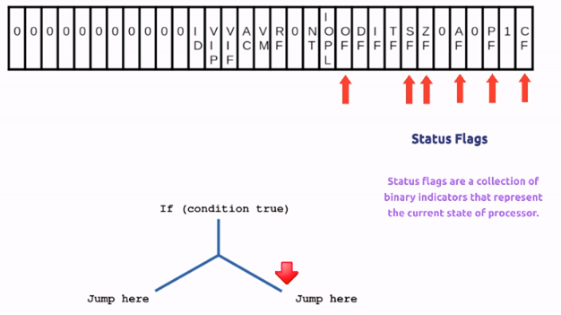

## Title: Assembly Language Foundation Course for Ethical Hackers
- Instructor: Swapnil Singh

## Section 1: Introduction

1. Who can join this course and what skills needed for this course

## Section 2: Building the basics for assembly language programming

2. Computer system working and the CPU role

3. Internal components of the CPU

4. What are the registers inside the CPU?
- Registers
  - General purpose
  
  - Segment
  
    - CS: Code segment contains the pointer to the code segment in memory. Code segments is where the instruction codes are stored
    - DS/ES/FS/GS: Data segment pointer
    - SS: Stack segment
  - Instruction pointer    


5. Flags of the CPU
- Status Flag: success or fail if the instruction succeeds or fails

6. Flag structure of the CPU
- Status flags: Collection of binary indicators that represent the current state of processor

- System flags: Control the overall behavior of the CPU and its intersection with the system

- Control flags: Control specific behavior in the processor. Only 1 (DF) in 32bit 


7. Flags working in CPU
- Ref: https://www.ic.unicamp.br/~celio/mc404-2006/flags.html
- Carry Flag: When the number exceeds the highest possible number. Indicates the result isn't correct when interpreted as unsigned
- Parity Flag: this flag is set to 1 when there is even number of one bits in result, and to 0 when there is odd number of one bits
- Auxiliary Flag: set to 1 when there is an unsigned overflow for low nibble (4 bits)
- Zero Flag: set to 1 when result is zero. For none zero result this flag is set to 0
- Sign Flag: set to 1 when result is negative. When result is positive it is set to 0
- Overflow Flag: Indicates the result isn't correct when interpreted as signed
  - CF and OF are not same
  - Ref: https://stackoverflow.com/questions/69124873/understanding-the-difference-between-overflow-and-carry-flags
- Direction Flag: this flag is used by some instructions to process data chains, when this flag is set to 0 - the processing is done forward, when this flag is set to 1 the processing is done backward

8. Program's memory layout in the computer system

| Memory layout|
| :--: |
| command line arguments & environment variables |
| stack |
|  ... |
| heap |
| Unintialized data (.bss) |
| Initialized data  (.data) |
| .text (executable code instructions )|

- Sample.c
```c
#include <stdio.h>
int a;      // to .bss
int b=4;    // to .data
int main()  // entire function goes to stack
{ 
  return 0; // to .text
}
```
- gcc sample.c
- size ./a.out
```bash
   text	   data	    bss	    dec	    hex	filename
   1418	    548	     12	   1978	    7ba	./a.out
```
- Default bss size is 8 bytes (when there is no uninitalized data)
  - By `int a`, 4+8 = 12 bytes
- Default data has 544 bytes (when there is no initialized data)

9. How to view the stack of a program
```c
#include <stdio.h>
int a;      // to .bss
int b=4;    // to .data
int main()  // entire function goes to stack
{
  while (1) {
    sleep(1);
  }
  return 0;
}
```
- Ruinnning the sample code
```bash
- gcc ch9.c
- a.out& (infinite loop)
$ ./a.out &
[3] 88419  # find this process from /proc folder
$ cat /proc/88419/maps |grep stack
7ffce0dff000-7ffce0e20000 rw-p 00000000 00:00 0                          [stack]
```
  - This shows the range of stack memory

## Section 3: Hello World in Assembly

10. Structure of the assembly program
- Basic assembly code structure
```asm
.section .data

.section .bss

.section .text

.globl _start

_start:                         
```
- as ch10.s -o ch10.o
- ld ch10.o -o a.exe
  - a.exe will not run but just a sample demo
```bash
$ size a.exe 
   text	   data	    bss	    dec	    hex	filename
      0	      0	      0	      0	      0	a.exe
```

11. System calls Before Hello World in Assembly
```c
#include <stdio.h>
int main() {
  printf("hello world\n");
  return 0;
}
```
- system call through strace:
```bash
$ gcc ch11.c
$ strace -c ./a.out
hello world
% time     seconds  usecs/call     calls    errors syscall
------ ----------- ----------- --------- --------- ----------------
  0.00    0.000000           0         1           read
  0.00    0.000000           0         1           write
  0.00    0.000000           0         2           close
  0.00    0.000000           0        16        15 stat
  0.00    0.000000           0         3           fstat
  0.00    0.000000           0         7           mmap
  0.00    0.000000           0         3           mprotect
  0.00    0.000000           0         1           munmap
  0.00    0.000000           0         3           brk
  0.00    0.000000           0         6           pread64
  0.00    0.000000           0         1         1 access
  0.00    0.000000           0         1           execve
  0.00    0.000000           0         2         1 arch_prctl
  0.00    0.000000           0        26        24 openat
------ ----------- ----------- --------- --------- ----------------
100.00    0.000000                    73        41 total
$ strace ./a.out
execve("./a.out", ["./a.out"], 0x7ffea76f5280 /* 62 vars */) = 0
brk(NULL)                               = 0x555e09bf4000
...
write(1, "hello world\n", 12hello world
)           = 12
exit_group(0)                           = ?
+++ exited with 0 +++
```
- As shown above, write() function has 3 arguments
- Let's try python now
  - hello.py
```py
print("hello world")
```
- strace for python
```bash
$ strace python3 hello.py
...
write(1, "hello world\n", 12hello world
)           = 12
...
exit_group(0)                           = ?
+++ exited with 0 +++
```
- Python3 uses the same system call of write()

12. Writing our first Hello World program in assembly
- Steps
  - Find the system call number of write
  - Send arguments for write()
- Number of system calls is found at /usr/include/asm-generic/unistd.h
  - Q: This doesn't match. Use https://blog.rchapman.org/posts/Linux_System_Call_Table_for_x86_64/
```c
#define __NR_write 64
__SYSCALL(__NR_write, sys_write)
```
  - In 32bit OS, the call number of write() is 4 
- ch12.s
```asm
.section .data
       msg: 
            .ascii "Hello world\n"
.section .text
.globl _start
_start: 
       movl $4, %eax   # syscall number
       movl $1,  %ebx  # file descriptor for write syscall
       movl $msg,%ecx  # move buffer point to write syscall
       movl $13, %edx  # 13 bytes of Hello world\n       
       int  $0x80      # interrupt - calling system call
       movl $1, %eax   # 1 is syscall number for exit
       movl $0, %ebx   # 0 argument for exit() 
       int $0x80       # activate exit()
```
- Demo:
```bash
$ as ch12.s -o ch12.o; ld ch12.o -o ch12.exe
$ ./ch12.exe 
Hello world
```
- This runs as 32bit mode as it uses `int $0x80` for interrupt
- Following is the 64bit version
```asm
.section .data
       msg: 
            .ascii "Hello world\n"
.section .text
.globl _start
_start: 
       mov $1,  %rax   # syscall number
       mov $1,  %rdi  # file descriptor for write syscall
       mov $msg,%rsi  # move buffer point to write syscall
       mov $13, %rdx  # 13 bytes of Hello world\n       
      syscall      # interrupt - calling system call
       mov $60, %rax  
       mov $0, %rbx   # 0 argument for exit() 
      syscall       # activate exit()
```
  - Ref: https://jameshfisher.com/2018/03/10/linux-assembly-hello-world/

13. Compiling an assembly program in gcc
- Rename `_start` with `main`
```asm
.section .data
       msg: 
            .ascii "Hello world\n"
.section .text
.globl main
main: 
       movl $4, %eax   # syscall number
       movl $1,  %ebx  # file descriptor for write syscall
       movl $msg,%ecx  # move buffer point to write syscall
       movl $13, %edx  # 13 bytes of Hello world\n       
       int  $0x80      # interrupt - calling system call
       movl $1, %eax   # 1 is syscall number for exit
       movl $0, %ebx   # 0 argument for exit() 
       int $0x80       # activate exit()
```
- Then compile using `gcc hello.s -o hello.exe -no-pie`

14. Debugging our assembly program
```bash
$ as ch12_32bit.s -o hello.o
$ ld hello.o -o hello.exe
$ gdb -q ./hello.exe
Reading symbols from ./hello.exe...
(No debugging symbols found in ./hello.exe)
gdb-peda$ disassemble _start
Dump of assembler code for function _start:
   0x0000000000401000 <+0>:	mov    eax,0x4
   0x0000000000401005 <+5>:	mov    ebx,0x1
   0x000000000040100a <+10>:	mov    ecx,0x402000
   0x000000000040100f <+15>:	mov    edx,0xd # d in hex => 13 in decimal
   0x0000000000401014 <+20>:	int    0x80
   0x0000000000401016 <+22>:	mov    eax,0x1
   0x000000000040101b <+27>:	mov    ebx,0x0
   0x0000000000401020 <+32>:	int    0x80
gdb-peda$ b * 0x0000000000401000
Note: breakpoint 1 also set at pc 0x401000.
Breakpoint 2 at 0x401000
gdb-peda$ run
...
[-------------------------------------code-------------------------------------]
   0x400ffa:	add    BYTE PTR [rax],al
   0x400ffc:	add    BYTE PTR [rax],al
   0x400ffe:	add    BYTE PTR [rax],al
=> 0x401000 <_start>:	mov    eax,0x4
   0x401005 <_start+5>:	mov    ebx,0x1
   0x40100a <_start+10>:	mov    ecx,0x402000
   0x40100f <_start+15>:	mov    edx,0xd
   0x401014 <_start+20>:	int    0x80
...
gdb-peda$ info registers
rax            0x0                 0x0  # empty at this moment
rbx            0x0                 0x0
rcx            0x0                 0x0
rdx            0x0                 0x0
rsi            0x0                 0x0
...
gdb-peda$ ni # next instruction
...
gdb-peda$ info registers
rax            0x4                 0x4 # <--- now this is 4
...
gdb-peda$ ni 
gdb-peda$ ni 
gdb-peda$ info registers
rax            0x4                 0x4
rbx            0x1                 0x1
rcx            0x402000            0x402000
...
gdb-peda$ x/s 0x402000
0x402000:	"Hello world\n"
...
gdb-peda$  p/x $eax  # print in hexa
$4 = 0x4
gdb-peda$  p/d $eax  # print in decimal
$5 = 4
gdb-peda$ p/t $eax   # print in binary
$6 = 100

```
- No debug info at this moment
- If gdb continues to run, instead of pausing at break point, add `nop` in the top of _start section

15. Using C library functions in assembly program
```asm
.section .data
   msg: 
       .ascii "Hello World\n"
.section .text
.globl _start
_start:
   pushl $msg
   call printf # this is a C function. Needs -lc from ld command
   pushl $0    # Exit function
   call exit
```
- as hello.s -o hello.o
- ld -lc -dynamic-linker /lib/ld-linux.so.2 hello.o -o hello
  - This is for 32bit OS

## Section 4: Moving Data

16. Defined the data in data section in assembly program

| Directive | Data type |
|-----------|-----------|
| .ascii | Text string |
| .asciz | Null-terminated text string |
| .byte  | Byte value |
| .double| Double-precision floating-point number |
| .float | Single-precision floating-point number |
| .int  | 32bit integer |
| .long | 32bit integer |
| .octa | 16-bit integer |
| .quad | 8-byte integer |
| .short | 16-bit integer |
|. single| Single precision floating-point number |

- Sampe C code
```c
#include <stdio.h>
char *string = "Hello world\n";
int a = 3;
double pi = 3.14;
int main() {
  return 0;
}
```
- Sample asm code
```asm
.section .data
   string:
      .ascii "Hello world\n"
   a:
       .int 3
   pi: 
       .double 3.14
.section .text
.globl _start
_start:
   movl $1, %eax
   movl $0, %ebx
   int $0x80
```
- as asm.s -o asm.o
- ld asm.o -o asm.exe
- gdb -q ./asm.exe
```bash
gdb-peda$ b * _start
Breakpoint 1 at 0x401000
gdb-peda$ run
...
gdb-peda$ info variables
All defined variables:
Non-debugging symbols:
0x0000000000402000  string
0x000000000040200c  a
0x0000000000402010  pi
0x0000000000402018  __bss_start
0x0000000000402018  _edata
0x0000000000402018  _end
gdb-peda$ x/s 0x0000000000402000
0x402000:	"Hello world\n\003"  # the last 003 is from 0x000000000040200c
gdb-peda$ x/d &a
0x40200c:	3
gdb-peda$ x/f &pi
0x402010:	3.1400000000000001
```

17. Using static symbols in assembly programs
```asm
.section .data
       msg: 
            .ascii "Hello world\n"
      .equ str_len, 13
.section .text
.globl _start
_start: 
       movl $4, %eax   # syscall number
       movl $1,  %ebx  # file descriptor for write syscall
       movl $msg,%ecx  # move buffer point to write syscall
       movl $str_len, %edx  #  Using static symbol
       int  $0x80      # interrupt - calling system call
       movl $1, %eax   # 1 is syscall number for exit
       movl $0, %ebx   # 0 argument for exit() 
       int $0x80       # activate exit()
```
- as as17.s -o as17.o
- ld as17.o -o as17.exe

18. How to define and use data in the bss section
- man read:
```bash
EAD(2)                    Linux Programmer's Manual                   READ(2)
NAME
       read - read from a file descriptor
SYNOPSIS
       #include <unistd.h>
       ssize_t read(int fd, void *buf, size_t count);
```
- A sample assembly code with 32bit:
```asm
.section .bss
        .comm buffer,15 # common memory
.section .text
.globl _start
_start:
       # read syscall for taking user input
       movl $3, %eax
       movl $0, %ebx # file descriptor for input
       movl $buffer, %ecx # buffer pointer
       movl $15, %edx
       int $0x80
       # write syscall for printing the buffer
       movl $4, %eax
       movl $1, %ebx
       movl $buffer, %ecx
       movl $15, %edx
       int $0x80
       # exit syscall to exit the program
       movl $1, %eax
       movl $0, %ebx
       int $0x80
```
- as as18.s -o as18.o
- ld as18.o -o as18.exe
-  ./as18.exe
  - Enter: Hello Udemy
  - Shows: Hello Udemy
- A following is the 64bit version
```asm
section .bss
        .comm buffer,15 # common memory
.section .text
.globl _start
_start:
       # read syscall for taking user input
       mov $0, %rax
       mov $0, %rdi # file descriptor for input. Note %rdi
       mov $buffer, %rsi # buffer pointer. Note %rsi
       mov $15, %rdx
       syscall
       # write syscall for printing the buffer
       mov $1, %rax
       mov $1, %rdi
       mov $buffer, %rsi
       mov $15, %rdx
       syscall
       # exit syscall to exit the program
       mov $60, %rax
       mov $0, %rbx
       syscall
```

19. Moving data in Assembly programming
- Syntax
  - mov* source, destiny
  - Ex: `movl $4, %eax`
- mov data size
  - movl: 32bit long data
  - movw: 16bit word data
  - movb: 8bit byte data

20. Practical Demonstration of moving data in assembly
```asm
.section .text
.globl _start
_start:
  movl $25, %eax
  movw $4, %bx
  movb $1, %cl
  movl $1, %eax
  movl $0, %ebx
  int $0x80
```
- Demo:
```bash
$ as as20.s -o as20.o
$ ld as20.o -o as20.exe
$ gdb -q as20.exe
gdb-peda$ disassemble _start
Dump of assembler code for function _start:
=> 0x0000000000401000 <+0>:	mov    eax,0x19
   0x0000000000401005 <+5>:	mov    bx,0x4
   0x0000000000401009 <+9>:	mov    cl,0x1
   0x000000000040100b <+11>:	mov    eax,0x1
   0x0000000000401010 <+16>:	mov    ebx,0x0
   0x0000000000401015 <+21>:	int    0x80
End of assembler dump.
gdb-peda$ b * _start
gdb-peda$ run
gdb-peda$ ni # run ni 3 times
gdb-peda$ info registers
rax            0x19                0x19
rbx            0x4                 0x4
rcx            0x1                 0x1
...
```
- 64bit [rcx] => 34bit [ecx] => 16bit [cx] = 16bit [ch][cl]
- If the `movb $1, %cl` is replaced with `movb $1, %ch`, $rcx becomes [01][00], which becomes 256 in decimal
```bash
gdb-peda$ p $rcx
$1 = 0x100
```

21. More advanced data movements in assembly
```asm
.section .bss
   .comm mydata,4  # assigns 4 bytes into mydata (address might be 0x402000)
.section .text
.globl _start
_start:
       nop
       movl $100, mydata     # mydata is now 100
       movl mydata,%ecx      # 100 into %ecx
       movl $mydata, %edx    # move the address of mydata into edx
       movl $500, %eax       # move 500 into eax
       movl %eax,(%edx)      # move eax value to the content of the address
       movl $1, %eax
       movl $0, %ebx
       int $0x80
```
- In GDB,
  - To see the variable: x/d &mydata
- Q: after 500->eax->(edx), edx becomes -12. Any overflow?
  - 200 works OK. 300 not.

22. Accessing and moving indexed values in assembly
```asm
.section .data
  Numbers:
    .int 10,20,30,40,50,60
.section .text
.globl _start
_start:
  # base_address(offset_address,index,size) index begins from 0
  # Number(,2,4) when offset is 0
  movl $2, %edi
  movl Numbers(,%edi,4), %eax
  #movl Numbers(,2,4), %eax # this doesn't work. index must be given from register
  movl $1,%eax
  movl $0,%ebx
  int $0x80
```
- In gdb, disassemble the code
- Make sure $eax has 30 when done

23. Direct and indirect addressing in assembly
- Direct memory addressing
  - `movl $5, 0xAAAA`: put value 5 into 0xAAAA
- Indirect memory addressing
  - When we cannot access the memory address
  - `movl 0xAAAA,eax`: put the address into a register
  - `movl $5,(eax)`: put 5 into the address which eax points to

24. Practical example of direct and indirect addressing in assembly
```asm
.section .data
  Number:
    .int 0
.section .text
.globl _start
_start:
  nop
  #direct addressing
  movl $5, Number
  #indirect addressing
  movl $Number, %eax # move the address of Number into eax
  movl $10,(%eax)    # move 10 into the what eax points to
  movl $1,%eax
  movl $0,%ebx
  int $0x80
```
- Demo:
```bash
$ as as24.s -o as24.o
$ ld as24.o -o as24.exe
$ gdb -q as24.exe
Reading symbols from as24.exe...
(No debugging symbols found in as24.exe)
gdb-peda$ disassemble _start
Dump of assembler code for function _start:
   0x0000000000401000 <+0>:	nop
   0x0000000000401001 <+1>:	mov    DWORD PTR ds:0x402000,0x5
   0x000000000040100c <+12>:	mov    eax,0x402000
   0x0000000000401011 <+17>:	mov    DWORD PTR [eax],0xa
   0x0000000000401018 <+24>:	mov    eax,0x1
   0x000000000040101d <+29>:	mov    ebx,0x0
   0x0000000000401022 <+34>:	int    0x80
End of assembler dump.
gdb-peda$ b * _start
Breakpoint 1 at 0x401000
gdb-peda$ run
gdb-peda$ ni 
gdb-peda$ ni 
gdb-peda$ x/d &Number
0x402000:	5
gdb-peda$ ni 
gdb-peda$ ni 
gdb-peda$ x/d &Number
0x402000:	10
```

25. Concept of indirect address pointer
```asm
.section .data
  MyNumber:
    .int 4,8  # 8 byte memory space is made
    #  |0 0 0 8| 0 0 0 4| value
    #  |7 6 5 4| 3 2 1 0| index
.section .text
.globl _start
_start:
  nop
  nop
  movl $MyNumber, %eax
  movl $2,  (%eax)  # |0 0 0 8| 0 0 0 2| at [eax]
  movb $7, 1(%eax)  # |0 0 0 8| 0 0 7 2| at [eax +0x1]
  movb $9, 2(%eax) # |0 0 0 8| 0 9 0 2| at [eax +0x2]
  movw $3, 6(%eax) # |0 3 0 8| 0 9 0 2| at [eax +0x6]
  movl $1,%eax
  movl $0,%ebx
  int $0x80
```
- Note that **(%eax) and 1(%eax) are not same**
- Demo:
```bash
$ as as25.s -o as25.o
$ ld as25.o -o as25.exe
$ gdb -q as25.exe
gdb-peda$ b * _start
Breakpoint 1 at 0x401000
gdb-peda$ run
gdb-peda$ ni
gdb-peda$ ni
gdb-peda$ ni
gdb-peda$ x/8d $eax
0x402000:	4	0	0	0	8	0	0	0  # MyNumber, as it is
gdb-peda$ ni
gdb-peda$ x/8d $eax
0x402000:	2	0	0	0	8	0	0	0  # 2 is located in the 0th index
gdb-peda$ ni
gdb-peda$ x/8d $eax
0x402000:	2	7	0	0	8	0	0	0  # 7 is at 1st index 
gdb-peda$ ni
gdb-peda$ x/8d $eax
0x402000:	2	7	9	0	8	0	0	0  # 9 is at 2nd index
gdb-peda$ ni
gdb-peda$ x/8d $eax
0x402000:	2	7	9	0	8	0	3	0  # 3 is at 6th index
```

26. Accessing indexed memory locations in assembly
```asm
.section .data
  my_list:
    .int 11,22,33
.section .text
.globl _start
_start:
  nop
  nop
  # base_address (offset_address, index, size)
  movl $2, %edi
  movl  my_list(,%edi,4), %eax # zero-offset, 2nd index, size of 4 bytes
  movl $1,%eax
  movl $0,%ebx
  int $0x80
```
- 0 offset must be empty or use register
```asm
movl $0, %ebx
movl my_lsit(%ebx, %edi,4), %eax
```
- Results:
```bash
$gdb-peda$ info registers
rax            0x21                0x21
```
- Hexa 21 is 33 in decimal

27. How to create a stack frame in assembly
```asm
.section .text
.globl _start
_start:
   nop
   nop
   # copy the esp address to ebp
   movl %esp, %ebp
   # create some memory space in stack frame
   subl $8, %esp # from esp, subtract 8 bytes
   # exit
   movl $1,%eax
   movl $0,%ebx
   int $0x80
```
- %esp is the stack pointer
  - subtracting 8 bytes will move the esp to 8 bytes above
- At _start(), a stack frame is created
```bash
gdb-peda$ disassemble _start
Dump of assembler code for function _start:
=> 0x0000000000401000 <+0>:	nop
   0x0000000000401001 <+1>:	nop
   0x0000000000401002 <+2>:	mov    ebp,esp
   0x0000000000401004 <+4>:	sub    esp,0x8
   0x0000000000401007 <+7>:	mov    eax,0x1
   0x000000000040100c <+12>:	mov    ebx,0x0
   0x0000000000401011 <+17>:	int    0x80
```
- Initially, ebp is empty
```bash
rbp            0x0                 0x0
rsp            0x7fffffffd630      0x7fffffffd630
```
- After esp moves to ebp:
```bash
rbp            0xffffd630          0xffffd630
rsp            0x7fffffffd630      0x7fffffffd630
gdb-peda$ p $ebp
$2 = 0xffffd630
gdb-peda$ p $esp
$4 = 0xffffd630
gdb-peda$ p/d $ebp-$esp
$6 = 0  # same address
```
  - Now ebp and esp are same
- After subtracting 8 bytes from esp:
```bash
gdb-peda$ p/d $ebp-$esp
$7 = 8
gdb-peda$ p $esp
$8 = 0xffffd628
gdb-peda$ p $ebp
$9 = 0xffffd630
```

28. Adding and removing data on stack in assembly
- Scenario
  - push A
  - push B
    - esp points the latest data pushed (B now)
  - ebp is the bottom of the stack
  - pop (remove)
  - Now esp points A
- 32bit code:
```asm
.section .text
.globl _start
_start:
  nop
  nop
  # copy the data address to ebp
  movl %esp, %ebp
  # create some memory space in stack frame
  subl $8, %esp
  # adding the data in stack frame
  movl $100, %eax
  pushl %eax
  movl $200, %ebx
  pushl %ebx
  # removing data from stack
  popl %ebx
  popl %eax
  # exit
  movl $1, %eax
  movl $0, %ebx
  int $0x80
```
- 64bit code
```asm
.section .text
.globl _start
_start:
  nop
  nop
  # copy the data address to ebp
  mov %rsp, %rbp
  # create some memory space in stack frame
  sub $8, %rsp
  # adding the data in stack frame
  mov $100, %rax
  push %rax
  mov $200, %rbx
  push %rbx
  # removing data from stack
  pop %rbx
  pop %rax
  # exit
  syscall

```
- Demo:
```bash
$ as as28.as -o as28.o
$ ld as28.o -o as28.exe
$ gdb -q as28.exe
Reading symbols from as28.exe...
(No debugging symbols found in as28.exe)
gdb-peda$ disassemble _start
Dump of assembler code for function _start:
   0x0000000000401000 <+0>:	nop
   0x0000000000401001 <+1>:	nop
   0x0000000000401002 <+2>:	mov    rbp,rsp
   0x0000000000401005 <+5>:	sub    rsp,0x8
   0x0000000000401009 <+9>:	mov    rax,0x64
   0x0000000000401010 <+16>:	push   rax
   0x0000000000401011 <+17>:	mov    rbx,0xc8
   0x0000000000401018 <+24>:	push   rbx
   0x0000000000401019 <+25>:	pop    rbx
   0x000000000040101a <+26>:	pop    rax
   0x000000000040101b <+27>:	syscall 
End of assembler dump.
...
# running <+5>
gdb-peda$ x/3wx $rsp
0x7fffffffd628:	0x00000000	0x00000000	0x00000001
#---------------^rsp--------------------^rbp
# running <+16>
gdb-peda$ x/3wx $rsp
0x7fffffffd620:	0x00000064	0x00000000	0x00000000
#---------------^ value from rax. Note that rsp has shifted 8byte above
# running <+24>
gdb-peda$ x/3wx $rsp
0x7fffffffd618:	0x000000c8	0x00000000	0x00000064
#---------------^ value from rbx. rsp has shifted another 8 bytes
# running <+25>
gdb-peda$ x/3wx $rsp
0x7fffffffd620:	0x00000064	0x00000000	0x00000000
#---------------^ value from rbx is gone
# running <+26>
gdb-peda$ x/3wx $rsp
0x7fffffffd628:	0x00000000	0x00000000	0x00000001
#---------------^ value from rax is gone 
```

29. Data exchange instructions in assembly

30. Setting and clearing the flag bits Carry Flag

31. Setting and clearing the Overflow Flag in assembly

32. Setting and clearing the Parity Flag in assembly

33. Setting and clearing the Sign Flag in assembly

34. Setting and clearing the Zero Flag in assembly

## Section 5: Controlling Execution flow in assembly

## Section 6: Using numbers in assembly language

## Section 7: Basic Math functions in assembly

## Section 8: Working with Strings

## Section 9: Using functions in assembly programming

## Section 10: Using system calls in assembly programming

## Section 11: Inline assembly programming
