# Interactive Data Visualization with Python and Bokeh
- Insructor: Ardit Sulce 

## Section 1: Getting Started

### 1. Course Introduction

### 2. Helpful Resources

### 3. Installation

### 4. Getting Help

### 5. What is Bokeh

### Quiz 1: Bokeh and Bokeh Server

### 6. Creating Your First Bokeh Plot
```py
from bokeh.plotting import figure
from bokeh.io import output_file, show
# synthetic data creation
x = [1,2,3,4,5]
y = [6,7,8,9,10]
output_file("Line.html")
f = figure()
f.line(x,y)
show(f)
```
- A browser will pop-up with "Line.html", showing an interactive graph

### 7. Exercise 1: Plotting triangles and circle glyphs

### 8. Exercise 1: Solution

### 9. Using Bokeh with Pandas
```py
from bokeh.plotting import figure
from bokeh.io import output_file, show
import pandas as pd
df = pd.read_csv('data.csv')
x = df['x']
y = df['y']
output_file("Line_from_csv.html")
f = figure()
f.line(x,y)
show(f)
```

### 10. Exercise 2: Plotting Education Data

### 11. Exercise 2: Solution

### 12. Bug with the Show Method

### 13. Using the Bokeh Documentation
- https://docs.bokeh.org/en/latest/docs/reference.html

## Section 2: Customizing Bokeh Graphs

### 14. Section Introduction

### 15. Note

### 16. Creating an Initial Plot
```py
from bokeh.plotting import figure
from bokeh.io import output_file, show
from bokeh.sampledata.iris import flowers
output_file('iris.html')
f = figure()
f.circle(x=flowers['petal_length'],y=flowers['petal_width'])
show(f)
```

### 17. Figure Background
```py
from bokeh.plotting import figure
from bokeh.io import output_file, show
from bokeh.sampledata.iris import flowers
output_file('iris.html')
f = figure()
f.plot_width = 1100
f.plot_height = 650
f.background_fill_color = 'olive'
f.background_fill_alpha=0.3
f.border_fill_color='orange'
f.circle(x=flowers['petal_length'],y=flowers['petal_width'])
show(f)
```

### 18. List of Colors
- For color name, `f.background_fill_color="olive"` 
- For RGB hex value, `f.background_fill_color="#CD5C5C"`
- For RGB, `f.background_fill_color=(205,92,92)`
- For RGB + alpha channel, `f.background_fill_color=(205,92,92,0.3)`

### 19. Title
```py
from bokeh.plotting import figure
from bokeh.io import output_file, show
from bokeh.sampledata.iris import flowers
output_file('iris.html')
f = figure()
f.plot_width = 1100
f.plot_height = 650
f.background_fill_color = 'olive'
f.background_fill_alpha=0.3
f.border_fill_color='orange'
f.title.text = 'Iris Morphology'
f.title.text_color = 'Olive'
f.title.text_font = 'times'
f.title.text_font_size = "44px"
f.title.align="center"
f.circle(x=flowers['petal_length'],y=flowers['petal_width'])
show(f)
```

### 20. List of Text Fonts

### 21. Axes: Custom Styling
```py
from bokeh.plotting import figure
from bokeh.io import output_file, show
from bokeh.sampledata.iris import flowers
output_file('iris.html')
f = figure()
f.plot_width = 1100
f.plot_height = 650
f.background_fill_color = 'olive'
f.background_fill_alpha=0.3
f.border_fill_color='orange'
f.title.text = 'Iris Morphology'
f.title.text_color = 'Olive'
f.title.text_font = 'times'
f.title.text_font_size = "44px"
f.title.align="center"
f.axis.minor_tick_line_color = "blue"
f.yaxis.major_label_orientation ="horizontal"
f.xaxis.visible=True
#f.xaxis.minor_tick_line_color=None
f.xaxis.minor_tick_in=-6
#f.xaxis.minor_tick_out=10
f.xaxis.axis_label = "Petal Length"
f.yaxis.axis_label = "Petal Width"
f.axis.axis_label_text_color = 'blue'
f.axis.major_label_text_color = 'red'
f.circle(x=flowers['petal_length'],y=flowers['petal_width'])
show(f)
```

### 22. Axes: Custom Geometry
```py
from bokeh.plotting import figure
from bokeh.io import output_file, show
from bokeh.sampledata.iris import flowers
from bokeh.models import Range1d
output_file('iris.html')
f = figure()
f.plot_width = 1100
f.plot_height = 650
f.background_fill_color = 'olive'
f.background_fill_alpha=0.3
f.border_fill_color='orange'
f.title.text = 'Iris Morphology'
f.title.text_color = 'Olive'
f.title.text_font = 'times'
f.title.text_font_size = "44px"
f.title.align="center"
f.axis.minor_tick_line_color = "blue"
f.yaxis.major_label_orientation ="horizontal"
f.xaxis.visible=True
#f.xaxis.minor_tick_line_color=None
f.xaxis.minor_tick_in=-6
#f.xaxis.minor_tick_out=10
f.xaxis.axis_label = "Petal Length"
f.yaxis.axis_label = "Petal Width"
f.axis.axis_label_text_color = 'blue'
f.axis.major_label_text_color = 'red'
f.x_range = Range1d(start=0,end=10)
f.y_range = Range1d(start=0,end=5)
f.xaxis.bounds = (2,5)
f.xaxis[0].ticker.desired_num_ticks=2
f.yaxis[0].ticker.desired_num_ticks=2
f.yaxis[0].ticker.num_minor_ticks=10
f.circle(x=flowers['petal_length'],y=flowers['petal_width'])
show(f)
```


### 23. Axes: Categorical Data
```py
from bokeh.plotting import figure
from bokeh.io import output_file, show
output_file('student.html')
f = figure(x_range=["F", "D-", "D", "D+", "C-", "C", "C+", "B-", "B", "B+","A-","A","A+"],
           y_range=["F", "D-", "D", "D+", "C-", "C", "C+", "B-", "B", "B+","A-","A","A+"])
f.circle(x=["A","B"],y=["C","D+"], size=8)
show(f)
```
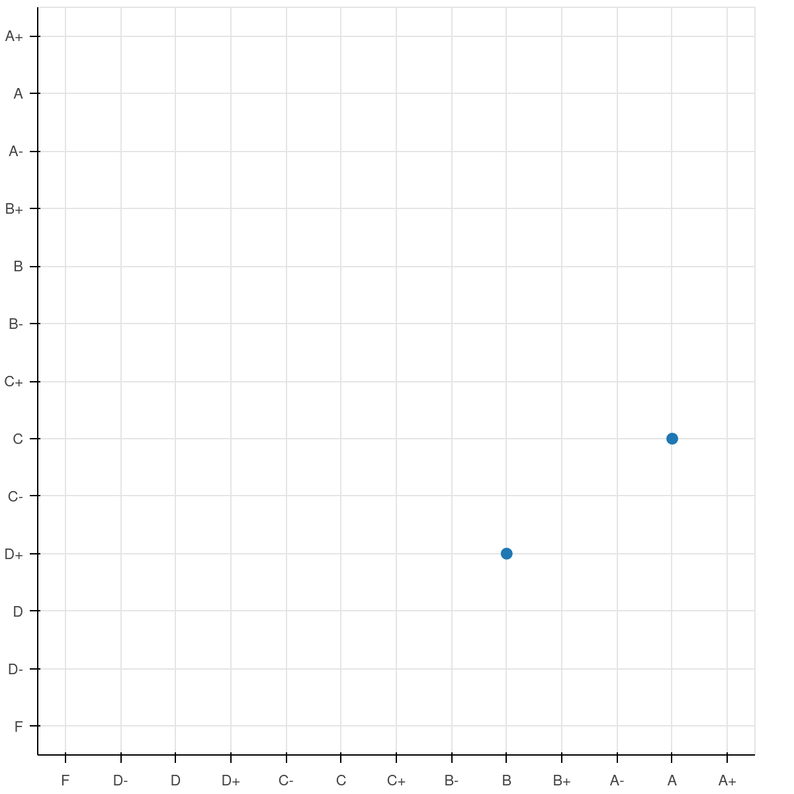

### 24. Grid
```py
f.xgrid.grid_line_color=None
f.ygrid.grid_line_color ="Gray"
f.grid.grid_line_dash = [5,3]
```

### 25. Tools
```py
from bokeh.models import Range1d, PanTool, ResetTool
output_file('iris.html')
f = figure()
# style the tools
f.tools=[PanTool(), ResetTool()]
```
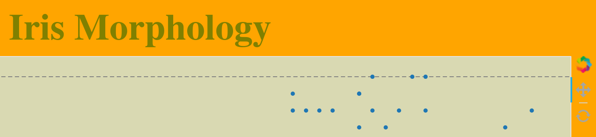
- Only two tools appear
```py
from bokeh.models import Range1d, PanTool, ResetTool, HoverTool
output_file('iris.html')
f = figure()
# style the tools
f.tools=[PanTool(), ResetTool()]
f.add_tools(HoverTool())
#f.toolbar_location = 'above' # broken in firefox? not working well
f.toolbar.logo=None
```

### 26. Glyphs
```py
f.circle(x=flowers['petal_length'],y=flowers['petal_width'], size=5*flowers['sepal_width'])
```
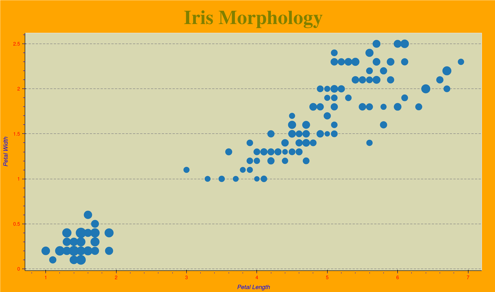
- Now the size of circle (glyph) is proportional to the sepal_width of the data
```py
colormap = {'setosa':'red', 'versicolor':'green', 'virginica':'blue'}
flowers['color'] = [colormap[x] for x in flowers['species']]
f.circle(x=flowers['petal_length'],y=flowers['petal_width'], size=5*flowers['sepal_width'], fill_alpha = 0.2, color= flowers['color'])
```
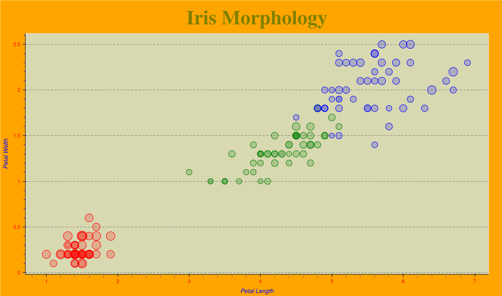

### 27. Legend: Configuring
```py
colormap = {'setosa':'red', 'versicolor':'green', 'virginica':'blue'}
flowers['color'] = [colormap[x] for x in flowers['species']]
f.circle(x=flowers['petal_length'][flowers["species"] == 'setosa'],
         y=flowers['petal_width'][flowers['species'] == 'setosa'], 
         size=5*flowers['sepal_width'][flowers['species'] == 'setosa'], 
         fill_alpha = 0.2, color= flowers['color'][flowers['species'] == 'setosa'],legend_label='Setosa')
f.circle(x=flowers['petal_length'][flowers["species"] == 'versicolor'],
         y=flowers['petal_width'][flowers['species'] == 'versicolor'], 
         size=5*flowers['sepal_width'][flowers['species'] == 'versicolor'], 
         fill_alpha = 0.2, color= flowers['color'][flowers['species'] == 'versicolor'],legend_label='Versicolor')
f.circle(x=flowers['petal_length'][flowers["species"] == 'virginica'],
         y=flowers['petal_width'][flowers['species'] == 'virginica'], 
         size=5*flowers['sepal_width'][flowers['species'] == 'virginica'], 
         fill_alpha = 0.2, color= flowers['color'][flowers['species'] == 'virginica'],legend_label='Virginica')
show(f)
```
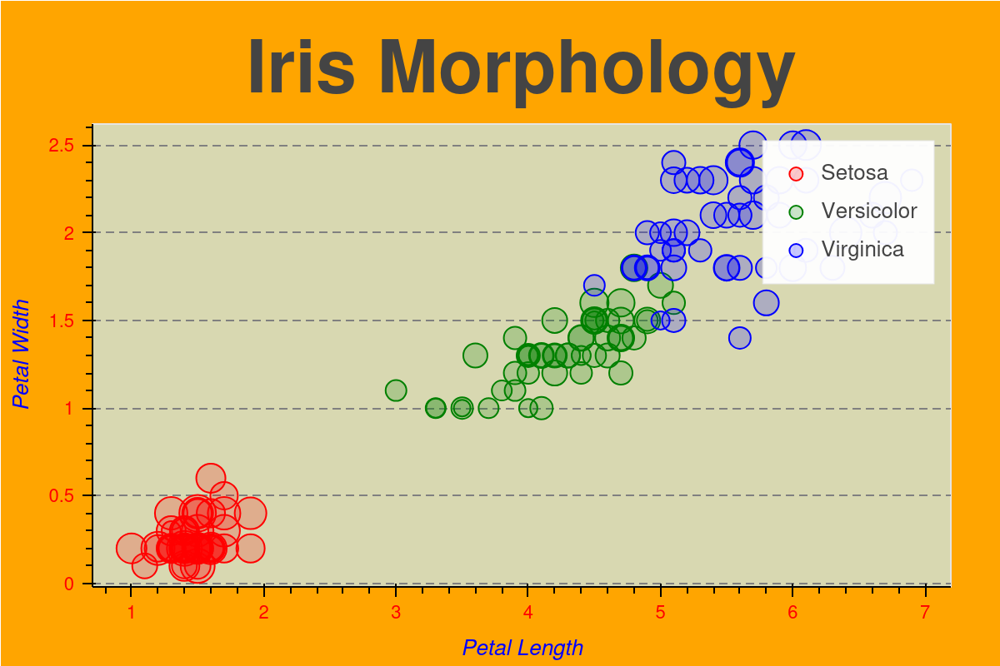

### 28. Legend: Styling
```py
f.legend.location='top_left'
# or
f.legend.location=[75,200]
f.legend.background_fill_alpha = 0.3
f.legend.border_line_color=None
f.legend.margin = 10
f.legend.padding=10
f.legend.label_text_color='olive'
f.legend.label_text_font='times'
show(f)
```

### 29. Popup Windows
```py
hover = HoverTool(tooltips=[("Species","@species"),("Sepal Width", "@sepal_width")]) # @column name in dataset
f.add_tools(hover)
```
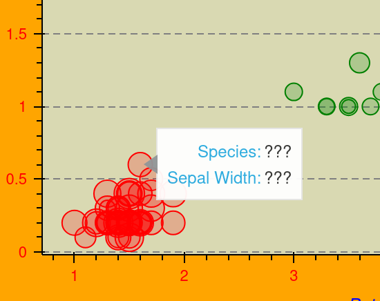

- As the dataset is pandas, not ColumnDataSource, hovering doesn't work here

### 30. Exercise 3: Summary of Section 3

### 31. Exercise 3: Solution

## Section 3: Advanced Plotting

### 32. Section Introduction

### 33. ColumnDataSource
```py
from bokeh.plotting import figure
from bokeh.io import output_file, show
from bokeh.sampledata.iris import flowers
from bokeh.models import Range1d, PanTool, ResetTool, HoverTool, ColumnDataSource
colormap = {'setosa':'red', 'versicolor':'green', 'virginica':'blue'}
flowers['color'] = [colormap[x] for x in flowers['species']]
setosa=ColumnDataSource(flowers[flowers["species"]=='setosa']) # to access each column, setosa.data['petal_width']
versicolor=ColumnDataSource(flowers[flowers["species"]=='versicolor'])
virginica=ColumnDataSource(flowers[flowers["species"]=='virginica'])
output_file('iris.html')
f = figure()
setosa.data['sizes'] = setosa.data['sepal_width']*4
versicolor.data['sizes'] = versicolor.data['sepal_width']*4
virginica.data['sizes'] = virginica.data['sepal_width']*4
f.circle(x="petal_length", y="petal_width", source=setosa, fill_alpha=0.2, color='color',
          size='sizes', legend_label='Setosa')
f.circle(x="petal_length", y="petal_width", source=versicolor, fill_alpha=0.2, color='color',
          size='sizes', legend_label='Versicolor')
f.circle(x="petal_length", y="petal_width", source=virginica, fill_alpha=0.2, color='color',
          size='sizes', legend_label='Virginica')
f.legend.location=(75,200)
f.legend.background_fill_alpha = 0.3
f.legend.border_line_color=None
f.legend.margin = 10
f.legend.padding=10
f.legend.label_text_color='olive'
f.legend.label_text_font='times'
show(f)
```
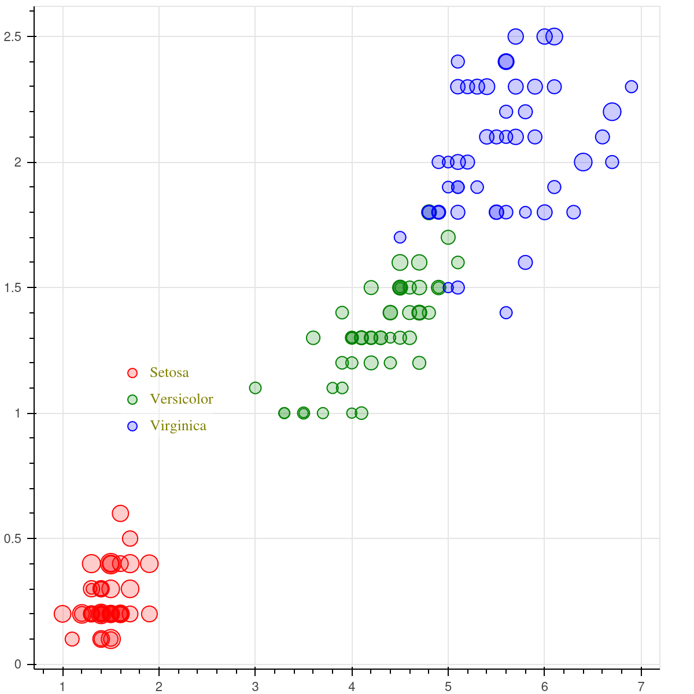


### 34. Exercise 4: Plotting Elements of the Periodic Table

### 35. Exercise 4: Solution

### 36. Popup Windows with Custom HTML
```py
f = figure()
setosa.data['sizes'] = setosa.data['sepal_width']*4
versicolor.data['sizes'] = versicolor.data['sepal_width']*4
virginica.data['sizes'] = virginica.data['sepal_width']*4
f.circle(x="petal_length", y="petal_width", source=setosa, fill_alpha=0.2, color='color',
          size='sizes', legend_label='Setosa')
f.circle(x="petal_length", y="petal_width", source=versicolor, fill_alpha=0.2, color='color',
          size='sizes', legend_label='Versicolor')
f.circle(x="petal_length", y="petal_width", source=virginica, fill_alpha=0.2, color='color',
          size='sizes', legend_label='Virginica')
f.tools = [PanTool(),ResetTool()]
hover = HoverTool(tooltips=[("Species","@species"),("Sepal Width", "@sepal_width")]) # @column name in dataset
f.add_tools(hover)
```
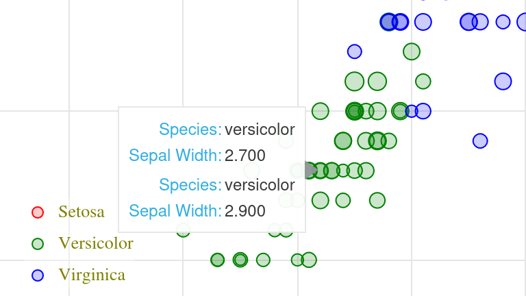

```py
output_file('iris.html')
f = figure()
setosa.data['sizes'] = setosa.data['sepal_width']*4
versicolor.data['sizes'] = versicolor.data['sepal_width']*4
virginica.data['sizes'] = virginica.data['sepal_width']*4
f.circle(x="petal_length", y="petal_width", source=setosa, fill_alpha=0.2, color='color',
          size='sizes', legend_label='Setosa')
f.circle(x="petal_length", y="petal_width", source=versicolor, fill_alpha=0.2, color='color',
          size='sizes', legend_label='Versicolor')
f.circle(x="petal_length", y="petal_width", source=virginica, fill_alpha=0.2, color='color',
          size='sizes', legend_label='Virginica')
f.tools = [PanTool(),ResetTool()]
hover = HoverTool(tooltips="""
<div>
    <div>
        <span style="font-size:13px; color; #966;">$index</span>
        <span style="font-size:15px; font-weight; bold;">@species</span>
    </div>
    <div>
        <span style="font-size:13px; color; #696;">Petal length: @petal_length</span><br>
        <span style="font-size:13px; color; #696;">Petal width: @petal_width</span>
    </div>                  
</div>                                   
""")                  
f.add_tools(hover)
```
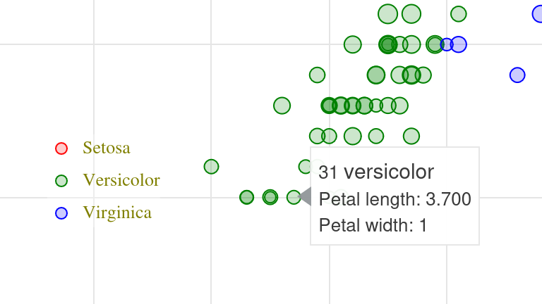

### 37. Gridplots
- Multiple plots in a single page
```py
from bokeh.plotting import figure
from bokeh.io import output_file, show
from bokeh.layouts import gridplot
output_file('iris.html')
x1,y1=list(range(0,10)),list(range(10,20))
x2,y2=list(range(20,30)),list(range(30,40))
x3,y3=list(range(40,50)),list(range(50,60))
f1 = figure(width=250,plot_height=250,title='Circles')
f1.circle(x1,y1,size=10,color='navy',alpha=0.5)
f2 = figure(width=250,plot_height=250,title='Triangles')
f2.circle(x2,y2,size=10,color='firebrick',alpha=0.5)
f3 = figure(width=250,plot_height=250,title='Squares')
f3.circle(x3,y3,size=10,color='olive',alpha=0.5)
f = gridplot([[f1,f2], [None,f3]])
show(f)
```
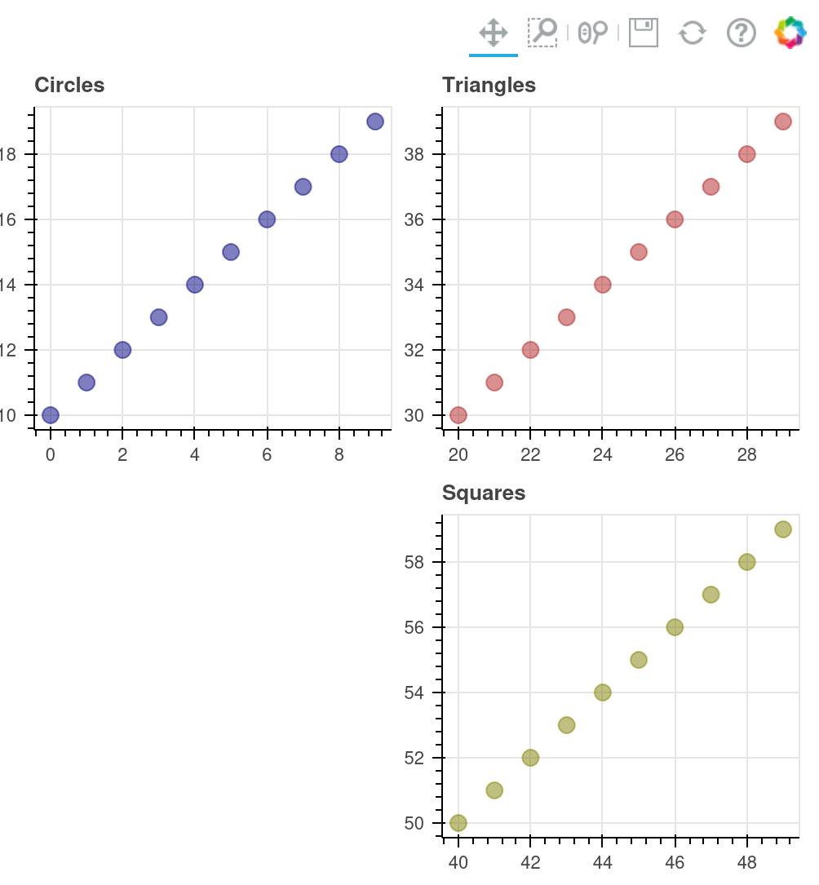

### 38. Exercise 5: Gridplots

### 39. Exercise 5: Solution

### 40. Annotations: Spans and Boxes
```py
from bokeh.plotting import figure
from bokeh.io import output_file, show
from bokeh.layouts import gridplot
from bokeh.models.annotations import Span, BoxAnnotation
output_file('iris.html')
x1,y1=list(range(0,10)),list(range(10,20))
x2,y2=list(range(20,30)),list(range(30,40))
x3,y3=list(range(40,50)),list(range(50,60))
f1 = figure(width=250,plot_height=250,title='Circles')
f1.circle(x1,y1,size=10,color='navy',alpha=0.5)
f2 = figure(width=250,plot_height=250,title='Triangles')
f2.circle(x2,y2,size=10,color='firebrick',alpha=0.5)
f3 = figure(width=250,plot_height=250,title='Squares')
f3.circle(x3,y3,size=10,color='olive',alpha=0.5)
span_4 = Span(location=4,dimension='height',line_color='green',line_width=2)
f1.add_layout(span_4)
box_2_6 = BoxAnnotation(left=2,right=6,fill_color='firebrick',fill_alpha=0.3)
f1.add_layout(box_2_6)
f = gridplot([[f1,f2], [None,f3]])
show(f)
```
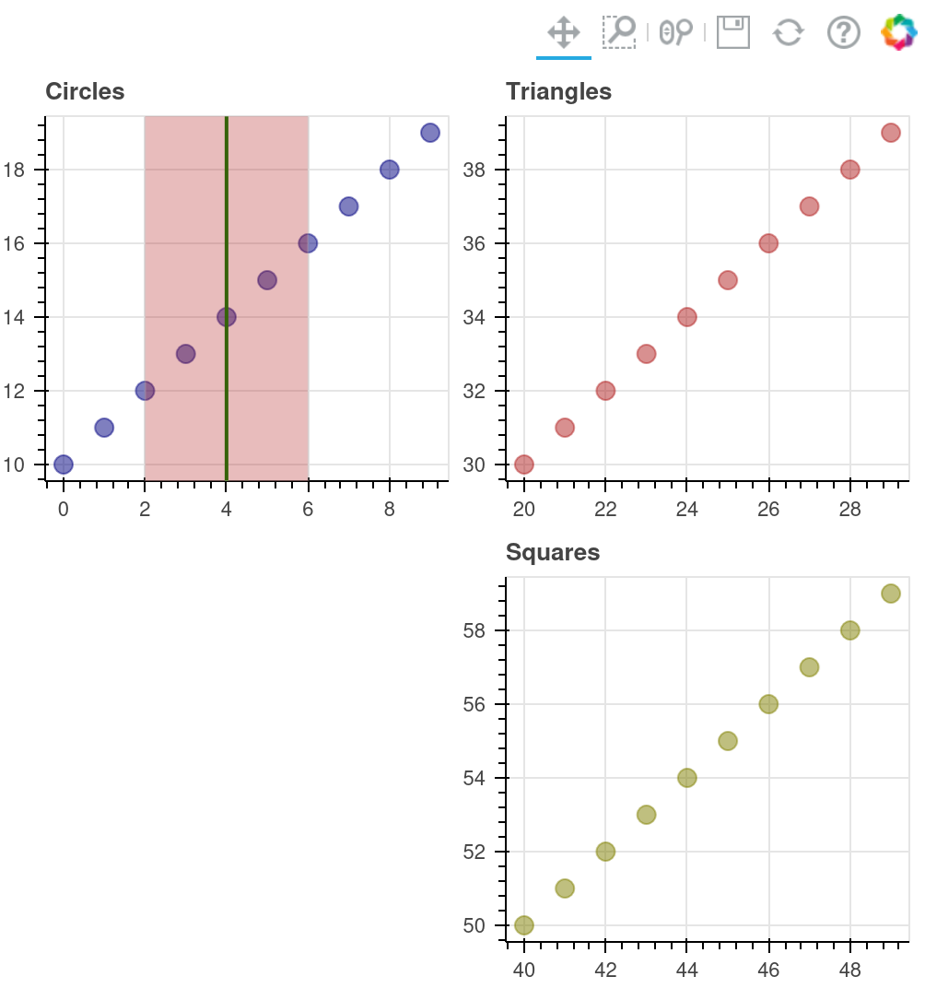

### 41. Exercise 6: Span Annotations

### 42. Exercise 6: Solution

### 43. Annotations: Labels and LabelSets
```py
from bokeh.plotting import figure
from bokeh.io import output_file, show
from bokeh.models.annotations import Label, LabelSet
from bokeh.models import ColumnarDataSource
output_file('student.html')
source=ColumnDataSource(dict(average_grades=["B+", "A", "D-"], exam_grades=["A+", "C", "D"],student_names=["Stephen","Helder", "Ryan"]))
f = figure(x_range=["F", "D-", "D", "D+", "C-", "C", "C+", "B-", "B", "B+","A-","A","A+"],
           y_range=["F", "D-", "D", "D+", "C-", "C", "C+", "B-", "B", "B+","A-","A","A+"])
description=Label(x=7,y=1,text="This graph shows average grades \nand exam grades for 3rd grade students", render_mode="css")
f.add_layout(description)
labels=LabelSet(x="average_grades",y="exam_grades",text="student_names", source=source)
f.add_layout(labels)
f.circle(x="average_grades",y="exam_grades",source=source,size=8)
show(f)
```
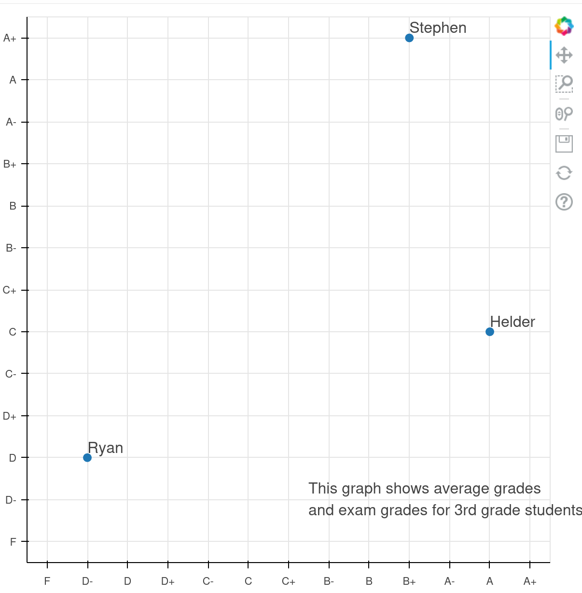

### 44. Exercise 7: Labels in Spans

### 45. Exercise 7: Solution

## Section 4: Bokeh Server: Interactive Plotting with HTML Widgets

### 46. Section Introduction

### 47. Widgets in Static Bokeh Graphs
- widgets.py:
```py
from bokeh.io import output_file, show
from bokeh.models.widgets import TextInput, Button, Paragraph
from bokeh.layouts import layout
output_file("simple_bokeh.html")
text_input = TextInput(value="Ardit")
button=Button(label="Generate Text")
output=Paragraph()

def update():
  input.text="Hello, " + text_input.value
button.on_click(update)
lay_out=layout([[button,text_input],[output]])
show(lay_out)
```
- `python3 widgets.py` will open a browser but the page is not refreshed after clicking the button, as the widgets.py is not coupled with the browser

### 48. Widgets in Interactive Bokeh Server Apps
- Let's remove the static html and introduce curdoc:
```py
from bokeh.io import curdoc
from bokeh.models.widgets import TextInput, Button, Paragraph
from bokeh.layouts import layout
text_input = TextInput(value="Ardit")
button=Button(label="Generate Text")
output=Paragraph()
def update():
  output.text="Hello, " + text_input.value
button.on_click(update)
lay_out=layout([[button,text_input],[output]])
curdoc().add_root(lay_out)
```
- Then run as `python -m bokeh serve ./widget.py`
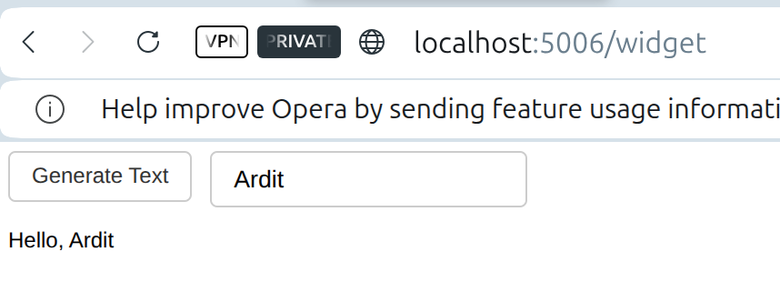

### 49. Select Widgets: Changing Labels Dynamically
- labels.py
```py
from bokeh.io import curdoc
from bokeh.plotting import figure
from bokeh.models.annotations import LabelSet
from bokeh.models import ColumnDataSource
from bokeh.models.widgets import Select
from bokeh.layouts import layout
source=ColumnDataSource(dict(average_grades=["B+", "A", "D-"], 
                             exam_grades=["A+", "C", "D"],
                             student_names=["Stephen","Helder", "Ryan"]))
f = figure(x_range=["F", "D-", "D", "D+", "C-", "C", "C+", "B-", "B", "B+","A-","A","A+"],
           y_range=["F", "D-", "D", "D+", "C-", "C", "C+", "B-", "B", "B+","A-","A","A+"])
labels=LabelSet(x="average_grades",y="exam_grades",text="student_names", source=source)
f.add_layout(labels)
f.circle(x="average_grades",y="exam_grades",source=source,size=8)
def update_labels(attr,old,new):
  labels.text=select.value
options = [("average_grades","Average Grades"),
           ("exam_grades","Exam Grades"),
           ("student_names","Student Names")]
select = Select(title="Attribute",options=options)
select.on_change("value",update_labels)
lay_out=layout([[select]])
curdoc().add_root(f)
curdoc().add_root(lay_out)
```
- python3 -m bokeh serve ./labels.py
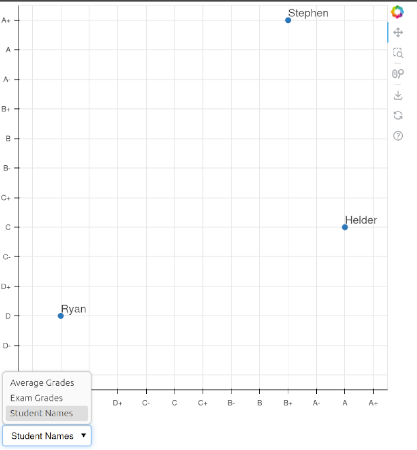

### 50. Exercise 8: Select Widgets - Drawing Spans Dynamically

### 51. Exercise 8: Tips

### 52. Exercise 8: Solution

### 53. RadioButtonGroup Widgets: Changing Labels Dynamically
```py
from bokeh.io import curdoc
from bokeh.plotting import figure
from bokeh.models.annotations import LabelSet
from bokeh.models import ColumnDataSource
from bokeh.models.widgets import RadioButtonGroup
from bokeh.layouts import layout
source=ColumnDataSource(dict(average_grades=["B+", "A", "D-"], 
                             exam_grades=["A+", "C", "D"],
                             student_names=["Stephen","Helder", "Ryan"]))
f = figure(x_range=["F", "D-", "D", "D+", "C-", "C", "C+", "B-", "B", "B+","A-","A","A+"],
           y_range=["F", "D-", "D", "D+", "C-", "C", "C+", "B-", "B", "B+","A-","A","A+"])
labels=LabelSet(x="average_grades",y="exam_grades",text="student_names", source=source)
f.add_layout(labels)
f.circle(x="average_grades",y="exam_grades",source=source,size=8)
def update_labels(attr,old,new):
  labels.text=options[radio_button_group.active]
options = ["average_grades","exam_grades","student_names"]
radio_button_group=RadioButtonGroup(labels=options)
radio_button_group.on_change("active",update_labels)
lay_out=layout([[radio_button_group]])
curdoc().add_root(f)
curdoc().add_root(lay_out)
```
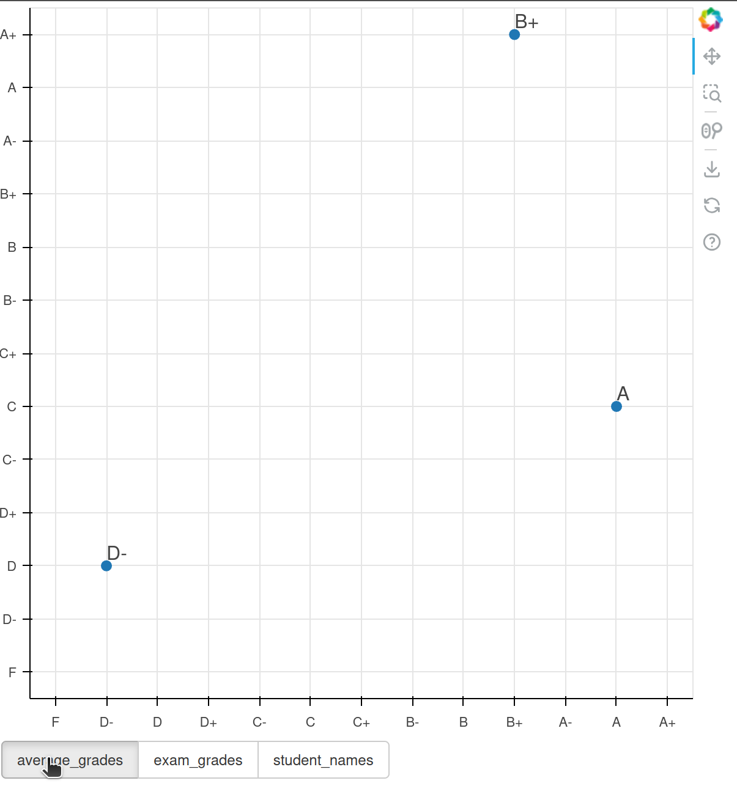

### 54. Slider Widgets: Filtering Glyphs, Part 1

### 55. Slider Widgets: Filtering Glyphs, Part 2
```py
from bokeh.io import curdoc
from bokeh.plotting import figure
from bokeh.models.annotations import LabelSet
from bokeh.models import ColumnDataSource, Range1d
from bokeh.models.widgets import Select,Slider
from bokeh.layouts import layout
import copy
source_original=ColumnDataSource(dict(average_grades=[7,8,10], 
                             exam_grades=[6,9,8],
                             student_names=["Stephen","Helder", "Ryan"]))
source = ColumnDataSource(dict(average_grades=[7,8,10], 
                             exam_grades=[6,9,8],
                             student_names=["Stephen","Helder", "Ryan"]))
f = figure(x_range=Range1d(start=0,end=12),
           y_range=Range1d(start=0,end=12))
labels=LabelSet(x="average_grades",y="exam_grades",text="student_names", source=source)
f.add_layout(labels)
f.circle(x="average_grades",y="exam_grades",source=source,size=8)
def filter_grades(attr,old,new):
  source.data={key:[value for i, value in enumerate(source_original.data[key]) 
                    if source_original.data["exam_grades"][i]>=slider.value] 
                    for key in source_original.data}  
  print(slider.value)
def update_labels(attr,old,new):
  labels.text=select.value
options = [("average_grades","Average Grades"),
           ("exam_grades","Exam Grades"),
           ("student_names","Student Names")]
select = Select(title="Attribute",options=options)
select.on_change("value",update_labels)
slider=Slider(start=min(source_original.data["exam_grades"])-1,
              end=max(source_original.data["exam_grades"])+1,
              value=8,step=0.1,title="Exam Grade: ")
slider.on_change("value",filter_grades)
lay_out=layout([[select],[slider]])
curdoc().add_root(f)
curdoc().add_root(lay_out)
```
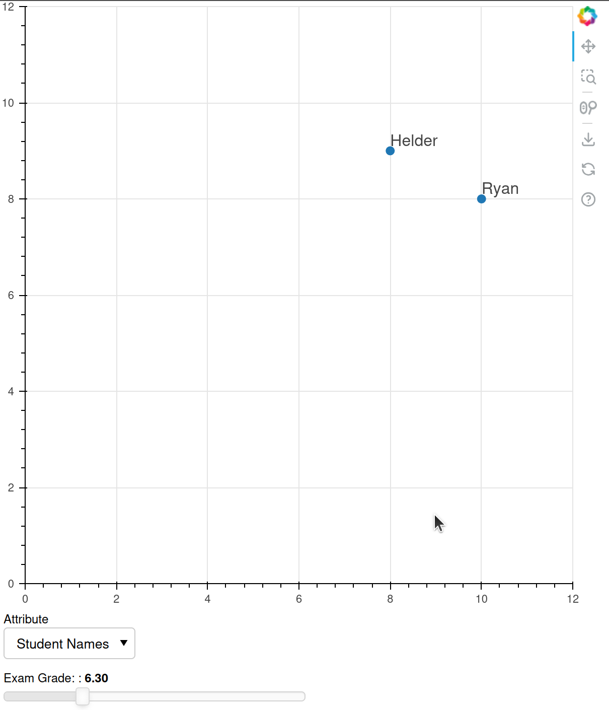

## Section 5: Bokeh Server: Streaming Real Time Data

### 56. Section Introduction

### 57. Streaming Random Points and Lines
- random_graph.py
```py
from bokeh.io import curdoc
from bokeh.models import ColumnDataSource
from bokeh.plotting import figure
from random import randrange
f=figure(x_range=(0,11),y_range=(0,11))
source=ColumnDataSource(dict(x=[],y=[]))
f.circle(x='x',y='y',color='olive',size=8,line_color='red',source=source)
def update():
  new_data = dict(x=[randrange(1,10)],y=[randrange(1,10)])
  source.stream(new_data,rollover=15) # appends up to 15. After then, the older terms are removed
  print(source.data)
curdoc().add_periodic_callback(update,1000) # milliseconds
curdoc().add_root(f)  
```

### 58. Streaming Financial Data - Designing the App
- Feeding bitcoin data from bitconcharts.com
  - The site doesn't exist anymore

### 59. Streaming Financial Data - Webscraping
- Using beutifulsoup4 (import bs4)

### 60. Streaming Financial Data - Plotting
```py
from bokeh.io import curdoc
from bokeh.models import ColumnDataSource, DatetimeTickFormatter
from bokeh.plotting import figure
from random import randrange
import requests
from bs4 import BeautifulSoup

#create figure
f=figure()

#create webscraping function
def extract_value():
    r=requests.get("http://bitcoincharts.com/markets/btcnCNY.html",headers={'User-Agent':'Mozilla/5.0'})
    c=r.content
    soup=BeautifulSoup(c,"html.parser")
    value_raw=soup.find_all("p")
    value_net=float(value_raw[0].span.text)
    return value_net

#create ColumnDataSource
source=ColumnDataSource(dict(x=[1],y=[extract_value()]))

#create glyphs
f.circle(x='x',y='y',color='olive',line_color='brown',source=source)
f.line(x='x',y='y',source=source)
	
#create periodic function
def update():
    new_data=dict(x=[source.data['x'][-1]+1],y=[extract_value()])
    source.stream(new_data,rollover=200)
    print(source.data)

#add figure to curdoc and configure callback
curdoc().add_root(f)
curdoc().add_periodic_callback(update,2000)
```

### 61. Streaming Timeseries Data
```py
from bokeh.io import curdoc
from bokeh.models import ColumnDataSource, DatetimeTickFormatter
from bokeh.plotting import figure
from random import randrange
import requests
from bs4 import BeautifulSoup
from datetime import datetime
from math import radians
from pytz import timezone

#create figure
f=figure(x_axis_type='datetime')

#create webscraping function
def extract_value():
    r=requests.get("http://bitcoincharts.com/markets/btcnCNY.html",headers={'User-Agent':'Mozilla/5.0'})
    c=r.content
    soup=BeautifulSoup(c,"html.parser")
    value_raw=soup.find_all("p")
    value_net=float(value_raw[0].span.text)
    return value_net

#create ColumnDataSource
source=ColumnDataSource(dict(x=[],y=[]))

#create glyphs
f.circle(x='x',y='y',color='olive',line_color='brown',source=source)
f.line(x='x',y='y',source=source)

#create periodic function
def update():
    new_data=dict(x=[datetime.now(tz=timezone('Europe/Moscow'))],y=[extract_value()])
    source.stream(new_data,rollover=200)
    print(source.data)
f.xaxis.formatter=DatetimeTickFormatter(
seconds=["%Y-%m-%d-%H-%m-%S"],
minsec=["%Y-%m-%d-%H-%m-%S"],
minutes=["%Y-%m-%d-%H-%m-%S"],
hourmin=["%Y-%m-%d-%H-%m-%S"],
hours=["%Y-%m-%d-%H-%m-%S"],
days=["%Y-%m-%d-%H-%m-%S"],
months=["%Y-%m-%d-%H-%m-%S"],
years=["%Y-%m-%d-%H-%m-%S"],
)

f.xaxis.major_label_orientation=radians(90)

#add figure to curdoc and configure callback
curdoc().add_root(f)
curdoc().add_periodic_callback(update,2000)
```

### 62. User Interaction Between Real-Time Plots and Widgets
```py
from bokeh.io import curdoc
from bokeh.models import ColumnDataSource, DatetimeTickFormatter, Select
from bokeh.layouts import layout
from bokeh.plotting import figure
from random import randrange
import requests
from bs4 import BeautifulSoup
from datetime import datetime
from math import radians
from pytz import timezone

#create figure
f=figure(x_axis_type='datetime')

#create webscraping function
def extract_value():
    r=requests.get("http://bitcoincharts.com/markets/btcnCNY.html",headers={'User-Agent':'Mozilla/5.0'})
    c=r.content
    soup=BeautifulSoup(c,"html.parser")
    value_raw=soup.find_all("p")
    value_net=float(value_raw[0].span.text)
    return value_net

#create ColumnDataSource
source=ColumnDataSource(dict(x=[],y=[]))

#create glyphs
f.circle(x='x',y='y',color='olive',line_color='brown',source=source)
f.line(x='x',y='y',source=source)

#create periodic function
def update():
    new_data=dict(x=[datetime.now(tz=timezone('Europe/Moscow'))],y=[extract_value()])
    source.stream(new_data,rollover=200)
    print(source.data)

def update_intermediate(attr, old, new):
    source.data=dict(x=[],y=[])
    update()
f.xaxis.formatter=DatetimeTickFormatter(
seconds=["%Y-%m-%d-%H-%m-%S"],
minsec=["%Y-%m-%d-%H-%m-%S"],
minutes=["%Y-%m-%d-%H-%m-%S"],
hourmin=["%Y-%m-%d-%H-%m-%S"],
hours=["%Y-%m-%d-%H-%m-%S"],
days=["%Y-%m-%d-%H-%m-%S"],
months=["%Y-%m-%d-%H-%m-%S"],
years=["%Y-%m-%d-%H-%m-%S"],
)

f.xaxis.major_label_orientation=radians(90)

#create Select widget
options=[("okcoinCNY","Okcoin CNY"),("btcnCNY","BTCN China")]
select=Select(title="Market Name",value="okcoinCNY",options=options)
select.on_change("value",update_intermediate)

#add figure to curdoc and configure callback
lay_out=layout([[f],[select]])
curdoc().add_root(lay_out)
curdoc().add_periodic_callback(update,2000)
```

### 63. Example: Visualizing Spinning Planets
- orbit.py:
```py
#importing libraries
from math import cos, sin, radians
from bokeh.io import curdoc
from bokeh.models import ColumnDataSource
from bokeh.plotting import figure
 
#Setting up the figure
p = figure(x_range=(-2, 2), y_range=(-2, 2))
 
#Drawing static glyphs
earth_orbit=p.circle(x=0, y=0, radius=1, line_color='blue',line_alpha=0.5,fill_color=None, line_width=2)
mars_orbit=p.circle(x=0, y=0, radius=0.7, line_color='red',line_alpha=0.5,fill_color=None, line_width=2)
sun=p.circle(x=0, y=0, radius=0.2, line_color=None, fill_color="yellow", fill_alpha=0.5)
 
#Creating columndatasources for the two moving circles
earth_source = ColumnDataSource(data=dict(x_earth=[earth_orbit.glyph.radius*cos(radians(0))], y_earth=[earth_orbit.glyph.radius*sin(radians(0))]))
mars_source = ColumnDataSource(data=dict(x_mars=[mars_orbit.glyph.radius*cos(radians(0))], y_mars=[mars_orbit.glyph.radius*sin(radians(0))]))
 
#Drawing the moving glyphs
earth=p.circle(x='x_earth', y='y_earth', size=12, fill_color='blue', line_color=None, fill_alpha=0.6, source=earth_source)
mars=p.circle(x='x_mars', y='y_mars', size=12, fill_color='red', line_color=None, fill_alpha=0.6, source=mars_source)
 
#we will generate x and y coordinates every 0.1 seconds out of angles starting from an angle of 0 for both earth and mars
i_earth=0
i_mars=0
 
#the update function will generate coordinates
def update():
    global i_earth,i_mars #this tells the function to use global variables declared outside the function
    i_earth=i_earth+2 #we will increase the angle of earth by 2 in function call
    i_mars=i_mars+1
    new_earth_data = dict(x_earth=[earth_orbit.glyph.radius*cos(radians(i_earth))],y_earth=[earth_orbit.glyph.radius*sin(radians(i_earth))])
    new_mars_data = dict(x_mars=[mars_orbit.glyph.radius*cos(radians(i_mars))],y_mars=[mars_orbit.glyph.radius*sin(radians(i_mars))])
    earth_source.stream(new_earth_data,rollover=1)
    mars_source.stream(new_mars_data,rollover=1)
    print(earth_source.data) #just printing the data in the terminal
    print(mars_source.data)
 
#adding periodic callback and the plot to curdoc
curdoc().add_periodic_callback(update, 100)
curdoc().add_root(p)
```
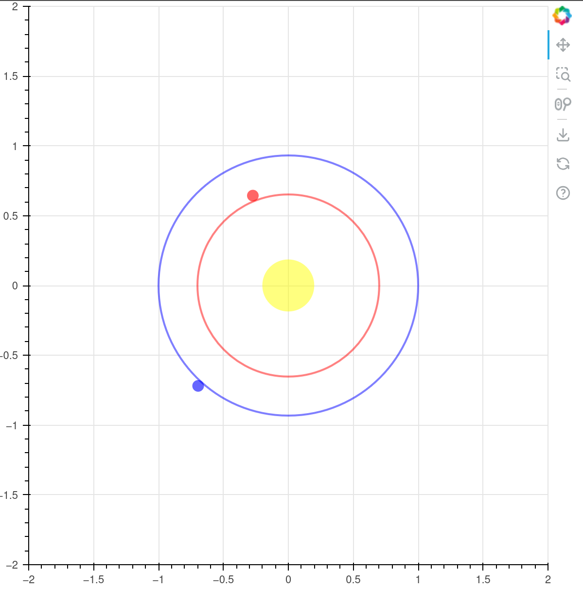

## Section 6: Embedding Bokeh Plots in Websites

### 64. Introduction to Flask
- app.py:
```py
from flask import Flask, render_template
app = Flask(__name__)
@app.route("/") # webpage location in the browser
def index():
  return render_template("index.html")
if __name__ == "__main__":
  app.run(debug=True)
```
- templates/index.html:
```html
<!DOCTYPE html>
<html lang="en">
    <head>
        <meta charset="utf-8">
        <title>I am the title</title>
        <link rel="stylesheet" href={{url_for('static',filename='css/mai
n.css')}} />
        <link rel="stylesheet" href={{cdn_css | safe}} type="text/css" /
>
        <script type="text/javascript" src={{cdn_js | safe}}></script>
    </head>
    <body>
      <h3> I am a heading</h3>
      <div>
      </div>
      <p> I am a paragraph </p>
    </body>
</html>
```
- static/css/main.css:
```css
h3 {
  color:olive;
}
```
- CLI: python3 app.py
- Open a browser with `http://localhost:5000`
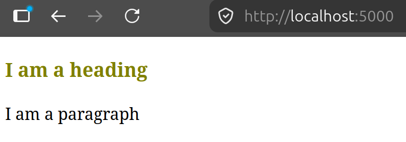

### 65. Embedding Static Bokeh Plots in Flask
- basicLine.py:
```py
from bokeh.plotting import figure
from bokeh.io import output_file, show
from bokeh.embed import components
from bokeh.resources import CDN
x = [1,2,3,4,5]
y = [6,7,8,9,10]
f = figure()
f.line(x,y)
js, div = components(f)
cdn_js = CDN.js_files[0]
cdn_css = None #CDN.css_files[0]
```
- app.py:
```py
from flask import Flask, render_template
from datetime import datetime
from basicLine import js,div,cdn_js, cdn_css
app = Flask(__name__)
@app.route("/") # webpage location in the browser
def index():
  return render_template("index.html",js=js, div=div, 
                         cdn_js=cdn_js, cdn_css=cdn_css)
if __name__ == "__main__":
  app.run(debug=True)
```
- templates/index.html:
```html
<!DOCTYPE html>
<html lang="en">
    <head>
        <meta charset="utf-8">
        <title>I am the title</title>
        <link rel="stylesheet" href={{url_for('static',fil
ename='css/main.css')}} />
        <link rel="stylesheet" href={{cdn_css | safe}} typ
e="text/css" />
        <script type="text/javascript" src={{cdn_js | safe
}}></script>
    </head>
    <body>
      <h3> I am a heading</h3>
      <div>
      {{js|safe}}
      {{div|safe}}
      </div>
      <p> I am a paragraph </p>
    </body>
</html>
```


### 66. Embedding Bokeh Server Plots in Flask
- Embedding bokeh python script into Flask
- autoload_server() is deprecated by Bokeh 2.0
  - Use server_document()
- We embed random_graph.py which is shown above  
- app.py:
```py
from flask import Flask, render_template
from bokeh.embed import components
from bokeh.client import pull_session
app = Flask(__name__)
@app.route("/") # webpage location in the browser
def index():
  bokeh_script = server_document("http://localhost:5006/random_graph")
  return render_template("index.html",bokeh_script=bokeh_script)
if __name__ == "__main__":
  app.run(debug=True)
```
- Same static/css/main.css 
- templates/index.html:
```html
<!DOCTYPE html>
<html lang="en">
    <head>
        <meta charset="utf-8">
        <title>I am the title</title>
        <link rel="stylesheet" href={{url_for('static',filename='css/main.css')}} />
        <link rel="stylesheet" href={{cdn_css | safe}} type="text/css" />
        <script type="text/javascript" src={{cdn_js | safe}}></script>
    </head>
    <body>
      <h3> I am a heading</h3>
      <div>
        {{bokeh_script|safe}}
      </div>
      <p> I am a paragraph </p>
    </body>
</html>
```
- Terminal 1: python3 app.py 
- Terminal 2: bokeh serve --allow-websocket-origin=localhost:5000 random_graph.py

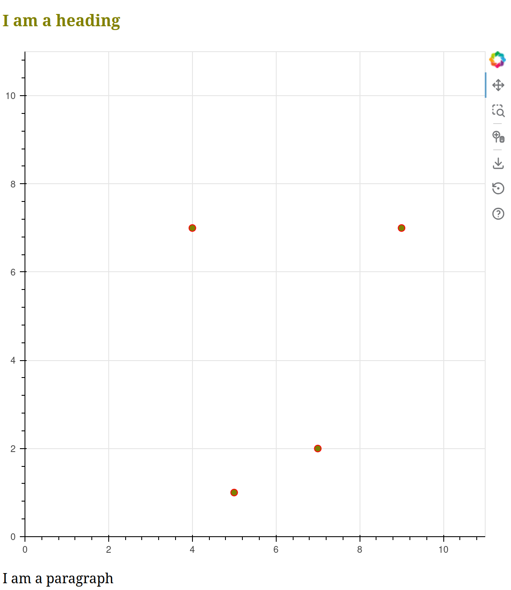

### 67. Embedding Static Bokeh Plots in Django: Setting up a Django App
```bash
$ pip install django
$ django-admin startproject mysite
$ cd mysite/
$ python3 manage.py runserver
```


### 68. Embedding Static Bokeh Plots in Django: Embedding the Plot

## Section 7: Deploying Bokeh Data Visualization Apps in Live Servers

### 69. Deployment Options

### 70. Deploying Static Bokeh Plots

### 71. Deploying Interactive Bokeh Server Apps Embedded in Flask- Setting up the VPS

### 72. Deploying Interactive Bokeh Server Apps Embedded in Flask - Installing Software

### 73. Deploying Interactive Bokeh Server Apps Embedded in Flask - Configuration Files

### 74. Deploying Interactive Bokeh Server Apps Embedded in Flask - Uploading Files

### 75. Deploying Interactive Bokeh Server Apps Embedded in Flask - Editing Server Files

### 76. Deploying Interactive Bokeh Server Apps Embedded in Flask - Starting the Service

### 77. Deploying Interactive Bokeh Server Apps Embedded in Flask - Troubleshooting

### 78. Deploying Interactive Bokeh Server Apps as Standalone

### 79. Bonus Lecture
