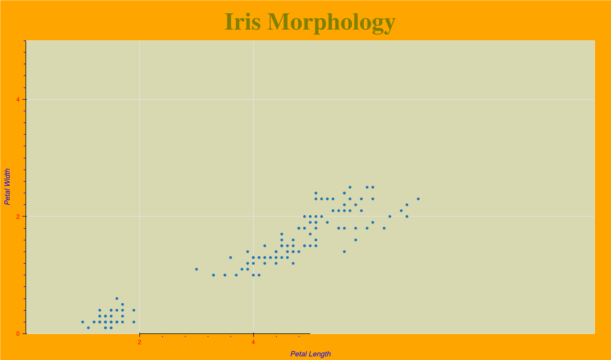

# Interactive Data Visualization with Python and Bokeh
- Insructor: Ardit Sulce 

## Section 1: Getting Started

### 1. Course Introduction

### 2. Helpful Resources

### 3. Installation

### 4. Getting Help

### 5. What is Bokeh

### Quiz 1: Bokeh and Bokeh Server

### 6. Creating Your First Bokeh Plot
```py
from bokeh.plotting import figure
from bokeh.io import output_file, show
# synthetic data creation
x = [1,2,3,4,5]
y = [6,7,8,9,10]
output_file("Line.html")
f = figure()
f.line(x,y)
show(f)
```
- A browser will pop-up with "Line.html", showing an interactive graph

### 7. Exercise 1: Plotting triangles and circle glyphs

### 8. Exercise 1: Solution

### 9. Using Bokeh with Pandas
```py
from bokeh.plotting import figure
from bokeh.io import output_file, show
import pandas as pd
df = pd.read_csv('data.csv')
x = df['x']
y = df['y']
output_file("Line_from_csv.html")
f = figure()
f.line(x,y)
show(f)
```

### 10. Exercise 2: Plotting Education Data

### 11. Exercise 2: Solution

### 12. Bug with the Show Method

### 13. Using the Bokeh Documentation
- https://docs.bokeh.org/en/latest/docs/reference.html

## Section 2: Customizing Bokeh Graphs

### 14. Section Introduction

### 15. Note

### 16. Creating an Initial Plot
```py
from bokeh.plotting import figure
from bokeh.io import output_file, show
from bokeh.sampledata.iris import flowers
output_file('iris.html')
f = figure()
f.circle(x=flowers['petal_length'],y=flowers['petal_width'])
show(f)
```

### 17. Figure Background
```py
from bokeh.plotting import figure
from bokeh.io import output_file, show
from bokeh.sampledata.iris import flowers
output_file('iris.html')
f = figure()
f.plot_width = 1100
f.plot_height = 650
f.background_fill_color = 'olive'
f.background_fill_alpha=0.3
f.border_fill_color='orange'
f.circle(x=flowers['petal_length'],y=flowers['petal_width'])
show(f)
```

### 18. List of Colors
- For color name, `f.background_fill_color="olive"` 
- For RGB hex value, `f.background_fill_color="#CD5C5C"`
- For RGB, `f.background_fill_color=(205,92,92)`
- For RGB + alpha channel, `f.background_fill_color=(205,92,92,0.3)`

### 19. Title
```py
from bokeh.plotting import figure
from bokeh.io import output_file, show
from bokeh.sampledata.iris import flowers
output_file('iris.html')
f = figure()
f.plot_width = 1100
f.plot_height = 650
f.background_fill_color = 'olive'
f.background_fill_alpha=0.3
f.border_fill_color='orange'
f.title.text = 'Iris Morphology'
f.title.text_color = 'Olive'
f.title.text_font = 'times'
f.title.text_font_size = "44px"
f.title.align="center"
f.circle(x=flowers['petal_length'],y=flowers['petal_width'])
show(f)
```

### 20. List of Text Fonts

### 21. Axes: Custom Styling
```py
from bokeh.plotting import figure
from bokeh.io import output_file, show
from bokeh.sampledata.iris import flowers
output_file('iris.html')
f = figure()
f.plot_width = 1100
f.plot_height = 650
f.background_fill_color = 'olive'
f.background_fill_alpha=0.3
f.border_fill_color='orange'
f.title.text = 'Iris Morphology'
f.title.text_color = 'Olive'
f.title.text_font = 'times'
f.title.text_font_size = "44px"
f.title.align="center"
f.axis.minor_tick_line_color = "blue"
f.yaxis.major_label_orientation ="horizontal"
f.xaxis.visible=True
#f.xaxis.minor_tick_line_color=None
f.xaxis.minor_tick_in=-6
#f.xaxis.minor_tick_out=10
f.xaxis.axis_label = "Petal Length"
f.yaxis.axis_label = "Petal Width"
f.axis.axis_label_text_color = 'blue'
f.axis.major_label_text_color = 'red'
f.circle(x=flowers['petal_length'],y=flowers['petal_width'])
show(f)
```

### 22. Axes: Custom Geometry
```py
from bokeh.plotting import figure
from bokeh.io import output_file, show
from bokeh.sampledata.iris import flowers
from bokeh.models import Range1d
output_file('iris.html')
f = figure()
f.plot_width = 1100
f.plot_height = 650
f.background_fill_color = 'olive'
f.background_fill_alpha=0.3
f.border_fill_color='orange'
f.title.text = 'Iris Morphology'
f.title.text_color = 'Olive'
f.title.text_font = 'times'
f.title.text_font_size = "44px"
f.title.align="center"
f.axis.minor_tick_line_color = "blue"
f.yaxis.major_label_orientation ="horizontal"
f.xaxis.visible=True
#f.xaxis.minor_tick_line_color=None
f.xaxis.minor_tick_in=-6
#f.xaxis.minor_tick_out=10
f.xaxis.axis_label = "Petal Length"
f.yaxis.axis_label = "Petal Width"
f.axis.axis_label_text_color = 'blue'
f.axis.major_label_text_color = 'red'
f.x_range = Range1d(start=0,end=10)
f.y_range = Range1d(start=0,end=5)
f.xaxis.bounds = (2,5)
f.xaxis[0].ticker.desired_num_ticks=2
f.yaxis[0].ticker.desired_num_ticks=2
f.yaxis[0].ticker.num_minor_ticks=10
f.circle(x=flowers['petal_length'],y=flowers['petal_width'])
show(f)
```



### 23. Axes: Categorical Data

### 24. Grid

### 25. Tools

### 26. Glyphs

### 27. Legend: Configuring

### 28. Legend: Styling

### 29. Popup Windows

### 30. Exercise 3: Summary of Section 3

### 31. Exercise 3: Solution

## Section 3: Advanced Plotting

### 32. Section Introduction
### 33. ColumnDataSource
### 34. Exercise 4: Plotting Elements of the Periodic Table
### 35. Exercise 4: Solution
### 36. Popup Windows with Custom HTML
### 37. Gridplots
### 38. Exercise 5: Gridplots
### 39. Exercise 5: Solution
### 40. Annotations: Spans and Boxes
### 41. Exercise 6: Span Annotations
### 42. Exercise 6: Solution
### 43. Annotations: Labels and LabelSets
### 44. Exercise 7: Labels in Spans
### 45. Exercise 7: Solution
1min

### 46. Section Introduction
### 47. Widgets in Static Bokeh Graphs
### 48. Widgets in Interactive Bokeh Server Apps
### 49. Select Widgets: Changing Labels Dynamically
### 50. Exercise 8: Select Widgets - Drawing Spans Dynamically
### 51. Exercise 8: Tips
### 52. Exercise 8: Solution
### 53. RadioButtonGroup Widgets: Changing Labels Dynamically
### 54. Slider Widgets: Filtering Glyphs, Part 1
### 55. Slider Widgets: Filtering Glyphs, Part 2
5min

### 56. Section Introduction
### 57. Streaming Random Points and Lines
### 58. Streaming Financial Data - Designing the App
### 59. Streaming Financial Data - Webscraping
### 60. Streaming Financial Data - Plotting
### 61. Streaming Timeseries Data
### 62. User Interaction Between Real-Time Plots and Widgets
### 63. Example: Visualizing Spinning Planets
1min

### 64. Introduction to Flask
### 65. Embedding Static Bokeh Plots in Flask
### 66. Embedding Bokeh Server Plots in Flask
### 67. Embedding Static Bokeh Plots in Django: Setting up a Django App
### 68. Embedding Static Bokeh Plots in Django: Embedding the Plot
11min

### 69. Deployment Options
### 70. Deploying Static Bokeh Plots
### 71. Deploying Interactive Bokeh Server Apps Embedded in Flask- Setting up the VPS
### 72. Deploying Interactive Bokeh Server Apps Embedded in Flask - Installing Software
### 73. Deploying Interactive Bokeh Server Apps Embedded in Flask - Configuration Files
### 74. Deploying Interactive Bokeh Server Apps Embedded in Flask - Uploading Files
### 75. Deploying Interactive Bokeh Server Apps Embedded in Flask - Editing Server Files
### 76. Deploying Interactive Bokeh Server Apps Embedded in Flask - Starting the Service
### 77. Deploying Interactive Bokeh Server Apps Embedded in Flask - Troubleshooting
### 78. Deploying Interactive Bokeh Server Apps as Standalone
### 79. Bonus Lecture
1min


# Interactive Data Visualization with Python and Bokeh
- Insructor: Ardit Sulce 

## Section 1: Getting Started

### 1. Course Introduction

### 2. Helpful Resources

### 3. Installation

### 4. Getting Help

### 5. What is Bokeh

### Quiz 1: Bokeh and Bokeh Server

### 6. Creating Your First Bokeh Plot
```py
from bokeh.plotting import figure
from bokeh.io import output_file, show
# synthetic data creation
x = [1,2,3,4,5]
y = [6,7,8,9,10]
output_file("Line.html")
f = figure()
f.line(x,y)
show(f)
```
- A browser will pop-up with "Line.html", showing an interactive graph

### 7. Exercise 1: Plotting triangles and circle glyphs

### 8. Exercise 1: Solution

### 9. Using Bokeh with Pandas
```py
from bokeh.plotting import figure
from bokeh.io import output_file, show
import pandas as pd
df = pd.read_csv('data.csv')
x = df['x']
y = df['y']
output_file("Line_from_csv.html")
f = figure()
f.line(x,y)
show(f)
```

### 10. Exercise 2: Plotting Education Data

### 11. Exercise 2: Solution

### 12. Bug with the Show Method

### 13. Using the Bokeh Documentation
- https://docs.bokeh.org/en/latest/docs/reference.html

## Section 2: Customizing Bokeh Graphs

### 14. Section Introduction

### 15. Note

### 16. Creating an Initial Plot
```py
from bokeh.plotting import figure
from bokeh.io import output_file, show
from bokeh.sampledata.iris import flowers
output_file('iris.html')
f = figure()
f.circle(x=flowers['petal_length'],y=flowers['petal_width'])
show(f)
```

### 17. Figure Background
```py
from bokeh.plotting import figure
from bokeh.io import output_file, show
from bokeh.sampledata.iris import flowers
output_file('iris.html')
f = figure()
f.plot_width = 1100
f.plot_height = 650
f.background_fill_color = 'olive'
f.background_fill_alpha=0.3
f.border_fill_color='orange'
f.circle(x=flowers['petal_length'],y=flowers['petal_width'])
show(f)
```

### 18. List of Colors
- For color name, `f.background_fill_color="olive"` 
- For RGB hex value, `f.background_fill_color="#CD5C5C"`
- For RGB, `f.background_fill_color=(205,92,92)`
- For RGB + alpha channel, `f.background_fill_color=(205,92,92,0.3)`

### 19. Title
```py
from bokeh.plotting import figure
from bokeh.io import output_file, show
from bokeh.sampledata.iris import flowers
output_file('iris.html')
f = figure()
f.plot_width = 1100
f.plot_height = 650
f.background_fill_color = 'olive'
f.background_fill_alpha=0.3
f.border_fill_color='orange'
f.title.text = 'Iris Morphology'
f.title.text_color = 'Olive'
f.title.text_font = 'times'
f.title.text_font_size = "44px"
f.title.align="center"
f.circle(x=flowers['petal_length'],y=flowers['petal_width'])
show(f)
```

### 20. List of Text Fonts

### 21. Axes: Custom Styling
```py
from bokeh.plotting import figure
from bokeh.io import output_file, show
from bokeh.sampledata.iris import flowers
output_file('iris.html')
f = figure()
f.plot_width = 1100
f.plot_height = 650
f.background_fill_color = 'olive'
f.background_fill_alpha=0.3
f.border_fill_color='orange'
f.title.text = 'Iris Morphology'
f.title.text_color = 'Olive'
f.title.text_font = 'times'
f.title.text_font_size = "44px"
f.title.align="center"
f.axis.minor_tick_line_color = "blue"
f.yaxis.major_label_orientation ="horizontal"
f.xaxis.visible=True
#f.xaxis.minor_tick_line_color=None
f.xaxis.minor_tick_in=-6
#f.xaxis.minor_tick_out=10
f.xaxis.axis_label = "Petal Length"
f.yaxis.axis_label = "Petal Width"
f.axis.axis_label_text_color = 'blue'
f.axis.major_label_text_color = 'red'
f.circle(x=flowers['petal_length'],y=flowers['petal_width'])
show(f)
```

### 22. Axes: Custom Geometry
```py
from bokeh.plotting import figure
from bokeh.io import output_file, show
from bokeh.sampledata.iris import flowers
from bokeh.models import Range1d
output_file('iris.html')
f = figure()
f.plot_width = 1100
f.plot_height = 650
f.background_fill_color = 'olive'
f.background_fill_alpha=0.3
f.border_fill_color='orange'
f.title.text = 'Iris Morphology'
f.title.text_color = 'Olive'
f.title.text_font = 'times'
f.title.text_font_size = "44px"
f.title.align="center"
f.axis.minor_tick_line_color = "blue"
f.yaxis.major_label_orientation ="horizontal"
f.xaxis.visible=True
#f.xaxis.minor_tick_line_color=None
f.xaxis.minor_tick_in=-6
#f.xaxis.minor_tick_out=10
f.xaxis.axis_label = "Petal Length"
f.yaxis.axis_label = "Petal Width"
f.axis.axis_label_text_color = 'blue'
f.axis.major_label_text_color = 'red'
f.x_range = Range1d(start=0,end=10)
f.y_range = Range1d(start=0,end=5)
f.xaxis.bounds = (2,5)
f.xaxis[0].ticker.desired_num_ticks=2
f.yaxis[0].ticker.desired_num_ticks=2
f.yaxis[0].ticker.num_minor_ticks=10
f.circle(x=flowers['petal_length'],y=flowers['petal_width'])
show(f)
```


### 23. Axes: Categorical Data

### 24. Grid

### 25. Tools

### 26. Glyphs

### 27. Legend: Configuring

### 28. Legend: Styling

### 29. Popup Windows

### 30. Exercise 3: Summary of Section 3

### 31. Exercise 3: Solution

## Section 3: Advanced Plotting

### 32. Section Introduction
### 33. ColumnDataSource
### 34. Exercise 4: Plotting Elements of the Periodic Table
### 35. Exercise 4: Solution
### 36. Popup Windows with Custom HTML
### 37. Gridplots
### 38. Exercise 5: Gridplots
### 39. Exercise 5: Solution
### 40. Annotations: Spans and Boxes
### 41. Exercise 6: Span Annotations
### 42. Exercise 6: Solution
### 43. Annotations: Labels and LabelSets
### 44. Exercise 7: Labels in Spans
### 45. Exercise 7: Solution
1min

### 46. Section Introduction
### 47. Widgets in Static Bokeh Graphs
### 48. Widgets in Interactive Bokeh Server Apps
### 49. Select Widgets: Changing Labels Dynamically
### 50. Exercise 8: Select Widgets - Drawing Spans Dynamically
### 51. Exercise 8: Tips
### 52. Exercise 8: Solution
### 53. RadioButtonGroup Widgets: Changing Labels Dynamically
### 54. Slider Widgets: Filtering Glyphs, Part 1
### 55. Slider Widgets: Filtering Glyphs, Part 2
5min

### 56. Section Introduction
### 57. Streaming Random Points and Lines
### 58. Streaming Financial Data - Designing the App
### 59. Streaming Financial Data - Webscraping
### 60. Streaming Financial Data - Plotting
### 61. Streaming Timeseries Data
### 62. User Interaction Between Real-Time Plots and Widgets
### 63. Example: Visualizing Spinning Planets
1min

### 64. Introduction to Flask
### 65. Embedding Static Bokeh Plots in Flask
### 66. Embedding Bokeh Server Plots in Flask
### 67. Embedding Static Bokeh Plots in Django: Setting up a Django App
### 68. Embedding Static Bokeh Plots in Django: Embedding the Plot
11min

### 69. Deployment Options
### 70. Deploying Static Bokeh Plots
### 71. Deploying Interactive Bokeh Server Apps Embedded in Flask- Setting up the VPS
### 72. Deploying Interactive Bokeh Server Apps Embedded in Flask - Installing Software
### 73. Deploying Interactive Bokeh Server Apps Embedded in Flask - Configuration Files
### 74. Deploying Interactive Bokeh Server Apps Embedded in Flask - Uploading Files
### 75. Deploying Interactive Bokeh Server Apps Embedded in Flask - Editing Server Files
### 76. Deploying Interactive Bokeh Server Apps Embedded in Flask - Starting the Service
### 77. Deploying Interactive Bokeh Server Apps Embedded in Flask - Troubleshooting
### 78. Deploying Interactive Bokeh Server Apps as Standalone
### 79. Bonus Lecture
1min


