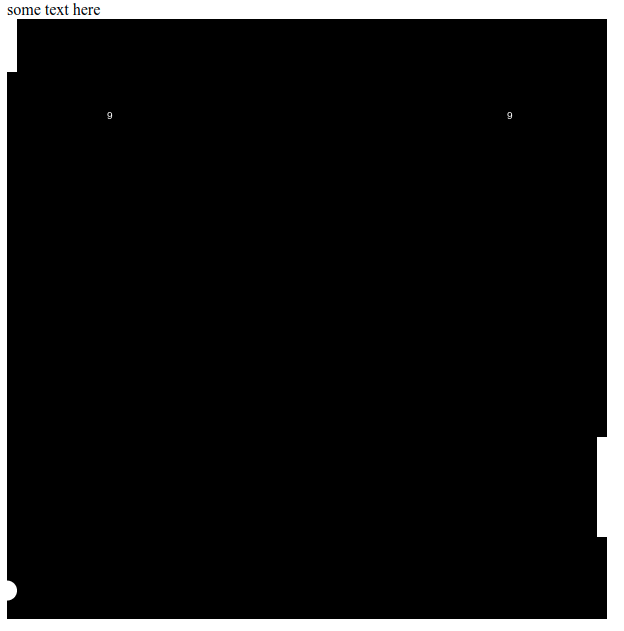

## Instructor: Chris DeLeon
## class: Code Your First Game: Arcade Classic in JavaScript on Canvas
- Purpose: build a simple game using html canvas +javascript 

# Nitty Gritty
- `canvasContext.arc(ballX,100,10,0,Math.PI*2, true)`
    - Radians must be multiples of Math.PI
    - `canvasContext.arc(ballX,100,10,0,6.28, true)` not working
