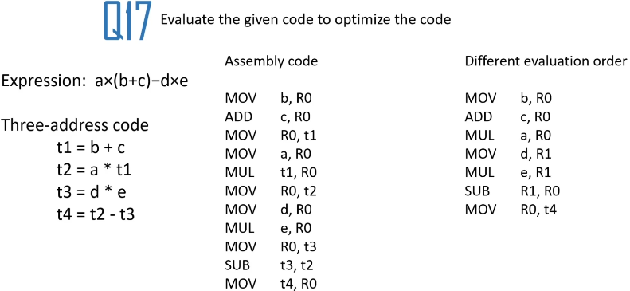
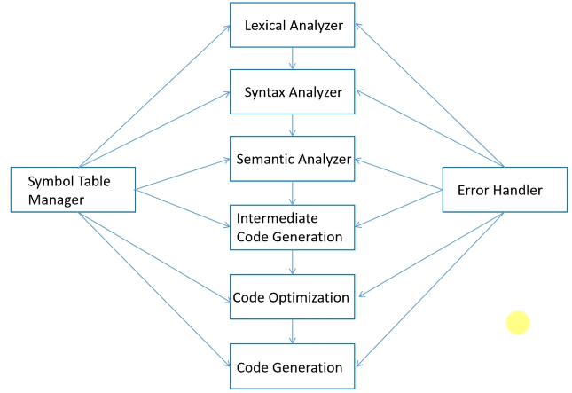

## The Complete Course of Compiler Design
- Instructor: The Tech Courses

## Section 1: Introduction

### 1. Welcome and Course Overview

### 2. Early Day Computers

### 3. The Importance of Compiler Design
- Transformative Role
- Programming Efficiency
- Creativity Unleashed
- Programming Paradigm Diversity
- SW Innovation

### 4. Setting Up Development Environment
- Prerequisites: C++

## Section 2: Compiler Basics

### 5. What is a Compiler?
- Type of compilers
  - Source to source
  - Source to Machine
- Language processing system
  - source program -> [Preprocessor] -> Modified source program -> [Compiler] -> Target assembly program -> [Assembler] -> Re-locatable machine code -> [Linker/Loader] -> Target Machine code

### 6. Compiler vs Interpreter

### 7. The Compilation Process
1. Lexical analyzer
    - Token analyzer: <token-name, attribute-value>
    - Ex:
      - a = b + c * 90
      - a is mapped into a token <id,1>
      - = is mapped into a token <=>
      - b is mapped into a token <id,2>
      - ...
      - <id,1><=><id,2><+><id,3><*><90>
2. Syntax analyzer
  ```
         =
        / \
  <id,1>   + 
          / \
    <id,2>   *
            /  \
      <id,3>    90
  ```  
3. Semantic analyzer
    - Type checking: ` int x = "Hello";`
    - Type Conversion: ` a = b + c* 90;`
4. Intermediate code generation
    - t1 = inttofloat(90)
    - t2 = id3*t1
    - t3 = id2 + t2
    - id1 = t3
5. Code optimization
    - Modifies the generated code to work faster and use less memory
    - Dead code elimination
    - t1 = id3*60.0
    - id1 = id2 + t1
6. Code generation
- Each of them is coupled with Symbol Table Manager and Error Handler

### 8. Question 1
- Eq: distance = v * t +  (1/2) * a * t * t

### 9 Question 1 Answer
1. Lexical analyzer: <id,1><=><id,2><*><id,3><(><1></><2><)><*><id,4><*><id,3><*><id,3>

## Section 3: Lexical Analysis

### 10. Lexical Analyzer, Tokens, Lexemes
- Role of Lexical Analyzer
  - Reads the input characters of the source program, group them into lexems
  - Produces as output a sequence of tokens for each lexeme in the source program

  - Strips out comments and white space (blank, newline, and tab)
  - Correlating error messages are generated by the compiler
  - Two cascade processes
    - Scanning
    - Lexical analysis
- Tokens, Patterns, and Lexemes (groups)
  - A token is a categorized, meaningful unit resulting from the lexical analysis of the source code
  - A pattern is a description of the form that the lexemes of a token may take
  - A lexeme is the sequence of characters in the source code that matches the pattern for a particular token
      

### 11. Regular Expressions
- Specification of Tokens
  - What makes a lexeme an identifier?
  - What makes a lexeme a keyword?
  - What makes a lexeme a comparison operator?
  - Answer: Regular Expressions
- Regular Expressions
  - Let $\Xi$ be a set of characters. A language over $\Xi$ is a set of strings of characters drawn from $\Xi$
  - Are one of the several formalisms for specifying tokens
    - Regular languages are simple and useful theory
    - Easy to understand
    - Efficient implementation
- A Regular Expression is a set of Rules/Techniques for constructing sequences of symbols (Strings) from an alphabet
- Let $\Xi$ be an alphabet, r a Regular expression then L(r) is the language that is characterized by the rules of R
- Integer
  - Digit = 0 1 2 3 4 5 6 7 8 9
  - Integer = digit digit*
  - Abbreviation: A+ = AA*
- Identifier
  - Letter = A .... Z a ... z
  - Identifier = letter (letter + digit)*
- Whitespace
  - \n \t

### 12. Question 2
- Give the regular expression for:
  - "I like dancing"
  - int x = 10

### 13. Question 2 Answer
- Char U {' '}
- {int} U {x} U digits U {=}

### 14. Finite Automata
- A simple idealized machine used to recognize patterns within input taken from some character set
- AKA transition table

- Deterministic Finite Automata (DFA)
  - Have for every state, exactly one leaving edge with a given non-empty input
  - One transition per input per state and no \epsilon-move
  - Is completely determined by input
- Nondeterministic Finite Automata (NFA)
  - Have no restrictions on the labels of their edges
  - A state can label several edges out of the same state and \epsilon-move is possible
  - Machine can choose whether to make \epsilon-move, which of multiple transitions of a single input to take


### 15. Examples
- Perform the following for the regExp -> NFA
  - 1
  
  - B3
  
  - 5+Q
  
  - A5 + Q2
  
  - (1+0)*1
  

### 16. Transition Tables


### 17. NFA to DFA


### 18. Question 3
- (3A+5F)*2
- 3(A+B)*

### 19. Question 3 Answer


### 20. Question 4
- Transition Table for:


### 21. Question 4 Answer


### 22. Question 5
- Convert the following NFA into DFA


### 23. Question 5 Answer


## Section 4: Syntax Analysis

### 24. Syntax Analysis, Context Free Grammar (CFG)
- Parser
  - What is the role of parser?
  
  - A parser is a program that analyzes the syntactic structure of the source code according to the rules defined by the programming language's grammar
  - Uses Context Free Grammar
  - Context-free grammar  is a formalism for describing the syntactic structure of languages
- Context Free Grammar advantages
  - Hierarchy of language structures
  - Readability and maintainability
  - Parsing full language structures
  - Support for ambiguity and ambiguity resolution
- Context Free Grammar
  - Terminals: basic symbols from which strings are formed
    - Tokens come from the lexer
  - Non-terminals: syntactic variables that denote sets of strings
    - Statement and expressions
  - Productions: Phrase structure rules specifying the manner in which terminals and non-terminals can be combined to form strings
    - Defines the rule of the language
  - Start symbol: Top-level phrase from where the production begins
    - Determines which non-terminal represents the language as a whole


### 25. How to Parse, Parse Tree, Left Recursion, Left Factoring
- How to parse
  - During parsing, we take two decisions for an input
    - Decide the non-terminal which is to be replaced
    - Decide the production rule, by which the non-terminal will be replaced
  - Toi decide which non-terminal to be replaced with production rule, we can have two options
    - Left-most derivation
    - Right-most derivation
  - Production rules
    - Bottom up parsing
    - Top down parsing
- Derivation
  - A derivation is basically a sequence of production rules, in order to get the input string
    - Left-most
      - Input is scanned and replaced from left to right
    - Right-most
      - If we scan and replace the input with production rules, from right to left

- Parse Tree
  - Parse Tree is a graphical depiction of a derivation
  - Convenient to see how strings are derived from the start symbol
  - Start symbol of the derivation becomes the root of the parse tree
  - Contains terminals at the leaves
  - Contains non-terminals at the interior nodes
  - An in-order traversal of the leaves is the original input
  - Parse Tree shows the association of operations while the input string does not
- Ambiguity
  - A grammar is ambiguous if it has more than one parse tree for some string
  - No method can detect and remove ambiguity automatically but it can be removed by
    - Either re-writing the whole grammar
    - Setting and following associativity and precedence constraints

- Left recursion
  - A grammar becomes left-recursive if it has any non-terminal A whose derivation contains A itself as the left-most symbol
    - $A=> A \alpha | \beta$
  - Disadvantage of left recursion is that it will create an infinite loop in a top down parser
  - Solution
    - $A=> \beta A'$
    - $A'=> \alpha A' | \epsilon$
- Left factoring
  - If more than one grammar production rule has a common prefix string, then the parser cannot make a choice as to which of the production it should take to parse the string
  - $A=> \alpha \beta | \alpha \gamma | ... $
  - Solution:
    - $A=> \alpha A'$
    - $A' => \beta | \gamma | ...$


### 26. Question 6
- Remove the left recursion of the following expression
1. Grammar 1
    - A-> A + B|B
    - B-> id
2. Grammar 2
    - Expr -> Expr + Term | Term
    - Term -> Term * Factor | Factor
    - Factor -> (Expr) |id

### 27. Question 6 Answer
1. 
    - $A=>\beta A'$
    - $A'=> \alpha A' | \epsilon$
2.
    - Expr -> Term Expr'
    - Expr' -> + Term Expr' | $\epsilon$
    - Term -> Factor Term'
    - Term' -> * Factor Term' | $\epsilon$
    - Factor -> (Expr) | id

### 28. Question 7
- Remove the left factoring of the following expression
1. Grammar 1
    - C -> if E Then S else S | if E then S
2. Grammar 2
    - Stmt -> if Cond then Stmt else Stmt | if Cond then Stmt | id = Expr | while Cond do Stmt
    - Cond -> Expr -> Expr | Expr == Expr
    - Expr -> id + id | id

### 29. Question 7 Answer
1.
  - For a given $A => \alpha \beta | \alpha \gamma | ...$
  - Solution
    - $A=> \alpha A'$
    - $A' => \beta | \gamma | ...$


### 30. Types of Parsing, Recursive Descent Parsing
- The Way the production rules are implemented (derivation) divides parsing into two types
  - Top down
    - The parse tree is constructed
      - From the top
      - From left to right
      - Terminals are seen in order of appearance in the token stream
  - Bottom up
- Recursive descent parsing
  - Uses recursive procedures to process the input
  - Suffers from backtracking
  - If one derivation of a production fails, the syntax analyzer restarts the process using different rules of same production


### 31. C++ Recursive Descent Parsing Code
```cpp
#include <iostream>
char ch;
void error() 
{
  std::cout << "Error, unexpected character!";
  exit(1);
}
void match(char t) 
{
  if (ch==t)
    ch = getchar();
  else
    error();
}
void E_prime() 
{ 
  if (ch== '+') 
  {
    match('+');
    match('i');
    E_prime();
  }
}
void E()
{
  if (ch == 'i')
  {
    match('i');
    E_prime();
  }
}
int main()
{
  ch = getchar();
  E();
  if (ch == '$')
    std::cout <<"Successful";
  else
    std::cout << "Error, unexpected character after parsing";
  return 0;
}
```

### 32. First Set and Follow Set
- An important part of parser table construction
- First set helps to know what terminal symbol is derived in the first position by a non-terminal
- The first of a symbol in a grammar is the set of terminal symbols that begin the strings derivable from that symbol
- Ex:
  - $\alpha -> t \beta$
  - That is, $\alpha$ derives t (terminal) in the very first position. So $t \in {FIRST} (\alpha)$
- Follow set
  - The follow of a non-terminal in a grammar is the set of terminals that can appear immediately to the right of that non-terminal in some derivation
  - What terminal symbol immediately follows a non-terminal in production rules
  - Rules
    - If a is a start symbol, then FOLLOW(S) = $
    - If a is non-terminal and has a production $\alpha$ -> AB, then FIRST(B) is in FOLLOW(A) except $\epsilon$
    - If $\alpha$ is a non-terminal and has a production $\alpha$ -> AB, where B-> $\epsilon$, then FOLLOW(A) is in FOLLOW($\alpha$)


### 33. Question 8

### 34. Question 8 Answer


### 35. Predictive Parsers, LL(k) Parsers
- Like recursive-descent but parser can predict which production to use
  - By looking at the next few tokens
  - No backtracking
- Predictive parsers accept LL(K) grammars
  - L means "Left-to-right" scan of input
  - L means "leftmost derivation"
  - K means "predict based on k-tokens of look-ahead"
  - In practice LL(1) is used
- LL(1)
  - In recursive-descent
    - At each step, many choices of production to use
    - Backtracking used to undo bad choices
  - In LL(1)
    - At each step only one choice of production
  - LL(1) is a recursive descent variant without backtracking
  - In LL(1) parser we have a stack that is initiated with $, an LL(1) parsing table and an input buffer with a $ appended at the end

- Example


### 36. Question 9

### 37. Question 9 Answer


### 38. Bottom-Up Parsing, LR Parsing
- Bottom-Up parsing
  - Begins parsing at the leaves (the bottom) and works up towards the root (the top)
  - The key decisions in bottom-up parsing are
    - When to reduce
    - What production to apply, as the parse proceeds
  - At each reduction step a particular substring matching the right side of a production (body) is replaced by the symbol of the left of that production
  - If the substring is chosen correctly at each step, a rightmost derivation is traced out in reverse

- Shift reduce parsing
  - Use two unique steps for bottom-up parsing
  - Shift step:
    - The shift step refers to the advancement of the input pointer to the next input symbol (the shifted symbol)
    - This symbol is pushed onto the stack. The shifted symbol is treated as a single node of the parse tree
  - Reduce step:
    - When the parser finds a complete grammar rule (RHS) and replace it to (LHS), it is known as reduce-step. This occurs when the top of the stack contains a handle
    - To reduce, a POP function is performed on the stack which pops off the handle and replaces it with LHS non-terminal symbol
  - A stack holds grammar symbols
  - An input buffer holds the rest of the string to be parsed
  - The handle always appears at the top of the stack just before it is identified as the handle
  - $ is used to mark the bottom of the stack and also the right end of the input
  - Initially, the stack is empty, and the string
- LR(k) Parser
  - LR parser is non-recursive, shift-reduce, bottom-up parser
  - The L is for left-to-right scanning of the input
  - The R for constructing a rightmost derivation in reverse
  - The k for the number of input symbols of lookahead that are used in making parsing decisions
  - When (k) is omitted, k is assumed as 1
  - It uses a wide class of context-free grammar which makes it the most efficient syntax analysis technique
- Types of LR Parsers
  - LR(0)  
  - SLR(1) - Simple LR
  - LALR(1) - Look Ahead LR
  - CLR(1) - Canonical LR
- LR(0) Parsing Table Construction
  - LR(0) Item/Item
  - Item sets/Canonical LR(0)
  - LR(0) state
  - Augmented Grammar
  - Closure Operation
  - Goto Operation
- Steps in LR(0) parsing
  - Add augmented production in the given grammar
  - Create a canonical collection of LR(0) items
  - Draw data flow diagram (DFA)
  - Construct the LR(0) table

### 39. LR Parsing Table and Example

### 40. Question 10

### 41. Question 10 Answer

## Section 5: Semantic Analysis

### 42. Semantic Analysis
- Checks if the syntax structure constructed in the program derives any meaning or not
- It focuses on understanding the meaning of the source code beyond its syntactic correctness
- Ex: int a = "chara";
  - Correct in lexical and syntax analysis
  - But semantic error must yield an error
- Key objectives
  - Type checking: ensures that the types of expressions and operation in the program are consistent with the language's rules
  - Scope analysis: identifying variable declarations, ensuring proper scoping rules, and resolving names to their corresponding declarations
  - Declaration checking: The compiler checks that variables and functions are declared before they are used
  - Semantic errors detection: detecting and reporting semantic errors is essential
  - Structural constraints: ensuring adherence to structural constraints imposed by the programming language, such as the correct use of control flow statements, proper loop termination conditions, and valid function return types
  - Attribute checking: analyzing and verifying attributes associated with language constructs
- Symantic errors
  - Type mismatch
  - Undeclared variable
  - Reserved identifier misuse
  - Multiple declaration of a variable
  - Accessing an out of scope variable

### 43. Syntax Directed Translation
- Refers to a method of compiler implementation where the source language translation is completely driven by parser
- The parsing process and parse trees are used to direct semantic analysis and the intermediate code translation of the source program
-  This can be a separate phase of a compiler or we can augment the CFG with information to control the semantic analysis and translation process. Such grammars are called attributed grammars
- Syntax directed definitions
  - Are generalization of context-free grammars in which:
    - Grammar symbols have an associated set of attributes
    - Productions are associated with Semantic Rules for computing the values of attributes
  - Such formalism generates Annotated Parse-Trees where each node of the tree is a record which a field for each attribute


- Type checking
  - A compiler must check if the source program follows semantic conventions of the source language. This is called static checking
  - Dynamic check
    - Executed during the execution of the program
  - Type checks
    - Checks if an operator has the right type of operands
  - Flow-of-control checks
    - Statements that cause flow of control to leave a construct must have some place to which to transfer the flow of control
  - Uniqueness checks
    - There are situations in which an object must be defined exactly once
  - Nmae-related checks
    - Sometimes, the same name must appear two or more times
- Types of types
  - Basic types
    - Atomic types that have no internal structure as far as the program is concerned
    - Integers, real, boolean, character, and enumerated types
  - Constructed types
    - Arrays, records, sets, and structures constructed from the basic types and/or other constructed types
    - Pointers and functions are constructed types
  - Type system
    - Collection of rules for assigning type expressions to the various part of a program
    - Type systems are specified using syntax directed definitions
  - A type checker implements a type systems
  - Sound type system: is one where any program that passes the static type checker cannot contain run-time type errors. Such languages are said to be strongly typed languages
  - Equivalence of type expressions
    - Structural equivalence
      - Two type expressions are structurally equivalent if and only if they are
        - The same basic types or
          -  integer is equivalent only to intgeger
        - Formed by applying the same constructor to structurally equivalent types
          - pointer(integer) is structurally equivalent to pointer(integer)
    - Name equivalence
      - We have name equivalence b/w two type expressions if and only if they are identical

### 44. Question 11
- int result = 10/"2" ; Semantic error - type mismatch
- float result = 5/2 ; OK
- int x = y +3 ; Semantic error - undeclared variable y
- int result = calcSum("5",3);  semantic error - function call compatibilty

### 45. Question 11 Answer

## Section 6. Intermediate Code Generation

### 46. Intermediate Code generation
- A phase in the compiler design process where the compiler generates an intermediate representation of the source code
- The front-end translates a source program into an intermediate representation, and the backend generates the target code from this intermediate representation
- Use of machine independent intermediate code is
  - Retargetting to another machine is easy
  - Simplify the complexity of the source code for further analysis
  - Optimization can be done on the machine independent code
  - Facilitation of Analysis
  - Portability
  - Ease of Translation
  - Types of intermediate code
- Intermediate languages
  - Tree form
     - Abstract syntax tree (AST)
     - Directed acyclic graph
    - Linear form
      - Notations
      - Three-address code

### 47. Directed Acyclic Graphs
- A directed acyclic graph (DAG) for an expression identifies the common subexpressions (subexpressions that occur more than once)
- A node N in a DAG has more than one parent if N represents a common subexpression
- DAGs hep in identifying and eliminating common subexpressions, where the same subexpression appears multiple times in the code
- Constant expressions and arithmetic operations can be folded into a single node in the  DAG, reducing the number of ins

- Properties of DAGs
  - Acyclic Nature
  - Topological Ordering
  - Node Labeling
  - Multiple Representations

### 48. Abstract Syntax Tree
- Each node in the tree corresponds to a specific syntactic element
- The nodes of the tree represent language constructs such as expressions, statements, and declarations. The edge b/w nodes represent the syntactic relationships b/w these constructs
- The AST eliminates certain syntactic redundancies

- Role of AST
  - Representation of Syntax
  - Simplification for Analysis
  - Expression Evaluation
  - Code Optimization
  - Source-to-source transformations

### 49. Notations
- Notation is used to represent expressions in a way that eliminates the need for parentheses and clarifies the order of operations
- Different notations are used to represent expressions
  - Prefix notation (polish notation)
    - Every operator follows the operands
    - $a+ b*c => + a * b c$
  - Infix notation
    - operator comes b/w operands. Parentheses for the calculation order
    - $a + b*c => a + (b*c)$
  - Postfix notation
    - Operator comes after operands
    - $a + b*c => abc * +$
- Postfix notation is practical for an intermedate representation as the poerands are found just before the operator
- Both Polish and postfix notations are stack-oriented and can be efficiently evaluated using as stack data structure
- The postfix notation is a linearized representation of a syntax tree
- Example of postfix notation
  - $(a/b)*c -(d*e) +f =>  ab/ *c- de* +f => ab/c* - de * +f => ab/c*de*-f+$

### 50. Question 12
- Change the following infix to postfix
- $ (a-b) * (c-d) + (e + (f/g))$

### 51. Question 12 Answer
- $ab- * cd- + e + fg/ => ab-cd-* + (efg/+) => ab-cd-*efg/++$

### 52. Three-Address Code
- Three address code is a sequence of statements in the form
  - X:= Y op Z
  - X, Y, Z are names, constants or compiler generated temporaries
  - Op is an operator
- Notes
  - No custom or built-up arithmetic operator is permitted
  - Only one operator at the right is possible - i.e. x+y+z is not allowed
- Representing three address codes
  - Quadruples
    - Has four fields: op, arg1, arg2, and result
  - Triples
    - Has 3 fields
  - Indirect triples

### 53. Quadruples & Triples
- A quadruple (or just "quad") has four fields, which are op, arg1, arg2, and result
- The op field contains an internal code for the operator
- For instance, the three address instruction x = y +  z is represented by placing + in op, y in arg1, z in arg2, and x in result

- Triples
  - Has only 3 fields, which are op, argx, and arg
  - Quadruple table is used primarily for temporary names
  - We refer to the result of an operation x op y by its position, rather than by an explicit temporary name


### 54. Question 13

### 54. Question 13 Answer

## Section 7: Runtime Environments

### 56. Runtime Environments
- The compiler must cooperate with the operating system and other systems SW to support these abstractions on the target machine
- To do so, the compiler creates and manages a run-time environment in which it assumes its target programs are being executed
- The run time environment plays a vital role in translating high-level code into executable machine instructions

- Key components
  - Memory management (stack vs heap)
  - Activation records (stack frames)
  - Managing scope
    - Static scope
    - Dynamic scope
- Why runtime environment is crucial
  - Memory allocation and deallocation
  - Function execution
  - Variable scope and lifetime
  - Dynamic memory allocation
  - Adaptability across platforms
   
### 57. Stack
- A linear data structure that follows the Last In First Out (LIFO) principle
- It is a region of memory managed by the programmer's execution system
- Stack Usage
  - Local variables
  - Function calls
  - Control Flow
  - Efficient Memory access
  - Automatic Memory Management
  - Limited Size
  - Temporary Storage

### 58. Stack Implementation using C++
```cpp
#include <iostream>
#include <vector>
template <typename T>
class Stack
{
  private:
    std::vector<T> element;
  public:
    bool empty() const 
    {
      return element.empty();
    }
    std::size_t size() const 
    {
      return element.size();
    }
    void push(const T& value)
    {
      element.push_back(value);
    }
    void pop() 
    {
      if (!empty())
      {
        element.pop_back();
      } 
      else 
      {
        std::cerr << "Error, stack is empty\n";
      }
    }
    T top() const
    {
      if (!empty())
      {
        return element.back();
      }
      else
      {
        std::cerr << "Error: stack is empty\n";
      }
    }
}
int main()
{
  Stack<int> intStack;
  intStack.push(10);
  intStack.push(20);
  intStack.push(30);
  std::cout << "Top element: " << intStack.top() << std::endl;
  intstack.pop();
  std::cout << "Top element after pop: " << intStack.top() << std::endl;
}
```

### 59. Heap
- A heap refers to a region of a computer's memory that is used for dynamic memory allocation
- It serves as a dynamic storage data, allowing for flexible memory allocation and deallocation during the execution of a program
- The heap is the portion of the store that is used for data that lives indefinitely, or until the program explicitly deletes it

- Heap usage
  - Dynamic memory allocation
  - Flexibility in memory allocation
  - Persistent storage
  - Fragmentation issues
  - Manual memory management
  - Slower access time

### 60 Activation Records
- Also known as a stack frame, an activation record is a data structure that organizes and manages the execution of a function
- It serves as a container for essential information related to a function call, ensuring proper execution and providing a structured layout on the call stack
- Activation record is used to manage the information needed by a single execution of a procedure
- Lifetime of activation records
  - Creation
  - Execution
  - Destruction
- Activation records components
  - Actual parameters
  - Returned values  
  - Control link
  - Access link
  - Saved machine status
  - Local data
  - Temporaries

### 61 Managing Scope
- Scope refers to the region within a program where a particular identifier, such as a variable or function, is valid and accessible
- It defines the visibility and reach of an identifier, and understanding scope is crucial for managing variable lifetime and avoiding naming conflicts
- Static scope vs dynamic scope
  - Static scope (lexical scope)
    - Determined at compile-time
    - Scope is defined by the program's structure
    - Variables are bound to their scope based on the textual structure of the code
    - Common in languages like C, C++, and Java
  - Dynamic scope
    - Determined at runtime
    - Influenced by the calling sequence of functions
    - Variables are bound based on the order of function calls
    - Less common but found in languages like Perl
- Lifetime of variables
  - Local variables
    - Exist within the scope of the block or function where they are declared
    - Created on entering the scope and destroyed on exiting
  - Global variables
    - Exist throughout the entire execution of the program
    - Created at program startup and persist until program termination
  - Static variables
    - Have a lifetime equivalent to the entire program execution
    - Created at program startup and persist until program termination

### 62. Question 14
- Find local/global/static variables from the given C++ code
```cpp
#include <iostream>
int Top=10;      // global
void ranFunction() 
{
  int Skit = 20; // local
  std::cout << "Variable:" << Skit << std::endl;
}
void defFunction()
{
  static int Low = 30; // static
  std::cout << "Variable " << Low << std::endl;
  defFunction++;
}
```

### 63. Question 14 Answer

## Section 8: Optimization Techniques

### 64. Optimization Techniques 
- Optimization refers to the process of improving the performance and efficiency of compiled code
- The primary goal is
  - Enhance the execution speed
  - Reduce memory usage
  - Minimize the overall resource consumption of the generated program
- Key objectives of optimization
  - Execution speed
  - Memory Usage
  - Code Size
  - Power consumption
- Purpose and benefits of optimization
  - Performance improvement
  - Resource utilization
  - Compatibility
  - Cost reduction
  - Enhanced user experience

### 65. Constant Folding
- An optimization technique that involves evaluating constant expressions at compile-time instead of run-time
- The compiler analyzes expressions containing constants and performs arithmetic operations during compilation
- The result is a simplified expression with constants replaced by their computed values

- Benefits of constant folding
  - Reduces runtime computations
  - Improves code efficiency by eliminating unnecessary runtime calculations
  - Generates more compact and potentially faster code

### 66. Dead Code Elimination
- Dead code elimination is a process in which the compiler identifies and removes code that does not contribute to the final program output
- The compiler analyzes the program to identify code that cannot be reached or has no impact on the program's output
- Dead code is then safely removed from the compiled code

- Benefits of dead code elimination
  - Reduces code size and improves readability
  - Enhances program execution by eliminating unnecessary computations
  - Streamlines maintenance by removing redundant or obsolete code

### 67. Common Sub Expression Elimination
- Common subexpression elimination (CSE) is a technique that identifies and eliminates redundant evaluations of the same subexpression
- The compiler identifies repeated computations within the code and replaces them with a single computation, storing the result in a temporary variable
- This reduces redundant calculations and improves runtime efficiency

- Benefit of common subexpression elimination
  - Optimizes execution speed by avoiding redundant computations
  - Reduces the need for excessive memory storage of repeated subexpression results
  - Enhances code readability and maintainability

### 68. Question 15

### 69. Question 15 Answer


## Section 9: Advanced Compiler Topics

### 70. Code Generation
- It takes an input the intermediate representation (IR) produced by the front-end of the compiler, along with relevant symbol table information, and produces as output a semantically equivalent target program
- This transformative process is essential for enabling the execution of high-level programming language constructs on a specific HW architecture
- Code produced by compiler must be correct
  - Source to target program transformation is semantics preserving
- Code produced by compiler should be of high quality
  - Effective use of target machine resources
  - Heuristic techniques can generate good but suboptimal code, because generating optimal code is undecidable
- Key points
  - Purpose of code generation
  - Intermediate code as a bridge
  - Role in compiler workflow
  - Translation process
  - HW-specific considerations
  - Optimizations for efficiency
  - Importance of well-designed code generation
- A code generator has three primary tasks
  - Instruction selection
  - Register allocation and assignment
  - Instruction ordering
- Issues in the design of code generator
  - Input to the code generator
  - Target program
  - Memory management
  - Instruction selection
  - Register allocation
  - Evaluating order

### 71. Input to the Code Generator
- The use of a well-defined intermediate representation plays a central role in the effectiveness of code generation
- Importance of a well-defined intermediate representation:
  - Language independence
  - Ease of transformation
  - Consistent abstraction
  - Facilitation of optimizations
  - Intermediary checks
- Intermediate representation of the source program
  - Linear - postfix
  - Tables - quadruples, triples, indirect triples
  - Nonlinear - AST, DAG
- Symbol table information

### 72. Target Program Code
- This phase involves a careful consideration of the characteristics, architecture, and instruction set of the targe machine
- The instruction-set architecture of the target machine has a significant impact on the difficulty of constructing a good code generator that produces high-quality machine code
- Implementing code generation requires understanding of the target machine architecture and its instruction set
- The backend code generator of a compiler may generate different forms of code
  - Absolute machine code - Executable
  - Relocatable machine code - Object files
  - Assembly language
  - Byte code forms for interpreters - JVM

### 73. Memory Management
- As the code generator transforms high-level source code into machine executable instructions, decisions related to memory allocation, organization, and utilization play a crucial role in shaping the behavior and performance of the compiled program
- Importance of memory management decisions
  - Resource optimization
  - Prevention of memory leaks
  - Stack & heap allocation
  - Memory organization
  - Data structure alignment
  - Global and static data
  - Memory safety
- Balance b/w efficiency and correctness
  - Trade-offs: speed and resource
  - Garbage collection

### 74. Instruction Selection & Examples on generating Assembly code
- The code generator must map the IR program into a code sequence that can be executed by the target machine
- The complexity of performing this mapping is determined by factors such as
  - The level of the IR
  - The nature of the instruction set architecture
  - The desired quality of the generated code

- Instruction selection
  - Assume that machine is simple processor with fixed instruction costs
  - Realistic machines have deep pipelines, L-cache, D-Cache, etc 
  - Define the cost of instruction as
    - 1 + cost(source mode) + cost(destination mode)

- Challenges in the instruction selection
  - Diversity in high-level constructs
  - Register allocation
  - Balancing complexity and performance
  - Machine specific considerations

### 75. Question 16

### 76. Question 16 Answer


### 77. Register Allocation & Assignment
- Efficient utilization of limited set of registers is important to generate good code
- Registers are assigned by
  - Registers allocation: to select the set of variables that will reside in register at a point in the code
  - Register assignment: to pick the specific register that a variable will reside in
- Finding an optimal register assignment is hard and NP-complete (non-deterministic polynomial time)
- Significance of efficient register allocation
  - Speed optimization
  - Minimization of memory access latency
  - Reduced dependency on cache
  - Optimal utilization of processor resources
  - Register renaming and elimination of redundant loads
  - Support for advanced optimizations
- Strategies for register allocation
  - Graph coloring
  - Linear scan register allocation
  - Global and local register allocation
  - Spill code and spill cost minimization
  - Optimistic allocation and backtracking
  - Interference graph reduction

### 78. Evaluation Order & Example
- Evaluation order dictates the sequence in which expressions within a program is computed
- The order in which computations are performed can affect the efficiency of the target code

- Impact on generated code
  - Optimization opportunities
  - Compiler dependent behavior
  - Dependency analysis
  - Avoiding redundant computations
  - Impact on parallelism
  - Code size and readability

### 79. Question 17

### 80. Question 17 Answer


### 81. Just-In-Time Compilation
- JIT compilation is a dynamic code compilation technique employed by modern programming language runtimes
- Unlike traditional Ahead-Of-Time (AOT) compilation, JIT compilation occurs during the program's execution, translating portions of code on-the-fly
- It selectively targets specific portions of code that are frequently executed or identified as "hot spots"
- Interpreter and compilation thresholds
- Profiling and feedback mechanisms
- Advantages of JIT compilation
  - Adaptive optimization
  - Reduced memory footprint
  - Cross-platform execution
- Implementation in runtime environments
  - Implementation in runtime environments
    - Java platform is a prominent example of JIT compilation in action
  - .NET Common Language Runtime (CLR)
    - .NET runtime utilizes JIT compilation to convert Common Intermediate Language (CIL) code into native machine code
- Challenges and Considerations
  - Warm-up period
    - JIT compilation may have a warm-up period where initial execution is less optimized
  - Overhead
    - There is an initial overhead as code is compiled during execution, potentially impacting startup time

### 82. Dynamic Compilation vs Static Compilation
- Static compilation
  - Traditional Approach: the compilation process takes place once, producing a standalone executable file that encapsulates the entire program's functionality
  - Creation of standalone executable: results in the generation of a standalone executable file, encapsulating the entire program's logic and functionality
  - Drawbacks
    - Longer startup times
    - Less adaptabtility to runtime changes
- Dynamic compilation
  - Dynamic compilation, in contrast, introduces a more flexible and adaptive approach by compiling portions of code during program execution
  - JIT compilation
  - Advantages of dynamic compilation
    - Better optimization based on runtime information
    - Adaptability to varying execution conditions
  - Practical implementation
    - JVM and JIT compilation
    - Interpreters and compilation thresholds
  - Considerations and trade-offs
    - Startup time vs runtime adaptability
    - Resource utilization

### 83. HotSpot Compilation
- Hotspot compilation in the Java Virtual Machine (JVM)
  - Hotspot compilation represents a specific implementation of JIT compilation within JVM
  - Focus on hotspots
    - Central to hotspot compilation is its focus on identifying and optimizing hotspots within the code
    - Hot spots are sections of code that are frequently executed during program runtime
- Adaptive optimization in hotspot
  - Inlining
  - Loop unrolling
  - Deoptimization
- Tiered compilation
- Code caching
- Balancing adaptability and performance

## Section 10: Domain Specific Language DSL

### 84. Domain-Specific Languages (DSLs)
- What is DSL?
  - A DSL is a programming language that is designed to solve a specific problem within a particular domain
  - DSLs are tailored to a specific domain, making them more expressive and easier to use
  - DSLs work by providing a set of abstractions that are specific to a particular domain
- Why DSL?
  - Increased productivity
  - Improved readability
  - Better maintainability
- Disadvantages of using DSL
  - The cost of designing, implementing and maintaining a DSL
  - The cost of education for DSL users
  - The limited availability of DSLs
  - The difficulty of finding the proper scope for a DSL
  - The difficulty of balancing b/w domain-specificity and general purpose programming language constructs
  - The potential loss of efficiency when compared with hand-coded SW
- Types of DSL
  - External DSLs: these are standalone languages that are created specifically for a particular domain. Examples include SQL for database queries and HTML for describing the structure of web pages
  - Internal DSLs: these are DSLs embedded within a general-purpose programming language. Developers create a DSL using constructs provided by the host language. This allows for a more seamless integration of domain-specific concepts into general-purpose code
  - Creating DSLs
    - Define the problem domain
    - Choose a language
    - Define the syntax and semantics
    - Implement the DSL

### 85. Mathematical Expression using DSL
- Example on DSLs
  - Create a simple DSL for creating and evaluating mathematical expressions. It must include basic binary operations (addition, subtraction, multiplication, and division)
```cpp
#include <iostream>
#include <functional>
#include <memory>
class Expression 
{
  public:
    virtual double evaluate() const  = 0;
    virtual ~Expression() = default;
};
class Constant : public Expression
{
  private:
    double value;
  public:
    explicit Constant(double val): value(val){}
    double evaluate() const override {
      return value;
    }
};
class Variable: public Expression
{
  private:
    double & varRef;
  public:
    explicit Variable(double& ref): varRef(ref){}
    double evaluate() const override
    {
      return varRef;
    }
};
class BinaryOperation: public Expression
{
  private:
    std::function<double(double,double)> operation;
    std::unique_ptr<Expression> left;
    std::unique_ptr<Expression> right;
  public:
    BinaryOperation(std::function<double(double,double)> op, std::unique_ptgr<Expression> l, std::unique_ptr<Expression> r) : operation(op),left(std::move(l)), right(std::move(r) {}
    double evaluate() const override {
      return operation(left->evaluate(),right->evaluate());
    }
};
```  

### 86. DSL for the Expression
```cpp
std::unique_ptr<Constant> cst(double val)
{
  return std::make_unique<Constant>(val);
}
std::unique_ptr<Variable> var(double& ref)
{
  return std::make_unique<Variable>(ref);
}
std::unique_ptr<BinaryOperation> operator+(std::unique_ptr<Expression> left, std::unique_ptr<Expression> right) 
{
  return std::make_unique<BinaryOperation>([](double l, double r) {return l+r;}, std::move(left), std::move(right));
}
std::unique_ptr<BinaryOperation> operator-(std::unique_ptr<Expression> left, std::unique_ptr<Expression> right) 
{
  return std::make_unique<BinaryOperation>([](double l, double r) {return l-r;}, std::move(left), std::move(right));
}
std::unique_ptr<BinaryOperation> operator*(std::unique_ptr<Expression> left, std::unique_ptr<Expression> right) 
{
  return std::make_unique<BinaryOperation>([](double l, double r) {return l*r;}, std::move(left), std::move(right));
}
std::unique_ptr<BinaryOperation> operator/(std::unique_ptr<Expression> left, std::unique_ptr<Expression> r```ight) 
{
  return std::make_unique<BinaryOperation>([](double l, double r) {return l/r;}, std::move(left), std::move(right));
}
```

### 87. Testing the DSL
```cpp
int main() 
{
  double x = 5.0;
  double y = 3.0;
  auto expr1 = cst(2.0) * (var(x) + cst(1.0));
  auto expr2 = (var(y) - cst(1.0) / cst(2.0));
  std::cout << "Result 1: " << expr1->evaluate() << std::endl;
  std::cout << "Result 2: " << expr2->evaluate() << std::endl;
  return 0;
}
```
- Not compiled with Gcc11 at Ubuntu:
```
mathDSL.cxx:71:44: note:   ‘std::unique_ptr<Variable>’ is not derived from ‘std::__cxx11::basic_string<_CharT, _Traits, _Allocator>’
   71 |   auto expr1 = cst(2.0) * (var(x) + cst(1.0));
      |                                            ^
mathDSL.cxx:72:35: error: no match for ‘operator/’ (operand types are ‘std::unique_ptr<Constant>’ and ‘std::unique_ptr<Constant>’)
   72 |   auto expr2 = (var(y) - cst(1.0) / cst(2.0));
      |                          ~~~~~~~~ ^ ~~~~~~~~
      |                             |          |
      |                             |          unique_ptr<[...]>
      |                             unique_ptr<[...]>
```

### 88. Problem statement


### 89. DSL Function
```cpp
#include <iostream>
#include <vector>
#include <algorithm>
class Product 
{
  public:
    std::string name;
    int quantity;
    Product(cosnt std::string& productName, int productQuantity) 
      : name(productName), quantity(productQuantity) {}
};
class Inventory
{
  private:
    std::vector<Product> products;
  public:
    void addProduct(const std::string& productName, int initialQuantity)
    {
      Product newProduct(productName, initialQuantity);
      products.push_back(newProduct);
      std::cout << "Product added: "<< productName << " Quantity: " << initialQuantity << ")\n";
    }
    void updateQuantity(const std::string& productName, int quantityChange)
    {
      auto it = std::find_if(products.begin(), products.end(),[productName](const Product& p) {return p.name == productName; });
      if (it != products.end()) 
      {
        it-> quantity +=  quantityChange;
        std::cout << "Quantity updated for " << productName << " : " << it->quantity << "\n";
      } else {
        std::cout << "Product not found: " << productName << "\n";
      }      
    }
    void listProducts() 
    {
      std::cout << "Product Inventory: \n";
      for (const auto& product : products) 
      {
        std::cout << "Name: " << product.name << " | Quantity: " << product.quantity << "\n";
      }      
    }
};
```

### 90. Testing the DSL
```cpp
int main()
{
  Inventory myInventory;
  int choice:
  do 
  {
    std::cout << "1. Add product\n";
    std::cout << "2. Update product\n";
    std::cout << "3. List product\n";
    std::cout << "4. Exit\n";
    std::cout << "Enter your choice\n";
    std::cin >> choice;
    switch(choice)
    {
      case 1: 
      {
        std::string productName;
        int initialQuantity;
        std::cout << "Enter product name: ";
        std::cin.ignore();
        std::getline(std::cin,productName);
        std::cout << "Enter initial quantity: ";
        std::cin >> initialQuantity;
        myInventory.addProduct(productName, initialQuantity);
        break;
      }
      case 2:
      {
        std::string productName;
        int quantityChange;
        std::cout << "Enter the product name: ";
        std::cin.ignore();
        std::getline(std::cin,productName);
        std::cout << "Enter the quantity change (positive or negative):";
        std::cin >> quantityChange;
        myInventory.updateQuantity(productName, quantityChange);
        break;        
      }
      case 3:
      {
        myInventory.listProduts();
        break;
      }
      case 4:
      {
        std::cout << "Exiting...\n";        
        break;
      }
      default:
      {
        std::cout << "Invalid input\n";
        break;
      }
    }
  }
} while (choice != 4);
return 0;
```
- ? Is this DSL?

### 91. Question 18


### 92. Question 18 Answer
```cpp
#include <iostream>
#include <vector>
#include <algorithm>
class Task 
{
  public:
    std::string description;
    bool completed;
  Task(const std::string& desc) : description(desc), completed(false){}
};
class TaskList
{
  private:
    std::vector<Task> tasks;
  public:
    void addTask(const std::string& description)
    {
      Task newTask(description);
      tasks.push_back(newTask);
      std::cout << "Task added: " << description << std::endl;
    }
    void markComplete(int index)
    {
      if (index >= 0 && index < tasks.size())
      {
        tasks[index].completed = true;
        std::cout << "Task marked as complete: " << tasks[index].description << std::endl;
      } else {
        std::cout << "Invalid task index." << std::endl;
      }
    }
    void listTask() 
    {
      std::cout << "Task List: " << std::endl;
      for (size_t i=0; i < tasks.size(); i++)
      {
        std::cout << "[" << i +1  << "]";
        if (task[i].completed)
        {
          std::cout << "[Completed] " ;
        }
        std::cout << tasks[i].description << std::endl;
      }
    }
};
int main() 
{
  TaskList myTaskList;
  int choice;
  do
  {
    std::cout << "1. Add Task\n";
    std::cout << "2. Mark Task as Completed\n";
    std::cout << "3. List Task\n";
    std::cout << "4. Exit\n";
    std::cout << "Enter your choice: \n";
    std::cin >> choice;
    switch(choice)
    {
      case 1: 
      {
        std::string description;
        std::cout << "Enter the task description: ";
        std::cin.ignore();
        std::getline(std::cin,description);
        myTaskList.addTask(description);
        break;
      }
      case 2:
      {
        int index;
        std::cout << "Enter task index to mark as completed: ";
        std::cin >> Index;
        myTaskList.markComplete(index-1);
        break;
      }
      case 3:
      {
        myTaskList.listTasks();
        break
      }
      case 4:
      {
        std::cout << "Exiting...\n";
        break;
      }
      default;
        std::cout << "Invalid choice\n";
        break;
    }
  } while(choice !=4);
  return 0;
}
```

## Section 11: Compiler Construction Projects

### 93. Building a Simple Lexer
```cpp
#include <iostream>
#include <cstring>
const int MAX=1024;
const int MAXOFIDENTIFIER=25;
enum TokenType 
{
  IDENTIFIER=1,
  INTEGER,
  ADD,
  SUB,
  ASSIGN
};
struct TableNode 
{
  int type;
  char token[MAXOFIDENTIFIER];
};
TableNode tokenTable[MAX];
int tableNum = 0;
bool errorFlag = false;
enum ErrorType
{
  UNKNOWNIDENTIFIER
};
void Error(ErrorType errorType, const char* str)
{
  errorFlag = true;
  std::cout << "Error " << std::endl;
  switch(errorType)
  {
    case UNKNOWNIDENTIFIER:
      std::cout << "Unknown Identifier " << str << ": \n";
      break;      
  }
}
void Scanner(const char * SourceCode) 
{
  int codeLength = strlen(SourceCode);
  int chIndex = 0;
  int tableIndex = 0;
  while(chIndex < codeLength) 
  {
    while(isspace(SourceCode[chIndex]))
      chIndex++;
    if(chIndex >= codeLength)
      break;
    if (std::isalpha(SourceCode[chIndex]) || SourceCode[chIndex] == '_')
    {
      char str[MAXOFIDENTIFIER];
      int strLen = 0;
      while(isalnum(SourceCode[chIndex]) || SourceCode[chIndex] == '_')
      {
        str[strLen++] = SourceCode[chIndex++];
      }
      str[strLen] = '\0';
      tokenTable[tableIndex].type = IDENTIFIER;
      strcpy(tokenTable[tableIndex].token,str);
      tableIndex++;      
    } 
    else if (isdigit(SourceCode[chIndex]))
    {
      char str[MAXOFIDENTIFIER];
      int strLen = 0;
      while(isdigit(SourceCode[chIndex]))
      {
        str[strLen++] = SourceCode[chIndex++];
      }
      str[strLen] = '\0';
      tokenTable[tableIndex].type = INTEGER;
      strcpy(tokenTable[tableIndex].token,str);
      tableIndex++;
    }
    else
    {
      char str[2] = {SourceCode[chIndex],'\0'};
      switch(SourceCode[chIndex])
      {
        case '+':
          tokenTable[tableIndex].type = ADD;
          break;
        case '-':
          tokenTable[tableIndex].type = SUB;
          break;
        case '=':
          tokenTable[tableIndex].type = ASSIGN;
          break;
        default:
          Error(UNKNOWNIDENTIFIER, str);
          return;
      }
      strcpy(tokenTable[tableIndex].token,str);
      tableIndex++;
      chIndex++;
    }
  }
  tableNum = tableIndex;
}
int main()
{
  char sourceCode[MAX];
  std::cout << "Enter the source code (input '#' to end):\n";
  std::cin.getline(sourceCode,MAX,'#');
  Scanner(sourceCode);
  std::cout << "Token: \n";
  for(int i=0; i< tableNum; ++i)
  {
    switch(tokenTable[i].type)
    {
      case IDENTIFIER:
        std::cout << "Identifier: " << tokenTable[i].token << std::endl;
        break;
      case INTEGER:
        std::cout << "Integer: " << tokenTable[i].token << std::endl;
        break;
      case ADD:
        std::cout << "Operator: + \n";
        break;
      case SUB:
        std::cout << "Operator: - \n";
        break;
      case ASSIGN:
        std::cout << "Operator: = \n";
        break;
      default:
        break;      
    }
  }
  if (errorFlag)
    return 0;
  return 0;
}
```
- Demo:
```bash
$ ./a.out 
Enter the source code (input '#' to end):
x = 1
y = 2
z = x + y 
#
Token: 
Identifier: x
Operator: = 
Integer: 1
Identifier: y
Operator: = 
Integer: 2
Identifier: z
Operator: = 
Identifier: x
Operator: + 
Identifier: y
```

### 94. Building a Simple Parser
```cpp
void Emit(const char* result, const char* leftParameter, const char* op, const char* rightParameter)
{
  std::cout << result << "=" << leftParameter << " " << op << " " << rightParameter << std::endl;
}
void Parser() 
{
  int tableIndex = 0;
  while (tableIndex < tableNum)
  {
    if (tokenTable[tableIndex].type == IDENTIFIER)
    {
      char * leftValue = tokenTable[tableIndex].token;
      tableIndex ++;
      if(tokenTable[tableIndex].type == ASSIGN) {
        tableIndex++;
        char* rightValue = tokenTable[tableIndex].token;
        tableIndex++;
        while(tableIndex < tableNum && (tokenTable[tableIndex].type == ADD || tokenTable[tableIndex].type == SUB))
        {
          char* op = tokenTable[tableIndex].token;
          tableIndex++;
          if (tokenTable[tableIndex].type == IDENTIFIER || tokenTable[tableIndex].type == INTEGER)
          {
            char * nextValue = tokenTable[tableIndex].token;
            tableIndex++;
            char* tempVar = new char [MAXOFIDENTIFIER];
            strcpy(tempVar,"temp");
            Emit(tempVar, rightValue, op, nextValue);
            rightValue = tempVar;
          } 
          else 
          {
            Error(UNKNOWNIDENTIFIER, tokenTable[tableIndex].token);
            return;
          }
        }
        Emit(leftValue, rightValue, "", "");
      }
      else 
      {
          Error(UNKNOWNIDENTIFIER, tokenTable[tableIndex].token);
          return;
      }      
    } 
    else
    {
      Error(UNKNOWNIDENTIFIER, tokenTable[tableIndex].token);
      return;
    }
  }
}
int main()
{
  char sourceCode[MAX];
  std::cout << "Enter the source code (input '#' to end):\n";
  std::cin.getline(sourceCode,MAX,'#');
  Scanner(sourceCode);
  Parser();
  if (errorFlag)
    return 0;
  return 0;
}
```
- Demo:
```bash
$ ./a.out 
Enter the source code (input '#' to end):
a = 4
b = 7
c = a+b+11
#
a=4  
b=7  
temp=a + b
temp=temp + 11
c=temp  
```

### 95. Building a Simple ICG (Intermediate Code Generator)
```cpp
#include <iostream>
#include <string>
#include <vector>
class X86AssemblyGenerator
{
  public:
    X86AssemblyGenerator(): tempCount(0) {}
    std::string generatedAssembly() const 
    {
      std::string assemblyCode;
      for (const auto & instruction: instruction) 
      {
        assemblyCode += instruction + '\n';        
      }
      return assemblyCode;
    }
    std::string createTempVariable() 
    {
      return "temp" + std::to_string(tempCount++);
    }
    void genMov(const std::string& dest, const std::string& src)
    {
      instruction.push_back("MOV " + dest + ", " + src);
    }
    void genAdd(const std::string& dest, const std::string& src)
    {
      instruction.push_back("ADD " + dest + ", " + src);
    }
    void genSub(const std::string& dest, const std::string& src)
    {
      instruction.push_back("SUB " + dest + ", " + src);
    }
    void genMul(const std::string& dest, const std::string& src)
    {
      instruction.push_back("MUL " + dest + ", " + src);
    }
  private:
    int tempCount;
    std::vector<std::string> instruction;
};
int main()
{
  X86AssemblyGenerator assemblyGenerator;
  std::string a = "a";
  std::string b = "b";
  std::string temp0 = assemblyGenerator.createTempVariable();
  std::string temp1 = assemblyGenerator.createTempVariable();
  std::string x = "x";
  assemblyGenerator.genMov(temp0,a);
  assemblyGenerator.genMov(temp1,b);
  assemblyGenerator.genMov(temp0,temp1);
  assemblyGenerator.genMov(temp0,x);
  std::string assemblyCode = assemblyGenerator.generatedAssembly();
  std::cout << "Generated ASsembly Code: \n" << assemblyCode << std::endl;
  return 0;
}
```
- Demo:
```bash
$ ./a.out 
Generated ASsembly Code: 
MOV temp0, a
MOV temp1, b
MOV temp0, temp1
MOV temp0, x
```

### 96. Question 19
- Explain the use of Symbol-Table management in a compiler

### 97. Question 19 Answer
- Record the variable names used in the the source program
- Information about the storage allocated for a name, its type, its scope

### 98. Recap of Key concepts and References

- Further learning resources
  - Compilers: principles, techniques, and tools (Dragon book) by A V Aho, M S Lam, R Sethi, J D Ullman
  - Engineering a Comiler by K D Cooper, L Torczon
  - Modern Compiler Implementation in ML by A W Appel
  - Compiler Design: Theory, Tools, and Examples by S D Bergmann
  - Introduction to Compiler Construction with Unix by A T Schreiner
