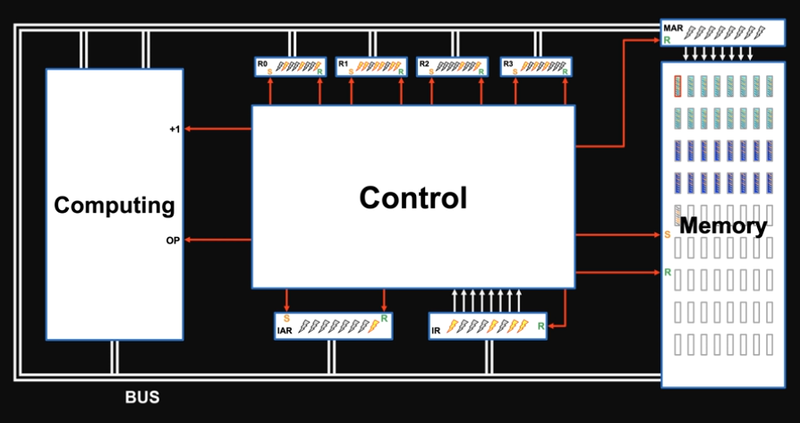

## Title : How Computers Work - Finally resolving the mystery!
- Instructor: Learning 0to1

## Section 1: Introduction

1. How computer work - overview

- Control unit is a big SWITCH
- Questions:
  - How can electricity be numbers?
  - How does transistor work?
  - How to build memories?
  - How to build computing switch?
  - How to build control switch?
  - How to use electrictiy as instructions?
  - What is programming?

2. Course content

## Section 2: How computers compute -ALU

3. How to represent numbers

4. Who's computing on what

5. How transistor works

6. Semiconductor technology - PN junction
- More carrier, more conductivity
- Valence eletrons of Si - through doping (phosphoros), N-type semiconductor
  - Valence electrons move under voltage differences
- Boron doping makes P-type semiconductor
  - Free electrons move under voltage differences
- PN junction is used to make diode (AC->DC)

7. Semiconductor technology - NPN

8. Energy band theory

9. How transistors add two bits

- How to configure each switch?

10. How transistors add 1+1

- Adds a resistance near the ground to avoid swarm of electrons

11. How transistors add 1+0

- In addition to OR switch, one more AND and NAND are necessary

12. Logic gates and half adders
- Those switches are called gates
  - Power supply is not drawn as default

13. How to add multibits
- Symbol for add

  - Carry out is the next digit from the current digit add (1+1 => 10)

14. How to do subtractions
- Complementary add
  - 67 - 42 =  167 + 58 = 225 => remove the first digit then we get 25

15. How to do multiplications
- Combination of shiting and add

16. How to do divisions
- Repeated subtraction
  - 28/7 => iterate 28 - 7 = 21 > 0 then 21 -7 = 14 > 0 then 14 - 7 = 7 > 0  then 7 - 7 = 0 => Count how many iteration was done

17. Arithmetic logic unit 

- Intermediate results are stored in memory

## Section 3: How computers remember - Memory

18. What does memory need to do

19. How to store one bit I

20. How to store one bit II

21. How does memory work - general structure

22. How NOR NAND latches work

23. How to store many numbers
- How to connect RAM (memory) with ALU?
  - Public route: Bus

24. How to stop interferences - buffers

25. How to access memory - memory grid
- For 256 memory cells, we may not need 256 input/output wires
  - Can reduce the requirement using row/columns
    - Reduce more voltage combination (decoder)

26. How to decode memory addresses - decoder

27. How to get memory addresses - memory management

## Section 4: How computers do things - Control section

28. What else computers need to do
- Retrieve data
  - We need addresses
  - Move them into registers
- Compute
  - Move registers through bus to ALU
  - Temporary memory in ALU
  - Temporary memory for results -> accumulator
- Store data
- Those steps are done by Control Switch

29. How to know what to do - instruction
- Tasks to do
  - Retrieve data
  - Compute
  - Store data
- Control switch
  - When: timing switch
  - What: object switch

30. How to know when to do things - timing switch
- CPU clock sends signal
  - Orders are made by sequencer

31. How to build the sequencer
- Delays signal from cpu clock to make an order
  - Memory units b/w sequential wires

32. How to fetch instructions
- Instruction Address Register (or pointer)
  - Initial address of instructions on memory

33. How to execute instructions I - computing instruction

34. How to execute instructions II - data movement instructions

35. How to execute instructions III - initial data movement instructions 

## Section 5: What is programming

36. What is programming - Introduction

37. How to write programs

38. How to reuse programs -JMP instruction

39. How to get out of a loop I - CMP instruction

40. How to get out of a loop II - JCON instruction

41. How to clear flags - CLR instruction 

42. How to jump to calculated address - JMPR instruction

43. How to transport data - IO instruction

44. Low vs high level programming

45. Conclusions

## Section 6: Bonus lecture

46. CORDIC algorithm

47. CORDIC algorithm - Excel implementation
