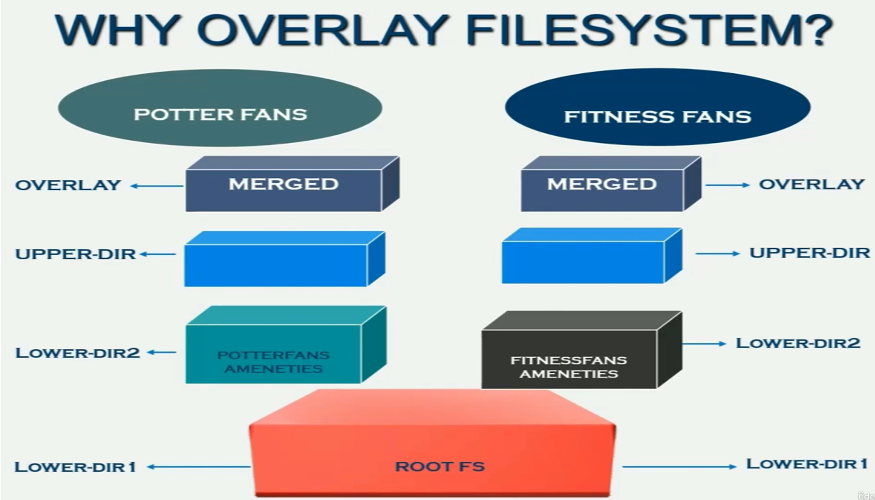

## Containers Under the Hood
- Instructor: Systems Guy

## Section 1: Introduction

### 1. Introduction

### 2. Our Journey


### 3. What is Containerization?

### 4. Course Setup
- https://www.virtualbox.org/wiki/Downloads

## Section 2: Namespace

### 5. Namespaces enable isolation

### 6. A very quick demo of namespace
- How to isolate environment from others?
- sudo unshare -p --fork --mount-proc

### 7. Where do we go from here?

### 8. Why do we need Namespaces? Understanding the problem

### 9. Namespaces - understanding the solution

### 10. Namespaces demo - the setup

### 11. Demo: Namespaces in action
- What processes are visible/invisible in each namespace?
- lsns: list of namespaces
- Demo:
```bash
$ lsns # lists the existing namespaces
        NS TYPE   NPROCS    PID USER   COMMAND
4026531834 time      119   5512 hpjeon /lib/systemd/systemd --user
4026531835 cgroup    119   5512 hpjeon /lib/systemd/systemd --user
...
$ ps w
...
 250968 pts/1    S      0:00 /bin/bash ./alice_potter_fan.sh
 250970 pts/1    S      0:00 /bin/bash ./connie_fitness_fan.sh
 250971 pts/1    S      0:00 /bin/bash ./bryan_fitness_fan.sh
...
$ readlink /proc/250968/ns/pid # find pid
pid:[4026531836]
$ readlink /proc/250970/ns/pid # find pid - 250970 and 250968 have the same namespace
pid:[4026531836]
```

### 12. Demo: PID namespaces
- How to separate namespaces?
- ls
```bash
$ lsns -t pid # the current namespace
        NS TYPE NPROCS    PID USER   COMMAND
4026531836 pid     115   5512 hpjeon /lib/syst
4026533579 pid       2 161899 hpjeon /usr/shar
$ sudo unshare -pf --mount-proc bash # new process fork running bash
# lsns -t pid # now we have a new NS
        NS TYPE NPROCS PID USER COMMAND
4026533344 pid       2   1 root bash
# ls /proc # only a few processes only
1           diskstats      kallsyms     modules       swaps
9           dma            kcore        mounts        sys
# ps -ef # system processes are not inherited
UID          PID    PPID  C STIME TTY          TIME CMD
root           1       0  0 08:43 pts/7    00:00:00 bash
root          10       1  0 08:45 pts/7    00:00:00 ps -ef

```
- --mount-proc: will produce a new /proc
- Parent NS has visibility on child NS
  - Parent can see the processes of Child
  - Child will not be able to see the processes of Parent

### 13. Assignment - Separate Namespace for Claude

### 14. Solution - Separate Namespace for Claude

### 15. Enter the namespace
- From child namespace
```bash
# ps w
    PID TTY      STAT   TIME COMMAND
      1 pts/7    S      0:00 bash
     20 pts/7    T      0:00 sleep 10
    100 pts/7    R+     0:00 ps w
```
- From parent namespace
```bash
$ ps -ef |grep sleep
root      324489    2413  0 08:33 ?        00:00:00 sleep 3600
root      329060  328223  0 08:47 pts/7    00:00:00 sleep 10
hpjeon    336731  327306  0 09:19 pts/1    00:00:00 grep --color=auto sleep
$ sudo nsenter -t 329060 -p -r ps ax # pid of sleep 10 above
[sudo] password for hpjeon:  # we get same results of child namespace
    PID TTY      STAT   TIME COMMAND
      1 pts/7    S+     0:00 bash
     20 pts/7    T      0:00 sleep 10
    101 pts/8    R+     0:00 ps ax
```

### 16. Mount and UTS namespace - the idea
- In addition to the isolation of namespace, we need to isolate folder access and resource
- UTS namespace: may have a different hostname

### 17. Mounting and mount points

### 18. Demo - mounting, mount points and  mount namespaces
```bash
$ findmnt /
TARGET SOURCE    FSTYPE OPTIONS
/      /dev/sda6 ext4   rw,relatime,errors=remount-ro
$ mkdir ~/Downloads/mnt
$ touch ~/Downloads/mnt/origin.txt
$ ls ~/Downloads/mnt/
origin.txt
$ sudo mount --bind  ~/Downloads/the_everglades/ ~/Downloads/mnt/
$ ls ~/Downloads/mnt/
... # origin.txt is NOT found
$ sudo umount ~/Downloads/mnt 
$ ls ~/Downloads/mnt
origin.txt
```
- Making a child NS
```bash
$ sudo unshare -fpm --mount-proc bash # -fpm, m for mount
# lsns -t pid -t mnt
        NS TYPE NPROCS PID USER COMMAND
4026533343 mnt       2   1 root bash
4026533344 pid       2   1 root bash
# sudo mount --bind Potter_Fans_Area/ ./Potter_Fans_Area/
# findmnt 
...
└─/home/hpjeon/Downloads/the_everglades/Potter_Fans_Area
                                /dev/sda6[/home/hpjeon/Downloads/the_everglades/Potter_Fans_Area]
# mkdir old_root
# pivot_root . ./old_root # pivot_root must execute on the mount point
```

### 19. The function of the --mount-proc flag - a visual
- `sudo unshare -fp --mount-proc bash`
  - `--mount-prc` does:
    - unmount /proc file system
    - mount new /proc file system
- Type of namespace
  - PID: isolates the process ID
  - MNT: isolates the mount point
  - NET: isolates the host network

### 20. Demo - understanding the --mount-proc flag in depth

### 21. PID and MNT namespaces - recap

### 22. Network Namespaces - Intro
- Network resources
  - Network devices (ethernet, loopback)
  - Rules (IP tables)
  - Routes (Routing table)
- Demo
```bash
$ ip link list
1: lo: <LOOPBACK,UP,LOWER_UP> mtu 65536 qdisc noqueue state UNKNOWN mode DEFAULT group default qlen 1000
...
2: enp3s0: <NO-CARRIER,BROADCAST,MULTICAST,UP> mtu 1500 qdisc fq_codel state DOWN mode DEFAULT group default qlen 1000
...
$ sudo iptables --list-rules
-P INPUT ACCEPT
-P FORWARD DROP
-P OUTPUT ACCEPT
-N DOCKER
-N DOCKER-ISOLATION-STAGE-1
...
$ ip r
default via 192.168.1.1 dev wlp4s0 proto dhcp metric 600 
169.254.0.0/16 dev wlp4s0 scope link metric 1000 
...
$ sudo unshare -pn --fork --mount-proc bash
# ip link list
1: lo: <LOOPBACK> mtu 65536 qdisc noop state DOWN mode DEFAULT group default qlen 1000
    link/loopback 00:00:00:00:00:00 brd 00:00:00:00:00:00
# ip r
#  #<-- nothing found
```
- Therefore, when we unshare, the network configuration of 1. device, 2. Rule, 3 route must be set appropriately

### 23. Demo: UTS and IPC namespaces
```bash
$ sudo unshare -fpiu --mount-proc bash
# lsns -t pid -t mnt -t uts -t ipc
        NS TYPE NPROCS PID USER COMMAND
4026532253 mnt       2   1 root bash
4026533157 uts       2   1 root bash
4026533158 ipc       2   1 root bash
4026533159 pid       2   1 root bash
```

### 24. The Alpine root filesystem
- In the isolated system, when root is made using pivot_root, there might be no /bin or /lib
- May copy from parent system. Or use alpine file system

### 25. Summarizing namespace
- Namespace
  - A feature of the Linux Kernel that helps with isolating certain system resources
  - So that a given set of processes has its own resources that only these process can see and access

| Name space | Resource isolated  |
|------------|--------------------|
| PID        | Process ID numbers |
| MNT        | Mount Points       |
| UTS        | Host Name          |
| IPC        | Message queues, shared memory, etc |
| NET        | Routing table, port numbers, etc |
| User       | User and group ID |
| CGROUP     | CGROUPS           |

### 26. Summary demo - namespace command and options
```bash
$ sudo unshare -puif --mount-proc bash
# lsns
        NS TYPE   NPROCS PID USER COMMAND
4026531834 time        2   1 root bash
4026531835 cgroup      2   1 root bash
4026531837 user        2   1 root bash
4026531840 net         2   1 root bash
4026533519 mnt         2   1 root bash
4026533520 uts         2   1 root bash
4026533521 ipc         2   1 root bash
4026533522 pid         2   1 root bash
# Note that cgroup, user, and net inherit from the parent
```

## Section 3: Overlay Filesystems

### 27. Overlay Filesystems: Introduction
- Containerization
  - An approach to isolating and bundling a application with all the dependencies and only those dependencies together, including any libraries, data and configuration files


### 28. Demo - How Overlay Filesystems work
```bash
# merged_dir is empty in the beginning
$ sudo mount -t overlay -o lowerdir=lower_dir,upperdir=upper_dir,workdir=work_dir/ none merged_dir
$ ls merged_dir/
dup.txt.gz  ll1.txt.gz  ll2.txt.gz  ul1.txt.gz  ul2.txt.gz # now merged_dir shows the sum of lower_dir and upper_dir contents
```
- Lower layer folder is read only
- All changes in merged_dir will show up in upper_dir

### 29. Overlay Filesystems - Multiple Directories in Lower Layer

### 30. Demo - Overlay FS with Multiple Directories in Lower Layer
- Multiple lower directories
```bash
$ sudo mount -t overlay -o lowerdir=lower_dir:lower-dir-2:lower-dir-3,upperdir=upper_dir,workdir=work_dir/ none merged_dir
```

### 31. Why do we need Overlay Filesystems?
- Copying root FS into every container might be a waste of space

  - Lower-dir: root FS + Read only lib specific to the container
  - Upper-dir: writable space
  - Work-dir: 

### 32. Demo Example - Why Overlay FS?

### 33. Demo - How Overlay FS helps with Containers
- sudo mount -t overlay -o lowerdir=alpine_root_dir/:Potter_Fans_Ameneties/:potter_fans/lower_dir/,upperdir=potter_fans/upper_dir/,workdir=potter_fans/work_dir/ none potter_fans/merged_dir/

### 34. Summary: Overlay FS and Namespaces


## Section 4: Cgroups

### 35. Cgroups - An introduction
- A mechanism provided by the Kernel to control how much of a certain resources can be consumed by a given process
  - Memory
  - Network
  - CPU
  - IO

### 36. Demo - Controlling Memory with Cgroups
- mem_hogger.py:
```py
import time
f = open('/dev/urandom','r', encoding='latin-1')
rand_data = ""
i = 0
one_MB = 1024*1024
four_MB = 1024*1024*4
while True:
    rand_data += f.read(four_MB)
    i += 4
    print("Number of Bytes read %dMB" %i)
    time.sleep(1)    
```
  - When memory hogging is slow (like 1MB), OS may remove the load little-by-little
- Demo:
```bash
$ sudo cgcreate -g memory:mem_limiter
$ ls /sys/fs/cgroup/
...
mem_limiter
...
$ sudo cgset -r memory.max=15M mem_limiter
$ cat /sys/fs/cgroup/mem_limiter/memory.max
15728640
$ sudo cgset -r memory.swap.max=15M mem_limiter
$ cat /sys/fs/cgroup/mem_limiter/memory.swap.max 
15728640
$ sudo cgexec -g memory:mem_limiter python3 /home/hpjeon/hw/class/udemy_containers/cgroup_examples/memory_hogger.py 
Number of Bytes read 4MB
Number of Bytes read 8MB
Number of Bytes read 12MB
Killed # when reaching 15MB, killed by CGROUP
```
- @Ubunt22, cgset -r memory.limit_in_bytes doesn't work

### 37. Demo - Controlling Memory Available to a Container
- Coupling namespace with cgroup
```bash
$ sudo cgexec -g memory:mem_limiter unshare -fp --mount-proc 
# python3 ./memory_hogger.py 
Number of Bytes read 1MB
...
Number of Bytes read 15MB
Number of Bytes read 16MB
Killed
```

### 38. Demo - Controlling CPU
- cpu_hogger.py:
```py
i=0
while(True):
   i+=1
```
- Demo:
```bash
$ sudo cgcreate -g cpu:cpu_limiter1
$ sudo cgset -r cpu.max=25000 cpu_limiter1
# default of cpu.max=100000
$ sudo cgexec -g cpu:cpu_limiter1 python3 ./cpu_hogger.py 
$ sudo cgdelete cpu:cpu_limiter1 # deleting the cgroup
```

- The value of cpu.max might be changed dynamically

### 39. Demo - Controlling CPU with cpu.shares
- How to run 2 processes run on the same cpu core?
```bash
$ sudo cgcreate -g cpu:cpu_limiter1
$ sudo cgcreate -g cpu:cpu_limiter2
$ sudo cgcreate -g cpuset:cpu_limiter_set
$ sudo cgset -r cpuset.cpus=0 cpu_limiter_set # enforces to use cpu=0
$ sudo cgset -r cpuset.mems=0 cpu_limiter_set
$ sudo cgexec -g cpu:cpu_limiter1 -g cpuset:cpu_limiter_set python3 cpu_hogger1.py 
$ sudo cgexec -g cpu:cpu_limiter2 -g cpuset:cpu_limiter_set python3 cpu_hogger2.py 
```

- As 2 processes run on cpu=0, they consume 50% each
- cpu.share is not found in /sys/fs/cgroup/cpu_limiter1/ of Ubuntu22
  - Ubuntu22 has cgroup v2
  - Cannot adjust as 75% vs 25% as shown in demo

### 40. A note about the examples used for CPU Cgroups

### 41. Demo - Controlling CPU available to a container
```bash
$ sudo cgcreate -g cpu:db_cpu_limiter
$ sudo cgset -r cpu.max=60000 db_cpu_limiter
$ sudo cgexec -g cpu:db_cpu_limiter unshare -fp --mount-proc bash
```

### 42. Using cpu.shares with containers - example scenarios for the demo

### 43. Demo: controlling CPU available to a container using cpu.shares
- cpu.shares: max 1024
  - May not be a hard-limit

### 44. Summary - namespaces, overlay FS and Cgroups
- At the heart of any container:
  - Overlay FS
  - Cgroups
  - Namespaces
  
## Section 5: Docker

### 45. Why do we need Containers?
- Maintaining identical environments for dev/test/production
- Scaling the applications

### 46. Demo - Docker Introduction
- What is docker?
  - An open source platform that enables developers to easily build, deploy, and manage the containerized applications
- Build docker image
  - docker build -t potter-fans -f PotterFansDockerFile .
  - docker images
```bash
  REPOSITORY    TAG       IMAGE ID       CREATED         SIZE
potter-fans   latest    cd3659e2f6be   8 seconds ago   78.1MB
```
- PotterFansDockerFile:
```yaml
FROM ubuntu
COPY alice_potter_fan.sh .
COPY sam_potter_fan.sh .
COPY start_potter_fans.sh .
RUN mkdir ameneties    # make a folder at lower-dir
COPY Potter_Fans_Ameneties/* ./ameneties  # copy files at upper-dir
CMD ["./start_potter_fans.sh"]
```
- Running docker image
  - docker run --name potter-fans-container --hostname YellowStone potter-fans
- Enter into the running docker image
  - docker exec -it potter-fans-container bash

### 47. Container for our 'Fitness Fans' Group
- ./make_fitness_fans_area.sh 2> /dev/null
  - `2> /dev/null` means standard error into /dev/null
  - 0 for standard input (STDIN), 1 for standard output (STDOUT), 2 for standard error (STDERR)
- From other terminal, jump into the running NS
  - sudo nsenter -t __PID__ -a 
    = ___PID__ is found from top command - find the running process
- FitnessFansDockerFile:
```yaml
FROM ubuntu
COPY connie_fitness_fan.sh .
COPY bryan_fitness_fan.sh .
COPY start_fitness_fans.sh .
RUN mkdir ameneties
COPY Fitness_Fans_Ameneties/* ./ameneties
CMD ["./start_fitness_fans.sh"]
```
- docker build -t fitness-fans -f FitnessFansDockerFile .
```bash
$ docker images
REPOSITORY     TAG       IMAGE ID       CREATED          SIZE
fitness-fans   latest    d733a214366d   11 seconds ago   78.1MB
potter-fans    latest    cd3659e2f6be   14 minutes ago   78.1MB
```

### 48. Dissecting Container Images - How it relates to Overlay FS
- Container image
  - A standalone, executable package that contains all the dependencies and configuration settings needed to run an application, including the operating system, application code, libraries and language runtime, among other dependencies

### 49. Demo - Dissecting Container Images
```bash
$ docker image inspect potter-fans:latest 
...
       "GraphDriver": {
            "Data": {
                "LowerDir": "/var/lib/docker/overlay2/lsj5mk01kleuizf8574ju8vbj/diff:/var/lib/docker/overlay2/smhwtvqhheo1scgo8kst076bs/diff:/var/lib/docker/overlay2/d90fp208jjbjhlp5wmpx28uba/diff:/var/lib/docker/overlay2/xfhbecubqflx1f3lvsgkuf2jo/diff:/var/lib/docker/overlay2/a5d0f4466a85e9ed732ab725c285245ece2248d0f27fd43e196d738340606c8b/diff",
                "MergedDir": "/var/lib/docker/overlay2/zgdg7tqt25uj0dn9yvzyixgtf/merged",
                "UpperDir": "/var/lib/docker/overlay2/zgdg7tqt25uj0dn9yvzyixgtf/diff",
                "WorkDir": "/var/lib/docker/overlay2/zgdg7tqt25uj0dn9yvzyixgtf/work"
            },
...            
$ sudo ls /var/lib/docker/overlay2/a5d0f4466a85e9ed732ab725c285245ece2248d0f27fd43e196d738340606c8b/diff
bin  boot  dev	etc  home  lib	lib64  media  mnt  opt	proc  root  run  sbin  srv  sys  tmp  usr  var
$ sudo ls /var/lib/docker/overlay2/lsj5mk01kleuizf8574ju8vbj/diff/ameneties # lower-dir
$   # empty
$ sudo ls /var/lib/docker/overlay2/zgdg7tqt25uj0dn9yvzyixgtf/diff/ameneties # upper-dir
Burgers_and_Fries  Potter_Ent_Center  Potter_Hangout_Area # contents exist as they are copied from PotterFansDockerFile (2nd last line)
```

### 50. Image Layering in Depth
- Docker layer ordering may matter


- Explain why this is inefficient than the first one

### 51. Demo - Image Layering
```bash
$ docker rmi $(docker images -a -q) # Delete all docker images
$ more DockerFileApp1
FROM alpine:3.6
RUN apk add --no-cache python3
RUN apk add --no-cache g++
COPY hello-world.py .
RUN adduser -D dummyuser
USER dummyuser
CMD ["python3","./hello-world.py"]
$ docker build -t app1 -f DockerFileApp1 .
$ docker images -a
REPOSITORY   TAG       IMAGE ID       CREATED              SIZE
app1         latest    2080623da20c   About a minute ago   210MB
```

### 52. Demo - More on Image Layering
- How docker images using existing ones?
```bash
$ more DockerFileApp2 
FROM alpine:3.6
RUN apk add --no-cache python3
COPY hello-docker.py .
CMD ["python3","./hello-docker.py"]
$ docker build -t app2 -f DockerFileApp2 . # took 2.5 secs
$ docker images -a
REPOSITORY   TAG       IMAGE ID       CREATED          SIZE
app2         latest    d40d7dfb8ec8   19 seconds ago   61.3MB
app1         latest    2080623da20c   12 minutes ago   210MB
$ docker image inspect app2 
...
        "GraphDriver": {
            "Data": {
                "LowerDir": "/var/lib/docker/overlay2/7b76vabu0v7ggbgwkz5e6ojm4/diff:/var/lib/docker/overlay2/3f637bde0c09b9b5fd4937339d14110e0337fef2be7b65ee613dcae3236adf20/diff", # they are from app1, which already exists. This is why building app2 image is fast
# let's modify docker file as:
$ cat DockerFileApp2 
FROM alpine:3.6
COPY hello-docker.py . # copy comes first 
RUN apk add --no-cache python3
CMD ["python3","./hello-docker.py"]
$ /usr/bin/time docker build -t app2 -f DockerFileApp2 . # took 15.7 secs
```
- After changing the order, new overlay FS is made and added, consuming more resources

### 53. Demo - Resource Allocation in Docker
```bash
$ docker build -t mem-hogger -f DockerFileMemHogger .
# Applying memory constraint
$ docker run --name mem-hogger-contr --memory=175m --memory-swap=175m mem-hogger
$ docker build -t cpu-hogger1 -f DockerFileCPUHogger1 .
# Applying cpu constraint
$ docker run --name cpu-hogger1-contr --cpu-period=100000 --cpu-quota=75000 -d cpu-hogger1
$ docker container stop cpu-hogger1-contr # stop the running container
$ docker container ls -a # list of all containers
$ docker container rm cpu-hogger1-contr # delete the container
```

### 54. Demo - Controlling CPU resource using cpu.shares
- docker run --name cpu-hogger1c --cpu-shares=512 --cpuset-cpus=0 -d cpu-hogger1
- docker run --name cpu-hogger2c --cpu-shares=512 --cpuset-cpus=0 -d cpu-hogger2


### 55. Summary

### 56. Demo - Recap of Docker commands
- docker build -t cpu-hogger1 -f DockerFileCPUHogger1 .
- docker images
- docker images -a 
- docker image inspect cpu-hogger1:latest
- docker run --name cpu-hogger1c --cpu-period=100000 --cpu-quota=50000 -d cpu-hogger1 
- docker container ls
- docker ps
- docker containter stop cpu-hogger1c
- docker container rm cpu-hogger1c
- docker rmi cpu-hogger1


## Section 6: Kubernetes

### 57. The idea of a Pod
- A collective deployment of multiple containers
  - Mostly a single container though
  - IPC enabled
  - IP address included

### 58. Why do we need Kubernetes?

### 59. Demo - Creating a Pod with just Namespaces - Part 1
- Terminal 1: Creating a pod NS
  - sudo unshare -fpui --mount-proc bash
- Terminal 2: Creating nested NS for container1
  - sudo nsenter -t __PID__ -a # __PID__ from the bash of a pod NS
  - lsns #  check that NS is that of a pod NS
  - sudo unshare -fp --mount-proc bash
- Terminal 3: Creating nested NS for container2
  - sudo nsenter -t __PID__ -a # __PID__ from the bash of a pod NS
  - lsns #  check that NS is that of a pod NS
  - sudo unshare -fp --mount-proc bash

### 60. Demo - Creating a Pod with just Namespaces - Part 2
- sudo mount --bind container1 container1
 - cd container1
 - sudo pivot_root . old_root/
- sudo mount --bind container2 container2
 - cd container2
 - sudo pivot_root . old_root/
- Isolate container1 and container2 from each other
- When the NS of the pod exits, children NS will be terminated automatically

### 61. Kublet, Pod and the Container Runtime
- Kublet: scheduling and executing pods on each node
- If previous minikub exists, `minikube delete; minikube purge`
```bash
$ minikube start
😄  minikube v1.25.2 on Ubuntu 22.04
🎉  minikube 1.34.0 is available! Download it: https://github.com/kubernetes/minikube/releases/tag/v1.34.0
💡  To disable this notice, run: 'minikube config set WantUpdateNotification false'
✨  Using the docker driver based on existing profile
👍  Starting control plane node minikube in cluster minikube
🚜  Pulling base image ...
...
🌟  Enabled addons: default-storageclass, storage-provisioner
🏄  Done! kubectl is now configured to use "minikube" cluster and "default" namespace by default
$ kubectl run hellow-world --image=hello-world --restart=Never
pod/hellow-world created
$ kubectl get pods
NAME           READY   STATUS      RESTARTS   AGE
hellow-world   0/1     Completed   0          28s
$ eval $(minikube docker-env) # workflow optimization. To see what this does, run minikube docker-env
$ cat DockerFileApp1 
FROM alpine:3.6
RUN apk add --no-cache python3
COPY hello-world.py .
CMD ["python3","./hello-world.py"]
$ docker build -t my-first-pod-image  -f DockerFileApp1 . 
$ kubectl run my-first-pod --image=my-first-pod-image --image-pull-policy=Never --restart=Never
pod/my-first-pod created
$ kubectl get pods
NAME           READY   STATUS      RESTARTS   AGE
hellow-world   0/1     Completed   0          10m
my-first-pod   1/1     Running     0          6s
$ kubectl exec my-first-pod  -it -- sh
/ # ls
TestFile.txt    etc             lib             proc            sbin            tmp
bin             hello-world.py  media           root            srv             usr
dev             home            mnt             run             sys             var
```
- No YAML?
  - All parameters are from CLI here

### 62. ReplicaSets - What and Why?
- For redundancy, many instances may need to run
  - How do we tell K9 how many of pods run?
  - ReplicaSet
- YAML file
```yaml
APIVersion: v1
KIND: POD
METDATA:
  NAME: HELLO-WORLD_POD
  LABELS:
    TIER: FRONT-END
  SPEC:
    CONTAINERS:
    - NAME: HELLO-WORLD-CONTAINER
      IMAGE: HELLO-WORLD-IMAGE
      IMAGEPULLPOLICY: NEVER
    RESTARTPOLICY: NEVER
```
### 63. Demo - Replica Sets
```bash
$ more hello-world-pod.yml 
apiVersion: v1
kind: Pod
metadata:
    name: hello-world-pod
    labels:
      tier: front-end
spec:
  containers:
  - name: hello-world-container
    image: hello-world
    imagePullPolicy: Never
  restartPolicy: Never
  $ kubectl apply -f hello-world-pod.yml 
pod/hello-world-pod created
$ kubectl get pods
NAME              READY   STATUS      RESTARTS   AGE
hello-world-pod   0/1     Completed   0          2m15s
hellow-world      0/1     Completed   0          33m
my-first-pod      0/1     Completed   0          22m
# 
# Replica set below
$ docker build -t sleeping-app-image -f SleepingDockerFile .
$ cat sleeping-pod-replicas.yml 
apiVersion: apps/v1
kind: ReplicaSet
metadata:
  name: my-replica-set
spec:
  selector:
    matchLabels:
      app-name: sleeping-app
  replicas: 3
  template:
    metadata:
      labels:
        app-name: sleeping-app
    spec:
      containers:
      - name: sleeping-app-container
        image: sleeping-app-image
        imagePullPolicy: Never
$ kubectl apply -f sleeping-pod-replicas.yml
replicaset.apps/my-replica-set created
$ kubectl get rs
NAME             DESIRED   CURRENT   READY   AGE
my-replica-set   3         3         0       5s  # 3 replica sets
$ kubectl scale rs --replicas=5 my-replica-set # extend as 5
replicaset.apps/my-replica-set scaled
$ kubectl get rs
NAME             DESIRED   CURRENT   READY   AGE
my-replica-set   5         5         3       39s  # finds 5
$ kubectl get pods
NAME                   READY   STATUS      RESTARTS   AGE
hello-world-pod        0/1     Completed   0          11m
hellow-world           0/1     Completed   0          43m
my-first-pod           0/1     Completed   0          32m
my-replica-set-56nrl   1/1     Running     0          50s
my-replica-set-hg8jk   1/1     Running     0          13s
my-replica-set-jvmz4   1/1     Running     0          50s
my-replica-set-l2zfz   1/1     Running     0          13s
my-replica-set-tcw4c   1/1     Running     0          50s  # 5 of them are running
$ kubectl delete pods my-replica-set-jvmz4 # accidentally deleting one pod
pod "my-replica-set-jvmz4" deleted
$ kubectl get pods
NAME                   READY   STATUS      RESTARTS   AGE
hello-world-pod        0/1     Completed   0          14m
hellow-world           0/1     Completed   0          45m
my-first-pod           0/1     Completed   0          34m
my-replica-set-56nrl   1/1     Running     0          3m17s
my-replica-set-hg8jk   1/1     Running     0          2m40s
my-replica-set-l2zfz   1/1     Running     0          2m40s
my-replica-set-nlsc7   1/1     Running     0          36s
my-replica-set-tcw4c   1/1     Running     0          3m17s  # stil 5 of them run
```

### 64. Deployments - What and Why?
- How to upgrade pods in multiple nodes, running with replca set?

### 65. Demo - Deployments
```bash
$ cat sleeping-pod-deployment.yml
apiVersion: apps/v1
kind: Deployment
metadata:
  name: my-deployment
spec:
  selector:
    matchLabels:
      app-name: sleeping-app
  replicas: 6
  template:
    metadata:
      labels:
        app-name: sleeping-app
    spec:
      containers:
      - name: sleeping-app-container
        image: sleeping-app-image-100
        imagePullPolicy: Never
$ docker build -t sleeping-app-image-100 -f SleepingDockerFile .
$ docker build -t sleeping-app-image-200 -f SleepingDockerFile .
$ kubectl apply -f sleeping-pod-deployment.yml 
deployment.apps/my-deployment created
$ kubectl get pods
NAME                             READY   STATUS              RESTARTS   AGE
hello-world-pod                  0/1     Completed           0          26m
hellow-world                     0/1     Completed           0          57m
my-deployment-68cd6db9b6-8kfkh   0/1     ContainerCreating   0          9s
my-deployment-68cd6db9b6-cqt98   0/1     ContainerCreating   0          8s
my-deployment-68cd6db9b6-d2zqf   0/1     ContainerCreating   0          9s
my-deployment-68cd6db9b6-s82f4   0/1     ContainerCreating   0          8s
my-deployment-68cd6db9b6-scnzg   0/1     ContainerCreating   0          8s
my-deployment-68cd6db9b6-x7ccx   0/1     ContainerCreating   0          9s
my-first-pod                     0/1     Completed           0          46m
# updating docker images
 kubectl set image deployment/my-deployment sleeping-app-container=sleeping-app-image-200
deployment.apps/my-deployment image updated
$ kubectl get pods
NAME                             READY   STATUS        RESTARTS   AGE
hello-world-pod                  0/1     Completed     0          29m
hellow-world                     0/1     Completed     0          60m
my-deployment-5b6b45b745-9c5kc   1/1     Running       0          20s # running new pods
my-deployment-5b6b45b745-hxwgr   1/1     Running       0          28s
my-deployment-5b6b45b745-jr54x   1/1     Running       0          18s
my-deployment-5b6b45b745-lhkq6   1/1     Running       0          27s
my-deployment-5b6b45b745-mrm2t   1/1     Running       0          16s
my-deployment-5b6b45b745-skzkv   1/1     Running       0          28s
my-deployment-68cd6db9b6-8kfkh   1/1     Terminating   0          3m36s # terminating old pods
my-deployment-68cd6db9b6-cqt98   1/1     Terminating   0          3m35s
my-deployment-68cd6db9b6-d2zqf   1/1     Terminating   0          3m36s
my-deployment-68cd6db9b6-s82f4   1/1     Terminating   0          3m35s
my-deployment-68cd6db9b6-scnzg   1/1     Terminating   0          3m35s
my-deployment-68cd6db9b6-x7ccx   1/1     Terminating   0          3m36s
my-first-pod                     0/1     Completed     0          50m
$ kubectl rollout status deployment/my-deployment
deployment "my-deployment" successfully rolled out
$ kubectl rollout undo deployment/my-deployment # ollback to the previous image
deployment.apps/my-deployment rolled back
$ kubectl get pods
NAME                             READY   STATUS        RESTARTS   AGE
hello-world-pod                  0/1     Completed     0          33m
hellow-world                     0/1     Completed     0          64m
my-deployment-5b6b45b745-9c5kc   1/1     Terminating   0          4m13s
my-deployment-5b6b45b745-hxwgr   1/1     Terminating   0          4m21s
my-deployment-5b6b45b745-jr54x   1/1     Terminating   0          4m11s
my-deployment-5b6b45b745-mrm2t   1/1     Terminating   0          4m9s
my-deployment-5b6b45b745-skzkv   1/1     Terminating   0          4m21s
my-deployment-68cd6db9b6-4g486   1/1     Running       0          25s
my-deployment-68cd6db9b6-9tb7r   1/1     Running       0          36s
my-deployment-68cd6db9b6-cxncv   1/1     Running       0          36s
my-deployment-68cd6db9b6-f6sfn   1/1     Running       0          26s
my-deployment-68cd6db9b6-hz8vm   1/1     Running       0          28s
my-deployment-68cd6db9b6-s88j8   1/1     Running       0          36s
my-first-pod                     0/1     Completed     0          54m
```

### 66. Kubernetes Control Plane
- K9 workflow
  - Deployment <- Deployment controller
  - Replicaset <- Reclicaset controller
  - Front-end POD <- Scheduler and Kubelet


### 67. Demo - Controlling Memory - Cgroups behind the scenes
- mem-hogger-pod.yml;
```yml
apiVersion: v1
kind: Pod
metadata:
    name: mem-hogger-pod
    labels:
      tier: back-end
spec:
  containers:
  - name: mem-hogger-container
    image: mem-hogger-image
    imagePullPolicy: Never
    resources:
      requests:
        memory: "50Mi"
      limits:
        memory: "125Mi"
  restartPolicy: Never
```

### 68. Demo - Controlling CPU - Cgroups behind the scenes 
- cpu-hogger1-pod.yml:
```yml
apiVersion: v1
kind: Pod
metadata:
    name: cpu-hogger1-pod
    labels:
      tier: back-end
spec:
  containers:
  - name: cpu-hogger1-container
    image: cpu-hogger1-image
    imagePullPolicy: Never
    resources:
      requests:
        cpu: "250m"
      limits:
        cpu: "500m"
  restartPolicy: Never
```

## Section 7: Course Recap

### 69. Recap and Waht's to come
- Namespaces
  - Isolation - essence of containerization
- Overlay FS
  - Share resources b/w containers
- Cgroups
  - Control resource allocation - cpu, memory, network, etc
- Dockers
  - Makes containerization easier
  - Images layering - overlay FS
  - Resource allocation - cgroups
-  Kubernetes
  - Idea of a pod
  - Creates pods, replica sets, deployments
  - Control plane
  - Controlling pod resouces - cgroups

## Section 8: Bonus Video - User Namespaces

### 70. User namespaces - Introduction
```bsah
$ unshare -U bash
$ id
uid=65534(nobody) gid=65534(nogroup) groups=65534(nogroup)
```
```bash
$ sudo cat /proc/$$/uid_map
         0          0 4294967295
```
- `$$` for the current process (=bash)

### 71. More user namespaces
- sudo echo 'deny' > /proc/__PID__/setgroups
- sudo echo '0 1002 1' > /proc/__PID__/gid_map
