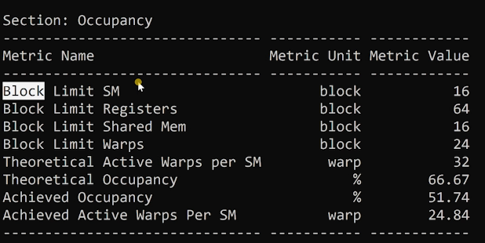
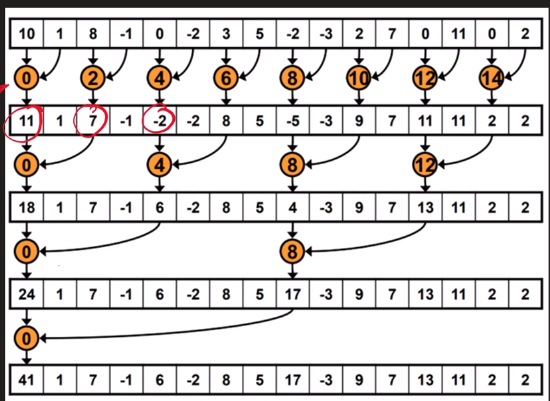
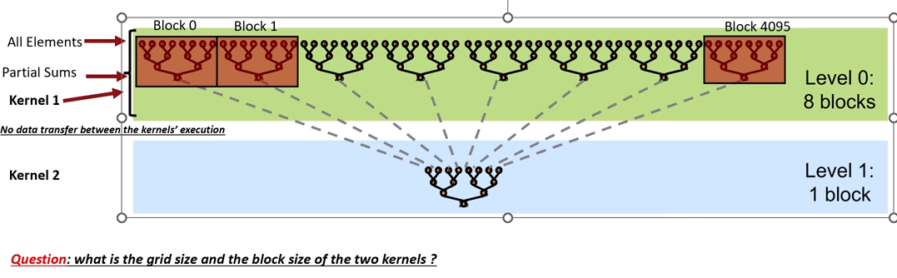
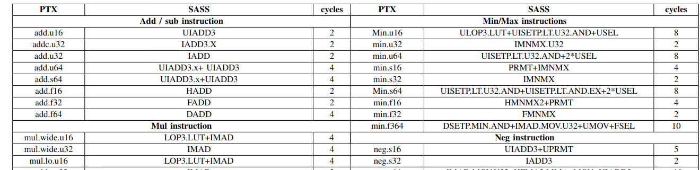
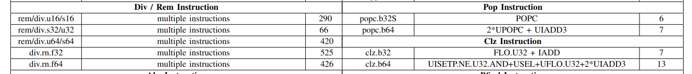

## CUDA Parallel Programming on NVIDIA GPUs (HW and SW)
- Instructor: Hamdy Sultan

## Section 1: Introduction to the Nvidia GPUs HW

### 1. GPU vs CPU
- CPU
  - Powerful ALU
  - Large Cache memroy per ALU
  - Good for sequential applications
- GPU
  - Thousands of small ALUs
  - Small caches per core
  - Good for parallelized applications
- GPU hardware in general
  - L1 cache inside of SM
  - L2 cache outside of SM

### 2. Nvidia's history

### 3. Architecture and Generations relationship

| Category | designed for | Generations  | GPU examples |
|----------|--------------|--------------|----------|
| Standard | Normal users | Tegra, GeForce, Quadro | RTX xxxx |
| HPC GPUs | HPC          | Tesla        | H100, A100, V100 |


### 4. How to know the Architecture and Generation
- https://www.techpowerup.com/gpu-specs/a100-pcie-40-gb.c3623
- No fan on Tesla cards

### 5. The difference b/w the GPU and the GPU chip

### 6. The architectures and the corresponding chips

### 7. Nvidia GPU architectures from Fermi to Hopper

### 8. Parameters rquired to compare b/w different architectures
- Memory bandwidth (memory speed + bus width)
- Throughput TFLOPS (core count + speed)
- New features (new data type such as tensor cores)

### 9. Half, single and double precision operations

### 10. Compute capability and utilizations of the GPUs
- CC (Comput capability) number

|Architecture |  year | cc| 
|-------------|-------|---|
| Pascal      | 2016 | 6.0-6.2|
| Volta       | 2017 | 7.0 |
| Turing      | 2018 | 7.5 |
| Ampere      | 2020 | 8.0 |
| Hopper      | 2022 | 9.0 |

- Each CC determines the compatible CUDA version
- PTX programming compatability
  - Some PTX instructions require specific CC


### 11. Before reading any whitepapers !! look at this

### 12. Volta+Ampere+Pascal+SIMD

## Section 2: Installing Cuda and other programs

### 13. What features installed with the CUDA toolkit?
- CUDA compiler (nvcc)
  - Converts CUDA codes into PTX codes
- CUDA libararies
  - cuBLAS
  - cuFFT
  - cuRAND
  - cuDNN
- CUDA runtime and driver APIs
  - cudaMalloc()
  - cudaMemcpy()
- Nvidia tools for debugging and performance analysis
  - Nvidia Nsight systems
  - Nvidia Nsigt compute
  - cuda-gdb
  - cuda-memcheck

### 14. Installing CUDA on Windows

### 15. Installing WSL to use Linux on windows OS

### 16. Installing CUDA toolkits on Linux
- At Ubunt 22.04
  - sudo apt autoremove
  - sudo apt install nvidia-driver-565

## Section 3: Introduction toi CUDA programming

### 17. The course github repo
- https://github.com/hamdysoltan/CUDA_Course

### 18. Mapping SW from CUDA to HW + Introducing CUDA
- GPU is composed of many SMs
- SM is partitioned into 4 parts
- Each partition is composed of many cores
  - Warp scheduler is located inside of each partition
- We begin from configuring block or thread block
- GigaThread: manages blocks to SMs
  - GigaThread engine sits in the entire GPU

### 19. 001 Hello World program (threads - Blocks)
```c
#include "cuda_runtime.h"
#include "device_launch_parameters.h"
#include <stdio.h>
__global__ void test01()
{
  printf("\nThe block ID = %d --- the thread ID = %d\n", blockIdx.x, threadIdx.x);
}
int main()
{
  // kernel_name <<< num_of_blocks, num_of_threads_per_block >>>();
  test01 <<<2,8>>>(); 
  cudaDeviceSynchronize(); // this is missing from the lecture
  cudaDeviceReset(); // this is missing from lecture
  return 0;
}
```
- Demo:
```bash
$ nvcc ch19.cu 
$ ./a.out 
The block ID = 0 --- the thread ID = 0
The block ID = 0 --- the thread ID = 1
The block ID = 0 --- the thread ID = 2
The block ID = 0 --- the thread ID = 3
The block ID = 0 --- the thread ID = 4
The block ID = 0 --- the thread ID = 5
The block ID = 0 --- the thread ID = 6
The block ID = 0 --- the thread ID = 7
The block ID = 1 --- the thread ID = 0
The block ID = 1 --- the thread ID = 1
The block ID = 1 --- the thread ID = 2
The block ID = 1 --- the thread ID = 3
The block ID = 1 --- the thread ID = 4
The block ID = 1 --- the thread ID = 5
The block ID = 1 --- the thread ID = 6
The block ID = 1 --- the thread ID = 7
```
- Results might not be ordered
- `test01 <<<1,2048>>>();`  doesn't work as the Max Thread Block Size is 1024
- Max Thread Block per SM is 32
```bash
$ ./deviceQuery 
./deviceQuery Starting...
 CUDA Device Query (Runtime API) version (CUDART static linking)
Detected 1 CUDA Capable device(s)
Device 0: "NVIDIA GeForce GT 1030"
  CUDA Driver Version / Runtime Version          12.7 / 11.1
  CUDA Capability Major/Minor version number:    6.1
  Total amount of global memory:                 1993 MBytes (2089943040 bytes)
  ( 3) Multiprocessors, (128) CUDA Cores/MP:     384 CUDA Cores
  GPU Max Clock rate:                            1468 MHz (1.47 GHz)
  Memory Clock rate:                             3004 Mhz
  Memory Bus Width:                              64-bit
  L2 Cache Size:                                 524288 bytes
  Maximum Texture Dimension Size (x,y,z)         1D=(131072), 2D=(131072, 65536), 3D=(16384, 16384, 16384)
  Maximum Layered 1D Texture Size, (num) layers  1D=(32768), 2048 layers
  Maximum Layered 2D Texture Size, (num) layers  2D=(32768, 32768), 2048 layers
  Total amount of constant memory:               65536 bytes
  Total amount of shared memory per block:       49152 bytes
  Total number of registers available per block: 65536
  Warp size:                                     32
  Maximum number of threads per multiprocessor:  2048
  Maximum number of threads per block:           1024
  Max dimension size of a thread block (x,y,z): (1024, 1024, 64)
  Max dimension size of a grid size    (x,y,z): (2147483647, 65535, 65535)
  Maximum memory pitch:                          2147483647 bytes
  Texture alignment:                             512 bytes
  Concurrent copy and kernel execution:          Yes with 2 copy engine(s)
  Run time limit on kernels:                     Yes
  Integrated GPU sharing Host Memory:            No
  Support host page-locked memory mapping:       Yes
  Alignment requirement for Surfaces:            Yes
  Device has ECC support:                        Disabled
  Device supports Unified Addressing (UVA):      Yes
  Device supports Compute Preemption:            Yes
  Supports Cooperative Kernel Launch:            Yes
  Supports MultiDevice Co-op Kernel Launch:      Yes
  Device PCI Domain ID / Bus ID / location ID:   0 / 1 / 0
  Compute Mode:
     < Default (multiple host threads can use ::cudaSetDevice() with device simultaneously) >
deviceQuery, CUDA Driver = CUDART, CUDA Driver Version = 12.7, CUDA Runtime Version = 11.1, NumDevs = 1
Result = PASS
```

### 20. Compiling CUDA on Linux
- Without `cudaDeviceSynchronize();`, CPU code will finish the exe without waiting for GPU

### 21. 002 Hello World program (Warp_IDs)
- Grid - Thread block - warp - thread
- Number of threads in a block / 32 = number of warps in a block
```c
  int warp_id = 0;
  warp_id = threadIdx.x/32;
```
- When multiple blocks are used, warp_id will be repeated in other blocks

### 22. 003: Vector addition + the steps for any CUDA project
- Adding two vector with 1024 elements each
```c
#include "cuda_runtime.h"
#include "device_launch_parameters.h"
#include <stdio.h>
#define SIZE 1024
__global__ void vectorAdd(int * A, int *B, int *C, int n) 
{
  C[threadIdx.x] = A[threadIdx.x] + B[threadIdx.x];
}
int main()
{
  int *A, *B, *C;
  int *d_A, *d_B, *d_C;
  int nsize = SIZE * sizeof(int);
  A = (int*) malloc(nsize);
  B = (int*) malloc(nsize);
  C = (int*) malloc(nsize);
  cudaMalloc((void**) &d_A, nsize);
  cudaMalloc((void**) &d_B, nsize);
  cudaMalloc((void**) &d_C, nsize);
  for (int i=0; i<SIZE;i++)
  {
    A[i] = i;
    B[i] = SIZE - i;
  }
  cudaMemcpy(d_A, A, nsize, cudaMemcpyHostToDevice);
  cudaMemcpy(d_B, B, nsize, cudaMemcpyHostToDevice);
  vectorAdd<<<1,1024>>>(d_A, d_B, d_C, SIZE);
  cudaMemcpy(C, d_C, nsize, cudaMemcpyDeviceToHost);
  for (int i=0; i<SIZE;i++) printf("%d + %d =  %d\n", A[i], B[i], C[i]);
  free(A); free(B); free(C);
  cudaFree(d_A); cudaFree(d_B); cudaFree(d_C);
  cudaDeviceSynchronize();
  cudaDeviceReset();
  return 0;
}
```

### 23. 004: Vector addition + blocks and thread indexing + GPU performance
- Repeat the above problem but having 2048 arrays
```c
#include "cuda_runtime.h"
#include "device_launch_parameters.h"
#include <stdio.h>
#include <cuda.h>
#define SIZE 2048
__global__ void vectorAdd(int * A, int *B, int *C, int n) 
{
  int id = blockIdx.x*blockDim.x + threadIdx.x;
  C[id] = A[id] + B[id];
}
int main()
{
  int *A, *B, *C;
  int *d_A, *d_B, *d_C;
  int nsize = SIZE * sizeof(int);
  A = (int*) malloc(nsize);
  B = (int*) malloc(nsize);
  C = (int*) malloc(nsize);
  cudaMalloc((void**) &d_A, nsize);
  cudaMalloc((void**) &d_B, nsize);
  cudaMalloc((void**) &d_C, nsize);
  for (int i=0; i<SIZE;i++)
  {
    A[i] = i;
    B[i] = SIZE - i;
  }
  cudaMemcpy(d_A, A, nsize, cudaMemcpyHostToDevice);
  cudaMemcpy(d_B, B, nsize, cudaMemcpyHostToDevice);
  cudaEvent_t start, stop;
  cudaEventCreate(&start);
  cudaEventCreate(&stop);
  cudaEventRecord(start);
  vectorAdd<<<8,256>>>(d_A, d_B, d_C, SIZE);
  cudaEventRecord(stop);
  cudaMemcpy(C, d_C, nsize, cudaMemcpyDeviceToHost);
  cudaEventSynchronize(stop);
  float millisec = 0;
  cudaEventElapsedTime(&millisec,start,stop);
  printf("Execution time = %f millisec\n", millisec);
  //for (int i=0; i<SIZE;i++) printf("%d + %d =  %d\n", A[i], B[i], C[i]);
  free(A); free(B); free(C);
  cudaFree(d_A); cudaFree(d_B); cudaFree(d_C);
  cudaDeviceSynchronize();
  cudaDeviceReset();
  return 0;
}
```
- How many SMs will be used?
  - Case 1
    - <<<2,1024>>> 
    - 2 blocks, tbp = 1024
    - Uses 2 SMs
- How to increase the number of SMs allocated?
  - Needs to increase the block numbers or grid size
  - As min tbp is 32, max block size would be 64
- At GT1030, using 1024x1024 vectors
  - `<<<<8192,128>>>>` took 0.379680 millisec
  - `<<<<4096,256>>>>` took 0.329760 millisec - the BEST!
  - `<<<<2048,512>>>>` took 0.359072 millisec
  - `<<<1024,1024>>>` took 3.400064 millisec

### 24. 005 levels of parallelization - Vector addition with Extra-large vectors
- Extra large vector size
  - 1024x1024x1024 array?
  - Larger than GPU memory
  - Divide and conquer

## Section 4: Profiling

### 25. Query the device properties usign the Runtime APIs
- GPU's limits/constraints such as max number of threads per block
  - cudaGetDeviceProperties(&deviceProp, dev);
- APIs provide functions to handle such queries
```c
#include <stdio.h>
int main() {
    int nDevices;
    cudaGetDeviceCount(&nDevices);
    for (int i = 0; i < nDevices; i++) {
        cudaDeviceProp prop;
        cudaGetDeviceProperties(&prop, i);
        printf("  Device Number: %d\n", i);
        printf("  Device name: %s\n", prop.name);
        printf("  Memory Clock Rate (KHz): %d\n",
               prop.memoryClockRate);
        printf("  Memory Bus Width (bits): %d\n",prop.memoryBusWidth);
        printf("  Peak Memory Bandwidth (GB/s): %f\n\n",
               2.0*prop.memoryClockRate*(prop.memoryBusWidth/8)/1.0e6);
        printf("  Total global memory: %lu\n", prop.totalGlobalMem);
        printf("  Compute capability: %d.%d\n",
               prop.major, prop.minor);
        printf("  Number of SMs: %d\n",
               prop.multiProcessorCount);
        printf("  Max threads per block: %d\n",
               prop.maxThreadsPerBlock);
        printf("  Max threads dimensions: x = %d, y = %d, z = %d\n",
               prop.maxThreadsDim[0], prop.maxThreadsDim[1], prop.maxThreadsDim[2]);
        printf("  Max grid dimensions: x = %d, y = %d, z = %d\n",
               prop.maxGridSize[0], prop.maxGridSize[1], prop.maxGridSize[2]);
    }
    return 0;
}
```
- Demo:
```bash
$ nvcc ch25.cu 
$ ./a.out 
  Device Number: 0
  Device name: NVIDIA GeForce GT 1030
  Memory Clock Rate (KHz): 3004000
  Memory Bus Width (bits): 64
  Peak Memory Bandwidth (GB/s): 48.064000

  Total global memory: 2089943040
  Compute capability: 6.1
  Number of SMs: 3
  Max threads per block: 1024
  Max threads dimensions: x = 1024, y = 1024, z = 64
  Max grid dimensions: x = 2147483647, y = 65535, z = 65535
```
- Using runtime API saves time

### 26. Nvidia-smi and its configurations (Linux user)
- Nvidia System Management Interface
  - Performance monitoring
    - Utilization, memory suage, temperature and power
  - Settings management
    - Clock speed and power limits
  - Device information querying
    - GPU name, driver version, ...
- nvidia-smi --query-gpu=gpu_name, driver_version, temperature.gpu --format=csv
- nvidia-smi -i0 -pl 200 # setting  power limits
- nvidia-smi pm -0 # permission mode
- nvidia-smi -q -d CLOCK # check the current clock

### 27. The GPU's Occupancy and Latency Hiding
- Occupancy
  - A measure of the utilization of the resoruces in a GPU
- Theoretical occupancy: ideal case
  - Warp used in a kernel /max warps per SM
  - Ncu shows the theoretical occupancy
    - Ncu doens't run on Kepler
- Achieved Occupancy
  - Active cycles/total cycles (1-percent of stall cycles)
  - Get results from profiling tools like ncu
  - When warps are not ready
    - Waiting for memory
    - Stall cycles: all warps are stuck for significant memory request
    - Ex: LDG or loading may take 6 cycles while FMUL takes 1-2 only
  - Occupancy calculation is replicated for each of 4 partitions within a single SM
  -  Then averaged over all SMs
- How to find max warps per SM?
  - See the code below:
```c  
#include <stdio.h>
int main() {
  int device;
  cudaGetDevice(&device);
  cudaDeviceProp prop;
  cudaGetDeviceProperties(&prop, device);
  printf("  Device name: %s\n", prop.name);
  printf("Max_threads_per_SM : %d\n", prop.maxThreadsPerMultiProcessor);
  printf("Max_warps_per_SM   : %d\n", (prop.maxThreadsPerMultiProcessor)/32);
  int maxThreadsPerMP=0;
  cudaDeviceGetAttribute(&maxThreadsPerMP,cudaDevAttrMaxThreadsPerMultiProcessor,device);
  printf("Max_threads_per_SM :%d\n", maxThreadsPerMP);
  printf("Max_warps_per_SM   :%d\n", maxThreadsPerMP/32);
  return 0;
}
```
- Demo
```bash
$ nvcc ch27.cu 
$ ./a.out 
  Device name: NVIDIA GeForce GT 1030
Max_threads_per_SM : 2048
Max_warps_per_SM   : 64
Max_threads_per_SM :2048
Max_warps_per_SM   :64
```

- Summary
  - High occupany may not equate to high performance
  - But still indicator

### 28. Allocated Active blocks per SM (AABS)
- Equal importance to the occupancy
- From specification of each GPU:
  - There is Max thread blocks/SM (Ex: 32)
  - There is max warps/SM (Ex:64)
  - Briefly, regardless of the number of blocks allocated per SM, there is a constraint of max warps per SM 
  - Warp limit controls the number of blocks per SM
    - 32*4 = 128warps but only 64 warps can run simultaneously
    - Actualy block size will be 16 now
- Max Register/SM (Ex:65536)
  - if one block of SM uses 1024 threads and each requiring 100 registers, this doesn't fit
    - Register spilling
  - Compiler will limit the number of blocks using the required number of registers and Max regsiters per block
- Final example:
  - Block warp limit is 4 blocks
  - Block register limit is 8 blocks
  - Block limit shared memory is 16 blocks
  - The compiler will choose the minimum

### 29. Starting with the Nsight compute (first issue)
- `ncu ./vectoradd`

### 30. All profiling tools from Nvidia (Nsight sytems/compute, nvprof, ...)
- nvprof is deprecated
- cuda-memcheck: memory align issue
- cuda-gdb: debugger
- nvvp: Nvidia visual profiler
- Nsight compute: for kernel function
- Nsight systems: whole app including kernel and main
- Nsight graphics

### 31. Error Checking APIs
- Synchronous error check: Blocks the host from running. Ex: cudamalloc. 
  ```c
  cudaError_t err = cudaMalloc((void**)&d_A, nsize);
  if (err != cudaSuccess) 
  {
    fprintf(stderr, "Failed to allocate device memory: %s\n", cudaGetErrorString(err))
  }
  ```
  - Or use a macro:
  ```c
  #define cudaCheckError(ans) { gpuAssert((ans), __FILE__, __LINE__); }
  inline void gpuAssert(cudaError_t code, const char *file, int line, bool abort=true) {
    if (code != cudaSuccess) {
        fprintf(stderr,"GPUassert: %s %s %d\n", cudaGetErrorString(code), file, line);
        if (abort) exit(code);
    }
  }
  ...
  cudaCheckError(cudaMalloc((void**)&d_A, nsize));
  ```
- Asynchronous error check: doesn't block the host
  ```c
  vectorAdd<<<bpg,tbp>>>(d_A,d_B,d_C,n);
  cudaError_t err = cudaGetLastError();
  if (err != cudaSuccess) {
    fprintf(stderr, "Kernel launch failed: %s %s %d\n", cudaGetErrorString(err), file, line);
  if (abort) exit(err);
  }
  ```
  - Or use a macro:
  ```c
  #define gpuKernelCheck() { gpuKernelAssert(__FILE__, __LINE__); }
  inline void gpuKernelAssert(const char *file, int line, bool abort=true) {
      cudaError_t err = cudaGetLastError();
      if (err != cudaSuccess) {
          fprintf(stderr, "Kernel launch failed: %s %s %d\n", cudaGetErrorString(err), file, line);
          if (abort) exit(err);
      }
  }
  ...
  vectorAdd<<<bpg,tbp>>>(d_A,d_B,d_C,n);
  gpuKernelCheck();
  ```

### 32. Nsight Compute Performance using command line analysis
- ncu --metrics sm__cycles_elapsed.avg ./a.out
- ncu --metrics sm__cycles_elapsed.avg,l1tex__t_sectors_pipe_lsu_mem_global_op_ld.sum ./a.out
- ncu --metrics sm__cycles_elapsed.avg --csv ./a.out -o result.csv

### 33. Graphical Nsight Compute (Windows and Linux)

## Section 5: Performance analysis for the previous applications

### 34. Performance analysis
- get_nsight.py:
```py
import subprocess
import csv
import matplotlib.pyplot as plt
# Define metrics to be collected
metrics = "gpu__time_duration.avg,gpu__cycles_active.avg,l1tex__t_sector_hit_rate.pct,lts__t_sector_hit_rate.pct,sm__warps_active.avg.pct_of_peak_sustained_active,smsp__sass_average_branch_targets_threads_uniform.pct,dram__throughput.max.pct_of_peak_sustained_elapsed"
# Define the output CSV file
output_file = "output.csv"
# Header for the CSV file
header = ["BlockSize", "gpu__time_duration.avg", "gpu__cycles_active.avg",
          "l1tex__t_sector_hit_rate.pct", "lts__t_sector_hit_rate.pct",
          "sm__warps_active.avg.pct_of_peak_sustained_active",
          "smsp__sass_average_branch_targets_threads_uniform.pct",
          "dram__throughput.max.pct_of_peak_sustained_elapsed"]
# Data storage for plotting
data = {key: [] for key in header}
# Open the output CSV file and initialize the writer
with open(output_file, mode='w', newline='') as csvfile:
    csvwriter = csv.writer(csvfile)
    # Write the header
    csvwriter.writerow(header)
    # Iterate over block sizes from 32 to 1024 with a step of 32
    for block_size in range(32, 1025, 32):
        try:
            # Run the ncu command
            command = [
                "ncu", "--csv", "--metrics", metrics, "./test_01.exe", str(block_size)
            ]
            result = subprocess.run(command, capture_output=True, text=True, check=True)
            print(f"Running for block size: {block_size}")
            # Parse the stdout from ncu to extract metric values
            lines = result.stdout.splitlines()
            metric_values = [""] * (len(header) - 1)  # Initialize empty metric values list
            # Extract the rows containing metrics and map them to the correct index
            for line in lines:
                # Check if the line contains any of the expected metric names
                for metric_index, metric_name in enumerate(header[1:], start=1):
                    if metric_name in line:
                        fields = line.split(',')
                        # The last field should be the metric value, clean up quotes
                        metric_value = fields[-1].strip('"')
                        metric_values[metric_index - 1] = metric_value
                        break
            # Check if we successfully extracted all the metrics
            if any(metric_values):
                # Write the block size and corresponding metric values to the CSV file
                csvwriter.writerow([block_size] + metric_values)
                # Save data for plotting
                data["BlockSize"].append(block_size)
                for i, metric_name in enumerate(header[1:]):
                    data[metric_name].append(float(metric_values[i]))
        except subprocess.CalledProcessError as e:
            print(f"Error occurred while running block size {block_size}: {e}")
print("Completed collecting metrics for all block sizes.")
# Plotting metrics
def plot_metrics(x, y_metrics, y_labels, title, filename):
    plt.figure(figsize=(10, 6))
    for y, label in zip(y_metrics, y_labels):
        plt.plot(x, y, label=label)
    plt.xlabel("Block Size")
    plt.ylabel("Metric Value")
    plt.title(title)
    plt.legend()
    plt.grid(True)
    plt.savefig(filename)
    plt.close()
# Plotting the first graph: "gpu__time_duration.avg", "gpu__cycles_active.avg"
plot_metrics(
    data["BlockSize"],
    [data["gpu__time_duration.avg"], data["gpu__cycles_active.avg"]],
    ["gpu__time_duration.avg", "gpu__cycles_active.avg"],
    "GPU Time Duration and Cycles Active vs Block Size",
    "graph_1.png"
)
# Plotting the second graph: "l1tex__t_sector_hit_rate.pct", "lts__t_sector_hit_rate.pct"
plot_metrics(
    data["BlockSize"],
    [data["l1tex__t_sector_hit_rate.pct"], data["lts__t_sector_hit_rate.pct"]],
    ["l1tex__t_sector_hit_rate.pct", "lts__t_sector_hit_rate.pct"],
    "L1 and L2 Texture Sector Hit Rate vs Block Size",
    "graph_2.png"
)
# Plotting the third graph: "sm__warps_active.avg.pct_of_peak_sustained_active",
# "smsp__sass_average_branch_targets_threads_uniform.pct",
# "dram__throughput.max.pct_of_peak_sustained_elapsed"
plot_metrics(
    data["BlockSize"],
    [data["sm__warps_active.avg.pct_of_peak_sustained_active"],
     data["smsp__sass_average_branch_targets_threads_uniform.pct"],
     data["dram__throughput.max.pct_of_peak_sustained_elapsed"]],
    ["sm__warps_active.avg.pct_of_peak_sustained_active",
     "smsp__sass_average_branch_targets_threads_uniform.pct",
     "dram__throughput.max.pct_of_peak_sustained_elapsed"],
    "Warp Activity, Branch Targets Uniform, and DRAM Throughput vs Block Size",
    "graph_3.png"
)
print("Graphs have been saved.")
```
- Waves: number of iterations on SMs

### 35. Vector Addition with a size not power of 2 !!!
- Q: two vectors of size = 1000
- A1: 1D grid of 10 1D block of size 100
  - Cannot assign 100 exactly. Need to extend 128
  - 32+32+32+4, average thread utilization on each block = 78%
- A2: 1D grid of 8 1D block of size 128
  - Only last block is not full. Average thread utiliization = 97%

## Section 6: 2D Indexing

### 36. Matrices adding using 2D of blocks and threads
- Case 1
  - Block size = tbp = number of threads per block = 1024
  - Grid size = GridDimx = 1024 blocks
- Case 2
  - Block size = (32,32) = blockDimx and blockDimy
  - Grid size = (1024,1024) = GridDimx and GridDimy
- Flattening 2D array into 1D array
  - ix = threadIdx.x + blockIdx.x * blockDim.x
  - iy = threadIdx.y + blockIdx.y * blockDim.y

### 37. Why L1Hit-rate is zero?
- HBM - L2 Cache - L1 Cache
- In matrix addition, not matrix multiplication, L1 hit becomes zero as there is no recycle (?)

## Section 7: Shared Memory + Warp Divergence

### 38. The shared memory
- GPU memory hierarchy
  - Global memory
    - Accessible by all threads and the CPU
  - L2 Cache
    - Accessible by all threads
  - L1 Cache
    - Accessible by all threaads within a single SM
  - Shared Memory
    - Accessible by all threads inside the block
    - Programmable
    - Allows for threads to communicate and share data among them
  - Registers
    - Per thread
    - Lifetime is the thread lifetime
- Shared Memory
  - Small and fast memory on-chip
  - Lower latency (25 cycles vs 33 to 300 cycles)
  - Data reuse: can minimize global memory traffic by allowing many threads share same data
    - When those threads are in the SAME BLOCK, no necessity to go to block memory
- Shared memory and L1 cache are built with 1 physical unit with a fixed total size
  - Sizes are configurable
  - A100 GPU has 192KB total
    - Shared memory can be configured as 0,8,16,32,64,100,132, 164 KB
    - Then L1 size will be the left over from 192KB
- Shared memory is divided into cache lines with a size of 128Byte
- Each cache line consists of 32 banks
- The bank size is 4bytes
- 4Byte data access per bank per cycle
- One cache line can be read per cycle 
- Bank conflict

### 39. Warp Divergence
- Threads are organized into blocks, and these blocks are further dividied into warps
- A warp is a group of 32 threads that execute instructions simultaneously in a single instruction, Multiple Threads (SIMT) model
- Each warp is controlled by a single instruction scheduler
- In the ideal scenario, all 32 threads in the warp execute the same instruction at the same time
- If there is an if-else statement, different threads may take different paths, and this creates **warp divergence**
- When warp divergence occurs, GPU serializes the execution of different branches
- No warp divergence
  - Idea scenario
  - SIMT
- Moderate Warp Divergence (Middle chart)
  - A half of threads take a different branch and wait for the other half to complete their work
  - Reduced efficiency
- Severe warp divergence (Bottom chart)
  - Multiple if statements
  - Threads alternate b/w different branches, causing frequent switching b/w active and idle states
  - Worst case scenario
- Effects of warp divergence
  - Performance impact
  - Serialization
  - Inefficient utilization
  - Increased execution time
  - Lower Throughput

## Section 8: Debugging tools

### 40. Debugging using visual studio

## Section 9: Vector Reduction

### 41. Vector Reduction using global memory only
- Each block will reduce using Tree method
  - How to merge the partial results of two blocks?
  - Let's use global memory in this chapter
  - No global sync in CUDA
  - Make 2nd kernel function to reduce from 2 blocks

```c
__global__ void reduce_in_place(float* input, int n)
{
  int tid = threadIdx.x;
  int index = blockIdx.x * blockDim.x + threadIdx.x;
  for (int strid=1; stride<blockDim.x; stride *=2)
  {
    __syncthreads(); // ensure all threads complete the previous reduction
    if (tid%(i*stride) == 0 && index + stride < n>)
    {
      input[index] += input[index+stride];
    }
    if (tid==0)
    {
      input[blockIdx.x] = input[blockIdx.x*blockDim.x];
      // Store this block's result
    }
  }
}
```
- ~~After this kernel function, the vector reduces into an array whose size is the number of blocks~~

### 42. Understanding the code and the profiling of the vector reduction

```c
#include <iostream>
#include <cuda_runtime.h>
__global__ void reduce_in_place(float* input, int n) {
    int tid = threadIdx.x;
    int index = blockIdx.x * blockDim.x + threadIdx.x;

    // Perform in-place reduction within each block
    for (int stride = 1; stride < blockDim.x; stride *= 2) {
        __syncthreads();  // Ensure all threads have completed the previous iteration

        if (tid % (2 * stride) == 0 && index + stride < n) {
            // Perform reduction and store the sum back in place
            input[index] += input[index + stride];
        }
    }
    // Store the block's reduced result in the first position of this block's portion
    if (tid == 0) {
        input[blockIdx.x] = input[blockIdx.x * blockDim.x];  // Write the reduced sum for this block
    }
}
float cpu_reduce(float* input, int size) {
    float sum = 0.0f;
    for (int i = 0; i < size; ++i) {
        sum += input[i];
    }
    return sum;
}
int main() {
    int n = 1024 * 1024;  // Number of elements
    size_t bytes = n * sizeof(float);
    // Host memory allocation
    float* h_input = new float[n];
    float* d_input;
    // Initialize input array
    for (int i = 0; i < n; i++) {
        h_input[i] = static_cast<float>(i + 1);  // Initialize from 1 to n
    }
    // Device memory allocation
    cudaMalloc(&d_input, bytes);
    // Copy data from host to device
    cudaMemcpy(d_input, h_input, bytes, cudaMemcpyHostToDevice);
    // Launch the reduction kernel multiple times
    int blockSize = 256;  // Number of threads per block
    int gridSize = (n + blockSize - 1) / blockSize;  // Number of blocks
    // Calculate the sum using the CPU function for verification
    float total_sum = cpu_reduce(h_input, 1024 * 1024);
    std::cout << "Total sum (CPU): " << total_sum << std::endl;
    // Perform iterative reduction until we have one block left
    reduce_in_place << <gridSize, blockSize >> > (d_input, n);
    cudaDeviceSynchronize();  // Ensure kernel execution completes
    reduce_in_place << <16, blockSize >> > (d_input, 4096);
    cudaDeviceSynchronize();  // Ensure kernel execution completes
    // Final reduction when gridSize is 1
    reduce_in_place << <1, blockSize >> > (d_input, 16);
    cudaDeviceSynchronize(); 
    // Copy the final result back to the host (the sum should be in h_input[0])
    cudaMemcpy(h_input, d_input, sizeof(float), cudaMemcpyDeviceToHost);
    // Print the result
    std::cout << "Final sum (GPU): " << h_input[0] << std::endl;
    // Free memory
    cudaFree(d_input);
    delete[] h_input;
    return 0;
}
```
- From the 1st kernel function, 1024x1024 arrays are computed through tbp=256 and grid = 4096
- In the 2nd kernel function, we still use the same array of `d_input`. Only need to reduce the size of n and grid size as results are stored in the array within the size of grid in the first kernel
```c
    if (tid == 0) {
        input[blockIdx.x] = input[blockIdx.x * blockDim.x];  // Write the reduced sum for this block
    }
``` 
  - sum of 0-255 into input[0], sum of 256-511 into input[1], ...
  - Chance of race conditions? What if 256-511 into input[1] prior to sum of 0-255 into inpu[0]?   
- In the 3rd kernel function, as similar to 2nd kernel function


### 43. Optimizing the vector reduction (removing the filter)
```c
#include <iostream>
#include <cuda_runtime.h>
__global__ void reduce_in_place(float* input, int n) {
    int tid = threadIdx.x;
    int index = blockIdx.x * blockDim.x + threadIdx.x;
    // Perform in-place reduction within each block
    for (int stride = 1; stride < blockDim.x; stride *= 2) {
        __syncthreads();  // Ensure all threads have completed the previous iteration

        if (tid % (2 * stride) == 0 && index + stride < n) {
            // Perform reduction and store the sum back in place
            input[index] += input[index + stride];
        }
    }
    // Store the block's reduced result in the first position of this block's portion
    if (tid == 0) {
        input[blockIdx.x] = input[blockIdx.x * blockDim.x];  // Write the reduced sum for this block
    }
}
float cpu_reduce(float* input, int size) {
    float sum = 0.0f;
    for (int i = 0; i < size; ++i) {
        sum += input[i];
    }
    return sum;
}
int main() {
    int n = 1024 * 1024;  // Number of elements
    size_t bytes = n * sizeof(float);
    // Host memory allocation
    float* h_input = new float[n];
    float* d_input;
    // Initialize input array
    for (int i = 0; i < n; i++) {
        h_input[i] = static_cast<float>(i + 1);  // Initialize from 1 to n
    }
    // Device memory allocation
    cudaMalloc(&d_input, bytes);
    // Copy data from host to device
    cudaMemcpy(d_input, h_input, bytes, cudaMemcpyHostToDevice);
    // Launch the reduction kernel multiple times
    int blockSize = 256;  // Number of threads per block
    int gridSize = (n + blockSize - 1) / blockSize;  // Number of blocks
    // Calculate the sum using the CPU function for verification
    float total_sum = cpu_reduce(h_input, 1024 * 1024);
    std::cout << "Total sum (CPU): " << total_sum << std::endl;
    // Perform iterative reduction until we have one block left
    while (gridSize > 1) {
        reduce_in_place << <gridSize, blockSize >> > (d_input, n);
        cudaDeviceSynchronize();  // Ensure kernel execution completes
        // Update n to reflect the reduced number of elements
        n = gridSize;
        gridSize = (n + blockSize - 1) / blockSize;  // Update gridSize for the next iteration
    }
    // Final reduction when gridSize == 1
    reduce_in_place << <1, blockSize >> > (d_input, n);
    cudaDeviceSynchronize();  // Ensure final kernel execution completes
    // Copy the final result back to the host (the sum should be in h_input[0])
    cudaMemcpy(h_input, d_input, sizeof(float), cudaMemcpyDeviceToHost);
    // Print the result
    std::cout << "Final sum (GPU): " << h_input[0] << std::endl;
    // Free memory
    cudaFree(d_input);
    delete[] h_input;
    return 0;
}
```
- In Nvidia GPU, +* is of 2-4 cycles while division and remainder are of several hundreds of cycles
  - Ref: Demystifying the Nvidia Ampere Architecture through Microbenchmarking and Instruction-level Analysis by Abdelkhalik and others
  
  
  - `(tid%2 == 0)`  is very expensive
  - From:
  ```c
      int tid = threadIdx.x;
      int index = blockIdx.x * blockDim.x + threadIdx.x;
      for (int stride = 1; stride < blockDim.x; stride *= 2) {
          __syncthreads();
          if (tid % (2 * stride) == 0 && index + stride < n) {
              input[index] += input[index + stride];
          }
      }
  ```
  - To:  
  ```c 
      int tid = threadIdx.x;
      int index = 2 * blockIdx.x * blockDim.x + threadIdx.x;
      if (index + blockDim.x < n) {
          input[index] += input[index + blockDim.x];
      }
      __syncthreads();
  ```

### 44. Optimizing the thread utilizations on vector reduction
- More work per thread
  - Previously 
    - tbp size = 256
    - Only 50% of threads are working
  - Now
    - tbp size = 256
    - But let 512 arrays per block
```c
#include <iostream>
#include <cuda_runtime.h>
__global__ void reduce_in_place(float* input, int n) {
    int tid = threadIdx.x;
    int index = 2 * blockIdx.x * blockDim.x + threadIdx.x;
    // Each thread works on two elements initially, if within bounds
    if (index + blockDim.x < n) {
        input[index] += input[index + blockDim.x];
    }
    __syncthreads();  // Ensure all threads have completed the addition
    // Perform in-place reduction within each block
    for (int stride = blockDim.x >> 1; stride > 0; stride >>= 1) {
        if (index + stride < n) {
            input[index] += input[index + stride];
        }
        __syncthreads();  // Ensure all threads have completed the current iteration
    }
    // Store the block's reduced result in the first position of this block's portion
    if (tid == 0) {
        input[blockIdx.x] = input[index];  // Write the reduced sum for this block
    }
}
float cpu_reduce(float* input, int size) {
    float sum = 0.0f;
    for (int i = 0; i < size; ++i) {
        sum += input[i];
    }
    return sum;
}
int main() {
    int n = 1024 * 1024;  // Number of elements
    size_t bytes = n * sizeof(float);
    // Host memory allocation
    float* h_input = new float[n];
    float* d_input;
    // Initialize input array
    for (int i = 0; i < n; i++) {
        h_input[i] = static_cast<float>(i + 1);  // Initialize from 1 to n
    }
    // Device memory allocation
    cudaMalloc(&d_input, bytes);
    // Copy data from host to device
    cudaMemcpy(d_input, h_input, bytes, cudaMemcpyHostToDevice);
    // Launch the reduction kernel multiple times
    int blockSize = 256;  // Number of threads per block
    int gridSize = (n + 2 * blockSize - 1) / (2 * blockSize);  // Number of blocks
    // Calculate the sum using the CPU function for verification
    float total_sum = cpu_reduce(h_input, n);
    std::cout << "Total sum (CPU): " << total_sum << std::endl;
    // Perform iterative reduction until we have one block left
    while (gridSize > 1) {
        reduce_in_place << <gridSize, blockSize >> > (d_input, n);
        cudaDeviceSynchronize();  // Ensure kernel execution completes
        // Update n to reflect the reduced number of elements
        n = gridSize;
        gridSize = (n + 2 * blockSize - 1) / (2 * blockSize);  // Update gridSize for the next iteration
    }
    // Final reduction when gridSize == 1
    reduce_in_place << <1, blockSize >> > (d_input, n);
    cudaDeviceSynchronize();  // Ensure final kernel execution completes
    // Copy the final result back to the host (the sum should be in h_input[0])
    cudaMemcpy(h_input, d_input, sizeof(float), cudaMemcpyDeviceToHost);
    // Print the result
    std::cout << "Final sum (GPU): " << h_input[0] << std::endl;
    // Free memory
    cudaFree(d_input);
    delete[] h_input;
    return 0;
}
```
- In the for loop of tid, use `>>` or shift operation instead of `/2` or `%2`

### 45. Optimization using shared memory and unrolling
- GPU memory hierarchy
  - Global memory
    - Accessible by all threads and the CPU
  - L2 Cache
    - Accessible by all threads
  - L1 Cache
    - Accessible by all threaads within a single SM
  - Shared Memory
    - Accessible by all threads inside the block
    - Programmable
    - Allows for threads to communicate and share data among them
  - Registers
    - Per thread
    - Lifetime is the thread lifetime
```c
#include <iostream>
#include <cuda_runtime.h>
__global__ void reduce_in_place_shared_memory(float* input, int n) {
    __shared__ float shared[256];  // Shared memory array for this block
    int tid = threadIdx.x;
    int index = 2 * blockIdx.x * blockDim.x + threadIdx.x;
    // Load two elements from global memory into shared memory, if within bounds
    shared[tid] = (index < n ? input[index] : 0.0f) + (index + blockDim.x < n ? input[index + blockDim.x] : 0.0f);
    //shared[tid] = input[index] + input[index + blockDim.x]; -> this is wrong
    __syncthreads();  // Ensure all threads have loaded their data into shared memory
    // Perform in-place reduction within shared memory
    for (int stride = blockDim.x / 2; stride > 0; stride >>= 1) {
        if (tid < stride) {
            shared[tid] += shared[tid + stride];
        }
        __syncthreads();  // Ensure all threads have completed the current iteration
    }
    // Store the block's reduced result in the first position of this block's portion in global memory
    if (tid == 0) {
        input[blockIdx.x] = shared[0];  // Write the reduced sum for this block to global memory
    }
}
float cpu_reduce(float* input, int size) {
    float sum = 0.0f;
    for (int i = 0; i < size; ++i) {
        sum += input[i];
    }
    return sum;
}
int main() {
    int n = 1024 * 1024;  // Number of elements
    size_t bytes = n * sizeof(float);
    // Host memory allocation
    float* h_input = new float[n];
    float* d_input;
    // Initialize input array
    for (int i = 0; i < n; i++) {
        h_input[i] = static_cast<float>(i + 1);  // Initialize from 1 to n
    }
    // Device memory allocation
    cudaMalloc(&d_input, bytes);
    // Copy data from host to device
    cudaMemcpy(d_input, h_input, bytes, cudaMemcpyHostToDevice);
    // Launch the reduction kernel multiple times
    int blockSize = 256;  // Number of threads per block
    int gridSize = (n + 2 * blockSize - 1) / (2 * blockSize);  // Number of blocks
    size_t sharedMemSize = blockSize * sizeof(float);  // Shared memory size per block
    // Calculate the sum using the CPU function for verification
    float total_sum = cpu_reduce(h_input, n);
    std::cout << "Total sum (CPU): " << total_sum << std::endl;
    // Perform iterative reduction until we have one block left
    while (gridSize > 1) {
        reduce_in_place_shared_memory << <gridSize, blockSize, sharedMemSize >> > (d_input, n);
        cudaDeviceSynchronize();  // Ensure kernel execution completes
        // Update n to reflect the reduced number of elements
        n = gridSize;
        gridSize = (n + 2 * blockSize - 1) / (2 * blockSize);  // Update gridSize for the next iteration
    }
    // Final reduction when gridSize == 1
    reduce_in_place_shared_memory << <1, blockSize, sharedMemSize >> > (d_input, n);
    cudaDeviceSynchronize();  // Ensure final kernel execution completes
    // Copy the final result back to the host (the sum should be in h_input[0])
    cudaMemcpy(h_input, d_input, sizeof(float), cudaMemcpyDeviceToHost);
    // Print the final result
    std::cout << "Final sum (GPU): " << h_input[0] << std::endl;
    // Free memory
    cudaFree(d_input);
    delete[] h_input;
    return 0;
}
```
- Loop unrolling:
```c
#include <iostream>
#include <cuda_runtime.h>
__device__ void warpReduce(volatile float* sdata, int tid) {
    sdata[tid] += sdata[tid + 32];
    sdata[tid] += sdata[tid + 16];
    sdata[tid] += sdata[tid + 8];
    sdata[tid] += sdata[tid + 4];
    sdata[tid] += sdata[tid + 2];
    sdata[tid] += sdata[tid + 1];
}
__global__ void reduce_in_place_shared_memory(float* input, int n) {
    __shared__ float shared[256];  // Shared memory array for this block
    int tid = threadIdx.x;
    int index = 2 * blockIdx.x * blockDim.x + threadIdx.x;
    // Load two elements from global memory into shared memory, if within bounds
    shared[tid] = (index < n ? input[index] : 0.0f) + (index + blockDim.x < n ? input[index + blockDim.x] : 0.0f);
    //shared[tid] = input[index] + input[index + blockDim.x];
    __syncthreads();  // Ensure all threads have loaded their data into shared memory
    // Perform in-place reduction within shared memory
    for (int stride = blockDim.x / 2; stride > 32; stride >>= 1) {
        if (tid < stride) {
            shared[tid] += shared[tid + stride];
        }
        __syncthreads();  // Ensure all threads have completed the current iteration
    }
    if (tid < 32) warpReduce(shared, tid);
    // Store the block's reduced result in the first position of this block's portion in global memory
    if (tid == 0) {
        input[blockIdx.x] = shared[0];  // Write the reduced sum for this block to global memory
    }
}
float cpu_reduce(float* input, int size) {
    float sum = 0.0f;
    for (int i = 0; i < size; ++i) {
        sum += input[i];
    }
    return sum;
}
int main() {
    int n = 1024 * 1024;  // Number of elements
    size_t bytes = n * sizeof(float);
    // Host memory allocation
    float* h_input = new float[n];
    float* d_input;
    // Initialize input array
    for (int i = 0; i < n; i++) {
        h_input[i] = static_cast<float>(i + 1);  // Initialize from 1 to n
    }
    // Device memory allocation
    cudaMalloc(&d_input, bytes);
    // Copy data from host to device
    cudaMemcpy(d_input, h_input, bytes, cudaMemcpyHostToDevice);
    // Launch the reduction kernel multiple times
    int blockSize = 256;  // Number of threads per block
    int gridSize = (n + 2 * blockSize - 1) / (2 * blockSize);  // Number of blocks
    size_t sharedMemSize = blockSize * sizeof(float);  // Shared memory size per block
    // Calculate the sum using the CPU function for verification
    float total_sum = cpu_reduce(h_input, n);
    std::cout << "Total sum (CPU): " << total_sum << std::endl;
    // Perform iterative reduction until we have one block left
    while (gridSize > 1) {
        reduce_in_place_shared_memory << <gridSize, blockSize, sharedMemSize >> > (d_input, n);
        cudaDeviceSynchronize();  // Ensure kernel execution completes
        // Update n to reflect the reduced number of elements
        n = gridSize;
        gridSize = (n + 2 * blockSize - 1) / (2 * blockSize);  // Update gridSize for the next iteration
    }
    // Final reduction when gridSize == 1
    reduce_in_place_shared_memory << <1, blockSize, sharedMemSize >> > (d_input, n);
    cudaDeviceSynchronize();  // Ensure final kernel execution completes
    // Copy the final result back to the host (the sum should be in h_input[0])
    cudaMemcpy(h_input, d_input, sizeof(float), cudaMemcpyDeviceToHost);
    // Print the final result
    std::cout << "Final sum (GPU): " << h_input[0] << std::endl;
    // Free memory
    cudaFree(d_input);
    delete[] h_input;
    return 0;
}
```

### 46. Shuffle operations optimizations
- Register level optimization
- __shfl_sync(), __shfl_up_sync(), __shfl_down_sync(), __shfl_xor_sync()
- Lanes: threads in a single warp
- __shfl_down_sync(unsigned mask, T var, unsigned int delta, int width=warpSize)
