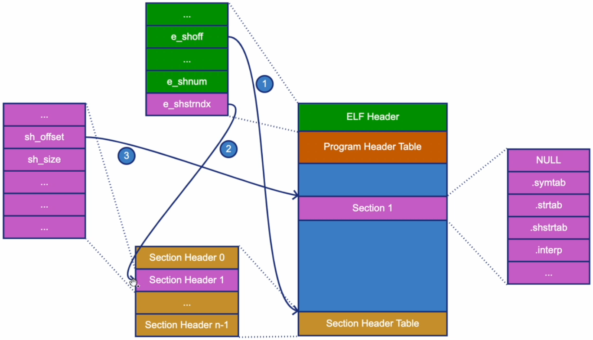
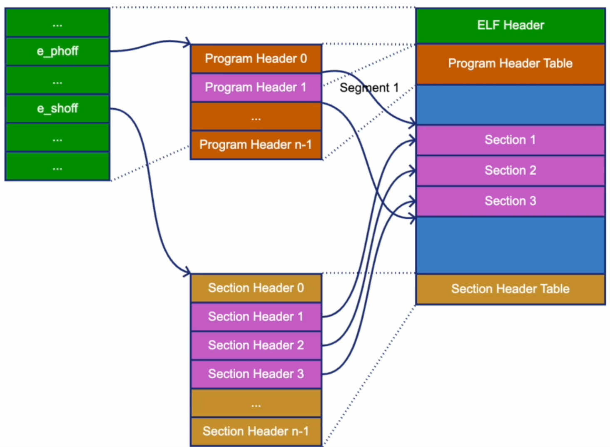
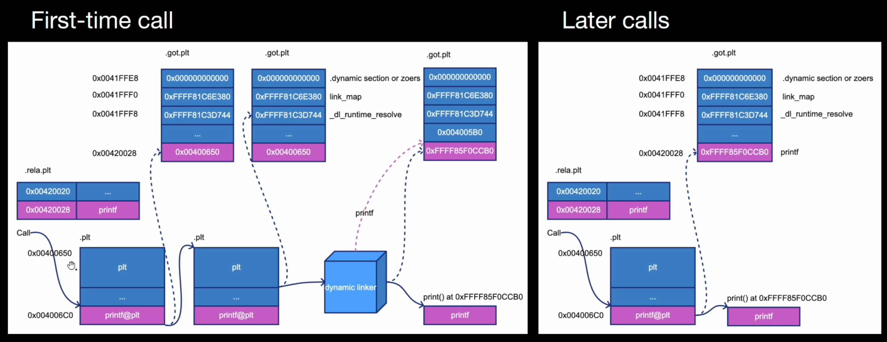

## ELF Tutorial
- Instructor: Qi Liang


## Section 1: Introduction

### 1. Introduction
- Ref: https://github.com/std3lqi/elf-tutorial

## Section 2: What is ELF

### 2. What is ELF
- ELF: Executable and Linking Format used in Unix-based systems for
  - Relocatable file: object file generated by compiler like *.o file
  - Executable file: binary file generated by linker
  - Shared object file: binary file generated by linker like *.so file
  - Core dump file: memory dumped by Linux
- ELF file format
  - Linking view: how ELF file is organized as a file
    - ELF header/Program header table/section 1/... section n/.../section header table
  - Execution view: Howe ELF file is mapped into memory for execution
    - ELF header/program header table/segment 1/.../segement n/.../section header table (optional)
- Simplified overview of ELF loading
  - Some code invokes Linux system call `execve` to run a user program
  - Linux kernel reads this user program (ELF file)
    - Loads segments into memroy
  - Linux kernel transfers control to dynamic linker
    - Resolve dependencies and relocate symbols
  - Linker transfers control to user program
    - Execute user program instructions from entry point virtual address

## Section 3: Example Program and elf-tutorial Program

### 3. Example Program and elf-tutorial Program
- simple.c:
```c
#include<stdio.h>
extern const char* const_global_var;
extern char* global_var;
extern char* get_name_global_func();
char* simple_global_var = "HELLO";
static char* simple_name = "WORLD";
void print_message() {
  printf("%s\n", const_global_var);
  printf("%s %s\n", global_var, get_name_global_func());
  printf("%s %s\n", simple_global_var, simple_name);
}
int main() {
  print_message();
  return 0;
}
```
- myname.c:
```c
const char* const_global_var = "I'm a constant";
char* global_var= "HELLO";
char* uninit_global_var;
static char* static_var = "World";
static char* uninit_static_var;
static char* get_name_local_func() {
  return static_var;
}
char* get_name_global_func() {
  return get_name_local_func();
}
```
  - gcc -fPIC -o simple.o -c simple.c : producing relocatable file smple.o
  - gcc -fPIC -o myname.o -c myname.c : producing relocatable file myname.o
  - gcc -shared -o libmyname.so myname.o
  - gcc -no-pie -o simple simple.o -lmyname -L.
  - gcc -pie -o simple.exe simple.o -lmyname -L.
  - export LD_LIBRARY_PATH+=:.; ./simple.exe
  - PIC: Position indepedent code
  - PIE: Position independent executable
- Resources and references
  - ELF-64 spec: https://uclibc.org/docs/all-64-gent.pdf
  - ELF header: /usr/include/elf.h
  - elf-tutorial program: https://github.com/std3lqi/elf-tutorial
    - main.c 
    - window.c: renders table in ncurses window
    - elf-table.c: displays all info in tabular form
    - elf-helper.c
    - elf-reader.c: reads ELF file
  - ncurses: https://tldp.org/HOWTO/NCURSES-Programming-HOWTO/intro.html#WHATIS
  - ELF tools
    - Common tools on Linux: readelf, objdump, file
    - Other tools: elfutils, elfdump, ...

### 4. Lab - Walk through the initial version of elf-tutorial
- At ubuntu:
  - sudo apt install ncurses-dev
  - make all

## Section 4: ELF Structure

### 5. ELF Structure
- Header and Header tables
  - ELF header
  - Program header table
  - Section header table
- ELF header
  - C struct data 
- ELF structure
  - At 0x000000: 74 45 4c 46 02 01 01 00
    - 74: ELF, E_MAG0, magic number byte 0
    - 45: E_MAG1, Magic number byte 1 
    - 4c: EI_MAG2, Magic number byte 2
    - 46: EI_MAG3, Magic number byte 3
    - 02: EI_CLASS, File class, Little Endian here
    - 01: EI_DATA, Data encoding
    - 01: EI_VERSION, File version
    - 00: EI_OSABI, OS/ABI identification
  - At 0x000008: 00 00 00 00 00 00 00 00 
    - 00: EI_ABIVERSION, ABI version
    - 00 00 00 00 00 00 00: EI_PAD, start of padding bytes
  - 32bit vs 64bit
    - Similar structures but a little different, besides different datatypes and sizes    
  - Little-endian vs Big-endian
    - Aware of little-endian (like x96) vs big-endian
    
### 6. Lab - Show ELF Header
- cd elf-tutorial
- make
- cd simple
- bash ./make.sh
- cd ..
- main ./simple/simple
```bash
┌ ELF File─────────────────────────────────────────┐┌ Contents──────────────────────────┐
│ 0x00000000-00000040 *** ELF Header ***           ││ Magic Number : 0x7F E L F         │
│ 0x00000040-00000318 *** Program Header Table *** ││ File Class   : 64-Bit             │
│ 0x00000000-00000000 NULL                         ││ Data Encoding: Little Endian      │
│ 0x00000318-00000334 PROGBITS      .interp        ││ Version      : 1                  │
│ 0x00000338-00000368 NOTE          .note.gnu.prope││ OS/ABI       : UNIX System V ABI  │
│ 0x00000368-0000038C NOTE          .note.gnu.build││ ABI Version  : 0                  │
│ 0x0000038C-000003AC NOTE          .note.ABI-tag  ││ File Type    : Executable File    │
│ 0x000003B0-000003CC GNU_HASH      .gnu.hash      ││ Architecture : AMD x86-64 architec│
urex000003D0-000004A8 DYNSYM        .dynsym        ││ File Version : 1                  │
│ 0x000004A8-00000538 STRTAB        .dynstr        ││ Entry Point  : 0x00401090         │
│ 0x00000538-0000054A GNU_VERSYM    .gnu.version   ││ Program Header Table              │
│ 0x00000550-00000580 GNU_VERNEEDED .gnu.version_r ││   Offset     : 0x00000040         │
│ 0x00000580-000005F8 RELA          .rela.dyn      ││   Entry Size : 56                 │
│ 0x000005F8-00000640 RELA          .rela.plt      ││   Entry Count: 13                 │
│ 0x00001000-0000101B PROGBITS      .init          ││ Section Header Table              │
│ 0x00001020-00001060 PROGBITS      .plt           ││   Offset     : 0x000037A8         │
│ 0x00001060-00001090 PROGBITS      .plt.sec       ││   Entry Size : 64                 │
│ 0x00001090-00001243 PROGBITS      .text          ││   Entry Count: 31                 │
│ 0x00001244-00001251 PROGBITS      .fini          ││ Proc Flags   : 0x00000000         │
│ 0x00002000-00002049 PROGBITS      .rodata        ││ ELF Header Sz: 64                 │
│ 0x0000204C-00002090 PROGBITS      .eh_frame_hdr  ││ Sect Str Idx : 30                 │
│ 0x00002090-00002174 PROGBITS      .eh_frame      ││                                   │
│ 0x00002DD0-00002DD8 INIT_ARRAY    .init_array    ││                                   │
└  1 of 34, 1-23 ──────────────────────────────────┘└───────────────────────────────────┘
```
  - Note that the main can read -PIC or -PIE files only

## Section 5: Program Header Table

### 7. Program Header Table
- Describes the segments'
  - Type and attributes
  - Position/size in file
  - Virtual address/size in memory
  - Alignment
- Use ELF header to locate the program headers
  - e_phoff
  - e_phentsize
  - e_phnum

### 8. Lab - Show Program Header Table
```bash
┌ ELF File─────────────────────────────────────────┐┌ Contents───────────────────────────────────────────────────────────┐
│ 0x00000000-00000040 *** ELF Header ***           ││ TYPE   |FLG| ALIGN  |FILESZ| FILE OFF |MEMSZ |VIRT ADDR |PHYS ADDR │
│ 0x00000040-00000318 *** Program Header Table *** ││────────────────────────────────────────────────────────────────────│
│ 0x00000000-00000000 NULL                         ││ PHDR      R 0x000008 0x02D8 0x00000040 0x02D8 0x00400040 0x00400040│
│ 0x00000318-00000334 PROGBITS      .interp        ││ INTERP    R 0x000001 0x001C 0x00000318 0x001C 0x00400318 0x00400318│
│ 0x00000338-00000368 NOTE          .note.gnu.prope││ LOAD      R 0x001000 0x0640 0x00000000 0x0640 0x00400000 0x00400000│
│ 0x00000368-0000038C NOTE          .note.gnu.build││ LOAD    E R 0x001000 0x0251 0x00001000 0x0251 0x00401000 0x00401000│
│ 0x0000038C-000003AC NOTE          .note.ABI-tag  ││ LOAD      R 0x001000 0x0174 0x00002000 0x0174 0x00402000 0x00402000│
│ 0x000003B0-000003CC GNU_HASH      .gnu.hash      ││ LOAD     WR 0x001000 0x0268 0x00002DD0 0x0270 0x00403DD0 0x00403DD0│
│ 0x000003D0-000004A8 DYNSYM        .dynsym        ││ DYNAMIC  WR 0x000008 0x01E0 0x00002DE0 0x01E0 0x00403DE0 0x00403DE0│
│ 0x000004A8-00000538 STRTAB        .dynstr        ││ NOTE      R 0x000008 0x0030 0x00000338 0x0030 0x00400338 0x00400338│
│ 0x00000538-0000054A GNU_VERSYM    .gnu.version   ││ NOTE      R 0x000004 0x0044 0x00000368 0x0044 0x00400368 0x00400368│
│ 0x00000550-00000580 GNU_VERNEEDED .gnu.version_r ││ UNKNOWN   R 0x000008 0x0030 0x00000338 0x0030 0x00400338 0x00400338│
│ 0x00000580-000005F8 RELA          .rela.dyn      ││ EH_FRAM   R 0x000004 0x0044 0x0000204C 0x0044 0x0040204C 0x0040204C│
│ 0x000005F8-00000640 RELA          .rela.plt      ││ STACK    WR 0x000010 0x0000 0x00000000 0x0000 0x00000000 0x00000000│
│ 0x00001000-0000101B PROGBITS      .init          ││ RELRO     R 0x000001 0x0230 0x00002DD0 0x0230 0x00403DD0 0x00403DD0│
```
- PHDR: Program header
- INTERP: interpreter for linker
- LOAD: executable segment
- LOAD: data segment which is not executable
- DYNAMIC: for dynamic linker
- RELRO: relocation Read Only

## Section 6: Section Header Table

### 9. Section Header Table
- Describes the sections'
  - Name, type, and attributes
  - Position/size in file
  - Virtual address/size in memory
  - Alignment
  - Link to other section and information if any
- Use ELF header to locate the section headers
  - e_sholff
  - e_shentsize
  - e_shnum
- From /usr/include/elf.h:
```c
/* Section header.  */
typedef struct
{
  Elf32_Word	sh_name;		/* Section name (string tbl index) */
  Elf32_Word	sh_type;		/* Section type */
  Elf32_Word	sh_flags;		/* Section flags */
  Elf32_Addr	sh_addr;		/* Section virtual addr at execution */
  Elf32_Off	sh_offset;		/* Section file offset */
  Elf32_Word	sh_size;		/* Section size in bytes */
  Elf32_Word	sh_link;		/* Link to another section */
  Elf32_Word	sh_info;		/* Additional section information */
  Elf32_Word	sh_addralign;		/* Section alignment */
  Elf32_Word	sh_entsize;		/* Entry size if section holds table */
} Elf32_Shdr;
```
- Locating section in ELF file
  - Given one section header
  - Locate section with sh_offset and sh_size

### 10. Lab - Show Section Header Table
```bash
┌ ELF File─────────────────────────────────────────┐┌ Contents────────────────────────────────────────────────────────────────────────────────────┐
│ 0x00000318-00000334 PROGBITS      .interp        ││ Index|NAME            | TYPE        |FLG| VIRT ADDR| OFFSET   |SIZE |LNK|INF|ALIGN|ENTSZ    │
│ 0x00000338-00000368 NOTE          .note.gnu.prope││─────────────────────────────────────────────────────────────────────────────────────────────│
│ 0x00000368-0000038C NOTE          .note.gnu.build││    0:                  NULL              0x00000000 0x00000000 0x000 000 000 0x000 000      │
│ 0x0000038C-000003AC NOTE          .note.ABI-tag  ││    1: .interp          PROGBITS        A 0x00400318 0x00000318 0x01C 000 000 0x001 000      │
│ 0x000003B0-000003CC GNU_HASH      .gnu.hash      ││    2: .note.gnu.property NOTE            A 0x00400338 0x00000338 0x030 000 000 0x008 000    │
│ 0x000003D0-000004A8 DYNSYM        .dynsym        ││    3: .note.gnu.build-id NOTE            A 0x00400368 0x00000368 0x024 000 000 0x004 000    │
│ 0x000004A8-00000538 STRTAB        .dynstr        ││    4: .note.ABI-tag    NOTE            A 0x0040038C 0x0000038C 0x020 000 000 0x004 000      │
│ 0x00000538-0000054A GNU_VERSYM    .gnu.version   ││    5: .gnu.hash        GNU_HASH        A 0x004003B0 0x000003B0 0x01C 006 000 0x008 000      │
│ 0x00000550-00000580 GNU_VERNEEDED .gnu.version_r ││    6: .dynsym          DYNSYM          A 0x004003D0 0x000003D0 0x0D8 007 001 0x008 024      │
│ 0x00000580-000005F8 RELA          .rela.dyn      ││    7: .dynstr          STRTAB          A 0x004004A8 0x000004A8 0x090 000 000 0x001 000      │
│ 0x000005F8-00000640 RELA          .rela.plt      ││    8: .gnu.version     GNU_VERSYM      A 0x00400538 0x00000538 0x012 006 000 0x002 002      │
│ 0x00001000-0000101B PROGBITS      .init          ││    9: .gnu.version_r   GNU_VERNEEDED   A 0x00400550 0x00000550 0x030 007 001 0x008 000      │
│ 0x00001020-00001060 PROGBITS      .plt           ││   10: .rela.dyn        RELA            A 0x00400580 0x00000580 0x078 006 000 0x008 024      │
│ 0x00001060-00001090 PROGBITS      .plt.sec       ││   11: .rela.plt        RELA            A 0x004005F8 0x000005F8 0x048 006 024 0x008 024      │
│ 0x00001090-00001243 PROGBITS      .text          ││   12: .init            PROGBITS      E A 0x00401000 0x00001000 0x01B 000 000 0x004 000      │
│ 0x00001244-00001251 PROGBITS      .fini          ││   13: .plt             PROGBITS      E A 0x00401020 0x00001020 0x040 000 000 0x010 016      │
│ 0x00002000-00002049 PROGBITS      .rodata        ││   14: .plt.sec         PROGBITS      E A 0x00401060 0x00001060 0x030 000 000 0x010 016      │
│ 0x0000204C-00002090 PROGBITS      .eh_frame_hdr  ││   15: .text            PROGBITS      E A 0x00401090 0x00001090 0x1B3 000 000 0x010 000      │
│ 0x00002090-00002174 PROGBITS      .eh_frame      ││   16: .fini            PROGBITS      E A 0x00401244 0x00001244 0x00D 000 000 0x004 000      │
│ 0x00002DD0-00002DD8 INIT_ARRAY    .init_array    ││   17: .rodata          PROGBITS        A 0x00402000 0x00002000 0x049 000 000 0x004 000      │
│ 0x00002DD8-00002DE0 FINI_ARRAY    .fini_array    ││   18: .eh_frame_hdr    PROGBITS        A 0x0040204C 0x0000204C 0x044 000 000 0x004 000      │
│ 0x00002DE0-00002FC0 DYNAMIC       .dynamic       ││   19: .eh_frame        PROGBITS        A 0x00402090 0x00002090 0x0E4 000 000 0x008 000      │
│ 0x00002FC0-00002FE8 PROGBITS      .got           ││   20: .init_array      INIT_ARRAY     WA 0x00403DD0 0x00002DD0 0x008 000 000 0x008 008      │
│ 0x00002FE8-00003018 PROGBITS      .got.plt       ││   21: .fini_array      FINI_ARRAY     WA 0x00403DD8 0x00002DD8 0x008 000 000 0x008 008      │
│ 0x00003018-00003038 PROGBITS      .data          ││   22: .dynamic         DYNAMIC        WA 0x00403DE0 0x00002DE0 0x1E0 007 000 0x008 016      │
│ 0x00003038-00003038 NOBITS        .bss           ││   23: .got             PROGBITS       WA 0x00403FC0 0x00002FC0 0x028 000 000 0x008 008      │
│ 0x00003038-00003063 PROGBITS      .comment       ││   24: .got.plt         PROGBITS       WA 0x00403FE8 0x00002FE8 0x030 000 000 0x008 008      │
│ 0x00003068-00003470 SYMTAB        .symtab        ││   25: .data            PROGBITS       WA 0x00404018 0x00003018 0x020 000 000 0x008 000      │
│ 0x00003470-00003689 STRTAB        .strtab        ││   26: .bss             NOBITS         WA 0x00404038 0x00003038 0x008 000 000 0x001 000      │
│ 0x00003689-000037A8 STRTAB        .shstrtab      ││   27: .comment         PROGBITS          0x00000000 0x00003038 0x02B 000 000 0x001 001      │
│ 0x000037A8-00003F68 *** Section Header Table *** ││   28: .symtab          SYMTAB            0x00000000 0x00003068 0x408 029 019 0x008 024      │
└  34 of 34, 4-34 ─────────────────────────────────┘└  1 of 31, 1-29 ─────────────────────────────────────────────────────────────────────────────┘
```
- Section header is located in the bottom
- First header is empty (NULL)
- Second header is PROGBITS, which is a machine code section
- LNK column shows which section they link to

## Section 7: String Table Section

### 11. String Table Section
- SHT_STRTAB
  - Contain the string used for section names, symbol names, etc
  - Each string in table is terminated with "\0"
  - The first string in string table is always "\0"

- Standard sections
  - Standard section's name starts with "."
  - .bss: SHT_NOBITS, uninitalized data
  - .data: SHT_PROGBITS, uninitialized data
  - .interp: SHT_PROGBIS, Program interpreter path name
  - .rodata: SHT PROGBITS, Read-only data (constants and literals)
  - .text: SHT_PROGBITS, executable code
  - .comment: SHT_PROGBITS, version control information
  - .shstrtab: SHT_STRTAB, section name string table
  - .strtab: SHT_STRTAB, string table
  - .symtab: SHT_SYMTAB, link symbol table
  - .dynamic: SHT_DYNAMIC, dynamic link table
  - .dynsgtr: SHT_STRTAB, string table for .dynamic section
  - .dynsym: SHT_DYNSM, symbol table for dynamic linking
  - .got: SHT_PROGBITS, Global offset table
  - .hash: SHT_HASH, symbol hash table
  - .plt: SHT_PROGBITS, procedure linkage table
  - `.re<name>`: SHT_REL, Relocations for section `<name>`
  - `.rela<name>`: SHT_RELA, Relocations for section `<name>`

### 12. Lab - Show String Table Section
- Contents of the section header are shown in left window
  - Above section header

## Section 8: Revisit Segments and Sections

### 13. Revisit Segments and Sections

- One segment contains one or more sections
- Segment might overlap
- Segment is loaded into process image

### 14. Lab - Show String Table Sections

## Section 9: Symbol Table Section

### 15. Symbol Table Section
- From /usr/include/elf.h
```c
/* Symbol table entry.  */
typedef struct
{
  Elf32_Word	st_name;		/* Symbol name (string tbl index) */
  Elf32_Addr	st_value;		/* Symbol value */
  Elf32_Word	st_size;		/* Symbol size */
  unsigned char	st_info;		/* Symbol type and binding */
  unsigned char	st_other;		/* Symbol visibility */
  Elf32_Section	st_shndx;		/* Section index */
} Elf32_Sym;
typedef struct
{
  Elf64_Word	st_name;		/* Symbol name (string tbl index) */
  unsigned char	st_info;		/* Symbol type and binding */
  unsigned char st_other;		/* Symbol visibility */
  Elf64_Section	st_shndx;		/* Section index */
  Elf64_Addr	st_value;		/* Symbol value */
  Elf64_Xword	st_size;		/* Symbol size */
} Elf64_Sym;
```
- Symbol binding
  - Global
    - Visible by other module
    - Visible in .dynsym section in the case of dynamic link
  - Local
    - Visible only by the current module
    - Not in .dynsym section in the case of dynamic link
  - Weak
    - Allow to be overridden by other global symbol - weak definition
    - Allow to be undefined - weak reference
- Symbol visibility
  - Default
    - Visible by other module
    - Visible in .dynsym section in the case of dynamic link
  - Hidden
    - Visible only by the current module
    - Not in .dynsym section in the case of dynamic link
  - Protected
    - Visible by other module, but not allow overriding (like using LD_PRELOAD)
    - Visible with local binding in .dynsym section in the case of dynamic link
  - Internal
    - Similar to hideen with more optimization and protection
- Symbol binding vs visibility
  - Binding indcates whether the symbol will be used for linking (dynamic and static)    
  - Visibility indicates how the symbol will be exposed in dynamic linking
  - So visibility only makes sense in the case of global symbol in dynamic linking 
  - Ex:
    - Local binding always implies hidden visibility
    - Global binding can be hidden, which doesn't prevent static linking

### 16. Lab - Show Symbol Table

##  Section 10: Dynamic Section

### 17. Dynamic Section
- Provides linker the information about dynamic library loading
- /usr/include/elf.h
```c
/* Dynamic section entry.  */
typedef struct
{
  Elf32_Sword	d_tag;			/* Dynamic entry type */
  union
    {
      Elf32_Word d_val;			/* Integer value */
      Elf32_Addr d_ptr;			/* Address value */
    } d_un;
} Elf32_Dyn;
typedef struct
{
  Elf64_Sxword	d_tag;			/* Dynamic entry type */
  union
    {
      Elf64_Xword d_val;		/* Integer value */
      Elf64_Addr d_ptr;			/* Address value */
    } d_un;
} Elf64_Dyn;
```

### 18. Lab - Show Dynamic Section
- Dynamic symbols
```bash
$ nm -D simple/simple
                 U const_global_var
                 U get_name_global_func
                 w get_name_weak
                 U global_var
                 w __gmon_start__
                 U __libc_start_main@GLIBC_2.34
                 U printf@GLIBC_2.2.5
                 U puts@GLIBC_2.2.5
```
## Section 11: Hash Section

### 19. Hash Section
- Speed-up symbol look-up
- Algorithm
  - Calculate the hash value of symbol name
  - Determine bucket with hash value and bucket count
  - Repeat
    - Locate the symbol name and compare symbol name
    - If not matched, try the next entry in the chain
  - Until the matching symbol is found or reachging the end of chain
- Disadvantages
  - A lot of symbol name comparisons
  - The chain (linked list) is not efficient for CPU cache

### 20. Lab - Show Hash Section
```bash
┌ ELF File─────────────────────────────────────────┐┌ Contents────────────────────────────────────────────┐
│ 0x00000000-00000040 *** ELF Header ***           ││ Buckets      : 1                                    │
│ 0x00000040-00000318 *** Program Header Table *** ││ Symbol Offset: 1                                    │
│ 0x00000000-00000000 NULL                         ││ Bloom Size   : 1                                    │
│ 0x00000318-00000334 PROGBITS      .interp        ││ Bloom Shift  : 0                                    │
│ 0x00000338-00000368 NOTE          .note.gnu.prope││ Bloom[00]    : 0x0000000000000000                   │
│ 0x00000368-0000038C NOTE          .note.gnu.build││ Bucket[00]   : 9                                    │
│ 0x0000038C-000003AC NOTE          .note.ABI-tag  ││                                                     │
│ 0x000003B0-000003CC GNU_HASH      .gnu.hash      ││                                                     │
└  8 of 34, 1-8 ───────────────────────────────────┘└─────────────────────────────────────────────────────┘
```
- .hash vs .GNU.hash
  - .GNU.hash a modernized version and provides faster lookup

## Section 12: GNU Hash Section

### 21. GNU Hash Section
- Uses Bloom filer to look up symbol quickly
- Algorithm
  - Calculate hash value of symbol name
  - Use 2-bit Bloom filter to determine whether an entry with the hash value exists
  - Determine bucket with hash value and bucket count
  - Repeat
    - Compare entry value from chain array with hash value
    - If matching, locate the symbol name and compare symbol name
    - If not matched, try the next entry in chain
  - Until the matching symbol is found or reaching the end of chain

### 22. Lab - Show GNU Hash Section

## Section 13: Note Section

### 23. Note Section
```c
/* Note section contents.  Each entry in the note section begins with
   a header of a fixed form.  */
typedef struct
{
  Elf32_Word n_namesz;			/* Length of the note's name.  */
  Elf32_Word n_descsz;			/* Length of the note's descriptor.  */
  Elf32_Word n_type;			/* Type of the note.  */
} Elf32_Nhdr;
typedef struct
{
  Elf64_Word n_namesz;			/* Length of the note's name.  */
  Elf64_Word n_descsz;			/* Length of the note's descriptor.  */
  Elf64_Word n_type;			/* Type of the note.  */
} Elf64_Nhdr;
```
- name: Null-terminated string with padding for 8-byte alignment
- desc: contents of descriptor, which is determined by name and type. It is defined by the tool generating this ELF file

### 24. Lab - Show Note Section

## Section 14: GNU Versioning

### 25. GNU Versioning
- Why GNU versioning is needed
  - Assume get_name_global_func() is updated from VER_1.0 to VER_2.0
    - VER_2.0 is optimized with HW support
    - libmyname.so.1 providing get_name_global_func@@VER_1.0
    - libmyname.so.2 providing get_name_global_func@VER_1.0 and get_name_global_func@@VER_2.0
- `@@` is the default symbol

### 26. Define the Versioned Symbols
- Define the versioned symbols
  - Define the versioned symbols in section .gnu.version(GNU_VERSYM)
  - Define the versions in section .gnu.version_d(GNU_VERSION)

### 27. Lab - Show GNU Version Section (.gnu.version_d) Part 1

### 28. Lab - Show GNU Version Section (.gnu.version) Part 2

### 29. Refer to GNU Versioned Symbols

### 30. Lab - Show GNU Version Section (.gnu.version_r)

## Section 15: Relocation Section

### 31. Relocation Section
- Rel and Rela

### 32. Lab - Show Relocation Section
```bash
┌ ELF File─────────────────────────────────────────┐┌ Contents───────────────────────────────────────────────────────────┐
│ 0x00000338-00000368 NOTE          .note.gnu.prope││ Index|OFFSET    |TYPE|SYM|ADDEND    |RELOCATION TYPE               │
│ 0x00000368-0000038C NOTE          .note.gnu.build││────────────────────────────────────────────────────────────────────│
│ 0x0000038C-000003AC NOTE          .note.ABI-tag  ││    0: 0x00403FC0    6   1 0x00000000 R_X86_64_GLOB_DAT             │
│ 0x000003B0-000003CC GNU_HASH      .gnu.hash      ││    1: 0x00403FC8    6   3 0x00000000 R_X86_64_GLOB_DAT             │
│ 0x000003D0-000004A8 DYNSYM        .dynsym        ││    2: 0x00403FD0    6   4 0x00000000 R_X86_64_GLOB_DAT             │
│ 0x000004A8-00000538 STRTAB        .dynstr        ││    3: 0x00403FD8    6   6 0x00000000 R_X86_64_GLOB_DAT             │
│ 0x00000538-0000054A GNU_VERSYM    .gnu.version   ││    4: 0x00403FE0    6   7 0x00000000 R_X86_64_GLOB_DAT             │
│ 0x00000550-00000580 GNU_VERNEEDED .gnu.version_r ││                                                                    │
│ 0x00000580-000005F8 RELA          .rela.dyn      ││                                                                    │
│ 0x000005F8-00000640 RELA          .rela.plt      ││                                                                    │
```

## Section 16: Dynamic Linking

### 33. Lab - Preparation for Dynamic Linking
```py
┌ ELF File─────────────────────────────────────────┐┌ Contents───────────────────────────────────────────────────────────┐
│ 0x00000000-00000040 *** ELF Header ***           ││ Index|String                                                       │
│ 0x00000040-00000318 *** Program Header Table *** ││────────────────────────────────────────────────────────────────────│
│ 0x00000000-00000000 NULL                         ││    0: /lib64/ld-linux-x86-64.so.2                                  │
│ 0x00000318-00000334 PROGBITS      .interp        ││                                    
```
- .interpreter shows /lib64/ld-linux-x86-64.so
```bash
┌ ELF File─────────────────────────────────────────┐┌ Contents───────────────────────────────────────────────────────────┐
│ 0x00002DE0-00002FC0 DYNAMIC       .dynamic       ││ Index|String                                                       │
│ 0x00002FC0-00002FE8 PROGBITS      .got           ││────────────────────────────────────────────────────────────────────│
│ 0x00002FE8-00003018 PROGBITS      .got.plt       ││    0: GCC: (Ubuntu 13.3.0-6ubuntu2~24.04) 13.3.0                   │
│ 0x00003018-00003038 PROGBITS      .data          ││                                                                    │
│ 0x00003038-00003038 NOBITS        .bss           ││                                                                    │
│ 0x00003038-00003063 PROGBITS      .comment       ││                                            
```
- .comment shows GCC: (Ubuntu 13.3.0-6ubuntu2~24.04) 13.3.

### 34. Dynamic Linking Variables
- Dynamic Linking
  - Link external variable via .rela.dyn and .got

### 35. Dynamic Linking Functions
- Lazily link external function via .rela.plt, .plt, and .got.plt


## Section 17: ELF Tools

### 36. ELF Tools
- file: file type
- readelf: ELF reader
- objdump: 
```bash
$ file simple/simple
simple/simple: ELF 64-bit LSB executable, x86-64, version 1 (SYSV), dynamically linked, interpreter /lib64/ld-linux-x86-64.so.2, BuildID[sha1]=39fdde9e4735bea3effd8be9271bcf619ac519f9, for GNU/Linux 3.2.0, not stripped
$ readelf -a simple/simple
ELF Header:
  Magic:   7f 45 4c 46 02 01 01 00 00 00 00 00 00 00 00 00 
  Class:                             ELF64
  Data:                              2's complement, little endian
  Version:                           1 (current)
...
Displaying notes found in: .note.ABI-tag
  Owner                Data size 	Description
  GNU                  0x00000010	NT_GNU_ABI_TAG (ABI version tag)
    OS: Linux, ABI: 3.2.0
```

## Section 18: Minor Enhancement of elf-tutorial Program and Thank you

### 37. Minor Enhancement of elf-tutorial Program and Thank You

