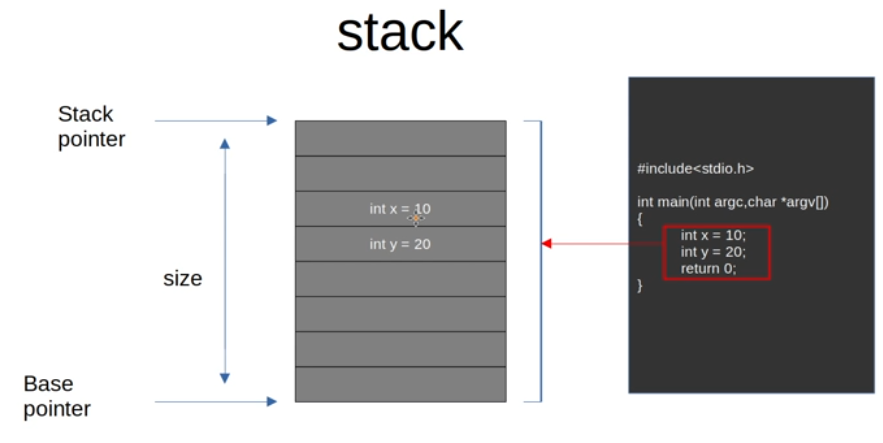
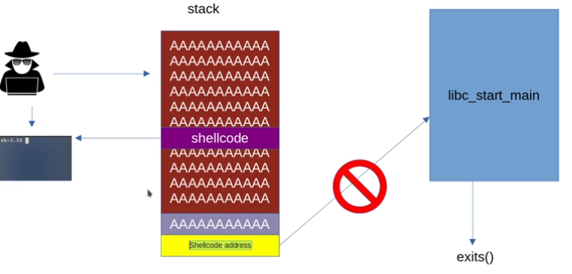
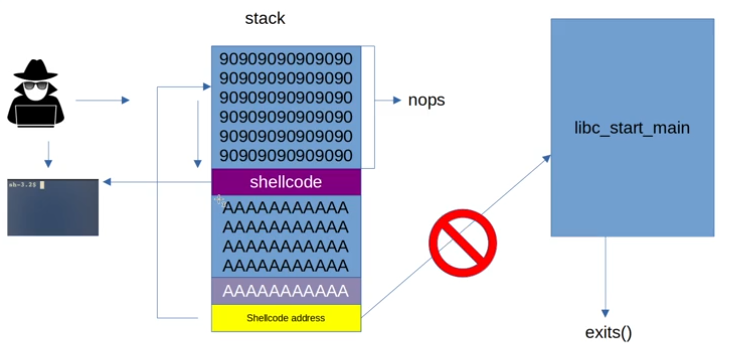
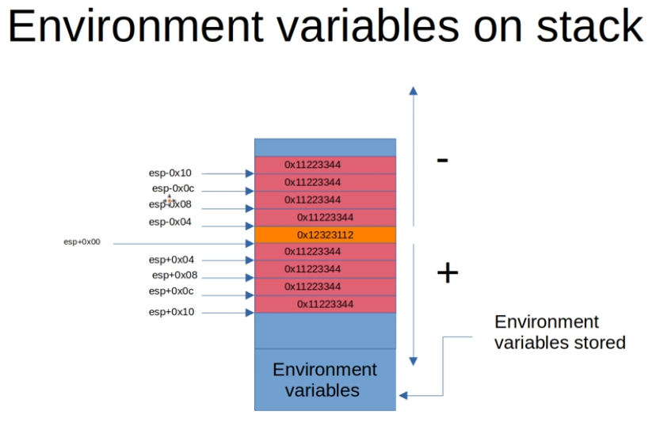

## Title: Exploit Development Tutorial for Hackers and Pentesters
- Instructor: Swapnil Singh

## Section 1: Introduction

1. Thanks for joining

2. What skills are needed for this course?

3. Lab machine configurations
- Ubuntu 18.04.1

## Section 2: Binary Analysis Fundamentals for Exploit Development

4. Before any Exploitations
- Get the target information using tools

5. Installing gdb plugins for exploit development lab
- github.com/longld/peda
```
git clone https://github.com/longld/peda.git ~/peda
echo "source ~/peda/peda.py" >> ~/.gdbinit
echo "DONE! debug your program with gdb and enjoy"
```

6. GDB basics for exploit development
- For disassemble only, we may not need -g option to build an executable
- Compile the code with -no-pie option
- hello.c:
```c
#include<stdio.h>
int myF() { int i=10; char *myS = "This is my F"; return 0; }
int main() { int a = 100; char *mainS = "This is main function";
             myF(); return 0; }
```
- Demo:
```bash
$ gcc -no-pie hello.c -o hello.exe
$ gdb -q hello.exe
Reading symbols from hello.exe...
(No debugging symbols found in hello.exe)
gdb-peda$ disassemble main
Dump of assembler code for function main:
   0x0000000000401127 <+0>:	endbr64 
   0x000000000040112b <+4>:	push   rbp
   0x000000000040112c <+5>:	mov    rbp,rsp
   0x000000000040112f <+8>:	sub    rsp,0x10
   0x0000000000401133 <+12>:	mov    DWORD PTR [rbp-0xc],0x64
   0x000000000040113a <+19>:	lea    rax,[rip+0xed0]        # 0x402011
   0x0000000000401141 <+26>:	mov    QWORD PTR [rbp-0x8],rax
   0x0000000000401145 <+30>:	mov    eax,0x0
   0x000000000040114a <+35>:	call   0x401106 <myF>
   0x000000000040114f <+40>:	mov    eax,0x0
   0x0000000000401154 <+45>:	leave  
   0x0000000000401155 <+46>:	ret    
End of assembler dump.
gdb-peda$ b *0x000000000040112f
Breakpoint 1 at 0x40112f
gdb-peda$ run
Starting program: /home/hpjeon/hw/class/udemy_exploit/chap05/hello.exe 
[----------------------------------registers-----------------------------------]
RAX: 0x401127 (<main>:	endbr64)
RBX: 0x401160 (<__libc_csu_init>:	endbr64)
RCX: 0x401160 (<__libc_csu_init>:	endbr64)
RDX: 0x7fffffffd668 --> 0x7fffffffda24 ("SHELL=/bin/bash")
RSI: 0x7fffffffd658 --> 0x7fffffffd9ef ("/home/hpjeon/hw/class/udemy_exploit/chap05/hello.exe")
RDI: 0x1 
RBP: 0x7fffffffd560 --> 0x0 
RSP: 0x7fffffffd560 --> 0x0 
RIP: 0x40112f (<main+8>:	sub    rsp,0x10)
R8 : 0x0 
R9 : 0x7ffff7fe0d60 (<_dl_fini>:	endbr64)
R10: 0x3 
R11: 0x2 
R12: 0x401020 (<_start>:	endbr64)
R13: 0x7fffffffd650 --> 0x1 
R14: 0x0 
R15: 0x0
EFLAGS: 0x246 (carry PARITY adjust ZERO sign trap INTERRUPT direction overflow)
[-------------------------------------code-------------------------------------]
   0x401127 <main>:	endbr64 
   0x40112b <main+4>:	push   rbp
   0x40112c <main+5>:	mov    rbp,rsp
=> 0x40112f <main+8>:	sub    rsp,0x10
   0x401133 <main+12>:	mov    DWORD PTR [rbp-0xc],0x64
   0x40113a <main+19>:	lea    rax,[rip+0xed0]        # 0x402011
   0x401141 <main+26>:	mov    QWORD PTR [rbp-0x8],rax
   0x401145 <main+30>:	mov    eax,0x0
[------------------------------------stack-------------------------------------]
0000| 0x7fffffffd560 --> 0x0 
0008| 0x7fffffffd568 --> 0x7ffff7dd3083 (<__libc_start_main+243>:	mov    edi,eax)
0016| 0x7fffffffd570 --> 0x7ffff7ffc620 --> 0x504fc00000000 
0024| 0x7fffffffd578 --> 0x7fffffffd658 --> 0x7fffffffd9ef ("/home/hpjeon/hw/class/udemy_exploit/chap05/hello.exe")
0032| 0x7fffffffd580 --> 0x100000000 
0040| 0x7fffffffd588 --> 0x401127 (<main>:	endbr64)
0048| 0x7fffffffd590 --> 0x401160 (<__libc_csu_init>:	endbr64)
0056| 0x7fffffffd598 --> 0xf728f019017155c0 
[------------------------------------------------------------------------------]
Legend: code, data, rodata, value
Breakpoint 1, 0x000000000040112f in main ()
gdb-peda$ x/d $rbp
0x7fffffffd560:	0
gdb-peda$ x/d $rbp-0xc  # prints decimal
0x7fffffffd554:	100
gdb-peda$ x/s $ras
gdb-peda$ ni
gdb-peda$ ni
gdb-peda$ ni
gdb-peda$ x/s $rax  # prints as a string
0x402011:	"This is main function"
```
- `ni` for next instruction
- `c` for continue

7. Binary compilation process
- gcc -S sample.c: produces an assembly code sample.s
- gcc -c sample.s: produces an object file sample.o
- gcc sample.o -o sample.exe: produces an executable sample.exe

8. Staic memory layout of Binary file
- .data: global data
- .bss: uninitialized data
- .rodata: read-only data like strings
- .text: contains the executable code, machine instruction, ...
- other data
- sample.c:
```c
#include <stdio.h>
int a = 100;
char *str = "I am Global";
int b;
int main() {
  int b = 20;
  char *mystr = "I am main";
  printf("hello world\n");
  return 0;
}
```
- Analyzing sections:
```bash
$ readelf -x .rodata ./a.out
Hex dump of section '.rodata':
  0x00002000 01000200 4920616d 20476c6f 62616c00 ....I am Global.
  0x00002010 4920616d 206d6169 6e006865 6c6c6f20 I am main.hello 
  0x00002020 776f726c 6400                       world.
$ readelf -x .bss ./a.out # .bss will contain data when run
Section '.bss' has no data to dump.
$ readelf -x .data ./a.out
Hex dump of section '.data':
  0x00004000 00000000 00000000 08400000 00000000 .........@......
  0x00004010 64000000 00000000 04200000 00000000 d........ ......
```

9. Dynamic memory layout inside the process
- When a program is executed, it fills memory with such as:
  - .text
  - .bss
  - .rodata
  - .data
  - Heap
  - Unused memory
  - Stack

10. What is the purpose of stack in memory?
- Stack is a special area of computer's memory which stores temporary variables created by a function. In stack, variables are declared, stored, and initialized during runtime

11. Memory segmentation of binary and stack
- Whever there is a function inside a program, every function has a dedicated **stack frame** inside memory
- Every sub-function call will have its own stack frame

12. Concept of stack inside the binary
- Stack memory
  - Function arguments first (argc, *argv[])
  - Return address
  - Base pointer address
  - All local variables

13. Full examination of stack area in binary
- sample.c
```c
#include <stdio.h>
#include <stdlib.h>
int main(int argc, char *argv[]) {
  int x = 10;
  int y = 11;
  int z = 12;
  char *str = "Hello World";
  return 0;
}
```
- gcc -no-pie -g sample.c
- gdb -q ./a.out
```bash
gdb-peda$ disassemble main
Dump of assembler code for function main:
   0x0000000000401106 <+0>:	endbr64 
   0x000000000040110a <+4>:	push   rbp
   0x000000000040110b <+5>:	mov    rbp,rsp
   0x000000000040110e <+8>:	mov    DWORD PTR [rbp-0x24],edi
   0x0000000000401111 <+11>:	mov    QWORD PTR [rbp-0x30],rsi
   0x0000000000401115 <+15>:	mov    DWORD PTR [rbp-0x14],0xa
   0x000000000040111c <+22>:	mov    DWORD PTR [rbp-0x10],0xb
   0x0000000000401123 <+29>:	mov    DWORD PTR [rbp-0xc],0xc
   0x000000000040112a <+36>:	lea    rax,[rip+0xed3]        # 0x402004
   0x0000000000401131 <+43>:	mov    QWORD PTR [rbp-0x8],rax
   0x0000000000401135 <+47>:	mov    eax,0x0
   0x000000000040113a <+52>:	pop    rbp
   0x000000000040113b <+53>:	ret    
End of assembler dump.
gdb-peda$ b * 0x000000000040113b   #<--- breakpoint before return
Breakpoint 1 at 0x40113b: file sample.c, line 9.
gdb-peda$ run AAAAAA  #<---- send a dummy argument
Starting program: /home/hpjeon/hw/class/udemy_exploit/chap13/a.out AAAAAA
[----------------------------------registers-----------------------------------]
...
Breakpoint 1, 0x000000000040113b in main (argc=0x2, argv=0x7fffffffd668)
    at sample.c:9
9	}
gdb-peda$ x/8wx $rsp #<---- STACK POINTER
0x7fffffffd578:	0xf7dd3083	0x00007fff	0xf7ffc620	0x00007fff
0x7fffffffd588:	0xffffd668	0x00007fff	0x00000000	0x00000002
^^^^^^^^^^^^^^^^agv ^^^^^^^^^^^^^^^^^^^^^^^^^^^^^^^^^argc=2               
gdb-peda$ info locals
x = 0xa
y = 0xb
z = 0xc
str = 0x402004 "Hello World"
gdb-peda$ p/d x
$6 = 10
gdb-peda$ p/d y
$7 = 11
gdb-peda$ p  str
$8 = 0x402004 "Hello World"
```
- Q: Cannot decode $rsp addresses to find x,y,z,str

14. Full analysis of stacks in multi level functions of binary
- More than one function

15. Basic ELF static analysis
- hello.c
```c
#include<stdio.h>
int main() {
  printf("hello\n");
  return 0; }
```
  - Compile as `gcc -no-pie ./hello.c`
- Executable Header
```bash
$ readelf -h  ./a.out 
ELF Header:
  Magic:   7f 45 4c 46 02 01 01 00 00 00 00 00 00 00 00 00 
  Class:                             ELF64
  Data:                              2's complement, little endian
  Version:                           1 (current)
  OS/ABI:                            UNIX - System V
  ABI Version:                       0
  Type:                              EXEC (Executable file)
  Machine:                           Advanced Micro Devices X86-64
  Version:                           0x1
  Entry point address:               0x401050
  Start of program headers:          64 (bytes into file)
  Start of section headers:          14640 (bytes into file)
  Flags:                             0x0
  Size of this header:               64 (bytes)
  Size of program headers:           56 (bytes)
  Number of program headers:         13
  Size of section headers:           64 (bytes)
  Number of section headers:         31
  Section header string table index: 30
```
- Program Headers
```bash
$ readelf --wide -l ./a.out 
Elf file type is EXEC (Executable file)
Entry point 0x401050
There are 13 program headers, starting at offset 64
Program Headers:
  Type           Offset   VirtAddr           PhysAddr           FileSiz  MemSiz   Flg Align
  PHDR           0x000040 0x0000000000400040 0x0000000000400040 0x0002d8 0x0002d8 R   0x8
  INTERP         0x000318 0x0000000000400318 0x0000000000400318 0x00001c 0x00001c R   0x1
      [Requesting program interpreter: /lib64/ld-linux-x86-64.so.2]
  LOAD           0x000000 0x0000000000400000 0x0000000000400000 0x0004d0 0x0004d0 R   0x1000
  LOAD           0x001000 0x0000000000401000 0x0000000000401000 0x0001e5 0x0001e5 R E 0x1000
  LOAD           0x002000 0x0000000000402000 0x0000000000402000 0x000150 0x000150 R   0x1000
  LOAD           0x002e10 0x0000000000403e10 0x0000000000403e10 0x000220 0x000228 RW  0x1000
  DYNAMIC        0x002e20 0x0000000000403e20 0x0000000000403e20 0x0001d0 0x0001d0 RW  0x8
  NOTE           0x000338 0x0000000000400338 0x0000000000400338 0x000020 0x000020 R   0x8
  NOTE           0x000358 0x0000000000400358 0x0000000000400358 0x000044 0x000044 R   0x4
  GNU_PROPERTY   0x000338 0x0000000000400338 0x0000000000400338 0x000020 0x000020 R   0x8
  GNU_EH_FRAME   0x00200c 0x000000000040200c 0x000000000040200c 0x000044 0x000044 R   0x4
  GNU_STACK      0x000000 0x0000000000000000 0x0000000000000000 0x000000 0x000000 RW  0x10
  GNU_RELRO      0x002e10 0x0000000000403e10 0x0000000000403e10 0x0001f0 0x0001f0 R   0x1
 Section to Segment mapping:
  Segment Sections...
   00     
   01     .interp 
   02     .interp .note.gnu.property .note.gnu.build-id .note.ABI-tag .gnu.hash .dynsym .dynstr .gnu.version .gnu.version_r .rela.dyn .rela.plt 
   03     .init .plt .plt.sec .text .fini 
   04     .rodata .eh_frame_hdr .eh_frame 
   05     .init_array .fini_array .dynamic .got .got.plt .data .bss 
   06     .dynamic 
   07     .note.gnu.property 
   08     .note.gnu.build-id .note.ABI-tag 
   09     .note.gnu.property 
   10     .eh_frame_hdr 
   11     
   12     .init_array .fini_array .dynamic .got 
```
- Sections
```bash
$ readelf -x  .rodata ./a.out
Hex dump of section '.rodata':
  0x00402000 01000200 68656c6c 6f00              ....hello.
```
- Section Headers
```bash
$ readelf --wide -S ./a.out 
There are 31 section headers, starting at offset 0x3930:
Section Headers:
  [Nr] Name              Type            Address          Off    Size   ES Flg Lk Inf Al
  [ 0]                   NULL            0000000000000000 000000 000000 00      0   0  0
  [ 1] .interp           PROGBITS        0000000000400318 000318 00001c 00   A  0   0  1
  [ 2] .note.gnu.property NOTE            0000000000400338 000338 000020 00   A  0   0  8
  [ 3] .note.gnu.build-id NOTE            0000000000400358 000358 000024 00   A  0   0  4
  [ 4] .note.ABI-tag     NOTE            000000000040037c 00037c 000020 00   A  0   0  4
  [ 5] .gnu.hash         GNU_HASH        00000000004003a0 0003a0 00001c 00   A  6   0  8
  [ 6] .dynsym           DYNSYM          00000000004003c0 0003c0 000060 18   A  7   1  8
  [ 7] .dynstr           STRTAB          0000000000400420 000420 00003d 00   A  0   0  1
  [ 8] .gnu.version      VERSYM          000000000040045e 00045e 000008 02   A  6   0  2
  [ 9] .gnu.version_r    VERNEED         0000000000400468 000468 000020 00   A  7   1  8
  [10] .rela.dyn         RELA            0000000000400488 000488 000030 18   A  6   0  8
  [11] .rela.plt         RELA            00000000004004b8 0004b8 000018 18  AI  6  24  8
  [12] .init             PROGBITS        0000000000401000 001000 00001b 00  AX  0   0  4
  [13] .plt              PROGBITS        0000000000401020 001020 000020 10  AX  0   0 16
  [14] .plt.sec          PROGBITS        0000000000401040 001040 000010 10  AX  0   0 16
  [15] .text             PROGBITS        0000000000401050 001050 000185 00  AX  0   0 16
  [16] .fini             PROGBITS        00000000004011d8 0011d8 00000d 00  AX  0   0  4
  [17] .rodata           PROGBITS        0000000000402000 002000 00000a 00   A  0   0  4
  [18] .eh_frame_hdr     PROGBITS        000000000040200c 00200c 000044 00   A  0   0  4
  [19] .eh_frame         PROGBITS        0000000000402050 002050 000100 00   A  0   0  8
  [20] .init_array       INIT_ARRAY      0000000000403e10 002e10 000008 08  WA  0   0  8
  [21] .fini_array       FINI_ARRAY      0000000000403e18 002e18 000008 08  WA  0   0  8
  [22] .dynamic          DYNAMIC         0000000000403e20 002e20 0001d0 10  WA  7   0  8
  [23] .got              PROGBITS        0000000000403ff0 002ff0 000010 08  WA  0   0  8
  [24] .got.plt          PROGBITS        0000000000404000 003000 000020 08  WA  0   0  8
  [25] .data             PROGBITS        0000000000404020 003020 000010 00  WA  0   0  8
  [26] .bss              NOBITS          0000000000404030 003030 000008 00  WA  0   0  1
  [27] .comment          PROGBITS        0000000000000000 003030 00002b 01  MS  0   0  1
  [28] .symtab           SYMTAB          0000000000000000 003060 0005e8 18     29  45  8
  [29] .strtab           STRTAB          0000000000000000 003648 0001c9 00      0   0  1
  [30] .shstrtab         STRTAB          0000000000000000 003811 00011f 00      0   0  1
Key to Flags:
  W (write), A (alloc), X (execute), M (merge), S (strings), I (info),
  L (link order), O (extra OS processing required), G (group), T (TLS),
  C (compressed), x (unknown), o (OS specific), E (exclude),
  l (large), p (processor specific)
```

16. Practical concepts of a linker
- hello.o vs hello.exe
- objdump of hello.o matches the main assembly of hello.exe (except addresses)
```bash
$ objdump -d hello.o
hello.o:     file format elf64-x86-64
Disassembly of section .text:
0000000000000000 <main>:  #<-------- Entry point is zero
   0:	f3 0f 1e fa          	endbr64 
   4:	55                   	push   %rbp
   5:	48 89 e5             	mov    %rsp,%rbp
   8:	48 8d 3d 00 00 00 00 	lea    0x0(%rip),%rdi        # f <main+0xf>
   f:	e8 00 00 00 00       	callq  14 <main+0x14>  #<--- not calling anything. This is why linker is neceesary
  14:	b8 00 00 00 00       	mov    $0x0,%eax
  19:	5d                   	pop    %rbp
  1a:	c3                   	retq   
$ objdump -d a.out |grep -A8 "<main>"
0000000000401136 <main>:
  401136:	f3 0f 1e fa          	endbr64 
  40113a:	55                   	push   %rbp
  40113b:	48 89 e5             	mov    %rsp,%rbp
  40113e:	48 8d 3d bf 0e 00 00 	lea    0xebf(%rip),%rdi        # 402004 <_IO_stdin_used+0x4>
  401145:	e8 f6 fe ff ff       	callq  401040 <puts@plt>
  40114a:	b8 00 00 00 00       	mov    $0x0,%eax
  40114f:	5d                   	pop    %rbp
  401150:	c3                   	retq   
```

17. What does a loader actually do?
- *.exe or binary -> running binary -> loader 
- It loads .text, .data, .rodata, heap, ..., stack into process/memory

18. What are the symbols inside the binary?
- Symbols are names of functions and variables which are stored in the binary file
- Used for debugging purpose
- Sample.c:
```c
#include <stdio.h>
extern int number1 = 10;
extern char *name = "Udemy";
void fun1() {}
void fun2() {}
int main() {
 puts("hello world");
 fun1();
 fun2();
 return 0; }
```
- fun1,fun2: user functions
- main, puts: system functions
- number1, name: user variables
- Finding the symbol table:
```bash
$ objdump --wide -t a.out 
a.out:     file format elf64-x86-64
SYMBOL TABLE:
0000000000000318 l    d  .interp	0000000000000000              .interp
...
0000000000001154 g     F .text	000000000000000b              fun2
...
0000000000000000       F *UND*	0000000000000000              puts@@GLIBC_2.2.5
...
0000000000004018 g     O .data	0000000000000008              name
...
0000000000001149 g     F .text	000000000000000b              fun1
...
000000000000115f g     F .text	000000000000002f              main
0000000000004010 g     O .data	0000000000000004              number1
...
```

19. Purpose of plt and got sections in binary
- .plt: procedure link table
- .got: global object table
- How hello.c finds printf()?
  - How to find puts() in library?
  - In .plt, the program reaches some address, which is .got section
  - .got gets the address of puts() address from the library

20. Practical identification of plt and got sections inside gdb
- Reading hello.exe from gdb
```bash
$ gdb -q ./a.out
Reading symbols from ./a.out...
(No debugging symbols found in ./a.out)
gdb-peda$ disassemble main
Dump of assembler code for function main:
   0x0000000000401136 <+0>:	endbr64 
   0x000000000040113a <+4>:	push   rbp
   0x000000000040113b <+5>:	mov    rbp,rsp
   0x000000000040113e <+8>:	lea    rdi,[rip+0xebf]        # 0x402004
   0x0000000000401145 <+15>:	call   0x401040 <puts@plt>
   0x000000000040114a <+20>:	mov    eax,0x0
   0x000000000040114f <+25>:	pop    rbp
   0x0000000000401150 <+26>:	ret    
End of assembler dump.
gdb-peda$ b * 0x000000000040114a
Breakpoint 1 at 0x40114a
gdb-peda$ run
...
gdb-peda$ x/3i 0x401040
   0x401040 <puts@plt>:	endbr64 
   0x401044 <puts@plt+4>:	
    bnd jmp QWORD PTR [rip+0x2fcd]        # 0x404018 <puts@got.plt>
   0x40104b <puts@plt+11>:	nop    DWORD PTR [rax+rax*1+0x0]
gdb-peda$ x/wx 0x404018
0x404018 <puts@got.plt>:	0xf7e33420 #<--- reaches .got table
gdb-peda$ info functions puts # <--- find the address of puts function
...
Non-debugging symbols:
0x0000000000401040  puts@plt
```

21. Dangers of SUID files
- SUID or Set Owner User ID is a permission bit flag that applies to executables
```bash
-rwsrwxr-x 1 hpjeon hpjeon 16624 Nov 16 20:50 a.out
---^
This is SUID
```
  - Any user can run this with permission of root
- How to find SUID files? 
  - `find / -user root -perm -4000`
```bash  
$ tcpdump
tcpdump: wlp4s0: You don't have permission to capture on that device
(socket: Operation not permitted)
```
- How a user can run tcpdump or other executable without sudo access?
```c
#include <stdio.h>
#include <unistd.h>
#include <string.h>
int main() {
  setresuid(0,0,0);
  system("/usr/bin/python3");
  return 0;
}
```
  - Compile as UserPython
  - chwon root:root UserPython
  - chmod u+s UserPython
  - copy UserPython to the user home folder
  - Now a user can run Python3 with root access
    - Can blow system

## Section 3: Stack based Exploit Development

22. Mystery of return address in main function
- Who runs main()?
  - int __libc_start_mai() -> main() -> 0 is returned to __libc_start_main()

23. What exactly is a buffer overflow attack?
- Stack memory order
  - All local variables
  - Base pointer address
  - Return address
  - Function arguments first (argc, *argv[])
- If local variales overflow, it may corrupt return address
  - Or direct return address to somewhere to exploit
  
24. Lab configurations
- Ubuntu 7.04

25. What is ASLR and why it is used inside operating system?
- ASLR: protection mechanism from buffer overflow attack
  - Randomizing memory area
- To disable ASLR
  - echo 0 > /proc/sys/kernel/randomize_va_space
  - To enanble, echo 2
- check_esp.c:
```c
#include<stdio.h>
void main() {
  register int i asm("esp");
  printf("$esp=%#010x\n",i);
}
```
- Running:
```bash
$ ./a.out 
$esp=0x2c0eb500
$ ./a.out 
$esp=0xc7023d70  #<---- results are changing due to randomization
```
- From gdb:
```bash
gdb-peda$ disassemble main
Dump of assembler code for function main:
   0x0000000000001129 <+0>:	endbr64 
   0x000000000000112d <+4>:	push   rbp
   0x000000000000112e <+5>:	mov    rbp,rsp
   0x0000000000001131 <+8>:	mov    DWORD PTR [rbp-0x14],edi
   0x0000000000001134 <+11>:	mov    QWORD PTR [rbp-0x20],rsi
   0x0000000000001138 <+15>:	mov    DWORD PTR [rbp-0x10],0xa  #<-- 10
   0x000000000000113f <+22>:	mov    DWORD PTR [rbp-0xc],0x14  #<-- 20
   0x0000000000001146 <+29>:	lea    rax,[rip+0xeb7]        # 0x2004
   0x000000000000114d <+36>:	mov    QWORD PTR [rbp-0x8],rax
   0x0000000000001151 <+40>:	mov    eax,0x0
   0x0000000000001156 <+45>:	pop    rbp
   0x0000000000001157 <+46>:	ret    
End of assembler dump.
```

26. How to track down all the local variables inside running memory of binary

- Stack pointer vs Base pointer
- How to find the exact size of stack?
- How to find all the local variables?
- sample.c:
```c
#include <stdio.h>
int main(int argc, char* arv[]) 
{ int a=10; int b=20; char *mystr = "hello";
  return 0; }
```
- Compile as `gcc -no-pie sample.c` then run gdb:
```bash
gdb-peda$ disassemble main
Dump of assembler code for function main:
   0x0000000000401106 <+0>:	endbr64 
   0x000000000040110a <+4>:	push   rbp
   0x000000000040110b <+5>:	mov    rbp,rsp
   0x000000000040110e <+8>:	mov    DWORD PTR [rbp-0x14],edi
   0x0000000000401111 <+11>:	mov    QWORD PTR [rbp-0x20],rsi
   0x0000000000401115 <+15>:	mov    DWORD PTR [rbp-0x10],0xa
   0x000000000040111c <+22>:	mov    DWORD PTR [rbp-0xc],0x14
   0x0000000000401123 <+29>:	lea    rax,[rip+0xeda]        # 0x402004
   0x000000000040112a <+36>:	mov    QWORD PTR [rbp-0x8],rax
   0x000000000040112e <+40>:	mov    eax,0x0
   0x0000000000401133 <+45>:	pop    rbp
   0x0000000000401134 <+46>:	ret    
End of assembler dump.
gdb-peda$ b * 0x000000000040110e
Breakpoint 1 at 0x40110e
gdb-peda$ display /8wx $rsp
1: x/8xw $rsp
<error: No registers.>
gdb-peda$ display /2i $rip
2: x/2i $rip
<error: No registers.>
gdb-peda$ run
```
- Difference of base pointer vs stack pointer would be the size of the stack
  - `$ebp-$esp`
  - Not for 64bit

27. Tracking down the function input arguments inside stack boundary

28. Tracking down return address of any function inside stack memory
- Return address is always found b/w EBP and function arguments
- stack.c:
```c
#include <stdio.h>
int f1(int a, int b) {
  int x = 10;
  int y = 20;
  return 0;
}
int main(int argc, char *argv[])
{
   int i=5;
   int j=15;
   f1(100,7);
   int k=30;
   return 0;
}
```
- Find the return address
- Use `info frame` and find $rip

29. Exploiting our first binary program in stack memory area
- Find the function size
- Monitor esp size +  ebp + return_address + function arguments
- Put the break point where our input (argv) is submitted
- Monitor the input inside the stack area
- Calculate how many bytes are needed to overwrite the target stack area
```c
#include<stdio.h>
#include<string.h>
int main(int argc, char *argv[])
{
  int i=0;
  char buffer[64];
  strcpy(buffer,argv[i]);
  if (i>0) printf("Completed the challenge. i=%d\n",i);
  else printf("Try again. i = %d\n",i);
  return 0;
}
```
- Make the program to run as i > 0
  - How to overwrite i?

30. Basic important roadmap of exploit development process
- User program
  - stack
    - inputs -> EBP -> return address
  - libc_start_main -> exits()

  - Instead of calling libc_start_main, return address will call the enclosed shell code, gaining the system shell
- Real techniques

  - nops: no operation bytes (just continue). No crash
  - Return address will reach any part of nops, continueing up to shell code

31. Developing first exploit to get a system shell
- expl.c:
```c
#include <stdio.h>
#include <string.h>
int main(int argc, char *argv[])
{  char buff[512];
   strcpy(buff, argv[1]);
   return 0;
}
```
- When the argument is too long, it will crash
- from gdb:
```bash
db-peda$ disas main
Dump of assembler code for function main:
   0x0000000000401156 <+0>:	endbr64 
   0x000000000040115a <+4>:	push   rbp
   0x000000000040115b <+5>:	mov    rbp,rsp
   0x000000000040115e <+8>:	sub    rsp,0x220 #<-- this is the size of stack
```
  - 0x220 = 544 bytes. buff[] size is 512 bytes + RBP + Return address = 544

32. Environment variables and the stack
- Environmental variables are stored in the stack

- We can access environmental variables from stack memory of **any program**
- In the gdb, after stack pointer is generated:
```bash
gdb-peda$ x/50s $rsp+0x450
...
0x7fffffffda28:	"SHELL=/bin/bash"
0x7fffffffda38:	"SESSION_MANAGER=..."
0x7fffffffda8c:	"QT_ACCESSIBILITY=1"
0x7fffffffda9f:	"COLORTERM=truecolor"
0x7fffffffdab3:	"XDG_CONFIG_DIRS=/etc/xdg/xdg-ubuntu:/etc/xdg"
0x7fffffffdae0:	"XDG_MENU_PREFIX=gnome-"
0x7fffffffdaf7:	"GNOME_DESKTOP_SESSION_ID=this-is-deprecated"
0x7fffffffdb23:	"GTK2_MODULES=overlay-scrollbar"
0x7fffffffdb42:	"MANDATORY_PATH=/usr/share/gconf/ubuntu.mandatory.path"
0x7fffffffdb78:	"JAVA_HOME=/usr/lib/jvm/java-8-openjdk-amd64"
0x7fffffffdba4:	"GNOME_SHELL_SESSION_MODE=ubuntu"
...
```

33. Why do we use environmental variable?
- If stack memory is small, large shell code might not be injected
- May use environmental variable to store shell code
  - nops + shell code into environmental variables
  - Redirecting the retun address into the address of an environment variable

34. Developing stack buffer overflow exploit by using enviornment variable

35. Exploiting a program with very less buffer area
- When a program has very small stack memory
  - Very few local variables
- Shell code will not fit in
  - Use environmental variables

36. How to reduce address searching steps inside stack
- Instead of manual search, one extra code can find it:
```c
#include <stdio.h>
#include <stdlib.h>
int main(int argc, char *argv[])
{
  printf("%s is located at %p\n", argv[1],getenv(argv[1]));
  return 0;
}
```
```bash
$ gcc findenv.c 
$ ./a.out PATH
PATH is located at 0x7fffffffee83
```
- ? Not working in 64bit (?) (ASLR has been disabled)

37. Exploiting the binary without using nops

38. Finding the shell address in more reliable way

## Section 4: Bypassing the exploit protection in stack based exploit development

39. What is DEP protection inside the binary?
- Data Execution Prevention: data on the stack is not executable
  - By default, it is enabled
    - Disable shell code in the stack memory
  - To disable, use `-z execstack` in gcc
- How to find if DEP protection is on or off?
  - gdb-peda plugin has command `checksec`
```bash
gdb-peda$ checksec
CANARY    : disabled
FORTIFY   : disabled
NX        : ENABLED  #<--- DEP is enabled
PIE       : disabled
RELRO     : Partial
```

40. Concept of bypassing DEP protection of the binary
- Inject system() command
- Then arg1 as exit()
- arg2 as `/bin/sh`

41. Bypassing DEP protection of binary
- Disable ASLR first as shown above

42. Bypassing ASLR protection of the binary 
- When ASLR is enabled
  - Not completely random
  - Apply a few candidates and repeat until it hits
- In gdb, run, `set disable-randomization off`

43. Understanding Stack Cookie protection mechanism

44. Tracking down the canary value inside the protected binary

45. Understanding the stack Cookie protection behavior of binary inside gdb

46. Bypassing stack cookie protection of the Binary

47. Waht is RELRO exploit

48. Bypassing RELRO protection of Binary

## Section 5: Return Oriented Programming Exploitations

49. What is Return Oriented Programming and how ROP exploits works

50. Developing ROP exploit by using multiple ropgadgets to get the shell

51. ROP chaining the libc functions to get the specific user shell by pop3ret

## Section 6: Exploiting Format String Vulnerabilities

52. What are Format Specifiers?

53. What is Format String Vulnerability?

54. Reading Data From any arbitrayr memory address

55. Understanding Direct parameter access and field width for developing exploit

56. Method of writing data to any arbitrary memory address

57. Using short writes method to write bytes to any arbitrary memory address

58. Overwriting exit function memory address in GOT entry with shellcode

59. Exploiting printf function GOT entry to get system shell
