## Summary
- Title: Function Acceleration on FPGA with Vitis-Part 1: Fundamental
- Instructor: Mohammad Hosseinbady

## Section 1: Prologue

1. Introduction
- High Level Synthesis (HLS)
- Xilinx/Vitis community
  - ZYBOZ7 ($309 as of Jan 2023)
  - Or emulation
- C/C++/OpenCL

2. Course structure 
- Xilinx ZYNQ based system
- Vitis high-level synthesis user guide from Xilinx
- https://highlevel-synthesis.com

## Section 2: Embedded Systems

3. Introduction

4. Definition
- Traditional Computing platform
- Cloud computing platform
- Cloud & fog computing platform
  - Fog or Edge: b/w Cloud and end devices
- Embedded systems
  - Embedded GPU: Jetson
  - Embedded ASIC
  - Embedded FPGAs
- This course focuses on using Zynq FPGA-based embedded system targeting edge computing
  - Download Zynq-700 SoC technical reference manual & Zynq ultrascale+ device

5. FPGA Role
- FPGA applications
  - End devices: low response time
  - Edge Devices: accelerating computing power
  - Cloud: high end FPGA to accelerate database power and reduce power consumption
- Xilinx FPGA platforms
  - Zynq/Zynq ultrascale+
    - PYNQ, Edge AI platform, OpenCV, BLAS, ...
      - Vitis Unified SW platform
- End devices: HLS/HDL
- Edge devices/Cloud: HLS
- HLS can be used to describe and design algorithms and logic circuits on end-devices, edge platform and cloud servers
- This course focuses on accelerating functions and algorithms on FPGA-based embedded systems targeting edge platforms
- The complete advanced HLS desgin flow consists of three layers
  - Underlying embedded system hardware platform
  - HLS hardware and software libraries
  - Unified development platform
- Download **Vitis unified software platform documentation**

6. HLS Role
- HLS Driver
  - Compared to HDL, can reduce debug time
  - Existing libraries for ML, vision, ...

7. Zynq
- Programmable Logic (PL)
- Processing system (PS)
  - Cortex A9, NEON, FPU, On-chip memeory, memory subsystem
- DDR memory
- 4 high performance memory port in PL: HP0, HP1, HP2, HP3
  - Are NOT cache-coherent
  - Each HP memory port has 64bits
  - We can choose the design clock frequency for the FPGA accelerator
- Burst data transfer
  - float array A with size of 2048
  - Frequency of 100MHz = 1/100MHz = 10 ns
  - Execution time = 2048*10ns = 20.48 microsec
  - 4 bytes are read on each block cycle then bandwitdh usage = 4*100MB/s = 400MBps 

8. Zynq MPSoC
- Zynq ultrascale
  - Has cache coherent port of HPC0, HPC1
  - Ports have 128bits
  - Ultra96v2

9. Exercises
- May use HP0 and HP1 at Zynq ultrascale MPSoC with 200MHz frequency. What would be the maximum memory bandwidth?
  - Each HP port of Zynq MPSoC has 128bits of data then two ports will provide 256 bits. Therefore 256/8 (in bytes) * 200MHz = 6.4 GBytes/sec
- What is the upper bound of the memory utilization for reading data from DDR memory in Zynq 7000 at the frequency of 150MHz?
  - Zynq 7000 has 4 HP ports for HLS and each port has 64bits then 4 HP ports provide 64*4= 256 bits. Therefore maximum bandwidth = 256/8 * 150 MHz = 4.8GB/sec

## Section 3: Lab structure

10. Introduction
- Determine the required computers and FPGA boards
- Overview of design

11. Definition
- Lab environment
  - Linux desktop to run Vitis
  - HW/SW emulation
  - HW: Zynq MP (Zybo-27-20) or Zynq Ultrascale+ MPSoC (Ultra96v2)
- SW environment
  - Vitis unified SW platform
- Vitis component
  - Xilinx embedded system hardware
  - Vitis target platform
  - Vitis drivers and runtime (XRT)
  - Vitis core development kit: compilers, analyzers, debuggers
  - Vitis accelerated libraries: OpenCV, Blas, AI/ML, Fintech

12. Design flow
- Program Structure
  - General form
    - Top C-main program (host program)
    - HLS-C Kernel
    - OpenCL API among them
- Execution environments
  - Software emulation
    - QEMU emulates
    - Can check the functionality of applications
  - Hardware emulation
    - QEMU emulates
    - Can check the cycle accuracy of the generated HDL code. Can evaluate the hardware efficiency and analyze the memory transactions to find possible bottlenecks
  - Actual hardware

13. Exercises

## Section 4: Hardware/software setup

14. Introduction
  - VirtualBox for Ubuntu

15. Setup Structure

16. VirtualBox

17. Xilinx Vitis
- Download Vitis unified software platform 2020.2

18. ZCU102 Board -- Vitis platform
- Zynq FPGA Boards
  - Zync SoC
    - Zybo-Z7-20
    - Zynq-7000 SoC ZC702
  - Zynq Ultrascale+ MPSoC
    - Ultra96V2
    - ZCU102
- Need to download the driver and image file
- Xilinx.com->SW development-> Download -> Vitis Embedded Platforms Archive -> 2020.2
- Download  ZCU102 Base 2020.2 (ZIP - 23.68 MB)and  ZYNQMP common image (TAR/GZIP - 1.26 GB) from xilinx.com
  - For 2020.2 or compatible one with Vitis suite
  - Unpack at certain location like ~/hw/vitis/vitis-platform/zcu102
  ```bash
  cd xilinx-zynqmp-common-v2020.2
  mkdir linux_files
  ./sdk.sh
  Enter target directory for SDK (default: /opt/petalinux/2020.2): /.../vitis/vitis-platforms/zcu102/xilinx-zynqmp-common-v2020.2/linux_files
  export PLATFORM_REPO_PATHS=~/hw/vitis/vitis-platform
  ```
  - Restart vitis if necessary
- From GUI, select platform and choose zcu102, creating vector_addition application then in Domain tab, set:
  - Sysroot path: /.../hw/vitis/vitis-platforms/zcu102/xilinx-zynqmp-common-v2020.2/linux_files/sysroots/aarch64-xilinx-linux
  - Root FS: /.../hw/vitis/vitis-platforms/zcu102/xilinx-zynqmp-common-v2020.2/rootfs.ext4
  - Kernel image: /.../hw/vitis/vitis-platforms/zcu102/xilinx-zynqmp-common-v2020.2/Image
- In Templates tab, select Vector Addtition then click Finish

19. Ultra96v2 Board -- Vitis Platform
- Requires Zynq Ultrascale+ MPSoC, AES-ACC-U96-JTAG, 64GB SD disk
- https://avnet.me//Zedsupport

20. ZyboZ7-20Board -- Vitis platform

## Section 5: Vitis-DesignFlow

21. Introduction
- Objectives
  - Create a Vitis project
  - Compile the projects for SW and HW emulation
  - Run the applications in the SW/HW emulators and on the actual FPGA based embedded system

22. Definition
- Hardware/software partitioning
- Offloads computing intesive part into FPGA
- Design Flow
  - Kernel synthesis: Vitis-HLS (v++)
  - Hardware integration: Vivado (v++ linkage)
  - Host program compilation(gcc)
  - Can run on SW/HW emulation or actual FPGA

23. Vitis Project
- vector_addition_kernels->src->vector_addition_kernel.cpp
```cpp
//------------------------------------------------------------------------------
//
// kernel:  vadd
//
// Purpose: Demonstrate Vector Add Kernel
//
#define BUFFER_SIZE 256
#define DATA_SIZE 4096 
//TRIPCOUNT identifier
const unsigned int c_len = DATA_SIZE / BUFFER_SIZE;
const unsigned int c_size = BUFFER_SIZE;
/*
    Vector Addition Kernel Implementation 
    Arguments:
        in1   (input)     --> Input Vector1
        in2   (input)     --> Input Vector2
        out_r   (output)    --> Output Vector
        size  (input)     --> Size of Vector in Integer
*/
extern "C" {
void krnl_vadd(const unsigned int *in1, // Read-Only Vector 1
          const unsigned int *in2, // Read-Only Vector 2
          unsigned int *out_r,     // Output Result
          int size                 // Size in integer
) {
    unsigned int v1_buffer[BUFFER_SIZE];   // Local memory to store vector1
    //Per iteration of this loop perform BUFFER_SIZE vector addition
    for (int i = 0; i < size; i += BUFFER_SIZE) {
       #pragma HLS LOOP_TRIPCOUNT min=c_len max=c_len
        int chunk_size = BUFFER_SIZE;
        //boundary checks
        if ((i + BUFFER_SIZE) > size)
            chunk_size = size - i;
        read1: for (int j = 0; j < chunk_size; j++) {
           #pragma HLS LOOP_TRIPCOUNT min=c_size max=c_size
            v1_buffer[j] = in1[i + j];
        }
        //Burst reading B and calculating C and Burst writing 
        // to  Global memory
        vadd_writeC: for (int j = 0; j < chunk_size; j++) {
           #pragma HLS LOOP_TRIPCOUNT min=c_size max=c_size
            //perform vector addition
            out_r[i+j] = v1_buffer[j] + in2[i+j];
        }
    }
}
}
```
- vector_addition->src->host.cpp
```cpp
#include <stdlib.h>
#include <fstream>
#include <iostream>
//#include "vadd.h"
#define CL_HPP_CL_1_2_DEFAULT_BUILD
#define CL_HPP_TARGET_OPENCL_VERSION 120
#define CL_HPP_MINIMUM_OPENCL_VERSION 120
#define CL_HPP_ENABLE_PROGRAM_CONSTRUCTION_FROM_ARRAY_COMPATIBILITY 1
#include <CL/cl2.hpp>
static const int DATA_SIZE = 4096;
static const std::string error_message =
    "Error: Result mismatch:\n"
    "i = %d CPU result = %d Device result = %d\n";
int main(int argc, char* argv[]) {
    //TARGET_DEVICE macro needs to be passed from gcc command line
    if(argc != 2) {
		std::cout << "Usage: " << argv[0] <<" <xclbin>" << std::endl;
		return EXIT_FAILURE;
	}
    char* xclbinFilename = argv[1];    
    // Compute the size of array in bytes
    size_t size_in_bytes = DATA_SIZE * sizeof(int);    
    // Creates a vector of DATA_SIZE elements with an initial value of 10 and 32
    // using customized allocator for getting buffer alignment to 4k boundary    
    std::vector<cl::Device> devices;
    cl::Device device;
    std::vector<cl::Platform> platforms;
    bool found_device = false;
    //traversing all Platforms To find Xilinx Platform and targeted
    //Device in Xilinx Platform
    cl::Platform::get(&platforms);
    for(size_t i = 0; (i < platforms.size() ) & (found_device == false) ;i++){
        cl::Platform platform = platforms[i];
        std::string platformName = platform.getInfo<CL_PLATFORM_NAME>();
        if ( platformName == "Xilinx"){
            devices.clear();
            platform.getDevices(CL_DEVICE_TYPE_ACCELERATOR, &devices);
	    if (devices.size()){
		    device = devices[0];
		    found_device = true;
		    break;
	    }
        }
    }
    if (found_device == false){
       std::cout << "Error: Unable to find Target Device " 
           << device.getInfo<CL_DEVICE_NAME>() << std::endl;
       return EXIT_FAILURE; 
    }
    // Creating Context and Command Queue for selected device
    cl::Context context(device);
    cl::CommandQueue q(context, device, CL_QUEUE_PROFILING_ENABLE);
    // Load xclbin 
    std::cout << "Loading: '" << xclbinFilename << "'\n";
    std::ifstream bin_file(xclbinFilename, std::ifstream::binary);
    bin_file.seekg (0, bin_file.end);
    unsigned nb = bin_file.tellg();
    bin_file.seekg (0, bin_file.beg);
    char *buf = new char [nb];
    bin_file.read(buf, nb);    
    // Creating Program from Binary File
    cl::Program::Binaries bins;
    bins.push_back({buf,nb});
    devices.resize(1);
    cl::Program program(context, devices, bins);
    // This call will get the kernel object from program. A kernel is an 
    // OpenCL function that is executed on the FPGA. 
    cl::Kernel krnl_vector_add(program,"krnl_vadd");    
    // These commands will allocate memory on the Device. The cl::Buffer objects can
    // be used to reference the memory locations on the device. 
    cl::Buffer buffer_a(context, CL_MEM_READ_ONLY, size_in_bytes);
    cl::Buffer buffer_b(context, CL_MEM_READ_ONLY, size_in_bytes);
    cl::Buffer buffer_result(context, CL_MEM_WRITE_ONLY, size_in_bytes);
    //set the kernel Arguments
    int narg=0;
    krnl_vector_add.setArg(narg++,buffer_a);
    krnl_vector_add.setArg(narg++,buffer_b);
    krnl_vector_add.setArg(narg++,buffer_result);
    krnl_vector_add.setArg(narg++,DATA_SIZE);
    //We then need to map our OpenCL buffers to get the pointers
    int *ptr_a = (int *) q.enqueueMapBuffer (buffer_a , CL_TRUE , CL_MAP_WRITE , 0, size_in_bytes);
    int *ptr_b = (int *) q.enqueueMapBuffer (buffer_b , CL_TRUE , CL_MAP_WRITE , 0, size_in_bytes);
    int *ptr_result = (int *) q.enqueueMapBuffer (buffer_result , CL_TRUE , CL_MAP_READ , 0, size_in_bytes);
    //setting input data
    for(int i = 0 ; i< DATA_SIZE; i++){
	    ptr_a[i] = 10;
	    ptr_b[i] = 20;
    }
    // Data will be migrated to kernel space
    q.enqueueMigrateMemObjects({buffer_a,buffer_b},0/* 0 means from host*/);
    //Launch the Kernel
    q.enqueueTask(krnl_vector_add);
    // The result of the previous kernel execution will need to be retrieved in
    // order to view the results. This call will transfer the data from FPGA to
    // source_results vector
    q.enqueueMigrateMemObjects({buffer_result},CL_MIGRATE_MEM_OBJECT_HOST);
    q.finish();
    //Verify the result
    int match = 0;
    for (int i = 0; i < DATA_SIZE; i++) {
        int host_result = ptr_a[i] + ptr_b[i];
        if (ptr_result[i] != host_result) {
            printf(error_message.c_str(), i, host_result, ptr_result[i]);
            match = 1;
            break;
        }
    }
    q.enqueueUnmapMemObject(buffer_a , ptr_a);
    q.enqueueUnmapMemObject(buffer_b , ptr_b);
    q.enqueueUnmapMemObject(buffer_result , ptr_result);
    q.finish();
    std::cout << "TEST " << (match ? "FAILED" : "PASSED") << std::endl; 
    return (match ? EXIT_FAILURE :  EXIT_SUCCESS);
}
```
- From GUI, Explorer->vector_addition_system_kernels->vector_addition_kernels.prj, **add Hardware Functions**
  - Click Add Hardware Functions icon then it will find the function  name from the kernel code
- Now build project
- Assistant tab->vector_addition_system will show the status of building
  - Took 2m:50sec
  - Double click Assistent->vector_addition_kernels->Emulation-SW->krnl_vadd-> Compile summary then Vitis Analyzer will open

24. Software Emulation
- To ensure functional correctness in the of the host program and kernels
- Takes the c-based kernel code and compiles it with gcc
- Can debug with gdb
- In Project settings, select Target: Software Emulation
- Build project
- GUI->Browser->Project name->Right mousebutton->Run as -> Launch SW emulation

25. Hardware Emulation
- Can check the functional correctness of the RTL code synthesized from C,C++ or OpenCL kernel code
- Can gain the detailed visibility into internal activity of the kernels
- Can get initial performance estimates for the application
- Will be slower than SW emulation
- DDR memory model and memory interface generator (MIG) will not show exact performance but approximate
- In Project settings, select Target: Hardware Emulation
  - If it was built with SW emulation before, make sure to clean the project
- Build project
- GUI->Browser->Project name->Right mousebutton->Run as -> Launch HW emulation
  - Emulation Console is qemu prompt
  - `shutdown -r now`
  - Rerun with the option of Launch Emulator in GUI mode to display waveforms
  - vivado window will open to show waveform 
- PATCH
  - When following error message is found
```
bad lexical cast: source type value could not be interpreted as target
    while executing
"rdi::set_property core_revision 2302122003 {component component_1}"
    invoked from within
"set_property core_revision $Revision $core"
``` 
  - Year-Month-Day-HOUR-MIN as long integer
  - Larger than 32bit integer limit
  - https://support.xilinx.com/s/article/76960?language=en_US

26. Actual FPGA Hardware
- Target as hardware build
- Takes longer than SW/HW emulation build

27. Exercises

## Section 6: Host program

28. Introduction
- Objectives
  - Understanding the program models in Vitis
  - Understanding the OpenCL concepts in the context of HLS
  - Learn how to write a host program in Vitis

29. Programming Model
- Heterogeneous computing using OpenCL
- Host -> OpenCL API -> XRT <- AXI4 <- Kernel
- Memory space
  - Global memory is available to both of Host on CPU and Kernel on FPGA
  - Kernel get access to the global memory through HP & HPC port
- Kernel language
  - C/C++
  - OpenCL C
  - RLT(HDLs)
- Kernel Execution Modes
  - Sequential Mode: Host program runs Kernel code then exits. Runs another kernel code when necessary through sequential order
  - Pipelined Mode: Host program may launch multiple Kernel codes, not waiting for the early one finished
  - Free-Running Mode: Host and Kernel codes run parallel, communicating each other
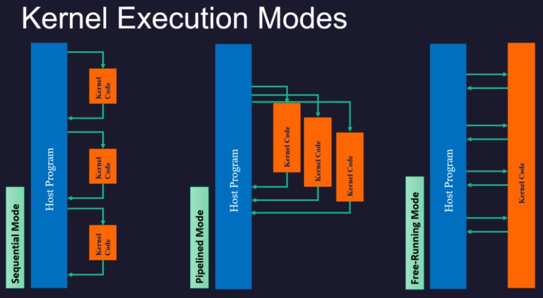
- In this course, sequential mode only

30. OpenCL Concepts
- A host cannot control the kernel directly. Instead it should send some commmands to a queue, and it is the OpenCL runtime to read the queue, fetch the command and order the kernel to do something
- Attached to each device, there must be a context that contains all the related programming objects such as the command queue
- After defining and setting up a context, the host can send commands and then the OpenCL runtime will execute those commands

31. Host Structure
- Setting up the environment
  - Target plaform
  - Devices
  - Create Context
  - Define command queue
  - Define Program
- Core commands
  - Setting up the kernels
  - Buffer definitions
  - Data setting
  - Kernel arguments
  - Kernel execution on FPGA
  - Event synchronization
- Post processing
  - FPGA cleanup
  - Deallocate objects

32. Host code
- OpenCL -> OpenCL C API -> OpenCL C++ API
- Required macro and headers
```cpp
#define CL_HPP_CL_1_2_DEFAULT_BUILD
#define CL_HPP_TARGET_OPENCL_VERSION 120
#define CL_HPP_MINIMUM_OPENCL_VERSION 120
#define CL_HPP_ENABLE_PROGRAM_CONSTRUCTION_FROM_ARRAY_COMPATIBILITY 1
#include <CL/cl2.hpp>
```
- Settubg up the environment
  1. Platform and device
  ```cpp
  std::vector<cl::Device> devices;
  cl::Device device;
  std::vector<cl::Platform> platforms;
  bool found_device = false;
  cl::Platform::get(&platforms);
  for(size_t i=0; (i<platforms.size()) & (found_device==false); i++) {
    cl::Platform platform = platforms[i];
    std::string platformName = platform.getInfo<CL_PLATFORM_NAME>();
    if (devices.size()) {
      device = devices[0];
      found_device = true;
      break;
    }
  }
  if (found_device == false) {
    std::cout << "Error: unable to find target device " << device.getInfo<CL_DEVICE_NAME>() << std::endl;
    return EXIT_FAILURE;
  }
  ```
  2. Context: contains command queue, memory objects, kernel program object
  ```cpp
  cl::Context context(device);
  ```
  3. Command queues
  ```cpp
  cl::CommandQueue q(context, device, CL_QUEUE_PROFILING_ENABLE);
  ```
  4. Program
  ```cpp
  // Load xclbin
  std::cout << "Loading: '" << xclbinFilename << "'\n";
  std::ifstream bin_file(xclbinFilename, std::ifstream;binary);
  bin_file.seekg(0, bin_file.end);
  unsigned nb = bin_file.tellg();
  bin_file.seekg(0,bin_file.beg);
  char *buf = new char [nb];
  bin_file.read(buf, nb);
  // Creating program from binary file
  cl::Program::Binaries bins;
  bins.push_back({buf.nb});
  devices.resize(1);
  cl::Program program(context,devices,bins);
  ```
- Executing commands in the FPGA
  1. Setting up the kernels
  ```cpp
  cl::Kernel krnl_vector_add(program,"krnl_vadd");
  ```
  2. Buffer transfer to/from the FPGA
  ```cpp
  cl::Buffer buffer_a(context, CL_MEM_READ_ONLY, size_in_bytes);
  cl::Buffer buffer_b(context, CL_MEM_READ_ONLY, size_in_bytes);
  cl::Buffer buffer_result(context, CL_MEM_WRITE_ONLY, size_in_bytes);
  ```
    - A single buffer cannot be larger than 4GB, yet to maximize throughput from the host to global memory. Xilinx also recommends to keep the buffer size at least 2MB if available (UG1393 v2020.2 March 22, 2021)
  3. Data setting
  ```cpp
  int *ptr_a = (int*) q.enqueueMapBuffer(buffer_a, CL_TRUE, CL_MAP_WRITE, 0, size_in_bytes);
  int *ptr_b = (int*) q.enqueueMapBuffer(buffer_b, CL_TRUE, CL_MAP_WRITE, 0, size_in_bytes);
  int *ptr_result = (int*) q.enqueueMapBuffer(buffer_result, CL_TRUE, CL_MAP_READ, 0, size_in_bytes);
  ```
  4. Kernel Arguments
  ```cpp
  int narg=0;
  krnl_vector_add.setArg(narg++,buffer_a);
  krnl_vector_add.setArg(narg++,buffer_b);
  krnl_vector_add.setArg(narg++,buffer_result);
  krnl_vector_add.setArg(narg++,DATASIZE);
  ```
  5. Kernel execution on FPGA
    - Migrating input data from host to kernel
    - Invoking the kernel
    - Migrating the output data from kernel to host
  ```cpp
  q.enqueueMigrateMemObjects({buffer_a,buffer_b},0 /* 0 means from host */);
  q.enqueueTask(krnl_vector_add);
  q.enqueueMigrateMemObjects({buffer_result},CL_MIGRATE_MEM_OBJECT_HOST);
  ```
  6. Even synchronization
    - All OpenCL enqueue-based API calls are asynchronous
  ```cpp
  q.finish();
  ```
- Post processing
  1. FPGA cleanup
  ```cpp
  q.enqueueUnmapMemObject(buffer_a, ptr_a);
  q.enqueueUnmapMemObject(buffer_b, ptr_b);
  q.enqueueUnmapMemObject(buffer_result, ptr_result);
  q.finish();
  ```
- Quiz:
  - For a given kernel fuction, define buffer objects
  ```cpp
  extern "C" {
    void spmv_kernel(
      float        *values,
      unsigned int *col_indices,
      unsigned int *row_indices,
      float        *x,
      float        *y,
      unsigned      n,
      unsigned      m,
      unsigned      nnz)
  }
  ```
  - input to kernel
    - values: size of nnz
    - col_indices: size of m
    - row_ptr : size of n
    - x: size of m
  - output from kernel
    - y: size of n
  - Buffer code
  ```cpp
  OCL_CHECK(err,buffer_values     =cl::Buffer(context,CL_MEM_READ_ONLY, nnz*sizeof(float),     nullptr,&err));
  OCL_CHECK(err,buffer_col_indices=cl::Buffer(context,CL_MEM_READ_ONLY, m*sizeof(unsigned_int),nullptr,&err));
  OCL_CHECK(err,buffer_row_indices=cl::Buffer(context,CL_MEM_READ_ONLY, n*sizeof(unsigned_int),nullptr,&err));
  OCL_CHECK(err,buffer_x          =cl::Buffer(context,CL_MEM_READ_ONLY, m*sizeof(float),       nullptr,&err));
  OCL_CHECK(err,buffer_y          =cl::Buffer(context,CL_MEM_WRITE_ONLY,n*sizeof(float),       nullptr,&err));
  ```

33. Exercises

## Section 7: Scaling Example

34. Introduction
- Objectives
  - Studying the memory access pattern of a kernel
  - Debugging an application on emulators and the actual hardware
  - For a vector X, we calculate Y = alpha*X + beta
  
35. Definition
- Scaling equation: y = alpha*x + beta
- 3 inputs of alpha, beta, x
  - How to handle array or pointer data?
- 1 output of y
- Memory latency
  - ~around 100 cycles
  - After addres, when data come
- The processor system sends the scalar values to the accelerator, so the processor is the master and the accelerator is the slave
- During arrays data transaction, the accelerator is the master and the memory is the slave. Note that the memory controllers are located in the PS system such that th ePS acts as a bridge b/w PL and memory

36. Kernel Execution Model
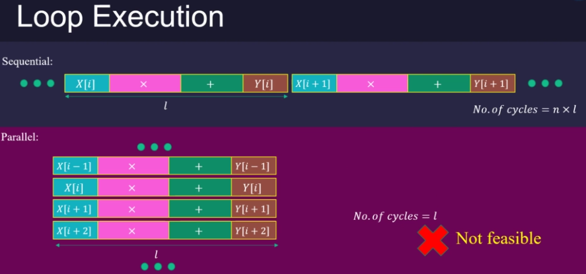
- Sequential mode is slow
- Parallel mode is not feasible
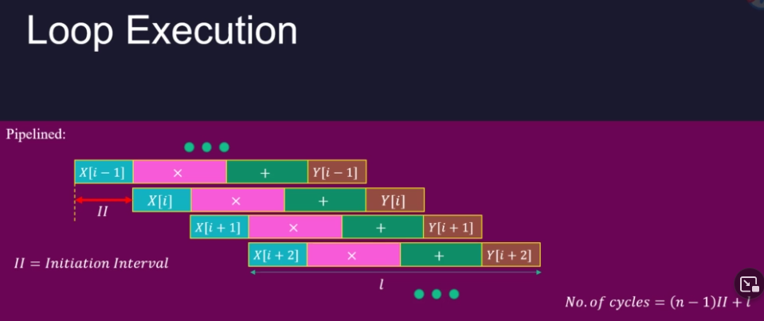
- Pipelined mode
  - Initial Interval is the latency
  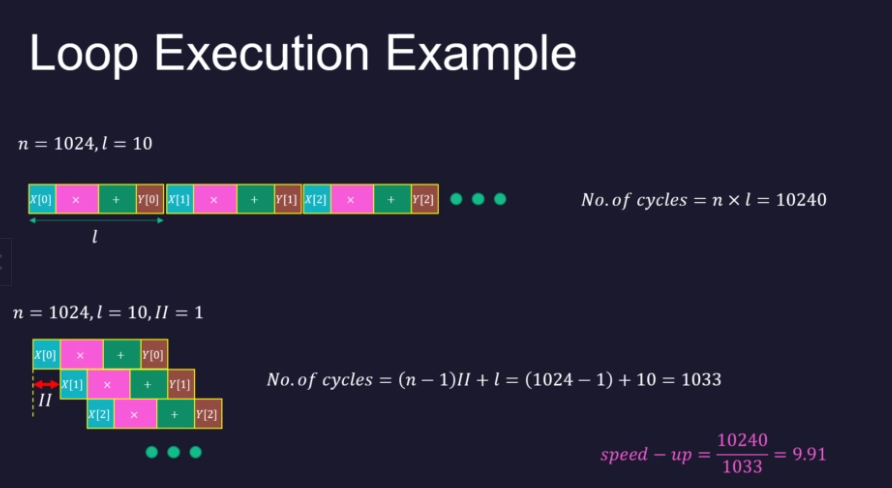
  - We have to make pipelined as much as possible

37. Kernel code
- Vitis-HLS applies the pipeline optimization by default to all possible for-loops in a kernel code
- Vitis-HLS uses a single HP port for communication b/w kernel and memory subsystem
- Use `extern "C"` for the mix of C/C++ code
```cpp
extern "C" {
  void scaling_kernel(
    float *x, float*y,
    float alpha, float beta,
    int n) {
      for (int i=0;i<n;i++) {
        y[i] = alpha*x[i] + beta;
      }
    }
}
```

38. Burst Data Transfer
- Kernel timing b/w memory read and write in one cycle
  - How can this be done?
- Latency in regular memory read/write
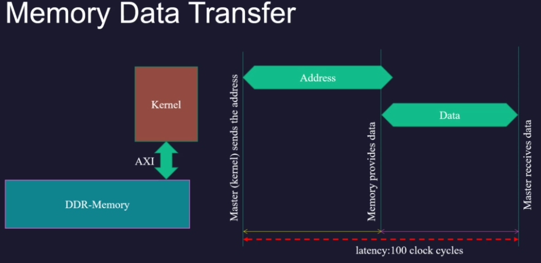  
- Latency in Burst transfer
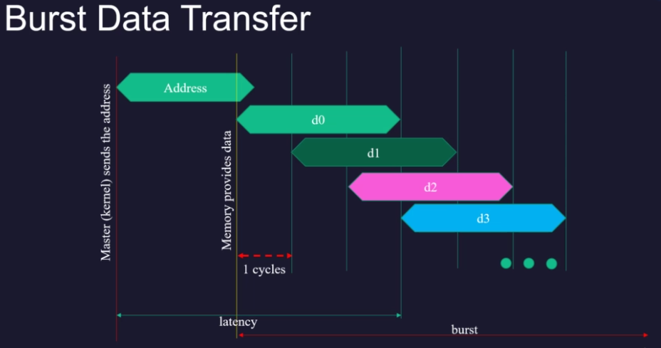  
  - Data received by streaming along pipeline
- Common memory overhead through AXI communication
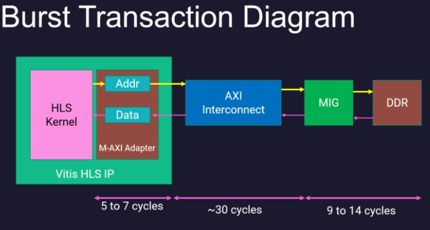  
- AXI Burst protocol
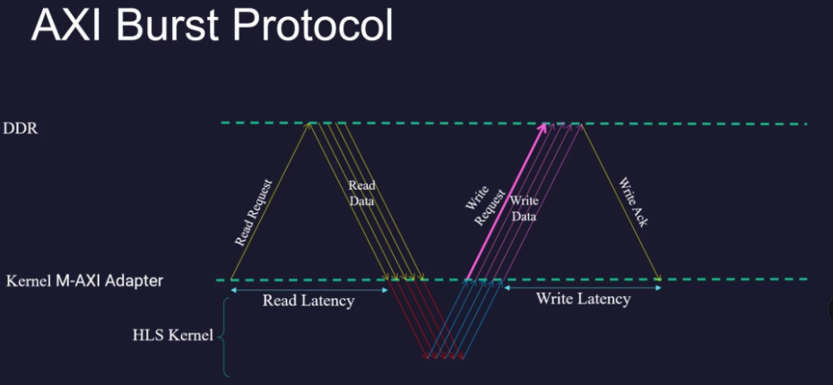  
  - Streaming is the basic idea in Burst data transfer
- The AXI protocol provides burst data transfer for reading/writing a contiguous block of data
- The burst data transfer provides a streaming data communication b/w kernel in the FPGA and DDR memory

39. Host code
- Host code structure
  - Setting up the environment
    - Target platform
    - Devices
    - Context
    - Command queue
    - Program
  - Core commands
    - Setting up the kernels
    - Buffer definitions
    - Data setting
    - Kernel Arguments
    - Kernel execution on FPGA
    - Event Synchronization
  - Post processing
    - FPGA cleanup
- Kernel & Buffers
```cpp
#include <stdlib.h>
#include <fstream>
#include <iostream>
#include <math.h>
#define CL_HPP_CL_1_2_DEFAULT_BUILD
#define CL_HPP_TARGET_OPENCL_VERSION 120
#define CL_HPP_MINIMUM_OPENCL_VERSION 120
#define CL_HPP_ENABLE_PROGRAM_CONSTRUCTION_FROM_ARRAY_COMPATIBILITY 1
#include <CL/cl2.hpp>
#include <sys/time.h>
#include <time.h>
double getTimestamp()
{
  struct timeval tv;
  gettimeofday(&tv, NULL);
  return tv.tv_usec + tv.tv_sec*1e6;
}
double hardware_start;
double hardware_end;
double hardware_time;
int main(int argc, char* argv[]) {
	unsigned int n =   (1024*1024);
    if(argc != 2) {
		std::cout << "Usage: " << argv[0] <<" <xclbin>" << std::endl;
		return EXIT_FAILURE;
	}
    char* xclbinFilename = argv[1];
    std::vector<cl::Device> devices;
    cl::Device device;
    std::vector<cl::Platform> platforms;
    bool found_device = false;
    //traversing all Platforms To find Xilinx Platform and targeted
    //Device in Xilinx Platform
    cl::Platform::get(&platforms);
    for(size_t i = 0; (i < platforms.size() ) & (found_device == false) ;i++){
        cl::Platform platform = platforms[i];
        std::string platformName = platform.getInfo<CL_PLATFORM_NAME>();
        if ( platformName == "Xilinx"){
            devices.clear();
            platform.getDevices(CL_DEVICE_TYPE_ACCELERATOR, &devices);
	    if (devices.size()){
		    device = devices[0];
		    found_device = true;
		    break;
	    }
        }
    }
    if (found_device == false){
       std::cout << "Error: Unable to find Target Device "
           << device.getInfo<CL_DEVICE_NAME>() << std::endl;
       return EXIT_FAILURE;
    }
    // Creating Context and Command Queue for selected device
    cl::Context context(device);
    cl::CommandQueue queue(context, device, CL_QUEUE_PROFILING_ENABLE);
    // Load xclbin
    std::cout << "Loading: '" << xclbinFilename << "'\n";
    std::ifstream bin_file(xclbinFilename, std::ifstream::binary);
    bin_file.seekg (0, bin_file.end);
    unsigned nb = bin_file.tellg();
    bin_file.seekg (0, bin_file.beg);
    char *buf = new char [nb];
    bin_file.read(buf, nb);
    // Creating Program from Binary File
    cl::Program::Binaries bins;
    bins.push_back({buf,nb});
    devices.resize(1);
    cl::Program program(context, devices, bins);
    // 1. Kernel & Buffers
    cl::Kernel krnl_scaling(program,"scaling_kernel");
    cl::Buffer buffer_x(context,  CL_MEM_READ_ONLY,  n*sizeof(float));
    cl::Buffer buffer_y(context,  CL_MEM_WRITE_ONLY, n*sizeof(float));
    // 2. Kernel arguments
    float alpha = 1.3;
    float beta = 47.83;
    //set the kernel Arguments
    int narg=0;
    krnl_scaling.setArg(narg++,buffer_x);
    krnl_scaling.setArg(narg++,buffer_y);
    krnl_scaling.setArg(narg++,alpha);
    krnl_scaling.setArg(narg++,beta);
    krnl_scaling.setArg(narg++,n);
    // 3. Input Data Setting
    float *ptr_x = (float *) queue.enqueueMapBuffer (buffer_x , CL_TRUE , CL_MAP_WRITE , 0, n*sizeof(float));
    float *ptr_y = (float *) queue.enqueueMapBuffer (buffer_y , CL_TRUE , CL_MAP_READ , 0, n*sizeof(float));
    for (unsigned int i = 0; i < n; i++) {
    	ptr_x[i] = rand()/(1.0*RAND_MAX);
    }
    hardware_start = getTimestamp();
    // 4. Kernel execution
    queue.enqueueMigrateMemObjects({buffer_x},0/* 0 means from host*/);
    queue.enqueueTask(krnl_scaling);
    queue.enqueueMigrateMemObjects({buffer_y},CL_MIGRATE_MEM_OBJECT_HOST);
    queue.finish();
    hardware_end = getTimestamp();
    hardware_time = (hardware_end-hardware_start)/1000;
	std::cout << "Exeution time running kernel in hardware 1: "
        		    << hardware_time << " msec " << std::endl;
    // 5. Evaluation
    //Verify the result
    int match = 0;
    for (unsigned int i = 0; i < n; i++) {
    	float y_sw = alpha*ptr_x[i]+beta;
		float diff = fabs(y_sw-ptr_y[i]);
		if(diff > 0.0001 || diff != diff){
			std::cout << "error occurs at " << i
					  << " with value y_hw = " << ptr_y[i]
					  << ", should be y_sw = " << y_sw
  					  << std::endl;
            match = 1;
            break;
        }
    }
    queue.enqueueUnmapMemObject(buffer_x , ptr_x);
    queue.enqueueUnmapMemObject(buffer_y , ptr_y);
    queue.finish();
    std::cout << "TEST " << (match ? "FAILED" : "PASSED") << std::endl;
    return (match ? EXIT_FAILURE :  EXIT_SUCCESS);
}
```
- During the OpenCL buffere memory, pay attention to the direction of the dataflow and choose a proper argument describing the direction
- After sending the kernel execution command, the host code must wait for the results

40. Lab: Executing
- Design Flow
  - Create a project
  - Add kernel code
  - Add host code
  - Introduce the kernel to the project
  - SW emulation
  - HW emulation
  - Build HW configuration
- At GUI
  - A new project
  - Add src code for kernel/host
  - At  *_kernels.prj, add HW functions
  - Build project as SW emulation
  - Took > 90sec for SW emulation
- Image file is locatd at vector_addition_system/Emulation-SW/package/sd_card.img
  - This can be mounted in Linux system

41. Lab: Debugging
- Emulation SW debugging
  - At GUI, right mouse button of the project -> Debug As -> Launch SW emulator
- Emulation HW debugging
  - You can see the timing diagram and data exchange b/w host and kernel codes
- Hardware debugging
- Ref: ug1393-vitis-application-acceleration document
  - https://docs.xilinx.com/r/en-US/ug1393-vitis-application-acceleration

42. Exercises

## Section 8: Image Thresholding example

43. Introduction
- Objectives
  - Reads an image file
  - Studying the burst data transaction in a kernel
  - Working with data files in Vitis
  - How to use the external SW library in HLS

44. Definition
- Image thresholding
  - output_pixel = maxval if input_pixel > threshold or 0 otherwise
  - Grey image to black/white
- Kernel pseudo-code
  - input_image/output_image through AXI Master    
  - AXIlite for threshold and maxVal arguments
- Summary
  - Image thresholding has two pointers (image files) and two scalar arguments (threshold,maxVal)
  - The port interface for the pointer arguments is master AXI, and the port interface for the scalar arguments is AXI-lite

45. Kernel code
```cpp
extern "C" {
  void image_thresholding_kernel(
    unsigned char *input_image,
    unsigned char *output_image,
    unsigned int n,
    unsigned int m,
    unsigned int threshold,
    unsigned int maxVal)
  {
    unsigned char input_pixel;
    unsighed char output_pixel;
    for (unsigned int i=0; i<n*m; i++) {
      input_pixel = input_image[i];
      output_pixel = (input_pixel > threshold) ? maxVal :0;
      output_image[i] = output_pixel;
    }
  }
}
```
- HP0 port will channel the kernel point arguments b/w DDR memory and FPGA
- Kernel timing diagram
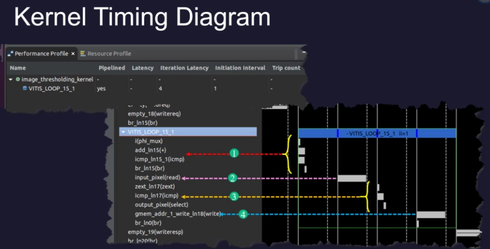  
- Kernel execution model
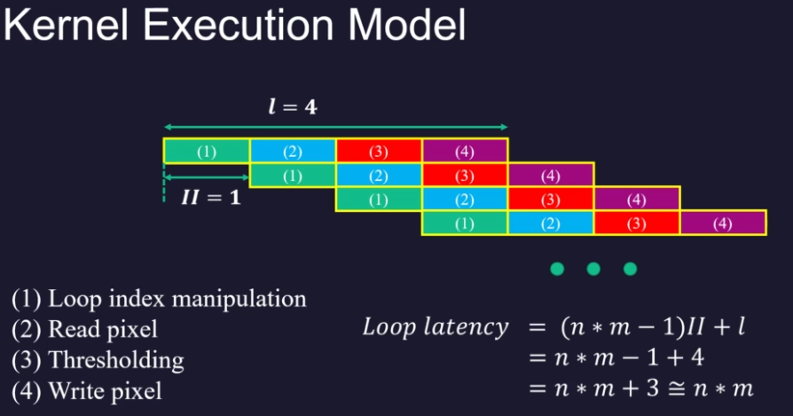  
- AXI Burst
  - The memory access in the loop
    - Must be a monotonically increasing order of access
    - Must be consecutive in memory - one next to another with no gaps or overlap and in forward order
- Burst analysis example
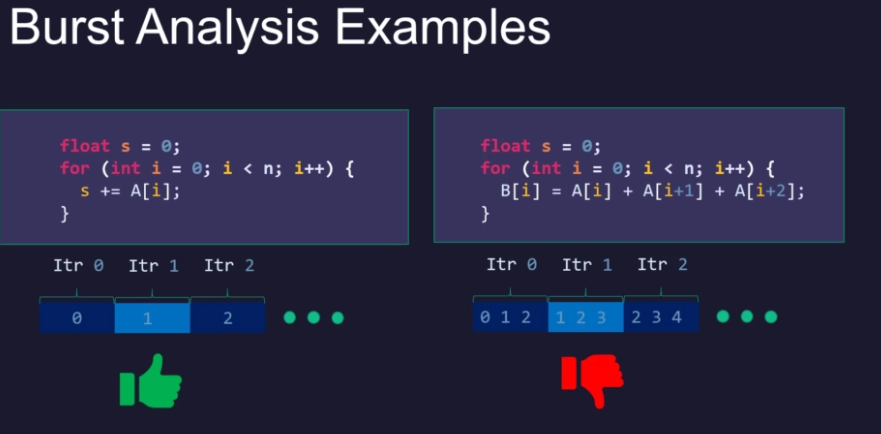  
- Summary
  - A pipeline micro-architecture can implement image thresholding kernel
  - Array indices in burst loop must be monotonically increasing without gap

46. Host code
- Using OpenCV library
```cpp
#define CL_HPP_CL_1_2_DEFAULT_BUILD
#define CL_HPP_TARGET_OPENCL_VERSION 120
#define CL_HPP_MINIMUM_OPENCL_VERSION 120
#define CL_HPP_ENABLE_PROGRAM_CONSTRUCTION_FROM_ARRAY_COMPATIBILITY 1
#include <CL/cl2.hpp>
#include <opencv2/core/core.hpp>
#include <opencv2/imgcodecs/imgcodecs.hpp>
#include <opencv2/imgproc/imgproc.hpp>
#include <opencv2/highgui/highgui.hpp>
#include <opencv2/features2d/features2d.hpp>
#include <opencv2/xfeatures2d.hpp>
#include <opencv2/videoio/videoio.hpp>
#include <stdlib.h>
#include <fstream>
#include <iostream>
using namespace std;
using namespace cv;
int main(int argc, char* argv[])
{
  int status = 0;
  Mat src_image;
  Mat grey_image;
  src_image=imread("data/test_image.jpg");
  if (!src_image.data) {
    cout << "Could not open image" << endl;
    return 0;
  };
  unsigned int DATA_SIZE = src_image.rows * src_image.cols;
  size_t size_in_bytes = DATA_SIZE * sizeof(unsigned char);
  cvtColor(src_image, grey_image, cv::COLOR_BGR2GRAY);
  Mat dst, dst_golden;
  dst = grey_image.clone();
  dst_golden = grey_image.clone();
  unsigned int  threshold_value = 128;
  unsigned int max_binary_value = 255;
  std::cout << " size_in_bytes = '" << size_in_bytes << "'\n";
  if(argc != 2) {
  	std::cout << "Usage: " << argv[0] <<" <xclbin>" << std::endl;
    return EXIT_FAILURE;
  }
  char* xclbinFilename = argv[1];
  std::vector<cl::Device> devices;
  cl::Device device;
  std::vector<cl::Platform> platforms;
  bool found_device = false;
  cl::Platform::get(&platforms);
  for(size_t i = 0; (i < platforms.size() ) & (found_device == false) ;i++){
  	cl::Platform platform = platforms[i];
    std::string platformName = platform.getInfo<CL_PLATFORM_NAME>();
    if ( platformName == "Xilinx"){
     	devices.clear();
     	platform.getDevices(CL_DEVICE_TYPE_ACCELERATOR, &devices);
      if (devices.size()){
        device = devices[0];
        found_device = true;
        break;
      }
    }
  }
  if (found_device == false){
    std::cout << "Error: Unable to find Target Device "
             << device.getInfo<CL_DEVICE_NAME>() << std::endl;
    return EXIT_FAILURE;
  }
  cl::Context context(device);
  cl::CommandQueue q(context, device, CL_QUEUE_PROFILING_ENABLE);
  std::cout << "Loading: '" << xclbinFilename << "'\n";
  std::ifstream bin_file(xclbinFilename, std::ifstream::binary);
  bin_file.seekg (0, bin_file.end);
  unsigned nb = bin_file.tellg();
  bin_file.seekg (0, bin_file.beg);
  char *buf = new char [nb];
  bin_file.read(buf, nb);
  cl::Program::Binaries bins;
  bins.push_back({buf,nb});
  devices.resize(1);
  cl::Program program(context, devices, bins);
  cl::Kernel krnl_image_thresholding(program,"image_thresholding_kernel");
  cl::Buffer buffer_in(context,  CL_MEM_READ_ONLY, size_in_bytes);
  cl::Buffer buffer_out(context, CL_MEM_WRITE_ONLY, size_in_bytes);
  int narg=0;
  krnl_image_thresholding.setArg(narg++, buffer_in);
  krnl_image_thresholding.setArg(narg++, buffer_out);
  krnl_image_thresholding.setArg(narg++, grey_image.cols);
  krnl_image_thresholding.setArg(narg++, grey_image.rows);
  krnl_image_thresholding.setArg(narg++, threshold_value);
  krnl_image_thresholding.setArg(narg++, max_binary_value);
  unsigned char *ptr_in = (unsigned char  *) q.enqueueMapBuffer (buffer_in ,  CL_TRUE , CL_MAP_WRITE , 0, size_in_bytes);
  unsigned char *ptr_out = (unsigned char *) q.enqueueMapBuffer (buffer_out , CL_TRUE , CL_MAP_READ  , 0, size_in_bytes);
  for (unsigned int i = 0; i< size_in_bytes; i++) {
  	ptr_in[i] = grey_image.data[i];
  }
  dst.data =  ptr_out;
  q.enqueueMigrateMemObjects({buffer_in},0/* 0 means from host*/);
  q.enqueueTask(krnl_image_thresholding);
  q.enqueueMigrateMemObjects({buffer_out},CL_MIGRATE_MEM_OBJECT_HOST);
  q.finish();
  imwrite("grey_threshold.jpg", dst);
  threshold( grey_image, dst_golden, threshold_value, max_binary_value, THRESH_BINARY );
  imwrite("grey_threshold-golden.jpg", dst_golden);
  for (int i = 0; i < grey_image.rows*grey_image.cols; i++) {
	if (dst.data[i] != dst_golden.data[i]) {
		std::cout << " Error at " << i
				  << " hardware dst.data = " << dst.data
               	  << " dst_golden = " << dst_golden.data
                   << std::endl;
		status = -1;
        break;
	}
  }
  cout << "Bye thresholding image" << endl;
  return status;
}
```

47. Emulation - lab
- C/C++Build -> Settings -> Tool Settings -> GCC Host Linker (Arm) -> Libraries, Add opencv_imgcodecs, opencv_highgui, opencv_core, opencv_imgproc

48. Hardware - lab

49. Exercises

## Section 9: Linear Relationship Accelerator Example

50. Introduction
- Objectives
  - Describing a kernel code that requires parallel DDR memory accesses
  - Handling the error codes return by OpenCL APIs

51. Definition
- C = alpha * A + beta * B + gamma
  - A, B, C: n-vectors
  - alpha, beta, gamma: scalar
- Kernel Execution Model
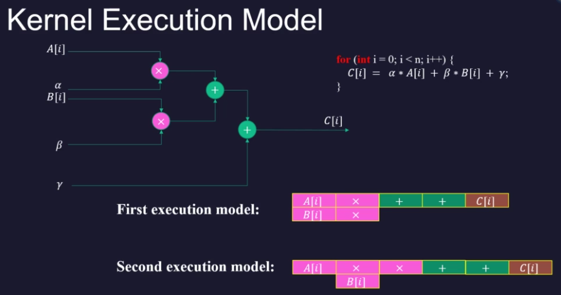 
  - First execution model: when there are two memory ports. A[i] and B[i] can be read in parallel
  - Second execution model: when there is one memory port only. Computation is pipelined
- When there are two ports
  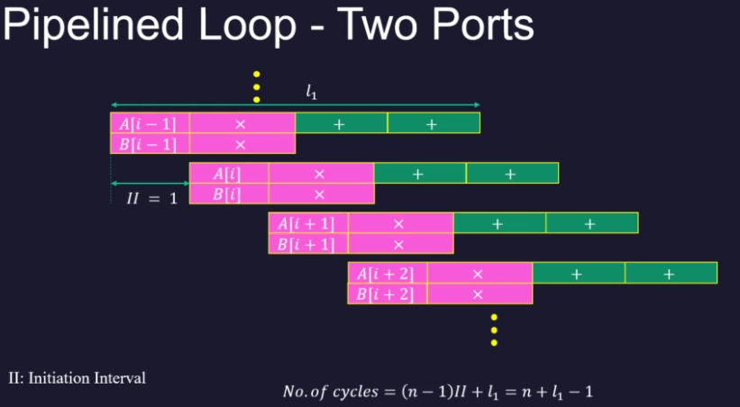 
  - No. cycles = (n-1)*II + l1 = n + l1 - 1
- When there is one ports
  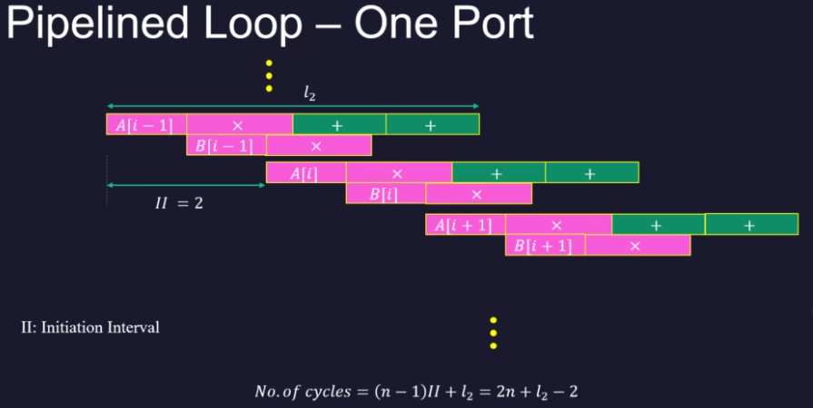 
  - No. cycles = (n-1)*II + l2 = 2*n + l2 - 2
  - Note that No. cycles is 2x of the case having two ports
- Summary
  - Providing enough memory ports can improve the performance of an application on FPGA
  - The burst data transfer protocol must support a pipelined implementation of for-loop for providing maximum performance

52. Kernel code
```cpp
extern "C" {
  void linear_relationship_kernel(
    float *A, float *B, float *C, 
    float alpha, float beta, float gamma,
    unsigned int n) {
      for (unsigned int i=0;i<n;i++) {
        C[i] = alpha*A[i] + beta*B[i] + gamma;
      }
  }
}
```
- Synthesis report will show:
  - Interval: 2
  - Unable to schedule bus request on port 'gmem' due to limited memory ports
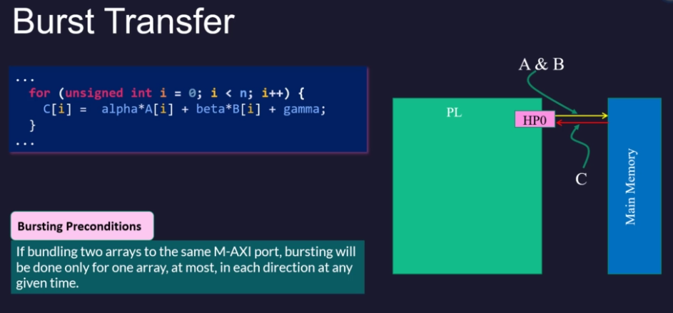 
- We use HLS Interface Pragma to separate memory port
```cpp
extern "C" {
  void linear_relationship_kernel(
    float *A, float *B, float *C, 
    float alpha, float beta, float gamma,
    unsigned int n) {
#pragma HLS INTERFACE m_axi port=A bundle=gmem_0
#pragma HLS INTERFACE m_axi port=B bundle=gmem_1
      for (unsigned int i=0;i<n;i++) {
        C[i] = alpha*A[i] + beta*B[i] + gamma;
      }
  }
}
```
- Actual mapping of gmem_0/1 into HP0/1 is done at linker
  - `connectivity.sp linear_relationship_kernel_1.m_axi_gmem_0:HP0 --conectivity.sp linear_relationship_kernel_1.m_axi_gmem_1:HP1`

53. Host
- OpenCL error codes
  - `cl_int err;`
  - More than 70 error codes
- We use OpenCL API Check macro, OCL_CHECK()
- host code:
```cpp
#define CL_HPP_CL_1_2_DEFAULT_BUILD
#define CL_HPP_TARGET_OPENCL_VERSION 120
#define CL_HPP_MINIMUM_OPENCL_VERSION 120
#define CL_HPP_ENABLE_PROGRAM_CONSTRUCTION_FROM_ARRAY_COMPATIBILITY 1
#include <CL/cl2.hpp>
#include <stdlib.h>
#include <fstream>
#include <iostream>
#include <math.h>
//OCL_CHECK doesn't work if call has templatized function call
#define OCL_CHECK(error,call)                                        \
    call;                                                            \
    if (error != CL_SUCCESS) {                                       \
      std::cout << __FILE__ << ": " << __LINE__ << " Error calling " \
      #call ", error code is: " << error << std::endl;               \
      exit(EXIT_FAILURE);                                            \
    }
#define DATA_SIZE (1024*1024)
int main(int argc, char* argv[]) {
    //TARGET_DEVICE macro needs to be passed from gcc command line
    if(argc != 2) {
		std::cout << "Usage: " << argv[0] <<" <xclbin>" << std::endl;
		return EXIT_FAILURE;
	}
    char* xclbinFilename = argv[1];
    // Compute the size of array in bytes
    size_t size_in_bytes = DATA_SIZE * sizeof(float);
    std::vector<cl::Device> devices;
    cl::Device device;
    std::vector<cl::Platform> platforms;
    bool found_device = false;
    cl_int err;
    OCL_CHECK(err, err = cl::Platform::get(&platforms));
    for(size_t i = 0; (i < platforms.size() ) & (found_device == false) ;i++){
        cl::Platform platform = platforms[i];
        OCL_CHECK(err, std::string platformName = platform.getInfo<CL_PLATFORM_NAME>(&err));
        if ( platformName == "Xilinx"){
            devices.clear();
            OCL_CHECK(err, err = platform.getDevices(CL_DEVICE_TYPE_ACCELERATOR, &devices));
	    if (devices.size()){
		    device = devices[0];
		    found_device = true;
		    break;
	    }
        }
    }
    if (found_device == false){
       std::cout << "Error: Unable to find Target Device "
           << device.getInfo<CL_DEVICE_NAME>() << std::endl;
       return EXIT_FAILURE;
    }
    OCL_CHECK(err, cl::Context context(device, NULL, NULL, NULL, &err));
    OCL_CHECK(err, cl::CommandQueue queue(context, device, cl::QueueProperties::Profiling, &err));
    // Load xclbin
    std::cout << "Loading: '" << xclbinFilename << "'\n";
    std::ifstream bin_file(xclbinFilename, std::ifstream::binary);
    bin_file.seekg (0, bin_file.end);
    unsigned nb = bin_file.tellg();
    bin_file.seekg (0, bin_file.beg);
    char *buf = new char [nb];
    bin_file.read(buf, nb);
    // Creating Program from Binary File
    cl::Program::Binaries bins;
    bins.push_back({buf,nb});
    devices.resize(1);
    OCL_CHECK(err, cl::Program program(context, devices, bins, NULL, &err));
    cl::Kernel krnl_linear_relationship;
    OCL_CHECK(err, krnl_linear_relationship = cl::Kernel(program,"linear_relationship_kernel", &err));
    cl::Buffer buffer_A;
    cl::Buffer buffer_B;
    cl::Buffer buffer_C;
    OCL_CHECK(err, buffer_A = cl::Buffer(context, CL_MEM_READ_ONLY, size_in_bytes, nullptr, &err));
    OCL_CHECK(err, buffer_B = cl::Buffer(context, CL_MEM_READ_ONLY, size_in_bytes, nullptr, &err));
    OCL_CHECK(err, buffer_C = cl::Buffer(context, CL_MEM_WRITE_ONLY, size_in_bytes, nullptr, &err));
    float alpha = 1.34;
    float beta  = 2.45;
    float gamma = 3.45;
    //set the kernel Arguments
    int narg=0;
    OCL_CHECK(err, err = krnl_linear_relationship.setArg(narg++,buffer_A));
    OCL_CHECK(err, err = krnl_linear_relationship.setArg(narg++,buffer_B));
    OCL_CHECK(err, err = krnl_linear_relationship.setArg(narg++,buffer_C));
    OCL_CHECK(err, err = krnl_linear_relationship.setArg(narg++,alpha));
    OCL_CHECK(err, err = krnl_linear_relationship.setArg(narg++,beta));
    OCL_CHECK(err, err = krnl_linear_relationship.setArg(narg++,gamma));
    OCL_CHECK(err, err = krnl_linear_relationship.setArg(narg++,DATA_SIZE));
    //We then need to map our OpenCL buffers to get the pointers
    float *ptr_A = (float *) queue.enqueueMapBuffer (buffer_A , CL_TRUE , CL_MAP_WRITE , 0, size_in_bytes);
    float *ptr_B = (float *) queue.enqueueMapBuffer (buffer_B , CL_TRUE , CL_MAP_WRITE , 0, size_in_bytes);
    float *ptr_C = (float *) queue.enqueueMapBuffer (buffer_C , CL_TRUE , CL_MAP_READ , 0, size_in_bytes);
    //setting input data
    for(int i = 0 ; i< DATA_SIZE; i++){
	    ptr_A[i] = rand()/(1.0*RAND_MAX);
	    ptr_B[i] = rand()/(1.0*RAND_MAX);
    }
    OCL_CHECK(err, err = queue.enqueueMigrateMemObjects({buffer_A,buffer_B},0/* 0 means from host*/));
    OCL_CHECK(err, err = queue.enqueueTask(krnl_linear_relationship));
    OCL_CHECK(err, err = queue.enqueueMigrateMemObjects({buffer_C},CL_MIGRATE_MEM_OBJECT_HOST));
    OCL_CHECK(err, err = queue.finish());
    //Verify the result
    int match = 0;
    for (int i = 0; i < DATA_SIZE; i++) {
        float host_result = alpha*ptr_A[i] + beta*ptr_B[i]+gamma;
        double diff = fabs(ptr_C[i]-host_result);
        if(diff > 0.0001 || diff != diff){
            std::cout << "Error at " << i
            		  << " C hardware is " << ptr_C[i]
					  << " but C golden is " << host_result
					  << std::endl;
            match = 1;
            break;
        }
    }
    OCL_CHECK(err, err = queue.enqueueUnmapMemObject(buffer_A , ptr_A));
    OCL_CHECK(err, err = queue.enqueueUnmapMemObject(buffer_B , ptr_B));
    OCL_CHECK(err, err = queue.enqueueUnmapMemObject(buffer_C , ptr_C));
    OCL_CHECK(err, err = queue.finish());
    std::cout << "TEST " << (match ? "FAILED" : "PASSED") << std::endl;
    return (match ? EXIT_FAILURE :  EXIT_SUCCESS);
}
```

54. Lab - Emulator

55. Lab - Hardware

56. Exercises

## Xilinx product
- Virtex: for DSP
- Alveo: for HPC

## Xilinx math library
- Vitis HLS Math library
