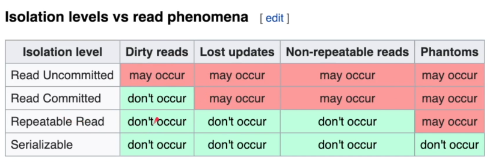

## Fundamentals of Database Engineering
- Instructor: Hussein Nasser

## Section 1: Course Update

### 1. Welcome to the Course

### 2. Course Note 1

### 3. Course Note 2

### 4. Course Note 3

### 5. Note about Docker

### 6. Slides

## Section 2: ACID

### 7. Introduction to ACID
- ACID: Atomicity, Consistency, Isolation, Durability in Relational Database Systems

### 8. What is a Transaction?
- A collection of queries
- One unit of work
- Transaction lifespan
  - BEGIN
  - COMMIT
  - ROLLBACK
  - Unexpected ending = ROLLBACK
- Nature of transactions
  - Usually transcactions are used to change and modify data
  - It is normal to have a read only transaction
    - Ex: Snapshot report based at the time of transaction
    - Will be addressed in the section of the isolation
- Scenario
  - Sending $100 from account 1 to acccount 2
```
BEGIN TX1
  SELECT BALANCE FROM ACCOUNT WHERE ID=1
  BALANCE > 100
    UPDATE ACCOUNT SET BALANCE=BALANCE-100 WHERE ID=1
    UPDATE ACCOUNT SET BALANCE=BALANCE+100 WHERE ID=2
COMMIT TX1
```

### 9. Atomicity
- All queries in a transaction must succeed
- If one query fails, all prior successful queries in the transaction must ROLLBACK
- If the database went down prior to a commit of a transaction, all the successful queries in the transaction must ROLLBACK
- Lack of atomicity results in inconsistency
- **An atomic transaction is a transaction that will rollback all queries if one or more queries**failed

### 10. Isolation
- Can my inflight transaction see changes made by other transactions?
  - Race conditions
  - Read phenomena
    - Dirty reads: read value changes by other transaction but not commited yet
    - Non-repeatable reads: 2 sequental queries in a single transaction produce different results
    - Phantom reads: in range queries, some rows are inserted/deleted by another transactions
    - Lost updates: two transactions work on the same row while none of them notices
- Isolation levels
  - Read uncommitted - no isolation, any change from the outside is visible to the transaction, committed or not
  - Read committed - each query in a transaction only sees command changes by other transactions
  - Repeatable read - the transaction will make sure that when a query reads a a row, that row will remain unchnaged in the transaction while it is running
  - Snapshot - each query in a transaction only sees changes that have been committed up to the start of the transaction
  - Serializable - transactions are run as if they serialized one after the other

- Database implementation of isolation
  - Each DBMS implements isolation lavel differently
  - Pessimistic - row level locks, table locks, page locks to avoid lost updates
  - Optimistic - no locks. Just tracks if thing change and fail the transaction if so
  - Repeatable read "locks" the rows it reads but it could be expensive if you read a lot of rows. Postgres implements RR as snapshot. This is whyt you don't get phantom reads with Postgres in repeatable read
  - Serializable are usually implemented with optimistic concurrency control, and you can implement it pessimistically  with SELECT FOR UPDATE

### 11. Consistency
- Consistency in data
  - Defined by the user
  - Referential integrity (foreign keys)
  - Atomicity
  - Isolation
- Consistency in reads
  - If a transaction committed a change, will a new transaction immediately see the change?
  - Affects the system as a whole
  - Relational and NoSQL databases suffer from this
  - Eventual consistency

### 12. Durability
- Changes made by committed transactions must be persisted in a durable non-volatile storage
- Durability techniques
  - WAL - Write ahead log
    - Writing a lot of data to disk is expensive
    - This is why DBMS persist a compressed version of the changes known as WAL(write-ahead-log segments)
    - A write request in OS usually goes to the OS cache. When OS crashes, machine restart could lead to the loss of data
    - fsync will enforce the direct disk right but could be expensive
  - Asynchronous snapshot
  - AOF (Append Only File)

### 13. ACID by Practical Examples
- Postres prompt
  - create table product (pid serial primary key, name text, price float, inventory integer );
  - create table sales (saleid serial primary key, pid integer, price float, quantity integer);
  - insert into products(name, price, inventory) values('Phone', 999.99, 100);
  - select * from products:
  - begin transaction;
  - update products set inventory = inventory - 10;
  - select * from products;
  - insert into sales (pid, price, quantity)
  - values(1, 999.99, 10);
  - select * from sales;
  - select * from products;
  - commit; # Atomicity is guaranteed when commit is made

### 14. Phantom Reads
- Happens at concurrent transactions
  - One calculates sum
  - Another inserts a new row
  - Now the one has different sum results
- Postgres may serialize, isolating the transaction
  - begin transaction isolation level serializable
  - This prevents phantom reading
  - or in PostgreSQL: begin transaction isolation level repeatable read

### 15. Serializable vs Repeatable Read
- Given table: a; b;
- Transaction 1: a-> b
- Transaction 2: b-> a
- When t1 and t2 occur simultaneously, what would happen?
  - When one user serialize then another user tries to commit with serialization, this commit will fail

### 16. Eventual Consistency
- Consistency
  - Consistency in Data
    - Defined by the user
    - Referential integrity
      - Correlated tables must show consistent data
      - Ex: Pictures table vs Pictures_likes table
    - Atomicity
    - Isolation
  - Consistency in reads
    - Updating data x/Reading X
    - When DB is distributed
    - If a transaction committed a change will a new transaction immediately see the change?
    - Both of RDBMS and NoSQL suffer from this when we want to scale horizontally or introduce caching
- Eventual Consistency
  - Ex: Jaffar is architecting a database system. He set up a single primary database with 4 worker replicas. He configured the system so it uses asynchronous replication with 4. This means that a commit to the primary will immediately succeed and asynchronously the primary will issue commits on the background to the 4 replicas. 
    - While writes are faster since the only commit we need to wait for are the primary's however there will be reads of off the worker nodes that will mismatch with the primary node. Thus **the system will have eventual consistency** or perhaps weaker than that. 
  
## Section 3: Understanding Database Internals

### 17. How tables and indexes are stored on disk 
- Storage concepts
  - Table
  
  - Row_id
  
  - Page
  
    - Unit of read caching
  - IO
    - IO operation is a read request to the disk
    - We try to minimize this as much as possible
    - An IO can fetch 1 page or more depending on the disk partitions and other factors
    - An IO cannot read a single row but a page with many rows in them
    - You want to minimize the number of IOs as they are expensive
    - Some IOs in OS goes to the operating system cache, not disk
  - Heap data structure
    - The heap is data structure where the table is stored with all its pages one after another
    - This is where the actual data is stored including everything
    - Traversing the heap is expensive as we need to read so many data to find what we want
    - That is why we need indexes that help us to tell exactly what part of the heap we need to read. What pages of the heap we need to pull
  - Index
    - An index is another data structure separate from the heap that has pointers to the heap
    - It has part of the data and used to quickly search for something
    - You can index on one column or more
    - Once you find a value of the index, you go to the heap to fetch more information where everything is here
    - Index tells you EXACTLY which page to fetch in the heap instead of taking the hit to scan every page in the heap
    - The index is also stored as pages and cost IO to pull the entries of the index
    - The smaller the index, the more it can fit in memory the faster the search
    - Popular data structure for index is b-trees, learn more on that in the b-tree section
- Notes
  - Sometimes the heap table can be organized around a single index. This is called a clustered index or an index Organized index
  - Primary key is usually a clustered index unless otherwise specified
  - MySQL InnoDB always have a primary key (clustered index) other indexes point to the primary key "value"
  - Postgres only has secondary indexes and all indexes point directly to the row_id which lives in the heap

### 18. Row-Based vs Column-Based Databases
- Row-oriented database
  - Tables are stored as rows in disk
  - A single block IO read to the table fetches multiple rows with all their columns
  - More IOs are required to find a particular row in a table scan but once you find the row you get all columns for that row
  - Ex: select first_name from emp where ssn=666
    - Query loads all table to match ssn=666
    - When found, first_name is already loaded in the cache and can find the value immediately
  - Ex: select * from emp where id = 1
    - All column data are found when id is met
    - In column oriented table, `select *` could be very expensive
  - Ex: select sum(salary) from emp
    - Huge waste of IO for non-used data
- Column-oriented database
  - Tables are stored as columns first in disk
  - A single block IO read to the table fetches multiple columns with all matching rows
  - Less IOs are required to get more values of a given column. But working with multiple columns require more IOs
  - OLAP
  - Ex: select first_name from emp where ssn=666
    - From the column of ssn, can find the index easily
    - Then from the column of first_name, we can find the value of the matching index easily
  - Ex: select * from emp where id = 1
    - Find the index from the column of id
    - The collect of data for all the columns using the found index
      - Very expensive
  - Ex: select sum(salary) from emp
    - Just the column of salary only
    - Very quick
- Pros & Cons

| Row based | Column based |
|-----------|--------------|
| optical for read/writes | writes are slower|
| OLTP (Online Transaction Processing) | OLAP (Online Analytical Processing) |
| Compression isn't efficient| Compresses greatly |
| Aggregation isn't efficient | Amazing for aggregation |
| Efficient queries w/ multi-columns | Inefficient queries w/ multi-columns |


### 19. Primary Key vs Secondary Key - What you probably didn't know
- There is no ordering on tables but clustering
- Clustered index (Postgres) or Index Organized Table (Oracle)

### 20. Database Pages
- Postgres Default page size is 8KB, MySQL InnoDB is 16KB, MongoDB WiredTiger is 32KB, SQL Server is 8KB and Oracle is also 8KB. Database defaults work for most cases but it is important to know these default and be prepared to configure it for your use case.

## Section 4: Database Indexing

### 21. Create Postgres TAble with a million rows (from scratch)
- In Postgres prompt
  - create table temp(t int)
  - insert into temp(t) select random() *100 from generate_series(0. 1000000)
  
### 22. Getting Started with Indexing
- Index
- In postgres prompt
  - explain analyze select id from employees where id=2000;
    - Took 0.141ms
    - Using index only scan. Index scan is way faster
    - No heap fetch
  - explain analyze select name from employees id = 5000;
    - Took 2.520ms
  - explain analyze select id from employees where name = 'Zs'
    - Took 3199.724ms using 2 threads
    - No index for name
  - explain analyze select id from employees where name like '%Zs%'
    - Much slower
  - create index employees_name on employees(name);
    - Will take time to create B-tree
    - Now "explain analyze select id from employees where name = 'Zs'" took 47.089 ms
    - "explain analyze select id from employees where name like '%Zs%'" is still slower as index scan doesn't work for this search
- `select *` is very expensive query

### 23. Understanding the SQL Query Planner and Optimizer with Explain
- `explain` in postgres
- `explain select * from grades;`
  - cost: msec to load the first page, total amount of time expected
  - Rows:
  - width: sum of all bytes in a single row


### 24. Bitmap Index Scan vs Index Scan vs Table Scan
- Sequential table scan
  - Cheaper than index scan over the entire table scan
  - Scans the entire table as stored on the disk
- Index scan
  - Performs B-tree traversal, using an index to find specific rows
- Bitmap Heap scan 
  - Takes a row location bitmap generated by Bitmap Index scan and looks up the relevant data
  - Bitmap: postgres builds an array, mapping as 0 or 1 bit for every page, by the conditions
- Bitmap Index scan
  - B/w sequential scan and index scan

### 25. Key vs Non-key Column Database Indexing
- Addition of non-key columns allows index-only scans to be used for queries that otherwise could not use them
  - https://www.postgresql.org/docs/current/sql-createindex.html
- In postres prompt:
  - create index g_idx on students (g);
  - explain analyze select id, g from students where  g > 80 and g< 95 order by g desc;
    - Took 11 sec
  - How can we do index-only scan?
    - create index g_idx on students (g) include (id);
  - Now the search took 4sec using Index Only Scan

### 26. Index Scan vs Index Only Scan
- explain analyze select name from grades where id=7;
  - Took 413ms using Seq Scan
- create index id_idx on grades(id);
- explain analyze select name from grades where id=7;
  - Took 1.123ms, using Index Scan
- explain analyze select id from grades where id=7;
  - Took 0.1ms, using Index only scan
  - This query is non-sense. Just test
- drop index id_idx;
- create index id_idx on grades(id) include (name)
  - Non-key indexing
- explain analyze select name from grades where id=7;
  - Took 7.058ms using Index Only Scan
    - No table scan. Only Index scan
- Non-key index may accelerate search but the size of DB will increase    

### 27. Combining Database Indexes for Better Performance
- create index test(a);
- create index test(b);
- explain analyze select c from test where a=70;
  - Took 253 ms using Bitmap Heap Scan
    - This DB has millions of rows
  - C is not part of index
- explain analyze select c from test where a=70 limit 2;
  - Took 0.2ms using Index Scan
- explain analyze select c from test where b=100;
  - 250ms using Bitmap Heap scan
- select c from test where a = 100 and b = 200;
  - 4.181ms using Bitmap Heap Scan
- select c from test where a = 100 or b = 200;
  - 488.123ms using Bitmap Heap Scan
  - More rows than "and" condition
- create index on test (a,b);
- explain analyze select c from test where a=70;
  - 253.99ms using Bitmap Heap Scan
    - Bitmap Index Scan on test_a_b_idx
- explain analyze select c from test where a=70 limit 2;
  - Uses Index Only Scan
- explain analyze select c from test where b=100;
  - 572.5ms using Parallel Seq Scan
  - As b is RHS in test_a_b_idx, and Index Scan is not available
    - **For composite index, we can use only left most hand side key**
- explain analyze select c from test where a=70 and b=80;
  - 0.488 ms using Index Scan
- explain analyze select c from test where a=70 or b=80;
  - 758.292 ms using Parallel Seq Scan

### 28. How Database Optimizers Decide to Use Indexes
- When there are multiple indexes
- Index hinting: guide the DB to use the given index

### 29. Create Index Concurrently - Avoid Blocking Production Database Writes
- After creating an index, we cannot insert value anymore
- create index concurrently g on grades(g);
  - `concurrently` keyword enables insert after the creation of an index

### 30. Bloom Filters
- In-memory representation of hash table
  - In the server, prior to scanning DB
  - For the search like the existence of username or keyword

### 31. Working with Billion-Row Table
- Brute-force building
  - Using multiple threading/processing
- Making subsets of the Table
  - Sum of million rows
  - Partitioning
    - Which partition we need to scan?
    - Partition key
  - Sharding

### 32. Article - The cost of long running Transactions

### 33. Article - Microsoft SQL Server Clustered Index Design 

## Section 5: B-Tree vs B+ Tree in Production DAtabase Systems

### 34. B-Tree Section's Introduction & Agenda

### 35. Full Table Scans
- The slowest scan
- Requires many IOs to read all pages
  - Multiple threading

### 36. Original B-Tree
- Balanced Data Structure for fast traversal
- Has nodes
- In B-tree of "m" degrees, some nodes have m child nodes
- Node has up to "m-1" elements
- Each element has a key and a value
  - Key is the searching condition in SQL
- The value is usually data pointer to the row
- Data pointer can point to primary key or tuple
- Consists of Root node, internal node, and leaf nodes 
- A node = disk page

### 37. How the Original B-Tree Helps Performance

### 38. Original B-Tree Limitations
- Elements in all nodes store both the key and the value
- Internal nodes take more space thus require more IO and can slow down traversal
- Range queries are slow because of random access
- B+Tree solves those problems

### 39. B+Tree
- Exactly like B-tree but only stores keys in the internal nodes
- Values are only stored in leave nodes
- Internal nodes are smaller since they store only keys and they can fit more elements
- Leave nodes are "linked" so once you find a key then you can find all values before and after that key
- Great for range queries

### 40. B+Tree DBMS Considerations
- Cost of leaf pointer (cheap)
- 1 node fits a DBMS page (most DBMS)
- Can fit internal nodes easily in memory for fast traversal
- Leaf nodes can live in data files in the heap
- Most DBMS systems use B+Tree

### 41. B+Tree Storage Cost in MySQL vs Postgres
- B+Trees secondary index values can either point directly to the tuple (Postgres) or to the primary key (MySQL)
- If the Primary key data type is expensive this can cause bloat in all secondary indexes for database such MySQL
- Leaf nodes in MySQL contains the full row since its an IOT (Index Organized Table)/clustered index

### 42. B-Tree Section's Summary

## Section 6: Database Partitioning

### 43. Introduction to Database Partitioning
- Converts a huge table into many tables

### 44. What is Partitioning
- Split 1M rows table into 5 tables called partitions. Same schema

### 45. Vertical vs. Horizontal Partitioning
- Horizontal partitioning splits rows into partitions
  - Range or List
- Vertical partitioning splits columns partitions
  - Large column (blob) can be stored in a slow access drive in its own table space

### 46. Partitioning Types
- By Range
  - Dates, IDs - log date, customer ID
- By List
  - Discrete values or zip codes - State name
- By Hash
  - Hash functions - consistent hashing

### 47. The Difference b/w Partitioning and Sharding
- Horizontal partitioning vs sharding
  - HP splits big table into multiple tables in the same data base, client is agnostic
  - Sharding splits big table into multiple tables across multiple servers
    - Clients are aware of this
  - HP table name change (or schema)
  - In sharding, everything is same but server changes

### 48. Preparing: Postgres, Database, Table, Indexes
- Demo:
  - Spin up a postgres instance
  - Create a table of 10M rows
  - Create partitions
- In postgres prompt:
  - create table grades_org (id serial not null, g int not null);
  - insert into grades_org(g) select floor(random()*100) from generate_series (0, 10000000);
  - create index grades_org_index on grades_org(g);

### 49. Execute Multiple Queries on the Table
- Testing query time on this big table

### 50. Create and Attach Partitioned Tables
- create table grades_parts (id serial not null, g int not null) partition by range(g);
- create table g0035 (like grade_parts including indexes);
- create table g3560 (like grade_parts including indexes);
- create table g6080 (like grade_parts including indexes);
- create table g80100 (like grade_parts including indexes);
- alter table grades_parts attach partition g0035 for values from (0) to (35);
- alter table grades_parts attach partition g3560 for values from (35) to (60);
- alter table grades_parts attach partition g6080 for values from (60) to (80);
- alter table grades_parts attach partition g80100 for values from (80) to (100);

### 51. Populate the Partitions and Create Indexes
- insert into grades_parts select * from grades_org;
  - Copy the entire table
  - Depending on the value of g, rows are partitioned automatically
- create index grades_parts_idx on grades_parts(g);
  - For the attached tables, postgres will produce their indexes

###  52. Class Project - Querying and Checking the Size of Partitions
- explain analyze select count(*) from grade_parts where g=30;
  - Index Only Scan using g0036_g_idx on g0035
    - g0036_g_idx is made by postgres as addressed above
- select pg_relation_size(oid), relname from pg_class order by  pg_relation_size(oid) desc;
  - Bytes info of tables
- show ENABLE_PARTITION_PRUNING;
  - Shows partition info
- set enable_partition_pruning = off
  - Disables partitioning. Query on grades_parts errors
- Make sure `set enable_partition_pruning = on` to use Table partitioning

### 53. The Advantages of Partitioning
- Pros:
  - Improves query performance when accessing a single partition
  - Sequential scan vs scattered index scan
  - Easy bulk loading (attach partition)
  - Archive old data that are barely accessed into cheap storage

### 54. The Disadvantages of Partitioning
- Cons:
  - Updates that move rows from a partition to another - slow or fail sometimes
  - Inefficient queries could scan all partitions, resulting in slower performance
  - Schema changes can be challenging - DBMS could manage it though

### 55. Section Summary - Partitioning

### 56. How to Automate Partitioning in Postgres
- create_partitions.mjs:
```js
import pg from 'pg';
/*
This script creates 100 partitions 
and attaches them to the main table customers
docker run --name pg -e POSTGRES_PASSWORD=postgres -p 5432:5432 -d postgres
*/
async function run() {
    try {
    const dbClientPostgres = new pg.Client({
        "user": "postgres",
        "password" : "postgres",
        "host" : "husseinmac",
        "port" : 5432,
        "database" : "postgres"
    })
    console.log ("connecting to postgres...")
    await dbClientPostgres.connect();
    console.log ("dropping database customers...")
   // await dbClientPostgres.query("drop database customers")
   // console.log ("creating database customers...")
    await dbClientPostgres.query("create database customers")
    const dbClientCustomers = new pg.Client({
        "user": "postgres",
        "password" : "postgres",
        "host" : "husseinmac",
        "port" : 5432,
        "database" : "customers"
    })
    console.log ("connecting to customers db...")
    await dbClientCustomers.connect();
    console.log("creating customers table...")
    const sql = `create table customers (id serial, name text) 
                 partition by range (id)`
    await dbClientCustomers.query(sql)
    console.log("creating partitions... ")
    /*
    assume we are going to support 1B customers
    and each partition will have 10M customers 
    that gives 1000/10 -> 100 partition tables 
    */
   for (let i =0; i < 100; i ++)
    {   
        const idFrom = i*10000000;
        const idTo = (i+1)*10000000  ;
        const partitionName = `customers_${idFrom}_${idTo}`
        const psql1  = `create table ${partitionName}
                         (like customers including indexes)`;
        const psql2  = `alter table customers
            attach partition ${partitionName}
            for values from (${idFrom}) to (${idTo})
         `;
       console.log(`creating partition ${partitionName} `)
       await dbClientCustomers.query(psql1);
       await dbClientCustomers.query(psql2);
    }   
    console.log("closing connection")
    await dbClientCustomers.end();
    await dbClientPostgres.end();
    console.log("done.")
    }
    catch (ex){
        console.error(`something went wrong ${JSON.stringify(ex)}`)
    }
}
 run();
```
- populate_customers.mjs:
```js
import pg from 'pg';
/*
make sure to run the create_partitions.mjs file 
to create partitions before running this
node create_partitions.mjs 
*/
async function run() {     
    const dbClientCustomers = new pg.Client({
        "user": "postgres",
        "password" : "postgres",
        "host" : "husseinmac",
        "port" : 5432,
        "database" : "customers"
    })
    console.log ("connecting to customers db...")
    await dbClientCustomers.connect(); 
    console.log("inserting customers... ")
    /*
    creating a billion customers
    */
   for (let i =0; i < 100; i ++)
    {   
        /* creates a million row */
        const psql  = `insert into customers(name) (
                        select random() from generate_series(1,10000000)
                        )
                          `;   
       console.log(`inserting 10m customers...   `)
       await dbClientCustomers.query(psql ); 
    }   
    console.log("closing connection")
    await dbClientCustomers.end(); 
    console.log("done.")
}
 run();
```

## Section 7: Database Sharding

### 57. Introduction to Database Sharding

### 58. What is Database Sharding?
- Ex: Split 1 million rows table into 5 DB instances, using same schema

### 59. Consistent Hashing
- Ex: there are 3 shards
  - Hashing input must yield consistent results, pointing to the same server
  - num("string_input")%3

### 60. Horizontal partitioning vs Sharding
- HP splits a big table into multiple tables in the same database
- Sharding splits a big table into multiple tables across multiple servers
- HP table name changes (or schema)
- In sharding, every thing is same but the server changes

### 61. Sharding with Postgres

### 62. Spin up Docker Postgres Shards
- init.sql:
```sql
CREATE TABLE URL_TABLE
(
  id serial NOT NULL PRIMARY KEY,
  URL text,
  URL_ID character(5)
)
```
- Dockerfile:
```
FROM postgres
COPY init.sql /docker-entrypoint-initdb.d
```
- docker build -t pgshard .
- docker run --name pgshard1 -p 5432:5432 -d pgshard
- docker run --name pgshard2 -p 5433:5432 -d pgshard
- docker run --name pgshard3 -p 5434:5432 -d pgshard
- Using pgAdmin GUI, set up 3 servers

### 63. Writing to a Shard
- index.js
```js
const app = require("express")();
const {Client} = require("pg");
const crypto = require("crypto");
const HashRing = require("hashring");
const hr = new HashRing();
hr.add("5432")
hr.add("5433")
hr.add("5434")
const clients = {
    "5432" : new Client ({
        "host": "husseinmac",
        "port": "5432",
        "user": "postgres",
        "password": "postgres",
        "database": "postgres"
    }),
    "5433" : new Client ({
        "host": "husseinmac",
        "port": "5433",
        "user": "postgres",
        "password": "postgres",
        "database": "postgres"
    }),
    "5434" : new Client ({
        "host": "husseinmac",
        "port": "5434",
        "user": "postgres",
        "password": "postgres",
        "database": "postgres"
    })
}
async function connect() {
    await clients["5432"].connect();
    await clients["5433"].connect();
    await clients["5434"].connect();
}
app.get("/:urlId", async (req, res) => {
    //https://localhost:8081/fhy2h
    const urlId = req.params.urlId; //fhy2h
    const server = hr.get(urlId)
    const result = await clients[server].query("SELECT * FROM URL_TABLE WHERE URL_ID = $1", [urlId]);
   if (result.rowCount > 0) {
    res.send({
        "urlId": urlId,
        "url": result.rows[0],
        "server": server
    })
   }
   else
      res.sendStatus(404)    
})
app.post("/", async (req, res) => {
    const url = req.query.url;
    //www.wikipedia.com/sharding
    //consistently hash this to get a port! 
    const hash = crypto.createHash("sha256").update(url).digest("base64")
    const urlId = hash.substr(0, 5);
    const server = hr.get(urlId)
    await clients[server].query("INSERT INTO URL_TABLE (URL, URL_ID) VALUES ($1,$2)", [url, urlId]);

    res.send({
        "urlId": urlId,
        "url": url,
        "server": server
    })
})
app.listen(8081, () => console.log("Listening 8081") )
```
- At chrome console:
  - fetch("http://localhost:8081/?url=https://wikipedia.com/sharding", {"method":"POST"})

### 64. Reading from a Shard

### 65. Advantages of Database Sharding
- Pros:
  - Scalability
    - Data
    - Memory
  - Security - users can access certain shards
  - Optimal and smaller index size

### 66. Disadvantage of Database Sharding
- Cons:
  - Complex client: aware of the shard
  - Transactions across shards problem
  - Rollbacks
  - Schema changes are hard
  - Joins
    - HP for joining
  - Has to be something you know in the query

### 67. Database Sharding Section Summary

### 68. When should you consider Sharding your Database?

## Section 8: Concurrency Control

### 69. Shared vs Exclusive Locks
- A shared ( S ) lock permits the transaction that holds the lock to read a row. 
- An exclusive ( X ) lock permits the transaction that holds the lock to update or delete a row.
- Ref: https://dev.mysql.com/doc/refman/8.4/en/innodb-locking.html

### 70. Dead Locks
- DBMS can detect deadlocks and will fail the transaction
- EX:
  - T1 and T2 do the following transaction simultaneously
  - T1:
    - begin transaction
    - insert into test values (20)
    - insert into test values (21)
      - Deadlock detected
      - Note that commit is not done yet
  - T2:
    - begin transaction
    - insert into test values (21)
    - insert into test values (20)

### 71. Two-phase Locking
- Double-booking
  - Reserving same seats in the same time
- EX:
  - T1 and T2 do the following transaction simultaneously
  - T1:
    - begin transaction
    - select * from seats where id = 13;
    - update seats set isbooked = 1, name = 'John' where  id = 13;
  - T2:
    - begin transaction
    - select * from seats where id = 13;
    - select * from seats where id = 13;
    - update seats set isbooked = 1, name = 'Ann' where  id = 13;
  - T1 or T2, the latest commit will overwrite the owner of the seat
- Exclusive lock on two-phases
  - begin transaction
  - select * from seats where id = 14 for update;
    - 1st phase lock is made using `for update`
    - If T2 does the same query, it hangs due to the lock
  - update seat set isbooked=1, name = "Tom" where id = 14;
  - commit;
    - This releases T2 query, showing the updated status

### 72. Solving the Double Booking Problem (code example)
- How to prevent double-booking/race conditions
```js
import Express from "express";
import pg from "pg";
const port = process.env.PORT || 8080;
const app = new Express(); 
import { dirname } from 'path';
import { fileURLToPath } from 'url';
const __dirname = dirname(fileURLToPath(import.meta.url));
const pool = new pg.Pool({
    "host": "husseinmac.local",
    "port": 5432,
    "user":"postgres",
    "password" : "postgres",
    "database" : "postgres",
    "max": 20,
    "connectionTimeoutMillis" : 0,
    "idleTimeoutMillis": 0
})
app.get("/", (req, res) => {
    res.sendFile(__dirname + "/index.html");
})
//get all seats 
app.get("/seats", async (req, res) => {
    const result = await pool.query("select * from seats");
    res.send(result.rows)
})
//book a seat give the seatId and your name 
app.put("/:id/:name", async (req, res) => {
    try{
        const id = req.params.id 
        const name = req.params.name;
 
        const conn = await pool.connect();
        //begin transaction
        await conn.query("BEGIN");
        //getting the row to make sure it is not booked
        const sql = "SELECT * FROM seats where id = $1 and isbooked = 0 FOR UPDATE"
        // FOR UPDATE for row-level lock
        // Oracle supports time-out for exclusive lock
        const result = await conn.query(sql,[id])
        //if no rows found then the operation should fail can't book
        if (result.rowCount === 0) {
            res.send({"error": "Seat already booked"})
            return;
        } 
        //if we get the row, we are safe to update
        const sqlU= "update seats set isbooked = 1, name = $2 where id = $1"
        const updateResult = await conn.query(sqlU,[id, name]);        
        //end transaction
        await conn.query("COMMIT");
        conn.release();
        res.send(updateResult)
    }
    catch(ex){
        console.log(ex)
        res.send(500);
    }       
}) 
app.listen(port, () => 
console.log("Listening on " + port))
```

### 73. Double Booking Problem Part 2 (Alternative Solution and explanation)
- T1: 
  - update seats set isbooked=1, u='John' where id =1 and isbooked = 0;
- T2:
  - update seats set isbooked=1, u='Rick' where id =1 and isbooked = 0;
    - Implicitly locked from T1
    - T2 hangs here
    - When T1 commits, T2 is released - transaction fails

### 74. SQL Pagination With Offset is Very Slow
- select title from news offset 100 limit 10;
  - offset keyword will waste 0-100 rows
- Ex from postgres:
  - explain analyze select title from news order by id desc offset 0 limit 10
    - Index Scan backward, taking 0.291ms
  - explain analyze select title from news order by id desc offset 1000 limit 10
    - 1.021ms
    - explain analyze select title from news order by id desc offset 100000 limit 10
      - 79ms
    - Instead, try: explain analyze select title.id from news where id < 1009999993 order by id desc limit 10;

### 75. Database Connection Pooling
- old.js:
```js
const app = require("express")();
const {Client} = require("pg");
app.get("/all", async (req, res) => {
    const fromDate = new Date();
    const client = new Client({
        "host": "husseinmac.local",
        "port": 5432,
        "user":"postgres",
        "password" : "postgres",
        "database" : "husseindb"
    })
    //connect
    await client.connect();
    //return all rows
    const results = await client.query("select * from employees")
    console.table(results.rows)
    //end
    client.end();
    const toDate = new Date();
    const elapsed = toDate.getTime() - fromDate.getTime();
    //send it to the wire
    res.send({"rows": results.rows, "elapsed": elapsed, "method": "old"})
})
app.listen(9000, () => console.log("Listening on port 9000"))
```
- pool.js:
```js
const app = require("express")();
const {Pool} = require("pg");
const pool = new Pool({
    "host": "husseinmac.local",
    "port": 5432,
    "user":"postgres",
    "password" : "postgres",
    "database" : "husseindb",
    "max": 20,
    "connectionTimeoutMillis" : 0,
    "idleTimeoutMillis": 0
})
app.get("/employees", async (req, res) => {
    const fromDate = new Date();
    //return all rows
    const results = await pool.query("select employeeid eid,firstname,ssn from employees")
    console.table(results.rows)
    console.log(new Date())
    const toDate = new Date();
    const elapsed = toDate.getTime() - fromDate.getTime();
    //send it to the wire
    res.send({"rows": results.rows, "elapsed": elapsed, "method": "pool"})
})
app.listen(2015, () => console.log("Listening on port 2015"))
```

## Section 9: Database Replication

### 76. Introduction to Database Replication

### 77. Master/Standby Replication
- One master/leader node that accepts writes/ddls (Data Definition Languages)
- One ore more backup/standby nodes that receive those writes from the master
- Simple to implement/no conflicts

### 78. Multi-master Replication
- Multiple master/leader node that accepts writes/ddls
- One ore more backup/follower nodes that receive those writes from the masters
- Need to resolve conflict

### 79. Synchronous vs Asynchronous Replication
- Synchronous Replication
  - A write transaction to the master will be blocked until it is written to the backup/standby nodes
  - First 2, First 1 or Any
- Asynchronous Replication
  - A write transaction is considered successful if it is written to the master, then asynchronously the writes are applied to backup nodes

### 80. Replication Demo with Postgres 13
- Spin up two postgres instances with docker
  - docker run --name pmaster -p 5432:5432 -v ~/postgres/rep/pmaster_data:/var/lib/postgresql/data -e POSTGRES_PASSWORD=postgres -d postgres
  - docker logs pmaster
  - docker run --name pstandby -p 5433:5432 -v ~/postgres/rep/pstandby_data:/var/lib/postgresql/data -e POSTGRES_PASSWORD=postgres -d postgres
- Make one master another one standby
  - docker stop pmaster pstandby # stop the docker and copy master file into the standby
  - mv pstandby_data pstandby_data_bk
  - cp -R pmaster_data pstandby_data  
  - docker start pmaster pstandby
  - cd pmaster_data 
  - Append following to pg_hba.conf:
  ```
  host replication postgres all md5
  ```
- Connect standby to master
  - cd ../pstandby_data
  - Edit postgresql.conf:
  ```
  primary_conninfo="applciation_name=standby1 host=myDesktop port=5432 user=postgres password=postgres'
  ```
  - docker stop pmaster pstandby
- Make master aware of the standby
  - touch standby.signal
  - cd ../pmaster_data
  - Edit postgresql.conf
  ```
  synchronous_standby_names = 'first 1 (standby1)'
  ```
  - docker start pmaster pstandby
  - docker logs pmaster # now standby1 is recognized
- create table test (id int, t varchar(200));
- \d test;
- At standby: create table test1 (id int, t varchar(200))
  - Fails - read only

### 81. Pros and Cons of Replication
- Pros
  - Horizontal scaling
  - Region based queries - DB per region
- Cons
  - Eventual Consistency
  - Slow writes (synchronous)
  - Complex to implement (multi-master)

## Section 10: Database System Design

### 82. Twitter System Design Database Design
- Post tweet 140 chars
  - client - web server - DB
    - Local DB at client to keep text as backup
    - SQLite at every mobile device
  - Message queues
  - Pooling
  - Load balancer (Layer3) b/w client and web server
    - Transparent proxy
- Follow people
  - List followers: count(ID)
    - Note that COUNT() is slow
  - Tables of Profile, following
  - List of followers/following
    - In client side
- Home Timeline

### 83. Building a Short URL System Database Backend
- sketchpad.io. Commercial $4.99
- Client - server - DB
- ID: 64bit integer
- URL: Long URL
- DB: B-Tree gets slower as the size increases
  - LSM tree: Cassandra, RocksDB
- POST of URL -> SHA hashing as 8 CHAR -> DB
  - Hashing collision?
    - Regenerate Hashing using random SALT
    - https://stackoverflow.com/questions/625542/hash-and-salt-collision
- Sanitization of input: vulnerability of SQL injection
- May avoid sharding when available
- Scaling
  - Read-only backup servers
  - Sharding is very complex
  - NoSQL might be feasible but consistency would be an issue
    - Write would be fast but indexing would be an issue

## Section 11: Database Engines

### 84. Introduction
- Database engine or storage engine

### 85. What is a Database Engine?
- Library that takes care of the on-disk storage and CRUD
  - Can be as simple as key-value store
  - Or as rich and complex as full support ACID and transactions with foreign keys
- DBMS can use the database engine and build features on top (server, replication, isolation, stored procedures, etc)
- Referred as storage engine or embedded database
- Some DBMS gives you flexibility to switch engines like MySQL & MariaDB
- Some DBMS has a built-in engine and you cannot change it (Postgres)

### 86. MyISAM
- Indexed Sequential Access Method
- B-tree indexes point to the rows directly
- No transaction support
- Open sources and owned by Oracle
- Inserts are fast but updates/deletes could be problematic
- Database crashes corrupts tables
- Table level locking
- Supported by MySQL, MariaDB, Percona
- Default engine for MySQL in the past

### 87. InnoDB
- B+tree - with indexes point to the primary key and the PK points to the row
- Replaces MyISAM
- Default for MySQL and MariaDB
- ACID compliant transactions support
- Foreign keys
- Tablespaces
- Row level locking
- Spatial operations
- Owned by Oracle

### 88. XtraDB
- Fork of InnoDB
- Not well maintained
- MariaDB used it before but now InnoDB

### 89. SQLite
- Designed by D. Richard Hipp in 2000
- Popular embedded database for local data
- B-tree (LSM as extension)
- Postgres-like syntax
- Full ACID and table locking
- Concurrent read & wries
- Web SQL in browsers uses it
- Included in many OS by default

### 90. Aria
- Created by Michael Widenius
- Similar to MyISAM
- Crash-safe
- Not owned by Oracle
- Designed specifically for MariaDB
  - All system tables in MaraDB are Aria

### 91. BerkeleyDB
- Developed by Sleepycat SW in 1994 (owned by Oracle)
- Key-value embedded database
- Supports ACID transactions, locks, replications, etc
- Used in bitcoin core - switched to LevelDB
- Used MemcacheDB

### 92. LevelDB
- Written by Jeff and Sanjay from Google 2011
- Log structured merge tree (LSM)
  - Great for insert and SSD
  - In SSD, insert/read is fast but update could be problematic
- No transactions
- Inspired by Google Big Table
- Levels of files
  - Memtable
  - Level 0 (young level)
  - Level 1-6
- As file grow, large levels are merged
- Used in bitcoin core blockchain, AutoCAD, Minecraft

### 93. RocksDB
- Facedbook forked LevelDB in 2012 to become RocksDB
- Transactional
- High performance, multi-threaded compaction
- MyRocks for MySQL, MariaDB and Percona
- MongoRocks for MongoDB

### 94. Popular Database Engines
- B-Tree: Oracle, IBM DB@, Microsft SQL, PostgreSQL, MySQL, MongoDB, Couchbase
- LSM Tree: cassandra, Apache Hbase, Google Cloud Bigtable, elasticsearch, RocksDB, LEVELDB, YugaByteDB

### 95. Switching Database Engines with mySQL
- Demo MySQL
  - Spin up a MySQL docker container
    - docker run --name ms1 -p 3306:3306 -e MYSQL_ROOT_PASSWORD=XXXXX mysql
    - docker exec -it ms1 bash
    - mysql -u root -pXXX # no space b/w -p and passwd
  - Create a table myISAM
    - create database test;
    - use test;
    - create table employees_myisam (id int primary key auto_increment, name text) engine = myisam;
    - When insert a new data, it is visible even prior to commit
  - Create a table InnoDB
    - create table  employees_innodb (id int primary key auto_increment, name text) engine = innodb;
  - Connect to the database with JS
```js
const mysql = require('mysql2/promise');
connectInnoDB();
async function connectInnoDB(){
    try {
        const con = await mysql.createConnection({
            "host": "husseinmac",
            "port": 3306,
            "user": "root",
            "password": "password",
            "database": "test"
        })
       await con.beginTransaction();
       await con.query(
           "INSERT INTO employees_innodb (name) values (?)",
            ["Hussein"])
       const [rows, schema] = await con.query(
           "select * from employees_innodb"
       )
       console.table(rows);
       await con.commit();
       await con.close();
       console.log(result)
    }
    catch(ex){
        console.error(ex)
    }
    finally{
    }
}
async function connectMyISAM(){
    try {
        const con = await mysql.createConnection({
            "host": "husseinmac",
            "port": 3306,
            "user": "root",
            "password": "password",
            "database": "test"
        })
       await con.beginTransaction(); 

       await con.query(
           "INSERT INTO employees_myisam (name) values (?)",
            ["Hussein"])
       await con.commit();
       await con.close();
       console.log(result)
    }
    catch(ex){
        console.error(ex)
    }
    finally{
    }
}
```
  - See how transactions behave on MyISAM vs InnoDB

## Section 12: Database Cursors

### 96. What are Database Cursors?
- select id from grades where g between 90 and 100;
  - Very expensive query
- Database cursor
  - declare c cursor for select id from grades where g between 90 and 100;
  - fetch c; # first row by the query
  - fetch c; # second
  - fetch c; # ...
  - fetch last c; # last entry
- Pros of using cursor
  - Saves memory
  - Can be canceled
- Cons
  - Stateful - memory is allocated
    - Cannot share the cursor with other transaction
  - Long transactions
    - May affect system performance/disrupt others

### 97. Server Side vs Client Side Database Cursors
- The cursor is called a client-side cursor when these resources are located on the client machine. The cursor is called a server-side cursor when these resources are located on the server machine.
  - Ref: https://community.progress.com/s/article/6343

### 98. Inserting Million Rows with Python in Postgres using Client Side Cursor
- insert1m.py:
```py
import psycopg2
con = psycopg2.connect(host="husseinmac",
                        database="husseindb",
                        user="postgres",
                        password = "postgres")
cur = con.cursor()
for i in range(1000000):
    cur.execute("insert into employees (id, name) values(%s,%s) ", (i, f"test{i}"))
#commit 
con.commit()
#close
con.close()
```

#### 99. Querying with Client Side Cursor
- clientcur.py:
```py
import psycopg2
import time as t
con = psycopg2.connect(host="husseinmac",
                        database="husseindb",
                        user="postgres",
                        password = "postgres")
#client side cursor
s = t.time()
cur = con.cursor()
e = (t.time() - s)*1000 
print(f"Cursor established in {e}ms")
s = t.time()
cur.execute("select * from employees") # took 845 ms
e = (t.time() - s)*1000 
print(f"execute query {e}ms")
s = t.time()
rows = cur.fetchmany(50)
e = (t.time() - s)*1000 
print(f"fetching first 50 rows {e}ms") # took 0.026 ms
cur.close()
con.close()
```

### 100. Querying with SErver Side Cursor
- servercur.py
```py
import psycopg2
import time as t
con = psycopg2.connect(host="husseinmac",
                        database="husseindb",
                        user="postgres",
                        password = "postgres")
#client side cursor
s = t.time()
cur = con.cursor("hussein") # server-side cursor has NAME
e = (t.time() - s)*1000 
print(f"Cursor established in {e}ms")
s = t.time()
cur.execute("select * from employees")
e = (t.time() - s)*1000 
print(f"execute query {e}ms")
s = t.time()
rows = cur.fetchmany(50)
e = (t.time() - s)*1000 
print(f"fetching first 50 rows {e}ms")
cur.close()
con.close()
```

### 101. Pros and Cons of Server vs Client Side Cursors
- Client side cursor
  - Pros
    - Memory consumption on client side
  - Cons
    - Depletes network bandwidth
    - Client may not have much memory
- Server side cursor
  - Pros
    - Server runs memory eating jobs for clients
    - Better performance than client, minimizing network traffic
  - Cons
    - Negative impact on performance
    - Stateful - cannot benefit web-environment
      - From the instructor: Because the web is stateless, ie each request can land on a completely different server and served by a different server. This means if you send a request and that created a server side cursor on the database, and you get a reference on the backend server 1, the second request to consume the cursor might go to backend server 2 and it won't know how to retrieve the server side cursor and end up creating a new one.

### 102. Article - Server Side Cursor Types in SQL Server

## Section 13: SQL vs NoSQL Architecture

### 103. MongoDB Architecture 
- Database internals
  - Frontend: API, Data format
  - Storage engine: Storage, indexes, data files, transactions, WAL
- MongDB internals
  - MMAPv1 Storage engine - early version
    - diskloc: file pointer
  - WiredTiager Storage engine (v4.2-5.2)
    - Document level locking
  - Clustered collection (v>5.3)
    - Almost identical to MySQL

### 104. MongoDB Internals

### 105. MongoDB Clustered Collections
- https://www.mongodb.com/docs/v6.2/core/clustered-collections/
- Clustered collections have additional performance improvements for inserts, updates, deletes, and queries.
  - All collections have an _id index.
  - A non-clustered collection stores the _id index separately from the documents. This requires two writes for inserts, updates, and deletes, and two reads for queries.
  - A clustered collection stores the index and the documents together in _id value order. This requires one write for inserts, updates, and deletes, and one read for queries.

### 106. MemCached In-Memory database Architecture

## Section 14: Database Security

### 107. How to Secure Your Postgres Database by Enabling TLS/SSL
- docker run --name pg --p 5432:5432 postgres
- docker run -e PGADMIN_DEFAULT_EMAIL="john" -e PGADMIN_DEFAULT_PASSWORD="XXXXX" -p 5555:80 --name pgadmin dpage/pgadmin4
- In pgadmin GUI,
  - Create - Server
    - SSL: required
    - Error message: SSL is not supported
- Update container with SSL
  - docker exec -it pg bash
  - apt-get update && apt-get install vim
  - cd var/lib/postgresql
  - vi postgresql.conf
  ```
  ssl = on
  ssl_cert_file = 'cert.pem'
  ssl_key_file = 'private.pem'
  ```
  - openssl req -x509 -newkey rsa:4096 -nodes -keyout private.pem -out cert.pem
  - chmod 600 private.pem
  - chown postgres private.pem
  - exit
  - docker stop pg
  - docker start pg
  - pgAdmin, enabling SSL = Require, then can connect

### 108. Deep Look into Postgres Wire Protocol with Wireshark

### 109. Deep Look into MongoDB Wire Protocol with Wireshark

### 110. What is the largest SQL statement that you can send to your database
- 1MB SQL statements were accepted
  - 960 TCP segments
- 10MB SQL statements crashed the server

### 111. Best practices working with REST & Databases

### 112. Database Permissions and Best Practices for Building REST API
- Do not store passwd in the text configure file
  - Use system variable or key vault
- Configure different users per operation like create, read, insert, delete
- Do not tell users the status of server
  - Error details when insert/update fails
  - Info of vulnerabilty
```js
//using pool is better for web apps so that we can 
//reserve a client connection for each request and 
//avoid problems with concurrent requests.. 
//Check out this video I discuss this in details
//https://www.youtube.com/watch?v=GTeCtIoV2Tw
//I Changed all the singelton clients in this code to Pool
const {Pool} = require("pg")
const express = require ("express")
const app = express();
app.use(express.json())
//dbread role with SELECT 
const dbReadPool = new Pool({
    "user": "dbread",
    "password" : "dbread",
    "host" : "husseinmac",
    "port" : 5432,
    "database" : "todo"
})
//dbdelete role with SELECT, DELETE
const dbDeletePool = new Pool({
    "user": "dbdelete",
    "password" : "dbdelete",
    "host" : "husseinmac",
    "port" : 5432,
    "database" : "todo"
})
//dbcreate role with INSERT
const dbCreatePool = new Pool({
    "user": "dbcreate",
    "password" : "dbcreate",
    "host" : "husseinmac",
    "port" : 5432,
    "database" : "todo"
})
app.get("/", (req, res) => res.sendFile(`${__dirname}/index.html`))
app.get("/todos", async (req, res) => {
    const rows = await readTodos();
    res.setHeader("content-type", "application/json")
    res.send(JSON.stringify(rows))
})
app.post("/todos", async (req, res) => {
    let result = {}
    try{
        const reqJson = req.body;
        result.success = await createTodo(reqJson.todo)
    }
    catch(e){
        result.success=false;
    }
    finally{
        res.setHeader("content-type", "application/json")
        res.send(JSON.stringify(result))
    }   
})
app.delete("/todos", async (req, res) => {
    let result = {}
    try{

        const reqJson = req.body;
        result.success = await deleteTodo(reqJson.id)
    }
    catch(e){
        result.success=false;
    }
    finally{
        res.setHeader("content-type", "application/json")
        res.send(JSON.stringify(result))
    }   
})
app.listen(8080, () => console.log("Web server is listening.. on port 8080"))
start()
async function start() {
    await connect();
    /*
    const todos = await readTodos();
    console.log(todos)

    const successCreate = await createTodo("Go to trader joes")
    console.log(`Creating was ${successCreate}`)

    const successDelete = await deleteTodo(1)
    console.log(`Deleting was ${successDelete}`)
    */
}
async function connect() {
    try {
        await dbCreatePool.connect();
        await dbDeletePool.connect();
        await dbReadPool.connect();
    }
    catch(e) {
        console.error(`Failed to connect ${e}`)
    }
}
async function readTodos() {
    try {
    const results = await dbReadPool.query("select id, text from todos");
    return results.rows;
    }
    catch(e){
        return [];
    }
}
async function createTodo(todoText){
    try {
        await dbCreatePool.query("insert into todos (text) values ($1)", [todoText]);
        return true
        }
        catch(e){
            return false;
        }
}
async function deleteTodo(id){
    try {
        await dbDeletePool.query("delete from todos where id = $1", [id]);
        return true
        }
        catch(e){
            return false;
        }
}
```

## Section 15: Homomorphic Encryption - Performing Database Queries on Encrypted Data

### 113. Introduction to Homomorphic Encryption

### 114. What is Encryption?
- Symmetric encryption

### 115 Why Can't we always Encrypt?
- Queries can only be performed on plain text
- Analysis, indexing, tuning
- Applications must read data to process it
- TLS Termination Layer 7 Reverse Proxies and Load Balancing

### 116. What is Homomorphic Encryption
- Ability to perform arithmetic operations on encrypted data
- No need to decrypt!!!
- You can query a database that is encrypted
- Layer 7 Reverse Proxies don't have to terminate TLS, can route traffic based on rules without decrypting traffic
- Databases can index and optimize without decrypting data
- But very SLOW

### 117. Homomorphic Encryption Demo
- Fully Homomorphic Encryption toolkit by IBM

### 118. Clone and Build the Code
- https://github.com/IBM/fhe-toolkit-linux

### 119. Going Through the Code and the Database

### 120. Searching The Encrypted Database

### 121. Is Homomorphic Encryption Ready?
- Maybe not

## Section 16: Answering your Questions

### 122. Heap Index scan instead of Index only scan why?
- Made partition table as shwon in chapter50. `create index g_index on grades_parts(g); explain analyze select count(*) from grades_parts where g=1;` yields heap index scan, not index only scan
- There are 2 hidden columns: xmin, xmax
- Postgres doesn't trust (?) index
  - Visibilility page
  - Running vacuum, then run query again then index only scan is made

### 123. What is the unit of the cost in Postgres Planner?
- Maynot be msec. Depends on DB. Higher value, higher cost

### 124. All Isolation Levels - Explained Details
- Repeatable reads: make sure we read same values again, locking rows
  - Range queries: when new rows are added by another transaction, locking is not guaranteed - phantom row
  - New isolation method: snapshot
    - Versioning every row based on timestamp
    - Still can cause race conditions
- Serialization
  - Can solve race conditions but conflicting transaction will hang until the first one commits

### 125. Snapshot and Repeatable Read Isolation difference?
- TX1: query the name of max value
- TX2: Add new rows
- TX1: query the name of max value - now you get different results
  - Not repeatable
  - Phantom read

### 126. I have an Index why is the database doing a full table scan?
- When the table is very small - like 7 rows - any query will use seq scan instead of index-only scan even with primary key
  - 7 rows can fit into one page in the heap

### 127. Why Databases Read Pages Instead of Rows?
- DB doesn't know the exact location of the row until it reads pages
  - Row sizes keep changing (dynamic)
  - Some rows are thin/fat
  - Block of storage disk is assigned to page
  - Row ID doesn't point to the memory/disk address

### 128. How does Indexing a column with duplicate values work?
- Deduping in PostgreSQL 13

### 129. Should I drop unused indexes?
- If the cost to go to the heap or the clustered index is high especially when you have a lot of random result set that you need to compile, it is good idea to include the columns you want to select as non key to the index you are searching. This becomes an index only scan and much faster than hitting the heap or the clustered primary key index to pull the columns.

### 130. Why use Serializable Isolation Level when we have SELECT FOR UPDATE?
- The serializable isolation level will give you the result of having each transaction run one after the other without actually having the transactions being blocked. The transactions can still run concurrently in serializable isolation level and when the DBMS detects that a change will be out of order it issues an error (serialization failure). This is using optimistic concurrency control.
- With SELECT FOR UPDATE you achieve the serialization by actually blocking the transactions from running concurrently so you will get the same result but its at the cost of concurrency. Plus you wont fail on other word pessimistic concurrency control
- In summary, serialization isolation level uses optimistic concurrency control which can be faster than pessimistic. But can fail and transactions will need to be retried

### 131. Can I use the same database connection for multiple clients?
- Making client.connect() as global
  - This is REALLY bad, connections are asynchronous which means concurrent query responses wont necessarily match and might be delivered to the wrong client.
    - Multiple simultaneous queries from different clients may cause race conditions or corrupted results
  - Another reason is you are having multiple clients compete on a single resource which is the connection. This causes further locking at the client side.

### 132. Do I need a transaction if I'm only reading?
- Transaction protects query
  - Good practice
- UUID vs sequential primary keys
  - UUID is unique but expensive
    - 128bit or 16byte
    - Not ordered

### 133. Why does an update in Postgres touches all indexes?
- All secondary indexes point to the row_id, and when postgres updates inserts, creates new row ids then the indexes need to know about the new rows.

### 134. What is the value of bitmap index scan?
- `explain select name from grades where g>95 and id <100; 
  - Index scan runs. Why not Bitmap scan?
  - That is great question, notice your second filter id<1000 , this gave postgres a hint that there will be less than 1000 candidate rows because ID is a primary key. So Postgres decided to use the primary key index to scan it and fetch all the row-ids <1000 which will sure be less than 1000. and then jump to the heap and filter the 1000 out based on the grade field from the heap.
  - This is for sure faster for postgres than scaning two indexes (grades index is expensive) and the id.
  - If you increase the id value larger than 1000 try < 500,000 for example. see what you get. (You might get a full table scan or bitmap  index scan) At the end of the day it will be hard to predict what postgres will use but we can have an idea as to why it chooses the plan it did.

### 135. What does Explain Analyze actually do?
- Differences on timing
  - Vacuum will clean up tables and before/after vacuum the run time may differ
- Durability vs Persistence
  - Persistence is the ability and feature that a database provide to persist and store data on disk.
  - Durability is when you successfully write a value to the DB it should always persist to disk so it is available when the DB crashes/restarts. 
- Creating indexes on columns vs composite key
  - `create index id_idx on grades(id); create index name_idx on grades(name);`: generate 2 B-Trees
  - `create index id_idx on grades(id) include(name);`: geneerates a composite index. 

### 136. Postgres vs MySQL (The fundamental differences)
- MySQL
  - In a primary index, the value is the full row object with all the attributes*. This is why primary indexes are often referred to as clustered indexes or another term that I prefer index-organized table. This means the primary index is the table.
- Postgres
  - In Postgres technically there is no primary index, all indexes are secondary and all point to system managed tuple ids in data pages loaded in the heap. The table data in the heap are unordered, unlike primary index leaf pages which are ordered. So if you insert rows 1100 and all of them are in the same page, then later updated rows 120, those 20 rows may jump into a different page and become out of order. While in a clustered primary index, insert must go to page that satisfies they keys order. That is why Postgres tables are often referred to as heap organized tables instead of index organized tables.
- Processes vs Threads
  - MySQL uses threads, Postgres uses processes, there are pros and cons for both I covered that in details in its own post here.

### 137. Does Create Index block writes and Why?
- Creating Index block generates a lock
  - No edit allowed
  - Expensive
- Concurrent creating index
  - Allows insert and update
  - 2X slower

## Section 17: Database Discussions

### 138. WAL, Redo and Undo logs
- What if a DB crashes in the middle of commit
  - Write-Ahead Logging (WAL): a technique used in storage systems to ensure the durability and consistency of transactions. The basic idea behind WAL is to record changes in a log before they are applied to the actual storage.
  - How often we write to disk?
    - Check point
  - Redo logs: a disk-based data structure used during crash recovery to correct data written by incomplete transactions. During normal operations, the redo log encodes requests to change table data that result from SQL statements or low-level API calls.
  - Undo logs: contains information about how to undo the latest change by a transaction to a clustered index record. If another transaction needs to see the original data as part of a consistent read operation, the unmodified data is retrieved from undo log records.
- Postgres uses versioning, without undo logs

### 139. SELECT COUNT(*) can impact your Backend Application performance, here is why
- explain analyze select count(g) from grades where id between 1000 and 4000
  - Index Scan over 3001 rows, planning time 0.7ms
- explain analyze select count(*) from grades where id between 1000 and 4000
  - Index Only Scan over 3001 rows, planning time 1ms
    - Execution time will be affected by caching
- update grades set g=20 where id between 1000 and 4000;
- explain analyze select count(*) from grades where id between 1000 and 4000
  - Index Only Scan with heap fetches 6002
  - Because table is updated, heap fetches are done
- vacuum grades;
- explain analyze select count(*) from grades where id between 1000 and 4000
  - Index Only Scan with heap fetches 0

### 140. How Shopify Switched from UUID as Primary Key
- https://shopify.engineering/building-resilient-payment-systems#
- Idempotency is a property of operations or API requests that ensures repeating the operation multiple times produces the same result as executing it once. Safe methods are idempotent but not all idempotent methods are safe
  - Ref: https://blog.dreamfactory.com/what-is-idempotency
- Idempotency key needs to be unique for the time we want the request to be retryable, typically 24 hours or less. 
  - ULID instead of random version 4 UUID
  - ULID contains a 48bit timestamp with 80bits of random data
    - Can be sorted
    - 50% decrease in INSERT statement duration compared with UUIDv4

### 141. How does the Database Store Data on Disk?
- For HDD, each row's meta data has info of segment/block location info
- For SSD, row/page info only. Still faster than HDD
- In writing, actually new page is written, not row-wise

### 142. Postgres Architecture
- Process based, not thread
  - For better stability in the past
- Spinning up a new process requires overhead, causing memory bloating
- Forking processes
- Shared memory
  - WAL records, pages, ...
- Background workers
  - Spawned by Post master
- Auxiliary processes
  - Side processes or helper
  - Background writer, checkpointer, auto vacuum launcher, wal writer

### 143. Is QUIC a Good protocol for Database?
- Quick UDP Internet Connections
  - Ref: https://en.wikipedia.org/wiki/QUIC
- RDBMS is stateful

### 144. What is a Distributed Transaction?
- A distributed transaction is a set of operations that updates data across multiple data repositories, typically on separate nodes connected by a network. Distributed transactions are used when related data is spread across multiple databases and needs to be updated quickly. 
- Here are some key aspects of distributed transactions:
  - Atomicity: Ensures that the transaction is completed in its entirety or not executed at all
  - Processing completion: Has the same requirements as regular database transactions 
  - Management: Must be managed across multiple resources 
  - Coordination: The database must coordinate the committing or rolling back of changes as a self-contained unit 
- Atomic clocks
  - Google spanner
  - When transactions are made, they are ordered with timestamp
  - Sync all DBs
- Compensation orders  
- Eventing model

### 145. Hash Tables and Consistent Hashing
- Hashing
  - Like handling an array
  - Using hashing as an array index
- Limitations of hash table
  - Creating hash tables is expensive
    - Consumes memory, not disk
  - Hash collision
- Consistent hashing
  - Hashing over multiple instances for distributed DB
  - Vertical scaling
  - Which server hosts the hashing key?
  - When the number of servers changes, all keys re-shuffle
  - Hash ring
    - https://medium.com/@mitnitesh1/sharding-vs-consistent-hashing-37c52d570851
  
### 146. Indexing in PostgreSQL vs MySQL
- In postgreSQL, index is embedded into row
  - Index points to table
- In MySQL + InnoDB, the primary key exists always
  - Primary key points to the table
  - Secondary index doesn't point to the table but points to the primary key
    - Updating primary key will require all indexes to be updated, which is very expensive

### 147. Why Uber Moved from Postgres to MySQL
- https://www.uber.com/blog/postgres-to-mysql-migration/
- Issues of postgres by the author
  - Inefficient architecture for writes
  - Inefficient data replication
  - Issues with table corruption
  - Poor replica MVCC (multiversion concurrency control) support
  - Difficulty upgrading to newer releases
- Write amplification
  - Writing data to SSD disks: a small logical update becomes a much larger/costlier update when translated to the physical layer
- Rebuttal:
  - https://thebuild.com/presentations/uber-perconalive-2017.pdf

### 148. Can NULLs Improve your Database Queries Performance?
- Every row has meta data to show NULL/not NULL on field or column data 
  - A single bit for each column
  - More rows on a single page
- `COUNT(field)` ignores NULL  

### 149. Write Amplification Explained in Backend Apps, Database Ssystems and SSDs
- Application write amplification
- Database write amplification
- Disk (SSD) write amplification

### 150. Optimistic vs Pessimistic Concurrency Control

### 151. Postgres Locks - A Deep Dive

### 152. How Slow is select * in row store

### 153. MySQL InnoDB Advanced Locking Techniques
- Evolution of InnoDB B-Tree Latch optimization by baotiao
  - https://medium.com/@baotiao/evolution-of-innodb-b-tree-latch-optimization-4e5486d56e6f

## Section 18: Archived Lectures

## Questions
1. How to store large BLOB data?
  - Storing as blob will hurt page performance
  - Storing them in file system and store their location in SQL table
    - But cannot prevent manual modification from file system
  - Storing them in object storage and store their link in the SQL table
    - Versioning can be done in the object storage
    - https://min.io/
    - https://expertinsights.com/insights/the-top-file-system-software/
