## Fundamentals of Network Engineering
- Instructor: Hussein Nasser

## Section 1: Introduction

### 1. Welcome

### 2. Who is this course for?

### 3. Course Outline

### 4. Download Course Slides and resources here

## Section 2: Fundamentals of Networking

### 5. Client - Server Architecture
- Machines are expensive, and applications are complex
- Separate the application into two components
- Expensive workload can be done on the server
- Clients call servers to perform expensive tasks
- Remote procedure call (RPC) was born
- Benefits
  - Servers have beefy HW
  - Clients have commodity HW
  - Clients can still perform lightweight tasks
    - Similar to microservices
  - Clients no longer require dependencies
  - However, we need a communication model

### 6. OSI model
- On which layer your application lives?
- Why we need a communication model?
  - Agnostic applications
    - Without a standard model, your application must have knowledge of the underlying network medium
    - Imagine if you have to author different version of your apps so that it works on wifi vs ethernet vs LTE vs fiber
  - Network Equipment Management
    - Without a standard model, upgrading network equipments becomes difficult
  - Decoupled Innovation
    - Innovations can be done in each layer separately without affecting the rest of the models
- OSI model
  - 7 Layers of specific networking components
    - Assume that we send a POST request to an HTTPS webpage (Sender)
  - Layer 7: applications, HTTP/FTP/gRPC
    - POST request with JSON data to HTTPS server
  - Layer 6: presentation, encoding, serialization
    - Serialize JSON to flat byte strings
  - Layer 5: session, connection establishment, TLS
    - Request to establish TCP connection/TLS
  - Layer 4: transport, UDP/TCP
    - Sends SYN request target port 443
  - Layer 3: network, IP
    - SYN is placed an IP packet and adds the source/dest IPs
  - layer 2: data link, frames, MAC address
    - Each packet goes into a single frame and adds the source/dest MAC addresses
  - Layer 1: physical, electric signals, fiber or radio waves
    - Each frame becomes string of bits which converted into either a radio signal or electric signal or light
  - For the receiver case, check out the note of udemy_fundOS
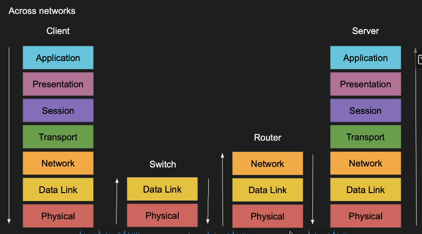
- Most of switch don't need IP. Just MAC
- Router needs IP
- UDP may not need session of Layer 5
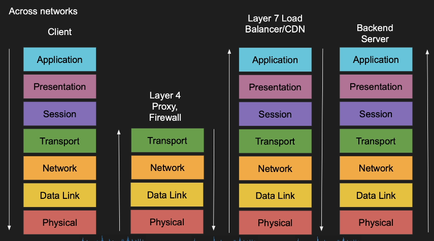
- TCP/IP model
  - Simpler than OSI model as it has 4 layers
  - Application (5,6,7)
  - Transport (4)
  - Internet (3)
  - Data link (2)
  - Physical layer is not officially covered

### 7. Host to Host communication
- How messages are sent b/w hosts?
- Layer 2 or 3 concept
- Host to host communication
  - Send message from A to B
  - Usually a request to do something on host B (RPC)
  - Each host network card has a unique Media Access Control address (MAC)
  - Host A sends a message to host B specifying the MAC address
  - Everyone in the network will get the message but **only B** will accept it
    - Security vulnerability
  - Too many machines out there
  - The address needs to get better
  - Routability -> IP address
- IP address is built in two parts
  - One part to identify the network and the other for the host
  - Network portion eliminates many other networks
  - Still needs MAC address
- Ports
  - My host has many apps!
  - HTTP on port 80, DNS request on port 53, and SSH request on port 22

## Section 3: Internet Protocol (IP)

### 8. The IP Building Blocks
- IP Address
  - Layer 3 property
  - Can be set automatically or statically
  - Network and Host portion
    - a.b.c.d/x
    - Ex: 192.168.254.0/24
    - The first 24bits (3bytes) are network and the rest 8 are for host
    - 2^24 for networks and each network has 2^8 = 255 hosts
    - Also called a subnet
  - 4bytes in IPv4 - 32bits
- Subnet Mask
  - 192.168.254.0/24 is called a subnet
  - Subnet has a mask 255.255.255.0
  - Subnet mask is used to determine if an IP is in the same subnet
    - Ex: 
      - 192.168.1.3 & 255.255.255.0 = 192.168.1.0
      - 192.168.1.2 & 255.255.255.0 = 192.168.1.0
      - 192.168.1.3 and 192.168.1.2 are in the same subnet
- Default gateway
  - Most networks consist of hosts and a default gateway
  - If host A/B are not in the same subnet, they need to talk to the gateway

### 9. IP Packet
- Has headers and data sections
- IP Packet header is 20 bytes (60bytes if options are enabled)
- Data section can go up to 65536 bytes
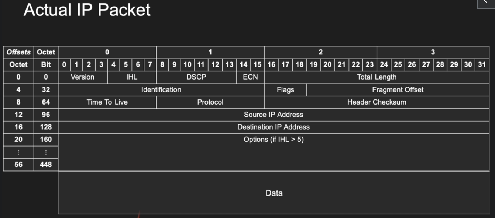
  - May use options to contain data
  - IHL: Internet Header Length, defines the options length
  - Total length: 16 bit data + header
  - Fragmentation: jumbo packets
  - Time To Live(TTL): how many hops can this packet survive?
    - Typically 128
    - To avoid infinite loops
  - Protocol: protocol of data section (tcp, icmp, ...)
  - Source IP address can be faked
    - ISP can detect this and may block you
    - ECN: Explicit Congestion Notification
      - May inform the host that the router is congested
- MTU: Maximum Transmission Unit
- If a IP packet is larger than MTU
  - Decline and fail
  - Or
  - Fragments and receive one by one
    - Overhead on the host
    - Security vulnerability

### 10. ICMP, PING, TraceRoute
- ICMP (Internet Control Message Protocol)
  - Designed for informational messages
    - Host unreachable, port unreachable, fragmentation needed
    - Packet expired (infinite loop in routers)
  - Uses IP directly
  - ping and traceroute
  - No listeners or ports to be opened
- Some firewalls block ICMP for security
- Disabling ICMP may cause damage with connection establishment
  - Fragmentation needed
- TraceRoute
  - Can we identify the entire path IP packet takes?
  - Clever use of TTL
    - TTL 1 gives the info of the first router
    - TTL 2 gives the info of the second router
    - ... until reaching the target IP
  - Increment TTL slowly and you will get the router IP address for each hop
  - Doesn't always work as path changes and ICMP might be blocked

### 11. ARP
- Address Resolution Protocol
- Why ARP?
  - We need MAC address to send frames (layer2)
  - Mostly we know the IP but not MAC
  - ARP table is cached IP->MAC mapping
  - We need a lookup protocol that give us the MAC from IP address
  - Very important in load-balancing
- ARP Poisoning
  - Faking the gateway
  - https://en.wikipedia.org/wiki/ARP_spoofing

### 12. Capturing IP, ARP, and ICMP Packets with TCPDUMP
```bash
$ sudo tcpdump -n -i wlp4s0 arp
tcpdump: verbose output suppressed, use -v[v]... for full protocol decode
listening on wlp4s0, link-type EN10MB (Ethernet), snapshot length 262144 bytes
10:04:41.066471 ARP, Request who-has 192.168.20.173 tell 0.0.0.0, length 46
10:04:41.762489 ARP, Request who-has 192.168.1.74 tell 192.168.1.1, length 28
10:04:41.762505 ARP, Reply 192.168.1.74 is-at __MAC_ADDRESS__, length 28
```

### 13. Routing Example
- How IP packets are routed in switches and routers

### 14. Private IP addresses (Alaska Airlines WIFI example)
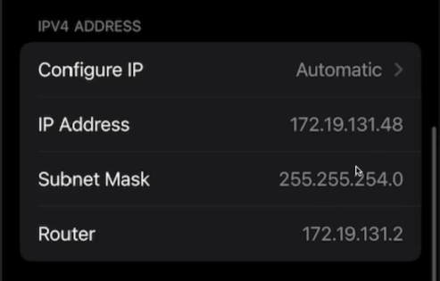
- Subnet Mask 255.255.254.0
  - How many ip's are available?
  - 256*2-2 = 510
- Range of private IPs  
  - https://en.wikipedia.org/wiki/Private_network
  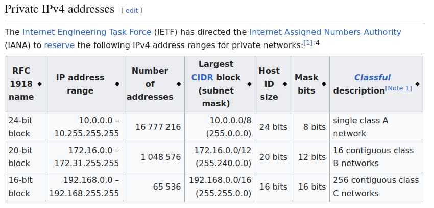

## Section 4: User Datagram Protocol (UDP)

### 15. What is UDP?
- User Datagram Protocol
- Layer 4 protocol
- Ability to address processes in a host using ports
- Simple protocol to send and receive data
- Prior communication not required
- Stateless - no knowledge is stored on the host
- 8 byte header datagram
- UDP use cases
  - Video streaming
  - VPN
  - DNS
  - WebRTC
- Multiplexing and demultiplexing
  - IP target hosts only
  - Hosts run many apps each with different requirements
  - Ports now identify the app or process
  - Sender multiplexes all its apps into UDP
  - Receiver demultiplex UDP datagrams to each app
- Source and Destination Port
  - App1 on 10.0.0.1 sends data to AppX on 10.0.0.2
  - Destination port = 53
  - Appx responds back to App1
  - We need source port so we know how to send back data
    - Source port = 5555 is included in the sending packet

### 16. User Datagram Structure
- UDP header is 8 bytes only (IPv4)
- Datagram slides into an IP packet as data
- Ports are 16bit (0 to 65535)
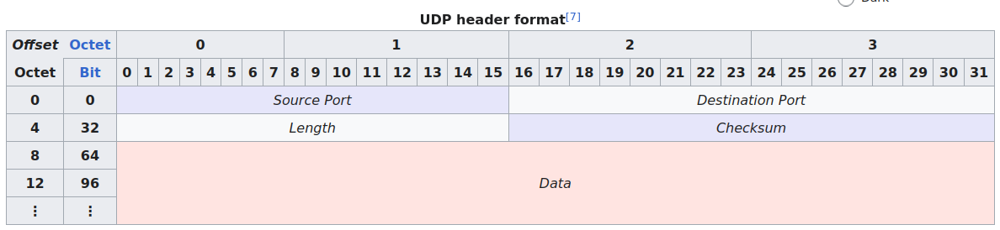
  - https://en.wikipedia.org/wiki/User_Datagram_Protocol
  - Source/destination ports are included

### 17. UDP Pros & Cons
- UDP pros
  - Simple
  - Header size is small and datagrams are small
  - Uses less bandwidth
  - Stateless
  - Consumes less memory
    - doesn't store server/client states
  - Low latency - no handshake, order, retransmission or guaranteed delivery
- UDP Cons
  - No acknowledgement
  - No guarantee delivery
  - Connection-less - anyone can send data without prior knowledge
  - No flow control
  - No congestion control
  - No ordered packets
  - Security - can be easily spoofed

### 18. Sockets, Connections and Kernel Queues
- Socket
  - When a process listens on an IP/Port it produces a socket
  - Socket is a file 
    - File descriptor
  - The process owns the socket
  - Can be shared during fork
- SYN Queue, Accept Queues
  - When a socket is created, we get two queues with it
  - SYN Queue: stores incoming SYNs
  - Accept Queue: stores completed connections
  - The size of the queues is determined by the backlog
  - Not really queues but hash tables
- Connection, Receive and Send queue
  - Completed connections are placed in the accept queue
  - When a process accepts, a connection is created
  - Accept returns a file descriptor for the connection
  - Two new queues created with the connection
  - Send queue stores connection outgoing data
  - Receive queue stores incoming connection data
```flow
Process A
Socket S
S SYN Queue
S Accept Queue
Connection C
C Send Queue
C Receive Queue
```
- Connection Establishment
  - TCP Three way handshake
  - SYN/SYN-ACK/ACK
  - But what happens in the backend?
    - Server listens on an address:port
    - Client connects
    - Kernel does the handshake creating a connection
    - Backend process accepts the connection
- Connection Establishment
  - Kernel creates a socket & two queues SYN and Accept
  - Client sends a SYN
  - Kernels adds to SYN Queue, replies with SYN/ACK
    - Then waits
    - Security vulnerability
    - Malicious client may not ACK but SYN again and again - consuming more SYN spaces
      - Timeout is introduced to avoid vulnerability
  - Client replies with ACK
  - Kernel finishes the connection
  - Kernel removes SYN from SYN queue
  - Kernel adds full connection to Accept queue
  - Backend accepts a connection, removed from accept queue
  - A file descriptor is created for the connection
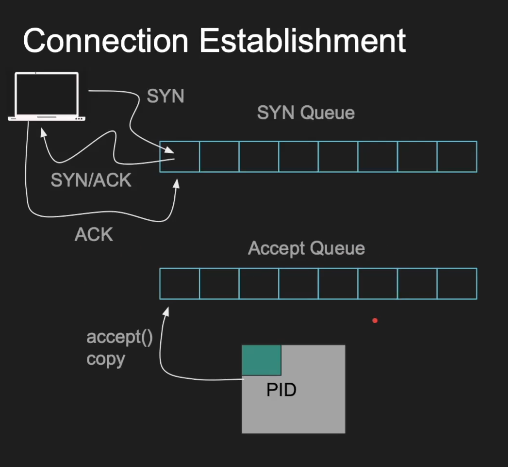
- Problems with accepting connections
  - Backend doesn't accept fast enough
  - Clients who don't ACK
  - Small backlog
- Socket Sharding
  - Normally listening on active port/ip fails
  - But you can override it with SO_REUSEPORT
  - Two distinct sockets and different processes on the same ip/port pair

### 19. UDP Server with Javascript using NodeJS
```js
import dgram from 'dgram'
const socket = dgram.createSocket("udp4");
socket.bind(5500, "127.0.0.1");
socket.on("message", (msg, info) => {
    console.log(`My Server got a datagram ${msg}, from: ${info.address}:${info.p
ort}`)
})
```

### 20. UDP Server with C
- https://github.com/nikhilroxtomar/UDP-Client-Server-Program-in-C
```c
#include <stdio.h>
#include <stdlib.h>
#include <string.h>
#include <sys/socket.h>
#include <sys/types.h>
#include <netinet/in.h>
#include <arpa/inet.h>
int main(int argc, char **argv){
  int port = 5501;
  int sockfd;
  struct sockaddr_in myaddr, remoteAddr;
  char buffer[1024];
  socklen_t addr_size;
  sockfd = socket(AF_INET, SOCK_DGRAM, 0);
  memset(&myaddr, '\0', sizeof(myaddr));
  myaddr.sin_family = AF_INET;
  myaddr.sin_port = htons(port);
  myaddr.sin_addr.s_addr = inet_addr("127.0.0.1");
  bind(sockfd, (struct sockaddr*)&myaddr, sizeof(myaddr));
  addr_size = sizeof(remoteAddr);
  recvfrom(sockfd, buffer, 1024, 0, (struct sockaddr*)& remoteAddr, &addr_size);
  printf("[+]Data Received from : %s", buffer);
  return 0;
}
```
- Demo:
  - From terminal 1:
  ```bash
  $ nc -u 127.0.0.1 5501
  hello world
  ```
  - From terminal 2:
  ```bash
  $ ./a.out 
  [+]Data Received from : hello world
  ```

### 21. Capturing UDP traffic with TCPDUMP
- 8.8.8.8: DNS by google
- Terminal 1:
```bash
$ sudo tcpdump -n -v -i wlp4s0 src 8.8.8.8 or dst 8.8.8.8
tcpdump: listening on wlp4s0, link-type EN10MB (Ethernet), snapshot length 262144 bytes
17:42:10.989665 IP (tos 0x0, ttl 64, id 16768, offset 0, flags [none], proto UDP (17), length 53) #<--- content is UDP
    192.168.1.74.43700 > 8.8.8.8.53: 56896+ A? cnn.com. (25)  # 43700 is the random port from src. 56896 is query ID
17:42:11.012620 IP (tos 0x80, ttl 124, id 48897, offset 0, flags [none], proto UDP (17), length 117) # Response from DNS to my IP
    8.8.8.8.53 > 192.168.1.74.43700: 56896 4/0/0 cnn.com. A 151.101.67.5, cnn.com. A 151.101.3.5, cnn.com. A 151.101.131.5, cnn.com. A 151.101.195.5 (89)
17:42:11.013912 IP (tos 0x0, ttl 64, id 46736, offset 0, flags [none], proto UDP (17), length 53)
    192.168.1.74.40582 > 8.8.8.8.53: 25323+ AAAA? cnn.com. (25)
17:42:11.031376 IP (tos 0x80, ttl 124, id 60018, offset 0, flags [none], proto UDP (17), length 277)
    8.8.8.8.53 > 192.168.1.74.40582: 25323 8/0/0 cnn.com. AAAA 2a04:4e42:200::773, cnn.com. AAAA 2a04:4e42:600::773, cnn.com. AAAA 2a04:4e42:800::773, cnn.com. AAAA 2a04:4e42:c00::773, cnn.com. AAAA 2a04:4e42::773, cnn.com. AAAA 2a04:4e42:a00::773, cnn.com. AAAA 2a04:4e42:400::773, cnn.com. AAAA 2a04:4e42:e00::773 (249)
```
- Terminal 2:
```bash
$ nslookup cnn.com 8.8.8.8 # using DNS of google (8.8.8.8)
Server:		8.8.8.8
Address:	8.8.8.8#53
Non-authoritative answer:
Name:	cnn.com
Address: 151.101.67.5
Name:	cnn.com
Address: 151.101.3.5
Name:	cnn.com
Address: 151.101.131.5
Name:	cnn.com
Address: 151.101.195.5
Name:	cnn.com
Address: 2a04:4e42:200::773
Name:	cnn.com
Address: 2a04:4e42:600::773
Name:	cnn.com
Address: 2a04:4e42:800::773
Name:	cnn.com
Address: 2a04:4e42:c00::773
Name:	cnn.com
Address: 2a04:4e42::773
Name:	cnn.com
Address: 2a04:4e42:a00::773
Name:	cnn.com
Address: 2a04:4e42:400::773
Name:	cnn.com
Address: 2a04:4e42:e00::773
```

## Section 5: Transmission Control Protocol

### 22. What is TCP?
- Transmission Control Protocol
- Layer 4 protocol
- Ability to address processes in a host using ports
- Controls the transmission unlike UDP which is a firehose
  - UDP might be blocked from a firewall
- Connection
- Requires handshake
- 20bytes headers segment (up to 60)
  - 60 from IP packet + 60 TCP header = header only 60bytes might be possible
- Stateful
- TCP use cases
  - Reliable communication
  - Remote shell
  - Database connections
  - Web communications
  - Any bidirectional communication
- TCP Connection
  - Layer 5 session
  - An agreement b/w client and server
  - Must create a connection to send data
  - Connection is identified by 4 properties
    - Source IP - source port
    - Destination IP - destination port
  - Can't send data outside of a connection
  - Requires a 3-way TCP handshake
  - Segments are sequenced and ordered
  - Segments are acknowledged
  - **Lost segments are retransmitted**
- Multiplexing and demultiplexing
  - IP target hosts only
  - Hosts run many apps each with different requirements
  - Ports now identify the app or process
  - Sender multiplexes all its apps into TCP connections
  - Receiver demultiplex TCP segments to each app based on connection pairs
- Connection Establishment
  - App1 on 10.0.0.1 wants to send data to AppX on 10.0.0.2
  - App1 sends SYN to AppX to sync sequence numbers
  - AppX sends SYN/ACK to sync its sequence number
  - App1 ACKs AppX SYN
  - Three way handshake
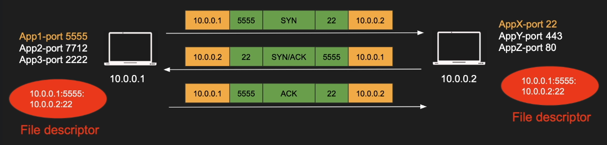
- Sending data
  - App1 sends data to AppX
  - App1 encapsulates the data in a segment and send it
  - AppX acknowledges the segment
  - Q: Can App1 send new segment before ACK of old segment arrives?
    - A: Yes it can but there is a limit due to congestion control
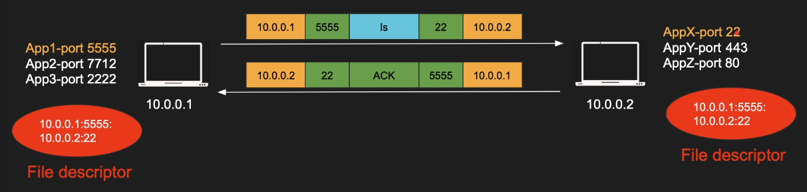
- Acknowledgement
  - App1 sends segment 1,2,3 to AppX
  - Appx acknowledges all of them with a single ACK3
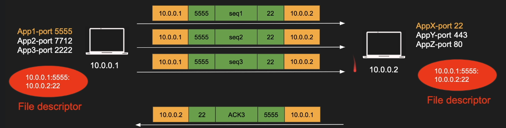
- Lost data
  - App1 sends segment 1,2,3 to Appx
  - Seg3 is lost, AppX ACKs 2
  - App1 resends seg3
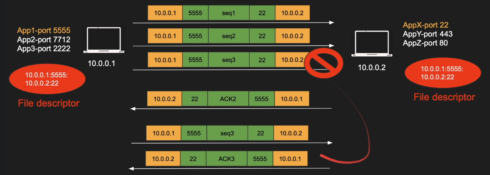
- Closing connection
  - App1 wants to close the connection
  - App1 sends FIN, AppX ACKs
  - AppX sends FIN, App1 ACKs
  - Four way handshake
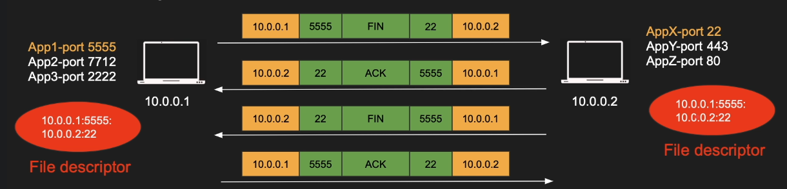

### 23. TCP Segment
- Header is 20bytes and up to 60bytes
- TCP segment slides into an IP packet as data
- Port is 16bit (0 to 65535)
- Sequence, Acknowledgement, flow control and more
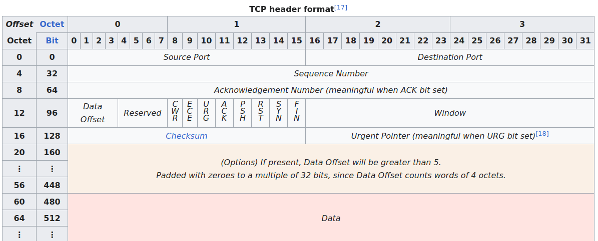
- Sequence number - 32bits, 4Billion
  - May be run-out for large transmission
  - Wrap-around - reusing previous sequence number
- Maximum Segment size
  - Depends on the MTU
  - Usually 512 bytes but can go up to 1460 
  - Default MTU is 1500
  - Jumbo frames MTU goes to 9000 or more

### 24. Flow Control
- How much the receiver can handle?
- Scenario
  - A want to send 10 segs to B
  - A sends seg 1 to B
  - B ACKs seg1
  - A sends seg2 to B
  - B ACKs seg2
  - VERY SLOW
  - A can send multiple segments and B can acknowledge all in 1 ACK
    - Then how much can be sent simultaneously?
    - This is **flow control**
- Flow control
  - When TCP segments arrive they are put in receiver's buffer
  - If we keep sending then the receiver will be overwhelmed
  - Segments will be dropped
  - Solution? Let the sender know how much the receiver can handle
    - Window Size in the TCP header
    - 16bit and up to 64KB
    - Updated with each ACK
    - Tells the sender how much to send before waiting for ACK
    - Receiver may decrease the Window Size when out of memory
- Sliding Window
  - Can't keep waiting for the receiver to acknowledge all segments
  - Whatever gets acknowledge moves
  - We "slide" the window
  - Sender maintains the sliding window for the receiver
- Window Scaling
  - 64kb is too small
  - Can't increase the bits on the segment
  - Meet Window Scaling factor (0-14)
  - Window Size can go up to 1GB (=$(2^{16}-1)*2^{14}$)
  - Only exchanged during the handshake

### 25. Congestion Control
- How much the network can handle?
- The receiver might handle the load but the middle boxes might not
- The routers in the middle have limit
- We need to avoid congestion
- Congestion Window (CWND)
- Two step congestion algorithms
  - TCP slow start
    - Start slow goes fast
    - CWND + 1 MSS (Max Seg Size) after each ACK
  - Congestion Avoidance
    - Once slow start reaches its threshold this kicks in
    - CWND + 1 MSS after complete RTT (Round Trip Time)
  - CWND must not exceeds RWND (Receiver Window)
- Slow Start
  - CWND starts with 1MSS (or more)
  - Sends 1 seg and waits for ACK
  - With each ACK received, CWND is incremented by 1 MSS
  - When we reach slow start threshold, we switch to congestion avoidance algorithm
- Congestion Avoidance
  - Send CWND worth of segments and waits for ACK
  - Only when ALL segments are ACKed, add UP to one MSS to CWND
  - Precisely CWND = CWND + MSS*MSS/CWND
- Congestion Notification
  - Can Routers let us know when congestion hit?
  - Meet ECN (Explicit Congestion Notification)
  - Routers and middle boxes can tag IP packets with ECN
  - The receiver will copy this bit back to the sender
  - ECN is IP header bit
  - So routers don't drop packets and just let us know that we are reaching the limit

### 26. Slow Start vs Congestion Avoidance
- TCP Slow Start aggressively increases window size
- Congestion Avoidance works in RTT only, not every ACK
- Congestion Detection
  - The moment we get timeouts, dup ACKs or packet drops
  - The slow start threshold reduced to the half of whatever unacknowledged data is sent
  - CWND is reset to 1 and we start over
  - Min slow start threshold is 2*MSS
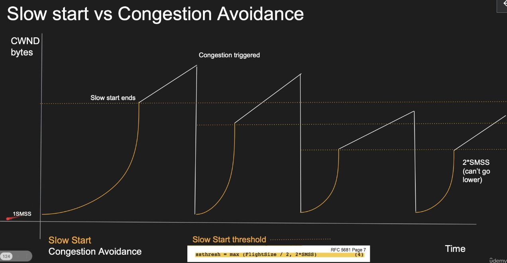

### 27. NAT (Network Address Translation)
- How the WAN sees your internal devices
- IPv4 is limited as 4billion
- Private vs Public IP address
  - 192.168.x.x, 10.0.0.x are private not routable in the internet
- Internal hosts can be assigned as private addresses
- Only your router need public IP address
- Router needs to translate requests
- NAT Applications
  - Private to Public translations
    - So we don't run out IPv4
  - Port forwarding
    - Add a NAT entry in the router to forward packets to 80 to a machine in your LAN
    - No need to have root access to listen on port 80 on your device
    - Expose your local web server publicly
  - Layer 4 Load Balancing
    - HAProxy NAT mode - your load balancer is your gateway
    - Clients send a request to a bogus service IP
    - Router intercepts that packet and replaces the service IP with a destination server
    - Layer 4 reverse proxying
  
### 28. TCP Connection States
- Stateful protocol must have states
- TCP is a stateful protocol
- Both client and server need to maintain all sorts of state
- Window sizes, sequences and the state of the connection
- The connection goes through many states
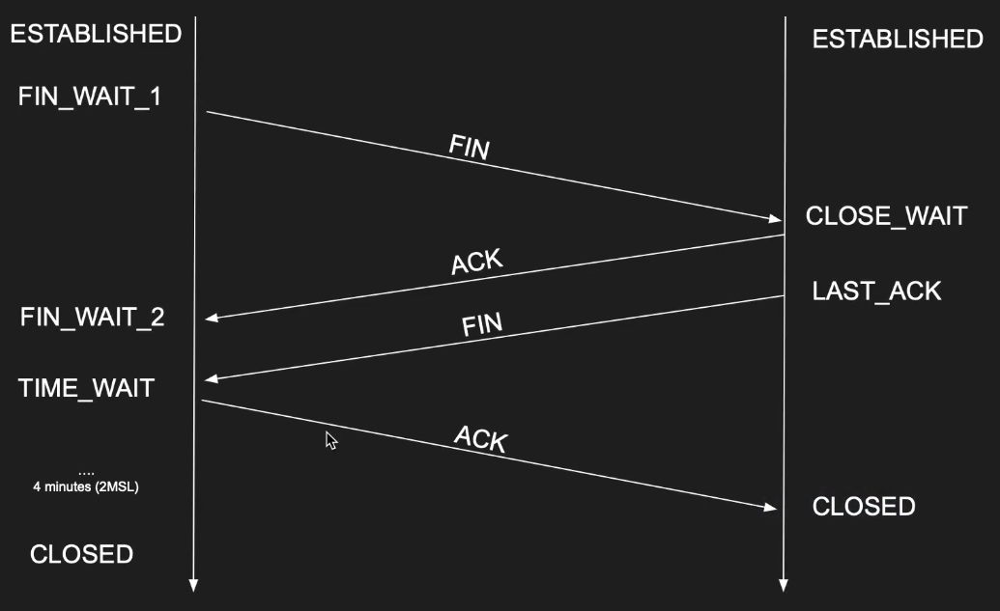

### 29. TCP Pros and Cons
- The power and drawbacks of TCP
- Pros  
  - Guarantee delivery
  - No one can send data without prior knowledge
  - Flow control and congestion control
  - Ordered packets - no corruption or app level work
  - Secure and can't be easily spoofed
    - Still needs good authentication
- Cons
  - Large header overhead compared to UDP
  - More bandwidth
  - Stateful - consumes memory on server and client
  - High latency for certain workloads (slow start/congestion/acks)
  - Does too much at a low level
    - Single connection to send multiple stream of data (HTTP requests)
      - TCP Head of Line Blocking: https://en.wikipedia.org/wiki/Head-of-line_blocking
    - Stream 1 has nothing to do with stream 2
    - Both stream 1 and stream 2 packets must arrive
  - TCP meltdown
    - Not a good candidate for VPN

### 30. TCP Server with Javascript using NodeJS
```js
import net from 'net';
const server = net.createServer( socket => {
    console.log("TCP handshake successful with " + socket.remoteAddress + ":" + socket.remotePort);
    socket.write("Hello client!"); 
    socket.on("data", data=> {
        console.log("Received data " + data.toString())
    })
})
server.listen(8800, "127.0.0.1");
```

### 31. TCP Server with C
```c
//https://github.com/nikhilroxtomar/tcp-client-server-in-C
#include <stdio.h>
#include <stdlib.h>
#include <string.h>
#include <sys/socket.h>
#include <sys/types.h>
#include <netinet/in.h>
#include <arpa/inet.h>
#define PORT 8801
int main(){
	int sockfd;
	struct sockaddr_in serverAddr;
	int newSocket;
	struct sockaddr_in newAddr;
	socklen_t addr_size;
	char buffer[1024];
	sockfd = socket(AF_INET, SOCK_STREAM, 0);
	printf("Server Socket Created Sucessfully.\n");
	memset(&serverAddr, '\0', sizeof(serverAddr));
	serverAddr.sin_family = AF_INET;
	serverAddr.sin_port = htons(PORT);
	serverAddr.sin_addr.s_addr = inet_addr("127.0.0.1");
	bind(sockfd, (struct sockaddr*)&serverAddr, sizeof(serverAddr));
	printf("[+]Bind to Port number %d.\n", PORT);
	listen(sockfd, 5); // 5 is the backlog. max number of connection to set
	printf("[+]Listening...\n");
	newSocket = accept(sockfd, (struct sockaddr*)&newAddr, &addr_size);
	strcpy(buffer, "Hello");
	send(newSocket, buffer, strlen(buffer), 0);
	printf("[+]Closing the connection.\n");
    return 0;
}
```
- Demo:
  - Terminal 1:
  ```bash
   gcc ch31.c 
  $ ./a.out 
  Server Socket Created Successfully.
  [+]Bind to Port number 8801.
  [+]Listening...
  [+]Closing the connection.
  ```
- Terminal 2:
  ```bash
  $ nc 127.0.0.1 8801
  Hello
  ```
  
### 32. Capturing TCP Segments with TCPDUMP
```bash
$ sudo tcpdump -n -v -i wlp4s0  src www.udemy.com or dst  www.udemy.com
tcpdump: listening on wlp4s0, link-type EN10MB (Ethernet), snapshot length 262144 bytes
10:53:44.691669 IP6 (flowlabel 0xfc921, hlim 64, next-header TCP (6) payload length: 1380) 2600:4040:5c4a:c000:7380:df05:c506:3c50.54604 > 2606:4700::6810:8fed.443: Flags [.], cksum 0x9099 (correct), seq 453796296:453797644, ack 2081049876, win 501, options [nop,nop,TS val 2652864280 ecr 4117475351], length 1348
10:53:44.691712 IP6 (flowlabel 0xfc921, hlim 64, next-header TCP (6) payload length: 1380) 2600:4040:5c4a:c000:7380:df05:c506:3c50.54604 > 2606:4700::6810:8fed.443: Flags [.], cksum 0x2688 (correct), seq 1348:2696, ack 1, win 501, options [nop,nop,TS val 2652864280 ecr 4117475351], length 1348
10:53:44.691721 IP6 (flowlabel 0xfc921, hlim 64, next-header TCP (6) payload length: 45) 2600:4040:5c4a:c000:7380:df05:c506:3c50.54604 > 2606:4700::6810:8fed.443: Flags [P.], cksum 0x2901 (correct), seq 2696:2709, ack 1, win 501, options [nop,nop,TS val 2652864280 ecr 4117475351], length 13
10:53:44.699349 IP6 (flowlabel 0xfc921, hlim 64, next-header TCP (6) payload length: 719) 2600:4040:5c4a:c000:7380:df05:c506:3c50.54604 > 2606:4700::6810:8fed.443: Flags [P.], cksum 0xc871 (correct), seq 2709:3396, ack 1, win 501, options [nop,nop,TS val 2652864288 ecr 4117475351], length 687
10:53:44.706481 IP6 (flowlabel 0x3912d, hlim 59, next-header TCP (6) payload length: 32) 2606:4700::6810:8fed.443 > 2600:4040:5c4a:c000:7380:df05:c506:3c50.54604: Flags [.], cksum 0xefe2 (correct), ack 2709, win 8, options [nop,no
```

## Section 6: Overview of Popular Networking Protocols

### 33. Networking Protocols Introduction

### 34. DNS
- Domain Name System
- Why DNS
  - Additional layer of abstraction
  - IP can change while the domain remains
  - Load balancing
  - We can serve the closest IP to a client requesting the same domain
- DNS
  - A new addressing system means that we need a mapping
  - If you have an IP and you need the MAC, we use ARP
  - If you have the name and you need IP, we use DNS
  - Built on top of UDP
  - Port 53
  - Many records: MX, TXT, A, CNAME
- How DNS works
  - DNS resolver: frontend and cache
  - ROOT server: hosts IPs of TLDs
  - Top Level Domain server: hosts IPs of the ANS
  - Authoritative Name Server: hosts the IP of the target server
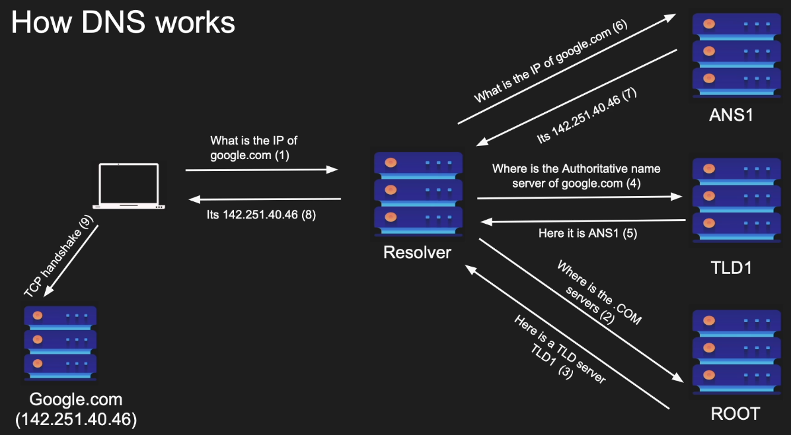
  - DNS query is done asynchronously
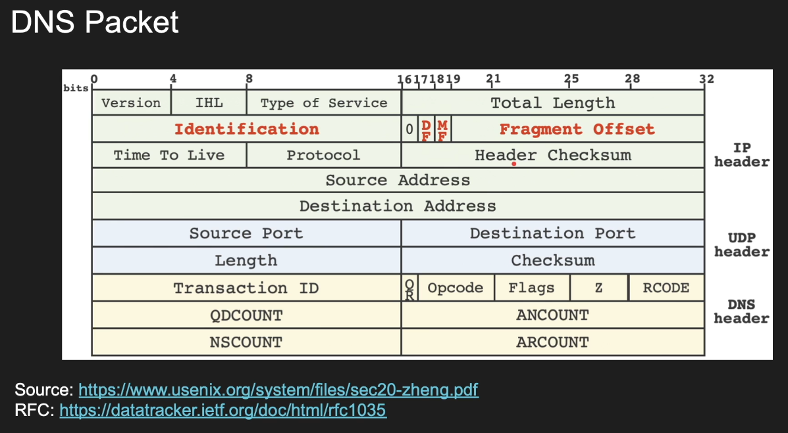
- Notes about DNS
  - Why so many layers?
  - DNS is not encrypted by default
  - Many attacks against DNS (DNS hijacking/DNS poisoning)
  - DoT(DNS over TLS)/DoH(DNS over HTTPS) attempts to address this
- Demo:
```bash
$ nslookup -type=txt husseinnasser.com 8.8.8.8
Server:		8.8.8.8
Address:	8.8.8.8#53
Non-authoritative answer:
husseinnasser.com	text = "google-site-verification=lpqjyDSvzwAYAkre0O5dg-7wgc2z6auowklPvdm231A"
Authoritative answers can be found from:
$ nslookup -type=a husseinnasser.com
Server:		127.0.0.53
Address:	127.0.0.53#53
Non-authoritative answer:
Name:	husseinnasser.com
Address: 216.239.36.21
Name:	husseinnasser.com
Address: 216.239.34.21
Name:	husseinnasser.com
Address: 216.239.38.21
Name:	husseinnasser.com
Address: 216.239.32.21
$ nslookup -type=ns husseinnasser.com
Server:		127.0.0.53
Address:	127.0.0.53#53
Non-authoritative answer:
husseinnasser.com	nameserver = dns4.name-services.com.
husseinnasser.com	nameserver = dns3.name-services.com.
husseinnasser.com	nameserver = dns5.name-services.com.
husseinnasser.com	nameserver = dns1.name-services.com.
husseinnasser.com	nameserver = dns2.name-services.com.
Authoritative answers can be found from:
dns5.name-services.com	internet address = 64.98.148.139
dns1.name-services.com	internet address = 64.98.148.137
dns1.name-services.com	has AAAA address 2604:4000:2800:2000:64:98:148:137
dns2.name-services.com	internet address = 216.40.47.201
dns4.name-services.com	internet address = 216.40.47.202
dns3.name-services.com	internet address = 64.98.148.138
$ dig husseinnasser.com
; <<>> DiG 9.18.28-0ubuntu0.22.04.1-Ubuntu <<>> husseinnasser.com
;; global options: +cmd
;; Got answer:
;; ->>HEADER<<- opcode: QUERY, status: NOERROR, id: 11745
;; flags: qr rd ra; QUERY: 1, ANSWER: 4, AUTHORITY: 0, ADDITIONAL: 1
;; OPT PSEUDOSECTION:
; EDNS: version: 0, flags:; udp: 65494
;; QUESTION SECTION:
;husseinnasser.com.		IN	A
;; ANSWER SECTION:
husseinnasser.com.	1672	IN	A	216.239.38.21
husseinnasser.com.	1672	IN	A	216.239.36.21
husseinnasser.com.	1672	IN	A	216.239.32.21
husseinnasser.com.	1672	IN	A	216.239.34.21
;; Query time: 0 msec
;; SERVER: 127.0.0.53#53(127.0.0.53) (UDP)
;; WHEN: Thu Dec 12 12:08:21 EST 2024
;; MSG SIZE  rcvd: 110
```

### 35. TLS
- Transport Layer Security
- Encrypts the communication
- TLS
  - Vanilla HTTP
  - HTTPS
  - TLS 1.2 handshake (2 rount trips)
  - Diffie Hellman
  - TLS 1.3 Improvements ( 1 round trip can be zero)
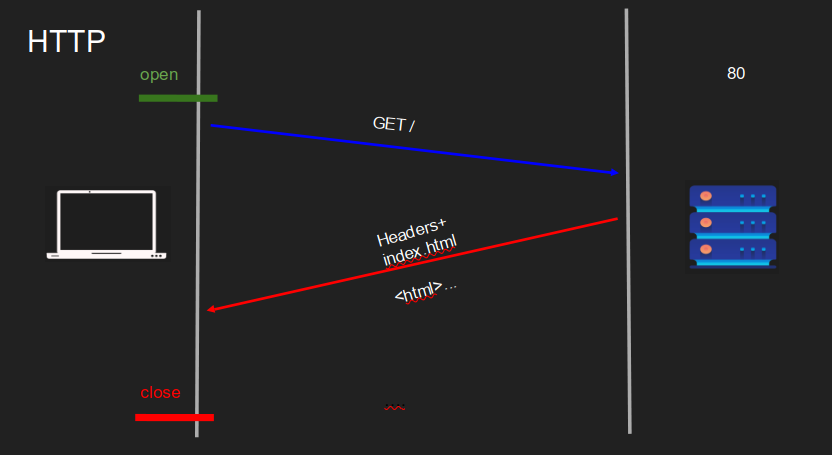
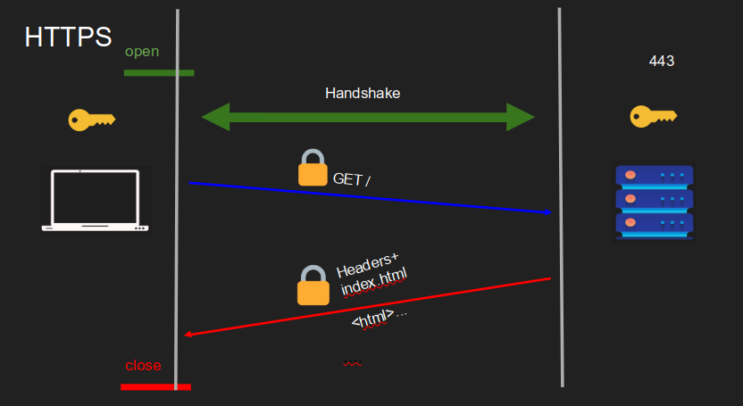
- Why TLS
  - We encrypt with symmetric key algorithms
  - We need to exchange the symmetric key
  - Key exchange uses asymmetric key (PKI)
  - Authenticate the server
  - Extensions (SNI, preshared, 0RTT)
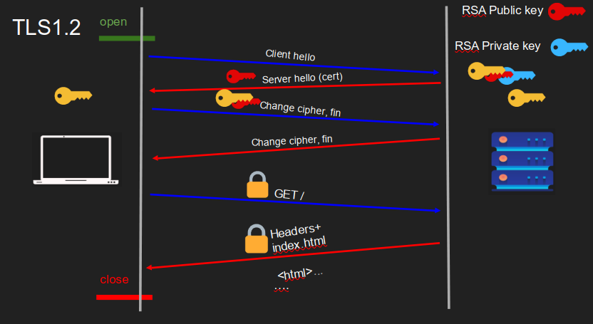
  - Heart bleed bug
  - Private key was leaked from server memory
- Diffie Hellman
  - Better key exchange method
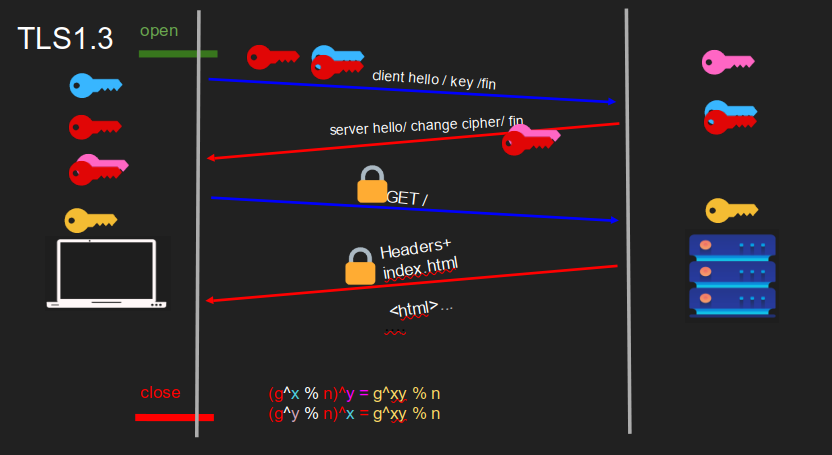

## Section 7: Networking Concepts that Affect Backend Performance

### 36. What is this section?

### 37. MSS v MTU vs PMTUD
- How large the packet can get
- Overview
  - TCP layer 4 unit is segment
  - The segment slides into an IP packet in layer 3
  - The IP packet now has the segment + headers
  - The IP packet slides into a layer 2 frame
  - The frame has a fixed size based on the networking configuration
  - The size of the frame determines the size of the segment
- HW MTU
  - Maximum Transmission Unit is the size of the frame
  - It is a network interface property default 1500
  - Some networks have jumbo frames up to 9000 bytes
- IP packets and MTU
  - IP MTU usually equals to the HW MTU
  - One IP packet should fit a single frame
  - Larger IP packets will be fragmented into multiple frames
- MSS
  - Maximum Segment Size is determined from MTU
  - Segment must fit in an IP packet which should fit in a frame
  - MSS = MTU - IP headers - TCP headers
  - MSS = 1500 - 20 - 20 = 1460
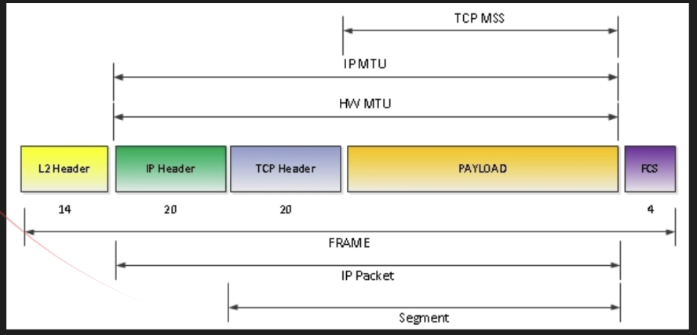
- Path MTU Discovery (PMTUD)
  - MTU is network interface propery and each host can have different value
  - Need to use the smallest MTU in the network
  - Path MTU helps determine the MTU in the network path
  - Client sends an IP packet with its MTU and a DF flag
  - The host who its MUT is smaller will have to fragment but can't
  - The host sends back an ICMP message fragmentation needed which will lower the MTU

### 38. Nagle's Algorithm's Effect on Performance
- Delay in the client side
- Nagles' algorithm
  - In the telent days sending a single byte in a segment was a waste
  - Combine small segments and send them in a single one
  - The client can wait for a full MSS before sending the segment
  - No wasted 40 bytes header (IP+TCP) for few bytes of data
  - Assume MSS = 1460, and A sends 500 bytes
  - 500< 1460 and client waits to fill the segment
  - A sends 960 bytes, segment fills and send
  - If there isn't anything to ACK, data will be imeediately sent
- Problem with Nagle's algorithm
  - Sending large data causes delay
  - A wants to send 5000 bytes on 1460 MSS
  - 3 full segment of 1460 + 620 bytes
  - 4th segment is not sent!
  - 4tgh not full segment is only sent when an ACK is received
- Disabling Nagle's algorithm
  - Most clients today disable Nagle's algorithm
  - TCP_NODELAY
  - Curl disabled this back in 2016 by default as TLS handshake was slowed down

### 39. Delayed Aknowledgement Effect on Performance
- Delayed acknowledgement algorithm
  - Acknowledging every segment might be a waste
  - We can wait little more to receive more segment and ACK once
- Problem with delayed ACK
  - Causes delays in some clients that may lead to timeout and retransmission
  - Noticeable performance degradation
  - Combined with Nagle's algorithm can lead to 400ms delays!
  - Each party is waiting on each other
- Disabling delayed acknowledgement algorithm
  - Dsiable delayed ACK algorithm can be done with TCP_QUICKACK option
  - Segments will be acknowledged sooner

### 40. Cost of Connection Establishment
- Connection establishment is costly
  - TCP three way handshake
  - The further apart the peers, the slower it is to send segments
  - Slow start keeps the connection from reaching its potential right away
  - Congestion control and flow control limit that further
  - Delayed and Nagle's algorithm can further slow down
  - Destroying the connection is also expensive
- Connection pooling
  - Most implementation database backends and reverse proxies use pooling
  - Establish a bunch of TCP connection to the backend and keep them running
  - Any request that comes to the backend use an already opened connection
  - This way your connections will be warm and slow start would hav already kicked in
  - Don't close the connection unless you absolutely don't need it
- Eager vs Lazy loading
  - Depending on what paradigm you take, you can save on resources
  - Eager loading -> Load everything and keep it ready
    - Start up is slow but requests will beserved immediately
    - Some apps send warm up data to kick in the slow start but be careful of bandwidth and scalability
  - Lazy loading -> only load things on demand
    - Start up is fast but requests will suffer initially

### 41. TCP Fast Open
- Sending data during handshake
- Handshake is slow
  - I already know the server which I have established a connection prior
  - Can we use a predetermined token to send data immediately during the handshake?
- TCP Fast Open (TFO)
  - Client and Server establish connection 1, server sends an encrypted cookie
  - Client stores the TFO cookie
  - Client wants to create another connection
  - Client sends SYN, data and TFO cookie in TCP options
  - Server authenticates the cookie and sends response + SYN/ACK
  - Enabled by Linux 3.13 or later
  - In Curl, --tcp-fastopen

### 42. Listening Server
- You create a server by listening on a port on a specific ip address
- Your machine might have multiple interfaces with multiple IP addresses
- Listen(127.0.0.1,8080): listens on th elocal host ipv4 interface on port 8080
- Listen(::1,8080): listens on localhost ipv6 interface on port 8080
- Listen(192.168.1.2,8080): listens on 192.168.1.2 on port 8080
- Listen(0.0.0.0,8080): listens on all interfaces on port 8080 (can be dangerous)
  - For the same port, different IPs allow different processes
- You can have only one process in a host listening on IP/Port
  - No two processes can listen on the same port
- There is always an exception
  - More than one process to listen on the same port
  - SO_PORTREUSE
  - OS balances segments among process
  - OS creates a hash source ip/soruce port/dest ip/dest port
  - Guarantees always go to the same process if the pair match
```js  
const http = require("http");
const httpserver = http.createServer();
httpserver.on("request", (req,res) => res.end("Ok you're on ipv4"));
httpserver.on("listening",()=> { console.log(`Server  listening on port ${httpserver.address().port}`)});
httpserver.listen();
//
const httpserver6 = http.createServer();
httpserver6.on("request", (req,res) => res.end("Ok you're on ipv6"));
httpserver6.on("listening",()=> { console.log(`Server 6 listening on port ${httpserver6.address().port}`)})
httpserver6.listen(8888,"::1");
```

### 43. TCP Head of line blocking
- TCP orders packets in the order that they are sent
- The segments are not acknowledged or delivered to the app until they are in order
- What if multiple clients are using the same connection
- HTTP requests may use the same connection to send multiple requests
- Request 1 is segments 1,2
- Request 2 is segments 3,4
- Segments 2,3,4 arrive but 1 is lost?
- Request 2 technically was delivered but TCP is blocking it
- Huge latency in apps, big problem in HTTP/2 with streams
- QUIC solves this

### 44. The importance of Proxy and Reverse Proxies
- What is proxy?
  - Delegate for clients to access external servers
- Proxy use cases
  - Caching
  - Anonymity
  - Logging
  - Block sites
  - Microservices
- Reverse proxy
  - Proxy in the server side
  - google.com might be sent to google-server2
  - Reverse proxy use cases
    - Caching
    - Load balancing
    - Ingress
    - Canary deployment
    - Microservices

### 45. Load Balancing at Layer 4 vs Layer 7
- Layer 4 vs Layer 7
- Load balancer (aka fault tolerant)
- Layer 4 load balancer
  - Keeps the backend servers warm
  - When a client connects to the L4 load balancer, the LB chooses one server and all segments for that connections go to that server
  - Dest in IP packet is re-written as the chosen server
  - Pros
    - Simpler load balancing
    - Efficient
    - More secure
    - Works with any protocol
    - One TCP connection (NAT)
  - Cons
    - No smart load balancing
    - NA mircoservices
    - Sticky per connection
    - No caching
    - Protocol unaware - could be dangerous
- Layer 7 Load balancer
  - When a client connects to the L7 LB, it becomes protocol specific. Any lgoical request will be forwarded to a new backend server. This could be one or more segments
  - Certificate must live at LB - security vulnerability
  - LB parsers and understands the segments
  - Pros
    - Smart load balancing
    - Caching
    - Great for microservices
    - API Gateway logic
    - Authentication
  - Cons
    - Expensive (parses data)
    - Decrypts (terminates TLS)
    - Two TCP connections
    - Must share TLS certificate
    - Needs to buffer
    - Needs to understand protocol

### 46. Nextwork Access Control to Database Servers
- When we deploy the instances of DB like postgresSQL or mongoDB
  - Who can access the DB?
  - How to be secure from the beginning?
- pg_hba.conf from PostgreSQL
```
# TYPE DATABASE USER ADDRESS      METHOD
local  all      all               trust
# TYPE DATABASE USER ADDRESS      METHOD
host   all      all  127.0.0.1/32 trust  # /32 allows only the exact IP only
# TYPE DATABASE USER ADDRESS      IP-MASK         METHOD
host   all      all  127.0.0.1    255.255.255.255 trust # same as above
# TYPE DATABASE USER ADDRESS      METHOD 
host   all      all  ::1/128      trust # IPv6 version
# TYPE DATABASE USER ADDRESS      METHOD
host   all      all  localhost    trust
# TYPE DATABASE USER ADDRESS          METHOD
host   postgres all  192.168.93.0/24  ident
# TYPE DATABASE USER ADDRESS          METHOD
host   all      all  192.168.54.1/32  reject
```

### 47. Networking with Docker
- docker run -p 80:80 -d httpd
- Building a new image
  - vi Dockerfile
  - docker build . -t newhttpd
  - docker run --name s1 -d newhttpd
  - docker inspect network bridge
- Docker host works as an internal DNS
  - Can access docker image IP but not by name
  - Need to add subnet
- Creating subnet
  - docker network create backend --subnet 10.0.0.0/24

## Section 8: Analyzing Protocols with Wireshark

### 48. Wiresharking UDP
- Wireshark: sniffing tool
- sudo apt install wireshark
- sudo wireshark

### 49. Wiresharking TCP/HTTP
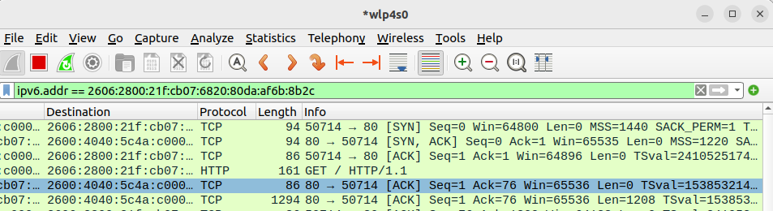
- The above image is madde using `curl http://example.com -v`


### 50. Wiresharking HTTP/2 (Decrypting TLS)
- export SSLKEYLOGFILE=~/TEMP/fkey
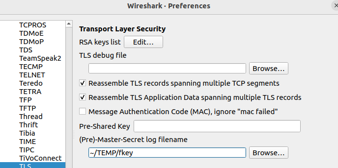
- Now TLS content is decrypted

### 51. Wiresharking MongoDB

### 52. Wiresharking Server Sent Events

## Section 9: Answering your Questions

### 53. Should Layer 4 Proxies buffer segments?

### 54. How does the Kernel manage TCP connections?

## Section 10: Course Summary

### 55. Course Summary

## Section 11: Extras

### 56. Exposing local servers publicly

### 57. The Networking behind clicking a link

### 58. What is SNI? (Server Name Indication TLS Extension)
- When multiple sites are hosted in a single IP
  - Encapsulate the server name in the TLS layer
- What is SNI?
  - Public IPs are expensive
  -  How do I host mupltiple websites in the same public IP?
  - Host header in HTTP
  - But what if I want security? SNI during TLS
  - Supported on major webservers/proxies (nginx, haproxy, IIS)
- haproxy - website.cfg
  - Defines frontend/backend
  ```
  frontend f
    bind 0.0.0.0:80
    mode http
    timeout client 10s
  backend ali
    mode http
    server aliserver 127.0.0.1:8080
    timeout server 10s
    time out connect 10s
  backend jenny
    mode http
    server aliserver 127.0.0.1:8081
    timeout server 10s
    time out connect 10s
  ```
- Will need certificate for security
  - sudo certbot certonly --standalone
- SNI sends hostname in a clear text
  - Encrypted SNI (ESNI) - needs DoH/DoT

### 59. Replacing TCP for Data Centers (Part 1)
- "We need a Replacement for TCP in the Datacenter" by John Ousterhout
- Millisecondes of latency
- Requirements
  - Reliable delivery
  - Low latency
  - High throughput
- Issues of short message in TCP
- Congestion control
- Efficient load balancing across server cores
- NIC offload
- How to remove "datacenter tax"
  
### 60. Replacing TCP for Data Centers (Part 2)
- Five key properties of TCP
  - Stream orientation
  - Connection orientation
  - Bandwidth sharing
  - Sender-driven congestion control
  - In-order packet delivery

### 61. Replacing TCP for Data Centers (Part 3)
- Homa
  - Message based (not stream)
  - Connection less
    - Stateful
    - A single socket can handle multiple RPCs
  - SRPT scheduling policy
  - Receiver driven congestion control
  - Out-of-order packets

### 62. Running out of TCP Source Ports

### 63. TLS 0-RTT
