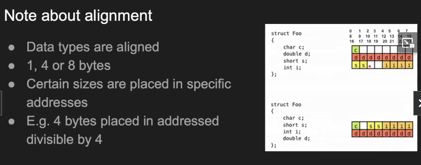
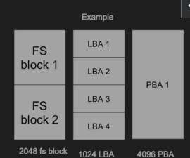

## Fundamentals of Operating Systems
- Instructor: Hussein Nasser

## Section 1: Before we start

### 1. Welcome

### 2. Who is this course for?

### 3. Course Overview and Outline

### 4. Course Downloadable Content

## Section 2: Why an OS?

### 5. Section Intro Why an OS
- OS
  - A SW
  - Resources need to be managed
  - Your apps talk to the OS
- Scheduling
  - Fair share of resources to all processes
    - CPU/Memory/IO


### 6. Why do we need an Operating System?

### 7. System Architecture Overview
- The components the OS operates
- System Architecture
  - Resources
  - The Kernel is OS core component
- CPU
- Memory
- Storage
- Network
- Kernel
  - We focus in this course on the kernel tasks
- File System
  - Mostly blocks/arrays
- Program vs Process
  - Process is an instance of the program
  - Process is a program in motion
  - Program is a process at rest
- User space vs Kernel space
  - User space
    - Browser
    - Postgres
  - Protected kernel space
    - Kernel code
    - Device drivers
    - TCP/IP stack
- Device drivers
  - SW in the kernel
  - Manages HW devices
- System Calls
  - Jump from user to kernel mode
  - User makes a system call
  - read() write() malloc()
  - Mode switch

## Section 3: The Anatomy of a Process

### 8. Anatomy of a Process Section Intro

### 9. Progam vs Process
- Dynamic linking: adding a pointer to the library
- Process
  - When a program runs, we get a process
  - Process lives in memory
  - Uniquely identified with an ID
  - Instruction pointer/program counter
  - Process Control Block (PCB)
- test.c:
```c
#include<stdio.h>
int main() 
{
  int a =1;
  int b =2;
  int c = a + b;
  printf("a + b = %d",c);
  return 0;
}
```
- Generate assembly code: gcc ch9.c -S
```asm
...
	subq	$16, %rsp
	movl	$1, -12(%rbp)
	movl	$2, -8(%rbp)
	movl	-12(%rbp), %edx
	movl	-8(%rbp), %eax
	addl	%edx, %eax
	movl	%eax, -4(%rbp)
```

### 10. Simple Process Execution
- Text(code) in stack memory is read-only - for caching
- Access time
  - Register: 1ns
  - L1 Cache: 2ns
  - L2 Cache: 7ns
  - L3 Cache: 15ns
  - Main memory: 100ns
  - SSD: 150 us
  - HDD: 10 ms
- When data fetching takes long, cpu may do other work while waiting (pipelining)
- Program counter (pc) is important
- PC points the current instruction (address of the instruction)

### 11. The Stack
- Multiple functions in stack memory
- Each function gets a frame
- Stack pointer (sp)
  - Points in the end
  - Allocate/deallocate memory
- Base Pointer (bP)
  - Reference pointer
  - Top of stack memory
  - Per function, BP changes and we need to save them
- Return address (lr)
  - Where a function returns
    - Which becomes the program counter
    - Stored in CPU (not memory)

### 12. Process Execution with Stack
 
### 13. Data Section

- Stores static and global variables

### 14. The Heap
- Dangling pointers

### 15. Process Section Demo
```bash
$ cat /proc/11617/maps 
55e010313000-55e010342000 r--p 00000000 08:06 4736882                    /usr/bin/bash
55e010342000-55e010421000 r-xp 0002f000 08:06 4736882                    /usr/bin/bash
55e010421000-55e01045b000 r--p 0010e000 08:06 4736882                    /usr/bin/bash
|<----- size of mem ---->|
...
```

## Section 4: Memory Management

### 16. Memory Management Section Intro

### 17. The Anatomy of Memory
- Memory
  - Stores data
  - Volatile: RAM
  - Non-volatile: ROM
- Static RAM
  - SRAM
  - Complex and expensive but fast
  - CPU cache, SSDs
- Dynamic RAM
  - DRAM
  - Abundant, cheaper but slower
  - Due to refresh for capacitor, reading is slow
- Synchronous DRAM
  - SDRAM
  - Syncs RAM and CPU clocks
- Double Data Rate
  - DDR SDRAM
  - Two transfers per cycle
  - Up/Down
- DDR4 SDRAM
  - 64 data lines, 64 pins
  - DDR4 prefetch buffer = 8 bit per io pin
- DDR5 SDRAM
  - Two channels, 32 pins each
  - DDR5 Prefetch buffer = 16 bit per pin
- DRAM internals
  - DIMM
  - Bank: has many rows like 32k
  - Row: has many columns ~ 1024
  - Column: has many cells like 16, 32bits
  - Cell: each cell is a capacitor storing 1 bit
  - Can only have one opened row in a bank

### 18. Reading and Writing from and to Memory
- Caching instruction may save ~100ns
- Alignment

  - Optimizing TCP/IP packet to reduce empty data address
  - Optimizing leaf item in B-Tree data structure

### 19. Virtual Memory
- Limitations of Physical memory
  - Fragmentation over multiple banks/rows/columns
  - Shared memory
  - Isolation
  - Large Programs
    - Swapping in Linux/Paging in Windows
- Virtual memory and fragementation
  - Let's use fixed block size - paging
  - Each process has virtual address space
  - We map logical page to physical page
  - Mapping stored in process page table
  - Page size is often 4KB
  - Many to 1 (shared memory)

- Page table
  - Another layer requires translation
  - Maps virtual address to physical
  - Each process has its own page table
  - Page table is stored in memory
- Shared memory
  - Sharing memory is a challenge
  - Assume 5 processes of the same program
    - All processes have same code
    - Lots of duplicate memory
  - Shared memory and virtual memory
    - We map all virtual pages to the same physical address
- Shared libraries
  - Most processes use libraries
  - OS loads the library code once
  - Maps the virtual page to the library physical code
  - /proc/[pid]/maps
  - REDIS
    - In memory DB
    - Copy on-Write(COW) when crashes
      - https://en.wikipedia.org/wiki/Copy-on-write
- Not enough memory
  - VM enables swapping
- Limitatinos of virtual memory
  - Additional layer of translation - CPU can't read virtual addresses
  - More maintenance - page tables
  - Page faults - kernel mode switch
    - https://www.geeksforgeeks.org/page-fault-handling-in-operating-system/
  - More complex CPU architecture 
    - MMU: Memory management unit
    - TLB: Translation Lookaside Buffer
  - TLB cache misses 

### 20. DMA
- Peripherals Read
  - Keyboard -> CPU -> RAM
  - Network -> CPU -> RAM
- Direct Memory Access
  - Allows direct acces from network/disk to RAM
  - Must be physical addresses, not VM
  - Kernel allocated memory must not be swapped
- O_DIRECT
  - Allows bypassing the file system cache
  - Direct from disk to user-space (database)
  - Uses DMA
  - https://stackoverflow.com/questions/41257656/what-does-o-direct-really-mean
- Pros and Cons
  - Efficient transfers
  - No VM management
  - Less CPU overhead
  - But security concerns and complexity
    - DMA attack
  - Initialization cost
  
### 21. Memory Section Demo

## Section 5: Inside the CPU

### 22. Inside the CPU Section Intro

### 23. CPU Components and Architecture
- Basic components
  - ALU: Arithmetic logic unit
    - +-*/
    - XOR/OR/AND
    - Core of compute
  - CU: Control unit
  - MMU: Memory Management Unit
  - Registers
  - Caches: L1, L2, L3
    - L1: 1ns, ~128KB
      - L1D for data, L1I for instructions
    - L2: 5ns, ~256KB-2MB
    - L3: 15ns, ~64MB
  - Bus
  
- Communication b/w cores is very expensive
- NUMA
  - Accessing differement memory bus from another memory bus/core
  

### 24. Instruction Life Cycle
- Fetch, decode, execute, read, write
- Instruction
  - Fetch from memory (MMU)
  - Decode (CU)
  - Execute (ALU)
  - Memory read (optional)
  - Write (to register/memory)

### 25. Pipelining and Parallelism
- CPU mostly idles
  - Notice how parts of CPUs are mostly idle
  - Pipelining helps
  - While decoding, we can fetch another instruction
  - While ALU executing, we can decode another instruction
  
- Parallelism
  - App can spin multiple processes/threads
  - Each goes into it in a CPU core
- Hyperthreading
  - Sharing cores
  - Hyper threading exposes a single core as multiple logical core
  - Dedicated registers but shared CU/ALU/L Cache  
- SIMD
  - Single Instruction Multiple Data
  - Vectors
  - Gaming/DB B-trees

### 26. Inside the CPU Demo (CPU wait times)
- Is your app:
  - IO bound
  - CPU bound
- top command:
```
top - 16:25:43 up 9 days, 19:14,  1 user,  load average: 3.55, 3.48, 3.14
Tasks: 311 total,   1 running, 309 sleeping,   0 stopped,   1 zombie
%Cpu(s): 47.8 us,  3.8 sy,  0.0 ni, 46.5 id,  1.9 wa,  0.0 hi,  0.0 si,  0.0 st
```
  - us: User
  - sy: System
  - ni: Nice (priority)
  - id: Idle
  - wa: Wait - kernel waits for other things
    - IO bound
  - hi: HW Interrupt
  - si: SW Interrupt
  - st: Stolen

## Section 6: Process Management

### 27. Process Management Section Intro

### 28. Process vs Thread
- Process
  - An instance of a program
  - Has dedicated code, stack, heap, data section
    - Can be shared
  - Has context in CPU (pc, lr, ...)
- Process control block (PCB)
  - Kernel needs metadata about the process
  - PCB contains:
    - PID, process state, program counter, registers
    - Process control info (running/stopped, priority)
    - Page table (virtual memroy to physical mapping)
    - Accounting (CPU/memory usage)
    - Memory management info (Pointer to code/stack etc)
    - IO info (File descriptors)
    - IPC info, semaphores, mutexes, shared memory, messages
- Kernel Process Table
  - Kernel needs to manage processes
  - A mapping table from PID to PCB
  - Quick lookup in kernel space
- Thread
  - A thread is a light weight process
  - Shared code/heap/data and PCB
    - Inherits from its own parent process
  - Stack is different and pc
  - Thread stack lives in the same VM
- Thread Control Block (TCB)
  - Kernel needs metadata about the thread
  - TCB contains:
    - TID, thread state, program counter, registers
    - Process control info (running/stopped, priority)
    - Accounting (CPU/memory usage)
    - Memory Management info (Pointer to stack etc)
    - Pointer to parent PCB
- Kernel Thread Table
  - Kernel needs to manage threads
  - A mapping table from TID to TCB
  - Quick Lookup in kernel space
- Shared memory
  - Multiple processes/threads can share memory
  - mmap
  - Virtual memory can be different but physical memory would be same
  - Shared buffers in databases
- Fork
  - Creates a new process
  - Child must have new VM
  - But OS uses CoW (Copy on-Write) so pages can be shared unless a write happens
- Copy on Write
  - A and B share the same VM
  - When A changes P1 virtual memory
    - B.P1 is copied to new physical memory
  

### 29. Context Switching
- CPU process
  - CPU doens't really know what a process is
  - OS loads data into CPU registers (pc, sp, bp, ...)
  - A pointer to Page table mapping (ptbr)
  - Called Context
  - Executes instructions
- Context switch
  - To switch context, we save current context and load new context
  - Save the current registers to current process PCB (memory write)
  - Load the new process PCB to CPU registers (Memory read)
  - pc, bp, sp, lr, pbtr and more
- TLB flush
  - TLB stores virtual memory mapping cache
  - Processes cannot share VM mapping
  - Slow
  - Threads of same process are faster to switch
    - Same memory, paging
    - As long as threads of the same process
- TLB ASID
  - Address space id
  - Identifies the process in the TLB
  - 255 values
  - Avoids TLB flushing on context switch
  - ARM/Intel
- When context swtich happens
  - Scheduling algorithms
  - Preemptive multitasking
  - IO Wait
- Preemptive multitasking
  - Some processes run for long time
  - OS must switch them
  - Time slice
- Scheduling algorithms
  - What processes/threads get what CPU core for how long
  - Algorithms
    - First come first serve
    - Shortest job first
    - Round robin  

### 30. Concurrency
- Split your program into processes or threads
- One task might be split to concurrent tasks
- CPU bound workload
  - Encryption, compression, DB planning, sorting, Protocol parsing
- IO bound workload
  - Database queries, network connection write/read, file read/write
- Multi-threaded vs Multi-processes
  - Multi-processes
    - Spin multiple processes
    - Isolated
    - NGINX, Postgres
  - Multi-threaded
    - Parent process spins multiple threads
    - Share memory with parent
    - MySQL, libuv
- Concurrency issues
  - When multiple threads touch the same variable (thread safety)
  - When multiple processes write to the same shared memory
- Mutex
  - A binary lock
  - Thread 1 acquires a mutex succeed
  - Thread 2 tries to acquire the same mutex, waits
  - Thread 1 does the change and release
  - Thread 2 immediately unlocks, gets the mutex and change
- Semaphores
  - Can be used for mutual exclusion
  - Signal increments, wait decrements
  - Wait blocks when semaphore = 0
  - Any thread with access to the semaphore can signal/wait

### 31. Demo Process Management
```c
#include <stdio.h>
#include <stdlib.h>
#include <unistd.h>
#include <sys/types.h>
#include <string.h>
int main() {
    // Allocate 10 MB of memory and initialize it to 0 before forking
    size_t tenMB = 10 * 1024 * 1024; // 10 MB
    char *buffer = (char *)malloc(tenMB);
    if (buffer == NULL) {
        fprintf(stderr, "Memory allocation failed\n");
        return 1;
    }
    memset(buffer, 0, tenMB);
    pid_t pid = fork(); // Fork a new process
    if (pid == -1) {
        // Error handling: if fork() returns -1, an error occurred
        perror("Failed to fork");
        free(buffer); // Clean up memory allocation
        return 1;
    } else if (pid > 0) {
        // Parent process
        while (1) { // Infinite loop
            printf("Parent process: PID = %d, buffer[0] = %d\n", getpid(), buffer[0]);
  //          buffer[0]++; // Modify first byte
            sleep(1); // Sleep for 1 second to avoid flooding the output
        }
        free(buffer); // Ideally, this should be reached if the loop ends
    } else {
        // Child process
        int Y = 20; // Child process's new variable
        while (1) { // Infinite loop
            printf("Child process: PID = %d, Y = %d, buffer[0] = %d\n", getpid(), Y, buffer[0]);
//            buffer[0]++; // Modify first byte
            sleep(1); // Sleep for 1 second to avoid flooding the output
        }
        // Child process also needs to free memory if it ever exits the loop
    }
    return 0; // This line will never be reached in the current setup
}
```
- Demo:
```bash
$ ps -ef |grep a.out
hpjeon    829925  682374  0 09:03 pts/0    00:00:00 ./a.out
hpjeon    829926  829925  0 09:03 pts/0    00:00:00 ./a.out
hpjeon    830423  829927  0 09:05 pts/1    00:00:00 grep --color=auto a.out
$ more /proc/829925/maps
557ac0b54000-557ac0b55000 r--p 00000000 08:06 18743979                   /
home/hpjeon/hw/class/udemy_fundOS/SourceCode/process-section-demo/a.out
557ac0b55000-557ac0b56000 r-xp 00001000 08:06 18743979                   /
home/hpjeon/hw/class/udemy_fundOS/SourceCode/process-section-demo/a.out
557ac0b56000-557ac0b57000 r--p 00002000 08:06 18743979                   /
home/hpjeon/hw/class/udemy_fundOS/SourceCode/process-section-demo/a.out
557ac0b57000-557ac0b58000 r--p 00002000 08:06 18743979                 
...

$ more /proc/829925/smaps
...
7f59e3d16000-7f59e471a000 rw-p 00000000 00:00 0 
Size:              10256 kB
KernelPageSize:        4 kB
MMUPageSize:           4 kB
Rss:               10252 kB
Pss:                5130 kB
Shared_Clean:          0 kB
Shared_Dirty:      10244 kB
```

### 32. When do you use threads?
1. IO blocking
2. Heavy CPU bound
3. Small but large volume

## Section 7: Storage Management

### 33. Storage Management Section Intro

### 34. Persistent Storage
- Persistence
  - RAM is volatile
  - Magnetic tape, HDD, SDD, Flash
- HDD
  - CHS: Cylinder/Head/Sector
  - LBA: Logical Block Addressing
- SSD
  - Uses NAND
  - Page of 4KiB, 16KiB, ...
  - Block is a collection of pages
  - Min read/write is page
  - Erase by block - erase in NAND is expensive
  - Logical blocks map to pages
  - Wear leveling
    - NAND cells have write limit
  - Fragmented data have same rate of access anyway
    - De-fragmentation shortens the life time of SSD

### 35. File Systems
- Abstraction above present storage
- Writing and reading to a file translates to blocks
- Promotes caching
- Examples of file systems
  - FAT
  - NTFS
  - APFS
  - EXT4
  - XFS
  - btrfs
- Some terminologies
  - PBA: Physical Block Address. Internal to the drive
  - LBA: Logical Block Address. Exposed to OS
  - File system Block Size
    - Minimum read/write size by the fs
  - 1 PBA -> 1 or more LBAs
  - 1 FS block -> 1 or more LBAs

```bash
$ lsblk -t -o NAME,PHY-SEC,LOG-SEC
NAME   PHY-SEC LOG-SEC
sda       4096     512
├─sda1    4096     512
├─sda2    4096     512
├─sda3    4096     512
├─sda4    4096     512
├─sda5    4096     512
├─sda6    4096     512
└─sda7    4096     512
sdb        512     512
sr0        512     512
```
- FAT32
  - File Allocation Table 
  - Array of 32bit integers
    - Actually 28bit due to reservation
    - 2^27*512 bytes =  128GB
    - Clustering to have larger space
      - Ex: 8LBAs = 1 cluster (4KiB)
      - Up to 1TB
- OS Page Cache
  - File system blocks read from disk are cached
  - Block number maps to virtual memory page
  - FS block <- OS VM Page 
  - Reads checks the cache first then disk and updates cache
  - Writes go to the cache first, then disk
    - Disk is not the first to write on
  - Block number maps to LBAs
- Too many fsync is not good
  - fsync() is very expensive
- Page cache woes
  - Faster reads
    - Two apps can page cache files
  - Can cause corruption
    - Write goes to cache then OS crashes
    - Torn database pages
- Partitions
  - Starts from LBA and end in an LBA
  - Each partition can have its own FS
  - Each FS different block size (cluster)
- Partition Alignment
  - Partitioning starting at an odd LBA may overlap
  - Will affect performance
- Kafka use case:
  - Cost of journal commits
  - From ext4 to XFS

### 36. What really happens in a file IO?
- A simple read
```c
#include <unistd.h>
ssize_t read(int fd, void *buf, size_t count);
```
- Read example
  - Read entire file 'test.data' 5000 bytes
  - Logical sector size 4096, physical sector size 4096
  - Page size 4096
  - File system block 4096
  - 1 Block = 1 LBA (sector)
  - Two blocks
    - One full block and
    - 2nd block with 904 bytes
- Read file blocks
  - Issue read command on the file
  - The OS reads the file system metadata
  - Find the start block, follow until the end of file
- Check the page cache
  - Query the OS file system page cache
  - To disk controller
- Read from disk controller
  - The OS sends a read command to the disk
  - Disk controller converts LBA to PBA
  - Returns the data to OS    
- OS updates cache
- OS return to user

### 37. Storage management Demo

## Section 8: Socket Management

### 38. Socket Management Section Intro

### 39. Network fundamentals
- Client-Server Architecture
  - Machines are expensive, and applications are complex
  - Separate the application into two components
  - Expensive workload can be done on the server
  - Clients call servers to perform expensive tasks
  - Remote procedure call (RPC) was born
- Client-server architecture benefits
  - Servers have beefy HW
  - Clients have commodity HW
  - Clients can still perform lighweight tasks
  - Clients no long require dependencies
  - We need a communication model
- OSI model
  - Among 7 layers, where your app lives ?
  - Layer 7 - Application - HTTP/FTP/gRPC
  - Layer 6 - Presentation - Encoding, serialization
  - Layer 5 - Session - Connection establishment, TLS
  - Layer 4 - Transport - UDP/TCP
  - Layer 3 - Network - IP
  - Layer 2 - Data link - Frames, MAC address Ethernet
  - Layer 1 - Physical - Electric signals, fiber or radio waves
  - OSI layers - an Example (sender)
    - EXample sending a POST request to an HTTPS webpage
    - Layer 7 - Application: POST request with JSON data to HTTPS server
    - Layer 6 - Presentation: Seralize JSON to flat byte strings
    - Layer 5 - Session: Request to establish TCP connections/TLS
    - Layer 4 - Transport: Sends SYNC request target port 443
    - Layer 3 - Network: SYN is placed an IP packets an adds the source/dest IPs
    - Layer 2 - Data link: Each packet goes into a single frame and adds the source/dest MAC addresses
    - Layer 1 - Physical: Each frame becomes string of bits which converted into either a radio signal (wifi), eletric signal (ethernet) or light (fiber)
  - OSI layers- an Example (Receiver)
    - Receiver computer receives the POST request the other way round
    - Layer 1 - Physical: Radio, eletric or light is received and converted into digital bits 
    - Layer 2 - Data link: The bits from Layer 1 is assembled into frames
    - Layer 3 - Network: The frame from Layer 2 are assembled into IP packet
    - Layer 4 - Transport: The IP packets from Layer 3 are assembled into TCP segments.   
    - Layer 5 - Session: The connection session is established or identified.
    - Layer 6 - Presentation: Deserialize flat byte strings back to JSON for the app to consume
    - Layer 7 - Application: Application understands the JSON POST request and your express json or apache request receive event is triggered
  - Switch: Layer 2 device
  - Router: Layer 3 device  
  - Proxy, Firewall: Layer 4 device
  - Load balancer/CDN: Layer 7 
- Host-to-Host communication
  - Usually RPC
  - We need to eliminate others - security
  - MAC address: Identifies the host
  - IP address: narrow down available targets
  - ports: Let an app get communication
- TCP
  - Layer 4 protocol
  - Ability to address processes in a host using ports
  - Requires handshake
  - 20 bytes headers segment
  - Stateful
  - TCP connection 
    - Layer 5
    - Agreement b/w client and server 
    - Identified by 4 properties
      - Source IP, Port
      - Destination IP, port
  - Connection Establishment
    - App1 on 10.0.01.1 wants to send data to appX on 10.0.0.2
    - App1 sends SYNC to appX to synchronous sequence numbers
    - appX sends SYN/ACK to synchronous its sequence number
    - App1 ACKs appX SYN
    - Three way handshake
  - Sending data
    - App1 sends data to appX
    - App1 encapsulates the data in a segment and sends it
    - appX acknowledges the segment
  - Closing connection
    - App1 sends FIN, appX ACK
    - appX sends FIN, App1 ACK
    - Four way handshake

### 40. Sockets, Connections and Kernel Queues
- Kernel networking structures
- Socket
  - When a process listens on an IP/port, it produces a socket
  - Socket is a file
  - The process owns the socket
  - Can be shared during fork
  - SYN/Accept queues
    - When a socket is created, two queues are created
    - SYN stores incoming SYNs
    - Accept stores completed connections
    - Not really queues but hash tables
  - Connection, Receive and Send queue
    - Completed Connections are placed in the accept queue
    - When a process accepts, a connection is created
    - Accept returns a file descriptor for the connection
    - Two new queues created with the connection
    - Send queue stores connection outgoing data
    - Receive queue stores incoming connection data
  - Connection Establishment
    - Server listens on an address/port
    - Client connects
    - Kernel does the handhsale creating a connection
    - Backend process ACCEPTS the connection
  - Problems with accepting connections
    - Backend doesn't accept fast enough
    - Clients who don't ACK
    - Small backlog
- Socket Sharding
  - Two distinct sockets different processes on the same ip/port pair
  - SO_REUSEPORT
  - Which socket will get SYN?
    - Load balancing

### 41. Sending and Receiving Data
- Send and receive buffers
  - Client sends data on a connection
  - Kernel puts data in receive queue
  - Kernel ACKs (may delay) and update window
  - App calls read to copy data
- Zero copy
  - Without copying to user space, send data from kernel to socket
- Problems with reading and sending
  - Backend doesn't read fast enough
  - Receive queue is full
  - Client slows down

### 42. Socket Programming Patterns
- Single Listener/Single Worker Thread
  - Single thread takes care of Listener, Acceptor, and Reader
- Single Listener/Multiple Worker Threads
  - Single acceptor but many readers
- Single Listener/Multiple Worker threads with load balancing
- Multiple Acceptor Threads Single Socket
  - Requires mutex
- Multiple Listeners on the same port
  - With socket sharing (SO_REUSEPORT)

### 43. Asynchronous IO
- Blocking operations
  - Read, write and accept are blocking
  - The process cannot move their program counter
  - Read blocks when no data
  - Accept blocks when no connections
- Asynchronous IO
  - Read blocks when no data in receive buffer
  - Accept blocks when no connections in accept queue
  - Ready approach
    - Ask OS to tell us if a file is ready
    - When ready, we call it without blocking
    - Select, epoll, kqueue
  - Completion approach
    - Ask OS
    - When completed notify
    - IOCP, io_uring
  - Doens't work with storage files
- Select (polling)
  - Select takes a collection of file descriptors for kernel to monitor
  - Select is blocking
  - When any is ready, select returns
  - Process checks which one is ready
  - Process calls read/write/accept etc on the file descriptor
  ```c  
  #include <sys/select.h>
  int select(int nfds, fd_set *readfds, fd_set *writefds,
          fd_set *exceptfds, struct timeval *timeout);
  ```
  - Select pros and cons
    - Pros
      - Avoid reading resources
      - Async
    - Cons
      - But slow
      - Lots of copying from kernel/user space
      - Supports fixed size of file descriptors
- Epoll (eventing)
  - Register an interest list of the file descriptors in the kernel
  - Kernel keeps working and updates the ready list
  - Users call epoll_wait, kernel builds an event array of ready list
  ```c
  #include <sys/epoll.h>
  int epoll_create(int size);
  int epoll_create1(int flags);
  ```
  - Epoll drawbacks
    - Complex
      - Level-triggered vs edge-triggered
    - Too many syscalls
    - Doesn't work on files
- io_uring
  - Based on completion
  - Kernel does the work
  - Shared memory, user puts "job"
  - Kernel does the work and writes results
  - No syscall but security concern
  - Fast-nonblocking
  - Security concern - Google has banned it
- Cross platform
  - libuv

### 44. Socket Management Demo 
```c
#include <stdio.h>
#include <stdlib.h>
#include <string.h>
#include <unistd.h>
#include <sys/socket.h>
#include <netinet/in.h>
//maximum application buffer
#define APP_MAX_BUFFER 1024
#define PORT 8080
int main (){
    //define the server and client file descriptors
    int server_fd, client_fd;
    //define the socket address
    struct sockaddr_in address;
    int address_len = sizeof(address);
    //define the application buffer where we receive the requests
    //data will be moved from receive buffer to here
    char buffer[APP_MAX_BUFFER] = {0};
    // Create socket
    if ((server_fd = socket(AF_INET, SOCK_STREAM, 0)) == 0) {
        perror("Socket failed");
        exit(EXIT_FAILURE);
    } 
    // Bind socket 
    address.sin_family = AF_INET; //ipv4
    address.sin_addr.s_addr = INADDR_ANY; // listen 0.0.0.0 interfaces 
    address.sin_port = htons(PORT); 
    if (bind(server_fd, (struct sockaddr *)&address, sizeof(address)) < 0) {
        perror("Bind failed");
        exit(EXIT_FAILURE);
    }
    // Creates the queues 
    // Listen for clients, with 10 backlog (10 connections in accept queue)
    if (listen(server_fd, 10) < 0) {
        perror("Listen failed");
        exit(EXIT_FAILURE);
    }    
    //[C,C,C,C,C,C,C,C,C,C]
    //we loop forever
    while (1){
        printf("\nWaiting for a connection...\n");
        // Accept a client connection client_fd == connection
        // this blocks
        //if the accept queue is empty, we are stuck here.. 
        if ((client_fd = accept(server_fd, (struct sockaddr *)&address, (socklen_t*)&address_len)) < 0) {  // in high-level API, this is mostly hidden
            perror("Accept failed");
            exit(EXIT_FAILURE);
        }
        // read data from the OS receive buffer to the application (buffer)
        //this is essentially reading the HTTP request
        //don't bite more than you chew APP_MAX_BUFFER
        read(client_fd, buffer, APP_MAX_BUFFER);
        printf("%s\n", buffer);
        // We send the request by writing to the socket send buffer in the OS
        char *http_response = "HTTP/1.1 200 OK\n"
                      "Content-Type: text/plain\n"
                      "Content-Length: 13\n\n"
                      "Hello world!\n";
        //write to the socket
        //send queue os
        write(client_fd, http_response, strlen(http_response));        
        //close the client socket (terminate the TCP connection)
        close(client_fd);
    }
    return 0;
}
```

## Section 9: More OS Concepts

### 45. OS Concepts Section Intro

### 46. Compilers and Linkers
- Compiler
- Linker
  - mold is > 50x faster than gnu ld
- Binary file format
- Interpreter
  - Machine independent

### 47. Kernel vs User Mode Switching
- Kernel vs user
  - Virtual address of a process has two parts
    - Kernel and user
  - Kernel maps to dedicated physical memory
    - Kernel model VM matches physical memory due to performance issue
  - User pages map to different physical memroy
    - Page table helps the mapping
    - Stack/heap are located
- Modes
  - CPU can be in user or kernel model
  - In user mode, user code executes
  - In kernel mode, kernel code executes syscalls, drivers
  - user model can' access kernel pages
  - Kernel mode can access both
- Kernel mode switch costs
  - System code/stack live in the kernel area
  - Kernel functions run on the kernel stack
  - Process invokes syscall (ex: read)
  - CPU is put on kernel mode
  - Happens in page faults
- Kernel model switch
  - Stores current base pointer on kernel stack
  - Stores return address as well
  - Stores all user registers/state to memory
  - Once done, user registers are restored

### 48. Virtualization and Containerization
- One machine One oS
  - Very limiting
  - One machine multiple OS?
    - One at a time (switch at boot)
  - Virtual machines
  - Containerization (jails)
- Containerization
  - Containers isolated by namespace
    - Mount fs namespace
      - Multiple dockers at multiple mounting points
    - Network namespace
    - Process namespace
  - Limited by cgroups
    - CPU/memory usage
  - All containers share kernel
  - Ex: docker
- Namespace
  - Kernel feature for isolation
  - Mount namespace -> isolates mounts
  - PID namespace -> isolates processes
  - NIC namespace -> isolates networks
- cgroup
  - Control group kernel feature
  - Assigns certain cpu and memory to processes
  - So that containers can't starve others 
- What happens on a new container
  - New namespaces created
  - It can only see what is mounted
  - Usually a directory where the host is created
  - Container gets 1 mount to that folder
  - Can't see anything else
  - OS necessary tools are loaded
    - apt-get, ifconfig, ...
    - This could be waste of resource for many containers
  - User code/processes are loaded
- overlayfs
  - Base layer OS is read only (shared)
    - Can save space for OS tools
  - Only changes are maintained
- Network
  - New container gets its own NIC namespace
  - Won't see host NICs
  - Docker often has one network that adds all container to
  - New container gets a new mac address and get DHCPed
- Processes
  - New container can spin any number of processes
  - Container can only see its processes
  - PID 1 can exist in all containers, as they are isolated
  - Each process has a global ID the base kernel sees
  - PID namespaces

### 49. Course Summary
 
## Section 10: Bonus Content

### 50. How Google Improved Linux TCP/IP Stack by 40%
- Performance optimization over cache line access
- https://www.phoronix.com/news/Linux-6.8-Networking

### 51. How TikTok's Bytedance improved Linux reboot
- Linux kernel optimization
- https://www.phoronix.com/news/Bytedance-Faster-Kexec-Reboot

### 52. On Timeouts
