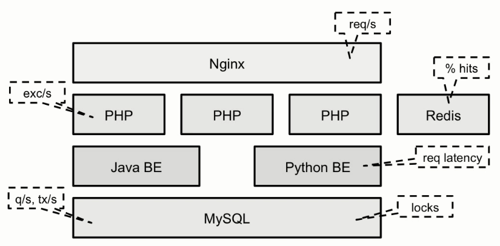

## Title: High Performance Computing with Linux
- Instructor: Morton Cason

## Section 1: Welcome

1. Introduction
- Identifying overloaded resources
- Understanding Linux performance information sources
- Improving CPU utilization by profiling
- Visualizing stack reports with flame graphs
- Tracing IO, scheduling, and other system events

## Section 2: Getting Started

2. Introduction
- The USE Method
  - Utilization, Saturation, Erros
  - For each HW/SW
  - Ref: Systems performance by Brendan Gregg



3. Learn and Understand Linux USE Checklist
- http://www.brendangregg.com/USEmethod/use-linux.html

| Component	| type	| metric| 
|-----------|-------|-------|
|CPU	| utilization	| system-wide: vmstat 1, "us" + "sy" + "st"; sar -u, sum fields except "%idle" and "%iowait"; dstat -c, sum fields except "idl" and "wai"; per-cpu: mpstat -P ALL 1, sum fields except "%idle" and "%iowait"; sar -P ALL, same as mpstat; per-process: top, "%CPU"; htop, "CPU%"; ps -o pcpu; pidstat 1, "%CPU"; per-kernel-thread: top/htop ("K" to toggle), where VIRT == 0 (heuristic). [1]|
|CPU	|saturation|	system-wide: vmstat 1, "r" > CPU count [2]; sar -q, "runq-sz" > CPU count; dstat -p, "run" > CPU count; per-process: /proc/PID/schedstat 2nd field (sched_info.run_delay); perf sched latency (shows "Average" and "Maximum" delay per-schedule); dynamic tracing, eg, SystemTap schedtimes.stp "queued(us)" [3]|
|CPU	|errors|	perf (LPE) if processor specific error events (CPC) are available; eg, AMD64's "04Ah Single-bit ECC Errors Recorded by Scrubber" [4]|
|Memory capacity|	utilization|	system-wide: free -m, "Mem:" (main memory), "Swap:" (virtual memory); vmstat 1, "free" (main memory), "swap" (virtual memory); sar -r, "%memused"; dstat -m, "free"; slabtop -s c for kmem slab usage; per-process: top/htop, "RES" (resident main memory), "VIRT" (virtual memory), "Mem" for system-wide summary|
|Memory capacity|	saturation|	system-wide: vmstat 1, "si"/"so" (swapping); sar -B, "pgscank" + "pgscand" (scanning); sar -W; per-process: 10th field (min_flt) from /proc/PID/stat for minor-fault rate, or dynamic tracing [5]; OOM killer: dmesg | grep killed|
|Memory capacity|	errors	|dmesg for physical failures; dynamic tracing, eg, SystemTap uprobes for failed malloc()s|
|Network Interfaces	|utilization|	sar -n DEV 1, "rxKB/s"/max "txKB/s"/max; ip -s link, RX/TX tput / max bandwidth; /proc/net/dev, "bytes" RX/TX tput/max; nicstat "%Util" [6]|
|Network Interfaces	|saturation|	ifconfig, "overruns", "dropped"; netstat -s, "segments retransmited"; sar -n EDEV, *drop and *fifo metrics; /proc/net/dev, RX/TX "drop"; nicstat "Sat" [6]; dynamic tracing for other TCP/IP stack queueing [7]|
|Network Interfaces	|errors	|ifconfig, "errors", "dropped"; netstat -i, "RX-ERR"/"TX-ERR"; ip -s link, "errors"; sar -n EDEV, "rxerr/s" "txerr/s"; /proc/net/dev, "errs", "drop"; extra counters may be under /sys/class/net/...; dynamic tracing of driver function returns 76]|
|Storage device I/O	|utilization|	system-wide: iostat -xz 1, "%util"; sar -d, "%util"; per-process: iotop; pidstat -d; /proc/PID/sched "se.statistics.iowait_sum"|
|Storage device I/O	|saturation	| iostat -xnz 1, "avgqu-sz" > 1, or high "await"; sar -d same; LPE block probes for queue length/latency; dynamic/static tracing of I/O subsystem (incl. LPE block probes)|
|Storage device I/O	|errors|	/sys/devices/.../ioerr_cnt; smartctl; dynamic/static tracing of I/O subsystem response codes [8]|
|Storage capacity	|utilization	| swap: swapon -s; free; /proc/meminfo "SwapFree"/"SwapTotal"; file systems: "df -h"|
|Storage capacity	|saturation|	not sure this one makes sense - once it's full, ENOSPC|
|Storage capacity	|errors|	strace for ENOSPC; dynamic tracing for ENOSPC; /var/log/messages errs, depending on FS|
|Storage controller	|utilization|	iostat -xz 1, sum devices and compare to known IOPS/tput limits per-card|
|Storage controller	|saturation|	see storage device saturation, ...|
|Storage controller	|errors|	see storage device errors, ...|
|Network controller	|utilization|	infer from ip -s link (or /proc/net/dev) and known controller max tput for its interfaces|
|Network controller	|saturation	|see network interface saturation, ...|
|Network controller	|errors|	see network interface errors, ...|
|CPU interconnect|	utilization	| LPE (CPC) for CPU interconnect ports, tput / max|
|CPU interconnect	|saturation|	LPE (CPC) for stall cycles|
|CPU interconnect|	errors|	LPE (CPC) for whatever is available|
|Memory interconnect	|utilization	|LPE (CPC) for memory busses, tput / max; or CPI greater than, say, 5; CPC may also have local vs remote counters|
|Memory interconnect|	saturation|	LPE (CPC) for stall cycles|
|Memory interconnect|	errors|	LPE (CPC) for whatever is available|
|I/O interconnect	|utilization|	LPE (CPC) for tput / max if available; inference via known tput from iostat/ip/...|
|I/O interconnect	|saturation|	LPE (CPC) for stall cycles|
|I/O interconnect	|errors	LPE| (CPC) for whatever is available |


- Mind the overhead
  - Performance tools have overhead
  - Check the docs
  - Try on a test system first
  - Measure degradation introduced by the tool
- Your own USE checklist
  - Frameworks like statsd can help extract simple application-specific information
  - Make it easy to answer questions like:
    - How many requests are in the backend's queue?
    - How many SELECT statements returned 0 results?
    - What is the latency of application cache misses?

4. Learn How to Apply USE
- free -m # free memory
- sar -B 1 # paging info
- sar -n DEV # send/recv packet
- iostat 1 # per device + avg-cpu
- vmstat 1 # number of runnable threads, memory, swap, io, ...

5. Learn About Linux Performance Tools
- Categorized by DEPTH
  - Counting tools (how many times?)
    - top, ifconfig
  - Latency tools (how long?)
    - iolatency, fileslower, dbslower
  - Stack aggregators (where from?)
    - perf, stackcount
  - Tracers (give me all the events)
    - logs, perf, trace
- Categorized by DATA PROCESSING
  - Real time
    - Output as events arrive
    - No long-term aggregation
    - Lower overhead
  - Later analysis
    - Aggregated or raw data written to a file
    - Post-processing required
    - Can go back and investigate

6. Learning Linux Tracing & Sampling
- Sampling works by getting a snapshot or a call stack every N occurrences of an interesting event
- Tracing works by getting a message or a call stack at every occurrence of an interesting event


7. Learn About Linux Kernel Tracepoints

- Tracepoint usage scenarios
  - Summary of block device utilization and latency
  - Blocked process wait times and timeline
  - Kernel memory allocation patterns
  - HW interrupt handling and distribution
  - Application workload characterization through syscalls

8. Learn About Listing Tracepoints & PMU Events
- sudo tree -L 2 /sys/kernel/debug/tracing/events/
- PMU events
  - Performance Management Unit (PMU) provides processor performance counters
    - May not be available in VM of public clouds
  - Use case
    - Instructions retired: efficency of CPU with the application
    - Last Level Cache (LLC) misses: efficiency of algorithm
    - CPU port utilization: workload b/w processor's execution units
- Performance counters can be read at predefined intervals
  
9. Learn About Kprobes, Uprobes & Listing Probe Locations
- Tracing may not handle all 
  - There is no tracing point in TCP/UDP
- Kprobes and Uprobes
  - A kernel API for attaching a callback to a function
  - Kprobe/Uprobe: attach to the function entry point
  - Kretprobe/Uretprobe: attach to the function return
```bash
  $ grep 'tcp_*send' /proc/kallsyms 
0000000000000000 t tcp_send_mss
0000000000000000 T do_tcp_sendpages
0000000000000000 T tcp_sendpage_locked
0000000000000000 T tcp_sendpage
0000000000000000 T tcp_sendmsg_locked
0000000000000000 T tcp_sendmsg
0000000000000000 t tcp_send_challenge_ack.isra.0
0000000000000000 t tcp_send_dupack
0000000000000000 T tcp_send_rcvq
0000000000000000 t tcp_send_syn_data
...
$ objdump -tT /lib/x86_64-linux-gnu/libpthread.so.0 |grep pthread_mutex_lock
000000000000a8a0 l     F .text	000000000000071d              __pthread_mutex_lock_full
000000000000afc0 l     F .text	000000000000027c              __GI___pthread_mutex_lock
000000000000afc0  w    F .text	000000000000027c              pthread_mutex_lock
000000000000afc0 g     F .text	000000000000027c              __pthread_mutex_lock
000000000000afc0  w   DF .text	000000000000027c  GLIBC_2.2.5 pthread_mutex_lock
000000000000afc0 g    DF .text	000000000000027c  GLIBC_2.2.5 __pthread_mutex_lock
```
- Perf tools
```bash
$ sudo apt install linux-tools-5.4.0-167-generic linux-tools-generic
$ perf list
List of pre-defined events (to be used in -e):
  duration_time                                      [Tool event]
  branch-instructions OR cpu/branch-instructions/    [Kernel PMU event]
  branch-misses OR cpu/branch-misses/                [Kernel PMU event]
  bus-cycles OR cpu/bus-cycles/                      [Kernel PMU event]
  cache-misses OR cpu/cache-misses/                  [Kernel PMU event]
...  
$ sudo perf probe -F __kmalloc  # find the name of function
__kmalloc
```

10. Understanding USDT & Locations
- User Statically Defined Tracing (USDT) brings kernel tracepoints to user programs
- Tracepoint information and arguments embedded in the binary and available to tracing tools

## Section 3: Perf - Understanding CPU Sampling & Flame Graphs

11. Understanding CPU Recording
- Perf: a Linux multi-tool for performance investigations capable of both tracing and sampling
  - Not default in the distribution
  - Ubuntu: apt install linux-tools-common
  - Centos: yum install perf
- Sample commands
  - Record CPU samples with stacks to find CPU hot path: `perf record -ag -F 97`
  - Probe user-space memory allocation failures with stacks
    - `perf probe -x /lib64/libc.so.6 --add 'malloc%return res=$retval'
    - `perf record -e probe:malloc --filter 'res==0' -g p 188`
  - Collect disk IO access statistics and pinpoint heavy disk consumers: `perf record -e block:block_rq_insert -a`
  - Trace syscalls to find missing or excessive file operations: `perf trace -e open`
  - Get number of events over a time interval: `perf stat -a -e sched:sched_switch -- sleep 5`
  - Monitor system performance (like top) on 1000s of metrics
    - `perf top`
    - `perf top -e block:block_rq_insert`
    - `perf top -e page-faults`
- CPU recording with PERF
  - -a: all CPUS
  - -p: specific process
  - -g: capture all stacks
  - -F: frequency of samples (Hz)
  - -c: # of events in each sample
  - system wide: `perf record -ag -F 97`
    - Generates perf.data file
    - Run `perf script` to analyize
  - specific process: `perf record -p 188 -g -F 97`
  - The same perf record invocation can be used with any kernel tracepoint, kprobe, or uprobe
    - `perf record -ag -e sched:sched_switch`
    - `perf record -g -e net:net_dev_start_xmit`

12. Recording CPU Activity, Top-Down & Bottom-Up analysis and analyzing CPU Usage
```bash
$ matexp # name of executable
$ perf record -g -F97 -p $(pidof matexp) # wait until the app terminates or ctrl+c to stop
$ perf script # analyze the produced perf.data
```
- Top-down stack report
  - Read the stack report
- Bottom-up analysis
```bash
$ sudo perf annotate --stdio
 Percent |      Source code & Disassembly of kcore for cycles (1 samples, perce>
------------------------------------------------------------------------------->
         :
         :
         :
         :                      Disassembly of section load0:
         :
         :                      ffffffffa47cce80 <load0>:
    0.00 :   ffffffffa47cce80:       nopl   0x0(%rax,%rax,1)
    0.00 :   ffffffffa47cce85:       push   %rbp
    0.00 :   ffffffffa47cce86:       mov    %rsp,%rbp
```
- `sudo perf report`
```bash
Samples: 281  of event 'cycles', Event count (approx.): 1589669261
  Children      Self  Command          Shared Object       Symbol
+   16.05%    16.05%  WRWorkerLP#1     libxul.so           [.] 0x000000000430ba9
+   16.05%     0.00%  WRWorkerLP#1     libxul.so           [.] 0x00007f0d1e25ea9
+    8.25%     0.00%  Socket Thread    [kernel.kallsyms]   [k] entry_SYSCALL_64_
+    8.25%     0.00%  Socket Thread    [kernel.kallsyms]   [k] do_syscall_64
+    8.09%     8.09%  Socket Thread    [kernel.kallsyms]   [k] inet_recvmsg
+    8.09%     0.00%  Socket Thread    libpthread-2.31.so  [.] recv
...
```
- Header info
```bash
$ sudo perf report --stdio
# To display the perf.data header info, please use --header/--header-only optio>
#
#
# Total Lost Samples: 0
#
# Samples: 281  of event 'cycles'
# Event count (approx.): 1589669261
#
# Children      Self  Command          Shared Object       Symbol              >
# ........  ........  ...............  ..................  ....................>
#
    16.05%    16.05%  WRWorkerLP#1     libxul.so           [.] 0x000000000430ba>
            |
            ---0x7f0d1e25ea9b
    16.05%     0.00%  WRWorkerLP#1     libxul.so           [.] 0x00007f0d1e25ea>
            |
...
```
- Finding hotspot
```bash
$ sudo perf annotate
Samples: 281  of event 'cycles', 97 Hz, Event count (approx.): 1589669261
inet_recvmsg  /proc/kcore [Percent: local period]
Percent│      and    $0x40,%ecx                                                ▒
       │      and    $0xffffffbf,%r8d                                          ▒
       │      mov    %rbx,%rsi                                                 ▒
       │      mov    0x80(%rax),%rax                                           ▒
       │      cmp    $0xffffffffa4796520,%rax                                  ▒
       │    ↓ jne    cb                                                        ▒
       │    → callq  tcp_recvmsg                                               ▒
       │5e:   test   %eax,%eax                                                 ▒
       │    ↓ js     68                                                        ◆
       │      mov    -0x14(%rbp),%edx                                          ▒
       │      mov    %edx,0x8(%rbx)                                            ▒
100.00 │68:   mov    -0x10(%rbp),%rbx   # <-- the hottest instruction          ▒
       │      xor    %gs:0x28,%rbx                                             ▒
       │    ↓ jne    e4                          
```

13. Read and Generate Flame Graphs
- Flame graphs
  - a visualization method by Brendan Gregg
  - Can identify CPU hospts
  - Shows stacks that perform heavy disk IO
  - Finds threads that block for a long time and the stack where they do it
- Generating flame graphs
  - https:/github.com/BrendanGregg/FlameGraph
  - go-torch
  - node-flame
  - pyflame
  - d3-flame-graph

14. CPU Sampling - Perf Scripts, FPO & Broken Stacks

15. Learn to Get Symbols and Generate Flame Graphs For Java Processes
- Map file is required for perf to map symbols
  - maybe debug info in the C/C++/Fortran
- java: perf-map -agent
  - ./create-java-perf-map.sh $(pidof java)
- Node: node --perf_basic_prof_only_functions app.js
- .NET core: export COMPlus_PerfMapEnabled=1

## Section 4: Linux System Events

16. Understanding System Events
- ftrace
  - Originally function tracer
  - Today a set of tools for tracing and aggregation
  - debugfs interface through /sys/kernel/debug/tracing
    - Control files (start/stop, configure events, probes, etc)
    - Output files (trace, trace_pipe)
  - Major features
    - Tracing kernel functions including call graph
    - Tracing kernel tracepoints, kprobes, uprobes
    - Interrupt and wakeup latency tracing
    - In-kernel histograms (hist-triggers)
- trace-cmd
    - Front-end of ftrace
    - `trace-cmd record -e sched:sched_switch`: Records all context switches
    - `trace-cmd record -e syscalls:sys_enter_open -f 'count > 1024'`: Records all write syscalls where the write was > 1K
    - `trace-cmd report`: Prints the trace pipe contents
    - `trace-cmd hist`: Prints a trace summary

17. Learn How to Trace Prcoess Execs and use Tools Scripts
```bash
$ trace-cmd record -e sched:sched_process_exec
... # doing something else from other terminal
ctrl+c
$ ls trace.dat
$ trace-cmd report
```
- Perf-tools
  - From https:/github.com/BrendanGregg/perf-tools
    - opensnoop
    - funcslower
    - iolatency
    - syscount
    - tpoint
    - kprobe
    - uprobe

18. File Operations, Tracing IO Latency and More

## Section 5: Course Summary

19. Summary
- BPF in modern Linux tracing
  - Berkeley Packet Filters since Linux 4.1+
  - In-kernel VM
  - Can efficiently perform in-kernel aggregations
  - Can reduce the overhead on user side
- BCC BPF Front-end
  - BPF Compiler Collection (BCC) is a BPF frontend library and a massive collection of performance tools

## Section 6: Course Material

20. Course Material
