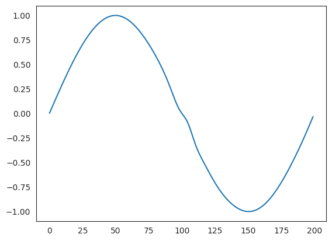
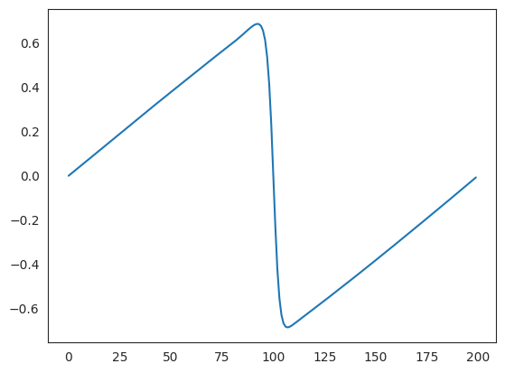
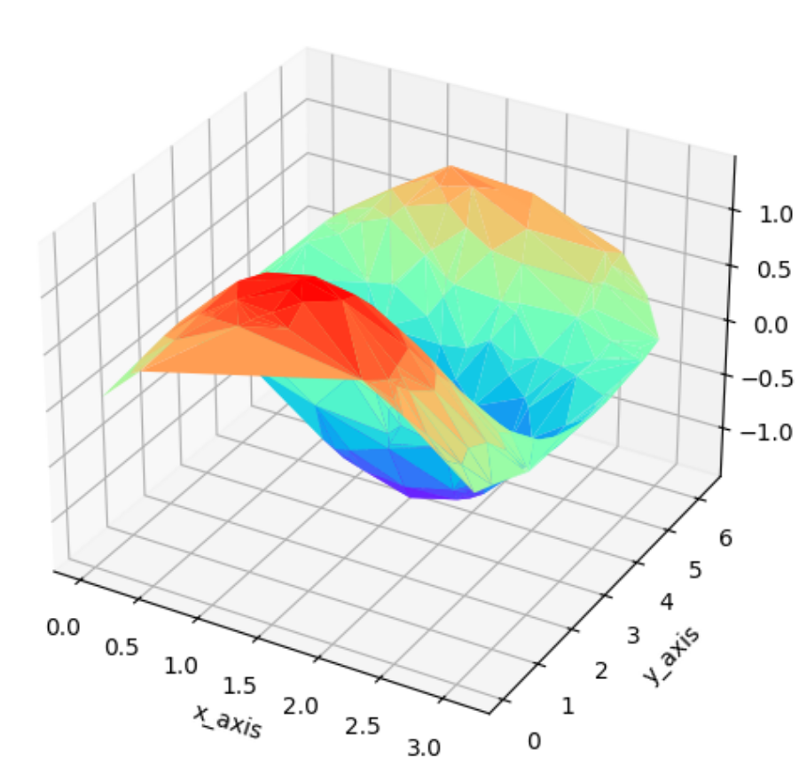

## PINNs Using Physics-Nemo [Modulus]
- Instructor: Dr.Mohammad Samara

## Section 1: Introduction

### 1. Introduction
- PhysicsNemo is the new name of Modulus
  - Do not use `pip3 install nvidia-modulus;pip3 install nvidia-modulus.sym --no-build-isolation`
    - This will try to install old Modulus package, which requires python3.11 or older
  - pip install nvidia-physicsnemo
  - pip install nvidia-physicsnemo-sym --no-build-isolation
    - physicsnemo-sym install failed due to `compute_100` keyword
    - Download physicsnemo-sym from git. Then open setup.py, removing the `compute_100` keyword. Finally, `python3 setup.py install`
  - pip3 install vtk ninja symengine chaospy
- Using Docker: https://docs.nvidia.com/physicsnemo/latest/getting-started/installation.html
  -  curl -fsSL https://nvidia.github.io/libnvidia-container/gpgkey | sudo gpg --dearmor -o /usr/share/keyrings/nvidia-container-toolkit-keyring.gpg \
  && curl -s -L https://nvidia.github.io/libnvidia-container/stable/deb/nvidia-container-toolkit.list | \
  - sed 's#deb https://#deb [signed-by=/usr/share/keyrings/nvidia-container-toolkit-keyring.gpg] https://#g' | \
  - sudo tee /etc/apt/sources.list.d/nvidia-container-toolkit.list
  - sudo apt-get update
  - sudo apt-get install -y nvidia-container-toolkit
  - docker pull nvcr.io/nvidia/physicsnemo/physicsnemo:26.03


### 2. Course Structure

### 3. Deep Learning Theory
- Activation functions
  - Sigmoid: $1/(1+exp(-x))$
  - tahn: $tanh(x)$
  - ReLU: max(0,x)
  - Leaky ReLU: max(0.1x,x)
  - Maxout: max(w1^T x + b1, w2^Tx+b2)
  - ELU: x if x>=0 $$\alpha(exp(x)-1)$ otherwise
- Cost function (loss function)
  - If a model is performing well or not
  - Mean Square
  - Cross Entropy

### 4. PINNs(Physics-Informed Neural Networks) Theory
- Use NN to solve PDE
- Two types of losses
  - BC/IC
  - Domain points
- Steps for solving PINNs 
- Define NN
- Define the IC/BC
- Set the optimizers
- Define the loss functions
- Run the training loop
- Results post-processing


## Section 2: PINNs Solution for 1D Burgers Equation with PyTorch

### 5. Define the Neural Network
- ${\partial u \over \partial t} + u {\partial u \over \partial x} = \nu {\partial^2 u \over \partial x^2}$
```py
import math
import numpy as np
import seaborn as sns
import matplotlib.pyplot as plt
from tqdm import tqdm
import torch
import torch.nn as nn
class NN(nn.Module):
  def __init__(self):
    super(NN,self).__init__()
    self.net = torch.nn.Sequential(
      nn.Linear(2,20),
      nn.Tanh(),
      nn.Linear(20,30),
      nn.Tanh(),
      nn.Linear(30,30),
      nn.Tanh(),
      nn.Linear(30,20),
      nn.Tanh(),
      nn.Linear(20,20),
      nn.Tanh(),
      nn.Linear(20,1)      
    )
  def forward(self,x):
    out = self.net(x)
    return out
```

### 6. Initial Conditions and Boundary Conditions
- Regarding unsqueeze():
```py
y_train_test = torch.tensor([1,2,3,4])
y_train_test = y_train_test.unsqueeze(1)
print(y_train_test)
#tensor([[1],
#        [2],
#        [3],
#        [4]])
```

### 7. Optimizer

### 8. Loss Function

### 9. Train the Model
```py
class Net:
  def __init__(self):
    device = torch.device("cuda") if torch.cuda.is_available() else torch.device("cpu")
    self.model = NN().to(device)
    # comp. domain
    self.h = 0.1
    self.k = 0.1
    x = torch.arange(-1,1+self.h,self.h)       
    t = torch.arange(0,1+self.k,self.k)
    self.X = torch.stack(torch.meshgrid(x,t)).reshape(2,-1).T
    # train data
    bc1 = torch.stack(torch.meshgrid(x[0],t)).reshape(2,-1).T
    bc2 = torch.stack(torch.meshgrid(x[-1],t)).reshape(2,-1).T
    ic  = torch.stack(torch.meshgrid(x,t[0])).reshape(2,-1).T
    self.X_train = torch.cat([bc1,bc2,ic])
    #
    y_bc1 = torch.zeros(len(bc1))
    y_bc2 = torch.zeros(len(bc2))
    y_ic  = -torch.sin(math.pi*ic[:,0])
    self.y_train = torch.cat([y_bc1,y_bc2, y_ic])
    self.y_train = self.y_train.unsqueeze(1)
    #
    self.X = self.X.to(device)
    self.y_train = self.y_train.to(device)
    self.X_train = self.X_train.to(device)
    self.X.requires_grad = True
    # optimizer setting
    self.adam = torch.optim.Adam(self.model.parameters())
    self.optimizer = torch.optim.LBFGS(
      self.model.parameters(),
      lr = 1.0,
      max_iter = 50000,
      max_eval = 50000,
      history_size = 50,
      tolerance_grad = 1.e-7,
      tolerance_change = 1.0*np.finfo(float).eps,
      line_search_fn = "strong_wolfe"
    )
    self.criterion = torch.nn.MSELoss()
    self.iter = 1
  def loss_func(self):
    self.adam.zero_grad()
    self.optimizer.zero_grad()
    y_pred = self.model(self.X_train)
    loss_data = self.criterion(y_pred,self.y_train)
    u = self.model(self.X)
    #print(self.X_train.shape)
    du_dX = torch.autograd.grad(
      u,
      self.X,
      grad_outputs=torch.ones_like(u),
      create_graph=True,
      retain_graph=True
      )[0]
    du_dt = du_dX[:,1]
    du_dx = du_dX[:,0]
    du_dXX = torch.autograd.grad(
      du_dX,
      self.X,
      grad_outputs = torch.ones_like(du_dX),
      create_graph = True,
      retain_graph = True
      )[0]
    du_dxx = du_dXX[:,0]
    #loss_pde = self.criterion(y_pred,self.y_train)
    loss_pde = self.criterion(du_dt + u.squeeze()*du_dx , (0.01/math.pi) * du_dxx)
    loss = loss_pde + loss_data
    loss.backward()
    if self.iter % 100 == 0:
      print(self.iter, loss.item())
    self.iter = self.iter + 1
    return loss
  def train(self):
    self.model.train()
    for i in range(1000):
      self.adam.step(self.loss_func)
    self.optimizer.step(self.loss_func)
  def eval_(self):
    self.model.eval()
# training
net = Net()
net.train() # took 1m 2.9sec
```
    
### 10. Results Evaluation
```py
net.model.eval()
'''
NN(
  (net): Sequential(
    (0): Linear(in_features=2, out_features=20, bias=True)
    (1): Tanh()
    (2): Linear(in_features=20, out_features=30, bias=True)
    (3): Tanh()
    (4): Linear(in_features=30, out_features=30, bias=True)
    (5): Tanh()
    (6): Linear(in_features=30, out_features=20, bias=True)
    (7): Tanh()
    (8): Linear(in_features=20, out_features=20, bias=True)
    (9): Tanh()
    (10): Linear(in_features=20, out_features=1, bias=True)
  )
)
'''
h = 0.01
k = 0.01
x = torch.arange(-1,1,h)
t = torch.arange(0,1,k)
X = torch.stack(torch.meshgrid(x,t)).reshape(2,-1).T
X = X.to(net.X.device)
print(X) # tensor([[-1.0000,  0.0000], [-1.0000,  0.0100], ..., [ 0.9900,  0.9900]], device='cuda:0')
print(X.shape) # torch.Size([20000, 2])
model = net.model
model.eval()
with torch.no_grad():
  y_pred = model(X)
  y_pred = y_pred.reshape(len(x),len(t)).cpu().numpy()
print(y_pred.shape) # (200, 100)
sns.set_style("white")
plt.figure(figsize=(5,3),dpi=3000)
sns.heatmap(y_pred,cmap="jet")
```

```py
plt.plot(y_pred[:,0])
```

```py
plt.plot(y_pred[:,99])
```


## Section 3: 1D Wave Equation

### 11. What is the Wave Equation
- $ {\partial^2 u \over \partial t^2} = c^2 {\partial^2 u \over \partial x^2}$ or  $u_{tt} = c^2 u_{xx}$
- $u(0,t) = 0$
- $u(\pi,t) = 0$
- $u(x,0) = \sin(x)$
- $u_t(x,0) = \sin(x)$
- https://docs.nvidia.com/physicsnemo/25.08/physicsnemo-sym/user_guide/foundational/1d_wave_equation.html

### 12. Setting Up Google Colab

### 13. Define the Wave Equation Function
- wave_equation_main.py:
```py
from sympy import Symbol, Function, Number
from physicsnemo.sym.eq.pde import PDE

class WaveEquation1D(PDE):
  name = "WaveEquation1D"
  def __init__(self,c=1.0):
    x = symbols("x")
    t = symbols("t")
    input_variables = {"x":x, "t":t}
    u = Function("u")(*input_variables)
    if type(c) is str:
      c = 1.0
    elif type(c) is [float,int]:
      c = Number(c)
    self.equations = {}
    #self.equations["wave_equation"] = u.diff(t,2) - {c**2 * u.diff(x)}.diff(x) # when c is a func(x)
    self.equations["wave_equation"] = u.diff(t,2) - c**2 * u.diff(x,2)    
```
### 14. Define the Config File
- config_main.yml
```yml
defaults:
  - physicsnemo_default
  - arch:
    - fully_connected
  - optimizer: adam
  - scheduler: tf_exponential_lr
  - loss: sum
  - _self_  # this configuration will be merged
scheduler:
  decay_rate: 0.95
  decay_steps: 100
training:
  rec_results_freq: 1000
  max_steps: 10000
batch_size:
  IC: 315
  BC: 200
  interior: 3150
```

### 15. Import Needed Libraries

### 16. Set Up the main RUN File

### 17. Define the B.C, Interior Points

### 18. Add Validator Functionality

### 19. Solve
- run.py:
```py
import numpy as np
from sympy import Symbol, sin
import physicsnemo.sym
from physicsnemo.sym.hydra import instantiate_arch, PhysicsNeMoConfig
from physicsnemo.sym.solver import Solver
from physicsnemo.sym.domain import Domain
from physicsnemo.sym.geometry.primitives_1d import Line1D
from physicsnemo.sym.domain.constraint.continuous import (
  PointwiseBoundaryConstraint, 
  PointwiseInteriorConstraint,
)
from physicsnemo.sym.domain.validator import PointwiseValidator
from physicsnemo.sym.key import Key
from physicsnemo.sym.node import Node
from wave_equation_main import WaveEquation1D
@physicsnemo.sym.main(config_path=".", config_name="config_main")
def run(cfg:PhysicsNeMoConfig) -> None:
  we = WaveEquation1D(c=1.0)
  wave_net = instantiate_arch(
    input_keys = [Key("x"),Key("t")],
    output_keys = [Key("u")],
    cfg = cfg.arch.fully_connected,
  )
  nodes = we.make_nodes() + [wave_net.make_node(name="wave_network") ]
  x_symbol,t_symbol = Symbol("x"), Symbol("t")
  L = float(np.pi)
  geo = Line1D(0, L)
  time_range = {t_symbol: (0, 2*L)}
  domain = Domain()
  IC = PointwiseInteriorConstraint(
        nodes=nodes,
        geometry=geo,
        outvar={"u": sin(x_symbol), "u__t": sin(x_symbol)},
        batch_size=cfg.batch_size.IC, # comes from config_main.yaml
        lambda_weighting={"u": 1.0, "u__t": 1.0},
        parameterization={t_symbol: 0.0},
        )
  domain.add_constraint(IC, "IC")
  BC = PointwiseBoundaryConstraint(
    nodes = nodes,
    geometry=geo,
    outvar = {"u": 0},
    batch_size = cfg.batch_size.BC,  # comes from config_main.yaml
    parameterization = time_range,
  )
  domain.add_constraint(BC,"BC")
  interior = PointwiseInteriorConstraint(
    nodes=nodes,
    geometry=geo,
    outvar = {"wave_equation":0},
    batch_size = cfg.batch_size.interior,
    parameterization = time_range,
  )
  domain.add_constraint(interior,"interior")
  deltaT = 0.01
  deltaX = 0.01
  x = np.arange(0, L, deltaX)
  t = np.arange(0, 2*L, deltaT)
  X,T = np.meshgrid(x,t)
  X = np.expand_dims(X.flatten(), axis=-1)
  T = np.expand_dims(T.flatten(), axis=-1)
  u = np.sin(X) * (np.cos(T) + np.sin(T))
  invar_numpy = {"x":X, "t":T}
  outvar_numpy = {"u": u}
  validator = PointwiseValidator(
    nodes = nodes,
    invar = invar_numpy,
    true_outvar = outvar_numpy,
    batch_size = 16, # 128, yields OOM with 2GB
  )
  domain.add_validator(validator)
  slv = Solver(cfg,domain)
  slv.solve()
if __name__ == "__main__": 
  run()  
```
- CLI: `python3 run.py`
  - `export PYTORCH_ALLOC_CONF=expandable_segments:True` to save GPU memory but may not be efficient anyway
- In order to run on 2GB GPU, reduce the batch size of BC/IC (Pointwise constraints)
  - dt/dx size may not affect much

### 20. Results Extraction
- Use ParaView to visualize vtp file - this is 1D model and nothing to display from ParaView

### 21. Results Post Processing
- Convert outputs/run/constraints/interior.vtp into csv using ParaView
```py
import matplotlib.pyplot as plt
import pandas as pd
from mpl_toolkits.mplot3d import Axes3D
df = pd.read_csv('interior.csv')
fig = plt.figure(figsize=(50,6))
ax = fig.add_subplot(111, projection='3d')
ax.plot_trisurf(df['Points_0'], df['t'], df['u'], cmap='rainbow')
ax.set_xlabel('x_axis')
ax.set_ylabel('y_axis')
ax.set_zlabel('z_axis')
```

- Using validator.vtp, we can compare `pred_u` vs `true_u`

### 22. Nvidia-modulus To Physicsnemo

## Section 4: Cavity Flow

### 23. Setting up env. in your personal computer

### 24. Cavity Flow Problem
- https://docs.nvidia.com/deeplearning/physicsnemo/physicsnemo-sym/user_guide/basics/lid_driven_cavity_flow.html#creating-a-pde-node

### 25. Define the Config File
- config_main.yml
```yml
defaults:
  - physicsnemo_default
  - arch:
    - fully_connected
  - optimizer: adam
  - scheduler: tf_exponential_lr
  - loss: sum
  - _self_  # this configuration will be merged
jit: false  
scheduler:
  decay_rate: 0.95
  decay_steps: 20_000
training:
  rec_results_freq: 2000
  max_steps: 1_000_000
batch_size:
  TopWall: 1000
  NoSlip: 1000
  Interior: 4000
```

### 26. Import Needed Libraries

### 27. Set Up the main RUN File

### 28. Define the Navier-Stokes equation and DNN

### 29. Define the B.C, I.C, Interior Points
- sdf: signed distance field

### 30. Solve
- run.py:
```py
import os
import warnings
from sympy import Symbol, Eq, Abs
import torch
import physicsnemo.sym
from physicsnemo.sym.hydra import to_absolute_path, instantiate_arch, PhysicsNeMoConfig
from physicsnemo.sym.utils.io import csv_to_dict
from physicsnemo.sym.solver import Solver
from physicsnemo.sym.domain import Domain
from physicsnemo.sym.geometry.primitives_2d import Rectangle
from physicsnemo.sym.domain.constraint.continuous import (
  PointwiseBoundaryConstraint,
  PointwiseInteriorConstraint,
)
from physicsnemo.sym.eq.pdes.navier_stokes import NavierStokes
from physicsnemo.sym.eq.pdes.turbulence_zero_eq import ZeroEquation
from physicsnemo.sym.key import Key
#
@physicsnemo.sym.main(config_path=".", config_name="config_main")
def run(cfg:PhysicsNeMoConfig) -> None:
  height = 0.1
  width = 0.1
  x,y = Symbol("x"), Symbol("y")
  rec = Rectangle((-width/2, -height/2),(width/2, height/2))
  ze = ZeroEquation(nu=1e-4, dim=2, time=False, max_distance=height/2)
  ns = NavierStokes(nu=ze.equations["nu"], rho=1.0, dim=2, time=False)
  flow_net = instantiate_arch(
    input_keys = [Key("x"), Key("y")],
    output_keys = [Key("u"), Key("v"), Key("p")],
    cfg = cfg.arch.fully_connected,
  )
  nodes = ns.make_nodes() + ze.make_nodes() + [flow_net.make_node(name="flow_network")]
  cavity_domain = Domain()
  top_wall = PointwiseBoundaryConstraint(
    nodes = nodes,
    geometry = rec,
    outvar = {"u": 1.5, "v":0}, 
    batch_size = cfg.batch_size.TopWall,
    lambda_weighting = {"u":(1.0-20*Abs(x)), "v":1.0},
    criteria = Eq(y, height/2),
  )
  cavity_domain.add_constraint(top_wall, "top_wall")  
  no_slip = PointwiseBoundaryConstraint(
    nodes = nodes,
    geometry = rec,
    outvar = {"u":0, "v":0},
    batch_size = cfg.batch_size.NoSlip,
    criteria =  y < height / 2, 
  )
  cavity_domain.add_constraint(no_slip, "no_slip")  
  interior = PointwiseInteriorConstraint(
    nodes = nodes,
    geometry = rec,
    outvar = {"continuity":0,"momentum_x":0,"momentum_y":0},
    batch_size = cfg.batch_size.Interior,
    compute_sdf_derivatives = True,
    lambda_weighting = {
      "continuity": Symbol("sdf"),
      "momentum_x": Symbol("sdf"),
      "momentum_y": Symbol("sdf"),
    },
  )
  cavity_domain.add_constraint(interior, "interior")
  slv = Solver(cfg,cavity_domain)
  slv.solve()

if __name__ == "__main__":
  run()
```

### 31. Results Extraction
- `python3 run.py`
- To run with 2GB gpu memory, reduce the batch size in yaml file as 10%

### 32. Results Post Processing
- May take more than 240,000 steps (> 2days ?)
- Following config file from Nvidia (https://docs.nvidia.com/deeplearning/physicsnemo/physicsnemo-sym/user_guide/basics/lid_driven_cavity_flow.html#creating-a-pde-node)
```yaml
defaults:
  - physicsnemo_default
  - arch:
      - fully_connected
  - scheduler: tf_exponential_lr
  - optimizer: adam
  - loss: sum
  - _self_
scheduler:
  decay_rate: 0.95
  decay_steps: 4000
training:
  rec_validation_freq: 1000
  rec_inference_freq: 2000
  rec_monitor_freq: 1000
  rec_constraint_freq: 2000
  max_steps: 10000

batch_size:
  TopWall: 1000
  NoSlip: 1000
  Interior: 4000
graph:
  func_arch: true
```  

### 33. Pretrained Model Inference
- config.yml
```yml
defaults:
  - physicsnemo_default
  - arch:
    - fully_connected
  - optimizer: adam
  - scheduler: tf_exponential_lr
  - loss: sum
  - _self_  # this configuration will be merged
jit: false  
run_mode: 'eval'
scheduler:
  decay_rate: 0.95
  decay_steps: 20_000
training:
  rec_results_freq: 2000
  max_steps: 1_000_000
  rec_inference_freq: 2000
batch_size:
  TopWall: 1000
  NoSlip: 1000
  Interior: 4000
```
- run2.py
```py
import os
import warnings
from sympy import Symbol, Eq, Abs
import torch 
import physicsnemo.sym
from physicsnemo.sym.hydra import to_absolute_path, instantiate_arch, PhysicsNeMoConfig
from physicsnemo.sym.utils.io import csv_to_dict
from physicsnemo.sym.solver import Solver
from physicsnemo.sym.domain import Domain
from physicsnemo.sym.geometry.primitives_2d import Rectangle
from physicsnemo.sym.domain.constraint import (
    PointwiseBoundaryConstraint,
    PointwiseInteriorConstraint,
)
from physicsnemo.sym.eq.pdes.navier_stokes import NavierStokes
from physicsnemo.sym.eq.pdes.turbulence_zero_eq import ZeroEquation
from physicsnemo.sym.domain.inferencer import PointwiseInferencer
from physicsnemo.sym.utils.io.plotter import InferencerPlotter
from physicsnemo.sym.key import Key
import numpy as np
@physicsnemo.sym.main(config_path ="./", config_name= "config.yml")
def run(cfg: PhysicsNeMoConfig) -> None:
    height = 0.1
    width = 0.1
    x, y = Symbol("x"), Symbol("y")
    rec = Rectangle((-width/2, -height/2),(width/2, height/2))
    ze = ZeroEquation(nu=1e-4, dim=2, time=False, max_distance= height/2)
    ns = NavierStokes(nu=ze.equations["nu"], rho=1.0, dim=2, time=False)
    flow_net = instantiate_arch(
        input_keys = [Key("x"), Key("y")],
        output_keys = [Key("u"), Key("v"), Key("p")],
        cfg = cfg.arch.fully_connected,
    )
    nodes= ( ns.make_nodes() + ze.make_nodes() + [flow_net.make_node(name="flow_network")])
    cavity_domain = Domain()
    top_wall = PointwiseBoundaryConstraint(
        nodes = nodes,
        geometry= rec,
        outvar = {"u": 1.5, "v": 0},
        batch_size = cfg.batch_size.TopWall,
        lambda_weighting = {"u":1.0-20*Abs(x), "v":1.0},
        criteria = Eq(y, height/2),
    )
    cavity_domain.add_constraint(top_wall,"top_wall")
        no_slip = PointwiseBoundaryConstraint(
        nodes = nodes,
        geometry = rec,
        outvar = {"u": 0, "v": 0},
        batch_size = cfg.batch_size.NoSlip,
        criteria= y < height /2,
    )
    cavity_domain.add_constraint(no_slip,"no_slip")
    interior = PointwiseInteriorConstraint(
        nodes = nodes,
        geometry = rec,
        outvar = {"continuity":0,"momentum_x":0,"momentum_y":0},
        batch_size = cfg.batch_size.Interior,
        compute_sdf_derivatives= True,
        lambda_weighting={
            "continuity": Symbol("sdf"),
            "momentum_x": Symbol("sdf"),
            "momentum_y": Symbol("sdf"),
            },
    )
    cavity_domain.add_constraint(interior,"interior")
    #inferencer code addition
    start_value = -0.05
    end_value = +0.05
    num_points = 400
    x_values = np.linspace(start_value,end_value,num_points)
    y_values = np.linspace(start_value,end_value,num_points)
    x_mesh, y_mesh = np.meshgrid(x_values,y_values)
    print("x_mesh",x_mesh)
    print("y_mesh",y_mesh)
    mesh_array = np.stack([x_mesh,y_mesh],axis=-1)
    print("mesh_array",mesh_array)
    x_array = mesh_array[:,:,0].reshape(-1,1)
    y_array = mesh_array[:,:,1].reshape(-1,1)
    print("mesh_array",mesh_array)
    print("mesh_array",mesh_array)
    print("len(x_array)",len(x_array))
    data_in_dict= {
        'x': x_array,
        'y': y_array,
        'sdf' : np.zeros_like(x_array)
    }
    data_in_invar_numpy = {
        key: value
        for key, value in data_in_dict.items()
        if key in ["x","y","sdf"]
    }
    grid_inference = PointwiseInferencer(
        nodes = nodes,
        invar = data_in_invar_numpy,
        output_names = ["u","v","p","nu"],
        batch_size = 1024,
        plotter= InferencerPlotter(),
        requires_grad = True,
    )
    cavity_domain.add_inferencer(grid_inference,"inf_data")
    slv = Solver(cfg, cavity_domain)
    slv.solve()
if __name__ == "__main__":
    run()
```

## Section 5: 2D Heat Sink

### 34. 2d heat channel problem
- https://docs.nvidia.com/physicsnemo/25.08/physicsnemo-sym/user_guide/foundational/scalar_transport.html

### 35. Define the Config File
- config.yml
```yml
defaults:
  - physicsnemo_default
  - arch:
    - fully_connected
  - optimizer: adam
  - scheduler: tf_exponential_lr
  - loss: sum
  - _self_  # this configuration will be merged
jit: false  
scheduler:
  decay_rate: 0.95
  decay_steps: 5_000
training:
  rec_validation_freq: 1000
  rec_inference_freq: 1000
  rec_monitor_freq: 1000
  rec_constraint_freq: 2000
  max_steps: 500_000
batch_size:
  inlet: 64
  outlet: 64
  hs_wall: 500
  channel_wall: 1500 #2500
  interior_flow: 3000 #4800
  interior_heat: 3000 #4800
  integral_continuity: 128
  num_integral_continuity: 4
```

### 36. Import Needed Libraries

### 37. Set Up the main RUN File

### 38. Define the geometry

### 39. Define the Navier-Stokes equation and DNN

### 40. Define the B.C, Interior Constraints

### 41. Add Monitor

### 42. Solve
```py
import os
import warnings
import torch 
import numpy as np
from sympy import Symbol, Eq
import physicsnemo.sym
from physicsnemo.sym.hydra import to_absolute_path, instantiate_arch, PhysicsNeMoConfig
from physicsnemo.sym.solver import Solver
from physicsnemo.sym.domain import Domain
from physicsnemo.sym.geometry.primitives_2d import Rectangle, Line, Channel2D
from physicsnemo.sym.utils.sympy.functions import parabola
from physicsnemo.sym.utils.io import csv_to_dict
from physicsnemo.sym.eq.pdes.navier_stokes import NavierStokes, GradNormal
from physicsnemo.sym.eq.pdes.basic import NormalDotVec
from physicsnemo.sym.eq.pdes.turbulence_zero_eq import ZeroEquation
from physicsnemo.sym.eq.pdes.advection_diffusion import AdvectionDiffusion
from physicsnemo.sym.domain.constraint import (
    PointwiseBoundaryConstraint,
    PointwiseInteriorConstraint,
    IntegralBoundaryConstraint,
)
from physicsnemo.sym.domain.monitor import PointwiseMonitor
from physicsnemo.sym.domain.validator import PointwiseValidator
from physicsnemo.sym.key import Key
from physicsnemo.sym.node import Node
from physicsnemo.sym.geometry import Parameterization, Parameter
@physicsnemo.sym.main(config_path ="./", config_name= "config.yaml")
def run(cfg: PhysicsNeMoConfig) -> None:
  channel_length = (-2.5, 2.5)
  channel_width = (-0.5, 0.5)
  heat_sink_origin = (-1, -0.3)
  nr_heat_sink_fins = 3
  gap = 0.15 + 0.1
  heat_sink_length = 1.0
  heat_sink_fin_thickness = 0.1
  inlet_vel = 1.5
  heat_sink_temp = 350
  base_temp = 293.498
  nu = 0.01
  diffusivity = 0.01/5
  x,y = Symbol("x"), Symbol("y")
  channel = Channel2D(
    (channel_length[0],channel_width[0]),
    (channel_length[1],channel_width[1])
  )
  heat_sink = Rectangle(
    heat_sink_origin,
    (
      (heat_sink_origin[0]+heat_sink_length),
      (heat_sink_origin[1]+heat_sink_fin_thickness),
    ),
  )
  for i in range(1, nr_heat_sink_fins):
    heat_sink_origin = (heat_sink_origin[0], heat_sink_origin[1]+gap)
    fin = Rectangle(
      heat_sink_origin,
      (
        heat_sink_origin[0]+heat_sink_length,
        heat_sink_origin[1]+heat_sink_fin_thickness,
      ),
    )
    heat_sink = heat_sink + fin
  geo = channel - heat_sink # removes 3 fins geo
  inlet = Line(
        (channel_length[0], channel_width[0]), (channel_length[0], channel_width[1]), -1
  )
  outlet = Line(
        (channel_length[1], channel_width[0]), (channel_length[1], channel_width[1]), 1
  )
  x_pos = Parameter("x_pos")
  integral_line = Line(
    (x_pos, channel_width[0]),
    (x_pos, channel_width[1]),
    1,
    parameterization=Parameterization({x_pos: channel_length}),
  )  
  ze = ZeroEquation(
    nu=nu, rho=1.0, dim=2, max_distance=(channel_width[1]-channel_width[0])/2
  )
  ns = NavierStokes(nu=ze.equations["nu"], rho=1.0, dim=2, time=False)
  ade = AdvectionDiffusion(T="c", rho=1.0, D=diffusivity, dim=2, time=False)
  gn_c = GradNormal("c", dim=2, time=False)
  normal_dot_vel = NormalDotVec(["u", "v"])
  flow_net = instantiate_arch(
    input_keys = [Key("x"), Key("y")],
    output_keys = [Key("u"), Key("v"), Key("p")],
    cfg = cfg.arch.fully_connected,
  )
  heat_net = instantiate_arch(
    input_keys = [Key("x"), Key("y")],
    output_keys = [Key("c")],
    cfg = cfg.arch.fully_connected,
  )
  nodes = ( ns.make_nodes() 
    + ze.make_nodes() 
    + ade.make_nodes(detach_names=["u","v"])
    + gn_c.make_nodes()
    + normal_dot_vel.make_nodes() 
    + [flow_net.make_node(name="flow_network")]
    + [heat_net.make_node(name="heat_network")]
  )
  domain = Domain()
  inlet_parabola = parabola(
    y, 
    inter_1 = channel_width[0],
    inter_2 = channel_width[1],
    height = inlet_vel
  )
  inlet = PointwiseBoundaryConstraint(
    nodes = nodes,
    geometry = inlet,
    outvar = {"u":inlet_parabola, "v": 0, "c":0},
    batch_size = cfg.batch_size.inlet, 
  )
  domain.add_constraint(inlet,"inlet")
  outlet = PointwiseBoundaryConstraint(
    nodes = nodes,
    geometry = outlet,
    outvar = {"p":0},
    batch_size = cfg.batch_size.outlet,
  )
  domain.add_constraint(outlet,"outlet")
  hs_wall = PointwiseBoundaryConstraint(
    nodes = nodes,
    geometry = heat_sink,
    outvar = {"u":0, "v":0, "c":(heat_sink_temp - base_temp)/273.15},
    batch_size = cfg.batch_size.hs_wall,
  )
  domain.add_constraint(hs_wall,"heat_sink_wall")
  channel_wall = PointwiseBoundaryConstraint(
    nodes = nodes,
    geometry = channel,
    outvar = {"u":0, "v":0, "normal_gradient_c":0},
    batch_size = cfg.batch_size.channel_wall
  )
  domain.add_constraint(channel_wall, "channel_wall")
  interior_flow = PointwiseInteriorConstraint(
    nodes = nodes,
    geometry = geo,
    outvar = {"continuity":0, "momentum_x":0, "momentum_y":0},
    batch_size = cfg.batch_size.interior_flow,
    compute_sdf_derivatives = True,
    lambda_weighting = {
      "continuity": Symbol("sdf"),
      "momentum_x": Symbol("sdf"),
      "momentum_y": Symbol("sdf"),
    }
  )
  domain.add_constraint(interior_flow, "interior_flow")
  interior_heat = PointwiseInteriorConstraint(
    nodes = nodes,
    geometry = geo,
    outvar = {"advection_diffusion_c":0},
    batch_size = cfg.batch_size.interior_heat,
    lambda_weighting = {"advection_diffusion_c": 1.0}
  )
  domain.add_constraint(interior_heat, "interior_heat")
  def integral_criteria(invar, params)  :
    sdf = geo.sdf(invar, params)
    return np.greater(sdf["sdf"],0)
  integral_continuity = IntegralBoundaryConstraint(
    nodes = nodes,
    geometry = integral_line,
    outvar = {"normal_dot_vel":1},
    batch_size = cfg.batch_size.num_integral_continuity,
    integral_batch_size = cfg.batch_size.integral_continuity,
    lambda_weighting = {"normal_dot_vel":0.1},
    criteria = integral_criteria,
  )
  domain.add_constraint(integral_continuity, "integral_continuity")
  force = PointwiseMonitor(
    heat_sink.sample_boundary(100),
    output_names=["p"],
    metrics = {
      "force_x": lambda var: torch.sum(var["normal_x"]*var["area"]*var["p"]) ,
      "force_y": lambda var: torch.sum(var["normal_y"]*var["area"]*var["p"]) ,
    },
    nodes = nodes,    
  )
  domain.add_monitor(force)
  slv = Solver(cfg,domain)
  slv.solve()
if __name__ == "__main__":
  run()
```

### 43. Results Extraction

### 44. Results Post Processing

## Section 6: 2D Stress Analysis

### 45. 2D Stress Analysis Problem
- $ (\lambda + \mu) u_{j,ji} + \mu u_{i,jj} + f_i = 0$
- $ \lambda = {E \nu \over (1+\nu) (1-2\nu)}$
- $ \mu = {E \over 2 (1 + \nu)}$
- https://docs.nvidia.com/physicsnemo/25.11/physicsnemo-sym/user_guide/foundational/linear_elasticity.html

### 46. Define the Config File
- config.yml
```yml
defaults:
  - physicsnemo_default
  - arch:
    - fully_connected
  - optimizer: adam
  - scheduler: tf_exponential_lr
  - loss: sum
  - _self_
scheduler:
  decay_rate: 0.95
  decay_steps: 15_000
training:
  rec_results_freq: 2000
  rec_constraint_freq: 2000
  max_steps: 2_000_000
batch_size:
  panel_left: 250
  panel_right: 250
  panel_bottom: 150
  panel_corner: 5
  panel_top: 150
  panel_window: 35
  lr_interior: 7000
  hr_interior: 4000
```

### 47. Import Needed Libraries

### 48. Define the DNN

### 49. Define the geometry - part a

### 50. Define the geometry - part b

### 51. Set Changing Parameters

### 52. Define the B.C, Interior Constraints

### 53. Case Inferencing

### 54. Solve
```py
import os
import warnings
import torch 
import numpy as np
from sympy import Symbol, Eq
import physicsnemo.sym
from physicsnemo.sym.hydra import instantiate_arch, PhysicsNeMoConfig
from physicsnemo.sym.solver import Solver
from physicsnemo.sym.domain import Domain
from physicsnemo.sym.geometry.primitives_2d import Rectangle, Circle
from physicsnemo.sym.domain.constraint import (
    PointwiseBoundaryConstraint,
    PointwiseInteriorConstraint,
)
from physicsnemo.sym.domain.validator import PointwiseValidator
from physicsnemo.sym.domain.inferencer import PointwiseInferencer
from physicsnemo.sym.key import Key
from physicsnemo.sym.node import Node
from physicsnemo.sym.geometry import Parameterization, Parameter
from physicsnemo.sym.eq.pdes.linear_elasticity import LinearElasticityPlaneStress
@physicsnemo.sym.main(config_path ="./", config_name= "config.yaml")
def run(cfg: PhysicsNeMoConfig) -> None:
  E = 73.e9
  nu = 0.33
  lambda_ = nu * E /((1+nu)*((1.-2.*nu)))
  mu_real = E / (2*(1.+nu))
  lambda_ = lambda_/mu_real
  mu = 1.0
  le = LinearElasticityPlaneStress(lambda_ = lambda_, mu=mu)
  elasticity_net = instantiate_arch(
    input_keys = [Key("x"), Key("y"), Key("sigma_hoop")],
    output_keys = [Key("u"), Key("v"), Key("sigma_xx"), Key("sigma_yy"), Key("sigma_xy")],
    cfg = cfg.arch.fully_connected
  )
  nodes = le.make_nodes() + [elasticity_net.make_node(name="elasticity_network")]
  x,y,sigma_hoop = Symbol("x"), Symbol("y"), Symbol("sigma_hoop")
  panel_origin = (-0.5, -0.9)
  panel_dim = (1.0, 1.8)
  window_origin = (-0.125,-0.2)
  window_dim = (0.25,0.4)
  panel_aux1_origin = (-0.075,-0.2)
  panel_aux1_dim = (0.15, 0.4)
  panel_aux2_origin = (-0.125,-0.15)
  panel_aux2_dim = (0.25, 0.3)
  circle_nw_center = (-0.075, 0.15)
  circle_ne_center = (0.075, 0.15)
  circle_se_center = (0.075, -0.15)
  circle_sw_center = (-0.075, -0.15)
  circle_radius = 0.05
  #
  hr_zone_origin = (-0.2,-0.4)
  hr_zone_dim = (0.4,0.8)
  #
  panel = Rectangle(
      panel_origin, (panel_origin[0] + panel_dim[0] , panel_origin[1] + panel_dim[1])
  )
  window = Rectangle(
      window_origin, (window_origin[0] + window_dim[0] , window_origin[1] + window_dim[1])
  )  
  panel_aux1 = Rectangle(
      panel_aux1_origin, (panel_aux1_origin[0] + panel_aux1_dim[0] , panel_aux1_origin[1] + panel_aux1_dim[1])
  )  
  panel_aux2 = Rectangle(
      panel_aux2_origin, (panel_aux2_origin[0] + panel_aux2_dim[0] , panel_aux2_origin[1] + panel_aux2_dim[1])
  )  
  hr_zone = Rectangle(
      hr_zone_origin, (hr_zone_origin[0] + hr_zone_dim[0] , hr_zone_origin[1] + hr_zone_dim[1])
  )  
  circle_nw= Circle(circle_nw_center, circle_radius)
  circle_ne= Circle(circle_ne_center, circle_radius)
  circle_se= Circle(circle_se_center, circle_radius)
  circle_sw= Circle(circle_sw_center, circle_radius)
  corners = (
      window -panel_aux1 - panel_aux2 - circle_nw - circle_ne - circle_se - circle_sw
  )  
  window = window - corners
  geo = panel - window  
  hr_geo = geo & hr_zone  
  characteristic_length = panel_dim[0]
  characteristic_disp = 0.001 * window_dim[0]  
  sigma_normalization = characteristic_length/ (mu_real * characteristic_disp)
  sigma_hoop_lower = 46 * 10**6  * sigma_normalization
  sigma_hoop_upper = 56.5 * 10**6  * sigma_normalization
  sigma_hoop_range = (sigma_hoop_lower, sigma_hoop_upper)
  param_ranges = {sigma_hoop: sigma_hoop_range}  
  inference_param_ranges = {sigma_hoop: 46 * 10**6 * sigma_normalization}  
  bounds_x = (panel_origin[0], panel_origin[0] + panel_dim[0])
  bounds_y = (panel_origin[1], panel_origin[1] + panel_dim[1])
  hr_bounds_x = (hr_zone_origin[0],hr_zone_origin[0]+hr_zone_dim[0])
  hr_bounds_y = (hr_zone_origin[1],hr_zone_origin[1]+hr_zone_dim[1])
  #
  domain = Domain()  
  panel_left = PointwiseBoundaryConstraint(
      nodes = nodes,
      geometry = geo,
      outvar = {"traction_x":0.0, "traction_y":0.0},
      batch_size = cfg.batch_size.panel_left,
      criteria = Eq(x, panel_origin[0]),
      parameterization = param_ranges,
  )
  domain.add_constraint(panel_left, "panel_left")  
  panel_right = PointwiseBoundaryConstraint(
      nodes = nodes,
      geometry = geo,
      outvar = {"traction_x":0.0, "traction_y":0.0},
      batch_size = cfg.batch_size.panel_right,
      criteria = Eq(x, panel_origin[0] + panel_dim[0]),
      parameterization = param_ranges,
  )
  domain.add_constraint(panel_right, "panel_right")  
  panel_bottom = PointwiseBoundaryConstraint(
      nodes = nodes,
      geometry = geo,
      outvar = {"v":0.0},
      batch_size = cfg.batch_size.panel_bottom,
      criteria = Eq(y, panel_origin[1]),
      parameterization = param_ranges,
  )
  domain.add_constraint(panel_bottom, "panel_bottom")  
  panel_corner = PointwiseBoundaryConstraint(
      nodes = nodes,
      geometry = geo,
      outvar = {"u":0.0},
      batch_size = cfg.batch_size.panel_corner,
      criteria = Eq(x, panel_origin[0]) & (y > panel_origin[1]) & (y < panel_origin[1]+ 1e-3),
      parameterization = param_ranges,
  )
  domain.add_constraint(panel_corner, "panel_corner")  
  panel_top = PointwiseBoundaryConstraint(
      nodes = nodes,
      geometry = geo,
      outvar = {"traction_x":0.0, "traction_y":sigma_hoop},
      batch_size = cfg.batch_size.panel_top,
      criteria = Eq(x, panel_origin[0]),
      parameterization = param_ranges,
  )
  domain.add_constraint(panel_top, "panel_top")  
  panel_window = PointwiseBoundaryConstraint(
      nodes = nodes,
      geometry = window,
      outvar = {"traction_x":0.0, "traction_y":0.0},
      batch_size = cfg.batch_size.panel_window,
      parameterization = param_ranges,
  )
  domain.add_constraint(panel_window, "panel_window")  
  lr_interior = PointwiseInteriorConstraint(
      nodes= nodes,
      geometry = geo,
      outvar = {
          "equilibrium_x": 0.0,
          "equilibrium_y": 0.0,
          "stress_disp_xx": 0.0,
          "stress_disp_yy": 0.0,
          "stress_disp_xy": 0.0,
      },
      batch_size = cfg.batch_size.lr_interior,
      bounds= {x: bounds_x, y: bounds_y},
      lambda_weighting = {
          "equilibrium_x": Symbol("sdf"),
          "equilibrium_y": Symbol("sdf"),
          "stress_disp_xx": Symbol("sdf"),
          "stress_disp_yy": Symbol("sdf"),
          "stress_disp_xy": Symbol("sdf"),
      },
      parameterization = param_ranges,
  )
  domain.add_constraint(lr_interior, "lr_interior")  
  hr_interior = PointwiseInteriorConstraint(
      nodes= nodes,
      geometry = geo,
      outvar = {
          "equilibrium_x": 0.0,
          "equilibrium_y": 0.0,
          "stress_disp_xx": 0.0,
          "stress_disp_yy": 0.0,
          "stress_disp_xy": 0.0,
      },
      batch_size = cfg.batch_size.hr_interior,
      bounds= {x: hr_bounds_x, y: hr_bounds_y},
      lambda_weighting = {
          "equilibrium_x": Symbol("sdf"),
          "equilibrium_y": Symbol("sdf"),
          "stress_disp_xx": Symbol("sdf"),
          "stress_disp_yy": Symbol("sdf"),
          "stress_disp_xy": Symbol("sdf"),
      },
      parameterization = param_ranges,
  )
  domain.add_constraint(hr_interior, "hr_interior")  
  invar_numpy = geo.sample_interior(
      100000,
      bounds = {x: bounds_x, y:bounds_y},
      parameterization = inference_param_ranges,
  )
  point_cloud_inference = PointwiseInferencer(
      nodes = nodes,
      invar = invar_numpy,
      output_names = {"u", "v", "sigma_xx","sigma_yy","sigma_xy"},
      batch_size = 4096,
  )
  domain.add_inferencer(point_cloud_inference, "inf_data")  
  slv = Solver(cfg, domain)  
  slv.solve()  
#
if __name__ == "__main__":
  run()
```

### 55. Results Post Processing
- inference.py:
```py
from sympy import Symbol, Eq
import physicsnemo.sym
from physicsnemo.sym.hydra import instantiate_arch, PhysicsNeMoConfig
from physicsnemo.sym.solver import Solver
from physicsnemo.sym.domain import Domain 
from physicsnemo.sym.geometry.primitives_2d import Rectangle, Circle
from physicsnemo.sym.domain.constraint import(
    PointwiseBoundaryConstraint,
    PointwiseInteriorConstraint,
)
from physicsnemo.sym.domain.validator import PointwiseValidator
from physicsnemo.sym.domain.inferencer import PointwiseInferencer
from physicsnemo.sym.key import Key
from physicsnemo.sym.node import Node
from physicsnemo.sym.eq.pdes.linear_elasticity import LinearElasticityPlaneStress
@physicsnemo.sym.main(config_path = "./", config_name="config.yaml")
def run(cfg: PhysicsNeMoConfig) -> None:  
    E = 73.0 * 10**9 
    nu = 0.33    
    lambda_ = nu * E / ((1 + nu)*( 1 - 2 * nu))
    mu_real = E / (2 * (1 + nu))    
    lambda_ = lambda_/mu_real
    mu = 1.0    
    le = LinearElasticityPlaneStress(lambda_ = lambda_ , mu= mu)    
    elasticity_net = instantiate_arch (
        input_keys = [Key("x"),Key("y"),Key("sigma_hoop")],
        output_keys = [
            Key("u"),
            Key("v"),
            Key("sigma_xx"),
            Key("sigma_yy"),
            Key("sigma_xy"),
        ],
        cfg = cfg.arch.fully_connected
    )    
    nodes = le.make_nodes() + [elasticity_net.make_node(name="elasticity_network")]    
    x, y, sigma_hoop = Symbol("x"), Symbol("y"), Symbol("sigma_hoop")    
    panel_origin = (-0.5, -0.9)
    panel_dim = (1.0, 1.8)
    window_origin = (-0.125,-0.2)
    window_dim = (0.25,0.4)
    panel_aux1_origin = (-0.075,-0.2)
    panel_aux1_dim = (0.15, 0.4)
    panel_aux2_origin = (-0.125,-0.15)
    panel_aux2_dim = (0.25, 0.3)
    circle_nw_center = (-0.075, 0.15)
    circle_ne_center = (0.075, 0.15)
    circle_se_center = (0.075, -0.15)
    circle_sw_center = (-0.075, -0.15)
    circle_radius = 0.05    
    hr_zone_origin = (-0.2,-0.4)
    hr_zone_dim = (0.4,0.8)    
    panel = Rectangle(
        panel_origin, (panel_origin[0] + panel_dim[0] , panel_origin[1] + panel_dim[1])
    )    
    window = Rectangle(
        window_origin, (window_origin[0] + window_dim[0] , window_origin[1] + window_dim[1])
    )    
    panel_aux1 = Rectangle(
        panel_aux1_origin, (panel_aux1_origin[0] + panel_aux1_dim[0] , panel_aux1_origin[1] + panel_aux1_dim[1])
    )    
    panel_aux2 = Rectangle(
        panel_aux2_origin, (panel_aux2_origin[0] + panel_aux2_dim[0] , panel_aux2_origin[1] + panel_aux2_dim[1])
    )    
    hr_zone = Rectangle(
        hr_zone_origin, (hr_zone_origin[0] + hr_zone_dim[0] , hr_zone_origin[1] + hr_zone_dim[1])
    )    
    circle_nw= Circle(circle_nw_center, circle_radius)
    circle_ne= Circle(circle_ne_center, circle_radius)
    circle_se= Circle(circle_se_center, circle_radius)
    circle_sw= Circle(circle_sw_center, circle_radius)    
    corners = (
        window -panel_aux1 - panel_aux2 - circle_nw - circle_ne - circle_se - circle_sw
    )    
    window = window - corners
    geo = panel - window    
    hr_geo = geo & hr_zone    
    characteristic_length = panel_dim[0]
    characteristic_disp = 0.001 * window_dim[0]    
    sigma_normalization = characteristic_length/ (mu_real * characteristic_disp)
    sigma_hoop_lower = 46 * 10**6  * sigma_normalization
    sigma_hoop_upper = 56.5 * 10**6  * sigma_normalization
    sigma_hoop_range = (sigma_hoop_lower, sigma_hoop_upper)
    param_ranges = {sigma_hoop: sigma_hoop_range}    
    inference_param_ranges = {sigma_hoop: 46 * 10**6 * sigma_normalization}    
    bounds_x = (panel_origin[0], panel_origin[0] + panel_dim[0])
    bounds_y = (panel_origin[1], panel_origin[1] + panel_dim[1])
    hr_bounds_x = (hr_zone_origin[0],hr_zone_origin[0]+hr_zone_dim[0])
    hr_bounds_y = (hr_zone_origin[1],hr_zone_origin[1]+hr_zone_dim[1])    
    domain = Domain()    
    panel_left = PointwiseBoundaryConstraint(
        nodes = nodes,
        geometry = geo,
        outvar = {"traction_x":0.0, "traction_y":0.0},
        batch_size = cfg.batch_size.panel_left,
        criteria = Eq(x, panel_origin[0]),
        parameterization = param_ranges,
    )
    domain.add_constraint(panel_left, "panel_left")    
    panel_right = PointwiseBoundaryConstraint(
        nodes = nodes,
        geometry = geo,
        outvar = {"traction_x":0.0, "traction_y":0.0},
        batch_size = cfg.batch_size.panel_right,
        criteria = Eq(x, panel_origin[0] + panel_dim[0]),
        parameterization = param_ranges,
    )
    domain.add_constraint(panel_right, "panel_right")    
    panel_bottom = PointwiseBoundaryConstraint(
        nodes = nodes,
        geometry = geo,
        outvar = {"v":0.0},
        batch_size = cfg.batch_size.panel_bottom,
        criteria = Eq(y, panel_origin[1]),
        parameterization = param_ranges,
    )
    domain.add_constraint(panel_bottom, "panel_bottom")    
    panel_corner = PointwiseBoundaryConstraint(
        nodes = nodes,
        geometry = geo,
        outvar = {"u":0.0},
        batch_size = cfg.batch_size.panel_corner,
        criteria = Eq(x, panel_origin[0]) & (y > panel_origin[1]) & (y < panel_origin[1]+ 1e-3),
        parameterization = param_ranges,
    )
    domain.add_constraint(panel_corner, "panel_corner")    
    panel_top = PointwiseBoundaryConstraint(
        nodes = nodes,
        geometry = geo,
        outvar = {"traction_x":0.0, "traction_y":sigma_hoop},
        batch_size = cfg.batch_size.panel_top,
        criteria = Eq(x, panel_origin[0]),
        parameterization = param_ranges,
    )
    domain.add_constraint(panel_top, "panel_top")    
    panel_window = PointwiseBoundaryConstraint(
        nodes = nodes,
        geometry = window,
        outvar = {"traction_x":0.0, "traction_y":0.0},
        batch_size = cfg.batch_size.panel_window,
        parameterization = param_ranges,
    )
    domain.add_constraint(panel_window, "panel_window")    
    lr_interior = PointwiseInteriorConstraint(
        nodes= nodes,
        geometry = geo,
        outvar = {
            "equilibrium_x": 0.0,
            "equilibrium_y": 0.0,
            "stress_disp_xx": 0.0,
            "stress_disp_yy": 0.0,
            "stress_disp_xy": 0.0,
        },
        batch_size = cfg.batch_size.lr_interior,
        bounds= {x: bounds_x, y: bounds_y},
        lambda_weighting = {
            "equilibrium_x": Symbol("sdf"),
            "equilibrium_y": Symbol("sdf"),
            "stress_disp_xx": Symbol("sdf"),
            "stress_disp_yy": Symbol("sdf"),
            "stress_disp_xy": Symbol("sdf"),
        },
        parameterization = param_ranges,
    )
    domain.add_constraint(lr_interior, "lr_interior")    
    hr_interior = PointwiseInteriorConstraint(
        nodes= nodes,
        geometry = geo,
        outvar = {
            "equilibrium_x": 0.0,
            "equilibrium_y": 0.0,
            "stress_disp_xx": 0.0,
            "stress_disp_yy": 0.0,
            "stress_disp_xy": 0.0,
        },
        batch_size = cfg.batch_size.hr_interior,
        bounds= {x: hr_bounds_x, y: hr_bounds_y},
        lambda_weighting = {
            "equilibrium_x": Symbol("sdf"),
            "equilibrium_y": Symbol("sdf"),
            "stress_disp_xx": Symbol("sdf"),
            "stress_disp_yy": Symbol("sdf"),
            "stress_disp_xy": Symbol("sdf"),
        },
        parameterization = param_ranges,
    )
    domain.add_constraint(hr_interior, "hr_interior")    
    invar_numpy = geo.sample_interior(
        100000,
        bounds = {x: bounds_x, y:bounds_y},
        parameterization = inference_param_ranges,
    )
    point_cloud_inference = PointwiseInferencer(
        nodes = nodes,
        invar = invar_numpy,
        output_names = {"u", "v", "sigma_xx","sigma_yy","sigma_xy"},
        batch_size = 4096,
    )
    domain.add_inferencer(point_cloud_inference, "inf_data")    
    slv = Solver(cfg, domain)    
    slv.solve()    
if __name__ == "__main__":
    run()
```    
