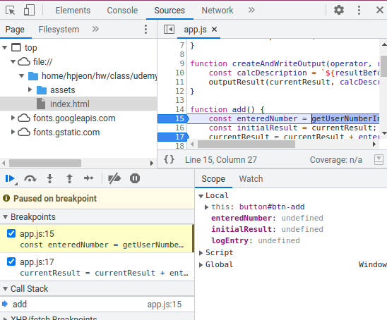
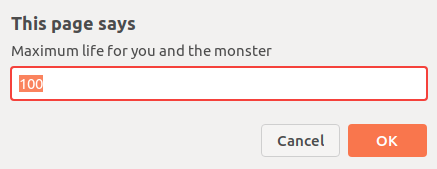

# Summary
- Title: JavaScript - The Complete Guide 2022 (Beginner + Advanced)
- Instructor: Maximilian Schwarzmüller

6. Dynamic and weakly typed language
- Dynamic interpreted programming language
    - Not precompiled but compiled on the fly
    - code can change at run time, including type of a variable
- Weakly typed programming language
    - Data types are assumed automatically

7. Javascrit runs on a host environment
- Browser-side
    - works with http requests
    - Doesn't access local filesystem & local OS
- Server-side
    - Standalone tool (Node.js)

19. Variables and constants
- Use constants as often as possible

20. Variable naming
- Use camelCase
- snake_case (user_name) is not recommended

23. Data type
- string + number will be string: str(number) is done automatically

25. String
```
let Description = `hello world with ${currentResult}`;
```
- This will print hello word with the value of currentResult in the code
```
let Description = 'hello world with ${currentResult}';
```
- Single or double quotation cannot translate `${}`

Assignment 1.
- Create 2 variables (a, b). One that holds a fictional user input (a=1.234) and the other without pre-assigned value
- b = a + 18
- b = b*a
- b = b/a
- alert(a)
- alert(b)

30. Code order
- The location of a function definition can be located after calling the function

35. A function as a function argument
- For a funciton `add()`, use as `add` inside of a function parentheses
```
function add() {
    currentResult = currentResult + userInput.value;
}
addBtn.addEventListener('click', add);
outputResult(currentResult,`hello with ${currentResult}`);
```
- This will not show results in the web-browser as outputResult() function is executed when the code is executed
```
function add() {
    currentResult = currentResult + userInput.value;
    outputResult(currentResult,`hello with ${currentResult}`);
}
addBtn.addEventListener('click', add);
```
- Now the result is shown when the add button is clicked

Assignment 2.
- Create 2 new functions. 1) no parameter simply alert() 2) passes a name and alert()
- Call both functions from the code
- Use task3Element and use event listener
- 3) a new function with 3 parameters, returns a concatenated string
- Call the function from the code and alert() the results
```
function assign2_1(){
    alert('assignment 2-1');
}
function assign2_2(inputs){
    alert('print: ' + inputs);
}
function assign2_3(param1, param2, param3) {
    alert('concatenated string:' + param1 + param2 + param3);
}
assign2_1();
assign2_2('hello world');
task3Element.addEventListener('click', assign2_1);
assign2_3('hello world', " in the ", " weekend");
```

36. Converting data type
- parseInt() or parseFloat()


39. functions
```
function createAndWriteOutput(operator, resultBefore, calcNumber) {
    const calcDescription = `${resultBefore} ${operator} ${calcNumber}`
    outputResult(currentResult, calcDescription);
}
function multiply() {
    const enteredNumber = getUserNumberInput();
    const initialResult = currentResult;
    currentResult = currentResult * enteredNumber;
    createAndWriteOutput('*', initialResult, enteredNumber)
}
```
- Passing `*` or `+` into function arguments

40. Comments
- Use `//` or a block of `/* ... */`

42. Data types
- Numbers: 2, -1.234
- Strings: 'HI', "Hi", `Hi`
- Booleans: true/false
- Objects: JSON
- Arrays: [1, 2, 3]

43. Arrays
```
let logEntries = [];
...
    logEntries.push(enteredNumber);
    console.log(logEntries);
```
- `console.log()` can be viewed from `Inspect element->Console`
- Each element in arrays can be accessed like `logEntries[0]`
    - If the element value doesn't exist, `undefined` is printed

48. Undefined, null, and NaN
- Undefined: default value of uninitialized variables
    - No manual assignment as Undefined
    - It works but bad-practice
- null: shouldn't be default value
    - Can be used for reset or clear of a variable
- NaN: still stays at memory and can be checked
    - `typeof NaN` yields `number`

50. defer and sync
- `Inspect element->Performance->Record` then load a page. Then click stop record

```
    <script src="assets/scripts/app.js" defer></script>
    <script src="assets/scripts/hw.js" defer></script>
```
- Using defer, loading those js files (locally or remotely) is done in parallel with loading the html file
```
    <script src="assets/scripts/app.js" async></script>
    <script src="assets/scripts/hw.js" async></script>
```
- Using async will load/execute those files independently, and may cause race conditions

62. MDN
- https://developer.mozilla.org/en-US/docs/Web/JavaScript

65. Debugging javascript
- Read error messages
- Use console.log()
- Use Chrome debugging tools
- Use IDE debugging tools

68. Debugging with Chrome
- Inspect element -> Sources, find source file and click line numbers to add break points

- Check Call Stack and local variables

75. Comparisons
- `==` checks value only while `===` checks data type. `===` is more favored for strict check
```
> 2 == 2
> true
> 2 === 2
> true
> 2 == "2" // NOTE !!!
> true
> 2 === "2" // NOTE !!!
> ​false
> 2 != "2"
> false
> 2 !== "2"
> true
```

​78. Comparing Objects and Arrays
- Equality of objects or array may not work
```
> xyz = {name: 'Max'}
> abc = {name: 'Max'}
> abc === xyz // NOTE !!!
> false
> abc.name === xyz.name
> true
> arr = [1,2,3]
> brr = [1,2,3]
> arr == brr // NOTE !!!
> false
> crr = arr 
> arr === crr // But if a variable is copied from existing array/object, equality works
> true
```

81. Truthy vs Falsy
- Truthy: when a value can be converted to true
- Falsy: when a value is a candidate of false
    - '', null, undefined, NaN, 0, 0.0, 0.
- ​Non-empty string is converted to true : `if (txt) {}`
    - '' is false
- 0 is converted to false
    - 0.0 or 0. as well
- Empty array ([]) or object ({}) is true
- null, undefined, NaN are false

90. Validating user input
- Use prompt() to read a user input

```
const enteredValue = prompt('Maximum life for you and the monster','100');
chosenMaxLife = parseInt(enteredValue);
if (isNaN(chosenMaxLife) || chosenMaxLife <= 0) {
    chosenMaxLife = 100;
}
```

93. Ternary operator
- `const userName = isLogin ? 'Max':null;`
- May need parenthesis when another conditional check is made
```
> 'Max' === isLogin ? 'Max':null
> null
> 'Max' === (isLogin ? 'Max':null);
> true
```
- The lecture shows that ternary operator works OK with === but Opera runs === prior to ternary operator

95. Boolean tricks
- Double bang: `!!`
    - negate 2x: `!!1`=> true, `!!''`=> false
    - Can convert truthy/falsy value to true/false
        - `boolVal = !!mytxt` => true when non-empty string. When empty, false
- Assigning a default value using OR
    - ` const name = usrInput || 'DefaultName'`
    - If usrInput is an empty string or undefined, it is falsy and `DefaultName` will be assigned
- OR operation: 
    - Ref: https://developer.mozilla.org/en-US/docs/Web/JavaScript/Reference/Operators/Logical_OR
    - `expr1 || expr2`
    - If expr1 can be converted to true, returns expr1; else, returns expr2. 
```
> isLogin = true
> isLogin || 'Max' // NOTE - true is resulted
> true
> 'Max' || isLogin // NOTE- 'Max' is resulted
> 'Max'
> wasLogin = false
> wasLogin || 'Max'
> 'Max'
> 'Max' || wasLogin
> 'Max'
```
- AND operation:
    - `expr1 && expr2`
    - If expr1 can be converted to true, returns expr2; else, returns expr1. 
```
> isLogin && 'Max'  // NOTE - 'Max' is resulted
> 'Max'
> 'Max' && isLogin  // NOTE - true is resulted
> true
> wasLogin && 'Max'
> false
> 'Max' && wasLogin
> false
> '' && 'Max' // NOTE - '' is resulted. Not true or false.
> ''
> 'Max' && '' // NOTE - '' is resulted. Not true or false.
''
```

97. switch-case
- It uses === for comparison (type of data is checked)
- break is necessary - unless, below cases will be executed

98. For loops
- for loop: `for (let i=0;i<3;i++) {}`
- for-of loop: `for(const el of array) {}`
    - `for(const el in array) {}` works as well
- for-in loop: `for(const key in obj) {}`
- while loop: `while(isTrue) {}`
