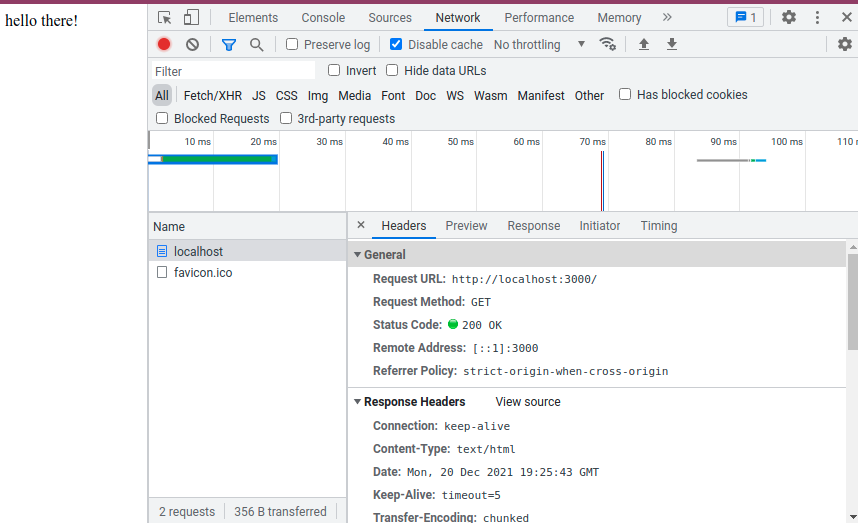

# Summary
- Title: JavaScript - The Complete Guide 2022 (Beginner + Advanced)
- Instructor: Maximilian Schwarzmüller

6. Dynamic and weakly typed language
- Dynamic interpreted programming language
    - Not precompiled but compiled on the fly
    - code can change at run time, including type of a variable
- Weakly typed programming language
    - Data types are assumed automatically

7. Javascrit runs on a host environment
- Browser-side
    - works with http requests
    - Doesn't access local filesystem & local OS
- Server-side
    - Standalone tool (Node.js)

19. Variables and constants
- Use constants as often as possible

20. Variable naming
- Use camelCase
- snake_case (user_name) is not recommended

23. Data type
- string + number will be string: str(number) is done automatically

25. String
```
let Description = `hello world with ${currentResult}`;
```
- This will print hello word with the value of currentResult in the code
```
let Description = 'hello world with ${currentResult}';
```
- Single or double quotation cannot translate `${}`

Assignment 1.
- Create 2 variables (a, b). One that holds a fictional user input (a=1.234) and the other without pre-assigned value
- b = a + 18
- b = b*a
- b = b/a
- alert(a)
- alert(b)

30. Code order
- The location of a function definition can be located after calling the function

35. A function as a function argument
- For a funciton `add()`, use as `add` inside of a function parentheses
```
function add() {
    currentResult = currentResult + userInput.value;
}
addBtn.addEventListener('click', add);
outputResult(currentResult,`hello with ${currentResult}`);
```
- This will not show results in the web-browser as outputResult() function is executed when the code is executed
```
function add() {
    currentResult = currentResult + userInput.value;
    outputResult(currentResult,`hello with ${currentResult}`);
}
addBtn.addEventListener('click', add);
```
- Now the result is shown when the add button is clicked

Assignment 2.
- Create 2 new functions. 1) no parameter simply alert() 2) passes a name and alert()
- Call both functions from the code
- Use task3Element and use event listener
- 3) a new function with 3 parameters, returns a concatenated string
- Call the function from the code and alert() the results
```
function assign2_1(){
    alert('assignment 2-1');
}
function assign2_2(inputs){
    alert('print: ' + inputs);
}
function assign2_3(param1, param2, param3) {
    alert('concatenated string:' + param1 + param2 + param3);
}
assign2_1();
assign2_2('hello world');
task3Element.addEventListener('click', assign2_1);
assign2_3('hello world', " in the ", " weekend");
```

36. Converting data type
- parseInt() or parseFloat()
- Or `+strVar` will return number

39. functions
```
function createAndWriteOutput(operator, resultBefore, calcNumber) {
    const calcDescription = `${resultBefore} ${operator} ${calcNumber}`
    outputResult(currentResult, calcDescription);
}
function multiply() {
    const enteredNumber = getUserNumberInput();
    const initialResult = currentResult;
    currentResult = currentResult * enteredNumber;
    createAndWriteOutput('*', initialResult, enteredNumber)
}
```
- Passing `*` or `+` into function arguments

40. Comments
- Use `//` or a block of `/* ... */`

42. Data types
- Numbers: 2, -1.234
- Strings: 'HI', "Hi", `Hi`
- Booleans: true/false
- Objects: JSON
- Arrays: [1, 2, 3]

43. Arrays
```
let logEntries = [];
...
    logEntries.push(enteredNumber);
    console.log(logEntries);
```
- `console.log()` can be viewed from `Inspect element->Console`
- Each element in arrays can be accessed like `logEntries[0]`
    - If the element value doesn't exist, `undefined` is printed

48. Undefined, null, and NaN
- Undefined: default value of uninitialized variables
    - No manual assignment as Undefined
    - It works but bad-practice
- null: shouldn't be default value
    - Can be used for reset or clear of a variable
- NaN: still stays at memory and can be checked
    - `typeof NaN` yields `number`

50. defer and sync
- `Inspect element->Performance->Record` then load a page. Then click stop record

```
    <script src="assets/scripts/app.js" defer></script>
    <script src="assets/scripts/hw.js" defer></script>
```
- Using defer, loading those js files (locally or remotely) is done in parallel with loading the html file
```
    <script src="assets/scripts/app.js" async></script>
    <script src="assets/scripts/hw.js" async></script>
```
- Using async will load/execute those files independently, and may cause race conditions

62. MDN
- https://developer.mozilla.org/en-US/docs/Web/JavaScript

65. Debugging javascript
- Read error messages
- Use console.log()
- Use Chrome debugging tools
- Use IDE debugging tools

68. Debugging with Chrome
- Inspect element -> Sources, find source file and click line numbers to add break points

- Check Call Stack and local variables

75. Comparisons
- `==` checks value only while `===` checks data type. `===` is more favored for strict check
```
> 2 == 2
> true
> 2 === 2
> true
> 2 == "2" // NOTE !!!
> true
> 2 === "2" // NOTE !!!
> ​false
> 2 != "2"
> false
> 2 !== "2"
> true
```

​78. Comparing Objects and Arrays
- Equality of objects or array may not work
```
> xyz = {name: 'Max'}
> abc = {name: 'Max'}
> abc === xyz // NOTE !!!
> false
> abc.name === xyz.name
> true
> arr = [1,2,3]
> brr = [1,2,3]
> arr == brr // NOTE !!!
> false
> crr = arr 
> arr === crr // But if a variable is copied from existing array/object, equality works
> true
```

81. Truthy vs Falsy
- Truthy: when a value can be converted to true
- Falsy: when a value is a candidate of false
    - '', null, undefined, NaN, 0, 0.0, 0.
- ​Non-empty string is converted to true : `if (txt) {}`
    - '' is false
- 0 is converted to false
    - 0.0 or 0. as well
- Empty array ([]) or object ({}) is true
- null, undefined, NaN are false

90. Validating user input
- Use prompt() to read a user input

```
const enteredValue = prompt('Maximum life for you and the monster','100');
chosenMaxLife = parseInt(enteredValue);
if (isNaN(chosenMaxLife) || chosenMaxLife <= 0) {
    chosenMaxLife = 100;
}
```

93. Ternary operator
- `const userName = isLogin ? 'Max':null;`
- May need parenthesis when another conditional check is made
```
> 'Max' === isLogin ? 'Max':null
> null
> 'Max' === (isLogin ? 'Max':null);
> true
```
- The lecture shows that ternary operator works OK with === but Opera runs === prior to ternary operator

95. Boolean tricks
- Double bang: `!!`
    - negate 2x: `!!1`=> true, `!!''`=> false
    - Can convert truthy/falsy value to true/false
        - `boolVal = !!mytxt` => true when non-empty string. When empty, false
- Assigning a default value using OR
    - ` const name = usrInput || 'DefaultName'`
    - If usrInput is an empty string or undefined, it is falsy and `DefaultName` will be assigned
- OR operation: 
    - Ref: https://developer.mozilla.org/en-US/docs/Web/JavaScript/Reference/Operators/Logical_OR
    - `expr1 || expr2`
    - If expr1 can be converted to true, returns expr1; else, returns expr2. 
```
> isLogin = true
> isLogin || 'Max' // NOTE - true is resulted
> true
> 'Max' || isLogin // NOTE- 'Max' is resulted
> 'Max'
> wasLogin = false
> wasLogin || 'Max'
> 'Max'
> 'Max' || wasLogin
> 'Max'
```
- AND operation:
    - `expr1 && expr2`
    - If expr1 can be converted to true, returns expr2; else, returns expr1. 
```
> isLogin && 'Max'  // NOTE - 'Max' is resulted
> 'Max'
> 'Max' && isLogin  // NOTE - true is resulted
> true
> wasLogin && 'Max'
> false
> 'Max' && wasLogin
> false
> '' && 'Max' // NOTE - '' is resulted. Not true or false.
> ''
> 'Max' && '' // NOTE - '' is resulted. Not true or false.
''
```

97. switch-case
- It uses === for comparison (type of data is checked)
- break is necessary - unless, below cases will be executed

98. For loops
- for loop: `for (let i=0;i<3;i++) {}`
- for-of loop: `for(const el of array) {}`
    - Make sure to use `of`, not `in`
    - `in` will return the index, not value
```
> for (const el of ['a','b','c']) {console.log(el)}
a
b
c
> for (const el in ['a','b','c']) {console.log(el)} // Note that it returns index, not value of 'a','b','c'
0
1
2
```
- for-in loop: `for(const key in obj) {}`
- while loop: `while(isTrue) {}`

104. Continue
- break: exits the loop
- continue: returns to the next iterator

105. Labeled statement with break
- Using the label of the loop, break can control which loop it may exit
```
> for (i of ['a','b','c']) {
    console.log('Outer',i);
    for (j in [1, 2, 3]) {
        if (j==2) {
            break;
        }
        console.log('Inner',j);
    }
}
Outer a
Inner 0
Inner 1
Outer b
Inner 0
Inner 1
Outer c
Inner 0
Inner 1
> OuterLoop: for (i of ['a','b','c']) {
    console.log('Outer',i);
    InnerLoop: for (j in [1, 2, 3]) {
        if (j==2) {
            break OuterLoop;
        }
        console.log('Inner',j);
    }
}
Outer a
Inner 0
Inner 1
```

107. Throwing an error message
```
> throw { message: 'help!'}
Uncaught 
{message: 'help!'}
```

108. try-catch
- For the errors beyond the control by the developer
    - user input typo, network outage, ...
- try {}: the code which may throw an error
- catch {}: error handling and fallback logic
- finally: optional but can be used to cleanup work in both cases of success or fail
```
> function myftn() { throw { message: 'crashed!'}}
> try {
    myftn();
} catch (error) {
    console.log(error);
    throw error;
} finally {
    console.log('testing try-catch-finally');
}
> {message: 'crashed!'}
> testing try-catch-finally
```

112. ES5 vs ES6+
- ES: ECMA Script
- ES5: only var. No support of let and const

113. var vs let vs const
- var: creates a variable over function & global scope
    - Don't use var in ES6+ as a good practice
- let: creates a variable over a block scope
- const: creates a constant over a block scope

114. Hoisting
- Similar to functions, the location of var variables may not matter as JS will read the entire script and loads var variables into memory

115. Strict mode and writing a good code
- `'use strict';` or `"use strict";`
    - Applies strict rules of JS
    - Only in the single JS file
- Do not initialize a new variable without let. It may confuse other folks to find the location of the initial declaration of the variable

117. Inside the Javascript engine
- Long term memory like function defintion on heap
- Function calls, short-lived data, and communication on stack
    - Found from Debugging -> Call Stack

119. Primitive vs Reference values
- Primitive
    - strings, numbers, booleans, null, undefined, symbol
    - Copies by values for copy operation
    - Stored on stack
    - Array as well? The lecture shows an array is reference but Opera shows it behaves as primitive
- Reference
    - all other objects which are expensive to create
    - Stored on heap
    - Copies the address of the variable in the memory for copy operation
    - In order to have copying value, use `...`
    - This is why `===` of two same objects doesn't work as it compares the address
        - `const array` or `const object` implies the constant address
        - push() still works as the address is constant
        - new assignment will fail as the address will change
```
> let a1 = { age: 30};
> let b1 = a1;
> let c1 = {...a1} // now copy values, not address
> a1.height = 5.09
5.09
> b1
{age: 30, height: 5.09} // copy by reference. Updated automatically
> c1
{age: 30} // copy by value. No change
> const aobj = {age:30};
> aobj.height = 6.01  // push or adding new key works OK for const obj
> aobj = {age:30, height:6.01} // new assignment fails as it changes the address
VM1899:1 Uncaught TypeError: Assignment to constant variable.
    at <anonymous>:1:6
```

120. Garbage collection
- Management of heap memory
- Checks periodically for unused memory (no reference)

126. Functions vs methods
- Method: function as a value of key in an object
```
> const v1 = { name: 'Max', greet: function greet() { console.log('Hello'); } };
> v1.greet()
VM2076:1 Hello
```
- `v1.greet` will return the function definition
- The function name may be different than the key name

127. Functions are stored as objects
- Arguments, returns, ... are stored as key/value pairs
```
> dir(v1.greet)
...
arguments: null
caller: null
length: 0
name: "greet"
prototype: {constructor: ƒ}
...
```

128. Function expressions:
- Anonymous function: `const myftn = function() {...}`
    - Doesn't need a function name
129. Function declaration vs expressions
- Function declaration (function statement)
    - `function myFnxn(a,b) { return a*b; }`
    - JS will be able to use this function regardless of the location
        - Hoisted to top
- Function expression
    - `const myFnxn = function(a,b) {return a*b;}`
    - Can use anonymous function
    - Order matters
    - Scope matters

130. Anonymous function
- When a function is not used often
```
> console.log(function() { return 3;})
> VM808:1 ƒ () { return 3;}
> console.log(function() { return 3;}()) // () is required after function definition
> VM817:1 3
```
- A function name is NOT required but the name can be **USEFUL** for debugging

133. Arrow function
- For anonymous function only
- Syntatic sugar (shorter coding but performance is same)
```
> const myfx = function(a,b) {return a+b;}
> const myfz = (a,b)=> a+b;
> myfx(3,4) === myfz(3,4)
true
```

136. Default arguments
- Any argument may have the default value. Order doesn't matter
    - But good practice will put the default argument in the last

137. Rest parameters
- Handles undeterminated amount of arguments into an array
    - Use `...vname`
```
> function mysum(...inputs) { 
    let sum=0;  
    for (const el of inputs) { 
        sum += el;
    }  
    return sum; 
    }
undefined
> mysum(1,2,3)
6
> mysum(1,2,3, -6, -8)
-8
```
- Or default variable `arguments` works but it is not recommended to use

139. Callback functions
- A function pointer or function handler is sent through the argument and executed from the function
```
const myf01 = (resultHandler, a,b) => { let sum = a+b; resultHandler(sum); }
# myf01() has arguments of resultHandler, which is a callback function, and a & b which are parameters
# myf01() callsback resultHandler() for you - even you didn't ask to run resultHandler()
const showR = (some_txt) => { alert(some_txt); }
#
myf01(showR, 12, 23)
```

Assignment 4
- `function sayHello(name) { console.log('Hi ' + name) ; }` => `const sayH = (name) => { console.log('Hi ' + name) ; }`
```inputcheck2(()=>{console.log('no data')})
> const inputcheck2 = (nodataHandler, ...vlist) => { if (vlist.length == 0) {nodataHandler();}; for (el of vlist) { console.log(el) } }
> const showR = () => {console.log('no data found')}
> inputcheck2(showR, 3,2,1)
3
2
1
> inputcheck2(showR)
no data found
>inputcheck2(()=>{console.log('no data')})
no data
```

140. bind() in the function pointer/function handler
- Can pre-configure a function's arguments
```
> const inputcheck3 = (resultHandler, ...vlist) => { resultHandler(...vlist) }
> const showEl2 = (messageStatus, ...vlist) => { console.log("message status = ", messageStatus); for (const el of vlist) { console.log(el) } }
> inputcheck3(showEl2.bind(this, "testing message"), 'a', 'b', 123, 456, 3.14)
message status =  testing message
a
b
123
456
3.14
> inputcheck3(showEl2, 'a', 'b', 123, 456, 3.14)
message status =  a
b
123
456
3.14
```
- `functionHandler.bind(this, XXX)` will deliver XXX as the first argument
​
146. DOM
- Document Object Model
- Tools can parse HTML
- Javascript is a hosted language
- The browser as the host environment exposes the DOM API to JS code automatically

149. Nodes & Elements
- Ref: https://stackoverflow.com/questions/9979172/difference-between-node-object-and-element-object
- Node: objects that make up DOM
    - There are 12 different nodes
    - DOCUMENT_NODE: document or document.body which would be a built-in DOM element
    - HTML tag like <input> or <p>
    - TEXT_NODE
    - ELEMENT_NODE: an object of nodeType=1. HTML tags
    - ATTRIBUTE_NODES
- document.getElementById() will return one node and it is guaranteed to be an element
- document.getElementsByClassName() will return the list of nodes

150. Selecting elements in DOM
- For `<p id="description"> Hi there </p>`
- `const p1 = document.querySelector('p')` works
- `const p2 = document.querySelector('#description')` works
- querySelector() runs through CSS selector, which may not fit HTML5 yet
    - This returns the first node only. To get NodeList, use querySelectorAll()

153. Attributes vs Properties
- Attributes: data from HTML code using element tags
- Properties: data of object using dot(.) notation
```
> const input = document.querySelector('input')
> input.value
'default text'
> input.value = 'new text'
> const input2 = document.querySelector('input')
> input2.value
'new text'
```
- input.setAttribute('value', ...) vs input.value
- setAttribute will automatically create a node if it doesn't exist
```
> input.value
'new text'
> input.setAttribute('value', 'hello world')
## this will change the attributes, 'value', in the loaded HTML
## check through Inspect element->Elements tab
> input.value
'new text'
## Property of input is still the old value
```


Assignment 5.
- Change the color of background as black and text as white, using 2 different methods
- Change the document title using the title element, as "Assignment-solved!", using querySelector() 1) on document and 2) on the property of the document
- Change h1 element on this page and change the text to "Assignment-solved!"
```
> const t1 = document.getElementById('task-1')
> t1.style.backgroundColor="black"
> t1.style.color="white"
> const t1_1 = document.querySelector('#task-1')
> t1_1.style.backgroundColor='orange'
#
> const tt = document.querySelector('title')
> tt.innerText = 'Assignment-solved!' # or use tt.textContent
> document.title
'Assignment-solved!'
> document.title = 'as given'
#
> const h1 = document.querySelector('h1')
> h1.innerText = 'Assignment solved'
```
- Q: How to access from `<head>` to `<title>`? 
    - Changing attributes is limited within `<...>`. `<title>` is outside of `<head>`
- A: need to access the child node
```
​<!DOCTYPE html>
<html lang="en">
  <head>
    <meta charset="UTF-8" />
    <meta name="viewport" content="width=device-width, initial-scale=1.0" />
    <meta http-equiv="X-UA-Compatible" content="ie=edge" />
    <title>Assignment - DOM Querying & Manipulation</title>
    <link rel="stylesheet" href="styles.css" />
  </head>
  <body>
```

155. Traversing DOM
- Child: direct child node/element
- Decendant: direct or indirect child node/element
- Parent: direct parent node/element
- Ancestor: direct or indirect parent node/element
- For index.html:
```
    <ul>
      <li>Item 1</li>
      <li class="list-item">Item 2</li>
      <li class="list-item">Item 3</li>
    </ul>
```
    - ul is unordered-list, showing bullets
    - li is ordered-list, showing numbers
- Finding the element of the above ul: `const ul = document.querySelector('ul')`
- `ul.children` will retun the children elements
- `ul.childNodes` will return the children nodes, including elements and texts
    - The first text node is the white space between `<ul>` and `<li>` in the first line
- `ul.firstChild` will retun the first child node
- `ul.firstElementChild` will retun the first child element
- Similar usage for lastChild and lastElementChild

157. Accessing parent node/element
- Only element can be a parent? 
- One exception for parentNode is for the entire document
```
> const li1 = document.querySelector('li')
>  li1.parentElement # li1.parentNode yields the same result
<ul>​…​</ul>​
> li1.closest('body') # finds the closest item in the ancestor. If it doesn't exist, returns null
<body>​…​</body>​
```

158. Selecting Sibling elements
```
> const ul0 = document.querySelector('ul')
> l1 = ul0.firstElementChild
> l2 = l1.nextSibling
#text
> l2.previousElementSibling
<li>​…​</li>​::marker​"Item 1"</li>​
> l1.nextElementSibling
<li class=​"list-item">​…​</li>​
```
- nextElementSibling is faster than querySelector()

162. Adding Elements 
```
> const ul = document.querySelector('ul')
> ul.innerHTML
'\n      <li>Item 1</li>\n      <li class="list-item">Item 2</li>\n      <li class="list-item">Item 3 (Changed!)</li>\n    '
> ul.innerHTML += '<li> Item 4 </li>' # this might not be a good practice as the browser will load the entire page again
```
- Instead of updating innerHTML, we may use insertAdjacentHTML()
    - Depends on UI/UX, the response to user input may use this method (input is valid or not)

163. Creating Elements
- `document.createElement()`: must be from document!
```
> const ul = document.querySelector('ul')
> const newLi = document.createElement('li')
> newLi
<li>​</li>​
> ul.appendChild(newLi)
<li>​…​</li>​
> newLi.textContent = 'Item appended'
```

164. Inserting Elements
- Continued from 163
```
> ul.prepend(newLi) # newLi will be re-locatd into the first item, not copied. newLi is reference not copy
> ul.lastElementChild.before(newLi) # will move to the second-last position
```
- Per method, some browsers may not support. Check MDN for more acceptable methods for the same function

165. Cloning DOM nodes
- `newLi.cloneNode(true)`: deep-copy containing decendants
- `newLi.cloneNode(false)`: shallow-copy. No child/no decendants
- When the argument is missing, false is applied

167. Removing Elements
- `newLi.remove()`
    - Will not work at IE11
- `newLi.parentElement.removeChild(newLi)`
    - Would work at IE11 as well

171.
- `const addMovieModal = document.getElementById('add-modal')` is better than `const addMovieModal = document.querySelector('#add-modal')` in terms of performance
    - `const addMovieModal = document.body.children[1]` is not recommended as it will not work if the HTML structure changes
- Finding class:
    - Instead of `addMovieModal.className = '...'`, `addMovieModal.classList.toggle('visible')` is recommended

184. Array-like object
- Objects that have a length property and use indexes to access items
    - Not really Array
    - Ex) NodeList, String

185. Creating arrays
```
const arra1 = [123, 456];          // [123, 456]
const arra2 = new Array(123, 456); // [123, 456]
const arra3 = new Array(5);        // creates an empty array of 5 elements
const arra4 = Array.of(123, 456);  // [123, 456]
const arra5 = Array.of(5);         // [5]
const arra6 = Array.from('Hi')     // ['H', 'i']. Can be used for NodeList
```

187. Adding & removing elements
- push(): adds an element in the end
- pop(); Removes the last element
- unshift(): adds an element in the beginning
    - Slower than push()
- shift(): Removes the first element in the array
    - Arguments are not used
    - Slower than pop()
- Assignment with an index larger than the current length will create empty elements between    
```
> a = ['a','b']
> arra[5] = ['z']
> arra
['a', 'b', empty × 3, Array(1)]
```

188. splice()
- Inserts an element in the middle of an array
- splice(index_of_start, amount_to_delete, new_element1, new_element2, ...)

189. slice()
- Does not change the given array
- Returns a new array as requested
```
> const arr = ['a','b','c','d']
> brr = arr.slice(0,2) # from 0 to (2-1)th element
['a', 'b']
```
- To make a clone, may use .slice(), without indexes
    - `const arr02 = arr01` makes a reference copy

191. indexOf() vs lastIndexOf()
```
> ['a','a', 'b','b', 'c', 'c'].indexOf('a') # finds the index of the first finding
0
> ['a','a', 'b','b', 'c', 'c'].lastIndexOf('a') # finds the index of the last finding
1
```
- When not found, `-1` will be returned
- When an element is an object like { field: value}, this doesn't work

192. find() and findIndex() for Array
- Introduces a function to find elements
    - Can be used to query objects
- Grammar: `find((element, index, array) => {...})`
    - Or `find(function(element, index, array) {...})`
- For callback function: `find(callbackFn, thisArg)`
```
> [ {f01:0.12}, {f02:3.14}].findIndex((el)=>{return el.f01 === 0.12} )
0
```

193. How to find if an element is included or not
- Find an index of the value then check if the return is `-1` or not

194. forEach() in Array
- Can loop over the elements of an array
- Same grammar of find()
```
> let taxList = [];
> [120, 320, 150].forEach((el,idx,arr)=> {taxList.push({index:idx, taxAmount: el*0.075}) })
> taxList
(3) [{…}, {…}, {…}]
0: {index: 0, taxAmount: 9}
1: {index: 1, taxAmount: 24}
2: {index: 2, taxAmount: 11.25}
length: 3
[[Prototype]]: Array(0)
```

195. map()
- Maps every element in an array with the given function and returns a new array
```
> [120,320,150].map((el,idx,arr)=> { return {index:idx, taxAmount: el*0.075}})
(3) [{…}, {…}, {…}]
0: {index: 0, taxAmount: 9}
1: {index: 1, taxAmount: 24}
2: {index: 2, taxAmount: 11.25}
length: 3
[[Prototype]]: Array(0)
```

196. sort()
```
> [120,320,1150].sort()
(3) 
[1150, 120, 320]
```
- As it sorts as characters, **1150 is ordered earlier than 320**
- The lecturer didn't explain why returning 1,0,-1 yielded the ordering
    - The trick that the lecturer usesdis to use compareFunction(a,b): https://developer.mozilla.org/en-US/docs/Web/JavaScript/Reference/Global_Objects/Array/sort
- To sort numerics, use compareFn as necessary
```
> [120,320,1150].sort((a,b) => {a-b} )
[120, 320, 1150]
> [120,320,1150].sort((a,b) => {b-a} ) # inversing the b/a still yields the same result
[120, 320, 1150]
> [1,2,456,32].sort((a,b) => {console.log(a); console.log(b); })
2
1
456
2
32
456
```

197. filter()
```
> [1,2,456,32].filter((el,idx,arr)=>{ return el > 1.5})
(3) [2, 456, 32]
```

198. Arrow functions
- The above example can be reduced more
```
> [1,2,456,32].filter(function(el,idx,arr) { return el > 1.5} )
(3) [2, 456, 32]
> [1,2,456,32].filter((el,idx,arr)=>{ return el > 1.5})
(3) [2, 456, 32]
> [1,2,456,32].filter(el => el > 1.5) ## MUCH SHORTER
(3) [2, 456, 32]
```

199. reduce()
- Grammar: `[...].reduce((prevVal, curVal, idx, arr)=> {...}, initial_prevVal)`
    - As index increases, prevVal is the returned value from the previous call of the function
```
> [1,2,456,32].reduce((pVal, cVal, idx, arr) => {console.log(pVal,cVal); return pVal+cVal; },0)
0 1
1 2
3 456
459 32
491
```

201. String <-> Array
```
> 'hello;world;cooking'.split(';')
(3) ['hello', 'world', 'cooking']
> ['Max','Name','Array'].join(' ')
'Max Name Array'
```

202. Spread Operator: `...`
```
> console.log(arr)
(3) ['cooking', 'reading', 'coding']
> console.log(...arr)
cooking reading coding
```
- Spread operator litterally spreads the element of an array
- If the element is number/string, regular copy will be made
- If the element is an object {...}, reference copy will be made
```
> const tArr = [ {name:'Max', age:30}, {name:'Manuel', age:50}];
> const cArr = [...tArr];
> tArr[0].age=22
> cArr
0: {name: 'Max', age: 22} ## changing tArr element changes the element of cArr as the element is an object
1: {name: 'Manuel', age: 50}
```
- Still slice() will produce the same reference copy
- To make a deep copy, run forEach() or map() over the structure of objects and copy the element/component along the object structure

203. Destructring array
```
> const [ firstName, lastName, ...etc] = [ 'Max', 'Schwarz', 'Address', 'age']
> firstName
'Max'
>etc
(2) ['Address', 'age']
```

204. Sets and Maps
- Array: iterable, duplicates are allowed, order is guaids.has(123)
trueranteed. Zero based index
- Set: iterable, duplicates are NOT allowed, order is NOT guaranteed. No index.
- Map: key-value. iterable, duplicate keys are not allowed. Order is guaranteed

205. Working with Sets
```
> const ids = new Set([32, 123, 22]);
> ids
Set(3) {32, 123, 22}
ids[0]
undefined
> ids.has(123)
true
```
- entries() will return (value, value) as it matches to the method of map data
    - Use values() instead

206. Working with Maps
```
>const name1 = { name: 'Max'}
> const mp1 = new Map([ [name1, 'Schwartz'], [ 'details', {Address: 123, age: 55}]]);
> mp1
Map(2) {{…} => 'Schwartz', 'details' => {…}}
[[Entries]]
0: {Object => "Schwartz"}
key: {name: 'Max'}
value: "Schwartz"
1: {"details" => Object}
key: "details"
value: {Address: 123, age: 55}
size: 2
> for (const [k,v] of mp1.entries()){ console.log(k,v)}
{name: 'Max'}
 'Schwartz'
details 
{Address: 123, age: 55}
```

​207. Maps vs Objects
- Objects: strings, numbers, and symbols for keys. For small/medium sized sets of data. 
- Maps: any value or object for keys. Better performance for large quantities of data. Better performance for adding/removing data often.
​
208. WeakSet()
- Only objects
- Not iterable
- Limited methods than Set()
- if there is no reference, the element object will be garbage-collected

Assignment 6 
- Create an array containing numbers and perform 3 operations. 1) Filter numbers greater than 5. 2) map every number into a some property 3) reduce the array into a single number by multiplying all components
```
> let as01 = [1,7, 5, 2];
> as01.filter(p=>p>5)
> as01.map((el,idx,arr) => {return  {num: el} })
> as01.map((p)=> ({num:p})) ## or use () instead of return
> as01.reduce((pv,cv,idx,arr)=> {return pv*cv},1)
70
```
- Write a function that find the largest number in the list argument. Supply multiple arguments from the above assignment
- Tweak the above function to return [min, max]. Then destructure the function return value and store them in separate storage
- Create a list where makes sure no duplicate values
```
> function findM(args)  { 
    x0 = args[0]; 
    for (const el of args) { 
        if (x0 < el) {
            x0 = el;
        } 
    }; 
    return x0;
}    
> findM([...as01])
7
> function findM2(args)  { xmax = args[0]; xmin = args[0]; for (const el of args) { if (xmax < el) {xmax = el}; if (xmin > el) {xmin = el}; }; return [xmin,xmax];}
> [xmin, xmax] = findM2(as01)
[1, 7]
> const arr = ['cooking', 'reading', 'coding', 'cooking'];
> const sarr = new Set(arr);
> const brr = Array.from(sarr)
> brr
['cooking', 'reading', 'coding']
```

213. Objects
- Primitive values: numbers, strings, booleans, null, undefined, symbol
- Reference values (=Objects): everything else. Array, {...}, DOM nodes, and other built-in objects

216. Adding, modifying & deleting properties
- Non-existing value will be printed as undefined
- Do not assign undefined as value for best-practice
    - When undefined is detected, the implication would be straight-forward
```
> let person = { name: 'Max', age: 30, greet: function() { console.log('hello world');} };
> person.alert = function() { alert('printing now')}; ## adding a new element
> delete person.age ## deleting an existing element
```

217. Special key names and []
- Use quotation marks in the key place
```
> let abc = { 'first name': 'Max'}
> abc['mid name'] = 'W'
> abc
{first name: 'Max', mid name: 'W'}
```

218. Property type
- Positive number is recognized as a string. No negative number
- Number keys are sorted automatically
```
> let abc = { 'first name': 'Max', 1.5: true}
> abc[1.5]
true
> abc['1.5']
true
> let abc = { 'second name': 'W', 'first name': 'Max', 213: false, 15: true}
> abc
15: true
213: false
first name: "Max"
second name: "W"
```

219. Dynamic access to the property
- Use [] to inject a variable into object key
- Introduces a user-input as a key name
- For value, use as it is. Using [] will be translated as an array
```
> abc
{15: true, 213: false, second name: 'W', first name: 'Max'}
> const keyName = 'second name'  ## new variable
> abc.keyName   ## NOT working
undefined
> abc[keyName]  ## Works OK now
'W'
> let abc = { [keyName]: true}  ## use [] to inject variable assignment to objects
> abc
{second name: true}
> const valName = true
> let abc = { [keyName]: [valName] }  ## This will produce an array
> abc
second name: [true]
> let abc = { [keyName]: valName }   ## Works as expected
> abc
{second name: true}
```
​- Extracting key and its value to text: using `${}`
```
> people = {info: {age: 30, name: 'Max'} };
> let text = ''
> for (const key in people.info) { text = `${key}: ${people.info[key]}`;}
> text
'name: Max'
```

226 Object.assign()
- Copying value, not reference
```
> p2
{username: 'Max'}
> const px = Object.assign({age:33}, p2)
> p2.username = 'Max_Sw'
> p2
{username: 'Max_Sw'}
> px
{age: 33, username: 'Max'}  ## still has the value of the previous p2
```

227. Object destructuring
```
> let {age, ...etc} = px;
> etc
{username: 'Max'}
> age
33
```

228. If a property exists or not
```
> const p1 = { age: 33, name: 'Max', method: ()=> {console.log('hello')} }
> 'age' in p1
true
```

229. this
- Uses an object property within an object
- Provides an access to whatever called the method
```
> const p1 = { age: 33, name: 'Max', method: function() { console.log(this.age)}  }
> p1.method()
33
>    const person = {
        name: 'Max',
        greet() {
            console.log(this); // ???
            console.log(this.name);
        }
    };
> const admin = { age: 30 };
> admin.greet = person.greet;
> admin.greet(); ## Now this is the admin object; admin.name doesn't exist and undefined is printed
{age: 30, greet: ƒ}
```
- Arrow function ()=>{} doesn't work
    - Or use a module `const p1 = { age: 33, name: 'Max', method() { console.log(this.age)}  }`

230. call(), apply(), and bind()
- Ref: https://stackoverflow.com/questions/15455009/javascript-call-apply-vs-bind
- call(): invokes function immediately. call(thisValue, arg1, arg2, ...)
- apply(): same as call() but uses an array for arguments. apply(thisValue, [...])
- bind(): can be used to define a function for later usage
- The first argument corresponds to `this`. If `this` is not required, use null
```
> const p1 = { age: 33, name: 'Max', method() { console.log(this.age)}  }
> p1.method()
33
> p1.method.call({age:52}) # replaces this with {age:52}
52
>p1.method.apply({age:52})
52
> const newFnc = p1.method.bind({age:44})
> newFnc()
44
```
234. `this` and arrow functions
- Using `this` inside of methods in `this`
    - For arrow functions, `this` is from the definition of the context
        - Ref: https://humanwhocodes.com/blog/2013/09/10/understanding-ecmascript-6-arrow-functions/
        - Lexical this binding – The value of this inside of the function is  determined by where the arrow function is defined not where it is used.
    - For regular function definition, `this` is from the calling context
```
> const p1 = {age: [33,44], name:['Max','Manuel'], 
    method() { 
        this.age.forEach((p,idx)=> {console.log(p + this.name[idx])})
        } 
    }
> p1.method() ## this is coupled with the function definition
33Max
44Manuel
> const p1 = {age: [33,44], name:['Max','Manuel'], 
    method() { 
        this.age.forEach(
            function(p,idx) {console.log(this)})
        } 
    }
> p1.method() ## prints the regular this definition in the console
Window {0: global, 1: global, 2: Window, window: Window, self: Window, document: document, name: '', location: Location, …}
Window {0: global, 1: global, 2: Window, window: Window, self: Window, document: document, name: '', location: Location, …}
> this ## this from javascript console
Window {0: global, 1: global, 2: Window, window: Window, self: Window, document: document, name: '', location: Location, …}
```

236. Getters & Setters
- Apply try & catch or whatever to do sanity check for setter value
```
> const p1 = {age:33, set title(val) { this._title = val;}, get title() { return this._title} }
> p1.title = 'hello world' ## setter: note that () is not used
'hello world'
>p1.title                 ## getter: may pre-define _title with default value
'hello world'
```

242. class
- Convention: start the name with Capital letters
```
> class Product{ title = 'Default'; info = {age:33, name:'Max'} }
> const a1 = new Product()
> a1.title
'Default'
> a1.info.age
33
```

243. Constructor
```
> class Product{ 
    title = 'Default';  
    price; 
    constructor(title,price) {
        this.title = title; this.price=price; 
    }  
}
> const a1 = new Product('hello W', 450)
> a1.price
450
```

249. Static methods and properties
- No instance required
- Can be used as a proxy

250. Classes vs Object literals
- Literals in javascript: constant values that can be assigned to the variables
    - Quick & easy to create. No overhead
- Classes: when we re-create same type of objects over and over again

253. Inheritance
- Only one base class
- `super()` will call the constructor of the base class. Must be called befor `this` is used in the derived classes

258. Private properties
- Accessible only inside of the class
- Use `#` prefix for member data or functions (not supported in Chrome yet)

259. Pseudo-private
- `_` prefix may be used as a convention for private (not actual rule)
```
class product  {
    _internalId = 'abc012';
};
```

Assignment 7
- Create a Course class containing title, length, price. Then instantiate 2 objects
- Add 2 methods 1) printing length/price value 2) summary of title, length, and price
- Create derived classes: PracticalClass with numOfExcercises, TheoreticalClass with publish() method
- Use getters and setters to ensure that the price property can only be set to a positive value and is returned with `$` as prefix
- Use private fields to harden the getter/setter above
```
class Course { 
    _title; _length; #price; 
    set price(val) {
        if (val > 0) {
            this.#price = val
        } else {
            console.log('invalid price')
        } 
    };  
    get price() { 
        return '$'+this.#price 
    }; 
    constructor(title='default title', length=1, price=1000) {
        this._title=title; this._length = length; this.#price = price; 
    };  
    lengthPprice() {
        console.log(this._length/this.#price)
    }; 
    summary() {
        console.log('title='+this._title + ' length='+this._length + ' price=$' + this.#price)} 
}
class PracticalClass extends Course {
    _numOfExcercises;
    #price;
    constructor(title='default title', length=1, price=1000, numOfExcercises=1) {
        super(title, length, price);
        this._title=title; this._length = length; this.#price = price; 
        this._numOfExercises = numOfExcercises;
    }
}
```
- Private data are NOT inherited

260. instanceof
```
> const p1 = new Product()
> p1 instanceof Product
true
```
- This works for base Class as well

261. Empty object
```
> const obj = new Object(); ## would be slower. Not recommended
> const obj2 = {}           ## simple literal. Recommended
> obj
{}
> obj2
{}
```

262. Object description
```
> Object.getOwnPropertyDescriptors(p1)
{_internalId: {…}}
_internalId: {value: 'abc012', writable: true, enumerable: true, configurable: true}
[[Prototype]]: Object
> Object.defineProperty(p1, '_internalId', {writable: false}) ## we may lock
> Object.getOwnPropertyDescriptors(p1)
_internalId: {value: 'abc012', writable: false, enumerable: true, configurable: true} ## now writable is false
```

266. Constructor function vs Class
- Class: since ES6
    - Must be called with new
    - Methods are not enumerable
    - strict mode by default
- Constructor function: available in ES5. regular function but would be used with new to create objects
    - Might be called with new
    - All properties and methods are enumerable
    - Not in strict mode
- Factory function: regular function but returns an object. Don't use new with this
- Ref: https://stackoverflow.com/questions/8698726/constructor-function-vs-factory-functions
- `new`: creates an object and return it in the behind of the scene

268. Prototypes
- `class` is a **sytactic sugar** of prototypical inheritance
- Every object in javascript has the prototype
- Prototype objects == Fallback objects
- Prototype chain
    - p.some_method() -> exit? Yes then execute. No then p.__proto__.some_method() -> No then p.__proto__.__proto__.some_method() ... up to Object.prototype
```
> const p1 = new product()
> console.log(p1)
VM871:1 
product {_internalId: 'abc012'}
> console.log(p1.__proto__)
VM906:1 
{constructor: ƒ}
constructor: class product
> console.log(p1.__proto__.__proto__)
VM945:1 
{constructor: ƒ, __defineGetter__: ƒ, __defineSetter__: ƒ, hasOwnProperty: ƒ, __lookupGetter__: ƒ, …}```
```
- Regarding `someObj.__proto__` vs `SomeFunction.prototype`, `__proto__` points at the prototype object of someObj, prototype at the prototype object that will be assigned as prototype to objects created based on someFunction

305. Events
- Browser: addEventListener()
- NodeJS: on()


325. Pure functions and side-effects
- pure functions: same input, same results. No randomness
- impure functions: has randomness. Results cannot be predicted
- side effects: may update global/local variables/objects

328. Closures
- https://developer.mozilla.org/en-US/docs/Web/JavaScript/Closures: A closure is the combination of a function bundled together (enclosed) with references to its surrounding state (the lexical environment). In other words, a closure gives you access to an outer function’s scope from an inner function. In JavaScript, closures are created every time a function is created, at function creation time.
- https://blog.bitsrc.io/a-beginners-guide-to-closures-in-javascript-97d372284dda: A closure is a function that has access to its outer function scope even after the outer function has returned.
- Every JS function is a closure
- Lexical environment (lexical scope or static scope): accessibility of the variables, functions, and objects based on their physical location in the source code
```
> let multiplier = 1.1;
> function createTaxCalculator(tax) { 
    function calculateTax(amount) {  
        return amount * tax * multiplier; 
    } 
    return calculateTax; 
}
> const c1 = createTaxCalculator(0.1) ## c1 object stores tax as 0.1
> const c2 = createTaxCalculator(0.2) ## c1 object stores tax as 0.2
> c1(100); ## computes amount(=100)* 0.1 * multiplier
11
> c2(100); ## computes amount(=100)* 0.2 * multiplier
22
> multiplier = 1.5
1.5
> c1(100)  ## Note that initial value of multiplier is NOT stored
15
> c2(100)
30
```
- Closure remembers the inner variable when it is created

329. Closures in Practice
- Sample code by the lecturer is NOT a good example of closure

331. IIFE
- Immediately Invoked Function Expression
```
(function f1() {
    console.log('hello');
    }
)()
```
- Executes when declared
- One time usage
- Not recommended for modern JS

337. Numbers
- No integer type
- Numbers are stored as 64bit floating points
```
> Number.MAX_SAFE_INTEGER
9007199254740991
> Number.MIN_SAFE_INTEGER
-9007199254740991
> Number.MAX_VALUE
1.7976931348623157e+308
```

338. Floating points
```
> 0.2 + 0.4 === 0.6
false
> (0.2 + 0.4).toFixed(2) == 0.6 ## toFixed() returns a string
true
> (5).toString(2) ## conversion to binary
'101'
```

339. BigInt
- Add `n` as post-fix
- No floating point
- 
```
> 123456789123456789 ## truncated due to max int number
123456789123456780
> 123456789123456789n  ## yields same number
123456789123456789n
> 10n - 4n  ## works OK
6n
> 10n - 4   ## crashes
Uncaught TypeError: Cannot mix BigInt and other types, use explicit conversions
> parseInt(10n) - 4 ## converting a BigInt into a regular int
6
> 10n - BigInt(4)  ## converting a regular int into a BigInt
6n
> 10n/3n  ## division produces a BigInt with truncation
3n
```

340. Number and Math
```
> Number.isFinite(123)
true
> Number.isFinite(Infinity)
false
```

343. Tagged Templates
- Reading template literal when calls a function
```
> function f1(string, arg1, arg2) { 
    console.log(string, arg1, arg2)
    return 'hello with ' +  arg1 + ' and ' + arg2 
}
> const t1 = 'apple'
> const t2 = 'banana'
> f1`I am sending ${t1} and ${t2}`
(3) ['I am sending ', ' and ', '', raw: Array(3)] 'apple' 'banana'
'hello with apple and banana'
```
- The entire string in the template literal is sent as a string array

344. Regular expression
```
> const regx = /^\S+@\S+\.\S+$/
> regx.test('abc@xyz.com')
true
```

345. More on regex
- `(h|H)`: h or H
- `.ello`: hello or Aello but ello fails

349. Sync code
- Sequential execution of the code

350. Async code
- callback is necessary to figure out if the process is completed
- Javscript is single-threaded but offloads longer-tasking tasks to the browser, which uses multiple threads
    - Node.js is single-threaded as well

351. Event loop
- Runs always
- Responsible for executing the code, collecting and processing events, and executing queued sub-tasks

353. setTimeout()
```
> function f1() { console.log('hello');}
> setTimeout(f1, 5000)
29
hello  ## hello is prited after 5000ms
```

354. Promises
- Callback hell: https://www.bmc.com/blogs/callback-hell/
    - a phenomenon that afflicts a JavaScript developer when he tries to execute multiple asynchronous operations one after the other. By nesting callbacks in such a way, we easily end up with error-prone, hard to read, and hard to maintain code
    - To prevent:
        - Avoid deeply nesting callbacks
        - Avoid anonymous functions. Give a specific name
        - Modularize
        - Handle every single error
    - Best practice
        - Use Promises
        - Use Async-Await
        - Coroutine of Promise + Generator
- Promises
    - Ref: https://www.geeksforgeeks.org/javascript-promises/
    - Benefits
        - Improves code readability
        - Better handling of async operations
        - Better flow of control definition in async logic
        - Better Error handling
    - Four states
        - fulfilled: when succeded
        - rejected: when failed
        - pending: not fullfilled or rejected yet
        - settled: fullfilled or rejected
    - methods
        - then(): takes up to two arguments, as callbacks for the resolved case and the rejected case. Returns a newly generated promise object. Can be chained. May omit 2nd argument (reject) until the final .catch()
        - catch(): Appends a rejection handler. Errors from previous .then() blocks will reach this catch(). .then() blocks after .catch() block is not affected
        - finally(): Appends a handler to the promise, and returns a new promise that is resolved when the original promise is resolved. The handler is called when the promise settled (fulfilled or rejected)
- Regular callback - after 5sec, f1() is called-back
```
function f1(value) {console.log(value)}
setTimeout(()=>{f1('hello callback')}, 5000)
```
- Using promise
```
let state = 'pending'
function f1(value) {console.log(value); state = 'resolved'}
function f2(value) {console.log(value); state = 'rejected'}
function f3() {console.log('state='+state);}
let prom = new Promise((res, rej)=>{
    setTimeout(()=>{res('hello promise')}, 5000);
    });
prom.then(f1,f2).finally(f3)
console.log(state)
```
    - f1() is injected as a resolver and f2() for rejector
    - In the prom, res() function handler is executed 5000ms later
    - f3() is injected as a callback for finally()
        - if `.finally(console.log(state))` is used, `pending` will be printed as console.log() is executed immediately. To defer, a function pointer or handler must be used
```
let state = 'pending'
function f1(value) {console.log(value); state = 'resolved'}
function f2(value) {console.log(value); state = 'rejected'}
function f3() {console.log('state='+state);}
let prom = new Promise((res, rej)=>{
    x = Math.random();
    console.log('x=',x);
    if (x > 0.5) {
        setTimeout(()=>{res('hello promise')}, 5000);
    } else { rej('something happened'); }
    });
prom.then(f1,f2).finally(f3)
console.log(state)
```
    - Depending on x, resolver is executed 5000ms later or rejector is executed immediately. finally() shows the final state

358. async/await
- Instead of .then/.catch block, we can write async code like sync style
```
let state = 'pending'
function f1(value) {console.log(value); state = 'resolved'}
function f2(value) {console.log(value); state = 'rejected'}
function f3() {console.log('state='+state);}
async function f4() { // IIFE style
    try{
        await setTimeout(()=>{f1('hello promise')}, 5000);
    } catch (error){
        f2(error)
    } finally {
        ()=> {f3()}
        // instead of function pointer above, if f3() is used, then f3() is executed immediately not awaiting for f1()
    }
}
f4()
```

361. Promise.all(), Promise.race()
- Promise.race(): only the fastest one matters regardless of fulfill or reject
- Promise.all():
```
let pr1 = new Promise((res, rej)=>{
    setTimeout(()=>{res('hello pr1')}, 5000);
    });
let pr2 = new Promise((res, rej)=>{
    setTimeout(()=>{res('hello pr2')}, 2000);
    });
let pr3 = new Promise((res, rej)=>{
    x = Math.random();
    console.log('x=',x)
    if (x > 0.3) {
        setTimeout(()=>{res('hello pr3')}, 2000);
    } else { rej('error in pr3');}
    });
//Promise.all([pr1, pr2]).then(v=>{console.log(v)},w=>{console.log(w)})
Promise.all([pr1, pr3]).then(v=>{console.log(v)},w=>{console.log(w)})
```
    - If x>0.3, hello pr3
    - Unless, errro in pr3 immediately
```
Promise.all([pr1, pr3]).then(v=>{console.log(v)},w=>{console.log(w)})
```
    - When x> 0.3, ['hello pr1', 'hello pr3']
    - Unless, error in pr3 immediately

398. Module
- Ref: https://javascript.info/modules-intro
    - Module works via http only

469. Symbols
- Primitive values
- guaranteed to be unique
- can be used as hidden object properties

471. Iterator
- Have a `next()` in the method which retunrs an objet. Make sure that it returns an object with two properies `{value: return_value, done: true or false}`
```
> let testobj = {
    ncount: 0,
    varry: ['Max', 'Manu', 'Lisa'],
    next: function() {
        if (this.ncount < this.varry.length){
            let rv = {value: this.varry[this.ncount], done: false}
            this.ncount ++;
            return rv;
        }
        return {value: 'done', done: true}
    }
}
> testobj.next()
{value: 'Max', done: false}
> testobj.next()
{value: 'Manu', done: false}
> testobj.next()
{value: 'Lisa', done: false}
> testobj.next()
{value: 'done', done: true}
> testobj.next()
{value: 'done', done: true}
```

472. Generator
- syntax: `function*`
- Builds an object like iterator but automatically
```
> let testobj = {
    ncount: 0,
    varry: ['Max', 'Manu', 'Lisa'],
    genmethod: function* genfunction() {
        while (this.ncount < this.varry.length){ // while is necessary. if() will not continue to generate
            yield this.varry[this.ncount];
            this.ncount ++;
        }
    }
}
> const it1 = testobj.genmethod();
> it1.next()  ## note that next() is from generator, not the code
{value: 'Max', done: false} # literal {} is made automatically, not from the code
> it1.next()
{value: 'Manu', done: false}
> it1.next()
{value: 'Lisa', done: false}
> it1.next()
{value: undefined, done: true}
> let testobj2 = {
    ncount: 0,
    varry: ['Max', 'Manu', 'Lisa'],
    [Symbol.iterator]: function* () { // USING Symbol.iterator
        while (this.ncount < this.varry.length){ // while is necessary. if() will not continue to generate
            yield this.varry[this.ncount];
            this.ncount ++;
        }
    }
}
> for (const el of testobj2) { // Loop over the object itself is yielded
    console.log(el);
}
Max
Manu
Lisa
```

474. Reflect API
- A built-in object that provides methods for interceptable JavaScript operations. Methods are same as those of proxy handlers
- Object API already has similar methods
    - https://developer.mozilla.org/en-US/docs/Web/JavaScript/Reference/Global_Objects/Reflect/Comparing_Reflect_and_Object_methods
    - But better error messages from Reflect
```
> const c1 = { title:'Text', name:'Max'}
> c1.title
'Text'
> Reflect.deleteProperty(c1,'title')
true
> c1
{name: 'Max'}
```

475. Proxy API
- For meta programming
- Create traps (handler function) for object operation then use it to step in and execute the code
- Create a handler function first, then call it as the second argument
```
> const c1 = { title:'Text', name:'Max'}
> const cTrap = { 
    get(target,prop,receiv) { 
        //console.log(prop); 
        return target[prop] || 'Not Found';
    }
}
> const pC1 = new Proxy(c1, cTrap);
> console.log(pC1.title, pC1.name, pC1.age) ## age is not a property of c1
Text Max Not Found
```
- When a property doesn't exist, instead of undefiled, customized return can be made as shown above

476. set() in trap
```
const c1 = { title:'Text', name:'Max'}
const cTrap = { 
    get(target,prop,receiv) { 
        return target[prop] || 'Not Found';
    },
    set(target,prop,receiv) {
        target[prop] = receiv;
    }
}
const pC1 = new Proxy(c1, cTrap);
pC1.age = 34;
console.log(pC1.title, pC1.name, pC1.age);
Text Max 34
```

481. Node.js
```
$ node
Welcome to Node.js v12.22.8.
Type ".help" for more information.
> console.log('hello')
hello
undefined
> 
```

482. Modules in Node.js
- `require()` for Node.js
- `import` or `export` for browsers
```
const fs = require('fs');
fs.writeFile('sample.txt','username=Max', err=>{ console.log(err)});
```

483. Building a web server
```
const http = require('http');
const server = http.createServer((request,response) => {
    response.setHeader('Content-Type', 'text/html');
    response.write('hello there!');
    response.end();
});
server.listen(3000);
```
- `node test.js` then find local host (http://localhost:3000)from a browser


485. Express.js
- A framework for Node.js
- `sudo npm install express`

487. Basic of Express.js
```
const express = require('express');
const app = express()
app.use((req,res,next)=>{
    res.setHeader('Content-type','text/html');
    next();
} );
app.use((req,res,next)=>{
    res.send('<h1>Hello world!</h1>');
} );
app.listen(3000);
```

488. Body parser with Express.js
- `sudo npm install body-parser --save`
```
const express = require('express');
const bodyParser = require('body-parser');
const app = express()
app.use(bodyParser.urlencoded({extended: false}));
app.use((req,res,next)=>{
    res.setHeader('Content-type','text/html');
    next();
} );
app.use((req,res,next)=>{    
    const userName = req.body.username || 'Unknown User';
    res.send(`<h1>Hello ${userName}</h1><form method="POST" action="/"><input name="username" type="text"><button type="submit">Send</button></form>`);
} );
app.listen(3000);
```

489. Dynamic content using template engine ejs
- `sudo npm install --save ejs`
- index.ejs : not regular JS but with ejs grammar
```
<!DOCTYPE html>
<html lang="en">
<head>
    <meta charset="UTF-8">
    <meta http-equiv="X-UA-Compatible" content="IE=edge">
    <meta name="viewport" content="width=device-width, initial-scale=1.0">
    <title>NodeJS demo</title>
</head>
<body>
    <h1> Hello ! <%=user %> </h1>
    <form method="POST" action="/">
        <input name="username" type="text" />
        <button type="submit">Send</button>
    </form>
</body>
</html>
```
- server.js
```
const express = require('express');
const bodyParser = require('body-parser');
const app = express();
app.set('view engine','ejs')
app.set('views','myViews');
app.use(bodyParser.urlencoded({extended: false}));
app.use((req,res,next)=>{
    res.setHeader('Content-type','text/html');
    next();
} );
app.use((req,res,next)=>{    
    const userName = req.body.username || 'Unknown User';
    res.render('index',{   // this part is dynamically managed
        user: userName
    });
} );
app.listen(3000);
```

492. CORS (Cross Origin Resource Sharing)
- By default, only request to same origin (domain) are allowed
```
res.setHeader('Access-Control-Allow-Origin','*');
res.setHeader('Access-Control-Allow-Methods','POST, GET, OPTIONS');
res.setHeader('Access-Control-Allow-Headers','Content-Type');
```

500. Security hole
- Your code
    - can be read by anyone
    - API_KEY might be shared as the service provider may limit IPs
- XSS: Cross site scripting attacks
- CSRF: Cross site request forgery
- CORS: Cross-Origin Resource Sharing

501. XSS
- Malicious JS code gets injected & executed through browser input
- Ex) unchecked user content
    - Instead of innerHtml, use textContent so any injected text will not be executed
    - Sanitize html part

503. CSRF
- Access to untrusted site
- May use the stored cookie
- Not JS specific but server-side attack method

515. Performance
- Startup time
    - How soon we see something on the screen?
    - How soon a user can interact with the page?
- Runtime performance
    - any freeze or lag in the application?
    - is animation smooth?
    - any memory leak? or more lag over time?

517. Measuring performance
- `performance.now()` in JS
- Browser DevTools
- webpagetest.com

521. Code coverage
- Inspect element -> Sources -> Coverage

- May remove unloaded code to accelerate page loading
