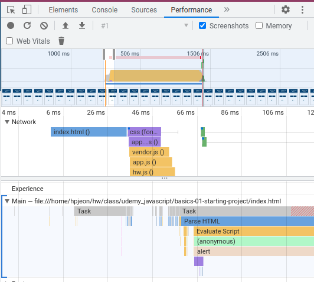

# Summary
- Title: JavaScript - The Complete Guide 2022 (Beginner + Advanced)
- Instructor: Maximilian Schwarzmüller

6. Dynamic and weakly typed language
- Dynamic interpreted programming language
    - Not precompiled but compiled on the fly
    - code can change at run time, including type of a variable
- Weakly typed programming language
    - Data types are assumed automatically

7. Javascrit runs on a host environment
- Browser-side
    - works with http requests
    - Doesn't access local filesystem & local OS
- Server-side
    - Standalone tool (Node.js)

19. Variables and constants
- Use constants as often as possible

20. Variable naming
- Use camelCase
- snake_case (user_name) is not recommended

23. Data type
- string + number will be string: str(number) is done automatically

25. String
```
let Description = `hello world with ${currentResult}`;
```
- This will print hello word with the value of currentResult in the code
```
let Description = 'hello world with ${currentResult}';
```
- Single or double quotation cannot translate `${}`

Assignment 1.
- Create 2 variables (a, b). One that holds a fictional user input (a=1.234) and the other without pre-assigned value
- b = a + 18
- b = b*a
- b = b/a
- alert(a)
- alert(b)

30. Code order
- The location of a function definition can be located after calling the function

35. A function as a function argument
- For a funciton `add()`, use as `add` inside of a function parentheses
```
function add() {
    currentResult = currentResult + userInput.value;
}
addBtn.addEventListener('click', add);
outputResult(currentResult,`hello with ${currentResult}`);
```
- This will not show results in the web-browser as outputResult() function is executed when the code is executed
```
function add() {
    currentResult = currentResult + userInput.value;
    outputResult(currentResult,`hello with ${currentResult}`);
}
addBtn.addEventListener('click', add);
```
- Now the result is shown when the add button is clicked

Assignment 2.
- Create 2 new functions. 1) no parameter simply alert() 2) passes a name and alert()
- Call both functions from the code
- Use task3Element and use event listener
- 3) a new function with 3 parameters, returns a concatenated string
- Call the function from the code and alert() the results
```
function assign2_1(){
    alert('assignment 2-1');
}
function assign2_2(inputs){
    alert('print: ' + inputs);
}
function assign2_3(param1, param2, param3) {
    alert('concatenated string:' + param1 + param2 + param3);
}
assign2_1();
assign2_2('hello world');
task3Element.addEventListener('click', assign2_1);
assign2_3('hello world', " in the ", " weekend");
```

36. Converting data type
- parseInt() or parseFloat()


39. functions
```
function createAndWriteOutput(operator, resultBefore, calcNumber) {
    const calcDescription = `${resultBefore} ${operator} ${calcNumber}`
    outputResult(currentResult, calcDescription);
}
function multiply() {
    const enteredNumber = getUserNumberInput();
    const initialResult = currentResult;
    currentResult = currentResult * enteredNumber;
    createAndWriteOutput('*', initialResult, enteredNumber)
}
```
- Passing `*` or `+` into function arguments

40. Comments
- Use `//` or a block of `/* ... */`

42. Data types
- Numbers: 2, -1.234
- Strings: 'HI', "Hi", `Hi`
- Booleans: true/false
- Objects: JSON
- Arrays: [1, 2, 3]

43. Arrays
```
let logEntries = [];
...
    logEntries.push(enteredNumber);
    console.log(logEntries);
```
- `console.log()` can be viewed from `Inspect element->Console`
- Each element in arrays can be accessed like `logEntries[0]`
    - If the element value doesn't exist, `undefined` is printed

48. Undefined, null, and NaN
- Undefined: default value of uninitialized variables
    - No manual assignment as Undefined
    - It works but bad-practice
- null: shouldn't be default value
    - Can be used for reset or clear of a variable
- NaN: still stays at memory and can be checked
    - `typeof NaN` yields `number`

50. defer and sync
- `Inspect element->Performance->Record` then load a page. Then click stop record

```
    <script src="assets/scripts/app.js" defer></script>
    <script src="assets/scripts/hw.js" defer></script>
```
- Using defer, loading those js files (locally or remotely) is done in parallel with loading the html file
```
    <script src="assets/scripts/app.js" async></script>
    <script src="assets/scripts/hw.js" async></script>
```
- Using async will load/execute those files independently, and may cause race conditions

62. MDN
- https://developer.mozilla.org/en-US/docs/Web/JavaScript

65. Debugging javascript
- Read error messages
- Use console.log()
- Use Chrome debugging tools
- Use IDE debugging tools

68. Debugging with Chrome
- Inspect element -> Sources, find source file and click line numbers to add break points

- Check Call Stack and local variables

75. Comparisons
- `==` checks value only while `===` checks data type. `===` is more favored for strict check
```
> 2 == 2
> true
> 2 === 2
> true
> 2 == "2" // NOTE !!!
> true
> 2 === "2" // NOTE !!!
> ​false
> 2 != "2"
> false
> 2 !== "2"
> true
```

​78. Comparing Objects and Arrays
- Equality of objects or array may not work
```
> xyz = {name: 'Max'}
> abc = {name: 'Max'}
> abc === xyz // NOTE !!!
> false
> abc.name === xyz.name
> true
> arr = [1,2,3]
> brr = [1,2,3]
> arr == brr // NOTE !!!
> false
> crr = arr 
> arr === crr // But if a variable is copied from existing array/object, equality works
> true
```

81. Truthy vs Falsy
- Truthy: when a value can be converted to true
- Falsy: when a value is a candidate of false
    - '', null, undefined, NaN, 0, 0.0, 0.
- ​Non-empty string is converted to true : `if (txt) {}`
    - '' is false
- 0 is converted to false
    - 0.0 or 0. as well
- Empty array ([]) or object ({}) is true
- null, undefined, NaN are false

90. Validating user input
- Use prompt() to read a user input

```
const enteredValue = prompt('Maximum life for you and the monster','100');
chosenMaxLife = parseInt(enteredValue);
if (isNaN(chosenMaxLife) || chosenMaxLife <= 0) {
    chosenMaxLife = 100;
}
```

93. Ternary operator
- `const userName = isLogin ? 'Max':null;`
- May need parenthesis when another conditional check is made
```
> 'Max' === isLogin ? 'Max':null
> null
> 'Max' === (isLogin ? 'Max':null);
> true
```
- The lecture shows that ternary operator works OK with === but Opera runs === prior to ternary operator

95. Boolean tricks
- Double bang: `!!`
    - negate 2x: `!!1`=> true, `!!''`=> false
    - Can convert truthy/falsy value to true/false
        - `boolVal = !!mytxt` => true when non-empty string. When empty, false
- Assigning a default value using OR
    - ` const name = usrInput || 'DefaultName'`
    - If usrInput is an empty string or undefined, it is falsy and `DefaultName` will be assigned
- OR operation: 
    - Ref: https://developer.mozilla.org/en-US/docs/Web/JavaScript/Reference/Operators/Logical_OR
    - `expr1 || expr2`
    - If expr1 can be converted to true, returns expr1; else, returns expr2. 
```
> isLogin = true
> isLogin || 'Max' // NOTE - true is resulted
> true
> 'Max' || isLogin // NOTE- 'Max' is resulted
> 'Max'
> wasLogin = false
> wasLogin || 'Max'
> 'Max'
> 'Max' || wasLogin
> 'Max'
```
- AND operation:
    - `expr1 && expr2`
    - If expr1 can be converted to true, returns expr2; else, returns expr1. 
```
> isLogin && 'Max'  // NOTE - 'Max' is resulted
> 'Max'
> 'Max' && isLogin  // NOTE - true is resulted
> true
> wasLogin && 'Max'
> false
> 'Max' && wasLogin
> false
> '' && 'Max' // NOTE - '' is resulted. Not true or false.
> ''
> 'Max' && '' // NOTE - '' is resulted. Not true or false.
''
```

97. switch-case
- It uses === for comparison (type of data is checked)
- break is necessary - unless, below cases will be executed

98. For loops
- for loop: `for (let i=0;i<3;i++) {}`
- for-of loop: `for(const el of array) {}`
    - Make sure to use `of`, not `in`
    - `in` will return the index, not value
```
> for (const el of ['a','b','c']) {console.log(el)}
a
b
c
> for (const el in ['a','b','c']) {console.log(el)} // Note that it returns index, not value of 'a','b','c'
0
1
2
```
- for-in loop: `for(const key in obj) {}`
- while loop: `while(isTrue) {}`

104. Continue
- break: exits the loop
- continue: returns to the next iterator

105. Labeled statement with break
- Using the label of the loop, break can control which loop it may exit
```
> for (i of ['a','b','c']) {
    console.log('Outer',i);
    for (j in [1, 2, 3]) {
        if (j==2) {
            break;
        }
        console.log('Inner',j);
    }
}
Outer a
Inner 0
Inner 1
Outer b
Inner 0
Inner 1
Outer c
Inner 0
Inner 1
> OuterLoop: for (i of ['a','b','c']) {
    console.log('Outer',i);
    InnerLoop: for (j in [1, 2, 3]) {
        if (j==2) {
            break OuterLoop;
        }
        console.log('Inner',j);
    }
}
Outer a
Inner 0
Inner 1
```

107. Throwing an error message
```
> throw { message: 'help!'}
Uncaught 
{message: 'help!'}
```

108. try-catch
- For the errors beyond the control by the developer
    - user input typo, network outage, ...
- try {}: the code which may throw an error
- catch {}: error handling and fallback logic
- finally: optional but can be used to cleanup work in both cases of success or fail
```
> function myftn() { throw { message: 'crashed!'}}
> try {
    myftn();
} catch (error) {
    console.log(error);
    throw error;
} finally {
    console.log('testing try-catch-finally');
}
> {message: 'crashed!'}
> testing try-catch-finally
```

112. ES5 vs ES6+
- ES: ECMA Script
- ES5: only var. No support of let and const

113. var vs let vs const
- var: creates a variable over function & global scope
    - Don't use var in ES6+ as a good practice
- let: creates a variable over a block scope
- const: creates a constant over a block scope

114. Hoisting
- Similar to functions, the location of var variables may not matter as JS will read the entire script and loads var variables into memory

115. Strict mode and writing a good code
- `'use strict';` or `"use strict";`
    - Applies strict rules of JS
    - Only in the single JS file
- Do not initialize a new variable without let. It may confuse other folks to find the location of the initial declaration of the variable

117. Inside the Javascript engine
- Long term memory like function defintion on heap
- Function calls, short-lived data, and communication on stack
    - Found from Debugging -> Call Stack

119. Primitive vs Reference values
- Primitive
    - strings, numbers, booleans, null, undefined, symbol
    - Copies by values for copy operation
    - Stored on stack
    - Array as well? The lecture shows an array is reference but Opera shows it behaves as primitive
- Reference
    - all other objects which are expensive to create
    - Stored on heap
    - Copies the address of the variable in the memory for copy operation
    - In order to have copying value, use `...`
    - This is why `===` of two same objects doesn't work as it compares the address
        - `const array` or `const object` implies the constant address
        - push() still works as the address is constant
        - new assignment will fail as the address will change
```
> let a1 = { age: 30};
> let b1 = a1;
> let c1 = {...a1} // now copy values, not address
> a1.height = 5.09
5.09
> b1
{age: 30, height: 5.09} // copy by reference. Updated automatically
> c1
{age: 30} // copy by value. No change
> const aobj = {age:30};
> aobj.height = 6.01  // push or adding new key works OK for const obj
> aobj = {age:30, height:6.01} // new assignment fails as it changes the address
VM1899:1 Uncaught TypeError: Assignment to constant variable.
    at <anonymous>:1:6
```

120. Garbage collection
- Management of heap memory
- Checks periodically for unused memory (no reference)

126. Functions vs methods
- Method: function as a value of key in an object
```
> const v1 = { name: 'Max', greet: function greet() { console.log('Hello'); } };
> v1.greet()
VM2076:1 Hello
```
- `v1.greet` will return the function definition
- The function name may be different than the key name

127. Functions are stored as objects
- Arguments, returns, ... are stored as key/value pairs
```
> dir(v1.greet)
...
arguments: null
caller: null
length: 0
name: "greet"
prototype: {constructor: ƒ}
...
```

128. Function expressions:
- Anonymous function: `const myftn = function() {...}`
    - Doesn't need a function name
129. Function declaration vs expressions
- Function declaration (function statement)
    - `function myFnxn(a,b) { return a*b; }`
    - JS will be able to use this function regardless of the location
        - Hoisted to top
- Function expression
    - `const myFnxn = function(a,b) {return a*b;}`
    - Can use anonymous function
    - Order matters
    - Scope matters

130. Anonymous function
- When a function is not used often
```
> console.log(function() { return 3;})
> VM808:1 ƒ () { return 3;}
> console.log(function() { return 3;}()) // () is required after function definition
> VM817:1 3
```
- A function name is NOT required but the name can be **USEFUL** for debugging

133. Arrow function
- For anonymous function only
- Syntatic sugar (shorter coding but performance is same)
```
> const myfx = function(a,b) {return a+b;}
> const myfz = (a,b)=> a+b;
> myfx(3,4) === myfz(3,4)
true
```

136. Default arguments
- Any argument may have the default value. Order doesn't matter
    - But good practice will put the default argument in the last

137. Rest parameters
- Handles undeterminated amount of arguments into an array
    - Use `...vname`
```
> function mysum(...inputs) { 
    let sum=0;  
    for (const el of inputs) { 
        sum += el;
    }  
    return sum; 
    }
undefined
> mysum(1,2,3)
6
> mysum(1,2,3, -6, -8)
-8
```
- Or default variable `arguments` works but it is not recommended to use

139. Callback functions
- A function pointer or function handler is sent through the argument and executed from the function
```
const myf01 = (resultHandler, a,b) => { let sum = a+b; resultHandler(sum); }
# myf01() has arguments of resultHandler, which is a callback function, and a & b which are parameters
# myf01() callsback resultHandler() for you - even you didn't ask to run resultHandler()
const showR = (some_txt) => { alert(some_txt); }
#
myf01(showR, 12, 23)
```

Assignment 4
- `function sayHello(name) { console.log('Hi ' + name) ; }` => `const sayH = (name) => { console.log('Hi ' + name) ; }`
```inputcheck2(()=>{console.log('no data')})
> const inputcheck2 = (nodataHandler, ...vlist) => { if (vlist.length == 0) {nodataHandler();}; for (el of vlist) { console.log(el) } }
> const showR = () => {console.log('no data found')}
> inputcheck2(showR, 3,2,1)
3
2
1
> inputcheck2(showR)
no data found
>inputcheck2(()=>{console.log('no data')})
no data
```

140. bind() in the function pointer/function handler
- Can pre-configure a function's arguments
```
> const inputcheck3 = (resultHandler, ...vlist) => { resultHandler(...vlist) }
> const showEl2 = (messageStatus, ...vlist) => { console.log("message status = ", messageStatus); for (const el of vlist) { console.log(el) } }
> inputcheck3(showEl2.bind(this, "testing message"), 'a', 'b', 123, 456, 3.14)
message status =  testing message
a
b
123
456
3.14
> inputcheck3(showEl2, 'a', 'b', 123, 456, 3.14)
message status =  a
b
123
456
3.14
```
- `functionHandler.bind(this, XXX)` will deliver XXX as the first argument
​
146. DOM
- Document Object Model
- Tools can parse HTML
- Javascript is a hosted language
- The browser as the host environment exposes the DOM API to JS code automatically

149. Nodes & Elements
- Ref: https://stackoverflow.com/questions/9979172/difference-between-node-object-and-element-object
- Node: objects that make up DOM
    - There are 12 different nodes
    - DOCUMENT_NODE: document or document.body which would be a built-in DOM element
    - HTML tag like <input> or <p>
    - TEXT_NODE
    - ELEMENT_NODE: an object of nodeType=1. HTML tags
    - ATTRIBUTE_NODES
- document.getElementById() will return one node and it is guaranteed to be an element
- document.getElementsByClassName() will return the list of nodes

150. Selecting elements in DOM
- For `<p id="description"> Hi there </p>`
- `const p1 = document.querySelector('p')` works
- `const p2 = document.querySelector('#description')` works
- querySelector() runs through CSS selector, which may not fit HTML5 yet
    - This returns the first node only. To get NodeList, use querySelectorAll()

153. Attributes vs Properties
- Attributes: data from HTML code using element tags
- Properties: data of object using dot(.) notation
```
> const input = document.querySelector('input')
> input.value
'default text'
> input.value = 'new text'
> const input2 = document.querySelector('input')
> input2.value
'new text'
```
- input.setAttribute('value', ...) vs input.value
- setAttribute will automatically create a node if it doesn't exist
```
> input.value
'new text'
> input.setAttribute('value', 'hello world')
## this will change the attributes, 'value', in the loaded HTML
## check through Inspect element->Elements tab
> input.value
'new text'
## Property of input is still the old value
```


Assignment 5.
- Change the color of background as black and text as white, using 2 different methods
- Change the document title using the title element, as "Assignment-solved!", using querySelector() 1) on document and 2) on the property of the document
- Change h1 element on this page and change the text to "Assignment-solved!"
```
> const t1 = document.getElementById('task-1')
> t1.style.backgroundColor="black"
> t1.style.color="white"
> const t1_1 = document.querySelector('#task-1')
> t1_1.style.backgroundColor='orange'
#
> const tt = document.querySelector('title')
> tt.innerText = 'Assignment-solved!' # or use tt.textContent
> document.title
'Assignment-solved!'
> document.title = 'as given'
#
> const h1 = document.querySelector('h1')
> h1.innerText = 'Assignment solved'
```
- Q: How to access from <head> to <title>? 
    - Changing attributes is limited within <...>. <title> is outside of <head>
```
​<!DOCTYPE html>
<html lang="en">
  <head>
    <meta charset="UTF-8" />
    <meta name="viewport" content="width=device-width, initial-scale=1.0" />
    <meta http-equiv="X-UA-Compatible" content="ie=edge" />
    <title>Assignment - DOM Querying & Manipulation</title>
    <link rel="stylesheet" href="styles.css" />
  </head>
  <body>
```
