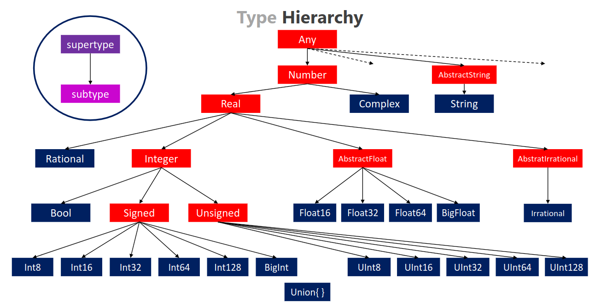
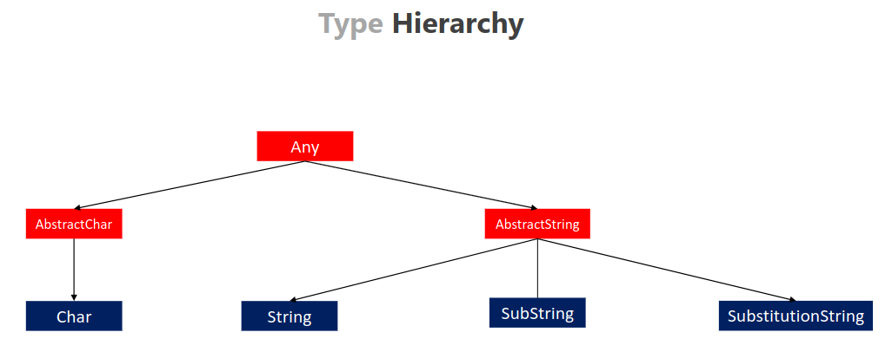
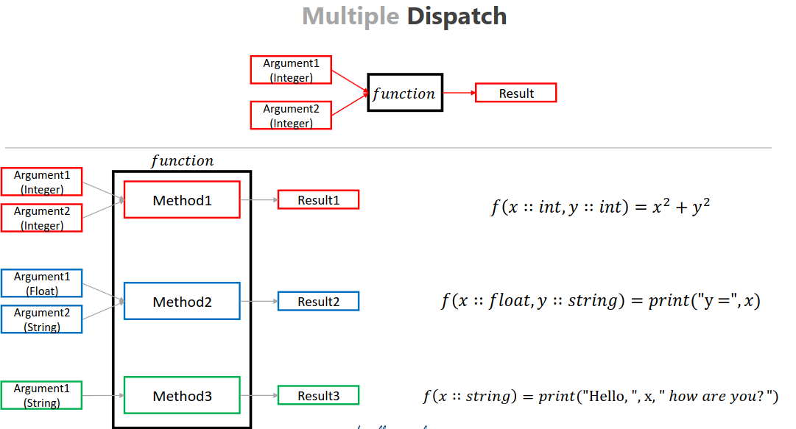
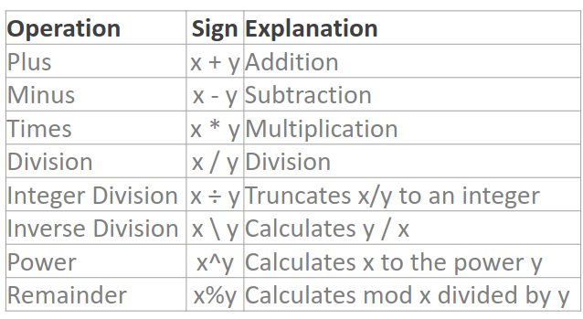
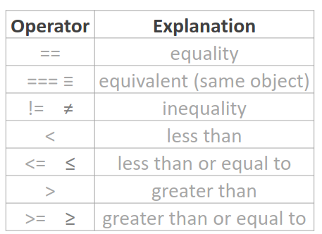
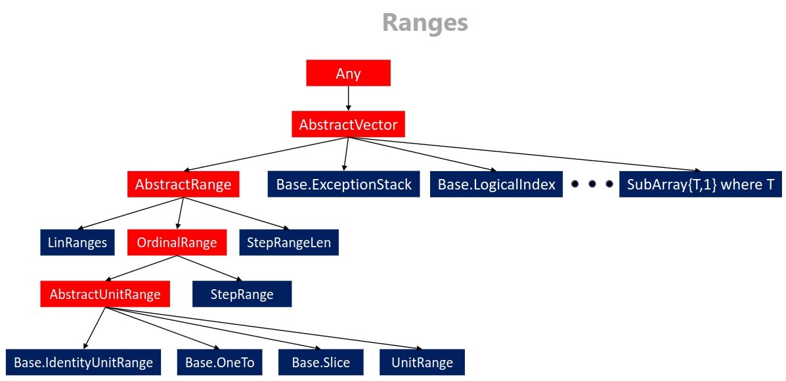
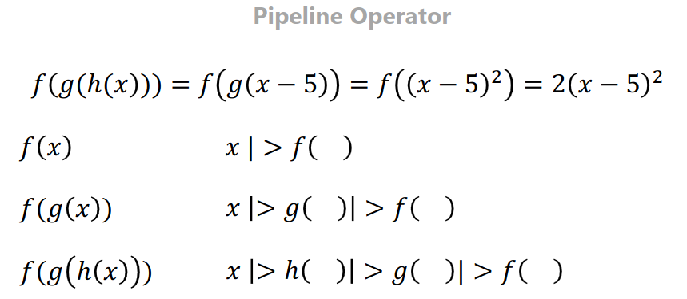

## Title: Programming with Julia
- Instructor: Dr. İlker Arslan

## Section 1: Introduction

1. Introduction

2. History of Julia
- Speed of C and the dynamicsm of Ruby

3. Why Julia?
- On top of LLVM
- https://juliahub.com/ui/packages

4. Codes and resources
- https://github.com/ilkerarslan/JuliaCourseCodes.git

## Section 2: Starting with Julia

5. Installing Julia in Windows

6. Installing Julia in Linux
- https://julialang.org/downloads/

7. Installing Julia with juliaup

8. Julia REPL
- Julia CLI
```julia
julia> println("hello world\n")
hello world
julia> 4+3;

julia> 4+3
7
```
- `;` starts shell
- Back-space to stop shell
- For a saved file, use extension of `.jl`

9. Julia Editor and IDEs
- vscode, jupyter, pluto.jl

## Section 3: Variables, Data Type, and Operations

10. Introduction
- Dynamically typed language

11. Variables
```julia
julia> x = 11; y=12;z=31
31

julia> x
11

julia> y
12

julia> z
31

julia> y = x^3 + 3*x
1364

julia> x= "Hello world"
"Hello world"

julia> typeof(x)
String
```
- \alpha + TAB for alpha character
- \beta + TAB for beta character
- \_0 TAB for subscript 0
- \^1 TAB for superscript 1
- \pi TAB for pi number
- \euler TAB for *e*
```julia
ulia> π
π = 3.1415926535897...

julia> \euler
ERROR: syntax: "\" is not a unary operator
Stacktrace:
 [1] top-level scope
   @ none:1

julia> ℯ
ℯ = 2.7182818284590...
```
- A single line comment: `#`
- Multi line comments: `#= .... =#`
```julia
julia> a,b,c = 1,2,3
(1, 2, 3)

julia> a,b = b,a
(2, 1)

julia> println(a, ",", b)
2,1
```
- DataType declaration
  - Not working in CLI or global variables
  - For function arguments
  - (expression)::DataType
    - Ex: x::Int64, y::String
- For constant variables, use `const` and name as full Capitals
  - Re-assigning with different datatype will generate error
  - Re-assigning with same datatype will generate warning

12. Type Hierarchy in Julia

- Red label: Abstract types. Cannot be instantiated but can constraint argument type
- Blue label: Concrete types
```julia
julia> subtypes(Any)
587-element Vector{Any}:
 AbstractArray
 AbstractChannel
 AbstractChar
 AbstractDict
 AbstractDisplay
 AbstractMatch
 AbstractPattern
 AbstractSet
 AbstractString
 Any
 ⋮
 Timer
 Tuple
 Type
 TypeVar
 UndefInitializer
 Val
 VecElement
 VersionNumber
 WeakRef

julia> supertypes(Any)
(Any,)

julia> supertypes(Number)
(Number, Any)

julia> subtypes(Number)
2-element Vector{Any}:
 Complex
 Real
```
- `<:`: is subtype?
```julia
julia> Int64 <: Number
true

julia> Number <: Int64
false

julia> Float64 <: Real
true
```

13. Numerical Data Types: Integers and Floating-Point Numbers
```julia
ulia> typemax(Int8)
127

julia> typemax(Int)
9223372036854775807

julia> typemax(Int16)
32767

julia> typemax(Int32)
2147483647

julia> typemax(Int64)
9223372036854775807

julia> typemin(Int32)
-2147483648

julia> Sys.WORD_SIZE
64

julia> 10^50
-5376172055173529600 #<----- overflow !!!

julia> big(10)^50
100000000000000000000000000000000000000000000000000

julia> typeof(1)
Int64

julia> typeof(1.0)
Float64

julia> typeof(1.e-2)
Float64

julia> typeof(1.f-2)
Float32

julia> x = 1_000_000
1000000

julia> y = Inf
Inf

julia> sizeof(Inf)
8

julia> typeof(Inf)
Float64

ulia> NaN
NaN

julia> typeof(NaN)
Float64

julia> 0/0
NaN

julia> isinf(0/0)
false

julia> isinf(1/0)
true

julia> eps()
2.220446049250313e-16 #<-------- machine epsilon

julia> eps(Float64)
2.220446049250313e-16

julia> eps(Float32)
1.1920929f-7

julia> eps(Float16)
Float16(0.000977)

julia> typeof(true)
Bool

julia> true == 1
true

julia> false == 0
true

julia> Bool(1)
true
```

14. Numerical Data Types: Complex and Rational Numbers
```julia
julia> x = 3+4im
3 + 4im

julia> real(x)
3

julia> imag(x)
4

julia> conj(x)
3 - 4im

julia> typeof(x)
Complex{Int64}

julia> sqrt(-1)
ERROR: DomainError with -1.0: #<----- Throws

julia> √Complex(-1) #<--- \sqrt + TAB 
0.0 + 1.0im

julia> √(-1+0im)
0.0 + 1.0im

julia> sqrt(-1+0im)
0.0 + 1.0im

julia> x = 5/2
2.5

julia> x = 5//2
5//2

julia> typeof(x)
Rational{Int64}

julia> isa(1, Int)
true

```

15. Character and String Types

```julia
julia> chr = 'a'
'a': ASCII/Unicode U+0061 (category Ll: Letter, lowercase)

julia> typeof(chr)
Char

julia> uchr = 'Σ' # \Sigma + TAB
'Σ': Unicode U+03A3 (category Lu: Letter, uppercase)

julia> '\u03A3'  # or use \u + number
'Σ': Unicode U+03A3 (category Lu: Letter, uppercase)

julia> str = "hello world"  # "" for stgring, '' for a char
"hello world"

julia> str[1] # 1 index. [0] yields error
'h': ASCII/Unicode U+0068 (category Ll: Letter, lowercase)

julia> str[begin]
'h': ASCII/Unicode U+0068 (category Ll: Letter, lowercase)

julia> str[end]
'd': ASCII/Unicode U+0064 (category Ll: Letter, lowercase)

julia> str[end-1]
'l': ASCII/Unicode U+006C (category Ll: Letter, lowercase)

julia> str[3:5] # note that 5th is included. Different to Python
"llo"

julia> firstindex(str)
1

julia> lastindex(str) # unicode may behave differently
11

julia> str1 = "hello"
"hello"

julia> str2 = "world"
"world"

julia> str1 * " " * str2 # aggregation of strings use *, not +
"hello world"

julia> str1^4
"hellohellohellohello"

julia> x = 4; y=5;

julia> "X = $x Y= $y"
"X = 4 Y= 5"

julia> ncodeunits("Hi Σ") # bytes of string
5

julia> length("Hi Σ")  # length of string
4

```

16. Primitive and Composite Types
- `primitive type <<nanme>> <<bits>> end`
- `primitive type <<name>> <: <<supertype>> <<bits>> end`
- Multiple dispatch
  - Similar to Function Overloading in C++
  - Different arguments may employ different method to produce results

- Composite type
```julia
julia> struct Rectangle
       width::Float64
       length::Float64
       end

julia> r1 = Rectangle(1.1,3.2)
Rectangle(1.1, 3.2)

julia> r1
Rectangle(1.1, 3.2)

julia> r1.width # this is immutable and cannot change
1.1

julia> mutable struct Rectangle_mut
       width::Float64
       length::Float64
       end

julia> r2 = Rectangle_mut(3,4)
Rectangle_mut(3.0, 4.0)

julia> r2.width
3.0

julia> r2.width = 7
7

julia> r2
Rectangle_mut(7.0, 4.0)


```

17. Parametric Types
- Template for argument types
```julia
julia> struct ParRectangle{T}
       width::T
       height::T
       end

julia> r1 = ParRectangle{Int}(3,8)
ParRectangle{Int64}(3, 8)

julia> r1
ParRectangle{Int64}(3, 8)

julia> ParRectangle{Float32} <: ParRectangle
true

julia> struct multiRectnable{T <: AbstractString, P <: Real}
       title::T
       x::P
       y::P
       end

julia> s1 = multiRectnable("myRect", 1.1, 2.5)
multiRectnable{String, Float64}("myRect", 1.1, 2.5)

julia> typeof(s1)
multiRectnable{String, Float64}

julia> s1
multiRectnable{String, Float64}("myRect", 1.1, 2.5)

```
- Argument type can be constrained using `<:`
  - `{T <: Real}` will crash if strings are used

18. Basic Operations

- \div + TAB for ÷
```julia
julia> 3 / 2
1.5

julia> 3 ÷ 2
1
```
- Operation is a function as well
```julia
julia> 3 + 2
5

julia> +(3,2)
5
```

- \ne + TAB for ≠
```julia
ulia> c = [3,1,2]
3-element Vector{Int64}:
 3
 1
 2

julia> d = c
3-element Vector{Int64}:
 3
 1
 2

julia> e = deepcopy(c)
3-element Vector{Int64}:
 3
 1
 2

julia> c == d
true

julia> c == e
true

julia> c === e  # check if they are in the same memory location
false

julia> isequal(0.6, 0.2+0.4)
false

julia> isapprox(0.6, 0.2+0.4)
true

```
- Boolean
  - Negation: !x
  - AND: x && y
  - OR: x || y
```julia
julia> x ⊻ y
15

julia> xor(x,y)
15

```
- \xor + TAB for ⊻
```julia
julia> import Pkg; Pkg.add("Bits")
...
julia> using Bits

julia> bits(5)
<00000000 00000000 00000000 00000000 00000000 00000000 00000000 00000101>

julia> bitstring(5)
"0000000000000000000000000000000000000000000000000000000000000101"

julia> round(3.9)
4.0

julia> floor(3.9)
3.0

julia> ceil(3.9)
4.0

julia> ceil(-3.9)
-3.0

julia> round(-3.9)
-4.0

julia> floor(-3.0)
-3.0

julia> rand()
0.8158814491067834

julia> rand(3)
3-element Vector{Float64}:
 0.3675522314311055
 0.8276953365387326
 0.34874683434771925

julia> sin(π/2.0)
1.0

julia> sind(90)  # argument as degree angle
1.0

```

19. Exercises: Variables, Data Types & Operations
- Exercise 1:
    Create a struct for a rectangular prism.
    The struct should include three fields: width, length, height.
    Data types of the fields should be the same and they should be a subtype of Real type.
    Create an instance of a Prism type. Set the values for width, length, and height any value you like. (What is the point you should be careful about when setting the values?)
    Calculate the volume of the prism object using the field values. 
```julia
struct rectPrism{T <: Real}
   width::T
   length::T
   height::T
end
p1 = rectPrism(1,2,3)   
v = p1.width*p1.length*p1.height
```
- Exercise 2:
    Assign the value of 42 to the variable name myint.
    Convert the variable myint to float data type. Assign it to the variable name myfloat.
```julia
myint = 42
myfloat = Float32(myint)
```
- Exercise 3:
Body mass index is calculated with the formula weight/height^2 where weight is in kg and height is in meter.
Consider the following variables.
    name = "Arthur"
    weight = 75
    height = 1.80 
Print the following line to the Julia REPL.
Hello Arthur. You are 75 kg and 1.8 m. Your BMI is 23.15.
Hint: To round a floating number you can use the round function. For example, round(2.718281828, digits=4) = 2.7183. 
```julia
struct bmi{T <: String, Q <: Int, X <: AbstractFloat}
  name::T
  weight::Q
  height::X
end
a1 = bmi("Arthur", 75, 1.80)
name = a1.name
w = a1.weight
h = a1.height
x = round(w/h/h, digits=4)
println("Hello $name. You are $w kg and $h m. Your BMI is $x")
```

20. Solutions to Exercises: Variables, Data Types & Operations

## Section 4: Data Structures

21. Introduction

22. Tuples
- Cannot be modified
- Use comma (,) for a single element
```julia
julia> tp1 = (3, "hello", 3.14)
(3, "hello", 3.14)

julia> typeof(tp1)
Tuple{Int64, String, Float64}

julia> tp1[1]
3

julia> tp2 = (3,)
(3,)

julia> typeof(tp2)
Tuple{Int64}

julia> tp3 = (name ="Joh", year=2012, version=1.3) # named tuple
(name = "Joh", year = 2012, version = 1.3)

julia> typeof(tp3)
NamedTuple{(:name, :year, :version), Tuple{String, Int64, Float64}}

julia> tp3.version
1.3

julia> a, b, c = tp3
(name = "Joh", year = 2012, version = 1.3)

julia> a
"Joh"

julia> b
2012

julia> c
1.3

julia> in("Joh", tp3) # is "Joh" inside of tp3?
true

julia> in("Hello", tp3)
false

julia> "Joh" in tp3
true
```

23. Dictionaries
- Keys are unique
- Mutable
```julia
julia> d1 = Dict()
Dict{Any, Any}()

julia> d1["albert"] = 3
3

julia> d2 = Dict("John"=> 100, "Sam"=>33)
d2Dict{String, Int64} with 2 entries:
  "Sam"  => 33
  "John" => 100

julia> length(d2)
2

julia> keys(d2)
KeySet for a Dict{String, Int64} with 2 entries. Keys:
  "Sam"
  "John"

julia> values(d2)
ValueIterator for a Dict{String, Int64} with 2 entries. Values:
  33
  100

julia> "Sam" in keys(d2) # "Sam" in d2 errors
true

julia> haskey(d2, "John")
true

julia> get(d2, "John", "not found")
100

julia> get(d2, "John2", "not found")
"not found"

julia> get(d2, "John2", 11) # if john2 does not exist, return 11
11

julia> get!(d2, "John2", 11) # if john2 does not exist, add john2 with 11
11

julia> d2
Dict{String, Int64} with 3 entries:
  "Sam"   => 33
  "John"  => 100
  "John2" => 11

julia> merge(d1,d2)
Dict{Any, Any} with 4 entries:
  "albert" => 3
  "Sam"    => 33
  "John"   => 100
  "John2"  => 11

julia> delete!(d2, "John2")
Dict{String, Int64} with 2 entries:
  "Sam"  => 33
  "John" => 100

```
- Merging dictionary: mergewith(*,dict1,dict2)
  - Same keys will have value of multiplication of values respectively

24. Ranges
```julia
julia> x = 1:10
1:10

julia> x[3]
3

julia> collect(x)
10-element Vector{Int64}:
  1
  2
  3
  4
  5
  6
  7
  8
  9
 10

julia> range(start=0, step=2, stop=19)
0:2:18

julia> range(start=1, length=3)
1:3

```


25. Arrays
- Tuples: (...)
- Arrays: [...]
```julia
julia> a1 = [3, "hello", 42.0]
3-element Vector{Any}:
  3
   "hello"
 42.0

julia> a1
3-element Vector{Any}:
  3
   "hello"
 42.0

julia> 3 in a1
true

julia> issubset([3,42.0], a1)
true

julia> zeros(Int64,3,4)
3×4 Matrix{Int64}:
 0  0  0  0
 0  0  0  0
 0  0  0  0

julia> a1 = [1,2,3]
3-element Vector{Int64}:
 1
 2
 3

julia> append!(a1,[4,5,6])
julia> a1
6-element Vector{Int64}:
 1
 2
 3
 4
 5
 6

julia> popfirst!(a1)
1

julia> a1
5-element Vector{Int64}:
 2
 3
 4
 5
 6

julia> rand(Float64,2,3)
2×3 Matrix{Float64}:
 0.806018  0.0301438  0.923994
 0.517726  0.300076   0.95384

```
- When an array is defined as one datatype, it cannot change any element with different datatype

26. Vectors and Matrices
- Comma (,) in the [...]: vector
- No comma in the [...]: matrix
```julia
julia> v1 = [1,2,3] # cannot use ; in the [...]
3-element Vector{Int64}: 
 1
 2
 3

julia> m1 = [ 1 2 3]
1×3 Matrix{Int64}:
 1  2  3

julia> m2 = [1 2 3; 4 5 6]
2×3 Matrix{Int64}:
 1  2  3
 4  5  6
 
julia> size(m2)
(2, 3)

julia> size(m2,2) # size of 2nd dimension
3

julia> m2[end,end]
6

julia> m2[end,:]
3-element Vector{Int64}:
 4
 5
 6

julia> v1 = [1,2,3]; v2=[4,5,6]
julia> vcat(v1,v2)
6-element Vector{Int64}:
 1
 2
 3
 4
 5
 6

julia> hcat(v1,v2)
3×2 Matrix{Int64}:
 1  4
 2  5
 3  6

julia> [v1 v2]
3×2 Matrix{Int64}:
 1  4
 2  5
 3  6

julia> [v1;v2]
6-element Vector{Int64}:
 1
 2
 3
 4
 5
 6

julia> m1 = [1 2 3]; m2 = [4 5 6]
1×3 Matrix{Int64}:
 4  5  6

julia> vcat(m1,m2)
2×3 Matrix{Int64}:
 1  2  3
 4  5  6

julia> hcat(m1,m2)
1×6 Matrix{Int64}:
 1  2  3  4  5  6

julia> [m1 m2]
1×6 Matrix{Int64}:
 1  2  3  4  5  6

julia> [m1; m2]
2×3 Matrix{Int64}:
 1  2  3
 4  5  6

julia> Matrix{Int64}(undef,2,3)
2×3 Matrix{Int64}:
 140281680152528  140281680152560  140282648781680
 140281680152544  140281680152656  140282648781360

julia> nothing

julia> typeof(nothing)
Nothing

julia> missing
missing

julia> typeof(missing)
Missing

julia> Matrix{Union{Int64,Nothing}}(nothing, (2,3)) # nothing is not alloed in Int64. Therefore we use Union to generate a matrix of nothing/missing
2×3 Matrix{Union{Nothing, Int64}}:
 nothing  nothing  nothing
 nothing  nothing  nothing

julia> zeros(3,2)
3×2 Matrix{Float64}:
 0.0  0.0
 0.0  0.0
 0.0  0.0

julia> ones(2,3)
2×3 Matrix{Float64}:
 1.0  1.0  1.0
 1.0  1.0  1.0

julia> ones(Int32, 2,3)
2×3 Matrix{Int32}:
 1  1  1
 1  1  1

julia> fill(1234,(2,3))
2×3 Matrix{Int64}:
 1234  1234  1234
 1234  1234  1234

julia> rand(1:10, 2,3) # random number b/w 1:10
2×3 Matrix{Int64}:
 4  5  7
 3  5  3

julia> a = [1 2 
            3 4];

julia> println(size(a))
(2, 2)

```

27. Multidimensional Arrays
```julia
julia> Array{Float64,3}(undef,(5,4,3))
5×4×3 Array{Float64, 3}:
[:, :, 1] =
 6.93088e-310  6.93088e-310  6.93088e-310  6.93088e-310
 6.93088e-310  6.93088e-310  6.93088e-310  6.93088e-310
 6.93088e-310  6.93088e-310  6.93088e-310  6.93088e-310
 6.93088e-310  6.93088e-310  6.93088e-310  6.93088e-310
 6.93088e-310  6.93088e-310  6.93088e-310  6.93088e-310

[:, :, 2] =
 6.93088e-310  6.93088e-310  6.93088e-310  6.93088e-310
 6.93088e-310  6.93088e-310  6.93088e-310  6.93088e-310
 6.93088e-310  6.93088e-310  6.93088e-310  6.93088e-310
 6.93088e-310  6.93088e-310  6.93088e-310  6.93088e-310
 6.93088e-310  6.93088e-310  6.93088e-310  6.93088e-310

[:, :, 3] =
 6.93088e-310  6.93088e-310  6.93088e-310  6.93088e-310
 6.93088e-310  6.93088e-310  6.93088e-310  6.93088e-310
 6.93088e-310  6.93088e-310  6.93088e-310  6.93088e-310
 6.93088e-310  6.93088e-310  6.93088e-310  0.0
 6.93088e-310  6.93088e-310  6.93088e-310  0.0

julia> Array{Union{Int64,Nothing},4}(nothing,(2,3,2,3))
2×3×2×3 Array{Union{Nothing, Int64}, 4}:
[:, :, 1, 1] =
 nothing  nothing  nothing
 nothing  nothing  nothing

[:, :, 2, 1] =
 nothing  nothing  nothing
 nothing  nothing  nothing

[:, :, 1, 2] =
 nothing  nothing  nothing
 nothing  nothing  nothing

[:, :, 2, 2] =
 nothing  nothing  nothing
 nothing  nothing  nothing

[:, :, 1, 3] =
 nothing  nothing  nothing
 nothing  nothing  nothing

[:, :, 2, 3] =
 nothing  nothing  nothing
 nothing  nothing  nothing

```

28. Broadcasting and Dot Syntax
- Vectorizing over vector data
```julia
julia> v = [1,2,3]
3-element Vector{Int64}:
 1
 2
 3

julia> v +1
ERROR: MethodError: no method matching +(::Vector{Int64}, ::Int64)...

julia> broadcast(+,v,1)
3-element Vector{Int64}:
 2
 3
 4
julia> v .+ 1
3-element Vector{Int64}:
 2
 3
 4

julia> v1 = [3,2,1]
3-element Vector{Int64}:
 3
 2
 1

julia> v == v1
false

julia> v .== v1
3-element BitVector:
 0
 1
 0

julia> exp.(v)
3-element Vector{Float64}:
  2.718281828459045
  7.38905609893065
 20.085536923187668

julia> v1[ v1 .> 2]
1-element Vector{Int64}:
 3

```
- In Python, broacasting is much faster than loop while in Julia, broadcasting vs loop is equivalent

29. Sets
- Unique elements only
```julia
julia> v1 = [1, 2,3 ,2,3,3];

julia> Set(v1)
Set{Int64} with 3 elements:
  2
  3
  1

julia> v2 = [2,3,4,4,4,5];

julia> intersect(v1,v2)
2-element Vector{Int64}:
 2
 3

julia> setdiff(v1,v2)
1-element Vector{Int64}:
 1

julia> setdiff(v2,v1)
2-element Vector{Int64}:
 4
 5

julia> x = [1, 2, 2, 3, 4];

julia> y = [3, 4, 5];

julia> union(x, y)
5-element Vector{Int64}:
 1
 2
 3
 4
 5
```

30. Basic Linear Algebra
```julia
julia> using LinearAlgebra

julia> mat = [1 4 8; 2 5 9; 3 6 7]
3×3 Matrix{Int64}:
 1  4  8
 2  5  9
 3  6  7

julia> tr(mat)
13

julia> det(mat)
9.0

julia> mat'*mat
3×3 Matrix{Int64}:
 14   32   47
 32   77  119
 47  119  194

julia> mat .* mat
3×3 Matrix{Int64}:
 1  16  64
 4  25  81
 9  36  49

julia> I(3)
3×3 Diagonal{Bool, Vector{Bool}}:
 1  ⋅  ⋅
 ⋅  1  ⋅
 ⋅  ⋅  1

julia> inv(mat)
3×3 Matrix{Float64}:
 -2.11111    2.22222   -0.444444
  1.44444   -1.88889    0.777778
 -0.333333   0.666667  -0.333333

julia> mat * inv(mat)
3×3 Matrix{Float64}:
  1.0          0.0           0.0
  0.0          1.0          -4.44089e-16
 -8.88178e-16  8.88178e-16   1.0

```

31. Exercises: Data Structures

  1. A linear regression model is used to find linear relationships between some input variables and an output variable. In other terms, we try to predict a continuous variable using some input variables. For example, if the output variable is y and input variables are x₁, x₂, and x₃ then we want to find the β variables for best fit of y = β₀ + β₁x₁ + β₂x₂ + β₃x₃ or in matrix form y = βX.

  Assume we have 100 observations of inputs and output. There are three input variables. The matrix of xs is X (100x3) and the vector of the outputs is y which has length 100.

  A shortcut to calculate the optimum β is calculated by using the formula β = (X'X)⁻¹X'y.

  Now, write this formula in Julia to find β.

  Hint: You can create and use the following X matrix and y vector to check your code.

  X = rand(Float64, (100,3))

  y = rand(100)
```julia
X = rand(Float64, (100,3));
y = rand(100);
beta = inv(X'*X) * X' *y
```

  2. Create a tuple with your name, age, favorite color, and favorite food. Print the tuple. Extract and print just the name and favorite color.
```julia
t1 = (name="John", age=44, color="white", food="hotdog")
println(t1.name, " ", t1.color)
```

  3. Create a dictionary with keys as country names and values as their capitals. Add at least 5 countries. Print the dictionary keys and values separately. Write a country name as a variable and print the country and it's capital together. Your code should print "not found" if the country is not among the keys of the dictionary.
```julia
julia> cptl = Dict("usa"=>"DC", "japan"=>"tokyo", "korea"=>"seoul")
Dict{String, String} with 3 entries:
  "korea" => "seoul"
  "japan" => "tokyo"
  "usa"   => "DC"

julia> get(cptl,"usa", "Not found")
"DC"

julia> get(cptl,"brazil", "Not found")
"Not found"

```
  4. Create an array with 10 random integers between 1 and 100. Print the array. Find all elements divisible by 5 and print them.
```julia
r1 = rand(1:100,10)
# r1[ r1 .%5 == 0 ] not working
divisible = filter(x -> x % 5 == 0, r1);
println("Divisible by 5: ", divisible)
```
  5. Generate a 5x5 matrix with values from 1 to 25. Print the matrix. Extract and print the diagonals. Find the sum of the matrix.
```julia
julia> a5 = [1 2 3 4 5; 6 7 8 9 10; 11 12 13 14 15; 16 17 18 19 20; 21 22 23 24 25]
5×5 Matrix{Int64}:
  1   2   3   4   5
  6   7   8   9  10
 11  12  13  14  15
 16  17  18  19  20
 21  22  23  24  25

julia> diag(a5)
5-element Vector{Int64}:
  1
  7
 13
 19
 25

julia> sum(a5)
325
```
  6. Create a 3D array with 2 layers, each layer a 4x4 matrix with integer values. Print the size. Extract and print one value from the second layer.


  7. Convert the array [1, 2, 2, 3, 4, 5] to a set to get unique elements. Take the union and intersection of this set and set([3, 5, 7]).


  8. Define a 3x3 matrix. Find its transpose, determinant and inverse. Multiply the matrix with its inverse and print the result.

32. Solutions to Exercises: Data Structures

## Section 5: Conditionals and Loops

33. Introduction

34. Compound Expression
```julia
julia> volume = begin
       a = 1
       b = 2
       c = 3
       a * b *c
       end
6

julia> volume = (a=1;b=2;c=3; a*b*c)
6

julia> a # begin/end is not scope and those variables are still valid
1

julia> b
2

julia> c
3

```

35. Conditional Evaluation
```julia
julia> score = 70;

julia> if score > 60
       println("passed")
       end
passed

julia> if score >= 85
       println("Score is A")
       elseif score >=70
       println("Score is B")
       else
       println("Score is C")
       end
Score is B

julia> if 85 <=  score < 100
       println("Score is A")
       elseif 70<= score < 85
       println("Score is B")
       else
       println("Score is C")
       end
Score is B

julia> score > 50 ? "passed" : "failed" # ternary operator in C
"passed"

julia> score > 85 ? "A" : score >= 70 ? "B" : "C" # nested ternary operators
"B"

```

36. Short Circuit Evaluation
- true && statement => Executes
- false && statement => does nothing
- true || statement => does nothing
- false || statement => Executes
```julia
julia> age = 40
40

julia> ( 0 < age < 100) && println("statement")
statement

julia> ( 0 < age < 100) || println("statement")
true

julia> age = -1
-1

julia> ( 0 < age < 100) && println("statement")
false

julia> ( 0 < age < 100) || println("statement")
statement

julia> x = 10;

julia> y = -10;

julia> z = 0;

julia> x < 5 || y < 0 && println(z)
0

```

37. For Loops
```julia
julia> for i in 1:4
       println(i^2)
       end
1
4
9
16

julia> for i in [1, "hello", "world", 4.21]
       println(i)
       end
1
hello
world
4.21

julia> for (indx, val) in enumerate([1, "hello", "world", 4.21])
       println("Index = $(indx), Value = $(val)")
       end
Index = 1, Value = 1
Index = 2, Value = hello
Index = 3, Value = world
Index = 4, Value = 4.21

julia> arr = rand(11:99,(3,2))
3×2 Matrix{Int64}:
 67  63
 26  38
 84  15

julia> for i in 1:size(arr,1)
         for j in 1:size(arr,2)
           println("i = $i, j = $j, val=$(arr[i,j])")
         end
       end
i = 1, j = 1, val=67
i = 1, j = 2, val=63
i = 2, j = 1, val=26
i = 2, j = 2, val=38
i = 3, j = 1, val=84
i = 3, j = 2, val=15

julia> for i in 1:size(arr,1), j in 1:size(arr,2)
         println("i = $i, j = $j, val=$(arr[i,j])")
       end
i = 1, j = 1, val=67
i = 1, j = 2, val=63
i = 2, j = 1, val=26
i = 2, j = 2, val=38
i = 3, j = 1, val=84
i = 3, j = 2, val=15

julia> names = ["Alice","John", "Murray"]; scores = [88,77,45]; town = ["Boston", "Allston", "Cambridge"];

julia> for (nm,sc,tn) in zip(names, scores, town)
         println(nm," ", sc," ",tn)
       end
Alice 88 Boston
John 77 Allston
Murray 45 Cambridge

julia> d = Dict("alice"=>88, "john"=>77,"murray"=>45)
Dict{String, Int64} with 3 entries:
  "john"   => 77
  "alice"  => 88
  "murray" => 45

julia> for iter in d
         println("Key = $(iter.first), value= $(iter.second)")
       end
Key = john, value= 77
Key = alice, value= 88
Key = murray, value= 45

```

38. While Loops
```julia
julia> input = nothing

julia> while input !=0
         print("Enter a number (0 to exit):")
         global input = parse(Int, readline()) #? global seems not required?
       end
Enter a number (0 to exit):1
Enter a number (0 to exit):2
Enter a number (0 to exit):0

julia> arr = [1,2,3,4,5];
julia> while !isempty(arr)
         print(pop!(arr)," ")
       end
5 4 3 2 1 
julia> arr
Int64[]

```

39. Continue and Break
- continue: 
- break: exits a loop prematurely if a condition is met

```julia
julia> for el in [1,3,7,10,11]
         if el%2 == 1 continue end
         println(el)
       end
10

```
40. Comprehensions
- Efficient generation of an array using another array
```julia
julia> arr = [1,3,7,9]
4-element Vector{Int64}:
 1
 3
 7
 9

julia> sqarr = [ el^2 for el in arr]
4-element Vector{Int64}:
  1
  9
 49
 81

julia> s=0;
julia> @time for i=1:1_000_000_00 s+= i^2 end
  2.861355 seconds (200.00 M allocations: 2.980 GiB, 4.62% gc time)

julia> s=0;
julia> @time sum([i^2 for i=1:1_000_000_00])
  0.367466 seconds (23.46 k allocations: 764.514 MiB, 1.44% gc time, 5.73% compilation time) # <------ Comprehension is one order faster than for loop
672921401752298880

julia> s=0;
julia> @time sum(i^2 for i=1:1_000_000_00)
  0.079324 seconds (53.22 k allocations: 3.582 MiB, 99.77% compilation time) # <------ Using generator is now two order faster than for loop
672921401752298880

julia> [x^2 for x in 1:10 if x%2 ==0] # This is a Vector Array, static
5-element Vector{Int64}:
   4
  16
  36
  64
 100

julia> as = (x^2 for x in 1:10 if x%2 ==0) # This is a genrator object
Base.Generator{Base.Iterators.Filter{var"#28#30", UnitRange{Int64}}, var"#27#29"}(var"#27#29"(), Base.Iterators.Filter{var"#28#30", UnitRange{Int64}}(var"#28#30"(), 1:10))

julia> typeof(as)
Base.Generator{Base.Iterators.Filter{var"#28#30", UnitRange{Int64}}, var"#27#29"}

julia> for i in as
       println(i)
       end
4
16
36
64
100

```

41. Exercises
  1. What about adding an if else statement to a comprehension? Assume I want to get the square of the number if it is even and if it is not, I want the cube of the number. What could be the way of using an if else statement in a comprehension? I have the following array.

      arr = [5, 8, 12, 17, 24, 42];

  I want another array with squares of numbers in   arr if the number is even and cube of the number otherwise. The result should be as follows:

      6-element Vector{Int64}:
        125
        64
        144
      4913
        576
      1764
```julia
arr = [5, 8, 12, 17, 24, 42];
ans = [el%2 ==0 ? el^2 : el^3 for el in arr ]
```

  2. Write a code using if condition and for loops which gets two arrays as inputs and returns an array which contains the common elements of the two arrays.

  Sample input:

      arr1 = [1, 3, 5, 7, 9]
      arr2 = [2, 4, 6, 8, 3, 5, 10]


  Sample output:

      [3, 5]
```julia
julia> for el in arr1
         if el in arr2
           println(el)
         end
       end
3
5
```

  3. Write a code which takes in a string and returns the number of vowels in the string.

  Sample input:

      str = "Hello World";


  Sample output:

  3
```julia
julia> count = 0;
julia> for el in str
         if el in ['a','e','i','o','u']
           count += 1
         end
       end

julia> println(count)
3

```

  4. Write a code that generates the first n Fibonacci numbers using a loop.

  Sample input:

      n = 10;

42. Solutions

## Section 6: Functions

43. Introduction
```julia
function f(x)
  3x^2 + 5
end
```
- Or
```julia
f(x) = 3x^2 + 5
```

44. Defining Functions
- For function names, uni-code is allowed
- +* are functions as well
```julia
julia> +(3,4,5)
12

julia> *(3,4,5)
60

function h(x::Real)
  x > 0 && return "positive" 
  x < 0 && return "negative"
  x == 0 && "zero"  # zero is returned when x==0
end
```
- Multiple values are returned as a tuple
- The value returned by a function is the value of the last expression evaluated
- Anonymous functions might be used as function arguments

45. Map, Reduce, Filter
- map: maps array elements into functions
  - For multiple arguments, broadcast might be preferred
  - Map applies function element-wise while broadcast matches dimensions
- mapreduce: map + reduce
```julia
julia> arr
6-element Vector{Int64}:
  5
  8
 12
 17
 24
 42

julia> sqarr = map(x-> x^2, arr)
6-element Vector{Int64}:
   25
   64
  144
  289
  576
 1764

julia> sqarr = broadcast(x-> x^2, arr)
6-element Vector{Int64}:
   25
   64
  144
  289
  576
 1764

julia> map(+,arr,arr)
6-element Vector{Int64}:
 10
 16
 24
 34
 48
 84

julia> reduce(+,arr)
108

julia> mapreduce(x->x^2, +, arr)
2862

julia> filter(x -> x%4 ==0, arr)
3-element Vector{Int64}:
  8
 12
 24

```

46. Variable Number of Arguments
```julia
julia> f(x...) = println(x)
f (generic function with 1 method)

julia> f("abc")
("abc",)

julia> f("Abc", "def", "xzy")
("Abc", "def", "xzy")

julia> findmin(x,y) = x<y ? x : y
findmin (generic function with 2 methods)

julia> findmin(x,y...) = findmin(x,findmin(y...))
findmin (generic function with 2 methods)

julia> findmin(4, -1, 0, 7, 2)
-1

julia> f(x,y,z) = print(x,y,z)
f (generic function with 2 methods)

julia> f(1,2,3)
123
julia> tp1 = (1,2,3)
(1, 2, 3)

julia> f(tp1)
((1, 2, 3),)

julia> f(tp1...) # breaks a tuple into element wise
123

```

47. Optional Arguments
- Default parameters for arguments
```julia
julia> f(x,y=2) = x^y
julia> f(2)
4
```

48. Keyword Arguments
- Keyword arguments can be positioned with different order
  - Must be located after semicolon (;)
```julia
julia> function kw(x; y=10, z=20)
           println("x = $x, y = $y, z = $z")
       end
kw (generic function with 1 method)

julia> kw(1, z=100)
x = 1, y = 10, z = 100
```

49. Composite Functions

```julia
julia> arr = [1,2,3];

julia> mapreduce(x->x^2,+, arr)
14

julia> square(x) = x .^2
square (generic function with 1 method)

julia> arr |> square |> sum
14

julia> str = "Hello world bye"
"Hello world bye"

julia> str |> split .|> length
3-element Vector{Int64}:
 5
 5
 3

```

50. Mutating Functions
- Function name + "!" is a mutating function, and changes the argument
```julia
julia> arr
3-element Vector{Int64}:
 1
 2
 3

julia> reverse(arr)
3-element Vector{Int64}:
 3
 2
 1

julia> arr
3-element Vector{Int64}:
 1
 2
 3

julia> reverse!(arr)
3-element Vector{Int64}:
 3
 2
 1

julia> arr
3-element Vector{Int64}:
 3
 2
 1
```

51. Exercises
  1. Write a function to calculate the greatest common divisor of two integers. The function should take two integers as input and return an integer as output. Hint: You can use a while loop.
```julia
function findDiv(x)
div = 1
v = Vector{Int64}(1)
while div < x
  if x%div == 0
    push!(v,div)
  end
  div +=1
end
return v
end
function findCommon(x,y)
v1 = findDiv(x); print(v1)
v2 = findDiv(y); print(v2)
mxv = 0
for el in v1
  if el in v2
    mxv = el
  end
end 
println("Found $mxv")
end
```

  2. Write a function which returns the nth Fibonacci number. We have seen a recursive type of this function. This time don't use recursion. Hint: You can use a for loop.


  3. Write a function that takes in two vectors of equal length and returns a new vector containing the element-wise sum.

  For example:


      v1 = [1, 2, 3]
      v2 = [4, 5, 6]
      
      elementwise_sum(v1, v2)
      # should return [5, 7, 9]


  Try the following alternatives:

  - use a for loop

  - use a comprehension

  - use broadcasting (actually you don't need a function for this but this is an exercise)
```julia
v1 = [1, 2, 3];
v2 = [4, 5, 6];
v3 = [ e1 + e2 for (e1,e2) in zip(v1,v2)]
```

  4. Write a function that takes in a string and returns the number of vowels (a, e, i, o, u) in the string.


  For example:

      str = "Hello World" 
      
      count_vowels(str)
      # should return 3

52. Solutions

## Section 7: Methods

53. Introduction
- Single dispatch: Method is chosen based on the first argument. Most of OOP (?)
- Multiple dispatch: Method is chosen based on all of the arguments. Julia

54. Multiple Dispatch
- `methods(*)`: shows methods with \* operation
- When argument cases are ambiguous, then Julia will error out
- Only positional arguments are used to find the correct dispatch. After then, keyword arguments are applied
```julia
julia> f(x::Int64,y::Int64) = x + y
f (generic function with 1 method)

julia> f(x::Float64,y::Float64) = x * y
f (generic function with 2 methods)

julia> f(x::Any,y::Any) = println("incorrect function arguments")
f (generic function with 3 methods)

julia> f(1,2)
3

julia> f(2.1, 1.9)
3.9899999999999998

julia> f(1,3.1)
incorrect function arguments

julia> methods(f) # <------ shows the list of function defintions
# 3 methods for generic function "f" from Main:
 [1] f(x::Int64, y::Int64)
     @ REPL[23]:1
 [2] f(x::Float64, y::Float64)
     @ REPL[24]:1
 [3] f(x, y)
     @ REPL[25]:1


```

55. Parametric Methods

56. Function Like Objects

57. Constructors

58. Neural Network Demo

## Section 8: Modules and Packages

## Section 9: Metaprogramming

## Section 10: Streams and Networking

## Section 11: Parallel Programming
