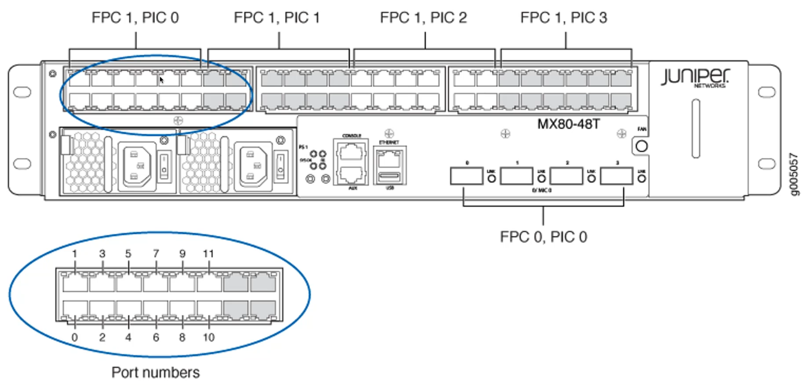
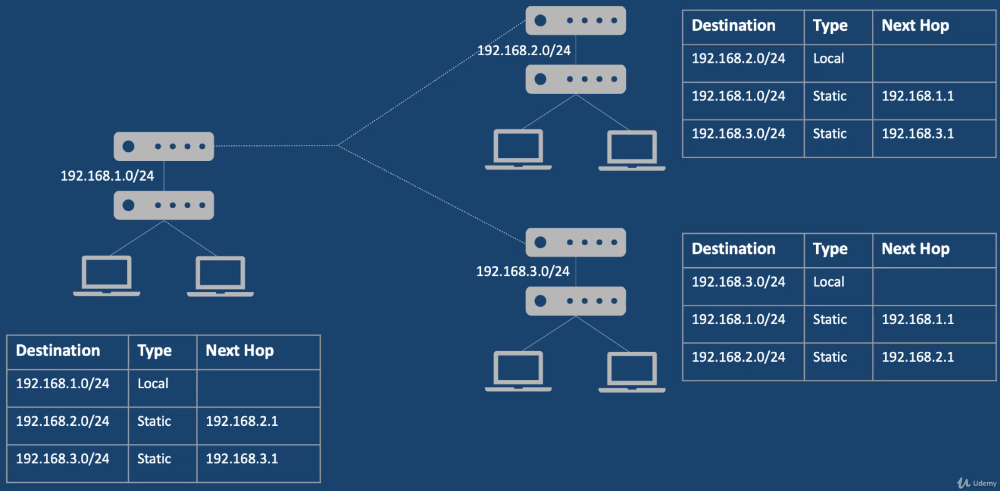
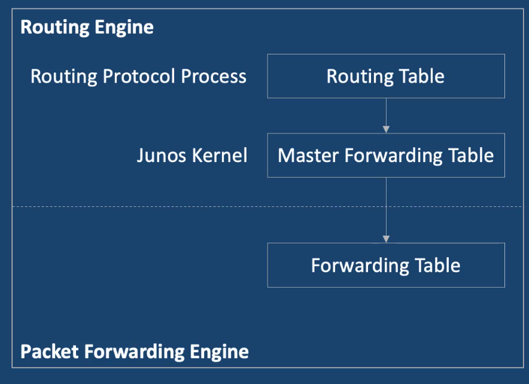

## Juniper JNCIA-Junos JN0-105
- Instructor: S2 Academy

## Section 1: Networking Basics

### 1. Introduction
- For JNCIA-Junos JNO-105
  - JNCIS - specialist level
  - JNCIP - professional level
  - JNCIE - expert level
- Certification is valid for three years
- Hands-on lab
  - Buy a physical juniper appliance
  - Or cloud instance  
    - SRX image
  - https://www.juniper.net/us/en/dm/vjunos-labs.html

### 2. OSI Model
- Open systems Interconnection
- 7 Layers
- Purely logical concept: layers do not directly represent physical elements
  - Application layer
    - Interface b/w applications and underlying network
    - Protocols of DNS, HTTP, FTP
  - Presentation layer
    - Formatting the data from the lower layers into well-known formats like jpeg, mpeg
  - Session layer
    - Responsible for establishing and controlling sessions b/w the sender and receiver
    - Responsible for synchronizing the session using sequence numbers
    - Protocols include NetBIOS, SOCKS, and NFS
  - Transport layer
    - Packets are transformed into segments
    - Responsible for providing a transport protocol like TCP or UDP
    - Responsible for process separation
  - Network layer
    - Frames are transformed into packets
    - Responsible for logical addressing of devices - IP addresses
    - Responsible for routing packets
    - Protocols of IPv4, IPv6, ICMP, IPsec
  - Data Link layer
    - Bits are transformed into frames
    - Responsible for communication over the LAN or the same network
    - Responosible for MAC address
    - Flow control and error control
  - Physical layer
    - Form of bits: zeros and ones
    - 3 types of communication
      - Simplex: one way like broadcasting
      - Half duplex: two ways but only send or receive at a time
      - Full duplex: two ways of send/receive

### 3. TCP/IP vs OSI model
- Divides network communication into four layers
  - by DoD
  - Application layer
  - Transport layer
  - Internet layer
  - Network access layer

### 4. Collision Domains, Broadcast Domains, and VLANs
- A collision domain refers to how many devices can send data at the same time
  - Need to minimize collision domain
  - A hub is a single collision domain: only one device can send data
  - A switch is a multiple collisions domain: all connected devices can send data at the same time
    - Each port is its own collision domain
  - A router: all connected devices can transmit at the same time
    - Each port is its own collision domain
- Broadcast domain is a logical division of network, in which all nodes can reach each other by broadcast
  - Broadcast never crosses LAN
  - On a hub, a broadcast reaches all devices
  - On a switch, a broadcast reaches all devices
  - On a router, a broad cast is confied to the connected port
    - Each port of a router might be a different LAN
- Broadcast may abuse the switch resources
  - How to manage efficiently? VLAN
- VLAN
  - A logical separation of devices on the same LAN
  - It allows you to divide a LAN segment into multiple logical LANs (Virtual LANs)
  - Each VLAN is a different broadcast domain
  - A single switch may be dividied into multiple VLANs, providing different broadcast domains
  - By default, VLANs do not talk to each other
  - A layer 3 device (router) is required route traffic b/w VLANs
  - Each VLAN is idenitified by a unique IEEE 802.1Q ID (aka tag)

### 5. Routers, switches, and other network devices
- Repeater
  - Layer 1 device, repeating signals
  - Receives a signal and trasmits it
- Hub
  - Layer 1 device that operates in half duplex mode
  - No intelligence 
  - Not good for security
- Bridge
  - Layer 2 device that learns MAC addresses
  - Uses a CAM table to store port and MAC address information
    - When a frame is received for the first time, the source port and MAC address is added to the CAM table
  - Frame forwarding is software-based
- Switch
  - Layer 2 device similar to bridge - learns MAC addresses
  - Specialized chips are used for frame forwarding, resulting in better performance
  - Supports VLANs
- Router
  - Layer 3 device that routes packets b/w different networks
  - Uses routing tables to make routing decisions

### 6. Layer 2 Addressing
- Device addressing
  - MAC address - layer 2 address
  - IP address - layer 3 address
- Devices need both addresses to reach a destination
  - MAC address identifies a device on the local network
  - IP address identifies a device outside the local network
- MAC Address
  - A 48-bit address that is burned on the network interface
  - Represented as 6 grups of 2 hexadecimal digits, separated by colons
    - Each hexadecimal character is represented by four bits, yielding a 4*6*2 = 48-bit address
  - The first three groups are together known as the Organization Unit Identifier (OUI)
    - Identifies the manufacturer
- Broadcast MAC address
  - FF:FF:FF:FF:FF:FF
  - Will reach all hoss on the same network

### 7. Introduction to IPv4
- 32-bit logical address assigned to a network device
- Four of 8 binary bits (octet)
- Class A: 0.0.0.0 to 127.255.255.255
- Class B: 128.0.0.0 to 191.255.255.255
- Class C: 192.0.0.0 to 223.255.255.255
- Class D: 224.0.0.0 to 239.255.255.255
  - Reserved for multicast purposes
- Class E: 240.0.0.0 to 255.255.255.255
  - Reserved for experimental purposes
- RFC 1918 Addresses
  - Private IP addresses
  - A block of IP addresses in each class A, B, and C
    - Class A: 10.0.0.0 to 255.255.255 (10.0.0.0/8)
    - Class B: 172.16.0.0 to 173.31.255.255 (172.16.0.0/12)
    - Class C: 192.168.0.0 to 192.168.255.255 (192.168.0.0./16)
  - Nobody owns these addresses
  - Allows organizations to use these private addresses for internal addressing
- Loopback address
  - The entire 127.0.0.0/8 address block is reserved
  - Common address is 127.0.0.1
    - Also known as localhost (itself)

### 8. Decimal to Binary Conversion

### 9. Subnet Mask and its importance
- What is subnet mask?
  - Consider 192.168.1.0/24
  - Every IP address has two parts - network portion and host portion
  - Every IP address is accompanied by a subnet mask
  - Two ways to denote a subnet mask
    - 10.0.0.0/8
    - 10.0.0.0/255.0.0.0
  - When the subnet mask is converted to binary, the 1's denote the network portion while 0's denote the host portion
    - 10.0.0.0/255.0.0.0
    - Decimal: 255.0.0.0
    - Binary: 11111111.00000000.0000000.000000
- Default subnet mask
  - Class A has a default subnet mask of /8
    - Ex: 122.0.0.0/8
  - Class B has a default subnet mask of /16
    - Ex: 172.16.0.0/16
  - Class C has a default subnet mask of /24
    - Ex: 192.168.10.0/24
- Total number of Hosts
  - Total number of possible host IP addresses on a network = 2^H
  - H represents the number of host bits (zeros) in a subnet mask
  - In a single subnet, The first address is the network address and the last address is the broadcast address of the network
    - Ex: 19.168.1.0/24
    - First address (network address): 192.168.1.0
    - Last address (broadcast address): 192.168.1.255
    - The first and the last addresses are not usable
  - Total number of usable IP addresses = 2^H - 2
- why do we need subnetting?
  - Breaks a large network into manageable pieces
  - /24: 254 clients
  - /30: 2 clients only

### 10. Subnetting Example 1
- Steps for subnetting
  - Convert the subnet mask into binary format
  - Determine the number of host bits to be borrowed
  - Determine the increment
  - Add increment to get the new subnets
- Ex: Divide 192.168.1.0/24 into 5 networks
  - Decimal:/24 - 255.255.255.0
  - Binary: 11111111.1111111.1111111.00000000
  - 2^X >= required number of subnets
    - 2^X >=5: X=3, number of bits to borrow = 3
  - New subnet mask is /24+3 = /27
    - 11111111.1111111.1111111.11100000
    - /27 = 255.255.255.224
    - Increment is the power of 2 corresponding to the least significant bit
      - /27 => 11111111.1111111.1111111.11100000
      - The last 1 is at 32 -> increment
    - Add increment to get new subnets
      - 162.168.1.0
      - 162.168.1.32
      - 162.168.1.64
      - 162.168.1.96
      - 162.168.1.128
      - 162.168.1.160
      - 192.168.1.192
      - 192.168.1.224
      - All these networks have a subnet of /27

### 11. Subnetting Example 2
- Divide 172.10.0.0/16 into 10 subnets
  - Decimal: /16 - 255.255.0.0
  - Binary: 11111111.11111111.0000000.00000000
  - 2^X >= 10, X= 4, number of bits to borrow = 4
  - Now the new subnet mask is /16+4 = /20
  - /20 = 11111111.11111111.11110000.00000000
    - /20 = 255.255.240.0
  - The last 1 is at 16 
    - Increment is 16
  - Add increment to get new subnets
    - 172.10.0.0
    - 172.10.16.0
    - 172.10.32.0
    - ...
    - 172.10.224.0
    - 172.10.240.0
    - All these networks have a subnet mask of /20

### 12. Subnetting Example 3
- Divide 124.0.0.0/8 such that each network has 500 hosts
  - Decimal:/8 - 255.0.0.0
  - Binary: 11111111.00000000.00000000.00000000
  - Determine the number of host bits to be fixed
    - 2^X >= required number of hosts + 2, X = 9
  - After fixing 9 host bits, remaining network bits are 23
  - 11111111.11111111.11111110.00000000 => /23
  - The last 1is at 2 of 3rd group
  - New subnets
    - 124.0.0.0
    - 124.0.2.0
    - 124.0.4.0
    - ...
    - 124.0.254.0
    - 124.1.0.0
    - 124.1.2.0
    - ...
    - 124.254.254.0
    - Total usable hosts per subnet = 2^H - 2 = 2^9 - 2 = 512 - 2 = 510

### 13. Subnetting Example 4
- Which subnet does 200.1.1.10/29 belong to?
  - /29 - 255.255.255.248, 11111111.11111111.11111111.11111000
  - Increment is 8
  - New subnets
    - 200.1.1.0
    - 200.1.1.8 <- this subnet owns 200.1.1.10
    - 200.1.1.16
    - ...
    - 200.1.1.248
- Network address of 200.1.1.10/29 is 200.1.1.8
- Broadcast address of 200.1.1.10/29 is 200.1.1.15

### 14. Supernetting
- Allows you to represent smaller networks as a single larger network
- Ex:
  - 10.4.0.0/16
  - 10.5.0.0/16
  - 10.6.0.0/16
  - 10.7.0.0/16
  - Convert the subnetted networks into binary format
  - Find the common bits
    - 00001010.00000100.00000000.00000000
    - 00001010.00000101.00000000.00000000
    - 00001010.00000110.00000000.00000000
    - 00001010.00000111.00000000.00000000
    - ^^^^^^^^^^^^^^^ are common bits
      - supernet address = 10.4.0.0
  - Set the common bits to 1's and others zero
    - 11111111.11111100.00000000.00000000
    - This is the new supernet mask
    - Supernet is 10.4.0.0/14
- Why supernet?
  - Helps with route summarization
  - Reduces the size of routing tables and routing updates

### 15. IPv6
- Successor of IPv4
- 128 bits length
  - 2^128 possible addresses
- IPv4 has 3 types of communication: unicast, multicast, broadcast
- IPv6 introduces Anycast
- Unicast: a single source to a single destination
- Multicast: a single source to multiple destinations
- Anycast: to the nearest node in the group
- Broadcast has been removed from IPv6
- IPv6 provides stateless address auto configuration
  - Can generate a unique address that can be used to communicate over the network
- IPv6 is not compatible with IPv4
  - Dual stack and tunneling
- IPv6 address format
  - 128 bits
  - 8 groups of hexadecimal format
- Rule
  - Leading zeroes in a group can be discarded
    - Ex: 2001:0db8:0000:0c3a:48b5:0000:0001:9177 == 2001:db8:0:c3a:48b5:0:1:9177
  - Any group of two or more zeroes can be replaced with :: but only once
    - Ex: 2001:0000:0000:0000:48b5:0000:0000:9177 == 2001:0:0:0:48b5:0:0:9177 == 2001::48b5:0:0:9177 == 2001:0:0:0:48b5::9177
- IPv6 addresses
  - Unpspecified: used when a computer boots up and has no address assigned. This address might be used before a computer gets an IP from DHCP
    - Denoted by ::/128
    - Equivalent to 0.0.0.0 in IPv4
  - Loopback: ::1/128
    - Equivalent to 127.0.0.1 in IPv4
  - Link local: assigned by the computer to itself from the FE80::/10 range
    - Unique on the subnet
    - Helps the host with automatic address configuration when static/DHCP address is not available
    - Similar to APIPA (Automatic Private IP Address) in IPv4
    - Used for communicating over LAN, not crossing them
  - Unique local: Communicating inside the LAN
    - Similar to RFC 1918 addresses in IPv4
    - Cannot be routed over the internet
    - Range is FC00::/7
  - Global unicast: Public address that can be routed over the internet
    - 2000::/3 to 3FFF::/3
  - Multicast: FF00::/8
    - Similar to 224.0.0.0/4 in IPv4
    - Cannot be used as the source address
- IPv6 subnetting
  - Routing prefix: 48 bits, network address. This is assigned by the internet service provider
  - Subnet: 16 bits
    - Total number of possible subnets for every routing prefix is 2^16
  - Interface ID: 64 bits, host bits
    - For every subnet, total number of hosts will be 2^64

### 16. Class of Service
- Delay is the amount of time it takes for a packet to reach from source to destination
- Jitter is defined as a variation in the delay of received packets and is generally caused by congestion in the IP network
- Class of Service
  - Provides differentiated services when best effort delivery is insufficient
  - With CoS, you can configure classes of service for different applications
  - Assign service levels with different delay, jitter, and packet loss characteristics
  - Implementd using 6bits in the IPv4 and IPv6 headers

### 17. Conneciton-oriented vs Connectionless protocols
- Connection oriented protocols
  - Requires a connection to be established before exchanging data
  - Ex: TCP
    - TCP uses 3-way handshake to establish a connection
    - TCP has features such as: ordered data transfer, retransmission of lost packets, flow control
- Connectionless protocols  
  - Data can be exchanged without setting up a connection
  - Ex: UDP
    - Has a lower overhead
    - Could have loss of data, errors, duplication, out-of-sequence delivery
    - Suitable for broadcasting

### 18. Slides used in ths course
- https://bit.ly/jncia-slides

## Section 2: Junos Fundamentals

### 19. Junos Software Architecture
- Junos kernel is based on FreeBSD Unix
- Junos functionality is compartmentalized into mulitple software processes
- Each process handles a portion of the device's functionality and runs in its own protected memory space
  - When a single process fails, it doesn't affect the entire process
- Control plane - Forwarding plane
  - Connected through internal link

### 20. Routing engine and packet forwarding engine (Control and forwarding planes)
- Routing engine
  - Brain of the device, responsible for performing protocol updates and system management
  - Based on x86 or PowerPC 
  - Maintains routing tables, bridging table, and primary forwarding table
  - Controls the interfaces, chassis components, system management, and access to the device
  - CLI and J-web GUI
  - Creates and maintains one or more routing tables. This is used to create the Forwarding Table that contains the active routes
- Packet Forwarding Engine
  - Usuallay runs on separat HW
    - Can be fault-tolerant
  - Responsible for forwarding transit traffic through the device
  - Receives a copy of the Forwarding Table (FT) from the RE using an internal link
  - Usually runs on separate HW, and in some cases uses Application Specific Integrated Circuits (ASICs) for increased performance
  - Also implements services such as rate limiting, stateless firewall filters, and Class of Service (CoS)

### 21. Protocol Daemons
- Each process that runs in its own protected memory space is known as a daemon
- Protocol Daemons
  - Routing protocol daemon (rpd)
  - Device Control Daemon (dcd)
  - Management Daemon (mgd)
  - Alarm Daemon (alarmd)
  - System Log Daemon (syslogd)
  - On the device, run `show system processes`

### 22. Transit and Exception Traffic
- Transit traffic
  - Traffic that enters and ingress port, is compared agains the forwarding table, and is finally forwarded out an egress port is called transit traffic
  - For the traffic to be forwarded, the forwarding table must have an entry for the destination
  - Transit traffic is handled only by the forwarding plane
  - Can be unicast or multicast
- Exception traffic
  - Exception traffic does not pass through the local device but requires special handling
  - Terminated by Junos device
  - Ex:
    - Packets addressed to the chassis, such as routing protocol updates, SSH sessions, ping, traceroute
    - TCP/IP packets with the IP options field
  - All exception traffic destined for the RE is sent over the internal link that connects the control and forwarding planes
  - Traffic traversing the internal link is rate limited to protect the RE from denial-of-service (Dos) attacks
  - This rate limiter is not configurable

## Section 3: User Interfaces

### 23. CLI Functionality
- Ways to access CLI
  - Out-of-band: using serial console port or management port
    - Use putty, 9600bit/s, 8 bits Parity None, 1 stop bits, Flow control Hardware
      - MobaXterm has the feature of serial connection
      - Will need a management cable - Ex: 5FT USB Console Cable Compatible for Cisco Juniper Router Switch FT232RL Chip USB to RS232 RJ45 Console Serial Cable for Windows 8, 7, Vista, Mac, Linux (5FT) 
  - In-band: using telent or SSH
- Root user vs non-root user
  - Root account provides full administrative access to the device and is referred to as superuser
    - On a new device, root account has no password
    - Root account cannot be deleted
    - On login, shell mode
  - Non-root user
    - By default, there is no pre-exising non-root user
    - On login, operational mode
- Key features of CLI
  - Consistent command names
  - Question mark for completion
    - Junos responds with possible commands
  - Tab and space completion of commands
  - UNIX style utilities and keyboard sequences

### 24. CLI Modes
- Shell mode
  - Prompt ends with `%`
  - directly available when you login as root
  - Non-root user can start with `shell` command
- Operational mode: prompt ends with `>`
  - Run `cli` from shell mode
- Configuration mode: prompt ends with `#`
  - Run `configure` or `edit` from operational mode

### 25. CLI Navigation
- Question mark
  - `?`: shows all commands
  - `show ?`
  - `show interface ?`: shows command options related with interface command
- Spacebar completion
  - Can complete command/options/system defined variables
- Tab completion
  - Can complete user defined variables
- Keyboard shortcut
  - ctrl + a: moves to the beginning
  - ctrl + e: moves to he end
  - ctrl + w: erases word to the left
  - ctrl + u: erases entire line

### 26. CLI Help
- `help topic`: shows usage guidelines for the statement 
- `help reference`: shows summary information about the statement
- `help apropos`: lists all commands and help text that contains a particular string
- `help syslog`: shows information about system log messages
- `help tip cli`: shows a tip about using the CLI

### 27. Output Levels
- Terse: displays the least amount of information, as a list
- Brief: additional information about each element
- Detail: most of information about each element
- Extensive: all of information about each element
- Demo:
  - `show interfaces terse`
  - `show interfaces fe-0/0/* brief`
  - `show interfaces fe-0/0/* detail`

### 28. Filtering Output
- Keywords:
  - compare
  - count
  - display
  - except
  - find
  - last
  - match
  - no-more
  - save
- Demo
  - `show interfaces terse | count`
  - `show | compare old_config.txt`
  - `show | display set | except screen`
  - `show | display set | find polices`
  - `show | display set | match polices`

### 29. Active vs Candidate Configuration
- Active configuration
  - Currently active
  - Loaded when rebooted
- Candidate configuration
  - In configuration mode, a copy of the active config is created, as a candidate configuration
  - When the candidate configuration is committed, it becomes the active configuration

### 30. Configure Command
- Common command
  - `configure`
  - `configure exclusive`
  - `configure private`
- Shared configuration
  - Accessed using the `configure` command
  - Multiple users can be in the configuration mode at the same time
  - If other users are editing the configuration, you'll see a warning message
  - When config is committed, changes by all users are committed
- `show system users` shows the current users
- `request system logut user AAA` will kick off the user AAA
- Exclusive configuration
  - `configure exclusive`
  - Only one user is allowed
- Private configuration
  - `configure private`
  - Multiple users can enter the private configuration mode, and each user has a private candidate config to edit
  - When committed, only changes made by the private user will be saved
    - If there are conflicts, the first commit takes the precedence

### 31. More Navigation Commands
- `edit`
- `up`
- `top`
- `exit configuration-mode`

### 32. Configuration Hierarchy
- Configure from:
  - Top of the configuration hierarchy
  - Item specific configuration hierarchy
    - Reduces the length of commands
    - Only commands specific to the hierarchy are shown
    - Output is reduced to only items under hierarchy
```
% cli
> configure
set ?
[edit] 
set security policies from-zone trust to-zone untrust policy criteria
[edit] 
set security policies from-zone trust to-zone untrust policy PERMIT-ALL ?
[edit]
edit security policies from-zone trust to-zone untrust policy ALLOW-ALL
[edit security policies from-zone trust to-zone untrust policy ALLOW-ALL]
set match source-address any
[edit security policies from-zone trust to-zone untrust policy ALLOW-ALL]
show # this will show the reduced items only as we moved to the specific hierarchy
```

### 33. Junos Commit
- `commit` command saves the candidate configuration as the active configuration
- Before committing, Junos performs a commit check to look for syntax errors
- To manually run a check, use `commit check`
- `show | compare` to view changes
- `commit at` to schedule
- `clear system commit` to clear pending commit operations
- `commit confirmed` to commit changes and then require confirmation before making changes permanent
- `commit and-quit` to commit changes and return to operational mode
- `commit comment "Interface  XXXX changed"` to leave comment
- `commit | display ?`
- `show system commit` to display the history of commit

### 34. Junos Rollback
- Store up to 50 committed version of the configuration
  - Rollback versions range from 0 to 49
- `rollback 0` is the most recent configuration - the active configuration
- `rollback 0` can be used to discard the candidate configuration and return to active configuration
- After rollback, follow it up with `commit` command

### 35. Junos Configuration Files
- `save __file_name__`: files are saved to /var/home/username folder
- `show configuration | compare __file_name__`   to compare active config with a configuration file
- `file checksum md5 myfile`: prints hash value 

### 36. Junos Load Command
- `load override`
  - Discards the current candidate config and loads config from the file
- `load merge`
  - Merges the config from the saved file with the existing candidate config
  - For any conflicting contents, the saved config file will override them
- `load replace`
  - Looks for the `replace:` tags in the loaded file, and replaces parts of the candidate config with whatever is specified after the tag
  - Loaded file must include `replace:` tags
  - Useful when detailed control is required
- `load set`
  - Loads a config file that contains `set` commands
  - Executes the configuration instructions line by line as they are stored in the file
  - Instruction can contain any configuration mode command such as `edit`, `exit`, and `top`
- `load patch`
  - On a device, `type show | compare` shows differences
  - Then use `load patch` to load the differences on another device

### 37. J-Web
- GUI for Junos device
- Using http or https
- J-Web is provided by the Routing Engine
```bash
# show system services web-management
# edit system services web-management
[edit system services web-management]
# set ?
// Can choose http or https
# set session ?
```

## Section 4: Configuration Basics

### 38. Factory-default Configuration
- root account has no passwd
- System logging features
  - `show system syslog`
- Default hostname is Amnesiac
- `load factory-default` will revert to factory-default configuration

### 39. Initial Configuration
- How to set date
  - In operation mode, `set date ?`
- Enter configuration mode using `edit` command
  - How to set root authentication
    - `set system root-authentication plain-text-password`
  - How to set up SSH/telnet access
    - `edit system services`
    - `set ssh ?`
    - `set ssh root-login ?`
    - `set ssh protocol-version ?`
  - How to set hostname
    - `set host-name ?`
  - How to set domain-name
    - `set domain-name ?`
  - How to set name-servers
    - `set name-server ?`
    - `set name-server 0.0.0.0` will append to the current list of the name-servers
      - To delete an existing name-server, `delete name-server x.x.x.x`
  - How to set time-zone
    - `set time-zone ?`
  - How to set login-message
    - `set system login message ?`
    - `set system login message "Welcome to XXXX"`
  - How to set CLI timeout limit
    - `set cli idle-timeout 10`: 10 min

### 40. Login Classes
- A set of one or more permissions
- All users must have a login class
- Allows:
  - Access privileges on the device
  - Commands that users can or cannot specify
  - Session idle time
- Pre-defined login classes
  - Super-user: all permissions
  - Operator: clear, network, reset, trace, and view permissions
  - read-only: view permissions
  - unauthorized: no permissions  
```
> edit
# set system login user ?
# set system login user admin class ?
# set class my-class ?
```
- Create a login class that:
  - Name is Vendors
  - Allows login from 9am-5pm
  - Allows login from Mon-Fri only
  - Denies any request command
  - Allows interface configuration
```
# edit system login
# edit class Vendors
# set access-start 09:00
# set access-end 17:00
# set allowed-days [monday tuesday wendesday thursday friday]
# set allow-commands ping
# set deny-commands request
# set permissions interface-control
# show
## At this moment, edit mode cannot be executed. So add configure permissions
# set permissions configure
```

### 41. User Accounts
- Provides a way for users to access the Junos device
- Each user has a home folder on the device: /var/home/username
- Users can access the device without accounts if RADIUS or TACACS+ servers have been configured
- For every user account, define followings:
  - User name
  - User identifier
  - Full name
  - Login class
  - Authentication method
```
> configure
# set ?
# set user ?
# set user NewAdmin ?
# set user NewAdmin class ?
# set user NewAdmin class super-user ?
# set user NewAdmin class super-user authentication ?
# set user NewAdmin class super-user authentication plain-text-password
## Enter passwd here
# top commit
# show
```

### 42. Authentication methods
- Junos supports 3 authentication methods
  - When there are a few devices
    - Local password
  - Distributed client and server systems. The client runs on the Junos device while server runs on a remote host
    - Remote Authentication Dial-In User Service (RADIUS)
    - Terminal Acces Controller Access Control System Plus (TACACS+)
- Authentical methods
  - For each login attempt, Junos tries the authentication method in order, until the password is accepted
  - If the previous authentication method fails to reply or if the method rejects the login attemp, the next method is tried
```
# show system authentication-order
authentication-order [radius tacplus password];
```
  - In this example, if RADIUS fails then TACACS+ will be tried. Then Local password if TACACS+ fails
```
# show system authentication-order
authentication-order [radius tacplus];
```
  - When RADIUS fails, TACACS+ will be tried. Local password will not be tried
  - If servers of RADIUS/TACACS+ are down, then local password will be tried as a fall-back

### 43. Introduction to Interfaces
- Primarily used to connect a device to a network
- Some interfaces are also used to provide a service or a specific function for the system
- Interfaces may be physical or logical
- Types of interfaces
  - Management interface
    - Dedicated interface used to connect the Junos device to a management network
    - Common designations include fxp0 and me0
      - Not concole port
  - Internal Interface
    - Provides communication b/w the Routing Engine and the Packet Forwarding Engine
    - Automatically configured when the device boots
    - Common designations include fxp1 and em0
  - Network Interface
    - Provides physical connections to other devices
    - Exapmles include Ethernet, SONET, Asynchronous-Transfer Mode (ATM), T1, and DS3
  - Service Interface
    - Provides one or mokre traffic manipulating services such as encapsulation, encryption, tunneling, and link services
    - es: Encryption Interface
    - gr: Generic Routing Encapsulation (GRE) interface
    - ip: IP-over-IP encapsulation (IP-IP tunnel) interface
    - lsq: link services queuing interface
    - st: secure tunnel interface
    - tap: internally generated interface to monitor and record traffic during passive monitoring
  - Loopback Interface
    - Traffic sent to the loopback interface is addressed to the same device
    - Uses the lo0 designation on all platforms
    - Used to identify the device and is the preferred method to determine if the device is online

### 44. Interface Naming Convention
- Junos uses a standard naming convention
- Most interfaces are named as type - `fpc/pic/port`
  - fpc: flexible PIC concentrator - line card slot number
  - pic: physical interface card - interface card slot number
  - port: port number
- Ex:
  - `ge-1/0/1`: Gigabit Ethernet, fpc-1, pic-0, port-1

- Some exceptions in naming conventions
  - lo0: loopback interface
  - ae: aggregated Ethernet Interface
  - as: aggregated SONET interface
  - vlan: VLAN interface

### 45. Interface Properties
- Physical properties
  - Mode: half-duplex or full duplex
  - Speed: link speed
  - MTU: maximum transmission unit, varies from 256 to 9192 bytes
  - Clock: interface clock sources, either internal or external
  - Frame Check Sequence (FCS): error detection scheme
  - Encapsulation: types include PPP, Frame Relay, PPPoE
- Logical properties
  - Protocol family: inet, inet6, iso, mpls, ethernet-switching
  - Address: IP address for inet family
  - VLAN tagging
  - Firewall filters or routing policies
- Configuration Hierarchy
```
interfaces {
  interface-name {
    physical-properties :
    [..]
    unit unit-number {
      logical-properties :
      [..]
    }
  }
}
```
- Demo:
```
% cli
> edit
# edit interfaces ge-0/0/0
# edit unit 0
[edit interfaces ge-0/0/0 unit 0]
```

### 46. Interface Address Configuration
- Demo
```
% cli
> edit 
# edit interface ge-0/0/0
[edit interface ge-0/0/0]
# edit unit 0
[edit interface ge-0/0/0 edit unit 0]
# edit family inet
[edit interface ge-0/0/0 edit unit 0 family inet]
# set address ?
# set address 10.1.1.1/24
# set address 10.1.1.2/24
# show
address 10.1.1.1/24;
address 10.1.1.2/24;
```
- Multiple address
  - Junos devices can have more than one IP address on logical interface
  - Issuing a second `set` command does not over-write the previous address
  - To change an existing address use `rename` or `delete`
- Preferred address 
  - Used when you have multiple IP addresses belonging to the same subnet on the same interface
  - Allows you to select which address will be used as the source address for packets sent to hosts on the directly connected subnet
  - By default, this is the numerically lowest address
- Primary address
  - Used as the source address for broadcast and multicast packets
  - By default, this is the numerically lowest address
- Multiple Protocol Families

### 47. Configuration Groups
- Common configuration snippets that can be applied to other parts of the configuration
- Creates a group containing configuration statements and apply that to the rest of the configuration
- Ideal for grouping statements that are repeated in many places in the configuration
```
# cli
> edit
# show interfaces ge-0/0/1
# set interfaces ge-0/0/1 unit 1 bandwidth ?
# edit groups MyBW-config interfaces ge-0/0/1 unit <*> 
[edit groups MyBW-config interfaces ge-0/0/1 unit <*> ]
# set bandwidth 100
# show
# top
# show groups MyBW-config
# set interfaces ge-0/0/1 apply-groups MyBW-config
# show interfaces ge-0/0/1 | display inheritance
# show interfaces ge-0/0/1 | display inheritance no-comments
- show groups junos-defaults # pre-defined groups
```

### 48. Introduction to System Logging
- Syslog
  - Used to record system-wide, high-lvel operations, such as interfaces going up or down, or users logging in to or out of the device
  - Logs are placed in files that are stored in the /var/log folder
  - The primary syslog file, which is included in all factory default configurations is the /var/log/messages file
  - Each system log message belongs to a `facility`
  - A facility is a group of messages that are either generated by the same SW process or concern a similar activity (such as authentication attempts)
  - Each message is also assigned a severity level that indicates how seriously the triggering event affects the device functions

| Facility | Type of event or error |
|----------|------------------------|
| any      | All messages from all facilities|
| authorization| Authentication and authorization attempts|
| change-log | Changes to the Junos configuration|
| daemon | Actions performed or errors encountered by ssytem processes|
| firewall | Packet filtering actions performed by a firewall filter|
| interactive-commands | Commands issued at the Junos CLI |
| kernel | Actions performed or errros encountered by the Junos kerenel|
| security| Security related events or errors|
| user | Actions performed or errors encountered by user processes|

| Value | Severity Level | Description |
|-------|----------------|-------------|
| N/A   | none | Dsiables logging of the associated facility|
| 0 | emergency|  System panic or other condition that causes the device to stop functioning|
| 1 | alert | Conditions that require immediate correction, such as a corrupted system database|
| 2 |  critical | Critical conditions |
| 3 | error | Error conditions that have less serious consequences |
| 4 | warning |  Conditions that warrant monitoring |
| 5 | notice | Conditions that are not errors but might warrant special handling |
| 6 | info | Events or non-error conditions of interest |
| 7 | any | Includes all severity levels| 

### 49. Configuring Syslog
- Demo:
```
% cli
> edit
# edit system syslog
[edit system syslog]
# set file cli-commands interactive-commands any
# set file change-log change-log any
# set file security security any
# annotate file cli-commands "/* Logs commands entered */"
# annotate file change-log "/* Logs commands entered */"
# commit
# exit
> show log cli-commands # shows all the command entered
```
- Interpreting Syslog Entries
  - Timestamp: indciates when the message was logged
  - Name: configured system name
  - Process name or PID: name or ID of the process that generated the log entry
  - Message code: identifies nature and purpose of the message
  - Message text: provides additional information related to the message code
- Priority is not printed by default
  - Use `explicit-priority` statement
- Demo:
```
> clear log cli-commands
> edit
# edit system syslog
# set file cli-commands explicit-priority
# commit
# run show log cli-commands
```
- Archival
  - When a log file called `logfile`1 is archived, the file is closed, compressed, and its name is changed to `logfile.0.gz`
  - Logs are then written to a new file called logfile
  - Can be configured for all files or individual files
```
[edit system syslog]
# set archive ?
# set file cli-commands archive archive-sites ?
# file delete /var/log/cli-commands
# clear log change-log
```

### 50. Tracing
- Tracing allows you to track events that occur in the device - both normal operations and error conditions
  - Actually Debug
- When enabled, a trace file is created, storing decoded protocol information received or sent by the routing engine
  - /var/log folder or a remote syslog server
- Tracing is expensive. Use only when necessary
```
# cli
> edit
[edit]
# set security policies traceoptions ?
# set security policies traceoptions file mypolicy.txt files 3
# set security policies traceoptions flag all
# commit
# exit
> show log mypolicy.txt
> edit
# set interfaces traceoptions ?
# set interfaces ge-0/0/1 traceoptions ? # cannot specify file name for an interface
# set interfaces traceoptions file interfaces.txt size 10K
# set interfaces traceoptions flag all
# commit
# set security net ?
# exit
> show log interface.txt
> monitor start messages
> monitor start interface.txt
monitor list
monitor stop
>
> edit
# set system tracing destination-override syslog host ?
# delete security policies traceoptions
# delete interfaces traceoptions
# commit
# exit
> file delete ?
> file list
```

### 51. Network Time Protocol
- To synchrnoize the clocks of routers and other HW devices on the internet
- Debugging and troubleshooting will be much easier
- Junos devices can be configured to act as an NTP client, a secondary NTP server, or a primary NTP server
  - Primary NTP server
  - Secondary NTP server
  - NTP client
- NTP modes
  - Broadcast
  - Client/server mode
  - Symmetric active (peer) mode
  - When an NTP client drifts by more than 128 milliseconds, it tries to synchronize with the server
  - To manually synchronize, use command `ntp`
- NTP boot server vs NTP server
  - When NTP boot server is configured, the device will sync with the boot server whenever it reboots
  - When an NTP server is configured, the device is syncronizing with the NTP server periodically
```
% cli
> edit
# set ?
# set server ?
# set servert pool.ntp.org
# commit
# exit
> show system uptime
> show ntp associations
> show ntp status
```

### 52. SNMP
- Simple Network Management Protocol
  - Eanbles the monitoring of network devices from a central location
  - Requires
    - SNMP agent
    - Network Management System (NMS)
- SNMP agent
  - Exchanges network management information with SNMP manager SW runnong on an NMS
  - Responds to requests for information and actions from the manager
- NMS
  - Collects information about network connectivity, activity, and events by polling managed devices
- Junos SNMP versions
  - SNMPv1
  - SNMPv2c: added support for community strings
  - SNMPv3: provides data integrity, data origin authentication, message replay protection and protection against disclosure of message payload
- Management Information Base
  - SNMP data is stored in a highly structured, hierarchical format
  - Based on a TREE structure
  - Each object in MIB is associated with an object identifier (OID)
  - MIBs are either standard or enterprise-specific
- SNMP communication
  - Get, GetBulk, and GetNext requests: manager requests information from the agent, the agent returns information in a Get response message
  - Set requests: manager changes the value of an MIB object controlled by th agent; the agent indicates status in a Set response message
  - Trap notification: agent sends traps to notifiy the manager of significant events that occur on the device
- SNMP Traps and Informs
  - Junos devices can send notification to SNMP managers when significant events occur on a network device, most often errors or failures
  - SNMP notifications can be sent as traps or inform requests
  - SNMP traps are unconfirmed notifications
  - SNMP informs are confiremd notifications
```
> show snmp mib ?
> show snmp mib walk jnxMibs # root Juniper OID
> show snmp mib walk 1 # OID/OI names of objects
> edit
# edit snmp
[edit snmp]
# set name "My Junos"
# set contact "Miku - xxx xxx x123"
# set community myJunos authorization read-only
# set community myJunos clients 10.0.10.100
# commit
```
- From a Linux client
```
# snmpwalk -v 2c -c myJunos xx.xx.xx.xx
```

### 53. Rescue Config
- User-defined, known-good configuration that is designed to restore connectivity in the event of configuration problems
- If the active configuration is corrupted, the device automatically loads the rescue configuration file as the active configuration
- Rescue configuraiton
  - Recommended to include the minimum elements necessary to restore network connectivity
  - Use `request system configuration rescue save` to save a rescue config
```
# cli
> show system alarms
> request system configuration rescue ?
> request system configuration rescue save  
> show system alarms
> test configuration ?
```

### 54. Backups
- Junos can backup the current configuration using ftp or scp, periodically or after earch commit
- If more than one archive site is specified, the system attempts to transfer the configuration file to the first archive site in the list, moving to the next site only if the transfer fails
- Once the configuraiton file is transferred to the remote storage device, a system log message is generated, confirming success or failure of the transfer
```
# cli
> edit
[edit]
> edit system archival
[edit system archival]
# set configuration ?
# set configuration transfer-on-commit
# set configuration archive-sites ftp://xxx.yy.zz  password 'XXXX'
# show
# commit
# exit
> show log messages | match transfer
```

## Section 5: Operational Monitoring and Maintenance

### 55. System and Chassis Information
- System information
  - show system alarms
  - show system boot-messages
  - show system certificate
  - show system commit
  - show system connection
  - show system information
  - show system login lockout
    - To disable lockout, `clear system login lockout user XXX`
  - show system memory
  - show system processes
    - Options of brief, summary, detail, extensive
  - show system reboot
    - To remove scheduled reboot, `clear system reboot`
  - show system rollback
  - show system statistics
  - show system storage
  - show system uptime
  - show system users
- Chassis information
  - show chassis alarms
  - show chassis environment
  - show chassis hardware
  - show chassis routing-engine

### 56. Interface Monitoring - Stats and errors
- show interfaces
- show interfaces terse : Summary view
- show interfaces detail 
- show interfaces extensive : all possible information
- show interfaces traffic
- show interfaces _interface_name_

### 57. Network Utilities
- telnet
- ssh
- ping 
- traceroute
- ftp

### 58. Junos Naming Convention
- Before release 15.1, package-release-edition
- Starting with release 15.1, prefix-architecture-ABI-release-edition
- Could also be prefix-media-architecture-ABI-release-edition
- Prefix
  - Name of the Junos package
  - Ex: junos-install-srx5600
- Media
  - May not be present
  - Only used when the image is not for use with the `request system software add` command
  - Values include `usb` for images installed from a USB drive or `net` for images installed from the loader prompt
  - Ex: junos-install-media-usb-srx5000-x86-64-17.3R1.9.img.gz
- Architecture
  - Indicates CPU architecture
  - `x86` or `arm`
- ABI: application binary interface
  - Indicates the word length of the CPU architecture
  - `32` or `64`
- Release
  - Includes major/minor release number, release type (R/B?/I), build number, and spin number
  - R for released
  - B for beta-level
  - I for internal
  - S for service release
- Edition
  - Null(empty) or `limited`
  - Null (empty) for standard domestic versions - supports strong encryption capabilities
  - `limited` indicates the versions built for jurisdictions with limits on dataplane encryption
  - FIPS: Federal Information Processing Standards 140-2 environment
  - Starting with Junos 15.1, FIPS is packaged in the domestic version, users can flip b/w a regular image and FIPS image
- Ex: junos-install-srx5600-x86-64-17.3R1.9.tgz
  - Prefix: junos-install-srx5600
  - Architecture: x86
  - ABI: 64
  - Release: 17.3R1.9
    - Major version: 17
    - Minor version: 3
    - R: Released SW
    - Build: 1
    - Spin: 9
  - Edition: domestic (strong encryption)
- Ex: junos-install-media-usb-srx5600-x86-64-17.3R1.9-limited.img.gz
  - Prefix: junos-install-srx5600
  - Media: usb
  - Architecture: x86
  - ABI: 64
  - Release: 17.3R1.9
    - Major version: 17
    - Minor version: 3
    - R: Released SW
    - Build: 1
    - Spin: 9
  - Edition: limited (no strong encryption)

### 59. Snapshots
- When upgrade fails, snapshots can be used as a rescue or backup
- When Junos is installed, all stored files except juniper.conf and SSH files are removed
- Creating a snapshot will back up your currrent configuration
  - Returns to the current SW configuration after Junos insallation is complete
- Snapshots
  - `request system snapshot`
  - The snapshot is stored on the internal media or to a USB storage device
  - The snapshot can be used as boot information for Junos
  - Junos recommends that for media redundancy a secondary storage medium should always be attached to the SRX device
```
% cli
> request system snapshot ?
> request system snapshot media usb 
> show system snapshot media usb
> request system reboot media usb
# When reboots, it will use USB media to load image
```

### 60. Upgrading Junos
1. Connect to the console port
2. Backup the active file system using `request system snapshot`
3. Determine the Junos version using `show version` 
4. Donwload the install package from Juniper website
5. Copy the packages to `/var/tmp`
6. Verify the checksum of the package: `file checksum md5 /var/tmp/XXXX`
7. Upgrade using `request system software add /var/tmp/XXXX`
8. Reboot the device
- How to check available storage: `show system storage`
  - `request system storage cleanup dry-run`
- When upgrading, Junos validates the SW package against the current configuration by default
  - This ensures that the device can reboot successfully after the SW package is installed
- Downgrading Junos
  - When upgraded, Junos creates a backup image of th SW that was previously installed 
  - The backup image can be used to downgrade only to the SW release that was installed on the device before the current release  
  - `request system software rollback`

### 61. Unified ISSU
- Unified In-Service Software Upgrade (Unified ISSU) allows you to upgrade yoru device b/w two different Junos releases with no disruption on the control plane and with minimal disruption of traffic
- Only supported on dual Routing Engine platforms
- Graceful Routing Engine Switchover (GRES) and Nonstop Active Routing (NSR) must be enabled to perform Unified ISSU
- To perform Unified ISSU, the master and backup Routing Engine must be running the same SW version
- Unified ISSU eliminates network downtime during SW image upgrades
- Graceful Routing Engine Switchover
  - GRES enables a device with redundant Routing Engines to continue forwarding packets even if one Routing Engine fails
  - Traffic is not interrupted, and device is not rebooted
  - Mastgership switches to the backup Routing Engine if:
    - The master RE kernel stops operating
    - The master RE experiences a SW failure
    - The administrator initiates a manual switchover
  - GRES preserves interface and kernel related information
  - However the control plane is not preserved causing routing to be impacted
  - To preserve routing during a switchover, GRES may be combined with Nonstop Active Routing (NSR)
  - With GRES, the PFE disconnects from the old master RE and reconnects to the new master RE
  - PFE does not reboot and traffic is not disrupted
- Nonstop Active Routing
  - With NSR enabled, the JUnos device saves routing protocol informatin during a switchover
  - This is done by running the routing protocol daemon (rpd) on the backup RE
  - As a result the routing platform does not need to rely on oither routers to restore routing protocol information

### 62. Root Password Recovery
1. Connect using the console port and reboot the device
2. As the system boots, press Spacebar when prompted
3. At the `loader>` prompt, enter the command `boot -s` to boot into a single-user mode
4. Enter `recovery` when prompted
5. At the operational mode prompt, type `configure` to enther configuration mode
6. Use `set system root-authentication plain-text-password` to set the root password
7. Commit and reboot

### 63. Important Commands - clear, file, monitor, ping, telnet, ftp, traceroute
```
% cli
> clear ?
> clear log messages
> clear interfaces statistics ge-0/0/1.0
> file show ?
> file list /var/tmp
> file delete ?
> file copy ?
> file rename ?
> monitor traffic
> monitor interface ge-0/0/1.0 # click 'f' to freeze
> monitor *
> monitor start messages
> monitor list
> monitor stop
> ping xx.xx.yy.zz
> ping xx.xx.yy.zz count 3
> ping xx.xx.yy.zz count 100 rapid # faster ping
> request dhcp client renew ?
> request system licenses ?
> request message ?
> set ?
> show security flow session
```

## Section 6: Routing Fundamentals

### 64. Introduction to Routing

- Manual updating of routing table would be very expensive

### 65. Static vs Dynamic Routing
- Static routing
  - Routing tables are created and updated manually
  - Not fault tolerant
  - Good for small networks but administrative overhead for large networks
- Dynamic routing
  - Routing tables are created and updated by a routing protocol
  - Routing information is automatically shared b/w participating devices
  - Fault tolerant
  - Ex: RIP, OSPF

### 66. Junos Routing
- Routing overview
  - Routing is the transmission of packets from a source to a destination address
  - A routing protocol determines the path by which the packets are forwarded, and shares this information with immediate neighbor devices and other devices in the network
  - It adjuss to changing network conditions
- Junos Routing
  - Junos OS maintains two databases for routing information
    - Routing table: contains all the routing information learned by all routing protocols
    - Forwarding table: contains the routes actually used to forward packets through the router
- Junos Routing Table
  - Used by the routing protocol process to maintain a database of routing information
  - The routing protocols stores statically configured routes, directly connected interface routes, and all routing information learned from all routing protocols
  - The routing protocol process uses this collected routing information to select the `active route` to each destination: this route is used to forward packets
  - By default, Junos maintains 3 routing tables
    - Unicast routing table: stores routing information for all unicast routing protocols - BGP, IS-IS, OSPF, RIP
    - Multicast routing table: stores routing information for all multicast routing protocols - DVMRP, PIM  
    - MPLS routing table: stores MPLS path and label information
  - inet.0: default IPv4 unicast routing table
  - inet.1: IPv4 multicast forwarding cache
  - inet.2: unicast routes for multicast reverse path forwarding (RPF) lookup
  - inet.3: IPv4 MPLS routing table for path information
  - inet6.0: default IPv6 unicast routing table
  - inet6.1: IPv6 multicast forwarding cache
  - mpls.0: for MPLS label switching operations
  - iso.0: used for IS-IS routing
- Junos Forwarding Table
  - All active routes from the routing table are installed into the forwarding table
  - Active routes are used to forward packets to their destinations
  - The Junos kernel maintains a master copy of the forwarding table
  - It copies the forwarding table to the packet forwarding engine, which is responsible for forwarding packets
  - If the routing table is a list of all possible paths a packet can take, the forwarding table is a list of only the best routes to a destination
  - The best route is determined based on the routing protocol being used, but generally the number of hops b/w the source and destination dtermines the best possible route
  


### 67. Routing and Forwarding tables

### 68. Route Preference

### 69. Static Routing - Part 1

### 70. Static Routing - Part 2

### 71. Dynamic Routing

### 72. Longest Route Matching

### 73. Routing Instances
