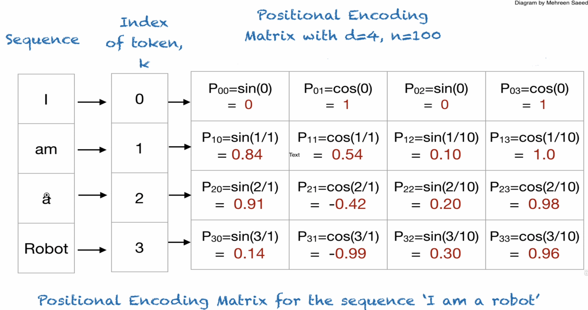
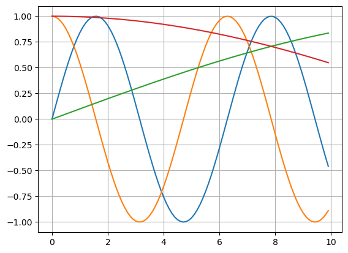

## Mathematics Behind Large Language Models and Transformers
- Instructor: Patrik Szepesi

## Section 1: Course Overview

### 1. What we are going to Cover

## Section 2: Tokenization and Multidimensional Word Embeddings

### 2. Introduction to Tokenization
- Tokenization: producing token ids
  - Classificatino of words
  - Subword tokenization for unknown words
- Embeddings: producing matrix of floating numbers
  - By embedding function
- BERT, DistilBERT for english
- mBERT for multi-language

### 3. Tokenization in Depth
- Input sentence: "I love dogs."
  - Tokenization: ["I", "love", "dogs", "."]
  - Adding speical tokens: ["[CLS]", "I", "love", "dogs", ".", "[SEP]"]
  - Converting to token ids: [ 101, 1045, 2293, 3988, 1012, 102]
  - Padding: [ 101, 1045, 2293, 3988, 1012, 102, 0, 0, 0, ...]
    - If too long, tokens will be truncated
  - Creating attention masks: [ 1,1,1,1,1,1, 0,0, ...]
  - Generating token type ids: [ 0,0,0,0,0,...]
    - Used when multiple sentences exist
- Input sentence: "I love dogs. Dogs are great."
  - Tokenization: ["I", "love", "Dogs", ".", "dogs", "are", "great", "."]
  - Adding speical tokens: ["[CLS]", "I", "love", "dogs", ".", "[SEP]", "Dogs", "are", "great", ".", "[SEP]"]
  - Converting to token ids: [ 101, 1045, 2293, 3988, 1012, 102, 3899, 2024,2307,1012,102]
  - Padding: [ 101, 1045, 2293, 3988, 1012, 102, 3899, 2024,2307,1012,102, 0, 0, 0, ...]
  - Creating attention masks: [ 1,1,1,1,1,1,1,1,1,1,1, 0,0, ...]
  - Generating token type ids: [ 0,0,0,0,0,0,1,1,1,1,1,0,0, ...]
    - First sentence => 0
    - Second setence => 1

### 4. Programatically Understanding Tokenizations
```py
import transformers
from transformers import DistilBertTokenizer
tokenizer = DistilBertTokenizer.from_pretrained("distilbert-base-uncased")
input = tokenizer.encode_plus(
  " I love chess", "I love soccer", 
  add_special_tokens= True,
  max_length = 20, padding='max_length',
  truncation = True, return_token_type_ids = True,
  return_attention_mask = True
)
print(f"Input Ids: {input['input_ids']}")
print("Attention mask:", input['attention_mask'])
print("Token type ids:", input['token_type_ids'])
'''
Input Ids: [101, 1045, 2293, 7433, 102, 1045, 2293, 4715, 102, 0, 0, 0, 0, 0, 0, 0, 0, 0, 0, 0]
Attention mask: [1, 1, 1, 1, 1, 1, 1, 1, 1, 0, 0, 0, 0, 0, 0, 0, 0, 0, 0, 0]
Token type ids: [0, 0, 0, 0, 0, 1, 1, 1, 1, 0, 0, 0, 0, 0, 0, 0, 0, 0, 0, 0]
'''
```

### 5. BERT vs. DistilBERT
- BERT: 12 layers of transformers, 110M parameters
  - Standard transformers
- DistilBERT: 6 layers of transformers, 66M parameters
  - Distlled version of transformers
  - 6x faster in inference

### 6. Embeddings in a Continuous Vector Space
- Tokenization -> Embedding layer -> transformer layers ...
- Embedding: converting string into numerics
  - Maps tokens into vector dimensions
  - BERT base: 768 dimenions
  - ChatGPT: 1536-3072
  - Llama3: 384, 1024, 2048

## Section 3: Positional Encodings

### 7. Introduction to Positional Encodings
- Inputs -> input embedding + positional encoding -> transformer layers
- Positional encoding: relative or absolute positions of words 
- RNN based encoder vs transformer encoder
  - RNN gets words in sequence
    - "I" -> RNN
    - "love" -> RNN
    - "dogs" -> RNN
    - Has information of order/sequence
  - Transformer gets words in parallel
    - "love", "I", "dogs" -> Transformers
    - No info of order/sequence
    - We need extra info of order/sequence from positional encoding

### 8. How Positional Encodings Work
- Regarding "I am a robot"
- Item token embeddings: [EI],[Eam], [Ea], [Erobot]
  - Ei = [1.0, 0.5, 0.3, 0.0]
  - Eam = [0.9, 0.8, 0.2, 1.0]
  - Ea = [0.7, 0.1, 0.4, 0.0]
  - Erobot = [1.1, 0.4, 0.3, 1.0]
- Item Positional encoddings: [P0], [P1], [P2],[P3]
- Item combined embeddings: [[EI+P0], [Eam+P1], [Ea+P2], [Erobot+P3]]

### 9. Understanding Even and Odd Indicies with Positional Encodings
 - d=4 for simplicity : dimension of positional encoding. Must be same to the embedding size. 768 in BERT
 - n = 100: a user-defined hyperparameter for the range of wavelength
- For even indices: PE(pos,2i) = sin(pos/100^(2i/d))
- For odd indices, PE(pos,2i+1) = cos(pos/100^(2i/d))

- ["I", "am", "a", "robot"] yields positional encoding matrix with d=4 and n=100 as:
```
0     1    0    1
0.84  0.54 0.1  1.0
0.91 -0.42 0.20 0.98
0.14 -0.99 0.30 0.96
```

### 10. Why we Use Sine and Cosine Functions for Positional Encodings
- Smooth and continuous
- Repeating patterns
- Dimension of positional encoding must match with embedding 

### 11. Understanding the Nature of Sine and Cosine Functions
- Why so many dimensions?
  - Uniqueness: Any two words will not have the same encoding
  - Expressiveness: More dimensions enable the model to capture subtle nuances of word order
  - Robustness: high dimensional encodings are less prone to interference or confusion
- The multidimensional nature of positional encodings is like a fingerprint for each word's position within a sentence
- The repetitive pattern of sin/cos can capture the short-range and long-range dependencies

### 12. Visualizing Positional Encodings in Sine and Cosine Graphs


### 13. Solving the Equations to get the Positional Encodings
- For "I"
  - pos = 0
  - Dimension=0 (i=0), 
    - PE0,0 = sin(0/100^(2*0/4)) = 0
    - PE0,1 = cos(0/100^(2*0/4)) = 1
  - Dimension=1 (i=1),
    - PE0,2 = sin(0/100^(2*1/4)) = 0
    - PE0,3 = cos(0/100^(2*1/4)) = 1
- For "am"
  - pos = 1
  - i=0:
    - PE1,0 = sin(1/100^(2*0/4)) = sin(1) $\approx$ 0.8415
    - PE1,1 = cos(1/100^(2*0/4)) = cos(1) $\approx$ 0.5403
  - i=1:
    - PE1,2 = sin(1/100^(2*1/4)) = sin(0.1) $\approx$ 0.0998
    - PE1,3 = cos(1/100^(2*1/4)) = cos(0.1) $\approx$ 0.9950
- Now combine embeddings with positional encoding:
  - C1 = E1 + PE1 = [1+0, 0.5+1, 0.3+0, 0.0 +1.0] = [1.0, 1.5, 0.3, 1.0]
  - C2 = E2 + PE2 = [1.74,  1.34, 0.3, 2.0]
  - C3 = E3 + PE3 = [1.61, -0.32, 0.6, 0.98]
  - C4 = E4 + PE4 = [1.24, -0.59, 0.6, 1.96]

## Section 4: Attention Mechanism and Transformer Architecture

### 14. Introduction to Attention Mechanisms

### 15. Query, Key, and Value Matrix
- Tokenization -> embedding vectors + positional encodings 
  - Now multiply every word vector with 3 matrices
  - Produces 3 vectors of query, key, value
  - Attention score matrix = matmul(query vector, key vector)
  - self attention = matmul(normalized score matrix, value vector)

### 16. Getting started with our Step by Step Attention Calculation
- A given sentence: "The bank of the river was flooded!"
- Item tokens: [CLS], The, bank, of, the, river, was, flooded, [SEP]
- Assume 3 dim (DistilBert has 768)
- Creating Embedding vectors:
  - [CLS] = [1.0, 0.2, 0.1]
  - The = [0.2, 0.8, 0.1]
  - bank = [0.2, 0.1, 0.9]
  - of = [0.9, 1.0, 0.2]
  - the = [0.2, 0.8, 0.1]
  - river = [0.0, 0.9, 0.9]
  - was = [0.3, 0.8, 0.9]
  - flooded = [0.1, 0.9, 0.8]
  - [SEP] = [0.0, 0.3, 0.1]
- W_Q, Q_K, W_V: Query, Key, Value matrices
  - They are consistent across all inputs and represent weight matrices that are learned during backpropagation
  - In BERT, DistilBERT, they are of size 768x64
  - Assume 3x3 here for the simplicity
  - W_Q = [0   0   0  ;  0   15.33 0   ; 0   0  -13.11]  
  - W_K = [0.1 0.2 0.3 ; 0.4 0.5   0.6 ; 0.7 0.8  0.9]
  - W_V = [0.7 0.8 0.9 ; 1.0 1.1   1.2 ; 1.3 1.4  1.5]

### 17. Calculating Key Vectors
- Key matrix W_K
  - Learns weights during training that transform token embeddings to key vectors
  - The purpose is to enrich the embeddings
  - The transformation x*W_k provides capturing the contextual relationship b/w tokens
- K_[CLS] = [0.25 0.38 0.51]
- K_The = [ 0.41 0.52 0.63]
- K_flooded = [0.93 1.11 1.29]
- Combine all results into a single matrix: 9x3 matrix

### 18. Query Matrix Introduction
- The similarity b/w the query and key vectors determine attention score, indicating how much focus should be given to various parts of the input sequence
- Query matrix learns weights, helping each token find and focus on the most important relationships with other words
- Summary
  - Embedding finds the dimensional orientations
  - Key matrix enriches embedding, labeling its content (what it offers)
  - Query matrix finds the relationship (what it looks for) among tokens
    - When a word has many meanings, this can find the practical meaning in the sentence
  - Attention score = (what it looks for) $\cdot$ (what it offers)

### 19. Calculating Raw Attention Scores
- For "river"
  - embedding vector = [0.0, 0.9, 0.9]
  - K vector = [0.99 1.17   1.35]
  - Q vector = [0    13.8 -11.8]
- Raw score = K $\cdot$ Q
  - For "river"
    - CLS: -0.774
    - The: -0.258
    - Bank: 0.204
    - Of: -0.798
    - River: 0.216
      - Very high as it points the self
    - Was: 0
    - Flooded: 0.096

### 20. Understanding the Mathematics behind Dot products and Vector Alignment
- Why dot product works?
  - Because the dot product measures how much those two vectors are similar

### 21. Visualising Raw Attention Scores in 2 Dimensions

### 22. Note on Normalization Before Softmax
- Attention scores are normalized before softmax to prevent any sharp probability distribution and promote stable training

### 23. Converting Raw Attention Scores to Probability Distributions with Softmax
- Raw attention scores
- Normalization
- Softmax activation: softmax ($s_i$) = $e^{s_i}/\sum_j e^{s_j}$
- For "river", [0.0576 0.0964 0.1530 0.0562 0.0964 0.1549 0.1248 0.1374 0.1233]

### 24. Understanding the Value Matrix and Value Vector
- Value vectors contain the detailed information of each token
  - Used to produce the final output of the attention mechanism
  - Essentially, these are the transformed embeddings that are weighted and summed based on the attention scores derived from query-key similarity
  - Value vector: "potential meanings" of a word
  - Attention scores: determine which of these meanings are most relevant in a given context

### 25. Calculating the Final Context Aware Rich Representation for the word "river"
- x*W_V
  - For [CLS]:   [1.03 1.16 1.29]
  - For The:     [1.07 1.18 1.29]
  - For Bank:    [1.41 1.53 1.65]
  - For River:   [2.07 2.25 2.43]
  - For Flooded: [2.01 2.19 2.37]
- Apply softmax weights to value vectors
  - Weighted [CLS]: [0.0593 0.0668 0.0743]
  - Weighted Bank:  [0.2158 0.2340 0.2525]
  - Weighted River: [0.3205 0.3486 0.3766]
- The final context-aware representation for "river" is calculated by summing all the weighted vectors for each token in the input sequence: [1.5094 1.6410 1.7726]

### 26. Understanding the Output
- The result reflects the aggregated influences from all tokens weighted by their significance to the context of "river" as computed by the attention mechanism

### 27. Understanding Multi Head Attention
- In DistilBert, each transformer layer has 12 attention heads
  - 6 layers total then 6x12=72 attention heads total
  - There are 12 different query/key/value vectors in each layer
  - 12 different query/key/value matrices per layer
- Each attention head computes a separate attention mechanism independently - its own Q/K/V matrices
- The examples above have a single head only
- Focus areas for groups of attention heads
  - Heads 1-12 (layer1): basic syntax and grammar
  - Heads 13-24 (layer2): lexical relationships
  - Heasd 25-36 (layer3): Contextual understanding
  - Heads 37-48 (layer4): semantic roles and dependencies
  - Heads 49-60 (layer5): discourse and narrative flow
  - Heads 61-72 (layer6): specialized analysis and integration

### 28. Multi Head Attention Example, and Subsequent layers
- In each layer, 12 different results are concatenated (not summed)
  - For "river", 3x12 = 36 elements vector
- After concatenation:
  - Transformation: the concatenated vector for each token then passes through a feed-forward neural network within the same transformer layer. This network consists of two linear transformations with a ReLU activation in b/w
  - Residual connection: the output of the feed-forward network is added back to the input of the layer via a residual connection. This is for the vanishing gradient problem
  - Layer normalization: zero mean and unit variance

### 29. Masked Language Modeling
- Randomly masks some of the input words
- Such training enables auto completion (?)
