# NCURSES Tutorial
- Instructor: Qi Liang


## Section 1: Introduction

### 1. Introduction
- Ncurses
  - API for TUI
  - Basic extensions like panel, menu, and form
- Maintained at: https://invisible-island.net/ncurses
- Wrappers
  - ncurses++
  - Python
  - ncurses-rs

### 2. Preparation
- This class uses a docker with podman
- At Ubuntu: sudo apt install libncurses-dev
- https://invisible-island.net/ncurses/howto/NCURSES-Programming-HOWTO.html
- hello.c:
```c
#include <curses.h>
int
main(void)
{
    initscr();                  /* Start curses mode              */
    printw("Hello World !!!");  /* Print Hello World              */
    refresh();                  /* Print it on to the real screen */
    getch();                    /* Wait for user input */
    endwin();                   /* End curses mode                */

    return 0;
}
```
- gcc hello.c -lncurses; a.out
- Example program here
  - A file namanger
  - Menu in the top
  - File List window left-middle
  - Contents window right-middle
  - Debug output window in the bottom
  - https://github.com/std3lqi/ncurses-tutorial
- Linux documentation:
  - sudo apt install ncurses-doc
  - man initscr

## Section 2: NCURSES Library

### 3. Basics
- terminfo at /usr/shre/terminfo
```bash
$ echo $TERM
xterm-256color
```
- Screen: a terminal screen with width/height in character cells stored in COLS and LINES
- Window: 
  - The position of the left-top corner(y,x)
  - The height (h) and width (w) not outside the screen
- Pad: 
- Default window
  - After ncurses is initialized, as special window named stdscr is created
  - stdscr has the same size as the terminal screen
  - stdscr is the default window used by the APIs without argument WINDOW
  - printw("Hello"): print Hello to the default window stdscr
- Initialization and de-initialization
  - First API to call to initialize: WINDOW *initscr(void);
  - Exit curses mode and free the data structure: init endwin(void);
  - Return true if endwin() is called: bool isendwin(void);
- From https://github.com/std3lqi/ncurses-tutorial, download step0 Branches
  - git clone https://github.com/std3lqi/ncurses-tutorial.git
  - cd ncurses-tutorial/
  - git branch -a
  - git checkout step0
  - mkdir build
  - make
  - ./main # does nothing as no WINDOW is made
- Line buffering
  - `int cbreak(void);` is preferred over `int raw(void);` as ctrl+C is accepted
- Echoing user input
  - `int noecho(void);` to disable user input, `int echo(void);` to show user input in the screen
- Function keys
  - `int keypad(WINDOW *win, bool bf);`
- Cursor
  - `int curs_set(int visibility);`
  - Cursor state to inivisible, normal, or very visible by 0,1,2
- Output a chtype character
  - `int addch(const chtype ch);`
  - `int waddch(WINDOW *win, const chtype ch);`
  - `int mvaddch(int y, in x, const chtype ch);`
  - `int mvaddch(WINDOW *win, int y, int x, const chtype ch);`
  - addch()/waddch() are followed by refresh/wrefresh()
- Data type chtype
  - A combination of 8-bit character with attributes
  - addch('A');
  - addch('A' | A_BOLD);
  - start_color(); init_pair(1,COLOR_YELLOW,COLOR_GREEN); addch('A'|A_BOLD|COLOR_PAIR(1));
- ch03.c:
```c
#include <curses.h>
#include <panel.h>
int main(int argc, char *argv[]) {
    initscr();
    cbreak();
    noecho(); // no user input shown
    keypad(stdscr, TRUE);
    curs_set(0);
    addch('N');
    addch('S'|A_STANDOUT);
    addch('U'|A_UNDERLINE);
    addch('R'|A_REVERSE);
    addch('K'|A_BLINK);
    addch('D'|A_DIM);
    addch('B'|A_BOLD);
    addch('P'|A_PROTECT);
    addch('H'|A_INVIS);
    addch('A'|A_ALTCHARSET);
    addch('I'|A_ITALIC);
    refresh();
    getch(); //wait to get input
    endwin();
    return 0;
}
```
  - gcc ch03.c -lncurses

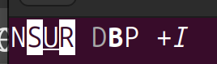

- Family of getch
  - int getch(void);
  - int wgetch(WINDOW *win);
  - int mvgetch(int y, int x);
  - int mvwgetch(WINDOW *win, int y, int x);

### 4. Window
- Create a new window: WINDOW *newin(int nlines, int ncols, int begin_y, int begin_x);
- Delete the window: int delwin(WINDOW *win);
- Move the window: int mvwin(WINDOW *win, int y, int x);
- Window border: int border(chtype ls, chtype rs, chtype ts, chtype bs, chtype tl, chtype tr, chtype bl, chtype br)
- Shortcut border function: int box(WINDOW *win, chtype verch, chtype horch);
```c
#include <curses.h>
#include <panel.h>
static WINDOW *win = NULL;
void create_menu_bar_window(int h, int w, int y, int x) {
    win = newwin(h, w, y, x);
    wrefresh(win);
}
void delete_menu_bar_window() { delwin(win);     win = NULL; }
void create_file_list_window(int h, int w, int y, int x) {
    win = newwin(h, w, y, x);
    wborder(win, 0, 0, 0, 0, 0, 0, 0, 0);
    wrefresh(win);
}
void delete_file_list_window() {    delwin(win);    win = NULL;}
void create_contents_window(int h, int w, int y, int x) {
    win = newwin(h, w, y, x);
    box(win, 0, 0);
    wrefresh(win);
}
void delete_contents_window() {    delwin(win);    win = NULL;}
void create_debug_window(int h, int w, int y, int x) {
    win = newwin(h, w, y, x);
    wborder(win, '|', '|', '-', '-', '+', '+', '+', '+');
    wrefresh(win);
}
void delete_debug_window() {    delwin(win);    win = NULL;}
int main(int argc, char *argv[]) {
    initscr();      // Enter curses mode
    cbreak();       // Disable line buffering
    noecho();       // Disable echoing
    keypad(stdscr, TRUE);   // Enable function keys like F1
    curs_set(0);            // Hide cursor
    refresh();
    //
    int h, w;
    getmaxyx(stdscr, h, w);
    int h_files = h - 1 - 6;
    int w_files = w * 0.3;
    create_menu_bar_window(1, w, 0, 0); // top 
    create_file_list_window(h_files, w_files, 1, 0); // left-center
    create_contents_window(h_files, w - w_files, 1, w_files); // right-center
    create_debug_window(6, w, 1 + h_files, 0); // bottom
    //
    getch();
    //
    delete_menu_bar_window();
    delete_file_list_window();
    delete_contents_window();
    delete_debug_window();

    endwin();       // Exit from curses mode
    return 0;
}
```
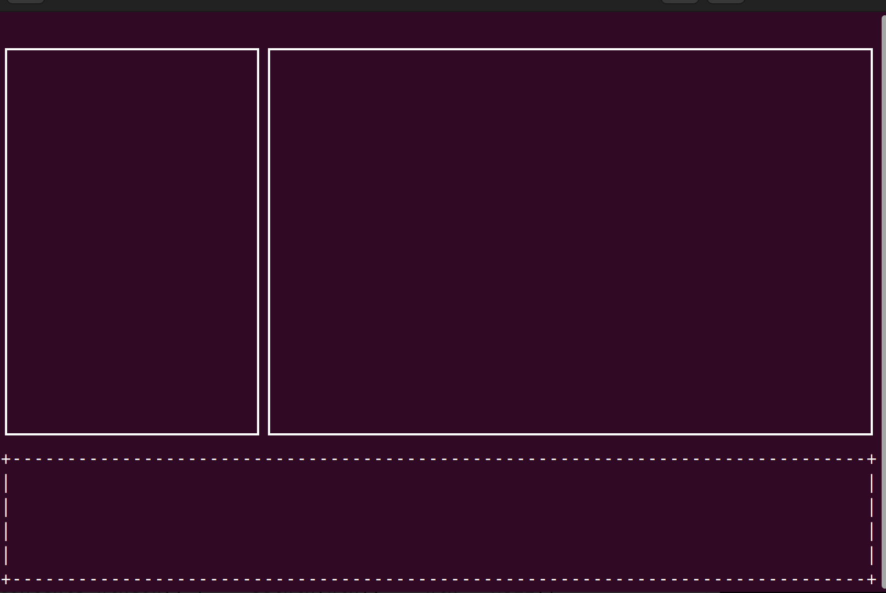

### 5. Output
- Lab task
  - Output window titles
  - Provide a debug function
```c
#include <curses.h>
#include <panel.h>
static WINDOW *win = NULL;
void create_menu_bar_window(int h, int w, int y, int x) {
    win = newwin(h, w, y, x);
    wrefresh(win);
}
void delete_menu_bar_window() { delwin(win);     win = NULL; }
void create_file_list_window(int h, int w, int y, int x) {
    win = newwin(h, w, y, x);
    wborder(win, 0, 0, 0, 0, 0, 0, 0, 0);
    mvwaddstr(win, 0, 1, "File List");
    wrefresh(win);
}
void delete_file_list_window() {    delwin(win);    win = NULL;}
void create_contents_window(int h, int w, int y, int x) {
    win = newwin(h, w, y, x);
    box(win, 0, 0);
    mvwaddstr(win, 0, 1, "Contents");
    wrefresh(win);
}
void delete_contents_window() {    delwin(win);    win = NULL;}
void create_debug_window(int h, int w, int y, int x) {
    win = newwin(h, w, y, x);
    wborder(win, '|', '|', '-', '-', '+', '+', '+', '+');
    mvwaddstr(win, 0, 1, "Debug");
    wrefresh(win);
}
void delete_debug_window() {    delwin(win);    win = NULL;}
static int count = 0;
void debug_line(const char *fmt, ...) {
    // 1: This is a debug line
    // 2: This is another debug line
    int y = 1 + count;
    int x = 1;
    mvwprintw(win, y, x, "%d: ", count);
    count++;
    va_list varglist;
    va_start(varglist, fmt);
    vw_printw(win, fmt, varglist);
    va_end(varglist);
    wrefresh(win);
}

int main(int argc, char *argv[]) {
    initscr();      // Enter curses mode
    cbreak();       // Disable line buffering
    noecho();       // Disable echoing
    keypad(stdscr, TRUE);   // Enable function keys like F1
    curs_set(0);            // Hide cursor
    refresh();
    //
    int h, w;
    getmaxyx(stdscr, h, w);
    int h_files = h - 1 - 6;
    int w_files = w * 0.3;
    create_menu_bar_window(1, w, 0, 0); // top 
    create_file_list_window(h_files, w_files, 1, 0); // left-center
    create_contents_window(h_files, w - w_files, 1, w_files); // right-center
    create_debug_window(6, w, 1 + h_files, 0); // bottom
    debug_line("This is a debug message"); // inject strings into the debug window
    debug_line("Hello %s", "ncurses");
    //
    getch();
    //
    delete_menu_bar_window();
    delete_file_list_window();
    delete_contents_window();
    delete_debug_window();
    //
    endwin();       // Exit from curses mode
    return 0;
}
```
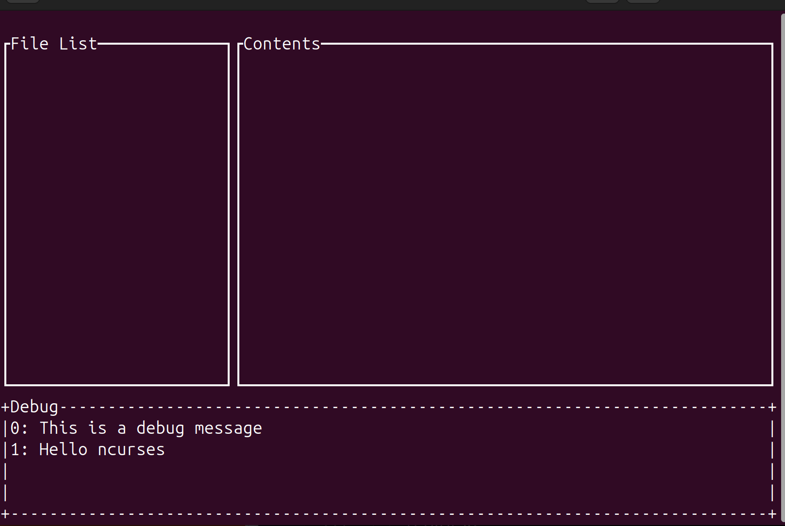

### 6. List directory
- Lab task
  - Take the directory to list from command line
  - Use scandir() to list the directory entries
  - Show the current directory path name on window top border
  - Show the count of entries on window bottom border
  - Show these entries in File List window
  - Press 'q' to exit
```c
#include <stdlib.h>
#include <string.h>
#include <dirent.h>
#include <curses.h>
#include <panel.h>
static WINDOW *men_win = NULL;
static WINDOW *fil_win = NULL;
static WINDOW *con_win = NULL;
static WINDOW *dbg_win = NULL;
void create_menu_bar_window(int h, int w, int y, int x) {
    men_win = newwin(h, w, y, x);
    wrefresh(men_win);
}
void delete_menu_bar_window() { delwin(men_win);     men_win = NULL; }
void create_file_list_window(int h, int w, int y, int x) {
    fil_win = newwin(h, w, y, x);
    wborder(fil_win, 0, 0, 0, 0, 0, 0, 0, 0);
    mvwaddstr(fil_win, 0, 1, "File List");
    wrefresh(fil_win);
}
static int entry_count = 0;
static struct dirent **entry_list = NULL; // from <dirent.h>
void delete_file_list_window() {    delwin(fil_win);    fil_win = NULL; free(entry_list); entry_list = NULL; entry_count = 0;}
void list_dir_in_file_list_window(const char *dir) {
    if (entry_list != NULL) free(entry_list);
    entry_count = scandir(dir, &entry_list, NULL, NULL);
    int h = getmaxy(fil_win);
    wborder(fil_win,0,0,0,0,0,0,0,0);
    mvwaddstr(fil_win, 0, 1, dir); // print title
    int y = 1;
    if (entry_count == 0) {  
         mvwaddstr(fil_win,1,1,"Nothing");
    } 
    else { 
         for (int row = 0; row < h - 2; row++) { 
            int i=row;
            if (i>=entry_count) {
                break;
            }
            struct dirent *entry = entry_list[i];
            mvwaddstr(fil_win,y,1,entry->d_name);
            y++;
      }
    }
    y = h-1;
    mvwprintw(fil_win, y,1,"%d", entry_count); // print footer
    wrefresh(fil_win);
}
void create_contents_window(int h, int w, int y, int x) {
    con_win = newwin(h, w, y, x);
    box(con_win, 0, 0);
    mvwaddstr(con_win, 0, 1, "Contents");
    wrefresh(con_win);
}
void delete_contents_window() { delwin(con_win); con_win = NULL;}
void create_debug_window(int h, int w, int y, int x) {
    dbg_win = newwin(h, w, y, x);
    wborder(dbg_win, '|', '|', '-', '-', '+', '+', '+', '+');
    mvwaddstr(dbg_win, 0, 1, "Debug");
    wrefresh(dbg_win);
}
void delete_debug_window() {    delwin(dbg_win);    dbg_win = NULL;}
int main(int argc, char *argv[]) {
   if (argc < 2) { printf("Usage: ./main <dir>\n"); exit(1); } // check n. of arguments
    initscr();      // Enter curses mode
    cbreak();       // Disable line buffering
    noecho();       // Disable echoing
    keypad(stdscr, TRUE);   // Enable function keys like F1
    curs_set(0);            // Hide cursor
    refresh();
    char *dir = argv[1];
    int len = strlen(dir);
    if (dir[len-1] == '/') {dir[len-1] = '\0';} 
    //
    int h, w;
    getmaxyx(stdscr, h, w);
    int h_files = h - 1 - 6;
    int w_files = w * 0.3;
    create_menu_bar_window(1, w, 0, 0); // top 
    create_file_list_window(h_files, w_files, 1, 0); // left-center
    create_contents_window(h_files, w - w_files, 1, w_files); // right-center
    create_debug_window(6, w, 1 + h_files, 0); // bottom
    list_dir_in_file_list_window(dir);
    //
    int ch;
    while ((ch = getch()) != 'q') {    }
    //
    delete_menu_bar_window();
    delete_file_list_window();
    delete_contents_window();
    delete_debug_window();
    endwin();       // Exit from curses mode
    return 0;
}
```
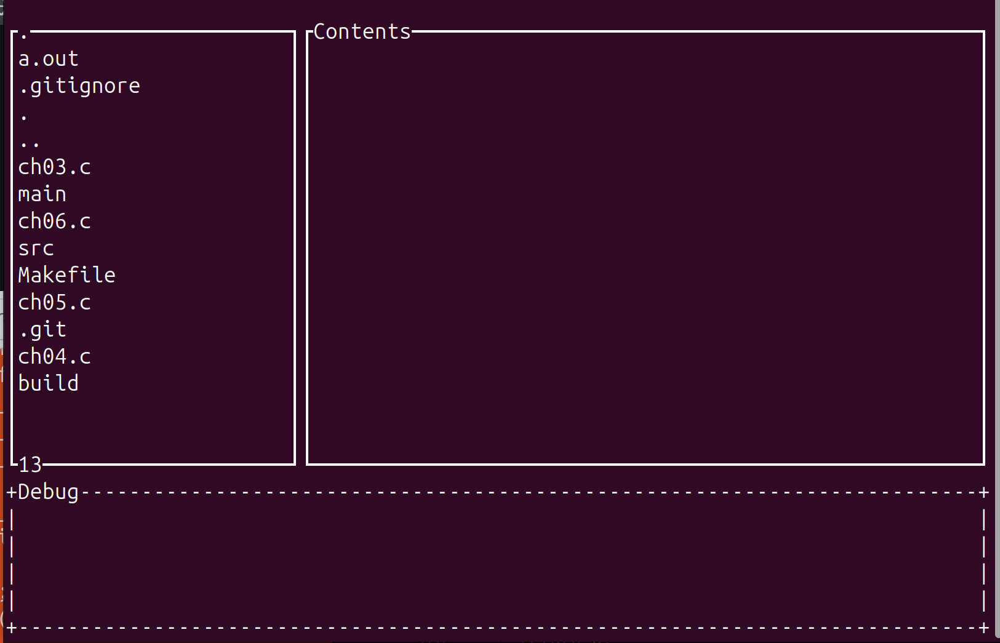

### 7. List directory - enhancement
- How to handle long strings
```c
void list_dir_in_file_list_window(const char *dir) {
    if (entry_list != NULL) free(entry_list);
    entry_count = scandir(dir, &entry_list, NULL, NULL);
    int h = getmaxy(fil_win);
    int w = getmaxx(fil_win);
    wborder(fil_win,0,0,0,0,0,0,0,0);
    if (strlen(dir) > w-2) { // print title
       mvwaddnstr(fil_win, 0,1,dir,w-2-3);
       waddstr(fil_win, "...");
    } else { mvwaddstr(fil_win,0,1,dir); }
    int y = 1;
    if (entry_count == 0) {  
         mvwaddstr(fil_win,1,1,"Nothing");
    } 
    else { 
         for (int row = 0; row < h - 2; row++) { 
            int i=row;
            if (i>=entry_count) {
                break;
            }
            struct dirent *entry = entry_list[i];
            mvwaddstr(fil_win,y,1,entry->d_name);
            y++;
      }
    }
    y = h-1;
    mvwprintw(fil_win, y,1,"%d", entry_count); // print footer
    wrefresh(fil_win);
}
```
- Now "/lib/x86_64-linux-gnu/b" is shown as "/lib/x86_64-linux-g..."

### 8. Attributes
- Support active window
  - Register all windows in a window manager
  - Press TAB key to move focus around the windows
  - Highlight window title when the window gains focus
- APIs
  - int attroff(int attrs);
  - int wattroff(WINDOW *win, int attrs);
  - int attron(int attrs);
  - int wattron(WINDOW *win, int attrs);
  - int attrset(int attrs);
  - int wattrset(WINDOW *win, int attrs);
  - int attr_get(attr_t, *attrs, short *pair, void *opts);
- Erase/clear window
  - int erase(void);
  - int werase(WINDOW *win);
  - int clear(void);
  - int wclear(WINDOW *win);
```c
#include <stdlib.h>
#include <string.h>
#include <dirent.h>
#include <limits.h>
#include <curses.h>
#include <panel.h>
#define WINDOWS 4
static WINDOW *windows[WINDOWS];
static int count = 0;
static int current_window_index = -1;
void init_win_manager() {
    for (int i = 0; i < WINDOWS; i++) {
        windows[i] = NULL;
    }
}
void register_window(WINDOW *win) {
    windows[count] = win;
    count++;
    if (current_window_index == -1) {
        current_window_index = 0;
    }
}
void next_window() {
    if (current_window_index < count - 1) {
        current_window_index++;
    } else {
        current_window_index = 0;
    }
}
bool is_current_window(WINDOW *win) {
    return windows[current_window_index] == win;
}
static WINDOW *men_win = NULL;
static WINDOW *fil_win = NULL;
static WINDOW *con_win = NULL;
static WINDOW *dbg_win = NULL;
void refresh_menu_bar_window() {
    if (is_current_window(men_win)) {wattron(men_win, A_REVERSE);}
    mvwaddstr(men_win,0,1,"Menu");
    if (is_current_window(men_win)) {wattroff(men_win, A_REVERSE);}
    wrefresh(men_win);
}
void create_menu_bar_window(int h, int w, int y, int x) {
    men_win = newwin(h, w, y, x);
    register_window(men_win);
    refresh_menu_bar_window();
}
void delete_menu_bar_window() { delwin(men_win);     men_win = NULL; }
static int entry_count = 0;
static struct dirent **entry_list = NULL; // from <dirent.h>
static char current_path[PATH_MAX];
void create_file_list_window(int h, int w, int y, int x) {
    fil_win = newwin(h, w, y, x);
    register_window(fil_win);
    current_path[0] = '\0';
    wborder(fil_win, 0, 0, 0, 0, 0, 0, 0, 0);
    mvwaddstr(fil_win, 0, 1, "File List");
    wrefresh(fil_win);
}
void delete_file_list_window() {    delwin(fil_win);    fil_win = NULL; free(entry_list); entry_list = NULL; entry_count = 0;}
void refresh_file_list_window() {
    int h = getmaxy(fil_win);
    int w = getmaxx(fil_win);
    wborder(fil_win,0,0,0,0,0,0,0,0);
    if (is_current_window(fil_win)) { wattron(fil_win, A_REVERSE); }
    if (strlen(current_path) > w-2) { // print title
       mvwaddnstr(fil_win, 0,1,current_path,w-2-3);
       waddstr(fil_win, "...");
    } else { mvwaddstr(fil_win,0,1,current_path); }
    if (is_current_window(fil_win)) { wattroff(fil_win, A_REVERSE); }
    int y = 1;// Print entries
    if (entry_count == 0) {  
         mvwaddstr(fil_win,1,1,"Nothing");
    } 
    else { 
         for (int row = 0; row < h - 2; row++) { 
            int i=row;
            if (i>=entry_count) {
                break;
            }
            struct dirent *entry = entry_list[i];
            mvwaddstr(fil_win,y,1,entry->d_name);
            y++;
      }
    }
    y = h-1;
    mvwprintw(fil_win, y,1,"%d", entry_count); // print footer
    wrefresh(fil_win);
}
void list_dir_in_file_list_window(const char *dir) {
    if (entry_list != NULL) free(entry_list);
    entry_count = scandir(dir, &entry_list, NULL, NULL);
    strcpy(current_path, dir);
    refresh_file_list_window();
}
void refresh_contents_window() {
    box(con_win, 0, 0);
    if (is_current_window(con_win)) {wattron(con_win, A_REVERSE);}    
    mvwaddstr(con_win, 0, 1, "Contents");
    if (is_current_window(con_win)) {wattroff(con_win, A_REVERSE);}    
    wrefresh(con_win);
}
void create_contents_window(int h, int w, int y, int x) {
    con_win = newwin(h, w, y, x);
    register_window(con_win);
    refresh_contents_window();
}
void delete_contents_window() { delwin(con_win); con_win = NULL;}
void refresh_debug_window() {
    wborder(dbg_win, '|', '|', '-', '-', '+', '+', '+', '+');
    if (is_current_window(dbg_win)) {wattron(dbg_win, A_REVERSE);}    
    mvwaddstr(dbg_win, 0, 1, "Debug");
    if (is_current_window(dbg_win)) {wattroff(dbg_win, A_REVERSE);}        
    wrefresh(dbg_win);
}
void create_debug_window(int h, int w, int y, int x) {
    dbg_win = newwin(h, w, y, x);
    register_window(dbg_win);    
    refresh_debug_window();
}
void delete_debug_window() {    delwin(dbg_win);    dbg_win = NULL;}
int main(int argc, char *argv[]) {
   if (argc < 2) { printf("Usage: ./main <dir>\n"); exit(1); } // check n. of arguments
    initscr();      // Enter curses mode
    cbreak();       // Disable line buffering
    noecho();       // Disable echoing
    keypad(stdscr, TRUE);   // Enable function keys like F1
    curs_set(0);            // Hide cursor
    refresh();
    char *dir = argv[1];
    int len = strlen(dir);
    if (dir[len-1] == '/') {dir[len-1] = '\0';} 
    //
    int h, w;
    getmaxyx(stdscr, h, w);
    int h_files = h - 1 - 6;
    int w_files = w * 0.3;
    create_menu_bar_window(1, w, 0, 0); // top 
    create_file_list_window(h_files, w_files, 1, 0); // left-center
    create_contents_window(h_files, w - w_files, 1, w_files); // right-center
    create_debug_window(6, w, 1 + h_files, 0); // bottom
    list_dir_in_file_list_window(dir);
    //
    int ch;
    while ((ch = getch()) != 'q') { 
        switch (ch)  {
            case '\t':
               next_window();                
               refresh_menu_bar_window();
               refresh_file_list_window();
               refresh_debug_window();
               refresh_contents_window();
               break;
        }
    }
    //
    delete_menu_bar_window();
    delete_file_list_window();
    delete_contents_window();
    delete_debug_window();
    endwin();       // Exit from curses mode
    return 0;
}
```
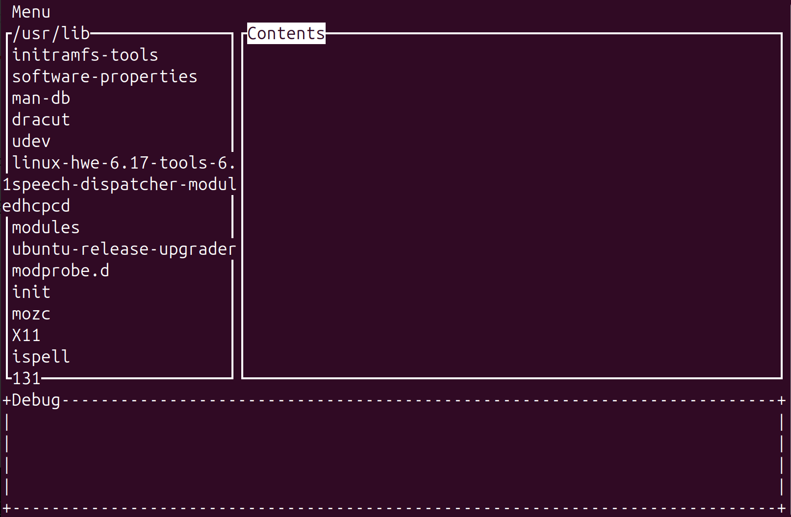

### 9. Color
- Lab task
  - Show the directory entry in yello
  - Press Enter key to enter the selected directory
  - Set background of Debug Window to blue
- Colors API
  - has_colors() to check if color is supported in the current terminal
  - start_colors() before using color
  - Check global variable COLORS
- Window background
  - void bkgdset(chtype ch);
  - void wbkgdset(WINDOW *win, chtype ch);
  - int bkgd(chtype ch);
  - in wbkgd(WINDOW *win, chtype ch);
```c
#include <stdlib.h>
#include <string.h>
#include <dirent.h>
#include <limits.h>
#include <curses.h>
#include <panel.h>
#define WINDOWS 4
#define COLOR_OF_DIR    1
#define COLOR_OF_DEBUG_WIN  2
typedef void (*WIN_KEY_HANDLE)(int);
static WINDOW *windows[WINDOWS];
static WIN_KEY_HANDLE key_handle_funcs[WINDOWS];
static int count = 0;
static int current_window_index = -1;
void init_win_manager() {
    for (int i = 0; i < WINDOWS; i++) {
        windows[i] = NULL;
    }
}
void register_window_with_key_handle(WINDOW *win, 
    WIN_KEY_HANDLE handle) {
    windows[count] = win;
    key_handle_funcs[count] = handle;
    count++;
    if (current_window_index == -1) {
        current_window_index = 0;
    }
}
void register_window(WINDOW *win) {
    windows[count] = win;
    count++;
    if (current_window_index == -1) {
        current_window_index = 0;
    }
}
void next_window() {
    if (current_window_index < count - 1) {
        current_window_index++;
    } else {
        current_window_index = 0;
    }
}
bool is_current_window(WINDOW *win) {
    return windows[current_window_index] == win;
}
void handle_key_in_current_window(int ch) {
    if (0 <= current_window_index && current_window_index < count) {
        if (key_handle_funcs[current_window_index]) {
            key_handle_funcs[current_window_index](ch);
        }
    }
}
static WINDOW *men_win = NULL;
static WINDOW *fil_win = NULL;
static WINDOW *con_win = NULL;
static WINDOW *dbg_win = NULL;
void refresh_menu_bar_window() {
    if (is_current_window(men_win)) {wattron(men_win, A_REVERSE);}
    mvwaddstr(men_win,0,1,"Menu");
    if (is_current_window(men_win)) {wattroff(men_win, A_REVERSE);}
    wrefresh(men_win);
}
void create_menu_bar_window(int h, int w, int y, int x) {
    men_win = newwin(h, w, y, x);
    register_window(men_win);
    refresh_menu_bar_window();
}
void delete_menu_bar_window() { delwin(men_win);     men_win = NULL; }
static int entry_count = 0;
static struct dirent **entry_list = NULL; // from <dirent.h>
static char current_path[PATH_MAX];
static int index_of_selected = -1;
static void handle_key(int ch); // see below for the function definition
void create_file_list_window(int h, int w, int y, int x) {
    fil_win = newwin(h, w, y, x);    
    register_window_with_key_handle(fil_win, handle_key);
    current_path[0] = '\0';
    wborder(fil_win, 0, 0, 0, 0, 0, 0, 0, 0);
    mvwaddstr(fil_win, 0, 1, "File List");
    wrefresh(fil_win);
}
void delete_file_list_window() {    
	delwin(fil_win);    
	fil_win = NULL; 
	free(entry_list); 
	entry_list = NULL; 
	entry_count = 0;
}
void refresh_file_list_window() {
    int h = getmaxy(fil_win);
    int w = getmaxx(fil_win);
    wborder(fil_win,0,0,0,0,0,0,0,0);
    if (is_current_window(fil_win)) { wattron(fil_win, A_REVERSE); }
    if (strlen(current_path) > w-2) { // print title
       mvwaddnstr(fil_win, 0,1,current_path,w-2-3);
       waddstr(fil_win, "...");
    } else { mvwaddstr(fil_win,0,1,current_path); }
    if (is_current_window(fil_win)) { wattroff(fil_win, A_REVERSE); }
    int y = 1;// Print entries
    if (entry_count == 0) {  
         mvwaddstr(fil_win,1,1,"Nothing");
    } 
    else { 
         for (int row = 0; row < h - 2; row++) { 
            int i=row;
            if (i>=entry_count) {
                break;
            }
            struct dirent *entry = entry_list[i];
            if (i == index_of_selected) {
                wattron(fil_win, A_REVERSE);
            }
            if (entry->d_type == DT_DIR) {
                wattron(fil_win, COLOR_PAIR(COLOR_OF_DIR));
            }
            mvwaddstr(fil_win, y, 1, entry->d_name);
            if (entry->d_type == DT_DIR) {
                wattroff(fil_win, COLOR_PAIR(COLOR_OF_DIR));
            }
            if (i == index_of_selected) {
                wattroff(fil_win, A_REVERSE);
            }
            y++;
      }
    }
    y = h-1;
    mvwprintw(fil_win, y,1,"%d", entry_count); // print footer
    wrefresh(fil_win);
}
void list_dir_in_file_list_window(const char *dir) {
    if (entry_list != NULL) free(entry_list);
    entry_count = scandir(dir, &entry_list, NULL, NULL);
    strcpy(current_path, dir);
    refresh_file_list_window();
}
void enter_dir(struct dirent *entry) {
    if (strcmp(entry->d_name, ".") == 0) {
        return;
    }
    char new_dir[PATH_MAX];
    if (strcmp(entry->d_name, "..") == 0) {
        strcpy(new_dir, current_path);
        char *end = strrchr(new_dir, '/');
        *end = '\0';        
    } else {
        sprintf(new_dir, "%s/%s", current_path, entry->d_name);
    }
    list_dir_in_file_list_window(new_dir);
}
static void handle_key(int ch) {
    switch (ch) {
        case KEY_DOWN:
            if (index_of_selected < entry_count - 1) {
                index_of_selected++;
                refresh_file_list_window();
            }
            break;
        case KEY_UP:
            if (index_of_selected > 0) {
                index_of_selected--;
                refresh_file_list_window();
            }
            break;
        case '\n':
            if (0 <= index_of_selected && index_of_selected < entry_count) {
                struct dirent *entry = entry_list[index_of_selected];
                if (entry->d_type == DT_DIR) {
                    enter_dir(entry);
                }
            }
            break;
    }
}
void refresh_contents_window() {
    box(con_win, 0, 0);
    if (is_current_window(con_win)) {wattron(con_win, A_REVERSE);}    
    mvwaddstr(con_win, 0, 1, "Contents");
    if (is_current_window(con_win)) {wattroff(con_win, A_REVERSE);}    
    wrefresh(con_win);
}
void create_contents_window(int h, int w, int y, int x) {
    con_win = newwin(h, w, y, x);
    register_window(con_win);
    refresh_contents_window();
}
void delete_contents_window() { delwin(con_win); con_win = NULL;}
void refresh_debug_window() {    
    wbkgd(dbg_win, COLOR_PAIR(COLOR_OF_DEBUG_WIN));
    wborder(dbg_win, '|', '|', '-', '-', '+', '+', '+', '+');
    if (is_current_window(dbg_win)) {wattron(dbg_win, A_REVERSE);}    
    mvwaddstr(dbg_win, 0, 1, "Debug");
    if (is_current_window(dbg_win)) {wattroff(dbg_win, A_REVERSE);}        
    wrefresh(dbg_win);
}
void create_debug_window(int h, int w, int y, int x) {
    dbg_win = newwin(h, w, y, x);
    register_window(dbg_win);    
    refresh_debug_window();
}
void delete_debug_window() {    delwin(dbg_win);    dbg_win = NULL;}
int main(int argc, char *argv[]) {
   if (argc < 2) { printf("Usage: ./main <dir>\n"); exit(1); } // check n. of arguments
    initscr();      // Enter curses mode
    cbreak();       // Disable line buffering
    noecho();       // Disable echoing
    keypad(stdscr, TRUE);   // Enable function keys like F1
    curs_set(0);            // Hide cursor
    refresh();
    if (has_colors()) {
        start_color();
        init_pair(COLOR_OF_DIR, COLOR_YELLOW, COLOR_BLACK);
        init_pair(COLOR_OF_DEBUG_WIN, COLOR_WHITE, COLOR_BLUE);
    }

    char *dir = argv[1];
    int len = strlen(dir);
    if (dir[len-1] == '/') {dir[len-1] = '\0';} 
    //
    int h, w;
    getmaxyx(stdscr, h, w);
    int h_files = h - 1 - 6;
    int w_files = w * 0.3;
    create_menu_bar_window(1, w, 0, 0); // top 
    create_file_list_window(h_files, w_files, 1, 0); // left-center
    create_contents_window(h_files, w - w_files, 1, w_files); // right-center
    create_debug_window(6, w, 1 + h_files, 0); // bottom
    list_dir_in_file_list_window(dir);
    //
    int ch;
    while ((ch = getch()) != 'q') { 
        switch (ch)  {
            case '\t':
               next_window();                
               refresh_menu_bar_window();
               refresh_file_list_window();
               refresh_debug_window();
               refresh_contents_window();
               break;
        }
    }
    //
    delete_menu_bar_window();
    delete_file_list_window();
    delete_contents_window();
    delete_debug_window();
    endwin();       // Exit from curses mode
    return 0;
}
```
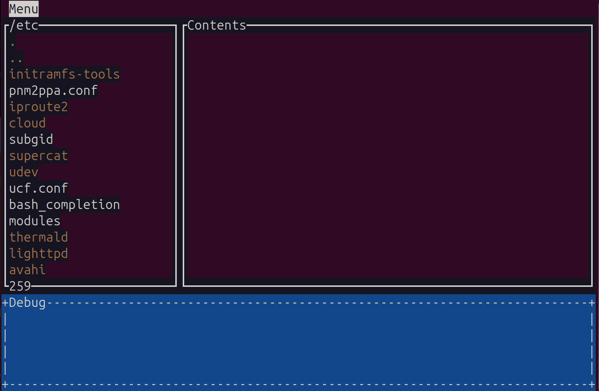

### 10. Input
- Lab task
  - Show a help window
  - Print ncurses version and terminal names
  - Allow user to input new directory path to list
- getch and ungetch
  - Read a character:
    - int getch(void);
    - int wgetch(WINDOW *win);
    - int mvgetch(int y, int x);
    - int mvwgetch(WINDOW *win, int y, int x)
  - Put character ch into input queue so that the next getch() will read it
    - int ungetch(int ch);
- Read characters
  - int getstr(char *str);
  - int wgetstr(WINDOW *win, char *str);
  - int mvegetstr(int y, int x, char *str);
  - int mvwgetstr(WINDOW *win, int y, int x, char *str);
- Read string from cursor position
  - int instr(char *str);
  - int winstr(WINDOW *win, char *str);
- Read chtype String from cursor position
  - int inchsgtr(chtype *chstr);
  - int winchstr(WINDOW *win, chtype *chstr);
- Read from the formatted string
```c
#include <stdlib.h>
#include <string.h>
#include <dirent.h>
#include <limits.h>
#include <curses.h>
#include <panel.h>
#define WINDOWS 4
#define COLOR_OF_DIR    1
#define COLOR_OF_DEBUG_WIN  2
static WINDOW *men_win = NULL;
static WINDOW *fil_win = NULL;
static WINDOW *con_win = NULL;
static WINDOW *dbg_win = NULL;
static WINDOW *hlp_win = NULL;
void show_help_window(char *dir, int len) {
    int h = 20;
    int w = 60;
    WINDOW *hlp_win = newwin(h, w, (LINES - h) / 2, (COLS - w) / 2);
    box(hlp_win, 0, 0);
    mvwaddstr(hlp_win, 0, 1, "Help");
    int y = 3;
    int x = 3;
    mvwprintw(hlp_win, y++, x, "ncurses : %s", curses_version());
    mvwprintw(hlp_win, y++, x, "terminal: %s", longname());
    mvwprintw(hlp_win, y++, x, "terminal: %s", termname());
    // Dir: _____________________
    mvwprintw(hlp_win, y, x, "Dir: ");
    x += strlen("Dir: ");
    wbkgdset(hlp_win, A_UNDERLINE);
    waddstr(hlp_win, "                   ");
    wbkgdset(hlp_win, A_NORMAL);
    wmove(hlp_win, y, x);
    curs_set(1);
    echo(); // print back
    nocbreak();
    wgetnstr(hlp_win, dir, len);
    curs_set(0);
    noecho();
    cbreak();
    wrefresh(hlp_win);
    delwin(hlp_win);
}
typedef void (*WIN_KEY_HANDLE)(int);
static WINDOW *windows[WINDOWS];
static WIN_KEY_HANDLE key_handle_funcs[WINDOWS];
static int count = 0;
static int current_window_index = -1;
void init_win_manager() {
    for (int i = 0; i < WINDOWS; i++) {
        windows[i] = NULL;
    }
}
void register_window_with_key_handle(WINDOW *win, 
    WIN_KEY_HANDLE handle) {
    windows[count] = win;
    key_handle_funcs[count] = handle;
    count++;
    if (current_window_index == -1) {
        current_window_index = 0;
    }
}
void register_window(WINDOW *win) {
    windows[count] = win;
    count++;
    if (current_window_index == -1) {
        current_window_index = 0;
    }
}
void next_window() {
    if (current_window_index < count - 1) {
        current_window_index++;
    } else {
        current_window_index = 0;
    }
}
bool is_current_window(WINDOW *win) {
    return windows[current_window_index] == win;
}
void handle_key_in_current_window(int ch) {
    if (0 <= current_window_index && current_window_index < count) {
        if (key_handle_funcs[current_window_index]) {
            key_handle_funcs[current_window_index](ch);
        }
    }
}
void refresh_menu_bar_window() {
    if (is_current_window(men_win)) {wattron(men_win, A_REVERSE);}
    mvwaddstr(men_win,0,1,"Menu");
    if (is_current_window(men_win)) {wattroff(men_win, A_REVERSE);}
    wrefresh(men_win);
}
void create_menu_bar_window(int h, int w, int y, int x) {
    men_win = newwin(h, w, y, x);
    register_window(men_win);
    refresh_menu_bar_window();
}
void delete_menu_bar_window() { delwin(men_win);     men_win = NULL; }
static int entry_count = 0;
static struct dirent **entry_list = NULL; // from <dirent.h>
static char current_path[PATH_MAX];
static int index_of_selected = -1;
static void handle_key(int ch); // see below for the function definition
void create_file_list_window(int h, int w, int y, int x) {
    fil_win = newwin(h, w, y, x);    
    register_window_with_key_handle(fil_win, handle_key);
    current_path[0] = '\0';
    wborder(fil_win, 0, 0, 0, 0, 0, 0, 0, 0);
    mvwaddstr(fil_win, 0, 1, "File List");
    wrefresh(fil_win);
}
void delete_file_list_window() {    
	delwin(fil_win);    
	fil_win = NULL; 
	free(entry_list); 
	entry_list = NULL; 
	entry_count = 0;
}
void refresh_file_list_window() {
    int h = getmaxy(fil_win);
    int w = getmaxx(fil_win);
    wclear(fil_win);
    wborder(fil_win,0,0,0,0,0,0,0,0);
    if (is_current_window(fil_win)) { wattron(fil_win, A_REVERSE); }
    if (strlen(current_path) > w-2) { // print title
       mvwaddnstr(fil_win, 0,1,current_path,w-2-3);
       waddstr(fil_win, "...");
    } else { mvwaddstr(fil_win,0,1,current_path); }
    if (is_current_window(fil_win)) { wattroff(fil_win, A_REVERSE); }
    int y = 1;// Print entries
    if (entry_count == 0) {  
         mvwaddstr(fil_win,1,1,"Nothing");
    } 
    else { 
         for (int row = 0; row < h - 2; row++) { 
            int i=row;
            if (i>=entry_count) {
                break;
            }
            struct dirent *entry = entry_list[i];
            if (i == index_of_selected) {
                wattron(fil_win, A_REVERSE);
            }
            if (entry->d_type == DT_DIR) {
                wattron(fil_win, COLOR_PAIR(COLOR_OF_DIR));
            }
            mvwaddstr(fil_win, y, 1, entry->d_name);
            if (entry->d_type == DT_DIR) {
                wattroff(fil_win, COLOR_PAIR(COLOR_OF_DIR));
            }
            if (i == index_of_selected) {
                wattroff(fil_win, A_REVERSE);
            }
            y++;
      }
    }
    y = h-1;
    mvwprintw(fil_win, y,1,"%d", entry_count); // print footer
    wrefresh(fil_win);
}
void list_dir_in_file_list_window(const char *dir) {
    if (entry_list != NULL) free(entry_list);
    entry_list = NULL;
    entry_count = scandir(dir, &entry_list, NULL, NULL);
    index_of_selected = 0;
    strcpy(current_path, dir);
    refresh_file_list_window();
}
void enter_dir(struct dirent *entry) {
    if (strcmp(entry->d_name, ".") == 0) {
        return;
    }
    char new_dir[PATH_MAX];
    if (strcmp(entry->d_name, "..") == 0) {
        strcpy(new_dir, current_path);
        char *end = strrchr(new_dir, '/');
        *end = '\0';        
    } else {
        sprintf(new_dir, "%s/%s", current_path, entry->d_name);
    }
    list_dir_in_file_list_window(new_dir);
}

static void handle_key(int ch) {
    switch (ch) {
        case KEY_DOWN:
            if (index_of_selected < entry_count - 1) {
                index_of_selected++;
                refresh_file_list_window();
            }
            break;
        case KEY_UP:
            if (index_of_selected > 0) {
                index_of_selected--;
                refresh_file_list_window();
            }
            break;
        case '\n':
            if (0 <= index_of_selected && index_of_selected < entry_count) {
                struct dirent *entry = entry_list[index_of_selected];
                if (entry->d_type == DT_DIR) {
                    enter_dir(entry);
                }
            }
            break;
    }
}
void refresh_contents_window() {
    box(con_win, 0, 0);
    if (is_current_window(con_win)) {wattron(con_win, A_REVERSE);}    
    mvwaddstr(con_win, 0, 1, "Contents");
    if (is_current_window(con_win)) {wattroff(con_win, A_REVERSE);}    
    wrefresh(con_win);
}
void create_contents_window(int h, int w, int y, int x) {
    con_win = newwin(h, w, y, x);
    register_window(con_win);
    refresh_contents_window();
}
void delete_contents_window() { delwin(con_win); con_win = NULL;}
void refresh_debug_window() {    
    wbkgd(dbg_win, COLOR_PAIR(COLOR_OF_DEBUG_WIN));
    wborder(dbg_win, '|', '|', '-', '-', '+', '+', '+', '+');
    if (is_current_window(dbg_win)) {wattron(dbg_win, A_REVERSE);}    
    mvwaddstr(dbg_win, 0, 1, "Debug");
    if (is_current_window(dbg_win)) {wattroff(dbg_win, A_REVERSE);}        
    wrefresh(dbg_win);
}
void create_debug_window(int h, int w, int y, int x) {
    dbg_win = newwin(h, w, y, x);
    register_window(dbg_win);    
    refresh_debug_window();
}
void delete_debug_window() {    delwin(dbg_win);    dbg_win = NULL;}
int main(int argc, char *argv[]) {
   if (argc < 2) { printf("Usage: ./main <dir>\n"); exit(1); } // check n. of arguments
    initscr();      // Enter curses mode
    cbreak();       // Disable line buffering
    noecho();       // Disable echoing
    keypad(stdscr, TRUE);   // Enable function keys like F1
    curs_set(0);            // Hide cursor
    refresh();
    if (has_colors()) {
        start_color();
        init_pair(COLOR_OF_DIR, COLOR_YELLOW, COLOR_BLACK);
        init_pair(COLOR_OF_DEBUG_WIN, COLOR_WHITE, COLOR_BLUE);
    }

    char *dir = argv[1];
    int len = strlen(dir);
    if (dir[len-1] == '/') {dir[len-1] = '\0';} 
    //
    int h, w;
    getmaxyx(stdscr, h, w);
    int h_files = h - 1 - 6;
    int w_files = w * 0.3;
    create_menu_bar_window(1, w, 0, 0); // top 
    create_file_list_window(h_files, w_files, 1, 0); // left-center
    create_contents_window(h_files, w - w_files, 1, w_files); // right-center
    create_debug_window(6, w, 1 + h_files, 0); // bottom
    list_dir_in_file_list_window(dir);
    //
    int ch;
    while ((ch = getch()) != 'q') { 
        switch (ch)  {
            case 'h': {
                char dir[PATH_MAX];
                show_help_window(dir, PATH_MAX - 1);
                if (strlen(dir) > 0) {
                    list_dir_in_file_list_window(dir);
                }
                refresh_file_list_window();
                refresh_contents_window();
                break;
            }
           case '\t':
               next_window();                
               refresh_menu_bar_window();
               refresh_file_list_window();
               refresh_debug_window();
               refresh_contents_window();
               break;
            default:
                handle_key_in_current_window(ch);
                break;
       }
    }
    //
    delete_menu_bar_window();
    delete_file_list_window();
    delete_contents_window();
    delete_debug_window();
    endwin();       // Exit from curses mode
    return 0;
}
```
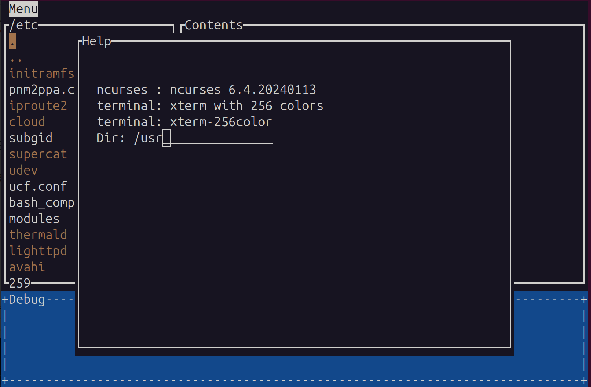

### 11. Mouse
- Lab task
  - Click window using a mouse to activate it
  - Click an entry in the file list window to select a file or directory
  - Double-click on one directory to enter it
- How to enable a mouse
  - Make mouse events visible
    - mmask_t mousemask(mmask_t netwmask, mmask_t *oldmask);
    - ALL_MOUSE_EVENTS for reporting all mouse event
  - Mouse event is reported as KEY_MOUSE from getch()
  - Read the event data and pop the event off the queue
    - int getmouse(MEVENT *event);
    - typedef struct { short id; int x,y,z; mmask_t bstate; } EVENT;
- Mouse APIs
  - bool wenclose(const WINDOW *win, int y, in t x);
  - bool mouse_trafo(int* pY, int* pX, bool to_screen);
  - bool wmouse_trafo(const WINDOW* win, int* pY, int* pX, bool to_screen);
  - bool has_mouse(void);
```c
#include <stdlib.h>
#include <string.h>
#include <dirent.h>
#include <limits.h>
#include <curses.h>
#include <panel.h>
#define WINDOWS 4
#define COLOR_OF_DIR    1
#define COLOR_OF_DEBUG_WIN  2
static WINDOW *men_win = NULL;
static WINDOW *fil_win = NULL;
static WINDOW *con_win = NULL;
static WINDOW *dbg_win = NULL;
static WINDOW *hlp_win = NULL;
typedef void (*WIN_KEY_HANDLE)(int);
typedef void (*WIN_MOUSE_HANDLE)(MEVENT *event);
typedef void (*WIN_REFRESH)(); // defining a function pointer
static WINDOW *windows[WINDOWS];
static WIN_KEY_HANDLE key_handle_funcs[WINDOWS];
static WIN_MOUSE_HANDLE mouse_handle_funcs[WINDOWS];
static WIN_REFRESH refresh_funcs[WINDOWS];
static int count = 0;
static int current_window_index = -1;
void show_help_window(char *dir, int len) {
    int h = 20;
    int w = 60;
    WINDOW *hlp_win = newwin(h, w, (LINES - h) / 2, (COLS - w) / 2);
    box(hlp_win, 0, 0);
    mvwaddstr(hlp_win, 0, 1, "Help");
    int y = 3;
    int x = 3;
    mvwprintw(hlp_win, y++, x, "ncurses : %s", curses_version());
    mvwprintw(hlp_win, y++, x, "terminal: %s", longname());
    mvwprintw(hlp_win, y++, x, "terminal: %s", termname());
    // Dir: _____________________
    mvwprintw(hlp_win, y, x, "Dir: ");
    x += strlen("Dir: ");
    wbkgdset(hlp_win, A_UNDERLINE);
    waddstr(hlp_win, "                   ");
    wbkgdset(hlp_win, A_NORMAL);
    wmove(hlp_win, y, x);
    curs_set(1);
    echo(); // print back
    nocbreak();
    wgetnstr(hlp_win, dir, len);
    curs_set(0);
    noecho();
    cbreak();
    wrefresh(hlp_win);
    delwin(hlp_win);
}
void init_win_manager() {
    for (int i = 0; i < WINDOWS; i++) {
        windows[i] = NULL;
    }
}
void register_window_with_key_handle(WINDOW *win, 
    WIN_REFRESH refresh_func,
    WIN_KEY_HANDLE key_handle_func,
    WIN_MOUSE_HANDLE mouse_handle_func) {
    windows[count] = win;
    key_handle_funcs[count] = key_handle_func;
    mouse_handle_funcs[count] = mouse_handle_func;
    refresh_funcs[count] = refresh_func;
    count++;
    if (current_window_index == -1) {
        current_window_index = 0;
    }
}
void register_window(WINDOW *win, WIN_REFRESH refresh_func) {
    register_window_with_key_handle(win, refresh_func, NULL, NULL);
}
void next_window() {
    if (current_window_index < count - 1) {
        current_window_index++;
    } else {
        current_window_index = 0;
    }
}
bool is_current_window(WINDOW *win) {
    return windows[current_window_index] == win;
}
static void wm_handle_mouse(MEVENT *event) {
    // which window is under this mouse click
    int window_index = -1;
    if ((event->bstate & BUTTON1_CLICKED) ||
        (event->bstate & BUTTON1_DOUBLE_CLICKED)) {
        for (int i = 0; i < count; i++) {
            if (wenclose(windows[i], event->y, event->x)) {
                window_index = i;
                break;
            }
        }
        if (window_index == -1) {
            return;
        }
        // update current_window_index
        int previous_window_index = current_window_index;
        current_window_index = window_index;
        // refresh the previous current window
        if (refresh_funcs[previous_window_index]) {
            refresh_funcs[previous_window_index]();
        }
        // Forward mouse event
        if (mouse_handle_funcs[current_window_index]) {
            mouse_handle_funcs[current_window_index](event);
        }
        // refresh the current window
        if (refresh_funcs[current_window_index]) {
            refresh_funcs[current_window_index]();
        }
    }
}
void handle_key_in_current_window(int ch) {
    if (ch == KEY_MOUSE) {
        MEVENT event;
        if (getmouse(&event) == OK) {
            wm_handle_mouse(&event);
        }
        return;
    }
    if (0 <= current_window_index && current_window_index < count) {
        if (key_handle_funcs[current_window_index]) {
            key_handle_funcs[current_window_index](ch);
        }
    }
}
void refresh_menu_bar_window() {
    if (is_current_window(men_win)) {wattron(men_win, A_REVERSE);}
    mvwaddstr(men_win,0,1,"Menu");
    if (is_current_window(men_win)) {wattroff(men_win, A_REVERSE);}
    wrefresh(men_win);
}
void create_menu_bar_window(int h, int w, int y, int x) {
    men_win = newwin(h, w, y, x);
    register_window(men_win, refresh_menu_bar_window);
    refresh_menu_bar_window();
}
void delete_menu_bar_window() { delwin(men_win);     men_win = NULL; }
static int entry_count = 0;
static struct dirent **entry_list = NULL; // from <dirent.h>
static char current_path[PATH_MAX];
static int index_of_selected = -1;
static void handle_key(int ch); // see below for the function definition
void refresh_file_list_window();
static void fil_handle_mouse(MEVENT *event) {
    int y = event->y;
    int x = event->x;
    wmouse_trafo(fil_win, &y, &x, FALSE);
    if ((event->bstate & BUTTON1_CLICKED) ||
        (event->bstate & BUTTON1_DOUBLE_CLICKED)) {
        index_of_selected = y - 1;
    }
    if (event->bstate & BUTTON1_DOUBLE_CLICKED) {
        if (index_of_selected >= 0 && index_of_selected < entry_count) {
            struct dirent *entry = entry_list[index_of_selected];
            if (entry->d_type == DT_DIR) {
                enter_dir(entry);
            }
        }
    }
}
void create_file_list_window(int h, int w, int y, int x) {
    fil_win = newwin(h, w, y, x);    
    register_window_with_key_handle(fil_win, refresh_file_list_window, 
        handle_key, fil_handle_mouse);
    current_path[0] = '\0';
    wborder(fil_win, 0, 0, 0, 0, 0, 0, 0, 0);
    mvwaddstr(fil_win, 0, 1, "File List");
    wrefresh(fil_win);
}
void delete_file_list_window() {    
	delwin(fil_win);    
	fil_win = NULL; 
	free(entry_list); 
	entry_list = NULL; 
	entry_count = 0;
}
void refresh_file_list_window() {
    int h = getmaxy(fil_win);
    int w = getmaxx(fil_win);
    wclear(fil_win);
    wborder(fil_win,0,0,0,0,0,0,0,0);
    if (is_current_window(fil_win)) { wattron(fil_win, A_REVERSE); }
    if (strlen(current_path) > w-2) { // print title
       mvwaddnstr(fil_win, 0,1,current_path,w-2-3);
       waddstr(fil_win, "...");
    } else { mvwaddstr(fil_win,0,1,current_path); }
    if (is_current_window(fil_win)) { wattroff(fil_win, A_REVERSE); }
    int y = 1;// Print entries
    if (entry_count == 0) {  
         mvwaddstr(fil_win,1,1,"Nothing");
    } 
    else { 
         for (int row = 0; row < h - 2; row++) { 
            int i=row;
            if (i>=entry_count) {
                break;
            }
            struct dirent *entry = entry_list[i];
            if (i == index_of_selected) {
                wattron(fil_win, A_REVERSE);
            }
            if (entry->d_type == DT_DIR) {
                wattron(fil_win, COLOR_PAIR(COLOR_OF_DIR));
            }
            mvwaddstr(fil_win, y, 1, entry->d_name);
            if (entry->d_type == DT_DIR) {
                wattroff(fil_win, COLOR_PAIR(COLOR_OF_DIR));
            }
            if (i == index_of_selected) {
                wattroff(fil_win, A_REVERSE);
            }
            y++;
      }
    }
    y = h-1;
    mvwprintw(fil_win, y,1,"%d", entry_count); // print footer
    wrefresh(fil_win);
}
void list_dir_in_file_list_window(const char *dir) {
    if (entry_list != NULL) free(entry_list);
    entry_list = NULL;
    entry_count = scandir(dir, &entry_list, NULL, NULL);
    index_of_selected = 0;
    strcpy(current_path, dir);
    refresh_file_list_window();
}
void enter_dir(struct dirent *entry) {
    if (strcmp(entry->d_name, ".") == 0) {
        return;
    }
    char new_dir[PATH_MAX];
    if (strcmp(entry->d_name, "..") == 0) {
        strcpy(new_dir, current_path);
        char *end = strrchr(new_dir, '/');
        *end = '\0';        
    } else {
        sprintf(new_dir, "%s/%s", current_path, entry->d_name);
    }
    list_dir_in_file_list_window(new_dir);
}

static void handle_key(int ch) {
    switch (ch) {
        case KEY_DOWN:
            if (index_of_selected < entry_count - 1) {
                index_of_selected++;
                refresh_file_list_window();
            }
            break;
        case KEY_UP:
            if (index_of_selected > 0) {
                index_of_selected--;
                refresh_file_list_window();
            }
            break;
        case '\n':
            if (0 <= index_of_selected && index_of_selected < entry_count) {
                struct dirent *entry = entry_list[index_of_selected];
                if (entry->d_type == DT_DIR) {
                    enter_dir(entry);
                }
            }
            break;
    }
}
void refresh_contents_window() {
    box(con_win, 0, 0);
    if (is_current_window(con_win)) {wattron(con_win, A_REVERSE);}    
    mvwaddstr(con_win, 0, 1, "Contents");
    if (is_current_window(con_win)) {wattroff(con_win, A_REVERSE);}    
    wrefresh(con_win);
}
void create_contents_window(int h, int w, int y, int x) {
    con_win = newwin(h, w, y, x);
    register_window(con_win,refresh_contents_window);
    refresh_contents_window();
}
void delete_contents_window() { delwin(con_win); con_win = NULL;}
void refresh_debug_window() {    
    wbkgd(dbg_win, COLOR_PAIR(COLOR_OF_DEBUG_WIN));
    wborder(dbg_win, '|', '|', '-', '-', '+', '+', '+', '+');
    if (is_current_window(dbg_win)) {wattron(dbg_win, A_REVERSE);}    
    mvwaddstr(dbg_win, 0, 1, "Debug");
    if (is_current_window(dbg_win)) {wattroff(dbg_win, A_REVERSE);}        
    wrefresh(dbg_win);
}
void create_debug_window(int h, int w, int y, int x) {
    dbg_win = newwin(h, w, y, x);
    register_window(dbg_win,refresh_debug_window);    
    refresh_debug_window();
}
void delete_debug_window() {    delwin(dbg_win);    dbg_win = NULL;}
int main(int argc, char *argv[]) {
   if (argc < 2) { printf("Usage: ./main <dir>\n"); exit(1); } // check n. of arguments
    initscr();      // Enter curses mode
    cbreak();       // Disable line buffering
    noecho();       // Disable echoing
    keypad(stdscr, TRUE);   // Enable function keys like F1
    curs_set(0);            // Hide cursor
    refresh();
    if (has_colors()) {
        start_color();
        init_pair(COLOR_OF_DIR, COLOR_YELLOW, COLOR_BLACK);
        init_pair(COLOR_OF_DEBUG_WIN, COLOR_WHITE, COLOR_BLUE);
    }
    mousemask(ALL_MOUSE_EVENTS, NULL);
    char *dir = argv[1];
    int len = strlen(dir);
    if (dir[len-1] == '/') {dir[len-1] = '\0';} 
    //
    int h, w;
    getmaxyx(stdscr, h, w);
    int h_files = h - 1 - 6;
    int w_files = w * 0.3;
    init_win_manager();
    create_menu_bar_window(1, w, 0, 0); // top 
    create_file_list_window(h_files, w_files, 1, 0); // left-center
    create_contents_window(h_files, w - w_files, 1, w_files); // right-center
    create_debug_window(6, w, 1 + h_files, 0); // bottom
    list_dir_in_file_list_window(dir);
    //
    int ch;
    while ((ch = getch()) != 'q') { 
        switch (ch)  {
            case 'h': {
                char dir[PATH_MAX];
                show_help_window(dir, PATH_MAX - 1);
                if (strlen(dir) > 0) {
                    list_dir_in_file_list_window(dir);
                }
                refresh_file_list_window();
                refresh_contents_window();
                break;
            }
           case '\t':
               next_window();                
               refresh_menu_bar_window();
               refresh_file_list_window();
               refresh_debug_window();
               refresh_contents_window();
               break;
            default:
                handle_key_in_current_window(ch);
                break;
       }
    }
    //
    delete_menu_bar_window();
    delete_file_list_window();
    delete_contents_window();
    delete_debug_window();
    endwin();       // Exit from curses mode
    return 0;
}
```
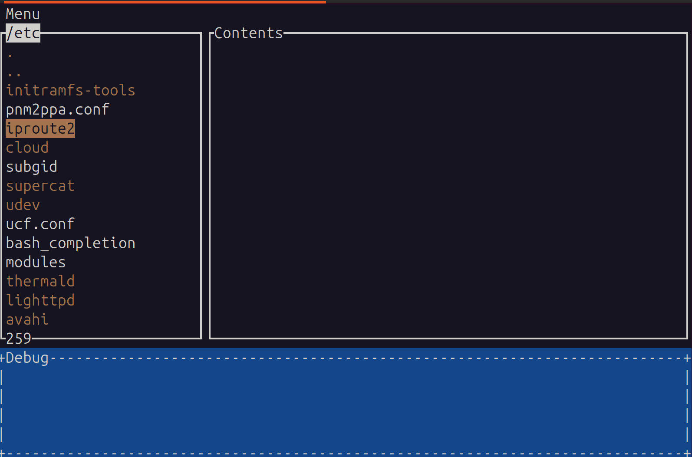

### 12. Scroll
- Scroll APIs
    - int scrollok(WINDOW *win, bool bf);
    - int scroll(WINDOW *win);
    - int scrl(int n);
    - int wscrl(WINDOW *win, int n);
```c
#include <stdlib.h>
#include <string.h>
#include <dirent.h>
#include <limits.h>
#include <curses.h>
#include <panel.h>
#define WINDOWS 4
#define COLOR_OF_DIR    1
#define COLOR_OF_DEBUG_WIN  2
static WINDOW *men_win = NULL;
static WINDOW *fil_win = NULL;
static WINDOW *con_win = NULL;
static WINDOW *dbg_win = NULL;
static WINDOW *hlp_win = NULL;
static WINDOW *inner_win = NULL;
typedef void (*WIN_KEY_HANDLE)(int);
typedef void (*WIN_MOUSE_HANDLE)(MEVENT *event);
typedef void (*WIN_REFRESH)(); // defining a function pointer
static WINDOW *windows[WINDOWS];
static WIN_KEY_HANDLE key_handle_funcs[WINDOWS];
static WIN_MOUSE_HANDLE mouse_handle_funcs[WINDOWS];
static WIN_REFRESH refresh_funcs[WINDOWS];
static int count = 0;
static int current_window_index = -1;
void show_help_window(char *dir, int len) {
    int h = 20;
    int w = 60;
    WINDOW *hlp_win = newwin(h, w, (LINES - h) / 2, (COLS - w) / 2);
    box(hlp_win, 0, 0);
    mvwaddstr(hlp_win, 0, 1, "Help");
    int y = 3;
    int x = 3;
    mvwprintw(hlp_win, y++, x, "ncurses : %s", curses_version());
    mvwprintw(hlp_win, y++, x, "terminal: %s", longname());
    mvwprintw(hlp_win, y++, x, "terminal: %s", termname());
    // Dir: _____________________
    mvwprintw(hlp_win, y, x, "Dir: ");
    x += strlen("Dir: ");
    wbkgdset(hlp_win, A_UNDERLINE);
    waddstr(hlp_win, "                   ");
    wbkgdset(hlp_win, A_NORMAL);
    wmove(hlp_win, y, x);
    curs_set(1);
    echo(); // print back
    nocbreak();
    wgetnstr(hlp_win, dir, len);
    curs_set(0);
    noecho();
    cbreak();
    wrefresh(hlp_win);
    delwin(hlp_win);
}
void init_win_manager() {
    for (int i = 0; i < WINDOWS; i++) {
        windows[i] = NULL;
    }
}
void register_window_with_key_handle(WINDOW *win, 
    WIN_REFRESH refresh_func,
    WIN_KEY_HANDLE key_handle_func,
    WIN_MOUSE_HANDLE mouse_handle_func) {
    windows[count] = win;
    key_handle_funcs[count] = key_handle_func;
    mouse_handle_funcs[count] = mouse_handle_func;
    refresh_funcs[count] = refresh_func;
    count++;
    if (current_window_index == -1) {
        current_window_index = 0;
    }
}
void register_window(WINDOW *win, WIN_REFRESH refresh_func) {
    register_window_with_key_handle(win, refresh_func, NULL, NULL);
}
void next_window() {
    if (current_window_index < count - 1) {
        current_window_index++;
    } else {
        current_window_index = 0;
    }
}
bool is_current_window(WINDOW *win) {
    return windows[current_window_index] == win;
}
static void wm_handle_mouse(MEVENT *event) {
    // which window is under this mouse click
    int window_index = -1;
    if ((event->bstate & BUTTON1_CLICKED) ||
        (event->bstate & BUTTON1_DOUBLE_CLICKED)) {
        for (int i = 0; i < count; i++) {
            if (wenclose(windows[i], event->y, event->x)) {
                window_index = i;
                break;
            }
        }
        if (window_index == -1) {
            return;
        }
        // update current_window_index
        int previous_window_index = current_window_index;
        current_window_index = window_index;
        // refresh the previous current window
        if (refresh_funcs[previous_window_index]) {
            refresh_funcs[previous_window_index]();
        }
        // Forward mouse event
        if (mouse_handle_funcs[current_window_index]) {
            mouse_handle_funcs[current_window_index](event);
        }
        // refresh the current window
        if (refresh_funcs[current_window_index]) {
            refresh_funcs[current_window_index]();
        }
    }
}
void handle_key_in_current_window(int ch) {
    if (ch == KEY_MOUSE) {
        MEVENT event;
        if (getmouse(&event) == OK) {
            wm_handle_mouse(&event);
        }
        return;
    }
    if (0 <= current_window_index && current_window_index < count) {
        if (key_handle_funcs[current_window_index]) {
            key_handle_funcs[current_window_index](ch);
        }
    }
}
void refresh_menu_bar_window() {
    if (is_current_window(men_win)) {wattron(men_win, A_REVERSE);}
    mvwaddstr(men_win,0,1,"Menu");
    if (is_current_window(men_win)) {wattroff(men_win, A_REVERSE);}
    wrefresh(men_win);
}
void create_menu_bar_window(int h, int w, int y, int x) {
    men_win = newwin(h, w, y, x);
    register_window(men_win, refresh_menu_bar_window);
    refresh_menu_bar_window();
}
void delete_menu_bar_window() { delwin(men_win);     men_win = NULL; }
static int entry_count = 0;
static struct dirent **entry_list = NULL; // from <dirent.h>
static char current_path[PATH_MAX];
static int index_of_selected = -1;
static void handle_key(int ch); // see below for the function definition
void refresh_file_list_window();
static void fil_handle_mouse(MEVENT *event) {
    int y = event->y;
    int x = event->x;
    wmouse_trafo(fil_win, &y, &x, FALSE);
    if ((event->bstate & BUTTON1_CLICKED) ||
        (event->bstate & BUTTON1_DOUBLE_CLICKED)) {
        index_of_selected = y - 1;
    }
    if (event->bstate & BUTTON1_DOUBLE_CLICKED) {
        if (index_of_selected >= 0 && index_of_selected < entry_count) {
            struct dirent *entry = entry_list[index_of_selected];
            if (entry->d_type == DT_DIR) {
                enter_dir(entry);
            }
        }
    }
}
void create_file_list_window(int h, int w, int y, int x) {
    fil_win = newwin(h, w, y, x);    
    register_window_with_key_handle(fil_win, refresh_file_list_window, 
        handle_key, fil_handle_mouse);
    current_path[0] = '\0';
    wborder(fil_win, 0, 0, 0, 0, 0, 0, 0, 0);
    mvwaddstr(fil_win, 0, 1, "File List");
    wrefresh(fil_win);
}
void delete_file_list_window() {    
	delwin(fil_win);    
	fil_win = NULL; 
	free(entry_list); 
	entry_list = NULL; 
	entry_count = 0;
}
void refresh_file_list_window() {
    int h = getmaxy(fil_win);
    int w = getmaxx(fil_win);
    wclear(fil_win);
    wborder(fil_win,0,0,0,0,0,0,0,0);
    if (is_current_window(fil_win)) { wattron(fil_win, A_REVERSE); }
    if (strlen(current_path) > w-2) { // print title
       mvwaddnstr(fil_win, 0,1,current_path,w-2-3);
       waddstr(fil_win, "...");
    } else { mvwaddstr(fil_win,0,1,current_path); }
    if (is_current_window(fil_win)) { wattroff(fil_win, A_REVERSE); }
    int y = 1;// Print entries
    if (entry_count == 0) {  
         mvwaddstr(fil_win,1,1,"Nothing");
    } 
    else { 
         for (int row = 0; row < h - 2; row++) { 
            int i=row;
            if (i>=entry_count) {
                break;
            }
            struct dirent *entry = entry_list[i];
            if (i == index_of_selected) {
                wattron(fil_win, A_REVERSE);
            }
            if (entry->d_type == DT_DIR) {
                wattron(fil_win, COLOR_PAIR(COLOR_OF_DIR));
            }
            mvwaddstr(fil_win, y, 1, entry->d_name);
            if (entry->d_type == DT_DIR) {
                wattroff(fil_win, COLOR_PAIR(COLOR_OF_DIR));
            }
            if (i == index_of_selected) {
                wattroff(fil_win, A_REVERSE);
            }
            y++;
      }
    }
    y = h-1;
    mvwprintw(fil_win, y,1,"%d", entry_count); // print footer
    wrefresh(fil_win);
}
void list_dir_in_file_list_window(const char *dir) {
    if (entry_list != NULL) free(entry_list);
    entry_list = NULL;
    entry_count = scandir(dir, &entry_list, NULL, NULL);
    index_of_selected = 0;
    strcpy(current_path, dir);
    refresh_file_list_window();
}
void enter_dir(struct dirent *entry) {
    if (strcmp(entry->d_name, ".") == 0) {
        return;
    }
    char new_dir[PATH_MAX];
    if (strcmp(entry->d_name, "..") == 0) {
        strcpy(new_dir, current_path);
        char *end = strrchr(new_dir, '/');
        *end = '\0';        
    } else {
        sprintf(new_dir, "%s/%s", current_path, entry->d_name);
    }
    list_dir_in_file_list_window(new_dir);
}

static void handle_key(int ch) {
    switch (ch) {
        case KEY_DOWN:
            if (index_of_selected < entry_count - 1) {
                index_of_selected++;
                refresh_file_list_window();
            }
            break;
        case KEY_UP:
            if (index_of_selected > 0) {
                index_of_selected--;
                refresh_file_list_window();
            }
            break;
        case '\n':
            if (0 <= index_of_selected && index_of_selected < entry_count) {
                struct dirent *entry = entry_list[index_of_selected];
                if (entry->d_type == DT_DIR) {
                    enter_dir(entry);
                }
            }
            break;
    }
}
void refresh_contents_window() {
    box(con_win, 0, 0);
    if (is_current_window(con_win)) {wattron(con_win, A_REVERSE);}    
    mvwaddstr(con_win, 0, 1, "Contents");
    if (is_current_window(con_win)) {wattroff(con_win, A_REVERSE);}    
    wrefresh(con_win);
}
void create_contents_window(int h, int w, int y, int x) {
    con_win = newwin(h, w, y, x);
    register_window(con_win,refresh_contents_window);
    refresh_contents_window();
}
void delete_contents_window() { delwin(con_win); con_win = NULL;}
void refresh_debug_window() {    
    wbkgd(dbg_win, COLOR_PAIR(COLOR_OF_DEBUG_WIN));
    wborder(dbg_win, '|', '|', '-', '-', '+', '+', '+', '+');
    if (is_current_window(dbg_win)) {wattron(dbg_win, A_REVERSE);}    
    mvwaddstr(dbg_win, 0, 1, "Debug");
    if (is_current_window(dbg_win)) {wattroff(dbg_win, A_REVERSE);}        
    wrefresh(dbg_win);
}
void create_debug_window(int h, int w, int y, int x) {
    dbg_win = newwin(h, w, y, x);
    wbkgd(dbg_win, COLOR_PAIR(COLOR_OF_DEBUG_WIN));
    // inner_win = subwin(dbg_win, h - 2, w - 2, y + 1, x + 1);
    inner_win = derwin(dbg_win, h - 2, w - 2, 1, 1);
    scrollok(inner_win, TRUE);
    register_window(dbg_win, refresh_debug_window);
    refresh_debug_window();
}
void delete_debug_window() {    
    delwin(dbg_win);    dbg_win = NULL;
    delwin(inner_win);  inner_win = NULL;
}
void debug_line(const char *fmt, ...) {
    // 1: This is a debug line
    // 2: This is another debug line
    int y = count;
    if (count >= 4) {
        wscrl(inner_win, 1);
        y = 3;
    }
    int x = 0;
    mvwprintw(inner_win, y, x, "%d: ", count);
    count++;
    va_list varglist;
    va_start(varglist, fmt);
    vw_printw(inner_win, fmt, varglist);
    va_end(varglist);
    wrefresh(inner_win);
}
int main(int argc, char *argv[]) {
   if (argc < 2) { printf("Usage: ./main <dir>\n"); exit(1); } // check n. of arguments
    initscr();      // Enter curses mode
    cbreak();       // Disable line buffering
    noecho();       // Disable echoing
    keypad(stdscr, TRUE);   // Enable function keys like F1
    curs_set(0);            // Hide cursor
    refresh();
    if (has_colors()) {
        start_color();
        init_pair(COLOR_OF_DIR, COLOR_YELLOW, COLOR_BLACK);
        init_pair(COLOR_OF_DEBUG_WIN, COLOR_WHITE, COLOR_BLUE);
    }
    mousemask(ALL_MOUSE_EVENTS, NULL);
    char *dir = argv[1];
    int len = strlen(dir);
    if (dir[len-1] == '/') {dir[len-1] = '\0';} 
    //
    int h, w;
    getmaxyx(stdscr, h, w);
    int h_files = h - 1 - 6;
    int w_files = w * 0.3;
    init_win_manager();
    create_menu_bar_window(1, w, 0, 0); // top 
    create_file_list_window(h_files, w_files, 1, 0); // left-center
    create_contents_window(h_files, w - w_files, 1, w_files); // right-center
    create_debug_window(6, w, 1 + h_files, 0); // bottom
    list_dir_in_file_list_window(dir);
    //
    int ch;
    while ((ch = getch()) != 'q') { 
        switch (ch)  {
             case 'd': {
                debug_line("This is a debug message");
                break;
            }
           case 'h': {
                char dir[PATH_MAX];
                show_help_window(dir, PATH_MAX - 1);
                if (strlen(dir) > 0) {
                    list_dir_in_file_list_window(dir);
                }
                refresh_file_list_window();
                refresh_contents_window();
                break;
            }
           case '\t':
               next_window();                
               refresh_menu_bar_window();
               refresh_file_list_window();
               refresh_debug_window();
               refresh_contents_window();
               break;
            default:
                handle_key_in_current_window(ch);
                break;
       }
    }
    //
    delete_menu_bar_window();
    delete_file_list_window();
    delete_contents_window();
    delete_debug_window();
    endwin();       // Exit from curses mode
    return 0;
}
```    
    - gcc -o ch12.exe ch12.c -lncurses
    - ./ch12.exe /etc

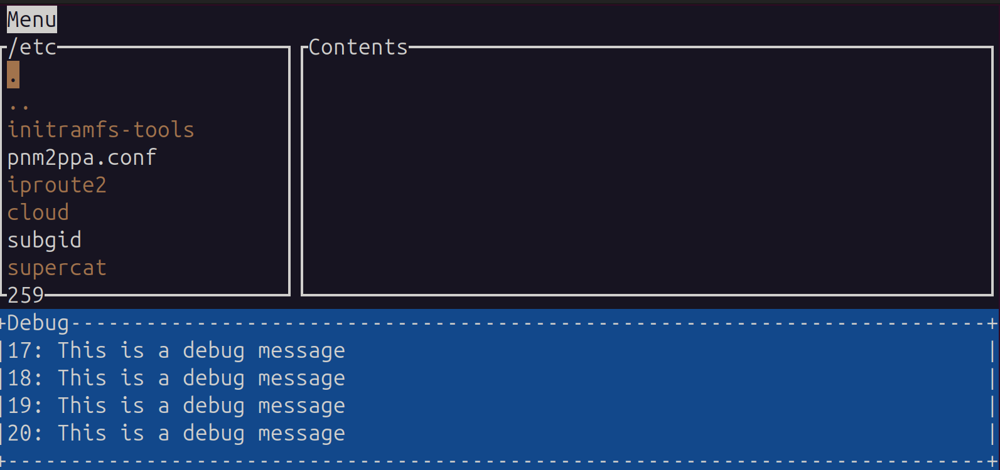

    - Click 'd' to print a message in the Debug window
    - It will scroll down but we cannot scroll up yet    

### 13. Pad
- Lab Task
    - Show text file in the right Contents window
    - Change the original WINDOW object to handle border only
    - Add a new Pad object for the text file contents
        - Pad's height = lines of text file
        - Pad's width = 1024 characters
    - Move Pad around with key down/up/left/right
- Pad APIs
    - WINDOW *newpad(int nlines, int ncols);
    - WINDOW *subpad(WINDOW *orig, int nlines, int ncols, int begin_y, int begin_x);
```c
#include <stdlib.h>
#include <string.h>
#include <dirent.h>
#include <limits.h>
#include <curses.h>
#include <panel.h>
#define WINDOWS 4
#define COLOR_OF_DIR    1
#define COLOR_OF_DEBUG_WIN  2
static WINDOW *men_win = NULL;
static WINDOW *fil_win = NULL;
static WINDOW *con_win = NULL;
static WINDOW *con_pad = NULL;
static WINDOW *dbg_win = NULL;
static WINDOW *hlp_win = NULL;
static WINDOW *inner_win = NULL;
static int index_of_first_line = 0;
static int index_of_first_column = 0;
typedef void (*WIN_KEY_HANDLE)(int);
typedef void (*WIN_MOUSE_HANDLE)(MEVENT *event);
typedef void (*WIN_REFRESH)(); // defining a function pointer
static WINDOW *windows[WINDOWS];
static WIN_KEY_HANDLE key_handle_funcs[WINDOWS];
static WIN_MOUSE_HANDLE mouse_handle_funcs[WINDOWS];
static WIN_REFRESH refresh_funcs[WINDOWS];
static int count = 0;
static int current_window_index = -1;
void show_help_window(char *dir, int len) {
    int h = 20;
    int w = 60;
    WINDOW *hlp_win = newwin(h, w, (LINES - h) / 2, (COLS - w) / 2);
    box(hlp_win, 0, 0);
    mvwaddstr(hlp_win, 0, 1, "Help");
    int y = 3;
    int x = 3;
    mvwprintw(hlp_win, y++, x, "ncurses : %s", curses_version());
    mvwprintw(hlp_win, y++, x, "terminal: %s", longname());
    mvwprintw(hlp_win, y++, x, "terminal: %s", termname());
    // Dir: _____________________
    mvwprintw(hlp_win, y, x, "Dir: ");
    x += strlen("Dir: ");
    wbkgdset(hlp_win, A_UNDERLINE);
    waddstr(hlp_win, "                   ");
    wbkgdset(hlp_win, A_NORMAL);
    wmove(hlp_win, y, x);
    curs_set(1);
    echo(); // print back
    nocbreak();
    wgetnstr(hlp_win, dir, len);
    curs_set(0);
    noecho();
    cbreak();
    wrefresh(hlp_win);
    delwin(hlp_win);
}
void init_win_manager() {
    for (int i = 0; i < WINDOWS; i++) {
        windows[i] = NULL;
    }
}
void register_window_with_key_handle(WINDOW *win, 
    WIN_REFRESH refresh_func,
    WIN_KEY_HANDLE key_handle_func,
    WIN_MOUSE_HANDLE mouse_handle_func) {
    windows[count] = win;
    key_handle_funcs[count] = key_handle_func;
    mouse_handle_funcs[count] = mouse_handle_func;
    refresh_funcs[count] = refresh_func;
    count++;
    if (current_window_index == -1) {
        current_window_index = 0;
    }
}
void register_window(WINDOW *win, WIN_REFRESH refresh_func) {
    register_window_with_key_handle(win, refresh_func, NULL, NULL);
}
void next_window() {
    if (current_window_index < count - 1) {
        current_window_index++;
    } else {
        current_window_index = 0;
    }
}
bool is_current_window(WINDOW *win) {
    return windows[current_window_index] == win;
}
static void wm_handle_mouse(MEVENT *event) {
    // which window is under this mouse click
    int window_index = -1;
    if ((event->bstate & BUTTON1_CLICKED) ||
        (event->bstate & BUTTON1_DOUBLE_CLICKED)) {
        for (int i = 0; i < count; i++) {
            if (wenclose(windows[i], event->y, event->x)) {
                window_index = i;
                break;
            }
        }
        if (window_index == -1) {
            return;
        }
        // update current_window_index
        int previous_window_index = current_window_index;
        current_window_index = window_index;
        // refresh the previous current window
        if (refresh_funcs[previous_window_index]) {
            refresh_funcs[previous_window_index]();
        }
        // Forward mouse event
        if (mouse_handle_funcs[current_window_index]) {
            mouse_handle_funcs[current_window_index](event);
        }
        // refresh the current window
        if (refresh_funcs[current_window_index]) {
            refresh_funcs[current_window_index]();
        }
    }
}
void handle_key_in_current_window(int ch) {
    if (ch == KEY_MOUSE) {
        MEVENT event;
        if (getmouse(&event) == OK) {
            wm_handle_mouse(&event);
        }
        return;
    }
    if (0 <= current_window_index && current_window_index < count) {
        if (key_handle_funcs[current_window_index]) {
            key_handle_funcs[current_window_index](ch);
        }
    }
}
void refresh_menu_bar_window() {
    if (is_current_window(men_win)) {wattron(men_win, A_REVERSE);}
    mvwaddstr(men_win,0,1,"Menu");
    if (is_current_window(men_win)) {wattroff(men_win, A_REVERSE);}
    wrefresh(men_win);
}
void create_menu_bar_window(int h, int w, int y, int x) {
    men_win = newwin(h, w, y, x);
    register_window(men_win, refresh_menu_bar_window);
    refresh_menu_bar_window();
}
void delete_menu_bar_window() { delwin(men_win);     men_win = NULL; }
static int entry_count = 0;
static struct dirent **entry_list = NULL; // from <dirent.h>
static char current_path[PATH_MAX];
static int index_of_selected = -1;
static void handle_key(int ch); // see below for the function definition
void refresh_file_list_window();
static void fil_handle_mouse(MEVENT *event) {
    int y = event->y;
    int x = event->x;
    wmouse_trafo(fil_win, &y, &x, FALSE);
    if ((event->bstate & BUTTON1_CLICKED) ||
        (event->bstate & BUTTON1_DOUBLE_CLICKED)) {
        index_of_selected = y - 1;
    }
    if (event->bstate & BUTTON1_DOUBLE_CLICKED) {
        if (index_of_selected >= 0 && index_of_selected < entry_count) {
            struct dirent *entry = entry_list[index_of_selected];
            if (entry->d_type == DT_DIR) {
                enter_dir(entry);
            }
        }
    }
}
void create_file_list_window(int h, int w, int y, int x) {
    fil_win = newwin(h, w, y, x);    
    register_window_with_key_handle(fil_win, refresh_file_list_window, 
        handle_key, fil_handle_mouse);
    current_path[0] = '\0';
    wborder(fil_win, 0, 0, 0, 0, 0, 0, 0, 0);
    mvwaddstr(fil_win, 0, 1, "File List");
    wrefresh(fil_win);
}
void delete_file_list_window() {    
	delwin(fil_win);    
	fil_win = NULL; 
	free(entry_list); 
	entry_list = NULL; 
	entry_count = 0;
}
void refresh_file_list_window() {
    int h = getmaxy(fil_win);
    int w = getmaxx(fil_win);
    wclear(fil_win);
    wborder(fil_win,0,0,0,0,0,0,0,0);
    if (is_current_window(fil_win)) { wattron(fil_win, A_REVERSE); }
    if (strlen(current_path) > w-2) { // print title
       mvwaddnstr(fil_win, 0,1,current_path,w-2-3);
       waddstr(fil_win, "...");
    } else { mvwaddstr(fil_win,0,1,current_path); }
    if (is_current_window(fil_win)) { wattroff(fil_win, A_REVERSE); }
    int y = 1;// Print entries
    if (entry_count == 0) {  
         mvwaddstr(fil_win,1,1,"Nothing");
    } 
    else { 
         for (int row = 0; row < h - 2; row++) { 
            int i=row;
            if (i>=entry_count) {
                break;
            }
            struct dirent *entry = entry_list[i];
            if (i == index_of_selected) {
                wattron(fil_win, A_REVERSE);
            }
            if (entry->d_type == DT_DIR) {
                wattron(fil_win, COLOR_PAIR(COLOR_OF_DIR));
            }
            mvwaddstr(fil_win, y, 1, entry->d_name);
            if (entry->d_type == DT_DIR) {
                wattroff(fil_win, COLOR_PAIR(COLOR_OF_DIR));
            }
            if (i == index_of_selected) {
                wattroff(fil_win, A_REVERSE);
            }
            y++;
      }
    }
    y = h-1;
    mvwprintw(fil_win, y,1,"%d", entry_count); // print footer
    wrefresh(fil_win);
}
void list_dir_in_file_list_window(const char *dir) {
    if (entry_list != NULL) free(entry_list);
    entry_list = NULL;
    entry_count = scandir(dir, &entry_list, NULL, NULL);
    index_of_selected = 0;
    strcpy(current_path, dir);
    refresh_file_list_window();
}
void enter_dir(struct dirent *entry) {
    if (strcmp(entry->d_name, ".") == 0) {
        return;
    }
    char new_dir[PATH_MAX];
    if (strcmp(entry->d_name, "..") == 0) {
        strcpy(new_dir, current_path);
        char *end = strrchr(new_dir, '/');
        *end = '\0';        
    } else {
        sprintf(new_dir, "%s/%s", current_path, entry->d_name);
    }
    list_dir_in_file_list_window(new_dir);
}
void show_text_file(struct dirent *entry) {
    char file_path[PATH_MAX];
    sprintf(file_path, "%s/%s", current_path, entry->d_name);
    show_text_file_in_contents_window(file_path);
}

static void handle_key(int ch) {
    switch (ch) {
        case KEY_DOWN:
            if (index_of_selected < entry_count - 1) {
                index_of_selected++;
                refresh_file_list_window();
            }
            break;
        case KEY_UP:
            if (index_of_selected > 0) {
                index_of_selected--;
                refresh_file_list_window();
            }
            break;
        case '\n':
            if (0 <= index_of_selected && index_of_selected < entry_count) {
                struct dirent *entry = entry_list[index_of_selected];
                if (entry->d_type == DT_DIR) {
                    enter_dir(entry);
                } else if (entry->d_type == DT_REG) {
                    show_text_file(entry);
                }
            }
            break;
    }
}
static void key_handle(int ch) {
    switch(ch) {
        case KEY_DOWN: {
            int h_contents = getmaxy(con_win) - 2;
            int lines_pad = getmaxy(con_pad);
            if (index_of_first_line + h_contents < lines_pad) {
                index_of_first_line++;
                refresh_contents_window();
            }
            break;
        }
        case KEY_UP: {
            if (index_of_first_line > 0) {
                index_of_first_line--;
                refresh_contents_window();
            }
            break;
        }
        case KEY_LEFT: {
            if (index_of_first_column > 0) {
                index_of_first_column--;
                refresh_contents_window();
            }
            break;
        }
        case KEY_RIGHT: {
            int w_contents = getmaxx(con_win) - 2;
            int columns_pad = getmaxx(con_pad);
            if (index_of_first_column + w_contents < columns_pad) {
                index_of_first_column++;
                refresh_contents_window();
            }
            break;
        }
    }
}
void refresh_contents_window() {
    box(con_win, 0, 0);
    if (is_current_window(con_win)) {wattron(con_win, A_REVERSE);}    
    mvwaddstr(con_win, 0, 1, "Contents");
    if (is_current_window(con_win)) {wattroff(con_win, A_REVERSE);}    
    wrefresh(con_win);
    if (con_pad) {
        int y_win = getbegy(con_win);
        int x_win = getbegx(con_win);
        int h_win = getmaxy(con_win);
        int w_win = getmaxx(con_win);
        int h_contents = h_win - 2;
        int w_contents = w_win - 2;
        prefresh(con_pad, index_of_first_line, index_of_first_column, 
            y_win + 1, x_win + 1,
            y_win + 1 + h_contents - 1,
            x_win + 1 + w_contents - 1
        );
    }
}
void create_contents_window(int h, int w, int y, int x) {
    con_win = newwin(h, w, y, x);
    register_window_with_key_handle(con_win, refresh_contents_window, 
        key_handle, NULL);
    refresh_contents_window();
}
void delete_contents_window() { 
    delwin(con_win); con_win = NULL;
    delwin(con_pad); con_pad = NULL;
}
void show_text_file_in_contents_window(const char *file_path) {
    FILE *f = fopen(file_path, "r");
    if (f == NULL) {
        debug_line("Failed to open %s", file_path);
        return;
    }
    int lines = 0;  
    const int PAD_WIDTH = 1024;
    char buffer[PAD_WIDTH + 1];
    while (fgets(buffer, PAD_WIDTH + 1, f)) {
        lines++;
    }
    rewind(f);
    delwin(con_pad);
    con_pad = newpad(lines, PAD_WIDTH);
    while (fgets(buffer, PAD_WIDTH + 1, f)) {
        wprintw(con_pad, "%s", buffer);
    }
    fclose(f);
    refresh_contents_window();
}
void refresh_debug_window() {    
    wbkgd(dbg_win, COLOR_PAIR(COLOR_OF_DEBUG_WIN));
    wborder(dbg_win, '|', '|', '-', '-', '+', '+', '+', '+');
    if (is_current_window(dbg_win)) {wattron(dbg_win, A_REVERSE);}    
    mvwaddstr(dbg_win, 0, 1, "Debug");
    if (is_current_window(dbg_win)) {wattroff(dbg_win, A_REVERSE);}        
    wrefresh(dbg_win);
}
void create_debug_window(int h, int w, int y, int x) {
    dbg_win = newwin(h, w, y, x);
    wbkgd(dbg_win, COLOR_PAIR(COLOR_OF_DEBUG_WIN));
    // inner_win = subwin(dbg_win, h - 2, w - 2, y + 1, x + 1);
    inner_win = derwin(dbg_win, h - 2, w - 2, 1, 1);
    scrollok(inner_win, TRUE);
    register_window(dbg_win, refresh_debug_window);
    refresh_debug_window();
}
void delete_debug_window() {    
    delwin(dbg_win);    dbg_win = NULL;
    delwin(inner_win);  inner_win = NULL;
}
void debug_line(const char *fmt, ...) {
    // 1: This is a debug line
    // 2: This is another debug line
    int y = count;
    if (count >= 4) {
        wscrl(inner_win, 1);
        y = 3;
    }
    int x = 0;
    mvwprintw(inner_win, y, x, "%d: ", count);
    count++;
    va_list varglist;
    va_start(varglist, fmt);
    vw_printw(inner_win, fmt, varglist);
    va_end(varglist);
    wrefresh(inner_win);
}
int main(int argc, char *argv[]) {
   if (argc < 2) { printf("Usage: ./main <dir>\n"); exit(1); } // check n. of arguments
    initscr();      // Enter curses mode
    cbreak();       // Disable line buffering
    noecho();       // Disable echoing
    keypad(stdscr, TRUE);   // Enable function keys like F1
    curs_set(0);            // Hide cursor
    refresh();
    if (has_colors()) {
        start_color();
        init_pair(COLOR_OF_DIR, COLOR_YELLOW, COLOR_BLACK);
        init_pair(COLOR_OF_DEBUG_WIN, COLOR_WHITE, COLOR_BLUE);
    }
    mousemask(ALL_MOUSE_EVENTS, NULL);
    char *dir = argv[1];
    int len = strlen(dir);
    if (dir[len-1] == '/') {dir[len-1] = '\0';} 
    //
    int h, w;
    getmaxyx(stdscr, h, w);
    int h_files = h - 1 - 6;
    int w_files = w * 0.3;
    init_win_manager();
    create_menu_bar_window(1, w, 0, 0); // top 
    create_file_list_window(h_files, w_files, 1, 0); // left-center
    create_contents_window(h_files, w - w_files, 1, w_files); // right-center
    create_debug_window(6, w, 1 + h_files, 0); // bottom
    list_dir_in_file_list_window(dir);
    //
    int ch;
    while ((ch = getch()) != 'q') { 
        switch (ch)  {
             case 'd': {
                debug_line("This is a debug message");
                break;
            }
           case 'h': {
                char dir[PATH_MAX];
                show_help_window(dir, PATH_MAX - 1);
                if (strlen(dir) > 0) {
                    list_dir_in_file_list_window(dir);
                }
                refresh_file_list_window();
                refresh_contents_window();
                break;
            }
           case '\t':
               next_window();                
               refresh_menu_bar_window();
               refresh_file_list_window();
               refresh_debug_window();
               refresh_contents_window();
               break;
            default:
                handle_key_in_current_window(ch);
                break;
       }
    }
    //
    delete_menu_bar_window();
    delete_file_list_window();
    delete_contents_window();
    delete_debug_window();
    endwin();       // Exit from curses mode
    return 0;
}
```
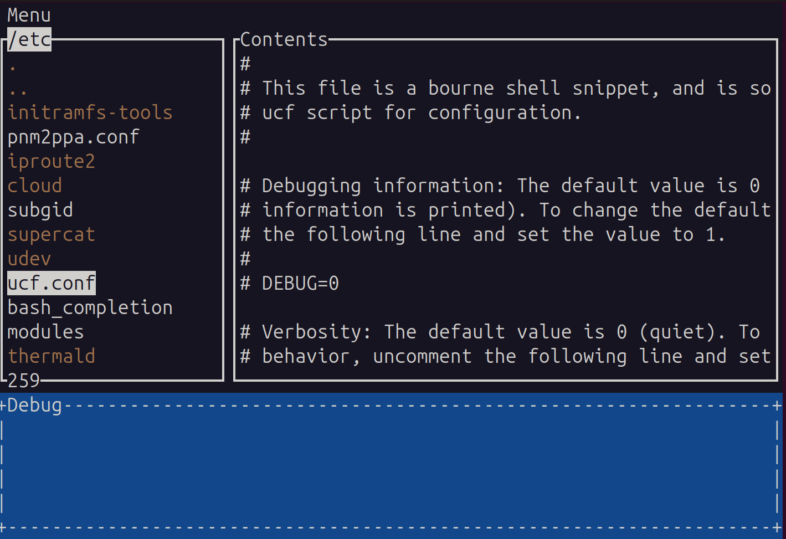

    - Select a file using key or mouse then enter
    - It will show the content of the file in the Content window

### 14. Make file list window scroll-able
- Lab task
    - Using up/down keys, make the list of files scrollable
```c
#include <stdlib.h>
#include <string.h>
#include <dirent.h>
#include <limits.h>
#include <curses.h>
#include <panel.h>
#define WINDOWS 4
#define COLOR_OF_DIR    1
#define COLOR_OF_DEBUG_WIN  2
static WINDOW *men_win = NULL;
static WINDOW *fil_win = NULL;
static WINDOW *con_win = NULL;
static WINDOW *con_pad = NULL;
static WINDOW *dbg_win = NULL;
static WINDOW *hlp_win = NULL;
static WINDOW *inner_win = NULL;
static int con_index_of_first_line = 0;
static int con_index_of_first_column = 0;
static int entry_count = 0;
static struct dirent **entry_list = NULL; // from <dirent.h>
static char current_path[PATH_MAX];
static int index_of_selected = -1;
static int fil_index_of_first_line = -1;
typedef void (*WIN_KEY_HANDLE)(int);
typedef void (*WIN_MOUSE_HANDLE)(MEVENT *event);
typedef void (*WIN_REFRESH)(); // defining a function pointer
static WINDOW *windows[WINDOWS];
static WIN_KEY_HANDLE key_handle_funcs[WINDOWS];
static WIN_MOUSE_HANDLE mouse_handle_funcs[WINDOWS];
static WIN_REFRESH refresh_funcs[WINDOWS];
static int count = 0;
static int current_window_index = -1;
void show_help_window(char *dir, int len) {
    int h = 20;
    int w = 60;
    WINDOW *hlp_win = newwin(h, w, (LINES - h) / 2, (COLS - w) / 2);
    box(hlp_win, 0, 0);
    mvwaddstr(hlp_win, 0, 1, "Help");
    int y = 3;
    int x = 3;
    mvwprintw(hlp_win, y++, x, "ncurses : %s", curses_version());
    mvwprintw(hlp_win, y++, x, "terminal: %s", longname());
    mvwprintw(hlp_win, y++, x, "terminal: %s", termname());
    // Dir: _____________________
    mvwprintw(hlp_win, y, x, "Dir: ");
    x += strlen("Dir: ");
    wbkgdset(hlp_win, A_UNDERLINE);
    waddstr(hlp_win, "                   ");
    wbkgdset(hlp_win, A_NORMAL);
    wmove(hlp_win, y, x);
    curs_set(1);
    echo(); // print back
    nocbreak();
    wgetnstr(hlp_win, dir, len);
    curs_set(0);
    noecho();
    cbreak();
    wrefresh(hlp_win);
    delwin(hlp_win);
}
void init_win_manager() {
    for (int i = 0; i < WINDOWS; i++) {
        windows[i] = NULL;
    }
}
void register_window_with_key_handle(WINDOW *win, 
    WIN_REFRESH refresh_func,
    WIN_KEY_HANDLE key_handle_func,
    WIN_MOUSE_HANDLE mouse_handle_func) {
    windows[count] = win;
    key_handle_funcs[count] = key_handle_func;
    mouse_handle_funcs[count] = mouse_handle_func;
    refresh_funcs[count] = refresh_func;
    count++;
    if (current_window_index == -1) {
        current_window_index = 0;
    }
}
void register_window(WINDOW *win, WIN_REFRESH refresh_func) {
    register_window_with_key_handle(win, refresh_func, NULL, NULL);
}
void next_window() {
    if (current_window_index < count - 1) {
        current_window_index++;
    } else {
        current_window_index = 0;
    }
}
bool is_current_window(WINDOW *win) {
    return windows[current_window_index] == win;
}
static void wm_handle_mouse(MEVENT *event) {
    // which window is under this mouse click
    int window_index = -1;
    if ((event->bstate & BUTTON1_CLICKED) ||
        (event->bstate & BUTTON1_DOUBLE_CLICKED)) {
        for (int i = 0; i < count; i++) {
            if (wenclose(windows[i], event->y, event->x)) {
                window_index = i;
                break;
            }
        }
        if (window_index == -1) {
            return;
        }
        // update current_window_index
        int previous_window_index = current_window_index;
        current_window_index = window_index;
        // refresh the previous current window
        if (refresh_funcs[previous_window_index]) {
            refresh_funcs[previous_window_index]();
        }
        // Forward mouse event
        if (mouse_handle_funcs[current_window_index]) {
            mouse_handle_funcs[current_window_index](event);
        }
        // refresh the current window
        if (refresh_funcs[current_window_index]) {
            refresh_funcs[current_window_index]();
        }
    }
}
void handle_key_in_current_window(int ch) {
    if (ch == KEY_MOUSE) {
        MEVENT event;
        if (getmouse(&event) == OK) {
            wm_handle_mouse(&event);
        }
        return;
    }
    if (0 <= current_window_index && current_window_index < count) {
        if (key_handle_funcs[current_window_index]) {
            key_handle_funcs[current_window_index](ch);
        }
    }
}
void refresh_menu_bar_window() {
    if (is_current_window(men_win)) {wattron(men_win, A_REVERSE);}
    mvwaddstr(men_win,0,1,"Menu");
    if (is_current_window(men_win)) {wattroff(men_win, A_REVERSE);}
    wrefresh(men_win);
}
void create_menu_bar_window(int h, int w, int y, int x) {
    men_win = newwin(h, w, y, x);
    register_window(men_win, refresh_menu_bar_window);
    refresh_menu_bar_window();
}
void delete_menu_bar_window() { delwin(men_win);     men_win = NULL; }
static void handle_key(int ch); // see below for the function definition
void refresh_file_list_window();
static void fil_handle_mouse(MEVENT *event) {
    int y = event->y;
    int x = event->x;
    wmouse_trafo(fil_win, &y, &x, FALSE);
    if ((event->bstate & BUTTON1_CLICKED) ||
        (event->bstate & BUTTON1_DOUBLE_CLICKED)) {
        index_of_selected = y - 1;
    }
    if (event->bstate & BUTTON1_DOUBLE_CLICKED) {
        if (index_of_selected >= 0 && index_of_selected < entry_count) {
            struct dirent *entry = entry_list[index_of_selected];
            if (entry->d_type == DT_DIR) {
                enter_dir(entry);
            }
        }
    }
}
void create_file_list_window(int h, int w, int y, int x) {
    fil_win = newwin(h, w, y, x);    
    register_window_with_key_handle(fil_win, refresh_file_list_window, 
        handle_key, fil_handle_mouse);
    current_path[0] = '\0';
    wborder(fil_win, 0, 0, 0, 0, 0, 0, 0, 0);
    mvwaddstr(fil_win, 0, 1, "File List");
    wrefresh(fil_win);
}
void delete_file_list_window() {    
	delwin(fil_win);    
	fil_win = NULL; 
	free(entry_list); 
	entry_list = NULL; 
	entry_count = 0;
}
void refresh_file_list_window() {
    int h = getmaxy(fil_win);
    int w = getmaxx(fil_win);
    wclear(fil_win);
    wborder(fil_win,0,0,0,0,0,0,0,0);
    if (is_current_window(fil_win)) { wattron(fil_win, A_REVERSE); }
    if (strlen(current_path) > w-2) { // print title
       mvwaddnstr(fil_win, 0,1,current_path,w-2-3);
       waddstr(fil_win, "...");
    } else { mvwaddstr(fil_win,0,1,current_path); }
    if (is_current_window(fil_win)) { wattroff(fil_win, A_REVERSE); }
    int y = 1;// Print entries
    if (entry_count == 0) {  
         mvwaddstr(fil_win,1,1,"Nothing");
    } 
    else { 
         for (int row = 0; row < h - 2; row++) { 
            int i=row + fil_index_of_first_line;
            if (i>=entry_count) {
                break;
            }
            struct dirent *entry = entry_list[i];
            if (i == index_of_selected) {
                wattron(fil_win, A_REVERSE);
            }
            if (entry->d_type == DT_DIR) {
                wattron(fil_win, COLOR_PAIR(COLOR_OF_DIR));
            }
            mvwaddstr(fil_win, y, 1, entry->d_name);
            if (entry->d_type == DT_DIR) {
                wattroff(fil_win, COLOR_PAIR(COLOR_OF_DIR));
            }
            if (i == index_of_selected) {
                wattroff(fil_win, A_REVERSE);
            }
            y++;
      }
    }
    y = h-1;
    mvwprintw(fil_win, y,1,"%d", entry_count); // print footer
    wrefresh(fil_win);
}
void list_dir_in_file_list_window(const char *dir) {
    if (entry_list != NULL) free(entry_list);
    entry_list = NULL;
    entry_count = scandir(dir, &entry_list, NULL, NULL);
    index_of_selected = 0;    
    fil_index_of_first_line = 0;
    strcpy(current_path, dir);
    refresh_file_list_window();
}
void enter_dir(struct dirent *entry) {
    if (strcmp(entry->d_name, ".") == 0) {
        return;
    }
    char new_dir[PATH_MAX];
    if (strcmp(entry->d_name, "..") == 0) {
        strcpy(new_dir, current_path);
        char *end = strrchr(new_dir, '/');
        *end = '\0';        
    } else {
        sprintf(new_dir, "%s/%s", current_path, entry->d_name);
    }
    list_dir_in_file_list_window(new_dir);
}
void show_text_file(struct dirent *entry) {
    char file_path[PATH_MAX];
    sprintf(file_path, "%s/%s", current_path, entry->d_name);
    show_text_file_in_contents_window(file_path);
}
static void handle_mouse(MEVENT *event) {
    int y = event->y;
    int x = event->x;
    wmouse_trafo(fil_win, &y, &x, FALSE);
    if ((event->bstate & BUTTON1_CLICKED) ||
        (event->bstate & BUTTON1_DOUBLE_CLICKED)) {
        index_of_selected = y - 1;
    }
    if (event->bstate & BUTTON1_DOUBLE_CLICKED) {
        if (index_of_selected >= 0 && index_of_selected < entry_count) {
            struct dirent *entry = entry_list[index_of_selected];
            if (entry->d_type == DT_DIR) {
                enter_dir(entry);
            }
        }
    }
}
static void handle_key(int ch) {
    switch (ch) {
        case KEY_DOWN:
            if (index_of_selected < entry_count - 1) {
                index_of_selected++;
                int lines = getmaxy(fil_win) - 2;
                while (index_of_selected - fil_index_of_first_line >= lines) {
                    fil_index_of_first_line++;
                }
                refresh_file_list_window();
            }
            break;
        case KEY_UP:
            if (index_of_selected > 0) {
                index_of_selected--;
                while (index_of_selected - fil_index_of_first_line < 0) {
                    fil_index_of_first_line--;
                }
                refresh_file_list_window();
            }
            break;
        case '\n':
            if (0 <= index_of_selected && index_of_selected < entry_count) {
                struct dirent *entry = entry_list[index_of_selected];
                if (entry->d_type == DT_DIR) {
                    enter_dir(entry);
                } else if (entry->d_type == DT_REG) {
                    show_text_file(entry);
                }
            }
            break;
    }
}
static void key_handle(int ch) {
    switch(ch) {
        case KEY_DOWN: {
            int h_contents = getmaxy(con_win) - 2;
            int lines_pad = getmaxy(con_pad);
            if (con_index_of_first_line + h_contents < lines_pad) {
                con_index_of_first_line++;
                refresh_contents_window();
            }
            break;
        }
        case KEY_UP: {
            if (con_index_of_first_line > 0) {
                con_index_of_first_line--;
                refresh_contents_window();
            }
            break;
        }
        case KEY_LEFT: {
            if (con_index_of_first_column > 0) {
                con_index_of_first_column--;
                refresh_contents_window();
            }
            break;
        }
        case KEY_RIGHT: {
            int w_contents = getmaxx(con_win) - 2;
            int columns_pad = getmaxx(con_pad);
            if (con_index_of_first_column + w_contents < columns_pad) {
                con_index_of_first_column++;
                refresh_contents_window();
            }
            break;
        }
    }
}
void refresh_contents_window() {
    box(con_win, 0, 0);
    if (is_current_window(con_win)) {wattron(con_win, A_REVERSE);}    
    mvwaddstr(con_win, 0, 1, "Contents");
    if (is_current_window(con_win)) {wattroff(con_win, A_REVERSE);}    
    wrefresh(con_win);
    if (con_pad) {
        int y_win = getbegy(con_win);
        int x_win = getbegx(con_win);
        int h_win = getmaxy(con_win);
        int w_win = getmaxx(con_win);
        int h_contents = h_win - 2;
        int w_contents = w_win - 2;
        prefresh(con_pad, con_index_of_first_line, con_index_of_first_column, 
            y_win + 1, x_win + 1,
            y_win + 1 + h_contents - 1,
            x_win + 1 + w_contents - 1
        );
    }
}
void create_contents_window(int h, int w, int y, int x) {
    con_win = newwin(h, w, y, x);
    register_window_with_key_handle(con_win, refresh_contents_window, 
        key_handle, NULL);
    refresh_contents_window();
}
void delete_contents_window() { 
    delwin(con_win); con_win = NULL;
    delwin(con_pad); con_pad = NULL;
}
void show_text_file_in_contents_window(const char *file_path) {
    FILE *f = fopen(file_path, "r");
    if (f == NULL) {
        debug_line("Failed to open %s", file_path);
        return;
    }
    int lines = 0;  
    const int PAD_WIDTH = 1024;
    char buffer[PAD_WIDTH + 1];
    while (fgets(buffer, PAD_WIDTH + 1, f)) {
        lines++;
    }
    rewind(f);
    delwin(con_pad);
    con_pad = newpad(lines, PAD_WIDTH);
    while (fgets(buffer, PAD_WIDTH + 1, f)) {
        wprintw(con_pad, "%s", buffer);
    }
    fclose(f);
    refresh_contents_window();
}
void refresh_debug_window() {    
    wbkgd(dbg_win, COLOR_PAIR(COLOR_OF_DEBUG_WIN));
    wborder(dbg_win, '|', '|', '-', '-', '+', '+', '+', '+');
    if (is_current_window(dbg_win)) {wattron(dbg_win, A_REVERSE);}    
    mvwaddstr(dbg_win, 0, 1, "Debug");
    if (is_current_window(dbg_win)) {wattroff(dbg_win, A_REVERSE);}        
    wrefresh(dbg_win);
}
void create_debug_window(int h, int w, int y, int x) {
    dbg_win = newwin(h, w, y, x);
    wbkgd(dbg_win, COLOR_PAIR(COLOR_OF_DEBUG_WIN));
    // inner_win = subwin(dbg_win, h - 2, w - 2, y + 1, x + 1);
    inner_win = derwin(dbg_win, h - 2, w - 2, 1, 1);
    scrollok(inner_win, TRUE);
    register_window(dbg_win, refresh_debug_window);
    refresh_debug_window();
}
void delete_debug_window() {    
    delwin(dbg_win);    dbg_win = NULL;
    delwin(inner_win);  inner_win = NULL;
}
void debug_line(const char *fmt, ...) {
    // 1: This is a debug line
    // 2: This is another debug line
    int y = count;
    if (count >= 4) {
        wscrl(inner_win, 1);
        y = 3;
    }
    int x = 0;
    mvwprintw(inner_win, y, x, "%d: ", count);
    count++;
    va_list varglist;
    va_start(varglist, fmt);
    vw_printw(inner_win, fmt, varglist);
    va_end(varglist);
    wrefresh(inner_win);
}
int main(int argc, char *argv[]) {
   if (argc < 2) { printf("Usage: ./main <dir>\n"); exit(1); } // check n. of arguments
    initscr();      // Enter curses mode
    cbreak();       // Disable line buffering
    noecho();       // Disable echoing
    keypad(stdscr, TRUE);   // Enable function keys like F1
    curs_set(0);            // Hide cursor
    refresh();
    if (has_colors()) {
        start_color();
        init_pair(COLOR_OF_DIR, COLOR_YELLOW, COLOR_BLACK);
        init_pair(COLOR_OF_DEBUG_WIN, COLOR_WHITE, COLOR_BLUE);
    }
    mousemask(ALL_MOUSE_EVENTS, NULL);
    char *dir = argv[1];
    int len = strlen(dir);
    if (dir[len-1] == '/') {dir[len-1] = '\0';} 
    //
    int h, w;
    getmaxyx(stdscr, h, w);
    int h_files = h - 1 - 6;
    int w_files = w * 0.3;
    init_win_manager();
    create_menu_bar_window(1, w, 0, 0); // top 
    create_file_list_window(h_files, w_files, 1, 0); // left-center
    create_contents_window(h_files, w - w_files, 1, w_files); // right-center
    create_debug_window(6, w, 1 + h_files, 0); // bottom
    list_dir_in_file_list_window(dir);
    //
    int ch;
    while ((ch = getch()) != 'q') { 
        switch (ch)  {
             case 'd': {
                debug_line("This is a debug message");
                break;
            }
           case 'h': {
                char dir[PATH_MAX];
                show_help_window(dir, PATH_MAX - 1);
                if (strlen(dir) > 0) {
                    list_dir_in_file_list_window(dir);
                }
                refresh_file_list_window();
                refresh_contents_window();
                break;
            }
           case '\t':
               next_window();                
               refresh_menu_bar_window();
               refresh_file_list_window();
               refresh_debug_window();
               refresh_contents_window();
               break;
            default:
                handle_key_in_current_window(ch);
                break;
       }
    }
    //
    delete_menu_bar_window();
    delete_file_list_window();
    delete_contents_window();
    delete_debug_window();
    endwin();       // Exit from curses mode
    return 0;
}
```

## Section 3: NCURSES Extensions

### 15. Panel
- Lab task
    - Change all windows to add panels
    - Remove unncessary refresh
- Panel
    - Make windows stacked
    - Makes overlapping windows
    - A window is associated with a panel
    - Panels can be added, moved, modified or removed
    - `#include <panel.h>`
    - `-lpanel -lcurses` in gcc link command
- Panel APIs
    - PANEL *new_panel(WINDOW *win)    ;
    - int del_panel(PANEL *pan);
    - Screens
        - Physical screen, describing what is actually on the screen
        - Virtual screen, describing what the programmer wants to have on the screen
    - void update_panels();
    - int doupdate(void);
```c
#include <stdlib.h>
#include <string.h>
#include <dirent.h>
#include <limits.h>
#include <curses.h>
#include <panel.h>
#define WINDOWS 4
#define COLOR_OF_DIR    1
#define COLOR_OF_DEBUG_WIN  2
static WINDOW *men_win = NULL;
static WINDOW *fil_win = NULL;
static WINDOW *con_win = NULL;
static WINDOW *con_pad = NULL;
static WINDOW *dbg_win = NULL;
//static WINDOW *hlp_win = NULL;
static WINDOW *inner_win = NULL;
static PANEL *fil_panel = NULL;
//static PANEL *hlp_panel = NULL;
static PANEL *con_panel = NULL;
static int con_index_of_first_line = 0;
static int con_index_of_first_column = 0;
static int entry_count = 0;
static struct dirent **entry_list = NULL; // from <dirent.h>
static char current_path[PATH_MAX];
static int index_of_selected = -1;
static int fil_index_of_first_line = -1;
typedef void (*WIN_KEY_HANDLE)(int);
typedef void (*WIN_MOUSE_HANDLE)(MEVENT *event);
typedef void (*WIN_REFRESH)(); // defining a function pointer
static WINDOW *windows[WINDOWS];
static WIN_KEY_HANDLE key_handle_funcs[WINDOWS];
static WIN_MOUSE_HANDLE mouse_handle_funcs[WINDOWS];
static WIN_REFRESH refresh_funcs[WINDOWS];
static int count = 0;
static int current_window_index = -1;
void show_help_window(char *dir, int len) {
    int h = 20;
    int w = 60;
    WINDOW *hlp_win = newwin(h, w, (LINES - h) / 2, (COLS - w) / 2);
    PANEL *hlp_panel = new_panel(hlp_win);
    box(hlp_win, 0, 0);
    mvwaddstr(hlp_win, 0, 1, "Help");
    int y = 3;
    int x = 3;
    mvwprintw(hlp_win, y++, x, "ncurses : %s", curses_version());
    mvwprintw(hlp_win, y++, x, "terminal: %s", longname());
    mvwprintw(hlp_win, y++, x, "terminal: %s", termname());
    // Dir: _____________________
    mvwprintw(hlp_win, y, x, "Dir: ");
    x += strlen("Dir: ");
    wbkgdset(hlp_win, A_UNDERLINE);
    waddstr(hlp_win, "                   ");
    wbkgdset(hlp_win, A_NORMAL);
    wmove(hlp_win, y, x);
    curs_set(1);
    echo(); // print back
    nocbreak();
    wgetnstr(hlp_win, dir, len);
    curs_set(0);
    noecho();
    cbreak();
    wrefresh(hlp_win);
    update_panels();
    doupdate();
    del_panel(hlp_panel);
    delwin(hlp_win);
}
void init_win_manager() {
    for (int i = 0; i < WINDOWS; i++) {
        windows[i] = NULL;
    }
}
void register_window_with_key_handle(WINDOW *win, 
    WIN_REFRESH refresh_func,
    WIN_KEY_HANDLE key_handle_func,
    WIN_MOUSE_HANDLE mouse_handle_func) {
    windows[count] = win;
    key_handle_funcs[count] = key_handle_func;
    mouse_handle_funcs[count] = mouse_handle_func;
    refresh_funcs[count] = refresh_func;
    count++;
    if (current_window_index == -1) {
        current_window_index = 0;
    }
}
void register_window(WINDOW *win, WIN_REFRESH refresh_func) {
    register_window_with_key_handle(win, refresh_func, NULL, NULL);
}
void next_window() {
    if (current_window_index < count - 1) {
        current_window_index++;
    } else {
        current_window_index = 0;
    }
}
bool is_current_window(WINDOW *win) {
    return windows[current_window_index] == win;
}
static void wm_handle_mouse(MEVENT *event) {
    // which window is under this mouse click
    int window_index = -1;
    if ((event->bstate & BUTTON1_CLICKED) ||
        (event->bstate & BUTTON1_DOUBLE_CLICKED)) {
        for (int i = 0; i < count; i++) {
            if (wenclose(windows[i], event->y, event->x)) {
                window_index = i;
                break;
            }
        }
        if (window_index == -1) {
            return;
        }
        // update current_window_index
        int previous_window_index = current_window_index;
        current_window_index = window_index;
        // refresh the previous current window
        if (refresh_funcs[previous_window_index]) {
            refresh_funcs[previous_window_index]();
        }
        // Forward mouse event
        if (mouse_handle_funcs[current_window_index]) {
            mouse_handle_funcs[current_window_index](event);
        }
        // refresh the current window
        if (refresh_funcs[current_window_index]) {
            refresh_funcs[current_window_index]();
        }
    }
}
void handle_key_in_current_window(int ch) {
    if (ch == KEY_MOUSE) {
        MEVENT event;
        if (getmouse(&event) == OK) {
            wm_handle_mouse(&event);
        }
        return;
    }
    if (0 <= current_window_index && current_window_index < count) {
        if (key_handle_funcs[current_window_index]) {
            key_handle_funcs[current_window_index](ch);
        }
    }
}
void refresh_menu_bar_window() {
    if (is_current_window(men_win)) {wattron(men_win, A_REVERSE);}
    mvwaddstr(men_win,0,1,"Menu");
    if (is_current_window(men_win)) {wattroff(men_win, A_REVERSE);}
    wrefresh(men_win);
}
void create_menu_bar_window(int h, int w, int y, int x) {
    men_win = newwin(h, w, y, x);
    register_window(men_win, refresh_menu_bar_window);
    refresh_menu_bar_window();
}
void delete_menu_bar_window() { delwin(men_win);     men_win = NULL; }
static void handle_key(int ch); // see below for the function definition
void refresh_file_list_window();
static void fil_handle_mouse(MEVENT *event) {
    int y = event->y;
    int x = event->x;
    wmouse_trafo(fil_win, &y, &x, FALSE);
    if ((event->bstate & BUTTON1_CLICKED) ||
        (event->bstate & BUTTON1_DOUBLE_CLICKED)) {
        index_of_selected = y - 1;
    }
    if (event->bstate & BUTTON1_DOUBLE_CLICKED) {
        if (index_of_selected >= 0 && index_of_selected < entry_count) {
            struct dirent *entry = entry_list[index_of_selected];
            if (entry->d_type == DT_DIR) {
                enter_dir(entry);
            }
        }
    }
}
void create_file_list_window(int h, int w, int y, int x) {
    fil_win = newwin(h, w, y, x);    
    fil_panel = new_panel(fil_win);
    register_window_with_key_handle(fil_win, refresh_file_list_window, 
        handle_key, fil_handle_mouse);
    current_path[0] = '\0';
    wborder(fil_win, 0, 0, 0, 0, 0, 0, 0, 0);
    mvwaddstr(fil_win, 0, 1, "File List");
    wrefresh(fil_win);
}
void delete_file_list_window() {    
        del_panel(fil_panel);
        fil_panel = NULL;
 	delwin(fil_win);    
	fil_win = NULL; 
	free(entry_list); 
	entry_list = NULL; 
	entry_count = 0;
}
void refresh_file_list_window() {
    int h = getmaxy(fil_win);
    int w = getmaxx(fil_win);
    wclear(fil_win);
    wborder(fil_win,0,0,0,0,0,0,0,0);
    if (is_current_window(fil_win)) { wattron(fil_win, A_REVERSE); }
    if (strlen(current_path) > w-2) { // print title
       mvwaddnstr(fil_win, 0,1,current_path,w-2-3);
       waddstr(fil_win, "...");
    } else { mvwaddstr(fil_win,0,1,current_path); }
    if (is_current_window(fil_win)) { wattroff(fil_win, A_REVERSE); }
    int y = 1;// Print entries
    if (entry_count == 0) {  
         mvwaddstr(fil_win,1,1,"Nothing");
    } 
    else { 
         for (int row = 0; row < h - 2; row++) { 
            int i=row + fil_index_of_first_line;
            if (i>=entry_count) {
                break;
            }
            struct dirent *entry = entry_list[i];
            if (i == index_of_selected) {
                wattron(fil_win, A_REVERSE);
            }
            if (entry->d_type == DT_DIR) {
                wattron(fil_win, COLOR_PAIR(COLOR_OF_DIR));
            }
            mvwaddstr(fil_win, y, 1, entry->d_name);
            if (entry->d_type == DT_DIR) {
                wattroff(fil_win, COLOR_PAIR(COLOR_OF_DIR));
            }
            if (i == index_of_selected) {
                wattroff(fil_win, A_REVERSE);
            }
            y++;
      }
    }
    y = h-1;
    mvwprintw(fil_win, y,1,"%d", entry_count); // print footer
    wrefresh(fil_win);
    update_panels();
    doupdate();
}
void list_dir_in_file_list_window(const char *dir) {
    if (entry_list != NULL) free(entry_list);
    entry_list = NULL;
    entry_count = scandir(dir, &entry_list, NULL, NULL);
    index_of_selected = 0;    
    fil_index_of_first_line = 0;
    strcpy(current_path, dir);
    refresh_file_list_window();
}
void enter_dir(struct dirent *entry) {
    if (strcmp(entry->d_name, ".") == 0) {
        return;
    }
    char new_dir[PATH_MAX];
    if (strcmp(entry->d_name, "..") == 0) {
        strcpy(new_dir, current_path);
        char *end = strrchr(new_dir, '/');
        *end = '\0';        
    } else {
        sprintf(new_dir, "%s/%s", current_path, entry->d_name);
    }
    list_dir_in_file_list_window(new_dir);
}
void show_text_file(struct dirent *entry) {
    char file_path[PATH_MAX];
    sprintf(file_path, "%s/%s", current_path, entry->d_name);
    show_text_file_in_contents_window(file_path);
}
static void handle_mouse(MEVENT *event) {
    int y = event->y;
    int x = event->x;
    wmouse_trafo(fil_win, &y, &x, FALSE);
    if ((event->bstate & BUTTON1_CLICKED) ||
        (event->bstate & BUTTON1_DOUBLE_CLICKED)) {
        index_of_selected = y - 1;
    }
    if (event->bstate & BUTTON1_DOUBLE_CLICKED) {
        if (index_of_selected >= 0 && index_of_selected < entry_count) {
            struct dirent *entry = entry_list[index_of_selected];
            if (entry->d_type == DT_DIR) {
                enter_dir(entry);
            }
        }
    }
}
static void handle_key(int ch) {
    switch (ch) {
        case KEY_DOWN:
            if (index_of_selected < entry_count - 1) {
                index_of_selected++;
                int lines = getmaxy(fil_win) - 2;
                while (index_of_selected - fil_index_of_first_line >= lines) {
                    fil_index_of_first_line++;
                }
                refresh_file_list_window();
            }
            break;
        case KEY_UP:
            if (index_of_selected > 0) {
                index_of_selected--;
                while (index_of_selected - fil_index_of_first_line < 0) {
                    fil_index_of_first_line--;
                }
                refresh_file_list_window();
            }
            break;
        case '\n':
            if (0 <= index_of_selected && index_of_selected < entry_count) {
                struct dirent *entry = entry_list[index_of_selected];
                if (entry->d_type == DT_DIR) {
                    enter_dir(entry);
                } else if (entry->d_type == DT_REG) {
                    show_text_file(entry);
                }
            }
            break;
    }
}
static void key_handle(int ch) {
    switch(ch) {
        case KEY_DOWN: {
            int h_contents = getmaxy(con_win) - 2;
            int lines_pad = getmaxy(con_pad);
            if (con_index_of_first_line + h_contents < lines_pad) {
                con_index_of_first_line++;
                refresh_contents_window();
            }
            break;
        }
        case KEY_UP: {
            if (con_index_of_first_line > 0) {
                con_index_of_first_line--;
                refresh_contents_window();
            }
            break;
        }
        case KEY_LEFT: {
            if (con_index_of_first_column > 0) {
                con_index_of_first_column--;
                refresh_contents_window();
            }
            break;
        }
        case KEY_RIGHT: {
            int w_contents = getmaxx(con_win) - 2;
            int columns_pad = getmaxx(con_pad);
            if (con_index_of_first_column + w_contents < columns_pad) {
                con_index_of_first_column++;
                refresh_contents_window();
            }
            break;
        }
    }
}
void refresh_contents_window() {
    box(con_win, 0, 0);
    if (is_current_window(con_win)) {wattron(con_win, A_REVERSE);}    
    mvwaddstr(con_win, 0, 1, "Contents");
    if (is_current_window(con_win)) {wattroff(con_win, A_REVERSE);}    
    wrefresh(con_win);
    if (con_pad) {
        int y_win = getbegy(con_win);
        int x_win = getbegx(con_win);
        int h_win = getmaxy(con_win);
        int w_win = getmaxx(con_win);
        int h_contents = h_win - 2;
        int w_contents = w_win - 2;
        prefresh(con_pad, con_index_of_first_line, con_index_of_first_column, 
            y_win + 1, x_win + 1,
            y_win + 1 + h_contents - 1,
            x_win + 1 + w_contents - 1
        );
    }
    update_panels();
    doupdate();
}
void create_contents_window(int h, int w, int y, int x) {
    con_win = newwin(h, w, y, x);
    con_panel = new_panel(con_win);
    register_window_with_key_handle(con_win, refresh_contents_window, 
        key_handle, NULL);
    refresh_contents_window();
}
void delete_contents_window() { 
    del_panel(con_panel); con_panel = NULL;
    delwin(con_win); con_win = NULL;
    delwin(con_pad); con_pad = NULL;
}
void show_text_file_in_contents_window(const char *file_path) {
    FILE *f = fopen(file_path, "r");
    if (f == NULL) {
        debug_line("Failed to open %s", file_path);
        return;
    }
    int lines = 0;  
    const int PAD_WIDTH = 1024;
    char buffer[PAD_WIDTH + 1];
    while (fgets(buffer, PAD_WIDTH + 1, f)) {
        lines++;
    }
    rewind(f);
    delwin(con_pad);
    con_pad = newpad(lines, PAD_WIDTH);
    while (fgets(buffer, PAD_WIDTH + 1, f)) {
        wprintw(con_pad, "%s", buffer);
    }
    fclose(f);
    refresh_contents_window();
}
void refresh_debug_window() {    
    wbkgd(dbg_win, COLOR_PAIR(COLOR_OF_DEBUG_WIN));
    wborder(dbg_win, '|', '|', '-', '-', '+', '+', '+', '+');
    if (is_current_window(dbg_win)) {wattron(dbg_win, A_REVERSE);}    
    mvwaddstr(dbg_win, 0, 1, "Debug");
    if (is_current_window(dbg_win)) {wattroff(dbg_win, A_REVERSE);}        
    wrefresh(dbg_win);
}
void create_debug_window(int h, int w, int y, int x) {
    dbg_win = newwin(h, w, y, x);
    wbkgd(dbg_win, COLOR_PAIR(COLOR_OF_DEBUG_WIN));
    // inner_win = subwin(dbg_win, h - 2, w - 2, y + 1, x + 1);
    inner_win = derwin(dbg_win, h - 2, w - 2, 1, 1);
    scrollok(inner_win, TRUE);
    register_window(dbg_win, refresh_debug_window);
    refresh_debug_window();
}
void delete_debug_window() {    
    delwin(dbg_win);    dbg_win = NULL;
    delwin(inner_win);  inner_win = NULL;
}
void debug_line(const char *fmt, ...) {
    // 1: This is a debug line
    // 2: This is another debug line
    int y = count;
    if (count >= 4) {
        wscrl(inner_win, 1);
        y = 3;
    }
    int x = 0;
    mvwprintw(inner_win, y, x, "%d: ", count);
    count++;
    va_list varglist;
    va_start(varglist, fmt);
    vw_printw(inner_win, fmt, varglist);
    va_end(varglist);
    wrefresh(inner_win);
}
int main(int argc, char *argv[]) {
   if (argc < 2) { printf("Usage: ./main <dir>\n"); exit(1); } // check n. of arguments
    initscr();      // Enter curses mode
    cbreak();       // Disable line buffering
    noecho();       // Disable echoing
    keypad(stdscr, TRUE);   // Enable function keys like F1
    curs_set(0);            // Hide cursor
    refresh();
    if (has_colors()) {
        start_color();
        init_pair(COLOR_OF_DIR, COLOR_YELLOW, COLOR_BLACK);
        init_pair(COLOR_OF_DEBUG_WIN, COLOR_WHITE, COLOR_BLUE);
    }
    mousemask(ALL_MOUSE_EVENTS, NULL);
    char *dir = argv[1];
    int len = strlen(dir);
    if (dir[len-1] == '/') {dir[len-1] = '\0';} 
    //
    int h, w;
    getmaxyx(stdscr, h, w);
    int h_files = h - 1 - 6;
    int w_files = w * 0.3;
    init_win_manager();
    create_menu_bar_window(1, w, 0, 0); // top 
    create_file_list_window(h_files, w_files, 1, 0); // left-center
    create_contents_window(h_files, w - w_files, 1, w_files); // right-center
    create_debug_window(6, w, 1 + h_files, 0); // bottom
    list_dir_in_file_list_window(dir);
    //
    int ch;
    while ((ch = getch()) != 'q') { 
        switch (ch)  {
             case 'd': {
                debug_line("This is a debug message");
                break;
            }
           case 'h': {
                char dir[PATH_MAX];
                show_help_window(dir, PATH_MAX - 1);
                if (strlen(dir) > 0) {
                    list_dir_in_file_list_window(dir);
                }
                update_panels();
                doupdate();
                break;
            }
           case '\t':
               next_window();                
               refresh_menu_bar_window();
               refresh_file_list_window();
               refresh_debug_window();
               refresh_contents_window();
               break;
            default:
                handle_key_in_current_window(ch);
                break;
       }
    }
    //
    delete_menu_bar_window();
    delete_file_list_window();
    delete_contents_window();
    delete_debug_window();
    endwin();       // Exit from curses mode
    return 0;
}
```    
- gcc -o ch15.exe ch15.c -lpanel -lncurses
- ./ch15.exe /etc

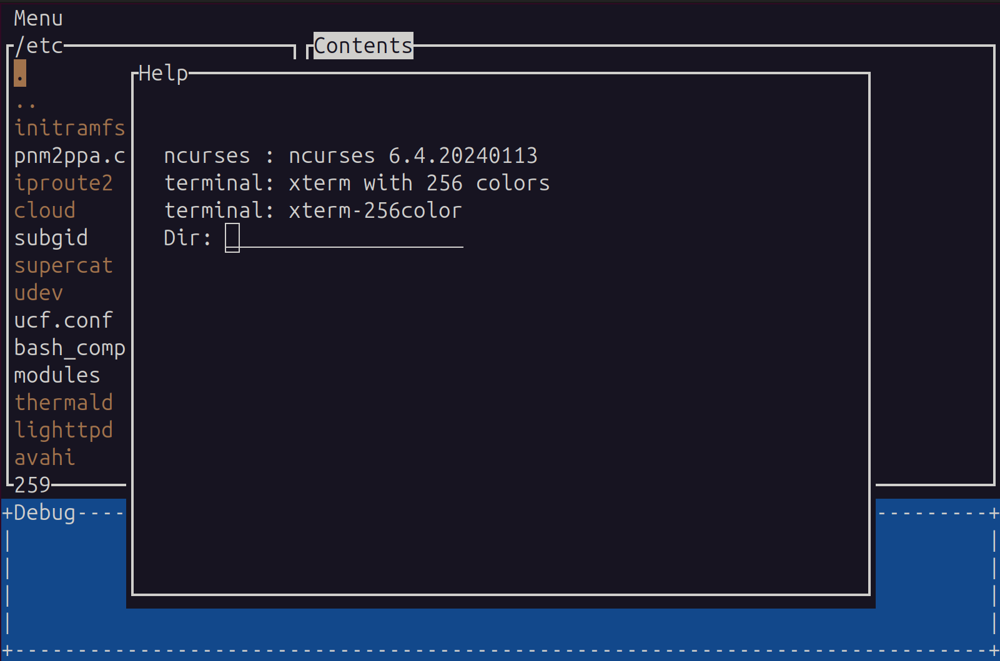
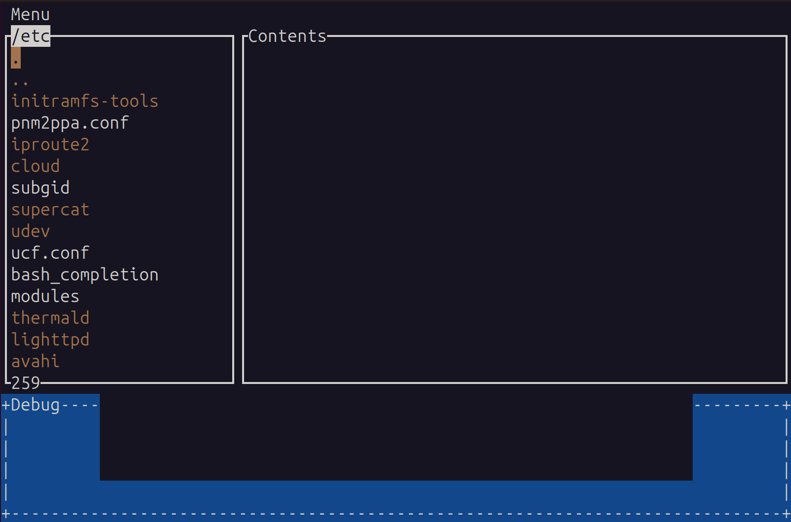

    - Click 'h' to show Help window. Then Enter to remove it. File/Contents windows refresh pad while Debug window doesn't as it is not implemented yet

### 16. Menu
- Lab task
    - Add menu in the menu bar window
- To use menu
    - `#include <menu.h>`
    - `-lmenu -lcurses` in gcc link command line
- Menu APIs
    - MENU *new_menu(ITEM **items);
    - int free_menu(MENU *menu);
    - ITEM *new_item(const char *name, const char *description);
    - int free_item(ITEM *item);
```c
#include <stdlib.h>
#include <string.h>
#include <dirent.h>
#include <limits.h>
#include <curses.h>
#include <panel.h>
#include <menu.h>
#define WINDOWS 4
#define COLOR_OF_DIR        1
#define COLOR_OF_DEBUG_WIN  2
#define COLOR_OF_MENU_FORE  3
#define COMMAND_NONE    0
#define COMMAND_HELP    1
#define COMMAND_EXIT    2
static WINDOW *men_win = NULL;
static WINDOW *fil_win = NULL;
static WINDOW *con_win = NULL;
static WINDOW *con_pad = NULL;
static WINDOW *dbg_win = NULL;
static WINDOW *inner_win = NULL;
static PANEL *fil_panel = NULL;
static PANEL *con_panel = NULL;
static int con_index_of_first_line = 0;
static int con_index_of_first_column = 0;
static int entry_count = 0;
static struct dirent **entry_list = NULL; // from <dirent.h>
static char current_path[PATH_MAX];
static int index_of_selected = -1;
static int fil_index_of_first_line = -1;
typedef void (*WIN_KEY_HANDLE)(int);
typedef void (*WIN_MOUSE_HANDLE)(MEVENT *event);
typedef void (*WIN_REFRESH)(); // defining a function pointer
static WINDOW *windows[WINDOWS];
static WIN_KEY_HANDLE key_handle_funcs[WINDOWS];
static WIN_MOUSE_HANDLE mouse_handle_funcs[WINDOWS];
static WIN_REFRESH refresh_funcs[WINDOWS];
static int count = 0;
static int current_window_index = -1;
void show_help_window(char *dir, int len) {
    int h = 20;
    int w = 60;
    WINDOW *hlp_win = newwin(h, w, (LINES - h) / 2, (COLS - w) / 2);
    PANEL *hlp_panel = new_panel(hlp_win);
    box(hlp_win, 0, 0);
    mvwaddstr(hlp_win, 0, 1, "Help");
    int y = 3;
    int x = 3;
    mvwprintw(hlp_win, y++, x, "ncurses : %s", curses_version());
    mvwprintw(hlp_win, y++, x, "terminal: %s", longname());
    mvwprintw(hlp_win, y++, x, "terminal: %s", termname());
    // Dir: _____________________
    mvwprintw(hlp_win, y, x, "Dir: ");
    x += strlen("Dir: ");
    wbkgdset(hlp_win, A_UNDERLINE);
    waddstr(hlp_win, "                   ");
    wbkgdset(hlp_win, A_NORMAL);
    wmove(hlp_win, y, x);
    curs_set(1);
    echo(); // print back
    nocbreak();
    wgetnstr(hlp_win, dir, len);
    curs_set(0);
    noecho();
    cbreak();
    wrefresh(hlp_win);
    update_panels();
    doupdate();
    del_panel(hlp_panel);
    delwin(hlp_win);
}
void init_win_manager() {
    for (int i = 0; i < WINDOWS; i++) {
        windows[i] = NULL;
    }
}
void register_window_with_key_handle(WINDOW *win, 
    WIN_REFRESH refresh_func,
    WIN_KEY_HANDLE key_handle_func,
    WIN_MOUSE_HANDLE mouse_handle_func) {
    windows[count] = win;
    key_handle_funcs[count] = key_handle_func;
    mouse_handle_funcs[count] = mouse_handle_func;
    refresh_funcs[count] = refresh_func;
    count++;
    if (current_window_index == -1) {
        current_window_index = 0;
    }
}
void register_window(WINDOW *win, WIN_REFRESH refresh_func) {
    register_window_with_key_handle(win, refresh_func, NULL, NULL);
}
void next_window() {
    if (current_window_index < count - 1) {
        current_window_index++;
    } else {
        current_window_index = 0;
    }
}
bool is_current_window(WINDOW *win) {
    return windows[current_window_index] == win;
}
static void wm_handle_mouse(MEVENT *event) {
    // which window is under this mouse click
    int window_index = -1;
    if ((event->bstate & BUTTON1_CLICKED) ||
        (event->bstate & BUTTON1_DOUBLE_CLICKED)) {
        for (int i = 0; i < count; i++) {
            if (wenclose(windows[i], event->y, event->x)) {
                window_index = i;
                break;
            }
        }
        if (window_index == -1) {
            return;
        }
        // update current_window_index
        int previous_window_index = current_window_index;
        current_window_index = window_index;
        // refresh the previous current window
        if (refresh_funcs[previous_window_index]) {
            refresh_funcs[previous_window_index]();
        }
        // Forward mouse event
        if (mouse_handle_funcs[current_window_index]) {
            mouse_handle_funcs[current_window_index](event);
        }
        // refresh the current window
        if (refresh_funcs[current_window_index]) {
            refresh_funcs[current_window_index]();
        }
    }
}
void handle_key_in_current_window(int ch) {
    if (ch == KEY_MOUSE) {
        MEVENT event;
        if (getmouse(&event) == OK) {
            wm_handle_mouse(&event);
        }
        return;
    }
    if (0 <= current_window_index && current_window_index < count) {
        if (key_handle_funcs[current_window_index]) {
            key_handle_funcs[current_window_index](ch);
        }
    }
}
void refresh_menu_bar_window() {
    if (is_current_window(men_win)) {wattron(men_win, A_REVERSE);}
    mvwaddstr(men_win,0,1,"Menu");
    if (is_current_window(men_win)) {wattroff(men_win, A_REVERSE);}
    wrefresh(men_win);
}
void create_menu_bar_window(int h, int w, int y, int x) {
    men_win = newwin(h, w, y, x);
    register_window(men_win, refresh_menu_bar_window);
    refresh_menu_bar_window();
}
void delete_menu_bar_window() { delwin(men_win);     men_win = NULL; }
int show_menu() {
    ITEM *items[3];
    items[0] = new_item("Help", "Show help window");
    items[1] = new_item("Exit", NULL);
    items[2] = NULL;
    MENU *menu = new_menu(items);
    set_menu_mark(menu, " * ");
    set_menu_pad(menu, '-');
    set_menu_fore(menu, COLOR_PAIR(COLOR_OF_MENU_FORE));
    int rows, columns;
    scale_menu(menu, &rows, &columns);
    WINDOW *win_menu = newwin(rows + 2, columns + 2, 1, 1);
    PANEL *panel = new_panel(win_menu);
    box(win_menu, 0, 0);
    WINDOW *subwin_menu = derwin(win_menu, rows, columns, 1, 1);
    set_menu_win(menu, win_menu);
    set_menu_sub(menu, subwin_menu);
    post_menu(menu);
    update_panels();
    doupdate();
    int ch;
    int command = COMMAND_NONE;
    while ((command == COMMAND_NONE) && (ch = getch()) != 'm') {
        switch(ch) {
            case KEY_DOWN:
                menu_driver(menu, REQ_DOWN_ITEM);
                wrefresh(win_menu);
                break;
            case KEY_UP:
                menu_driver(menu, REQ_UP_ITEM);
                wrefresh(win_menu);
                break;
            case '\n': {
                ITEM *cur_item = current_item(menu);
                const char *name = item_name(cur_item);
                if (strcmp(name, "Help") == 0) {
                    command = COMMAND_HELP;
                } else if (strcmp(name, "Exit") == 0) {
                    command = COMMAND_EXIT;
                }
                break;
            }
        }
    }
    unpost_menu(menu);
    del_panel(panel);
    delwin(win_menu);
    delwin(subwin_menu);
    free_menu(menu);
    free_item(items[0]);
    free_item(items[1]);
    update_panels();
    doupdate();
    return command;
}
// ########### window manager below
static void handle_key(int ch); // see below for the function definition
void refresh_file_list_window();
static void fil_handle_mouse(MEVENT *event) {
    int y = event->y;
    int x = event->x;
    wmouse_trafo(fil_win, &y, &x, FALSE);
    if ((event->bstate & BUTTON1_CLICKED) ||
        (event->bstate & BUTTON1_DOUBLE_CLICKED)) {
        index_of_selected = y - 1;
    }
    if (event->bstate & BUTTON1_DOUBLE_CLICKED) {
        if (index_of_selected >= 0 && index_of_selected < entry_count) {
            struct dirent *entry = entry_list[index_of_selected];
            if (entry->d_type == DT_DIR) {
                enter_dir(entry);
            }
        }
    }
}
void create_file_list_window(int h, int w, int y, int x) {
    fil_win = newwin(h, w, y, x);    
    fil_panel = new_panel(fil_win);
    register_window_with_key_handle(fil_win, refresh_file_list_window, 
        handle_key, fil_handle_mouse);
    current_path[0] = '\0';
    wborder(fil_win, 0, 0, 0, 0, 0, 0, 0, 0);
    mvwaddstr(fil_win, 0, 1, "File List");
    wrefresh(fil_win);
}
void delete_file_list_window() {    
        del_panel(fil_panel);
        fil_panel = NULL;
 	delwin(fil_win);    
	fil_win = NULL; 
	free(entry_list); 
	entry_list = NULL; 
	entry_count = 0;
}
void refresh_file_list_window() {
    int h = getmaxy(fil_win);
    int w = getmaxx(fil_win);
    wclear(fil_win);
    wborder(fil_win,0,0,0,0,0,0,0,0);
    if (is_current_window(fil_win)) { wattron(fil_win, A_REVERSE); }
    if (strlen(current_path) > w-2) { // print title
       mvwaddnstr(fil_win, 0,1,current_path,w-2-3);
       waddstr(fil_win, "...");
    } else { mvwaddstr(fil_win,0,1,current_path); }
    if (is_current_window(fil_win)) { wattroff(fil_win, A_REVERSE); }
    int y = 1;// Print entries
    if (entry_count == 0) {  
         mvwaddstr(fil_win,1,1,"Nothing");
    } 
    else { 
         for (int row = 0; row < h - 2; row++) { 
            int i=row + fil_index_of_first_line;
            if (i>=entry_count) {
                break;
            }
            struct dirent *entry = entry_list[i];
            if (i == index_of_selected) {
                wattron(fil_win, A_REVERSE);
            }
            if (entry->d_type == DT_DIR) {
                wattron(fil_win, COLOR_PAIR(COLOR_OF_DIR));
            }
            mvwaddstr(fil_win, y, 1, entry->d_name);
            if (entry->d_type == DT_DIR) {
                wattroff(fil_win, COLOR_PAIR(COLOR_OF_DIR));
            }
            if (i == index_of_selected) {
                wattroff(fil_win, A_REVERSE);
            }
            y++;
      }
    }
    y = h-1;
    mvwprintw(fil_win, y,1,"%d", entry_count); // print footer
    wrefresh(fil_win);
    update_panels();
    doupdate();
}
void list_dir_in_file_list_window(const char *dir) {
    if (entry_list != NULL) free(entry_list);
    entry_list = NULL;
    entry_count = scandir(dir, &entry_list, NULL, NULL);
    index_of_selected = 0;    
    fil_index_of_first_line = 0;
    strcpy(current_path, dir);
    refresh_file_list_window();
}
void enter_dir(struct dirent *entry) {
    if (strcmp(entry->d_name, ".") == 0) {
        return;
    }
    char new_dir[PATH_MAX];
    if (strcmp(entry->d_name, "..") == 0) {
        strcpy(new_dir, current_path);
        char *end = strrchr(new_dir, '/');
        *end = '\0';        
    } else {
        sprintf(new_dir, "%s/%s", current_path, entry->d_name);
    }
    list_dir_in_file_list_window(new_dir);
}
void show_text_file(struct dirent *entry) {
    char file_path[PATH_MAX];
    sprintf(file_path, "%s/%s", current_path, entry->d_name);
    show_text_file_in_contents_window(file_path);
}
static void handle_mouse(MEVENT *event) {
    int y = event->y;
    int x = event->x;
    wmouse_trafo(fil_win, &y, &x, FALSE);
    if ((event->bstate & BUTTON1_CLICKED) ||
        (event->bstate & BUTTON1_DOUBLE_CLICKED)) {
        index_of_selected = y - 1;
    }
    if (event->bstate & BUTTON1_DOUBLE_CLICKED) {
        if (index_of_selected >= 0 && index_of_selected < entry_count) {
            struct dirent *entry = entry_list[index_of_selected];
            if (entry->d_type == DT_DIR) {
                enter_dir(entry);
            }
        }
    }
}
static void handle_key(int ch) {
    switch (ch) {
        case KEY_DOWN:
            if (index_of_selected < entry_count - 1) {
                index_of_selected++;
                int lines = getmaxy(fil_win) - 2;
                while (index_of_selected - fil_index_of_first_line >= lines) {
                    fil_index_of_first_line++;
                }
                refresh_file_list_window();
            }
            break;
        case KEY_UP:
            if (index_of_selected > 0) {
                index_of_selected--;
                while (index_of_selected - fil_index_of_first_line < 0) {
                    fil_index_of_first_line--;
                }
                refresh_file_list_window();
            }
            break;
        case '\n':
            if (0 <= index_of_selected && index_of_selected < entry_count) {
                struct dirent *entry = entry_list[index_of_selected];
                if (entry->d_type == DT_DIR) {
                    enter_dir(entry);
                } else if (entry->d_type == DT_REG) {
                    show_text_file(entry);
                }
            }
            break;
    }
}
static void key_handle(int ch) {
    switch(ch) {
        case KEY_DOWN: {
            int h_contents = getmaxy(con_win) - 2;
            int lines_pad = getmaxy(con_pad);
            if (con_index_of_first_line + h_contents < lines_pad) {
                con_index_of_first_line++;
                refresh_contents_window();
            }
            break;
        }
        case KEY_UP: {
            if (con_index_of_first_line > 0) {
                con_index_of_first_line--;
                refresh_contents_window();
            }
            break;
        }
        case KEY_LEFT: {
            if (con_index_of_first_column > 0) {
                con_index_of_first_column--;
                refresh_contents_window();
            }
            break;
        }
        case KEY_RIGHT: {
            int w_contents = getmaxx(con_win) - 2;
            int columns_pad = getmaxx(con_pad);
            if (con_index_of_first_column + w_contents < columns_pad) {
                con_index_of_first_column++;
                refresh_contents_window();
            }
            break;
        }
    }
}
void refresh_contents_window() {
    box(con_win, 0, 0);
    if (is_current_window(con_win)) {wattron(con_win, A_REVERSE);}    
    mvwaddstr(con_win, 0, 1, "Contents");
    if (is_current_window(con_win)) {wattroff(con_win, A_REVERSE);}    
    wrefresh(con_win);
    if (con_pad) {
        int y_win = getbegy(con_win);
        int x_win = getbegx(con_win);
        int h_win = getmaxy(con_win);
        int w_win = getmaxx(con_win);
        int h_contents = h_win - 2;
        int w_contents = w_win - 2;
        prefresh(con_pad, con_index_of_first_line, con_index_of_first_column, 
            y_win + 1, x_win + 1,
            y_win + 1 + h_contents - 1,
            x_win + 1 + w_contents - 1
        );
    }
    update_panels();
    doupdate();
}
void create_contents_window(int h, int w, int y, int x) {
    con_win = newwin(h, w, y, x);
    con_panel = new_panel(con_win);
    register_window_with_key_handle(con_win, refresh_contents_window, 
        key_handle, NULL);
    refresh_contents_window();
}
void delete_contents_window() { 
    del_panel(con_panel); con_panel = NULL;
    delwin(con_win); con_win = NULL;
    delwin(con_pad); con_pad = NULL;
}
void show_text_file_in_contents_window(const char *file_path) {
    FILE *f = fopen(file_path, "r");
    if (f == NULL) {
        debug_line("Failed to open %s", file_path);
        return;
    }
    int lines = 0;  
    const int PAD_WIDTH = 1024;
    char buffer[PAD_WIDTH + 1];
    while (fgets(buffer, PAD_WIDTH + 1, f)) {
        lines++;
    }
    rewind(f);
    delwin(con_pad);
    con_pad = newpad(lines, PAD_WIDTH);
    while (fgets(buffer, PAD_WIDTH + 1, f)) {
        wprintw(con_pad, "%s", buffer);
    }
    fclose(f);
    refresh_contents_window();
}
void refresh_debug_window() {    
    wbkgd(dbg_win, COLOR_PAIR(COLOR_OF_DEBUG_WIN));
    wborder(dbg_win, '|', '|', '-', '-', '+', '+', '+', '+');
    if (is_current_window(dbg_win)) {wattron(dbg_win, A_REVERSE);}    
    mvwaddstr(dbg_win, 0, 1, "Debug");
    if (is_current_window(dbg_win)) {wattroff(dbg_win, A_REVERSE);}        
    wrefresh(dbg_win);
}
void create_debug_window(int h, int w, int y, int x) {
    dbg_win = newwin(h, w, y, x);
    wbkgd(dbg_win, COLOR_PAIR(COLOR_OF_DEBUG_WIN));
    // inner_win = subwin(dbg_win, h - 2, w - 2, y + 1, x + 1);
    inner_win = derwin(dbg_win, h - 2, w - 2, 1, 1);
    scrollok(inner_win, TRUE);
    register_window(dbg_win, refresh_debug_window);
    refresh_debug_window();
}
void delete_debug_window() {    
    delwin(dbg_win);    dbg_win = NULL;
    delwin(inner_win);  inner_win = NULL;
}
void debug_line(const char *fmt, ...) {
    // 1: This is a debug line
    // 2: This is another debug line
    int y = count;
    if (count >= 4) {
        wscrl(inner_win, 1);
        y = 3;
    }
    int x = 0;
    mvwprintw(inner_win, y, x, "%d: ", count);
    count++;
    va_list varglist;
    va_start(varglist, fmt);
    vw_printw(inner_win, fmt, varglist);
    va_end(varglist);
    wrefresh(inner_win);
}
int main(int argc, char *argv[]) {
   if (argc < 2) { printf("Usage: ./main <dir>\n"); exit(1); } // check n. of arguments
    initscr();      // Enter curses mode
    cbreak();       // Disable line buffering
    noecho();       // Disable echoing
    keypad(stdscr, TRUE);   // Enable function keys like F1
    curs_set(0);            // Hide cursor
    refresh();
    if (has_colors()) {
        start_color();
        init_pair(COLOR_OF_DIR, COLOR_YELLOW, COLOR_BLACK);
        init_pair(COLOR_OF_DEBUG_WIN, COLOR_WHITE, COLOR_BLUE);
        init_pair(COLOR_OF_MENU_FORE, COLOR_GREEN, COLOR_BLACK);
    }
    mousemask(ALL_MOUSE_EVENTS, NULL);
    char *dir = argv[1];
    int len = strlen(dir);
    if (dir[len-1] == '/') {dir[len-1] = '\0';} 
    //
    int h, w;
    getmaxyx(stdscr, h, w);
    int h_files = h - 1 - 6;
    int w_files = w * 0.3;
    init_win_manager();
    create_menu_bar_window(1, w, 0, 0); // top 
    create_file_list_window(h_files, w_files, 1, 0); // left-center
    create_contents_window(h_files, w - w_files, 1, w_files); // right-center
    create_debug_window(6, w, 1 + h_files, 0); // bottom
    list_dir_in_file_list_window(dir);
    //
    int ch;
    while ((ch = getch()) != 'q') { 
        switch (ch)  {
             case 'd': {
                debug_line("This is a debug message");
                break;
            }
           case 'h': {
                char dir[PATH_MAX];
                show_help_window(dir, PATH_MAX - 1);
                if (strlen(dir) > 0) {
                    list_dir_in_file_list_window(dir);
                }
                update_panels();
                doupdate();
                break;
            }
             case 'm': {
                int command = show_menu();
                if (command == COMMAND_HELP) {
                    ungetch('h');
                } else if (command == COMMAND_EXIT) {
                    ungetch('q');
                }
                break;
            }
          case '\t':
               next_window();                
               refresh_menu_bar_window();
               refresh_file_list_window();
               refresh_debug_window();
               refresh_contents_window();
               break;
            default:
                handle_key_in_current_window(ch);
                break;
       }
    }
    //
    delete_menu_bar_window();
    delete_file_list_window();
    delete_contents_window();
    delete_debug_window();
    endwin();       // Exit from curses mode
    return 0;
}
```    
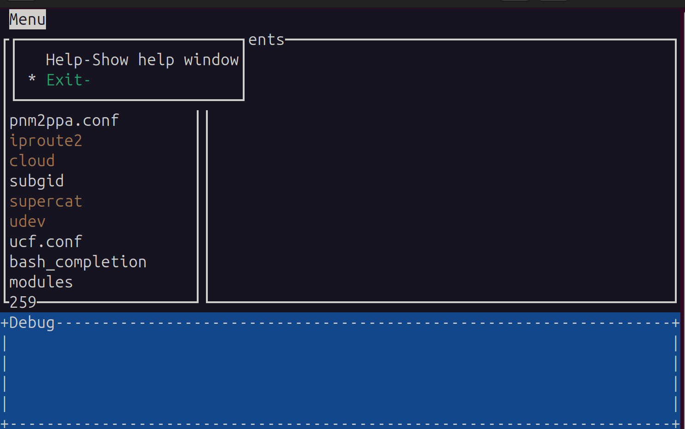

### 17. Menu - More
- Lab task
    - Add a cascading menu item show in the menu file
    - Show file
    - Show dir
    - Show Link
```c
#include <stdlib.h>
#include <string.h>
#include <dirent.h>
#include <limits.h>
#include <curses.h>
#include <panel.h>
#include <menu.h>
#define WINDOWS 4
#define COLOR_OF_DIR        1
#define COLOR_OF_DEBUG_WIN  2
#define COLOR_OF_MENU_FORE  3
#define COMMAND_NONE    0x00
#define COMMAND_HELP    0x01
#define COMMAND_EXIT    0x02
#define COMMAND_SHOW_FILE   0x10
#define COMMAND_SHOW_DIR    0x20
#define COMMAND_SHOW_LINK   0x40
#define COMMAND_SHOW_MASK   0x70
#define COMMAND_SHOW_ALL    0x70
static WINDOW *men_win = NULL;
static WINDOW *fil_win = NULL;
static WINDOW *con_win = NULL;
static WINDOW *con_pad = NULL;
static WINDOW *dbg_win = NULL;
static WINDOW *inner_win = NULL;
static PANEL *fil_panel = NULL;
static PANEL *con_panel = NULL;
static int con_index_of_first_line = 0;
static int con_index_of_first_column = 0;
static int entry_count = 0;
static struct dirent **entry_list = NULL; // from <dirent.h>
static char current_path[PATH_MAX];
static int index_of_selected = -1;
static int fil_index_of_first_line = -1;
int entry_types_to_show = COMMAND_SHOW_ALL;
typedef void (*WIN_KEY_HANDLE)(int);
typedef void (*WIN_MOUSE_HANDLE)(MEVENT *event);
typedef void (*WIN_REFRESH)(); // defining a function pointer
static WINDOW *windows[WINDOWS];
static WIN_KEY_HANDLE key_handle_funcs[WINDOWS];
static WIN_MOUSE_HANDLE mouse_handle_funcs[WINDOWS];
static WIN_REFRESH refresh_funcs[WINDOWS];
static int count = 0;
static int current_window_index = -1;
void show_help_window(char *dir, int len) {
    int h = 20;
    int w = 60;
    WINDOW *hlp_win = newwin(h, w, (LINES - h) / 2, (COLS - w) / 2);
    PANEL *hlp_panel = new_panel(hlp_win);
    box(hlp_win, 0, 0);
    mvwaddstr(hlp_win, 0, 1, "Help");
    int y = 3;
    int x = 3;
    mvwprintw(hlp_win, y++, x, "ncurses : %s", curses_version());
    mvwprintw(hlp_win, y++, x, "terminal: %s", longname());
    mvwprintw(hlp_win, y++, x, "terminal: %s", termname());
    // Dir: _____________________
    mvwprintw(hlp_win, y, x, "Dir: ");
    x += strlen("Dir: ");
    wbkgdset(hlp_win, A_UNDERLINE);
    waddstr(hlp_win, "                   ");
    wbkgdset(hlp_win, A_NORMAL);
    wmove(hlp_win, y, x);
    curs_set(1);
    echo(); // print back
    nocbreak();
    wgetnstr(hlp_win, dir, len);
    curs_set(0);
    noecho();
    cbreak();
    wrefresh(hlp_win);
    update_panels();
    doupdate();
    del_panel(hlp_panel);
    delwin(hlp_win);
}
void init_win_manager() {
    for (int i = 0; i < WINDOWS; i++) {
        windows[i] = NULL;
    }
}
void register_window_with_key_handle(WINDOW *win, 
    WIN_REFRESH refresh_func,
    WIN_KEY_HANDLE key_handle_func,
    WIN_MOUSE_HANDLE mouse_handle_func) {
    windows[count] = win;
    key_handle_funcs[count] = key_handle_func;
    mouse_handle_funcs[count] = mouse_handle_func;
    refresh_funcs[count] = refresh_func;
    count++;
    if (current_window_index == -1) {
        current_window_index = 0;
    }
}
void register_window(WINDOW *win, WIN_REFRESH refresh_func) {
    register_window_with_key_handle(win, refresh_func, NULL, NULL);
}
void next_window() {
    if (current_window_index < count - 1) {
        current_window_index++;
    } else {
        current_window_index = 0;
    }
}
bool is_current_window(WINDOW *win) {
    return windows[current_window_index] == win;
}
static void wm_handle_mouse(MEVENT *event) {
    // which window is under this mouse click
    int window_index = -1;
    if ((event->bstate & BUTTON1_CLICKED) ||
        (event->bstate & BUTTON1_DOUBLE_CLICKED)) {
        for (int i = 0; i < count; i++) {
            if (wenclose(windows[i], event->y, event->x)) {
                window_index = i;
                break;
            }
        }
        if (window_index == -1) {
            return;
        }
        // update current_window_index
        int previous_window_index = current_window_index;
        current_window_index = window_index;
        // refresh the previous current window
        if (refresh_funcs[previous_window_index]) {
            refresh_funcs[previous_window_index]();
        }
        // Forward mouse event
        if (mouse_handle_funcs[current_window_index]) {
            mouse_handle_funcs[current_window_index](event);
        }
        // refresh the current window
        if (refresh_funcs[current_window_index]) {
            refresh_funcs[current_window_index]();
        }
    }
}
void handle_key_in_current_window(int ch) {
    if (ch == KEY_MOUSE) {
        MEVENT event;
        if (getmouse(&event) == OK) {
            wm_handle_mouse(&event);
        }
        return;
    }
    if (0 <= current_window_index && current_window_index < count) {
        if (key_handle_funcs[current_window_index]) {
            key_handle_funcs[current_window_index](ch);
        }
    }
}
void refresh_menu_bar_window() {
    if (is_current_window(men_win)) {wattron(men_win, A_REVERSE);}
    mvwaddstr(men_win,0,1,"Menu");
    if (is_current_window(men_win)) {wattroff(men_win, A_REVERSE);}
    wrefresh(men_win);
}
void create_menu_bar_window(int h, int w, int y, int x) {
    men_win = newwin(h, w, y, x);
    register_window(men_win, refresh_menu_bar_window);
    refresh_menu_bar_window();
}
void delete_menu_bar_window() { delwin(men_win);     men_win = NULL; }
int show_entry_types_menu(int y, int x) {
    ITEM *items[4];
    items[0] = new_item("Show File", NULL);
    items[1] = new_item("Show Dir", NULL);
    items[2] = new_item("Show Link", NULL);
    items[3] = NULL;
    MENU *menu = new_menu(items);
    set_menu_mark(menu, " * ");
    set_menu_pad(menu, '-');
    set_menu_fore(menu, COLOR_PAIR(COLOR_OF_MENU_FORE));
    // set_menu_format(menu, 2, 1);
    menu_opts_off(menu, O_ONEVALUE);
    int rows, columns;
    scale_menu(menu, &rows, &columns);
    WINDOW *win_menu = newwin(rows + 2, columns + 2, y, x);
    PANEL *panel = new_panel(win_menu);
    box(win_menu, 0, 0);
    WINDOW *subwin_menu = derwin(win_menu, rows, columns, 1, 1);
    set_menu_win(menu, win_menu);
    set_menu_sub(menu, subwin_menu);
    post_menu(menu);
    set_item_value(items[0], entry_types_to_show & COMMAND_SHOW_FILE);
    set_item_value(items[1], entry_types_to_show & COMMAND_SHOW_DIR);
    set_item_value(items[2], entry_types_to_show & COMMAND_SHOW_LINK);
    update_panels();
    doupdate();
    int ch;
    int command = COMMAND_NONE;
    while ((command == COMMAND_NONE) && (ch = getch()) != 'm') {
        switch(ch) {
            case KEY_DOWN:
                menu_driver(menu, REQ_DOWN_ITEM);
                wrefresh(win_menu);
                break;
            case KEY_UP:
                menu_driver(menu, REQ_UP_ITEM);
                wrefresh(win_menu);
                break;
            case ' ': {
                ITEM * cur_item = current_item(menu);
                set_item_value(cur_item, !item_value(cur_item));
                wrefresh(win_menu);
                break;
            }
            case '\n': {
                int value = 0;
                if (item_value(items[0])) {
                    value |= COMMAND_SHOW_FILE;
                }
                if (item_value(items[1])) {
                    value |= COMMAND_SHOW_DIR;
                }
                if (item_value(items[2])) {
                    value |= COMMAND_SHOW_LINK;
                }
                command = value;
                break;
            }
        }
    }
    unpost_menu(menu);
    del_panel(panel);
    delwin(win_menu);
    delwin(subwin_menu);
    free_menu(menu);
    free_item(items[0]);
    free_item(items[1]);
    free_item(items[2]);
    update_panels();
    doupdate();    
    return command;
}
int show_menu() {
    ITEM *items[4];
    items[0] = new_item("Show", "Choose entry types to show =>");
    items[1] = new_item("Help", "Show help window");
    items[2] = new_item("Exit", NULL);
    items[3] = NULL;
    MENU *menu = new_menu(items);
    set_menu_mark(menu, " * ");
    set_menu_pad(menu, '-');
    set_menu_fore(menu, COLOR_PAIR(COLOR_OF_MENU_FORE));
    int rows, columns;
    scale_menu(menu, &rows, &columns);
    WINDOW *win_menu = newwin(rows + 2, columns + 2, 1, 1);
    PANEL *panel = new_panel(win_menu);
    box(win_menu, 0, 0);
    WINDOW *subwin_menu = derwin(win_menu, rows, columns, 1, 1);
    set_menu_win(menu, win_menu);
    set_menu_sub(menu, subwin_menu);
    post_menu(menu);
    update_panels();
    doupdate();
    int ch;
    int command = COMMAND_NONE;
    while ((command == COMMAND_NONE) && (ch = getch()) != 'm') {
        switch(ch) {
            case KEY_DOWN:
                menu_driver(menu, REQ_DOWN_ITEM);
                wrefresh(win_menu);
                break;
            case KEY_UP:
                menu_driver(menu, REQ_UP_ITEM);
                wrefresh(win_menu);
                break;
            case '\n': {
                ITEM *cur_item = current_item(menu);
                const char *name = item_name(cur_item);
                if (strcmp(name, "Help") == 0) {
                    command = COMMAND_HELP;
                } else if (strcmp(name, "Exit") == 0) {
                    command = COMMAND_EXIT;
                } else if (strcmp(name, "Show") == 0) {
                    command = show_entry_types_menu(1, columns + 2 + 1);
               }
                break;
            }
        }
    }
    unpost_menu(menu);
    del_panel(panel);
    delwin(win_menu);
    delwin(subwin_menu);
    free_menu(menu);
    free_item(items[0]);
    free_item(items[1]);
    free_item(items[2]);
    update_panels();
    doupdate();
    return command;
}
// ########### window manager below
static void handle_key(int ch); // see below for the function definition
void refresh_file_list_window();
static void fil_handle_mouse(MEVENT *event) {
    int y = event->y;
    int x = event->x;
    wmouse_trafo(fil_win, &y, &x, FALSE);
    if ((event->bstate & BUTTON1_CLICKED) ||
        (event->bstate & BUTTON1_DOUBLE_CLICKED)) {
        index_of_selected = y - 1;
    }
    if (event->bstate & BUTTON1_DOUBLE_CLICKED) {
        if (index_of_selected >= 0 && index_of_selected < entry_count) {
            struct dirent *entry = entry_list[index_of_selected];
            if (entry->d_type == DT_DIR) {
                enter_dir(entry);
            }
        }
    }
}
void create_file_list_window(int h, int w, int y, int x) {
    fil_win = newwin(h, w, y, x);    
    fil_panel = new_panel(fil_win);
    register_window_with_key_handle(fil_win, refresh_file_list_window, 
        handle_key, fil_handle_mouse);
    current_path[0] = '\0';
    wborder(fil_win, 0, 0, 0, 0, 0, 0, 0, 0);
    mvwaddstr(fil_win, 0, 1, "File List");
    wrefresh(fil_win);
}
void delete_file_list_window() {    
        del_panel(fil_panel);
        fil_panel = NULL;
 	delwin(fil_win);    
	fil_win = NULL; 
	free(entry_list); 
	entry_list = NULL; 
	entry_count = 0;
}
int select_entry(const struct dirent *entry) {
    if (entry->d_type == DT_DIR && 
        (entry_types_to_show & COMMAND_SHOW_DIR) == 0) {
        return FALSE;
    }
    if (entry->d_type == DT_REG && 
        (entry_types_to_show & COMMAND_SHOW_FILE) == 0) {
        return FALSE;
    }
    if (entry->d_type == DT_LNK && 
        (entry_types_to_show & COMMAND_SHOW_LINK) == 0) {
        return FALSE;
    }
    return TRUE;
}
void refresh_file_list_window() {
    int h = getmaxy(fil_win);
    int w = getmaxx(fil_win);
    wclear(fil_win);
    wborder(fil_win,0,0,0,0,0,0,0,0);
    if (is_current_window(fil_win)) { wattron(fil_win, A_REVERSE); }
    if (strlen(current_path) > w-2) { // print title
       mvwaddnstr(fil_win, 0,1,current_path,w-2-3);
       waddstr(fil_win, "...");
    } else { mvwaddstr(fil_win,0,1,current_path); }
    if (is_current_window(fil_win)) { wattroff(fil_win, A_REVERSE); }
    int y = 1;// Print entries
    if (entry_count == 0) {  
         mvwaddstr(fil_win,1,1,"Nothing");
    } 
    else { 
         for (int row = 0; row < h - 2; row++) { 
            int i=row + fil_index_of_first_line;
            if (i>=entry_count) {
                break;
            }
            struct dirent *entry = entry_list[i];
            if (i == index_of_selected) {
                wattron(fil_win, A_REVERSE);
            }
            if (entry->d_type == DT_DIR) {
                wattron(fil_win, COLOR_PAIR(COLOR_OF_DIR));
            }
            mvwaddstr(fil_win, y, 1, entry->d_name);
            if (entry->d_type == DT_DIR) {
                wattroff(fil_win, COLOR_PAIR(COLOR_OF_DIR));
            }
            if (i == index_of_selected) {
                wattroff(fil_win, A_REVERSE);
            }
            y++;
      }
    }
    y = h-1;
    mvwprintw(fil_win, y,1,"%d", entry_count); // print footer
    wrefresh(fil_win);
    update_panels();
    doupdate();
}
void list_dir_in_file_list_window(const char *dir) {
    if (entry_list != NULL) free(entry_list);
    entry_list = NULL;
    if (dir) {
        strcpy(current_path, dir);
    }
    entry_count = scandir(current_path, &entry_list, select_entry, NULL);
    index_of_selected = 0;    
    fil_index_of_first_line = 0;
    refresh_file_list_window();
}
void enter_dir(struct dirent *entry) {
    if (strcmp(entry->d_name, ".") == 0) {
        return;
    }
    char new_dir[PATH_MAX];
    if (strcmp(entry->d_name, "..") == 0) {
        strcpy(new_dir, current_path);
        char *end = strrchr(new_dir, '/');
        *end = '\0';        
    } else {
        sprintf(new_dir, "%s/%s", current_path, entry->d_name);
    }
    list_dir_in_file_list_window(new_dir);
}
void show_text_file(struct dirent *entry) {
    char file_path[PATH_MAX];
    sprintf(file_path, "%s/%s", current_path, entry->d_name);
    show_text_file_in_contents_window(file_path);
}
static void handle_mouse(MEVENT *event) {
    int y = event->y;
    int x = event->x;
    wmouse_trafo(fil_win, &y, &x, FALSE);
    if ((event->bstate & BUTTON1_CLICKED) ||
        (event->bstate & BUTTON1_DOUBLE_CLICKED)) {
        index_of_selected = y - 1;
    }
    if (event->bstate & BUTTON1_DOUBLE_CLICKED) {
        if (index_of_selected >= 0 && index_of_selected < entry_count) {
            struct dirent *entry = entry_list[index_of_selected];
            if (entry->d_type == DT_DIR) {
                enter_dir(entry);
            }
        }
    }
}
static void handle_key(int ch) {
    switch (ch) {
        case KEY_DOWN:
            if (index_of_selected < entry_count - 1) {
                index_of_selected++;
                int lines = getmaxy(fil_win) - 2;
                while (index_of_selected - fil_index_of_first_line >= lines) {
                    fil_index_of_first_line++;
                }
                refresh_file_list_window();
            }
            break;
        case KEY_UP:
            if (index_of_selected > 0) {
                index_of_selected--;
                while (index_of_selected - fil_index_of_first_line < 0) {
                    fil_index_of_first_line--;
                }
                refresh_file_list_window();
            }
            break;
        case '\n':
            if (0 <= index_of_selected && index_of_selected < entry_count) {
                struct dirent *entry = entry_list[index_of_selected];
                if (entry->d_type == DT_DIR) {
                    enter_dir(entry);
                } else if (entry->d_type == DT_REG) {
                    show_text_file(entry);
                }
            }
            break;
    }
}
static void key_handle(int ch) {
    switch(ch) {
        case KEY_DOWN: {
            int h_contents = getmaxy(con_win) - 2;
            int lines_pad = getmaxy(con_pad);
            if (con_index_of_first_line + h_contents < lines_pad) {
                con_index_of_first_line++;
                refresh_contents_window();
            }
            break;
        }
        case KEY_UP: {
            if (con_index_of_first_line > 0) {
                con_index_of_first_line--;
                refresh_contents_window();
            }
            break;
        }
        case KEY_LEFT: {
            if (con_index_of_first_column > 0) {
                con_index_of_first_column--;
                refresh_contents_window();
            }
            break;
        }
        case KEY_RIGHT: {
            int w_contents = getmaxx(con_win) - 2;
            int columns_pad = getmaxx(con_pad);
            if (con_index_of_first_column + w_contents < columns_pad) {
                con_index_of_first_column++;
                refresh_contents_window();
            }
            break;
        }
    }
}
void refresh_contents_window() {
    box(con_win, 0, 0);
    if (is_current_window(con_win)) {wattron(con_win, A_REVERSE);}    
    mvwaddstr(con_win, 0, 1, "Contents");
    if (is_current_window(con_win)) {wattroff(con_win, A_REVERSE);}    
    wrefresh(con_win);
    if (con_pad) {
        int y_win = getbegy(con_win);
        int x_win = getbegx(con_win);
        int h_win = getmaxy(con_win);
        int w_win = getmaxx(con_win);
        int h_contents = h_win - 2;
        int w_contents = w_win - 2;
        prefresh(con_pad, con_index_of_first_line, con_index_of_first_column, 
            y_win + 1, x_win + 1,
            y_win + 1 + h_contents - 1,
            x_win + 1 + w_contents - 1
        );
    }
    update_panels();
    doupdate();
}
void create_contents_window(int h, int w, int y, int x) {
    con_win = newwin(h, w, y, x);
    con_panel = new_panel(con_win);
    register_window_with_key_handle(con_win, refresh_contents_window, 
        key_handle, NULL);
    refresh_contents_window();
}
void delete_contents_window() { 
    del_panel(con_panel); con_panel = NULL;
    delwin(con_win); con_win = NULL;
    delwin(con_pad); con_pad = NULL;
}
void show_text_file_in_contents_window(const char *file_path) {
    FILE *f = fopen(file_path, "r");
    if (f == NULL) {
        debug_line("Failed to open %s", file_path);
        return;
    }
    int lines = 0;  
    const int PAD_WIDTH = 1024;
    char buffer[PAD_WIDTH + 1];
    while (fgets(buffer, PAD_WIDTH + 1, f)) {
        lines++;
    }
    rewind(f);
    delwin(con_pad);
    con_pad = newpad(lines, PAD_WIDTH);
    while (fgets(buffer, PAD_WIDTH + 1, f)) {
        wprintw(con_pad, "%s", buffer);
    }
    fclose(f);
    refresh_contents_window();
}
void refresh_debug_window() {    
    wbkgd(dbg_win, COLOR_PAIR(COLOR_OF_DEBUG_WIN));
    wborder(dbg_win, '|', '|', '-', '-', '+', '+', '+', '+');
    if (is_current_window(dbg_win)) {wattron(dbg_win, A_REVERSE);}    
    mvwaddstr(dbg_win, 0, 1, "Debug");
    if (is_current_window(dbg_win)) {wattroff(dbg_win, A_REVERSE);}        
    wrefresh(dbg_win);
}
void create_debug_window(int h, int w, int y, int x) {
    dbg_win = newwin(h, w, y, x);
    wbkgd(dbg_win, COLOR_PAIR(COLOR_OF_DEBUG_WIN));
    // inner_win = subwin(dbg_win, h - 2, w - 2, y + 1, x + 1);
    inner_win = derwin(dbg_win, h - 2, w - 2, 1, 1);
    scrollok(inner_win, TRUE);
    register_window(dbg_win, refresh_debug_window);
    refresh_debug_window();
}
void delete_debug_window() {    
    delwin(dbg_win);    dbg_win = NULL;
    delwin(inner_win);  inner_win = NULL;
}
void debug_line(const char *fmt, ...) {
    // 1: This is a debug line
    // 2: This is another debug line
    int y = count;
    if (count >= 4) {
        wscrl(inner_win, 1);
        y = 3;
    }
    int x = 0;
    mvwprintw(inner_win, y, x, "%d: ", count);
    count++;
    va_list varglist;
    va_start(varglist, fmt);
    vw_printw(inner_win, fmt, varglist);
    va_end(varglist);
    wrefresh(inner_win);
}
int main(int argc, char *argv[]) {
   if (argc < 2) { printf("Usage: ./main <dir>\n"); exit(1); } // check n. of arguments
    initscr();      // Enter curses mode
    cbreak();       // Disable line buffering
    noecho();       // Disable echoing
    keypad(stdscr, TRUE);   // Enable function keys like F1
    curs_set(0);            // Hide cursor
    refresh();
    if (has_colors()) {
        start_color();
        init_pair(COLOR_OF_DIR, COLOR_YELLOW, COLOR_BLACK);
        init_pair(COLOR_OF_DEBUG_WIN, COLOR_WHITE, COLOR_BLUE);
        init_pair(COLOR_OF_MENU_FORE, COLOR_GREEN, COLOR_BLACK);
    }
    mousemask(ALL_MOUSE_EVENTS, NULL);
    char *dir = argv[1];
    int len = strlen(dir);
    if (dir[len-1] == '/') {dir[len-1] = '\0';} 
    //
    int h, w;
    getmaxyx(stdscr, h, w);
    int h_files = h - 1 - 6;
    int w_files = w * 0.3;
    init_win_manager();
    create_menu_bar_window(1, w, 0, 0); // top 
    create_file_list_window(h_files, w_files, 1, 0); // left-center
    create_contents_window(h_files, w - w_files, 1, w_files); // right-center
    create_debug_window(6, w, 1 + h_files, 0); // bottom
    list_dir_in_file_list_window(dir);
    //
    int ch;
    while ((ch = getch()) != 'q') { 
        switch (ch)  {
             case 'd': {
                debug_line("This is a debug message");
                break;
            }
           case 'h': {
                char dir[PATH_MAX];
                show_help_window(dir, PATH_MAX - 1);
                if (strlen(dir) > 0) {
                    list_dir_in_file_list_window(dir);
                }
                update_panels();
                doupdate();
                break;
            }
             case 'm': {
                int command = show_menu();
                if (command == COMMAND_HELP) {
                    ungetch('h');
                } else if (command == COMMAND_EXIT) {
                    ungetch('q');
                } else if ((command & COMMAND_SHOW_MASK) != 0) {
                    entry_types_to_show = command;
                    list_dir_in_file_list_window(NULL);
                }
                break;
            }
          case '\t':
               next_window();                
               refresh_menu_bar_window();
               refresh_file_list_window();
               refresh_debug_window();
               refresh_contents_window();
               break;
            default:
                handle_key_in_current_window(ch);
                break;
       }
    }
    //
    delete_menu_bar_window();
    delete_file_list_window();
    delete_contents_window();
    delete_debug_window();
    endwin();       // Exit from curses mode
    return 0;
}
```    
- gcc -o ch17.exe ch17.c -lpanel -lmenu -lncurses
- ./ch17.exe /etc
- Click 'm' to activate menu. Select the first time. In the subsequent menu, use space bar to select/desect then Enter to select entries (dirs or files or links) in the file menu
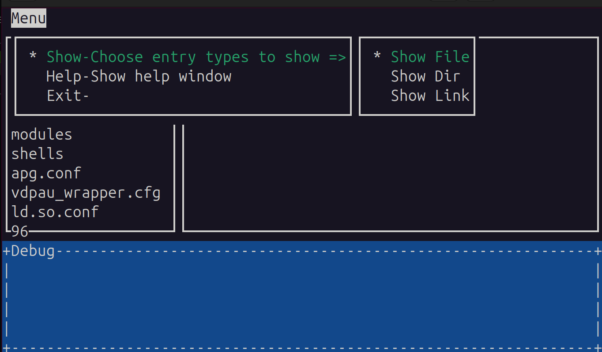

### 18. Form
- Lab task
    - Add filter form, which takes the text from user to show the files matching the text in File List window
    - Add a label "Text" and an input field
    - Add two buttons, "Cancel" and "OK"
- Form
    - Field either static (no input) or regular (user input)
    - Field type like TYPE_ALPHA, TYPE_ALNUM, TYPE_ENUM, TYPE_INTEGER, TYPE_NUMERIC, TYPE_REGEXP
    - `#include <form.h>`
    - `-lform -lcurses` in gcc link command\
- Form APIs
    - FORM *new_form(FIELD **fields);
    - int free_form(FORM *form);
    - FIELD *new_field(int height, int width, int toprow, int leftcol, int offscreen, int nbuffers);
    - int free_field(FIELD *field);
```c
#include <stdlib.h>
#include <string.h>
#include <dirent.h>
#include <limits.h>
#include <curses.h>
#include <panel.h>
#include <menu.h>
#include <form.h>
#define WINDOWS 4
#define COLOR_OF_DIR        1
#define COLOR_OF_DEBUG_WIN  2
#define COLOR_OF_MENU_FORE  3
#define COMMAND_NONE    0x00
#define COMMAND_HELP    0x01
#define COMMAND_EXIT    0x02
#define COMMAND_SHOW_FILE   0x10
#define COMMAND_SHOW_DIR    0x20
#define COMMAND_SHOW_LINK   0x40
#define COMMAND_SHOW_MASK   0x70
#define COMMAND_SHOW_ALL    0x70
static WINDOW *men_win = NULL;
static WINDOW *fil_win = NULL;
static WINDOW *con_win = NULL;
static WINDOW *con_pad = NULL;
static WINDOW *dbg_win = NULL;
static WINDOW *inner_win = NULL;
static PANEL *fil_panel = NULL;
static PANEL *con_panel = NULL;
static int con_index_of_first_line = 0;
static int con_index_of_first_column = 0;
static int entry_count = 0;
static struct dirent **entry_list = NULL; // from <dirent.h>
static char current_path[PATH_MAX];
static int index_of_selected = -1;
static int fil_index_of_first_line = -1;
int entry_types_to_show = COMMAND_SHOW_ALL;
typedef void (*WIN_KEY_HANDLE)(int);
typedef void (*WIN_MOUSE_HANDLE)(MEVENT *event);
typedef void (*WIN_REFRESH)(); // defining a function pointer
static WINDOW *windows[WINDOWS];
static WIN_KEY_HANDLE key_handle_funcs[WINDOWS];
static WIN_MOUSE_HANDLE mouse_handle_funcs[WINDOWS];
static WIN_REFRESH refresh_funcs[WINDOWS];
static int count = 0;
static int current_window_index = -1;
void show_filter_form() {
    FIELD *fields[5];
    // Label
    fields[0] = new_field(1, 10, 0, 0, 0, 0);
    field_opts_off(fields[0], O_ACTIVE);
    set_field_buffer(fields[0], 0, "Text: ");
    // Input
    fields[1] = new_field(1, 10, 0, 10, 0, 0);
    set_field_type(fields[1], TYPE_ALPHA, 1);
    set_field_back(fields[1], A_UNDERLINE);
    field_opts_off(fields[1], O_STATIC);
    set_max_field(fields[1], 20);
    // Cancel
    fields[2] = new_field(1, 10, 1, 0, 0, 0);
    field_opts_off(fields[2], O_EDIT);
    set_field_buffer(fields[2], 0, "Cancel");
    // OK
    fields[3] = new_field(1, 10, 1, 10, 0, 0);
    field_opts_off(fields[3], O_EDIT);
    set_field_buffer(fields[3], 0, "OK");
    fields[4] = NULL;
    FORM *form = new_form(fields);
    int rows, columns;
    scale_form(form, &rows, &columns);
    WINDOW *win = newwin(rows + 2, columns + 2, 
        (LINES - rows - 2) / 2, (COLS - columns - 2) / 2);
    PANEL *panel = new_panel(win);
    box(win, 0, 0);
    set_form_win(form, win);
    set_form_sub(form, derwin(win, rows, columns, 1, 1));
    post_form(form);
    update_panels();
    doupdate();
    getch();
    unpost_form(form);
    del_panel(panel);
    delwin(win);
    update_panels();
    doupdate();
    free_form(form);
    free_field(fields[0]);
    free_field(fields[1]);
    free_field(fields[2]);
    free_field(fields[3]);
}
//
void show_help_window(char *dir, int len) {
    int h = 20;
    int w = 60;
    WINDOW *hlp_win = newwin(h, w, (LINES - h) / 2, (COLS - w) / 2);
    PANEL *hlp_panel = new_panel(hlp_win);
    box(hlp_win, 0, 0);
    mvwaddstr(hlp_win, 0, 1, "Help");
    int y = 3;
    int x = 3;
    mvwprintw(hlp_win, y++, x, "ncurses : %s", curses_version());
    mvwprintw(hlp_win, y++, x, "terminal: %s", longname());
    mvwprintw(hlp_win, y++, x, "terminal: %s", termname());
    // Dir: _____________________
    mvwprintw(hlp_win, y, x, "Dir: ");
    x += strlen("Dir: ");
    wbkgdset(hlp_win, A_UNDERLINE);
    waddstr(hlp_win, "                   ");
    wbkgdset(hlp_win, A_NORMAL);
    wmove(hlp_win, y, x);
    curs_set(1);
    echo(); // print back
    nocbreak();
    wgetnstr(hlp_win, dir, len);
    curs_set(0);
    noecho();
    cbreak();
    wrefresh(hlp_win);
    update_panels();
    doupdate();
    del_panel(hlp_panel);
    delwin(hlp_win);
}
void init_win_manager() {
    for (int i = 0; i < WINDOWS; i++) {
        windows[i] = NULL;
    }
}
void register_window_with_key_handle(WINDOW *win, 
    WIN_REFRESH refresh_func,
    WIN_KEY_HANDLE key_handle_func,
    WIN_MOUSE_HANDLE mouse_handle_func) {
    windows[count] = win;
    key_handle_funcs[count] = key_handle_func;
    mouse_handle_funcs[count] = mouse_handle_func;
    refresh_funcs[count] = refresh_func;
    count++;
    if (current_window_index == -1) {
        current_window_index = 0;
    }
}
void register_window(WINDOW *win, WIN_REFRESH refresh_func) {
    register_window_with_key_handle(win, refresh_func, NULL, NULL);
}
void next_window() {
    if (current_window_index < count - 1) {
        current_window_index++;
    } else {
        current_window_index = 0;
    }
}
bool is_current_window(WINDOW *win) {
    return windows[current_window_index] == win;
}
static void wm_handle_mouse(MEVENT *event) {
    // which window is under this mouse click
    int window_index = -1;
    if ((event->bstate & BUTTON1_CLICKED) ||
        (event->bstate & BUTTON1_DOUBLE_CLICKED)) {
        for (int i = 0; i < count; i++) {
            if (wenclose(windows[i], event->y, event->x)) {
                window_index = i;
                break;
            }
        }
        if (window_index == -1) {
            return;
        }
        // update current_window_index
        int previous_window_index = current_window_index;
        current_window_index = window_index;
        // refresh the previous current window
        if (refresh_funcs[previous_window_index]) {
            refresh_funcs[previous_window_index]();
        }
        // Forward mouse event
        if (mouse_handle_funcs[current_window_index]) {
            mouse_handle_funcs[current_window_index](event);
        }
        // refresh the current window
        if (refresh_funcs[current_window_index]) {
            refresh_funcs[current_window_index]();
        }
    }
}
void handle_key_in_current_window(int ch) {
    if (ch == KEY_MOUSE) {
        MEVENT event;
        if (getmouse(&event) == OK) {
            wm_handle_mouse(&event);
        }
        return;
    }
    if (0 <= current_window_index && current_window_index < count) {
        if (key_handle_funcs[current_window_index]) {
            key_handle_funcs[current_window_index](ch);
        }
    }
}
void refresh_menu_bar_window() {
    if (is_current_window(men_win)) {wattron(men_win, A_REVERSE);}
    mvwaddstr(men_win,0,1,"Menu");
    if (is_current_window(men_win)) {wattroff(men_win, A_REVERSE);}
    wrefresh(men_win);
}
void create_menu_bar_window(int h, int w, int y, int x) {
    men_win = newwin(h, w, y, x);
    register_window(men_win, refresh_menu_bar_window);
    refresh_menu_bar_window();
}
void delete_menu_bar_window() { delwin(men_win);     men_win = NULL; }
int show_entry_types_menu(int y, int x) {
    ITEM *items[4];
    items[0] = new_item("Show File", NULL);
    items[1] = new_item("Show Dir", NULL);
    items[2] = new_item("Show Link", NULL);
    items[3] = NULL;
    MENU *menu = new_menu(items);
    set_menu_mark(menu, " * ");
    set_menu_pad(menu, '-');
    set_menu_fore(menu, COLOR_PAIR(COLOR_OF_MENU_FORE));
    // set_menu_format(menu, 2, 1);
    menu_opts_off(menu, O_ONEVALUE);
    int rows, columns;
    scale_menu(menu, &rows, &columns);
    WINDOW *win_menu = newwin(rows + 2, columns + 2, y, x);
    PANEL *panel = new_panel(win_menu);
    box(win_menu, 0, 0);
    WINDOW *subwin_menu = derwin(win_menu, rows, columns, 1, 1);
    set_menu_win(menu, win_menu);
    set_menu_sub(menu, subwin_menu);
    post_menu(menu);
    set_item_value(items[0], entry_types_to_show & COMMAND_SHOW_FILE);
    set_item_value(items[1], entry_types_to_show & COMMAND_SHOW_DIR);
    set_item_value(items[2], entry_types_to_show & COMMAND_SHOW_LINK);
    update_panels();
    doupdate();
    int ch;
    int command = COMMAND_NONE;
    while ((command == COMMAND_NONE) && (ch = getch()) != 'm') {
        switch(ch) {
            case KEY_DOWN:
                menu_driver(menu, REQ_DOWN_ITEM);
                wrefresh(win_menu);
                break;
            case KEY_UP:
                menu_driver(menu, REQ_UP_ITEM);
                wrefresh(win_menu);
                break;
            case ' ': {
                ITEM * cur_item = current_item(menu);
                set_item_value(cur_item, !item_value(cur_item));
                wrefresh(win_menu);
                break;
            }
            case '\n': {
                int value = 0;
                if (item_value(items[0])) {
                    value |= COMMAND_SHOW_FILE;
                }
                if (item_value(items[1])) {
                    value |= COMMAND_SHOW_DIR;
                }
                if (item_value(items[2])) {
                    value |= COMMAND_SHOW_LINK;
                }
                command = value;
                break;
            }
        }
    }
    unpost_menu(menu);
    del_panel(panel);
    delwin(win_menu);
    delwin(subwin_menu);
    free_menu(menu);
    free_item(items[0]);
    free_item(items[1]);
    free_item(items[2]);
    update_panels();
    doupdate();    
    return command;
}
int show_menu() {
    ITEM *items[4];
    items[0] = new_item("Show", "Choose entry types to show =>");
    items[1] = new_item("Help", "Show help window");
    items[2] = new_item("Exit", NULL);
    items[3] = NULL;
    MENU *menu = new_menu(items);
    set_menu_mark(menu, " * ");
    set_menu_pad(menu, '-');
    set_menu_fore(menu, COLOR_PAIR(COLOR_OF_MENU_FORE));
    int rows, columns;
    scale_menu(menu, &rows, &columns);
    WINDOW *win_menu = newwin(rows + 2, columns + 2, 1, 1);
    PANEL *panel = new_panel(win_menu);
    box(win_menu, 0, 0);
    WINDOW *subwin_menu = derwin(win_menu, rows, columns, 1, 1);
    set_menu_win(menu, win_menu);
    set_menu_sub(menu, subwin_menu);
    post_menu(menu);
    update_panels();
    doupdate();
    int ch;
    int command = COMMAND_NONE;
    while ((command == COMMAND_NONE) && (ch = getch()) != 'm') {
        switch(ch) {
            case KEY_DOWN:
                menu_driver(menu, REQ_DOWN_ITEM);
                wrefresh(win_menu);
                break;
            case KEY_UP:
                menu_driver(menu, REQ_UP_ITEM);
                wrefresh(win_menu);
                break;
            case '\n': {
                ITEM *cur_item = current_item(menu);
                const char *name = item_name(cur_item);
                if (strcmp(name, "Help") == 0) {
                    command = COMMAND_HELP;
                } else if (strcmp(name, "Exit") == 0) {
                    command = COMMAND_EXIT;
                } else if (strcmp(name, "Show") == 0) {
                    command = show_entry_types_menu(1, columns + 2 + 1);
               }
                break;
            }
        }
    }
    unpost_menu(menu);
    del_panel(panel);
    delwin(win_menu);
    delwin(subwin_menu);
    free_menu(menu);
    free_item(items[0]);
    free_item(items[1]);
    free_item(items[2]);
    update_panels();
    doupdate();
    return command;
}
// ########### window manager below
static void handle_key(int ch); // see below for the function definition
void refresh_file_list_window();
static void fil_handle_mouse(MEVENT *event) {
    int y = event->y;
    int x = event->x;
    wmouse_trafo(fil_win, &y, &x, FALSE);
    if ((event->bstate & BUTTON1_CLICKED) ||
        (event->bstate & BUTTON1_DOUBLE_CLICKED)) {
        index_of_selected = y - 1;
    }
    if (event->bstate & BUTTON1_DOUBLE_CLICKED) {
        if (index_of_selected >= 0 && index_of_selected < entry_count) {
            struct dirent *entry = entry_list[index_of_selected];
            if (entry->d_type == DT_DIR) {
                enter_dir(entry);
            }
        }
    }
}
void create_file_list_window(int h, int w, int y, int x) {
    fil_win = newwin(h, w, y, x);    
    fil_panel = new_panel(fil_win);
    register_window_with_key_handle(fil_win, refresh_file_list_window, 
        handle_key, fil_handle_mouse);
    current_path[0] = '\0';
    wborder(fil_win, 0, 0, 0, 0, 0, 0, 0, 0);
    mvwaddstr(fil_win, 0, 1, "File List");
    wrefresh(fil_win);
}
void delete_file_list_window() {    
        del_panel(fil_panel);
        fil_panel = NULL;
 	delwin(fil_win);    
	fil_win = NULL; 
	free(entry_list); 
	entry_list = NULL; 
	entry_count = 0;
}
int select_entry(const struct dirent *entry) {
    if (entry->d_type == DT_DIR && 
        (entry_types_to_show & COMMAND_SHOW_DIR) == 0) {
        return FALSE;
    }
    if (entry->d_type == DT_REG && 
        (entry_types_to_show & COMMAND_SHOW_FILE) == 0) {
        return FALSE;
    }
    if (entry->d_type == DT_LNK && 
        (entry_types_to_show & COMMAND_SHOW_LINK) == 0) {
        return FALSE;
    }
    return TRUE;
}
void refresh_file_list_window() {
    int h = getmaxy(fil_win);
    int w = getmaxx(fil_win);
    wclear(fil_win);
    wborder(fil_win,0,0,0,0,0,0,0,0);
    if (is_current_window(fil_win)) { wattron(fil_win, A_REVERSE); }
    if (strlen(current_path) > w-2) { // print title
       mvwaddnstr(fil_win, 0,1,current_path,w-2-3);
       waddstr(fil_win, "...");
    } else { mvwaddstr(fil_win,0,1,current_path); }
    if (is_current_window(fil_win)) { wattroff(fil_win, A_REVERSE); }
    int y = 1;// Print entries
    if (entry_count == 0) {  
         mvwaddstr(fil_win,1,1,"Nothing");
    } 
    else { 
         for (int row = 0; row < h - 2; row++) { 
            int i=row + fil_index_of_first_line;
            if (i>=entry_count) {
                break;
            }
            struct dirent *entry = entry_list[i];
            if (i == index_of_selected) {
                wattron(fil_win, A_REVERSE);
            }
            if (entry->d_type == DT_DIR) {
                wattron(fil_win, COLOR_PAIR(COLOR_OF_DIR));
            }
            mvwaddstr(fil_win, y, 1, entry->d_name);
            if (entry->d_type == DT_DIR) {
                wattroff(fil_win, COLOR_PAIR(COLOR_OF_DIR));
            }
            if (i == index_of_selected) {
                wattroff(fil_win, A_REVERSE);
            }
            y++;
      }
    }
    y = h-1;
    mvwprintw(fil_win, y,1,"%d", entry_count); // print footer
    wrefresh(fil_win);
    update_panels();
    doupdate();
}
void list_dir_in_file_list_window(const char *dir) {
    if (entry_list != NULL) free(entry_list);
    entry_list = NULL;
    if (dir) {
        strcpy(current_path, dir);
    }
    entry_count = scandir(current_path, &entry_list, select_entry, NULL);
    index_of_selected = 0;    
    fil_index_of_first_line = 0;
    refresh_file_list_window();
}
void enter_dir(struct dirent *entry) {
    if (strcmp(entry->d_name, ".") == 0) {
        return;
    }
    char new_dir[PATH_MAX];
    if (strcmp(entry->d_name, "..") == 0) {
        strcpy(new_dir, current_path);
        char *end = strrchr(new_dir, '/');
        *end = '\0';        
    } else {
        sprintf(new_dir, "%s/%s", current_path, entry->d_name);
    }
    list_dir_in_file_list_window(new_dir);
}
void show_text_file(struct dirent *entry) {
    char file_path[PATH_MAX];
    sprintf(file_path, "%s/%s", current_path, entry->d_name);
    show_text_file_in_contents_window(file_path);
}
static void handle_mouse(MEVENT *event) {
    int y = event->y;
    int x = event->x;
    wmouse_trafo(fil_win, &y, &x, FALSE);
    if ((event->bstate & BUTTON1_CLICKED) ||
        (event->bstate & BUTTON1_DOUBLE_CLICKED)) {
        index_of_selected = y - 1;
    }
    if (event->bstate & BUTTON1_DOUBLE_CLICKED) {
        if (index_of_selected >= 0 && index_of_selected < entry_count) {
            struct dirent *entry = entry_list[index_of_selected];
            if (entry->d_type == DT_DIR) {
                enter_dir(entry);
            }
        }
    }
}
static void handle_key(int ch) {
    switch (ch) {
        case KEY_DOWN:
            if (index_of_selected < entry_count - 1) {
                index_of_selected++;
                int lines = getmaxy(fil_win) - 2;
                while (index_of_selected - fil_index_of_first_line >= lines) {
                    fil_index_of_first_line++;
                }
                refresh_file_list_window();
            }
            break;
        case KEY_UP:
            if (index_of_selected > 0) {
                index_of_selected--;
                while (index_of_selected - fil_index_of_first_line < 0) {
                    fil_index_of_first_line--;
                }
                refresh_file_list_window();
            }
            break;
        case '\n':
            if (0 <= index_of_selected && index_of_selected < entry_count) {
                struct dirent *entry = entry_list[index_of_selected];
                if (entry->d_type == DT_DIR) {
                    enter_dir(entry);
                } else if (entry->d_type == DT_REG) {
                    show_text_file(entry);
                }
            }
            break;
    }
}
static void key_handle(int ch) {
    switch(ch) {
        case KEY_DOWN: {
            int h_contents = getmaxy(con_win) - 2;
            int lines_pad = getmaxy(con_pad);
            if (con_index_of_first_line + h_contents < lines_pad) {
                con_index_of_first_line++;
                refresh_contents_window();
            }
            break;
        }
        case KEY_UP: {
            if (con_index_of_first_line > 0) {
                con_index_of_first_line--;
                refresh_contents_window();
            }
            break;
        }
        case KEY_LEFT: {
            if (con_index_of_first_column > 0) {
                con_index_of_first_column--;
                refresh_contents_window();
            }
            break;
        }
        case KEY_RIGHT: {
            int w_contents = getmaxx(con_win) - 2;
            int columns_pad = getmaxx(con_pad);
            if (con_index_of_first_column + w_contents < columns_pad) {
                con_index_of_first_column++;
                refresh_contents_window();
            }
            break;
        }
    }
}
void refresh_contents_window() {
    box(con_win, 0, 0);
    if (is_current_window(con_win)) {wattron(con_win, A_REVERSE);}    
    mvwaddstr(con_win, 0, 1, "Contents");
    if (is_current_window(con_win)) {wattroff(con_win, A_REVERSE);}    
    wrefresh(con_win);
    if (con_pad) {
        int y_win = getbegy(con_win);
        int x_win = getbegx(con_win);
        int h_win = getmaxy(con_win);
        int w_win = getmaxx(con_win);
        int h_contents = h_win - 2;
        int w_contents = w_win - 2;
        prefresh(con_pad, con_index_of_first_line, con_index_of_first_column, 
            y_win + 1, x_win + 1,
            y_win + 1 + h_contents - 1,
            x_win + 1 + w_contents - 1
        );
    }
    update_panels();
    doupdate();
}
void create_contents_window(int h, int w, int y, int x) {
    con_win = newwin(h, w, y, x);
    con_panel = new_panel(con_win);
    register_window_with_key_handle(con_win, refresh_contents_window, 
        key_handle, NULL);
    refresh_contents_window();
}
void delete_contents_window() { 
    del_panel(con_panel); con_panel = NULL;
    delwin(con_win); con_win = NULL;
    delwin(con_pad); con_pad = NULL;
}
void show_text_file_in_contents_window(const char *file_path) {
    FILE *f = fopen(file_path, "r");
    if (f == NULL) {
        debug_line("Failed to open %s", file_path);
        return;
    }
    int lines = 0;  
    const int PAD_WIDTH = 1024;
    char buffer[PAD_WIDTH + 1];
    while (fgets(buffer, PAD_WIDTH + 1, f)) {
        lines++;
    }
    rewind(f);
    delwin(con_pad);
    con_pad = newpad(lines, PAD_WIDTH);
    while (fgets(buffer, PAD_WIDTH + 1, f)) {
        wprintw(con_pad, "%s", buffer);
    }
    fclose(f);
    refresh_contents_window();
}
void refresh_debug_window() {    
    wbkgd(dbg_win, COLOR_PAIR(COLOR_OF_DEBUG_WIN));
    wborder(dbg_win, '|', '|', '-', '-', '+', '+', '+', '+');
    if (is_current_window(dbg_win)) {wattron(dbg_win, A_REVERSE);}    
    mvwaddstr(dbg_win, 0, 1, "Debug");
    if (is_current_window(dbg_win)) {wattroff(dbg_win, A_REVERSE);}        
    wrefresh(dbg_win);
}
void create_debug_window(int h, int w, int y, int x) {
    dbg_win = newwin(h, w, y, x);
    wbkgd(dbg_win, COLOR_PAIR(COLOR_OF_DEBUG_WIN));
    // inner_win = subwin(dbg_win, h - 2, w - 2, y + 1, x + 1);
    inner_win = derwin(dbg_win, h - 2, w - 2, 1, 1);
    scrollok(inner_win, TRUE);
    register_window(dbg_win, refresh_debug_window);
    refresh_debug_window();
}
void delete_debug_window() {    
    delwin(dbg_win);    dbg_win = NULL;
    delwin(inner_win);  inner_win = NULL;
}
void debug_line(const char *fmt, ...) {
    // 1: This is a debug line
    // 2: This is another debug line
    int y = count;
    if (count >= 4) {
        wscrl(inner_win, 1);
        y = 3;
    }
    int x = 0;
    mvwprintw(inner_win, y, x, "%d: ", count);
    count++;
    va_list varglist;
    va_start(varglist, fmt);
    vw_printw(inner_win, fmt, varglist);
    va_end(varglist);
    wrefresh(inner_win);
}
int main(int argc, char *argv[]) {
   if (argc < 2) { printf("Usage: ./main <dir>\n"); exit(1); } // check n. of arguments
    initscr();      // Enter curses mode
    cbreak();       // Disable line buffering
    noecho();       // Disable echoing
    keypad(stdscr, TRUE);   // Enable function keys like F1
    curs_set(0);            // Hide cursor
    refresh();
    if (has_colors()) {
        start_color();
        init_pair(COLOR_OF_DIR, COLOR_YELLOW, COLOR_BLACK);
        init_pair(COLOR_OF_DEBUG_WIN, COLOR_WHITE, COLOR_BLUE);
        init_pair(COLOR_OF_MENU_FORE, COLOR_GREEN, COLOR_BLACK);
    }
    mousemask(ALL_MOUSE_EVENTS, NULL);
    char *dir = argv[1];
    int len = strlen(dir);
    if (dir[len-1] == '/') {dir[len-1] = '\0';} 
    //
    int h, w;
    getmaxyx(stdscr, h, w);
    int h_files = h - 1 - 6;
    int w_files = w * 0.3;
    init_win_manager();
    create_menu_bar_window(1, w, 0, 0); // top 
    create_file_list_window(h_files, w_files, 1, 0); // left-center
    create_contents_window(h_files, w - w_files, 1, w_files); // right-center
    create_debug_window(6, w, 1 + h_files, 0); // bottom
    list_dir_in_file_list_window(dir);
    //
    int ch;
    while ((ch = getch()) != 'q') { 
        switch (ch)  {
             case 'd': {
                debug_line("This is a debug message");
                break;
            }
            case 'f': {
                show_filter_form();
                break;
            }
             case 'h': {
                char dir[PATH_MAX];
                show_help_window(dir, PATH_MAX - 1);
                if (strlen(dir) > 0) {
                    list_dir_in_file_list_window(dir);
                }
                update_panels();
                doupdate();
                break;
            }
             case 'm': {
                int command = show_menu();
                if (command == COMMAND_HELP) {
                    ungetch('h');
                } else if (command == COMMAND_EXIT) {
                    ungetch('q');
                } else if ((command & COMMAND_SHOW_MASK) != 0) {
                    entry_types_to_show = command;
                    list_dir_in_file_list_window(NULL);
                }
                break;
            }
          case '\t':
               next_window();                
               refresh_menu_bar_window();
               refresh_file_list_window();
               refresh_debug_window();
               refresh_contents_window();
               break;
            default:
                handle_key_in_current_window(ch);
                break;
       }
    }
    //
    delete_menu_bar_window();
    delete_file_list_window();
    delete_contents_window();
    delete_debug_window();
    endwin();       // Exit from curses mode
    return 0;
}
```
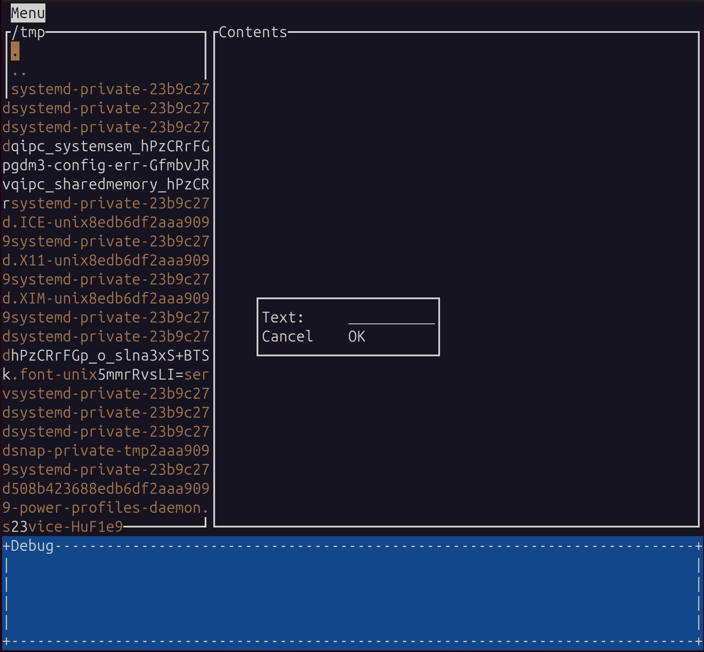

- Click 'f' key activates a form - no functionality for now

### 19. Form - More
- Form driver
    - int form_driver(FORM *form, int c);

## Converting class codes into Python codes using curses package

### 3. Basics
- Basic character effects such as stand-out, underline, reverse, ...
- chap03.py:
```py
import sys,os
import curses
 
def draw_menu(stdscr):
    curses.cbreak()
    curses.curs_set(0)
    curses.noecho()
    stdscr.keypad(True)
    stdscr.refresh()
    stdscr.addch('N')
    stdscr.addch('S', curses.A_STANDOUT)
    stdscr.addch('U', curses.A_UNDERLINE)
    stdscr.addch('R', curses.A_REVERSE)
    stdscr.addch('K', curses.A_BLINK)
    stdscr.addch('D', curses.A_DIM)
    stdscr.addch('B', curses.A_BOLD)
    stdscr.addch('P', curses.A_PROTECT)
    stdscr.addch('H', curses.A_INVIS)
    stdscr.addch('A', curses.A_ALTCHARSET)
    stdscr.addch('I', curses.A_ITALIC)
    # Refresh the screen
    stdscr.refresh()
    # Wait for next input
    stdscr.getch()
 
def main():
    curses.wrapper(draw_menu)
 
if __name__ == "__main__":
    main()
```
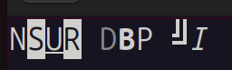

### 4. Window
- Drawing basic window with borders
- chap04.py:
```py
import sys,os
import curses
 
def cr_menu_bar_window(h: int, w: int, y: int, x: int):
    win = curses.newwin(h,w,y,x)
    win.refresh()
    return win
def cr_file_list_window(h: int, w: int, y: int, x: int):
    win = curses.newwin(h,w,y,x)
    win.border(0,0,0,0,0,0,0,0)
    win.refresh()
    return win
def cr_content_window(h: int, w: int, y: int, x: int):
    win = curses.newwin(h,w,y,x)
    win.box(0,0)
    win.refresh()
    return win
def cr_debug_window(h: int, w: int, y: int, x: int):
    win = curses.newwin(h,w,y,x)
    win.border('|', '|', '-', '-', '+', '+', '+', '+')
    win.refresh()
    return win
def draw_menu(stdscr):
    curses.cbreak()
    curses.curs_set(0)
    curses.noecho()
    stdscr.keypad(True)
    stdscr.refresh()
    h, w = stdscr.getmaxyx()   
    # Initialization
    h_file = h - 1 - 6;
    w_file = int(w * 0.3);
    mwin = cr_menu_bar_window(1, w, 0, 0)
    mwin.refresh()
    fwin = cr_file_list_window(h_file, w_file, 1, 0)
    fwin.refresh()
    cwin = cr_content_window(h_file, w - w_file, 1, w_file)
    cwin.refresh()
    dwin = cr_debug_window(6,w,1+h_file,0)
    dwin.refresh()
    # Wait for next input
    k = stdscr.getch()
 
def main():
    curses.wrapper(draw_menu)
 
if __name__ == "__main__":
    main()
```
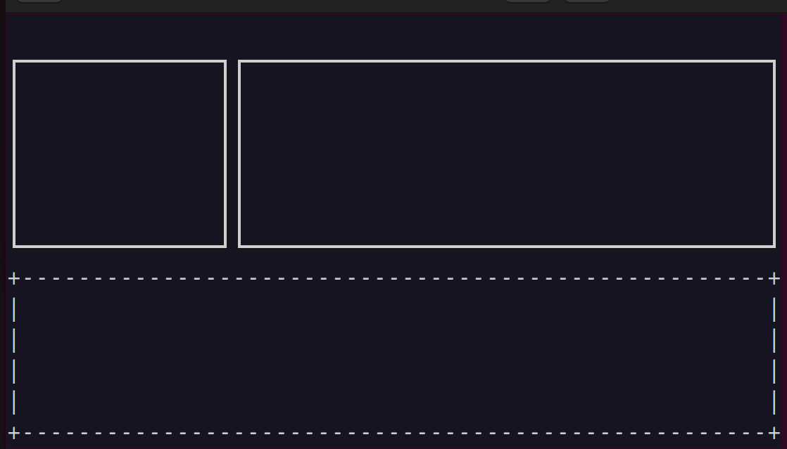

### 5. Output
- Title of each widow and messages in the debug window
- chap05.py:
```py
import sys,os
import curses
ncount_debug = 0
 
def cr_menu_bar_window(h: int, w: int, y: int, x: int):
    win = curses.newwin(h,w,y,x)
    win.refresh()
    return win
def cr_file_list_window(h: int, w: int, y: int, x: int):
    win = curses.newwin(h,w,y,x)
    win.border(0,0,0,0,0,0,0,0)
    win.addstr(0,1,"File List")
    win.refresh()
    return win
def cr_content_window(h: int, w: int, y: int, x: int):
    win = curses.newwin(h,w,y,x)
    win.box(0,0)
    win.addstr(0,1,"Contents")
    win.refresh()
    return win
def cr_debug_window(h: int, w: int, y: int, x: int):
    win = curses.newwin(h,w,y,x)
    win.border('|', '|', '-', '-', '+', '+', '+', '+')
    win.addstr(0,1,"Debug")
    win.refresh()
    return win
def debug_line(dwin, str1):
    global ncount_debug
    dwin.addstr(ncount_debug+1,1, str(ncount_debug) + " : " + str1 + "\n")
    ncount_debug = ncount_debug + 1
    dwin.refresh()
def draw_menu(stdscr):
    curses.cbreak()
    curses.curs_set(0)
    curses.noecho()
    stdscr.keypad(True)
    stdscr.refresh()
    h, w = stdscr.getmaxyx()   
    # Initialization
    ncount_debug = 0
    h_file = h - 1 - 6;
    w_file = int(w * 0.3);
    mwin = cr_menu_bar_window(1, w, 0, 0)
    mwin.refresh()
    fwin = cr_file_list_window(h_file, w_file, 1, 0)
    fwin.refresh()
    cwin = cr_content_window(h_file, w - w_file, 1, w_file)
    cwin.refresh()
    dwin = cr_debug_window(6,w,1+h_file,0)
    debug_line(dwin,"This is a debug message")
    debug_line(dwin, "Hello ncurses")
    dwin.refresh()
    # Wait for next input
    k = stdscr.getch()
 
def main():
    curses.wrapper(draw_menu)
 
if __name__ == "__main__":
    main()
```
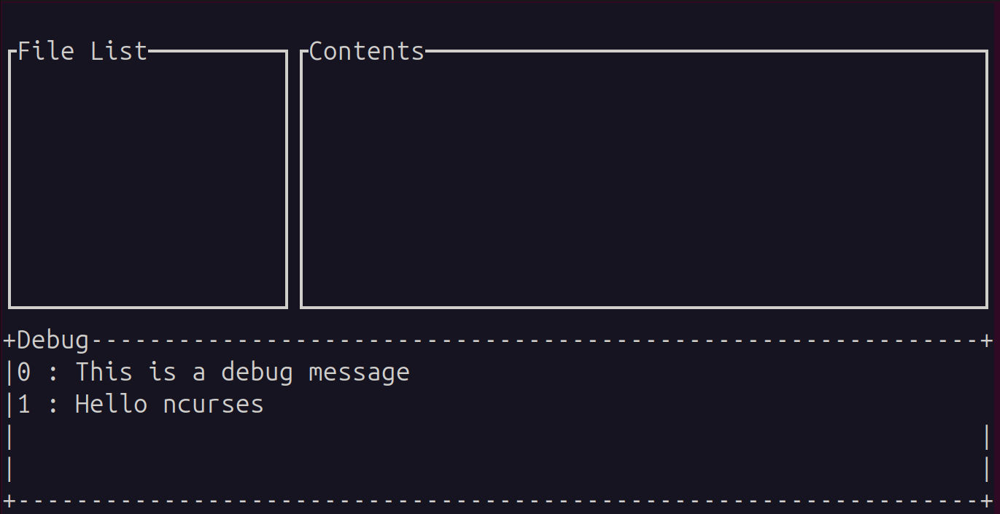

### 6. List directory
- List of dirs and files in the file window
    - The location is given from `--path` option
- chap06.py:
```py
import sys,os,argparse
import curses
ncount_debug = 0
 
def cr_menu_bar_window(h: int, w: int, y: int, x: int):
    win = curses.newwin(h,w,y,x)
    win.refresh()
    return win
def cr_file_list_window(h: int, w: int, y: int, x: int):
    win = curses.newwin(h,w,y,x)
    win.border(0,0,0,0,0,0,0,0)
    win.addstr(0,1,"File List")
    win.refresh()
    return win
def fwin_list_dir_file(fwin,dir_path):
    list_files = []
    list_dirs = []
    with os.scandir(dir_path) as entries:
        for entry in entries:
            if entry.is_file():
                 list_files.append(entry.name) 
            if entry.is_dir():
                 list_dirs.append(entry.name) 
    hmax, wmax = fwin.getmaxyx()
    fwin.border(0,0,0,0,0,0,0,0)
    fwin.addstr(0,1,dir_path)
    list_all = list_dirs[:] + list_files[:]
    n_all = len(list_all)
    if (n_all == 0):
        fwin.addstr(1,1,"Nothing")
    else:
        for row in range(0,hmax-2):
            if row >= n_all:
                break
            fwin.addstr(row+1,1,list_all[row])
    fwin.addstr(hmax-1,1,str(n_all))
def cr_content_window(h: int, w: int, y: int, x: int):
    win = curses.newwin(h,w,y,x)
    win.box(0,0)
    win.addstr(0,1,"Contents")
    win.refresh()
    return win
def cr_debug_window(h: int, w: int, y: int, x: int):
    win = curses.newwin(h,w,y,x)
    win.border('|', '|', '-', '-', '+', '+', '+', '+')
    win.addstr(0,1,"Debug")
    win.refresh()
    return win
def debug_line(dwin, str1):
    global ncount_debug
    dwin.addstr(ncount_debug+1,1, str(ncount_debug) + " : " + str1 + "\n")
    ncount_debug = ncount_debug + 1
    dwin.refresh()
def draw_menu(stdscr):
    curses.cbreak()
    curses.curs_set(0)
    curses.noecho()
    stdscr.keypad(True)
    stdscr.refresh()
    h, w = stdscr.getmaxyx()   
    # Initialization
    ncount_debug = 0
    h_file = h - 1 - 6;
    w_file = int(w * 0.3);
    # argument
    parser = argparse.ArgumentParser()
    parser.add_argument('--path', type=str, required=True)
    args = parser.parse_args()
    dir_path = args.path
    #
    mwin = cr_menu_bar_window(1, w, 0, 0)
    mwin.refresh()
    fwin = cr_file_list_window(h_file, w_file, 1, 0)
    fwin_list_dir_file(fwin,dir_path)
    fwin.refresh()
    cwin = cr_content_window(h_file, w - w_file, 1, w_file)
    cwin.refresh()
    dwin = cr_debug_window(6,w,1+h_file,0)
    debug_line(dwin,"This is a debug message")
    debug_line(dwin, "Hello ncurses")
    dwin.refresh()
    # Wait for next input
    k = stdscr.getch()
 
def main():
    curses.wrapper(draw_menu)
 
if __name__ == "__main__":
    main()
```
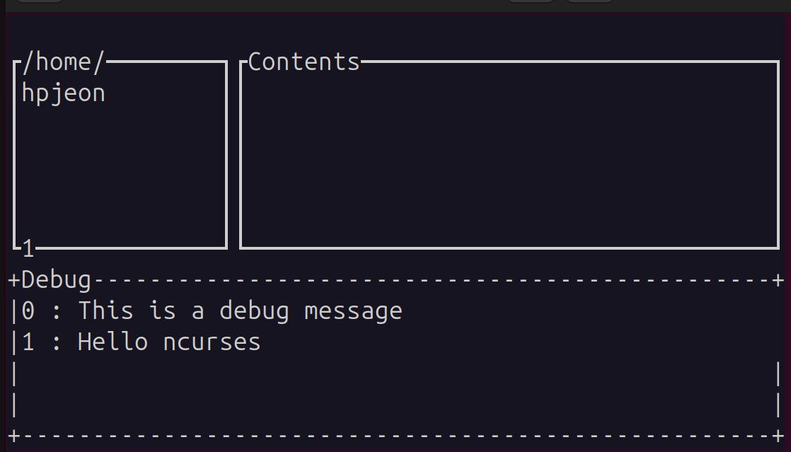

### 7. List directory - enhancement
- File/directory/unaccessible items are in different colors
- chap07.py: 
```py
import sys,os,argparse
import curses
ncount_debug = 0
 
def cr_menu_bar_window(h: int, w: int, y: int, x: int):
    win = curses.newwin(h,w,y,x)
    win.addstr(0,1,"Types:")
    win.addstr(0,8,"Directory", curses.color_pair(2))
    win.addstr(0,18,"File", curses.color_pair(3))
    win.addstr(0,23,"Not_accessible", curses.color_pair(1))
    win.refresh()
    return win
def cr_file_list_window(h: int, w: int, y: int, x: int):
    win = curses.newwin(h,w,y,x)
    win.border(0,0,0,0,0,0,0,0)
    win.addstr(0,1,"File List")
    win.refresh()
    return win
def fwin_list_dir_file(fwin,dir_path):
    list_files = []
    list_dirs = []
    list_not_allowed = []
    with os.scandir(dir_path) as entries:
        for entry in entries:
            if os.access(entry, os.R_OK):
                if entry.is_file():
                     list_files.append(entry.name) 
                if entry.is_dir():
                     list_dirs.append(entry.name) 
            else:
                list_not_allowed.append(entry.name)
    hmax, wmax = fwin.getmaxyx()
    fwin.border(0,0,0,0,0,0,0,0)
    if len(dir_path) > wmax-2:
        dir_path = dir_path[:wmax-2-3] + "..."
    fwin.addstr(0,1,dir_path)
    list_all = list_not_allowed[:] + list_dirs[:] + list_files[:]
    n_all = len(list_all)
    if (n_all == 0):
        fwin.addstr(1,1,"Nothing")
    else:
        for row in range(0,hmax-2):
            if row >= n_all:
                break
            if list_all[row] in list_files:
                fwin.addstr(row+1,1,list_all[row], curses.color_pair(3))
            elif list_all[row] in list_dirs:
                fwin.addstr(row+1,1,list_all[row], curses.color_pair(2))
            else:
                fwin.addstr(row+1,1,list_all[row], curses.color_pair(1))
    fwin.addstr(hmax-1,1,str(n_all))
def cr_content_window(h: int, w: int, y: int, x: int):
    win = curses.newwin(h,w,y,x)
    win.box(0,0)
    win.addstr(0,1,"Contents")
    win.refresh()
    return win
def cr_debug_window(h: int, w: int, y: int, x: int):
    win = curses.newwin(h,w,y,x)
    win.border('|', '|', '-', '-', '+', '+', '+', '+')
    win.addstr(0,1,"Debug")
    win.refresh()
    return win
def debug_line(dwin, str1):
    global ncount_debug
    dwin.addstr(ncount_debug+1,1, str(ncount_debug) + " : " + str1 + "\n")
    ncount_debug = ncount_debug + 1
    dwin.refresh()
def draw_menu(stdscr):
    if curses.has_colors():
        curses.start_color()
        curses.init_pair(1,curses.COLOR_RED, curses.COLOR_BLACK)
        curses.init_pair(2,curses.COLOR_GREEN, curses.COLOR_BLACK)
        curses.init_pair(3,curses.COLOR_YELLOW, curses.COLOR_BLACK)
    curses.cbreak()
    curses.curs_set(0)
    curses.noecho()
    stdscr.keypad(True)
    stdscr.refresh()
    h, w = stdscr.getmaxyx()   
    # Initialization
    ncount_debug = 0
    h_file = h - 1 - 6;
    w_file = int(w * 0.3);
    # argument
    parser = argparse.ArgumentParser()
    parser.add_argument('--path', type=str, required=True)
    args = parser.parse_args()
    dir_path = args.path
    #
    mwin = cr_menu_bar_window(1, w, 0, 0)
    mwin.refresh()
    fwin = cr_file_list_window(h_file, w_file, 1, 0)
    fwin_list_dir_file(fwin,dir_path)
    fwin.refresh()
    cwin = cr_content_window(h_file, w - w_file, 1, w_file)
    cwin.refresh()
    dwin = cr_debug_window(6,w,1+h_file,0)
    debug_line(dwin,"This is a debug message")
    debug_line(dwin, "Hello ncurses")
    dwin.refresh()
    # Wait for next input
    k = stdscr.getch()
 
def main():
    parser = argparse.ArgumentParser()
    parser.add_argument('--path', type=str, required=True)
    args = parser.parse_args()
    dir_path = args.path
    if (not os.path.exists(dir_path)):
        print("!!!! "+ dir_path + " doesn't exist. We stop here")
        sys.exit()
    curses.wrapper(draw_menu)
 
if __name__ == "__main__":
    main()
```
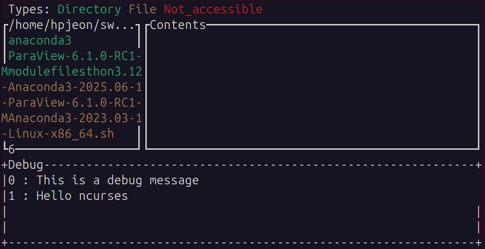

### 8. Attributes
- Clicking tab will switch the window
- chap08.py:
```py
import sys,os,argparse
import curses
import time
ncount_debug = 0
current_window = 0
nwindow = 4 # menu, file, content, debug
list_window = ['menu', 'file', 'content', 'debug']
 
def next_window():
    global nwindow, current_window
    current_window = current_window + 1
    if current_window >= nwindow:
        current_window = current_window % nwindow
def is_current_window(str1):
    global current_window, list_window
    if list_window[current_window] == str1:
        return True
    else:
        return False
def rf_menu_bar_window(win):
    if (is_current_window("menu")):
        win.attron(curses.A_REVERSE)
    win.addstr(0,1,"MENU")
    win.attroff(curses.A_REVERSE)
    win.addstr(1,1,"Types:")
    win.addstr(1,8,"Directory", curses.color_pair(2))
    win.addstr(1,18,"File", curses.color_pair(3))
    win.addstr(1,23,"Not_accessible", curses.color_pair(1))
    win.refresh()
 
def cr_menu_bar_window(h: int, w: int, y: int, x: int):
    win = curses.newwin(h,w,y,x)
    rf_menu_bar_window(win)
    return win
def cr_file_list_window(h: int, w: int, y: int, x: int):
    win = curses.newwin(h,w,y,x)
    win.border(0,0,0,0,0,0,0,0)
    win.addstr(0,1,"File List")
    win.refresh()
    return win
def fwin_list_dir_file(fwin,dir_path):
    list_files = []
    list_dirs = []
    list_not_allowed = []
    with os.scandir(dir_path) as entries:
        for entry in entries:
            if os.access(entry, os.R_OK):
                if entry.is_file():
                     list_files.append(entry.name) 
                if entry.is_dir():
                     list_dirs.append(entry.name) 
            else:
                list_not_allowed.append(entry.name)
    hmax, wmax = fwin.getmaxyx()
    fwin.border(0,0,0,0,0,0,0,0)
    if len(dir_path) > wmax-2:
        dir_path = dir_path[:wmax-2-3] + "..."
    if (is_current_window("file")):
        fwin.attron(curses.A_REVERSE)
    fwin.addstr(0,1,dir_path)
    if (is_current_window("file")):
        fwin.attroff(curses.A_REVERSE)
    list_all = list_not_allowed[:] + list_dirs[:] + list_files[:]
    n_all = len(list_all)
    if (n_all == 0):
        fwin.addstr(1,1,"Nothing")
    else:
        for row in range(0,hmax-2):
            if row >= n_all:
                break
            if list_all[row] in list_files:
                fwin.addstr(row+1,1,list_all[row], curses.color_pair(3))
            elif list_all[row] in list_dirs:
                fwin.addstr(row+1,1,list_all[row], curses.color_pair(2))
            else:
                fwin.addstr(row+1,1,list_all[row], curses.color_pair(1))
    fwin.addstr(hmax-1,1,str(n_all))
    fwin.refresh()
def rf_content_window(win):
    if (is_current_window("content")):
        win.attron(curses.A_REVERSE)
    win.addstr(0,1,"Contents")
    if (is_current_window("content")):
        win.attroff(curses.A_REVERSE)
    win.refresh()
def cr_content_window(h: int, w: int, y: int, x: int):
    win = curses.newwin(h,w,y,x)
    win.box(0,0)
    rf_content_window(win)
    return win
def rf_debug_window(win):
    win.bkgd(' ', curses.color_pair(4))
    if (is_current_window("debug")):
        win.attron(curses.A_REVERSE)
    win.addstr(0,1,"Debug")
    if (is_current_window("debug")):
        win.attroff(curses.A_REVERSE)
    win.refresh()   
def cr_debug_window(h: int, w: int, y: int, x: int):
    win = curses.newwin(h,w,y,x)
    win.border('|', '|', '-', '-', '+', '+', '+', '+')
    rf_debug_window(win)
    return win
def debug_line(dwin, str1):
    global ncount_debug
    dwin.addstr(ncount_debug+1,1, str(ncount_debug) + " : " + str1 + "\n")
    ncount_debug = ncount_debug + 1
    dwin.refresh()
def draw_menu(stdscr):
    global current_window
    if curses.has_colors():
        curses.start_color()
        curses.init_pair(1,curses.COLOR_RED, curses.COLOR_BLACK)
        curses.init_pair(2,curses.COLOR_GREEN, curses.COLOR_BLACK)
        curses.init_pair(3,curses.COLOR_YELLOW, curses.COLOR_BLACK)
        curses.init_pair(4,curses.COLOR_WHITE, curses.COLOR_BLUE)
    curses.cbreak()
    curses.curs_set(0)
    curses.noecho()
    stdscr.keypad(True)
    stdscr.refresh()
    h, w = stdscr.getmaxyx()   
    # Initialization
    ncount_debug = 0
    h_file = h - 2 - 6;
    w_file = int(w * 0.3);
    # argument
    parser = argparse.ArgumentParser()
    parser.add_argument('--path', type=str, required=True)
    args = parser.parse_args()
    dir_path = args.path
    #
    mwin = cr_menu_bar_window(2, w, 0, 0)
    mwin.refresh()
    fwin = cr_file_list_window(h_file, w_file, 2, 0)
    fwin_list_dir_file(fwin,dir_path)
    fwin.refresh()
    cwin = cr_content_window(h_file, w - w_file, 2, w_file)
    cwin.refresh()
    dwin = cr_debug_window(6,w,2+h_file,0)
    debug_line(dwin,"This is a debug message")
    #debug_line(dwin, "Hello ncurses")
    dwin.refresh()
    # Wait for next input   
    k = stdscr.getkey() # getch() returns ascii integer value
    while(k != 'q'):
        match k:
            case 'q':
                debug_line(dwin, k +  str(current_window))
                time.sleep(2)
                break
            case '\t':
                next_window()
                rf_menu_bar_window(mwin)
                fwin_list_dir_file(fwin,dir_path)           
                rf_content_window(cwin)
                rf_debug_window(dwin)
        #debug_line(dwin, k +  str(current_window) + str(is_current_window("file")))
        k = stdscr.getkey()        
def main():
    parser = argparse.ArgumentParser()
    parser.add_argument('--path', type=str, required=True)
    args = parser.parse_args()
    dir_path = args.path
    if (not os.path.exists(dir_path)):
        print("!!!! "+ dir_path + " doesn't exist. We stop here")
        sys.exit()
    curses.wrapper(draw_menu)
 
if __name__ == "__main__":
    main()
```
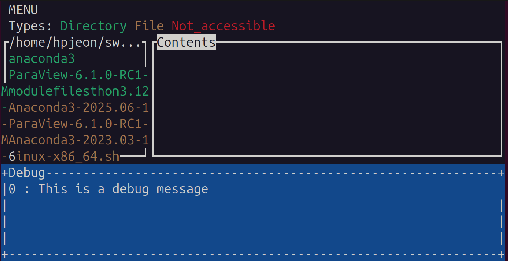

### 9. Color
- By enter key, a text file is scanned (when the size is < 128KB)
    - Binary file will not be scanned. A warning message is printed
- From the given path, using up/down keys then can move to other directories
- chap09.py
```py

import sys,os,argparse
import curses
import time
ncount_debug = 0
list_debug_lines = []
current_window = 0
nwindow = 4 # menu, file, content, debug
list_window = ['menu', 'file', 'content', 'debug']
row_selected_fwin = 0
list_names_fwin = []
list_types_fwin = []
init_list_fwin = 0
last_list_fwin = 9999
dir_path_fwin = ''
dir_path_name_fwin = ''
 
def next_window():
    global nwindow, current_window
    current_window = current_window + 1
    if current_window >= nwindow:
        current_window = current_window % nwindow
def is_current_window(str1):
    global current_window, list_window
    if list_window[current_window] == str1:
        return True
    else:
        return False
def rf_menu_bar_window(win):
    if (is_current_window("menu")):
        win.attron(curses.A_REVERSE)
    win.addstr(0,1,"MENU")
    win.attroff(curses.A_REVERSE)
    win.addstr(1,1,"Types:")
    win.addstr(1,8,"Directory", curses.color_pair(2))
    win.addstr(1,18,"File", curses.color_pair(3))
    win.addstr(1,23,"Not_accessible", curses.color_pair(1))
    win.refresh()
 
def cr_menu_bar_window(h: int, w: int, y: int, x: int):
    win = curses.newwin(h,w,y,x)
    rf_menu_bar_window(win)
    return win
def cr_file_list_window(h: int, w: int, y: int, x: int):
    win = curses.newwin(h,w,y,x)
    win.keypad(True)
    win.border(0,0,0,0,0,0,0,0)
    win.addstr(0,1,"File List")
    win.refresh()
    return win
def return_dir_content(dir_path):
    list_files = []
    list_dirs = []
    list_not_allowed = []
    with os.scandir(dir_path) as entries:
        for entry in entries:
            if os.access(entry, os.R_OK):
                if entry.is_file():
                     list_files.append(entry.name) 
                if entry.is_dir():
                     list_dirs.append(entry.name) 
            else:
                list_not_allowed.append(entry.name)
    list_names = list_dirs[:] + list_files[:] + list_not_allowed[:]
    list_types = [2] * len(list_dirs) + [3]*len(list_files) + [1] * len(list_not_allowed)
    if (dir_path != '/'): # except the root path
         list_names = ['.','..'] + list_names
         list_types = [2,2] + list_types
    return list_names, list_types
def enter_file(fwin):
    global row_selected_fwin, dir_path_fwin, list_names_fwin
    hmax, wmax = fwin.getmaxyx()
    n_names = len(list_names_fwin)
    fwin.clear()
    row_selected_fwin = row_selected_fwin % n_names # +/ by up down
    if (list_types_fwin[row_selected_fwin] == 2): #dir
        new_path = dir_path_fwin + '/' + list_names_fwin[row_selected_fwin]
        new_path = os.path.abspath(new_path) # .. or ./
        fwin_list_dir_file(fwin, new_path)
    #elif (list_types_fwin[row_selected_fwin] == 3): # file
         # open file in the content window
def fwin_list_dir_file(fwin, dir_path):
    global list_names_fwin, list_types_fwin, dir_path_fwin, dir_path_name_fwin
    hmax, wmax = fwin.getmaxyx()
    if len(dir_path) > wmax-2:
        dir_path_name_fwin = dir_path[:wmax-2-3] + "..."
    else:
        dir_path_name_fwin = dir_path
    #
    list_names_fwin, list_types_fwin = return_dir_content(dir_path)
def rf_fwin(fwin,dwin):
    global row_selected_fwin, list_names_fwin, list_types_fwin, init_list_fwin, last_list_fwin, dir_path_name_fwin
    hmax, wmax = fwin.getmaxyx()
    n_names = len(list_names_fwin)
    fwin.clear()
    fwin.border(0,0,0,0,0,0,0,0)
    if (is_current_window("file")):
        fwin.attron(curses.A_REVERSE)
    fwin.addstr(0,1,dir_path_name_fwin)
    if (is_current_window("file")):
        fwin.attroff(curses.A_REVERSE)
    # scenarios
    # 1) when file list is empty [. ..] only
    # 2) when file list is longer than window size
    # 3) when file list is shorter than window size
    row_selected_fwin = row_selected_fwin % n_names # +/ by up down
    init_list_fwin = 0
    last_list_fwin = hmax-2-1
    if n_names < hmax-2:
        last_list_fwin = n_names
    if (n_names >= (hmax-2)):
        if (row_selected_fwin < init_list_fwin):
            init_list_fwin = row_selected_fwin
            last_list_fwin = init_list_fwin + hmax - 2 - 1
        if (row_selected_fwin > last_list_fwin): # move the cursor to the bottom
            last_list_fwin = row_selected_fwin
            init_list_fwin = last_list_fwin - hmax + 2 + 1
    #names_list = list_names_fwin[init_list_fwin:last_list_fwin]
    #types_list = list_types_fwin[init_list_fwin:last_list_fwin]
    debug_line(dwin,str(init_list_fwin) + ":" + str(last_list_fwin) + " key " + str(row_selected_fwin) )
    for i in range(0,hmax-2):
        row = i + init_list_fwin
        if row >= n_names:
            break
        if row == row_selected_fwin:
            coption = curses.A_REVERSE
        else:
            coption = 0
        if list_types_fwin[row] == 3: # file
            fwin.addstr(i+1,1,list_names_fwin[row], curses.color_pair(3) | coption)
        elif list_types_fwin[row] == 2: # dir
            fwin.addstr(i+1,1,list_names_fwin[row], curses.color_pair(2) | coption)
        else: # forbidden
            fwin.addstr(i+1,1,list_names_fwin[row], curses.color_pair(1) | coption)
    fwin.addstr(hmax-1,1,str(n_names))
    fwin.refresh()
def rf_content_window(win):
    if (is_current_window("content")):
        win.attron(curses.A_REVERSE)
    win.addstr(0,1,"Contents")
    if (is_current_window("content")):
        win.attroff(curses.A_REVERSE)
    win.refresh()
def cr_content_window(h: int, w: int, y: int, x: int):
    win = curses.newwin(h,w,y,x)
    win.box(0,0)
    rf_content_window(win)
    return win
def rf_debug_window(win):
    win.bkgd(' ', curses.color_pair(4))
    if (is_current_window("debug")):
        win.attron(curses.A_REVERSE)
    win.addstr(0,1,"Debug")
    if (is_current_window("debug")):
        win.attroff(curses.A_REVERSE)
    win.refresh()   
def cr_debug_window(h: int, w: int, y: int, x: int):
    win = curses.newwin(h,w,y,x)
    win.border('|', '|', '-', '-', '+', '+', '+', '+')
    rf_debug_window(win)
    return win
def debug_line(dwin, str1):
    global ncount_debug, list_debug_lines
    line = str(ncount_debug) + " : " + str1 + "\n"
    list_debug_lines.append(line)
    h, w = dwin.getmaxyx()
    ncount_debug = ncount_debug + 1
    if ncount_debug > h-2: # when debug lines are more than window size, remove the upper line
        list_debug_lines.pop(0)
        for idx, el in enumerate(list_debug_lines):
            dwin.addstr(idx+1,1,el)
    else:
        dwin.addstr(ncount_debug,1, line)
    dwin.refresh()
def handle_key_in_current_window(k, mwin,fwin,cwin,dwin):
    global row_selected_fwin
    if is_current_window('file'):
        #debug_line(dwin, str(k) + " key is clicked")
        if (k == "KEY_DOWN"):
            row_selected_fwin = row_selected_fwin + 1
        elif (k == "KEY_UP"):
            row_selected_fwin = row_selected_fwin - 1
        elif (k in ('\n','\r', "KEY_ENTER")):
            enter_file(fwin)
        rf_fwin(fwin,dwin)
 
def draw_menu(stdscr):
    global current_window
    if curses.has_colors():
        curses.start_color()
        curses.init_pair(1,curses.COLOR_RED, curses.COLOR_BLACK)
        curses.init_pair(2,curses.COLOR_GREEN, curses.COLOR_BLACK)
        curses.init_pair(3,curses.COLOR_YELLOW, curses.COLOR_BLACK)
        curses.init_pair(4,curses.COLOR_WHITE, curses.COLOR_BLUE)
    curses.cbreak()
    curses.curs_set(0)
    curses.noecho()
    stdscr.keypad(True)
    stdscr.refresh()
    h, w = stdscr.getmaxyx()   
    # Initialization
    ncount_debug = 0
    h_file = h - 2 - 6;
    w_file = int(w * 0.3);
    # argument
    parser = argparse.ArgumentParser()
    parser.add_argument('--path', type=str, required=True)
    args = parser.parse_args()
    dir_path = args.path
    #
    mwin = cr_menu_bar_window(2, w, 0, 0)
    mwin.refresh()
    fwin = cr_file_list_window(h_file, w_file, 2, 0)
    fwin_list_dir_file(fwin,dir_path)
    cwin = cr_content_window(h_file, w - w_file, 2, w_file)
    cwin.refresh()
    dwin = cr_debug_window(6,w,2+h_file,0)
    debug_line(dwin,"This is a debug message")
    dwin.refresh()
    rf_fwin(fwin,dwin)
    # Wait for next input   
    k = stdscr.getkey() # getch() returns ascii integer value
    while(k != 'q'):
        match k:
            case 'q':
                debug_line(dwin, k +  str(current_window))
                time.sleep(2)
                break
            case '\t':
                next_window()
                rf_menu_bar_window(mwin)
                fwin_list_dir_file(fwin,dir_path)
                rf_fwin(fwin,dwin)
                rf_content_window(cwin)
                rf_debug_window(dwin)
            #case '\n' | '\r' | 'KEY_ENTER':
            #    break
            case _:
                handle_key_in_current_window(k, mwin,fwin,cwin,dwin)
        #debug_line(dwin, k +  str(current_window) + str(is_current_window("file")))
        k = stdscr.getkey()        
def main():
    parser = argparse.ArgumentParser()
    parser.add_argument('--path', type=str, required=True)
    args = parser.parse_args()
    dir_path = args.path
    if (not os.path.exists(dir_path)):
        print("!!!! "+ dir_path + " doesn't exist. We stop here")
        sys.exit()
    curses.wrapper(draw_menu)
 
if __name__ == "__main__":
    main()
```
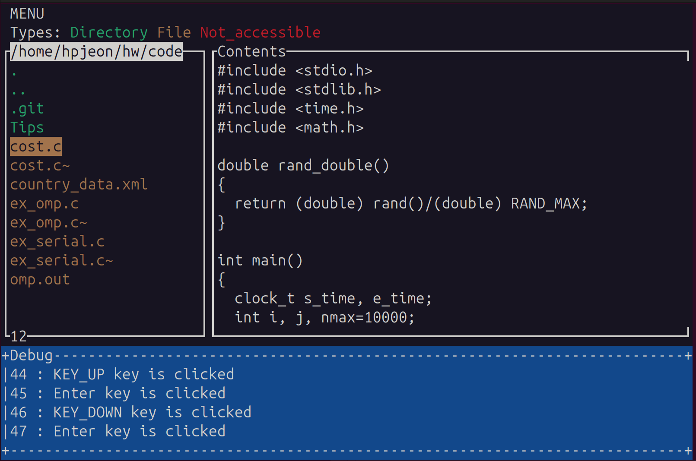

## Re-writing Python codes using classes

### 4. Window
- Make new classes while member data are defined from curses.newwin()
- Instead of menu/file/content/debug windows above, we define top/file/content/message windows
    - Each will be objects of twin, fwin, cwin, mwin in the code
- As many methods can be contained within each class, codes become easy-readable, and code maintenance can be improved
    - Also we can remove global variables, improving sustainability
```py
import sys,os
import curses
 
class FileWindow:
    def __init__(self,h,w,y,x):
        self.win = curses.newwin(h,w,y,x)
        self.win.border(0,0,0,0,0,0,0,0)
    def __getattr__(self,attr):
        return getattr(self.win,attr)
class TopWindow:
    def __init__(self,h,w,y,x):
        self.win = curses.newwin(h,w,y,x)
    def __getattr__(self,attr):
        return getattr(self.win,attr)
class ContentWindow:
    def __init__(self,h,w,y,x):
        self.win = curses.newwin(h,w,y,x)
        self.win.box(0,0)
    def __getattr__(self,attr):
        return getattr(self.win,attr)
class MessgWindow:
    def __init__(self,h,w,y,x):
        self.win = curses.newwin(h,w,y,x)
        self.win.border('|', '|', '-', '-', '+', '+', '+', '+')
    def __getattr__(self,attr):
        return getattr(self.win,attr)  
 
def draw_menu(stdscr):
    curses.cbreak()
    curses.curs_set(0)
    curses.noecho()
    stdscr.keypad(True)
    stdscr.refresh()
    h, w = stdscr.getmaxyx()   
    # Initialization
    h_file = h - 1 - 6;
    w_file = int(w * 0.3);   
    twin = TopWindow(1, w, 0, 0)
    twin.refresh()
    fwin = FileWindow(h_file, w_file, 1, 0)
    fwin.refresh()
    cwin = ContentWindow(h_file, w - w_file, 1, w_file)
    cwin.refresh()
    mwin = MessgWindow(6,w,1+h_file,0)
    mwin.refresh()
    # Wait for next input
    k = stdscr.getch()
 
def main():
    curses.wrapper(draw_menu)
 
if __name__ == "__main__":
    if sys.version_info < (3,10):
        print("Requires Python 3.10 or newer. We exit now")
        sys.exit()
    main()
```
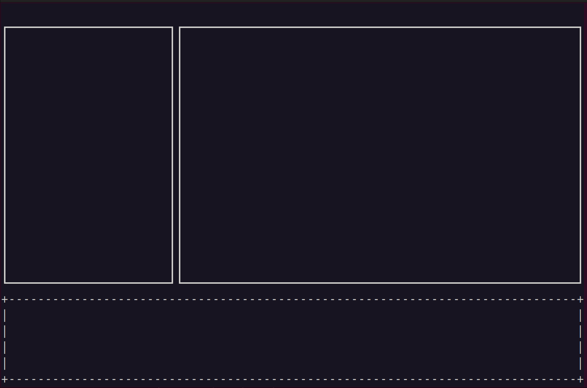

### 8. Attributes
- We introduce WinManager class, which is static - no class object instantiation - but classmethods are used as static functions
    - This manage next_window() and is_current_window(), allowing tab key can switch among windows
```py
import sys,os
import curses
 
class WinManager:
    current_window = 0
    list_window = ['top', 'file', 'content', 'messg']
    @classmethod
    def next_window(cls):
        cls.current_window = cls.current_window + 1
        cls.current_window = cls.current_window % len(cls.list_window)
    @classmethod
    def is_current_window(cls,str1):
        if cls.list_window[cls.current_window] == str1:
            return True
        else:
            return False
class FileWindow:
    def __init__(self,h,w,y,x):
        self.win = curses.newwin(h,w,y,x)
        self.win.border(0,0,0,0,0,0,0,0)
        self.win.addstr(0,1,"File List")
    def __getattr__(self,attr):
        return getattr(self.win,attr)
    def rf(self):
        self.win.border(0,0,0,0,0,0,0,0)
        if (WinManager.is_current_window("file")):
            self.win.attron(curses.A_REVERSE)
        self.win.addstr(0,1,"File List")
        self.win.attroff(curses.A_REVERSE)
        self.win.refresh()
class TopWindow:
    def __init__(self,h,w,y,x):
        self.win = curses.newwin(h,w,y,x)
    def __getattr__(self,attr):
        return getattr(self.win,attr)
    def rf(self):
        if (WinManager.is_current_window("top")):
            self.win.attron(curses.A_REVERSE)
        self.win.addstr(0,1,"Top")
        self.win.attroff(curses.A_REVERSE)
        self.win.addstr(1,1,"Types:")
        self.win.addstr(1,8,"Directory", curses.color_pair(2))
        self.win.addstr(1,18,"File", curses.color_pair(3))
        self.win.addstr(1,23,"Not_accessible", curses.color_pair(1))
        self.win.refresh()
class ContentWindow:
    def __init__(self,h,w,y,x):
        self.win = curses.newwin(h,w,y,x)
        self.win.box(0,0)
    def __getattr__(self,attr):
        return getattr(self.win,attr)
    def rf(self):
        self.win.box(0,0)
        if (WinManager.is_current_window("content")):
            self.win.attron(curses.A_REVERSE)
        self.win.addstr(0,1,"Content")
        self.win.attroff(curses.A_REVERSE)
        self.win.refresh()
class MessgWindow:
    def __init__(self,h,w,y,x):
        self.win = curses.newwin(h,w,y,x)
        self.win.border('|', '|', '-', '-', '+', '+', '+', '+')
        self.ncount_messg = 0
    def __getattr__(self,attr):
        return getattr(self.win,attr)  
    def rf(self):
        self.win.border('|', '|', '-', '-', '+', '+', '+', '+')
        if (WinManager.is_current_window("messg")):
            self.win.attron(curses.A_REVERSE)
        self.win.addstr(0,1,"Message")
        self.win.attroff(curses.A_REVERSE)
        self.win.refresh()
    def show_messg(self, str1):
        self.win.addstr(self.ncount_messg+1,1, str(self.ncount_messg) + " : " + str1 + "\n")
        self.ncount_messg = self.ncount_messg + 1
 
def draw_menu(stdscr):
    if curses.has_colors():
        curses.start_color()
        curses.init_pair(1,curses.COLOR_RED, curses.COLOR_BLACK)
        curses.init_pair(2,curses.COLOR_GREEN, curses.COLOR_BLACK)
        curses.init_pair(3,curses.COLOR_YELLOW, curses.COLOR_BLACK)
        curses.init_pair(4,curses.COLOR_WHITE, curses.COLOR_BLUE)
    curses.cbreak()
    curses.curs_set(0)
    curses.noecho()
    stdscr.keypad(True)
    stdscr.refresh()
    h, w = stdscr.getmaxyx()   
    # Initialization
    h_file = h - 2 - 6;
    w_file = int(w * 0.3);   
    twin = TopWindow(2, w, 0, 0)
    twin.refresh()
    fwin = FileWindow(h_file, w_file, 2, 0)
    fwin.refresh()
    cwin = ContentWindow(h_file, w - w_file, 2, w_file)
    cwin.refresh()
    mwin = MessgWindow(6,w,2+h_file,0)
    mwin.refresh()
    # Wait for next input   
    k = stdscr.getkey() # getch() returns ascii integer value
    while(k != 'q'):
        match k:
            case 'q':
                debug_line(dwin, k +  str(current_window))
                time.sleep(2)
                break
            case '\t':
                WinManager.next_window()
                twin.rf()
                fwin.rf()
                cwin.rf()
                mwin.rf()
        k = stdscr.getkey()        
def main():
    curses.wrapper(draw_menu)
 
if __name__ == "__main__":
    if sys.version_info < (3,10):
        print("Requires Python 3.10 or newer. We exit now")
        sys.exit()
    main()
```
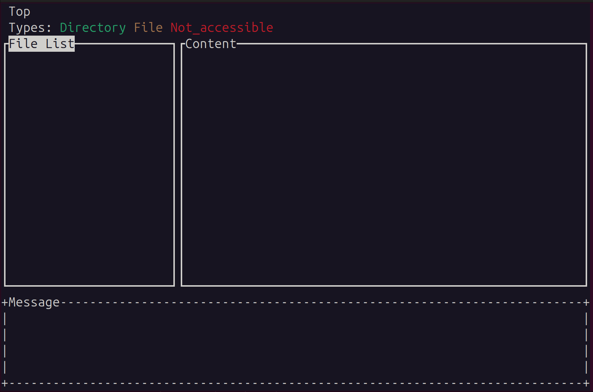

### 9. Color
- Final version: 
    - Run command is `python3 chap09_oop.py --path /home`
- Click tab key to move to the file window. Then using up/down key, you can move among file/dir items. For directories, it will move to the corresponding folder. Entering for text file, it will be scanned and the content will be displayed in the content window. Key stroke is shown in the message window
- A binary file will not be scanned but warning message is shown in the content window
- A text file larger than 128KB will not be scanned
- click 'q' to exit
```py
import sys,os,argparse
import curses
import time
def is_binary(filename):
    fsize = os.path.getsize(filename)
    with open(filename,'rb') as f:
        if fsize>1024:
            chunk = f.read(1024)
        else:
            chunk = f.read(fsize)
        if b'\0' in chunk:
            return True
    return False
class WinManager:
    current_window = 0
    list_window = ['top', 'file', 'content', 'messg']
    @classmethod
    def next_window(cls):
        cls.current_window = cls.current_window + 1
        cls.current_window = cls.current_window % len(cls.list_window)
    @classmethod
    def is_current_window(cls,str1):
        if cls.list_window[cls.current_window] == str1:
            return True
        else:
            return False
class FileWindow:
    def __init__(self,h,w,y,x):
        self.win = curses.newwin(h,w,y,x)
        self.win.border(0,0,0,0,0,0,0,0)
        self.dir_path = ''
        self.dir_path_name = '...'
        self.row_selected = 0
        self.start_list = 0
        self.end_list = 999
        self.list_names = []
        self.list_types = []
    def __getattr__(self,attr):
        return getattr(self.win,attr)
    def rf(self):
        self.win.clear()
        self.win.border(0,0,0,0,0,0,0,0)
        if (WinManager.is_current_window("file")):
            self.win.attron(curses.A_REVERSE)
        self.win.addstr(0,1,self.dir_path_name)
        self.win.attroff(curses.A_REVERSE)
        hmax, wmax = self.win.getmaxyx()
        n_names = len(self.list_names)
        self.row_selected = self.row_selected % n_names # +/ by up down
        self.start_list = 0
        self.end_list = hmax-2-1
        if n_names < hmax-2:
            self.end_list = n_names
        if (n_names >= (hmax-2)):
            if (self.row_selected < self.start_list):
                self.start_list = self.row_selected
                self.end_list = self.start_list + hmax - 2 - 1
            if (self.row_selected > self.end_list): # move the cursor to the bottom
                self.end_list = self.row_selected
                self.start_list = self.end_list - hmax + 2 + 1
        for i in range(0,hmax-2):
            row = i + self.start_list
            if row >= n_names:
                break
            if row == self.row_selected:
                coption = curses.A_REVERSE
            else:
                coption = 0
            if   self.list_types[row] == 3: # file
                self.win.addstr(i+1,1,self.list_names[row], curses.color_pair(3) | coption)
            elif self.list_types[row] == 2: # dir
                self.win.addstr(i+1,1,self.list_names[row], curses.color_pair(2) | coption)
            else: # forbidden
                self.win.addstr(i+1,1,self.list_names[row], curses.color_pair(1) | coption)
        self.win.addstr(hmax-1,1,str(n_names))
        self.win.refresh()
    def get_dir_content(self):
        hmax, wmax = self.win.getmaxyx()
        if len(self.dir_path) > wmax-2:
            self.dir_path_name = self.dir_path[:wmax-2-3] + "..."
        else:
            self.dir_path_name = self.dir_path
        list_files = []
        list_dirs = []
        list_not_allowed = []
        with os.scandir(self.dir_path) as entries:
            for entry in entries:
                if os.access(entry, os.R_OK):
                    if entry.is_file():
                         list_files.append(entry.name) 
                    if entry.is_dir():
                         list_dirs.append(entry.name) 
                else:
                    list_not_allowed.append(entry.name)
        list_dirs.sort()
        list_files.sort()
        list_not_allowed.sort()
        self.list_names = list_dirs[:] + list_files[:] + list_not_allowed[:]
        self.list_types = [2] * len(list_dirs) + [3]*len(list_files) + [1] * len(list_not_allowed)
        if (self.dir_path != '/'): # except the root path
             self.list_names = ['.','..'] + self.list_names
             self.list_types = [2,2]      + self.list_types
class TopWindow:
    def __init__(self,h,w,y,x):
        self.win = curses.newwin(h,w,y,x)
    def __getattr__(self,attr):
        return getattr(self.win,attr)
    def rf(self):
        if (WinManager.is_current_window("top")):
            self.win.attron(curses.A_REVERSE)
        self.win.addstr(0,1,"** Simple File Scanner ** ")
        self.win.attroff(curses.A_REVERSE)
        self.win.addstr(1,1,"Types:")
        self.win.addstr(1,8,"Directory", curses.color_pair(2))
        self.win.addstr(1,18,"File", curses.color_pair(3))
        self.win.addstr(1,23,"Not_accessible", curses.color_pair(1))
        self.win.refresh()
class ContentWindow:
    def __init__(self,h,w,y,x):
        self.win = curses.newwin(h,w,y,x)
        self.win.box(0,0)
    def __getattr__(self,attr):
        return getattr(self.win,attr)
    def rf(self):
        self.win.box(0,0)
        if (WinManager.is_current_window("content")):
            self.win.attron(curses.A_REVERSE)
        self.win.addstr(0,1,"Content")
        self.win.attroff(curses.A_REVERSE)
        self.win.refresh()
    def display(self, list_msg):
        self.win.clear()
        self.rf()
        h, w = self.win.getmaxyx()
        for n, el in enumerate(list_msg):
            if n > (h-3):
                break
            if len(el) > w:
                el = el[:w-2]
            self.win.addstr(n+1,1,el)
        self.win.refresh()
class MessgWindow:
    def __init__(self,h,w,y,x):
        self.win = curses.newwin(h,w,y,x)
        self.win.border('|', '|', '-', '-', '+', '+', '+', '+')
        self.ncount_messg = 0
        self.list_messg = []
    def __getattr__(self,attr):
        return getattr(self.win,attr)  
    def rf(self):
        self.win.border('|', '|', '-', '-', '+', '+', '+', '+')
        if (WinManager.is_current_window("messg")):
            self.win.attron(curses.A_REVERSE)
        self.win.addstr(0,1,"Message")
        self.win.attroff(curses.A_REVERSE)
        self.win.refresh()
    def show_messg(self, str1):
        new_str = str(self.ncount_messg) + " : " + str1 + "\n"
        self.list_messg.append(new_str)
        h,w = self.win.getmaxyx()
        self.ncount_messg = self.ncount_messg + 1
        if self.ncount_messg > (h-2):
            self.list_messg.pop(0)
            for idx, el in enumerate(self.list_messg):
                self.win.addstr(idx+1,1,el)
        else:
            self.win.addstr(self.ncount_messg,1, new_str)
        self.win.refresh()
def enter_file(fwin,cwin,mwin):
    hmax, wmax = fwin.getmaxyx()
    n_names = len(fwin.list_names)
    fwin.clear()
    fwin.row_selected = fwin.row_selected % n_names # +/ by up down
    if (fwin.list_types[fwin.row_selected] == 2): #dir
        new_path = fwin.dir_path + '/' + fwin.list_names[fwin.row_selected]
        new_path = os.path.abspath(new_path) # .. or ./
        fwin.dir_path = new_path
        fwin.get_dir_content()
    elif (fwin.list_types[fwin.row_selected] == 3): # file
        # open file in the content window
        # only text file less than 128KB will be opened
        afile = fwin.dir_path + '/' + fwin.list_names[fwin.row_selected]
        fsize = os.path.getsize(afile)
        if fsize < 131072: # 1024*128
            if is_binary(afile):
                cwin.display(["Warning: This is a binary. Will not be scanned"])
            else:
                f = open(afile,'r')
                ctxt = f.readlines()
                f.close()
                cwin.display(ctxt)
        else:
            cwin_message(cwin,["Warning: File is too large. Will not be scanned"])
def handle_key_in_current_window(k, fwin,cwin,mwin):
    if (k in ('\n','\r', "KEY_ENTER")):
        mwin.show_messg("Enter key is clicked")
    else:
        mwin.show_messg(str(k) + " key is clicked")
    if WinManager.is_current_window('file'):
        if (k == "KEY_DOWN"):
            fwin.row_selected = fwin.row_selected + 1
        elif (k == "KEY_UP"):
            fwin.row_selected = fwin.row_selected - 1
        elif (k in ('\n','\r', "KEY_ENTER")):
            enter_file(fwin,cwin,mwin)
        fwin.rf()
    mwin.rf()
 
def draw_menu(stdscr):
    # preparation
    if curses.has_colors():
        curses.start_color()
        curses.init_pair(1,curses.COLOR_RED, curses.COLOR_BLACK)
        curses.init_pair(2,curses.COLOR_GREEN, curses.COLOR_BLACK)
        curses.init_pair(3,curses.COLOR_YELLOW, curses.COLOR_BLACK)
        curses.init_pair(4,curses.COLOR_WHITE, curses.COLOR_BLUE)
    curses.cbreak()
    curses.curs_set(0)
    curses.noecho()
    stdscr.keypad(True)
    stdscr.refresh()
    h, w = stdscr.getmaxyx()   
    # Initialization
    h_file = h - 2 - 6;
    w_file = int(w * 0.3);   
    twin = TopWindow(2, w, 0, 0)
    fwin = FileWindow(h_file, w_file, 2, 0)
    cwin = ContentWindow(h_file, w - w_file, 2, w_file)
    mwin = MessgWindow(6,w,2+h_file,0)
    # argument
    parser = argparse.ArgumentParser()
    parser.add_argument('--path', type=str, required=True)
    args = parser.parse_args()
    fwin.dir_path = args.path
    fwin.get_dir_content()
    #
    twin.rf()
    fwin.rf()
    cwin.rf()
    mwin.rf()
    # Wait for next input
    k = stdscr.getkey() # getch() returns ascii integer value
    while(k != 'q'):
        match k:
            case '\t':
                WinManager.next_window()
                twin.rf()
                fwin.rf()
                cwin.rf()
                mwin.rf()
            case _:
                handle_key_in_current_window(k, fwin,cwin,mwin)
        k = stdscr.getkey()        
def main():
    parser = argparse.ArgumentParser()
    parser.add_argument('--path', type=str, required=True)
    args = parser.parse_args()
    dir_path = args.path
    if (not os.path.exists(dir_path)):
        print("!!!! "+ dir_path + " doesn't exist. We stop here")
        sys.exit()
    curses.wrapper(draw_menu)
 
if __name__ == "__main__":
    if sys.version_info < (3,10):
        print("Requires Python 3.10 or newer. We exit now")
        sys.exit()
    main()
```
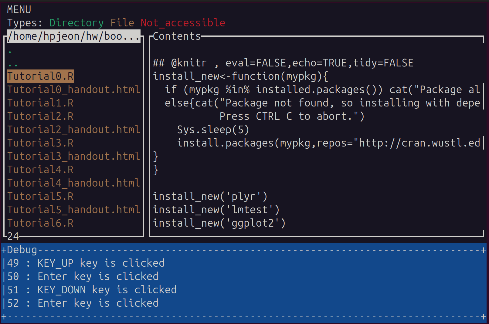