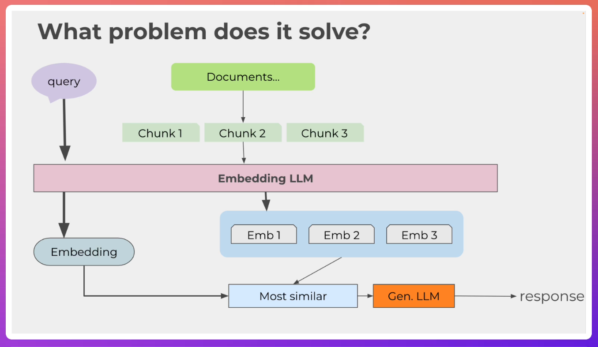
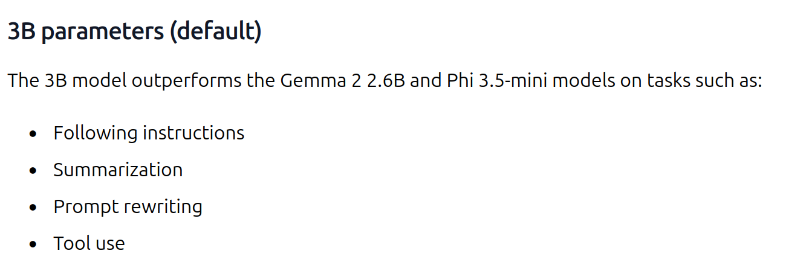
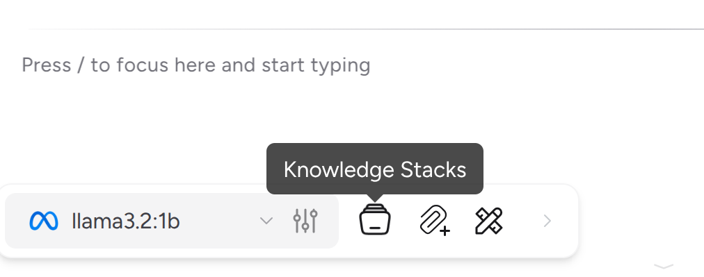
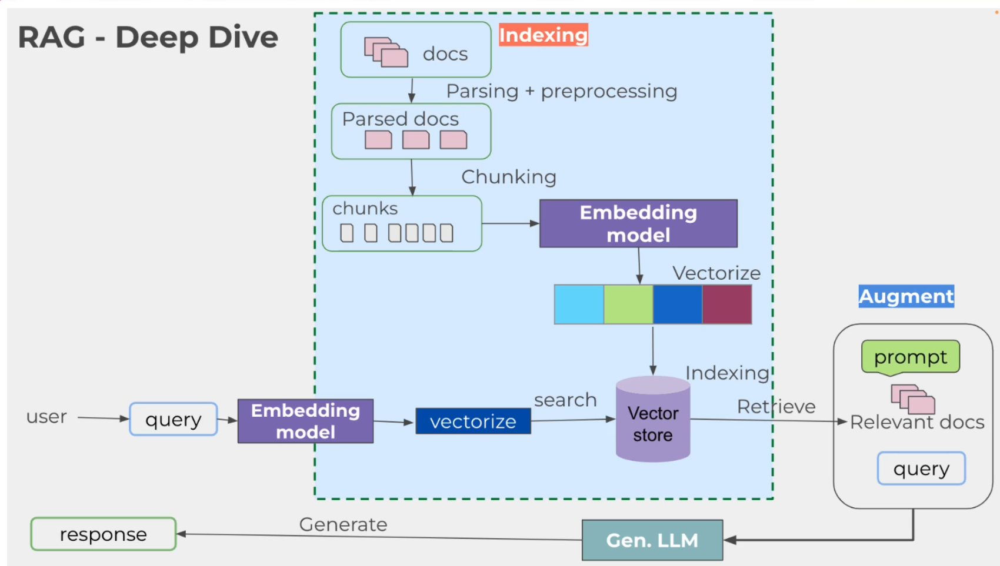
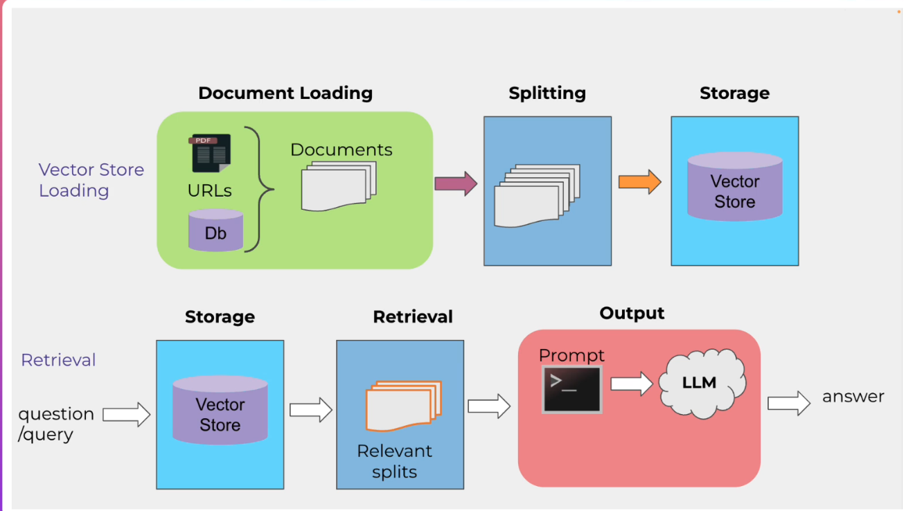
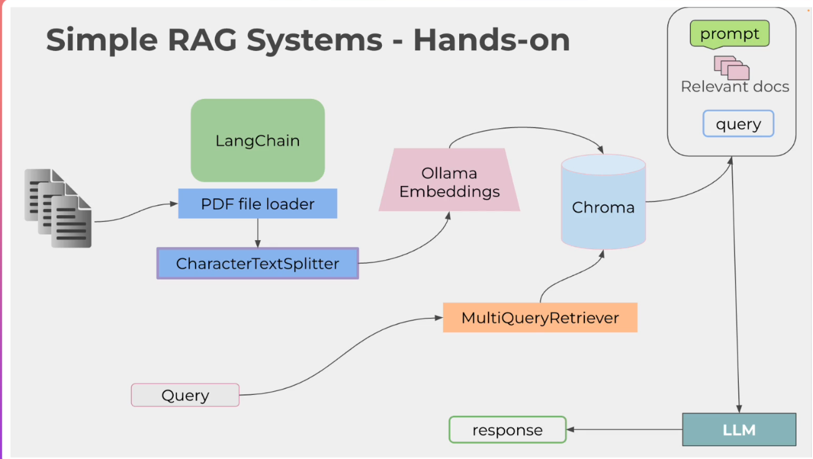

## Mastering Ollama: Build Private Local LLM Apps with Python
- Run custom Ollama LLMs privately on your system—Use ChatGPT-like UI—Hands-on projects—No cloud or extra costs required
- Instructor: Paulo Dichone | Software Engineer, AWS Cloud Practitioner & Instructor

### Section 1: Introduction
#### 1. Introduction & What Will Your Learn
- Ollama
  - Build local LLM applications using Ollama
    - Customize models
    - Use different Ollama models (testing...)
    - Build RAG systems powered by Ollama models
    - Tools/Function calling
    - Build full fledged LLM application with Ollama models

#### 2. Course Prerequisites
- Know programming
  - Wil use python
- Basics of AI, ML, LLM
- Course structure
  - Theory
  - Hands-on

#### 3. Please WATCH this DEMO
- RAG application demo
  - Train a local document, and the UI answers accordingly

### Section 2: Development Environment Setup
#### 4. Development Environment Setup
- Python
  - https://kinsta.com/knowledgebase/install-python
- VS code (or any other code editor)

#### 5. Udemy 101 - Tips for A Better Learning Experience

### Section 3: Download Code and Resources
#### 6. How to Get Source Code

#### 7. Download Source code and Resources
- https://github.com/pdichone/ollama-fundamentals

### Section 4: Ollama Deep Dive - Introduction to Ollama and Setup
#### 8. Ollama Deep Dive - Ollama Overview - What is Ollama and Advantages
- Ollama: a broker or platform running multiple LLM models
- At its core: 
  - CLI: manages installation and execution of LLMs
- What problem does it solve?

  - Privacy concerns: running LLMs locally provides a lot of security
  - Ease of use: setting up LLMs can be challenging. With Ollama, it is an easy process
  - Cost of efficiency: no more cloud-based services which could cost much
  - Latency reduction: local execution reduces the latency issues
  - Customization: Greater flexibility in customizing our models

#### 9. Ollama Key Features and Use Cases
- Model management
  - You can easily download and switch b/w models
- Unified interface
- Extensibility
- Performance optimization
- Use cases
  - Development and testing: comparison b/w LLM models
  - Education and Research
  - Secure applications for the protection of data privacy

#### 10. System Requirements & Ollama Setup - Overview
- OS: Mac, Linux, Win
- Storage more than 10GB
- Modern CPU

#### 11. Download and Setup Ollama and Llam3.2 Model - Hands-on & Testing
- https://ollama.com
- Installation steps for Linux
  - wget https://ollama.com/install.sh
  - Edit `OLLAMA_INSTALL_DIR=/home/hpjeon/sw_local/ollama`
  - bash ./install.sh
  - export OLLAMA_MODELS=/home/hpjeon/sw_local/models
    - This variable is necessary in the module
- Sample module file:
```tcl
#%Module1.0#####################################################################
##
##
proc ModulesHelp { } {
        puts stderr "\tAdds ollama to your PATH environment variable\n"
}
set topdir /home/hpjeon/sw_local/ollama
prepend-path    PATH $topdir/bin 
setenv OLLAMA_MODELS $topdir/models
```
- Open one terminal and run `ollama serve`
- Open second terminal and run `ollama run llama3.2`
- Commands in Ollama CLI
  - `/clear`
  - `/exit`
  - `/help`
  - `/show info` # model info

#### 12. Ollama Models Page - Full Overview
- Choose appropriate models per request
  - llama3.2 for general purpose
  - nemotron by Nvidia
- We choose llama3.2:3b because they claim:

```bash
$ ollama list
NAME               ID              SIZE      MODIFIED       
llama3.2:1b        baf6a787fdff    1.3 GB    32 seconds ago    
llama3.2:latest    a80c4f17acd5    2.0 GB    10 minutes ago    
```

#### 13. Ollama Model Parameters Deep Dive
- What are parameters?
  - The internal weights and biases that the model learns during training
  - They determine how the model process input data and generate output
- Context length
  - Refers to the max number of tokens that the model can proces in a single input
  - 131072 can handle lengthy articles
- Embedding length
  - The size of the vector representation for each token in the input text
  - Higher dimensions can capture more nuanced meanings and relationship b/w words
- Quantization
  - A technique used to reduce the size of neural network model by reducing the precision of its weight
  - Q4_K_M means that the model weights are quantized to 4 bits
    - Lower bits mean that the model is smaller and uses lower memory usage
```bash
$ ollama run llama3.2:1b
>>> /show info
  Model
    architecture        llama     
    parameters          1.2B      
    context length      131072    
    embedding length    2048      
    quantization        Q8_0      
```

#### 14. Understanding Parameters and Disk Size and Computational Resources Needed
- Choose models by request accordingly

### Section 5: Ollama CLI Commands and the REST API - Hands-on
#### 15. Ollama Commands - Pull and Testing a Model
- Listing the existing models: `ollama list`
- Deleting existing models: `ollama rm llama3.2:1b`
- Pulling models: `ollama pull gemma2`

#### 16. Pull in the Llava Multimodal Model and Caption an Image
- Image related models
  - Multimode models
- ollama run llava 
```bash
$ ollama run llava:7b
>>> what is in the image ./flower.png? Please describe briefly
Added image './flower.png'
 The image shows a close-up of red roses with green leaves. The roses are arranged and appear to be freshly cut, with their petals fully open 
revealing the red color inside. There's no text present in the image. 
>>> where can I find such flowers?  
 You can typically find fresh roses at florists, local flower markets, or online marketplaces that specialize in selling flowers and plants. If you are looking for a specific type of rose with a particular variety, it's best to visit a florist or look on the website of a reputable flower delivery service. Remember to consider factors like seasonality, price, and quality when choosing your roses. 
```

#### 17. Summarization and Sentiment Analysis & Customizing Our Model with the Modelfile
- Using llama3.2
```bash
$ ollama run llama3.2:latest
>>> what is your name?
I don't have a personal name, but I'm an AI design ...
```
- Ask model to be less verbose when the answer is too long
- newModelfile:
```
FROM llama3.2
# set the temperature to 1(higher is more creative)
PARAMETER temperature 0.3
SYSTEM """
   You are James, a very smart assistant who ansers questions succintly and informately
"""
```
- ollama create james -f ./newModelfile
- ollama list
```bash
NAME               ID              SIZE      MODIFIED       
james:latest       f7933465caa6    2.0 GB    13 seconds ago    
llava:7b           8dd30f6b0cb1    4.7 GB    13 minutes ago    
llama3.2:1b        baf6a787fdff    1.3 GB    41 minutes ago    
llama3.2:latest    a80c4f17acd5    2.0 GB    50 minutes ago    
```
- ollama run james
```bash
>>> what is your name?
I'm James.
>>> are you smart?
Yes, I have been trained on a vast amount of knowledge and can provide 
information on a wide range of topics.
```
- ollama rm james

#### 18. Ollama REST API - Generate and Chat Endpoints
- ollama serve runs at localhost:11434
```bash
$ curl http://localhost:11434/api/generate -d '{ "model": "llama3.2", "prompt":"why is the sky blue?", "stream": false
}'
{"model":"llama3.2","created_at":"2025-08-30T00:06:49.208793487Z","response":"The sky appears blue because of a phenomenon called Rayleigh scattering, named after the British physicist Lord Rayleigh, who first described it in the late 19th ...
```

#### 19. Ollama REST API - Request JSON Mode
```bash
$ curl http://localhost:11434/api/generate -d '{ "model": "llama3.2", "prompt":"what color is the sky at different times of the day? Respond using JSON", "format": "json", "stream": false
}'
{"model":"llama3.2","created_at":"2025-08-30T00:10:29.178700606Z","response":"{\"daytime\": \"Blue\", \"sunset\": \"Orange/Pink\", \"dawn\": \"Soft Pink/Red\", \"nighttime\": \"Black/Dark Blue\"}","done":true,"done_reason":"stop"," ...
```
- Endpoint API: https://github.com/ollama/ollama/blob/main/docs/api.md

#### 20. Ollama Models Support Different Tasks - Summary
- Text generation: llama3.x, mistral
- Code generation: codellama
- Multimodal applications (text and images): llava

### Section 6: Ollama - User Interface For Ollama Models

#### 21. Different Ways to Interact with Ollama Models - Overview
- Ways to interact with Ollama and its models
  - CLI
  - UI based interface
    - Ollama Python library
  - API
    - REST API
    - curl command

#### 22. Ollama Model Running Under Msty App - Frontend Tool - RAG System Chat with Docs
- https://msty.ai/
- Standalone UI tools
- sudo dpkg -i MstyStudio_amd64.deb
  - DO NOT install FUSE on Ubuntu. This screws gdm.service
  - MstyStudio
  - Select Got Ollama/Misty Models in the bottom 

- Embeding model using knowledge stack
  - Attach pdf file and find the summary
  - ? File load yields an error

### Section 7: Ollama Python Library - Using Python to Interact with Ollama Models

#### 23. The Ollama Python Library for Building LLM Local Applications - Overview
- Ollama Python library with REST API

#### 24. Interact with Llama3 in Python Using Ollama REST API - Hands-on
- pip install requests
  - Anaconda distribution already has it
```py
import requests
import json
url = "http://localhost:11434/api/generate"
data = {
  "model":"llama3.2:1b",
  "prompt":"Tell me a short story and make it funny"
}
response = requests.post(url,json=data, stream=True)
# check the response
if response.status_code == 200:
    print("Generated Text:", end=" ", flush=True)
    # Iterate over the streaming response
    for line in response.iter_lines():
        if line:
            # Decode the line and parse the JSON
            decoded_line = line.decode("utf-8")
            result = json.loads(decoded_line)
            # Get the text from the response
            generated_text = result.get("response", "")
            print(generated_text, end="", flush=True)
else:
    print("Error:", response.status_code, response.text)
```
- Demo:
```bash
$ python3 chp24.py 
Generated Text: Here's a short, lighthearted story that might tickle your funny bone:
...
```
  '
#### 25. Ollama Python Library - Chatting with a Model
- pip install ollama
```py
import ollama
response = ollama.list()
#print(response)
res = ollama.chat(
  model = "llama3.2:1b",
  messages = [
    {"role":"user","content":"why is the sky blue?"},
  ],
)
print(res["message"]["content"])
```

#### 26. Chat Example with Streaming
```py
import ollama
res = ollama.chat(
    model="llama3.2:1b",
    messages=[
        {
            "role": "user",
            "content": "why is the ocean so salty?",
        },
    ],
    stream=True,
)
for chunk in res:
     print(chunk["message"]["content"], end="", flush=True)
```
#### 27. Using Ollama show Function
```py
import ollama
res = ollama.generate(
    model="llama3.2",
    prompt="why is the sky blue?",
)
show
print(ollama.show("llama3.2"))
```

#### 28. Create a Custom Model in Code
```py
import ollama
modelfile = """
FROM llama3.2
SYSTEM You are very smart assistant who knows everything about oceans. You are very succinct and informative.
PARAMETER temperature 0.1
"""
ollama.create(model="knowitall",modelfile=modelfile)
res = ollama.generate(model="knowitall", prompt = "why is the ocean salty?")
print(res["response"])
ollama.delete(model="knowitall")
```
- ? modelfile argument doesn't work in ollama.create()

### Section 8: Ollama Building LLM Applications with Ollama Models

#### 29. Hands-on: Build a LLM App - Grocery List Categorizer
- Let llama3.2 categorizes the items in the list file
```
Apple
Butter
Cinnamon
Rice
Pasta
Tomatoes
Lettuce
Onions
Strawberries
Coffee
Tea
Cereal
Cheerios
Chicken breast
Brocolli
Ham
Bacon
Cheese
Milk
Pizza
```
- categorizer.py:
```py
import ollama
import os
inputfile = "./grocerylist.txt"
outputfile = "./result.txt"
if not os.path.exists(inputfile):
    print(f"Inputfile '{inputfile}' is not found.")
    exit(1)
with open(inputfile, "r") as f:
    items = f.read().strip()
prompt = f"""
You are an assistant that categorizes and sorts grocery items.
Here is a list of grocery items:
{items}
Please:
1. Categorize these items into appropriate categories such as Produce, Dairy, Meat, Bakery, Beverages, etc.
2. Sort the items alphabetically within each category.
3. Present the categorized list in a clear and organized manner, using bullet points or numbering.
"""
# Send the prompt and get the response
try:
    response = ollama.generate(model="llama3.2:1b", prompt=prompt)
    generated_text = response.get("response", "")
    print("==== Categorized List: ===== \n")
    print(generated_text)

    # Write the categorized list to the output file
    with open(outputfile, "w") as f:
        f.write(generated_text.strip())

    print(f"Categorized grocery list has been saved to '{outputfile}'.")
except Exception as e:
    print("An error occurred:", str(e))    
```
- llama3.2:1b
```bash
$ more result.txt 
I'd be happy to help you sort and categorize your grocery list. Here's the list 
with categories and sorting:

**Produce:**
* Brocolli
* Lettuce
* Onions
* Tomatoes
* Strawberries

1. Apples
2. Cinnamon
3. Cheese
```
- llama3.2:latest
  - More detailed results than 1b
```bash
$ more result.txt 
After categorizing and sorting the grocery items, I present to you the organized
 list below:

**Produce:**
• Apple
• Brocolli
• Lettuce
• Onions
• Strawberries
• Tomatoes

**Dairy:**
• Cheese
• Milk

**Meat:**
...
```

#### 30. Building RAG Systems with Ollama - RAG & LangChain Overview
- RAG: Retrieval-Augmented Generation
  - Converse with our own documents/data

- RAG systems need:
  - LLM models
  - Document Corpus (Knowledge Base)
  - Document Embeddings
  - Vector Store (Vector Database, Faiss, Pinecone, Chromadb)
  - Retrieval mechanism
- LangChain
  - A tool that makes it really eash to deal withLLMs and build robust LLM applications
  - Loading and parsing documents
  - Spitting documents
  - Generating embeddings
  - Provides a unified abstraction for working with LLMs and building LLM applications

#### 31. Deep Dive into Vectorstore and Embeddings - The Whole Picture - Crash course
- LangChain 
  - Vectorstore & Embeddings
  - Store documents into an easy and accessible format
  
- Text with similar content and meaning will have similar vectors
- Sample applications of vectors
  - Searching: finding relevant results to the query string
  - Recommendation: items with related text strings are recommended
  - Classification: text strings are classified by most relevant and similar labels
- Vector store: full overview
  - Documents -> text splits -> embed -> Embedding vectors
  - Querying the vectorstore
    - When query/question enters, embed searches and compares all entries in the vectorstore
    - Most similar entry is picked and passed into LLM

#### 32. PDF RAG System Overview - What we'll Build


#### 33. Setup RAG System - Document Ingestion & Vector Database Creation and Embeddings
- BOI.pdf: https://fincenid.fincen.gov/assets/helpContent/FinCEN-ID-Instructions-20240101.pdf, 11pages pdf
- Requirements:
```
ollama
chromadb
pdfplumber 
langchain
langchain-core
langchain-ollama
langchain-community
langchain_text_splitters
unstructured
unstructured[all-docs]
fastembed
pikepdf
sentence-transformers
elevenlabs
```
- pip3 install -r requirements.txt
- sudo apt install tesseract-ocr
```py
>>> import nltk
>>> nltk.download('punkt')
>>> nltk.download('punkt_tab')
>>> nltk.download('averaged_perceptron_tagger')
```
- This will produce `~/nltk_data` folder. Copy this to /usr/local/share or /usr/local/lib for all user access
- Steps:
  - Ingest PDF Files
  - Extract Text from PDF Files and split into small chunks
  - Send the chunks to the embedding model
  - Save the embeddings to a vector database
  - Perform similarity search on the vector database to find similar documents
  - retrieve the similar documents and present them to the user
```py
from langchain_community.document_loaders import UnstructuredPDFLoader
from langchain_community.document_loaders import OnlinePDFLoader
doc_path = "./BOI.pdf"
model = "llama3.2"
# Local PDF file uploads
if doc_path:
    loader = UnstructuredPDFLoader(file_path=doc_path)
    data = loader.load()
    print("done loading....")
else:
    print("Upload a PDF file")
    # Preview first page
content = data[0].page_content
print(content[:100])
# ==== End of PDF Ingestion ====
# ==== Extract Text from PDF Files and Split into Small Chunks ====
from langchain_ollama import OllamaEmbeddings
from langchain_text_splitters import RecursiveCharacterTextSplitter
from langchain_community.vectorstores import Chroma
# Split and chunk
text_splitter = RecursiveCharacterTextSplitter(chunk_size=1200, chunk_overlap=300)
chunks = text_splitter.split_documents(data)
print("done splitting....")
print(f"Number of chunks: {len(chunks)}")
print(f"Example chunk: {chunks[0]}")
# ===== Add to vector database ===
import ollama
ollama.pull("nomic-embed-text") # we don't use llama here
vector_db = Chroma.from_documents(
    documents=chunks,
    embedding=OllamaEmbeddings(model="nomic-embed-text"),
    collection_name="simple-rag",
)
print("done adding to vector database....")
```  

#### 34. RAG System - Retrieval and Querying
```py
## === Retrieval ===
from langchain.prompts import ChatPromptTemplate, PromptTemplate
from langchain_core.output_parsers import StrOutputParser
from langchain_ollama import ChatOllama
from langchain_core.runnables import RunnablePassthrough
from langchain.retrievers.multi_query import MultiQueryRetriever
# set up our model to use
llm = ChatOllama(model=model)
# a simple technique to generate multiple questions from a single question and then retrieve documents
# based on those questions, getting the best of both worlds.
QUERY_PROMPT = PromptTemplate(
    input_variables=["question"],
    template="""You are an AI language model assistant. Your task is to generate five
    different versions of the given user question to retrieve relevant documents from
    a vector database. By generating multiple perspectives on the user question, your
    goal is to help the user overcome some of the limitations of the distance-based
    similarity search. Provide these alternative questions separated by newlines.
    Original question: {question}""",
)
retriever = MultiQueryRetriever.from_llm(
    vector_db.as_retriever(), llm, prompt=QUERY_PROMPT
)
# RAG prompt
template = """Answer the question based ONLY on the following context:
{context}
Question: {question}
"""
prompt = ChatPromptTemplate.from_template(template)
chain = (
    {"context": retriever, "question": RunnablePassthrough()}
    | prompt
    | llm
    | StrOutputParser()
)
# res = chain.invoke(input=("what is the document about?",))
# res = chain.invoke(
#     input=("what are the main points as a business owner I should be aware of?",)
# )
res = chain.invoke(input=("how to report BOI?",))
print(res)
```

#### 35. RAG System - Cleaner Code
```py
import os
import logging
from langchain_community.document_loaders import UnstructuredPDFLoader
from langchain_text_splitters import RecursiveCharacterTextSplitter
from langchain_community.vectorstores import Chroma
from langchain_ollama import OllamaEmbeddings
from langchain.prompts import ChatPromptTemplate, PromptTemplate
from langchain_ollama import ChatOllama
from langchain_core.output_parsers import StrOutputParser
from langchain_core.runnables import RunnablePassthrough
from langchain.retrievers.multi_query import MultiQueryRetriever
import ollama
# Configure logging
logging.basicConfig(level=logging.INFO)
# Constants
DOC_PATH = "./BOI.pdf"
MODEL_NAME = "llama3.2"
EMBEDDING_MODEL = "nomic-embed-text"
VECTOR_STORE_NAME = "simple-rag"
def ingest_pdf(doc_path):
    """Load PDF documents."""
    if os.path.exists(doc_path):
        loader = UnstructuredPDFLoader(file_path=doc_path)
        data = loader.load()
        logging.info("PDF loaded successfully.")
        return data
    else:
        logging.error(f"PDF file not found at path: {doc_path}")
        return None
def split_documents(documents):
    """Split documents into smaller chunks."""
    text_splitter = RecursiveCharacterTextSplitter(chunk_size=1200, chunk_overlap=300)
    chunks = text_splitter.split_documents(documents)
    logging.info("Documents split into chunks.")
    return chunks
def create_vector_db(chunks):
    """Create a vector database from document chunks."""
    # Pull the embedding model if not already available
    ollama.pull(EMBEDDING_MODEL)
    vector_db = Chroma.from_documents(
        documents=chunks,
        embedding=OllamaEmbeddings(model=EMBEDDING_MODEL),
        collection_name=VECTOR_STORE_NAME,
    )
    logging.info("Vector database created.")
    return vector_db
def create_retriever(vector_db, llm):
    """Create a multi-query retriever."""
    QUERY_PROMPT = PromptTemplate(
        input_variables=["question"],
        template="""You are an AI language model assistant. Your task is to generate five
different versions of the given user question to retrieve relevant documents from
a vector database. By generating multiple perspectives on the user question, your
goal is to help the user overcome some of the limitations of the distance-based
similarity search. Provide these alternative questions separated by newlines.
Original question: {question}""",
    )
    retriever = MultiQueryRetriever.from_llm(
        vector_db.as_retriever(), llm, prompt=QUERY_PROMPT
    )
    logging.info("Retriever created.")
    return retriever
def create_chain(retriever, llm):
    """Create the chain"""
    # RAG prompt
    template = """Answer the question based ONLY on the following context:
{context}
Question: {question}
"""
    prompt = ChatPromptTemplate.from_template(template)
    chain = (
        {"context": retriever, "question": RunnablePassthrough()}
        | prompt
        | llm
        | StrOutputParser()
    )
    logging.info("Chain created successfully.")
    return chain
def main():
    # Load and process the PDF document
    data = ingest_pdf(DOC_PATH)
    if data is None:
        return
    # Split the documents into chunks
    chunks = split_documents(data)
    # Create the vector database
    vector_db = create_vector_db(chunks)
    # Initialize the language model
    llm = ChatOllama(model=MODEL_NAME)
    # Create the retriever
    retriever = create_retriever(vector_db, llm)
    # Create the chain with preserved syntax
    chain = create_chain(retriever, llm)
    # Example query
    question = "How to report BOI?"
    # Get the response
    res = chain.invoke(input=question)
    print("Response:")
    print(res)
if __name__ == "__main__":
    main()
```

#### 36. RAG System - Streamlit UI
```py
import streamlit as st
import os
import logging
from langchain_community.document_loaders import UnstructuredPDFLoader
from langchain_text_splitters import RecursiveCharacterTextSplitter
from langchain_community.vectorstores import Chroma
from langchain_ollama import OllamaEmbeddings
from langchain.prompts import ChatPromptTemplate, PromptTemplate
from langchain_ollama import ChatOllama
from langchain_core.output_parsers import StrOutputParser
from langchain_core.runnables import RunnablePassthrough
from langchain.retrievers.multi_query import MultiQueryRetriever
import ollama
# Configure logging
logging.basicConfig(level=logging.INFO)
# Constants
DOC_PATH = "./BOI.pdf"
MODEL_NAME = "llama3.2"
EMBEDDING_MODEL = "nomic-embed-text"
VECTOR_STORE_NAME = "simple-rag"
PERSIST_DIRECTORY = "./chroma_db"
def ingest_pdf(doc_path):
    """Load PDF documents."""
    if os.path.exists(doc_path):
        loader = UnstructuredPDFLoader(file_path=doc_path)
        data = loader.load()
        logging.info("PDF loaded successfully.")
        return data
    else:
        logging.error(f"PDF file not found at path: {doc_path}")
        st.error("PDF file not found.")
        return None
def split_documents(documents):
    """Split documents into smaller chunks."""
    text_splitter = RecursiveCharacterTextSplitter(chunk_size=1200, chunk_overlap=300)
    chunks = text_splitter.split_documents(documents)
    logging.info("Documents split into chunks.")
    return chunks
@st.cache_resource
def load_vector_db():
    """Load or create the vector database."""
    # Pull the embedding model if not already available
    ollama.pull(EMBEDDING_MODEL)
    embedding = OllamaEmbeddings(model=EMBEDDING_MODEL)
    if os.path.exists(PERSIST_DIRECTORY):
        vector_db = Chroma(
            embedding_function=embedding,
            collection_name=VECTOR_STORE_NAME,
            persist_directory=PERSIST_DIRECTORY,
        )
        logging.info("Loaded existing vector database.")
    else:
        # Load and process the PDF document
        data = ingest_pdf(DOC_PATH)
        if data is None:
            return None
        # Split the documents into chunks
        chunks = split_documents(data)
        vector_db = Chroma.from_documents(
            documents=chunks,
            embedding=embedding,
            collection_name=VECTOR_STORE_NAME,
            persist_directory=PERSIST_DIRECTORY,
        )
        vector_db.persist()
        logging.info("Vector database created and persisted.")
    return vector_db
def create_retriever(vector_db, llm):
    """Create a multi-query retriever."""
    QUERY_PROMPT = PromptTemplate(
        input_variables=["question"],
        template="""You are an AI language model assistant. Your task is to generate five
different versions of the given user question to retrieve relevant documents from
a vector database. By generating multiple perspectives on the user question, your
goal is to help the user overcome some of the limitations of the distance-based
similarity search. Provide these alternative questions separated by newlines.
Original question: {question}""",
    )
    retriever = MultiQueryRetriever.from_llm(
        vector_db.as_retriever(), llm, prompt=QUERY_PROMPT
    )
    logging.info("Retriever created.")
    return retriever
def create_chain(retriever, llm):
    """Create the chain with preserved syntax."""
    # RAG prompt
    template = """Answer the question based ONLY on the following context:
{context}
Question: {question}
"""
    prompt = ChatPromptTemplate.from_template(template)
    chain = (
        {"context": retriever, "question": RunnablePassthrough()}
        | prompt
        | llm
        | StrOutputParser()
    )
    logging.info("Chain created with preserved syntax.")
    return chain
def main():
    st.title("Document Assistant")
    # User input
    user_input = st.text_input("Enter your question:", "")
    if user_input:
        with st.spinner("Generating response..."):
            try:
                # Initialize the language model
                llm = ChatOllama(model=MODEL_NAME)
                # Load the vector database
                vector_db = load_vector_db()
                if vector_db is None:
                    st.error("Failed to load or create the vector database.")
                    return
                # Create the retriever
                retriever = create_retriever(vector_db, llm)
                # Create the chain
                chain = create_chain(retriever, llm)
                # Get the response
                response = chain.invoke(input=user_input)
                st.markdown("**Assistant:**")
                st.write(response)
            except Exception as e:
                st.error(f"An error occurred: {str(e)}")
    else:
        st.info("Please enter a question to get started.")
if __name__ == "__main__":
    main()
```
- Command to run
  - pip3 install streamlit
  - streamlit run chp36.py 
  - A browser pops up and can accept query
  - Took more than a minute for answering

### Section 9: Ollama Tool Fuinction Calling - Hands-on

#### 37. Function Calling (Tools) Overview
- How to call LLM and their tools to my own tools
- Scenario
  - Grocery list is categorized
  - My function calls a random item from the categorized list

#### 38. Setup Tool Function Calling Application

#### 39. Categorize Items Using the Model and Setup the Tools List

#### 40. Tools Calling LLM Application - Final Product
```py
import os
import json
import asyncio
import random
from ollama import AsyncClient
# Load the grocery list from a text file
def load_grocery_list(file_path):
    if not os.path.exists(file_path):
        print(f"File {file_path} does not exist.")
        return []
    with open(file_path, "r") as file:
        items = [line.strip() for line in file if line.strip()]
    return items
# Function to fetch price and nutrition data for an item
## They are MY TOOLs
async def fetch_price_and_nutrition(item):
    print(f"Fetching price and nutrition data for '{item}'...")
    # Replace with actual API calls
    # For demonstration, we'll return mock data
    await asyncio.sleep(0.1)  # Simulate network delay
    return {
        "item": item,
        "price": f"${random.uniform(1, 10):.2f}",
        "calories": f"{random.randint(50, 500)} kcal",
        "fat": f"{random.randint(1, 20)} g",
        "protein": f"{random.randint(1, 30)} g",
    }
async def fetch_recipe(category):
    print(f"Fetching a recipe for the '{category}' category...")
    # Replace with actual API calls to a recipe site
    # For demonstration, we'll return mock data
    await asyncio.sleep(0.1)  # Simulate network delay
    return {
        "category": category,
        "recipe": f"Delicious {category} dish",
        "ingredients": ["Ingredient 1", "Ingredient 2", "Ingredient 3"],
        "instructions": "Mix ingredients and cook.",
    }
async def main():
    # Load grocery list
    grocery_items = load_grocery_list("./grocerylist.txt")
    if not grocery_items:
        print("Grocery list is empty or file not found.")
        return
    # Initialize Ollama client
    client = AsyncClient()
    # Define the functions (tools) for the model
    tools = [
        {
            "type": "function",
            "function": {
                "name": "fetch_price_and_nutrition",
                "description": "Fetch price and nutrition data for a grocery item",
                "parameters": {
                    "type": "object",
                    "properties": {
                        "item": {
                            "type": "string",
                            "description": "The name of the grocery item",
                        },
                    },
                    "required": ["item"],
                },
            },
        },
        {
            "type": "function",
            "function": {
                "name": "fetch_recipe",
                "description": "Fetch a recipe based on a category",
                "parameters": {
                    "type": "object",
                    "properties": {
                        "category": {
                            "type": "string",
                            "description": "The category of food (e.g., Produce, Dairy)",
                        },
                    },
                    "required": ["category"],
                },
            },
        },
    ]
    # Step 1: Categorize items using the model
    categorize_prompt = f"""
You are an assistant that categorizes grocery items.

**Instructions:**

- Return the result **only** as a valid JSON object.
- Do **not** include any explanations, greetings, or additional text.
- Use double quotes (`"`) for all strings.
- Ensure the JSON is properly formatted.
- The JSON should have categories as keys and lists of items as values.

**Example Format:**

{{
  "Produce": ["Apples", "Bananas"],
  "Dairy": ["Milk", "Cheese"]
}}

**Grocery Items:**

{', '.join(grocery_items)}
"""
    messages = [{"role": "user", "content": categorize_prompt}]
    # First API call: Categorize items
    response = await client.chat(
        model="llama3.2",
        messages=messages,
        tools=tools,  # No function calling needed here, but included for consistency
    )
    # Add the model's response to the conversation history
    messages.append(response["message"])
    print(response["message"]["content"])
    # Parse the model's response
    assistant_message = response["message"]["content"]
    try:
        categorized_items = json.loads(assistant_message)
        print("Categorized items:")
        print(categorized_items)
    except json.JSONDecodeError:
        print("Failed to parse the model's response as JSON.")
        print("Model's response:")
        print(assistant_message)
        return
    # Step 2: Fetch price and nutrition data using function calling
    # Construct a message to instruct the model to fetch data for each item
    # We'll ask the model to decide which items to fetch data for by using function calling
    fetch_prompt = """
    For each item in the grocery list, use the 'fetch_price_and_nutrition' function to get its price and nutrition data.
    """
    messages.append({"role": "user", "content": fetch_prompt})
    # Second API call: The model should decide to call the function for each item
    response = await client.chat(
        model="llama3.2",
        messages=messages,
        tools=tools,
    )
    # Add the model's response to the conversation history
    messages.append(response["message"])
    # Process function calls made by the model
    if response["message"].get("tool_calls"):
        print("Function calls made by the model:")
        available_functions = {
            "fetch_price_and_nutrition": fetch_price_and_nutrition,
        }
        # Store the details for later use
        item_details = []
        for tool_call in response["message"]["tool_calls"]:
            function_name = tool_call["function"]["name"]
            arguments = tool_call["function"]["arguments"]
            function_to_call = available_functions.get(function_name)
            if function_to_call:
                result = await function_to_call(**arguments)
                # Add function response to the conversation
                messages.append(
                    {
                        "role": "tool",
                        "content": json.dumps(result),
                    }
                )
                item_details.append(result)
                print(item_details)
    else:
        print(
            "The model didn't make any function calls for fetching price and nutrition data."
        )
        return
    # Step 3: Fetch a recipe for a random category using function calling
    # Choose a random category
    random_category = random.choice(list(categorized_items.keys()))
    recipe_prompt = f"""
    Fetch a recipe for the '{random_category}' category using the 'fetch_recipe' function.
    """
    messages.append({"role": "user", "content": recipe_prompt})
    # Third API call: The model should decide to call the 'fetch_recipe' function
    response = await client.chat(
        model="llama3.2",
        messages=messages,
        tools=tools,
    )
    # Add the model's response to the conversation history
    messages.append(response["message"])
    # Process function calls made by the model
    if response["message"].get("tool_calls"):
        available_functions = {
            "fetch_recipe": fetch_recipe,
        }
        for tool_call in response["message"]["tool_calls"]:
            function_name = tool_call["function"]["name"]
            arguments = tool_call["function"]["arguments"]
            function_to_call = available_functions.get(function_name)
            if function_to_call:
                result = await function_to_call(**arguments)
                # Add function response to the conversation
                messages.append(
                    {
                        "role": "tool",
                        "content": json.dumps(result),
                    }
                )
    else:
        print("The model didn't make any function calls for fetching a recipe.")
        return

    # Final API call: Get the assistant's final response
    final_response = await client.chat(
        model="llama3.2",
        messages=messages,
        tools=tools,
    )
    print("\nAssistant's Final Response:")
    print(final_response["message"]["content"])
# Run the async main function
asyncio.run(main())    
```

### Section 10: Final RAG System with Ollama and Voice Response

#### 41. Voice RAG System - Overview
- You will use:
  - Ollama with llama3
  - Langchain
  - ChromaDB
  - ElevenLabs

#### 42. Setup EleveLabs API Key and Load and Summarize the Document

#### 43. Ollama Voice RAG System - Working!

#### 44. Adding ElevenLab Voice Generated Reading the Response Back to Us
```py
import ollama
import os
import datetime
from langchain_community.document_loaders import PDFPlumberLoader
model = "llama3.2"
pdf_files = [f for f in os.listdir("./data") if f.endswith(".pdf")]
all_pages = []
for pdf_file in pdf_files:
    file_path = os.path.join("./data", pdf_file)
    print(f"Processing PDF file: {pdf_file}")
    # Load the PDF file
    loader = PDFPlumberLoader(file_path=file_path)
    pages = loader.load_and_split()
    print(f"pages length: {len(pages)}")
    all_pages.extend(pages)
    # Extract text from the PDF file
    text = pages[0].page_content
    print(f"Text extracted from the PDF file '{pdf_file}':\n{text}\n")
    # Prepare the prompt for the model
    prompt = f"""
    You are an AI assistant that helps with summarizing PDF documents.
    
    Here is the content of the PDF file '{pdf_file}':
    
    {text}
    
    Please summarize the content of this document in a few sentences.
    """
    # Send the prompt and get the response
    try:
        response = ollama.generate(model=model, prompt=prompt)
        summary = response.get("response", "")
        # print(f"Summary of the PDF file '{pdf_file}':\n{summary}\n")
    except Exception as e:
        print(
            f"An error occurred while summarizing the PDF file '{pdf_file}': {str(e)}"
        )
# Split and chunk
from langchain.text_splitter import RecursiveCharacterTextSplitter
text_splitter = RecursiveCharacterTextSplitter(chunk_size=1200, chunk_overlap=300)
text_chunks = []
for page in all_pages:
    chunks = text_splitter.split_text(page.page_content)
    text_chunks.extend(chunks)
print(f"Number of text chunks: {text_chunks}")
# === Create Metadata for Text Chunks ===
# Example metadata management (customize as needed)
def add_metadata(chunks, doc_title):
    metadata_chunks = []
    for chunk in chunks:
        metadata = {
            "title": doc_title,
            "author": "US Business Bureau",  # Update based on document data
            "date": str(datetime.date.today()),
        }
        metadata_chunks.append({"text": chunk, "metadata": metadata})
    return metadata_chunks
# add metadata to text chunks
metadata_text_chunks = add_metadata(text_chunks, "BOI US FinCEN")
# pprint.pprint(f"metadata text chunks: {metadata_text_chunks}")
# === Create Embedding from Text Chunks ===
ollama.pull("nomic-embed-text")
# Function to generate embeddings for text chunks
def generate_embeddings(text_chunks, model_name="nomic-embed-text"):
    embeddings = []
    for chunk in text_chunks:
        # Generate the embedding for each chunk
        embedding = ollama.embeddings(model=model_name, prompt=chunk)
        embeddings.append(embedding)
    return embeddings
# example embeddings
texts = [chunk["text"] for chunk in metadata_text_chunks]
embeddings = generate_embeddings(texts)
# print(f"Embeddings: {embeddings}")
## === Add Embeddings to Vector Database Chromadb ===
from langchain_community.vectorstores import Chroma
from langchain.schema import Document
from langchain_ollama import OllamaEmbeddings
# Wrap texts with their respective metadata into Document objects
docs = [
    Document(page_content=chunk["text"], metadata=chunk["metadata"])
    for chunk in metadata_text_chunks
]
# == Use fastEmbeddings model from Ollama ==
# to add embeddings into the vector database
# and have a better quality of the embeddings
from langchain_community.embeddings.fastembed import FastEmbedEmbeddings
fastembedding = FastEmbedEmbeddings()
# Also for performance improvement, persist the vector database
vector_db_path = "./db/vector_db"
vector_db = Chroma.from_documents(
    documents=docs,
    embedding=fastembedding,
    persist_directory=vector_db_path,
    # embedding=OllamaEmbeddings(model="nomic-embed-text"),
    collection_name="docs-local-rag",
)
# Implement a Query Processing Muliti-query Retriever
from langchain.prompts import ChatPromptTemplate, PromptTemplate
from langchain_core.output_parsers import StrOutputParser
from langchain_ollama import ChatOllama
from langchain_core.runnables import RunnablePassthrough
from langchain.retrievers.multi_query import MultiQueryRetriever
# LLM from Ollama
local_model = "llama3.2"
llm = ChatOllama(model=local_model)
QUERY_PROMPT = PromptTemplate(
    input_variables=["question"],
    template="""You are an AI language model assistant. Your task is to generate five
    different versions of the given user question to retrieve relevant documents from
    a vector database. By generating multiple perspectives on the user question, your
    goal is to help the user overcome some of the limitations of the distance-based
    similarity search. Provide these alternative questions separated by newlines.
    Original question: {question}""",
)
retriever = MultiQueryRetriever.from_llm(
    vector_db.as_retriever(), llm, prompt=QUERY_PROMPT
)
# RAG prompt
template = """Answer the question based ONLY on the following context:
{context}
Question: {question}
"""
prompt = ChatPromptTemplate.from_template(template)
chain = (
    {"context": retriever, "question": RunnablePassthrough()}
    | prompt
    | llm
    | StrOutputParser()
)
questions = """
by when should I file if my business was established in 2013?"""
print((chain.invoke(questions)))
response = chain.invoke(questions)
## === TALK TO THE MODEL ===
from elevenlabs.client import ElevenLabs
from elevenlabs import play
from elevenlabs import stream
from dotenv import load_dotenv
load_dotenv()
text_response = response
api_key = os.getenv("ELEVENLABS_API_KEY")
# Generate the audio stream
client = ElevenLabs(api_key=api_key)
audio_stream = client.generate(text=text_response, model="eleven_turbo_v2", stream=True)
# play(audio_stream)
stream(audio_stream)
```

### Section 11: Wrap up

#### 45. Wrap up - What's Next?

#### 46. Bonus Lecture

### Personal notes
- Use PDFPlumberLoader for loading PDF
