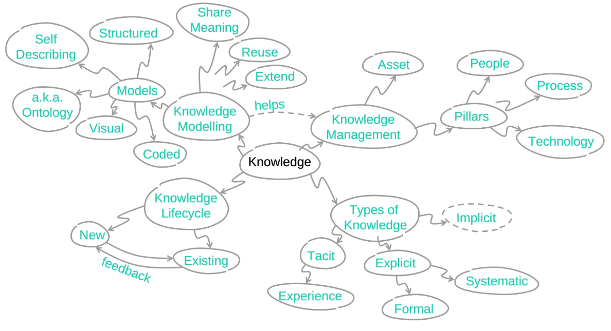
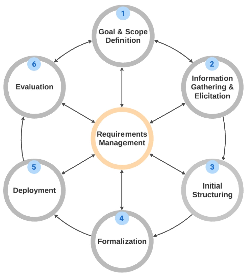
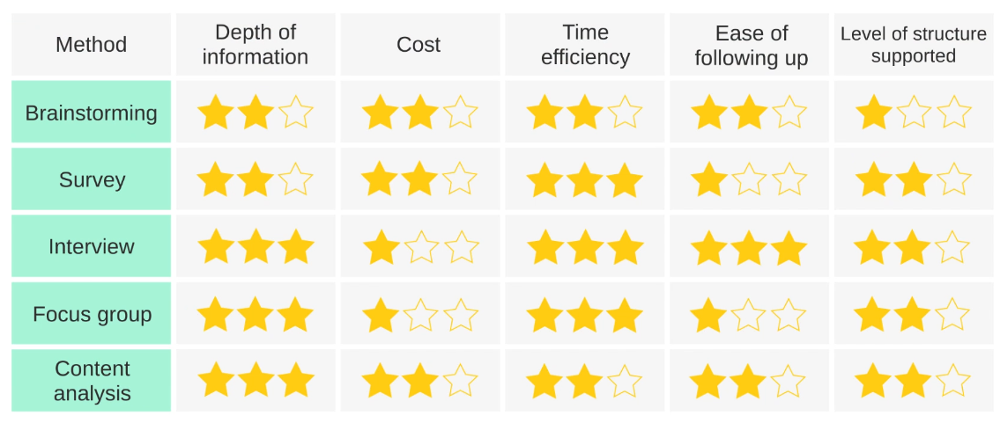
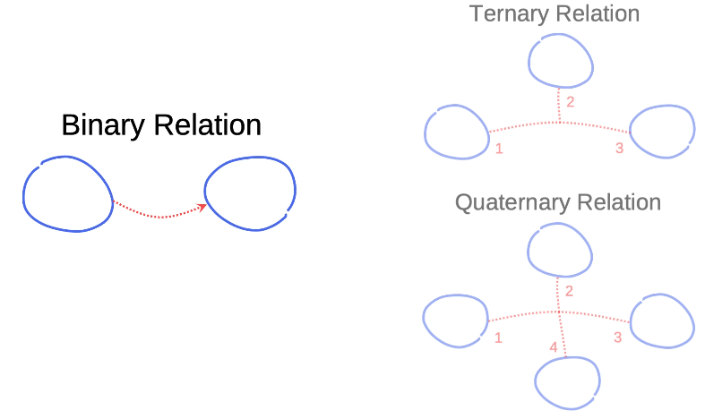
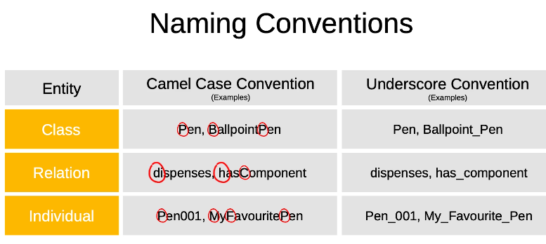

## Practical Knowledge Modeling: Ontology Development 101
- Instructor: Tish Chungoora

## Section 1: Introduction

### 1. Welcome and foreword
- Knowledge management
- Data architecture

### 2. Audience and learning outcomes
- Building meaningful statement
- Protege ontology editor
- Ontology == knowledge model

### 3. Course Structure

### 4. Checkpoint: Will this course meet my needs?

### 5. Summary

## Section 2: What is knowledge modeling?

### 6. Knowledge and its lifecycle
- Types of knowledge
  - Explicit knowledge
    - Easy to identify, store & share
    - Image, audio, documents
    - Expressed externally
  - Tacit knowledge
    - Acquired from experience
    - Hard to express externally
  - Implicit knowledge
    - Internal
    - Can be expressed externally
- Knowledge lifecycle
  - Innovation layer
    - New knowledge is created
    - Embody
    - Diffuse
  - Sharing layer
    - Identify
    - Organize
    - Share
    - Utilize

### 7. Data, information, and knowledge
- Data: independent set of text/number/....
- Information
  - Context and purpose are explicit
  - Value adding
- Knowledge
  - Resourceful use of information
  - Achieved through experience
- Wisdom

### 8. What is a knowledge model?

- How to make this map understandable to machines?
- What is the ontology?
  - A translation approach to portable ontologies by Gruber, 1993
  - Studer et al, 1997
    - A formal, explicit specification of a shared conceptualization
  - An agreed blueprint for representing knowledge

### 9. Ontology from a philosophical perspective
- Meaning of existence
- Entity
- Characteristics/features
- Fundamental entities and properties

### 10. Building blocks of a knowledge model
- Instances
  - Inheritance
- Ontology 
  - Grouping instances 
  - Abstracting high level knowledge
  - Taxonomy
- Universe of discourse
  - Classes
  - Relations
  - Axioms
  - Individuals

### 11. Representing knowledge models
- Visual representation
  - Good for sharing b/w humans
  - Less formal
  - Less rigorously defined
  - Lightweight ontologies
- Coded representation
  - Machine readable and formal
  - Knowledge representation languages
    - Knowledge interchange format
    - Common logic
    - Web ontology language

### 12. Ontology from a logic based perspective
- Expressivity
  - Range of constructs for explicit representation
- Semantics
  - Clarity of meaning in a language specification
- Mathematical rigour
  - Integrity and soundness provided by a language
- Heavyweight ontology

### 13. Levels of abstraction in knowledge modeling
- From generic to specific
  - Foundational ontologies
    - Capture the most fundamental concepts
    - Take time and effort to develop
    - Require collaboration across subject matter specialists
    - SUMO (Suggested Upper Merged Ontology)
    - DOLCE
    - gist
    - BFO
  - Middle level ontologies
    - More focused and domain-oriented
    - Applicable across many areas
    - Basis for building user level ontologies
    - PSL (Process Specification Language)
    - The Zachman Framework
    - The Music Ontology
  - User level ontologies
    - Domain specific
    - Direct intended context

### 14. Application of knowledge modeling: Part 1
- Sharing meaning and knowledge 
  - Reuse domain knowledge
  - Domain assumptions explicitly specified
- Information systems & AI
  - Platform-agnostic
  - Systems interoperability
  - Seamless exchange of information across system
  - Semantic web
  - NLP
  - Intelligent search
  - Digital twins
  - Medical knowledge representation
  - SW development
- Problem solving & decision making
  - Knowledge bases (graph databases)
  - Querying, reasoning and knowledge retrieval

### 15. Application of knowledge modeling: Part 2

### 16. Summary

## Section 3: A methodology for knowledge modeling

### 17. Overview

### 18. Requirements management
- Administration of requirements
- List competency questions
- Encode heavyweight ontology in OWL
- Provides the glue across phases
- Promotes visibility and clarity
- Helps avoid over-the wall development
 
### 19. Goal and scope definition
- Identify:
  - Domain of interest
  - Aims & objectives

### 20. Competency questions
- Competency questions are user-oriented interrogatives that allow you to scope your ontology. In other words, they are questions (often informally coined as business questions) that your users would want to gain answers for, through exploring and querying your ontology and knowledge base (graph database).

### 21. Information gathering and elicitation
- Collect information
- Target several sources
- Apply suitable methods

### 22. Collating the preliminary information
- Affinity diagram
  - Useful for group-based information gathering
  - Sorts unorganized ideas, terms & concepts
  - Visual technique
- Mind maps

### 23. Summary
- Six phases of methodology
  - Goal and Scope definition
  - Information gathering and elicitation
  - Initial structuring
  - Formalization
  - Deployment
  - Evaluation

## Section 4: Initial structuring

### 24. Overview
- Visualize entities
- Review & share
- Streamline formalization

### 25. Listing and analyzing statements
- General idea
- Types of object

### 26. Tracking and monitoring terms

### 27. Graphical languages for knowledge modeling
- Form of schematics as a building block

### 28. Unified Modeling Language: Part 1
- UML
  - Plan & model systems
  - Rich set of graphical construct
  - Capture different perspectives
- Components of UML
  - Class
  - Subsumption
  - Binary relation
  - Individual

### 29. Unified Modeling Language: Part 2

### 30. IDEF5 schematic language
- https://en.wikipedia.org/wiki/IDEF5

### 31. More thoughts on visual knowledge models

### 32. Summary

## Section 5: Formalization

### 33. Overview
- Encode knowledge models 
- Description Logic
  - Web Ontology Language
  - RDF

### 34. Getting started
- Download protege
  - https://protege.stanford.edu/

### 35. [Acivitiy] Getting started

### 36. OWL classes: The basics: Part 1

### 37. OWL classes: The basics: Part 2

### 38. [Activity] OWL classes

### 39. OWL individuals: The basics

### 40. [Activity] OWL individuals

### 41. OWL properties: The basics
- Annotation properties
- Object properties
- Datatype properties

### 42. OWL properties: Domain and range

### 43. OWL properties: Inverse properties
- x->y: precedes
- x<-y: follows

### 44. OWL properties: Characteristics
- Functional properties
- Inverse functional properties
- Transitive properties
- Symmetric properties
- Asymmetric properties
- Reflexive properties
- Irreflexive properties

### 45. [Activity] OWL properties

### 46. Class description and definition: The basics
- OWL restrictions
  - Quantifier restriction
  - hasValue restriction
  - Cardinality restriction
- Existential restriction
- Universal restriction

### 47. Existential restrictions

### 48. [Activity] Existential restrictions

### 49. hasValue restrictions

### 50. [Activity] hasValue restrictions

### 51. Primitive and defined classes
- Defined class
  - Necessary and sufficient conditions are implied

### 52. [Activity] Primitive and defined classes

### 53. Reasoning in OWL
- Asserted class hierarchy
- Automated services to make inferences
- Automated classification
- Useful when building large ontologies
- Verifies correctness and consistency
- Open World Assumption (OWA)
- Closed World Assumption (CWA)

### 54. [Activity] Reasoning in OWL

### 55. Universal restrictions
- Necessary conditions

### 56. [Activity] Universal restrictions

### 57. Cardinality restrictions

### 58. [Activity] Cardinality restrictions

### 59. OWL properties: Datatype properties
- Date, integer, float, ...

### 60. [Activity] Datatype properties

### 61. Complement of and more
### 62. [Activity] Complement of and more

### 63. Other useful features
### 64. [Activity] Other useful features

### 65. Summary

## Section 6: Deployment

### 66. Overview
- Rolling out, publish, release

### 67. Ontology documentation
- Statement log
- Excel sheet

### 68. Ontology visuals: Part 1
- OWLviz
- OntoGraf
- OWLGrEd

### 69. Ontology visuals: Part 2
- Radial diagrams

### 70. Ontology-driven systems
- How to apply ontology into a real IT problem
  - Ontology editor
  - Ontology deployment environment
    - Graph base
    - Knowledge architect
  - Front-end application
    - End users

### 71. Summary

## Section 7: Evaluation

### 72. Evaluating the effectiveness of ontologies
- Technical and specialist method
  - Ontology alignment
  - Ontology comparison, etc
- Answering business questions
  - How well have the specifications been met?
  - Can we answer all the competency questions?
- Knowledge management
  - Lessons leant review
  - Continuous improvement

### 73. Lessons learnt in ontology development and deployment
- Knowledge management concept
- Capture & reuse operational knowledge
- Transform implicit into explicit knowledge

### 74. Things to watch out for during ontology development

### 75. Summary

## Section 8: Course wrap-up

### 76. Key soft skills for excelling as knowledge architect

### 77. Conclusion

### 78. Course slides

### 79. Acknowledgement and more
