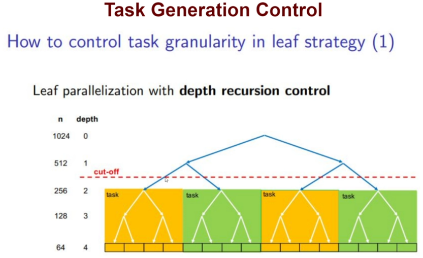

## Title: The Complete Parallelism Course: From Zero to Expert!
- Instructor: Lucas Bazilio

## Section 1: Course Overview

1. Course Introduction

## Section 2: Parallelism Fundamentals

2. Introduction to Parallelism


3. Expressing Tasks

4. Tasks and Dependencies
- Task dependence graph: graphical representation of the task decomposition

5. Task Dependency Graph
- Task dependency graph:
  - directed acyclic graph (no cycle. tree)
  - node=task, its weight represents the amount of work to be done
  - Edge=dependence, ie successor node can only execute after predecessor node has completed
- Parallel machine abstraction
  - P identical processors
  - Each processor executes a node at a time
  - T = \sum_nodes(work_node_i)
- Critical path: path in the task graph with the highest accumulated work
- Parallelism - T_1/T_inf, if sufficient processors are available
- P_min is the minimum number of processors necessary to achieve parallelism


### Assignment 1:
(a) T1 = 10+10+9+10+10+6+8 = 63, T_inf = 10+9+8 =27, P = 63/27=2.33, Pmin = 3
(b) T1 = 10+10+10+10+6+11+ = 64, T_inf = 10+6+11+7 = 34, P=64/34 = 1.88, Pmin = 2

6. Granularity and Parallelism
```
count=0
for (i=0;i<n;i++) if (X[i].color == "Green") count ++;
```
- coarse grain decomposition: this task
- fine grain decomposition: loop over i

7. Task definition
- Can the computation be diviced in parts?
  - Task decomposition: functions, loop iterations
  - Data decomposition: elements of a vector, rows of a matrix
  - Task Dependency Graph (TDG)
- Metrics to understand how our task/data decomposition can potentially behave
  - T_1
  - T_inf
  - Parallelism = T_1/T_inf
  - Pmin = ceil(Parallelism)
- Factors: granualrity and overheads
  - Task granularity vs number of tasks
- Vector sum:
  - T_1 \prop n
  - T_inf \pro log2(n)


8. Advanced Granularity
- Fine graind tasks vs coarse grained tasks
- Ex: Matrix-vector product
  - Inherent bound on hwo fine the granularity of a computation can be n^2
- Stencil computation using Jacobi solver
  - 4 neighbor elements of matrix u
  - snaptshot 16:19
  - trade-off b/w task granularity and task creation overhead

9. Speedup and Efficiency
- Speedup S_p = T_1 / T_p
- Efficiency E_p = S_p / P               
- Strong scaling: increase the number of processors P with constant problem: reduce the execution time
- Week scaling: increase the number of processors P with problem sizse Proportional to P: solve larger problems

10. Amdahl's law

11. Overhead sources
- Task creation
- Barrier synchronization
- Task synchronization
- Exclusive acces to shared data and data sharing
- T_p = (1-phi)*T_1 + phi * T_1/p + overhead(p)
- Amdahl's law can be overly pessimistic

12. Common overheads
- Data sharing: can be explicit via messages or implicit via memory hierarchy (caches)
- Idleness: dependencies, load imbalances, poor communication
- Computation: extra work like replication
- Memory: extra memory to obtain a parallel algorithm
- Contention: competition for the access to shared resource like memory/network
- How to model data sharing overhead?
  - Remote data access
    - Startup: time spent in preparing the remote access
    - Transfer; time spent in transferring the message
    - Synchronization b/w processors may be necessary

## Section 3: Solved Problems - Fundamentals of Parallelism

16. Problem 2
- T_1 = 500+2000+12000 + 500+2000+1000+500+20000+1000+500+2000+1000 = 43k
- T_inf = 500+20000+1000+1000 = 22.5k
- TDG for matrix product

23. Problem 5 - Question A
- S=9, seq=8,
- Tser= 8 + 4*x + 4*4
- Tser/8 = 8, x = 12
- Tser = 8+4*12+16 = 72

## Section 4: Task Decomposition | OpenMP

26. Task decomposition strategies
- Linear task decomposition: a task is a code block or a procedure invocation
```c
int main()
{
  init_A();
  init_B();
}
```           
- Iterative task decomposition: tasks found in iterative constructs such as for-loops/while loop
```c
for (int i=0;i<n;i++) C[i] - A[i] + B[i];
```
- Recursive task decomposition: tasks found in divide-and conquer problems and other recursive algorithm
  - OMP datasharing cannot handle recursive tasks

27. Recursive Task Decomposition
```c
#define N 1024
#define MIN_SIZE 64
void vector_add(int *A, int *B, int *C, int n)
{  for (int i=0;i<n;i++) C[i] = A[i] + B[i];
}
void rec_vector_add(int *A, int *B, int *C, int n)
{ if (n > MIN_SIZE) {
    int n2 = n/2;
                rec_vector_add(A,B,C,n2);
                rec_vector_add(A+n2, B+n2, C+n2, n-n2);
   } else vector_add(A,B,C,n);
}
```

28. Introduction to OpenMP
- int omp_get_num_threads(): number of available threads
- int omp_get_thread_num(): thread ID
- #pragma omp parallel: one implicit task is created
- #pragma omp task: one explicit task is created
- #pragma omp taskloop: explicit tasks are created

29. Task Generation Control
- Iterative task decompositions: we can control task granularity by setting the number of iterations executed by each task
- Recursive task decompositions: we can control task granularity by controlling recursion levels where tasks are generated (cutoff control)
  - After certain number of recursive calls (static)
  - When the size of the vector is too small (static)
  - When there are sufficient tasks pending to be executed (dynamic)
- How we make many chunks run on iterative decomposition?
```c
#pragma omp parallel
#pragma omp single
#pragma ompo taskloop grainsize(BS)
```
- firstprivate: specifies that each thread should have its own instance of a variable, and that the variable should be initialized with the value of the variable, because it exists before the parallel construct

30. Leaf Strategy
- Recursive task decomposition: divide and conquer
```c
void rec_dot_product(int *A, int *B, int n, in depth)
{  
  if (n > MIN_SIZE){
    int n2 = n/2;
    if (depth ==CUTOFF)
    #pragma omp task
    {  rec_dot_product(A,B,n2,depth+1);
        rec_dot_product(A+n2, B+n2, n-n2, depth+1);
    }
    else {
      rec_dot_product(A,B,n2,depth+1);
      rec_dot_product(A+n2,B+n2,n-n2,depth+1);
    }
  } else
      if (depth<=CUTOFF)
        #pragma omp task
        dot_product(A,B,n);
      else
        dot_product(A,B,n);
}
```


31. Tree Strategy
```c
int dot_product(int *A, int *B, int n) {
  int tmp = 0;
  for (int i=0;i<n; i++) tmp += A[i]*B[i];
  return (tmp);
}
int rec_dot_product(int *A, int *B, int n) {
  int tmp1, tmp2=0;
  if (n>MIN_SIZE) {
      int n2 = n/2;
      #pragma omp task shared(tmp1)
      tmp1 = rec_dot_product(A,B,n2);
      #pragma omp task shared(tmp2)
      tmp2 = rec_dot_product(A+n2,B+n2, n-n2);
      #pragma omp taskwait
   } else tmp1 = dot_product(A,B,n);
   return (tmp1+tmp2);
}
void main() {
  #pragma omp parallel
  #pragma omp single
  result =rec_dot_product(a,b,N);
}
```


32. Depth Recursion Control
- Tree strategy with depth recursion control

```c
int rec_dot_product(int *A, int *B, int n, int depth) {
  int tmp1, tmp2=0;
  if (n>MIN_SIZE) {
    int n2 = n/2;
    if (depth < CUTOFF) {
        #pragma omp task shared(tmp1)
        tmp1 = rec_dot_product(A,B,n2);
        #pragma omp task shared(tmp2)
        tmp2 = rec_dot_product(A+n2,B+n2, n-n2);
        #pragma omp taskwait
      } else {
        tmp1 = rec_dot_product(A,B,n2,depth+1);
                    tmp2 = rec_dot_product(A+n2,B+n2,n-n2,depth+1);
      }
    } else tmp1 = dot_product(A,B,n);
   return (tmp1+tmp2);
}
```
- Or using omp_in_final()
```c
int rec_dot_product(int *A, int *B, int n, int depth) {
  int tmp1, tmp2=0;
  if (n>MIN_SIZE) {
    int n2 = n/2;
    if (!omp_in_final()) {
        #pragma omp task shared(tmp1) final(depth >=CUTOFF)
        tmp1 = rec_dot_product(A,B,n2);
        #pragma omp task shared(tmp2) final(depth >=CUTOFF)
        tmp2 = rec_dot_product(A+n2,B+n2, n-n2);
        #pragma omp taskwait
      } else {
        tmp1 = rec_dot_product(A,B,n2,depth+1);
                    tmp2 = rec_dot_product(A+n2,B+n2,n-n2,depth+1);
      }
    } else tmp1 = dot_product(A,B,n);
   return (tmp1+tmp2);
}
```

33. Atomic Directive
- Atomic access: mechanism to guarantee atomicity in load/store instructions
```c
#pragma omp atomic [update |read|write]
  expression
```
                - update: x += 1, x = x-foo(), x[index[i]]++ (read+write)
                - reads: value = *p
                - writes: *p = value
                - atomic without a close is equivalent to atomic update

34. Critical Directive
```c
#pragma omp critical [(name)]
structured block
```
- Provides a region of mutual exclusion where only one thread can be working at any given time
- By default all critical regions are the same
- Multiple mutual exclusion regions by providing them with a name
  - Only those with the same name synchronize
```c
int x=0,y=0;
#pragma omp parallel num_threads(4)
{
...
#pragma omp critical (x)
x++;
#pragma omp critical (y)
y++;
}
```
- x++ and y++ can be done simultaneously, using different threads.

35. Reduction Clause
```c
reduction(operator:list)
```
- valid operators are: +,-,*,|,||, &, &&, ^, min, max

36. Locks in OpenMP
- Special variables that live in memory with two basic operations
  - Acquire: while a thread has the lock, nobody else gets it. this allows the thread to do its work in private, not bothered by other threads
  - Release: allow other threads to acquire the lock and do their work (one at a time) in private
  - omp_init_lock, omp_set_lock, omp_unset_lock, omp_test_lock, omp_destroy_lock

## Section 5: Task Ordering | OpenMP

37. Taskwait and Taskgroup
- taskwait: suspends the execution of the current task, waiting on the completion of its child tasks. The taskwait construct is a stand-alone directive
```c
#pragma omp task {} //T1
#pragma omp task  //T2
{
  #pragma omp task // T3
}
#pragma om task {} // T4
#pragmaomp taskwait // Only T1, T2, T4 are guaranteed to have finished here
}
```
- taskgroup: suspends the execution of the current task at the end of structured block, waiting on the completion of child tasks of the current task and their descendent tasks
```c
#pragma omp task {} // T1
#pragma omp taskgroup{
{
  #prgam omp task // T2
  {
    #pragma omp task{} // T3
  }
  #pragma omp task {} //T4
}
// Here, only T2, T3, T4 are guaranteed to have finished here.
```

38. Task Dependency Clauses
```c
#prgma omp task [depend (in: var_list)]
                [depend (out: var_list)]
                [depend (inout: var_list)]
```

39. Wavefront Example


## Section 6: Solved Problems - OpenMP

40. Problem 1 - Question A
- Parallelize a following function
```c
long count_key(long Nlen, long *a, long key) {
    long count = 0;
    for (int i=0; i<Nlen; i++)
      if (a[i] == key) count ++;
    return count;
}
```
- Datasharing
```c
long count_share(long Nlen, long *a, long key) {
    long count = 0;
    #pragma omp parallel reduction(+:count)
    {
    for (int i=0; i<Nlen; i++)
      if (a[i] == key) count ++;
    }
    return count;
}
```
- Iterative task decomposition
```c
long count_iter(long Nlen, long *a, long key) {
    long count = 0;
    #pragma omp taskloop num_tasks(omp_get_num_threads()) reduction(+:count)
    for (int i=0; i<Nlen; i++)
      if (a[i] == key) count ++;   
    return count;
}
```
41. Problem 1 - Question B
- Recursive task decomposition (divide and conquer)
```c
long count_recur(long Nlen, long *a, long key, int depth) {
    long tmp1=0, tmp2=0;
    if (Nlen==1) {
        if (a[0] == key) ++tmp1;
    } else {
        if (depth <3) { // CUTOFF depth = 3
            #pragma omp task shared(tmp1)
            tmp1 = count_recur(Nlen/2, a, key,depth+1);
            #pragma omp task shared(tmp2)
            tmp2 = count_recur(Nlen-Nlen/2, a+Nlen/2, key,depth+1);
            #pragma omp taskwait
        }
        else {
            tmp1 = count_recur(Nlen/2, a, key, depth+1);
            tmp2 = count_recur(Nlen-Nlen/2, a+Nlen/2, key, depth+1);
        }
    }
    return tmp1+tmp2;
}
```
- Entire code:
```c
#include <omp.h>
#include <stdio.h>
#include <stdlib.h>
#define N 131072
long count_key(long Nlen, long *a, long key) {
    long count = 0;
    for (int i=0; i<Nlen; i++)
      if (a[i] == key) count ++;
    return count;
}
long count_share(long Nlen, long *a, long key) {
    long count = 0;
    #pragma omp parallel reduction(+:count)
    {
    for (int i=0; i<Nlen; i++)
      if (a[i] == key) count ++;
    }
    return count;
}
long count_iter(long Nlen, long *a, long key) {
    long count = 0;
    #pragma omp taskloop num_tasks(omp_get_num_threads()) reduction(+:count)
    for (int i=0; i<Nlen; i++)
      if (a[i] == key) count ++;   
    return count;
}
long count_recur(long Nlen, long *a, long key, int depth) {
    long tmp1=0, tmp2=0;
    if (Nlen==1) {
        if (a[0] == key) ++tmp1;
    } else {
        if (depth <4) { // CUTOFF depth = 4
            #pragma omp task shared(tmp1)
            tmp1 = count_recur(Nlen/2, a, key,depth+1);
            #pragma omp task shared(tmp2)
            tmp2 = count_recur(Nlen-Nlen/2, a+Nlen/2, key,depth+1);
            #pragma omp taskwait
        }
        else {
            tmp1 = count_recur(Nlen/2, a, key, depth+1);
            tmp2 = count_recur(Nlen-Nlen/2, a+Nlen/2, key, depth+1);
        }
    }
    return tmp1+tmp2;
}
int main() {
    long *a, key = 42, nkey = 0;
    a = (long *) malloc(N*sizeof(long));
    for (long i=0; i<N; i++) a[i] = random()%N;
    a[N%43] = key; a[N%73] = key; a[N%3] = key;
    #pragma omp parallel
    #pragma omp single // prints only once
    printf("Number of threads = %d\n", omp_get_num_threads());
    //
    double c0 = omp_get_wtime();
    nkey = count_key(N, a, key); // count key by sequentially
    printf("serial nkey = %d wall time = %f sec\n", nkey, omp_get_wtime() - c0);
    double c1 = omp_get_wtime();
    #pragma omp parallel
        #pragma omp simgle
       nkey = count_share(N, a, key); // using iterative decomposition
    printf("omp shared nkey = %d wall time = %f sec\n", nkey, omp_get_wtime() - c1);
    double c2 = omp_get_wtime();
    #pragma omp parallel
       #pragma omp simgle
       nkey = count_iter(N, a, key); // using iterative decomposition
    printf("omp iter nkey = %d wall time = %f sec\n", nkey, omp_get_wtime() - c2);
    double c3 = omp_get_wtime();
    #pragma omp parallel
       #pragma omp simgle
       nkey = count_recur(N, a, key,0); // using iterative decomposition
    printf("omp recur nkey = %d wall time = %f sec\n", nkey, omp_get_wtime() - c3);
    free(a);
    return 0;
}
```
- Comparison
```
$ ./a.out
Number of threads = 4
serial nkey = 3 wall time = 0.000298 sec
omp shared nkey = 3 wall time = 0.000402 sec
omp iter nkey = 3 wall time = 0.000256 sec
omp recur nkey = 3 wall time = 0.001005 sec
```
 
42. Problem2 - Question A
- Base code:
```c
for (i=0; i< DBsize; i++)
  for (k=0; k< nkeys; k++)
    if (DBin[i] == keys[k]) DBout[k][counter[k]++] = i;
```
- Write OMP parallel code using iterative task decomposition of the outermost loop i
```c
omp_lock_t locks[nkeys];
#pragma omp parallel
#pragma omp single
#pragma omp taskloop num_tasks(omp_num_threads()) private(k)
for (i=0; i< DBsize; i++)
  for (k=0; k< nkeys; k++)
    if (DBin[i] == keys[k]) {
        omp_set_lock(&locks[k])
        DBout[k][counter[k]++] = i;
        omp_unset_lock(&locks[k])
    }
```
 
43. Problem2 - Question B
- Write OMP parallel code using iterative task decomposition of the innermost loop k
```c
#pragma omp parallel
#pragma omp single
omp_lock_t locks[nkeys];
for(i=0;i<nkeys;++i) omp_init_lock(&locks[i]);
for (i=0; i< DBsize; i++)
  #pragma omp taskloop firstprivate(i) num_tasks(omp_num_threads()) nogroup
  for (k=0; k< nkeys; k++)
    omp_set_lock(&locks[k])
    DBout[k][counter[k]++] = i;
    omp_unset_lock(&locks[k])
for(i=0;i<nkeys;++i) omp_destory_lock(&locks[i]);            
```
 
44. Problem2 - Question C
- Task based recursive divide and conquer decomposition strategy 1) the recursion splits the input vector DBin in two almost identical halves, with a base case that corresponds to checking a single element of DBin 2) uses a cut-off strategy based on the size of input vector.            
```c
#include <omp.h>
#define DBsize 1048576
#define nkeys 16 // the number of processors can be larger than the number of keys
#define CUT_SIZE 3
omp_lock_t locks[nkeys]
int main() {
double keys[nkeys], DBin[DBsize], DBout[nkeys][DBsize];
unsigned int i, k, counter[nkeys];
getkeys(keys, nkeys); // get keys
init_DBin(DBin, DBsize); // initialize elements in DBin
clear_DBout(DBout, nkeys, DBsize); // initialize elements in DBout
clear_counter(counter, nkeys); // initialize counter to zero
#pragma omp parallel
#pragma omp single
for (i = 0; i < nkeys; ++i) omp_init_lock(&locks[i]);
rec_keys(DBin,DBout,0,DBsize-1,counter);
for (i = 0; i < nkeys; ++i) omp_destroy_lock(&locks[i]);	
}
void rec_keys(double *DBin, double *DBout, int ini, int end,
	unsigned int *counter) {
	if (end - ini + 1) <= 1) { // Base Case
		for (unsigned int k = 0; k < nkeys; ++k) {
			if (DBin[ini] == keys[k]){
				omp_set_lock(&locks[k]);
				DBout[k][counter[k]++] = i;
				omp_unset_lock(&locks[k]);
		}
	}
	else { // Recursive Case  ( Size of the Vector > 1 )
		int half = (end - ini + 1)/2;
		if (!omp_in_final()) { // If task is not final:
			#pragma omp task final (half <= CUT_SIZE)
			rec_keys(DBin,DBout,ini,half,counter);
			#pragma omp task final (half <= CUT_SIZE)
			rec_keys(DBin,DBout,half+1,end,counter);
		}
		else { // Task is Final
			rec_keys(DBin,DBout,ini,half,counter);
			rec_keys(DBin,DBout,half+1,end,counter);
		}
	}
}
```
 
45. Problem3
- Producer-consumer execution model. They must be in different tasks
```c
float sample[INPUT_SIZE+TAP1];
float coeff1[TAP1], coeff2[TAP2];
float data_out[INPUT_SIZE], final[INPUT_SIZE]
void main() {
  float sum;
  for(int i=0; i<INPUT_SIZE;i++) {
    //Producer
    sum = 0.0;
    for (int j=0; j<TAP1;j++)
      sum += sample[i+j] + coeff1[j];
    data_out[i] - sum;
    //Consumer
    for (int j=0; j<TAP2; j++)
      final[i] += correction(data_out[i],coeff2[j]);
   }
}
```
- OpenMP parallel version:
```c
#include <omp.h>
float sample[INPUT_SIZE+TAP1];
float coeff1[TAP1], coeff2[TAP2];
float data_out[INPUT_SIZE], final[INPUT_SIZE]
void main() {
  #pragma omp parallel
  #pragma omp single
  float sum;
  for(int i=0; i<INPUT_SIZE;i++) {
    #pragma omp task private(sum) depend(out: data_out[i])
    //Producer
    sum = 0.0;
    for (int j=0; j<TAP1;j++)
      sum += sample[i+j] + coeff1[j];
    data_out[i] = sum;
    #pragma omp task depend(in: data_out[i])
    //Consumer
    for (int j=0; j<TAP2; j++)
      final[i] += correction(data_out[i],coeff2[j]);
   }
}
```
 
46. Problem 4
- SAXYPY
```c
#include <omp.h>
int main() {
    int N = 1 << 20; /* 1 million floats */
    float *fx = (float *) malloc(N * sizeof(float));
    float *fy = (float *) malloc(N * sizeof(float));
    FILE *fpx = fopen("fx.out", "w");
    FILE *fpy = fopen("fy.out", "w");
    /* simple initialization just for testing */
    #pragma omp parallel
    #pragma omp single    
    #pragma omp task depend(out: fx) // Task 1
    for (int k = 0; k < N; ++k)
        fx[k] = 2.0f + (float) k;
    #pragma omp task depend(out: fy) // Task 2
    for (int k = 0; k < N; ++k)
        fy[k] = 1.0f + (float) k;
    /* Run SAXPY TWICE */
	#pragma omp task depend(in:fx) depend(inout: fy) // Task 3
    saxpy(N, 3.0f, fx, fy);
	#pragma omp task depend(in:fy) depend(inout: fx) // Task 4
    saxpy(N, 5.0f, fy, fx);
    /* Save results */
	#pragma omp task depend(in: fx) // Task 5
    for (int k = 0; k < N; ++k)
        fprintf(fpx, " %f ", fx[k]);
	#pragma omp task depend(in: fy) // Task 6
    for (int k = 0; k < N; ++k)
        fprintf(fpy, " %f ", fy[k]);
    free(fx); fclose(fpx);
    free(fy); fclose(fpy);
}
``` 


47. Problem 5 - Question A
- Parallelization of FindBounds in histogram computation
```c
#include <omp.h>
void FindBounds(int *input, int size, int *min, int *max) {    
    int chunk_size = (size + omp_get_max_threads()-1)/ omp_get_max_threads();
    int local_min = input[0], local_max = input[0];    
    #pragma omp parallel num_threads(omp_get_max_threads())    
    int tid = omp_get_thread_num();
    int start = tid * chunk_size;
    int end = (tid+1) * chunk_size;
    if (end > size) end = size;    
    for (int i = start; i < end; ++i) {
        if (input[i] > local_max) local_max = input[i];
        if (input[i] < local_min) local_min = input[i];    
    }
    // To avoid race conditions when updating the global minimum and maximum values, we use a critical section (#pragma omp critical) to ensure mutual exclusion.    
    #pragma omp critical {    
    if (local_max > *max) *max = local_max;
    if (local_min < *min) *min = local_min;
    }    
}
```

48. Problem 5 - Question B
- Parallel implementation of FindFrequency
```c
#include <omp.h>
void FindFrequency(int *input, int size,int *histogram, int min, int max) {
    int chunk_size = (size + omp_get_max_threads() -1) / omp_get_max_threads();    
    # pragma omp parallel num_threads(omp_get_max_threads())
    {
        int tid = omp_get_thread_num();
        int start = tid * chunk_size;
        int end = (tid + 1) * chunk_size;
        if (end > size) end = size;        
        int tmp;        
        for (int i = start; i < end; ++i) {
            tmp = (input[i] - min) * (HIST_SIZE / (max - min - 1));
            #pragma omp atomic
            histogram[tmp]++;
        }
    }
}
```

49. Problem 6 - Question A
- Sum of vector elements, using iterative task decomposition
```c
#include <omp.h>
int sum_vector(int *X, int n) {
    int sum = 0;    
    #pragma omp parallel
    {
        #pragma omp single
        {
            #pragma omp taskloop grainsize(1)
            for (int i = 0; i < n; i++) {
                #pragma omp task shared(sum)
                {
                    #pragma omp atomic
                    sum += X[i];
                }
            }
        }
    }
    return sum;
}
```

50. Problem 6 - Question B
- Divide and conquer recursive strategy over vector v
```c
#include <omp.h>
int recursive_sum_vector(int *X, int n) {
    int sum = 0;
    if (n == 1) { return X[0]; } // Base Case
    else {
        #pragma omp parallel
        {
            #pragma omp single
            {
                #pragma omp task shared(sum)
                {
                    int half = n / 2;
                    sum = recursive_sum_vector(X,half) + recursive_sum_vector(X + half,n-half);
                }
            }
        }
    }
    return sum;
}
```
