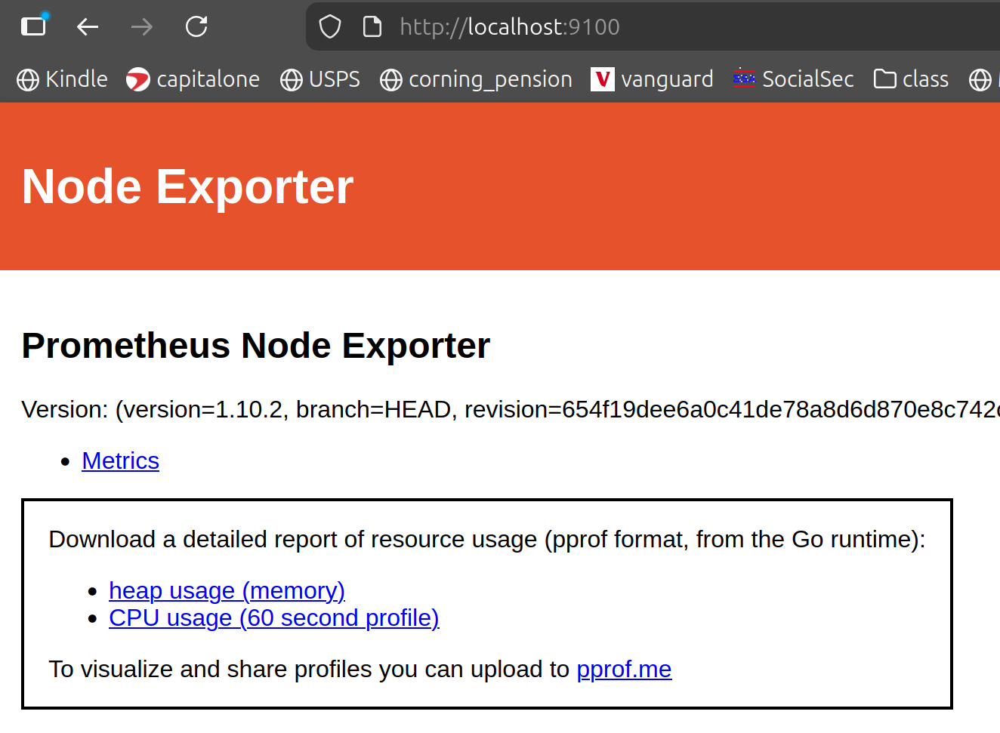
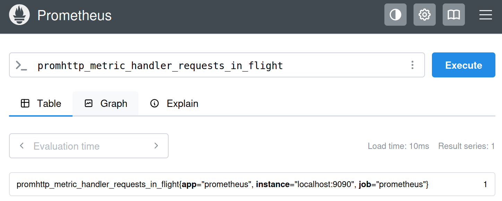
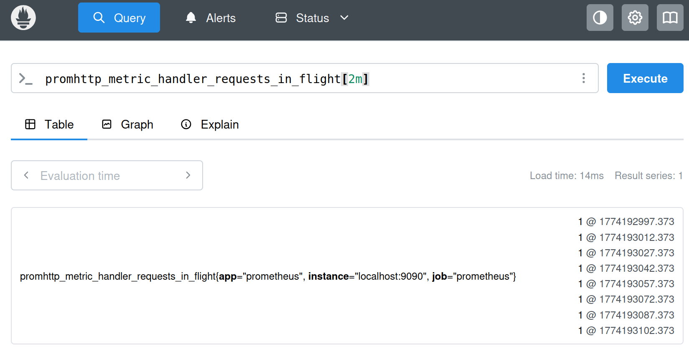
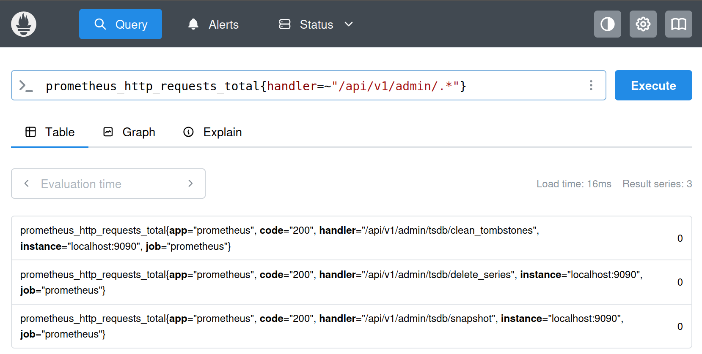
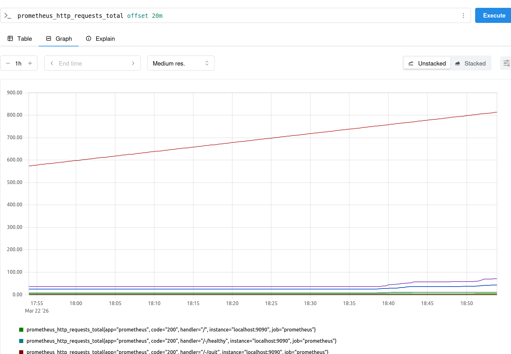

# Observability with Grafana, Prometheus, Loki, Alloy and Tempo
- Instructor: Aref Karimi
## Section 1: Introduction

### 1. Introduction
- https://github.com/aussiearef/Prometheus

## Section 2: Foundations of Observability

### 2. From Monoliths to Microservices: Why We Need Observability
- Monolithic architecture
  - All services in one application
  - User interfance and business logic in one application
  - All services shareed one database
  - To make a change, the entire application is deployed
- Microservcie architecture
  - Individual services
  - EAch service has its own storage
  - UI and servcies are separate
  - Changes are deployed without deploying the entire SW
- Foundations of observability
  - Many services to monitor
  - Intra-service communications can fail
  - More vulnerable to security threats
  - More changes are deployed
    
### 3. What is Monitoring
- 3 questions of monitoring
  - Is the service on?
  - Is the service functioning as expected?
  - Is the service performing well?
- Telemetry data: data collected for monitoring
- Metrics used to measure the DevOps success
  - Mean time to detection (MTTD)
  - Mean time to resolve (MTTR)

### 4. Methods of Monitoring
- Layers of systems
  - UI layer: Core web vitals
  - Service layer: RED method
  - Infrastructure layer: USE method
- RED Method (Request Oriented)
  - Rate (throughput): request per second
  - Errors: failed requests i.e, HTTP 500
  - Duration: latency or transaction response time
- USE method (Resource oriented)
  - Utilization : CPU usage %
  - Saturation: Network queue length. Zero = Good
  - Errors: i.e., disk write error. Zero = Good
- Four Golden Signals Method (RED+S)
  - Latency
  - Traffic (throughput)
  - Errors
  - Saturation (Resources at 100 capacity)
- Core web vitals
  - Largest contentful paint (perceived page load)
  - First input delay (perceived responsiveness)
  - Cumulative layout shift (perceived stability)

### 5. What is Observability
- What to monitor?

### 6. Methods of Collecting Metrics. Push vs. Scrape
- Push method: sends the metrics to an endpoint via TCP, UDP or HTTP
  - Ex: sending metrics to StatsD, to be stored in Graphite
- Scrape method: applications and microservices provide APIs for the time series database, to read the metrics
  - Ex: Prometheus scraping metrics
- How to decide:
  - Types of systems and applications
  - Scalability
  - Complexity

### 7. Types of Telemetry Data
- Types of telemetry data (MELT)
  - Metric: an aggregated value representing events ina period of time
  - Event: an action happened at a given time
  - Log: a very detailed representation of an event
  - Trace: shows the interactions of microservices to fulfill a request


### Role Play 1: Let's Talk About Foundations of Observability
- Response is very slow

## Section 3: Installing Prometheus & Collecting Metrics on Any OS

### 8. Installing Prometheus on Windows

### 9. Installing Prometheus on Mac OS

### 10. Installing Prometheus on Linux (Ubuntu)
- Prometheus: https://prometheus.io/download/
- sudo groupadd --system prometheus
- sudo useradd -s /sbin/nologin --system -g prometheus prometheus
- sudo mkdir /var/lib/prometheus
- sudo mkdir -p /etc/prometheus/rules
- sudo mkdir -p /etc/prometheus/rules.s
- sudo mkdir -p /etc/prometheus/files_sd
- tar zxf prometheus-3.10.0.linux-amd64.tar.gz 
- cd prometheus-3.10.0.linux-amd64/
- sudo mv prometheus promtool /usr/local/bin/
- prometheus --version
- sudo mv prometheus.yml /etc/prometheus/
- sudo vi /etc/systemd/system/prometheus.service
```sh
[Unit]
Description=Prometheus
Documentation=https://prometheus.io/docs/introduction/overview/
Wants=network-online.target
After=network-online.target
[Service]
Type=simple
User=prometheus
Group=prometheus
ExecReload=/bin/kill -HUP $MAINPID
ExecStart=/usr/local/bin/prometheus \
  --config.file=/etc/prometheus/prometheus.yml \
  --storage.tsdb.path=/var/lib/prometheus \
  --web.console.templates=/etc/prometheus/consoles \
  --web.console.libraries=/etc/prometheus/console_libraries \
  --web.listen-address=0.0.0.0:9090 \
  --web.external-url=
SyslogIdentifier=prometheus
Restart=always
[Install]
WantedBy=multi-user.target
```
- sudo chown -R prometheus:prometheus /etc/prometheus
- sudo chwon -R prometheus:prometheus /etc/prometheus/*
- sudo chmod -R 775 /etc/prometheus
- sudo chmod -R 775 /etc/prometheus/*
- sudo chwon -R prometheus:prometheus /var/lib/prometheus
- sudo chwon -R prometheus:prometheus /var/lib/prometheus/*
- sudo systemctl daemon-reload
- sudo systemctl start prometheus
- sudo systemctl enable prometheus
- systemctl status prometheus
- Open browser with http://localhost:9090

### 11. Collecting Metrics (Unix , Linux and Mac)
- Collects data from SQL server or cloud service through scheduled job to avoid traffic
  - NOT scalable
- Let Prometheus connect each SQL server/cloud service through exporter -> Scraping
  - Requires Push Gateway

### 12. Node Exporter - Part 1 (Linux, Mac)
- Node: every UNIX-based kernel & computer

### 13. Node Exporter - Part 2 (Linux, Mac)
- Node exporter listens on port 9100/TCP
- At client node:
  - `sudo apt-get update`
  - Download node exporter: https://prometheus.io/download/#node_exporter
  - `tar zxf node_exporter-1.10.2.linux-amd64.tar.gz`
  - `cd node_exporter-1.10.2.linux-amd64/`
  - `./node_exporter`
  - Open browser and find http://localhost:9100


### 14. Node Exporter - Part 3 (Linux, Mac)
- Edit /etc/prometheus/prometheus.yml in the prometheus server
  - job_name, targets IP
- sudo systemctl restart prometheus

### 15. Running Node Exporter as a Service on Ubuntu
- In the client side
- sudo groupadd --system prometheus
- sudo useradd -s /sbin/nologin --system -g prometheus prometheus
- sudo mkdir /var/lib/node/
- sudo mv node_exporter /var/lib/node/
- sudo vi /etc/systemd/system/node.service
```bash
[Unit]
Description=Prometheus Node Exporter
Documentation=https://prometheus.io/docs/introduction/overview/
Wants=network-online.target
After=network-online.target
[Service]
Type=simple
User=prometheus
Group=prometheus
ExecReload=/bin/kill -HUP $MAINPID
ExecStart=/var/lib/node/node_exporter
SyslogIdentifier=prometheus_node_exporter
Restart=always
[Install]
WantedBy=multi-user.target
```
- sudo chown -R prometheus:prometheus /var/lib/node
- sudo chmod -R 775 /var/lib/node
- sudo systemctl daemon-reload
- sudo systemctl start node
- sudo systemctl enable node
- systemctl status node
- To see the log file: `journalctl -u node`
- When Prometheus cannot query machine metrics:
  - Check :9100/metrics vs :9090/metrics
  - localhost:9100 lists machine metrics like `node_cpu_seconds_total`
  - If you have prometheus and node in the same machine, you need to add a following segment into `prometheus.yml`
```yml
  - job_name: "node"
    static_configs:
      - targets: ["localhost:9100"]
        labels:
          app: "node"
```
  - sudo systemctl daemon-reload
  - sudo systemctl restart node
  - sudo systemctl restart prometheus.service

### 16. Data Model of Prometheus
- Prometheus stores data as time series
- Every time series is identified by metric name and labels
- Labels are a key and value pair
- Labels are optional
  - `<metric name> {key=value, key=value,...}`
  - Ex: `auth_api_hit {count=1, time_taken=800}`

### 17. Data Types in Prometheus
- In PromQL
  - Scalar: Float, String
  - Instant vectors: selection of a set of time series and a single sample value for each at a given timestamp (instant)
    - Only a metric name is specified
    - Ex: `auth_api_hit 5`, `auth_api_hit {count=1, time_taken=800} 1`
  - Range vectors: Similar to instant vectors but they select a range of samples
    - label_name[time_spec]
    - Ex: `auth_api_hit[5m]`
- Units:
  - ms: milliseconds
  - s: seconds
  - m: minutes
  - h: hours
  - d: days
  - w: weeks
  - y: years
- Scalar data query:

- Range vector data query:

- Adjust `scrape_interval` in prometheus.yml

### 18. Binary Arithmatic Operators in Prometheus
- +,-,*,/,%,^
- Scalar + Instant Vector: applies to every element of instant vector
- Instant Vector + Instant Vector: Only common keys (after summed) are returned

### 19. Binary Comparison Operators in Prometheus
- ==, !=, >, <,
- 1 == 1 returns 1
- 1 == 2 returns 0
- When Instant vector is compared, only corresponding (calculated as true) elements are returned

### 20. Set Binary Operators in Prometheus
- and, or, unless

### 21. Matchers and Selectors in Prometheus
- `<metric name> {filter_key=value, filter_key=value, ...}`
- `=`: two values must be equal
- `!=`: two values must NOT be equal
- `=~`: value on left must match the Regular Expression (regex) on right
  - Ex: `prometheus_http_requests_total{code=~"2.*",job="prometheus"}`
- `!~`: value on left must NOT match the Regular Expression (regex) on right


### 22. Aggregation Operators
- sum, min, max, avg, count
- group: Group elements. All values in resulting vector are equal to 1
- count_values: counts the number of elements with the same values
- topk: largest elements by sample value
- bottomk: smallest elements by sample value
- stddev, stdvar

### 23. Time Offsets
- `prometheus_http_requests_total offset 10m`

- Note that time zone in Grafana/Prometheus is UTC by default

### 24. Clamping and Checking Functions
- `absent(<Instant Vector>)`: checks if an instant vector has any members. Returns an empty vector if parameter has elements
  - Returns the requested vector WHEN IT DOES NOT EXIST
- `absent_over_time(<range Vector>)`
- `abs(<Instant Vector>)`: converts all values to positive numbers
- `ceil(<Instant Vector>)`
- `floor(<Instant Vector>)`
- `clamp(<Instant Vector>, min, max)`
- `clamp_min(<Instant Vector>, min)`
- `clamp_max(<Instant Vector>, max)`

### 25. Delta and iDelta
- `day_of_month(<Instant Vector>)`
- `day_of_week(<Instant Vector>)`
- `delta(<Instant Vector>)`: can only be used with Gauges
  - Ex: `delta(node_cpu_temp[2h])`
- `idelta(<Range Vector>)`: returns the difference b/w first and last items 

### 26. Sorting and TimeStamp
- `log2(<Instant Vector>)`: returns binary logarithm of each scalar value
- `log10(<Instant Vector>)`: returns decimal logarithm of each scalar value
- `ln(<Instant Vector>)`: returns neutral logarithm of each scalar value
- `sort(<Instant Vector>)`: sorts elements in ascending order
- `sort_desc(<Instant Vector>)`: sorts elements in descending order
- time(): recent time stamp

### 27. Aggregations Over Time
- `avg_over_time(<range Vector>)`: returns the average of items in a range vector
- `sum_over_time(<range Vector>)`
- `min_over_time(<range Vector>)`
- `max_over_time(<range Vector>)`
- `count_over_time(<range Vector>)`

### 28. (Optional) Collecting Metrics in Mac using Node Exporter

### 29. (Optional) Collecting Metrics in Windows using MMI Exporter

### Role Play 2: Let's chat about Prometheus

## Section 4: Installing and Configuring Grafana

### 30. Cloud or On-Premises?
- Grafana cloud: a fully managed cloud-hosted platform

### 31. Installing Grafana on Ubuntu

### 32. Installing Grafana on Amazon Linux, Red Hat, CentOS, RHEL, and Fedora

### 33. Installing Grafana on Windows

### 34. Installing Grafana on Mac with Homebrew

### 35. Configuring Grafana

### 36. Launching Grafana Stack and Prometheus with Docker

##

### 37. Dashboard Design Best Practices
### 38. The ShoeHub Global Company!
### 39. Connecting Grafana to Prometheus
### 40. Creating and Managing Dashboards in Grafana
### 41. Creating Your First Panel : The Time Series Panel
### 42. Multiple and Accumulative Queries
5min
Start
43. Exercise: Display Country Data On A Graph Panel
### 44. Data Transformations
### 45. Visually Comparing Values with Pie Charts
### 46. Comparing Metric Data of Two Different Times (Time Shift)
2min
Start
47. Practice : Working with Charts and Thresholds
### 48. Thresholds in Grafana
### 49. Variables and Dynamic Dashboards
6min
Start
50. Practie Creating Dynamid Dashboards
### 51. Solved: Creating Dynamic Dashboards
### 52. Increasing the visibility of data with logarithmic scaling
### 53. Working with the Gauge and Bar Gauge Panels
4min
Start
Role Play 3: Chat to Alessandro about Grafana
Role ### 
### 54. About Alerts in Grafana
### 55. Working with Alert Rules
### 56. Notification Policies and Contact Points
### 57. Sending Alert Notifications to Slack
### 58. Silencing Alert Notifications
### 59. Annotations
4min
Start
Role Play 4: Mock Interview Session
Role ### 
### 60. About Grafana Loki
### 61. Options of Using Grafana Loki (Cloud vs. On-Prem)
### 62. Installing Loki and Promtail on Linux (Ubuntu)
### 63. Ingesting Log Entries into Loki using Promtail
### 64. Creating and Attaching Static Labels
### 65. Dynamic Labels: Extracting Labels from Unstructured Logs
### 66. Visualising Loki Queries on Dashboards
### 67. Instaalling Grafana Loki and Promtial with Docker
9min

### 68. Introduciton to Telemetry (OTel)
### 69. The Architecture of Open-Telemetry
### 70. Prometheus Remote Write for OTEL Metrics
### 71. Introduciton to Grafana Alloy
### 72. Intalling and Configuring Grafana Alloy on a Mac Computer
### 73. Configuring Grafana Alloy to Receive, Process and Export Opentelemetry Signals
### 74. Sending Metrics from a Microservice to Grafana Alloy and Prometheus
### 75. Shipping Logs to Loki with Alloy
### 76. Installing Grafana Alloy on Ubuntu
2min
Start
Role Play 5: Chat with Alessandro about Alloy and Open Telemetry
Role ### 
### 77. About Tracing and Distributed Systems
### 78. Introduction to Grafana Tempo
### 79. Installing Grafana Tempo on MacOS
### 80. Installing Grafana Tempo on Linux
### 81. Configuring Grafana Alloy to Forward Traces to Grafana Tempo
### 82. Sending Traces from a Microservice to Grafana Tempo with OpenTelemetry
### 83. Propagating Spans in a Distributed Systems :: Service Graphs in Tempo
### 84. TraceQL for Selecting Traces and Spans in Grafana Tempo
4min
Start
85. Practice TraceQL
### 86. Configuring Grafana Tempo to use AWS S3 for Storage
5min
Start
Role Play 6: Chat to Alessandro about Grafana Tempo and Service Traces
Role ### 
### 87. About Grafana Mimir
### 88. Deploying Mimir in Monolithic Mode
### 89. Sending and Receiving Metrics of Multiple Tenants
### 90. Configuring Mimir's Backend and Common Storages with AWS S3
### 91. Deploying Mimir in Microservices Mode
### 92. Installing Minikube for Locally Deploying Mimir in Microservice Mode
### 93. Deploying Grafana Mimir to Kubernetes using Helm
### 94. Introduction to Alert Managment with Mimir
### 95. Configuring Ruler, Alert Manager and Mimir for Alerting
### 96. Mimirtool for Configuring Alert Manager
9min

### 97. Applicaiton of AI in Grafana Cloud and Grafana OSS
### 98. Effective Prompt Engineering to Bolster Observability with AI
### 99. Using Plugins to Leverage the Power AI in Grafana Effectively
4min
Start
Role Play 7: Talk to Alessandro about Application of AI in Grafana OSS
Role ### 
### 100. Integration of Grafana with MySQL
### 101. Integration of Grafana with SQL Server
### 102. Integration of Grafana with AWS Cloudwatch
### 103. Monitoring Google Cloud Platform with out-of-the-box dashboards
5min

### 104. Overview of Administration in Grafana
### 105. Working with Organisations, Teams and Users in Grafana
### 106. Authenticating Users with Google
### 107. Authenticating Users with Active Directory
### 108. Installing Plugins in Grafana
5min

### 109. Deploying Grafana for High Availability (HA)
### 110. Deploying Grafana for Scalability
3min

### 111. Grafana and Prometheus on Killer Coda
5min

Start
112. Infographics
### 113. Bonus Lecture: New Relic One Observability Platform
1min

