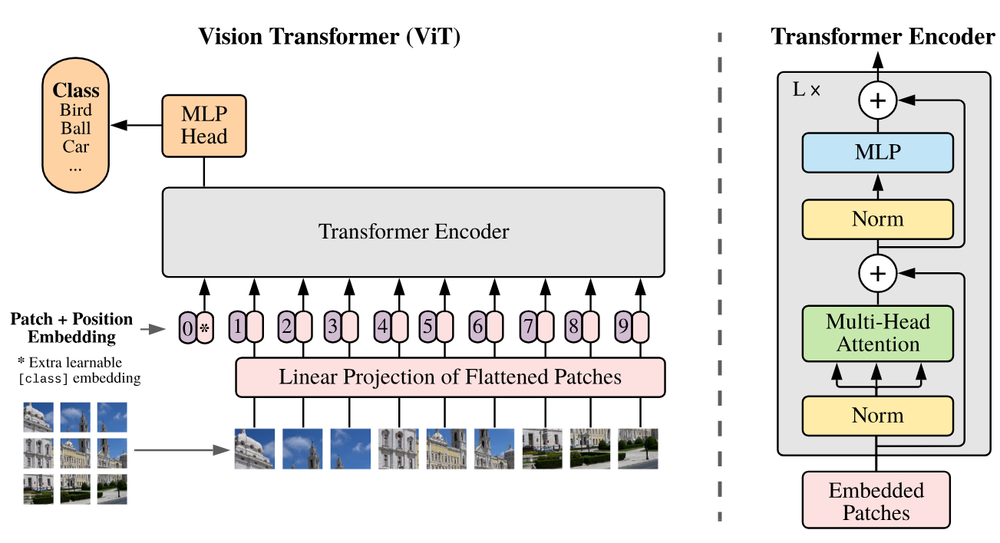

## PyTorch for Deep Learning Bootcamp
- Instructor:
  - Andrei Neagoie
  - Daniel Bourke

## Section 1: Introduction

### 1. PyTorch for Deep Learning

### 2. Course Welcome and What Is Deep Learning

### 3. Join Our Online Classroom!

### 4. Exercise: Meet Your Classmates + Instructor

### 5. Free Course Book + Code Resources + Asking Questions + Getting Help
- https://github.com/mrdbourke/pytorch-deep-learning

### 6. ZTM Resources

### 7. Machine Learning + Python Monthly Newsletters

## Section 2: PyTorch Fundamentals
- https://github.com/mrdbourke/pytorch-deep-learning/blob/main/video_notebooks/01_pytorch_workflow_video.ipynb

### 8. Why Use Machine Learning or Deep Learning

### 9. The Number 1 Rule of Machine Learning and What Is Deep Learning Good For
- What deep learning is good for
  - Problems with long lists of rules
  - Continually changing environments
  - Discovering insights within large collections of data
- What deep learning is not good for
  - When you need explainability
  - When the traditional approach is a better option
  - When errors are unacceptable
  - When you don't have much data

### 10. Machine Learning vs. Deep Learning
- ML
  - For Structured data
- DL
  - For unstructured data

### 11. Anatomy of Neural Networks
- Input layler
- Hidden layer
- Output layer
- Each layer is usually combination of linear and/or nonlinear functions

### 12. Different Types of Learning Paradigms
- Supervised learning
- Unsupervised & self-supervised learning
- Transfer learning

### 13. What Can Deep Learning Be Used For
- Recommendation
- Translation: seq2seq
- Speech recognition: seq2seq
- Computer vision: classification
- Natural Language Processing: classification/regression

### 14. What Is and Why PyTorch
- The most popular research deep learning framework
- Write fast DL code in Python
- Able to access many pre-built DL models
- Whole stack: preprocess data, model data, deploy model in application/cloud
 
### 15. What Are Tensors

### 16. What We Are Going To Cover With PyTorch

### 17. How To and How Not To Approach This Course
1. Code along
2. Explore and experiment
3. Visualize what you don't understand
4. Ask questions
5. Do the exercises
6. Share your work

### 18. Important Resources For This Course
- https://github.com/mrdbourke/pytorch-deep-learning
- https://github.com/mrdbourke/pytorch-deep-learning/discussions
- https://www.learnpytorch.io/

### 19. Getting Setup to Write PyTorch Code
```py
import torch
import pandas as pd
import numpy as np
import matplotlib.pyplot as plt
import os
os.environ["CUDA_VISIBLE_DEVICES"] = "0" 
print(torch.__version__)
print(f"CUDA Available: {torch.cuda.is_available()}")
if torch.cuda.is_available():
    print(f"Number of GPUs available: {torch.cuda.device_count()}")
    print(f"GPU Name: {torch.cuda.get_device_name(0)}")
```
### 20. Introduction to PyTorch Tensors
```py
#scalar - as lower
scalar = torch.tensor(7)
scalar# Scalar
scalar = torch.tensor(7)
print(scalar)
scalar.ndim # 0, not 1
scalar.item() # 7
scalar.shape # torch.Size([])
# Vector - as lower
vector = torch.tensor([7,7])
vector.ndim # 1, not 2
vector.shape # torch.Size([2])
# Matrix - as upper or Capital
MATRIX = torch.tensor ([[7,8],[9,10]])
MATRIX.ndim # 2
MATRIX[1] # prints tensor([9,10])
MATRIX[0] # prints tensor([7,8])
MATRIX.shape # torch.Size([2,2])
# Tensor - as upper or Capital
TENSOR = torch.tensor([[[1,2,3],[4,5,6],[7,8,9]]])
TENSOR.ndim # 3
TENSOR.shape # torch.Size([1,3,3])
```

### 21. Creating Random Tensors in PyTorch
- Why random tensors?
  - Many neural network iniitates from random numbers
```py
random_tensor = torch.rand(3,4)
random_tensor.shape
rt = torch.rand(size=(2,3,4))
print(rt.ndim, rt.shape) # 3 torch.Size([2, 3, 4])
```

### 22. Creating Tensors With Zeros and Ones in PyTorch
```py
RT = torch.ones(2,3) # all 1.0's
RT = torch.zeros(2,3) # all 0.0's
RT.dtype # torch.float32
```

### 23. Creating a Tensor Range and Tensors Like Other Tensors
```py
torch.range(0,3) # returns a tensor of 0,1,2,3 - 3 included
torch.arange(0,3) # returns a tensor of 0,1,2 - 3 not included
torch.arange(start=123, end=999, step=256) # tensor([123, 379, 635, 891])
one_to_ten = torch.range(0,10)
ten_zeros = torch.zeros_like(input=one_to_ten) # zeros_like find the size of tensors using the input
```
### 24. Dealing With Tensor Data Types
```py
float32_tensor = torch.tensor([3.,6,9], dtype=torch.float16)
print(float32_tensor.dtype) # torch.float16
float32_tensor = torch.tensor([3.,6,9], dtype=None,  # float32 or float16 or int32
                              device="cuda", # "cpu" or "cuda" or "tpu"
                              requires_grad=False # will track gradient or not
                              )
print(float32_tensor.dtype) # torch.float32
```
- TEnsor datatype is one of the 3 big errors that you will run into with PyTorch and DL
  1. Tensors are not right datatype
  2. Tensors not right shape
  3. Tensors not on the right device
- When CUDA is not working well with PyTorch:
```bash
sudo rmmod nvidia_uvm
sudo modprobe nvidia_uvm
```
- Type conversion:
```py
tmp_tensor = float32_tensor.type(torch.float16)
print(tmp_tensor) # tensor([3., 6., 9.], device='cuda:0', dtype=torch.float16)
```

### 25. Getting Tensor Attributes
- Datatype: x.dtype
- Shape: x.shape
- Device: x.device

### 26. Manipulating Tensors (Tensor Operations)
```py
tns = torch.tensor([1,2,3])
tns + 100 # 101,102,103
tns * 100 # 100,200,300
# == torch.mul(tns,100)
```

### 27. Matrix Multiplication (Part 1)
```py
%%time # measures wall time in the jupyter
A = torch.tensor([1,2,3])
A*A # tensor([1,4,9])
torch.matmul(A,A) # 14
```
- Use torch's matrix operation instead of loop-wise method
- **Note that when A is a vector (1dim), not matrix, torch.matmul() works as a dot product**

### 28. Matrix Multiplication (Part 2): The Two Main Rules of Matrix Multiplication
- `A@B` is a syntactic surgar of `torch.matmul(A,B)`

### 29. Matrix Multiplication (Part 3): Dealing With Tensor Shape Errors
- `torch.mm(A,B)` is a syntactic surgar of `torch.matmul(A,B)`
```py
A = torch.tensor([[1,2,3],[4,5,6]])
A*A # tensor([[ 1,  4,  9], [16, 25, 36]])
torch.mm(A,A.T) # tensor([[14, 32], [32, 77]])
```

### 30. Finding the Min Max Mean and Sum of Tensors (Tensor Aggregation)
- Tensor aggregation: min, max, sum, etc
```py
A.min() # tensor(1)
A.max() # tensor(6)
A.sum() # tensor(21)
#A.mean() # not working fot int
B = A.type(torch.float32) # conversion into float32
B.mean() # tensor(3.5000)
```

### 31. Finding The Positional Min and Max of Tensors
```py
A.argmin() # tensor(0)
A.argmax() # tensor(5)
```

### 32. Reshaping, Viewing and Stacking Tensors
- Reshaping: reshapes an input tensor to a defined shape
- View: returns a view of an input tensor of certain shape but keep the same as the original tensor
- Stacking: combines multiple tensors on top of each other (vstack) or a side (hstack)
- Squeeze: removes all '1' dimensions from a tensor
- Unsqueeze - adda a '1' dimension to a target tensor
- Permute: returns a view of the input with dimensions permuted (swapped) in a certain way
```py
x = torch.arange(1., 10.)
x, x.shape # (tensor([1., 2., 3., 4., 5., 6., 7., 8., 9.]), torch.Size([9]))
x_re = x.reshape(3,3)
x_re, x_re.shape
z = x.view(3,3)
z, z.shape # (tensor([[1., 2., 3.], [4., 5., 6.], [7., 8., 9.]]), torch.Size([3, 3]))
x_st = torch.stack([x,x], dim=0)
x_st # tensor([[1., 2., 3., 4., 5., 6., 7., 8., 9.],        [1., 2., 3., 4., 5., 6., 7., 8., 9.]])
x_st = torch.stack([x,x], dim=1)
x_st # tensor([[1., 1.],[2., 2.],[3., 3.],[4., 4.],[5., 5.],[6., 6.],[7., 7.],[8., 8.],[9., 9.]])
```

### 33. Squeezing, Unsqueezing and Permuting Tensors
- squeeze: [1,9] -> [9]
- unqueeze: [9] -> [1,9] or [9,1]
```py
y = x.squeeze()
z = x.unsqueeze(dim=0)
x, x.shape, y, y.shape, z, z.shape
#(tensor([1., 2., 3., 4., 5., 6., 7., 8., 9.]), torch.Size([9]), tensor([1., 2., 3., 4., 5., 6., 7., 8., 9.]), torch.Size([9]), tensor([[1., 2., 3., 4., 5., 6., 7., 8., 9.]]), torch.Size([1, 9]))
x = torch.rand(size=(3,4,2))
x_p = x.permute(2,0,1)
x.shape, x_p.shape # (torch.Size([3, 4, 2]), torch.Size([2, 3, 4]))
```

### 34. Selecting Data From Tensors (Indexing)
```py
x = torch.rand(size=(3,4,2))
x_p = x.permute(2,0,1)
#x.shape, x_p.shape
print(x[0,0,0], x_p[0,0,0]) # tensor(0.7831) tensor(0.7831)
x[0,0,0]=123.
print(x[0,0,0], x_p[0,0,0]) # tensor(123.) tensor(123.)
```
- x.permute() provides a reference copy
- ":" to select all target dimension

### 35. PyTorch Tensors and NumPy
```py
x = torch.arange(1,10).reshape(1,3,3)
print(x[0,2,2], x[0][2][2]) # tensor(9) tensor(9)
print(x[0,2,:]) # tensor([7, 8, 9])
```
- Numpy data into PyTorch tensor
  - `torch.from_numpy(ndarray)`
  - numpy default datatype is float64 and default conversion will produce torch.float64
- PyTorch tensor to numpy data
  - `torch.Tensor.numpy()`
```py
# np -> torch
array = np.arange(1.0,8.0)
tensor = torch.from_numpy(array)
array, tensor # (array([1., 2., 3., 4., 5., 6., 7.]), tensor([1., 2., 3., 4., 5., 6., 7.], dtype=torch.float64))
tensor32 = torch.from_numpy(array).type(torch.float32)
print(tensor32.dtype) # torch.float32
# Torch -> np
t = torch.ones(7)
np_t = t.numpy()
print(t.dtype, np_t.dtype) # torch.float32 float32
```
- Conversion uses deep copy

### 36. PyTorch Reproducibility (Taking the Random Out of Random)
- How neural network learns
  - random numbers -> tensor operations -> update random numbers to make them better representation of the data -> again -> again ...
  - random seed
```py
RANDOM_SEED=7
torch.manual_seed(RANDOM_SEED)
a = torch.rand(3,4)
torch.manual_seed(RANDOM_SEED)
b = torch.rand(3,4)
a == b # all Trues
```

### 37. Different Ways of Accessing a GPU in PyTorch
1. Google Colab
2. Own GPU
3. Cloud
- Check for GPU access with PyTorch:
```py
import torch
torch.cuda.is_available()
# device agnostic code
device = "cuda" if torch.cuda.is_available() else "cpu"
torch.cuda.device_count() # Number of GPUs
```

### 38. Setting up Device-Agnostic Code and Putting Tensors On and Off the GPU
- CPU -> CUDA
  - Works as a deep copy
```py
t_cpu = torch.tensor([1,2,3])
print(t_cpu, t_cpu.device)
t_gpu = t_cpu.to("cuda")
print(t_gpu, t_gpu.device)
```
- CUDA -> CPU
```py
tmp_cpu = t_gpu.cpu().numpy()
print(t_gpu, tmp_cpu)
```

### 39. PyTorch Fundamentals: Exercises and Extra-Curriculum
- https://github.com/mrdbourke/pytorch-deep-learning/blob/main/extras/exercises/00_pytorch_fundamentals_exercises.ipynb

## Section 3: PyTorch Workflow

### 40. Introduction and Where You Can Get Help

### 41. Getting Setup and What We Are Covering
- https://www.learnpytorch.io/01_pytorch_workflow/
- We are covering:
  1. Data (prepare and load)
  2. Build model
  3. Fitting the model to data
  4. Making predictions and evaluating a model (inference)
  5. Saving and loading a model
  6. Putting it all together
```py
import torch
from torch import nn
import matplotlib.pyplot as plt
torch.__version__
```

### 42. Creating a Simple Dataset Using the Linear Regression Formula
- Data can be almost anything
  - Excel spreadsheet
  - Images
  - Videos
  - Audio like songs or podcasts
  - DNA
  - Text
- ML is a game of two parts:
  1. Get data into a numerical representation
  2. Build a model to learn patterns in that numerical representation
```py
weight=0.7
bias = 0.3
start = 0
end = 1
step = 0.02
X = torch.arange(start,end,step).unsqueeze(dim=1)
y = weight *X + bias
X[:5], y[:5] # (tensor([[0.0000],[0.0200],[0.0400],[0.0600],[0.0800]]), tensor([[0.3000],[0.3140],[0.3280],[0.3420],[0.3560]]))
```

### 43. Splitting Our Data Into Training and Test Sets
- Three datasets
  1. Training set, 60-80%
  2. Validation set, 10-20%
  3. Test set, 10-20%
```py
train_split = int(0.8*len(X))
X_train,y_train = X[:train_split], y[:train_split]
X_test,y_test = X[train_split:], y[train_split:]
len(X_train), len(y_train), len(X_test), len(y_test) # 40 40 10 10 
```

### 44. Building a function to Visualize Our Data
```py
def plot_predictions(train_data=X_train, 
                     train_labels=y_train, 
                     test_data=X_test, 
                     test_labels=y_test,
                     predictions=None):
  plt.figure(figsize=(10,7))
  plt.scatter(train_data,train_labels, c="b",s=4,
              label="Trainig data")
  plt.scatter(test_data, test_labels, c="g", s=4,
              label="Testing data")
  if predictions is not None:
    plt.scatter(test_data, predictions, c="r", s=4,
                label="Predictions")
  plt.legend(prop={"size": 14});
```

### 45. Creating Our First PyTorch Model for Linear Regression
- Our model does:
  - Start with random values (weight and bias)
  - Look at training data and adjust the random values to better represent (or get closer to) the ideal values (the weight & bias values we used to create the data)
- How does it so?
  1. Gradient descent
  2. Backpropagation
```py
# Linear regression model
# weights and bias are random in the beginning but will be updated as learning progresses
from torch import nn
class LinearRegressionModel(nn.Module): # most of Pytorch classes are inherited from nn.Module
  def __init__(self):
    super().__init__()
    self.weights = \
    nn.Parameter(torch.randn(1,requires_grad=True,
                             dtype=torch.float))
    self.bias = nn.Parameter(torch.randn(1,requires_grad=True,
                                         dtype=torch.float))
  def forward(self,x:torch.Tensor)->torch.Tensor:
    return self.weights * x + self.bias
```

### 46. Breaking Down What's Happening in Our PyTorch Linear regression Model

### 47. Discussing Some of the Most Important PyTorch Model Building Classes
- PyTorch model building essentials
  - torch.nn: contains all of buildings for computational grpahs (a neural netowrk can be considered as a computational graph)
  - torch.nn.Parameter: what parameters should our model try and learn, often a PyTorch layer from torch.nn will set theses for us
  - torch.nn.Module: the base class for all neural network modules, if you subclass it, you should override forward()
  - torch.optim: this where the optimizers in PyTorch live, they will help with gradient descent
  - def forward(): all nn.Module subclasses require you to override forward(), this method defines what happens in the forward computation

### 48. Checking Out the Internals of Our PyTorch Model
```py
torch.manual_seed(42)
model_0 = LinearRegressionModel()
list(model_0.parameters()) # [Parameter containing: tensor([0.3367], requires_grad=True), Parameter containing: tensor([0.1288], requires_grad=True)]
```

### 49. Making Predictions With Our Random Model Using Inference Mode
- Prediction using `torch.inference_mode()`
  - No-gradient tracking
  - Faster
```py
with torch.inference_mode():
  y_preds = model_0(X_test)
y_preds
```
  - This is equivalent to `y_preds=model_0(X_test)` with gradient tracking

### 50. Training a Model Intuition (The Things We Need)
- Train model
  - The whole idea of training is for a model to move from some unknown parameters (these might be random) to some known parameters
  - Or in other words, from a poor representation of the data toa better representation of the data
  - One way to measure how poor or how wrong your models predictions are is to use a loss function
  * Loss function may also be called **cost function** or criterion in different areas
- Loss function: A function to measure how wrong your model's predictions are to the ideal outputs, lower is better
- Optimizer: Takes into account the loss of a model and adjusts the model's parameters (weight and bias)

### 51. Settinhyg Up an Optimizer and a Loss Function
- nn.L1Loss(): absolute differences
```py
loss_fn = nn.L1Loss()
optimizer = torch.optim.SGD(params=model_0.parameters(),lr=0.01)
```

### 52. PyTorch Training Loop Steps and Intuition
- Learning rate(lr): a hyper parameter that defines how big/small the optimizer changes the paramters with each step
- Things we need in a training loop
  0. Loop through the data
  1. Forward pass: this involves data moving through our model's `forward()` function to make predictions. Also called forward propagation
  2. Calculate the loss: compares forward pass predictions to ground truth labels  
  3. Optimizer zero grad
  4. Loss backward - move backwards through the network to calculate the gradients of each of the parameters of our model WRT the loss. Called as **backpropagation**
  6. Optimizer step: use the optimizer to adjust our model's parameters to try to improve the loss

### 53. Writing Code for a PyTorch Training Loop
```py
epochs = 10
# 0. Loop through the data
for epoch in range(epochs):
  model_0.train()
  # 1. Forward pass
  y_pred = model_0(X_train)
  # 2. Loss calculation
  loss = loss_fn(y_pred,y_train)
  # 3. Optimizer
  optimizer.zero_grad()
  # 4. Perform backpropagation
  loss.backward()
  # 5. STep the optimizer
  optimizer.step()
  #model_0.eval()
```

### 54. Reviewing the Steps in a Training Loop Step by Step

### 55. Running Our Training Loop Epoch by Epoch and Seeing What Happens

### 56. Writing Testing Loop Code and Discussing What's Happening Step by Step
```py
epochs = 10
# 0. Loop through the data
for epoch in range(epochs):
  model_0.train()
  # 1. Forward pass
  y_pred = model_0(X_train)
  # 2. Loss calculation
  loss = loss_fn(y_pred,y_train)
  print(f"Loss: {loss}")
  # 3. Optimizer
  optimizer.zero_grad()
  # 4. Perform backpropagation
  loss.backward()
  # 5. Step the optimizer
  optimizer.step()
  ## Testing
  model_0.eval() # turns off different settings in th emodel not needed for evaluation/testing (dropout/batchnorm layers). model_0.train() will activate them again
  with torch.inference_mode(): # with torch.no_grad(): # alternative but in old code
    test_pred = model_0(X_test) 
    test_loss = loss_fn(test_pred, y_test)
  if epoch%10 ==0:    
    print(f"Epoch: {epoch} | Test: {loss} | Test loss: {test_loss}")
  print(model_0.state_dict())
```

### 57. Reviewing What Happens in a Testing Loop Step by Step

### 58. Writing Code to Save a PyTorch Model
- Saving a model in PyTorch
  1. `torch.save()` allows you to save PyTorch object in Python's pickle format
  2. `torch.load()` allows you to load a saved PyTorch object
  3. `torch.nn.MOdule.load_state_dict()` allows you to load a model's saved state dictionary
```py
from pathlib import Path
MODEL_PATH = Path("models")
MODEL_PATH.mkdir(parents=True, exist_ok=True)
MODEL_NAME = '01_pytorch_workflow_model_0.pth' # extension of pth for PyTorch object
MODEL_SAVE_PATH = MODEL_PATH / MODEL_NAME
MODEL_SAVE_PATH
print(f"Saving model to: {MODEL_SAVE_PATH}")
torch.save(obj=model_0.state_dict(), f=MODEL_SAVE_PATH) # Saving model to: models/01_pytorch_workflow_model_0.pth
```
### 59. Writing Code to Load a PyTorch Model
- To load ina saved state_dict we have to instantiate a new instance of our model class
```py
loaded_model_0 = LinearRegressionModel()
loaded_model_0.load_state_dict(torch.load(f=MODEL_SAVE_PATH))
loaded_model_0.state_dict() # OrderedDict([('weights', tensor([0.6913])), ('bias', tensor([0.2958]))])
```

### 60. Setting Up to Practice Everything We Have Done Using Device Agnostic code
```py
import torch
from torch import nn
import matplotlib.pyplot as plt
import numpy as np
print(torch.__version__)
device = "cuda" if torch.cuda.is_available() else "cpu"
print(f"Using device= {device}")
```

### 61. Putting Everything Together (Part 1): Data
```py
weight = 0.7
bias = 0.3
start = 0
end = 1
step = 0.02
X = torch.arange(start,end,step).unsqueeze(dim=1)
y = weight* X  + bias
train_split = int(0.8*len(X))
X_train,y_train = X[:train_split], y[:train_split]
X_test,y_test = X[train_split:], y[train_split:]
print(len(X_train), len(y_train), len(X_test), len(y_test))
#
plot_predictions(X_train, y_train, X_test, y_test)
```

### 62. Putting Everything Together (Part 2): Building a Model
```py
class LinearRegressionModelV2(nn.Module):
  def __init__(self):
    super().__init__()
    # Use nn.Linear() for creating the model parameters
    self.linear_layer = nn.Linear(in_features=1, out_features=1)
  def forward(self,x: torch.Tensor) -> torch.Tensor:
    return self.linear_layer(x)
torch.manual_seed(42)
model_1 = LinearRegressionModelV2()
model_1, model_1.state_dict() # (LinearRegressionModelV2((linear_layer): Linear(in_features=1, out_features=1, bias=True) ), OrderedDict([('linear_layer.weight',tensor([[0.7645]])),('linear_layer.bias', tensor([0.8300]))]))
```

### 63. Putting Everything Together (Part 3): Training a Model
```py
next(model_1.parameters()).device # cpu
model_1.to(device)
next(model_1.parameters()).device # device(type='cuda', index=0)
loss_fn = nn.L1Loss()
optimizer = torch.optim.SGD(params=model_1.parameters(), lr=0.01)
torch.manual_seed(42)
epochs=200
# put data on the device
X_train = X_train.to(device)
X_test = X_test.to(device)
y_train = y_train.to(device)
y_test = y_test.to(device)
for epoch in range(epochs):
  model_1.train()
  y_pred = model_1(X_train) # 1. Forward pass
  loss = loss_fn(y_pred,y_train) # 2. Calculate the loss
  optimizer.zero_grad() # 3. Optimizer zero grad
  loss.backward() # 4. Backpropagation
  optimizer.step() # 5. Optimizer step
  ## Testing
  model_1.eval()
  with torch.inference_mode():
    test_pred = model_1(X_test)
    test_loss = loss_fn(test_pred, y_test)
  if epoch%10 == 0:
    print(f"Epoch: {epoch} | Loss: {loss} | Test loss: {test_loss}")
```

### 64. Putting Everything Together (Part 4): Making Predictions With a Trained Model
```py
model_1.eval()
with torch.inference_mode():
  y_preds = model_1(X_test)
plot_predictions(predictions=y_preds.cpu())
```

### 65. Putting Everything Together (Part 5): Saving and Loading a Trained Model
```py
from pathlib import Path
MODEL_PATH = Path("models")
MODEL_PATH.mkdir(parents=True, exist_ok=True)
MODEL_NAME="01_pytorch_workflow_model_1.pth"
MODEL_SAVE_PATH = MODEL_PATH / MODEL_NAME
print(f"Saving model to: {MODEL_SAVE_PATH}")
torch.save(obj=model_1.state_dict(), f=MODEL_SAVE_PATH)
# Load a PyTorch
loaded_model_1 = LinearRegressionModelV2()
loaded_model_1.load_state_dict(torch.load(MODEL_SAVE_PATH))
loaded_model_1.to(device)
```

### 66. Exercise: Imposter Syndrome

### 67. PyTorch Workflow: Exercises and Extra-Curriculum
- https://www.learnpytorch.io/01_pytorch_workflow/#exercises

## Section 4: PyTorch Neural Network Classification

### 68. Introduction to Machine Learning Classification With PyTorch
- Binary classification: 
  - Spam or not
- Multiclass classification
  - Is this a photo of sushi, steak or pizza?
- Multilabel classification
  - What tags should this article have?
  - Many tags
- What we're going to cover
  - Architecture of a neural entwork classification model
  - Input shapes and output shapes of a classification model (features and labels)
  - Creating custom data to view, fit on and predict on
  - Steps in modeling
    - Creating a model, setting a loss function and optimizer, creating a training loop, evaluating a model
  - Saving and loading models
  - Harnessing the power of non-linearity
  - Different classification evaluation methods
  
### 69. Classification Problem Example: Input and Output Shapes

### 70. Typical Architecture of a Classification Neural Network (Overview)
- https://www.learnpytorch.io/02_pytorch_classification/
- https://docs.pytorch.org/docs/stable/nn.html

### 71. Making a Toy Classification Dataset
- https://github.com/mrdbourke/pytorch-deep-learning/blob/main/video_notebooks/02_pytorch_classification_video.ipynb
```py
import sklearn
from sklearn.datasets import make_circles
# make 1000 samples
n_samples = 1000
# create circles - draws 2 circles as inner/outer cicles
X,y=make_circles(n_samples, noise=0.03, random_state=42)
#print(f"X={X[:5]} y={y[:5]}") 
import pandas as pd
circles = pd.DataFrame({"X1":X[:,0], "X2":X[:,1], "label":y})
circles.head(3)
```


### 72. Turning Our Data into Tensors and Making a Training and Test Split
```py
import torch
torch.__version__
X = torch.from_numpy(X).type(torch.float) # float64 -> float32
y = torch.from_numpy(y).type(torch.float)
print(X.shape,y.shape)
from sklearn.model_selection import train_test_split
X_train,X_test,y_train,y_test= train_test_split(X,y,test_size=0.2, random_state=42)
```

### 73. Laying Out Steps for Modelling and Setting Up Device-Agnostic Code
- Building a model
  1. Setup device agonistic code so our code will run on an accelerator (GPU) if there is one
  2. Construct a model (by subclassing nn.Module)
  3. Define a loss function and optimizer
  4. Create a training and test loop
```py
import torch
from torch import nn
device = "cuda" if torch.cuda.is_available() else "cpu"
```

### 74. Coding a Small Neural Network to Handle Our Classification Data
```py
# 1. Construct a model that subclasses nn.Module
class CircleModelV0(nn.Module):
  def __init__(self):
    super().__init__()
    # 2. Create 2nn.Linear layers
    self.layer_1 = nn.Linear(in_features=2,out_features=5)
    self.layer_2 = nn.Linear(in_features=5,out_features=1)
  # 3. Define a forward()
  def forward(self,x):
    return self.layer_2(self.layer_1(x)) # x-> layer_1 -> layer_2
# 4. Instantiate an instance
model_0 = CircleModelV0().to(device)
model_0
```

### 75. Making Our Neural Network Visual
- In binary classification, any random pickup gives you 50% opportunity

### 76. Recreating and Exploring the Insides of Our Model Using nn.Sequential
- Using nn.Sequential() can make NN in an easy way but having a subclass is recommended
```py
model_0 = nn.Sequential(
  nn.Linear(in_features=2, out_features=5), 
  nn.Linear(in_features=5,out_features=1)).to(device)
```

### 77. Loss Function Optimizer and Evaluation Function for Our Classification Network
- Binary cross entropy: a loss function for binary classification, measuring the difference b/w the model's predicted probability and the actual true label. It penalizes confident wrong predictions heavily
- Logit: the raw, unnormalized scores output by the final layer of a neural network before any activation function is applied
  - Ex) Binary classification yields results as LOGIT, which would be a fractional number. They are converted into probability by activation function. Rounding those converted probability will become 0 or 1
```py
loss_fn = nn.BCELoss() # requires inputs to have gone through the sigmoid activation function prior to input to BCELoss
loss_fn = nn.BCEWithLogitsLoss() # sigmod activation funciton
#nn.Sequential(
#  nn.Sigmoid(),
#  nn.BCELoss()
#)
# why sigmoid in BC? for the numerical stability
optimizer = torch.optim.SGD(params=model_0.parameters(), lr=0.1)
def accuracy_fn(y_true, y_pred):
  correct = torch.eq(y_true, y_pred).sum().item()
  acc = (correct/len(y_pred))*100
  return acc
```  

### 78. Going from Model Logits to Prediction Probabilities to Prediction Labels
1. Forward pass
2. Calculate the loss
3. Optimizer zero grad
4. Loss backward (backpropagation)
5. Optimizer step (gradient descent)
* Our model outputs are raw **logits**. We can convert these logits into **prediction probabilities** by passing them to some activation function (sigmoid for BC and softmax for multiclass classification)
```py
model_0.eval()
with torch.inference_mode():
  y_logits = model_0(X_test.to(device))
y_logits[:5] # Raw logits
y_pred_probs = torch.sigmoid(y_logits) # Raw logits -> probability
y_pred_labels = torch.round(y_pred_probs) # probability -> 0 or 1
```

### 79. Coding a Training and Testing Optimization Loop for Our Classification Model
- Raw logits -> prediction probabilities -> prediction labels
```py
#torch.manual_seed(42)
#torch.cuda.manual_seed(42)
epochs=100
X_train,y_train = X_train.to(device), y_train.to(device)
X_test.y_test = X_test.to(device),y_test.to(device)
for epoch in range(epochs):
  # Training
  model_0.train()
  # 1. Forward pass
  y_logits = model_0(X_train).squeeze()
  y_pred = torch.round(torch.sigmoid(y_logits))
  # 2. Loss/Accuracy
  loss = loss_fn(y_logits,y_train) # nn.BCEWithLogitsLoss expects RAW logits
  acc = accuracy_fn(y_true=y_train, y_pred=y_pred)
  # 3. optimizer zero grad
  optimizer.zero_grad()
  # 4. Backpropagation
  loss.backward()
  # 5. Optimizer step(gradient descent)
  optimizer.step()
  ## Testing
  model_0.eval()
  with torch.inference_mode():
    test_logits = model_0(X_test).squeeze()
    test_pred = torch.round(torch.sigmoid(test_logits))
    test_loss = loss_fn(test_logits,y_test)
    test_acc = accuracy_fn(y_true=y_test, y_pred=test_pred)
  if epoch%10 == 0:
    print(f"Epoch: {epoch} | Loss:  {loss: .5f}, Acc: {acc: .2f} | Test los : {test_loss: .5f}, Test_acc: {test_acc: .2f}")
```

### 80. Writing Code to Download a Helper Function to Visualize Our Models Predictions
- Looks like the aove model is not learning anything ...
- Using helper function to visualize
```py
import requests
from pathlib import Path
# Download helper functions from Learn PyTorch repo (if it's not already downloaded)
if Path("helper_functions.py").is_file():
  print("helper_functions.py already exists, skipping download")
else:
  print("Downloading helper_functions.py")
  request = requests.get("https://raw.githubusercontent.com/mrdbourke/pytorch-deep-learning/main/helper_functions.py")
  with open("helper_functions.py", "wb") as f:
    f.write(request.content)
from helper_functions import plot_predictions, plot_decision_boundary
```
- The current model cannot handle the complexity

### 81. Discussing Options to Improve a Model
- Improving a model (from a model perspective)
  - Add more layers: more chances to learn patterns
  - Add more hidden units: from 5 hidden units to 10 hidden units
  - For for longer (more epochs)
  - Changing the activation functions
  - Change the learning rate: exploding gradient problem
  - Change the loss function

### 82. Creating a New Model with More Layers and Hidden Units
- Increase hidden units from 5 to 10
- Increase the number of layers from 2 to 3
- Increase the number of epochs from 100 to 1000
```py
class CircleModelV1(nn.Module):
  def __init__(self):
    super().__init__()
    self.layer_1 = nn.Linear(in_features=2,out_features=10)
    self.layer_2 = nn.Linear(in_features=10,out_features=10)
    self.layer_3 = nn.Linear(in_features=10, out_features=1)
  def forward(self, x):
    #z = self.layer_1(x)
    #z = self.layer_2(z)
    #z = self.layer_3(z)
    return self.layer_3(self.layer_2(self.layer_1(x))) # faster than running each layer
model_1 = CircleModelV1().to(device)  
```

### 83. Writing Training and Testing Code to See if Our Upgraded Model Performs Better
```py
loss_fn = nn.BCEWithLogitsLoss() # sigmod activation funciton
optimizer = torch.optim.SGD(params=model_1.parameters(), lr=0.1)
def accuracy_fn(y_true, y_pred):
  correct = torch.eq(y_true, y_pred).sum().item()
  acc = (correct/len(y_pred))*100
  return acc
#torch.manual_seed(42)
#torch.cuda.manual_seed(42)
epochs=1000
X_train,y_train = X_train.to(device), y_train.to(device)
X_test.y_test = X_test.to(device),y_test.to(device)
for epoch in range(epochs):
  # Training
  model_1.train()
  # 1. Forward pass
  y_logits = model_1(X_train).squeeze()
  y_pred = torch.round(torch.sigmoid(y_logits))
  # 2. Loss/Accuracy
  loss = loss_fn(y_logits,y_train) # nn.BCEWithLogitsLoss expects RAW logits
  acc = accuracy_fn(y_true=y_train, y_pred=y_pred)
  # 3. optimizer zero grad
  optimizer.zero_grad()
  # 4. Backpropagation
  loss.backward()
  # 5. Optimizer step(gradient descent)
  optimizer.step()
  ## Testing
  model_1.eval()
  with torch.inference_mode():
    test_logits = model_1(X_test).squeeze()
    test_pred = torch.round(torch.sigmoid(test_logits))
    test_loss = loss_fn(test_logits,y_test)
    test_acc = accuracy_fn(y_true=y_test, y_pred=test_pred)
  if epoch%100 == 0:
    print(f"Epoch: {epoch} | Loss:  {loss: .5f}, Acc: {acc: .2f} | Test loss : {test_loss: .5f}, Test_acc: {test_acc: .2f}")  
```
- Still half and half loss

### 84. Creating a Straight Line Dataset to See if Our Model is Learning Anything

### 85. Building and Training a Model to Fit on Straight Line Data
- Applying BC model into a regression data

### 86. Evaluating Our Models Predictions on Straight Line Data

### 87. Introducing the Missing Piece for Our Classification Model Non-Linearity
- Missing piece: non-linearity
 
### 88. Building Our First Neural Network with Non-Linearity
```py
# build a model with non-linear activation function
from torch import nn
class CircleModelV2(nn.Module):
  def __init__(self):
    super().__init__()
    self.layer_1 = nn.Linear(in_features=2,out_features=10)
    self.layer_2 = nn.Linear(in_features=10,out_features=10)
    self.layer_3 = nn.Linear(in_features=10,out_features=1)
    self.relu = nn.ReLU()
  def forward(self,x):
    return self.layer_3(self.relu(self.layer_2(self.relu(self.layer_1(x)))))
```

### 89. Writing Training and Testing Code for Our First Non-Linear Model
- Artificial neural network are a large combination of linear and non-linear functions which are potentially able to find patterns in data
- https://playground.tensorflow.org
```py
loss_fn = nn.BCEWithLogitsLoss() # sigmod activation funciton
optimizer = torch.optim.SGD(params=model_3.parameters(), lr=0.1)
epochs=1000
X_train,y_train = X_train.to(device), y_train.to(device)
X_test.y_test = X_test.to(device),y_test.to(device)
for epoch in range(epochs):
  # Training
  model_3.train()
  # 1. Forward pass
  y_logits = model_3(X_train).squeeze()
  y_pred = torch.round(torch.sigmoid(y_logits))
  # 2. Loss/Accuracy
  loss = loss_fn(y_logits,y_train) # nn.BCEWithLogitsLoss expects RAW logits
  acc = accuracy_fn(y_true=y_train, y_pred=y_pred)
  # 3. optimizer zero grad
  optimizer.zero_grad()
  # 4. Backpropagation
  loss.backward()
  # 5. Optimizer step(gradient descent)
  optimizer.step()
  ## Testing
  model_3.eval()
  with torch.inference_mode():
    test_logits = model_3(X_test).squeeze()
    test_pred = torch.round(torch.sigmoid(test_logits))
    test_loss = loss_fn(test_logits,y_test)
    test_acc = accuracy_fn(y_true=y_test, y_pred=test_pred)
  if epoch%100 == 0:
    print(f"Epoch: {epoch} | Loss:  {loss: .5f}, Acc: {acc: .2f} | Test loss : {test_loss: .5f}, Test_acc: {test_acc: .2f}")
```

### 90. Making Predictions with and Evaluating Our First Non-Linear Model
- How to improve model_3?
  - More layers
  - More hidden units

### 91. Replicating Non-Linear Activation Functions with Pure PyTorch
```py
A = torch.arange(-10.,10,1)
plt.plot(torch.relu(A))
```

```py
# manual implementation of relu
def relu(x: torch.Tensor) -> torch.Tensor:
  return torch.maximum(torch.tensor(0), x) # inputs must be tensors
relu(A)
```

### 92. Putting It All Together (Part 1): Building a Multiclass Dataset
```py
import torch
from torch import nn
device = "cpu"
import matplotlib.pyplot as plt
from sklearn.datasets import make_blobs
from sklearn.model_selection import train_test_split
NUM_CLASSES  = 4
NUM_FEATURES = 2
RANDOM_SEED  = 42
X_blob, y_blob = make_blobs(n_samples=1000, n_features=NUM_FEATURES,
                            centers=NUM_CLASSES, cluster_std=1.5,
                            random_state=RANDOM_SEED)
X_blob = torch.from_numpy(X_blob).type(torch.float)
y_blob = torch.from_numpy(y_blob).type(torch.LongTensor) # multiclass classification
X_blob_train, X_blob_test, y_blob_train, y_blob_test = \
train_test_split(X_blob,y_blob,test_size=0.2, random_state=RANDOM_SEED)
plt.scatter(X_blob[:,0], X_blob[:,1], c=y_blob)
```


### 93. Creating a Multi-Class Classification Model with PyTorch
```py
class BlobModel(nn.Module):
  def __init__(self, input_features, out_features, hidden_units=8):
    super().__init__()
    self.linear_layer_stack = nn.Sequential(
      nn.Linear(in_features=input_features, out_features=hidden_units),
      nn.ReLU(),
      nn.Linear(in_features=hidden_units, out_features=hidden_units),
      nn.ReLU(),
      nn.Linear(in_features=hidden_units, out_features=out_features),
    )
  def forward(self,x):
    return self.linear_layer_stack(x)
model_4 = BlobModel(input_features=2,out_features=4,hidden_units=8).to(device)
```

### 94. Setting Up a Loss Function and Optimizer for Our Multi-Class Model
```py
# loss function for multi-class classification
loss_fn = nn.CrossEntropyLoss()
optimizer = torch.optim.SGD(params=model_4.parameters(), lr=0.1)
def accuracy_fn(y_true, y_pred):
  correct = torch.eq(y_true, y_pred).sum().item()
  acc = (correct/len(y_pred))*100
  return acc
```

### 95. Logits to Prediction Probabilities to Prediction Labels with a Multi-Class Model
```py
model_4.eval()
with torch.inference_mode():
  y_logits = model_4(X_blob_test.to(device))
# logit -> probability
# In multiclass, softmax instead of sigmoid
## each array contains 4 fractional numbers, proabilities for each class
y_pred_probs = torch.softmax(y_logits,dim=1)
# convert probability into prediction labels
y_preds = torch.argmax(y_pred_probs, dim=1)
```

### 96. Training a Multi-Class Classification Model and Troubleshooting Code on the Fly
```py
epochs=1000
X_train,y_train = X_blob_train.to(device), y_blob_train.to(device)
X_test, y_test = X_blob_test.to(device),y_blob_test.to(device)
for epoch in range(epochs):
  # Training
  model_4.train()
  # 1. Forward pass
  y_logits = model_4(X_train)
  y_pred = torch.softmax(y_logits,dim=1).argmax(dim=1)
  # 2. Loss/Accuracy
  loss = loss_fn(y_logits,y_train) # 
  acc = accuracy_fn(y_true=y_train, y_pred=y_pred)
  # 3. optimizer zero grad
  optimizer.zero_grad()
  # 4. Backpropagation
  loss.backward()
  # 5. Optimizer step(gradient descent)
  optimizer.step()
  ## Testing
  model_4.eval()
  with torch.inference_mode():
    test_logits = model_4(X_test)
    test_pred = torch.softmax(test_logits,dim=1).argmax(dim=1)
    test_loss = loss_fn(test_logits,y_test)
    test_acc = accuracy_fn(y_true=y_test, y_pred=test_pred)
  if epoch%100 == 0:
    print(f"Epoch: {epoch} | Loss:  {loss: .5f}, \
          Acc: {acc: .2f} | Test loss : {test_loss: .5f}, \
          Test_acc: {test_acc: .2f}")
```

### 97. Making Predictions with and Evaluating Our Multi-Class Classification Model
```py
model_4.eval()
with torch.inference_mode():
  y_logits = model_4(X_test)
y_preds = torch.softmax(y_logits,dim=1).argmax(dim=1)
```
- With those data, models without ReLU still works OK as data are distributed quite linearly

### 98. Discussing a Few More Classification Metrics
- Accuracy: out of 100 samples, how many does our model get right?
- Precision:
- Recall:
- F1-score:
- Confusion matrix
- Classification report
- https://towardsdatascience.com/beyond-accuracy-other-classification-metrics-you-should-know-in-machine-learning-ea671be83bb7/
```py
!pip install torchmetrics
from torchmetrics import Accuracy
# Setup metric
torchmetric_accuracy = Accuracy(task="multiclass",num_classes=4).to(device)
# Calculuate accuracy
torchmetric_accuracy(y_preds, y_test)
```

### 99. PyTorch Classification: Exercises and Extra-Curriculum
- https://www.learnpytorch.io/02_pytorch_classification/#exercises

## Section 5: PyTorch Computer Vision

### 100. What Is a Computer Vision Problem and What We Are Going to Cover
- What we're going to cover
  - Getting a vision dataset to work with using torchvision.datasets
  - Architecture of a convolutional neural network (CNN) with PyTorch
  - An end-to-end multi-class image classification problem
  - Steps in modeling with CNNs in PyTorch
    - Creating a CNN model with PyTorch
    - Picking a loss and optimizer
    - Training a PyTorch computer vision model
    - Evaluating model

### 101. Computer Vision Input and Output Shapes
- 24-bit RGB images
- Input and output shapes
  - [batch_size, height, width, color channels] (NHWC), coloar channels last
    - In many image types
  - [batch_size, color channels, height, width] (NCHW), coloar channels first
    - In PyTorch. Flatten() will assume that the first column is the batch size
  
### 102. What Is a Convolutional Neural Network (CNN)
- Good at recognizing patterns in image

### 103. Discussing and Importing the Base Computer Vision Libraries in PyTorch
- https://github.com/mrdbourke/pytorch-deep-learning/blob/main/video_notebooks/03_pytorch_computer_vision_video.ipynb
- Computer vision libraries in PyTorch
  - torchvision: base domain library
  - torchvision.datasets: get datasets and data loging functions
  - torchvision.models: get pretrained computer vision models
  - torchvision.transforms: functions for manipulating vision data to be suitable for use with ML models
  - torch.utils.data.Dataset: Base dataset class
  - torch.utils.data.DataLoader: Creates a Python iterable over a dataset
```py
import torch
from torch import nn
import torchvision
from torchvision import datasets
from torchvision import transforms
from torchvision.transforms import ToTensor
import matplotlib.pyplot as plt
print(torch.__version__)
print(torchvision.__version__)
```

### 104. Getting a Computer Vision Dataset and Checking Out Its- Input and Output Shapes
```py
# FashionMNIST: greyscale images of clothing
# Available from github and also from torchvision dataset
from torchvision import datasets
train_data = datasets.FashionMNIST(
  root = "data", # path
  train = True,  # including training data
  download=True,
  transform=torchvision.transforms.ToTensor(),
  target_transform=None # labels/target transforms
)
test_data = datasets.FashionMNIST(
  root = "data", # path
  train = False,  # including training data
  download=True,
  transform=torchvision.transforms.ToTensor(),
  target_transform=None # labels/target transforms
)
```
- Downloading 26MB at data/FashionMNIST
  - They are index and gz files, not images files
```py
class_names = train_data.classes
print(class_names) # ['T-shirt/top', 'Trouser', 'Pullover', 'Dress', 'Coat', 'Sandal', 'Shirt', 'Sneaker', 'Bag', 'Ankle boot']
class_to_idx = train_data.class_to_idx
print(class_to_idx) # {'T-shirt/top': 0, 'Trouser': 1, 'Pullover': 2, 'Dress': 3, 'Coat': 4, 'Sandal': 5, 'Shirt': 6, 'Sneaker': 7, 'Bag': 8, 'Ankle boot': 9}
image, label = train_data[0]
print(f"Image shape: {image.shape} -> [color_channels, height, width]") #Image shape: torch.Size([1, 28, 28]) -> [color_channels, height, width]
```

### 105. Visualizing Random Samples of Data
```py
import matplotlib.pyplot as plt
image,label=train_data[0]
print(f"Image shape: {image.shape}")
plt.imshow(image.squeeze(),cmap="gray")
```


### 106. DataLoader Overview Understanding Mini-Batches
- Why DataLoader?
  - Turning data into batches in the size of 32 images
  - More opportunities for the model to update gradients
  - Computationally efficient regarding loading images into memory

### 107. Turning Our Datasets Into DataLoaders
```py
from torch.utils.data import DataLoader
BATCH_SIZE = 32
train_dataloader = DataLoader(dataset=train_data,
                              batch_size=BATCH_SIZE,
                              shuffle=True)
test_dataloader = DataLoader(dataset=test_data,
                              batch_size=BATCH_SIZE,
                              shuffle=False)
train_features_batch, train_labels_batch = next(iter(train_dataloader))
print(train_features_batch.shape, train_labels_batch.shape) # torch.Size([32, 1, 28, 28]) torch.Size([32])
```

### 108. Model 0: Creating a Baseline Model with Two Linear Layers
- How Flatten() works:
```py
flatten_model = nn.Flatten()
x = train_features_batch[0]
x.shape # torch.Size([1, 28, 28])
# flatten the sample
output = flatten_model(x)
print(f"Shape before flattening: {x.shape}") # torch.Size([1, 28, 28])
print(f"Shape after flattening: {output.shape}") # torch.Size([1, 784])
```
  - Assumes that the first column of the tensor is the batch size
```py
from torch import nn
class FashionMNISTModelV0(nn.Module):
  def __init__(self,
               input_shape: int,
               hidden_units: int,
               output_shape: int):
    super().__init__()
    self.layer_stack = nn.Sequential(
      nn.Flatten(),
      nn.Linear(in_features=input_shape,
                out_features=hidden_units),
      nn.Linear(in_features=hidden_units,
                out_features=output_shape)      
    )
  def forward(self,x):
    return self.layer_stack(x)
model_0 = FashionMNISTModelV0(
  input_shape=784,
  hidden_units=10,
  output_shape=len(class_names)
  ).to("cpu")
```

### 109. Creating a Loss Function: an Optimizer for Model 0
```py
# from https://github.com/mrdbourke/pytorch-deep-learning/blob/main/helper_functions.py
def accuracy_fn(y_true, y_pred):
    correct = torch.eq(y_true, y_pred).sum().item()
    acc = (correct / len(y_pred)) * 100
    return acc
# Loss and optimizer
loss_fn = nn.CrossEntropyLoss()
optimizer = torch.optim.SGD(params=model_0.parameters(),lr=0.1)
```

### 110. Creating a Function to Time Our Modelling Code
- What we want to track:
  1. Model's performance (loss and accuracy values etc)
  2. How fast it runs
```py
from timeit import default_timer as timer
def print_train_time(start: float,end: float,
                     device: torch.device =None):
  total_time = end - start
  print(f"Train time on {device}: {total_time:.3f} seconds")
  return total_time
```

### 111. Writing Training and Testing Loops for Our Batched Data
- How tqdm package works:
```bash
>>> from tqdm.auto import tqdm
>>> for i in range(3):
...   print(i)
... 
0
1
2
>>> for i in tqdm(range(3)):
...   print(i)
... 
  0%|                                                               | 0/3 [00:00<?, ?it/s]0
1
2
100%|████████████████████████████████████████████████████| 3/3 [00:00<00:00, 38245.93it/s]
```
```py
from tqdm.auto import tqdm
torch.manual_seed(123)
train_time_start_on_cpu = timer()
epochs=3
for epoch in tqdm(range(epochs)):
  print(f"Epoch: {epoch}\n-----")
  train_loss = 0
  for batch, (X, y) in enumerate(train_dataloader):
    model_0.train()
    y_pred = model_0(X)
    loss = loss_fn(y_pred,y)
    train_loss += loss 
    optimizer.zero_grad()
    loss.backward()
    optimizer.step()
    if batch % 400 == 0:
      print(f"Looked at {batch * len(X)}/{len(train_dataloader)} samples.")
  # Divide total train loss by length of train dataloader
  train_loss /= len(train_dataloader)
  test_loss, test_acc = 0,0
  model_0.eval()
  with torch.inference_mode():
    for X_test, y_test in test_dataloader:
      test_pred = model_0(X_test)
      test_loss += loss_fn(test_pred,y_test)
      test_acc += accuracy_fn(y_true=y_test, y_pred=test_pred.argmax(dim=1))
    # avg test_loss
    test_loss /= len(test_dataloader)      
    test_acc /= len(test_dataloader)
  print(f"\nTrain loss: {train_loss:.4f} | Test loss: {test_loss:.4f}, Test acc: {test_acc:.4f}")
train_time_end_on_cpu = timer()
total_train_time_mode_0 = print_train_time(start=train_time_start_on_cpu, 
                                           end=train_time_end_on_cpu, 
                                           device=str(next(model_0.parameters())))
```
- Q: why logits are not applied with activation functions like sigmoid() or softmax()? like BC or multi-class classification

### 112. Writing an Evaluation Function to Get Our Models Results
```py
torch.manual_seed(42)
def eval_model(model: torch.nn.Module,
               data_loader:torch.utils.data.dataloader,
               loss_fn: torch.nn.Module,
               accuracy_fn):
  loss,acc = 0,0
  model.eval()
  with torch.inference_mode():
    for X,y in data_loader:
      X,y = X.to(device), y.to(device)
      y_pred = model(X)
      loss += loss_fn(y_pred,y)
      acc += accuracy_fn(y_true=y,
                         y_pred=y_pred.argmax(dim=1))
    loss /= len(data_loader)
    acc /= len(data_loader)
  return {"model_name": model.__class__.__name__,
          "model_loss": loss.item(),
          "model_acc":acc}
model_0_results = eval_model(model=model_0,
                             data_loader=test_dataloader,
                             loss_fn = loss_fn,
                             accuracy_fn = accuracy_fn)
model_0_results #{'model_name': 'FashionMNISTModelV0', 'model_loss': 0.48247453570365906, 'model_acc': 82.82747603833866}
```

### 113. Setup Device-Agnostic Code for Running Experiments on the GPU

### 114. Model 1: Creating a Model with Non-Linear Functions
```py
class FashionMNISTModelV1(nn.Module):
  def __init__(self, 
               input_shape: int,
               hidden_units: int,
               output_shape: int):
    super().__init__()
    self.layer_stack = nn.Sequential(
      nn.Flatten(),
      nn.Linear(in_features=input_shape,out_features=hidden_units),
      nn.ReLU(),
      nn.Linear(in_features=hidden_units,out_features=output_shape),
      nn.ReLU()
    )
  def forward(self,x:torch.Tensor):
    return self.layer_stack(x)
torch.manual_seed(42)
model_1 = FashionMNISTModelV1(input_shape=784,
                              hidden_units=10,
                              output_shape=len(class_names)).to(device)
model_1
```

### 115. Mode 1: Creating a Loss Function and Optimizer
```py
# from https://github.com/mrdbourke/pytorch-deep-learning/blob/main/helper_functions.py
def accuracy_fn(y_true, y_pred):
    correct = torch.eq(y_true, y_pred).sum().item()
    acc = (correct / len(y_pred)) * 100
    return acc
# Loss and optimizer
loss_fn = nn.CrossEntropyLoss()
optimizer = torch.optim.SGD(params=model_1.parameters(),lr=0.1)
```

### 116. Turning Our Training Loop into a Function
```py
def train_step(model: torch.nn.Module,
               data_loader: torch.utils.data.DataLoader,
               loss_fn: torch.nn.Module,
               optimizer: torch.optim.Optimizer,
               accuracy_fn,
               device: torch.device=device):
  train_loss, train_acc = 0,0
  model.train()
  for batch, (X, y) in enumerate(train_dataloader):
    #batch = batch.to(device)
    X = X.to(device)
    y = y.to(device)
    y_pred = model(X)
    loss = loss_fn(y_pred,y)
    train_loss += loss 
    train_acc += accuracy_fn(y_true=y,
                             y_pred=y_pred.argmax(dim=1))
    optimizer.zero_grad()
    loss.backward()
    optimizer.step()
    if batch % 400 == 0:
      print(f"Looked at {batch * len(X)}/{len(train_dataloader)} samples.")
  # Divide total train loss by length of train dataloader
  train_loss /= len(data_loader)
  train_acc /= len(data_loader)
  print(f"\nTrain loss: {train_loss:.5f} | Train acc: {train_acc:.2f} %")
```

### 117. Turning Our Testing Loop into a Function
```py
def test_step(model: torch.nn.Module,
              data_loader: torch.utils.data.DataLoader,
              loss_fn: torch.nn.Module,
              accuracy_fn,
              device: torch.device = device):
  test_loss, test_acc = 0,0
  model.eval()
  with torch.inference_mode():
    for X,y in data_loader:
      X, y = X.to(device), y.to(device)
      test_pred = model(X)
      test_loss += loss_fn(test_pred, y)
      test_acc += accuracy_fn(y_true=y, y_pred=test_pred.argmax(dim=1))
    test_loss /= len(data_loader)
    test_acc /= len(data_loader)
    print(f"Test loss: {test_loss:.5f} | Test acc: {test_acc: .2f}%\n")
```

### 118. Training and Testing Model 1 with Our Training and Testing Functions
```py
torch.manual_seed(42)
from timeit import default_timer as Timer
stime = timer()
epochs=3
for epoch in tqdm(range(epochs)):
  print(f"Epoch: {epoch}\n-----")
  train_step(model=model_1,
             data_loader = train_dataloader,
             loss_fn = loss_fn,
             optimizer=optimizer,
             accuracy_fn=accuracy_fn,
             device=device)
  test_step(model=model_1,
            data_loader=test_dataloader,
            loss_fn=loss_fn,
            accuracy_fn=accuracy_fn,
            device=device)
etime = timer()
ttime = print_train_time(start=stime, end=etime,device=device)
```
- Results
```bash
Train loss: 0.67027 | Train acc: 75.94 %
Test loss: 0.68500 | Test acc:  75.02%

Train time on cuda: 18.314 seconds
```

### 119. Getting a Results Dictionary for Model 1
```py
model_1_results = eval_model(model=model_1, 
                             data_loader = test_dataloader,
                             loss_fn = loss_fn,
                             accuracy_fn = accuracy_fn)
model_1_results
```

### 120. Model 2: Convolutional Neural Networks High Level Overview
- CNNs are well-known for its capability for finding patterns in visual data
- https://poloclub.github.io/cnn-explainer/

### 121. Model 2: Coding Our First Convolutional Neural Network with PyTorch
- Max pooling:
  - Reducing matrix size, show the max only
  - 2x2->1x1, having max value only
```py
class FashionMNISTModelV2(nn.Module):
  # replicating TinyVGG
  def __init__(self,input_shape: int, hidden_units: int, output_shape: int):
    super().__init__()
    self.conv_block_1 = nn.Sequential(
      nn.Conv2d(in_channels=input_shape,
                out_channels=hidden_units,
                kernel_size=3,
                stride=1,
                padding=1),
      nn.ReLU(),
      nn.Conv2d(in_channels=hidden_units,
                out_channels=hidden_units,
                kernel_size=3,
                stride=1,
                padding=1),
      nn.ReLU(),
      nn.MaxPool2d(kernel_size=2)
    )
    self.conv_block_2= nn.Sequential(
      nn.Conv2d(in_channels=hidden_units,
                out_channels=hidden_units,
                kernel_size=3,
                stride=1,
                padding=1),
      nn.ReLU(),
      nn.Conv2d(in_channels=hidden_units,
                out_channels=hidden_units,
                kernel_size=3,
                stride=1,
                padding=1),
      nn.ReLU(),
      nn.MaxPool2d(kernel_size=2)
    )
    self.classifier = nn.Sequential(
      nn.Flatten(),
      nn.Linear(in_features=hidden_units, # this will be modified
                out_features=output_shape)
    )
  def forward(self,x):
    x = self.conv_block_1(x)
    print(x.shape)
    x = self.conv_block_2(x)
    print(x.shape)
    x = self.classifier(x)
    return x
torch.manual_seed(42)  
model_2 = FashionMNISTModelV2(input_shape=1,
                              hidden_units=10,
                              output_shape=len(class_names)).to(device)
```                              

### 122. Model 2: Breaking Down Conv2D Step by Step
```py
# Stepping through nn.Conv2d()
torch.manual_seed(32)
images = torch.randn(size=(32,3,64,64))
test_image = images[0]
print(f"Image batch shape: {images.shape}")
print(f"Single Image shape: {test_image.shape}")
print(f"Test image: {test_image}")
$
conv_layer = nn.Conv2d(in_channels=3, # same as color channels
                       out_channels=10, # n. of hidden units
                       kernel_size=3, # this is equiv. to (3,3)
                       stride=1, # convolving unit. >1 will reduce output size
                       padding=1)
conv_output = conv_layer(test_image.unsqueeze(0))
conv_output.shape
```
- Test with different kernel_size, stride, padding and compare with the original size (3x64x64)

### 123. Model 2: Breaking Down MaxPool2D Step by Step
- Max Pooling: compressing image, extract features (max)
```py
max_pool_layer = nn.MaxPool2d(kernel_size=2)
test_image_through_conv = conv_layer(test_image.unsqueeze(dim=0))
print(f"Shape after conv_layer(): {test_image_through_conv.shape}") # Shape after conv_layer(): torch.Size([1, 64, 64, 64])
test_image_through_conv_and_max_pool = max_pool_layer(test_image_through_conv)
print(f"Shape after conv_layer() + maxpool(): {test_image_through_conv_and_max_pool.shape}") # Shape after conv_layer() + maxpool(): torch.Size([1, 64, 32, 32])
```

### 124. Mode 2: Using a Trick to Find the Input and Output Shapes of Each of Our Layers
```py
rand_image_tensor = torch.randn(size=(1,28,28))
model_2(rand_image_tensor.unsqueeze(dim=0).to(device)) # prints torch.Size([1, 10, 14, 14]) \n torch.Size([1, 10, 7, 7])
# yields: tensor([[ 3.7837,  1.0016, -3.3556,  1.5177,  1.8279, -0.8227,  2.9397, -4.5336,          0.7461, -1.0835]], device='cuda:0', grad_fn=<AddmmBackward0>)
# Q: How probability can be negative?
# A: As they are logit. not probability
#  : CNN keeps looping using logits, not probability. Loss/ACC are from logits
#  : Actual probability needs softmax()
class FashionMNISTModelV2(nn.Module):
  # replicating TinyVGG
  def __init__(self,input_shape: int, hidden_units: int, output_shape: int):
    super().__init__()
    self.conv_block_1 = nn.Sequential(
      nn.Conv2d(in_channels=input_shape,
                out_channels=hidden_units,
                kernel_size=3,
                stride=1,
                padding=1),
      nn.ReLU(),
      nn.Conv2d(in_channels=hidden_units,
                out_channels=hidden_units,
                kernel_size=3,
                stride=1,
                padding=1),
      nn.ReLU(),
      nn.MaxPool2d(kernel_size=2)
    )
    self.conv_block_2= nn.Sequential(
      nn.Conv2d(in_channels=hidden_units,
                out_channels=hidden_units,
                kernel_size=3,
                stride=1,
                padding=1),
      nn.ReLU(),
      nn.Conv2d(in_channels=hidden_units,
                out_channels=hidden_units,
                kernel_size=3,
                stride=1,
                padding=1),
      nn.ReLU(),
      nn.MaxPool2d(kernel_size=2)
    )
    self.classifier = nn.Sequential(
      nn.Flatten(),
      nn.Linear(in_features=hidden_units*7*7, # 1x490 
                out_features=output_shape)
    )
  def forward(self,x):
    x = self.conv_block_1(x) 
    print(x.shape) # torch.Size([1, 10, 14, 14])
    x = self.conv_block_2(x)
    print(x.shape) # torch.Size([1, 10, 7, 7])
    x = self.classifier(x)
    return x
torch.manual_seed(42)  
model_2 = FashionMNISTModelV2(input_shape=1,
                              hidden_units=10,
                              output_shape=len(class_names)).to(device)
``` 

### 125. Model 2: Setting Up a Loss Function and Optimizer
```py
loss_fn = nn.CrossEntropyLoss()
optimizer = torch.optim.SGD(params=model_2.parameters(), lr=0.1)
```

### 126. Model 2: Training Our First CNN and Evaluating Its Results
```py
torch.manual_seed(42)
#torch.cuda.manual_seed(42)
from timeit import default_timer as timer
stime = timer()
epochs = 3
for epoch in tqdm(range(epochs)):
  print(f"Epoch: {epoch}\n-----")
  train_step(model=model_2,data_loader=train_dataloader,
             loss_fn=loss_fn, optimizer=optimizer,
             accuracy_fn=accuracy_fn, device=device)
  test_step(model=model_2, data_loader=test_dataloader,
            loss_fn=loss_fn,accuracy_fn=accuracy_fn,
            device=device)
etime = timer()
total_train_time_model_2 = print_train_time(start=stime, end=etime,device=device)
```
- Results:
```bash
Train loss: 0.32552 | Train acc: 88.24 %
Test loss: 0.32816 | Test acc:  88.16%

Train time on cuda: 24.181 seconds
```

### 127. Comparing the Results of Our Modelling Experiments

|	|model_name |	model_loss	| model_acc |
|--|----------|---------|-----------------|
| 0	| FashionMNISTModelV0 |	0.502336 |	82.657748 |
| 1	| FashionMNISTModelV1	| 0.685001 |	75.019968 |
| 2	| FashionMNISTModelV2	| 0.328158 |	88.158946 |

### 128. Making Predictions on Random Test Samples with the Best Trained Model
```py
def make_predictions(model: torch.nn.Module,
                     data: list,
                     device: torch.device=device):
  pred_probs = []
  model.to(device)
  model.eval()
  with torch.inference_mode():
    for sample in data:
      sample = torch.unsqueeze(sample, dim=0).to(device)
      pred_logit = model(sample)
      pred_prob = torch.softmax(pred_logit.squeeze(),dim=0)
      pred_probs.append(pred_prob.cpu())
  return torch.stack(pred_probs)
#
# randomly select and predict
import random
random.seed(42)
test_samples = []
test_labels = []
for sample, label in random.sample(list(test_data), k=9):
  test_samples.append(sample)
  test_labels.append(label)
test_samples[0].shape
plt.imshow(test_samples[0].squeeze())
#
pred_probs = make_predictions(model=model_2, data=test_samples)
pred_probs[:2]
pred_classes = pred_probs.argmax(dim=1)
print(pred_classes, test_labels)
```

### 129. Plotting Our Best Model Predictions on Random Test Samples and Evaluating Them
```py
plt.figure(figsize=(9,9))
nrows=3
ncols=3
for i, sample in enumerate(test_samples):
  plt.subplot(nrows, ncols, i+1)
  plt.imshow(sample.squeeze(), cmap="gray")
  pred_label = class_names[pred_classes[i]]
  truth_label = class_names[test_labels[i]]
  title_text= f"Pred: {pred_label} | Truth: {truth_label}"
  if pred_label == truth_label:
    plt.title(title_text, fontsize=10,c="g")
  else:
    plt.title(title_text, fontsize=10, c="r")
```


### 130. Making Predictions and Importing Libraries to Plot a Confusion Matrix
```py
from tqdm.auto import tqdm
y_preds = []
model_2.eval()
with torch.inference_mode():
  for X,y in tqdm(test_dataloader,desc="Making predictions..."):
    X, y = X.to(device), y.to(device)
    y_logit = model_2(X)
    y_pred= torch.softmax(y_logit.squeeze(),dim=0).argmax(dim=1)
    y_preds.append(y_pred.cpu())
print(y_preds)
y_pred_tensor = torch.cat(y_preds)
y_pred_tensor[:10]
```
- pip3 install mlxtend


### 131. Evaluating Our Best Models Predictions with a Confusion Matrix
- `from mlxtend.plotting import plot_confusion_matrix` fails

### 132. Saving and Loading Our Best Performing Model
```py
from pathlib import Path
MODEL_PATH = Path("models")
MODEL_PATH.mkdir(parents=True,
                 exist_ok=True)
MODEL_NAME = "05_pytorch_CV_model_2.pth"
MODEL_SAVE_PATH = MODEL_PATH/MODEL_NAME
print(f"Saving model to {MODEL_SAVE_PATH}")
torch.save(obj=model_2.state_dict(),f=MODEL_SAVE_PATH)
#
# Create a new instance
loaded_model_2 = FashionMNISTModelV2(input_shape=1,
                                     hidden_units=10,
                                     output_shape=len(class_names))
# load in the save state_dict()
loaded_model_2.load_state_dict(torch.load(f=MODEL_SAVE_PATH))
loaded_model_2.to(device)
loaded_model_2_results = eval_model(
  model=loaded_model_2,
  data_loader=test_dataloader,
  loss_fn = loss_fn,
  accuracy_fn=accuracy_fn
)
```

### 133. Recapping What We Have Covered Plus Exercises and Extra-Curriculum
- https://www.learnpytorch.io/03_pytorch_computer_vision/#exercises

## Section 6: PyTorch Custom Datasets

### 134. What Is a Custom Dataset and What We Are Going to Cover
- Custom dataset
  - Need preprocessing with PyTorch library
- PyTorch domain libraries
  - TorchVision
  - TorchText
  - TorchAudio 
  - TorchRec: Recommendation system
  - TorchData
- Demo project: FoodVisionMini
  - Load image files (not from torchvision.datasets)
  - Build a model
  - Predict

### 135. Importing PyTorch and Setting Up Device Agnostic Code

### 136. Downloading a Custom Dataset of Pizza, Steak and Sushi Images
- Food-101 dataset
  - 101 food categories with 101'000 images
  - Try with 3 classes and only 10% of the images
```py
import requests
import zipfile
from pathlib import Path
data_path = Path("data/")
image_path = data_path/"pizza_steak_sushi"
if image_path.is_dir():
  print(f"{image_path} directory already exists... skipping download")
else:
  print(f"{image_path} does not exist, creating one...")
  image_path.mkdir(parents=True, exist_ok=True)
with open(data_path/ "pizza_steak_sushi.zip", "wb") as f:
  requests=requests.get("https://github.com/mrdbourke/pytorch-deep-learning/blob/main/data/pizza_steak_sushi.zip")
  print("Downloading pizza, steak, sushi data...")
  f.write(requests.content)
with zipfile.ZipFile(data_path/"pizza_steak_sushi.zip","r") as zip_ref:
  print("Unzipping pizza, steak and suhi data...")
  zip_ref.extractall(image_path)
```
  - Q: doesn't download the entire zip file
  - Manually download and unzip them

### 137. Becoming One With the Data (Part 1): Exploring the Data Format
```py
import os
def walk_through_dir(dir_path):
  for dirpath,dirnames,filenames in os.walk(dir_path):
    print(f"There are {len(dirnames)} directories and {len(filenames)} images in '{dirpath}'.")
walk_through_dir(image_path)    
```
- Result
```bash
There are 2 directories and 0 images in 'data/pizza_steak_sushi'.
There are 3 directories and 0 images in 'data/pizza_steak_sushi/train'.
There are 0 directories and 75 images in 'data/pizza_steak_sushi/train/steak'.
There are 0 directories and 78 images in 'data/pizza_steak_sushi/train/pizza'.
There are 0 directories and 72 images in 'data/pizza_steak_sushi/train/sushi'.
There are 3 directories and 0 images in 'data/pizza_steak_sushi/test'.
There are 0 directories and 19 images in 'data/pizza_steak_sushi/test/steak'.
There are 0 directories and 25 images in 'data/pizza_steak_sushi/test/pizza'.
There are 0 directories and 31 images in 'data/pizza_steak_sushi/test/sushi'.
```

### 138. Becoming One With the Data (Part 2): Visualizing a Random Image
- Get the image class name using `pathlib.Path.parent.stem`
```py
train_dir = image_path/"train"
test_dir = image_path/"test"
train_dir, test_dir
#
import random
from PIL import Image
random.seed(42)
image_path_list = list(image_path.glob("*/*/*.jpg"))
random_image_path = random.choice(image_path_list)
img = Image.open(random_image_path)
image_class = random_image_path.parent.stem
print(f"Random image path: {random_image_path}")
print(f"Image class: {image_class}")
print(f"Image height: {img.height}")
print(f"Image width: {img.width}")
img
```

### 139. Becoming One With the Data (Part 3): Visualizing a Random Image with Matplotlib
```py
import numpy as np
import matplotlib.pyplot as plt
img_as_array = np.asarray(img)
#plt.imshow(img_as_array)
```
- How to handle shape mismatch?

### 140. Transforming Data (Part 1): Turning Images Into Tensors
```py
import torch
from torch.utils.data import DataLoader
from torchvision import datasets, transforms
# transform using torchvision.transforms
data_transform = transforms.Compose([
  # Resize our images to 64x64
  transforms.Resize(size=(64,64)),
  # Flip the images randomly on the horizontal
  transforms.RandomHorizontalFlip(p=0.5),
  # Turn the image into torch.tensor
  transforms.ToTensor()
])
data_transform(img)
```

### 141. Transforming Data (Part 2): Visualizing Transformed Images
- Transforms help you get your images ready to be used with a model/perform augmentation
  - https://docs.pytorch.org/vision/main/transforms.html
```py
def plot_transformed_images(image_paths: list, transform, n=3, seed=42):
  # select random images from a path and transforms them
  # then plots the original vs transformed
  if seed:
    random.seed(seed)
  random_image_paths = random.sample(image_paths,k=n)
  for image_path in random_image_paths:
    with Image.open(image_path) as f:
      fig,ax = plt.subplots(1,2)
      ax[0].imshow(f)
      ax[0].set_title(f"Orignal\nsize: {f.size}")
      ax[0].axis(False)
      # Transformed image
      transformed_image = transform(f).permute(1,2,0) # (C/H/W -> (H/W/C)
      ax[1].imshow(transformed_image)
      ax[1].set_title(f"Transformed\nShape: {transformed_image.shape}")
      fig.suptitle(f"Class: {image_path.parent.stem}", fontsize=16)
```


### 142. Loading All of Our Images and Turning Them Into Tensors With ImageFolder
- Loading image data using `ImageFolder`
```py
# torchvision.datasets.ImageFolder()
# Loads generic images using folder structure as it is
from torchvision import datasets
train_data = datasets.ImageFolder(root=train_dir,
                                  transform=data_transform,
                                  target_transform=None)
test_data = datasets.ImageFolder(root=test_dir,
                                 transform=data_transform)
train_data, test_data
```
- Results
```bash
(Dataset ImageFolder
     Number of datapoints: 225
     Root location: data/pizza_steak_sushi/train
     StandardTransform
 Transform: Compose(
                Resize(size=(64, 64), interpolation=bilinear, max_size=None, antialias=True)
                RandomHorizontalFlip(p=0.5)
                ToTensor()
            ),
 Dataset ImageFolder
     Number of datapoints: 75
     Root location: data/pizza_steak_sushi/test
     StandardTransform
 Transform: Compose(
                Resize(size=(64, 64), interpolation=bilinear, max_size=None, antialias=True)
                RandomHorizontalFlip(p=0.5)
                ToTensor()
            ))
```
```py
class_name = train_data.classes
class_name # ['pizza', 'steak', 'sushi']
class_dict = train_data.class_to_idx
class_dict #{'pizza': 0, 'steak': 1, 'sushi': 2}
```

### 143. Visualizing a Loaded Image From the Train Dataset
```py
img, label = train_data[0][0], train_data[0][1]
# img: tensor data
# label: 0 or 1 or  ...
```

### 144. Turning Our Image Datasets into PyTorch Dataloaders
- Turning many image files into a batch loader
- DataLoader helps us to turn our dataset into iterables and we can customize the batch_size
```py
import os
from torch.utils.data import DataLoader
BATCH_SIZE=32
train_dataloader = DataLoader(dataset=train_data,
                             batch_size=BATCH_SIZE,
                             num_workers=os.cpu_count()-1,
                             shuffle=True)
test_dataloader = DataLoader(dataset=test_data,
                             batch_size=BATCH_SIZE,
                             num_workers=os.cpu_count()-1,
                             shuffle=False)
```

### 145. Creating a Custom Dataset Class in PyTorch High Level Overview
```py
# Loadig image data with a custom 'Dataset'
#1. Want to load images from file
#2. Want to get class names from the dataset
#3. Want to get classes as dictionary from the dataset
# Pros: can create a dataset outof almost anything. Not limited to pre-built Dataset functions
# Cons: may not work on some dataset. More coding
import os
import pathlib
import torch
from PIL import Image
from torch.utils.data import Dataset
from torchvision import transforms
from typing import Tuple, Dict, List
# instance of torchvision.datasets.ImageFolder()
train_data.classes, train_data.class_to_idx
```

### 146. Creating a Helper Function to Get Class Names From a Directory
```py
# Recreating ImageFolder()?
target_directory = train_dir
print(f"Target dir: {target_directory}")
class_names_found = sorted([entry.name for entry in list(os.scandir(target_directory))])
class_names_found
def find_classes(directory: str) -> Tuple[List[str],Dict[str,int]]:
  # 1. Get the class name by scanning the targetdirectory
  classes = sorted(entry.name for entry in os.scandir(directory) if entry.is_dir())
  # 2. Raise an error if class name is not found
  if not classes:
    raise FileNotFoundError(f"Couldn't find any classes in {directory}...")  
  # 3. Create a dictionary of index lables 
  class_to_idx = {class_name: i for i, class_name in enumerate(classes)}
  return classes, class_to_idx
find_classes(target_directory)
```

### 147. Writing a PyTorch Custom Dataset Class from Scratch to Load Our Images
```py
# Replicating 'ImageFolder'
# 1. Subclass 'torch.utils.data.Dataset'
# 2. Init our subclass with a target directory as well as a trasnform if we want to transform our data
# 3. Create several attributes
#    paths, transform, classes, class_to_idx
# 4. Create a function to 'load_iamges()'
# 5. Overwrite the __len()__ method to return the length of our dataset
# 6. Overwrite the __getitem()__ to return a given sample when passes an index
from torch.utils.data import Dataset
class ImageFolderCustom(Dataset): # 1. Subclass from torch.utils.data.Dataset
  def __init__(self, targ_dir: str, transform=None):
    # 2. 
    # 3.
    self.paths = list(pathlib.Path(targ_dir).glob("*/*.jpg"))
    self.transform = transform
    self.classes, self.class_to_idx = find_classes(targ_dir)
  def load_image(self, index: int) -> Image.Image: # 4
    "Opens an image via a path and returns it"
    image_path = self.paths[index]
    return Image.open(image_path)
  # 5. overwrite __len__()
  def __len__(self) -> int:
    return len(self.paths)
  # 6. overwrite  __getitem__()
  def __getitem__(self, index: int) -> Tuple[torch.tensor, int]:
    img = self.load_image(index)
    class_name = self.paths[index].parent.name # expects path in format
    class_idx = self.class_to_idx[class_name]
    if self.transform:
      return self.transform(img), class_idx
    else:
      return img, class_idx
```

### 148. Compare Our Custom Dataset Class. to the Original Imagefolder Class
```py
train_transforms = transforms.Compose([
  transforms.Resize(size=(64,64)),
  transforms.RandomHorizontalFlip(p=0.5),
  transforms.ToTensor()
])
test_transforms =  transforms.Compose([
  transforms.Resize(size=(64,64)),
  transforms.ToTensor()
])
train_data_custom = ImageFolderCustom(targ_dir=train_dir,
                                      transform=train_transforms)
test_data_custom = ImageFolderCustom(targ_dir=test_dir,
                                      transform=train_transforms)
```
- Compare test_data vs test_data_custorm and train_data vs train_data_custom

### 149. Writing a Helper Function to Visualize Random Images from Our Custom Dataset
```py
# Create a function to display random images
def display_random_images(dataset: torch.utils.data.Dataset,
                          classes: List[str]=None,
                          n: int = 10,
                          display_shape: bool=True,
                          seed: int = None):
  # 
  if n> 10:
    n = 10
    display_shape = False
    print(f"For diplay, n should not be larger than 10")
  if seed:
    random.seed(seed)
  #
  random_samples_idx = random.sample(range(len(dataset)),k=n)
  #
  plt.figure(figsize=(16,8))
  #
  for i, targ_sample in enumerate(random_samples_idx):
    targ_image, targ_label = dataset[targ_sample][0], dataset[targ_sample][1]
    targ_image_adjust = targ_image.permute(1,2,0)  
    plt.subplot(1,n, i+1)
    plt.imshow(targ_image_adjust)
    plt.axis("off")
    if classes:
      title = f"Class: {classes[targ_label]}"
      if display_shape:
        title = title + f"\nshape: {targ_image_adjust.shape}"
    plt.title(title)
display_random_images(train_data,n=5, classes=train_data.classes,seed=42)    
```

### 150. Turning Our Custom Datasets Into DataLoaders
```py
# custom loaded images into DataLoader
from torch.utils.data import DataLoader
BATCH_SIZE=32
train_dataloader_custom = DataLoader(dataset=train_data_custom,
                                     batch_size = BATCH_SIZE,
                                     num_workers=os.cpu_count()-1,
                                     shuffle=True)
test_dataloader_custom = DataLoader(dataset=test_data_custom,
                                     batch_size = BATCH_SIZE,
                                     num_workers=os.cpu_count()-1,
                                     shuffle=False)
img_custom, label_custom = next(iter(train_dataloader_custom))
img_custom.shape, label_custom.shape # (torch.Size([32, 3, 64, 64]), torch.Size([32]))
```

### 151. Exploring State of the Art Data Augmentation With Torchvision Transforms
- Other forms of transforms
- Data augmentation
  - Techniques to increase the number of data by adding diversity
  - Rotate, shift, zoom, cropping, ...
  - Let's take a look at one particular type of data augmentation used to train PyTorch vision models to state-of-art levels ...
- TrivialAugment
  - Applies various augmentation features randomly
  - Adding some random indensity
```py
from torchvision import transforms
train_transforms = transforms.Compose([
  transforms.Resize(size=(224,224)),
  transforms.TrivialAugmentWide(num_magnitude_bins=31),
  transforms.ToTensor()
])
train_transforms = transforms.Compose([
  transforms.Resize(size=(224,224)),
  transforms.ToTensor()
])
image_path_list = list(image_path.glob("*/*/*.jpg"))
image_path_list[:10]
plot_transformed_images(
  image_paths = image_path_list,
  transform=train_transforms,
  n=3, seed=None
)
```

### 152. Building a Baseline Model (Part 1): Loading and Transforming Data
- Building TinyVGG without data augmentation
```py
simple_transform = transforms.Compose([
  transforms.Resize(size=(64,64)),
  transforms.ToTensor()
])
# 1. Load and transform data
from torchvision import datasets
train_data_simple = datasets.ImageFolder(root=train_dir,
                                         transform=simple_transform)
test_data_simple = datasets.ImageFolder(root=test_dir,
                                         transform=simple_transform)
# 2. Turn data sets into DataLoaders
import os
from torch.utils.data import DataLoader
BATCH_SIZE=32
NUM_WORKERS = os.cpu_count()-1
train_dataloader_simple = DataLoader(dataset=train_data_simple,
                                     batch_size=BATCH_SIZE,
                                     shuffle=True,
                                     num_workers=NUM_WORKERS)
test_dataloader_simple = DataLoader(dataset=test_data_simple,
                                    batch_size=BATCH_SIZE,
                                    shuffle=False,
                                    num_workers=NUM_WORKERS)
```

### 153. Building a Baseline Model (Part 2): Replicating Tiny VGG from Scratch
```py
class TinyVGG(nn.Module):
  def __init__(self,input_shapes: int, 
               hidden_units: int,
               output_shape: int) -> None:
    super().__init__()
    self.conv_block_1 = nn.Sequential(
      nn.Conv2d(in_channels=input_shapes,
                out_channels=hidden_units,
                kernel_size=3,
                stride=1,
                padding=1),
      nn.ReLU(),
      nn.Conv2d(in_channels=hidden_units,
                out_channels=hidden_units,
                kernel_size=3,
                stride=1,
                padding=1),
      nn.ReLU(),
      nn.MaxPool2d(kernel_size=2,stride=2)
    )
    self.conv_block_2 = nn.Sequential(
      nn.Conv2d(in_channels=hidden_units,
                out_channels=hidden_units,
                kernel_size=3,
                stride=1,
                padding=1),
      nn.ReLU(),
      nn.Conv2d(in_channels=hidden_units,
                out_channels=hidden_units,
                kernel_size=3,
                stride=1,
                padding=1),
      nn.ReLU(),
      nn.MaxPool2d(kernel_size=2,stride=2)
    )
    self.classifier=nn.Sequential(
      nn.Flatten(),
      nn.Linear(in_features=hidden_units, # needs modification later = *256
                out_features=output_shape)
    )
  def forward(self,x):
    x = self.conv_block_1(x)
    print(x.shape)
    x = self.conv_block_2(x)
    print(x.shape)
    x = self.classifier(x)
    print(x.shape)
    return x
    # return self.classifier(self.conv_block_2(self.conv_block_1(x))) # operator fusion
    # ref: https://horace.io/brrr_intro.html
  torch.manual_seed(42)
  model_0 = TinyVGG(input_shapes=3,
                    hidden_units=10,
                    output_shape=len(class_name))
```

### 154. Building a Baseline Model (Part 3):Doing a Forward Pass to Test Our Model Shapes
```py
# try a single image
image_batch, label_batch = next(iter(train_dataloader_simple))
#image_batch.shape, label_batch.shape # (torch.Size([32, 3, 64, 64]), torch.Size([32]))
model_0(image_batch)
```

### 155. Using the Torchinfo Package to Get a Summary of Our Model
- pip3 install torchinfo
```py
from torchinfo import summary
device="cpu"
summary(model_0, input_size=[1,3,64,64])
==========================================================================================
Layer (type:depth-idx)                   Output Shape              Param #
==========================================================================================
TinyVGG                                  [1, 3]                    --
├─Sequential: 1-1                        [1, 10, 32, 32]           --
│    └─Conv2d: 2-1                       [1, 10, 64, 64]           280
│    └─ReLU: 2-2                         [1, 10, 64, 64]           --
│    └─Conv2d: 2-3                       [1, 10, 64, 64]           910
│    └─ReLU: 2-4                         [1, 10, 64, 64]           --
│    └─MaxPool2d: 2-5                    [1, 10, 32, 32]           --
├─Sequential: 1-2                        [1, 10, 16, 16]           --
│    └─Conv2d: 2-6                       [1, 10, 32, 32]           910
│    └─ReLU: 2-7                         [1, 10, 32, 32]           --
│    └─Conv2d: 2-8                       [1, 10, 32, 32]           910
│    └─ReLU: 2-9                         [1, 10, 32, 32]           --
│    └─MaxPool2d: 2-10                   [1, 10, 16, 16]           --
├─Sequential: 1-3                        [1, 3]                    --
│    └─Flatten: 2-11                     [1, 2560]                 --
│    └─Linear: 2-12                      [1, 3]                    7,683
==========================================================================================
Total params: 10,693
Trainable params: 10,693
Non-trainable params: 0
Total mult-adds (Units.MEGABYTES): 6.75
==========================================================================================
Input size (MB): 0.05
Forward/backward pass size (MB): 0.82
Params size (MB): 0.04
Estimated Total Size (MB): 0.91
==========================================================================================
```

### 156. Creating Training and Testing loop Functions
```py
def train_step(model: torch.nn.Module,
               dataloader: torch.utils.data.DataLoader,
               loss_fn: torch.nn.Module,
               optimizer: torch.optim.Optimizer,
               device=device):
  model.train()
  train_loss, train_acc = 0,0
  for batch, (X,y) in enumerate(dataloader):
    X,y = X.to(device), y.to(device)
    y_pred = model(X)
    loss = loss_fn(y_pred,y)
    train_loss += loss.item()
    optimizer.zero_grad()
    loss.backward()
    optimizer.step()
    y_pred_class = torch.argmax(torch.softmax(y_pred, dim=1),dim=1)
    train_acc += (y_pred_class == y).sum().item()/len(y_pred)
  train_loss = train_loss / len(dataloader)
  train_acc = train_acc / len(dataloader)
  return train_loss, train_acc
def test_step(model: torch.nn.Module,
              dataloader: torch.utils.data.DataLoader,
              loss_fn: torch.nn.Module,
              device=device):
  model.eval()
  test_loss, test_acc = 0,0
  with torch.inference_mode():
    for batch, (X,y) in enumerate(dataloader):
      X, y = X.to(device), y.to(device)
      test_pred_logits = model(X)
      loss = loss_fn(test_pred_logits, y)
      test_loss += loss.item()
      test_pred_labels = test_pred_logits.argmax(dim=1)
      test_acc += ((test_pred_labels ==y).sum().item()/len(test_pred_labels))
  test_loss = test_loss /len(dataloader)
  test_acc = test_acc/ len(dataloader)
  return test_loss, test_acc  
```

### 157. Creating a Train Function to Train and Evaluate Our Models
```py
from tqdm.auto import tqdm
def train(model: torch.nn.Module,
          train_dataloader: torch.utils.data.DataLoader,
          test_dataloader: torch.utils.data.DataLoader,
          optimizer: torch.optim.Optimizer,
          loss_fn: torch.nn.Module= nn.CrossEntropyLoss(),
          epochs: int = 5,
          device=device):
  results = {"train_loss":[],
             "train_acc":[],
             "test_loss": [],
             "test_acc":[]}
  for epoch in tqdm(range(epochs)):
    train_loss, train_acc = train_step(model=model,
                                       dataloader=train_dataloader,
                                       loss_fn = loss_fn,
                                       optimizer=optimizer,
                                       device=device)
    test_loss, test_acc = test_step(model=model,
                                    dataloader=test_dataloader,
                                    loss_fn=loss_fn,
                                    device=device)    
    print(f"Epoch: {epoch} | Train loss: {train_loss:.4f} | Train acc: {train_acc:.3f} | Test loss: {test_loss: .4f} | Test acc: {test_acc:.3f}")
    results["train_loss"].append(train_loss)
    results["train_acc"].append(train_acc)
    results["test_loss"].append(test_loss)
    results["test_acc"].append(test_acc)
  return results
```
  
### 158. Training and Evaluating Model 0 With Our Training Functions
```py
device="cpu"
torch.manual_seed(42)
NUM_EPOCHS=10
model_0 = TinyVGG(input_shapes=3,
                  hidden_units=10,
                  output_shape=len(train_data.classes)).to(device)
loss_fn = nn.CrossEntropyLoss()
optimizer = torch.optim.Adam(params=model_0.parameters(),lr=0.001)
from timeit import default_timer as timer
stime = timer()
model_0_results = train(model=model_0,
                        train_dataloader=train_dataloader_simple,
                        test_dataloader=test_dataloader_simple,
                        optimizer=optimizer,
                        loss_fn=loss_fn, epochs=NUM_EPOCHS)
etime = timer()
print(f"Total training time: {etime-stime:.3f} seconds")
```

### 159. Plotting the Loss Curves of Model 0
```py
def plot_loss_curves(results: Dict[str, List[float]]):
  loss = results["train_loss"]
  test_loss = results["test_loss"]
  accuracy = results["train_acc"]
  test_accuracy = results["test_acc"]
  epochs = range(len(results["train_loss"]))
  plt.figure(figsize=(15,7))
  plt.subplot(1,2,1)
  plt.plot(epochs, loss, label="train_loss")
  plt.plot(epochs, test_loss, label="test_loss")
  plt.title("Loss")
  plt.xlabel("Epochs")
  plt.legend()
  plt.subplot(1,2,2)
  plt.plot(epochs, accuracy, label="train_accuracy")
  plt.plot(epochs, test_accuracy, label="test_accuracy")
  plt.title("Accuracy")
  plt.xlabel("Epochs")
  plt.legend()
  plt.show()
plot_loss_curves(model_0_results)
```
- Ref: https://developers.google.com/machine-learning/crash-course/overfitting/interpreting-loss-curves

### 160. The Balance Between Overfitting and Underfitting and How to Deal With Each

- A loss curve is one of the most helpful ways to trouble-shoot a model
  - Underfitting: Test/train losses are too high
  - Overfitting: Test loss is much higher than train loss
  - Just right: both decay appropriately
- Dealing with overfitting
  - Get more data
  - Data augmentation
  - Better data
  - Use transfer learning
  - Simplify your model
  - Use learning rate decay
  - Use early stopping
- Dealing with underfitting
  - Add more layers/units to your model
  - Tweak the learning rate
  - Train for longer
  - Use transfer learning
  - Use less regularization  

### 161. Creating Augmented Training Datasets and DataLoaders for Model 1
```py
# transform with data augmentation
from torchvision import transforms
train_transform_trivial=transforms.Compose([
  transforms.Resize(size=(64,64)),
  transforms.TrivialAugmentWide(num_magnitude_bins=31),
  transforms.ToTensor()
])
test_transform_simple = transforms.Compose([
  transforms.Resize(size=(64,64)),
  transforms.ToTensor()
])
# Create train/test dataset
from torchvision import datasets
train_data_augmented = datasets.ImageFolder(root=train_dir,
                                            transform=train_transform_trivial)
test_data_augmented = datasets.ImageFolder(root=test_dir,
                                            transform=test_transform_simple)
import os
from torch.utils.data import DataLoader
BATCH_SIZE = 32
NUM_WORKERS = os.cpu_count() - 1
train_dataloader_augmented = DataLoader(dataset=train_data_augmented,
                                        batch_size=BATCH_SIZE,
                                        shuffle=True,
                                        num_workers=NUM_WORKERS)
test_dataloader_augmented = DataLoader(dataset=test_data_simple,
                                        batch_size=BATCH_SIZE,
                                        shuffle=False,
                                        num_workers=NUM_WORKERS)
```

### 162. Constructing and Training Model 1
```py
model_1 = TinyVGG(input_shapes=3,
                  hidden_units=10,
                  output_shape=len(train_data_augmented.classes)).to(device)
model_1
NUM_EPOCHS=5
loss_fn = nn.CrossEntropyLoss()
optimizer = torch.optim.Adam(params=model_1.parameters(),lr=0.001)
from timeit import default_timer as timer
stime = timer()
model_1_results = train(model=model_1,
                        train_dataloader=train_dataloader_augmented,
                        test_dataloader=test_dataloader_augmented,
                        optimizer=optimizer,
                        loss_fn=loss_fn,
                        epochs=NUM_EPOCHS, device=device)
etime = timer()
print(f"Total training time for model_1: {etime-stime:.3f} seconds")
```
- Not much improvement found
- This is online augmentation (real-time), and doesn't increase the size of data on disk - providing variations over memory
- Offline augmentation may produce local files as pre-processing

### 163. Plotting the Loss Curves of Model 1

### 164. Plotting the Loss Curves of All of Our Models Against Each Other

### 165. Predicting on Custom Data (Part 1): Downloading an Image
- How to apply a developed model into a random image which are not train/test sets?

### 166. Predicting on Custom Data (Part 2): Loading In a Custom Image With PyTorch
```py
import torchvision
custom_image_uint8 = torchvision.io.read_image('./pizza.jpg')
custom_image_uint8.shape # torch.Size([3, 148, 203])
#plt.imshow(custom_image_uint8.permute(1,2,0))
```  
- Need to convert the image:
  - In tensor form with torch.float32
  - Of shape 64x64x3
  - On the right device

### 167. Predicting on Custom Data (Part3):Getting Our Custom Image Into the Right Format
```py
custom_image = torchvision.io.read_image('./pizza.jpg').type(torch.float32)/255.
custom_image_transform = transforms.Compose([
  transforms.Resize(size=(64,64))
])
custom_image_transformed = custom_image_transform(custom_image)
custom_image_transformed.shape
#
model_1.eval()
with torch.inference_mode():
  custom_image_pred=model_1(custom_image_transformed.unsqueeze(0)) # adding batch_size=1
custom_image_pred # logit
torch.softmax(custom_image_pred, dim=1) # probability
```

### 168. Predicting on Custom Data (Part4):Turning Our Models Raw Outputs Into Prediction

### 169. Predicting on Custom Data (Part 5): Putting It All Together
```py
def pred_and_plot_image(model, image_path, class_names, transform=None, device=device):
  target_image = torchvision.io.read_image(str(image_path)).type(torch.float)
  target_image /= 255.
  if transform:
    target_image = transform(target_image)
  model.to(device)
  model.eval()
  with torch.inference_mode():
    target_image = target_image.unsqueeze(0)
    target_image_pred = model(target_image_pred.to(device))
  target_image_pred_probs = torch.softmax(target_image_pred, dim=1)
  target_image_pred_labels = torch.argmax(target_image_pred_probs, dim=1)
  plt.imshow(target_image.squeeze().permute(1,2,0))
  if class_names:
    title = f"Pred: {class_names[target_image_pred_label].cpu()} | Prob: {target_image_pred_probls: .3f}"
  else:
    title = f"Pred: {target_image_pred_label} | Prob: {target_image_pred_probls: .3f}"
  plt.title(title)             
  plt.axis(False)
```  

### 170. Summary of What We Have Covered Plus Exercises and Extra-Curriculum
- https://www.learnpytorch.io/04_pytorch_custom_datasets/#exercises

## Section 7: PyTorch Going Modular

### 171. What Is Going Modular and What We Are Going to Cover
- What is going modular?
  - Code re-use
- Command: python train.py -model tinyvgg -batch_size 32 -lr 0.001 -num_epochs 10
- Sample workflow
  - Jupyter/colab
  - Migrate codes to Python scripts
- Cell mode vs Script mode
  - Jupyter command `%%write going_modular/model_builder.py` writes the content of the cell into the file
  - going_module folder must exist beforehand

### 172. Going Modular Notebook (Part 1): Running It End to End
- Export cells in the notebook into separate python files

### 173. Downloading a Dataset

### 174. Writing the Outline for Our First Python Script to Setup the Data

### 175. Creating a Python Script to Create Our PyTorch DataLoaders

### 176. Turning Our Model Building Code into a Python Script

### 177. Turning Our Model Training Code into a Python Script

### 178. Turning Our Utility Function to Save a Model into a Python Script

### 179. Creating a Training Script to Train Our Model in One Line of Code

### 180. Going Modular: Summary, Exercises and Extra-Curriculum

## Section 8: PyTorch Transfer Learning

### 181. Introduction: What is Transfer Learning and Why Use It
- Why use transfer learning?
  - Can leverage an existing neural network architecture proven to work on problems similar to our own
  - Can leverage a working network architecture which has already learned patterns on similar data to our own 

### 182. Where Can You Find Pretrained Models and What We Are Going to Cover
- PyTorch domain libraries
  - https://docs.pytorch.org/vision/stable/models.html
- Torch Image Models
  - https://github.com/rwightman/timm  
- Paperswithcode SOTA
  - https://paperswithcode.com/sota

### 183. Installing the Latest Versions of Torch and Torchvision

### 184. Downloading Our Previously Written Code from Going Modular
```py
# Continue with regular imports
import matplotlib.pyplot as plt
import torch
import torchvision

from torch import nn
from torchvision import transforms

# Try to get torchinfo, install it if it doesn't work
try:
    from torchinfo import summary
except:
    print("[INFO] Couldn't find torchinfo... installing it.")
    !pip install -q torchinfo
    from torchinfo import summary

# Try to import the going_modular directory, download it from GitHub if it doesn't work
try:
    from going_modular.going_modular import data_setup, engine
except:
    # Get the going_modular scripts
    print("[INFO] Couldn't find going_modular scripts... downloading them from GitHub.")
    !git clone https://github.com/mrdbourke/pytorch-deep-learning
    !mv pytorch-deep-learning/going_modular .
    !rm -rf pytorch-deep-learning
    from going_modular.going_modular import data_setup, engine
```

### 185. Downloading Pizza, Steak, Sushi Image Data from Github
```py
from pathlib import Path
data_path = Path("data/")
image_path = data_path/"pizza_steak_sushi"
train_dir = image_path / "train"
test_dir= image_path / "test"
train_dir
```

### 186. Turning Our Data into DataLoaders with Manually Created Transforms
- https://docs.pytorch.org/vision/0.9/models.html
  - `All pre-trained models expect input images normalized in the same way`
  - `mean = [0.485, 0.456, 0.406] and std = [0.229, 0.224, 0.225]`
```py
from torchvision import transforms
normalize = transforms.Normalize(mean=[0.485,0.456,0.406],
                                 std=[0.229,0.224,0.225])
manual_transforms = transforms.Compose([
  transforms.Resize((224,224)),
  transforms.ToTensor(),
  normalize])
from going_modular.going_modular import data_setup
train_dataloader, test_dataloader, class_names = \
data_setup.create_dataloaders(train_dir=train_dir, \
                              test_dir=test_dir, \
                              transform=manual_transforms, # resize, convert images to between 0 & 1 and normalize them 
                              batch_size=32) # set mini-batch size to 32   
```

### 187. Turning Our Data into DataLoaders with Automatic Created Transforms
- For model transfer, data you pass through must be transformed in the same way that the data the model was trained on
  - From the model weights, the corresponding ransforms can be extracted:
```py
import torchvision
torchvision.__version__
weights = torchvision.models.EfficientNet_B0_Weights.DEFAULT
print(weights) # EfficientNet_B0_Weights.IMAGENET1K_V1
auto_transforms = weights.transforms()
auto_transforms # ImageClassification(    crop_size=[224]    resize_size=[256]    mean=[0.485, 0.456, 0.406]    std=[0.229, 0.224, 0.225]    interpolation=InterpolationMode.BICUBIC)
train_dataloader,test_dataloader,class_names = data_setup.create_dataloaders(train_dir=train_dir,
                                                                             test_dir=test_dir,
                                                                             transform=auto_transforms,
                                                                             batch_size=32)
```

### 188. Which Pretrained Model Should You Use
- The whole idea of transfer learning: taking an already well-peforming model from a problem space similar to your own and then customize to your own problem
- Three things to consider:
  1. Speed
  2. Size
  3. Performance
- https://docs.pytorch.org/vision/main/models.html#table-of-all-available-classification-weights

### 189. Setting Up a Pretrained Model with Torchvision
- Using EffNetB0
   - This is for 1000 classes
   - How to modify it for 3 classes problem?
```py
weights = torchvision.models.EfficientNet_B0_Weights.DEFAULT
# will download model - online is necessary
model = torchvision.models.efficientnet_b0(pretrained=True)
```

### 190. Different Kinds of Transfer Learning
```py
>>> print(model.avgpool)
AdaptiveAvgPool2d(output_size=1)
>>> print(model.classifier)
Sequential(
  (0): Dropout(p=0.2, inplace=True)
  (1): Linear(in_features=1280, out_features=1000, bias=True)
)
```
- We customize input/output only, freezing the baseline
- Fine-tuning may need to update some layers of the baseline

### 191. Getting a Summary of the Different Layers of Our Model
- Kinds of transfer learning
  - Original model (as is)
  - Feature extraction
  - Fine tuning
```py
from torchinfo import summary
summary(model=model, input_size=(1,3,224,224),
        col_names=["input_size", "output_size", "num_params", "trainable"],
        col_width=20,
        row_settings=["var_names"])
============================================================================================================================================
Layer (type (var_name))                                      Input Shape          Output Shape         Param #              Trainable
============================================================================================================================================
EfficientNet (EfficientNet)                                  [1, 3, 224, 224]     [1, 1000]            --                   True
├─Sequential (features)                                      [1, 3, 224, 224]     [1, 1280, 7, 7]      --                   True
│    └─Conv2dNormActivation (0)                              [1, 3, 224, 224]     [1, 32, 112, 112]    --                   True
│    │    └─Conv2d (0)                                       [1, 3, 224, 224]     [1, 32, 112, 112]    864                  True
│    │    └─BatchNorm2d (1)                                  [1, 32, 112, 112]    [1, 32, 112, 112]    64                   True
│    │    └─SiLU (2)                                         [1, 32, 112, 112]    [1, 32, 112, 112]    --                   --
│    └─Sequential (1)                                        [1, 32, 112, 112]    [1, 16, 112, 112]    --                   True
│    │    └─MBConv (0)                                       [1, 32, 112, 112]    [1, 16, 112, 112]    1,448                True
│    └─Sequential (2)                                        [1, 16, 112, 112]    [1, 24, 56, 56]      --                   True
│    │    └─MBConv (0)                                       [1, 16, 112, 112]    [1, 24, 56, 56]      6,004                True
│    │    └─MBConv (1)                                       [1, 24, 56, 56]      [1, 24, 56, 56]      10,710               True
│    └─Sequential (3)                                        [1, 24, 56, 56]      [1, 40, 28, 28]      --                   True
│    │    └─MBConv (0)                                       [1, 24, 56, 56]      [1, 40, 28, 28]      15,350               True
│    │    └─MBConv (1)                                       [1, 40, 28, 28]      [1, 40, 28, 28]      31,290               True
│    └─Sequential (4)                                        [1, 40, 28, 28]      [1, 80, 14, 14]      --                   True
│    │    └─MBConv (0)                                       [1, 40, 28, 28]      [1, 80, 14, 14]      37,130               True
│    │    └─MBConv (1)                                       [1, 80, 14, 14]      [1, 80, 14, 14]      102,900              True
│    │    └─MBConv (2)                                       [1, 80, 14, 14]      [1, 80, 14, 14]      102,900              True
│    └─Sequential (5)                                        [1, 80, 14, 14]      [1, 112, 14, 14]     --                   True
│    │    └─MBConv (0)                                       [1, 80, 14, 14]      [1, 112, 14, 14]     126,004              True
│    │    └─MBConv (1)                                       [1, 112, 14, 14]     [1, 112, 14, 14]     208,572              True
│    │    └─MBConv (2)                                       [1, 112, 14, 14]     [1, 112, 14, 14]     208,572              True
│    └─Sequential (6)                                        [1, 112, 14, 14]     [1, 192, 7, 7]       --                   True
│    │    └─MBConv (0)                                       [1, 112, 14, 14]     [1, 192, 7, 7]       262,492              True
│    │    └─MBConv (1)                                       [1, 192, 7, 7]       [1, 192, 7, 7]       587,952              True
│    │    └─MBConv (2)                                       [1, 192, 7, 7]       [1, 192, 7, 7]       587,952              True
│    │    └─MBConv (3)                                       [1, 192, 7, 7]       [1, 192, 7, 7]       587,952              True
│    └─Sequential (7)                                        [1, 192, 7, 7]       [1, 320, 7, 7]       --                   True
│    │    └─MBConv (0)                                       [1, 192, 7, 7]       [1, 320, 7, 7]       717,232              True
│    └─Conv2dNormActivation (8)                              [1, 320, 7, 7]       [1, 1280, 7, 7]      --                   True
│    │    └─Conv2d (0)                                       [1, 320, 7, 7]       [1, 1280, 7, 7]      409,600              True
│    │    └─BatchNorm2d (1)                                  [1, 1280, 7, 7]      [1, 1280, 7, 7]      2,560                True
│    │    └─SiLU (2)                                         [1, 1280, 7, 7]      [1, 1280, 7, 7]      --                   --
├─AdaptiveAvgPool2d (avgpool)                                [1, 1280, 7, 7]      [1, 1280, 1, 1]      --                   --
├─Sequential (classifier)                                    [1, 1280]            [1, 1000]            --                   True
│    └─Dropout (0)                                           [1, 1280]            [1, 1280]            --                   --
│    └─Linear (1)                                            [1, 1280]            [1, 1000]            1,281,000            True
============================================================================================================================================
Total params: 5,288,548
Trainable params: 5,288,548
Non-trainable params: 0
Total mult-adds (Units.MEGABYTES): 385.87
============================================================================================================================================
Input size (MB): 0.60
Forward/backward pass size (MB): 107.89
Params size (MB): 21.15
Estimated Total Size (MB): 129.64
============================================================================================================================================
```
- All layers are tunable - how to freeze them?

### 192. Freezing the Base Layers of Our Model and Updating the Classifier Head
```py
for param in model.features.parameters():
  param.requires_grad = False
summary(model=model, input_size=(1,3,224,224),
        col_names=["input_size", "output_size", "num_params", "trainable"],
        col_width=20,
        row_settings=["var_names"])  
============================================================================================================================================
Layer (type (var_name))                                      Input Shape          Output Shape         Param #              Trainable
============================================================================================================================================
EfficientNet (EfficientNet)                                  [1, 3, 224, 224]     [1, 1000]            --                   Partial
├─Sequential (features)                                      [1, 3, 224, 224]     [1, 1280, 7, 7]      --                   False
│    └─Conv2dNormActivation (0)                              [1, 3, 224, 224]     [1, 32, 112, 112]    --                   False
│    │    └─Conv2d (0)                                       [1, 3, 224, 224]     [1, 32, 112, 112]    (864)                False
│    │    └─BatchNorm2d (1)                                  [1, 32, 112, 112]    [1, 32, 112, 112]    (64)                 False
│    │    └─SiLU (2)                                         [1, 32, 112, 112]    [1, 32, 112, 112]    --                   --
│    └─Sequential (1)                                        [1, 32, 112, 112]    [1, 16, 112, 112]    --                   False
│    │    └─MBConv (0)                                       [1, 32, 112, 112]    [1, 16, 112, 112]    (1,448)              False
│    └─Sequential (2)                                        [1, 16, 112, 112]    [1, 24, 56, 56]      --                   False
│    │    └─MBConv (0)                                       [1, 16, 112, 112]    [1, 24, 56, 56]      (6,004)              False
│    │    └─MBConv (1)                                       [1, 24, 56, 56]      [1, 24, 56, 56]      (10,710)             False
│    └─Sequential (3)                                        [1, 24, 56, 56]      [1, 40, 28, 28]      --                   False
│    │    └─MBConv (0)                                       [1, 24, 56, 56]      [1, 40, 28, 28]      (15,350)             False
│    │    └─MBConv (1)                                       [1, 40, 28, 28]      [1, 40, 28, 28]      (31,290)             False
│    └─Sequential (4)                                        [1, 40, 28, 28]      [1, 80, 14, 14]      --                   False
│    │    └─MBConv (0)                                       [1, 40, 28, 28]      [1, 80, 14, 14]      (37,130)             False
│    │    └─MBConv (1)                                       [1, 80, 14, 14]      [1, 80, 14, 14]      (102,900)            False
│    │    └─MBConv (2)                                       [1, 80, 14, 14]      [1, 80, 14, 14]      (102,900)            False
│    └─Sequential (5)                                        [1, 80, 14, 14]      [1, 112, 14, 14]     --                   False
│    │    └─MBConv (0)                                       [1, 80, 14, 14]      [1, 112, 14, 14]     (126,004)            False
│    │    └─MBConv (1)                                       [1, 112, 14, 14]     [1, 112, 14, 14]     (208,572)            False
│    │    └─MBConv (2)                                       [1, 112, 14, 14]     [1, 112, 14, 14]     (208,572)            False
│    └─Sequential (6)                                        [1, 112, 14, 14]     [1, 192, 7, 7]       --                   False
│    │    └─MBConv (0)                                       [1, 112, 14, 14]     [1, 192, 7, 7]       (262,492)            False
│    │    └─MBConv (1)                                       [1, 192, 7, 7]       [1, 192, 7, 7]       (587,952)            False
│    │    └─MBConv (2)                                       [1, 192, 7, 7]       [1, 192, 7, 7]       (587,952)            False
│    │    └─MBConv (3)                                       [1, 192, 7, 7]       [1, 192, 7, 7]       (587,952)            False
│    └─Sequential (7)                                        [1, 192, 7, 7]       [1, 320, 7, 7]       --                   False
│    │    └─MBConv (0)                                       [1, 192, 7, 7]       [1, 320, 7, 7]       (717,232)            False
│    └─Conv2dNormActivation (8)                              [1, 320, 7, 7]       [1, 1280, 7, 7]      --                   False
│    │    └─Conv2d (0)                                       [1, 320, 7, 7]       [1, 1280, 7, 7]      (409,600)            False
│    │    └─BatchNorm2d (1)                                  [1, 1280, 7, 7]      [1, 1280, 7, 7]      (2,560)              False
│    │    └─SiLU (2)                                         [1, 1280, 7, 7]      [1, 1280, 7, 7]      --                   --
├─AdaptiveAvgPool2d (avgpool)                                [1, 1280, 7, 7]      [1, 1280, 1, 1]      --                   --
├─Sequential (classifier)                                    [1, 1280]            [1, 1000]            --                   True
│    └─Dropout (0)                                           [1, 1280]            [1, 1280]            --                   --
│    └─Linear (1)                                            [1, 1280]            [1, 1000]            1,281,000            True
============================================================================================================================================
Total params: 5,288,548
Trainable params: 1,281,000
Non-trainable params: 4,007,548
Total mult-adds (Units.MEGABYTES): 385.87
============================================================================================================================================
Input size (MB): 0.60
Forward/backward pass size (MB): 107.89
Params size (MB): 21.15
Estimated Total Size (MB): 129.64
============================================================================================================================================
```        
- Now trainable params are reduced from 5.288M to 1.281M
- Dropout
  - Drop a node in the connections
  - One of avoiding over-fitting techniques
- We replace the classifier
```py
from torch import nn
model.classifier = nn.Sequential(
  nn.Dropout(p=0.2, inplace=True),
  nn.Linear(in_features=1280,
            out_features=len(class_names)))
#model.classifier
...
│    │    └─BatchNorm2d (1)                                  [1, 1280, 7, 7]      [1, 1280, 7, 7]      (2,560)              False
│    │    └─SiLU (2)                                         [1, 1280, 7, 7]      [1, 1280, 7, 7]      --                   --
├─AdaptiveAvgPool2d (avgpool)                                [1, 1280, 7, 7]      [1, 1280, 1, 1]      --                   --
├─Sequential (classifier)                                    [1, 1280]            [1, 3]               --                   True
│    └─Dropout (0)                                           [1, 1280]            [1, 1280]            --                   --
│    └─Linear (1)                                            [1, 1280]            [1, 3]               3,843                True
============================================================================================================================================
```
- Now output shape is 1x3

### 193. Training Our First Transfer Learning Feature Extractor Model
- As parameters of classifiers are not trainable, we need to re-train them
```py
device="cpu"
loss_fn = nn.CrossEntropyLoss()
optimizer = torch.optim.Adam(model.parameters(), lr=0.001)
from going_modular.going_modular import engine
torch.manual_seed(42)
from timeit import default_timer as timer
stime = timer()
results = engine.train(model=model,
                       train_dataloader=train_dataloader,
                       test_dataloader=test_dataloader,
                       optimizer=optimizer,
                       loss_fn=loss_fn,
                       epochs=5,
                       device=device)
etime = timer()
print(f"Total training time: {etime - stime: .3f}seconds")
Epoch: 1 | train_loss: 1.0762 | train_acc: 0.4297 | test_loss: 0.9220 | test_acc: 0.6619
Epoch: 2 | train_loss: 0.8909 | train_acc: 0.6719 | test_loss: 0.8533 | test_acc: 0.6506
Epoch: 3 | train_loss: 0.8095 | train_acc: 0.7734 | test_loss: 0.7129 | test_acc: 0.8769
Epoch: 4 | train_loss: 0.7424 | train_acc: 0.7578 | test_loss: 0.7121 | test_acc: 0.7841
Epoch: 5 | train_loss: 0.6157 | train_acc: 0.7969 | test_loss: 0.6655 | test_acc: 0.8258
Total training time:  82.129seconds
```

### 194. Plotting the Loss curves of Our Transfer Learning Model

### 195. Outlining the Steps to Make Predictions on the Test Images

### 196. Creating a Function Predict On and Plot Images
```py
from typing import List, Tuple
from PIL import Image
# 1. Take in a trained model, class names, image path, image size, a transform and target device
def pred_and_plot_image(model: torch.nn.Module,
                        image_path: str, 
                        class_names: List[str],
                        image_size: Tuple[int, int] = (224, 224),
                        transform: torchvision.transforms = None,
                        device: torch.device=device):
    # 2. Open image
    img = Image.open(image_path)
    # 3. Create transformation for image (if one doesn't exist)
    if transform is not None:
        image_transform = transform
    else:
        image_transform = transforms.Compose([
            transforms.Resize(image_size),
            transforms.ToTensor(),
            transforms.Normalize(mean=[0.485, 0.456, 0.406],
                                 std=[0.229, 0.224, 0.225]),
        ])
    ### Predict on image ### 
    # 4. Make sure the model is on the target device
    model.to(device)
    # 5. Turn on model evaluation mode and inference mode
    model.eval()
    with torch.inference_mode():
      # 6. Transform and add an extra dimension to image (model requires samples in [batch_size, color_channels, height, width])
      transformed_image = image_transform(img).unsqueeze(dim=0)
      # 7. Make a prediction on image with an extra dimension and send it to the target device
      target_image_pred = model(transformed_image.to(device))
    # 8. Convert logits -> prediction probabilities (using torch.softmax() for multi-class classification)
    target_image_pred_probs = torch.softmax(target_image_pred, dim=1)
    # 9. Convert prediction probabilities -> prediction labels
    target_image_pred_label = torch.argmax(target_image_pred_probs, dim=1)
    # 10. Plot image with predicted label and probability 
    plt.figure()
    plt.imshow(img)
    plt.title(f"Pred: {class_names[target_image_pred_label]} | Prob: {target_image_pred_probs.max():.3f}")
    plt.axis(False);
```

### 197. Making and Plotting Predictions on Test Images
```py
import random
num_images_to_plot = 3
test_image_path_list = list(Path(test_dir).glob("*/*.jpg"))
test_image_path_sample = random.sample(population=test_image_path_list,
                                       k=num_images_to_plot)
for image_path in test_image_path_sample:
  pred_and_plot_image(model=model,
                      image_path=image_path,
                      class_names=class_names,
                      image_size=(214,214)
                      )
```

### 198. Making a Prediction on a Custom Image
```py
custom_image_path = data_path / '../pizza.jpg'
pred_and_plot_image(model=model,
                    image_path=custom_image_path,
                    class_names=class_names)
```

### 199. Main Takeaways, Exercises and Extra- Curriculum
- Transfer learning often allows you to get good results with a relatively small amount of custom data
- Ask at the start of every problem, "does an existing well-performing model exist for my problem?"

## Section 9: PyTorch Experiment Tracking

### 200. What Is Experiment Tracking and Why Track Experiments
- Different ways to track experiments
  - CSV
  - Tensorboard
  - Weights and Biases
  - MLflow

### 201. Getting Setup by Importing Torch Libraries and Going Modular Code
```py
import matplotlib.pyplot as plt
import torch
import torchvision

from torch import nn
from torchvision import transforms
```

### 202. Creating a Function to Download Data

### 203. Turning Our Data into DataLoaders Using Manual Transforms
```py
from pathlib import Path
image_path = Path('data/pizza_steak_sushi')
# Setup directories
train_dir = image_path / "train"
test_dir = image_path / "test"
# Setup ImageNet normalization levels (turns all images into similar distribution as ImageNet)
normalize = transforms.Normalize(mean=[0.485, 0.456, 0.406],
                                 std=[0.229, 0.224, 0.225])
# Create transform pipeline manually
manual_transforms = transforms.Compose([
    transforms.Resize((224, 224)),
    transforms.ToTensor(),
    normalize
])           
print(f"Manually created transforms: {manual_transforms}")
from going_modular.going_modular import data_setup
# Create data loaders
train_dataloader, test_dataloader, class_names = data_setup.create_dataloaders(
    train_dir=train_dir,
    test_dir=test_dir,
    transform=manual_transforms, # use manually created transforms
    batch_size=32
)
train_dataloader, test_dataloader, class_names
```

### 204. Turning Our Data into DataLoaders Using Automatic Transforms
```py
# Setup dirs
train_dir = image_path / "train"
test_dir = image_path / "test"
# Setup pretrained weights (plenty of these available in torchvision.models)
weights = torchvision.models.EfficientNet_B0_Weights.DEFAULT
# Get transforms from weights (these are the transforms that were used to obtain the weights)
automatic_transforms = weights.transforms() 
print(f"Automatically created transforms: {automatic_transforms}")
# Create data loaders
train_dataloader, test_dataloader, class_names = data_setup.create_dataloaders(
    train_dir=train_dir,
    test_dir=test_dir,
    transform=automatic_transforms, # use automatic created transforms
    batch_size=32
)
train_dataloader, test_dataloader, class_names
```

### 205. Preparing a Pretrained Model for Our Own Problem
```py
# Note: This is how a pretrained model would be created in torchvision > 0.13, it will be deprecated in future versions.
# model = torchvision.models.efficientnet_b0(pretrained=True).to(device) # OLD 
# Download the pretrained weights for EfficientNet_B0
weights = torchvision.models.EfficientNet_B0_Weights.DEFAULT # NEW in torchvision 0.13, "DEFAULT" means "best weights available"
# Setup the model with the pretrained weights and send it to the target device
model = torchvision.models.efficientnet_b0(weights=weights).to(device)
# View the output of the model
# model
# Freeze all base layers by setting requires_grad attribute to False
for param in model.features.parameters():
    param.requires_grad = False
# Since we're creating a new layer with random weights (torch.nn.Linear), 
# let's set the seeds
set_seeds() 
# Update the classifier head to suit our problem
model.classifier = torch.nn.Sequential(
    nn.Dropout(p=0.2, inplace=True),
    nn.Linear(in_features=1280, 
              out_features=len(class_names),
              bias=True).to(device))
from torchinfo import summary
summary(model,
        input_size=(32,3,224,224),
        verbose=0,
        col_names=["input_size","output_size", "num_params","trainable"],
         col_width=20,
         row_settings=["var_names"]
)
```

### 206. Setting Up a Way to Track a Single Model Experiment with TensorBoard
- Tensorboard
  - TensorFlow's visualization toolkit
  - pip3 install tensorboard
  - In PyTorcy, use SummaryWriter to interact with TensorBoard
```py
loss_fn = nn.CrossEntropyLoss()
optimizer = torch.optim.Adam(model.parameters(),lr=0.001)
from torch.utils.tensorboard import SummaryWriter
writer = SummaryWriter()
# Rewriting trai() with SummaryWRiter()
from typing import Dict, List
from tqdm.auto import tqdm
from going_modular.going_modular.engine import train_step, test_step
# Import train() function from: 
# https://github.com/mrdbourke/pytorch-deep-learning/blob/main/going_modular/going_modular/engine.py
def train(model: torch.nn.Module, 
          train_dataloader: torch.utils.data.DataLoader, 
          test_dataloader: torch.utils.data.DataLoader, 
          optimizer: torch.optim.Optimizer,
          loss_fn: torch.nn.Module,
          epochs: int,
          device: torch.device) -> Dict[str, List]:
    """Trains and tests a PyTorch model.
    Passes a target PyTorch models through train_step() and test_step()
    functions for a number of epochs, training and testing the model
    in the same epoch loop.
    Calculates, prints and stores evaluation metrics throughout.
    Args:
      model: A PyTorch model to be trained and tested.
      train_dataloader: A DataLoader instance for the model to be trained on.
      test_dataloader: A DataLoader instance for the model to be tested on.
      optimizer: A PyTorch optimizer to help minimize the loss function.
      loss_fn: A PyTorch loss function to calculate loss on both datasets.
      epochs: An integer indicating how many epochs to train for.
      device: A target device to compute on (e.g. "cuda" or "cpu").      
    Returns:
      A dictionary of training and testing loss as well as training and
      testing accuracy metrics. Each metric has a value in a list for 
      each epoch.
      In the form: {train_loss: [...],
                train_acc: [...],
                test_loss: [...],
                test_acc: [...]} 
      For example if training for epochs=2: 
              {train_loss: [2.0616, 1.0537],
                train_acc: [0.3945, 0.3945],
                test_loss: [1.2641, 1.5706],
                test_acc: [0.3400, 0.2973]} 
    """
    # Create empty results dictionary
    results = {"train_loss": [],
               "train_acc": [],
               "test_loss": [],
               "test_acc": []
    }
    # Loop through training and testing steps for a number of epochs
    for epoch in tqdm(range(epochs)):
        train_loss, train_acc = train_step(model=model,
                                           dataloader=train_dataloader,
                                           loss_fn=loss_fn,
                                           optimizer=optimizer,
                                           device=device)
        test_loss, test_acc = test_step(model=model,
                                        dataloader=test_dataloader,
                                        loss_fn=loss_fn,
                                        device=device)
        # Print out what's happening
        print(
          f"Epoch: {epoch+1} | "
          f"train_loss: {train_loss:.4f} | "
          f"train_acc: {train_acc:.4f} | "
          f"test_loss: {test_loss:.4f} | "
          f"test_acc: {test_acc:.4f}"
        )
        # Update results dictionary
        results["train_loss"].append(train_loss)
        results["train_acc"].append(train_acc)
        results["test_loss"].append(test_loss)
        results["test_acc"].append(test_acc)
        ### New: Experiment tracking ###
        # Add loss results to SummaryWriter
        writer.add_scalars(main_tag="Loss", 
                           tag_scalar_dict={"train_loss": train_loss,
                                            "test_loss": test_loss},
                           global_step=epoch)
        # Add accuracy results to SummaryWriter
        writer.add_scalars(main_tag="Accuracy", 
                           tag_scalar_dict={"train_acc": train_acc,
                                            "test_acc": test_acc}, 
                           global_step=epoch)        
        # Track the PyTorch model architecture
        writer.add_graph(model=model, 
                         # Pass in an example input
                         input_to_model=torch.randn(32, 3, 224, 224).to(device))    
    # Close the writer
    writer.close()   
    ### End new ###
    # Return the filled results at the end of the epochs
    return results
```

### 207. Training a Single Model and Saving the Results to TensorBoard
```py
results = train(model=model,
                train_dataloader=train_dataloader,
                test_dataloader=test_dataloader,
                optimizer=optimizer,
                loss_fn=loss_fn,
                epochs=5,
                device=device)
```

### 208. Exploring Our Single Models Results with TensorBoard
- In the jupyter notebook:
```
%load_ext tensorboard
%tensorboard --logdir runs
```
  - No GUI at VS code
  - Install Tensorboard extension for VScode thent it works OK

### 209. Creating a Function to Create SummaryWriter Instances
- By default, ouir `SummaryWriter()` class saves to `log_dir`
  - `./runs` folder as default
- What if we want to save different experiments at different folders?
  - Create a helper function to build SummaryWriter() instances
```py
def create_writer(experiment_name: str, 
                  model_name: str, 
                  extra: str=None) -> torch.utils.tensorboard.writer.SummaryWriter():
    """Creates a torch.utils.tensorboard.writer.SummaryWriter() instance saving to a specific log_dir.
    log_dir is a combination of runs/timestamp/experiment_name/model_name/extra.
    Where timestamp is the current date in YYYY-MM-DD format.
    Args:
        experiment_name (str): Name of experiment.
        model_name (str): Name of model.
        extra (str, optional): Anything extra to add to the directory. Defaults to None.
    Returns:
        torch.utils.tensorboard.writer.SummaryWriter(): Instance of a writer saving to log_dir.
    Example usage:
        # Create a writer saving to "runs/2022-06-04/data_10_percent/effnetb2/5_epochs/"
        writer = create_writer(experiment_name="data_10_percent",
                               model_name="effnetb2",
                               extra="5_epochs")
        # The above is the same as:
        writer = SummaryWriter(log_dir="runs/2022-06-04/data_10_percent/effnetb2/5_epochs/")
    """
    from datetime import datetime
    import os
    # Get timestamp of current date (all experiments on certain day live in same folder)
    timestamp = datetime.now().strftime("%Y-%m-%d") # returns current date in YYYY-MM-DD format
    if extra:
        # Create log directory path
        log_dir = os.path.join("runs", timestamp, experiment_name, model_name, extra)
    else:
        log_dir = os.path.join("runs", timestamp, experiment_name, model_name)        
    print(f"[INFO] Created SummaryWriter, saving to: {log_dir}...")
    return SummaryWriter(log_dir=log_dir)
# Create an example writer
example_writer = create_writer(experiment_name="data_10_percent",
                               model_name="effnetb0",
                               extra="5_epochs")
```

### 210. Adapting Our Train Function to Be Able to Track Multiple Experiments
```py
from typing import Dict, List
from tqdm.auto import tqdm
# Add writer parameter to train()
def train(model: torch.nn.Module, 
          train_dataloader: torch.utils.data.DataLoader, 
          test_dataloader: torch.utils.data.DataLoader, 
          optimizer: torch.optim.Optimizer,
          loss_fn: torch.nn.Module,
          epochs: int,
          device: torch.device, 
          writer: torch.utils.tensorboard.writer.SummaryWriter # new parameter to take in a writer
          ) -> Dict[str, List]:
    """Trains and tests a PyTorch model.
    Passes a target PyTorch models through train_step() and test_step()
    functions for a number of epochs, training and testing the model
    in the same epoch loop.
    Calculates, prints and stores evaluation metrics throughout.
    Stores metrics to specified writer log_dir if present.
    Args:
      model: A PyTorch model to be trained and tested.
      train_dataloader: A DataLoader instance for the model to be trained on.
      test_dataloader: A DataLoader instance for the model to be tested on.
      optimizer: A PyTorch optimizer to help minimize the loss function.
      loss_fn: A PyTorch loss function to calculate loss on both datasets.
      epochs: An integer indicating how many epochs to train for.
      device: A target device to compute on (e.g. "cuda" or "cpu").
      writer: A SummaryWriter() instance to log model results to.
    Returns:
      A dictionary of training and testing loss as well as training and
      testing accuracy metrics. Each metric has a value in a list for 
      each epoch.
      In the form: {train_loss: [...],
                train_acc: [...],
                test_loss: [...],
                test_acc: [...]} 
      For example if training for epochs=2: 
              {train_loss: [2.0616, 1.0537],
                train_acc: [0.3945, 0.3945],
                test_loss: [1.2641, 1.5706],
                test_acc: [0.3400, 0.2973]} 
    """
    # Create empty results dictionary
    results = {"train_loss": [],
               "train_acc": [],
               "test_loss": [],
               "test_acc": []
    }
    # Loop through training and testing steps for a number of epochs
    for epoch in tqdm(range(epochs)):
        train_loss, train_acc = train_step(model=model,
                                          dataloader=train_dataloader,
                                          loss_fn=loss_fn,
                                          optimizer=optimizer,
                                          device=device)
        test_loss, test_acc = test_step(model=model,
          dataloader=test_dataloader,
          loss_fn=loss_fn,
          device=device)
        # Print out what's happening
        print(
          f"Epoch: {epoch+1} | "
          f"train_loss: {train_loss:.4f} | "
          f"train_acc: {train_acc:.4f} | "
          f"test_loss: {test_loss:.4f} | "
          f"test_acc: {test_acc:.4f}"
        )
        # Update results dictionary
        results["train_loss"].append(train_loss)
        results["train_acc"].append(train_acc)
        results["test_loss"].append(test_loss)
        results["test_acc"].append(test_acc)
        ### New: Use the writer parameter to track experiments ###
        # See if there's a writer, if so, log to it
        if writer:
            # Add results to SummaryWriter
            writer.add_scalars(main_tag="Loss", 
                               tag_scalar_dict={"train_loss": train_loss,
                                                "test_loss": test_loss},
                               global_step=epoch)
            writer.add_scalars(main_tag="Accuracy", 
                               tag_scalar_dict={"train_acc": train_acc,
                                                "test_acc": test_acc}, 
                               global_step=epoch)

            # Close the writer
            writer.close()
        else:
            pass
    ### End new ###
    # Return the filled results at the end of the epochs
    return results
```    

### 211. What Experiments Should You Try
- Setting up a series of modelling experiments

### 212. Discussing the Experiments We Are Going to Try

### 213. Downloading Datasets for Our Modelling Experiments
- When you have inifinite computing power and time, then select the largest model and largest data

### 214. Turning Our Datasets into DataLoaders Ready for Experimentation
```py
data_10_percent_path = Path('./data/pizza_steak_sushi')
data_20_percent_path = Path('./data/pizza_steak_sushi_20percent')
# Setup training directory paths
train_dir_10_percent = data_10_percent_path / "train"
train_dir_20_percent = data_20_percent_path / "train"
# Setup testing directory paths (note: use the same test dataset for both to compare the results)
test_dir = data_10_percent_path / "test"
# Check the directories
print(f"Training directory 10%: {train_dir_10_percent}")
print(f"Training directory 20%: {train_dir_20_percent}")
print(f"Testing directory: {test_dir}")
from torchvision import transforms
# Create a transform to normalize data distribution to be inline with ImageNet
normalize = transforms.Normalize(mean=[0.485, 0.456, 0.406], # values per colour channel [red, green, blue]
                                 std=[0.229, 0.224, 0.225]) # values per colour channel [red, green, blue]
# Compose transforms into a pipeline
simple_transform = transforms.Compose([
    transforms.Resize((224, 224)), # 1. Resize the images
    transforms.ToTensor(), # 2. Turn the images into tensors with values between 0 & 1
    normalize # 3. Normalize the images so their distributions match the ImageNet dataset 
])
BATCH_SIZE = 32
# Create 10% training and test DataLoaders
train_dataloader_10_percent, test_dataloader, class_names = data_setup.create_dataloaders(train_dir=train_dir_10_percent,
    test_dir=test_dir, 
    transform=simple_transform,
    batch_size=BATCH_SIZE
)
# Create 20% training and test data DataLoders
train_dataloader_20_percent, test_dataloader, class_names = data_setup.create_dataloaders(train_dir=train_dir_20_percent,
    test_dir=test_dir,
    transform=simple_transform,
    batch_size=BATCH_SIZE
)
# Find the number of samples/batches per dataloader (using the same test_dataloader for both experiments)
print(f"Number of batches of size {BATCH_SIZE} in 10 percent training data: {len(train_dataloader_10_percent)}")
print(f"Number of batches of size {BATCH_SIZE} in 20 percent training data: {len(train_dataloader_20_percent)}")
print(f"Number of batches of size {BATCH_SIZE} in testing data: {len(test_dataloader)} (all experiments will use the same test set)")
print(f"Number of classes: {len(class_names)}, class names: {class_names}")
```

### 215. Creating Functions to Prepare Our Feature Extractor Models
1. `torchvisio.models.efficentnet_b0() feature with a frozen backbone/base layers and a custom classifier
2. `torchvisio.models.efficentnet_b2() feature with a frozen backbone/base layers and a custom classifier
```py
def set_seeds(seed: int=42):
  torch.manual_seed(seed)
#  
from torchinfo import summary
# 1. Create an instance of EffNetB2 with pretrained weights
effnetb2_weights = torchvision.models.EfficientNet_B2_Weights.DEFAULT # "DEFAULT" means best available weights
effnetb2 = torchvision.models.efficientnet_b2(weights=effnetb2_weights)
# # 2. Get a summary of standard EffNetB2 from torchvision.models (uncomment for full output)
# summary(model=effnetb2, 
#         input_size=(32, 3, 224, 224), # make sure this is "input_size", not "input_shape"
#         # col_names=["input_size"], # uncomment for smaller output
#         col_names=["input_size", "output_size", "num_params", "trainable"],
#         col_width=20,
#         row_settings=["var_names"]
# ) 
# 3. Get the number of in_features of the EfficientNetB2 classifier layer
print(f"Number of in_features to final layer of EfficientNetB2: {len(effnetb2.classifier.state_dict()['1.weight'][0])}")
import torchvision
from torch import nn
# Get num out features (one for each class pizza, steak, sushi)
OUT_FEATURES = len(class_names)
# Create an EffNetB0 feature extractor
def create_effnetb0():
    # 1. Get the base model with pretrained weights and send to target device
    weights = torchvision.models.EfficientNet_B0_Weights.DEFAULT
    model = torchvision.models.efficientnet_b0(weights=weights).to(device)
    # 2. Freeze the base model layers
    for param in model.features.parameters():
        param.requires_grad = False
    # 3. Set the seeds
    set_seeds()
    # 4. Change the classifier head
    model.classifier = nn.Sequential(
        nn.Dropout(p=0.2),
        nn.Linear(in_features=1280, out_features=OUT_FEATURES)
    ).to(device)
    # 5. Give the model a name
    model.name = "effnetb0"
    print(f"[INFO] Created new {model.name} model.")
    return model
# Create an EffNetB2 feature extractor
def create_effnetb2():
    # 1. Get the base model with pretrained weights and send to target device
    weights = torchvision.models.EfficientNet_B2_Weights.DEFAULT
    model = torchvision.models.efficientnet_b2(weights=weights).to(device)
    # 2. Freeze the base model layers
    for param in model.features.parameters():
        param.requires_grad = False
    # 3. Set the seeds
    set_seeds()
    # 4. Change the classifier head
    model.classifier = nn.Sequential(
        nn.Dropout(p=0.3),
        nn.Linear(in_features=1408, out_features=OUT_FEATURES)
    ).to(device)
    # 5. Give the model a name
    model.name = "effnetb2"
    print(f"[INFO] Created new {model.name} model.")
    return model
effnetb0 = create_effnetb0() 
effnetb2 = create_effnetb2()    
```

### 216. Coding Out the Steps to Run a Series of Modelling Experiments
```py
# 1. Create epochs list
num_epochs = [5, 10]
# 2. Create models list (need to create a new model for each experiment)
models = ["effnetb0", "effnetb2"]
# 3. Create dataloaders dictionary for various dataloaders
train_dataloaders = {"data_10_percent": train_dataloader_10_percent,
                     "data_20_percent": train_dataloader_20_percent}
%%time
from going_modular.going_modular.utils import save_model
# 1. Set the random seeds
set_seeds(seed=42)
# 2. Keep track of experiment numbers
experiment_number = 0
# 3. Loop through each DataLoader
for dataloader_name, train_dataloader in train_dataloaders.items():
    # 4. Loop through each number of epochs
    for epochs in num_epochs: 
        # 5. Loop through each model name and create a new model based on the name
        for model_name in models:
            # 6. Create information print outs
            experiment_number += 1
            print(f"[INFO] Experiment number: {experiment_number}")
            print(f"[INFO] Model: {model_name}")
            print(f"[INFO] DataLoader: {dataloader_name}")
            print(f"[INFO] Number of epochs: {epochs}")  
            # 7. Select the model
            if model_name == "effnetb0":
                model = create_effnetb0() # creates a new model each time (important because we want each experiment to start from scratch)
            else:
                model = create_effnetb2() # creates a new model each time (important because we want each experiment to start from scratch)
            # 8. Create a new loss and optimizer for every model
            loss_fn = nn.CrossEntropyLoss()
            optimizer = torch.optim.Adam(params=model.parameters(), lr=0.001)
            # 9. Train target model with target dataloaders and track experiments
            train(model=model,
                  train_dataloader=train_dataloader,
                  test_dataloader=test_dataloader, 
                  optimizer=optimizer,
                  loss_fn=loss_fn,
                  epochs=epochs,
                  device=device,
                  writer=create_writer(experiment_name=dataloader_name,
                                       model_name=model_name,
                                       extra=f"{epochs}_epochs"))
            # 10. Save the model to file so we can get back the best model
            save_filepath = f"07_{model_name}_{dataloader_name}_{epochs}_epochs.pth"
            save_model(model=model,
                       target_dir="models",
                       model_name=save_filepath)
            print("-"*50 + "\n")
```

### 217. Running Eight Different Modelling Experiments in 5 Minutes

### 218. Viewing Our Modelling Experiments in TensorBoard
```py
%load_ext tensorboard
%tensorboard --logdir runs
```
- Sharing resulits at TensorBoard.dev

### 219. Loading the Best Model and Making Predictions on Random Images from the Test Set
```py
# Setup the best model filepath
best_model_path = "models/07_effnetb2_data_20_percent_10_epochs.pth"
# Instantiate a new instance of EffNetB2 (to load the saved state_dict() to)
best_model = create_effnetb2()
# Load the saved best model state_dict()
best_model.load_state_dict(torch.load(best_model_path))
# Check the model file size
from pathlib import Path
# Get the model size in bytes then convert to megabytes
effnetb2_model_size = Path(best_model_path).stat().st_size // (1024*1024)
print(f"EfficientNetB2 feature extractor model size: {effnetb2_model_size} MB") # 29MB
#
# Import function to make predictions on images and plot them 
# See the function previously created in section: https://www.learnpytorch.io/06_pytorch_transfer_learning/#6-make-predictions-on-images-from-the-test-set
from going_modular.going_modular.predictions import pred_and_plot_image
# Get a random list of 3 images from 20% test set
import random
num_images_to_plot = 3
test_image_path_list = list(Path(data_20_percent_path / "test").glob("*/*.jpg")) # get all test image paths from 20% dataset
test_image_path_sample = random.sample(population=test_image_path_list,
                                       k=num_images_to_plot) # randomly select k number of images
# Iterate through random test image paths, make predictions on them and plot them
for image_path in test_image_path_sample:
    pred_and_plot_image(model=best_model,
                        image_path=image_path,
                        class_names=class_names,
                        image_size=(224, 224))
```

### 220. Making a Prediction on Our Own Custom Image with the Best Model
```py
custom_image_path = Path("./pizza.jpg")
# Predict on custom image
pred_and_plot_image(model=model,
                    image_path=custom_image_path,
                    class_names=class_names)
```

### 221. Main Takeaways, Exercises and Extra- Curriculum
- https://www.learnpytorch.io/07_pytorch_experiment_tracking/#exercises

## Section 10: PyTorch Paper Replicating

### 222. What Is a Machine Learning Research Paper?

### 223. Why Replicate a Machine Learning Research Paper?
- For fun
- For skill development

### 224. Where Can You Find Machine Learning Research Papers and Code?
- https://arxiv.org
- AK twitter
- https://paperswithcode.com
- https://github.com/lucidrains/vit-pytorch

### 225. What We Are Going to Cover
- Replicating the Vision Transformer paper (ViT paper)
- Training a custom ViT
- Feature extraction with a pretrained ViT
- Ref: https://arxiv.org/abs/2010.11929
  - An Image is Worth 16x16 Words: Transformers for Image Recognition at Scale by A. Dosovitskiy et al 2020

### 226. Getting Setup for Coding in Google Colab
```py
# Continue with regular imports
import matplotlib.pyplot as plt
import torch
import torchvision
from torch import nn
from torchvision import transforms
from torchinfo import summary
from going_modular.going_modular import data_setup, engine
from helper_functions import download_data, set_seeds, plot_loss_curves
device = "cuda" if torch.cuda.is_available() else "cpu"
device
```

### 227. Downloading Data for Food Vision Mini
```py
from pathlib import Path
image_path=Path("./data/pizza_steak_sushi/")
train_dir = image_path / "train"
test_dir = image_path / "test"
```

### 228. Turning Our Food Vision Mini Images into PyTorch DataLoaders
```py
# Create image size (from Table 3 in the ViT paper)
IMG_SIZE = 224
# Create transform pipeline manually
manual_transforms = transforms.Compose([
    transforms.Resize((IMG_SIZE, IMG_SIZE)),
    transforms.ToTensor(),
])
print(f"Manually created transforms: {manual_transforms}")
# Set the batch size
BATCH_SIZE = 32 # this is lower than the ViT paper but it's because we're starting small
# Create data loaders
train_dataloader, test_dataloader, class_names = data_setup.create_dataloaders(
    train_dir=train_dir,
    test_dir=test_dir,
    transform=manual_transforms, # use manually created transforms
    batch_size=BATCH_SIZE
)
train_dataloader, test_dataloader, class_names
```

### 229. Visualizing a Single Image
```py
# Get a batch of images
image_batch, label_batch = next(iter(train_dataloader))
# Get a single image from the batch
image, label = image_batch[0], label_batch[0]
# View the batch shapes
image.shape, label
plt.imshow(image.permute(1,2,0))
```

### 230. Replicating a Vision Transformer - High Level Overview
- We build ViT-Base
- Batch size = 4096
- Image size = 224x224

- Break down
  - inputs
  - Outputs
  - Layers
  - Blocks
  - Model

### 231. Breaking Down Figure 1 of the ViT Paper

### 232. Breaking Down the Four Equations Overview and a Trick for Reading Papers

### 233. Breaking Down Equation 1
```python
x_input = [class_token, image_patch_1, ... image_patch_N] + [class_token_pos, image_patch_1_pos, ... image_patch_N_pos]
```

### 234. Breaking Down Equation 2 and 3

### 235. Breaking Down Equation 4

### 236. Breaking Down Table 1

### 237. Calculating the Input and Output Shape of the Embedding Layer by Hand
```py
# Create example values
height = 224 # H ("The training resolution is 224.")
width = 224 # W
color_channels = 3 # C
patch_size = 16 # P
# Calculate N (number of patches)
number_of_patches = int((height * width) / patch_size**2)
print(f"Number of patches (N) with image height (H={height}), width (W={width}) and patch size (P={patch_size}): {number_of_patches}")
# Input shape (this is the size of a single image)
embedding_layer_input_shape = (height, width, color_channels)

# Output shape
embedding_layer_output_shape = (number_of_patches, patch_size**2 * color_channels)

print(f"Input shape (single 2D image): {embedding_layer_input_shape}")
print(f"Output shape (single 2D image flattened into patches): {embedding_layer_output_shape}")
```

### 238. Turning a Single Image into Patches (Part 1: Patching the Top Row)
```py
# Change image shape to be compatible with matplotlib (color_channels, height, width) -> (height, width, color_channels)
image_permuted = image.permute(1, 2, 0)

# Index to plot the top row of patched pixels
patch_size = 16
plt.figure(figsize=(patch_size, patch_size))
plt.imshow(image_permuted[:patch_size, :, :]);
# Setup hyperparameters and make sure img_size and patch_size are compatible
img_size = 224
patch_size = 16
num_patches = img_size/patch_size
assert img_size % patch_size == 0, "Image size must be divisible by patch size"
print(f"Number of patches per row: {num_patches}\nPatch size: {patch_size} pixels x {patch_size} pixels")

# Create a series of subplots
fig, axs = plt.subplots(nrows=1,
                        ncols=img_size // patch_size, # one column for each patch
                        figsize=(num_patches, num_patches),
                        sharex=True,
                        sharey=True)

# Iterate through number of patches in the top row
for i, patch in enumerate(range(0, img_size, patch_size)):
    axs[i].imshow(image_permuted[:patch_size, patch:patch+patch_size, :]); # keep height index constant, alter the width index
    axs[i].set_xlabel(i+1) # set the label
    axs[i].set_xticks([])
    axs[i].set_yticks([])
```

### 239. Turning a Single Image into Patches (Part 2: Patching the Entire Image)
```py
# Setup hyperparameters and make sure img_size and patch_size are compatible
img_size = 224
patch_size = 16
num_patches = img_size/patch_size
assert img_size % patch_size == 0, "Image size must be divisible by patch size"
print(f"Number of patches per row: {num_patches}\
        \nNumber of patches per column: {num_patches}\
        \nTotal patches: {num_patches*num_patches}\
        \nPatch size: {patch_size} pixels x {patch_size} pixels")

# Create a series of subplots
fig, axs = plt.subplots(nrows=img_size // patch_size, # need int not float
                        ncols=img_size // patch_size,
                        figsize=(num_patches, num_patches),
                        sharex=True,
                        sharey=True)

# Loop through height and width of image
for i, patch_height in enumerate(range(0, img_size, patch_size)): # iterate through height
    for j, patch_width in enumerate(range(0, img_size, patch_size)): # iterate through width

        # Plot the permuted image patch (image_permuted -> (Height, Width, Color Channels))
        axs[i, j].imshow(image_permuted[patch_height:patch_height+patch_size, # iterate through height
                                        patch_width:patch_width+patch_size, # iterate through width
                                        :]) # get all color channels

        # Set up label information, remove the ticks for clarity and set labels to outside
        axs[i, j].set_ylabel(i+1,
                             rotation="horizontal",
                             horizontalalignment="right",
                             verticalalignment="center")
        axs[i, j].set_xlabel(j+1)
        axs[i, j].set_xticks([])
        axs[i, j].set_yticks([])
        axs[i, j].label_outer()

# Set a super title
fig.suptitle(f"{class_names[label]} -> Patchified", fontsize=16)
plt.show()
```

### 240. Creating Patch Embeddings with a Convolutional Layer
```py
from torch import nn
# Set the patch size
patch_size=16
# Create the Conv2d layer with hyperparameters from the ViT paper
conv2d = nn.Conv2d(in_channels=3, # number of color channels
                   out_channels=768, # from Table 1: Hidden size D, this is the embedding size
                   kernel_size=patch_size, # could also use (patch_size, patch_size)
                   stride=patch_size,
                   padding=0)
```

### 241. Exploring the Outputs of Our Convolutional Patch Embedding Layer
```py
# Plot random 5 convolutional feature maps
import random
random_indexes = random.sample(range(0, 758), k=5) # pick 5 numbers between 0 and the embedding size
print(f"Showing random convolutional feature maps from indexes: {random_indexes}")

# Create plot
fig, axs = plt.subplots(nrows=1, ncols=5, figsize=(12, 12))

# Plot random image feature maps
for i, idx in enumerate(random_indexes):
    image_conv_feature_map = image_out_of_conv[:, idx, :, :] # index on the output tensor of the convolutional layer
    axs[i].imshow(image_conv_feature_map.squeeze().detach().numpy())
    axs[i].set(xticklabels=[], yticklabels=[], xticks=[], yticks=[]);
# Get a single feature map in tensor form
single_feature_map = image_out_of_conv[:, 0, :, :]
single_feature_map, single_feature_map.requires_grad
```
- Learnable embedding of images

### 242. Flattening Our Convolutional Feature Maps into a Sequence of Patch Embeddings
```py
# Create flatten layer
flatten = nn.Flatten(start_dim=2, # flatten feature_map_height (dimension 2)
                     end_dim=3) # flatten feature_map_width (dimension 3)
# 1. View single image
plt.imshow(image.permute(1, 2, 0)) # adjust for matplotlib
plt.title(class_names[label])
plt.axis(False);
print(f"Original image shape: {image.shape}")

# 2. Turn image into feature maps
image_out_of_conv = conv2d(image.unsqueeze(0)) # add batch dimension to avoid shape errors
print(f"Image feature map shape: {image_out_of_conv.shape}")

# 3. Flatten the feature maps
image_out_of_conv_flattened = flatten(image_out_of_conv)
print(f"Flattened image feature map shape: {image_out_of_conv_flattened.shape}")
```

### 243. Visualizing a Single Sequence Vector of Patch Embeddings
```py
# Get flattened image patch embeddings in right shape
image_out_of_conv_flattened_reshaped = image_out_of_conv_flattened.permute(0, 2, 1) # [batch_size, P^2•C, N] -> [batch_size, N, P^2•C]
print(f"Patch embedding sequence shape: {image_out_of_conv_flattened_reshaped.shape} -> [batch_size, num_patches, embedding_size]")
# Get a single flattened feature map
single_flattened_feature_map = image_out_of_conv_flattened_reshaped[:, :, 0] # index: (batch_size, number_of_patches, embedding_dimension)

# Plot the flattened feature map visually
plt.figure(figsize=(22, 22))
plt.imshow(single_flattened_feature_map.detach().numpy())
plt.title(f"Flattened feature map shape: {single_flattened_feature_map.shape}")
plt.axis(False);
```

### 244. Creating the Patch Embedding Layer with PyTorch
```py


# 1. Create a class which subclasses nn.Module
class PatchEmbedding(nn.Module):
    """Turns a 2D input image into a 1D sequence learnable embedding vector.

    Args:
        in_channels (int): Number of color channels for the input images. Defaults to 3.
        patch_size (int): Size of patches to convert input image into. Defaults to 16.
        embedding_dim (int): Size of embedding to turn image into. Defaults to 768.
    """
    # 2. Initialize the class with appropriate variables
    def __init__(self,
                 in_channels:int=3,
                 patch_size:int=16,
                 embedding_dim:int=768):
        super().__init__()

        # 3. Create a layer to turn an image into patches
        self.patcher = nn.Conv2d(in_channels=in_channels,
                                 out_channels=embedding_dim,
                                 kernel_size=patch_size,
                                 stride=patch_size,
                                 padding=0)

        # 4. Create a layer to flatten the patch feature maps into a single dimension
        self.flatten = nn.Flatten(start_dim=2, # only flatten the feature map dimensions into a single vector
                                  end_dim=3)

    # 5. Define the forward method
    def forward(self, x):
        # Create assertion to check that inputs are the correct shape
        image_resolution = x.shape[-1]
        assert image_resolution % patch_size == 0, f"Input image size must be divisible by patch size, image shape: {image_resolution}, patch size: {patch_size}"

        # Perform the forward pass
        x_patched = self.patcher(x)
        x_flattened = self.flatten(x_patched)
        # 6. Make sure the output shape has the right order
        return x_flattened.permute(0, 2, 1) # adjust so the embedding is on the final dimension [batch_size, P^2•C, N] -> [batch_size, N, P^2•C]
set_seeds()
#
# Create an instance of patch embedding layer
patchify = PatchEmbedding(in_channels=3,
                          patch_size=16,
                          embedding_dim=768)

# Pass a single image through
print(f"Input image shape: {image.unsqueeze(0).shape}")
patch_embedded_image = patchify(image.unsqueeze(0)) # add an extra batch dimension on the 0th index, otherwise will error
print(f"Output patch embedding shape: {patch_embedded_image.shape}")
```

### 245. Creating the Class Token Embedding
```py
# Create random input sizes
random_input_image = (1, 3, 224, 224)
random_input_image_error = (1, 3, 250, 250) # will error because image size is incompatible with patch_size
# # Get a summary of the input and outputs of PatchEmbedding (uncomment for full output)
# summary(PatchEmbedding(),
#         input_size=random_input_image, # try swapping this for "random_input_image_error"
#         col_names=["input_size", "output_size", "num_params", "trainable"],
#         col_width=20,
#         row_settings=["var_names"])
# View the patch embedding and patch embedding shape
print(patch_embedded_image)
print(f"Patch embedding shape: {patch_embedded_image.shape} -> [batch_size, number_of_patches, embedding_dimension]")
# Get the batch size and embedding dimension
batch_size = patch_embedded_image.shape[0]
embedding_dimension = patch_embedded_image.shape[-1]
# Create the class token embedding as a learnable parameter that shares the same size as the embedding dimension (D)
class_token = nn.Parameter(torch.ones(batch_size, 1, embedding_dimension), # [batch_size, number_of_tokens, embedding_dimension]
                           requires_grad=True) # make sure the embedding is learnable
# Show the first 10 examples of the class_token
print(class_token[:, :, :10])
# Print the class_token shape
print(f"Class token shape: {class_token.shape} -> [batch_size, number_of_tokens, embedding_dimension]")
# Add the class token embedding to the front of the patch embedding
patch_embedded_image_with_class_embedding = torch.cat((class_token, patch_embedded_image),
                                                      dim=1) # concat on first dimension
# Print the sequence of patch embeddings with the prepended class token embedding
print(patch_embedded_image_with_class_embedding)
print(f"Sequence of patch embeddings with class token prepended shape: {patch_embedded_image_with_class_embedding.shape} -> [batch_size, number_of_patches, embedding_dimension]")
```

### 246. Creating the Class Token Embedding - Less Birds
```py
# View the sequence of patch embeddings with the prepended class embedding
patch_embedded_image_with_class_embedding, patch_embedded_image_with_class_embedding.shape
```

### 247. Creating the Position Embedding
```py
# Calculate N (number of patches)
number_of_patches = int((height * width) / patch_size**2)
# Get embedding dimension
embedding_dimension = patch_embedded_image_with_class_embedding.shape[2]
# Create the learnable 1D position embedding
position_embedding = nn.Parameter(torch.ones(1,
                                             number_of_patches+1,
                                             embedding_dimension),
                                  requires_grad=True) # make sure it's learnable
# Show the first 10 sequences and 10 position embedding values and check the shape of the position embedding
print(position_embedding[:, :10, :10])
print(f"Position embedding shape: {position_embedding.shape} -> [batch_size, number_of_patches, embedding_dimension]")
# Add the position embedding to the patch and class token embedding
patch_and_position_embedding = patch_embedded_image_with_class_embedding + position_embedding
print(patch_and_position_embedding)
print(f"Patch embeddings, class token prepended and positional embeddings added shape: {patch_and_position_embedding.shape} -> [batch_size, number_of_patches, embedding_dimension]")
```

### 248. Equation 1: Putting it All Together
```py
set_seeds()
# 1. Set patch size
patch_size = 16
# 2. Print shape of original image tensor and get the image dimensions
print(f"Image tensor shape: {image.shape}")
height, width = image.shape[1], image.shape[2]
# 3. Get image tensor and add batch dimension
x = image.unsqueeze(0)
print(f"Input image with batch dimension shape: {x.shape}")
# 4. Create patch embedding layer
patch_embedding_layer = PatchEmbedding(in_channels=3,
                                       patch_size=patch_size,
                                       embedding_dim=768)
# 5. Pass image through patch embedding layer
patch_embedding = patch_embedding_layer(x)
print(f"Patching embedding shape: {patch_embedding.shape}")
# 6. Create class token embedding
batch_size = patch_embedding.shape[0]
embedding_dimension = patch_embedding.shape[-1]
class_token = nn.Parameter(torch.ones(batch_size, 1, embedding_dimension),
                           requires_grad=True) # make sure it's learnable
print(f"Class token embedding shape: {class_token.shape}")
# 7. Prepend class token embedding to patch embedding
patch_embedding_class_token = torch.cat((class_token, patch_embedding), dim=1)
print(f"Patch embedding with class token shape: {patch_embedding_class_token.shape}")
# 8. Create position embedding
number_of_patches = int((height * width) / patch_size**2)
position_embedding = nn.Parameter(torch.ones(1, number_of_patches+1, embedding_dimension),
                                  requires_grad=True) # make sure it's learnable
# 9. Add position embedding to patch embedding with class token
patch_and_position_embedding = patch_embedding_class_token + position_embedding
print(f"Patch and position embedding shape: {patch_and_position_embedding.shape}")
```

### 249. Equation 2: Multihead Attention Overview
- Multihead self-attention

### 250. Equation 2: Layernorm Overview
- Query, Key, Value
  - q/k/v vector

### 251. Turning Equation 2 into Code
```py
# 1. Create a class that inherits from nn.Module
class MultiheadSelfAttentionBlock(nn.Module):
    """Creates a multi-head self-attention block ("MSA block" for short).
    """
    # 2. Initialize the class with hyperparameters from Table 1
    def __init__(self,
                 embedding_dim:int=768, # Hidden size D from Table 1 for ViT-Base
                 num_heads:int=12, # Heads from Table 1 for ViT-Base
                 attn_dropout:float=0): # doesn't look like the paper uses any dropout in MSABlocks
        super().__init__()

        # 3. Create the Norm layer (LN)
        self.layer_norm = nn.LayerNorm(normalized_shape=embedding_dim)

        # 4. Create the Multi-Head Attention (MSA) layer
        self.multihead_attn = nn.MultiheadAttention(embed_dim=embedding_dim,
                                                    num_heads=num_heads,
                                                    dropout=attn_dropout,
                                                    batch_first=True) # does our batch dimension come first?

    # 5. Create a forward() method to pass the data through the layers
    def forward(self, x):
        x = self.layer_norm(x)
        attn_output, _ = self.multihead_attn(query=x, # query embeddings
                                             key=x, # key embeddings
                                             value=x, # value embeddings
                                             need_weights=False) # do we need the weights or just the layer outputs?
        return attn_output
```

### 252. Checking the Inputs and Outputs of Equation
```py
# Create an instance of MSABlock
multihead_self_attention_block = MultiheadSelfAttentionBlock(embedding_dim=768, # from Table 1
                                                             num_heads=12) # from Table 1

# Pass patch and position image embedding through MSABlock
patched_image_through_msa_block = multihead_self_attention_block(patch_and_position_embedding)
print(f"Input shape of MSA block: {patch_and_position_embedding.shape}")
print(f"Output shape MSA block: {patched_image_through_msa_block.shape}")
```

### 253. Equation 3: Replication Overview
- MLP layer

### 254. Turning Equation 3 into Code
```py
# 1. Create a class that inherits from nn.Module
class MLPBlock(nn.Module):
    """Creates a layer normalized multilayer perceptron block ("MLP block" for short)."""
    # 2. Initialize the class with hyperparameters from Table 1 and Table 3
    def __init__(self,
                 embedding_dim:int=768, # Hidden Size D from Table 1 for ViT-Base
                 mlp_size:int=3072, # MLP size from Table 1 for ViT-Base
                 dropout:float=0.1): # Dropout from Table 3 for ViT-Base
        super().__init__()
        # 3. Create the Norm layer (LN)
        self.layer_norm = nn.LayerNorm(normalized_shape=embedding_dim)
        # 4. Create the Multilayer perceptron (MLP) layer(s)
        self.mlp = nn.Sequential(
            nn.Linear(in_features=embedding_dim,
                      out_features=mlp_size),
            nn.GELU(), # "The MLP contains two layers with a GELU non-linearity (section 3.1)."
            nn.Dropout(p=dropout),
            nn.Linear(in_features=mlp_size, # needs to take same in_features as out_features of layer above
                      out_features=embedding_dim), # take back to embedding_dim
            nn.Dropout(p=dropout) # "Dropout, when used, is applied after every dense layer.."
        )
    # 5. Create a forward() method to pass the data through the layers
    def forward(self, x):
        x = self.layer_norm(x)
        x = self.mlp(x)
        return x
```

### 255. Transformer Encoder Overview

### 256. Combining equation 2 and 3 to Create the Transformer Encoder
```py
# 1. Create a class that inherits from nn.Module
class TransformerEncoderBlock(nn.Module):
    """Creates a Transformer Encoder block."""
    # 2. Initialize the class with hyperparameters from Table 1 and Table 3
    def __init__(self,
                 embedding_dim:int=768, # Hidden size D from Table 1 for ViT-Base
                 num_heads:int=12, # Heads from Table 1 for ViT-Base
                 mlp_size:int=3072, # MLP size from Table 1 for ViT-Base
                 mlp_dropout:float=0.1, # Amount of dropout for dense layers from Table 3 for ViT-Base
                 attn_dropout:float=0): # Amount of dropout for attention layers
        super().__init__()
        # 3. Create MSA block (equation 2)
        self.msa_block = MultiheadSelfAttentionBlock(embedding_dim=embedding_dim,
                                                     num_heads=num_heads,
                                                     attn_dropout=attn_dropout)
        # 4. Create MLP block (equation 3)
        self.mlp_block =  MLPBlock(embedding_dim=embedding_dim,
                                   mlp_size=mlp_size,
                                   dropout=mlp_dropout)
    # 5. Create a forward() method
    def forward(self, x):
        # 6. Create residual connection for MSA block (add the input to the output)
        x =  self.msa_block(x) + x
        # 7. Create residual connection for MLP block (add the input to the output)
        x = self.mlp_block(x) + x
        return x
# Create an instance of TransformerEncoderBlock
transformer_encoder_block = TransformerEncoderBlock()
# # Print an input and output summary of our Transformer Encoder (uncomment for full output)
# summary(model=transformer_encoder_block,
#         input_size=(1, 197, 768), # (batch_size, num_patches, embedding_dimension)
#         col_names=["input_size", "output_size", "num_params", "trainable"],
#         col_width=20,
#         row_settings=["var_names"])
```

### 257. Creating a Transformer Encoder Layer with In-Built PyTorch Layer
```py
# Create the same as above with torch.nn.TransformerEncoderLayer()
torch_transformer_encoder_layer = nn.TransformerEncoderLayer(d_model=768, # Hidden size D from Table 1 for ViT-Base
                                                             nhead=12, # Heads from Table 1 for ViT-Base
                                                             dim_feedforward=3072, # MLP size from Table 1 for ViT-Base
                                                             dropout=0.1, # Amount of dropout for dense layers from Table 3 for ViT-Base
                                                             activation="gelu", # GELU non-linear activation
                                                             batch_first=True, # Do our batches come first?
                                                             norm_first=True) # Normalize first or after MSA/MLP layers?
torch_transformer_encoder_layer
# # Get the output of PyTorch's version of the Transformer Encoder (uncomment for full output)
# summary(model=torch_transformer_encoder_layer,
#         input_size=(1, 197, 768), # (batch_size, num_patches, embedding_dimension)
#         col_names=["input_size", "output_size", "num_params", "trainable"],
#         col_width=20,
#         row_settings=["var_names"])
```

### 258. Bringing Our Own Vision Transformer to Life - Part 1: Gathering the Pieces
```py
# 1. Create a ViT class that inherits from nn.Module
class ViT(nn.Module):
    """Creates a Vision Transformer architecture with ViT-Base hyperparameters by default."""
    # 2. Initialize the class with hyperparameters from Table 1 and Table 3
    def __init__(self,
                 img_size:int=224, # Training resolution from Table 3 in ViT paper
                 in_channels:int=3, # Number of channels in input image
                 patch_size:int=16, # Patch size
                 num_transformer_layers:int=12, # Layers from Table 1 for ViT-Base
                 embedding_dim:int=768, # Hidden size D from Table 1 for ViT-Base
                 mlp_size:int=3072, # MLP size from Table 1 for ViT-Base
                 num_heads:int=12, # Heads from Table 1 for ViT-Base
                 attn_dropout:float=0, # Dropout for attention projection
                 mlp_dropout:float=0.1, # Dropout for dense/MLP layers
                 embedding_dropout:float=0.1, # Dropout for patch and position embeddings
                 num_classes:int=1000): # Default for ImageNet but can customize this
        super().__init__() # don't forget the super().__init__()!
        # 3. Make the image size is divisible by the patch size
        assert img_size % patch_size == 0, f"Image size must be divisible by patch size, image size: {img_size}, patch size: {patch_size}."
        # 4. Calculate number of patches (height * width/patch^2)
        self.num_patches = (img_size * img_size) // patch_size**2
        # 5. Create learnable class embedding (needs to go at front of sequence of patch embeddings)
        self.class_embedding = nn.Parameter(data=torch.randn(1, 1, embedding_dim),
                                            requires_grad=True)
        # 6. Create learnable position embedding
        self.position_embedding = nn.Parameter(data=torch.randn(1, self.num_patches+1, embedding_dim),
                                               requires_grad=True)
        # 7. Create embedding dropout value
        self.embedding_dropout = nn.Dropout(p=embedding_dropout)
        # 8. Create patch embedding layer
        self.patch_embedding = PatchEmbedding(in_channels=in_channels,
                                              patch_size=patch_size,
                                              embedding_dim=embedding_dim)
        # 9. Create Transformer Encoder blocks (we can stack Transformer Encoder blocks using nn.Sequential())
        # Note: The "*" means "all"
        self.transformer_encoder = nn.Sequential(*[TransformerEncoderBlock(embedding_dim=embedding_dim,
                                                                            num_heads=num_heads,
                                                                            mlp_size=mlp_size,
                                                                            mlp_dropout=mlp_dropout) for _ in range(num_transformer_layers)])
        # 10. Create classifier head
        self.classifier = nn.Sequential(
            nn.LayerNorm(normalized_shape=embedding_dim),
            nn.Linear(in_features=embedding_dim,
                      out_features=num_classes)
        )
    # 11. Create a forward() method
    def forward(self, x):
        # 12. Get batch size
        batch_size = x.shape[0]
        # 13. Create class token embedding and expand it to match the batch size (equation 1)
        class_token = self.class_embedding.expand(batch_size, -1, -1) # "-1" means to infer the dimension (try this line on its own)
        # 14. Create patch embedding (equation 1)
        x = self.patch_embedding(x)
        # 15. Concat class embedding and patch embedding (equation 1)
        x = torch.cat((class_token, x), dim=1)
        # 16. Add position embedding to patch embedding (equation 1)
        x = self.position_embedding + x
        # 17. Run embedding dropout (Appendix B.1)
        x = self.embedding_dropout(x)
        # 18. Pass patch, position and class embedding through transformer encoder layers (equations 2 & 3)
        x = self.transformer_encoder(x)
        # 19. Put 0 index logit through classifier (equation 4)
        x = self.classifier(x[:, 0]) # run on each sample in a batch at 0 index
        return x
```

### 259. Bringing Our Own Vision Transformer to Life - Part 2: The Forward Method

### 260. Getting a Visual Summary of Our Custom Vision Transformer
```py
# Example of creating the class embedding and expanding over a batch dimension
batch_size = 32
class_token_embedding_single = nn.Parameter(data=torch.randn(1, 1, 768)) # create a single learnable class token
class_token_embedding_expanded = class_token_embedding_single.expand(batch_size, -1, -1) # expand the single learnable class token across the batch dimension, "-1" means to "infer the dimension"
# Print out the change in shapes
print(f"Shape of class token embedding single: {class_token_embedding_single.shape}")
print(f"Shape of class token embedding expanded: {class_token_embedding_expanded.shape}")
set_seeds()
# Create a random tensor with same shape as a single image
random_image_tensor = torch.randn(1, 3, 224, 224) # (batch_size, color_channels, height, width)
# Create an instance of ViT with the number of classes we're working with (pizza, steak, sushi)
vit = ViT(num_classes=len(class_names))
# Pass the random image tensor to our ViT instance
vit(random_image_tensor)
```

### 261. Creating a Loss Function and Optimizer from the ViT Paper
```py
from going_modular.going_modular import engine
# Setup the optimizer to optimize our ViT model parameters using hyperparameters from the ViT paper
optimizer = torch.optim.Adam(params=vit.parameters(),
                             lr=3e-3, # Base LR from Table 3 for ViT-* ImageNet-1k
                             betas=(0.9, 0.999), # default values but also mentioned in ViT paper section 4.1 (Training & Fine-tuning)
                             weight_decay=0.3) # from the ViT paper section 4.1 (Training & Fine-tuning) and Table 3 for ViT-* ImageNet-1k
# Setup the loss function for multi-class classification
loss_fn = torch.nn.CrossEntropyLoss()
# Set the seeds
set_seeds()
# Train the model and save the training results to a dictionary
results = engine.train(model=vit,
                       train_dataloader=train_dataloader,
                       test_dataloader=test_dataloader,
                       optimizer=optimizer,
                       loss_fn=loss_fn,
                       epochs=10,
                       device=device)
```

### 262. Training our Custom ViT on Food Vision Mini

### 263. Discussing what Our Training Setup Is Missing
- We replicated the model but training may miss some setup
- PyTorch Gradient Clipping

### 264. Plotting a Loss Curve for Our ViT Model

### 265. Getting a Pretrained Vision Transformer from Torchvision and Setting it Up
```py
# 1. Get pretrained weights for ViT-Base
pretrained_vit_weights = torchvision.models.ViT_B_16_Weights.DEFAULT # requires torchvision >= 0.13, "DEFAULT" means best available
# 2. Setup a ViT model instance with pretrained weights
pretrained_vit = torchvision.models.vit_b_16(weights=pretrained_vit_weights).to(device)
# 3. Freeze the base parameters
for parameter in pretrained_vit.parameters():
    parameter.requires_grad = False
# 4. Change the classifier head (set the seeds to ensure same initialization with linear head)
set_seeds()
pretrained_vit.heads = nn.Linear(in_features=768, out_features=len(class_names)).to(device)
# pretrained_vit # uncomment for model output
```

### 266. Preparing Data to Be Used with a Pretrained ViT
```py
# Setup train and test directory paths
train_dir = image_path / "train"
test_dir = image_path / "test"
train_dir, test_dir
```

### 267. Training a Pretrained ViT Feature Extractor Model for Food Vision Mini
```py
from going_modular.going_modular import engine
# Create optimizer and loss function
optimizer = torch.optim.Adam(params=pretrained_vit.parameters(),
                             lr=1e-3)
loss_fn = torch.nn.CrossEntropyLoss()
# Train the classifier head of the pretrained ViT feature extractor model
set_seeds()
pretrained_vit_results = engine.train(model=pretrained_vit,
                                      train_dataloader=train_dataloader_pretrained,
                                      test_dataloader=test_dataloader_pretrained,
                                      optimizer=optimizer,
                                      loss_fn=loss_fn,
                                      epochs=10,
                                      device=device)
```

### 268. Saving Our Pretrained ViT Model to File and Inspecting Its Size
```py
# Save the model
from going_modular.going_modular import utils
utils.save_model(model=pretrained_vit,
                 target_dir="models",
                 model_name="08_pretrained_vit_feature_extractor_pizza_steak_sushi.pth")
from pathlib import Path
# Get the model size in bytes then convert to megabytes
pretrained_vit_model_size = Path("models/08_pretrained_vit_feature_extractor_pizza_steak_sushi.pth").stat().st_size // (1024*1024) # division converts bytes to megabytes (roughly)
print(f"Pretrained ViT feature extractor model size: {pretrained_vit_model_size} MB")
```

### 269. Discussing the Trade-Offs Between Using a Larger Model for Deployments
- ViT feature extractor model is 327MB, and might be too large for a mobile device

### 270. Making Predictions on a Custom Image with Our Pretrained ViT

### 271. PyTorch Paper Replicating: Main Takeaways, Exercises and Extra-Curriculum

## Section 11: PyTorch Model Deployment

### 272. What is Machine Learning Model Deployment - Why Deploy a Machine Learning Model
- ML model deployment
  - Let others use your model

### 273. Three Questions to Ask for Machine Learning Model Deployment

### 274. Where Is My Model Going to Go?

### 275. How Is My Model Going to Function?

### 276. Some Tools and Places to Deploy Machine Learning Models

### 277. What We Are Going to Cover
- Deploy our FoodVision Mini machine learning model
- Setup code
- Introduction to ML model deployment with PyTorch
- Deploy FoodVision Mini as a useable web application
- Experimenting with multiple models

### 278. Getting Setup to Code

### 279. Downloading a Dataset for Food Vision Mini

### 280. Outlining Our Food Vision Mini Deployment Goals and Modelling Experiments

### 281. Creating an EffNetB2 Feature Extractor Model

### 282. Create a Function to Make an EffNetB2 Feature Extractor Model and Transforms

### 283. Creating DataLoaders for EffNetB2

### 284. Training Our EffNetB2 Feature Extractor and Inspecting the Loss Curves

### 285. Saving Our EffNetB2 Model to File

### 286. Getting the Size of Our EffNetB2 Model in Megabytes
### 287. Collecting Important Statistics and Performance Metrics for Our EffNetB2 Model
### 288. Creating a Vision Transformer Feature Extractor Model
### 289. Creating DataLoaders for Our ViT Feature Extractor Model
### 290. Training Our ViT Feature Extractor Model and Inspecting Its Loss Curves
### 291. Saving Our ViT Feature Extractor and Inspecting Its Size
### 292. Collecting Stats About Our-ViT Feature Extractor
### 293. Outlining the Steps for Making and Timing Predictions for Our Models
### 294. Creating a Function to Make and Time Predictions with Our Models
### 295. Making and Timing Predictions with EffNetB2
### 296. Making and Timing Predictions with ViT
### 297. Comparing EffNetB2 and ViT Model Statistics
### 298. Visualizing the Performance vs Speed Trade-off
### 299. Gradio Overview and Installation
### 300. Gradio Function Outline
### 301. Creating a Predict Function to Map Our Food Vision Mini Inputs to Outputs
### 302. Creating a List of Examples to Pass to Our Gradio Demo
### 303. Bringing Food Vision Mini to Life in a Live Web Application
### 304. Getting Ready to Deploy Our App Hugging Face Spaces Overview
### 305. Outlining the File Structure of Our Deployed App
### 306. Creating a Food Vision Mini Demo Directory to House Our App Files
### 307. Creating an Examples Directory with Example Food Vision Mini Images
### 308. Writing Code to Move Our Saved EffNetB2 Model File
### 309. Turning Our EffNetB2 Model Creation Function Into a Python Script
### 310. Turning Our Food Vision Mini Demo App Into a Python Script
### 311. Creating a Requirements File for Our Food Vision Mini App
### 312. Downloading Our Food Vision Mini App Files from Google Colab
### 313. Uploading Our Food Vision Mini App to Hugging Face Spaces Programmatically
### 314. Running Food Vision Mini on Hugging Face Spaces and Trying it Out
### 315. Food Vision Big Project Outline
### 316. Preparing an EffNetB2 Feature Extractor Model for Food Vision Big
### 317. Downloading the Food 101 Dataset
### 318. Creating a Function to Split Our Food 101 Dataset into Smaller Portions
### 319. Turning Our Food 101 Datasets into DataLoaders
### 320. Training Food Vision Big: Our Biggest Model Yet!
### 321. Outlining the File Structure for Our Food Vision Big
### 322. Downloading an Example Image and Moving Our Food Vision Big Model File
### 323. Saving Food 101 Class Names to a Text File and Reading them Back In
### 324. Turning Our EffNetB2 Feature Extractor Creation Function into a Python Script
### 325. Creating an App Script for Our Food Vision Big Model Gradio Demo
### 326. Zipping and Downloading Our Food Vision Big App Files
### 327. Deploying Food Vision Big to Hugging Face Spaces
### 328. PyTorch Mode Deployment: Main Takeaways, Extra-Curriculum and Exercises

## Section 12: Introduction to PyTorch 2.0 and torch.compile

### 329. Introduction to PyTorch 2.0
- Operator fusion: reducing memory-gpu time
- Graph capture: memorizes operation order (?)

### 330. What We Are Going to Cover and PyTorch 2 Reference Materials
- New features such as torch.compile()

### 331. Getting Started with PyTorch 2 in Google Colab

### 332. PyTorch 2.0 - 30 Second Intro
```py
import torch
import torchvision
model = torchvision.models.resne50()
compiled_model = torch.compile(model)
```

### 333. Getting Setup for PyTorch 2

### 334. Getting Info from Our GPUs and Seeing if They're Capable of Using PyTorch 2
- For GPUs with CC 8.0+, they can leverage most of the PyTorch 2.0 features
```py
import torch
torch.cuda.get_device_capability() # 7.5 
```

### 335. Setting the Default Device in PyTorch 2
- Previously:
  - `model.to(device)`
  - `X.to(device)`
- PyTorch 2.0+
  - Context manager
```py
import torch
device = "cuda" if torch.cuda.is_available() else "cpu"
with torch.device(device):
  layer = torch.nn.Linear(20,30)
  print(f"Layer device: {layer.weight.device}") # Layer device: cuda:0
  print(f"Layer creating data on device: {layer(torch.randn(128,20)).device}") # Layer creating data on device: cuda:0
```  
  - Global device configuration
```py
import torch
device = "cuda" if torch.cuda.is_available() else "cpu"
torch.set_default_device(device)
```  

### 336. Discussing the Experiments We Are Going to Run for PyTorch 2

### 337. Introduction to PyTorch 2

### 338. Creating a Function to Setup Our Model and Transforms
```py
model_weights = torchvision.models.ResNet50_Weights.IMAGENET1K_V2
model = torchvision.models.resnet50(weights=model_weights)
#
total_params = sum(
  param.numel() for param in model.parameters()
)
total_params # 25557032
def create_model(num_classes=10):
  model_weights = torchvision.models.ResNet50_Weights.DEFAULT
  transforms = model_weights.transforms()
  model = torchvision.models.resnet50(weights=model_weights)
  model.fc = torch.nn.Linear(in_features=2048,
                              out_features=num_classes)
  return model, transforms
model, transforms = create_model()
transforms # ImageClassification(    crop_size=[224]    resize_size=[232]    mean=[0.485, 0.456, 0.406]    std=[0.229, 0.224, 0.225]    interpolation=InterpolationMode.BILINEAR)
```

### 339. Discussing How to Get Better Relative Speedups for Training Models
- Speedups are most noticeable when a large portion of the GPU is being used
  - Increasing the batch size
    - 32 => 128,256,512,...
  - Increasing the datasize
    - 32x32 -> 224x224 or 336x336
  - Increase the model size
  - Decrease the data transfer
- https://sebastianraschka.com/blog/2023/pytorch-faster.html

### 340. Setting the Batch Size and Data Size Programmatically
```py
total_free_gpu_memory, total_gpu_memory = torch.cuda.mem_get_info()
```

### 341. Getting More Potential Speedups with TensorFloat-32
- Nvidia TensorFloat32 (TF32)
  - New data type on Ampere (A100) and newer GPUs
  - Blends FP32 with FP16

### 342. Downloading the CIFAR10 Dataset
```py
import torchvision
train_dataset= torchvision.datasets.CIFAR10(root=".",
                                            train = True,
                                            download=True,
                                            transform=transforms)
# Downloading 170MB
import torchvision
test_dataset= torchvision.datasets.CIFAR10(root=".",
                                            train = False,
                                            download=True,
                                            transform=transforms)
train_len = len(train_dataset)
test_len=len(test_dataset)
train_len, test_len # 50k, 10k
```           

### 343. Creating Training and Test DataLoaders
```py
from torch.utils.data import DataLoader
import os
NUM_WORKERS = os.cpu_count() - 1
NUM_WORKERS
BATCH_SIZE=128
train_dataloader = DataLoader(dataset=train_dataset,
                               batch_size=BATCH_SIZE,
                              shuffle=True,
                              num_workers=NUM_WORKERS)
test_dataloader = DataLoader(dataset=test_dataset,
                              batch_size=BATCH_SIZE,
                              shuffle=False,
                              num_workers=NUM_WORKERS)
```

### 344. Preparing Training and Testing Loops with Timing Steps for PyTorch 2.0 timing
- `torch.inference_mode()` -> `torch.no_grad()`
  - inference_mode() still works OK on this machine
  
### 345. Experiment 1 - Single Run without torch.compile
```py
from going_modular.going_modular import engine

NUM_EPOCHS=5
LEARNING_RATE=0.003
model,_ = create_model()
model.to(device)
loss_fn=torch.nn.CrossEntropyLoss()
optimizer=torch.optim.Adam(model.parameters(),
                           lr=LEARNING_RATE)
single_run_no_compile_results= engine.train(model=model,
                                     train_dataloader=train_dataloader,
                                     test_dataloader=test_dataloader,
                                     loss_fn=loss_fn,
                                     optimizer=optimizer,
                                     epochs=NUM_EPOCHS,device=device)
```
- Blew memory and swapped. May try when > 16GB memory is available or reduce the batch size

### 346. Experiment 2 - Single Run with torch.compile
```py
NUM_EPOCHS=5
LEARNING_RATE=0.003
model,_ = create_model()
model.to(device)
loss_fn=torch.nn.CrossEntropyLoss()
optimizer=torch.optim.Adam(model.parameters(),
                           lr=LEARNING_RATE)
import time
stime = time.time()
compile_model = torch.compile(model)
etime = time.time()
```

### 347. Comparing the Results of Experiment 1 and 2
```py
NUM_EPOCHS=5
LEARNING_RATE=0.003
model,_ = create_model()
model.to(device)
loss_fn=torch.nn.CrossEntropyLoss()
optimizer=torch.optim.Adam(model.parameters(),
                           lr=LEARNING_RATE)
import time
stime = time.time()
compile_model = torch.compile(model)
compile_model.to(device)
etime = time.time()
single_run_no_compile_results= engine.train(model=compile_model,
                                     train_dataloader=train_dataloader,
                                     test_dataloader=test_dataloader,
                                     loss_fn=loss_fn,
                                     optimizer=optimizer,
                                     epochs=NUM_EPOCHS,device=device)
```

### 348. Saving the Results of Experiment 1 and 2

### 349. Preparing Functions for Experiment 3 and 4

### 350. Experiment 3 - Training a Non-Compiled Model for Multiple Runs

### 351. Experiment 4 - Training a Compiled Model for Multiple Runs

### 352. Comparing the Results of Experiment 3 and 4

### 353. Potential Extensions and Resources to Learn More
- Automatic Mixed Precision (AMP) training
- Transformer based models may see more speed up

## Section 13: Bonus Section

### 354. Special Bonus Lecture

## Section 14: Where To Go From Here ?

### 355. Thank You!

### 356. Become An Alumni

### 357. Endorsements on LinkedIn

### 358. Learning Guideline
