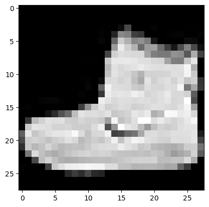
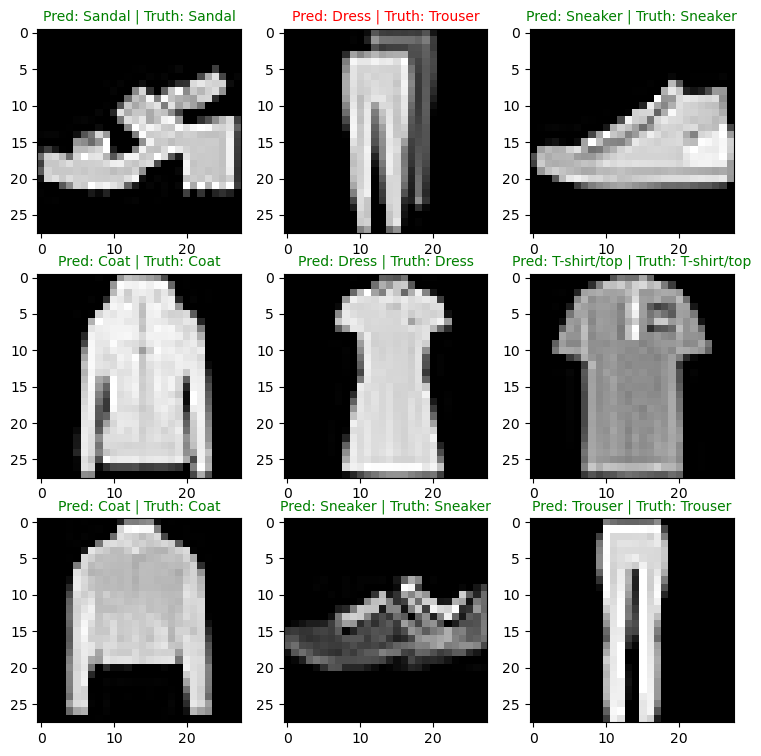
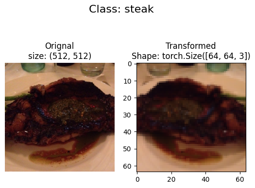
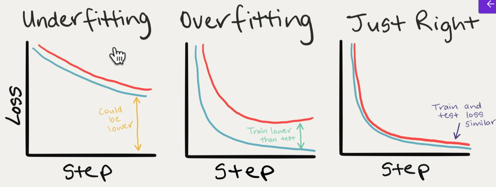

## PyTorch for Deep Learning Bootcamp
- Instructor:
  - Andrei Neagoie
  - Daniel Bourke

## Section 1: Introduction

### 1. PyTorch for Deep Learning

### 2. Course Welcome and What Is Deep Learning

### 3. Join Our Online Classroom!

### 4. Exercise: Meet Your Classmates + Instructor

### 5. Free Course Book + Code Resources + Asking Questions + Getting Help
- https://github.com/mrdbourke/pytorch-deep-learning

### 6. ZTM Resources

### 7. Machine Learning + Python Monthly Newsletters

## Section 2: PyTorch Fundamentals
- https://github.com/mrdbourke/pytorch-deep-learning/blob/main/video_notebooks/01_pytorch_workflow_video.ipynb

### 8. Why Use Machine Learning or Deep Learning

### 9. The Number 1 Rule of Machine Learning and What Is Deep Learning Good For
- What deep learning is good for
  - Problems with long lists of rules
  - Continually changing environments
  - Discovering insights within large collections of data
- What deep learning is not good for
  - When you need explainability
  - When the traditional approach is a better option
  - When errors are unacceptable
  - When you don't have much data

### 10. Machine Learning vs. Deep Learning
- ML
  - For Structured data
- DL
  - For unstructured data

### 11. Anatomy of Neural Networks
- Input layler
- Hidden layer
- Output layer
- Each layer is usually combination of linear and/or nonlinear functions

### 12. Different Types of Learning Paradigms
- Supervised learning
- Unsupervised & self-supervised learning
- Transfer learning

### 13. What Can Deep Learning Be Used For
- Recommendation
- Translation: seq2seq
- Speech recognition: seq2seq
- Computer vision: classification
- Natural Language Processing: classification/regression

### 14. What Is and Why PyTorch
- The most popular research deep learning framework
- Write fast DL code in Python
- Able to access many pre-built DL models
- Whole stack: preprocess data, model data, deploy model in application/cloud
 
### 15. What Are Tensors

### 16. What We Are Going To Cover With PyTorch

### 17. How To and How Not To Approach This Course
1. Code along
2. Explore and experiment
3. Visualize what you don't understand
4. Ask questions
5. Do the exercises
6. Share your work

### 18. Important Resources For This Course
- https://github.com/mrdbourke/pytorch-deep-learning
- https://github.com/mrdbourke/pytorch-deep-learning/discussions
- https://www.learnpytorch.io/

### 19. Getting Setup to Write PyTorch Code
```py
import torch
import pandas as pd
import numpy as np
import matplotlib.pyplot as plt
import os
os.environ["CUDA_VISIBLE_DEVICES"] = "0" 
print(torch.__version__)
print(f"CUDA Available: {torch.cuda.is_available()}")
if torch.cuda.is_available():
    print(f"Number of GPUs available: {torch.cuda.device_count()}")
    print(f"GPU Name: {torch.cuda.get_device_name(0)}")
```
### 20. Introduction to PyTorch Tensors
```py
#scalar - as lower
scalar = torch.tensor(7)
scalar# Scalar
scalar = torch.tensor(7)
print(scalar)
scalar.ndim # 0, not 1
scalar.item() # 7
scalar.shape # torch.Size([])
# Vector - as lower
vector = torch.tensor([7,7])
vector.ndim # 1, not 2
vector.shape # torch.Size([2])
# Matrix - as upper or Capital
MATRIX = torch.tensor ([[7,8],[9,10]])
MATRIX.ndim # 2
MATRIX[1] # prints tensor([9,10])
MATRIX[0] # prints tensor([7,8])
MATRIX.shape # torch.Size([2,2])
# Tensor - as upper or Capital
TENSOR = torch.tensor([[[1,2,3],[4,5,6],[7,8,9]]])
TENSOR.ndim # 3
TENSOR.shape # torch.Size([1,3,3])
```

### 21. Creating Random Tensors in PyTorch
- Why random tensors?
  - Many neural network iniitates from random numbers
```py
random_tensor = torch.rand(3,4)
random_tensor.shape
rt = torch.rand(size=(2,3,4))
print(rt.ndim, rt.shape) # 3 torch.Size([2, 3, 4])
```

### 22. Creating Tensors With Zeros and Ones in PyTorch
```py
RT = torch.ones(2,3) # all 1.0's
RT = torch.zeros(2,3) # all 0.0's
RT.dtype # torch.float32
```

### 23. Creating a Tensor Range and Tensors Like Other Tensors
```py
torch.range(0,3) # returns a tensor of 0,1,2,3 - 3 included
torch.arange(0,3) # returns a tensor of 0,1,2 - 3 not included
torch.arange(start=123, end=999, step=256) # tensor([123, 379, 635, 891])
one_to_ten = torch.range(0,10)
ten_zeros = torch.zeros_like(input=one_to_ten) # zeros_like find the size of tensors using the input
```
### 24. Dealing With Tensor Data Types
```py
float32_tensor = torch.tensor([3.,6,9], dtype=torch.float16)
print(float32_tensor.dtype) # torch.float16
float32_tensor = torch.tensor([3.,6,9], dtype=None,  # float32 or float16 or int32
                              device="cuda", # "cpu" or "cuda" or "tpu"
                              requires_grad=False # will track gradient or not
                              )
print(float32_tensor.dtype) # torch.float32
```
- TEnsor datatype is one of the 3 big errors that you will run into with PyTorch and DL
  1. Tensors are not right datatype
  2. Tensors not right shape
  3. Tensors not on the right device
- When CUDA is not working well with PyTorch:
```bash
sudo rmmod nvidia_uvm
sudo modprobe nvidia_uvm
```
- Type conversion:
```py
tmp_tensor = float32_tensor.type(torch.float16)
print(tmp_tensor) # tensor([3., 6., 9.], device='cuda:0', dtype=torch.float16)
```

### 25. Getting Tensor Attributes
- Datatype: x.dtype
- Shape: x.shape
- Device: x.device

### 26. Manipulating Tensors (Tensor Operations)
```py
tns = torch.tensor([1,2,3])
tns + 100 # 101,102,103
tns * 100 # 100,200,300
# == torch.mul(tns,100)
```

### 27. Matrix Multiplication (Part 1)
```py
%%time # measures wall time in the jupyter
A = torch.tensor([1,2,3])
A*A # tensor([1,4,9])
torch.matmul(A,A) # 14
```
- Use torch's matrix operation instead of loop-wise method
- **Note that when A is a vector (1dim), not matrix, torch.matmul() works as a dot product**

### 28. Matrix Multiplication (Part 2): The Two Main Rules of Matrix Multiplication
- `A@B` is a syntactic surgar of `torch.matmul(A,B)`

### 29. Matrix Multiplication (Part 3): Dealing With Tensor Shape Errors
- `torch.mm(A,B)` is a syntactic surgar of `torch.matmul(A,B)`
```py
A = torch.tensor([[1,2,3],[4,5,6]])
A*A # tensor([[ 1,  4,  9], [16, 25, 36]])
torch.mm(A,A.T) # tensor([[14, 32], [32, 77]])
```

### 30. Finding the Min Max Mean and Sum of Tensors (Tensor Aggregation)
- Tensor aggregation: min, max, sum, etc
```py
A.min() # tensor(1)
A.max() # tensor(6)
A.sum() # tensor(21)
#A.mean() # not working fot int
B = A.type(torch.float32) # conversion into float32
B.mean() # tensor(3.5000)
```

### 31. Finding The Positional Min and Max of Tensors
```py
A.argmin() # tensor(0)
A.argmax() # tensor(5)
```

### 32. Reshaping, Viewing and Stacking Tensors
- Reshaping: reshapes an input tensor to a defined shape
- View: returns a view of an input tensor of certain shape but keep the same as the original tensor
- Stacking: combines multiple tensors on top of each other (vstack) or a side (hstack)
- Squeeze: removes all '1' dimensions from a tensor
- Unsqueeze - adda a '1' dimension to a target tensor
- Permute: returns a view of the input with dimensions permuted (swapped) in a certain way
```py
x = torch.arange(1., 10.)
x, x.shape # (tensor([1., 2., 3., 4., 5., 6., 7., 8., 9.]), torch.Size([9]))
x_re = x.reshape(3,3)
x_re, x_re.shape
z = x.view(3,3)
z, z.shape # (tensor([[1., 2., 3.], [4., 5., 6.], [7., 8., 9.]]), torch.Size([3, 3]))
x_st = torch.stack([x,x], dim=0)
x_st # tensor([[1., 2., 3., 4., 5., 6., 7., 8., 9.],        [1., 2., 3., 4., 5., 6., 7., 8., 9.]])
x_st = torch.stack([x,x], dim=1)
x_st # tensor([[1., 1.],[2., 2.],[3., 3.],[4., 4.],[5., 5.],[6., 6.],[7., 7.],[8., 8.],[9., 9.]])
```

### 33. Squeezing, Unsqueezing and Permuting Tensors
- squeeze: [1,9] -> [9]
- unqueeze: [9] -> [1,9] or [9,1]
```py
y = x.squeeze()
z = x.unsqueeze(dim=0)
x, x.shape, y, y.shape, z, z.shape
#(tensor([1., 2., 3., 4., 5., 6., 7., 8., 9.]), torch.Size([9]), tensor([1., 2., 3., 4., 5., 6., 7., 8., 9.]), torch.Size([9]), tensor([[1., 2., 3., 4., 5., 6., 7., 8., 9.]]), torch.Size([1, 9]))
x = torch.rand(size=(3,4,2))
x_p = x.permute(2,0,1)
x.shape, x_p.shape # (torch.Size([3, 4, 2]), torch.Size([2, 3, 4]))
```

### 34. Selecting Data From Tensors (Indexing)
```py
x = torch.rand(size=(3,4,2))
x_p = x.permute(2,0,1)
#x.shape, x_p.shape
print(x[0,0,0], x_p[0,0,0]) # tensor(0.7831) tensor(0.7831)
x[0,0,0]=123.
print(x[0,0,0], x_p[0,0,0]) # tensor(123.) tensor(123.)
```
- x.permute() provides a reference copy
- ":" to select all target dimension

### 35. PyTorch Tensors and NumPy
```py
x = torch.arange(1,10).reshape(1,3,3)
print(x[0,2,2], x[0][2][2]) # tensor(9) tensor(9)
print(x[0,2,:]) # tensor([7, 8, 9])
```
- Numpy data into PyTorch tensor
  - `torch.from_numpy(ndarray)`
  - numpy default datatype is float64 and default conversion will produce torch.float64
- PyTorch tensor to numpy data
  - `torch.Tensor.numpy()`
```py
# np -> torch
array = np.arange(1.0,8.0)
tensor = torch.from_numpy(array)
array, tensor # (array([1., 2., 3., 4., 5., 6., 7.]), tensor([1., 2., 3., 4., 5., 6., 7.], dtype=torch.float64))
tensor32 = torch.from_numpy(array).type(torch.float32)
print(tensor32.dtype) # torch.float32
# Torch -> np
t = torch.ones(7)
np_t = t.numpy()
print(t.dtype, np_t.dtype) # torch.float32 float32
```
- Conversion uses deep copy

### 36. PyTorch Reproducibility (Taking the Random Out of Random)
- How neural network learns
  - random numbers -> tensor operations -> update random numbers to make them better representation of the data -> again -> again ...
  - random seed
```py
RANDOM_SEED=7
torch.manual_seed(RANDOM_SEED)
a = torch.rand(3,4)
torch.manual_seed(RANDOM_SEED)
b = torch.rand(3,4)
a == b # all Trues
```

### 37. Different Ways of Accessing a GPU in PyTorch
1. Google Colab
2. Own GPU
3. Cloud
- Check for GPU access with PyTorch:
```py
import torch
torch.cuda.is_available()
# device agnostic code
device = "cuda" if torch.cuda.is_available() else "cpu"
torch.cuda.device_count() # Number of GPUs
```

### 38. Setting up Device-Agnostic Code and Putting Tensors On and Off the GPU
- CPU -> CUDA
  - Works as a deep copy
```py
t_cpu = torch.tensor([1,2,3])
print(t_cpu, t_cpu.device)
t_gpu = t_cpu.to("cuda")
print(t_gpu, t_gpu.device)
```
- CUDA -> CPU
```py
tmp_cpu = t_gpu.cpu().numpy()
print(t_gpu, tmp_cpu)
```

### 39. PyTorch Fundamentals: Exercises and Extra-Curriculum
- https://github.com/mrdbourke/pytorch-deep-learning/blob/main/extras/exercises/00_pytorch_fundamentals_exercises.ipynb

## Section 3: PyTorch Workflow

### 40. Introduction and Where You Can Get Help

### 41. Getting Setup and What We Are Covering
- https://www.learnpytorch.io/01_pytorch_workflow/
- We are covering:
  1. Data (prepare and load)
  2. Build model
  3. Fitting the model to data
  4. Making predictions and evaluating a model (inference)
  5. Saving and loading a model
  6. Putting it all together
```py
import torch
from torch import nn
import matplotlib.pyplot as plt
torch.__version__
```

### 42. Creating a Simple Dataset Using the Linear Regression Formula
- Data can be almost anything
  - Excel spreadsheet
  - Images
  - Videos
  - Audio like songs or podcasts
  - DNA
  - Text
- ML is a game of two parts:
  1. Get data into a numerical representation
  2. Build a model to learn patterns in that numerical representation
```py
weight=0.7
bias = 0.3
start = 0
end = 1
step = 0.02
X = torch.arange(start,end,step).unsqueeze(dim=1)
y = weight *X + bias
X[:5], y[:5] # (tensor([[0.0000],[0.0200],[0.0400],[0.0600],[0.0800]]), tensor([[0.3000],[0.3140],[0.3280],[0.3420],[0.3560]]))
```

### 43. Splitting Our Data Into Training and Test Sets
- Three datasets
  1. Training set, 60-80%
  2. Validation set, 10-20%
  3. Test set, 10-20%
```py
train_split = int(0.8*len(X))
X_train,y_train = X[:train_split], y[:train_split]
X_test,y_test = X[train_split:], y[train_split:]
len(X_train), len(y_train), len(X_test), len(y_test) # 40 40 10 10 
```

### 44. Building a function to Visualize Our Data
```py
def plot_predictions(train_data=X_train, 
                     train_labels=y_train, 
                     test_data=X_test, 
                     test_labels=y_test,
                     predictions=None):
  plt.figure(figsize=(10,7))
  plt.scatter(train_data,train_labels, c="b",s=4,
              label="Trainig data")
  plt.scatter(test_data, test_labels, c="g", s=4,
              label="Testing data")
  if predictions is not None:
    plt.scatter(test_data, predictions, c="r", s=4,
                label="Predictions")
  plt.legend(prop={"size": 14});
```

### 45. Creating Our First PyTorch Model for Linear Regression
- Our model does:
  - Start with random values (weight and bias)
  - Look at training data and adjust the random values to better represent (or get closer to) the ideal values (the weight & bias values we used to create the data)
- How does it so?
  1. Gradient descent
  2. Backpropagation
```py
# Linear regression model
# weights and bias are random in the beginning but will be updated as learning progresses
from torch import nn
class LinearRegressionModel(nn.Module): # most of Pytorch classes are inherited from nn.Module
  def __init__(self):
    super().__init__()
    self.weights = \
    nn.Parameter(torch.randn(1,requires_grad=True,
                             dtype=torch.float))
    self.bias = nn.Parameter(torch.randn(1,requires_grad=True,
                                         dtype=torch.float))
  def forward(self,x:torch.Tensor)->torch.Tensor:
    return self.weights * x + self.bias
```

### 46. Breaking Down What's Happening in Our PyTorch Linear regression Model

### 47. Discussing Some of the Most Important PyTorch Model Building Classes
- PyTorch model building essentials
  - torch.nn: contains all of buildings for computational grpahs (a neural netowrk can be considered as a computational graph)
  - torch.nn.Parameter: what parameters should our model try and learn, often a PyTorch layer from torch.nn will set theses for us
  - torch.nn.Module: the base class for all neural network modules, if you subclass it, you should override forward()
  - torch.optim: this where the optimizers in PyTorch live, they will help with gradient descent
  - def forward(): all nn.Module subclasses require you to override forward(), this method defines what happens in the forward computation

### 48. Checking Out the Internals of Our PyTorch Model
```py
torch.manual_seed(42)
model_0 = LinearRegressionModel()
list(model_0.parameters()) # [Parameter containing: tensor([0.3367], requires_grad=True), Parameter containing: tensor([0.1288], requires_grad=True)]
```

### 49. Making Predictions With Our Random Model Using Inference Mode
- Prediction using `torch.inference_mode()`
  - No-gradient tracking
  - Faster
```py
with torch.inference_mode():
  y_preds = model_0(X_test)
y_preds
```
  - This is equivalent to `y_preds=model_0(X_test)` with gradient tracking

### 50. Training a Model Intuition (The Things We Need)
- Train model
  - The whole idea of training is for a model to move from some unknown parameters (these might be random) to some known parameters
  - Or in other words, from a poor representation of the data toa better representation of the data
  - One way to measure how poor or how wrong your models predictions are is to use a loss function
  * Loss function may also be called **cost function** or criterion in different areas
- Loss function: A function to measure how wrong your model's predictions are to the ideal outputs, lower is better
- Optimizer: Takes into account the loss of a model and adjusts the model's parameters (weight and bias)

### 51. Settinhyg Up an Optimizer and a Loss Function
- nn.L1Loss(): absolute differences
```py
loss_fn = nn.L1Loss()
optimizer = torch.optim.SGD(params=model_0.parameters(),lr=0.01)
```

### 52. PyTorch Training Loop Steps and Intuition
- Learning rate(lr): a hyper parameter that defines how big/small the optimizer changes the paramters with each step
- Things we need in a training loop
  0. Loop through the data
  1. Forward pass: this involves data moving through our model's `forward()` function to make predictions. Also called forward propagation
  2. Calculate the loss: compares forward pass predictions to ground truth labels  
  3. Optimizer zero grad
  4. Loss backward - move backwards through the network to calculate the gradients of each of the parameters of our model WRT the loss. Called as **backpropagation**
  6. Optimizer step: use the optimizer to adjust our model's parameters to try to improve the loss

### 53. Writing Code for a PyTorch Training Loop
```py
epochs = 10
# 0. Loop through the data
for epoch in range(epochs):
  model_0.train()
  # 1. Forward pass
  y_pred = model_0(X_train)
  # 2. Loss calculation
  loss = loss_fn(y_pred,y_train)
  # 3. Optimizer
  optimizer.zero_grad()
  # 4. Perform backpropagation
  loss.backward()
  # 5. STep the optimizer
  optimizer.step()
  #model_0.eval()
```

### 54. Reviewing the Steps in a Training Loop Step by Step

### 55. Running Our Training Loop Epoch by Epoch and Seeing What Happens

### 56. Writing Testing Loop Code and Discussing What's Happening Step by Step
```py
epochs = 10
# 0. Loop through the data
for epoch in range(epochs):
  model_0.train()
  # 1. Forward pass
  y_pred = model_0(X_train)
  # 2. Loss calculation
  loss = loss_fn(y_pred,y_train)
  print(f"Loss: {loss}")
  # 3. Optimizer
  optimizer.zero_grad()
  # 4. Perform backpropagation
  loss.backward()
  # 5. Step the optimizer
  optimizer.step()
  ## Testing
  model_0.eval() # turns off different settings in th emodel not needed for evaluation/testing (dropout/batchnorm layers). model_0.train() will activate them again
  with torch.inference_mode(): # with torch.no_grad(): # alternative but in old code
    test_pred = model_0(X_test) 
    test_loss = loss_fn(test_pred, y_test)
  if epoch%10 ==0:    
    print(f"Epoch: {epoch} | Test: {loss} | Test loss: {test_loss}")
  print(model_0.state_dict())
```

### 57. Reviewing What Happens in a Testing Loop Step by Step

### 58. Writing Code to Save a PyTorch Model
- Saving a model in PyTorch
  1. `torch.save()` allows you to save PyTorch object in Python's pickle format
  2. `torch.load()` allows you to load a saved PyTorch object
  3. `torch.nn.MOdule.load_state_dict()` allows you to load a model's saved state dictionary
```py
from pathlib import Path
MODEL_PATH = Path("models")
MODEL_PATH.mkdir(parents=True, exist_ok=True)
MODEL_NAME = '01_pytorch_workflow_model_0.pth' # extension of pth for PyTorch object
MODEL_SAVE_PATH = MODEL_PATH / MODEL_NAME
MODEL_SAVE_PATH
print(f"Saving model to: {MODEL_SAVE_PATH}")
torch.save(obj=model_0.state_dict(), f=MODEL_SAVE_PATH) # Saving model to: models/01_pytorch_workflow_model_0.pth
```
### 59. Writing Code to Load a PyTorch Model
- To load ina saved state_dict we have to instantiate a new instance of our model class
```py
loaded_model_0 = LinearRegressionModel()
loaded_model_0.load_state_dict(torch.load(f=MODEL_SAVE_PATH))
loaded_model_0.state_dict() # OrderedDict([('weights', tensor([0.6913])), ('bias', tensor([0.2958]))])
```

### 60. Setting Up to Practice Everything We Have Done Using Device Agnostic code
```py
import torch
from torch import nn
import matplotlib.pyplot as plt
import numpy as np
print(torch.__version__)
device = "cuda" if torch.cuda.is_available() else "cpu"
print(f"Using device= {device}")
```

### 61. Putting Everything Together (Part 1): Data
```py
weight = 0.7
bias = 0.3
start = 0
end = 1
step = 0.02
X = torch.arange(start,end,step).unsqueeze(dim=1)
y = weight* X  + bias
train_split = int(0.8*len(X))
X_train,y_train = X[:train_split], y[:train_split]
X_test,y_test = X[train_split:], y[train_split:]
print(len(X_train), len(y_train), len(X_test), len(y_test))
#
plot_predictions(X_train, y_train, X_test, y_test)
```

### 62. Putting Everything Together (Part 2): Building a Model
```py
class LinearRegressionModelV2(nn.Module):
  def __init__(self):
    super().__init__()
    # Use nn.Linear() for creating the model parameters
    self.linear_layer = nn.Linear(in_features=1, out_features=1)
  def forward(self,x: torch.Tensor) -> torch.Tensor:
    return self.linear_layer(x)
torch.manual_seed(42)
model_1 = LinearRegressionModelV2()
model_1, model_1.state_dict() # (LinearRegressionModelV2((linear_layer): Linear(in_features=1, out_features=1, bias=True) ), OrderedDict([('linear_layer.weight',tensor([[0.7645]])),('linear_layer.bias', tensor([0.8300]))]))
```

### 63. Putting Everything Together (Part 3): Training a Model
```py
next(model_1.parameters()).device # cpu
model_1.to(device)
next(model_1.parameters()).device # device(type='cuda', index=0)
loss_fn = nn.L1Loss()
optimizer = torch.optim.SGD(params=model_1.parameters(), lr=0.01)
torch.manual_seed(42)
epochs=200
# put data on the device
X_train = X_train.to(device)
X_test = X_test.to(device)
y_train = y_train.to(device)
y_test = y_test.to(device)
for epoch in range(epochs):
  model_1.train()
  y_pred = model_1(X_train) # 1. Forward pass
  loss = loss_fn(y_pred,y_train) # 2. Calculate the loss
  optimizer.zero_grad() # 3. Optimizer zero grad
  loss.backward() # 4. Backpropagation
  optimizer.step() # 5. Optimizer step
  ## Testing
  model_1.eval()
  with torch.inference_mode():
    test_pred = model_1(X_test)
    test_loss = loss_fn(test_pred, y_test)
  if epoch%10 == 0:
    print(f"Epoch: {epoch} | Loss: {loss} | Test loss: {test_loss}")
```

### 64. Putting Everything Together (Part 4): Making Predictions With a Trained Model
```py
model_1.eval()
with torch.inference_mode():
  y_preds = model_1(X_test)
plot_predictions(predictions=y_preds.cpu())
```

### 65. Putting Everything Together (Part 5): Saving and Loading a Trained Model
```py
from pathlib import Path
MODEL_PATH = Path("models")
MODEL_PATH.mkdir(parents=True, exist_ok=True)
MODEL_NAME="01_pytorch_workflow_model_1.pth"
MODEL_SAVE_PATH = MODEL_PATH / MODEL_NAME
print(f"Saving model to: {MODEL_SAVE_PATH}")
torch.save(obj=model_1.state_dict(), f=MODEL_SAVE_PATH)
# Load a PyTorch
loaded_model_1 = LinearRegressionModelV2()
loaded_model_1.load_state_dict(torch.load(MODEL_SAVE_PATH))
loaded_model_1.to(device)
```

### 66. Exercise: Imposter Syndrome

### 67. PyTorch Workflow: Exercises and Extra-Curriculum
- https://www.learnpytorch.io/01_pytorch_workflow/#exercises

## Section 4: PyTorch Neural Network Classification

### 68. Introduction to Machine Learning Classification With PyTorch
- Binary classification: 
  - Spam or not
- Multiclass classification
  - Is this a photo of sushi, steak or pizza?
- Multilabel classification
  - What tags should this article have?
  - Many tags
- What we're going to cover
  - Architecture of a neural entwork classification model
  - Input shapes and output shapes of a classification model (features and labels)
  - Creating custom data to view, fit on and predict on
  - Steps in modeling
    - Creating a model, setting a loss function and optimizer, creating a training loop, evaluating a model
  - Saving and loading models
  - Harnessing the power of non-linearity
  - Different classification evaluation methods
  
### 69. Classification Problem Example: Input and Output Shapes

### 70. Typical Architecture of a Classification Neural Network (Overview)
- https://www.learnpytorch.io/02_pytorch_classification/
- https://docs.pytorch.org/docs/stable/nn.html

### 71. Making a Toy Classification Dataset
- https://github.com/mrdbourke/pytorch-deep-learning/blob/main/video_notebooks/02_pytorch_classification_video.ipynb
```py
import sklearn
from sklearn.datasets import make_circles
# make 1000 samples
n_samples = 1000
# create circles - draws 2 circles as inner/outer cicles
X,y=make_circles(n_samples, noise=0.03, random_state=42)
#print(f"X={X[:5]} y={y[:5]}") 
import pandas as pd
circles = pd.DataFrame({"X1":X[:,0], "X2":X[:,1], "label":y})
circles.head(3)
```


### 72. Turning Our Data into Tensors and Making a Training and Test Split
```py
import torch
torch.__version__
X = torch.from_numpy(X).type(torch.float) # float64 -> float32
y = torch.from_numpy(y).type(torch.float)
print(X.shape,y.shape)
from sklearn.model_selection import train_test_split
X_train,X_test,y_train,y_test= train_test_split(X,y,test_size=0.2, random_state=42)
```

### 73. Laying Out Steps for Modelling and Setting Up Device-Agnostic Code
- Building a model
  1. Setup device agonistic code so our code will run on an accelerator (GPU) if there is one
  2. Construct a model (by subclassing nn.Module)
  3. Define a loss function and optimizer
  4. Create a training and test loop
```py
import torch
from torch import nn
device = "cuda" if torch.cuda.is_available() else "cpu"
```

### 74. Coding a Small Neural Network to Handle Our Classification Data
```py
# 1. Construct a model that subclasses nn.Module
class CircleModelV0(nn.Module):
  def __init__(self):
    super().__init__()
    # 2. Create 2nn.Linear layers
    self.layer_1 = nn.Linear(in_features=2,out_features=5)
    self.layer_2 = nn.Linear(in_features=5,out_features=1)
  # 3. Define a forward()
  def forward(self,x):
    return self.layer_2(self.layer_1(x)) # x-> layer_1 -> layer_2
# 4. Instantiate an instance
model_0 = CircleModelV0().to(device)
model_0
```

### 75. Making Our Neural Network Visual
- In binary classification, any random pickup gives you 50% opportunity

### 76. Recreating and Exploring the Insides of Our Model Using nn.Sequential
- Using nn.Sequential() can make NN in an easy way but having a subclass is recommended
```py
model_0 = nn.Sequential(
  nn.Linear(in_features=2, out_features=5), 
  nn.Linear(in_features=5,out_features=1)).to(device)
```

### 77. Loss Function Optimizer and Evaluation Function for Our Classification Network
- Binary cross entropy: a loss function for binary classification, measuring the difference b/w the model's predicted probability and the actual true label. It penalizes confident wrong predictions heavily
- Logit: the raw, unnormalized scores output by the final layer of a neural network before any activation function is applied
  - Ex) Binary classification yields results as LOGIT, which would be a fractional number. They are converted into probability by activation function. Rounding those converted probability will become 0 or 1
```py
loss_fn = nn.BCELoss() # requires inputs to have gone through the sigmoid activation function prior to input to BCELoss
loss_fn = nn.BCEWithLogitsLoss() # sigmod activation funciton
#nn.Sequential(
#  nn.Sigmoid(),
#  nn.BCELoss()
#)
# why sigmoid in BC? for the numerical stability
optimizer = torch.optim.SGD(params=model_0.parameters(), lr=0.1)
def accuracy_fn(y_true, y_pred):
  correct = torch.eq(y_true, y_pred).sum().item()
  acc = (correct/len(y_pred))*100
  return acc
```  

### 78. Going from Model Logits to Prediction Probabilities to Prediction Labels
1. Forward pass
2. Calculate the loss
3. Optimizer zero grad
4. Loss backward (backpropagation)
5. Optimizer step (gradient descent)
* Our model outputs are raw **logits**. We can convert these logits into **prediction probabilities** by passing them to some activation function (sigmoid for BC and softmax for multiclass classification)
```py
model_0.eval()
with torch.inference_mode():
  y_logits = model_0(X_test.to(device))
y_logits[:5] # Raw logits
y_pred_probs = torch.sigmoid(y_logits) # Raw logits -> probability
y_pred_labels = torch.round(y_pred_probs) # probability -> 0 or 1
```

### 79. Coding a Training and Testing Optimization Loop for Our Classification Model
- Raw logits -> prediction probabilities -> prediction labels
```py
#torch.manual_seed(42)
#torch.cuda.manual_seed(42)
epochs=100
X_train,y_train = X_train.to(device), y_train.to(device)
X_test.y_test = X_test.to(device),y_test.to(device)
for epoch in range(epochs):
  # Training
  model_0.train()
  # 1. Forward pass
  y_logits = model_0(X_train).squeeze()
  y_pred = torch.round(torch.sigmoid(y_logits))
  # 2. Loss/Accuracy
  loss = loss_fn(y_logits,y_train) # nn.BCEWithLogitsLoss expects RAW logits
  acc = accuracy_fn(y_true=y_train, y_pred=y_pred)
  # 3. optimizer zero grad
  optimizer.zero_grad()
  # 4. Backpropagation
  loss.backward()
  # 5. Optimizer step(gradient descent)
  optimizer.step()
  ## Testing
  model_0.eval()
  with torch.inference_mode():
    test_logits = model_0(X_test).squeeze()
    test_pred = torch.round(torch.sigmoid(test_logits))
    test_loss = loss_fn(test_logits,y_test)
    test_acc = accuracy_fn(y_true=y_test, y_pred=test_pred)
  if epoch%10 == 0:
    print(f"Epoch: {epoch} | Loss:  {loss: .5f}, Acc: {acc: .2f} | Test los : {test_loss: .5f}, Test_acc: {test_acc: .2f}")
```

### 80. Writing Code to Download a Helper Function to Visualize Our Models Predictions
- Looks like the aove model is not learning anything ...
- Using helper function to visualize
```py
import requests
from pathlib import Path
# Download helper functions from Learn PyTorch repo (if it's not already downloaded)
if Path("helper_functions.py").is_file():
  print("helper_functions.py already exists, skipping download")
else:
  print("Downloading helper_functions.py")
  request = requests.get("https://raw.githubusercontent.com/mrdbourke/pytorch-deep-learning/main/helper_functions.py")
  with open("helper_functions.py", "wb") as f:
    f.write(request.content)
from helper_functions import plot_predictions, plot_decision_boundary
```
- The current model cannot handle the complexity

### 81. Discussing Options to Improve a Model
- Improving a model (from a model perspective)
  - Add more layers: more chances to learn patterns
  - Add more hidden units: from 5 hidden units to 10 hidden units
  - For for longer (more epochs)
  - Changing the activation functions
  - Change the learning rate: exploding gradient problem
  - Change the loss function

### 82. Creating a New Model with More Layers and Hidden Units
- Increase hidden units from 5 to 10
- Increase the number of layers from 2 to 3
- Increase the number of epochs from 100 to 1000
```py
class CircleModelV1(nn.Module):
  def __init__(self):
    super().__init__()
    self.layer_1 = nn.Linear(in_features=2,out_features=10)
    self.layer_2 = nn.Linear(in_features=10,out_features=10)
    self.layer_3 = nn.Linear(in_features=10, out_features=1)
  def forward(self, x):
    #z = self.layer_1(x)
    #z = self.layer_2(z)
    #z = self.layer_3(z)
    return self.layer_3(self.layer_2(self.layer_1(x))) # faster than running each layer
model_1 = CircleModelV1().to(device)  
```

### 83. Writing Training and Testing Code to See if Our Upgraded Model Performs Better
```py
loss_fn = nn.BCEWithLogitsLoss() # sigmod activation funciton
optimizer = torch.optim.SGD(params=model_1.parameters(), lr=0.1)
def accuracy_fn(y_true, y_pred):
  correct = torch.eq(y_true, y_pred).sum().item()
  acc = (correct/len(y_pred))*100
  return acc
#torch.manual_seed(42)
#torch.cuda.manual_seed(42)
epochs=1000
X_train,y_train = X_train.to(device), y_train.to(device)
X_test.y_test = X_test.to(device),y_test.to(device)
for epoch in range(epochs):
  # Training
  model_1.train()
  # 1. Forward pass
  y_logits = model_1(X_train).squeeze()
  y_pred = torch.round(torch.sigmoid(y_logits))
  # 2. Loss/Accuracy
  loss = loss_fn(y_logits,y_train) # nn.BCEWithLogitsLoss expects RAW logits
  acc = accuracy_fn(y_true=y_train, y_pred=y_pred)
  # 3. optimizer zero grad
  optimizer.zero_grad()
  # 4. Backpropagation
  loss.backward()
  # 5. Optimizer step(gradient descent)
  optimizer.step()
  ## Testing
  model_1.eval()
  with torch.inference_mode():
    test_logits = model_1(X_test).squeeze()
    test_pred = torch.round(torch.sigmoid(test_logits))
    test_loss = loss_fn(test_logits,y_test)
    test_acc = accuracy_fn(y_true=y_test, y_pred=test_pred)
  if epoch%100 == 0:
    print(f"Epoch: {epoch} | Loss:  {loss: .5f}, Acc: {acc: .2f} | Test loss : {test_loss: .5f}, Test_acc: {test_acc: .2f}")  
```
- Still half and half loss

### 84. Creating a Straight Line Dataset to See if Our Model is Learning Anything

### 85. Building and Training a Model to Fit on Straight Line Data
- Applying BC model into a regression data

### 86. Evaluating Our Models Predictions on Straight Line Data

### 87. Introducing the Missing Piece for Our Classification Model Non-Linearity
- Missing piece: non-linearity
 
### 88. Building Our First Neural Network with Non-Linearity
```py
# build a model with non-linear activation function
from torch import nn
class CircleModelV2(nn.Module):
  def __init__(self):
    super().__init__()
    self.layer_1 = nn.Linear(in_features=2,out_features=10)
    self.layer_2 = nn.Linear(in_features=10,out_features=10)
    self.layer_3 = nn.Linear(in_features=10,out_features=1)
    self.relu = nn.ReLU()
  def forward(self,x):
    return self.layer_3(self.relu(self.layer_2(self.relu(self.layer_1(x)))))
```

### 89. Writing Training and Testing Code for Our First Non-Linear Model
- Artificial neural network are a large combination of linear and non-linear functions which are potentially able to find patterns in data
- https://playground.tensorflow.org
```py
loss_fn = nn.BCEWithLogitsLoss() # sigmod activation funciton
optimizer = torch.optim.SGD(params=model_3.parameters(), lr=0.1)
epochs=1000
X_train,y_train = X_train.to(device), y_train.to(device)
X_test.y_test = X_test.to(device),y_test.to(device)
for epoch in range(epochs):
  # Training
  model_3.train()
  # 1. Forward pass
  y_logits = model_3(X_train).squeeze()
  y_pred = torch.round(torch.sigmoid(y_logits))
  # 2. Loss/Accuracy
  loss = loss_fn(y_logits,y_train) # nn.BCEWithLogitsLoss expects RAW logits
  acc = accuracy_fn(y_true=y_train, y_pred=y_pred)
  # 3. optimizer zero grad
  optimizer.zero_grad()
  # 4. Backpropagation
  loss.backward()
  # 5. Optimizer step(gradient descent)
  optimizer.step()
  ## Testing
  model_3.eval()
  with torch.inference_mode():
    test_logits = model_3(X_test).squeeze()
    test_pred = torch.round(torch.sigmoid(test_logits))
    test_loss = loss_fn(test_logits,y_test)
    test_acc = accuracy_fn(y_true=y_test, y_pred=test_pred)
  if epoch%100 == 0:
    print(f"Epoch: {epoch} | Loss:  {loss: .5f}, Acc: {acc: .2f} | Test loss : {test_loss: .5f}, Test_acc: {test_acc: .2f}")
```

### 90. Making Predictions with and Evaluating Our First Non-Linear Model
- How to improve model_3?
  - More layers
  - More hidden units

### 91. Replicating Non-Linear Activation Functions with Pure PyTorch
```py
A = torch.arange(-10.,10,1)
plt.plot(torch.relu(A))
```

```py
# manual implementation of relu
def relu(x: torch.Tensor) -> torch.Tensor:
  return torch.maximum(torch.tensor(0), x) # inputs must be tensors
relu(A)
```

### 92. Putting It All Together (Part 1): Building a Multiclass Dataset
```py
import torch
from torch import nn
device = "cpu"
import matplotlib.pyplot as plt
from sklearn.datasets import make_blobs
from sklearn.model_selection import train_test_split
NUM_CLASSES  = 4
NUM_FEATURES = 2
RANDOM_SEED  = 42
X_blob, y_blob = make_blobs(n_samples=1000, n_features=NUM_FEATURES,
                            centers=NUM_CLASSES, cluster_std=1.5,
                            random_state=RANDOM_SEED)
X_blob = torch.from_numpy(X_blob).type(torch.float)
y_blob = torch.from_numpy(y_blob).type(torch.LongTensor) # multiclass classification
X_blob_train, X_blob_test, y_blob_train, y_blob_test = \
train_test_split(X_blob,y_blob,test_size=0.2, random_state=RANDOM_SEED)
plt.scatter(X_blob[:,0], X_blob[:,1], c=y_blob)
```


### 93. Creating a Multi-Class Classification Model with PyTorch
```py
class BlobModel(nn.Module):
  def __init__(self, input_features, out_features, hidden_units=8):
    super().__init__()
    self.linear_layer_stack = nn.Sequential(
      nn.Linear(in_features=input_features, out_features=hidden_units),
      nn.ReLU(),
      nn.Linear(in_features=hidden_units, out_features=hidden_units),
      nn.ReLU(),
      nn.Linear(in_features=hidden_units, out_features=out_features),
    )
  def forward(self,x):
    return self.linear_layer_stack(x)
model_4 = BlobModel(input_features=2,out_features=4,hidden_units=8).to(device)
```

### 94. Setting Up a Loss Function and Optimizer for Our Multi-Class Model
```py
# loss function for multi-class classification
loss_fn = nn.CrossEntropyLoss()
optimizer = torch.optim.SGD(params=model_4.parameters(), lr=0.1)
def accuracy_fn(y_true, y_pred):
  correct = torch.eq(y_true, y_pred).sum().item()
  acc = (correct/len(y_pred))*100
  return acc
```

### 95. Logits to Prediction Probabilities to Prediction Labels with a Multi-Class Model
```py
model_4.eval()
with torch.inference_mode():
  y_logits = model_4(X_blob_test.to(device))
# logit -> probability
# In multiclass, softmax instead of sigmoid
## each array contains 4 fractional numbers, proabilities for each class
y_pred_probs = torch.softmax(y_logits,dim=1)
# convert probability into prediction labels
y_preds = torch.argmax(y_pred_probs, dim=1)
```

### 96. Training a Multi-Class Classification Model and Troubleshooting Code on the Fly
```py
epochs=1000
X_train,y_train = X_blob_train.to(device), y_blob_train.to(device)
X_test, y_test = X_blob_test.to(device),y_blob_test.to(device)
for epoch in range(epochs):
  # Training
  model_4.train()
  # 1. Forward pass
  y_logits = model_4(X_train)
  y_pred = torch.softmax(y_logits,dim=1).argmax(dim=1)
  # 2. Loss/Accuracy
  loss = loss_fn(y_logits,y_train) # 
  acc = accuracy_fn(y_true=y_train, y_pred=y_pred)
  # 3. optimizer zero grad
  optimizer.zero_grad()
  # 4. Backpropagation
  loss.backward()
  # 5. Optimizer step(gradient descent)
  optimizer.step()
  ## Testing
  model_4.eval()
  with torch.inference_mode():
    test_logits = model_4(X_test)
    test_pred = torch.softmax(test_logits,dim=1).argmax(dim=1)
    test_loss = loss_fn(test_logits,y_test)
    test_acc = accuracy_fn(y_true=y_test, y_pred=test_pred)
  if epoch%100 == 0:
    print(f"Epoch: {epoch} | Loss:  {loss: .5f}, \
          Acc: {acc: .2f} | Test loss : {test_loss: .5f}, \
          Test_acc: {test_acc: .2f}")
```

### 97. Making Predictions with and Evaluating Our Multi-Class Classification Model
```py
model_4.eval()
with torch.inference_mode():
  y_logits = model_4(X_test)
y_preds = torch.softmax(y_logits,dim=1).argmax(dim=1)
```
- With those data, models without ReLU still works OK as data are distributed quite linearly

### 98. Discussing a Few More Classification Metrics
- Accuracy: out of 100 samples, how many does our model get right?
- Precision:
- Recall:
- F1-score:
- Confusion matrix
- Classification report
- https://towardsdatascience.com/beyond-accuracy-other-classification-metrics-you-should-know-in-machine-learning-ea671be83bb7/
```py
!pip install torchmetrics
from torchmetrics import Accuracy
# Setup metric
torchmetric_accuracy = Accuracy(task="multiclass",num_classes=4).to(device)
# Calculuate accuracy
torchmetric_accuracy(y_preds, y_test)
```

### 99. PyTorch Classification: Exercises and Extra-Curriculum
- https://www.learnpytorch.io/02_pytorch_classification/#exercises

## Section 5: PyTorch Computer Vision

### 100. What Is a Computer Vision Problem and What We Are Going to Cover
- What we're going to cover
  - Getting a vision dataset to work with using torchvision.datasets
  - Architecture of a convolutional neural network (CNN) with PyTorch
  - An end-to-end multi-class image classification problem
  - Steps in modeling with CNNs in PyTorch
    - Creating a CNN model with PyTorch
    - Picking a loss and optimizer
    - Training a PyTorch computer vision model
    - Evaluating model

### 101. Computer Vision Input and Output Shapes
- 24-bit RGB images
- Input and output shapes
  - [batch_size, height, width, color channels] (NHWC), coloar channels last
    - In many image types
  - [batch_size, color channels, height, width] (NCHW), coloar channels first
    - In PyTorch. Flatten() will assume that the first column is the batch size
  
### 102. What Is a Convolutional Neural Network (CNN)
- Good at recognizing patterns in image

### 103. Discussing and Importing the Base Computer Vision Libraries in PyTorch
- https://github.com/mrdbourke/pytorch-deep-learning/blob/main/video_notebooks/03_pytorch_computer_vision_video.ipynb
- Computer vision libraries in PyTorch
  - torchvision: base domain library
  - torchvision.datasets: get datasets and data loging functions
  - torchvision.models: get pretrained computer vision models
  - torchvision.transforms: functions for manipulating vision data to be suitable for use with ML models
  - torch.utils.data.Dataset: Base dataset class
  - torch.utils.data.DataLoader: Creates a Python iterable over a dataset
```py
import torch
from torch import nn
import torchvision
from torchvision import datasets
from torchvision import transforms
from torchvision.transforms import ToTensor
import matplotlib.pyplot as plt
print(torch.__version__)
print(torchvision.__version__)
```

### 104. Getting a Computer Vision Dataset and Checking Out Its- Input and Output Shapes
```py
# FashionMNIST: greyscale images of clothing
# Available from github and also from torchvision dataset
from torchvision import datasets
train_data = datasets.FashionMNIST(
  root = "data", # path
  train = True,  # including training data
  download=True,
  transform=torchvision.transforms.ToTensor(),
  target_transform=None # labels/target transforms
)
test_data = datasets.FashionMNIST(
  root = "data", # path
  train = False,  # including training data
  download=True,
  transform=torchvision.transforms.ToTensor(),
  target_transform=None # labels/target transforms
)
```
- Downloading 26MB at data/FashionMNIST
  - They are index and gz files, not images files
```py
class_names = train_data.classes
print(class_names) # ['T-shirt/top', 'Trouser', 'Pullover', 'Dress', 'Coat', 'Sandal', 'Shirt', 'Sneaker', 'Bag', 'Ankle boot']
class_to_idx = train_data.class_to_idx
print(class_to_idx) # {'T-shirt/top': 0, 'Trouser': 1, 'Pullover': 2, 'Dress': 3, 'Coat': 4, 'Sandal': 5, 'Shirt': 6, 'Sneaker': 7, 'Bag': 8, 'Ankle boot': 9}
image, label = train_data[0]
print(f"Image shape: {image.shape} -> [color_channels, height, width]") #Image shape: torch.Size([1, 28, 28]) -> [color_channels, height, width]
```

### 105. Visualizing Random Samples of Data
```py
import matplotlib.pyplot as plt
image,label=train_data[0]
print(f"Image shape: {image.shape}")
plt.imshow(image.squeeze(),cmap="gray")
```


### 106. DataLoader Overview Understanding Mini-Batches
- Why DataLoader?
  - Turning data into batches in the size of 32 images
  - More opportunities for the model to update gradients
  - Computationally efficient regarding loading images into memory

### 107. Turning Our Datasets Into DataLoaders
```py
from torch.utils.data import DataLoader
BATCH_SIZE = 32
train_dataloader = DataLoader(dataset=train_data,
                              batch_size=BATCH_SIZE,
                              shuffle=True)
test_dataloader = DataLoader(dataset=test_data,
                              batch_size=BATCH_SIZE,
                              shuffle=False)
train_features_batch, train_labels_batch = next(iter(train_dataloader))
print(train_features_batch.shape, train_labels_batch.shape) # torch.Size([32, 1, 28, 28]) torch.Size([32])
```

### 108. Model 0: Creating a Baseline Model with Two Linear Layers
- How Flatten() works:
```py
flatten_model = nn.Flatten()
x = train_features_batch[0]
x.shape # torch.Size([1, 28, 28])
# flatten the sample
output = flatten_model(x)
print(f"Shape before flattening: {x.shape}") # torch.Size([1, 28, 28])
print(f"Shape after flattening: {output.shape}") # torch.Size([1, 784])
```
  - Assumes that the first column of the tensor is the batch size
```py
from torch import nn
class FashionMNISTModelV0(nn.Module):
  def __init__(self,
               input_shape: int,
               hidden_units: int,
               output_shape: int):
    super().__init__()
    self.layer_stack = nn.Sequential(
      nn.Flatten(),
      nn.Linear(in_features=input_shape,
                out_features=hidden_units),
      nn.Linear(in_features=hidden_units,
                out_features=output_shape)      
    )
  def forward(self,x):
    return self.layer_stack(x)
model_0 = FashionMNISTModelV0(
  input_shape=784,
  hidden_units=10,
  output_shape=len(class_names)
  ).to("cpu")
```

### 109. Creating a Loss Function: an Optimizer for Model 0
```py
# from https://github.com/mrdbourke/pytorch-deep-learning/blob/main/helper_functions.py
def accuracy_fn(y_true, y_pred):
    correct = torch.eq(y_true, y_pred).sum().item()
    acc = (correct / len(y_pred)) * 100
    return acc
# Loss and optimizer
loss_fn = nn.CrossEntropyLoss()
optimizer = torch.optim.SGD(params=model_0.parameters(),lr=0.1)
```

### 110. Creating a Function to Time Our Modelling Code
- What we want to track:
  1. Model's performance (loss and accuracy values etc)
  2. How fast it runs
```py
from timeit import default_timer as timer
def print_train_time(start: float,end: float,
                     device: torch.device =None):
  total_time = end - start
  print(f"Train time on {device}: {total_time:.3f} seconds")
  return total_time
```

### 111. Writing Training and Testing Loops for Our Batched Data
- How tqdm package works:
```bash
>>> from tqdm.auto import tqdm
>>> for i in range(3):
...   print(i)
... 
0
1
2
>>> for i in tqdm(range(3)):
...   print(i)
... 
  0%|                                                               | 0/3 [00:00<?, ?it/s]0
1
2
100%|████████████████████████████████████████████████████| 3/3 [00:00<00:00, 38245.93it/s]
```
```py
from tqdm.auto import tqdm
torch.manual_seed(123)
train_time_start_on_cpu = timer()
epochs=3
for epoch in tqdm(range(epochs)):
  print(f"Epoch: {epoch}\n-----")
  train_loss = 0
  for batch, (X, y) in enumerate(train_dataloader):
    model_0.train()
    y_pred = model_0(X)
    loss = loss_fn(y_pred,y)
    train_loss += loss 
    optimizer.zero_grad()
    loss.backward()
    optimizer.step()
    if batch % 400 == 0:
      print(f"Looked at {batch * len(X)}/{len(train_dataloader)} samples.")
  # Divide total train loss by length of train dataloader
  train_loss /= len(train_dataloader)
  test_loss, test_acc = 0,0
  model_0.eval()
  with torch.inference_mode():
    for X_test, y_test in test_dataloader:
      test_pred = model_0(X_test)
      test_loss += loss_fn(test_pred,y_test)
      test_acc += accuracy_fn(y_true=y_test, y_pred=test_pred.argmax(dim=1))
    # avg test_loss
    test_loss /= len(test_dataloader)      
    test_acc /= len(test_dataloader)
  print(f"\nTrain loss: {train_loss:.4f} | Test loss: {test_loss:.4f}, Test acc: {test_acc:.4f}")
train_time_end_on_cpu = timer()
total_train_time_mode_0 = print_train_time(start=train_time_start_on_cpu, 
                                           end=train_time_end_on_cpu, 
                                           device=str(next(model_0.parameters())))
```
- Q: why logits are not applied with activation functions like sigmoid() or softmax()? like BC or multi-class classification

### 112. Writing an Evaluation Function to Get Our Models Results
```py
torch.manual_seed(42)
def eval_model(model: torch.nn.Module,
               data_loader:torch.utils.data.dataloader,
               loss_fn: torch.nn.Module,
               accuracy_fn):
  loss,acc = 0,0
  model.eval()
  with torch.inference_mode():
    for X,y in data_loader:
      X,y = X.to(device), y.to(device)
      y_pred = model(X)
      loss += loss_fn(y_pred,y)
      acc += accuracy_fn(y_true=y,
                         y_pred=y_pred.argmax(dim=1))
    loss /= len(data_loader)
    acc /= len(data_loader)
  return {"model_name": model.__class__.__name__,
          "model_loss": loss.item(),
          "model_acc":acc}
model_0_results = eval_model(model=model_0,
                             data_loader=test_dataloader,
                             loss_fn = loss_fn,
                             accuracy_fn = accuracy_fn)
model_0_results #{'model_name': 'FashionMNISTModelV0', 'model_loss': 0.48247453570365906, 'model_acc': 82.82747603833866}
```

### 113. Setup Device-Agnostic Code for Running Experiments on the GPU

### 114. Model 1: Creating a Model with Non-Linear Functions
```py
class FashionMNISTModelV1(nn.Module):
  def __init__(self, 
               input_shape: int,
               hidden_units: int,
               output_shape: int):
    super().__init__()
    self.layer_stack = nn.Sequential(
      nn.Flatten(),
      nn.Linear(in_features=input_shape,out_features=hidden_units),
      nn.ReLU(),
      nn.Linear(in_features=hidden_units,out_features=output_shape),
      nn.ReLU()
    )
  def forward(self,x:torch.Tensor):
    return self.layer_stack(x)
torch.manual_seed(42)
model_1 = FashionMNISTModelV1(input_shape=784,
                              hidden_units=10,
                              output_shape=len(class_names)).to(device)
model_1
```

### 115. Mode 1: Creating a Loss Function and Optimizer
```py
# from https://github.com/mrdbourke/pytorch-deep-learning/blob/main/helper_functions.py
def accuracy_fn(y_true, y_pred):
    correct = torch.eq(y_true, y_pred).sum().item()
    acc = (correct / len(y_pred)) * 100
    return acc
# Loss and optimizer
loss_fn = nn.CrossEntropyLoss()
optimizer = torch.optim.SGD(params=model_1.parameters(),lr=0.1)
```

### 116. Turning Our Training Loop into a Function
```py
def train_step(model: torch.nn.Module,
               data_loader: torch.utils.data.DataLoader,
               loss_fn: torch.nn.Module,
               optimizer: torch.optim.Optimizer,
               accuracy_fn,
               device: torch.device=device):
  train_loss, train_acc = 0,0
  model.train()
  for batch, (X, y) in enumerate(train_dataloader):
    #batch = batch.to(device)
    X = X.to(device)
    y = y.to(device)
    y_pred = model(X)
    loss = loss_fn(y_pred,y)
    train_loss += loss 
    train_acc += accuracy_fn(y_true=y,
                             y_pred=y_pred.argmax(dim=1))
    optimizer.zero_grad()
    loss.backward()
    optimizer.step()
    if batch % 400 == 0:
      print(f"Looked at {batch * len(X)}/{len(train_dataloader)} samples.")
  # Divide total train loss by length of train dataloader
  train_loss /= len(data_loader)
  train_acc /= len(data_loader)
  print(f"\nTrain loss: {train_loss:.5f} | Train acc: {train_acc:.2f} %")
```

### 117. Turning Our Testing Loop into a Function
```py
def test_step(model: torch.nn.Module,
              data_loader: torch.utils.data.DataLoader,
              loss_fn: torch.nn.Module,
              accuracy_fn,
              device: torch.device = device):
  test_loss, test_acc = 0,0
  model.eval()
  with torch.inference_mode():
    for X,y in data_loader:
      X, y = X.to(device), y.to(device)
      test_pred = model(X)
      test_loss += loss_fn(test_pred, y)
      test_acc += accuracy_fn(y_true=y, y_pred=test_pred.argmax(dim=1))
    test_loss /= len(data_loader)
    test_acc /= len(data_loader)
    print(f"Test loss: {test_loss:.5f} | Test acc: {test_acc: .2f}%\n")
```

### 118. Training and Testing Model 1 with Our Training and Testing Functions
```py
torch.manual_seed(42)
from timeit import default_timer as Timer
stime = timer()
epochs=3
for epoch in tqdm(range(epochs)):
  print(f"Epoch: {epoch}\n-----")
  train_step(model=model_1,
             data_loader = train_dataloader,
             loss_fn = loss_fn,
             optimizer=optimizer,
             accuracy_fn=accuracy_fn,
             device=device)
  test_step(model=model_1,
            data_loader=test_dataloader,
            loss_fn=loss_fn,
            accuracy_fn=accuracy_fn,
            device=device)
etime = timer()
ttime = print_train_time(start=stime, end=etime,device=device)
```
- Results
```bash
Train loss: 0.67027 | Train acc: 75.94 %
Test loss: 0.68500 | Test acc:  75.02%

Train time on cuda: 18.314 seconds
```

### 119. Getting a Results Dictionary for Model 1
```py
model_1_results = eval_model(model=model_1, 
                             data_loader = test_dataloader,
                             loss_fn = loss_fn,
                             accuracy_fn = accuracy_fn)
model_1_results
```

### 120. Model 2: Convolutional Neural Networks High Level Overview
- CNNs are well-known for its capability for finding patterns in visual data
- https://poloclub.github.io/cnn-explainer/

### 121. Model 2: Coding Our First Convolutional Neural Network with PyTorch
- Max pooling:
  - Reducing matrix size, show the max only
  - 2x2->1x1, having max value only
```py
class FashionMNISTModelV2(nn.Module):
  # replicating TinyVGG
  def __init__(self,input_shape: int, hidden_units: int, output_shape: int):
    super().__init__()
    self.conv_block_1 = nn.Sequential(
      nn.Conv2d(in_channels=input_shape,
                out_channels=hidden_units,
                kernel_size=3,
                stride=1,
                padding=1),
      nn.ReLU(),
      nn.Conv2d(in_channels=hidden_units,
                out_channels=hidden_units,
                kernel_size=3,
                stride=1,
                padding=1),
      nn.ReLU(),
      nn.MaxPool2d(kernel_size=2)
    )
    self.conv_block_2= nn.Sequential(
      nn.Conv2d(in_channels=hidden_units,
                out_channels=hidden_units,
                kernel_size=3,
                stride=1,
                padding=1),
      nn.ReLU(),
      nn.Conv2d(in_channels=hidden_units,
                out_channels=hidden_units,
                kernel_size=3,
                stride=1,
                padding=1),
      nn.ReLU(),
      nn.MaxPool2d(kernel_size=2)
    )
    self.classifier = nn.Sequential(
      nn.Flatten(),
      nn.Linear(in_features=hidden_units, # this will be modified
                out_features=output_shape)
    )
  def forward(self,x):
    x = self.conv_block_1(x)
    print(x.shape)
    x = self.conv_block_2(x)
    print(x.shape)
    x = self.classifier(x)
    return x
torch.manual_seed(42)  
model_2 = FashionMNISTModelV2(input_shape=1,
                              hidden_units=10,
                              output_shape=len(class_names)).to(device)
```                              

### 122. Model 2: Breaking Down Conv2D Step by Step
```py
# Stepping through nn.Conv2d()
torch.manual_seed(32)
images = torch.randn(size=(32,3,64,64))
test_image = images[0]
print(f"Image batch shape: {images.shape}")
print(f"Single Image shape: {test_image.shape}")
print(f"Test image: {test_image}")
$
conv_layer = nn.Conv2d(in_channels=3, # same as color channels
                       out_channels=10, # n. of hidden units
                       kernel_size=3, # this is equiv. to (3,3)
                       stride=1, # convolving unit. >1 will reduce output size
                       padding=1)
conv_output = conv_layer(test_image.unsqueeze(0))
conv_output.shape
```
- Test with different kernel_size, stride, padding and compare with the original size (3x64x64)

### 123. Model 2: Breaking Down MaxPool2D Step by Step
- Max Pooling: compressing image, extract features (max)
```py
max_pool_layer = nn.MaxPool2d(kernel_size=2)
test_image_through_conv = conv_layer(test_image.unsqueeze(dim=0))
print(f"Shape after conv_layer(): {test_image_through_conv.shape}") # Shape after conv_layer(): torch.Size([1, 64, 64, 64])
test_image_through_conv_and_max_pool = max_pool_layer(test_image_through_conv)
print(f"Shape after conv_layer() + maxpool(): {test_image_through_conv_and_max_pool.shape}") # Shape after conv_layer() + maxpool(): torch.Size([1, 64, 32, 32])
```

### 124. Mode 2: Using a Trick to Find the Input and Output Shapes of Each of Our Layers
```py
rand_image_tensor = torch.randn(size=(1,28,28))
model_2(rand_image_tensor.unsqueeze(dim=0).to(device)) # prints torch.Size([1, 10, 14, 14]) \n torch.Size([1, 10, 7, 7])
# yields: tensor([[ 3.7837,  1.0016, -3.3556,  1.5177,  1.8279, -0.8227,  2.9397, -4.5336,          0.7461, -1.0835]], device='cuda:0', grad_fn=<AddmmBackward0>)
# Q: How probability can be negative?
# A: As they are logit. not probability
#  : CNN keeps looping using logits, not probability. Loss/ACC are from logits
#  : Actual probability needs softmax()
class FashionMNISTModelV2(nn.Module):
  # replicating TinyVGG
  def __init__(self,input_shape: int, hidden_units: int, output_shape: int):
    super().__init__()
    self.conv_block_1 = nn.Sequential(
      nn.Conv2d(in_channels=input_shape,
                out_channels=hidden_units,
                kernel_size=3,
                stride=1,
                padding=1),
      nn.ReLU(),
      nn.Conv2d(in_channels=hidden_units,
                out_channels=hidden_units,
                kernel_size=3,
                stride=1,
                padding=1),
      nn.ReLU(),
      nn.MaxPool2d(kernel_size=2)
    )
    self.conv_block_2= nn.Sequential(
      nn.Conv2d(in_channels=hidden_units,
                out_channels=hidden_units,
                kernel_size=3,
                stride=1,
                padding=1),
      nn.ReLU(),
      nn.Conv2d(in_channels=hidden_units,
                out_channels=hidden_units,
                kernel_size=3,
                stride=1,
                padding=1),
      nn.ReLU(),
      nn.MaxPool2d(kernel_size=2)
    )
    self.classifier = nn.Sequential(
      nn.Flatten(),
      nn.Linear(in_features=hidden_units*7*7, # 1x490 
                out_features=output_shape)
    )
  def forward(self,x):
    x = self.conv_block_1(x) 
    print(x.shape) # torch.Size([1, 10, 14, 14])
    x = self.conv_block_2(x)
    print(x.shape) # torch.Size([1, 10, 7, 7])
    x = self.classifier(x)
    return x
torch.manual_seed(42)  
model_2 = FashionMNISTModelV2(input_shape=1,
                              hidden_units=10,
                              output_shape=len(class_names)).to(device)
``` 

### 125. Model 2: Setting Up a Loss Function and Optimizer
```py
loss_fn = nn.CrossEntropyLoss()
optimizer = torch.optim.SGD(params=model_2.parameters(), lr=0.1)
```

### 126. Model 2: Training Our First CNN and Evaluating Its Results
```py
torch.manual_seed(42)
#torch.cuda.manual_seed(42)
from timeit import default_timer as timer
stime = timer()
epochs = 3
for epoch in tqdm(range(epochs)):
  print(f"Epoch: {epoch}\n-----")
  train_step(model=model_2,data_loader=train_dataloader,
             loss_fn=loss_fn, optimizer=optimizer,
             accuracy_fn=accuracy_fn, device=device)
  test_step(model=model_2, data_loader=test_dataloader,
            loss_fn=loss_fn,accuracy_fn=accuracy_fn,
            device=device)
etime = timer()
total_train_time_model_2 = print_train_time(start=stime, end=etime,device=device)
```
- Results:
```bash
Train loss: 0.32552 | Train acc: 88.24 %
Test loss: 0.32816 | Test acc:  88.16%

Train time on cuda: 24.181 seconds
```

### 127. Comparing the Results of Our Modelling Experiments

|	|model_name |	model_loss	| model_acc |
|--|----------|---------|-----------------|
| 0	| FashionMNISTModelV0 |	0.502336 |	82.657748 |
| 1	| FashionMNISTModelV1	| 0.685001 |	75.019968 |
| 2	| FashionMNISTModelV2	| 0.328158 |	88.158946 |

### 128. Making Predictions on Random Test Samples with the Best Trained Model
```py
def make_predictions(model: torch.nn.Module,
                     data: list,
                     device: torch.device=device):
  pred_probs = []
  model.to(device)
  model.eval()
  with torch.inference_mode():
    for sample in data:
      sample = torch.unsqueeze(sample, dim=0).to(device)
      pred_logit = model(sample)
      pred_prob = torch.softmax(pred_logit.squeeze(),dim=0)
      pred_probs.append(pred_prob.cpu())
  return torch.stack(pred_probs)
#
# randomly select and predict
import random
random.seed(42)
test_samples = []
test_labels = []
for sample, label in random.sample(list(test_data), k=9):
  test_samples.append(sample)
  test_labels.append(label)
test_samples[0].shape
plt.imshow(test_samples[0].squeeze())
#
pred_probs = make_predictions(model=model_2, data=test_samples)
pred_probs[:2]
pred_classes = pred_probs.argmax(dim=1)
print(pred_classes, test_labels)
```

### 129. Plotting Our Best Model Predictions on Random Test Samples and Evaluating Them
```py
plt.figure(figsize=(9,9))
nrows=3
ncols=3
for i, sample in enumerate(test_samples):
  plt.subplot(nrows, ncols, i+1)
  plt.imshow(sample.squeeze(), cmap="gray")
  pred_label = class_names[pred_classes[i]]
  truth_label = class_names[test_labels[i]]
  title_text= f"Pred: {pred_label} | Truth: {truth_label}"
  if pred_label == truth_label:
    plt.title(title_text, fontsize=10,c="g")
  else:
    plt.title(title_text, fontsize=10, c="r")
```


### 130. Making Predictions and Importing Libraries to Plot a Confusion Matrix
```py
from tqdm.auto import tqdm
y_preds = []
model_2.eval()
with torch.inference_mode():
  for X,y in tqdm(test_dataloader,desc="Making predictions..."):
    X, y = X.to(device), y.to(device)
    y_logit = model_2(X)
    y_pred= torch.softmax(y_logit.squeeze(),dim=0).argmax(dim=1)
    y_preds.append(y_pred.cpu())
print(y_preds)
y_pred_tensor = torch.cat(y_preds)
y_pred_tensor[:10]
```
- pip3 install mlxtend


### 131. Evaluating Our Best Models Predictions with a Confusion Matrix
- `from mlxtend.plotting import plot_confusion_matrix` fails

### 132. Saving and Loading Our Best Performing Model
```py
from pathlib import Path
MODEL_PATH = Path("models")
MODEL_PATH.mkdir(parents=True,
                 exist_ok=True)
MODEL_NAME = "05_pytorch_CV_model_2.pth"
MODEL_SAVE_PATH = MODEL_PATH/MODEL_NAME
print(f"Saving model to {MODEL_SAVE_PATH}")
torch.save(obj=model_2.state_dict(),f=MODEL_SAVE_PATH)
#
# Create a new instance
loaded_model_2 = FashionMNISTModelV2(input_shape=1,
                                     hidden_units=10,
                                     output_shape=len(class_names))
# load in the save state_dict()
loaded_model_2.load_state_dict(torch.load(f=MODEL_SAVE_PATH))
loaded_model_2.to(device)
loaded_model_2_results = eval_model(
  model=loaded_model_2,
  data_loader=test_dataloader,
  loss_fn = loss_fn,
  accuracy_fn=accuracy_fn
)
```

### 133. Recapping What We Have Covered Plus Exercises and Extra-Curriculum
- https://www.learnpytorch.io/03_pytorch_computer_vision/#exercises

## Section 6: PyTorch Custom Datasets

### 134. What Is a Custom Dataset and What We Are Going to Cover
- Custom dataset
  - Need preprocessing with PyTorch library
- PyTorch domain libraries
  - TorchVision
  - TorchText
  - TorchAudio 
  - TorchRec: Recommendation system
  - TorchData
- Demo project: FoodVisionMini
  - Load image files (not from torchvision.datasets)
  - Build a model
  - Predict

### 135. Importing PyTorch and Setting Up Device Agnostic Code

### 136. Downloading a Custom Dataset of Pizza, Steak and Sushi Images
- Food-101 dataset
  - 101 food categories with 101'000 images
  - Try with 3 classes and only 10% of the images
```py
import requests
import zipfile
from pathlib import Path
data_path = Path("data/")
image_path = data_path/"pizza_steak_sushi"
if image_path.is_dir():
  print(f"{image_path} directory already exists... skipping download")
else:
  print(f"{image_path} does not exist, creating one...")
  image_path.mkdir(parents=True, exist_ok=True)
with open(data_path/ "pizza_steak_sushi.zip", "wb") as f:
  requests=requests.get("https://github.com/mrdbourke/pytorch-deep-learning/blob/main/data/pizza_steak_sushi.zip")
  print("Downloading pizza, steak, sushi data...")
  f.write(requests.content)
with zipfile.ZipFile(data_path/"pizza_steak_sushi.zip","r") as zip_ref:
  print("Unzipping pizza, steak and suhi data...")
  zip_ref.extractall(image_path)
```
  - Q: doesn't download the entire zip file
  - Manually download and unzip them

### 137. Becoming One With the Data (Part 1): Exploring the Data Format
```py
import os
def walk_through_dir(dir_path):
  for dirpath,dirnames,filenames in os.walk(dir_path):
    print(f"There are {len(dirnames)} directories and {len(filenames)} images in '{dirpath}'.")
walk_through_dir(image_path)    
```
- Result
```bash
There are 2 directories and 0 images in 'data/pizza_steak_sushi'.
There are 3 directories and 0 images in 'data/pizza_steak_sushi/train'.
There are 0 directories and 75 images in 'data/pizza_steak_sushi/train/steak'.
There are 0 directories and 78 images in 'data/pizza_steak_sushi/train/pizza'.
There are 0 directories and 72 images in 'data/pizza_steak_sushi/train/sushi'.
There are 3 directories and 0 images in 'data/pizza_steak_sushi/test'.
There are 0 directories and 19 images in 'data/pizza_steak_sushi/test/steak'.
There are 0 directories and 25 images in 'data/pizza_steak_sushi/test/pizza'.
There are 0 directories and 31 images in 'data/pizza_steak_sushi/test/sushi'.
```

### 138. Becoming One With the Data (Part 2): Visualizing a Random Image
- Get the image class name using `pathlib.Path.parent.stem`
```py
train_dir = image_path/"train"
test_dir = image_path/"test"
train_dir, test_dir
#
import random
from PIL import Image
random.seed(42)
image_path_list = list(image_path.glob("*/*/*.jpg"))
random_image_path = random.choice(image_path_list)
img = Image.open(random_image_path)
image_class = random_image_path.parent.stem
print(f"Random image path: {random_image_path}")
print(f"Image class: {image_class}")
print(f"Image height: {img.height}")
print(f"Image width: {img.width}")
img
```

### 139. Becoming One With the Data (Part 3): Visualizing a Random Image with Matplotlib
```py
import numpy as np
import matplotlib.pyplot as plt
img_as_array = np.asarray(img)
#plt.imshow(img_as_array)
```
- How to handle shape mismatch?

### 140. Transforming Data (Part 1): Turning Images Into Tensors
```py
import torch
from torch.utils.data import DataLoader
from torchvision import datasets, transforms
# transform using torchvision.transforms
data_transform = transforms.Compose([
  # Resize our images to 64x64
  transforms.Resize(size=(64,64)),
  # Flip the images randomly on the horizontal
  transforms.RandomHorizontalFlip(p=0.5),
  # Turn the image into torch.tensor
  transforms.ToTensor()
])
data_transform(img)
```

### 141. Transforming Data (Part 2): Visualizing Transformed Images
- Transforms help you get your images ready to be used with a model/perform augmentation
  - https://docs.pytorch.org/vision/main/transforms.html
```py
def plot_transformed_images(image_paths: list, transform, n=3, seed=42):
  # select random images from a path and transforms them
  # then plots the original vs transformed
  if seed:
    random.seed(seed)
  random_image_paths = random.sample(image_paths,k=n)
  for image_path in random_image_paths:
    with Image.open(image_path) as f:
      fig,ax = plt.subplots(1,2)
      ax[0].imshow(f)
      ax[0].set_title(f"Orignal\nsize: {f.size}")
      ax[0].axis(False)
      # Transformed image
      transformed_image = transform(f).permute(1,2,0) # (C/H/W -> (H/W/C)
      ax[1].imshow(transformed_image)
      ax[1].set_title(f"Transformed\nShape: {transformed_image.shape}")
      fig.suptitle(f"Class: {image_path.parent.stem}", fontsize=16)
```


### 142. Loading All of Our Images and Turning Them Into Tensors With ImageFolder
- Loading image data using `ImageFolder`
```py
# torchvision.datasets.ImageFolder()
# Loads generic images using folder structure as it is
from torchvision import datasets
train_data = datasets.ImageFolder(root=train_dir,
                                  transform=data_transform,
                                  target_transform=None)
test_data = datasets.ImageFolder(root=test_dir,
                                 transform=data_transform)
train_data, test_data
```
- Results
```bash
(Dataset ImageFolder
     Number of datapoints: 225
     Root location: data/pizza_steak_sushi/train
     StandardTransform
 Transform: Compose(
                Resize(size=(64, 64), interpolation=bilinear, max_size=None, antialias=True)
                RandomHorizontalFlip(p=0.5)
                ToTensor()
            ),
 Dataset ImageFolder
     Number of datapoints: 75
     Root location: data/pizza_steak_sushi/test
     StandardTransform
 Transform: Compose(
                Resize(size=(64, 64), interpolation=bilinear, max_size=None, antialias=True)
                RandomHorizontalFlip(p=0.5)
                ToTensor()
            ))
```
```py
class_name = train_data.classes
class_name # ['pizza', 'steak', 'sushi']
class_dict = train_data.class_to_idx
class_dict #{'pizza': 0, 'steak': 1, 'sushi': 2}
```

### 143. Visualizing a Loaded Image From the Train Dataset
```py
img, label = train_data[0][0], train_data[0][1]
# img: tensor data
# label: 0 or 1 or  ...
```

### 144. Turning Our Image Datasets into PyTorch Dataloaders
- Turning many image files into a batch loader
- DataLoader helps us to turn our dataset into iterables and we can customize the batch_size
```py
import os
from torch.utils.data import DataLoader
BATCH_SIZE=32
train_dataloader = DataLoader(dataset=train_data,
                             batch_size=BATCH_SIZE,
                             num_workers=os.cpu_count()-1,
                             shuffle=True)
test_dataloader = DataLoader(dataset=test_data,
                             batch_size=BATCH_SIZE,
                             num_workers=os.cpu_count()-1,
                             shuffle=False)
```

### 145. Creating a Custom Dataset Class in PyTorch High Level Overview
```py
# Loadig image data with a custom 'Dataset'
#1. Want to load images from file
#2. Want to get class names from the dataset
#3. Want to get classes as dictionary from the dataset
# Pros: can create a dataset outof almost anything. Not limited to pre-built Dataset functions
# Cons: may not work on some dataset. More coding
import os
import pathlib
import torch
from PIL import Image
from torch.utils.data import Dataset
from torchvision import transforms
from typing import Tuple, Dict, List
# instance of torchvision.datasets.ImageFolder()
train_data.classes, train_data.class_to_idx
```

### 146. Creating a Helper Function to Get Class Names From a Directory
```py
# Recreating ImageFolder()?
target_directory = train_dir
print(f"Target dir: {target_directory}")
class_names_found = sorted([entry.name for entry in list(os.scandir(target_directory))])
class_names_found
def find_classes(directory: str) -> Tuple[List[str],Dict[str,int]]:
  # 1. Get the class name by scanning the targetdirectory
  classes = sorted(entry.name for entry in os.scandir(directory) if entry.is_dir())
  # 2. Raise an error if class name is not found
  if not classes:
    raise FileNotFoundError(f"Couldn't find any classes in {directory}...")  
  # 3. Create a dictionary of index lables 
  class_to_idx = {class_name: i for i, class_name in enumerate(classes)}
  return classes, class_to_idx
find_classes(target_directory)
```

### 147. Writing a PyTorch Custom Dataset Class from Scratch to Load Our Images
```py
# Replicating 'ImageFolder'
# 1. Subclass 'torch.utils.data.Dataset'
# 2. Init our subclass with a target directory as well as a trasnform if we want to transform our data
# 3. Create several attributes
#    paths, transform, classes, class_to_idx
# 4. Create a function to 'load_iamges()'
# 5. Overwrite the __len()__ method to return the length of our dataset
# 6. Overwrite the __getitem()__ to return a given sample when passes an index
from torch.utils.data import Dataset
class ImageFolderCustom(Dataset): # 1. Subclass from torch.utils.data.Dataset
  def __init__(self, targ_dir: str, transform=None):
    # 2. 
    # 3.
    self.paths = list(pathlib.Path(targ_dir).glob("*/*.jpg"))
    self.transform = transform
    self.classes, self.class_to_idx = find_classes(targ_dir)
  def load_image(self, index: int) -> Image.Image: # 4
    "Opens an image via a path and returns it"
    image_path = self.paths[index]
    return Image.open(image_path)
  # 5. overwrite __len__()
  def __len__(self) -> int:
    return len(self.paths)
  # 6. overwrite  __getitem__()
  def __getitem__(self, index: int) -> Tuple[torch.tensor, int]:
    img = self.load_image(index)
    class_name = self.paths[index].parent.name # expects path in format
    class_idx = self.class_to_idx[class_name]
    if self.transform:
      return self.transform(img), class_idx
    else:
      return img, class_idx
```

### 148. Compare Our Custom Dataset Class. to the Original Imagefolder Class
```py
train_transforms = transforms.Compose([
  transforms.Resize(size=(64,64)),
  transforms.RandomHorizontalFlip(p=0.5),
  transforms.ToTensor()
])
test_transforms =  transforms.Compose([
  transforms.Resize(size=(64,64)),
  transforms.ToTensor()
])
train_data_custom = ImageFolderCustom(targ_dir=train_dir,
                                      transform=train_transforms)
test_data_custom = ImageFolderCustom(targ_dir=test_dir,
                                      transform=train_transforms)
```
- Compare test_data vs test_data_custorm and train_data vs train_data_custom

### 149. Writing a Helper Function to Visualize Random Images from Our Custom Dataset
```py
# Create a function to display random images
def display_random_images(dataset: torch.utils.data.Dataset,
                          classes: List[str]=None,
                          n: int = 10,
                          display_shape: bool=True,
                          seed: int = None):
  # 
  if n> 10:
    n = 10
    display_shape = False
    print(f"For diplay, n should not be larger than 10")
  if seed:
    random.seed(seed)
  #
  random_samples_idx = random.sample(range(len(dataset)),k=n)
  #
  plt.figure(figsize=(16,8))
  #
  for i, targ_sample in enumerate(random_samples_idx):
    targ_image, targ_label = dataset[targ_sample][0], dataset[targ_sample][1]
    targ_image_adjust = targ_image.permute(1,2,0)  
    plt.subplot(1,n, i+1)
    plt.imshow(targ_image_adjust)
    plt.axis("off")
    if classes:
      title = f"Class: {classes[targ_label]}"
      if display_shape:
        title = title + f"\nshape: {targ_image_adjust.shape}"
    plt.title(title)
display_random_images(train_data,n=5, classes=train_data.classes,seed=42)    
```

### 150. Turning Our Custom Datasets Into DataLoaders
```py
# custom loaded images into DataLoader
from torch.utils.data import DataLoader
BATCH_SIZE=32
train_dataloader_custom = DataLoader(dataset=train_data_custom,
                                     batch_size = BATCH_SIZE,
                                     num_workers=os.cpu_count()-1,
                                     shuffle=True)
test_dataloader_custom = DataLoader(dataset=test_data_custom,
                                     batch_size = BATCH_SIZE,
                                     num_workers=os.cpu_count()-1,
                                     shuffle=False)
img_custom, label_custom = next(iter(train_dataloader_custom))
img_custom.shape, label_custom.shape # (torch.Size([32, 3, 64, 64]), torch.Size([32]))
```

### 151. Exploring State of the Art Data Augmentation With Torchvision Transforms
- Other forms of transforms
- Data augmentation
  - Techniques to increase the number of data by adding diversity
  - Rotate, shift, zoom, cropping, ...
  - Let's take a look at one particular type of data augmentation used to train PyTorch vision models to state-of-art levels ...
- TrivialAugment
  - Applies various augmentation features randomly
  - Adding some random indensity
```py
from torchvision import transforms
train_transforms = transforms.Compose([
  transforms.Resize(size=(224,224)),
  transforms.TrivialAugmentWide(num_magnitude_bins=31),
  transforms.ToTensor()
])
train_transforms = transforms.Compose([
  transforms.Resize(size=(224,224)),
  transforms.ToTensor()
])
image_path_list = list(image_path.glob("*/*/*.jpg"))
image_path_list[:10]
plot_transformed_images(
  image_paths = image_path_list,
  transform=train_transforms,
  n=3, seed=None
)
```

### 152. Building a Baseline Model (Part 1): Loading and Transforming Data
- Building TinyVGG without data augmentation
```py
simple_transform = transforms.Compose([
  transforms.Resize(size=(64,64)),
  transforms.ToTensor()
])
# 1. Load and transform data
from torchvision import datasets
train_data_simple = datasets.ImageFolder(root=train_dir,
                                         transform=simple_transform)
test_data_simple = datasets.ImageFolder(root=test_dir,
                                         transform=simple_transform)
# 2. Turn data sets into DataLoaders
import os
from torch.utils.data import DataLoader
BATCH_SIZE=32
NUM_WORKERS = os.cpu_count()-1
train_dataloader_simple = DataLoader(dataset=train_data_simple,
                                     batch_size=BATCH_SIZE,
                                     shuffle=True,
                                     num_workers=NUM_WORKERS)
test_dataloader_simple = DataLoader(dataset=test_data_simple,
                                    batch_size=BATCH_SIZE,
                                    shuffle=False,
                                    num_workers=NUM_WORKERS)
```

### 153. Building a Baseline Model (Part 2): Replicating Tiny VGG from Scratch
```py
class TinyVGG(nn.Module):
  def __init__(self,input_shapes: int, 
               hidden_units: int,
               output_shape: int) -> None:
    super().__init__()
    self.conv_block_1 = nn.Sequential(
      nn.Conv2d(in_channels=input_shapes,
                out_channels=hidden_units,
                kernel_size=3,
                stride=1,
                padding=1),
      nn.ReLU(),
      nn.Conv2d(in_channels=hidden_units,
                out_channels=hidden_units,
                kernel_size=3,
                stride=1,
                padding=1),
      nn.ReLU(),
      nn.MaxPool2d(kernel_size=2,stride=2)
    )
    self.conv_block_2 = nn.Sequential(
      nn.Conv2d(in_channels=hidden_units,
                out_channels=hidden_units,
                kernel_size=3,
                stride=1,
                padding=1),
      nn.ReLU(),
      nn.Conv2d(in_channels=hidden_units,
                out_channels=hidden_units,
                kernel_size=3,
                stride=1,
                padding=1),
      nn.ReLU(),
      nn.MaxPool2d(kernel_size=2,stride=2)
    )
    self.classifier=nn.Sequential(
      nn.Flatten(),
      nn.Linear(in_features=hidden_units, # needs modification later = *256
                out_features=output_shape)
    )
  def forward(self,x):
    x = self.conv_block_1(x)
    print(x.shape)
    x = self.conv_block_2(x)
    print(x.shape)
    x = self.classifier(x)
    print(x.shape)
    return x
    # return self.classifier(self.conv_block_2(self.conv_block_1(x))) # operator fusion
    # ref: https://horace.io/brrr_intro.html
  torch.manual_seed(42)
  model_0 = TinyVGG(input_shapes=3,
                    hidden_units=10,
                    output_shape=len(class_name))
```

### 154. Building a Baseline Model (Part 3):Doing a Forward Pass to Test Our Model Shapes
```py
# try a single image
image_batch, label_batch = next(iter(train_dataloader_simple))
#image_batch.shape, label_batch.shape # (torch.Size([32, 3, 64, 64]), torch.Size([32]))
model_0(image_batch)
```

### 155. Using the Torchinfo Package to Get a Summary of Our Model
- pip3 install torchinfo
```py
from torchinfo import summary
device="cpu"
summary(model_0, input_size=[1,3,64,64])
==========================================================================================
Layer (type:depth-idx)                   Output Shape              Param #
==========================================================================================
TinyVGG                                  [1, 3]                    --
├─Sequential: 1-1                        [1, 10, 32, 32]           --
│    └─Conv2d: 2-1                       [1, 10, 64, 64]           280
│    └─ReLU: 2-2                         [1, 10, 64, 64]           --
│    └─Conv2d: 2-3                       [1, 10, 64, 64]           910
│    └─ReLU: 2-4                         [1, 10, 64, 64]           --
│    └─MaxPool2d: 2-5                    [1, 10, 32, 32]           --
├─Sequential: 1-2                        [1, 10, 16, 16]           --
│    └─Conv2d: 2-6                       [1, 10, 32, 32]           910
│    └─ReLU: 2-7                         [1, 10, 32, 32]           --
│    └─Conv2d: 2-8                       [1, 10, 32, 32]           910
│    └─ReLU: 2-9                         [1, 10, 32, 32]           --
│    └─MaxPool2d: 2-10                   [1, 10, 16, 16]           --
├─Sequential: 1-3                        [1, 3]                    --
│    └─Flatten: 2-11                     [1, 2560]                 --
│    └─Linear: 2-12                      [1, 3]                    7,683
==========================================================================================
Total params: 10,693
Trainable params: 10,693
Non-trainable params: 0
Total mult-adds (Units.MEGABYTES): 6.75
==========================================================================================
Input size (MB): 0.05
Forward/backward pass size (MB): 0.82
Params size (MB): 0.04
Estimated Total Size (MB): 0.91
==========================================================================================
```

### 156. Creating Training and Testing loop Functions
```py
def train_step(model: torch.nn.Module,
               dataloader: torch.utils.data.DataLoader,
               loss_fn: torch.nn.Module,
               optimizer: torch.optim.Optimizer,
               device=device):
  model.train()
  train_loss, train_acc = 0,0
  for batch, (X,y) in enumerate(dataloader):
    X,y = X.to(device), y.to(device)
    y_pred = model(X)
    loss = loss_fn(y_pred,y)
    train_loss += loss.item()
    optimizer.zero_grad()
    loss.backward()
    optimizer.step()
    y_pred_class = torch.argmax(torch.softmax(y_pred, dim=1),dim=1)
    train_acc += (y_pred_class == y).sum().item()/len(y_pred)
  train_loss = train_loss / len(dataloader)
  train_acc = train_acc / len(dataloader)
  return train_loss, train_acc
def test_step(model: torch.nn.Module,
              dataloader: torch.utils.data.DataLoader,
              loss_fn: torch.nn.Module,
              device=device):
  model.eval()
  test_loss, test_acc = 0,0
  with torch.inference_mode():
    for batch, (X,y) in enumerate(dataloader):
      X, y = X.to(device), y.to(device)
      test_pred_logits = model(X)
      loss = loss_fn(test_pred_logits, y)
      test_loss += loss.item()
      test_pred_labels = test_pred_logits.argmax(dim=1)
      test_acc += ((test_pred_labels ==y).sum().item()/len(test_pred_labels))
  test_loss = test_loss /len(dataloader)
  test_acc = test_acc/ len(dataloader)
  return test_loss, test_acc  
```

### 157. Creating a Train Function to Train and Evaluate Our Models
```py
from tqdm.auto import tqdm
def train(model: torch.nn.Module,
          train_dataloader: torch.utils.data.DataLoader,
          test_dataloader: torch.utils.data.DataLoader,
          optimizer: torch.optim.Optimizer,
          loss_fn: torch.nn.Module= nn.CrossEntropyLoss(),
          epochs: int = 5,
          device=device):
  results = {"train_loss":[],
             "train_acc":[],
             "test_loss": [],
             "test_acc":[]}
  for epoch in tqdm(range(epochs)):
    train_loss, train_acc = train_step(model=model,
                                       dataloader=train_dataloader,
                                       loss_fn = loss_fn,
                                       optimizer=optimizer,
                                       device=device)
    test_loss, test_acc = test_step(model=model,
                                    dataloader=test_dataloader,
                                    loss_fn=loss_fn,
                                    device=device)    
    print(f"Epoch: {epoch} | Train loss: {train_loss:.4f} | Train acc: {train_acc:.3f} | Test loss: {test_loss: .4f} | Test acc: {test_acc:.3f}")
    results["train_loss"].append(train_loss)
    results["train_acc"].append(train_acc)
    results["test_loss"].append(test_loss)
    results["test_acc"].append(test_acc)
  return results
```
  
### 158. Training and Evaluating Model 0 With Our Training Functions
```py
device="cpu"
torch.manual_seed(42)
NUM_EPOCHS=10
model_0 = TinyVGG(input_shapes=3,
                  hidden_units=10,
                  output_shape=len(train_data.classes)).to(device)
loss_fn = nn.CrossEntropyLoss()
optimizer = torch.optim.Adam(params=model_0.parameters(),lr=0.001)
from timeit import default_timer as timer
stime = timer()
model_0_results = train(model=model_0,
                        train_dataloader=train_dataloader_simple,
                        test_dataloader=test_dataloader_simple,
                        optimizer=optimizer,
                        loss_fn=loss_fn, epochs=NUM_EPOCHS)
etime = timer()
print(f"Total training time: {etime-stime:.3f} seconds")
```

### 159. Plotting the Loss Curves of Model 0
```py
def plot_loss_curves(results: Dict[str, List[float]]):
  loss = results["train_loss"]
  test_loss = results["test_loss"]
  accuracy = results["train_acc"]
  test_accuracy = results["test_acc"]
  epochs = range(len(results["train_loss"]))
  plt.figure(figsize=(15,7))
  plt.subplot(1,2,1)
  plt.plot(epochs, loss, label="train_loss")
  plt.plot(epochs, test_loss, label="test_loss")
  plt.title("Loss")
  plt.xlabel("Epochs")
  plt.legend()
  plt.subplot(1,2,2)
  plt.plot(epochs, accuracy, label="train_accuracy")
  plt.plot(epochs, test_accuracy, label="test_accuracy")
  plt.title("Accuracy")
  plt.xlabel("Epochs")
  plt.legend()
  plt.show()
plot_loss_curves(model_0_results)
```
- Ref: https://developers.google.com/machine-learning/crash-course/overfitting/interpreting-loss-curves

### 160. The Balance Between Overfitting and Underfitting and How to Deal With Each

- A loss curve is one of the most helpful ways to trouble-shoot a model
  - Underfitting: Test/train losses are too high
  - Overfitting: Test loss is much higher than train loss
  - Just right: both decay appropriately
- Dealing with overfitting
  - Get more data
  - Data augmentation
  - Better data
  - Use transfer learning
  - Simplify your model
  - Use learning rate decay
  - Use early stopping
- Dealing with underfitting
  - Add more layers/units to your model
  - Tweak the learning rate
  - Train for longer
  - Use transfer learning
  - Use less regularization  

### 161. Creating Augmented Training Datasets and DataLoaders for Model 1
```py
# transform with data augmentation
from torchvision import transforms
train_transform_trivial=transforms.Compose([
  transforms.Resize(size=(64,64)),
  transforms.TrivialAugmentWide(num_magnitude_bins=31),
  transforms.ToTensor()
])
test_transform_simple = transforms.Compose([
  transforms.Resize(size=(64,64)),
  transforms.ToTensor()
])
# Create train/test dataset
from torchvision import datasets
train_data_augmented = datasets.ImageFolder(root=train_dir,
                                            transform=train_transform_trivial)
test_data_augmented = datasets.ImageFolder(root=test_dir,
                                            transform=test_transform_simple)
import os
from torch.utils.data import DataLoader
BATCH_SIZE = 32
NUM_WORKERS = os.cpu_count() - 1
train_dataloader_augmented = DataLoader(dataset=train_data_augmented,
                                        batch_size=BATCH_SIZE,
                                        shuffle=True,
                                        num_workers=NUM_WORKERS)
test_dataloader_augmented = DataLoader(dataset=test_data_simple,
                                        batch_size=BATCH_SIZE,
                                        shuffle=False,
                                        num_workers=NUM_WORKERS)
```

### 162. Constructing and Training Model 1
```py
model_1 = TinyVGG(input_shapes=3,
                  hidden_units=10,
                  output_shape=len(train_data_augmented.classes)).to(device)
model_1
NUM_EPOCHS=5
loss_fn = nn.CrossEntropyLoss()
optimizer = torch.optim.Adam(params=model_1.parameters(),lr=0.001)
from timeit import default_timer as timer
stime = timer()
model_1_results = train(model=model_1,
                        train_dataloader=train_dataloader_augmented,
                        test_dataloader=test_dataloader_augmented,
                        optimizer=optimizer,
                        loss_fn=loss_fn,
                        epochs=NUM_EPOCHS, device=device)
etime = timer()
print(f"Total training time for model_1: {etime-stime:.3f} seconds")
```
- Not much improvement found
- This is online augmentation (real-time), and doesn't increase the size of data on disk - providing variations over memory
- Offline augmentation may produce local files as pre-processing

### 163. Plotting the Loss Curves of Model 1

### 164. Plotting the Loss Curves of All of Our Models Against Each Other

### 165. Predicting on Custom Data (Part 1): Downloading an Image
- How to apply a developed model into a random image which are not train/test sets?

### 166. Predicting on Custom Data (Part 2): Loading In a Custom Image With PyTorch
```py
import torchvision
custom_image_uint8 = torchvision.io.read_image('./pizza.jpg')
custom_image_uint8.shape # torch.Size([3, 148, 203])
#plt.imshow(custom_image_uint8.permute(1,2,0))
```  
- Need to convert the image:
  - In tensor form with torch.float32
  - Of shape 64x64x3
  - On the right device

### 167. Predicting on Custom Data (Part3):Getting Our Custom Image Into the Right Format
```py
custom_image = torchvision.io.read_image('./pizza.jpg').type(torch.float32)/255.
custom_image_transform = transforms.Compose([
  transforms.Resize(size=(64,64))
])
custom_image_transformed = custom_image_transform(custom_image)
custom_image_transformed.shape
#
model_1.eval()
with torch.inference_mode():
  custom_image_pred=model_1(custom_image_transformed.unsqueeze(0)) # adding batch_size=1
custom_image_pred # logit
torch.softmax(custom_image_pred, dim=1) # probability
```

### 168. Predicting on Custom Data (Part4):Turning Our Models Raw Outputs Into Prediction

### 169. Predicting on Custom Data (Part 5): Putting It All Together
```py
def pred_and_plot_image(model, image_path, class_names, transform=None, device=device):
  target_image = torchvision.io.read_image(str(image_path)).type(torch.float)
  target_image /= 255.
  if transform:
    target_image = transform(target_image)
  model.to(device)
  model.eval()
  with torch.inference_mode():
    target_image = target_image.unsqueeze(0)
    target_image_pred = model(target_image_pred.to(device))
  target_image_pred_probs = torch.softmax(target_image_pred, dim=1)
  target_image_pred_labels = torch.argmax(target_image_pred_probs, dim=1)
  plt.imshow(target_image.squeeze().permute(1,2,0))
  if class_names:
    title = f"Pred: {class_names[target_image_pred_label].cpu()} | Prob: {target_image_pred_probls: .3f}"
  else:
    title = f"Pred: {target_image_pred_label} | Prob: {target_image_pred_probls: .3f}"
  plt.title(title)             
  plt.axis(False)
```  

### 170. Summary of What We Have Covered Plus Exercises and Extra-Curriculum
- https://www.learnpytorch.io/04_pytorch_custom_datasets/#exercises

## Section 7: PyTorch Going Modular

### 171. What Is Going Modular and What We Are Going to Cover


### 172. Going Modular Notebook (Part 1): Running It End to End
### 173. Downloading a Dataset
### 174. Writing the Outline for Our First Python Script to Setup the Data
### 175. Creating a Python Script to Create Our PyTorch DataLoaders
### 176. Turning Our Model Building Code into a Python Script
### 177. Turning Our Model Training Code into a Python Script
### 178. Turning Our Utility Function to Save a Model into a Python Script
### 179. Creating a Training Script to Train Our Model in One Line of Code
### 180. Going Modular: Summary, Exercises and Extra-Curriculum

    6min
### 181. Introduction: What is Transfer Learning and Why Use It
### 182. Where Can You Find Pretrained Models and What We Are Going to Cover
### 183. Installing the Latest Versions of Torch and Torchvision
### 184. Downloading Our Previously Written Code from Going Modular
### 185. Downloading Pizza, Steak, Sushi Image Data from Github
### 186. Turning Our Data into DataLoaders with Manually Created Transforms
### 187. Turning Our Data into DataLoaders with Automatic Created Transforms
### 188. Which Pretrained Model Should You Use
### 189. Setting Up a Pretrained Model with Torchvision
### 190. Different Kinds of Transfer Learning
### 191. Getting a Summary of the Different Layers of Our Model
### 192. Freezing the Base Layers of Our Model and Updating the Classifier Head
### 193. Training Our First Transfer Learning Feature Extractor Model
### 194. Plotting the Loss curves of Our Transfer Learning Model
### 195. Outlining the Steps to Make Predictions on the Test Images
### 196. Creating a Function Predict On and Plot Images
### 197. Making and Plotting Predictions on Test Images
### 198. Making a Prediction on a Custom Image
### 199. Main Takeaways, Exercises and Extra- Curriculum

    3min
### 200. What Is Experiment Tracking and Why Track Experiments
### 201. Getting Setup by Importing Torch Libraries and Going Modular Code
### 202. Creating a Function to Download Data
### 203. Turning Our Data into DataLoaders Using Manual Transforms
### 204. Turning Our Data into DataLoaders Using Automatic Transforms
### 205. Preparing a Pretrained Model for Our Own Problem
### 206. Setting Up a Way to Track a Single Model Experiment with TensorBoard
### 207. Training a Single Model and Saving the Results to TensorBoard
### 208. Exploring Our Single Models Results with TensorBoard
### 209. Creating a Function to Create SummaryWriter Instances
### 210. Adapting Our Train Function to Be Able to Track Multiple Experiments
### 211. What Experiments Should You Try
### 212. Discussing the Experiments We Are Going to Try
### 213. Downloading Datasets for Our Modelling Experiments
### 214. Turning Our Datasets into DataLoaders Ready for Experimentation
### 215. Creating Functions to Prepare Our Feature Extractor Models
### 216. Coding Out the Steps to Run a Series of Modelling Experiments
### 217. Running Eight Different Modelling Experiments in 5 Minutes
### 218. Viewing Our Modelling Experiments in TensorBoard
### 219. Loading the Best Model and Making Predictions on Random Images from the Test Set
### 220. Making a Prediction on Our Own Custom Image with the Best Model
### 221. Main Takeaways, Exercises and Extra- Curriculum

    4min
### 222. What Is a Machine Learning Research Paper?
### 223. Why Replicate a Machine Learning Research Paper?
### 224. Where Can You Find Machine Learning Research Papers and Code?
### 225. What We Are Going to Cover
### 226. Getting Setup for Coding in Google Colab
### 227. Downloading Data for Food Vision Mini
### 228. Turning Our Food Vision Mini Images into PyTorch DataLoaders
### 229. Visualizing a Single Image
### 230. Replicating a Vision Transformer - High Level Overview
### 231. Breaking Down Figure 1 of the ViT Paper
### 232. Breaking Down the Four Equations Overview and a Trick for Reading Papers
### 233. Breaking Down Equation 1
### 234. Breaking Down Equation 2 and 3
### 235. Breaking Down Equation 4
### 236. Breaking Down Table 1
### 237. Calculating the Input and Output Shape of the Embedding Layer by Hand
### 238. Turning a Single Image into Patches (Part 1: Patching the Top Row)
### 239. Turning a Single Image into Patches (Part 2: Patching the Entire Image)
### 240. Creating Patch Embeddings with a Convolutional Layer
### 241. Exploring the Outputs of Our Convolutional Patch Embedding Layer
### 242. Flattening Our Convolutional Feature Maps into a Sequence of Patch Embeddings
### 243. Visualizing a Single Sequence Vector of Patch Embeddings
### 244. Creating the Patch Embedding Layer with PyTorch
### 245. Creating the Class Token Embedding
### 246. Creating the Class Token Embedding - Less Birds
### 247. Creating the Position Embedding
### 248. Equation 1: Putting it All Together
### 249. Equation 2: Multihead Attention Overview
### 250. Equation 2: Layernorm Overview
### 251. Turning Equation 2 into Code
### 252. Checking the Inputs and Outputs of Equation
### 253. Equation 3: Replication Overview
### 254. Turning Equation 3 into Code
### 255. Transformer Encoder Overview
### 256. Combining equation 2 and 3 to Create the Transformer Encoder
### 257. Creating a Transformer Encoder Layer with In-Built PyTorch Layer
### 258. Bringing Our Own Vision Transformer to Life - Part 1: Gathering the Pieces
### 259. Bringing Our Own Vision Transformer to Life - Part 2: The Forward Method
### 260. Getting a Visual Summary of Our Custom Vision Transformer
### 261. Creating a Loss Function and Optimizer from the ViT Paper
### 262. Training our Custom ViT on Food Vision Mini
### 263. Discussing what Our Training Setup Is Missing
### 264. Plotting a Loss Curve for Our ViT Model
### 265. Getting a Pretrained Vision Transformer from Torchvision and Setting it Up
### 266. Preparing Data to Be Used with a Pretrained ViT
### 267. Training a Pretrained ViT Feature Extractor Model for Food Vision Mini
### 268. Saving Our Pretrained ViT Model to File and Inspecting Its Size
### 269. Discussing the Trade-Offs Between Using a Larger Model for Deployments
### 270. Making Predictions on a Custom Image with Our Pretrained ViT
### 271. PyTorch Paper Replicating: Main Takeaways, Exercises and Extra-Curriculum

    7min
### 272. What is Machine Learning Model Deployment - Why Deploy a Machine Learning Model
### 273. Three Questions to Ask for Machine Learning Model Deployment
### 274. Where Is My Model Going to Go?
### 275. How Is My Model Going to Function?
### 276. Some Tools and Places to Deploy Machine Learning Models
### 277. What We Are Going to Cover
### 278. Getting Setup to Code
### 279. Downloading a Dataset for Food Vision Mini
### 280. Outlining Our Food Vision Mini Deployment Goals and Modelling Experiments
### 281. Creating an EffNetB2 Feature Extractor Model
### 282. Create a Function to Make an EffNetB2 Feature Extractor Model and Transforms
### 283. Creating DataLoaders for EffNetB2
### 284. Training Our EffNetB2 Feature Extractor and Inspecting the Loss Curves
### 285. Saving Our EffNetB2 Model to File
### 286. Getting the Size of Our EffNetB2 Model in Megabytes
### 287. Collecting Important Statistics and Performance Metrics for Our EffNetB2 Model
### 288. Creating a Vision Transformer Feature Extractor Model
### 289. Creating DataLoaders for Our ViT Feature Extractor Model
### 290. Training Our ViT Feature Extractor Model and Inspecting Its Loss Curves
### 291. Saving Our ViT Feature Extractor and Inspecting Its Size
### 292. Collecting Stats About Our-ViT Feature Extractor
### 293. Outlining the Steps for Making and Timing Predictions for Our Models
### 294. Creating a Function to Make and Time Predictions with Our Models
### 295. Making and Timing Predictions with EffNetB2
### 296. Making and Timing Predictions with ViT
### 297. Comparing EffNetB2 and ViT Model Statistics
### 298. Visualizing the Performance vs Speed Trade-off
### 299. Gradio Overview and Installation
### 300. Gradio Function Outline
### 301. Creating a Predict Function to Map Our Food Vision Mini Inputs to Outputs
### 302. Creating a List of Examples to Pass to Our Gradio Demo
### 303. Bringing Food Vision Mini to Life in a Live Web Application
### 304. Getting Ready to Deploy Our App Hugging Face Spaces Overview
### 305. Outlining the File Structure of Our Deployed App
### 306. Creating a Food Vision Mini Demo Directory to House Our App Files
### 307. Creating an Examples Directory with Example Food Vision Mini Images
### 308. Writing Code to Move Our Saved EffNetB2 Model File
### 309. Turning Our EffNetB2 Model Creation Function Into a Python Script
### 310. Turning Our Food Vision Mini Demo App Into a Python Script
### 311. Creating a Requirements File for Our Food Vision Mini App
### 312. Downloading Our Food Vision Mini App Files from Google Colab
### 313. Uploading Our Food Vision Mini App to Hugging Face Spaces Programmatically
### 314. Running Food Vision Mini on Hugging Face Spaces and Trying it Out
### 315. Food Vision Big Project Outline
### 316. Preparing an EffNetB2 Feature Extractor Model for Food Vision Big
### 317. Downloading the Food 101 Dataset
### 318. Creating a Function to Split Our Food 101 Dataset into Smaller Portions
### 319. Turning Our Food 101 Datasets into DataLoaders
### 320. Training Food Vision Big: Our Biggest Model Yet!
### 321. Outlining the File Structure for Our Food Vision Big
### 322. Downloading an Example Image and Moving Our Food Vision Big Model File
### 323. Saving Food 101 Class Names to a Text File and Reading them Back In
### 324. Turning Our EffNetB2 Feature Extractor Creation Function into a Python Script
### 325. Creating an App Script for Our Food Vision Big Model Gradio Demo
### 326. Zipping and Downloading Our Food Vision Big App Files
### 327. Deploying Food Vision Big to Hugging Face Spaces
### 328. PyTorch Mode Deployment: Main Takeaways, Extra-Curriculum and Exercises

    6min
### 329. Introduction to PyTorch 2.0
### 330. What We Are Going to Cover and PyTorch 2 Reference Materials
### 331. Getting Started with PyTorch 2 in Google Colab
### 332. PyTorch 2.0 - 30 Second Intro
### 333. Getting Setup for PyTorch 2
### 334. Getting Info from Our GPUs and Seeing if They're Capable of Using PyTorch 2
### 335. Setting the Default Device in PyTorch 2
### 336. Discussing the Experiments We Are Going to Run for PyTorch 2
### 337. Introduction to PyTorch 2
### 338. Creating a Function to Setup Our Model and Transforms
### 339. Discussing How to Get Better Relative Speedups for Training Models
### 340. Setting the Batch Size and Data Size Programmatically
### 341. Getting More Potential Speedups with TensorFloat-32
### 342. Downloading the CIFAR10 Dataset
### 343. Creating Training and Test DataLoaders
### 344. Preparing Training and Testing Loops with Timing Steps for PyTorch 2.0 timing
### 345. Experiment 1 - Single Run without torch.compile
### 346. Experiment 2 - Single Run with torch.compile
### 347. Comparing the Results of Experiment 1 and 2
### 348. Saving the Results of Experiment 1 and 2
### 349. Preparing Functions for Experiment 3 and 4
### 350. Experiment 3 - Training a Non-Compiled Model for Multiple Runs
### 351. Experiment 4 - Training a Compiled Model for Multiple Runs
### 352. Comparing the Results of Experiment 3 and 4
### 353. Potential Extensions and Resources to Learn More

    6min
### 354. Special Bonus Lecture

    1min
### 355. Thank You!
### 356. Become An Alumni
### 357. Endorsements on LinkedIn
### 358. Learning Guideline
