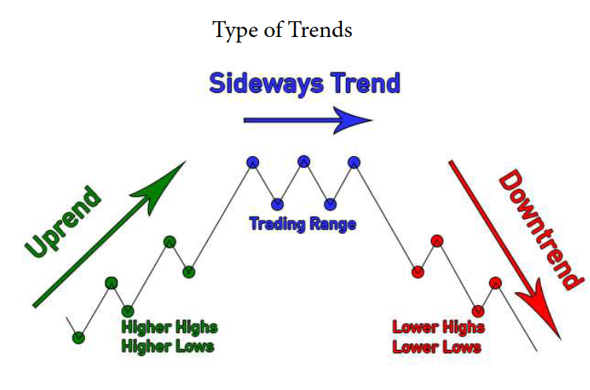
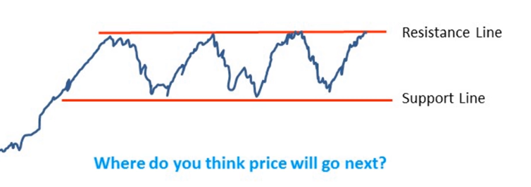
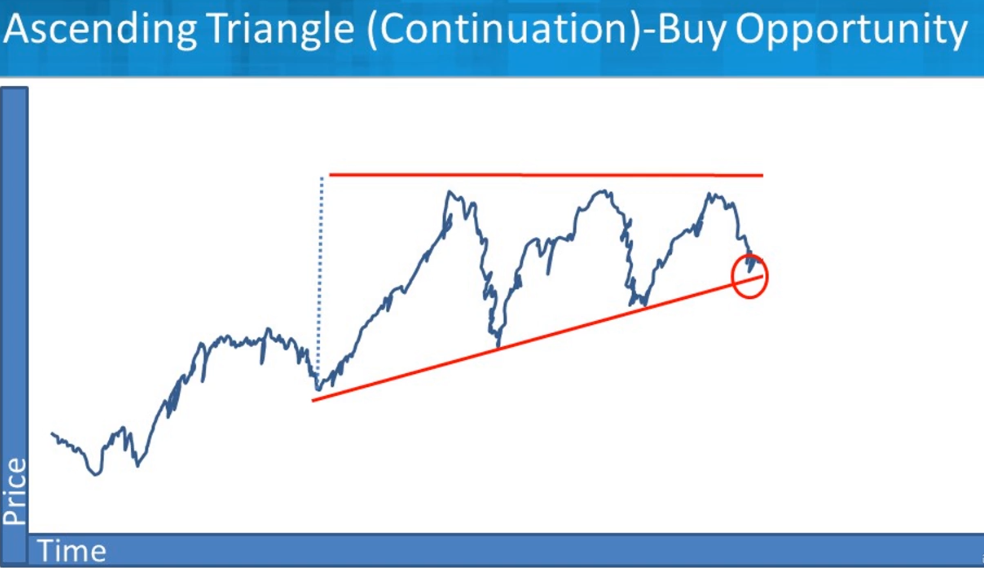
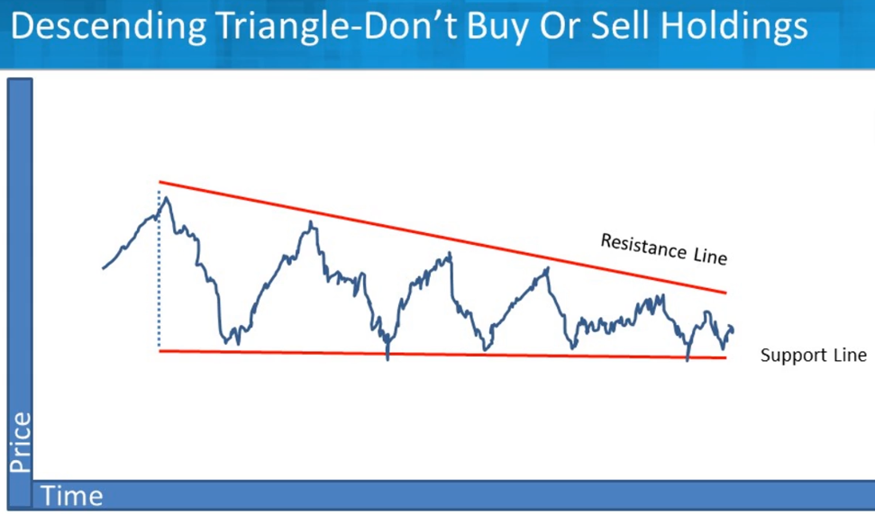
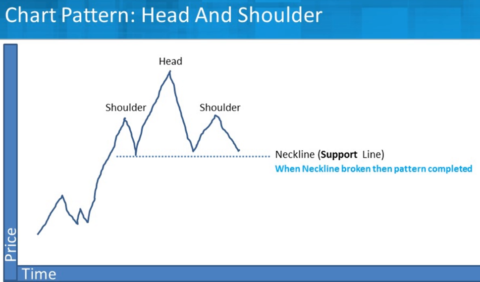
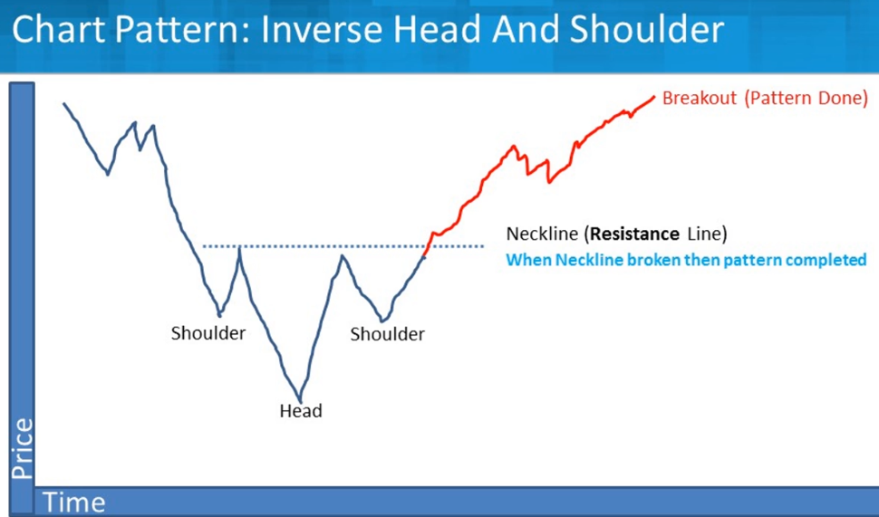
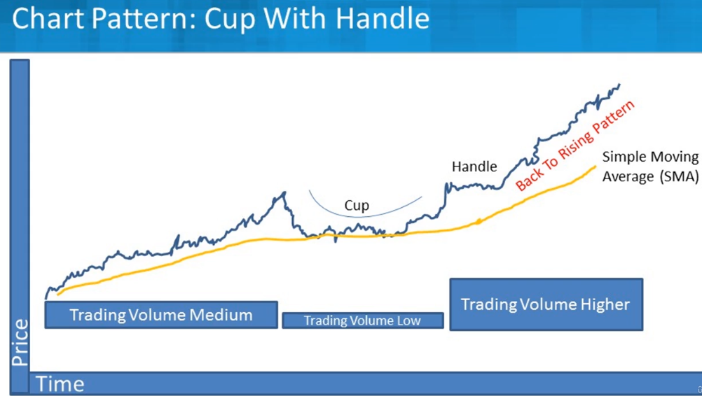

## Title: The Complete Foundation Stock Trading Course
- Instructor: Mohsen Hassan

9. Orders Driving Prices (Level 1/2, Time of Sales)
- How to see Level 1 and 2 book? Are they free?
- ToS
  - 1st column: time
  - 2nd column: price
  - 3rd time: N. shares
- Level 1: the best price of buyer vs Seller, the last price executed
  - Spread: difference b/w buyer best price vs seller best price
- Level 2/Book: List of buyers vs Sellers with their price wanted

11. 3 Ways of Making Money
- Long: betting on future higher price
- Short: betting on future lower price - very New tech stocks?
  - Possible profit is limited while possible loss is infinite
- Flat: no position

15. Introduction
- Fundamental vs Technical analysis
  - Fundamental: Revenue, N. employees, earning rate, ...
    - Q: what paramters are available/important in assessment of any company?
  - Technical: Price and Volume only

16. Charts and Candlesticks
- Candlestick
  - High: Highest value
  - Open: Value at opening (Open/Close is opposite for increase/decrease)
  - Close: Value at closing
  - Low: Lowest value
```
     |   <----- High
     |
    ---  <----- Open (when decrease)/Close (when increase)
    | |
    | |
    ---  <----- Close (when decrease)/Open (when increase)
     |
     |   <----- Low
```     
- Ex: https://www.tradingview.com/

17. Candlesticks
- Time size of candlesticks could be min/day/week ...
- Candlestick shows the sellers vs buyers
  - High drop means much more sellers than buyers
  - High jump means much more buyers than sellers
- Dojis
  - Open/Close at the same point - candle stick becomes a line (-)
  - No winner in sellers vs buyers
  - In decision (could be a transition point?) => Trend Reversal
```
     |   <----- High
     |
    ---  <----- Open/close
     |   <----- Low
```
- Gravestone: initially strong buyers but later strong sellers
```
     |   <----- High
     |
    ---  <----- Open/close/Low
```
- Dragonfly: initially strong sellers but later strong buyers
```
    ---  <----- Open/close
     |   
     |   <----- Low
```
- Shooting Star: similar to Gravestone
```
     |   
     |
     |
     |
    ---  
    | |
    ---  
     |
```     
- Hammer: similar to Dragonfly
```
     |
    ---  
    | |
    ---  
     |
     |   
     |
     |
```     
- When you have more info/data, predictability decreases
- Keep in mind the relation b/w supplier and demand
- Bearish Harami
  - Big green candle then next day small red candle
  - Buyers are **exhausted**
  - Price will decrease
- Bullish Harami
  - Big red candle then next day small green candle
  - Price will increase
- Engulfing Bullish
  - Small red candle then next day large green candle
  - Demand is much stronger than supply
  - Reversal starts (?)
- Engulfing Bearish
  - Small green candle then next day large red candle
  - Supply is so high and price will decrease

18. Trends, Support & Resistance  
- Principle of technical analysis: prices move along trend, and history repeats
- Trends
  - Uptrend
  - Downtrend
  - Sidetrend
  - Channels
    - 2 trendline as envelopes (upper trendline and lower trendline)
  - Trendlines
  - Trend Lengths

- Support: Corresponds to lower trendline
- Resistance: Corresponds to upper trendline
- Buy at support and sell at resistance
  - Everyone does buying at support and selling at resistance - keeping persistent
- Retailers put limits as round numbers ($5.00, not $4.97)
- Sell/buy is done within resistance/support 
- When trend breaks, support may switch to resistance

19. Chart Patterns
- Head and shoulders
- Double top, multiple top
  - Implies resistance
- Double bottom, multiple bottom
  - Implies support
- Triangles
  - Ascending Triangle: trendline going upper while there is resistance. Buyers getting more aggressive while sellers remain strong
  - Descending Triangle: trendline going lower while there is support. Buyers are consistent while sellers become more willing to sell
  - Regular Triagnle: one trendline going lower while another trendline going upper. Buyers and sellers become less patient
- Cup and handle
  - U or V shape then scattering
- Rounding bottom  
  - Flat U shape

20. Volume
- In technical analysis, price and volume
- You need to see the volume curves as well

21. Bollinger Bands
- An indicator based on volume and price
- Plots possible max/min price over time
- Number of days to use = 20 as default
- Standard deviation = 2 as default
- Bands become narrow when stationary
- Bands expand when price moves alot

22. Relative Strength Index (RSI)
- Can be used to predict how price moves
- From 0 to 100
- RSI = 100 - 100/ (1+RS)
  - RS = Average gain/ Average loss in previous days (14 as default)
  - 70-100: overbought (green candles are way higher than red candles)
  - 0-30: oversold (red candles are way bigger than green candles)
  - 30-70 are ordinary
  - When overbought, don't sell yet. When it goes below 70, it is time to sell
  - When oversold, don't buy yet. When it goes above 30, it is time to buy

23. Average True Range (ATR)
- ATR = sum of absolute value of increase/decrease then divide by days
  - Shows an average of increase/decrease

24. Expectancy
- E = \sum x_i p_i
  - x_i: value
  - p_i: value
- Ex:
  - An envelope of $1 with 100% probability
  - An envelope of $10 with 10% probability: this is more volatile

25. Gambling vs Educated Betting  
- Gampling: play games of chance for money. The act of gambling money on the outcome of an unpredictable event
- Educated Betting: The act of gambling money on the outcome of an event that you perceive a positive exptected value

27. Batting Average & Win/Loss Ratio
- Batting Average: the average probability that a trader is right. The number of profitable trades divided by the total number of trades during a specific period
- Win/Loss Ratio: the ratio of the average profitable tades over the averag unprofitable trades

28. Risk Management
- Systematic risk: the risk inherent to the entire market or market segment. Aka undiversifiable risk/volatility/market risk.
- Unsystematic risk: company or industry specific hazard that is inherent in each investment. Aka nonsystematic risk/specific risk/diversifiable risk/residual risk. This can be reduced through diversification
- Risk management
  - Risk Acceptance
  - Risk Avoidance
  - Risk Limitation
    - Stop Losses: Limit stop price and sell when triggered
  - Risk Transference

29. Money Management
- Maximum risk per position must never exceed 5%
- 2% is ideal (in a single trade)
- Importance of taking losses

30. Position Sizing
- How many shares to buy and how to buy them
- Different methods
- Simple position size = (Max loss per trade)/(amount you can lose per share)
- Ex:
  - 100k fund
  - 2% loss limit (per trade) = $2000
  - Assume purchase price = 4.17, stop loss price = 3.25
    - 2% loss per trade, assuming max 10 sequential trading = 2*10 = 20%
    - Max loss per share = $0.92
  - Stop loss price = 3.25
  - Position sizing = 2000/0.92 = 2170 share

31. The importance of Psychology

32. Loss Aversion
- Losses have a bigger negative impact than equivalent gains 
  - 2x more negative

33. Endowment Effect
- We place more value on somehting that we own than we didn't own it
- Correlated with loss aversion
- This is why it is hard to be objective on shares which we own

34. Status Quo Bias
- We prefer staying in our current situation/state than changing situation/state
- Correlated with loss aversion
- Timeline requirement may remove this bias

35. Anchoring Effect
- We anchor to the first decision/information when making subsequent decision

36. Confirmation Bias
- We search for information that confirms our beliefs

37. Genes and Instincts

38. Misconceptions and Ways to Improve
- Fear & Greed
- Having a Diary
- Daily reviews

39. Stock Screener - Finviz
- https://finviz.com/

40. Charting Platform - TradingView
- https://www.tradingview.com/

41. Bonus Lecture

## Title: Investing In Stocks The Complete Course! (17+ Hours)
- Instructor: Steve Ballinger, MBA

## Section 1: Stock Market Investing and Trading Foundation

1. Welcome and Getting the most out of the course

2. Glossary of stock market terms, curriculum overview, and udemy support
- https://www.nasdaq.com/glossary
- https://www.mercer.com/content/dam/mercer/attachments/europe/Netherlands/ic-dictionary-mercer.pdf

3. Stock market Returns and worst case scenario

4. Quick look at a stock you may like with a few items you will learn in the course
- Ex: Wipro
- Resources:
  - yahoo finance: 
    - Summary: PE ratio (TTM) 19.72 (< 25 then good)
    - Statistics: Price/Sales 2.55 (< 2.5 then excellent)
  - investing.com:
      - Ratios: Price to Sales

## Section 2: Key Concepts when investing and trading in the stock market

5. The 2 ways investors make money in stocks
- Capital appreciation: buy/sell
- Dividends: passive income

6. What is a stock really

7. Stocks and the law of supply & demand
- More buyers than sellers = price goes up
- More sellers than buyers = price goes down

8. Where do stocks fit in a diversified portfolio
- Consider:
  - How far away is the goal
  - Your risk tolerance
  - Need (income/growth/combo)

9. Sample portfolio allocation based on historical risk and return
- Bonds: Average annual return 6.3%, years with a loss: 20/96
- 20% stocks/80% bonds: Average annual return 7.5%, years with a loss : 16/96
- 100% stocks: average annual return 12.3%, years with a loss: 25/96

10. Stock Quote and Stock chart Demo note

11. Demo: How to read a stock quote
- Using Yahoo finance
- General mills (GIS)
  - Bid: the price buyers want to buy at
  - Ask: the price sellers want to sell at
  - Market cap: size of the business
  - Beta: measure of risk. 
    - 1.0: same movement as the wider market
    - `> 1.0`: Swings wider up/down than the market
    - `< 1.0`: Swings less up/down than the market
  - PE Ratio (TTM): lower, better
  - EPS (TTM): Earnings per share. 
- Hubspot (HUBS)

12. Demo: How to read a stock chart
- Technical analysis == charting

13. Special note for active traders. What kind of trader do you want to be?
- Timeframes
  - Scalper (arbitrage): minutes
  - Day trading: minutes to hour
  - Swing drading: Hours to Days
  - Position Trading: Days to Weeks
  - Part time invesiting: weeks to Months
  - Buy and Hold: Entry with fewer exits

14. How to pick a stock broker

## Section 3:Type of Stocks (Growth Stocks, Dividend Stocks, & Value Stocks) + Market cap

15. Diversification inside the stock category
- Consider:
  - How far aways is the goal
  - Your Risk tolerance
  - Need (Income/Growth/Combo)
- Stock Diversification options
  - Size 
    - Small cap
    - Mid cap
    - Large cap
  - Growth and Income (value)
  - International
  - Sectors

16. Size: Large, Mid, and Small Cap Stocks
- How cap is calculated
  - Stock price \* number of shares
- General cap ranges
  - Large cap: \> $10B
  - Mid cap: $2-10B
  - Small cap: \< $2B. Risky but potential of high profit
- Why care?
  - Portfolio composition
  - Diversity inside the asset class
  - Reduce risk
  - Narrow search

17. Style: Growth Stocks
- High-fliers that keep climbing
- Earnings grow faster than industry/market
  - Revenue and/or cach flow
  - Higher price to earnings (P/E)
  - Higher price to sales
- Typically no dividend and focus on re-invest cash in growing company like Google

18. Style: Dividend (Income Stocks)
- Pays a dividend
- Still want growth
  - Price increase
  - Dividend increase
- Like Coca-Cola (3.11%)

19. Style: Value Stocks
- Many times associated with income
- Lower price relative to fundamentals
- Bargain hunting
- Great companies at discounted rates
- Higher long-term gain
- Greater risk
  - May never recover

20. Stock Sectors
- What part of the economy
- What is their primary business
- Comparison to competitors (Ratios)
- Companies tend to move in concert with their sector
  - Compare
    - Vanguard Energy Index (VENAX)
    - S&P 500
    - Exxon (XOM)
  

## Section 4: What to Buy: Individual stock, stock mutual funds, & ETF

21. Individual Stocks: Benefits, Building a Portfolio, How Many, and Strategy
- Individual stocks
  - More control
    - You decide when to sell
    - Tax efficient
  - More targeted
  - Less diversified
  - More hands on
    - Research
    - Tracking
  - 20-30 for diversification
  - To be more diversified, look at a variety of company
    - Industry
    - Size
    - Style(Growth/Value/Income)
- Strategy: Mutual fund or ETF core
  - 80%+ in core mutual fund
    - Total stock market
    - S&P 500
    - International
  - Add individual stocks around core
    - Pull out extra return
    - Varied holdings
    - Tax reasons
    - Challenging and fun

22. How Many Stocks should you own
- Too few
  - Not diversified
  - More downside risk
- Too many
  - Over diversification
  - Hard to track
  - Less potential reward
- Tradition 20-30 individual stocks
- Portfolios containing 12-18 stocks provide about 90% of the maximum benefit of diversification
- Final thoughts
  - Diversity by Sector and industry
  - Variety of both (Ex, BioTech, EV, Tech, banks, etc...)
  - Do what is comfortable for you!

23. Understanding Stock Mutual Funds
- Mutual funds
  - Pool of investors
    - Sharing risk and reward
  - Diversified holdings
    - Sometime Assets Classes
  - Professional Management
    - Active vs. Index
  - Liquidity
    - Easy to build and sell

24. Active vs. Index Stock Mutual Funds
- Index fund means that you are trying to match the market that index follows
  - Ex: Vanguard S&P 500 Index fund
- Index fund advantages
  - Lower cost
  - Potential for more diversification
- Index fund disadvantages
  - No fund manager with vested interest
    - Not actively managed
  - Index down as a whole
  - Can be less diversified
  - Can be heavy weigthed in a few positions (Ex: S&P 500)

25. Using the Mutual Fund Style Box to Select Funds
- In terms of cap: Large, Medium, Small
- In Equity/stocks: Value, Blend, Growth

26. Understanding Mutual Fund Expenses
- Sales charges (load)
  - Front end/back end 3% or more
  - One time/not annual
- Expense ratio (average 1%)
  - Operating expenses
  - 12b-1 marketing (.25%)
  - Annual base
- Misc charges (not in expense ratio)
  - Custodial Fees ($10)
  - Hidden fees
- Redemption fee (1%)
  - Fee if sell before certain time frame
  - Discourage market timers

27. Let's Compare Some Mutual Funds Expenses Demo With Real Funds
- Vanguard mutual fund: 0.05% expense ratio, purchase/redemption/12b-1 fee is None. Annually $20 per count
- Quaker strategic growth fund: 1.99-2.99% expense ratio. 5.5% load. 

28. ETF: Exchange Traded Funds
- Hold basket of underlying assets - diversification
- Typically track an index
- Low expense ratio
- Trade on market like a stock
- Pay commission to a broker like a stock

## Section 5: Strategies: Investing and Trading Strategies in the Stock Market

29. Two Investing Extremes
- By and Hold vs. Active Trading
  - 20 years vs 20 hours
- Buy and Hold
  - Advantages
    - Easier to manage
    - Reduced transactin fees
    - Better tax efficiency
    - Endures when market is down
  - Disadvantages
    - Missed opportunities
    - Reluctance to sell poor performers
- Active Trading
  - Advantages
    - Take advantage of new opportunities
    - Sell those losers
    - Re-allocate faster in volatile markets
  - Disadvantages
    - More time devoted to investing
    - Increased transcation fee/taxes
    - Investing rewards patience with compounding
    - Typically underperforms over long-term

30. Investing in Growth stocks
- Will be priced high to market
- Momentum drives price up
- May not be profitable yet
- Great for
  - Long-term investor
  - Patience-Betting on future
  - Able to withstand volatility roller-coaster
- Protect downside (down 20% get out?)
  - Fast rising sales and earnings
  - Low debt
- Tips
  - Growing Industry
  - Megatrends
  - Strong band-barrier to entry
  - Insiders (Mgmnt.) buying
  - Fundamentals
    - Sales increase 10%
    - Earnings increase 10%
    - Debt lower than previous ears
    - ROE (Return of Equity) 10%+

31. Investing in Dividend Income Stocks
- Want some price growth
- Income (quarterly dividends)
- Great for:
  - Retires for income
  - Low interest rate environment
  - More risk adverse investors
- Typically large cap
- Looking for consistent dividend payouts
- Tips
  - Company stability
  - Sector stability
  - Use same fundamental analysis and ratios
  - Key in on:
    - Dividend yield (% you are paid)
    - Dividend Growth Rate
    - Consistent Dividends
    - Dividend Payout Ratio
      - 80% is concerning
      - 50-70% good
- Ex:
  - Johnson & Johnson
  - P&G
  - General Mills
  - ExxonMobil
  - Utility company

32. Investing in Value Stocks
- Hidden gems
- Market Undervalued
  - Recent bad news - sell off
  - Long-term fundamentals good
- Key ratios (compare to average)
  - Lower Price to Book
  - Lower Price to Earnings (P/E)
  - High Dividend Yield
- Future Growth-Cash flow
- **Contrarian investing**
- Very subjective
  - Investor A thinks stock is undervalued
  - Investor B thinks it will go down further
- If you like:
  - Buy low sell high
  - Like risk
  - To let time work for you

33. Value Investing Example Case Study

34. GARP - Growth At a Reasonable Price
- Combination of Growth and Value investing
- Looking for:
  - Somewhat undervalued stocks
  - Sustainable growth potential
- In-between (wishy-washy)
- Qualitative important
  - Who is CEO? How is industry?, ...
- Quantitative (Financial Fundamentals)
  - Recent Past and future projected earning growth
  - EPS more subdued 15-20% range
  - P/E higher than Value but lower than Growth Investors (15-25 range)
  - PEG value \< 1 and prefer near .5
    - PEG is favorite measure for GARP

35. Technical Analysis & Charting
- Not fundamentals
- Looking at past movements (Ex: price or volume) to predict future
- Very much a trading tool
- Assumptions 
  - Market price is the actual price as all information known (no value invest)
  - Price movements are not random
- Looking for trends
  - How strong is the trend
  - How likely is it that it will continue

36. Dogs of the Dow
- 10 of the 30 USA Fortune 500 companies in the Dow Jones Industrial Average (DJIA) with the highest dividend yield
- Idea is good stocks but they are out of favor
  - Low price/higher dividend yield
- Each year rebalance to select new 10

37. Dividend Aristocrats
- S&P 500 companies that have increased dividend for 25 straight years
- Strong in rising markets and extra strong and safe in falling markets
- But:
  - Past doesn't extrapolate future
  - Do your homework

38. DARTS
- Random selection is NOT recommended

39. Developing Your Stock Market Investing & Trading Strategy
- Your strategy: key components
  - Trade what you know (sector/industry/company)
  - Your trading style
    - How often do you want to trade
  - Leverage tools based on above
    - Company eval, fundamentals & Technical
    - Watch list, what to buy, when to buy it
  - No. of stokcs to trade (few-many)

## Section 6: Picking Stocks: Qualitative Company Evaluation

40. Qualitative & Quantitative Stock Picking
- How to pick up a company
- Quantitative data: financial results, numbers, ...
  - Last quarter's sales results
  - P/E ratio
  - Dividend rate
- Qualitative data: description, phenomenon, observation but not easily measured
  - Mangement's strategy
  - Products/Brands portfolio
  - Will the dividend be paid, cut, or eliminated

41. Company Strategy & More Evaluation
- Mission statement drives the company
  - What do we do?
  - Whom do we serve?
  - How do we serve them?
- Vision statement is about what you want to be
  - What are our hope/dreams?
  - What problems are we solving for the greater good?
  - Who and what are we inspiring to change?
- Strategy: What
- Tactics: How
- Example for a retail store chain:
  - Strategy: Grow our market share
  - Tactics: open 15 more location, buy #4 competitors and merge them

42. Using SWOT To Evaluate A Company (Strength, Weakness, Opportunity, Threats)

|         | Helpful       | Harmful |
|---------|---------------|---------|
|Internal | Strengths     | Weakness|
|External | Opportunities | Threats |

43. Porters 5 Forces To Evaluate A Companies Industry Position
- Bargaining power of suppliers
- Bargaining power of customers
- Threat of new entrants
- Threat of substitute products
- Competitive Rivalry within an industry

44. Introduction To the Moat: Key Part of Stock Investing
- The Moat
  - Low cost provider
  - Differentiated
  - Ideally: Not stuck in middle
  - High switching costs
  - Network effect
  - Strong brand name
  - Reputation
  - Economies of scale
  - Government protection

45. MOAT: Low Cost And Differentiated Companies
- Low cost provider
  - Price is everything
  - Control costs
- Differentiated
  - More Value
- Ideally: Not stuck in middel
  - B/w low cost and differentiated

46. MOAT: High Switching Costs
- Painful or expensive for a customer to switch to a competitor

47. MOAT: Network Effect
- Expensive for a competitor to build out a competing network or infrastructure
  - Ex: Distribution centers to move product to the end customer or utility electric grid

48. MOAT: Strong Brand Name
- Customers have strong emotions and attachments to the brand
- Trust
- Can charge higher price and drive profit margins

49. MOAT: Reputation
- Quality
- Does what you expect

50. MOAT: Economies of Scale
- Massively large upfront costs to even start
- Greater cost savings and higher production levels

51. MOAT: Government Protection
- Less common for total monopoly but companies can get support from favoritism from their government

## Section 7: Fundamental Analysis: Picking Stocks Using Ratios

52. Qualitative and Quantitative Analysis
- Quantitative
  - Hard cold numbers
  - Financial results
  - Financial ratios
  - Sources
    - Balance sheet
    - Income statement
    - Statement of cash flows
- Qualitative
  - Not numeric
  - Logic, gut, emotion, knowledge
  - Industry or world trends
    - Ex: health care and aging population
  - Sources
    - News
    - Management statements
    - Research analysts
  - Understand the company & industry

53. Key Financial Ratios When Buying Stocks
- Where do ratios come from?
  - Balance sheet
  - Income statement
  - Cash flow statement
- Important to compare within industry
- Some ratios are more important to some industries than others
  - Ex: inventory turn
- Some ratios more important to stock type than others
  - Ex: Dividend yield
- Hundreds of ratios. Focused on key ones (paralysis by analysis)

54. Update: Now More Ratios!

55. Stock Ratio Categories
- Valuation (price)
- Profitability
- Liquidity
- Dept (Solvency)
- Efficiency (Operating)

56. Valuation Ratios Intro: Is the stock at a good price relative to some measure
- Valuation ratios try to answer one question
  - Fair price?
  - Really good (bargain - buy!)
  - Overpriced (stay away)
- Higher stock price does not mean it's a better stock to buy today
- Good to compare companies against competitors
- Some ratios may work better than others for certain companies
  - Ex: P/E ratio no good for companies who have no earnings (losing money)

57. Valuation: Price Earning (P/E)
- What you need: Income statement, most recent stock price
- P/E ratio = Price per share /  Earnings Per share
- Low P/E ratio means that it is under-valued stock (?)
  - Definition of low varies from industry to industry

58. Valuation: Price To Earnings Growth (PEG)
- From Income statement, recent stock price
- PEG ratio = PE ratio / projected annual growth in earnings per share
- A very general rule of thumb is that any PEG ratio below 1.0 is considered to be a good value
- A good tool to find under-valued stocks

59. Valuation: Price To Sales (P/S)
- Stock price divided by sales per share
- Can be applied to companies that do not have recent positive earnings (they have losses), having momentary downtrend or new/emerging companies who are not profitable yet. Early start-up?
- Range of 1.0-2.0: good p/s ratio
- Less than 1.0 is excellent

60. Valuation: Price to Book (P/B)
- Ratio of price to book value per share
- Book value is the value of an asset according to its balance sheet account - in other words, company's value if it liquidates its assets and paid back all its liabilties
- Can be used to find under-valued stocks
- Pros
  - Stable metric: given the relative stability of the base metric (book value), this ratio doesn't fluctuate as much as others like P/E
- Cons
  - Accounting differences can make it hard to compare. Hard to compare companies due to differences in industry - different classification on their balance sheet
- Range of 1.0-3.0: good P/B ratio
- Less than 1.0 is excellent

61. Valuation: EV/Revenue (Enterprise Value to Revenue)
- Eneterprise value/Revenue
  - Enterprise value = market capitalization + debt - cash and cash equivalents
  - Revenue = Total Annual Revenue
- For early-stage or high-growth business that do not have positive earnings
- Alternative to P/E, PEG, EV/EBITDA
- Advantage
  - Beneficial when there are significant differences b/w accounting polices
  - Tech startup who has negative free cash flows
  - Easy to find revenue data for most business
- Disadvantage
  - Does not take into account, the cost structure of the company
  - Ignores profitability and generation of cash flow
  - Hard to compare across different industries and different company phases (early vs mature)
- Range of 1.0-3.0: good EV/Revenue ratio
  - Lower is better (undevalued)

62. Valuation: EV/EBITDA (Enterprise Value to EBITDA)
- Enterprise multiple = EV/EBITDA
  - EV = Enterprise value = market capitalization +  total debt - cash and cash equivalents
  - EBITDA = Earnings before interest, taxes, depreciation and amortization
- Good EV/EBITDA ratio: less than 10.0
- Lower is better (undervalued)

63. Case Study: Comparing Two Stocks Valuation Ratios
- Hormel vs Beyond meet
- 
64. Price to Cash Flow Ratio (May Need to Calculate Unlike Other Ratios)
- The price-to-cash flow (P/CF) ratio measures how much cash a company is generating relative to its market value
- P/CF is a good alternative to P/E as cash flows are less susceptible to manipulation than earnings
  - Cash flow does not incorporate non-cash expense items like deprecation or amortization (income statement metrics)
- Price to Cash flow ratio = Share price / operating cash flow per share
- In order to avoid volatility in the multiple, 30-60 day average price can be used
- Price to Free Cash Flow (P/FCF)
  - More rigorous than P/CF
  - Uses free cash flow (ECF), which subtracts capital expenditures (CapEx) from a company's total OCF
- Good P/CF: 
  - Generally 10 or less
  - Lower Better
- Good P/FCF
  - Generally 15 or less
  - Lower Better

65. Valuation Ratio Wrap up
- Is the price I am paying for a stock good price?
  - Fair price?
  - Really good (Bargain)
  - Overpriced (Stay away)

66. Dividend Ratios: Dividend Yield
- Dividend yield = dividend per share/price per share

67. Dividend Ratios: Dividend Payout
- Dividend payout ratio
  - What you need: income statement
  - Dividend payout ratio = dividend/net income
- Lower the ratio the better
  - Too high ratio might not be sustainable
- Less than 50% excellent
- 50-60% good
- 60-70% ok
- Cautious as get higher
- Compare in industry
  - Utilities normally have higher payout ratios
  - REIT required to have higher payout

68. Profitability: Return of Assets (ROA)
- What you need: income statement, balance sheet
- ROA = Net income / average total assets
  - Higher, better
  - How good the company is at using its assets to make money

69. Profitability: Return on Equity (ROE)
- What you need: income statement, balance sheet
- ROE = Net income/average stockholder equity
  - Implies how good a company is at rewarding its shareholders for their investment

70. Profitability: Profit Margin
- What you need: income statement
- Profit margin = net income / sales
  - Implies how much of a company's total sales flow though to the bottom line
  - Higher profits are better for shareholders, as is a high profit margin

71. Liquidity: Current And Quick Ratio
- Can a company cover their short-term debts (bills)?
- What if they cannot cover their debts?
  - Reduce expenses
    - Layoff
    - Spend less on training, marketing, and R&D
  - Sell off assets
    - Plants, factories, divisions, ...
  - Take on more debt (longer term to cover short term)
  - Cut or eliminate their dividend
  - Possible results
    - Stock price goes down
    - Bankruptcy
- Current ratio = current assets / current liabilities
  - Current assets: cash, accounts receivable, inventory and other assets that are expectec turned into cash in LESS THAN ONE YEAR
  - Current liabilities: accounts payable, wages, taxes payable, and the current portion of long-term debt
  - Keys:
    - Higher Better
    - Best to compare against peers
  - Quick Ratio
    - QR = (CE + MS + AR) / CL
    - CE = Cash & Equivalents
    - MS = Market securities
    - AR = Accounts receivable
    - CL = Current Liabilities
    - Keys
      - More conservative that the Current Ratio
      - Looks at assets that are more liquid and can be easily be turned into cash
      - Higher Better
      - Best to compare against peers

72. Debt: Debt to Equity
- Debt to Equity Ratio
  - You need: balance sheet
  - Debt to equity ratio = Total liabilities / Total shareholder equity
  - Implies: when this ratio increases, it becomes more risky because if it becomes unable to meet its debt obligations, it will be forced into bankruptcy

73. Debt: Interest Coverage
- What you need: income statement
- Interest coverage ratio (times interest earned, TIE) = EBIT / Interest Expense
  - Implies: Both EBIT (operating income) and interest expense are found on income statement. TIE is a measure of how well a company can meet its interest payment obligations. 
  - Anything lower that 1.0 is usually a sign of trouble

74. Efficiency: Asset Turnover
- What you need: income statement, balance sheet
- Asset Turnover Ratio = Sales / Average Total Assets
  - Implies: like ROA, this tells you how good the company is at using its assets to make products to sell
  - Higher Better

75. Efficiency: Inventory Turnover
- What you need: Income statement, balance sheet
- Inventory turnover ratio = costs of goods sold /average inventory
  - Implies: efficiency in cycling inventory
  - How fast the company has to replenish its shelves
  - High inventory turnover ratio indicates that the firm is selling inventory relatively quickly

76. Analyzing Ratio Demo With Real Companies
- Coke vs Pepsi

| Valuation | Coke(KO)| Pepsi (PEP) | ___ is better |
|-----------|---------|-------------|---------------|
| P/E       | 30.48   | 26.5        | Lower         |
| EPS       | 1.87    | 5.92        | Higher        |
| PEG       | 2.84    | 3.34        | Below 1.0 generally|
| P/S       | 6.78    | 2.92        | Lower      |
| P/B       | 11.07   | 14.17       | Lower      |
|Dividend Yield | 2.95% | 2.74%     | Higher     |
|Dividend Payout| 88.77% | 69.97%   | Lower (careful > 80%) |

|Profitability | Coke(KO)| Pepsi (PEP) | ___ is better |
|--------------|---------|-------------|---------------|
| Return on Assets | 7.75%   | 8.03%        | Higher         |
| Return on Equity | 37.26%  | 59.04%       | Higher         |
| Profit Margin    | 22.19%  | 11.01%       | Higher          |

| Debt(Solvency) & Liquidity |Coke(KO)| Pepsi (PEP) | ___ is better |
|--------------|---------|-------------|---------------|
| Debt to Equity | 173.79 | 247.7 | Lower |
| Current Ratio  | 1.47   | 0.91  | Greater than 1.0 |

| Risk (Volatility) | Coke(KO)| Pepsi (PEP) | ___ is better |
|--------------|---------|-------------|---------------|
| Beta | 0.61 | 0.61 | Lower |

## Section 8: Picking Stocks: Technical Analysis (Charting) Using Charts, Patterns, and Trends

77. Understanding Technical Analysis and Fundamental Investing
- Two primary ways
  - Fundamentals
    - Understand the Business model
    - Differentiation
    - Features & Benefits
    - Is there a first mover advantage
    - Barriers to entry or copying from others
    - Are they in it for the long-term?
    - Ratios (P/E, dividend yield)
    - Measure business
      - Current/past performance
      - Predict future?
    - Ratios are not technical analysis
  - Technical Analysis

78. Technical Analysis Introduction and Big idea
- What is technical analysis
  - Aka - charting
  - Can be used in stock/bitcoin/crypto/forex
  - Looking for repeatable patterns
  - Fundamentals don't matter
  - Herd mentality
    - Traveling together but breakout may happen

79. Technical Analysis Core Concepts
- Repeatable behavior under repeatable circumstances
  - Predictability
  - Not guesswork - strategy
- The trend is your friend
  - Identify trend after breakout
  - Get in and out (trading)
- Not 100% accurate
- Predictors 
  - No technique works all the time
  - No technique works on every stock
- Unpredictable events

80. Technical Analysis and Unpredictable Events Example
- Brexit

81. How I learned about Brexit: An investing story

82. Line Charts (Technical Analysis)

83. Candlestick Charts
- Green/white: closing price higher than open
- Red/Black: closing price lower than open
- Open/close price depends on color: Top/Bottom of Box
- Long line = price range (low-high)

84. Drawing Trend Lines and Caannels
- Trend is your friend
- Pick a point to start at then
  - Down trend - Connect highs
  - Uptrend - Connect lows
- Channels: b/w upper trend line and lower trend line

85. Moving Average: Simple and Weighted (Technical Analysis)
- Price above line: strength
- Price below line = weakness
- Watch for crossover points

86. Chart Patterns: Rectangles (Support & Resistance Lines)
- Trading range bounded by 
  - Support line (bottom)
  - Resistance line (top)
- Until there is a breakout of the rectangle
- After breakout usually moves in direction on previous trend but not always


87. Chart Patterns: Triangles (Technical Analysis)
- Converging support and resistance levels
  - Either rising or declining prices
- Trading price range narrows
- Breakout usually occurs in direction of the original trend



88. Chart Patterns: Flags (Technical Analysis)
- Similar to triangle
- Sharp rise or fall
- Lots of trading volume at the flag pole

89. Chart Pattern: Head and Shoulders (Technical Analysis)
- See support/resistance breaks
- See trend



90. Chart Pattern: Cup With Handle
- Combines price pattern and volume leveles and moving averages


91. Technical Analysis Final Thoughts
- Another tool in your toolbox
- Ok to use with fundamentals
- Use what you are comfortable with
- Certainly not foolproof
- Over analysis may lead to paralysis (do nothing)
- Too much analysis may assign meaning where there is none - Michael Kahn
- **The Trend is your friend. Wait for it to develop**

92. Article: Further Learning Around Technical Analysis

## Section 9: Risk and Risk Measures in the Stock Market

93. Introduction to Measuring Risk
- Increase risk = increase reward
- Decrease risk = decreased reward
- Can we measure risk?
  - One stock is riskier than another?
  - More than a gut feel or rule of thumb
  - Yes we can measure
- Volatility
  - The degree to which a stock's price moves
  - A stock with a price that fluctuates wildly - wide range of highs and lows or moves erratically - is considered highly volatile
  - A stock that maintains a relatively stawble price has low volatility

94. Pair Stock Risk with your own personal view of risk
- Can statistically measure stock risks but also consider how RISKY do you want to be?
  - Want less volatility, less chance for losses, SAFER investments but less reward as in profits... or more risk and greater potential for reward
  - Can choose stocks that match those criteria with a variety of risk measurement tools
  - Note: each tool does something a little different

95. Sharpe Ratio
- Sharpe ratio adjusts a portfolio's past performance - or expected future performance - for the excess risk that was taken by the investor
- Removing the rate of return on a risk free investment, such as a US treasury bond or T-Bill, from the experienced rate of return
- Think, I can make X with a risk-free investment, and I getting the extra return by taking on more risk and by how much
- A Sharpe ratio above 1.0 is generally considered good because you are getting excess returns relative to its volatility. Also wise to consider the peers in its class
  - Sharpe Ratio =  (Return of portfolio - risk-free rate)/standard deviation of the portfolio's excess return
- Example
  - Mutual fund returned 15% last year
  - Current risk free rate (Treasury Bond Yield) is 3.5%
  - Standard Deviation(volatility measure) 12%
  - Sharpe ratio = (15-3.5)/12 = 95.8%
    - Less than 1.0 and not a great Sharpe Ratio
    - More risk relative to returns
- Sortino Ratio
  - Variation of Sharpe Ratio
  - Considers downside only
  - (Return of portfolio - risk-free rate)/standard deviation of the downside
- Treynor Ratio
  - Measures how successful an investment is in providing compensation to investors for taking on investment risk
  - Reliant on a portfolio's beta - sensitivity of the portfolio's returns to movements in the market
  - (Return of portfolio - risk-free rate)/beta of the portfolio
- Big idea
  - How much excess return am I getting on a portfolio or basket of holdings, for the amount of risk I am taking on
  - How much above a RISK-FREE rate can I get?

96. Beta
- Measures the amount of risk (volatility) an individual security, mutual fund, or ETF has relative to a broader index
- The broader market is assigned a beta of 1.0
- Evaluate based on relation to that 1.0 market rate
- How to evaluate beta
  - B/w 0 and 1.0: less volatile than the market. Cash would have beta of 0
  - Equals 1.0: Overall market. If a stock as a beta of 1.0, it will move in the same direction as the index, by the same amount
  - Greater than 1.0: Volatility is greater than the broader index
  - Negative beta: Rare. Moves opposite direction of the index
- Example
  - A stock of beta 2.0
    - Two times as volatile as the overall market
    - If the market overall goes up 10%, this stock could rise by 205
    - If the market declines 6%, can expect a loss of 12%
  - A stock of beta 0.5
    - 10% market up would mean 5% gain
    - 10% down would loss of 5% only
- Formula: beta = covariance/variance
  - No need to calculate. Look up online    

97. Alpha
- Goes hand in hand with beta
- More of a performance measure
- Alpha refers to excess returns earned on an investment above the benchmark or index return
- Active mutual fund managers seek to generate alpha in diversified portfolios
- Represent the value that a portfolio manager adds to or subtracts from a fund's return, beyond what you could get with a passive index fund
- Evaluating Alpha
  - Positive number means outperformed the broader index
    - Fund A return is 15% and index return is 10% then Alpha is 5%
  - Negative number means underperformed the broader index
    - Fund A return is 4% while index return is 10% then Alpha is -6%
- Big idea
  - More of a performance measure that is commonly placed with risk or volatility measures
  - Use Beta for the volatility measure
  - You may have high Alpha but Beta volatility is TOO high. Skip such cases

98. R-Squared
- A statistical measure that represents the percentage of a mutual fund portfolio or a security's movements that can be explained by or attributed to movements in a benchmark index
- Ranges from 0 to 100
- In general
  - B/w 85-100 has a performance record that is closely correlated to the index
  - 70 or less means typically does not perform like the index
- Example
  - S&P 500 index fund would have an R-squared of 100
  - A fund of 95: performs almost exactly like the benchmark
  - A fund of 40: not due as much to general results of the index
- Why this is important?
  - If fund A has high fees but it is tracking the benchmark index, avoid this
- R^2 = 1 - unexplained variation/total variation
  - No need to calculate. Look up online

99. Standard Deviation
- Statistically, standard deviation measures the dispersion of data from its expected value
- For stocks, mutual funds, and ETF, it indicates how much the current return is deviating from its expected historical normal returns
- Higher the standard deviation, the greater the possible outcomes, high and low, thus more volatility

100. Broader Risk Categories: Systemic and un-systemic risk
- Risk Categories
  - Systemic Risk
    - Associated with the broader market
    - War, covid19
  - Unsystemic risk
    - Associatd with a particular, company, industry or sector
    - Oil stock due to OPEC

101. Screencast: Looking up stock risk
- Primary is Beta
- Hard to find other measures
  - Behind pay walls
  - May find in a company's investors resources section of website
  - Can manually calculate
- Use investing.com/yahoo.com/finviz.com to look up Beta  

102. Screencast: Looking up mutual fund and ETF risk measures
- Example 1 (Different categories)
  - VWINX vs FDGRX
- Example 2 (Same Category)
  - FDGRX vs PRUFX vs FCNTX
- Example 3 (International)
  - VOO vs ACWI vs INDY

## Section 10: Stock Screeners: Help you to find your next great investment

103. Introduction to Stock Screeners that you can use for free

104. Basic Screener with preset Screens (Yahoo finance)
- finance.yahoo.com -> Screeners
- May use pre-built screeners
  - Ex: Undervalued Growth Stocks
  - Can edit the existing pre-built screeners

105. Creating a Custom Screen (Yahoo finance)

106. Using a more powerful screen (Finviz)
- Better for USA stocks
- May apply the skills of technical analysis shown above

107. Accessing Any Market in the world with a global screener (investing.com)
- Good at multi-national stocks

108. Finding a stock screener in your country (Search)

109. Using a Stock Screener For Technical Analysis (Trading View)
- tradingview.com

## Section 11: Demonstration: Let's Buy Some Stocks Together

110. Demonstration: Let's Buy A Dividend Stock
- JNJ vs PFE
  - ROE, ROA, ROI: larger, better
  - Size of debt may affect the future dividend yield

111. Demonstration: Let's Buy A Value Stock
- Nike vs Sketcher
  - PEG, P/S, P/B: Less than 1 is better

112. Demonstration: Let's Buy A Growth Stock
- Ford vs TSLA

## Section 12: Online Brokers & More. Where to Invest & Trade Stocks

113. Introduction of the Various Methods to actually buy a stock
- Review of types
  - Full service stock broker
  - Discount (online)
  - Online (robo) financial broker
  - Financial planner
  - Budy direct from company

114. Full Service Stock Brokers
- Buy and sell stocks for you
- Give advice
- Access to research
- Can manage portfolio on your behalf
- Keys
  - Trust
  - Cost
  - Beware Churning
    - More fees
- Examples
  - Merrill Lynch
  - UBS
  - Wells Fargo Advisors
  - Morgan Stanley Smith Barney
  - Edward Jones

115. Discount (online) Stock Brokers
- You buy and sell
- No advice (some tools and articles though)
- Don't manage your portfolio
  - This is why the cost is low
- Great inexpensive way to start small
- Keys
  - Do it yourself
  - Lower cost
- Examples
  - E*TRADE
  - Charles Schwab
  - Merill Edge
  - Fidelity
  - TD Ameritrade

116. Financial Planners
- Manage your finances
  - Stocks, Bonds, Insurance
- Buy and sell stocks for you
- Give advice-access to research
- Can manage portfolio on your behalf
- Keys
  - Trust
  - Fee (% or flat fee)
- Ameriprise
- More are local firms/individuals
- Fee based or % based
- Ask potential advisor about
  - Their licensing
  - How long in business
  - Philosophy
  - Specialize (insurance vs investing)

117. Robo-advisors: Using online automation to reduce investor fees and time
- Low cost portfolio management
- Build, Manage, and Rebalance
- Low fees
- Feature low-cost ETF
  - Index investing (no active)
  - Very limited number of funds
- Build portfolio based on risk tolerance
  - Not great for complex investor situations
- Example
  - Wealthfront
  - Betterment

118. Article: Case study wealthfront & betterment

119. Robo-advisor case study: Wealthfront
- Adjusting portfolio by risk tolerances

120. Robo-advisor case study: Betterment
- Mostly Vanguard products

121. Direct Through Mutual Funds and ETF: Exchange Traded Funds
- Mutual Fund company 
  - Offer Brokerage services
  - Need a brokerage account: Fidelity, Vanguard, Charles Schwab, ...
- ETF
  - Like buying stock on exchange
  - Buy from the other sources
  
122. DRIP: Dividend Reinvestment Programs
- Direct from a company
  - Dividend Reinvestment program
  - Rare but some companies offer
  - Look at minimums and other details closely

### Personal impression At March 2024: 30%VGT + 70%VOO

## Section 13: Stock Order Types. Important to Use the Right Stock market Order Type

123. Paper Trading: Free Practice Using A Fake Money

124. How to Pick an online stock broker
- Trust
- Fees
- Test drive free version before pay for pro version
- Interface
- Analysis tools
- Paper trading availability
- Education
- Easy to deposit and withdraw funds
- Customer service

125. The spread: When investing & Trading stocks
- A stock quote is the price of the last trade b/w a buyer and seller
- The term **bid** refers to the highest price a buyer will pay to buy a specified number of shares of a stock at any given time
- The term **ask** refers to the lowest price at which a seller will sell the stock
- The bid price will almost always be lower than the ask or offer price. The difference b/w the bid price and the ask price is called **spread**
- The spreads is the transcation cost
- When a trade is made: traders buy at the ask price and sell at the bid price the market maker buys at the bid price and sells at the ask price
- More liquid, less spread

126. Introduction to Order Types

127. Market and Limit Orders
- Market order
  - The simplest and most common
  - You are willing to take whatever price is presented to you when your order is executed
  - Can be a little higher or lower than expected
- Limit order
  - Allows you to limit either the maximum price you will pay or the minimum price you are willing to accept when buying or selling a security

128. All-or-None. Fill or Kill, Immediate Or Cancel, and Good Till Canceled Orders
- An order may take time to be completed and you might end up paying different prices for different parts of the order
- All-or-none (AON) order requires the security to be purchased in a single transaction or not at all
  - Your order may not be executed
- Fill-or-kill (FOK) order must be filled immediately in its entirety or it is killed (canceled)
  - Never partially executed
- Immediate-or-Cancel (IOC) allows partial amounts of the order to be completed
- Good-till-canceled (GTC) ramins open until one of three things occurs
  - It is completely filled
  - You cancel the order
  - A certain time period set by your online broker
- Risks with GTC
  - You may forget the order
  - If you place large trade with GTC, you may pay a commision each day your oder is partially filled. You might be billed with multiple transactions

129. Short Sell and Buy to Cover Orders
- Shorting (공매도) enables you to profit if you can correctly predict that the price of a security **you don't own** will fall
- Buy to Cover Order
- In order to sell short, you must have Margin Privileges in your brokerage account. That means you can trade with more money than you have in your accout if you wish. 
- You must maintain enough purchasing power in your account to carry out a buy to cover order on your short sale
- If the price of your shorted stock actually increases, doing the opposite of what you thought, and you don't have enough money in your account to buy the shares back at the higher price (take a loss), **you will face a margin call**, a demand by your broker to put more cash or securities in your account to be able to cover the trade

130. Stop Loss, Limit, and Training Order Types
- Stop-Loss
  - A stop order automatically converts into a market order when a predetermined price - the stop price - is reached
  - At that point, the ordinary rules of market orders apply: the order is guaranteed to be executed, but you won't know the exact price
- Stop-limit
  - In constrast, a stop limit order automatically converts into a limit order when the stop price is reached
  - Minimum price you are williing to accept when selling a security
  - As with other limit orders, your stop limit order may or may not be executed depending on the price movement of the security
- Trailing Stop Order
  - You set a stop price as either a fixed amount or a percentage of the current market price
  - If the security's price does what you hope it would do, your order will sit there (unexecuted) and automatically adjust upwards as the price increases

131. Bracketed Orders
- Setting a profit target and downside loss protection a the same time in one order

132. Note on Fractional Shares

133. Fractional Shares Allow You to Invest with Less Money

| Pros | Cons|
|------|-----|
| Access to more stocks of high price  | Can encourage active trading. More fees?|
| Very low-cost diversification             | Limited selection of assets (Stocks, ETF, crypto)|
| Less money in cash... more fully invested | Reduced liquidity...fractional shares trade slower than full shares|
| Works well for automated investing        | Not every broker offers fractional shares |

134. Final Thoughts on Order Types

## Section 14: IPO Going Public: How a company sells stock publicly for the first time

135. Introduction to the Going Public Section
- Many ways to go public
  - Take a private company and have it listed on a stock exchange
  - Able to sell shares to the public
- Most well known and used is IPO
  - Initial Public Offering
- Why would a private company want to go public
  - Downside of going public is more reporting and regulatory requirements
    - Just to go public and also in future operations
    - Can be very time consuming and costly
  - The ANSWER = MONEY
    - Raise lots of money by selling shares to the public for the first time
    - More exposure (talk in the press)
    - Founders and venture capitalists cash in

136. IPO: Initial Public Offering
- Big institutional investors get IPO price
- When hits market that's when we can buy
- Can be extremely volatile early as price settles
- At **90** day mark insiders can sell
  - Many sell to cash out putting downward pricing pressure
- Don't buy an IPO just because it is an IPO

137. IPO Case Study (Facebook at IPO Now Meta)
- 47% down at 68th day since IPO

138. Direct Listing Placement (DLP)
- Direct Placement or Direct Public Offerings (DPO)
- Selling existing shares instead of offering new ones
  - Not raising new money
- Without getting help from intermediaries like investment banks
  - Faster and less costly than an IPO
- Direct listings are better for companies that have solid brand recognition, but don't need urgent money

139. Article: SPAC Popularity & Availability

140. What is a SPAC?
- Like an IPO but different
- Aka Reverse IPO
- Aka blank check company
- Special Purpose Acquisition Company (SPAC)
  - No operations
    - Don't make anything
    - Do not provide a service
  - Does have money (cash)
    - Investor's money
  - Sole purpose: to raise money in an IPO to buy another company
- Upon formation of a SPAC
  - Publicly traded on an exchange
  - Still just an idea at first ... no named target when first listed
  - Price to buy in will now go up or down like a stock
- SPACs will typically grant management an 18-24 month period in which to either:
  - Complete an acquisition
  - Return money to shareholders
- You can get your money back if you
  - do not like the acquisition
    - Redeem from trust prior to the merger IPO completion (typically for $10)
- After merger, the SPAC is dissolved
  - and becomes the new IPO company and traded under that companies stock symbol
- Can lose money
  - Two years until target company found (opportunity cost)
  - SPAC could trade below what you paid for it
  - Hold and get new merged company and that stock tumbles before you sell it

141. Why is SPAC Known as a Blank Check Company?
- No operations
- Don't make anything
- Sole purpose: to raise money in an IPO to buy another company
- Investors
  - Give money to SPAC management
  - Trust them to make a good purchase
  - Sort of a blank check
  - Gives Us a ROI (Return on Investment) in return
- Summary
  - Writing a blank check to management
  - Here is the money ... you decide what is best

142. How are SPAC's Created

## Section 15: Investing In International Stocks

143. International Investing Importance

144. Invest on your country's exchange with depository receipts
- Depostiory Receipts
  - Foreign company lists it shares on a local stock exchange
  - ADR = American Depository Receipts
  - European Depository Receipts (EDRs)
  - Luxembourg Depository Receipts (LDRs)
  - Indian Depository Receipts (IDRs)
  - Easy to buy and sell ... just like a domestic stock

145. Global Depository Receipts
- Similar yet different than depository receipts
- Depository receipts available only in that country
- GDR is available in multiple countries

146. Invest On Other Stock Exchange With FDI: Foreign Direct Investment
- Buying stocks directly through the foreign country
  - Open a global account with a broker in your home country: Fidelity, Charles Schwab, ...
  - Open an account with a local broker in the target country: MONEX BOOM

147. Using Mutual Funds & ETF to Invest in Foreign Stocks
- Great way for international investing
- Easy ... Buy a basket of stocks
- Instant diversification
- Key is to look beyond the name ... look at the holdings

148. Demonstration: International Mutual Funds and ETF Evaluation
- Janus Henderson: Asia Equity Fund (JAQIA)
  - Excluding Japan
  - Samsung, TSMC, Tencent, ...

149. Your Plan for Investing Internationally and what to consider
- Ask yourself
  - What countries ... and why
  - Developed and/or emerging markets
  - How
    - Individual stocks
    - ETF/mutual funds
  - Extra risk considerations
    - Currency risk
    - Political risk/regulation
    - Nationalization

## Section 16: Unusual Situations With Stocks (Stock Splits, Stock Buybacks and More!)

150. Preferred Stock
- Fixed vs variable dividend
- Ahead of common stock holder in event of liquidation
- Non-voting
- Callable-company can buy back at anytime
- Act more like a bond and susceptible to interest rate risk

151. Stock Splits
- Example
  - 2 for 1 split: 100 shares of $50 into 200 shares of $25
- Why companies do it?
  - Lower price more attractive and easier for smaller investors
  - Hopefully increse stock price

152. Stock Buybacks (Repurchases)
- Company buys its own stock back
  - Thinks company is really undervalued
  - Maybe you may think same way
  - Stock price increases
    - Have buyer (The company)
    - Singal to the market
    - Your value increases (less dilution)

153. Mergers & Acquisitions (M&A)
- Why do this:
  - Enter new markets
  - Expand their reach
  - Can run acquired company better
- Short-term
  - Buying company share price goes down
  - Acquired company share price goes up
- After approved and done then combined company is one stock
- Strategy
  - Look for companies that may be targets for acquisition
  - Beware new competition

154. Spinoffs
- Larger company **spins off** a division
  - Run better (more focus) as its own company
  - Better stock valuation for each company sedately as opposed to one big entity
- Are good for investors?
  - Parent and child good in long-run
  - Short-term pressure on spinoff
    - Investors get spinoff shares they do not want and sell it
    - May not pay a dividend like parent
    - Not in an index
  - Long-term studies show good
    - Management focus (+stock options)
    - New investor money for spinoff

155. Insider Trading: The Legal Kind & Ways Stock Investors can find information

156. Why does my stock go down on good news?
- Stocks are all about the future
- Current good news is good but comments about the future can scare people
- Let's look at a classic example
  - Facebook, earning calls Oct 30 2013
  - Easily beat earnings estimates
  - Stock declined 10 straight days
  - Younger users didn't use the service as much as they used to do

157. Emotional Or Behavioral Investing
- People act against their own best interest
  - Fear: market down on bad news
  - Greed: beware **hot tip**
  - Know thyself
    - What are your pressure points?
    - How can you reduce negative behaviors?
      - Automate-systematic investing
    - Seek out trusted partners
      - Spouse/financial planner/Investment club

## Section 17: Taxes and Stocks Market Investing & Trading

158. Now what you make but what you keep. Taxes and fees impact
- Taxes and Fees
  - Capital appreciate
    - Tax gain when you sell
    - Transaction fee when buy and sell
  - Dividend
    - Tax on income from dividend

159. Strategies to reduce or manage tax impact
- Buy tax efficient funds
- Buy and hold
- Tax advantaged accounts
  - 401k & Roth IRA
- Better to have variety of accounts particularly if you want to retire early

160. Harvesting your losses: Excellent tax strategy most people miss out on
- Tax management strategy
- Use investment loss to offset gains
- Gain - Losses = Net
- Pay tax on Net
- Dos
  - Sell depreciated investments that don't fit your strategy
  - Research your records and cost basis carefully before you sell any investment
- Don't
  - Undermine long-term investing goals for tax purposes
  - Buy a substantially identical security within 30days before or after the sale (Wash sale)

## Section 18: Next Steps

161. Next Steps + Bonus Step To Take Now

162. Bonus: Let's keep the learning going!