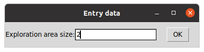
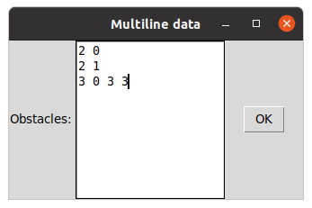
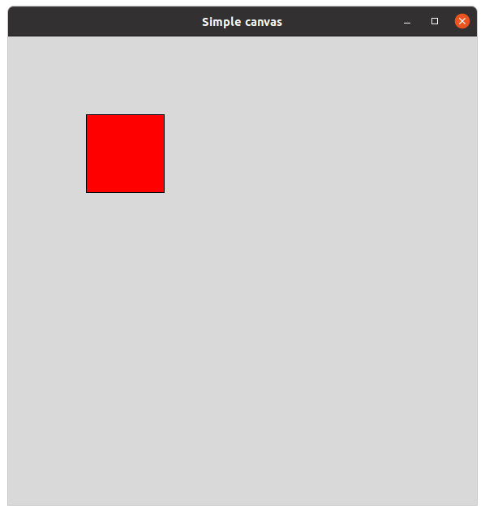
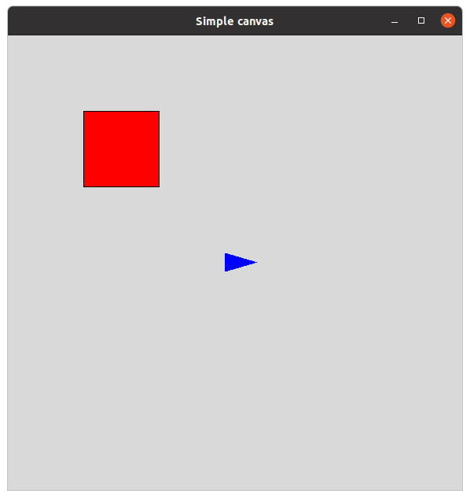
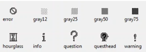

## The Complete Course of TCL Programming 2024
- Instructor: The Tech Courses

## Section 1: Basic TCL

### 1. Welcome to TCL

### 2. Installing TCL
- At Ubuntu 20, `sudo apt install tcl`

### 3. Introduction to programming

### 4. Working with TCL shell
```bash
$ tclsh
% pwd
/home/hpjeon/hw/class/udemy_tcl
% puts Hello
Hello
% puts "Hello world"
Hello world
% 
```
- Coupling with readline: `rlwrap tclsh`
- Comment with #
  - In the beginning of line (no command exists)
  - When command exists, terminate with ;, then add # 
    - Ex: `puts $x; # comment here`

### 5. Using variables
```tcl
% set day "Saturday"
Saturday
% puts $day
Saturday
% puts "today is $day"
today is Saturday
```

### 6. Command substitution
- Using [...]
```bash
% expr 3+2
5
% set result [expr 3+2]
5
% puts $result
5
% set greeting [concat "hello" $name, ", it is " [expr 2+1] "pm"]
hello Joe, , it is 3 pm
% puts $greeting
hello Joe, , it is 3 pm
% set x [format "%05d" 123]
00123
```

### 7. Basic Mathematical operations
- +,-,*,/,%
- sqrt(),abs(), pow(),rand(), round()
  - Functions cannot be used as a standalone. Must be within [...] as expr

### 8. Solutions to mathematical excercises
- 1/1000 will be zero as this is integer operation
  - Must be written as 1./1000.
```bash
% set t 3.0;
3.0
% set v 70.0;
70.0
% set d [expr $v*(1./1000)*60*60*$t]
756.0
```
### 9. Conditionals
```bash
% set x 1
1
% if {$x == 0 } { set y 0 } elseif {$x == 1} { set y 1 } else { set y 2 }
1
```

### 10. Example of conditionals

### 11. Ternary operators
```bash
% set y [expr $x >1 ? true: false]
false
```

### 12. Logical and bitwise operations
- TRUE, true, FALSE, false
- AND: && 
- OR: ||
- NOT: !
- Bitwise AND: &
- Bitwise OR: |
- Bitwise XOR: ^
- Bitwise shift left: <<
- Bitwise shift right: >>

### 13. Solutions to Logical and bitwise operations excercise

### 14. Operation precedence

### 15. Strings
- \n: new line
- \r: carrage return
- \t: horizontal tab
- \v: vertical tab
- \a: **alert or bell (audible)**
- \b: backspace
- \f: form feed (page break)
```tcl
% string compare "hello" "helloworld"
-1
% string first "hello" "helloworld"
0
% string index "hello" 1
e
% string length "hello"
5
% string range "hello world" 2 8
llo wor
```

### 16. Solution to strings excercise

### 17. What is a script

### 18. Text editors

### 19. Coding guidelines

### 20. Section 1 Quiz

### 21. Scripts Section 1

## Section 2: Intermediate TCL

### 22. Lists
```tcl
% set animals [list cat dog turtle]
cat dog turtle
% set animals2 {cat dog turtle}
cat dog turtle
% puts $animals
cat dog turtle
% puts $animals2
cat dog turtle
% puts [lindex $animals 0]
cat
% puts [lindex $animals 2]
turtle
% set text "Hello_world_good_morning"
Hello_world_good_morning
% set newtext [split $text "_"]
Hello world good morning
```

### 23. Adding elements to lists
- lappend: in the end
- linsert: in the middle but not modify the original list
```tcl
% puts $animals
cat dog turtle
% llength $animals
3
% lappend animals horse
cat dog turtle horse
% llength $animals
4
% set animals [linsert $animals 2 rabbit cow]
cat dog rabbit cow turtle horse
% puts $animals
cat dog rabbit cow turtle horse
```

### 24. Changing list elements
- lset: Sets a single element
- lreplace: replaces elements but must be used in expr
```tcl
% puts $animals ; # comment
cat dog rabbit cow turtle horse
% lset animals 4 hen
cat dog rabbit cow hen horse
% puts $animals ; # comment
cat dog rabbit cow hen horse
% set animals [lreplace $animals 0 1 lion tiger]
lion tiger rabbit cow hen horse
```

### 25. Extracting ranges, sorting lists, and iterating over lists
- lrange: elements in list range
- lsort: list sorting but does not modify the original list
- foreach x y {...}: loop over elements in y
```tcl
% puts $animals
lion tiger rabbit cow hen horse
% lrange $animals 2 4
rabbit cow hen
% lsort $animals
cow hen horse lion rabbit tiger
% foreach el $animals { puts "Animal: $el" }
Animal: lion
Animal: tiger
Animal: rabbit
Animal: cow
Animal: hen
Animal: horse
```

### 26. List cheatsheets and practice
- set animals [list cat dog turtle]
- lindex $animals 0
- set countries [split $text _]
- lappend anmals horse
- lset animals 4 hen
- set animals [lreplace $animals 0 1 lion tiger]
- lsort $animals
- llength animals
- foreach el $animals {...}

### 27. Lists solution

### 28. Creating arrays
- Key-value pairs
```tcl
% array set pets { 'Ahn' cat 'Joe' dog 'Sara' pig } ; # single command
% set tool('Ahn') driver; # single key-value wise
driver
% set tool('Joe') hammer
hammer
% set tool('Sara') glove
glove
```

### 29. Iterating over arrays
- `array names` is a function to get keys from an array
- Then we can use foreach
```tcl
% set keys [array name pets]
'Joe' 'Sara' 'Ahn'
% foreach k $keys { puts "Person $k Pet: $pets($k)" }
Person 'Joe' Pet: dog
Person 'Sara' Pet: pig
Person 'Ahn' Pet: cat
```
- `array get` is a function to get key-value pairs
```
% set tList [array get tool]
'Joe' hammer 'Sara' glove 'Ahn' driver
% foreach {k v} $tList { puts "Person: $k  Tool: $v"}
Person: 'Joe'  Tool: hammer
Person: 'Sara'  Tool: glove
Person: 'Ahn'  Tool: driver
```

### 30. Multidimesnsional arrays
- tcl doesn't support multi-dimensional arrays but we can use the literal of "x,y"  as a key
```tcl
% set heat(0,0) 12
12
% set heat(0,1) 13
13
% set heat(1,0) 11
11
% set heat(1,1) 11.5
11.5
% puts $heat(0,0)
12
% set x 0
0
% set y 1
1
% puts $heat($x,$y)
13
% puts $heat($x, $y)
can't read "heat(0, 1)": no such element in array
```
- heat(,) is defined as "0,1", not "0, 1" (a space b/w)

### 31. Sorting lists and arrays
- `lsort`
  - Options: -dictionary -integer -real -command -increasing -decreasing -index -unique -star -end -stride
```tcl
% array set data { key1 10 key2 5 key3 8}
% echo [array get data]
key3 8 key1 10 key2 5
% array set values [array get data]
% set keyValueList [list]
% foreach {k v} [array get data] { lappend keyValueList [list $k $v] }
% echo $keyValueList
{key3 8} {key1 10} {key2 5}
% set sortedList [lsort -decreasing -int -index 1 $keyValueList]
{key1 10} {key3 8} {key2 5}
% echo $sortedList
{key1 10} {key3 8} {key2 5}
```
- Removing variable: `unset x`
- Removing array: `array unset x`
- To print array: `echo [array get $arrayName]`
- To print list: `echo $listname`

### 32. Arrays practice

### 33. Arrays solution

### 34. For and While loops
- for{initialization}{condition}{increment} {...}
```tcl
% for {set i 0} {$i <3 } {incr i} { puts " $i^2 = [expr pow($i,2)]" }
 0^2 = 0.0
 1^2 = 1.0
 2^2 = 4.0
```
- while {condition} {...}
```tcl
% set x 0
0
% while {$x < 0.5 } { set x [expr rand()] ; puts $x }
0.0055051129336958346
0.5244330766258916
```

### 35. Nested loops

### 36. Breaking loops
- `break`: exits loop
```tcl
% while {1} { set x [expr rand()] ; puts $x; if {$x<0.5} { break}}
0.903734790116425
0.07061748675565119
```
  - For nested loop, you may need multiple breaks
- `continue`: continues to next element in the loop, skipping contents below
```tcl
% foreach {k v} [array get sales] { echo "Sales at $k = $v"; if {$v <50} { continue}; puts "Well done" }
Sales at 'March' = 33.3
Sales at 'Feb' = 70.0
Well done
Sales at 'Jan' = 100.0
Well done
```

### 37. Loops practice

### 38. Loops solution

### 39. Procedures
- Used to perform repetitive tasks
- Can accept input arguments
- Returns a value
- Basically a function in C/C++
- proc <proc_name> {arg1, arg2, ... } {... return <something>}
```tcl
% echo $alist
1 2 3 4
% proc calc_avg {list} { set sum 0; set count 0; foreach el $list { set sum [expr $sum+$el] ; set count [expr $count+1]; } ; set rv [expr $sum/$count] ; return $rv}
% echo [calc_avg $alist]
2
```
- Note: `$count = $count + 1` will not work. Use expr with [,..]

### 40. Recursive procedures
```tcl
% proc factorial {n} { if {$n==0} { 
                        return 1
                      } else { 
                        return [expr $n*[factorial [expr $n-1] ] ] 
                      } 
                    }
% echo [factorial 3]
6
```

### 42. Procedures solution

### 43. File IO
- Opening a file handler: `set fh [open "sample.txt" w]`
- Opening option
  - r: read only
  - w: write mode
  - a: append mode
  - +r: read and write
  - +w: read and write. New file is created it it does not exist
  - +a: Reand and append. New file is created it it does not exist
- Reading a line: `set line [gets $fh]`
- Writing: `puts $fh "hello world"`
- Closing the file handler: `close $fh`
- Gets the number of line from reading: `[gets $fh line]`
  - Shows the line number read
  - At EOF, -1
- File related commands
  - file exists path
  - file isfile path
  - file isdirectory path
  - file readable path
  - file wriable path
  - file executable path
  - file size path
  - file delete path
  - file rename path
  - file copy <origin> <target>
  - file link <origin> <tgarget>
  - file dirname path
  - file tail path
  - file nromalize apth
  - file join $path...?

### 44. File IO practice

### 45. File IO solution

### 46. Various Query commands
- info args procName: the formal argument of procedure
- info body procName: procedure body
- info command procName:
- info exists varName
- info level ?number?
- info globals ?pattern?
- info locals ?pattern?
- info nameofexe
- info procs ?pattern?
- info script
- String command
  - string is integer
  - string is double
  - string is boolean
  - string is list
  - string is ascii
  - string is alpha
  - string is digit
  - string is alnum
  - string is space
  - string is upper
  - string is lower
  - string is title
  - string match pattern
  - string equal string1 string2
  - string equal-nocase string1 string2
```tcl
% set fr "apple"
apple
% switch $fr { "banana" { puts "found banana" }
               "orange" { puts "found orange" }
               "apple"  { puts "found apple" }
                default { puts "found nothing" }
}
found apple
```

### 47. Various Query commands solution

### 48. Special variables and command line
- $argc/$argv: argument number/list of argument values
- $auto_index: Used by auto_execok command to store the index of the last command found in the $auto_path list
- $auto_oldpath: original value of $auto_path before it was modified
- $auto_path: a list of directories that TCL search es for aut-loaded commands
- $env(): Environmental variable
- $errorInfo: stack trace of the most recent error
- $errorCode
- $file
- $info
- $result
- $stdin, $stdout, $stderr
```tcl
% puts $auto_path
/usr/share/tcltk/tcl8.6 /usr/share/tcltk /usr/lib /usr/local/lib/tcltk /usr/local/share/tcltk /usr/lib/tcltk/x86_64-linux-gnu /usr/lib/tcltk /usr/lib/tcltk/tcl8.6
% lappend auto_path "/home/hpjeon/hw/class/udemy_tcl"
/usr/share/tcltk/tcl8.6 /usr/share/tcltk /usr/lib /usr/local/lib/tcltk /usr/local/share/tcltk /usr/lib/tcltk/x86_64-linux-gnu /usr/lib/tcltk /usr/lib/tcltk/tcl8.6 /home/hpjeon/hw/class/udemy_tcl
% puts $auto_path
/usr/share/tcltk/tcl8.6 /usr/share/tcltk /usr/lib /usr/local/lib/tcltk /usr/local/share/tcltk /usr/lib/tcltk/x86_64-linux-gnu /usr/lib/tcltk /usr/lib/tcltk/tcl8.6 /home/hpjeon/hw/class/udemy_tcl
```

### 49. Special variables and command line solution

### 50. More math
- exp(x)
- log(x)
- log10(x)
- sin(x)
- cos(x)
- tan(x)
- asin(x)
- acos(x)
- atan(x)
- ceil(x)
- floor(x)
- rand()
- max(x,y)
- min(x,y)
- hypot(x,y) = sqrt(x*x + y*y)

### 51. More math solution

### 52. Regular expressions
- \d: any digit
- \D: any non-digit
- \w: any word
- \W: any non-word
- \s: any whitespace
- \S: any non-whitespace
- .: any character except new line
- [abc]: any character of a or b or c
- [^abc]: any character except a or b or c
- ^: beginning of a line
- $: end of a line
- *: zero or more occurrences
- +: one or more occurrences
- ?: zero or one occurrence
- {n}: n occurrences
- {n,}: n or more occurrences
- {n,m}: n-m occurrences

### 53. Regexp examples
```tcl
% set txt "There are 10 types of people in this world, those who understand binary and those who dont"
% regexp "world" $txt
1
% regexp "^There" $txt
1
% regexp {\d{3}} $txt
0
% regexp {\d{2}} $txt
1
```

### 54. Regexp solution

### 55. Debug techniques
- Print debug statements
  - Use `puts` command to print key information
- Logging: open a log file and book-keeping it with details
- Using $errorInfo
```tcl
% set x 1.2
1.2
% incr x
expected integer but got "1.2"
% puts $errorInfo
expected integer but got "1.2"
    while executing
"incr x"
```

### 56. Debug session

### 57. Section II Quiz

### 58. Scripts Section II

## Section 3: Advanced TCL

### 59. More about lists
- `split`: default separator is whitespace
- `lreverse`: reverse list
- `lsearch`: list search and returns the index of matching word. When not found, returns -1
  - -all
  - -ascii
  - -decreasing/-increasing
  - -dictionary
  - -exact
  - -glob
  - -inline
  - -integer
  - -not
  - -nocase
  - -real
  - -regexp
  - -sorted
  - -start <index>
- `lmap`: Appy a given script or lambda expression to all elements in the list, and return a list containing the result
- List expansion using {*}
```tcl
% set txt "Hello world how are you?"
Hello world how are you?
% set words [split $txt]
Hello world how are you?
% echo $words
Hello world how are you?
% set rev [lreverse $words]
you? are how world Hello
% lsearch $words a*
3
% set n1 {1 2 3 4 }
1 2 3 4 
% set n2 [lmap n $n1 { expr {$n*2} } ]
2 4 6 8
% set x1 { a b }
 a b 
% set x2 { c d }
 c d 
% set x3 [list $x1 $x2 ]
{ a b } { c d }
% set x4 [list {*}$x1 {*}$x2] ; # elements of x1 and x2 are fully expanded
a b c d
```

### 60. Dictionaries
- Similar to array but can be nested
```tcl
% set ex1 [dict create lname "Baker" fname "John" age 35]
lname Baker fname John age 35
% dict set d1 123 $ex1
Alice 123 Joe 456 123 {lname Baker fname John age 35}
% set ex2 [dict create lname "Mullet" fname "Mona" age 55]
lname Mullet fname Mona age 55
% dict set d1 456 $ex2
123 {lname Baker fname John age 35} 456 {lname Mullet fname Mona age 55}
```

### 61. Dict command
- dict size $dname
- dict keys $dname
- dict get $dname item
- dict values $dname
- dict append $dname key value
- dict exists $dname key
- dict for {k v} $dname
- dict filter $dname script {k v} { FILTER EXPR }
- dict filter $dname key <KEYS>
```tcl
% dict size $d1
2
% dict keys $d1
123 456
% dict values $d1
{lname Baker fname John age 35} {lname Mullet fname Mona age 55}
% puts [dict get $d1 123] ; # find values using a key in dictionary
lname Baker fname John age 35
```

### 62. Dict practice

### 63. Dictionaries solution

### 64. Error handling
- `catch` command to capture any error
```tcl
if { [catch  {open "sample.txt" r} fid] } {
   puts stderr "cannot open file $fid"
}
```
- `try - on error - finally` block
```tcl
try {
    # your code here
} on error {} {
    exit
} finally {
    file delete $secret
} 
```
- `timeout`: specifies time limit

### 65. Error handling solution

### 66. System commands
- `exec`: execute the external commands
- `glob`: lists of files
- `clock`: system time
```tcl
% set ls [exec ls ]
ch48.tcl
hello.tcl
README.md
sample.text
% echo $ls
ch48.tcl
hello.tcl
README.md
sample.text
% set s [glob "*.text"]
sample.text
% clock seconds
1713128577
```
### 67. System commands solution

### 68. The eval command
- `eval`: evaluates tcl script
```tcl
% set s1 { set z [expr 1+2] }
 set z [expr 1+2] 
% eval $s1
3
```

### 69. Eval command solution

### 70. Scope and uplevel
- Global scope
- Local scope
- `uplevel`: changing the context
```tcl
% proc foo {} { set x 10; uplevel 1 { puts "x = $x"} }
% set x 5
5
% foo
x = 5
```

### 71. Upvar
- `upvar`: create a local variable which is linked to a different scope

### 72. Namespaces solution

### 73. Namespaces
- namespace eva: creates and evaluates scripts within a namespace
- namespace current: Returns the fully qualified name of the current namespace
- namespace parent
- namespace children
- namespace qualifiers
- namespace path: Returns or sets the namespace search path
- namespace import: imports command from another namespace
- namespace export: exports command to be accessible in an import namepsace
- namespace ensemble: Creates or modifies an ensemble within a namespace
- namespace ensemble configure: Configures the behavior of an ensemble command
- namespace ensemble configurfromensemble
- namespace ensemble delete
- namespace ensemble export
- namespace ensemble import
- namespace ensemble options
- namespace exists name
- namespace delete
- namespace which
- namespace qualifersof
- namespace origin
- namespace forget
- namespace code name script

### 74. Packages
- A package is a directory containing tcl scripts and other related files, along with a special initialization script called pkgIndex.tcl
- `package require`: loads the packaged requested
- mathops/pkgIndex.tcl
```tcl
package provide mathops 1.0
namespace eval ::mathops {
   proc add {a b} {
     return [expr {$a + $b} ]
   }
   proc sub {a b} {
     return [expr {$a - $b} ]
   }
}
```
- In the main or tclsh
  - Configure auto_path
```tcl
% lappend auto_path "/home/hpjeon/hw/class/udemy_tcl"
/usr/share/tcltk/tcl8.6 /usr/share/tcltk /usr/lib /usr/local/lib/tcltk /usr/local/share/tcltk /usr/lib/tcltk/x86_64-linux-gnu /usr/lib/tcltk /usr/lib/tcltk/tcl8.6 /home/hpjeon/hw/class/udemy_tcl
% package require mathops
1.0
% puts [mathops::add 10 5]
15
% puts [mathops::sub 3 7]
-4
```
- $auto_path must be updated, pointing the location of the package directory
  - This is not the system variable but tcl internal variable

### 75. Packages solution

### 76. Advanced regexp
- `[[:alpha:]]`: for all of uppercase/lower case letters
- `[[:digit::]]`: for any digit
- `[[:space:]]`: for any space character, including new line

### 77. Non-greedy, back-references and look-ahead
- Non-greedy/lazy/reluctant qualifiers match as few characters as possible
- Back references refer back to a previously matched subpattern within the same regular expression. Useful when repeatd or similar patterns are matched
- Look ahead patterns specify a pattern that must be followed by another pattern
  - `(?=pattern)` for positive look-ahead
  - `(?!pattern)` for negative look-ahead

### 78. Regexp options
- -nocase: case insenstive matching
- -line: multiple line iputs, allowing ^ and $ to match the start/end of each line
- -linestop: treats newline character as stops, excluding them from the match
- -expanded: allows whitespace and comments within regex for improved readability
- -indices varName: Returns the start and end indices of such submatch
- -all: Matches all occurrences
- -inline: Returns a list of data that otherwise would be placed in match variables
- `regsub`: pattern-based string substitution
```tcl
% set text "hello world"
hello world
% regsub "o" $text "O" newtext
1
% puts $newtext
hellO world               # only the first o
% regsub -all "o" $text "O" newtext2
2
% puts $newtext2
hellO wOrld               # all of o's
```

### 79. Regexp solution

### 80. OOP
- Since v8.6, TclOO package is supported
```tcl
% info tclversion
8.6
```

### 81. TCLOO
- Last update was 8 years ago

### 82. TCLOO solution

### 83. Event driven programming
- The flow of the program is determined by event sor user actions 
- The program waits for events to occur and tehen reacts to those events by executing specific event handlers or callbacks
- General outline for tcl
  - Start by GUI window or defining event sources such as timers or network sockets
  - Bind command to associated event handlers with specific events
  - Using vwait command, loop over event
```tcl
set count 0
proc incrementCount {} {
  global count
  incr count
  puts "Count: $count"
  after 1000 incrementCount
}
proc anotherProc{} {
  puts "Another proc"
  after 5000 anotherProc
}
after 1000 incrementCount
after 500 anotherProc
vwait forever
```
- `after`: executes a command after a time delay (ms)
- `fileevent`: associates events with filehandlers
- `vwait`: Enters the event loop and suspends the execution of a script until a specific variable is set

### 84. Event driven solution

### 85. Network sockets
- Server side:
```tcl
set mySocket [socket -server ServerProc 2540]
proc ServerProc {newSock addr port} {
  puts "Accepted $newSock from $addr port $port"
}
vwait forever
```
- clients:
```tcl
set s [socket 192.168.1.115 2540 ]
```

### 86. Network sockets solution

### 87. Multiple interpreters and Safe-TCL
- Running multiple tcl instancs
- Safe-tcl: sandboxing  un-trusted tcl scripts
  - `interp create` command with `-safe` option

### 88. Safe TCL solution
- Running an external tcl script in a sandbox
```tcl
proc createSafeInterpreter {} {
  set safeInterp [interp create -safe]
  interp eval $safeInterp {
    # disable file system access
    interp alias {} file {} error
    # disable network
    interp alias {} socket {} error
    # disable dangerous commands
    interp alias {} exec {} error
    interp alias {} open {} error
    interp alias {} source {} error    
  }
  return $safeInterp
}
proc executeScript {script} {
  set safeInterp [createSafeInterpreter]
  set result [interp eval $safeInterp $script]
  return $result
}
# main program
puts "Safe tcl script runner"
puts "Enter your tcl script:"
set script [gets stdin]
set output [executeScript $script]
puts "Output:"
puts $output
```
- Demo:
```tcl
% source ch88.tcl
Safe tcl script runner
Enter your tcl script:
set x [expr 1+2]
Output:
3
% source ch88.tcl
Safe tcl script runner
Enter your tcl script:
puts "hello"
can not find channel named "stdout" ; # file handler is disabled
```

### 89. Clock commands
- `clock` options
  - seconds
  - format
  - scan: reads string and converts to time value using -format
  - add
  - subtract
  - formatZ
```tcl
% set x [clock seconds]
1713396765
% clock format $x -format "%Y-%m-%d %H:%M:%S"
2024-04-17 19:32:45
```

### 90. Call stack
- info level: current level of call stack
- info frame: current stack frame
- info command: fully qualified name of the current command being executed
- info procs: a list of procedures defined in the current stack
- info args: a list of arguments for the current procedure call
- info body: the body of the current procedure
- Put following loop in to every level of the code:
```tcl
set procname [lindex [info level 0] 0]
foreach level [info level] {
  puts "Stack level: $level"
  puts "Command:   [info command $level]"
  puts "Procedure: [info frame $level]"
  puts "Arguments: [info args $procname]"
  puts "Body:      [info body $procname]" ; # this will be long
  puts "------------------------------"
}
```
- Sample code:
```tcl   
proc factorial {n} { 
  set procname [lindex [info level 0] 0]
foreach level [info level] {
  puts "Stack level: $level"
  puts "Command:   [info command $level]"
  puts "Procedure: [info frame $level]"
  puts "Arguments: [info args $procname]"
  puts "------------------------------" 
  }
  if {$n==0} { return 1 } else {                         return [expr $n*[factorial [expr $n-1] ] ] }  
}
# main program
puts [ factorial 2 ]
```
- Demo:
```tcl
Stack level: 1
Command:   
Procedure: type eval line 1 cmd {factorial 2 } level 1
Arguments: n
------------------------------
Stack level: 2
Command:   
Procedure: type proc line 10 cmd {factorial [expr $n-1] } proc ::factorial level 1
Arguments: n
------------------------------
Stack level: 3
Command:   
Procedure: type proc line 10 cmd {factorial [expr $n-1] } proc ::factorial level 1
Arguments: n
------------------------------
2
```

### 91. Tracing variables and commands
- Can trace procedures to monitor/respond to changes in variables, commands or execution events
  - Can add hooks or callbacks to specific events
```tcl  
% trace add variable foo write "tracer foo"
proc tracer {varname args} {
    upvar #0 $varname var
    puts "$varname was updated to be \"$var\""
}
% trace add variable foo write "tracer foo"
% trace add variable bar write "tracer bar"
```
- Sample code not working

### 92. Multi-thread programming
- thread::create
- thread::send
- thread::wait
- thread::mutex
- thread::condition

### 93. Performance considerations part1
- Use unset when variables are not necessary anymore

### 94. Performance considerations part2
- Arrays is faster than dictionary

### 95. Performance considerations part3
- Batch IO or async IO for efficiency

### 96. Programming project - specs
### 97. Programming project - architecture
### 98. Programming project drafts 1-3
### 99. Programming project drafts 4-5
### 100. Programming project drafts 6-7
### 101. Programming project drafts 8-12
### 102. Programming project - using network sockets
### 103. Scripts Section III

## Section 4: Extra section: TK(Took Kit) in TCL

### 104. Introduction to TK
```tcl
package require Tk
button .button1 -text ClickMe -command {puts stdout "Hello World"}
pack .button1 -padx 20 -pady 20
% foreach item [.button1 configure] {
   puts [format "%-20s %-10s %s" [lindex $item 0] [lindex $item 3 ] [lindex $item 4]] }
-activebackground    #ececec    #ececec
-activeforeground    #000000    #000000
-anchor              center     center
-background          #d9d9d9    #d9d9d9
-bd                             
-bg                             
-bitmap                         
-borderwidth         1          1
-command                        puts stdout "Hello World"
-compound            none       none
-cursor                         
-default             disabled   disabled
-disabledforeground  #a3a3a3    #a3a3a3
-fg                             
-font                TkDefaultFont TkDefaultFont
-foreground          #000000    #000000
-height              0          0
-highlightbackground #d9d9d9    #d9d9d9
-highlightcolor      #000000    #000000
-highlightthickness  1          1
-image                          
-justify             center     center
-overrelief                     
-padx                3m         3m
-pady                1m         1m
-relief              raised     raised
-repeatdelay         0          0
-repeatinterval      0          0
-state               normal     normal
-takefocus                      
-text                           ClickMe
-textvariable                   
-underline           -1         -1
-width               0          0
-wraplength          0          0
```


### 105. TK widgets
- button: Creates a clickable button widget
- label: Displays a static text label
- entry: Provides a single line text entry field
- text: Displays and allows editing of multiple line text
- checkbutton:
- radiobutton:
- listbox:
- frame
- canvas
- menu
- ttk::progressbar
- scale: a slider widget
- ttk::spinbox: 
- ttk::notebook: Organizes multiple pages or tabs

### 106. Entry widget
```tcl
package require Tk
wm title . "Entry data"
label .label1 -text "Exploration area size:" -padx 0
pack  .label1 -side left
entry .text1 -width 20 -relief sunken -textvariable text1
pack  .text1 -side left -fill x -expand true
button .run1 -text "OK" -command captureArea
pack   .run1 -side right -padx 20 -pady 10
proc captureArea {} {
  global text1
  if { [info exists text1] && [string is integer $text1] && $text1 != "" } {
    puts "Exploration area size = $text1 x $text1"
  } else {
    puts "Error: invalid area"
  }
}
```


### 107. Text widget
```tcl
package require Tk
wm title . "Multiline data"
label .label1 -text "Obstacles: " -padx 0
pack  .label1 -side left
text .text1 -width 20 -height 10 -relief sunken
pack .text1 -side left -fill x -expand true
button .run1 -text "OK" -command captureObstacles
pack   .run1 -side right -padx 20 -pady 20
proc captureObstacles {} {
  global text1
  set lines [.text1 get 1.0 end ]
  foreach line [split $lines "\n" ] {
    if {$line != ""} {
      puts "Add obstacles here: $line"
    }
  }
}
```


### 108. Canvas Widget
- The canvas widget provides a way to create/manipulate graphical elements 
- In terms of pixels or a user-defined coordinates
```tcl
package require Tk
wm title . "Simple canvas"
canvas .canvas1 -width 6i -height 6i
pack   .canvas1 -fill both -expand true
.canvas1 create rectangle 1i 1i 2i 2i -fill red
```


### 109. Canvas polygons
```tcl
package require Tk
wm title . "Simple canvas"
canvas .canvas1 -width 6i -height 6i
pack   .canvas1 -fill both -expand true
.canvas1 create rectangle 1i 1i 2i 2i -fill red
set rover1 [.canvas1 create poly -0.125i 0.125i -0.125i -0.125i 0.3i 0 -fill blu
e]
.canvas1 move $rover1 3i 3i ; # moves from left top to the center of the canvas
```


### 110. Bitmaps
```tcl
.canvas1 create bitmap 5.8i 5.8i -bitmap questhead
```


### 111. Rover rotation

### 112. All widgets together

### 113. GUI draft1

### 114. GUI draft2

### 115. Scripts Section IV